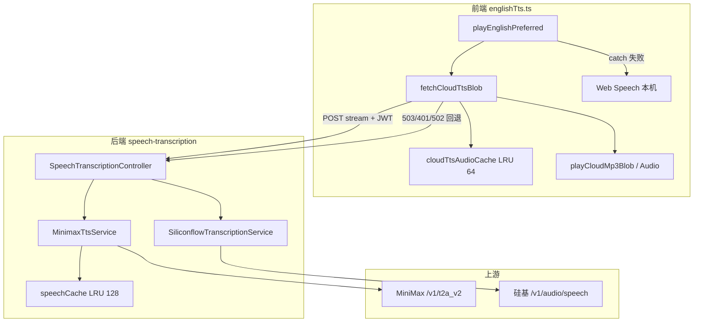
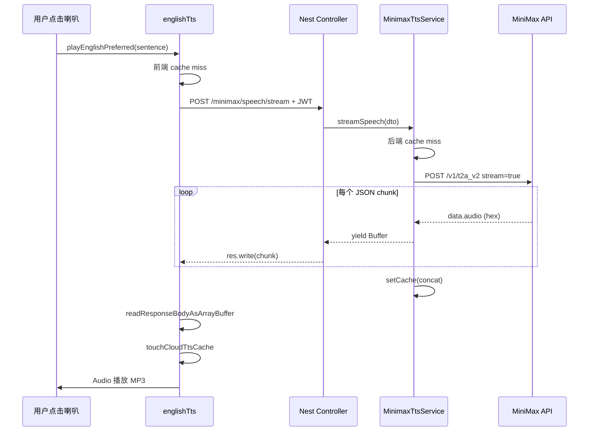

# MiniMax 云端流式 TTS 接入与硅基回退（完整实现说明）

> 播放世代、单词本机优先见 [`english-tts-playback.md`](./english-tts-playback.md)。  
> **端到端全景（非技术可读 + 逐行注释）**见 [`tts-end-to-end-guide.md`](./tts-end-to-end-guide.md)。  
> 前后端 MP3 LRU 缓存原理见 [`english-tts-cache-consistency.md`](./english-tts-cache-consistency.md)。  
> **设置页用户偏好**（账号级 DB、请求体合并、45 音色 UI）见 [`cloud-tts-settings.md`](./cloud-tts-settings.md) 与 [`cloud-tts-prefs-db.md`](./cloud-tts-prefs-db.md)。  
> 本专题 **§11** 从仓库源码自动生成「**每行代码上一行 // 注释**」的完整实现；与前文 §3–§10 规格对照阅读。

若与仓库最新源码不一致，**以源码为准**。

---

## 1. 背景与目标

### 1.1 问题陈述

| 维度     | 改前（仅硅基 CosyVoice2）                              | 改后（MiniMax 优先 + 硅基回退）                                     |
| -------- | ------------------------------------------------------ | ------------------------------------------------------------------- |
| 典型场景 | 经典句、长句、Agent 回复等 `preferLocal: false` 走云端 | 同上，但**第一跳**改为 MiniMax 流式                                 |
| 首包延迟 | 整段 MP3 合成完毕才返回，体感偏慢                      | 后端 `res.write` 逐块转发；网络层可更早收到首包（见 §8.3 前端现状） |
| 英文音质 | CosyVoice2 + claire 女声，带采样随机性                 | 默认 `speech-2.8-hd` + `English_radiant_girl`，偏自然英文朗读       |
| 同句重复 | 前后端 LRU 缓存（见姊妹专题）                          | **不变**；MiniMax 路径同样缓存                                      |
| 运维     | 仅需 `SILICONFLOW_API_KEY`                             | 可选配 `MINIMAX_API_KEY`；不配则行为与改前一致                      |

### 1.2 设计决策（逐条）

1. **模块归属 `speech-transcription`**  
   与硅基 ASR/TTS 同属「公共语音」能力，不耦合 `english-learning` 业务模块；Chat / Knowledge / 英语学习共用同一 HTTP 层。

2. **直接 HTTP 调 MiniMax，不用 LangChain Agent**  
   TTS 是低延迟二进制管道，无工具编排；Nest `MinimaxTtsService` + 原生 `fetch` 即可，故障面更小。

3. **提供流式 + 非流式两路由**  
   前端日常走 **stream**；非流式供调试、脚本或未来只需整段 Buffer 的调用方。

4. **环境变量只保留部署级默认值**  
   `MinimaxEnum` 仅 5 项：Key、Group Id、Base URL、默认 model、默认 voice。语速/采样率等由 **DTO 单次覆盖** 或 **代码硬默认**，避免 `.env` 膨胀。

5. **前端三级回退**  
   MiniMax 流式 →（503/401/502）硅基 `/speech` →（网络/其它失败）本机 Web Speech。

6. **错误码映射可预期**  
   MiniMax `1004` → HTTP 401；`1008` 余额不足等 → HTTP 502；未配 Key → HTTP 503；便于前端按状态码分支。

---

## 2. 架构总览

### 2.1 组件关系



### 2.2 全局 URL 与前缀

| 项              | 值                                                                          |
| --------------- | --------------------------------------------------------------------------- |
| Nest 全局前缀   | `api`（见 `apps/backend/src/main.ts`）                                      |
| Controller 前缀 | `speech-transcription`                                                      |
| 完整示例        | `POST http://localhost:9226/api/speech-transcription/minimax/speech/stream` |
| 鉴权            | 全 Controller `@UseGuards(JwtGuard)`，Header `Authorization: Bearer <JWT>`  |

### 2.3 改动文件清单

| 角色            | 路径                                                                                | 职责                                               |
| --------------- | ----------------------------------------------------------------------------------- | -------------------------------------------------- |
| 新增 Service    | `apps/backend/src/services/speech-transcription/minimax-tts.service.ts`             | MiniMax 请求、流解析、hex 解码、LRU                |
| 新增 DTO        | `apps/backend/src/services/speech-transcription/dto/minimax-tts.dto.ts`             | 请求体验证                                         |
| 扩展 Controller | `apps/backend/src/services/speech-transcription/speech-transcription.controller.ts` | 2 条 MiniMax 路由                                  |
| 扩展 Module     | `apps/backend/src/services/speech-transcription/speech-transcription.module.ts`     | 注册并 export `MinimaxTtsService`                  |
| 注册 App        | `apps/backend/src/app.module.ts`                                                    | `SpeechTranscriptionModule` 已在 imports           |
| 环境键 enum     | `apps/backend/src/enum/config.enum.ts`                                              | `MinimaxEnum` 5 项                                 |
| 前端 API 常量   | `apps/frontend/src/service/api.ts`                                                  | `SPEECH_MINIMAX_TTS_STREAM` / `SPEECH_MINIMAX_TTS` |
| 前端朗读        | `apps/frontend/src/utils/englishTts.ts`                                             | `fetchCloudTtsBlob` 优先 MiniMax                   |
| **未改**        | `siliconflow-transcription.service.ts`                                              | 硅基 ASR + TTS 仍独立                              |

---

## 3. HTTP 接口规格（逐路由）

### 3.1 `POST /api/speech-transcription/minimax/speech/stream`（主路径）

| 项           | 说明                                                                                                       |
| ------------ | ---------------------------------------------------------------------------------------------------------- |
| 用途         | 流式 TTS；前端 `fetchCloudTtsBlob` **默认调用此路由**                                                      |
| 鉴权         | JWT 必填                                                                                                   |
| Request Body | JSON，`MinimaxTtsDto`；前端仅 `{ "text": "..." }`                                                          |
| 成功响应     | HTTP 200，`Content-Type: audio/mpeg`（format=mp3 时），body 为 **原始 MP3 二进制分块**（chunked transfer） |
| 响应头       | `Cache-Control: no-store`、`X-Content-Type-Options: nosniff`                                               |
| 失败         | 见 §7；未写 body 前抛 Nest 异常；已 `write` 后 catch 内 `res.end()`                                        |

**控制器行为要点**（`@Res({ passthrough: false })` 手动写响应）：

1. `resolveOptions(body)` 规范化 text / 默认 model / voice。
2. 设置 status 200 与 Content-Type。
3. `for await (chunk of streamSpeech(body))` → `res.write(chunk)`。
4. 正常结束 `res.end()`；异常且 `headersSent` 则静默 end，避免半包 JSON 错误页。

### 3.2 `POST /api/speech-transcription/minimax/speech`（非流式）

| 项             | 说明                                                                      |
| -------------- | ------------------------------------------------------------------------- |
| 用途           | 一次性返回整段音频；Nest `StreamableFile`                                 |
| 鉴权           | JWT 必填                                                                  |
| Request Body   | 同 `MinimaxTtsDto`                                                        |
| 成功响应       | HTTP 200，单段二进制，`Content-Type` 由 `resolveContentType(format)` 决定 |
| 与 stream 差异 | `requestMiniMax(..., stream: false)`；响应体为**单个 JSON**（非 SSE 行）  |

### 3.3 `POST /api/speech-transcription/speech`（硅基回退）

| 项            | 说明                                               |
| ------------- | -------------------------------------------------- |
| 用途          | 前端在 MiniMax 503/401/502 时第二次请求            |
| Body          | `{ "text": "..." }`（简单对象，非 MinimaxTtsDto）  |
| 实现          | `SiliconflowTranscriptionService.synthesizeSpeech` |
| 默认模型/音色 | `FunAudioLLM/CosyVoice2-0.5B` + `:claire`          |
| 缓存          | 后端独立 LRU 256 条（键含 model+voice+text）       |

### 3.4 同模块其它路由（上下文）

| 路由                     | 说明                                    |
| ------------------------ | --------------------------------------- |
| `POST .../transcription` | 硅基 ASR，multipart `file`，与 TTS 无关 |

---

## 4. 环境变量与配置优先级

### 4.1 `MinimaxEnum` 全表

**来源**：`apps/backend/src/enum/config.enum.ts`（约 L175–L186）

| 枚举键                 | `.env` 变量名          | 必填                      | 默认值（代码）             | 作用                                                           |
| ---------------------- | ---------------------- | ------------------------- | -------------------------- | -------------------------------------------------------------- |
| `MINIMAX_API_KEY`      | `MINIMAX_API_KEY`      | **是**（要用 MiniMax 时） | 无                         | Bearer Token；缺失时 `resolveCredentials` 抛 **503**           |
| `MINIMAX_GROUP_ID`     | `MINIMAX_GROUP_ID`     | 视账号                    | 不传 Header                | 部分租户需在 Header 加 `Group-Id`                              |
| `MINIMAX_TTS_BASE_URL` | `MINIMAX_TTS_BASE_URL` | 否                        | `https://api.minimaxi.com` | 去尾 `/` 后拼 `/v1/t2a_v2`；备用 `https://api-bj.minimaxi.com` |
| `MINIMAX_TTS_MODEL`    | `MINIMAX_TTS_MODEL`    | 否                        | `speech-2.8-hd`            | 默认 T2A 模型                                                  |
| `MINIMAX_TTS_VOICE_ID` | `MINIMAX_TTS_VOICE_ID` | 否                        | `English_radiant_girl`     | 默认音色 ID                                                    |

**`.env` 示例**（勿提交真实 Key）：

```env
MINIMAX_API_KEY=your_key_here
MINIMAX_GROUP_ID=your_group_if_required
# MINIMAX_TTS_BASE_URL=https://api.minimaxi.com
# MINIMAX_TTS_MODEL=speech-2.8-hd
# MINIMAX_TTS_VOICE_ID=English_radiant_girl

SILICONFLOW_API_KEY=...   # MiniMax 回退时仍需
```

### 4.2 已移除的环境变量（勿再配置）

以下键已从 `MinimaxEnum` 删除，改由 **DTO 或代码默认**：

| 原 env 键                    | 现默认（`resolveOptions`） |
| ---------------------------- | -------------------------- |
| `MINIMAX_TTS_SPEED`          | `1`                        |
| `MINIMAX_TTS_VOL`            | `1`                        |
| `MINIMAX_TTS_PITCH`          | `0`                        |
| `MINIMAX_TTS_EMOTION`        | 仅 DTO `emotion`           |
| `MINIMAX_TTS_SAMPLE_RATE`    | `32000`                    |
| `MINIMAX_TTS_BITRATE`        | `128000`                   |
| `MINIMAX_TTS_FORMAT`         | `mp3`                      |
| `MINIMAX_TTS_CHANNEL`        | `1`                        |
| `MINIMAX_TTS_LANGUAGE_BOOST` | 仅 DTO `languageBoost`     |

### 4.3 参数解析优先级（`resolveOptions`）

对每一项 resolved 字段，优先级统一为：

```
DTO 字段（若提供）  →  环境变量（仅 model/voice/baseUrl/key/group）  →  代码常量
```

**文本特殊处理**：

- `dto.text.trim()` 后截断至 **10_000** 字符（`TTS_INPUT_MAX_CHARS`）。
- 空文本 → HTTP **400** `朗读文本为空`。

---

## 5. 请求 DTO 字段全表

**来源**：`apps/backend/src/services/speech-transcription/dto/minimax-tts.dto.ts`

| 字段                | 类型     | 校验                | 默认（未传时）                | 映射到 MiniMax JSON                |
| ------------------- | -------- | ------------------- | ----------------------------- | ---------------------------------- |
| `text`              | string   | 必填，max 10000     | —                             | `text`                             |
| `model`             | enum     | 见下表模型列表      | env 或 `speech-2.8-hd`        | `model`                            |
| `voiceId`           | string   | max 128             | env 或 `English_radiant_girl` | `voice_setting.voice_id`           |
| `speed`             | number   | 0.5–2               | `1`                           | `voice_setting.speed`              |
| `vol`               | number   | 0.01–10             | `1`                           | `voice_setting.vol`                |
| `pitch`             | int      | -12–12              | `0`                           | `voice_setting.pitch`              |
| `emotion`           | enum     | happy/sad/…/whisper | 不传                          | `voice_setting.emotion`            |
| `sampleRate`        | int      | 8000–44100          | `32000`                       | `audio_setting.sample_rate`        |
| `bitrate`           | int      | 32000–256000        | `128000`                      | `audio_setting.bitrate`            |
| `format`            | enum     | mp3/pcm/flac/…      | `mp3`                         | `audio_setting.format`             |
| `channel`           | 1 \| 2   | —                   | `1`                           | `audio_setting.channel`            |
| `languageBoost`     | string   | max 32              | 不传                          | `language_boost`                   |
| `subtitleEnable`    | boolean  | —                   | `false`                       | `subtitle_enable`                  |
| `pronunciationTone` | string[] | —                   | 不传                          | `pronunciation_dict.tone`          |
| `textNormalization` | boolean  | —                   | 不传                          | `voice_setting.text_normalization` |

**允许的 `model` 值**：`speech-2.8-hd`、`speech-2.8-turbo`、`speech-2.6-hd`、`speech-2.6-turbo`、`speech-02-hd`、`speech-02-turbo`、`speech-01-hd`、`speech-01-turbo`。

**前端现状**：默认 `enabled: false` 时仍只传 `{ text }`；用户在 **设置 → 云端朗读** 开启自定义后，会合并 model/voice/语速等字段（见 [`cloud-tts-settings.md`](./cloud-tts-settings.md)）。未开启时行为完全由 **服务端 env + 上表默认值** 决定。

---

## 6. MiniMax 上游协议（逐字段）

### 6.1 请求 URL 与 Header

**来源**：`minimax-tts.service.ts`（`requestMiniMax` / `buildHeaders`）

```
POST {baseUrl}/v1/t2a_v2
Authorization: Bearer {MINIMAX_API_KEY}
Content-Type: application/json
Group-Id: {MINIMAX_GROUP_ID}   // 仅当 env 配置了 groupId
```

### 6.2 请求 JSON 结构（`buildRequestBody`）

**来源**：`minimax-tts.service.ts`（约 L140–L180）

```typescript
{
  model: resolved.model,
  text: resolved.text,
  stream: true | false,
  voice_setting: {
    voice_id, speed, vol, pitch,
    emotion?,              // 可选
    text_normalization?,   // 可选
  },
  audio_setting: {
    sample_rate, bitrate, format, channel,
  },
  subtitle_enable: false,
  stream_options?: { exclude_aggregated_audio: true },  // 仅 stream=true
  language_boost?,           // 可选
  pronunciation_dict?: { tone: string[] },  // 可选
}
```

**`exclude_aggregated_audio: true` 含义**：流式模式下不要最后再发一整段聚合音频，只要增量 chunk，便于边收边转发。

### 6.3 响应形态

#### 非流式

- HTTP body 为**单个 JSON 字符串**（`res.text()` 后 `JSON.parse`）。
- 可能是单个对象或对象数组。
- 音频在 `data.audio`：**hex 编码**字符串，需 `Buffer.from(hex, 'hex')`。

#### 流式

- HTTP body 为 **ReadableStream**，内容为多行文本。
- 每行可能是：
  - SSE 风格：`data: {"data":{...},"base_resp":{...}}`
  - 裸 JSON 行
  - `data: [DONE]` / `[DONE]` → 跳过
- 解析器：`iterateMiniMaxStream` 按 `\n` 切行缓冲；`parseStreamPayloadLines` 逐行 JSON.parse。

### 6.4 业务状态码（`base_resp.status_code`）

**来源**：`assertMiniMaxOk`

| MiniMax code | 含义（常见）                  | 映射 HTTP | 前端是否回退硅基 |
| ------------ | ----------------------------- | --------- | ---------------- |
| `0` 或缺失   | 成功                          | —         | —                |
| `1004`       | 鉴权/Key 无效                 | **401**   | **是**           |
| `1008`       | insufficient balance 余额不足 | **502**   | **是**           |
| 其它非 0     | 各类业务错误                  | **502**   | **是**           |

消息体示例：`MiniMax 流式语音合成（1008）：insufficient balance`

### 6.5 Content-Type 映射（`resolveContentType`）

| format             | Content-Type               |
| ------------------ | -------------------------- |
| `mp3`              | `audio/mpeg`               |
| `wav` / `pcmu_wav` | `audio/wav`                |
| `flac`             | `audio/flac`               |
| `opus`             | `audio/opus`               |
| `pcm` / `pcmu_raw` | `audio/pcm`                |
| 其它               | `application/octet-stream` |

---

## 7. 后端 Service 方法逐项说明

### 7.1 凭证：`resolveCredentials`

1. 读 `MINIMAX_API_KEY`；空 → `HttpException` **503** + 文案「未配置 MINIMAX_API_KEY…」。
2. `MINIMAX_TTS_BASE_URL` trim 并去尾 `/`，缺省 `https://api.minimaxi.com`。
3. 可选 `MINIMAX_GROUP_ID` 供 Header。

### 7.2 缓存键：`buildCacheKey`

用 `\u0001` 连接 12 段，顺序固定：

```
model, voiceId, speed, vol, pitch, emotion,
sampleRate, bitrate, format, channel, languageBoost, text
```

**含义**：同一朗读参数 + 同一文本 → 同一缓存条目；改任一参数会 miss。

### 7.3 LRU：`getFromCache` / `setCache`

| 项       | 值                                                                 |
| -------- | ------------------------------------------------------------------ |
| 结构     | `Map<string, Buffer>`                                              |
| 上限     | **128**（`TTS_SPEECH_CACHE_MAX`）                                  |
| 策略     | get 时 delete+set 移到末尾；超限删 `keys().next()`（最旧）         |
| 流式命中 | `streamSpeech` 若 hit，**一次 yield 整段 Buffer**（非逐块 replay） |

### 7.4 非流式：`synthesizeSpeech`

1. resolve → cache lookup → miss 则 `requestMiniMax(resolved, false)`。
2. HTTP 非 2xx：抛异常，status 沿用上游 4xx/5xx 或 502。
3. 解析 JSON → 对每个 chunk `assertMiniMaxOk` → hex 解码 → concat。
4. 无音频 → 502「未返回音频」。
5. 写入 cache 并返回 Buffer。

### 7.5 流式：`streamSpeech`（AsyncGenerator）

1. resolve → cache lookup → hit 则 `yield cached; return`。
2. `requestMiniMax(resolved, true)`；HTTP 非 2xx 读 body 前 500 字抛异常。
3. `iterateMiniMaxStream(res.body)` 逐 JSON chunk：
   - `assertMiniMaxOk`
   - `decodeHexAudio`；非法 hex 长度 warn 并 skip
   - 有音频则 `yield` 并 push 到 `parts`
4. 流结束若有 `parts`，`setCache(concat(parts))`。

### 7.6 流解析：`iterateMiniMaxStream`

- 使用 `TextDecoder` **stream: true** 处理 UTF-8 多字节截断。
- 仅在 pending 中出现 `\n` 时切分已完整行，剩余留 pending。
- EOF 后 flush pending。
- `finally` 中 `reader.releaseLock()`。

### 7.7 hex 解码：`decodeHexAudio`

- trim 后空 → null。
- 长度奇数 → warn，null（跳过该 chunk）。
- 正常 → `Buffer.from(cleaned, 'hex')`。

---

## 8. 前端朗读链路（逐步）

### 8.1 入口：`playEnglishPreferred`

**来源**：`apps/frontend/src/utils/englishTts.ts`（约 L606–L637）

| 步骤 | 条件                | 行为                                     |
| ---- | ------------------- | ---------------------------------------- |
| 1    | 任意                | `stripMarkdownForTts` 去 Markdown        |
| 2    | `preferLocal: true` | **仅本机** Web Speech；不支持 → `NO_TTS` |
| 3    | 默认                | `fetchCloudTtsBlob` → `playCloudMp3Blob` |
| 4    | 云端 catch          | 回退本机 Web Speech（与改前一致）        |

**谁用云端**：经典句、长文本、`preferLocal: false`（默认）。  
**谁用本机**：单词列表等 `preferLocal: true`（**不经过 MiniMax**）。

### 8.2 云端拉取：`fetchCloudTtsBlob`

**来源**：约 L423–L461

| 步骤 | 说明                                                                 |
| ---- | -------------------------------------------------------------------- |
| 1    | `getCloudTtsFromCache(plain)`：key 为**规范化纯文本**，LRU **64** 条 |
| 2    | `readToken()`：无 token → `NO_TOKEN`                                 |
| 3    | `platformFetch(BASE_URL + SPEECH_MINIMAX_TTS_STREAM, { text })`      |
| 4    | 若 status ∈ **503, 401, 502** → 再请求 `SPEECH_TTS`（硅基）          |
| 5    | `!res.ok` → `throw TTS_HTTP_${status}`                               |
| 6    | `readResponseBodyAsArrayBuffer(res)` 读**完整** body                 |
| 7    | `touchCloudTtsCache(plain, buf)` → 返回 `Blob audio/mpeg`            |

**回退触发条件明细**：

| HTTP | 典型原因                                             |
| ---- | ---------------------------------------------------- |
| 503  | 未配置 `MINIMAX_API_KEY`                             |
| 401  | MiniMax 1004 / JWT 无效（后者较少，因先过 JwtGuard） |
| 502  | 1008 余额不足、其它 MiniMax 业务错误、网关错误       |

**未回退的情况**：400（文本空）、404（路由未加载）、网络错误 → 进入 `playEnglishPreferred` 的 catch → 本机朗读。

### 8.3 流式「首包快」与前端现状

| 层级                                 | 行为                                                                                         |
| ------------------------------------ | -------------------------------------------------------------------------------------------- |
| 后端 → 客户端                        | HTTP chunked，MiniMax 有 chunk 就 `res.write`                                                |
| 前端 `readResponseBodyAsArrayBuffer` | **读完整个 Response body** 才播放                                                            |
| 结论                                 | 网络传输可流式，但**播放仍等整段 MP3 收齐**；真正边下边播需改 `playCloudMp3Blob`（后续优化） |

### 8.4 播放世代 `playbackGeneration`

- 每次 `beginPlaybackSession()` 递增；新点击会作废上一轮。
- `fetchCloudTtsBlob` 返回后若 generation 已变，丢弃 blob 不播。
- 与 MiniMax 无直接关系，但防止快速连点叠音（见 `english-tts-playback.md`）。

### 8.5 前端缓存 vs 后端缓存

| 对比项     | 前端 `cloudTtsAudioCache`                                                        | 后端 `speechCache`             |
| ---------- | -------------------------------------------------------------------------------- | ------------------------------ |
| 容量       | 64                                                                               | 128                            |
| Key        | **仅 plain 文本**                                                                | model+voice+参数+text          |
| 命中效果   | 跳过一切 HTTP                                                                    | 跳过 MiniMax API               |
| 风险       | 服务端改默认音色后，同句仍播旧 MP3 直到 LRU 淘汰                                 | 同参数同句一致                 |
| 与回退关系 | 若首次走 MiniMax 成功并缓存，后续不再请求；若首次 502 回退硅基，缓存的是硅基 MP3 | MiniMax / 硅基各管各的 Service |

---

## 9. 端到端时序（成功路径）



**回退路径**：MiniMax 返回 502 → 前端再 `POST /speech` → 硅基 CosyVoice2 → 同样缓存到前端（key 仍为 plain text）。

---

## 10. 模块注册与依赖

**来源**：`speech-transcription.module.ts`

```typescript
@Module({
  controllers: [SpeechTranscriptionController],
  providers: [SiliconflowTranscriptionService, MinimaxTtsService],
  exports: [SiliconflowTranscriptionService, MinimaxTtsService],
})
```

- 其它模块可 `imports: [SpeechTranscriptionModule]` 后注入 `MinimaxTtsService` 直接合成，无需走 HTTP。
- 当前英语学习仅通过 HTTP + `englishTts.ts` 调用。

---

## 11. 逐点实现代码（每行上方注释）

> **阅读约定**：代码块内每一行**可执行/声明代码**的**上一行**均有 `//` 中文注释；空白行与原有 `/** */` 块注释不重复标注。  
> 代码与仓库源码一致，注释为文档讲解版。

---

### 11.1 MinimaxEnum

**来源**：`apps/backend/src/enum/config.enum.ts`（约 L175–L186）

```typescript
/** MiniMax T2A 语音合成（speech-transcription/minimax/*） */
// MiniMax 环境变量键枚举
export enum MinimaxEnum {
	// env：MiniMax Bearer API Key
	MINIMAX_API_KEY = "MINIMAX_API_KEY",
	/** 部分账号需在 Header 传 Group-Id */
	// env：部分账号必填 Header Group-Id
	MINIMAX_GROUP_ID = "MINIMAX_GROUP_ID",
	/** API 根路径，默认 https://api.minimaxi.com；备用 https://api-bj.minimaxi.com */
	// env：API 根 URL，默认 api.minimaxi.com
	MINIMAX_TTS_BASE_URL = "MINIMAX_TTS_BASE_URL",
	/** 默认 speech-2.8-hd */
	// env：默认 T2A 模型
	MINIMAX_TTS_MODEL = "MINIMAX_TTS_MODEL",
	/** 默认 English_radiant_girl */
	// env：默认音色 ID
	MINIMAX_TTS_VOICE_ID = "MINIMAX_TTS_VOICE_ID",
	// 闭合括号或语句结束
}
```

### 11.2 MinimaxTtsDto

**来源**：`apps/backend/src/services/speech-transcription/dto/minimax-tts.dto.ts`（全文）

```typescript
// 导入依赖
import {
	// 导入：数组校验装饰器
	IsArray,
	// 导入：布尔校验装饰器
	IsBoolean,
	// 导入：枚举白名单校验装饰器
	IsIn,
	// 导入：整数校验装饰器
	IsInt,
	// 导入：非空校验装饰器
	IsNotEmpty,
	// 导入：数字校验装饰器
	IsNumber,
	// 导入：可选字段装饰器
	IsOptional,
	// 导入：字符串校验装饰器
	IsString,
	// 导入：最大值校验装饰器
	Max,
	// 导入：最大长度校验装饰器
	MaxLength,
	// 导入：最小值校验装饰器
	Min,
	// 从 class-validator 导入校验装饰器
} from "class-validator";

// DTO 允许的 model 白名单
const MINIMAX_TTS_MODELS = [
	// 硬编码默认模型
	"speech-2.8-hd",
	// 白名单：Turbo 低延迟模型 2.8
	"speech-2.8-turbo",
	// 白名单：HD 模型 2.6
	"speech-2.6-hd",
	// 白名单：Turbo 模型 2.6
	"speech-2.6-turbo",
	// 白名单：HD 模型 02 系列
	"speech-02-hd",
	// 白名单：Turbo 模型 02 系列
	"speech-02-turbo",
	// 白名单：HD 模型 01 系列
	"speech-01-hd",
	// 白名单：Turbo 模型 01 系列
	"speech-01-turbo",
	// 执行语句（见上下文）
] as const;

// DTO 允许的 format 白名单
const MINIMAX_AUDIO_FORMATS = [
	// 白名单：MP3 容器
	"mp3",
	// 白名单：原始 PCM
	"pcm",
	// 白名单：FLAC 无损
	"flac",
	// 白名单：WAV
	"wav",
	// 执行语句（见上下文）
	"pcmu_raw",
	// 执行语句（见上下文）
	"pcmu_wav",
	// 执行语句（见上下文）
	"opus",
	// 执行语句（见上下文）
] as const;

// DTO 允许的 emotion 白名单
const MINIMAX_EMOTIONS = [
	// 白名单：happy 情感
	"happy",
	// 执行语句（见上下文）
	"sad",
	// 执行语句（见上下文）
	"angry",
	// 执行语句（见上下文）
	"fearful",
	// 执行语句（见上下文）
	"disgusted",
	// 执行语句（见上下文）
	"surprised",
	// 白名单：calm 情感
	"calm",
	// 白名单：fluent 情感
	"fluent",
	// 执行语句（见上下文）
	"whisper",
	// 执行语句（见上下文）
] as const;

/** MiniMax T2A v2 请求体（环境变量为默认，DTO 字段可覆盖） */
// HTTP JSON Body 校验类
export class MinimaxTtsDto {
	// 校验：字符串类型
	@IsString()
	// 校验：非空
	@IsNotEmpty()
	// 校验：最大 10000 字符
	@MaxLength(10_000)
	// 必填字段：朗读 text
	text!: string;

	// 校验：字段可选
	@IsOptional()
	// 校验：枚举白名单
	@IsIn(MINIMAX_TTS_MODELS)
	// 可选：覆盖 model
	model?: (typeof MINIMAX_TTS_MODELS)[number];

	// 校验：字段可选
	@IsOptional()
	// 校验：字符串类型
	@IsString()
	// 执行语句（见上下文）
	@MaxLength(128)
	// 可选：覆盖 voiceId
	voiceId?: string;

	// 校验：字段可选
	@IsOptional()
	// 校验：数字
	@IsNumber()
	// 校验：数值下限
	@Min(0.5)
	// 校验：数值上限
	@Max(2)
	// 执行语句（见上下文）
	speed?: number;

	// 校验：字段可选
	@IsOptional()
	// 校验：数字
	@IsNumber()
	// 校验：数值下限
	@Min(0.01)
	// 校验：数值上限
	@Max(10)
	// 执行语句（见上下文）
	vol?: number;

	// 校验：字段可选
	@IsOptional()
	// 校验：整数
	@IsInt()
	// 校验：数值下限
	@Min(-12)
	// 校验：数值上限
	@Max(12)
	// 执行语句（见上下文）
	pitch?: number;

	// 校验：字段可选
	@IsOptional()
	// 校验：枚举白名单
	@IsIn(MINIMAX_EMOTIONS)
	// 执行语句（见上下文）
	emotion?: (typeof MINIMAX_EMOTIONS)[number];

	// 校验：字段可选
	@IsOptional()
	// 校验：整数
	@IsInt()
	// 校验：数值下限
	@Min(8000)
	// 校验：数值上限
	@Max(44100)
	// 执行语句（见上下文）
	sampleRate?: number;

	// 校验：字段可选
	@IsOptional()
	// 校验：整数
	@IsInt()
	// 校验：数值下限
	@Min(32000)
	// 校验：数值上限
	@Max(256000)
	// 执行语句（见上下文）
	bitrate?: number;

	// 校验：字段可选
	@IsOptional()
	// 校验：枚举白名单
	@IsIn(MINIMAX_AUDIO_FORMATS)
	// 执行语句（见上下文）
	format?: (typeof MINIMAX_AUDIO_FORMATS)[number];

	// 校验：字段可选
	@IsOptional()
	// 校验：整数
	@IsInt()
	// 校验：枚举白名单
	@IsIn([1, 2])
	// 执行语句（见上下文）
	channel?: number;

	// 校验：字段可选
	@IsOptional()
	// 校验：字符串类型
	@IsString()
	// 执行语句（见上下文）
	@MaxLength(32)
	// 执行语句（见上下文）
	languageBoost?: string;

	// 校验：字段可选
	@IsOptional()
	// 校验：布尔
	@IsBoolean()
	// 执行语句（见上下文）
	subtitleEnable?: boolean;

	// 校验：字段可选
	@IsOptional()
	// 校验：数组
	@IsArray()
	// 执行语句（见上下文）
	@IsString({ each: true })
	// 执行语句（见上下文）
	pronunciationTone?: string[];

	// 校验：字段可选
	@IsOptional()
	// 校验：布尔
	@IsBoolean()
	// 执行语句（见上下文）
	textNormalization?: boolean;
	// 闭合括号或语句结束
}
```

### 11.3 MinimaxTtsService 完整

**来源**：`apps/backend/src/services/speech-transcription/minimax-tts.service.ts`（全文）

```typescript
// 导入依赖
import { HttpException, HttpStatus, Injectable, Logger } from "@nestjs/common";
// 导入依赖
import { ConfigService } from "@nestjs/config";
// 导入依赖
import { MinimaxEnum } from "../../enum/config.enum";
// 导入依赖
import type { MinimaxTtsDto } from "./dto/minimax-tts.dto";

// 朗读文本最大字符数，与 DTO @MaxLength(10000) 一致
const TTS_INPUT_MAX_CHARS = 10_000;
// 后端进程内 MP3 LRU 缓存条数上限
const TTS_SPEECH_CACHE_MAX = 128;

/**
 * MiniMaxTtsResolved
 * 解析后的 TTS 请求参数对象。
 * 该类型汇总了前端传入 DTO 字段、环境变量默认值，以及后端硬编码的最终参数，
 * 用于 MiniMax T2A 语音合成 API 的请求构建（包含完整合成参数，便于准确生成缓存 key）。
 *
 * 字段含义详解：
 * @property text                经过 trim 和最大长度裁剪的朗读文本，直接用于 TTS
 * @property model               MiniMax 语音合成模型，如 'speech-2.8-hd'
 * @property voiceId             MiniMax 语音人声 ID，如 'English_radiant_girl'
 * @property speed               语速，浮点数，1 为标准语速
 * @property vol                 音量，浮点数，1 为标准音量
 * @property pitch               音高，数字，0 为标准音高，正负变化升降调
 * @property emotion             （可选）情感标签，部分模型支持，传递给 MiniMax
 * @property sampleRate          采样率，整数（如 32000），音频质量相关
 * @property bitrate             比特率，整数（如 128000），音频文件体积和码率
 * @property format              返回音频格式，如 'mp3'、'wav'
 * @property channel             声道数，1 单声道 2 双声道
 * @property languageBoost       （可选）提升某语言发音表现，如 'english'
 * @property subtitleEnable      是否输出时间轴字幕，布尔值
 * @property pronunciationTone   （可选）发音字典 tone 针对自定义读音优化，字符串数组
 * @property textNormalization   （可选）输入文本是否自动标准化（如数字转英文读音），布尔
 */
// 合并 DTO/env/默认值后的最终合成参数
type MinimaxTtsResolved = {
	// 执行语句（见上下文）
	text: string; // 待朗读文本（已 trim 并截断）
	// 执行语句（见上下文）
	model: string; // 合成模型 ID
	// 执行语句（见上下文）
	voiceId: string; // 发声人 ID
	// 执行语句（见上下文）
	speed: number; // 语速
	// 执行语句（见上下文）
	vol: number; // 音量
	// 执行语句（见上下文）
	pitch: number; // 音高
	// 执行语句（见上下文）
	emotion?: string; // （可选）情感标签
	// 执行语句（见上下文）
	sampleRate: number; // 采样率（Hz）
	// 执行语句（见上下文）
	bitrate: number; // 比特率（bps）
	// 执行语句（见上下文）
	format: string; // 输出音频格式
	// 执行语句（见上下文）
	channel: number; // 声道数（1/2）
	// 执行语句（见上下文）
	languageBoost?: string; // （可选）提升特定语言表现
	// 执行语句（见上下文）
	subtitleEnable: boolean; // 是否输出时间轴字幕
	// 执行语句（见上下文）
	pronunciationTone?: string[]; // （可选）自定义发音字典 tone
	// 执行语句（见上下文）
	textNormalization?: boolean; // （可选）自动文本标准化
	// 闭合括号或语句结束
};

// MiniMax 单次 JSON chunk 结构（hex 音频）
type MinimaxT2aChunk = {
	// 执行语句（见上下文）
	data?: {
		// 执行语句（见上下文）
		audio?: string;
		// 执行语句（见上下文）
		status?: number;
		// 闭合括号或语句结束
	};
	// 执行语句（见上下文）
	base_resp?: {
		// 执行语句（见上下文）
		status_code?: number;
		// 执行语句（见上下文）
		status_msg?: string;
		// 闭合括号或语句结束
	};
	// 闭合括号或语句结束
};

/**
 * MiniMax 同步/流式 T2A（speech-2.8-hd 等）。
 * @see https://platform.minimaxi.com/docs/api-reference/speech-t2a-http
 *
 * 说明：TTS 为低延迟二进制流，直接 HTTP 转发 MiniMax `/v1/t2a_v2`；
 * 不使用 LangChain createAgent（Agent 适用于 LLM 工具编排，不适合点击即播的 TTS 管道）。
 */
// 声明为 Nest 可注入 Service
@Injectable()
// MiniMax T2A 合成服务类
export class MinimaxTtsService {
	// 日志实例，标记当前服务名
	// Nest 内置日志器
	private readonly logger = new Logger(MinimaxTtsService.name);

	// 简单 LRU（最近最少使用）缓存，缓存的 key 为参数组合，value 为 Buffer 音频
	// Map 缓存：cacheKey → MP3 Buffer
	private readonly speechCache = new Map<string, Buffer>();

	/**
	 * @param config 注入的配置服务
	 */
	// 注入 ConfigService 读 .env
	constructor(private readonly config: ConfigService) {}

	/**
	 * 获取并裁剪环境变量值
	 * @param key 环境变量 Key
	 * @returns 去除首尾空白后的字符串（如无内容返回 undefined）
	 */
	// 读取 env 字符串；空白视为未配置
	private trimEnv(key: string): string | undefined {
		// 从 ConfigService 取原始值
		const raw = this.config.get<string>(key);
		// null/undefined 视为未配置
		if (raw == null) return undefined;
		// 转字符串并去首尾空白
		const trimmed = String(raw).trim();
		// 空字符串视为未配置
		return trimmed.length > 0 ? trimmed : undefined;
		// 闭合括号或语句结束
	}

	/**
	 * 解析 MiniMax TTS 调用所需的认证信息
	 * @returns 对象包含 apiKey, groupId, baseUrl
	 */
	// 解析 Key/Group/BaseURL；无 Key 抛 503
	private resolveCredentials(): {
		apiKey: string;
		groupId?: string;
		baseUrl: string;
	} {
		// 读取 MINIMAX_API_KEY
		const apiKey = this.trimEnv(MinimaxEnum.MINIMAX_API_KEY);
		// 未配置 Key：前端将收到 503 并回退硅基
		if (!apiKey) {
			// 抛出 Nest HTTP 异常
			throw new HttpException(
				// 503 错误文案
				"未配置 MINIMAX_API_KEY，无法进行 MiniMax 语音合成",
				// HTTP 503 Service Unavailable
				HttpStatus.SERVICE_UNAVAILABLE,
				// 闭合括号或语句结束
			);
			// 闭合括号或语句结束
		}
		// 解析 API 根 URL 并去尾斜杠
		const baseUrl =
			this.trimEnv(MinimaxEnum.MINIMAX_TTS_BASE_URL)?.replace(/\/$/, "") ??
			"https://api.minimaxi.com";
		// 返回给调用方
		return {
			// 执行语句（见上下文）
			apiKey,
			// 可选 Group-Id
			groupId: this.trimEnv(MinimaxEnum.MINIMAX_GROUP_ID),
			// 执行语句（见上下文）
			baseUrl,
			// 闭合括号或语句结束
		};
		// 闭合括号或语句结束
	}

	/**
	 * 对外数据传输对象参数标准化、裁剪、填默认
	 * @param dto
	 * @returns MinimaxTtsResolved
	 */
	// 公开：合并 DTO/env/默认值为 MinimaxTtsResolved
	resolveOptions(dto: MinimaxTtsDto): MinimaxTtsResolved {
		// trim 并截断至最大长度
		const plain = dto.text.trim().slice(0, TTS_INPUT_MAX_CHARS);
		// 条件判断
		if (!plain) {
			// 抛出异常中断流程
			throw new HttpException("朗读文本为空", HttpStatus.BAD_REQUEST);
			// 闭合括号或语句结束
		}
		// 返回给调用方
		return {
			// 执行语句（见上下文）
			text: plain,
			// 对象属性键
			model:
				// DTO model 优先于 env
				dto.model?.trim() ||
				// 执行语句（见上下文）
				(this.trimEnv(MinimaxEnum.MINIMAX_TTS_MODEL) ?? "speech-2.8-hd"),
			// 对象属性键
			voiceId:
				// 执行语句（见上下文）
				dto.voiceId?.trim() ||
				// 执行语句（见上下文）
				(this.trimEnv(MinimaxEnum.MINIMAX_TTS_VOICE_ID) ??
					"English_radiant_girl"),
			// 执行语句（见上下文）
			speed: dto.speed ?? 1,
			// 执行语句（见上下文）
			vol: dto.vol ?? 1,
			// 执行语句（见上下文）
			pitch: dto.pitch ?? 0,
			// 执行语句（见上下文）
			emotion: dto.emotion,
			// 执行语句（见上下文）
			sampleRate: dto.sampleRate ?? 32_000,
			// 执行语句（见上下文）
			bitrate: dto.bitrate ?? 128_000,
			// 执行语句（见上下文）
			format: dto.format?.trim() || "mp3",
			// 执行语句（见上下文）
			channel: dto.channel ?? 1,
			// 执行语句（见上下文）
			languageBoost: dto.languageBoost?.trim(),
			// 执行语句（见上下文）
			subtitleEnable: dto.subtitleEnable ?? false,
			// 执行语句（见上下文）
			pronunciationTone: dto.pronunciationTone,
			// 执行语句（见上下文）
			textNormalization: dto.textNormalization,
			// 闭合括号或语句结束
		};
		// 闭合括号或语句结束
	}

	/**
	 * 根据 TTS 参数生成可唯一标识缓存的 key（全拼连接）
	 * @param resolved TTS 参数
	 */
	// 12 段参数+文本拼 cacheKey（\u0001 分隔）
	private buildCacheKey(resolved: MinimaxTtsResolved): string {
		// 返回给调用方
		return [
			// cacheKey 段：model
			resolved.model,
			// cacheKey 段：voiceId
			resolved.voiceId,
			// cacheKey 段：speed
			String(resolved.speed),
			// 执行语句（见上下文）
			String(resolved.vol),
			// 执行语句（见上下文）
			String(resolved.pitch),
			// cacheKey 段：emotion（空串占位）
			resolved.emotion ?? "",
			// 执行语句（见上下文）
			String(resolved.sampleRate),
			// 执行语句（见上下文）
			String(resolved.bitrate),
			// 执行语句（见上下文）
			resolved.format,
			// 执行语句（见上下文）
			String(resolved.channel),
			// 执行语句（见上下文）
			resolved.languageBoost ?? "",
			// cacheKey 段：朗读文本
			resolved.text,
			// 执行语句（见上下文）
		].join("\u0001"); // 使用不可打印分隔符避免歧义
		// 闭合括号或语句结束
	}

	/**
	 * 从 LRU 缓存获取音频，如果命中则把项移动到 Map 尾部（最近使用）
	 * @param key 缓存 key
	 * @returns 音频 Buffer 或 null
	 */
	// LRU 读：命中则移到 Map 末尾
	private getFromCache(key: string): Buffer | null {
		// 按 key 查缓存
		const hit = this.speechCache.get(key);
		// 未命中返回 null
		if (!hit) return null;
		// 先删除再 set，起到 LRU 作用
		// 删除旧位置（LRU 技巧）
		this.speechCache.delete(key);
		// 插入到 Map 末尾=最近使用
		this.speechCache.set(key, hit);
		// 返回给调用方
		return hit;
		// 闭合括号或语句结束
	}

	/**
	 * 设置缓存，并维持 LRU 缓存最大长度
	 * @param key
	 * @param buffer
	 */
	// LRU 写：超限删最旧 key
	private setCache(key: string, buffer: Buffer): void {
		// 条件判断
		if (this.speechCache.has(key)) {
			// 删除旧位置（LRU 技巧）
			this.speechCache.delete(key);
			// 闭合括号或语句结束
		}
		// 执行语句（见上下文）
		this.speechCache.set(key, buffer);
		// 缓存满则淘汰
		while (this.speechCache.size > TTS_SPEECH_CACHE_MAX) {
			// Map 首 key=最久未用
			const oldest = this.speechCache.keys().next().value;
			// 条件判断
			if (oldest === undefined) break;
			// 执行语句（见上下文）
			this.speechCache.delete(oldest);
			// 闭合括号或语句结束
		}
		// 闭合括号或语句结束
	}

	/**
	 * 构造 MiniMax TTS 请求体
	 * @param resolved 结构化参数
	 * @param stream 是否流式
	 * @returns 请求体对象
	 */
	// 构造 POST /v1/t2a_v2 JSON body
	private buildRequestBody(
		// 执行语句（见上下文）
		resolved: MinimaxTtsResolved,
		// 执行语句（见上下文）
		stream: boolean,
		// 执行语句（见上下文）
	): Record<string, unknown> {
		// MiniMax voice_setting 对象
		const voiceSetting: Record<string, unknown> = {
			// 映射 voice_id
			voice_id: resolved.voiceId, // 发音人
			// 执行语句（见上下文）
			speed: resolved.speed, // 语速
			// 执行语句（见上下文）
			vol: resolved.vol, // 音量
			// 执行语句（见上下文）
			pitch: resolved.pitch, // 音高
			// 闭合括号或语句结束
		};
		// 可选情感、标准化
		// 有 emotion 才写入 voice_setting
		if (resolved.emotion) {
			// 设置情感
			voiceSetting.emotion = resolved.emotion;
			// 闭合括号或语句结束
		}
		// 条件判断
		if (resolved.textNormalization != null) {
			// 设置文本归一化开关
			voiceSetting.text_normalization = resolved.textNormalization;
			// 闭合括号或语句结束
		}

		// 顶层请求体对象
		const body: Record<string, unknown> = {
			// 执行语句（见上下文）
			model: resolved.model, // 合成模型
			// 执行语句（见上下文）
			text: resolved.text, // 文本
			// 是否流式：true=SSE 行；false=单 JSON
			stream, // 是否流式
			// 嵌套 voice_setting
			voice_setting: voiceSetting, // 发音人设置
			// 嵌套 audio_setting
			audio_setting: {
				// 音频参数
				// 采样率字段名 snake_case
				sample_rate: resolved.sampleRate,
				// 执行语句（见上下文）
				bitrate: resolved.bitrate,
				// 执行语句（见上下文）
				format: resolved.format,
				// 执行语句（见上下文）
				channel: resolved.channel,
				// 闭合括号或语句结束
			},
			// 字幕开关
			subtitle_enable: resolved.subtitleEnable, // 是否输出时间轴字幕
			// 闭合括号或语句结束
		};

		// 流式参数（排除聚合流音频）
		// 流式专用选项
		if (stream) {
			// 不要最后再发整段聚合音频
			body.stream_options = { exclude_aggregated_audio: true };
			// 闭合括号或语句结束
		}
		// 可选语言增强参数
		// 条件判断
		if (resolved.languageBoost) {
			// 语言增强字段
			body.language_boost = resolved.languageBoost;
			// 闭合括号或语句结束
		}
		// 可选自定义读音（tone）
		// 条件判断
		if (resolved.pronunciationTone?.length) {
			// 发音词典
			body.pronunciation_dict = { tone: resolved.pronunciationTone };
			// 闭合括号或语句结束
		}
		// 返回给调用方
		return body;
		// 闭合括号或语句结束
	}

	/**
	 * 构造 MiniMax 请求所需 header
	 * @param apiKey
	 * @param groupId
	 * @returns header 对象
	 */
	// 构造 MiniMax HTTP 请求头
	private buildHeaders(
		apiKey: string,
		groupId?: string,
	): Record<string, string> {
		// 执行语句（见上下文）
		const headers: Record<string, string> = {
			// MiniMax Bearer 鉴权
			Authorization: `Bearer ${apiKey}`, // 认证
			// JSON 请求体
			"Content-Type": "application/json",
			// 闭合括号或语句结束
		};
		// groupId 有则追加
		// 条件判断
		if (groupId) {
			// 企业账号 Group-Id Header
			headers["Group-Id"] = groupId;
			// 闭合括号或语句结束
		}
		// 返回给调用方
		return headers;
		// 闭合括号或语句结束
	}

	/**
	 * 检查 MiniMax 返回 chunk 是否正常，否则抛错
	 * @param chunk 返回切片
	 * @param context 上下文说明
	 */
	// 检查 chunk.base_resp.status_code
	private assertMiniMaxOk(chunk: MinimaxT2aChunk, context: string): void {
		// 取业务状态码
		const code = chunk.base_resp?.status_code;
		// 成功则直接返回
		if (code == null || code === 0) return; // 0 正常
		// 执行语句（见上下文）
		const msg = chunk.base_resp?.status_msg?.trim() || "MiniMax T2A 错误";
		// 抛出 Nest HTTP 异常
		throw new HttpException(
			// 执行语句（见上下文）
			`${context}（${code}）：${msg}`,
			// 1004→401；其它→502
			code === 1004 ? HttpStatus.UNAUTHORIZED : HttpStatus.BAD_GATEWAY,
			// 闭合括号或语句结束
		);
		// 闭合括号或语句结束
	}

	/**
	 * 解码 hex 格式的音频片段为 Buffer
	 * @param hex 字符串形式的 16 进制音频
	 * @returns Audio Buffer | null
	 */
	// hex 字符串 → Buffer
	private decodeHexAudio(hex: string | undefined): Buffer | null {
		// trim hex 输入
		const cleaned = hex?.trim();
		// 无音频 hex 则跳过
		if (!cleaned) return null;
		// hex 长度必须为偶数
		if (cleaned.length % 2 !== 0) {
			// 记录非法 hex 警告
			this.logger.warn("MiniMax T2A 返回非法 hex 音频长度");
			// 返回给调用方
			return null;
			// 闭合括号或语句结束
		}
		// 解码为二进制 MP3 片段
		return Buffer.from(cleaned, "hex");
		// 闭合括号或语句结束
	}

	/**
	 * 解析 miniMax 流式 chunk 文本为对象
	 * @param buffer 流式响应片段字符串
	 * @yields MinimaxT2aChunk
	 */
	// 同步生成器：按行解析 JSON chunk
	private *parseStreamPayloadLines(buffer: string): Generator<MinimaxT2aChunk> {
		// 按换行拆 SSE/JSON 行
		for (const rawLine of buffer.split("\n")) {
			// 执行语句（见上下文）
			const line = rawLine.trim();
			// 跳过空行与 SSE 结束标记
			if (!line || line === "data: [DONE]") continue;
			// 兼容 "data: ...", "[DONE]", 或干脆没有 data: 前缀
			// 执行语句（见上下文）
			const jsonText = line.startsWith("data:") ? line.slice(5).trim() : line;
			// 条件判断
			if (!jsonText || jsonText === "[DONE]") continue;
			// try 块开始
			try {
				// 解析 JSON 为 chunk
				const parsed = JSON.parse(jsonText) as
					| MinimaxT2aChunk
					| MinimaxT2aChunk[];
				// 兼容数组或单对象响应
				if (Array.isArray(parsed)) {
					// 数组则逐个 yield
					for (const item of parsed) yield item;
					// 执行语句（见上下文）
				} else {
					// 单对象直接 yield
					yield parsed;
					// 闭合括号或语句结束
				}
				// catch 捕获异常
			} catch {
				// 出现非 JSON 不中断，只跳过本块
				// 坏行跳过不中断流
				this.logger.warn(
					`MiniMax T2A 流式 JSON 解析跳过: ${jsonText.slice(0, 120)}`,
				);
				// 闭合括号或语句结束
			}
			// 闭合括号或语句结束
		}
		// 闭合括号或语句结束
	}

	/**
	 * 按 miniMax 流式响应返回 Async chunk 序列
	 * @param body ReadableStream
	 * @yields MiniMax T2A API 的 chunk
	 */
	// 从 ReadableStream 按行 yield chunk
	private async *iterateMiniMaxStream(
		// 执行语句（见上下文）
		body: ReadableStream<Uint8Array> | null,
		// 执行语句（见上下文）
	): AsyncGenerator<MinimaxT2aChunk> {
		// 条件判断
		if (!body) {
			// 无 body 则 502
			throw new HttpException("MiniMax T2A 无响应体", HttpStatus.BAD_GATEWAY);
			// 闭合括号或语句结束
		}
		// 获取 Web Streams 读取器
		const reader = body.getReader();
		// UTF-8 文本解码器
		const decoder = new TextDecoder();
		// 缓冲未完整的一行
		let pending = "";
		// try 块开始
		try {
			// 循环读取 stream 块
			while (true) {
				// await 下一块字节
				const { done, value } = await reader.read();
				// 流结束退出循环
				if (done) break;
				// 增量解码；stream:true 处理多字节字符截断
				pending += decoder.decode(value, { stream: true });
				// 找最后一个完整换行
				const lastNewline = pending.lastIndexOf("\n");
				// 尚无完整行则继续读
				if (lastNewline < 0) continue;
				// 切出完整行段
				const chunk = pending.slice(0, lastNewline + 1);
				// 剩余留 pending
				pending = pending.slice(lastNewline + 1);
				// 委托行解析器
				yield* this.parseStreamPayloadLines(chunk);
				// 闭合括号或语句结束
			}
			// 处理末尾没有换行的内容
			// EOF 时处理最后无换行的一行
			if (pending.trim()) {
				// 委托子生成器
				yield* this.parseStreamPayloadLines(pending);
				// 闭合括号或语句结束
			}
			// finally 清理
		} finally {
			// 释放 reader 锁
			reader.releaseLock();
			// 闭合括号或语句结束
		}
		// 闭合括号或语句结束
	}

	/**
	 * 实际发起 MiniMax 请求
	 * @param resolved 结构化参数
	 * @param stream 是否流式
	 * @returns fetch Response
	 */
	// 统一 fetch MiniMax /v1/t2a_v2
	private async requestMiniMax(
		// 执行语句（见上下文）
		resolved: MinimaxTtsResolved,
		// 执行语句（见上下文）
		stream: boolean,
		// 执行语句（见上下文）
	): Promise<Response> {
		// 取凭证
		const { apiKey, groupId, baseUrl } = this.resolveCredentials();
		// 拼完整 API URL
		const url = `${baseUrl}/v1/t2a_v2`;
		// Node 原生 fetch 发 POST
		return fetch(url, {
			// HTTP POST
			method: "POST",
			// 带 Bearer 与 Group-Id
			headers: this.buildHeaders(apiKey, groupId),
			// 序列化 JSON body
			body: JSON.stringify(this.buildRequestBody(resolved, stream)),
			// 闭合括号或语句结束
		});
		// 闭合括号或语句结束
	}

	/**
	 * 以非流式方式合成语音，整体返回 Buffer，具备 LRU 缓存
	 * 命中缓存优先返回缓存，未命中则请求 MiniMax，再缓存结果
	 * @param dto 入口参数
	 * @returns 音频 Buffer
	 */
	// 非流式：返回完整 MP3 Buffer
	async synthesizeSpeech(dto: MinimaxTtsDto): Promise<Buffer> {
		// 执行语句（见上下文）
		const resolved = this.resolveOptions(dto);
		// 计算缓存键
		const cacheKey = this.buildCacheKey(resolved);
		// 查 LRU 缓存
		const cached = this.getFromCache(cacheKey);
		// 命中则直接返回副本
		if (cached) return Buffer.from(cached);

		// stream:false 请求 MiniMax
		const res = await this.requestMiniMax(resolved, false);
		// 非流式：整包读为文本 JSON
		const raw = await res.text();
		// HTTP 层失败
		if (!res.ok) {
			// 抛出 Nest HTTP 异常
			throw new HttpException(
				// 执行语句（见上下文）
				`MiniMax 语音合成失败（${res.status}）：${raw.slice(0, 500)}`,
				// 执行语句（见上下文）
				res.status >= 400 && res.status < 600
					? // 执行语句（见上下文）
						res.status
					: // 执行语句（见上下文）
						HttpStatus.BAD_GATEWAY,
				// 闭合括号或语句结束
			);
			// 闭合括号或语句结束
		}

		// 执行语句（见上下文）
		let json: MinimaxT2aChunk | MinimaxT2aChunk[];
		// try 块开始
		try {
			// 解析 JSON 响应
			json = JSON.parse(raw) as MinimaxT2aChunk | MinimaxT2aChunk[];
			// catch 捕获异常
		} catch {
			// 抛出 Nest HTTP 异常
			throw new HttpException(
				// 非 JSON 则 502
				"MiniMax 语音合成返回非 JSON",
				// HTTP 502 Bad Gateway
				HttpStatus.BAD_GATEWAY,
				// 闭合括号或语句结束
			);
			// 闭合括号或语句结束
		}

		// 支持数组和单对象
		// 统一为数组遍历
		const chunks = Array.isArray(json) ? json : [json];
		// 收集解码后的音频 Buffer
		const parts: Buffer[] = [];
		// 循环
		for (const item of chunks) {
			// 非流式业务码检查
			this.assertMiniMaxOk(item, "MiniMax 语音合成");
			// hex→Buffer
			const audio = this.decodeHexAudio(item.data?.audio);
			// 有音频则追加
			if (audio?.length) parts.push(audio);
			// 闭合括号或语句结束
		}
		// 无任何音频片段则失败
		if (parts.length === 0) {
			// 抛出异常中断流程
			throw new HttpException(
				"MiniMax 语音合成未返回音频",
				HttpStatus.BAD_GATEWAY,
			);
			// 闭合括号或语句结束
		}
		// 拼接为完整 MP3
		const buffer = Buffer.concat(parts); // 合并所有音频片段
		// 写入 LRU 供下次命中
		this.setCache(cacheKey, buffer);
		// 返回给调用方
		return buffer;
		// 闭合括号或语句结束
	}

	/**
	 * 以流式方式合成语音，将每个 chunk buffer 逐个 yield，适配 HTTP chunked
	 * 命中缓存则只 yield 一次全部音频（保持接口一致性）
	 * @param dto 入口参数
	 */
	// 流式 AsyncGenerator：yield MP3 块
	async *streamSpeech(dto: MinimaxTtsDto): AsyncGenerator<Buffer> {
		// 执行语句（见上下文）
		const resolved = this.resolveOptions(dto);
		// 计算缓存键
		const cacheKey = this.buildCacheKey(resolved);
		// 查 LRU 缓存
		const cached = this.getFromCache(cacheKey);
		// 缓存命中
		if (cached?.length) {
			// 一次 yield 整段 MP3（非逐 chunk 回放）
			yield cached;
			// 生成器结束
			return;
			// 闭合括号或语句结束
		}

		// stream:true 请求
		const res = await this.requestMiniMax(resolved, true);
		// HTTP 层失败
		if (!res.ok) {
			// 非流式：整包读为文本 JSON
			const raw = await res.text();
			// 抛出 Nest HTTP 异常
			throw new HttpException(
				// 执行语句（见上下文）
				`MiniMax 流式语音合成失败（${res.status}）：${raw.slice(0, 500)}`,
				// 执行语句（见上下文）
				res.status >= 400 && res.status < 600
					? // 执行语句（见上下文）
						res.status
					: // 执行语句（见上下文）
						HttpStatus.BAD_GATEWAY,
				// 闭合括号或语句结束
			);
			// 闭合括号或语句结束
		}

		// 收集解码后的音频 Buffer
		const parts: Buffer[] = [];
		// 异步迭代每个 JSON chunk
		for await (const item of this.iterateMiniMaxStream(res.body)) {
			// 流式 chunk 业务码检查
			this.assertMiniMaxOk(item, "MiniMax 流式语音合成");
			// hex→Buffer
			const audio = this.decodeHexAudio(item.data?.audio);
			// 条件判断
			if (audio?.length) {
				// 累积用于最终写 cache
				parts.push(audio);
				// 立刻 yield 给 Controller res.write
				yield audio;
				// 闭合括号或语句结束
			}
			// 闭合括号或语句结束
		}
		// 条件判断
		if (parts.length > 0) {
			// 流结束后缓存完整 MP3
			this.setCache(cacheKey, Buffer.concat(parts));
			// 闭合括号或语句结束
		}
		// 闭合括号或语句结束
	}

	/**
	 * 按音频格式返回对应 HTTP Content-Type（MIME）
	 * @param format mp3/wav/flac/opus/pcm/...
	 */
	// format → HTTP Content-Type
	resolveContentType(format: string): string {
		// switch 分支
		switch (format) {
			// mp3 映射 audio/mpeg
			case "mp3":
				// 标准 MP3 MIME
				return "audio/mpeg";
			// switch case 分支
			case "wav":
			// switch case 分支
			case "pcmu_wav":
				// 返回给调用方
				return "audio/wav";
			// switch case 分支
			case "flac":
				// 返回给调用方
				return "audio/flac";
			// switch case 分支
			case "opus":
				// 返回给调用方
				return "audio/opus";
			// switch case 分支
			case "pcm":
			// switch case 分支
			case "pcmu_raw":
				// 返回给调用方
				return "audio/pcm";
			// switch default
			default:
				// 未知 format 兜底
				return "application/octet-stream";
			// 闭合括号或语句结束
		}
		// 闭合括号或语句结束
	}
	// 闭合括号或语句结束
}
```

### 11.4 SpeechTranscriptionController

**来源**：`apps/backend/src/services/speech-transcription/speech-transcription.controller.ts`（全文）

```typescript
// 路由前缀 /speech-transcription
@Controller("speech-transcription")
// 执行语句（见上下文）
@UseInterceptors(ClassSerializerInterceptor)
// 全部路由需 JWT
@UseGuards(JwtGuard)
// 执行语句（见上下文）
export class SpeechTranscriptionController {
	// 执行语句（见上下文）
	constructor(
		// 执行语句（见上下文）
		private readonly siliconflowTranscriptionService: SiliconflowTranscriptionService,
		// 注入 MiniMax Service
		private readonly minimaxTtsService: MinimaxTtsService,
		// 执行语句（见上下文）
	) {}

	/**
	 * 上传录音文件，返回识别文本。multipart 字段名：file
	 */
	// 执行语句（见上下文）
	@Post("transcription")
	// 执行语句（见上下文）
	@UseInterceptors(
		// 执行语句（见上下文）
		FileInterceptor("file", {
			// 执行语句（见上下文）
			storage: memoryStorage(),
			// 执行语句（见上下文）
			limits: { fileSize: 25 * 1024 * 1024 },
			// 执行语句（见上下文）
		}),
		// 闭合括号或语句结束
	)
	// 执行语句（见上下文）
	async transcribe(@UploadedFile() file: Express.Multer.File) {
		// 条件判断
		if (!file?.buffer?.length) {
			// 抛出异常中断流程
			throw new BadRequestException("请上传有效的音频文件");
			// 闭合括号或语句结束
		}
		// 返回给调用方
		return this.siliconflowTranscriptionService.transcribe(file);
		// 闭合括号或语句结束
	}

	/** 文本转语音（硅基 CosyVoice2 等），返回 MP3 流 */
	// 硅基 TTS 路由（回退目标）
	@Post("speech")
	// 执行语句（见上下文）
	async speech(@Body() body: { text?: string }) {
		// 执行语句（见上下文）
		const text = typeof body?.text === "string" ? body.text.trim() : "";
		// 条件判断
		if (!text) {
			// 抛出异常中断流程
			throw new BadRequestException("请提供有效的 text");
			// 闭合括号或语句结束
		}
		// 执行语句（见上下文）
		const buffer =
			// 等待异步结果
			await this.siliconflowTranscriptionService.synthesizeSpeech(text);
		// Nest 文件流响应（非流式）
		return new StreamableFile(buffer, { type: "audio/mpeg" });
		// 闭合括号或语句结束
	}

	/**
	 * MiniMax T2A 非流式：默认 speech-2.8-hd + English_radiant_girl，请求体可覆盖音色/语速等。
	 * @see https://platform.minimaxi.com/docs/api-reference/speech-t2a-http
	 */
	// MiniMax 非流式路由
	@Post("minimax/speech")
	// 执行语句（见上下文）
	async minimaxSpeech(@Body() body: MinimaxTtsDto) {
		// 执行语句（见上下文）
		console.log("minimaxSpeech body", body);
		// 执行语句（见上下文）
		const resolved = this.minimaxTtsService.resolveOptions(body);
		// 执行语句（见上下文）
		const buffer = await this.minimaxTtsService.synthesizeSpeech(body);
		// Nest 文件流响应（非流式）
		return new StreamableFile(buffer, {
			// 执行语句（见上下文）
			type: this.minimaxTtsService.resolveContentType(resolved.format),
			// 闭合括号或语句结束
		});
		// 闭合括号或语句结束
	}

	/**
	 * MiniMax T2A 流式：chunked 二进制音频，前端可在首包到达后尽早开始播放。
	 */
	// MiniMax 流式路由（前端主路径）
	@Post("minimax/speech/stream")
	// 执行语句（见上下文）
	async minimaxSpeechStream(
		// 执行语句（见上下文）
		@Body() body: MinimaxTtsDto,
		// 禁用 Nest 自动响应，手动 res.write
		@Res({ passthrough: false }) res: Response,
		// 执行语句（见上下文）
	) {
		// 执行语句（见上下文）
		const resolved = this.minimaxTtsService.resolveOptions(body);
		// 设置 HTTP 200
		res.status(200);
		// 设置响应头
		res.setHeader(
			// 执行语句（见上下文）
			"Content-Type",
			// 执行语句（见上下文）
			this.minimaxTtsService.resolveContentType(resolved.format),
			// 闭合括号或语句结束
		);
		// 设置响应头
		res.setHeader("Cache-Control", "no-store");
		// 设置响应头
		res.setHeader("X-Content-Type-Options", "nosniff");

		// try 块开始
		try {
			// 消费 AsyncGenerator
			for await (const chunk of this.minimaxTtsService.streamSpeech(body)) {
				// chunked 写二进制 MP3 块
				res.write(chunk);
				// 闭合括号或语句结束
			}
			// catch 捕获异常
		} catch (err) {
			// 若尚未写 body 可抛 JSON 错误
			if (!res.headersSent) {
				// 抛出异常中断流程
				throw err;
				// 闭合括号或语句结束
			}
			// 结束 HTTP 响应
			res.end();
			// 生成器结束
			return;
			// 闭合括号或语句结束
		}
		// 结束 HTTP 响应
		res.end();
		// 闭合括号或语句结束
	}
	// 闭合括号或语句结束
}
```

### 11.5 SpeechTranscriptionModule

**来源**：`apps/backend/src/services/speech-transcription/speech-transcription.module.ts`（全文）

```typescript
// 导入依赖
import { Module } from "@nestjs/common";
// 导入依赖
import { MinimaxTtsService } from "./minimax-tts.service";
// 导入依赖
import { SiliconflowTranscriptionService } from "./siliconflow-transcription.service";
// 导入依赖
import { SpeechTranscriptionController } from "./speech-transcription.controller";

/**
 * 公共语音：硅基 ASR/TTS + MiniMax 流式 TTS；HTTP 路由 + 可导出 Service 供其它模块注入。
 */
// Nest Module 装饰器开始
@Module({
	// 注册 Controller
	controllers: [SpeechTranscriptionController],
	// 注册两个 Service
	providers: [SiliconflowTranscriptionService, MinimaxTtsService],
	// 导出供其它模块 inject
	exports: [SiliconflowTranscriptionService, MinimaxTtsService],
	// 执行语句（见上下文）
})
// 模块类导出
export class SpeechTranscriptionModule {}
```

### 11.6 前端 API 常量

**来源**：`apps/frontend/src/service/api.ts`（约 L62–L68）

```typescript
/** 云端文本转语音（硅基流动，需 SILICONFLOW_API_KEY） */
// 硅基 TTS 相对路径
export const SPEECH_TTS = "/speech-transcription/speech";
/** MiniMax T2A 流式 TTS（speech-2.8-hd，需 MINIMAX_API_KEY） */
// MiniMax 流式相对路径
export const SPEECH_MINIMAX_TTS_STREAM =
	// 执行语句（见上下文）
	"/speech-transcription/minimax/speech/stream";
/** MiniMax T2A 非流式 TTS */
// MiniMax 非流式相对路径
export const SPEECH_MINIMAX_TTS = "/speech-transcription/minimax/speech";
```

### 11.7 前端 cloudTtsAudioCache

**来源**：`apps/frontend/src/utils/englishTts.ts`（约 L320–L342）

```typescript
// 前端内存 MP3 缓存条数上限
const CLOUD_TTS_CACHE_MAX = 64;
/** 规范化文本 → MP3 ArrayBuffer（LRU：重复 get 时移到末尾） */
// 前端 Map：plainText → MP3 ArrayBuffer
const cloudTtsAudioCache = new Map<string, ArrayBuffer>();

// 写入前端 LRU 缓存
function touchCloudTtsCache(key: string, audio: ArrayBuffer): void {
	// 条件判断
	if (cloudTtsAudioCache.has(key)) {
		// 执行语句（见上下文）
		cloudTtsAudioCache.delete(key);
		// 闭合括号或语句结束
	}
	// 执行语句（见上下文）
	cloudTtsAudioCache.set(key, audio);
	// while 循环
	while (cloudTtsAudioCache.size > CLOUD_TTS_CACHE_MAX) {
		// 执行语句（见上下文）
		const oldest = cloudTtsAudioCache.keys().next().value;
		// 条件判断
		if (oldest === undefined) break;
		// 执行语句（见上下文）
		cloudTtsAudioCache.delete(oldest);
		// 闭合括号或语句结束
	}
	// 闭合括号或语句结束
}
```

### 11.8 readResponseBodyAsArrayBuffer

**来源**：`apps/frontend/src/utils/englishTts.ts`（约 L400–L421）

```typescript
// 读尽 Response body（含 chunked）
async function readResponseBodyAsArrayBuffer(
	// 执行语句（见上下文）
	res: Response,
	// 执行语句（见上下文）
): Promise<ArrayBuffer> {
	// 优先 stream reader
	const reader = res.body?.getReader();
	// 条件判断
	if (!reader) {
		// 无 body 时 fallback
		return res.arrayBuffer();
		// 闭合括号或语句结束
	}
	// 收集各 read 块
	const parts: Uint8Array[] = [];
	// 循环读取 stream 块
	while (true) {
		// await 下一块字节
		const { done, value } = await reader.read();
		// 流结束退出循环
		if (done) break;
		// 条件判断
		if (value?.length) parts.push(value);
		// 闭合括号或语句结束
	}
	// 计算总字节数
	const total = parts.reduce((sum, part) => sum + part.length, 0);
	// 预分配合并数组
	const merged = new Uint8Array(total);
	// 执行语句（见上下文）
	let offset = 0;
	// 循环
	for (const part of parts) {
		// 拷贝每块到合并数组
		merged.set(part, offset);
		// 执行语句（见上下文）
		offset += part.length;
		// 闭合括号或语句结束
	}
	// 返回 ArrayBuffer
	return merged.buffer;
	// 闭合括号或语句结束
}
```

### 11.9 fetchCloudTtsBlob

**来源**：`apps/frontend/src/utils/englishTts.ts`（约 L423–L462）

```typescript
// 云端 TTS：MiniMax→硅基→缓存
async function fetchCloudTtsBlob(plain: string): Promise<Blob> {
	// ① 前端 cache 命中则零 HTTP
	const cached = getCloudTtsFromCache(plain);
	// 条件判断
	if (cached) {
		// 返回给调用方
		return cached;
		// 闭合括号或语句结束
	}

	// 从 localStorage 读 JWT
	const token = readToken();
	// 条件判断
	if (!token) {
		// 未登录无法调云端 TTS
		throw new Error("NO_TOKEN");
		// 闭合括号或语句结束
	}
	// Tauri/浏览器统一 fetch
	const platformFetch = await getPlatformFetch();
	// 执行语句（见上下文）
	const headers = {
		// 执行语句（见上下文）
		Authorization: `Bearer ${token}`,
		// JSON 请求体
		"Content-Type": "application/json",
		// 闭合括号或语句结束
	};

	// 优先 MiniMax 流式 TTS（首包更快）；未配置 MINIMAX 时回退硅基 /speech
	// ② 第一跳 MiniMax stream
	let res = await platformFetch(BASE_URL + SPEECH_MINIMAX_TTS_STREAM, {
		// HTTP POST
		method: "POST",
		// 执行语句（见上下文）
		headers,
		// 仅传 text；音色由服务端默认
		body: JSON.stringify({ text: plain }),
		// 闭合括号或语句结束
	});

	// MiniMax 未配置(503)、鉴权失败(401)、账户/上游异常(502 如 1008 余额不足) 时回退硅基 TTS
	// ③ 可预期失败→硅基
	if (res.status === 503 || res.status === 401 || res.status === 502) {
		// 第二跳硅基 /speech
		res = await platformFetch(BASE_URL + SPEECH_TTS, {
			// HTTP POST
			method: "POST",
			// 执行语句（见上下文）
			headers,
			// 仅传 text；音色由服务端默认
			body: JSON.stringify({ text: plain }),
			// 闭合括号或语句结束
		});
		// 闭合括号或语句结束
	}

	// HTTP 层失败
	if (!res.ok) {
		// ④ 仍失败抛错→上层本机回退
		throw new Error(`TTS_HTTP_${res.status}`);
		// 闭合括号或语句结束
	}

	// 读完整 MP3 二进制
	const buf = await readResponseBodyAsArrayBuffer(res);
	// ⑤ 缓存成功结果（MiniMax 或硅基）
	touchCloudTtsCache(plain, buf);
	// 返回可播放 Blob
	return new Blob([buf], { type: "audio/mpeg" });
	// 闭合括号或语句结束
}
```

### 11.10 playCloudMp3Blob

**来源**：`apps/frontend/src/utils/englishTts.ts`（约 L464–L512）

```typescript
// Object URL + Audio 元素播放
function playCloudMp3Blob(blob: Blob, generation: number): Promise<void> {
	// 停掉上一段音频/本机 speech
	stopPlaybackMediaOnly();
	// 世代过期则放弃播放
	if (!isPlaybackGenerationActive(generation)) {
		// 返回给调用方
		return Promise.resolve();
		// 闭合括号或语句结束
	}

	// 内存 URL 指向 MP3 Blob
	const url = URL.createObjectURL(blob);
	// 保存 URL 供 revoke
	cloudObjectUrl = url;
	// HTML5 Audio 播放
	const audio = new Audio(url);
	// 保存引用供 stop
	cloudAudio = audio;
	// 播放结束/错误时 resolve/reject
	return new Promise((resolve, reject) => {
		// 播完回调
		audio.onended = () => {
			// 世代过期则放弃播放
			if (!isPlaybackGenerationActive(generation)) {
				// 条件判断
				if (cloudObjectUrl === url) {
					// 释放 Object URL 内存
					URL.revokeObjectURL(url);
					// 执行语句（见上下文）
					cloudObjectUrl = null;
					// 执行语句（见上下文）
					cloudAudio = null;
					// 闭合括号或语句结束
				}
				// 执行语句（见上下文）
				resolve();
				// 生成器结束
				return;
				// 闭合括号或语句结束
			}
			// 条件判断
			if (cloudObjectUrl === url) {
				// 释放 Object URL 内存
				URL.revokeObjectURL(url);
				// 执行语句（见上下文）
				cloudObjectUrl = null;
				// 执行语句（见上下文）
				cloudAudio = null;
				// 闭合括号或语句结束
			}
			// 执行语句（见上下文）
			resolve();
			// 闭合括号或语句结束
		};
		// 解码/播放失败回调
		audio.onerror = () => {
			// 条件判断
			if (cloudObjectUrl === url) {
				// 释放 Object URL 内存
				URL.revokeObjectURL(url);
				// 执行语句（见上下文）
				cloudObjectUrl = null;
				// 执行语句（见上下文）
				cloudAudio = null;
				// 闭合括号或语句结束
			}
			// 世代过期则放弃播放
			if (!isPlaybackGenerationActive(generation)) {
				// 执行语句（见上下文）
				resolve();
				// 生成器结束
				return;
				// 闭合括号或语句结束
			}
			// 播放失败错误码
			reject(new Error("AUDIO_PLAY"));
			// 闭合括号或语句结束
		};
		// 触发播放；捕获 autoplay 拒绝
		void audio.play().catch((err) => {
			// 世代过期则放弃播放
			if (!isPlaybackGenerationActive(generation)) {
				// 执行语句（见上下文）
				resolve();
				// 生成器结束
				return;
				// 闭合括号或语句结束
			}
			// 执行语句（见上下文）
			reject(err);
			// 闭合括号或语句结束
		});
		// 闭合括号或语句结束
	});
	// 闭合括号或语句结束
}
```

### 11.11 playEnglishPreferred

**来源**：`apps/frontend/src/utils/englishTts.ts`（约 L606–L637）

```typescript
// 朗读总入口
export async function playEnglishPreferred(
	// 执行语句（见上下文）
	rawText: string,
	// 执行语句（见上下文）
	options?: PlayEnglishPreferredOptions,
	// 执行语句（见上下文）
): Promise<void> {
	// 去 Markdown 再朗读
	const plain = stripMarkdownForTts(rawText);
	// 条件判断
	if (!plain) return;

	// 新播放世代++，作废上一轮
	const generation = beginPlaybackSession();
	// 执行语句（见上下文）
	const speakOpts = options?.speak;

	// 单词场景：仅本机 Web Speech
	if (options?.preferLocal) {
		// 世代过期则放弃播放
		if (!isPlaybackGenerationActive(generation)) return;
		// 条件判断
		if (!isEnglishTtsSupported()) {
			// 无 Web Speech 能力
			throw new Error("NO_TTS");
			// 闭合括号或语句结束
		}
		// 本机分段朗读
		await speakEnglishTextWithGeneration(rawText, generation, speakOpts);
		// 生成器结束
		return;
		// 闭合括号或语句结束
	}

	// try 块开始
	try {
		// 云端拉 MP3
		const blob = await fetchCloudTtsBlob(plain);
		// 世代过期则放弃播放
		if (!isPlaybackGenerationActive(generation)) return;
		// 播放云端 MP3
		await playCloudMp3Blob(blob, generation);
		// 生成器结束
		return;
		// catch 捕获异常
	} catch {
		// 世代过期则放弃播放
		if (!isPlaybackGenerationActive(generation)) return;
		// 条件判断
		if (!isEnglishTtsSupported()) {
			// 无 Web Speech 能力
			throw new Error("NO_TTS");
			// 闭合括号或语句结束
		}
		// 本机分段朗读
		await speakEnglishTextWithGeneration(rawText, generation, speakOpts);
		// 闭合括号或语句结束
	}
	// 闭合括号或语句结束
}
```

### 11.12 播放世代辅助

**来源**：`apps/frontend/src/utils/englishTts.ts`（约 L344–L375）

```typescript
// 读 JWT token
function readToken(): string {
	// 条件判断
	if (typeof window === "undefined") return "";
	// 返回给调用方
	return localStorage.getItem("token")?.trim() || "";
	// 闭合括号或语句结束
}

// 判断世代是否仍有效
function isPlaybackGenerationActive(generation: number): boolean {
	// 与全局世代比较
	return generation === playbackGeneration;
	// 闭合括号或语句结束
}

// 执行语句（见上下文）
function stopPlaybackMediaOnly(): void {
	// 条件判断
	if (isEnglishTtsSupported()) {
		// 取消本机朗读队列
		window.speechSynthesis.cancel();
		// 闭合括号或语句结束
	}
	// 条件判断
	if (cloudAudio) {
		// 暂停云端 Audio
		cloudAudio.pause();
		// 清空 src 释放解码器
		cloudAudio.src = "";
		// 执行语句（见上下文）
		cloudAudio.load();
		// 执行语句（见上下文）
		cloudAudio = null;
		// 闭合括号或语句结束
	}
	// 条件判断
	if (cloudObjectUrl) {
		// 执行语句（见上下文）
		URL.revokeObjectURL(cloudObjectUrl);
		// 执行语句（见上下文）
		cloudObjectUrl = null;
		// 闭合括号或语句结束
	}
	// 闭合括号或语句结束
}

// 执行语句（见上下文）
function beginPlaybackSession(): number {
	// 递增世代作废异步结果
	playbackGeneration += 1;
	// 停掉上一段音频/本机 speech
	stopPlaybackMediaOnly();
	// 返回给调用方
	return playbackGeneration;
	// 闭合括号或语句结束
}
```

### 11.13 硅基 synthesizeSpeech

**来源**：`apps/backend/src/services/speech-transcription/siliconflow-transcription.service.ts`（约 L119–L176）

```typescript
// 硅基 CosyVoice2 TTS（回退实现）
async synthesizeSpeech(text: string): Promise<Buffer> {
// 执行语句（见上下文）
		const plain = text.trim().slice(0, TTS_INPUT_MAX_CHARS);
// 条件判断
		if (!plain) {
// 抛出异常中断流程
			throw new HttpException('朗读文本为空', HttpStatus.BAD_REQUEST);
// 闭合括号或语句结束
		}

// 执行语句（见上下文）
		const cacheKey = this.buildTtsSpeechCacheKey(plain);
// 执行语句（见上下文）
		const cached = this.getTtsSpeechFromCache(cacheKey);
// 条件判断
		if (cached) {
// 返回给调用方
			return Buffer.from(cached);
// 闭合括号或语句结束
		}

// 执行语句（见上下文）
		const apiKey =
// 执行语句（见上下文）
			this.config.get<string>(ModelEnum.SILICONFLOW_API_KEY) ||
// 执行语句（见上下文）
			this.config.get<string>(KnowledgeQaEnum.DASHSCOPE_API_KEY);
// 条件判断
		if (!apiKey?.trim()) {
// 抛出 Nest HTTP 异常
			throw new HttpException(
// 执行语句（见上下文）
				'未配置 SILICONFLOW_API_KEY，无法进行语音合成',
// HTTP 503 Service Unavailable
				HttpStatus.SERVICE_UNAVAILABLE,
// 闭合括号或语句结束
			);
// 闭合括号或语句结束
		}

// 解析 API 根 URL 并去尾斜杠
		const baseUrl = (
// 执行语句（见上下文）
			this.config.get<string>(ModelEnum.SILICONFLOW_BASE_URL) ||
// 硅基默认 base URL
			'https://api.siliconflow.cn/v1'
// 执行语句（见上下文）
		).replace(/\/$/, '');
// OpenAI 兼容 TTS 路径
		const url = `${baseUrl}/audio/speech`;

// 执行语句（见上下文）
		const res = await fetch(url, {
// HTTP POST
			method: 'POST',
// 执行语句（见上下文）
			headers: {
// 执行语句（见上下文）
				Authorization: `Bearer ${apiKey.trim()}`,
// JSON 请求体
				'Content-Type': 'application/json',
// 闭合括号或语句结束
			},
// 执行语句（见上下文）
			body: JSON.stringify({
// 执行语句（见上下文）
				model: this.resolveTtsModel(),
// 硅基字段名 input（非 text）
				input: plain,
// 执行语句（见上下文）
				voice: this.resolveTtsVoice(),
// 要求 MP3 格式
				response_format: 'mp3',
// 执行语句（见上下文）
				speed: 1,
// 执行语句（见上下文）
				gain: 0,
// 执行语句（见上下文）
			}),
// 闭合括号或语句结束
		});

// HTTP 层失败
		if (!res.ok) {
// 非流式：整包读为文本 JSON
			const raw = await res.text();
// 抛出 Nest HTTP 异常
			throw new HttpException(
// 执行语句（见上下文）
				`语音合成失败（${res.status}）：${raw.slice(0, 500)}`,
// 执行语句（见上下文）
				res.status >= 400 && res.status < 600
// 执行语句（见上下文）
					? res.status
// 执行语句（见上下文）
					: HttpStatus.BAD_GATEWAY,
// 闭合括号或语句结束
			);
// 闭合括号或语句结束
		}

// 执行语句（见上下文）
		const buffer = Buffer.from(await res.arrayBuffer());
// 写入硅基 LRU
		this.setTtsSpeechCache(cacheKey, buffer);
// 返回给调用方
		return buffer;
// 闭合括号或语句结束
	}

// 执行语句（见上下文）
	async transcribe(file: Express.Multer.File): Promise<{ text: string }> {
// 执行语句（见上下文）
		const apiKey =
// 执行语句（见上下文）
			this.config.get<string>(ModelEnum.SILICONFLOW_API_KEY) ||
// 执行语句（见上下文）
			this.config.get<string>(KnowledgeQaEnum.DASHSCOPE_API_KEY);
// 条件判断
		if (!apiKey?.trim()) {
// 抛出 Nest HTTP 异常
			throw new HttpException(
// 执行语句（见上下文）
				'未配置 SILICONFLOW_API_KEY，无法进行语音识别',
// HTTP 503 Service Unavailable
				HttpStatus.SERVICE_UNAVAILABLE,
// 闭合括号或语句结束
			);
// 闭合括号或语句结束
		}

// 解析 API 根 URL 并去尾斜杠
		const baseUrl = (
// 执行语句（见上下文）
			this.config.get<string>(ModelEnum.SILICONFLOW_BASE_URL) ||
// 硅基默认 base URL
			'https://api.siliconflow.cn/v1'
// 执行语句（见上下文）
		).replace(/\/$/, '');
// 执行语句（见上下文）
		const url = `${baseUrl}/audio/transcriptions`;

// 执行语句（见上下文）
		const formData = new FormData();
// 执行语句（见上下文）
		const blob = new Blob([new Uint8Array(file.buffer)], {
// 执行语句（见上下文）
			type: file.mimetype || 'application/octet-stream',
// 闭合括号或语句结束
		});
// 执行语句（见上下文）
		formData.append('file', blob, file.originalname || 'audio.webm');
// 执行语句（见上下文）
		formData.append('model', this.resolveTranscriptionModel());

		// 读取环境变量中配置的语音转写语言选项，并去除首尾空格
// 执行语句（见上下文）
		const rawLang = this.config
// 执行语句（见上下文）
			.get<string>(KnowledgeQaEnum.SILICONFLOW_TRANSCRIPTION_LANGUAGE)
// 执行语句（见上下文）
			?.trim();

		// 判断是否显式要求不传递 language 参数（如：off、none、disabled，大小写不敏感）
// 执行语句（见上下文）
		const skipLang = rawLang && /^(off|none|disabled)$/i.test(rawLang);

		// 如果未禁用 language 传参，则根据配置拼接 language 字段，未配置则默认 'zh'
// 条件判断
		if (!skipLang) {
			// 若环境变量配置的语言合理，取其小写；否则降级为 'zh'
// 执行语句（见上下文）
			const lang =
// 执行语句（见上下文）
				rawLang && TRANSCRIPTION_LANGUAGE_RE.test(rawLang)
// 执行语句（见上下文）
					? rawLang.toLowerCase()
// 执行语句（见上下文）
					: 'zh';
			// 仅当 lang 匹配有效正则（极端防御）时，传入 FormData
// 条件判断
			if (TRANSCRIPTION_LANGUAGE_RE.test(lang)) {
// 执行语句（见上下文）
				formData.append('language', lang);
// 闭合括号或语句结束
			}
// 闭合括号或语句结束
		}

// 执行语句（见上下文）
		const res = await fetch(url, {
// HTTP POST
			method: 'POST',
// 执行语句（见上下文）
			headers: {
// 执行语句（见上下文）
				Authorization: `Bearer ${apiKey.trim()}`,
// 闭合括号或语句结束
			},
// 执行语句（见上下文）
			body: formData,
// 闭合括号或语句结束
		});

// 非流式：整包读为文本 JSON
		const raw = await res.text();
// HTTP 层失败
		if (!res.ok) {
// 抛出 Nest HTTP 异常
			throw new HttpException(
// 执行语句（见上下文）
				`语音识别失败（${res.status}）：${raw.slice(0, 500)}`,
// 执行语句（见上下文）
				res.status >= 400 && res.status < 600
// 执行语句（见上下文）
					? res.status
// 执行语句（见上下文）
					: HttpStatus.BAD_GATEWAY,
// 闭合括号或语句结束
			);
// 闭合括号或语句结束
		}

// 执行语句（见上下文）
		let json: { text?: string } = {};
// try 块开始
		try {
// 解析 JSON 响应
			json = JSON.parse(raw) as { text?: string };
// catch 捕获异常
		} catch {
// 抛出异常中断流程
			throw new HttpException('语音识别返回非 JSON', HttpStatus.BAD_GATEWAY);
// 闭合括号或语句结束
		}

// 执行语句（见上下文）
		const text =
// 执行语句（见上下文）
			typeof json.text === 'string'
// 执行语句（见上下文）
				? json.text
// 执行语句（见上下文）
				: ((json as { data?: { text?: string } }).data?.text ?? '');
// 返回给调用方
		return { text: normalizeAsrPlainText(text) };
// 闭合括号或语句结束
	}
// 闭合括号或语句结束
}
```

---

## 12. 排查手册（现象 → 原因 → 动作）

### 12.1 路由 404 `Cannot POST .../minimax/speech/stream`

| 项       | 说明                                                                                    |
| -------- | --------------------------------------------------------------------------------------- |
| 现象     | Nest 标准 404，路由表无该 path                                                          |
| 常见原因 | `nest start --watch` **编译失败**（如曾缺 `MinimaxEnum` export），进程仍跑**旧 bundle** |
| 确认     | 启动日志应有 `Mapped {/api/speech-transcription/minimax/speech/stream, POST}`           |
| 处理     | 修 TS 错误 → **重启** `pnpm server:dev`                                                 |

### 12.2 502 + `1008 insufficient balance`

| 项     | 说明                                                          |
| ------ | ------------------------------------------------------------- |
| 现象   | 后端日志 `MiniMax 流式语音合成（1008）：insufficient balance` |
| 原因   | MiniMax 账户余额不足                                          |
| 用户侧 | 前端应自动 **502 → 硅基回退**；需配好 `SILICONFLOW_API_KEY`   |
| 运维   | MiniMax 控制台充值或更换 Key                                  |

### 12.3 503

| 项   | 说明                                         |
| ---- | -------------------------------------------- |
| 原因 | 未配置 `MINIMAX_API_KEY`                     |
| 预期 | 前端回退硅基；与「从未接入 MiniMax」体验一致 |

### 12.4 401 + 1004

| 项   | 说明                                  |
| ---- | ------------------------------------- |
| 原因 | MiniMax Key 无效或 Group Id 缺失/错误 |
| 处理 | 核对 Key、按需配置 `MINIMAX_GROUP_ID` |

### 12.5 听起来仍像旧音色 / 怀疑没走 MiniMax

| 检查项     | 方法                                                                   |
| ---------- | ---------------------------------------------------------------------- |
| 前端 cache | 同句第二次点击不打 HTTP 时，播的是**首次**缓存（可能是硅基或 MiniMax） |
| 后端 cache | 同进程内同参数同句不重复调 MiniMax                                     |
| 网络       | DevTools 看第一次请求 URL 是否为 `.../minimax/speech/stream`           |
| 回退       | 若第一次即 502，实际音频来自 `/speech`                                 |

### 12.6 半包 / 损坏 MP3

| 项       | 说明                                                                                 |
| -------- | ------------------------------------------------------------------------------------ |
| 原因     | 流式过程中抛错且 `headersSent`，控制器 catch 后 `res.end()`，客户端可能收到截断 body |
| 现状     | 前端 `!res.ok` 或损坏 blob 会 fallthrough 到本机朗读                                 |
| 改进方向 | 流式失败时尽量在 write 前失败；或前端校验 MP3 头                                     |

---

## 13. 兼容性与已知限制

| 项             | 说明                                                                                   |
| -------------- | -------------------------------------------------------------------------------------- |
| 破坏性         | **无**；不配 MiniMax 时与改前相同（503 → 硅基）                                        |
| 单词本机优先   | `preferLocal: true` **不受影响**                                                       |
| 前端 cache key | 仅文本；服务端改 env 默认音色后，前端可能短期播旧缓存                                  |
| 文本长度       | MiniMax 路径 max **10000** 字符；硅基 TTS max **4096**（回退时更长文本可能被硅基截断） |
| 调试日志       | Controller 内仍有 `console.log('minimaxSpeech body'...)`，生产宜移除                   |
| 未做           | MediaSource 边收边播；MiniMax 与硅基 cache 不互通                                      |

---

## 14. 建议回归测试

| #   | 场景                         | 期望                                                        |
| --- | ---------------------------- | ----------------------------------------------------------- |
| 1   | 配好 MiniMax，经典句点喇叭   | 200 stream，英文朗读自然                                    |
| 2   | 同句连点两次                 | 第二次无 HTTP（前端 cache）                                 |
| 3   | 去掉 MINIMAX_API_KEY         | 503 → 自动硅基，能播                                        |
| 4   | MiniMax 余额不足             | 502 → 硅基回退                                              |
| 5   | 单词列表 `preferLocal: true` | 不请求 MiniMax/硅基                                         |
| 6   | 快速连点两句                 | 只播最后一句（playbackGeneration）                          |
| 7   | 重启后端后再播同句           | 后端 cache 清空，重新调 MiniMax；前端 cache 仍在则仍无 HTTP |
| 8   | curl 无 JWT                  | 401（JwtGuard）                                             |

**curl 示例**（需有效 JWT）：

```bash
curl -X POST 'http://localhost:9226/api/speech-transcription/minimax/speech/stream' \
  -H 'Authorization: Bearer YOUR_JWT' \
  -H 'Content-Type: application/json' \
  -d '{"text":"How are you doing?"}' \
  --output out.mp3
```

---

## 15. 相关源码索引

| 说明             | 路径                                                                                  |
| ---------------- | ------------------------------------------------------------------------------------- |
| MiniMax 核心     | `apps/backend/src/services/speech-transcription/minimax-tts.service.ts`               |
| DTO              | `apps/backend/src/services/speech-transcription/dto/minimax-tts.dto.ts`               |
| HTTP             | `apps/backend/src/services/speech-transcription/speech-transcription.controller.ts`   |
| Module           | `apps/backend/src/services/speech-transcription/speech-transcription.module.ts`       |
| 环境键           | `apps/backend/src/enum/config.enum.ts`                                                |
| 硅基 TTS（回退） | `apps/backend/src/services/speech-transcription/siliconflow-transcription.service.ts` |
| 前端 API         | `apps/frontend/src/service/api.ts`                                                    |
| 前端朗读         | `apps/frontend/src/utils/englishTts.ts`                                               |
| MiniMax 官方文档 | https://platform.minimaxi.com/docs/api-reference/speech-t2a-http                      |

---

## 16. 延伸阅读

| 文档                                                                     | 关系                          |
| ------------------------------------------------------------------------ | ----------------------------- |
| [`english-tts-playback.md`](./english-tts-playback.md)                   | 播放世代、`preferLocal`       |
| [`english-tts-cache-consistency.md`](./english-tts-cache-consistency.md) | LRU 与 CosyVoice 无 seed 问题 |
| [`english-tts-local-voice.md`](./english-tts-local-voice.md)             | 本机 Karen 等音色设置         |
