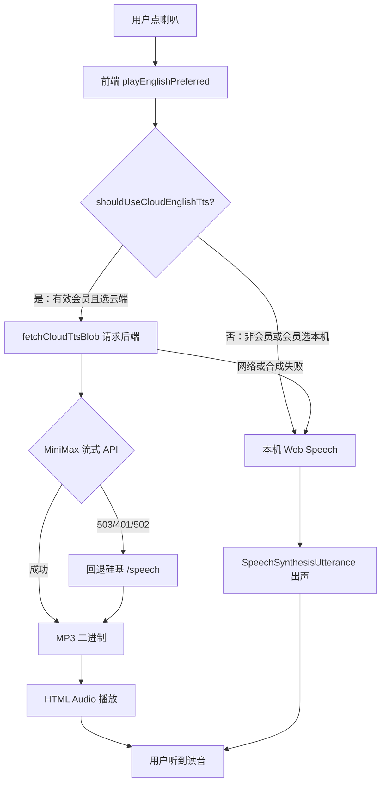

# 文本转语音（TTS）从零到出声：完整实现说明

> **文档角色（主文档）**：用**非编程也能读懂**的语言，说明英语学习里「点喇叭 → 听到读音」的**完整过程**；并附前后端关键源码，代码块内为**逐行中文注释**（便于对照仓库阅读）。  
> **延伸阅读（专题拆分）**：[`tts-membership-routing.md`](./tts-membership-routing.md)（会员选路）、[`tts-playback-source.md`](./tts-playback-source.md)（本机/云端 Switch）、[`english-tts-local-voice.md`](./english-tts-local-voice.md)（本机音色）、[`minimax-cloud-tts.md`](./minimax-cloud-tts.md)（MiniMax 与硅基回退细节）、[`cloud-tts-prefs-db.md`](./cloud-tts-prefs-db.md)（偏好入库）、[`english-tts-playback.md`](./english-tts-playback.md)（播放世代与停止）。

若与仓库最新源码不一致，**以源码为准**。

---

## 1. 先用生活语言说清：TTS 在本项目里是什么

**TTS（Text-to-Speech，文本转语音）** 就是把屏幕上的英文变成你能听到的声音。

在本项目的**英语学习**里（词库、练习、每日复习、经典句等），用户点 **喇叭图标** 时，程序会：

1. **取出要读的英文**（去掉 Markdown 符号、多余空格）。
2. **决定用哪种方式读**：
   - **本机朗读**：直接用浏览器自带的「朗读引擎」（Web Speech API），像 macOS 的 Karen 女声，**不经过我们的服务器**。
   - **云端朗读**：把文字发给**我们的后端**，后端再调用 **MiniMax**（或备用 **硅基流动**）合成 MP3，浏览器播放这段音频。
3. **真正播放**；若你很快又点了别的喇叭，旧的声音会被**取消**，避免叠在一起。

**会员 / 非会员 / 设置页开关** 只影响第 2 步「走本机还是云端」，不改变「最终目标是把文字读出来」。

---

## 2. 整体流程（一图看懂）



**可以把它想成两条管道**：

| 管道 | 比喻 | 谁负责合成声音 |
|------|------|----------------|
| **本机** | 电脑自带的朗读者 | 操作系统 + 浏览器 |
| **云端** | 把稿子寄到配音公司，拿回 MP3 再播 | MiniMax（主）→ 硅基（备） |

---

## 3. 谁决定走本机还是云端？

决策集中在浏览器里的一个函数 **`shouldUseCloudEnglishTts`**（文件 `apps/frontend/src/utils/englishTts.ts`）。规则如下：

| 条件 | 结果 |
|------|------|
| 调用时传 `preferLocal: true`（例如设置页「试听本机音色」） | **一定本机** |
| 当前用户**不是有效会员** | **一定本机**（且不请求云端接口） |
| **有效会员**，且语音设置里 `playbackSource === 'local'` | **本机** |
| **有效会员**，且 `playbackSource === 'cloud'`（默认） | **云端**；失败再**回退本机** |

会员身份来自浏览器里保存的登录信息（与资料页「会员徽章」同一套判断）。  
云端朗读参数（音色、语速等）来自账号在服务器上的 **`minimax_tts_user_config`** 表，登录后拉取到内存缓存。

---

## 4. 前端：从点喇叭到出声（逐步说明）

### 4.1 入口：`playEnglishPreferred`

几乎所有英语学习页面的喇叭，最终都调用 **`playEnglishPreferred(文本)`**。它做四件事：

1. 清理文本（去 Markdown）。
2. **开启新一轮播放**（作废上一轮，防止声音重叠）。
3. 根据上一节规则选 **本机** 或 **云端**。
4. 执行对应播放；云端失败则尝试本机。

**来源**：`apps/frontend/src/utils/englishTts.ts`（约 L682–L713）

```typescript
// 对外主入口：英语学习里点喇叭时调用
export async function playEnglishPreferred(
	rawText: string, // 原始文本（可能含 Markdown）
	options?: PlayEnglishPreferredOptions, // 可选：preferLocal 强制本机等
): Promise<void> {
	// 第一步：去掉 **、链接、代码块等，得到纯朗读文本
	const plain = stripMarkdownForTts(rawText);
	if (!plain) return; // 清理后为空则什么都不做

	// 第二步：递增「播放世代」，并停止上一轮的本机/云端声音
	const generation = beginPlaybackSession();
	const speakOpts = options?.speak; // 本机朗读时的语速/音高等（一般默认即可）

	// 第三步：判断本机还是云端（见 §3）
	const useCloud = shouldUseCloudEnglishTts(options);

	if (!useCloud) {
		// ---------- 本机分支 ----------
		if (!isPlaybackGenerationActive(generation)) return; // 已被更新的播放取消
		if (!isEnglishTtsSupported()) {
			throw new Error('NO_TTS'); // 浏览器不支持朗读，页面会 Toast 提示
		}
		// 分段朗读、句间停顿，使用 Web Speech
		await speakEnglishTextWithGeneration(rawText, generation, speakOpts);
		return;
	}

	// ---------- 云端分支 ----------
	try {
		const blob = await fetchCloudTtsBlob(plain); // 向后端要 MP3（见 §4.3）
		if (!isPlaybackGenerationActive(generation)) return;
		await playCloudMp3Blob(blob, generation); // 用 <audio> 播放（见 §4.4）
		return;
	} catch {
		// 云端失败（未登录、502 余额不足、网络错误等）→ 回退本机
		if (!isPlaybackGenerationActive(generation)) return;
		if (!isEnglishTtsSupported()) {
			throw new Error('NO_TTS');
		}
		await speakEnglishTextWithGeneration(rawText, generation, speakOpts);
	}
}
```

### 4.2 选路函数：`shouldUseCloudEnglishTts`

**来源**：`apps/frontend/src/utils/englishTts.ts`（约 L410–L418）

```typescript
// 返回 true 表示应走云端 TTS；false 表示走本机 Web Speech
function shouldUseCloudEnglishTts(options?: PlayEnglishPreferredOptions): boolean {
	// 设置页本机试听等场景：显式要求本机
	if (options?.preferLocal === true) return false;

	// 显式要求云端时，仍须是有效会员
	if (options?.preferLocal === false) {
		return isCloudEnglishTtsAllowed();
	}

	// 非会员：永不走云端
	if (!isCloudEnglishTtsAllowed()) return false;

	// 会员：读语音设置里的 playbackSource（内存缓存，来自服务端）
	const prefs = loadMinimaxTtsUserPrefs();
	return prefs.playbackSource !== 'local'; // 'cloud' → true；'local' → false
}
```

### 4.3 向后端要音频：`fetchCloudTtsBlob`

流程简述：

1. 确保用户云端偏好已从服务器加载（`ensureMinimaxTtsUserPrefsLoaded`）。
2. 查**浏览器内存 LRU 缓存**：同一句 + 同一套参数 → 直接用缓存 MP3（避免重复请求、读音一致）。
3. 带登录 **Token**，**POST** 到后端 **MiniMax 流式** 接口；请求体 = `{ text, model, voiceId, speed, ... }`（参数来自设置页，见 `buildMinimaxTtsRequestExtras`）。
4. 若返回 **503**（未配 MiniMax）、**401**（鉴权）、**502**（上游异常如余额不足）→ 改请求**硅基** `/speech`（只传 `text`）。
5. 把响应二进制存缓存，包装成 `Blob` 供播放。

**来源**：`apps/frontend/src/utils/englishTts.ts`（约 L495–L536，摘录）

```typescript
async function fetchCloudTtsBlob(plain: string): Promise<Blob> {
	// 拉取并缓存用户云端朗读偏好（音色、语速、playbackSource 等）
	await ensureMinimaxTtsUserPrefsLoaded();

	// 缓存 key = 纯文本 + 用户 id + 参数 JSON（改参数后不会误用旧 MP3）
	const cacheKey = plain + buildMinimaxTtsCacheKeySuffix();
	const cached = getCloudTtsFromCache(plain);
	if (cached) {
		return cached; // 命中缓存，直接返回 MP3 Blob
	}

	const token = readToken(); // 从 localStorage 读登录 token
	if (!token) {
		throw new Error('NO_TOKEN'); // 未登录无法调云端 TTS
	}
	const platformFetch = await getPlatformFetch(); // 桌面/Web 统一 fetch 封装
	const headers = {
		Authorization: `Bearer ${token}`, // JWT，后端 JwtGuard 校验
		'Content-Type': 'application/json',
	};

	// 优先：MiniMax 流式（首包更快）
	let res = await platformFetch(BASE_URL + SPEECH_MINIMAX_TTS_STREAM, {
		method: 'POST',
		headers,
		body: JSON.stringify({ text: plain, ...buildMinimaxTtsRequestExtras() }),
	});

	// MiniMax 不可用时的回退链
	if (res.status === 503 || res.status === 401 || res.status === 502) {
		res = await platformFetch(BASE_URL + SPEECH_TTS, {
			method: 'POST',
			headers,
			body: JSON.stringify({ text: plain }), // 硅基路径只用纯文本 + 服务端 env 默认音色
		});
	}

	if (!res.ok) {
		throw new Error(`TTS_HTTP_${res.status}`); // 交给 playEnglishPreferred 回退本机
	}

	const buf = await readResponseBodyAsArrayBuffer(res); // 读完整 MP3 二进制
	touchCloudTtsCache(cacheKey, buf); // 写入 LRU，最多保留 64 条
	return new Blob([buf], { type: 'audio/mpeg' });
}
```

**请求体里的「额外参数」如何产生**（设置页开启自定义后才会带上）：

**来源**：`apps/frontend/src/utils/minimaxTtsPrefs.ts`（约 L241–L258）

```typescript
// 合成 POST body 时合并用户偏好（不含 text 字段本身）
export function buildMinimaxTtsRequestExtras(): Record<string, unknown> {
	const prefs = loadMinimaxTtsUserPrefs(); // 读内存中的云端设置
	if (!prefs.enabled) return {}; // 未开启自定义参数 → 空对象，后端用 .env 默认

	const body: Record<string, unknown> = {
		model: prefs.model, // 如 speech-2.8-hd
		voiceId: prefs.voiceId, // 如 English_captivating_female1
		speed: prefs.speed, // 语速
		vol: prefs.vol, // 音量（MiniMax 侧刻度）
		pitch: prefs.pitch, // 音高
		format: prefs.format, // 通常 mp3
		sampleRate: prefs.sampleRate,
		bitrate: prefs.bitrate,
		channel: prefs.channel,
	};
	if (prefs.emotion) body.emotion = prefs.emotion; // 可选情感
	if (prefs.languageBoost) body.languageBoost = prefs.languageBoost;
	return body;
}
```

### 4.4 播放 MP3：`playCloudMp3Blob`

**来源**：`apps/frontend/src/utils/englishTts.ts`（约 L538–L585，摘录）

```typescript
function playCloudMp3Blob(blob: Blob, generation: number): Promise<void> {
	stopPlaybackMediaOnly(); // 停掉上一轮 audio / speechSynthesis
	if (!isPlaybackGenerationActive(generation)) {
		return Promise.resolve(); // 用户已点了新的播放，放弃本次
	}

	const url = URL.createObjectURL(blob); // 把 MP3 变成浏览器可播的临时 URL
	cloudObjectUrl = url;
	const audio = new Audio(url); // 创建 HTML5 音频元素
	cloudAudio = audio;

	return new Promise((resolve, reject) => {
		audio.onended = () => {
			// 播完释放临时 URL，避免内存泄漏
			if (cloudObjectUrl === url) {
				URL.revokeObjectURL(url);
				cloudObjectUrl = null;
				cloudAudio = null;
			}
			resolve();
		};
		audio.onerror = () => {
			// 解码或播放失败
			if (cloudObjectUrl === url) {
				URL.revokeObjectURL(url);
				cloudObjectUrl = null;
				cloudAudio = null;
			}
			reject(new Error('AUDIO_PLAY'));
		};
		void audio.play().catch(reject); // 开始播放（浏览器可能要求用户曾交互过页面）
	});
}
```

### 4.5 本机朗读：`speakOneUtterance`

本机路径使用浏览器 **`window.speechSynthesis`**：创建 **`SpeechSynthesisUtterance`**，指定英语音色、语速、音量，然后 `speak`。

**来源**：`apps/frontend/src/utils/englishTts.ts`（约 L588–L622）

```typescript
function speakOneUtterance(
	plain: string, // 本段要读的纯文本
	generation: number, // 播放世代号，用于中途取消
	options?: SpeakEnglishOptions,
): Promise<void> {
	return new Promise((resolve) => {
		// 若播放已被取消、浏览器不支持、或文本为空 → 直接结束
		if (
			!isPlaybackGenerationActive(generation) ||
			!isEnglishTtsSupported() ||
			!plain
		) {
			resolve();
			return;
		}

		const utter = new SpeechSynthesisUtterance(plain); // 浏览器朗读「句子」对象
		utter.lang = 'en-US'; // 默认美式英语

		const voice = pickEnglishVoice(); // 按设置页选的本机音色关键字匹配系统 Voice
		if (voice) {
			utter.voice = voice; // 例如 macOS Karen
			utter.lang = voice.lang || 'en-US';
		}

		utter.rate = options?.rate ?? 0.9; // 语速略慢于 1.0，长句更清晰
		utter.pitch = options?.pitch ?? 1; // 音高，1 为正常
		utter.volume = options?.volume ?? 1; // 音量 0~1，默认最大 1

		utter.onend = () => resolve(); // 读完
		utter.onerror = () => resolve(); // 出错也不抛，避免卡死 UI
		window.speechSynthesis.speak(utter); // 交给系统朗读
	});
}
```

长句会先被 **`splitTextForTtsCadence`** 按句号、逗号切成多段，段与段之间 **`pauseMs`** 插入停顿，听感更接近自然朗读（见同文件约 L56–L93）。

### 4.6 设置页如何保存偏好（前端 → 后端）

会员在 **设置 → 语音设置** 改 Switch 或音色/语速时，页面调用 **`saveMinimaxTtsUserPrefs`**，内部 **PUT** `/settings/cloud-tts`。

**来源**：`apps/frontend/src/service/cloudTtsSettings.ts`（全文）

```typescript
import { http, type RequestConfig } from '@/utils/fetch';
import { SETTINGS_CLOUD_TTS } from './api'; // 常量 '/settings/cloud-tts'

// 与后端 MinimaxTtsPrefsView 字段一致
export type CloudTtsSettingsView = {
	enabled: boolean; // 是否使用自定义云端参数
	playbackSource: 'local' | 'cloud'; // 会员朗读介质
	model: string;
	voiceId: string;
	speed: number;
	vol: number;
	pitch: number;
	emotion: string;
	format: string;
	languageBoost: string;
	sampleRate: number;
	bitrate: number;
	channel: 1 | 2;
};

// GET：登录后拉取当前账号偏好
export const getCloudTtsSettings = (config?: RequestConfig) =>
	http.get<CloudTtsSettingsView>(SETTINGS_CLOUD_TTS, config);

// PUT：保存（设置页每次 patch 都会调用）
export const updateCloudTtsSettings = (
	body: CloudTtsSettingsView,
	config?: RequestConfig,
) => http.put<CloudTtsSettingsView>(SETTINGS_CLOUD_TTS, body, config);

// DELETE：恢复默认，删除库中该用户一行
export const clearCloudTtsSettings = (config?: RequestConfig) =>
	http.delete<CloudTtsSettingsView>(SETTINGS_CLOUD_TTS, config);
```

---

## 5. 后端：收到请求后如何合成声音

后端代码主要在 **`apps/backend/src/services/speech-transcription/`**。与 TTS **播放**相关的 HTTP 路由挂在 **`SpeechTranscriptionController`**（需登录 **JwtGuard**）。

### 5.1 三个与「读英文」相关的接口

| HTTP | 路径 | 作用 |
|------|------|------|
| POST | `/speech-transcription/minimax/speech/stream` | **前端默认走这条**：MiniMax **流式** TTS，chunk 转发给浏览器 |
| POST | `/speech-transcription/minimax/speech` | MiniMax **非流式**，一次返回整段 MP3 |
| POST | `/speech-transcription/speech` | **硅基流动** CosyVoice 等，body 仅 `{ text }`，MiniMax 失败时回退 |

（同模块还有 `/transcription` 上传音频→文字，属于 **ASR**，不是 TTS，本文不展开。）

**来源**：`apps/backend/src/services/speech-transcription/speech-transcription.controller.ts`（约 L53–L113，摘录）

```typescript
@Controller('speech-transcription') // 路由前缀
@UseGuards(JwtGuard) // 必须登录，从 Authorization Bearer 解析 userId
export class SpeechTranscriptionController {
	constructor(
		private readonly siliconflowTranscriptionService: SiliconflowTranscriptionService,
		private readonly minimaxTtsService: MinimaxTtsService,
	) {}

	/** 硅基 TTS 回退：body { text } → MP3 */
	@Post('speech')
	async speech(@Body() body: { text?: string }) {
		const text = typeof body?.text === 'string' ? body.text.trim() : '';
		if (!text) {
			throw new BadRequestException('请提供有效的 text');
		}
		const buffer =
			await this.siliconflowTranscriptionService.synthesizeSpeech(text);
		return new StreamableFile(buffer, { type: 'audio/mpeg' });
	}

	/** MiniMax 非流式 */
	@Post('minimax/speech')
	async minimaxSpeech(@Body() body: MinimaxTtsDto, @Req() req: AuthedRequest) {
		const userId = req.user?.userId; // 用于服务端 LRU 分用户
		const resolved = this.minimaxTtsService.resolveOptions(body);
		const buffer = await this.minimaxTtsService.synthesizeSpeech(body, userId);
		return new StreamableFile(buffer, {
			type: this.minimaxTtsService.resolveContentType(resolved.format),
		});
	}

	/** MiniMax 流式：前端 fetchCloudTtsBlob 优先调用 */
	@Post('minimax/speech/stream')
	async minimaxSpeechStream(
		@Body() body: MinimaxTtsDto,
		@Req() req: AuthedRequest,
		@Res({ passthrough: false }) res: Response,
	) {
		const userId = req.user?.userId;
		const resolved = this.minimaxTtsService.resolveOptions(body);
		res.status(200);
		res.setHeader(
			'Content-Type',
			this.minimaxTtsService.resolveContentType(resolved.format),
		);
		res.setHeader('Cache-Control', 'no-store');
		res.setHeader('X-Content-Type-Options', 'nosniff');

		try {
			// 从 MiniMax 逐块读音频，每块立刻 res.write 给前端（降低首包延迟）
			for await (const chunk of this.minimaxTtsService.streamSpeech(
				body,
				userId,
			)) {
				res.write(chunk);
			}
		} catch (err) {
			if (!res.headersSent) {
				throw err; // 还没写响应头，可把 502/503 返回给前端触发回退
			}
			res.end();
			return;
		}
		res.end();
	}
}
```

### 5.2 请求体验证：`MinimaxTtsDto`

前端 JSON 字段会先被 **class-validator** 校验（长度、枚举、数值范围），防止恶意或错误参数打到 MiniMax。

**来源**：`apps/backend/src/services/speech-transcription/dto/minimax-tts.dto.ts`（约 L48–L124，摘录）

```typescript
export class MinimaxTtsDto {
	@IsString()
	@IsNotEmpty()
	@MaxLength(10_000) // 最多 1 万字符
	text!: string; // 必填：要朗读的英文

	@IsOptional()
	@IsIn(MINIMAX_TTS_MODELS) // 只允许白名单模型名
	model?: (typeof MINIMAX_TTS_MODELS)[number];

	@IsOptional()
	@IsString()
	@MaxLength(128)
	voiceId?: string; // MiniMax 音色 ID

	@IsOptional()
	@IsNumber()
	@Min(0.5)
	@Max(2)
	speed?: number; // 语速 0.5~2

	@IsOptional()
	@IsNumber()
	@Min(0.01)
	@Max(10)
	vol?: number; // 音量

	@IsOptional()
	@IsInt()
	@Min(-12)
	@Max(12)
	pitch?: number; // 音高

	// ... emotion、format、sampleRate、bitrate、channel、languageBoost 等可选字段
}
```

### 5.3 核心服务：`MinimaxTtsService.streamSpeech`

逻辑链：**合并参数 → 查服务端 LRU 缓存 → 调 MiniMax HTTP API → 解析流式 JSON 里的 hex 音频 → 逐块 yield**。

**来源**：`apps/backend/src/services/speech-transcription/minimax-tts.service.ts`（约 L124–L150、L452–L486，摘录）

```typescript
// 把前端 DTO + 环境变量默认值 合成一份「最终参数」
resolveOptions(dto: MinimaxTtsDto): MinimaxTtsResolved {
	const plain = dto.text.trim().slice(0, TTS_INPUT_MAX_CHARS); // 截断防超长
	if (!plain) {
		throw new HttpException('朗读文本为空', HttpStatus.BAD_REQUEST);
	}
	return {
		text: plain,
		model:
			dto.model?.trim() ||
			(this.trimEnv(MinimaxEnum.MINIMAX_TTS_MODEL) ?? 'speech-2.8-hd'),
		voiceId:
			dto.voiceId?.trim() ||
			(this.trimEnv(MinimaxEnum.MINIMAX_TTS_VOICE_ID) ??
				'English_captivating_female1'),
		speed: dto.speed ?? 1,
		vol: dto.vol ?? 1,
		pitch: dto.pitch ?? 0,
		emotion: dto.emotion,
		sampleRate: dto.sampleRate ?? 32_000,
		bitrate: dto.bitrate ?? 128_000,
		format: dto.format?.trim() || 'mp3',
		channel: dto.channel ?? 1,
		languageBoost: dto.languageBoost?.trim(),
		subtitleEnable: dto.subtitleEnable ?? false,
		pronunciationTone: dto.pronunciationTone,
		textNormalization: dto.textNormalization,
	};
}

// 流式合成：Controller 里 for await 写入 HTTP 响应
async *streamSpeech(
	dto: MinimaxTtsDto,
	userId?: number,
): AsyncGenerator<Buffer> {
	const resolved = this.resolveOptions(dto);
	const cacheKey = this.buildCacheKey(resolved, userId); // 文本+参数+用户 id
	const cached = this.getFromCache(cacheKey);
	if (cached?.length) {
		yield cached; // 缓存命中：一次 yield 整段 MP3
		return;
	}

	const res = await this.requestMiniMax(resolved, true); // POST MiniMax /v1/t2a_v2 stream=true
	if (!res.ok) {
		const raw = await res.text();
		throw new HttpException(
			`MiniMax 流式语音合成失败（${res.status}）：${raw.slice(0, 500)}`,
			res.status >= 400 && res.status < 600
				? res.status
				: HttpStatus.BAD_GATEWAY,
		);
	}

	const parts: Buffer[] = [];
	for await (const item of this.iterateMiniMaxStream(res.body)) {
		this.assertMiniMaxOk(item, 'MiniMax 流式语音合成'); // 检查 base_resp.status_code
		const audio = this.decodeHexAudio(item.data?.audio); // MiniMax 返回 hex 编码音频
		if (audio?.length) {
			parts.push(audio);
			yield audio; // 每一块立刻转发给前端
		}
	}
	if (parts.length > 0) {
		this.setCache(cacheKey, Buffer.concat(parts)); // 拼好后存 LRU（最多 128 条）
	}
}
```

**MiniMax 实际 HTTP 调用**（`requestMiniMax`）：

- URL：`{MINIMAX_TTS_BASE_URL}/v1/t2a_v2`（默认 `https://api.minimaxi.com/v1/t2a_v2`）
- Header：`Authorization: Bearer {MINIMAX_API_KEY}`，可选 `Group-Id`
- Body：含 `model`、`text`、`voice_setting`、`audio_setting`、`stream: true` 等（见 `buildRequestBody`）

### 5.4 硅基回退：`SiliconflowTranscriptionService.synthesizeSpeech`

当 MiniMax 未配置或失败时，前端改调 **`POST /speech-transcription/speech`**。后端用 **硅基流动 OpenAI 兼容接口** `POST /v1/audio/speech`，模型与音色来自服务端环境变量，**不读用户设置表**。

**来源**：`apps/backend/src/services/speech-transcription/siliconflow-transcription.service.ts`（约 L118–L175，摘录）

```typescript
async synthesizeSpeech(text: string): Promise<Buffer> {
	const plain = text.trim().slice(0, TTS_INPUT_MAX_CHARS);
	if (!plain) {
		throw new HttpException('朗读文本为空', HttpStatus.BAD_REQUEST);
	}

	const cacheKey = this.buildTtsSpeechCacheKey(plain);
	const cached = this.getTtsSpeechFromCache(cacheKey);
	if (cached) {
		return Buffer.from(cached); // 服务端 LRU
	}

	const apiKey =
		this.config.get<string>(ModelEnum.SILICONFLOW_API_KEY) ||
		this.config.get<string>(KnowledgeQaEnum.DASHSCOPE_API_KEY);
	if (!apiKey?.trim()) {
		throw new HttpException(
			'未配置 SILICONFLOW_API_KEY，无法进行语音合成',
			HttpStatus.SERVICE_UNAVAILABLE,
		);
	}

	const baseUrl = (
		this.config.get<string>(ModelEnum.SILICONFLOW_BASE_URL) ||
		'https://api.siliconflow.cn/v1'
	).replace(/\/$/, '');
	const url = `${baseUrl}/audio/speech`;

	const res = await fetch(url, {
		method: 'POST',
		headers: {
			Authorization: `Bearer ${apiKey.trim()}`,
			'Content-Type': 'application/json',
		},
		body: JSON.stringify({
			model: this.resolveTtsModel(), // env 默认 CosyVoice 等
			input: plain,
			voice: this.resolveTtsVoice(),
			response_format: 'mp3',
			speed: 1,
			gain: 0,
		}),
	});

	if (!res.ok) {
		const raw = await res.text();
		throw new HttpException(
			`语音合成失败（${res.status}）：${raw.slice(0, 500)}`,
			res.status >= 400 && res.status < 600
				? res.status
				: HttpStatus.BAD_GATEWAY,
		);
	}

	const buffer = Buffer.from(await res.arrayBuffer());
	this.setTtsSpeechCache(cacheKey, buffer);
	return buffer;
}
```

---

## 6. 用户偏好如何存进数据库

会员的云端音色、语速、**本机/云端 Switch** 存在表 **`minimax_tts_user_config`**（每用户一行）。

**来源**：`apps/backend/src/services/speech-transcription/minimax-tts-user-config.entity.ts`（摘录）

```typescript
@Entity('minimax_tts_user_config')
export class MinimaxTtsUserConfig {
	@PrimaryColumn({ name: 'user_id', type: 'int' })
	userId!: number; // 主键：哪个用户

	@Column({ type: 'boolean', default: false })
	enabled!: boolean; // 是否启用自定义云端参数

	@Column({ name: 'playback_source', type: 'varchar', length: 16, default: 'cloud' })
	playbackSource!: 'local' | 'cloud'; // 会员喇叭默认本机还是云端

	@Column({ type: 'varchar', length: 64, default: 'speech-2.8-hd' })
	model!: string;

	@Column({ name: 'voice_id', type: 'varchar', length: 128, default: '' })
	voiceId!: string;

	// speed、vol、pitch、emotion、format、languageBoost、sampleRate、bitrate、channel ...
}
```

**保存 API**（设置页 PUT）：

**来源**：`apps/backend/src/services/speech-transcription/minimax-tts-prefs.service.ts`（约 L89–L113）

```typescript
async upsert(
	dto: UpsertMinimaxTtsPrefsDto,
	userId?: number,
): Promise<MinimaxTtsPrefsView> {
	const uid = this.assertUserId(userId); // 必须登录
	const emotion = this.normalizeEmotion(dto.emotion);
	let row = await this.repo.findOne({ where: { userId: uid } });
	if (!row) {
		row = this.repo.create({ userId: uid }); // 首次保存：插入新行
	}
	row.enabled = Boolean(dto.enabled);
	row.playbackSource = dto.playbackSource === 'local' ? 'local' : 'cloud';
	row.model = dto.model;
	row.voiceId = dto.voiceId.trim();
	row.speed = dto.speed;
	row.vol = dto.vol;
	row.pitch = dto.pitch;
	row.emotion = emotion;
	row.format = dto.format;
	row.languageBoost = dto.languageBoost;
	row.sampleRate = dto.sampleRate;
	row.bitrate = dto.bitrate;
	row.channel = dto.channel === 2 ? 2 : 1;
	await this.repo.save(row); // 写入 MySQL 等
	return this.rowToView(row); // 返回给前端更新 UI
}
```

**本机音色**（Karen / Daniel 等）**不在这张表**：按账号存在浏览器 **`localStorage`**（键名带 `userId`），详见 [`english-tts-local-voice.md`](./english-tts-local-voice.md)。

---

## 7. 播放世代：为什么快速连点不会叠音

每次新播放会 **`playbackGeneration += 1`**。异步请求返回或本机 `onend` 时会检查 **`generation` 是否仍等于当前值**；若用户已点了下一次播放，旧任务会**静默放弃**。

**来源**：`apps/frontend/src/utils/englishTts.ts`（约 L442–L447、L421–L423）

```typescript
let playbackGeneration = 0; // 全局计数器，每次新播放 +1

function beginPlaybackSession(): number {
	playbackGeneration += 1; // 新一轮
	stopPlaybackMediaOnly(); // 停掉当前 audio / speechSynthesis
	return playbackGeneration; // 把编号传给后续异步步骤
}

function isPlaybackGenerationActive(generation: number): boolean {
	return generation === playbackGeneration; // 不一致说明已被更新的播放取代
}
```

更完整的场景说明见 [`english-tts-playback.md`](./english-tts-playback.md)。

---

## 8. 端到端时间线（一次云端朗读）

| 步骤 | 在哪里 | 发生了什么 |
|------|--------|------------|
| 1 | 浏览器 UI | 用户点喇叭，调用 `playEnglishPreferred("hello")` |
| 2 | `englishTts.ts` | 判定会员 + `playbackSource` → 走云端 |
| 3 | `minimaxTtsPrefs.ts` | `buildMinimaxTtsRequestExtras()` 带上音色/语速 |
| 4 | 网络 | POST `/speech-transcription/minimax/speech/stream` + JWT |
| 5 | `JwtGuard` | 校验 token，注入 `userId` |
| 6 | `MinimaxTtsService` | 查 LRU → 调 MiniMax API → 流式 hex 音频转 Buffer |
| 7 | `Controller` | `res.write(chunk)` 把 MP3 片段写给浏览器 |
| 8 | `fetchCloudTtsBlob` | 收齐二进制 → 存前端 LRU → 得到 Blob |
| 9 | `playCloudMp3Blob` | `new Audio()` 播放 |
| 10 | 用户 | 听到 "hello" |

若第 6 步 MiniMax 返回 502（如余额不足），前端在第 4 步后会**自动改请求**硅基 `/speech`；若仍失败，则走本机 Web Speech。

---

## 9. 常见问题（非技术版）

| 现象 | 原因 | 对应实现位置 |
|------|------|----------------|
| 非会员点喇叭只有本机声 | 设计如此，不消耗云端 | `shouldUseCloudEnglishTts` 非会员分支 |
| 会员想一直用本机 | 语音设置开「使用本机语音朗读」 | `playbackSource === 'local'` |
| 同一句第二次读更快 | 前后端 LRU 缓存了 MP3 | `getCloudTtsFromCache` / `MinimaxTtsService.getFromCache` |
| 云端没声但本机有声 | MiniMax/硅基失败，已回退 | `playEnglishPreferred` 的 `catch` 分支 |
| 换电脑后云端参数还在、本机音色不在 | 云端存服务器，本机存浏览器 | `minimax_tts_user_config` vs `localStorage` |
| 快速连点两个喇叭只听到最后一个 | 播放世代作废旧任务 | `playbackGeneration` |

---

## 10. 相关源码路径速查

| 说明 | 路径 |
|------|------|
| 前端播放总控 | `apps/frontend/src/utils/englishTts.ts` |
| 云端偏好缓存与请求体 | `apps/frontend/src/utils/minimaxTtsPrefs.ts` |
| 设置页 HTTP 客户端 | `apps/frontend/src/service/cloudTtsSettings.ts` |
| API 路径常量 | `apps/frontend/src/service/api.ts`（`SPEECH_*`、`SETTINGS_CLOUD_TTS`） |
| TTS HTTP 控制器 | `apps/backend/src/services/speech-transcription/speech-transcription.controller.ts` |
| MiniMax 合成服务 | `apps/backend/src/services/speech-transcription/minimax-tts.service.ts` |
| 硅基 TTS 回退 | `apps/backend/src/services/speech-transcription/siliconflow-transcription.service.ts` |
| 用户偏好 CRUD | `apps/backend/src/services/speech-transcription/minimax-tts-prefs.controller.ts`、`minimax-tts-prefs.service.ts` |
| 数据库实体 | `apps/backend/src/services/speech-transcription/minimax-tts-user-config.entity.ts` |
| 请求 DTO | `apps/backend/src/services/speech-transcription/dto/minimax-tts.dto.ts` |

---

**若与仓库最新源码不一致，以源码为准。**
