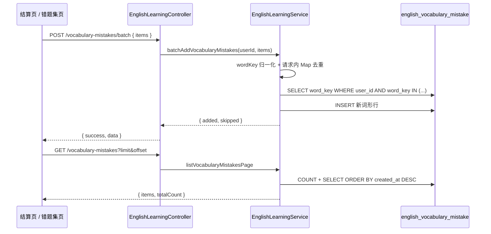

# 单词错题集、练习入口组件与列表 UI 统一

## 延伸阅读

- **经典句**练习与语句错题集（本轮主文档）：[`classic-practice-and-mistakes.md`](./classic-practice-and-mistakes.md)
- 听写/拼写多入口与返回：[`practice-entry-navigation.md`](./practice-entry-navigation.md)（URL 与 `returnTo` 约定；本轮入口 UI 已收敛至 `EnglishPracticeEntry`）
- 结算页 UI：[`practice-summary-ui.md`](./practice-summary-ui.md)
- 产品使用：[`docs/project-guide.md`](../project-guide.md) §13.11
- 域索引：[`docs/english/README.md`](./README.md)

---

## 1. 背景与目标

本轮在英语学习域补齐三块能力：

1. **单词错题集**：练习中拼错的词可沉淀、分页浏览、批量移除，并作为独立词表来源再次进入听写/拼写。
2. **听写/拼写入口统一**：各页面重复的 `navigate(englishPracticeUrl(...))` + `setEnglishPracticePoolMeta` 收敛为公共组件与函数，降低漏传 `source` / `poolTotal` 的概率。
3. **单词卡片与路由入口规范**：词库/收藏/错题/词包列表共用 `VocabularyWordCard`；子功能目录统一 `index.tsx` 作为路由入口。

---

## 2. 改动范围

### 2.1 后端

| 路径 | 说明 |
|------|------|
| `apps/backend/src/services/english-learning/entity/english-vocabulary-mistake.entity.ts` | 表 `english_vocabulary_mistake` |
| `apps/backend/src/services/english-learning/dto/vocabulary-mistake.dto.ts` | 批量入库 / 列表 / 删除 DTO |
| `apps/backend/src/services/english-learning/english-learning.service.ts` | `batchAddVocabularyMistakes`、`listVocabularyMistakesPage`、单条/批量删除 |
| `apps/backend/src/services/english-learning/english-learning.controller.ts` | REST 暴露 |
| `apps/backend/src/migrations/1779968095480-error.ts` | 建表 `english_vocabulary_mistake` 与唯一索引 |
| `apps/backend/src/services/english-learning/english-learning.module.ts` | `TypeOrmModule.forFeature` 注册实体 |

### 2.2 前端 — 错题集

| 路径 | 说明 |
|------|------|
| `apps/frontend/src/views/englishLearning/mistakes/index.tsx` | **统一错题集页**（`?kind=`、顶栏 Tab；见 [`classic-practice-and-mistakes.md`](./classic-practice-and-mistakes.md) §3.5） |
| `apps/frontend/src/views/englishLearning/mistakes/vocabulary/VocabularyMistakesPanel.tsx` | 单词列表、勾选、移除、TTS |
| `apps/frontend/src/views/englishLearning/mistakes/components/MistakesPanelFooter.tsx` | 底栏：全选、移除所选、听写/拼写 |
| `apps/frontend/src/views/englishLearning/mistakes/components/MistakeBookSession.tsx` | 首页侧栏入口 |
| `apps/frontend/src/views/englishLearning/mistakes/useVocabularyMistakesList.ts` | 分页拉取 |

### 2.3 前端 — 练习与结算

| 路径 | 说明 |
|------|------|
| `apps/frontend/src/views/englishLearning/shared/practiceEntry.tsx` | `EnglishPracticeEntry`、`openEnglishPractice` |
| `apps/frontend/src/views/englishLearning/practice/Summary.tsx` | 结算页「加入错题集」 |
| `apps/frontend/src/views/englishLearning/practice/components/summary/SummaryActions.tsx` | 「进入错题集」等底栏按钮 |
| `apps/frontend/src/views/englishLearning/practice/utils/fetchWords.ts` | `source: 'mistakes'` 拉词 |
| `apps/frontend/src/store/englishPracticePool.ts` | `englishPracticePoolKeys.mistakes` |

### 2.4 前端 — 其它

| 路径 | 说明 |
|------|------|
| `apps/frontend/src/views/englishLearning/shared/VocabularyWordCard.tsx` | 统一单词卡片 |
| `apps/frontend/src/views/englishLearning/library/VocabularyLibraryWordsPanel.tsx` | 修复练习跳转（`source=library`） |
| `apps/frontend/src/views/englishLearning/favorites/`、`pack/`、`library/`、`reference/`、`agent/`、`import/` | 页面文件更名为各目录 `index.tsx` |
| `apps/frontend/src/router/routes.ts` | `/english-learning/mistakes` |
| `apps/frontend/src/service/index.ts` | 错题集 API 封装 |

---

## 3. 实现思路（总览）

### 3.1 错题集：前后端分工

| 层级 | 职责 |
|------|------|
| **结算页** | 组装本轮错题快照（含 `lastUserInput`），调用 `POST …/vocabulary-mistakes/batch` |
| **Controller** | 鉴权、分页参数裁剪、`class-validator` 校验 DTO |
| **Service** | `wordKey` 归一化、请求内去重；新键 `INSERT`；已存在且 `lastUserInput` 不同则 **仅更新错拼** |
| **Entity / DB** | 每用户每 `wordKey` 唯一一行；存单词展示快照，不关联词包/词库外键 |
| **错题集页 / 练习** | `GET` 分页列表；练习拉词复用同一列表 API（`source=mistakes`） |

设计取舍：**错题行是快照**（词面/释义等不因 batch 覆盖）；已入库词形再次加入时，若本轮 **错拼与库中不同** 则更新 `lastUserInput`，相同则跳过。释义等字段变更需先移除再重新加入。

> 语句错题集对称逻辑见 [`classic-practice-and-mistakes.md`](./classic-practice-and-mistakes.md) §3.9、§4.5（含 `updated` 计数与仅更新 `lastUserInput` 的完整代码注释）。

### 3.2 练习来源 `mistakes`

- URL：`/english-learning/practice?source=mistakes&poolTotal=…&sourceTitle=…`
- `fetchWords.ts` 中 `fetchMistakes` 调用 `listEnglishVocabularyMistakes` 分页取词，支持随机/顺序与「继续练习」去重。
- 练习页 `onExit`：`source=mistakes` 时返回 `/english-learning/mistakes`（见 `practice/index.tsx`）。

### 3.3 分词与其它字段

- **`segmentation`**：DTO 可选，入库时 trim 后最长 500；**后端不**因缺失而拒绝入库（与收藏字段一致）。
- **展示**：前端卡片无分词则不渲染分词行；练习出题不依赖分词字段。
- **`lastUserInput`**：仅错题专有，记录结算时用户输入的错拼，便于在错题集页脚展示。

### 3.4 `EnglishPracticeEntry` 组件化

- **`openEnglishPractice`**：根据 `practice.source` + `libraryId` / `streamId` 解析池键（`resolveEnglishPracticePoolKey`），默认写入 `setEnglishPracticePoolMeta` 后 `navigate(englishPracticeUrl(practice))`。
- **`EnglishPracticeEntry`**：`practice` 属性承载完整 query 参数；`variant` 覆盖 link / button / text / icon 四种现有样式；`onBeforeNavigate` 供列表行内 `stopPropagation`。
- **已接入**：错题页头、收藏底栏、词库右侧标题栏、词库列表 hover 图标、词包顶栏、历史抽屉图标。

### 3.5 结算页与错题集闭环

- **加入错题集**：仅提交本轮错题快照（含 `lastUserInput`）；接口层去重。
- **进入错题集**：结算底栏常显按钮，跳转 `/english-learning/mistakes`（与「加入错题集」并列，便于保存后直接查看）。
- 错题集页头：**听写 / 拼写**（`EnglishPracticeEntry`），已移除原「返回英语学习」按钮。

### 3.6 子目录 `index.tsx`

- 与 `mistakes/`、`favorites/`、`pack/` 等一致：路由 `import` 指向目录 `index.tsx`，原 `EnglishLearningXxxPage.tsx` 等大文件名删除或内联迁移。

---

## 4. 后端：错题集实现思路与代码

### 4.1 API 一览

基路径前缀与收藏接口相同，挂在 `EnglishLearningController` 下（需登录，`req.user.userId`）。

| 方法 | 路径 | 作用 |
|------|------|------|
| `GET` | `/english-learning/vocabulary-mistakes?limit&offset` | 分页列表 + `totalCount` |
| `POST` | `/english-learning/vocabulary-mistakes/batch` | 批量加入（body: `{ items: [...] }`） |
| `POST` | `/english-learning/vocabulary-mistakes/remove` | 按 `id` 删除一条 |
| `POST` | `/english-learning/vocabulary-mistakes/remove-batch` | 按 `ids[]` 批量删除 |

批量加入响应：`{ added: number; updated: number; skipped: number }`。`updated` 为已存在行仅刷新错拼；`skipped` 为错拼未变或请求内重复合并。

### 4.2 数据表与 TypeORM 实体

**来源**：`apps/backend/src/migrations/1779968095480-error.ts`（`up` 方法，约 L6–L7）

```sql
-- 说明：由 TypeORM 迁移生成；核心约束为 (user_id, word_key) 唯一
CREATE TABLE `english_vocabulary_mistake` (
  `id` varchar(36) NOT NULL,
  `user_id` int NOT NULL,
  `word_key` varchar(200) NOT NULL,
  `word` varchar(500) NOT NULL,
  `ipa` varchar(500) NOT NULL DEFAULT '',
  `pos` varchar(32) NOT NULL DEFAULT '',
  `segmentation` varchar(500) NOT NULL DEFAULT '',
  `translation_zh` text NOT NULL,
  `example` text NOT NULL,
  `last_user_input` varchar(500) NOT NULL DEFAULT '',
  `created_at` timestamp(6) NOT NULL DEFAULT CURRENT_TIMESTAMP(6),
  UNIQUE INDEX `UQ_evm_user_word_key` (`user_id`, `word_key`),
  PRIMARY KEY (`id`)
) ENGINE=InnoDB;
```

**来源**：`apps/backend/src/services/english-learning/entity/english-vocabulary-mistake.entity.ts`（全文）

```typescript
@Entity('english_vocabulary_mistake')
@Index('UQ_evm_user_word_key', ['userId', 'wordKey'], { unique: true })
export class EnglishVocabularyMistake {
	@PrimaryGeneratedColumn('uuid')
	id!: string;

	@Column({ name: 'user_id', type: 'int' })
	userId!: number;

	/** 与收藏共用归一化规则：trim + 小写，用于去重 */
	@Column({ name: 'word_key', type: 'varchar', length: 200 })
	wordKey!: string;

	/** 展示用词形（保留用户原始大小写等） */
	@Column({ type: 'varchar', length: 500 })
	word!: string;

	@Column({ type: 'varchar', length: 500, default: '' })
	ipa!: string;

	@Column({ type: 'varchar', length: 32, default: '' })
	pos!: string;

	@Column({ type: 'varchar', length: 500, default: '' })
	segmentation!: string;

	@Column({ name: 'translation_zh', type: 'text' })
	translationZh!: string;

	@Column({ type: 'text' })
	example!: string;

	/** 加入错题集时用户提交的错拼（结算页 userInput） */
	@Column({ name: 'last_user_input', type: 'varchar', length: 500, default: '' })
	lastUserInput!: string;

	@CreateDateColumn({ name: 'created_at', type: 'timestamp' })
	createdAt!: Date;
}
```

**模块注册**：`EnglishVocabularyMistake` 已加入 `english-learning.module.ts` 的 `TypeOrmModule.forFeature([...])`，`EnglishLearningService` 通过 `@InjectRepository(EnglishVocabularyMistake)` 注入 `vocabMistakeRepo`。

### 4.3 DTO：校验与字段复用

错题条目字段与**单词收藏**一致（`word` / `ipa` / `pos` / `segmentation` / `translationZh` / `example`），另增可选 `lastUserInput`。复用 `VocabularyFavoriteBodyDto` 可避免前后端字段漂移。

**来源**：`apps/backend/src/services/english-learning/dto/vocabulary-mistake.dto.ts`（全文）

```typescript
export class VocabularyMistakeBatchItemDto extends VocabularyFavoriteBodyDto {
	@IsOptional()
	@IsString()
	@MaxLength(500)
	lastUserInput?: string;
}

/** 结算页批量加入：单次最多 50 条（与练习一轮题量上限同量级） */
export class VocabularyMistakeBatchDto {
	@IsArray()
	@ArrayMaxSize(50)
	@ValidateNested({ each: true })
	@Type(() => VocabularyMistakeBatchItemDto)
	items!: VocabularyMistakeBatchItemDto[];
}

export class VocabularyMistakeRemoveDto {
	@IsUUID('4')
	id!: string;
}

/** 列表页批量移除：最多 3000 个 id（与收藏批量删除上限一致） */
export class VocabularyMistakeRemoveBatchDto {
	@IsArray()
	@ArrayMaxSize(3000)
	@IsUUID('4', { each: true })
	ids!: string[];
}
```

### 4.4 Controller：鉴权与分页参数

**来源**：`apps/backend/src/services/english-learning/english-learning.controller.ts`（约 L633–L704）

```typescript
/** 分页列出当前用户错题集（按入库时间倒序） */
@Get('vocabulary-mistakes')
async listVocabularyMistakesPaginated(
	@Req() req: AuthedRequest,
	@Query('limit') limitStr?: string,
	@Query('offset') offsetStr?: string,
) {
	const userId = req.user?.userId;
	if (userId == null) {
		throw new UnauthorizedException('未授权');
	}
	// limit 限制在 1～100，默认 20；offset 非负
	const limit = Math.min(
		100,
		Math.max(1, Number.parseInt(limitStr ?? '20', 10) || 20),
	);
	const offset = Math.max(0, Number.parseInt(offsetStr ?? '0', 10) || 0);
	const data = await this.englishLearningService.listVocabularyMistakesPage(
		userId,
		{ limit, offset },
	);
	return { success: true, data };
}

/** 批量加入错题集（已存在词形跳过，不更新） */
@Post('vocabulary-mistakes/batch')
async batchAddVocabularyMistakes(
	@Req() req: AuthedRequest,
	@Body() dto: VocabularyMistakeBatchDto,
) {
	const userId = req.user?.userId;
	if (userId == null) {
		throw new UnauthorizedException('未授权');
	}
	const data = await this.englishLearningService.batchAddVocabularyMistakes(
		userId,
		dto.items ?? [],
	);
	return { success: true, data };
}

// remove / remove-batch 同理：校验 userId 后委托 Service
```

### 4.5 Service：`wordKey` 归一化（与前端对齐）

**来源**：`apps/backend/src/services/english-learning/english-learning.service.ts`（约 L3589–L3592）

```typescript
/** 与前端 `normalizeEnglishVocabWordKey` 对齐：trim + 小写 */
normalizeVocabularyFavoriteWordKey(word: string): string {
	return word.trim().toLowerCase();
}
```

同一用户在错题集与收藏里对 `Hello` / `hello` 视为同一词形，避免重复行。

### 4.6 Service：批量加入错题集（核心流程）

**实现步骤**（`batchAddVocabularyMistakes`）：

1. 空数组直接 `{ added: 0, skipped: 0 }`。
2. **请求内去重**：遍历 `items`，按 `wordKey` 填入 `Map`，同形词只保留首次出现的条目（本轮练习可能对同一词错多次，只入库一条）。
3. 若归一化后无有效 `wordKey`，`skipped` 计为原始 `items.length`。
4. **库内已存在查询**：`find({ userId, wordKey: In(keys) })` 仅取 `wordKey` 列。
5. **过滤待插入**：`toInsertKeys = keys.filter(k => !existingSet.has(k))`。
6. **构建实体**：对每条待插入词形 `create({ userId, wordKey, word, ipa, …, lastUserInput })`，字符串字段 trim / 截断长度。
7. `save(rows)` 批量写入；返回 `{ added: toInsertKeys.length, skipped: keys.length - added }`。

**来源**：`apps/backend/src/services/english-learning/english-learning.service.ts`（约 L3872–L3935，`batchAddVocabularyMistakes`）

```typescript
async batchAddVocabularyMistakes(
	userId: number,
	items: VocabularyMistakeBatchItemDto[],
): Promise<{ added: number; skipped: number }> {
	if (!items.length) {
		return { added: 0, skipped: 0 };
	}

	// 步骤 2：本轮请求内按 wordKey 去重
	const byKey = new Map<string, VocabularyMistakeBatchItemDto>();
	for (const item of items) {
		const wordKey = this.normalizeVocabularyFavoriteWordKey(item.word);
		if (!wordKey) continue;
		if (!byKey.has(wordKey)) {
			byKey.set(wordKey, item);
		}
	}

	const keys = [...byKey.keys()];
	if (keys.length === 0) {
		return { added: 0, skipped: items.length };
	}

	// 步骤 4：查出当前用户已存在的 wordKey
	const existing = await this.vocabMistakeRepo.find({
		where: { userId, wordKey: In(keys) },
		select: ['wordKey'],
	});
	const existingSet = new Set(existing.map((r) => r.wordKey));
	const toInsertKeys = keys.filter((k) => !existingSet.has(k));

	if (toInsertKeys.length === 0) {
		return { added: 0, skipped: keys.length };
	}

	// 步骤 6～7：仅插入新词形；已存在的不 UPDATE
	const rows = toInsertKeys.map((wordKey) => {
		const item = byKey.get(wordKey)!;
		return this.vocabMistakeRepo.create({
			userId,
			wordKey,
			word: item.word.trim(),
			ipa: typeof item.ipa === 'string' ? item.ipa : '',
			pos:
				typeof item.pos === 'string' ? item.pos.trim().slice(0, 32) : '',
			segmentation:
				typeof item.segmentation === 'string'
					? item.segmentation.trim().slice(0, 500)
					: '',
			translationZh: item.translationZh ?? '',
			example: item.example ?? '',
			lastUserInput:
				typeof item.lastUserInput === 'string'
					? item.lastUserInput.trim().slice(0, 500)
					: '',
		});
	});

	await this.vocabMistakeRepo.save(rows);
	return {
		added: toInsertKeys.length,
		skipped: keys.length - toInsertKeys.length,
	};
}
```

**注意**：`skipped` 不包含「请求内被 Map 合并掉」的重复项数量；前端若传 10 条错词、仅 3 个不同 `wordKey`，则 `keys.length === 3`。若 3 个均已存在，则 `added=0, skipped=3`。

### 4.7 Service：列表与删除

**列表**：`count` 与 `find` 并行；`order: { createdAt: 'DESC' }`；返回 ISO 字符串时间供前端展示。

**来源**：`apps/backend/src/services/english-learning/english-learning.service.ts`（约 L3937–L3999，摘录）

```typescript
async removeVocabularyMistake(userId: number, id: string) {
	// 必须同时匹配 userId，防止越权删除他人错题
	const r = await this.vocabMistakeRepo.delete({ userId, id });
	return { removed: (r.affected ?? 0) > 0 };
}

async removeVocabularyMistakesBatch(userId: number, ids: string[]) {
	const unique = [...new Set(ids.map((id) => id.trim()).filter(Boolean))];
	if (unique.length === 0) {
		return { removedCount: 0 };
	}
	const r = await this.vocabMistakeRepo.delete({
		userId,
		id: In(unique),
	});
	return { removedCount: r.affected ?? 0 };
}

async listVocabularyMistakesPage(userId, opts) {
	const [totalCount, rows] = await Promise.all([
		this.vocabMistakeRepo.count({ where: { userId } }),
		this.vocabMistakeRepo.find({
			where: { userId },
			order: { createdAt: 'DESC' },
			take: opts.limit,
			skip: opts.offset,
		}),
	]);
	return {
		totalCount,
		items: rows.map((r) => ({
			id: r.id,
			word: r.word,
			// ... 其余字段与 entity 一致，createdAt 转 ISO 字符串
		})),
	};
}
```

### 4.8 前端 HTTP 封装（对接后端）

**来源**：`apps/frontend/src/service/index.ts`（约 L1001–L1038）

```typescript
export const batchAddEnglishVocabularyMistakes = async (
	items: EnglishVocabularyMistakeBatchItem[],
) => {
	return await http.post<{ added: number; skipped: number }>(
		`${ENGLISH_LEARNING_VOCABULARY_MISTAKES}/batch`,
		{ items },
	);
};

export const listEnglishVocabularyMistakes = async (options?: {
	limit?: number;
	offset?: number;
	silent?: boolean;
}) => {
	return await http.get<EnglishVocabularyMistakesPage>(
		ENGLISH_LEARNING_VOCABULARY_MISTAKES,
		{
			querys: {
				limit: options?.limit ?? 20,
				offset: options?.offset ?? 0,
			},
			silent: options?.silent,
		},
	);
};
```

练习拉词 `fetchMistakes` 对上述 `list` 做分页封装，与收藏/词库共用 `fetchInitialFromPaginated` / `fetchContinueFromPaginated` 逻辑。

**来源**：`apps/frontend/src/views/englishLearning/practice/utils/fetchWords.ts`（`fetchMistakes`，约 L414–L444）

```typescript
async function fetchMistakes(ctx, count, order, cursor, excludeKeys, poolTotal?) {
	const total = resolvePoolTotal(ctx, poolTotal);
	if (total == null) return { items: [], cursor: emptyCursor() };

	const fetchPage = async (offset: number, limit: number) => {
		const res = await listEnglishVocabularyMistakes({
			limit,
			offset,
			silent: true,
		});
		// 错题列表行 → PracticeItem（key 与 wordKey 一致，供继续练习去重）
		return { items: (res.data?.items ?? []).map(mistakeToItem) };
	};

	if (cursor) {
		return fetchContinueFromPaginated(
			fetchPage, total, count, order, cursor, excludeKeys,
		);
	}
	return fetchInitialFromPaginated(fetchPage, total, count, order);
}
```

### 4.9 后端数据流示意



---

## 5. 前端关键代码与注释

### 5.1 统一练习跳转

**来源**：`apps/frontend/src/views/englishLearning/shared/practiceEntry.tsx`（约 L31–L49，`openEnglishPractice`）

```typescript
export function openEnglishPractice(
	navigate: NavigateFunction,
	practice: BuildEnglishPracticeSearchParamsInput,
	options?: OpenEnglishPracticeOptions,
): void {
	// 默认 syncPoolMeta：把 poolTotal、sourceTitle 写入内存 Map，供练习设置页展示词表总量
	if (options?.syncPoolMeta !== false) {
		const key = resolveEnglishPracticePoolKey({
			source: practice.source,
			libraryId: practice.libraryId,
			streamId: practice.streamId,
		});
		if (key) {
			setEnglishPracticePoolMeta(key, {
				total: practice.poolTotal,
				title: practice.sourceTitle,
			});
		}
	}
	navigate(englishPracticeUrl(practice));
}
```

### 5.2 错题集页头练习入口

**来源**：`apps/frontend/src/views/englishLearning/mistakes/index.tsx`（约 L30–L41）

```tsx
<EnglishPracticeEntry
	variant="link"
	disabled={practiceState.practiceDisabled}
	practice={{
		source: 'mistakes',
		sourceTitle: t('englishLearning.practice.sourceMistakes'),
		poolTotal:
			practiceState.poolTotal > 0 ? practiceState.poolTotal : undefined,
	}}
/>
```

`VocabularyMistakesPanel` 通过 `onPracticeState` 把 `totalCount` 与 `loading` 同步给页头，无错题时禁用入口。

### 5.3 结算页保存错题

**来源**：`apps/frontend/src/views/englishLearning/practice/Summary.tsx`（约 L51–L66，`handleSaveMistakes`）

```typescript
const payload = results
	.filter((r) => !r.correct)
	.map((r) => ({
		word: r.item.word,
		ipa: r.item.ipa,
		pos: r.item.pos,
		segmentation: r.item.segmentation,
		translationZh: r.item.translationZh,
		example: r.item.example,
		lastUserInput: r.userInput,
	}));
const res = await batchAddEnglishVocabularyMistakes(payload);
```

### 5.4 单词卡片变体

**来源**：`apps/frontend/src/views/englishLearning/shared/VocabularyWordCard.tsx`（约 L36–L49，Props 摘要）

```typescript
export type VocabularyWordCardProps = {
	data: VocabularyWordCardData;
	variant?: 'library' | 'selectable';
	// library：资源库；selectable：收藏/错题（例句常显 + 可选左侧勾选）
	selection?: VocabularyWordCardSelection;
	trailingActions?: ReactNode;
	footer?: ReactNode; // 错题集可展示 lastUserInput
	forceExample?: boolean;
};
```

---

## 6. 兼容性与影响

| 项 | 说明 |
|----|------|
| 数据库 | 需执行错题表迁移后后端接口才可用 |
| 练习入口 | 资源库**右侧词条列表**恢复「听写 / 拼写」，跳转 `source=library` + `libraryId`（修复此前误跳收藏页） |
| 旧文档 | [`practice-entry-navigation.md`](./practice-entry-navigation.md) 中「右侧词条列表不再放置练习入口」**已过时**，以本文与当前源码为准 |
| 破坏性 | 无公开 API 破坏；页面组件路径改为目录 `index.tsx`，路由 import 已更新 |

---

## 7. 建议回归

1. 练习一轮 → 结算 → **加入错题集** → **进入错题集** → 页头 **听写 / 拼写** → 完成练习 → 返回错题集页。
2. 收藏 / 词库列表 / 词包 / 历史抽屉各入口 URL 参数与设置页词表总量一致。
3. 错题集批量删除、全选已加载、TTS 播放。
4. 无 `segmentation` 的历史错题：确认分词行不显示、不入库策略符合预期。

---

## 8. 相关源码路径

| 说明 | 路径 |
|------|------|
| 错题实体 | `apps/backend/src/services/english-learning/entity/english-vocabulary-mistake.entity.ts` |
| 错题 DTO | `apps/backend/src/services/english-learning/dto/vocabulary-mistake.dto.ts` |
| 错题 Service / Controller | `english-learning.service.ts`、`english-learning.controller.ts` |
| 建表迁移 | `apps/backend/src/migrations/1779968095480-error.ts` |
| 前端 API | `apps/frontend/src/service/index.ts`（`batchAdd*` / `list*` / `remove*`） |
| 练习入口组件 | `apps/frontend/src/views/englishLearning/shared/practiceEntry.tsx` |
| 错题集页 | `apps/frontend/src/views/englishLearning/mistakes/` |
| 练习拉词 | `apps/frontend/src/views/englishLearning/practice/utils/fetchWords.ts` |
| 单词卡片 | `apps/frontend/src/views/englishLearning/shared/VocabularyWordCard.tsx` |

若与仓库最新源码不一致，以源码为准。
