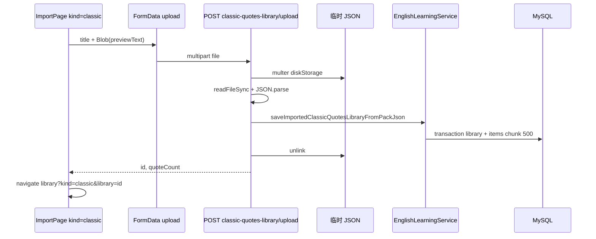

# 经典语句库：JSON 导入、持久化与资源库浏览

## 1. 背景与目标

**用户视角**：英语学习模块此前已支持**单词库**的 JSON 导入、multipart 大包上传与资源库左右分栏浏览；**经典语句**侧仅有导入页解析与「即将上线」占位，保存按钮无实际 API，资源库 `kind=classic` 无法列出已导入语句包。

**本轮目标**：使经典语句导入与单词导入**同一套产品与技术模式**——主表 + 子表持久化、multipart 绕开 JSON body 限制、导入成功跳转资源库并选中新建库、左侧语句库列表（分页 / 删除）、右侧语句分页浏览（朗读 + 收藏状态）。

**与既有文档关系**：

- 单词库总览：[`english-learning-library-import.md`](./english-learning-library-import.md)
- 资源库 Loading / 删除 / 单词收藏分批：[`english-learning-library-ux-and-delete.md`](./english-learning-library-ux-and-delete.md)

若与仓库最新源码不一致，**以源码为准**。

---

## 2. 改动范围

| 层级 | 路径 | 功能点 |
|------|------|--------|
| 实体 | `apps/backend/src/services/english-learning/english-classic-quotes-library.entity.ts` | 语句库元数据（标题、条数） |
| 实体 | `apps/backend/src/services/english-learning/english-classic-quotes-library-item.entity.ts` | 库内单条语句，`ON DELETE CASCADE` |
| DTO | `apps/backend/src/services/english-learning/dto/save-classic-quotes-library.dto.ts` | JSON body 小包保存校验 |
| 服务 | `apps/backend/src/services/english-learning/english-learning.service.ts` | 解析、事务落库、列表、分页、删除 |
| 控制器 | `apps/backend/src/services/english-learning/english-learning.controller.ts` | REST + multipart 上传 |
| 模块 | `apps/backend/src/services/english-learning/english-learning.module.ts` | 注册 TypeORM 实体与仓储注入 |
| 导入页 | `apps/frontend/src/views/englishLearning/import/EnglishLearningImportPage.tsx` | `parseClassicImport` + `onSaveToClassic` + 跳转 |
| 资源库页 | `apps/frontend/src/views/englishLearning/library/EnglishLearningLibraryPage.tsx` | 按 `kind` 切换右栏面板 |
| 库列表 | `apps/frontend/src/views/englishLearning/library/VocabularyLibraryListPanel.tsx` | `kind=classic` 走语句库 API（去掉 comingSoon） |
| 语句列表 | `apps/frontend/src/views/englishLearning/library/ClassicQuotesLibraryWordsPanel.tsx` | **新建**：右栏分页、TTS、收藏 |
| 单词右栏 | `apps/frontend/src/views/englishLearning/library/VocabularyLibraryWordsPanel.tsx` | 移除 `kind=classic` 占位分支 |
| API | `apps/frontend/src/service/api.ts`、`service/index.ts` | 路径常量与请求封装 |
| 文案 | `apps/frontend/src/i18n/locales/zh-CN.ts`、`en-US.ts` | 保存成功/加载、列表空态、删除确认等 |

**数据库迁移**：需存在与实体对应的 `english_classic_quotes_library` / `english_classic_quotes_library_item` 表；若仓库中尚无迁移文件，在 `apps/backend` 执行 `migration:generate` 后 `migration:run`（生产脚本见 `apps/backend/scripts/typeorm-prod.cjs`）。

---

## 3. 实现思路（按功能点）

### 3.1 与单词库对齐的架构决策

| 维度 | 单词库（已有） | 经典语句库（本轮） |
|------|----------------|-------------------|
| 主表字段 | `word_count` | `quote_count` |
| 子表排序 | `sort_order` 升序 = 导入顺序 | 同左 |
| 大包导入 | `POST vocabulary-library/upload` + multer | `POST classic-quotes-library/upload`，**复用同一套** `vocabularyLibraryJsonUploadMulterOptions()` |
| 小包导入 | `POST vocabulary-library` + DTO | `POST classic-quotes-library` + `SaveClassicQuotesLibraryDto` |
| 单包上限 | `ENGLISH_VOCAB_GENERATION_MAX` | `ENGLISH_CLASSIC_QUOTES_GENERATION_MAX`（6000） |
| 批量 insert | 事务内每 500 条 `save` 一片 | 同左 |
| 列表分页 | `GET vocabulary-libraries` | `GET classic-quotes-libraries` |
| 库内分页 | `GET .../items` | `GET classic-quotes-libraries/:id/items` |
| 删除 | `DELETE` + FK CASCADE | 同左 |
| 前端保存 | `uploadEnglishVocabularyLibraryJson` | `uploadEnglishClassicQuotesLibraryJson` |
| 导入成功跳转 | `?kind=vocab&library={id}` | `?kind=classic&library={id}` |

**为何不共用一张「通用 library 表」**：单词与语句字段结构不同（`word/ipa/pos` vs `english/translationZh/source/noteZh`），分表利于校验、索引与后续扩展；实现上通过**对称的 Service 方法名与 Controller 路由**降低认知成本。

### 3.2 前后端 JSON 解析规则必须一致

前端 `parseClassicImport` 与后端 `parseClassicPackRootToLibraryItems` 约定相同：

1. 根节点为**数组**，或 `{ "items": [...] }`（复用后端已有 `extractVocabularyImportItemArray`）。
2. 每条必填：`english`、`translationZh`（兼容 snake_case：`translation_zh`）。
3. 可选：`source`（缺省 `—`）、`noteZh` / `note_zh`（缺省 `—`）。
4. 无效行跳过；若最终 0 条 → 400 / 前端 `no-classic`。
5. 超过 6000 条 → 400。

### 3.3 资源库 UI：`kind` 驱动，而非两套左栏

左栏仍用 `VocabularyLibraryListPanel`，通过 `kind` 切换 API 与文案；右栏在 `EnglishLearningLibraryPage` 内**条件渲染** `VocabularyLibraryWordsPanel` 与 `ClassicQuotesLibraryWordsPanel`，避免在一个组件内堆砌两套卡片 UI。

### 3.4 端到端数据流（语句库保存）



---

## 4. 关键代码与详细注释

### 4.1 数据库实体：语句库主表

**来源**：`apps/backend/src/services/english-learning/english-classic-quotes-library.entity.ts`（约 L1–L38）

```typescript
@Entity('english_classic_quotes_library')
@Index('idx_ecql_user_created', ['userId', 'createdAt'])
export class EnglishClassicQuotesLibrary {
	@PrimaryGeneratedColumn('uuid')
	id!: string;

	@Column({ name: 'user_id', type: 'int' })
	userId!: number; // 多租户隔离：所有查询带 userId

	@Column({ type: 'varchar', length: 200 })
	title!: string; // 用户导入时填写的包标题

	@Column({ name: 'quote_count', type: 'int' })
	quoteCount!: number; // 冗余计数，列表展示无需 COUNT 子表

	@CreateDateColumn({ name: 'created_at', type: 'timestamp' })
	createdAt!: Date;

	@OneToMany(() => EnglishClassicQuotesLibraryItem, (item) => item.library)
	items!: EnglishClassicQuotesLibraryItem[];
}
```

### 4.2 数据库实体：库内单条语句

**来源**：`apps/backend/src/services/english-learning/english-classic-quotes-library-item.entity.ts`（约 L14–L48）

```typescript
@Entity('english_classic_quotes_library_item')
@Index('idx_ecqli_library_sort', ['libraryId', 'sortOrder'])
export class EnglishClassicQuotesLibraryItem {
	@PrimaryGeneratedColumn('uuid')
	id!: string;

	@Column({ name: 'library_id', type: 'varchar', length: 36 })
	libraryId!: string;

	@ManyToOne(() => EnglishClassicQuotesLibrary, (lib) => lib.items, {
		onDelete: 'CASCADE', // 删库时 DB 级联删语句，无需应用层逐条删
	})
	@JoinColumn({ name: 'library_id' })
	library!: EnglishClassicQuotesLibrary;

	@Column({ name: 'sort_order', type: 'int' })
	sortOrder!: number; // 导入时按数组下标写入，分页 ORDER BY sort_order ASC

	@Column({ type: 'text' })
	english!: string;

	@Column({ name: 'translation_zh', type: 'text' })
	translationZh!: string;

	@Column({ type: 'varchar', length: 2000, default: '' })
	source!: string;

	@Column({ name: 'note_zh', type: 'text' })
	noteZh!: string;
}
```

### 4.3 DTO：小包 JSON body 校验

**来源**：`apps/backend/src/services/english-learning/dto/save-classic-quotes-library.dto.ts`（全文）

```typescript
// 单条字段上限与前端 EnglishClassicQuoteItem、DB 列宽对齐
export class SaveClassicQuotesLibraryItemDto {
	@IsString()
	@IsNotEmpty()
	@MaxLength(8000)
	english!: string;

	@IsString()
	@IsNotEmpty()
	@MaxLength(8000)
	translationZh!: string;

	@IsString()
	@MaxLength(2000)
	source!: string;

	@IsString()
	@MaxLength(8000)
	noteZh!: string;
}

export class SaveClassicQuotesLibraryDto {
	@IsString()
	@IsNotEmpty()
	@MaxLength(200)
	title!: string;

	@IsArray()
	@ArrayMinSize(1)
	@ArrayMaxSize(ENGLISH_CLASSIC_QUOTES_GENERATION_MAX) // 6000，与流式生成上限共用常量
	@ValidateNested({ each: true })
	@Type(() => SaveClassicQuotesLibraryItemDto)
	items!: SaveClassicQuotesLibraryItemDto[];
}
```

### 4.4 Service：解析导入 JSON（与前端对齐）

**来源**：`apps/backend/src/services/english-learning/english-learning.service.ts`（`parseClassicPackRootToLibraryItems`，约 L1352–L1395）

```typescript
private parseClassicPackRootToLibraryItems(
	root: unknown,
): EnglishClassicQuoteItemJson[] {
	// 与单词库共用：支持 [] 或 { items: [] }
	const arr = this.extractVocabularyImportItemArray(root);
	if (!arr) {
		throw new BadRequestException('JSON 需为数组或包含 items 数组的对象');
	}

	const itemsJson: EnglishClassicQuoteItemJson[] = [];
	for (const row of arr) {
		if (!row || typeof row !== 'object') continue;
		const o = row as Record<string, unknown>;

		const english = typeof o.english === 'string' ? o.english.trim() : '';
		const translationZh =
			typeof o.translationZh === 'string'
				? o.translationZh.trim()
				: typeof o.translation_zh === 'string'
					? o.translation_zh.trim()
					: '';

		// 与前端 parseClassicImport 一致：缺 english 或译文则跳过该行
		if (!english || !translationZh) continue;

		const source =
			typeof o.source === 'string' ? o.source.trim().slice(0, 2000) : '—';
		const noteZh =
			typeof o.noteZh === 'string'
				? o.noteZh.trim().slice(0, 8000)
				: typeof o.note_zh === 'string'
					? o.note_zh.trim().slice(0, 8000)
					: '—';

		itemsJson.push({ english, translationZh, source, noteZh });
	}

	if (!itemsJson.length) {
		throw new BadRequestException(
			'未解析到有效经典语句（每项需含非空 english 与 translationZh）',
		);
	}
	if (itemsJson.length > ENGLISH_CLASSIC_QUOTES_GENERATION_MAX) {
		throw new BadRequestException(
			`单次最多保存 ${ENGLISH_CLASSIC_QUOTES_GENERATION_MAX} 条经典语句`,
		);
	}
	return itemsJson;
}
```

### 4.5 Service：事务落库 + 分批写入

**来源**：`apps/backend/src/services/english-learning/english-learning.service.ts`（`persistClassicQuotesLibrary`，约 L1423–L1465）

```typescript
private async persistClassicQuotesLibrary(
	userId: number,
	title: string,
	itemsJson: EnglishClassicQuoteItemJson[],
): Promise<{ id: string; quoteCount: number }> {
	const t = title.trim().slice(0, 200);
	if (!t) throw new BadRequestException('标题不能为空');

	const quoteCount = itemsJson.length;

	return this.dataSource.transaction(async (manager) => {
		const libRepo = manager.getRepository(EnglishClassicQuotesLibrary);
		const itemRepo = manager.getRepository(EnglishClassicQuotesLibraryItem);

		// 先写主表，拿到 lib.id 再写子表
		const lib = await libRepo.save(
			libRepo.create({ userId, title: t, quoteCount }),
		);

		const itemRows = itemsJson.map((item, index) =>
			itemRepo.create({
				libraryId: lib.id,
				userId,
				sortOrder: index, // 保序：与 JSON 数组顺序一致
				english: item.english,
				translationZh: item.translationZh,
				source: item.source ?? '',
				noteZh: item.noteZh,
			}),
		);

		// 避免单次 save 过大：与单词库相同 chunkSize=500
		const chunkSize = 500;
		for (let i = 0; i < itemRows.length; i += chunkSize) {
			await itemRepo.save(itemRows.slice(i, i + chunkSize));
		}

		return { id: lib.id, quoteCount: lib.quoteCount };
	});
}
```

### 4.6 Service：列表、库内分页、删除、上传入口

**来源**：`apps/backend/src/services/english-learning/english-learning.service.ts`（约 L1467–L1562，摘录）

```typescript
// 删除：校验 userId 后 remove 主表，子表由 CASCADE 清理
async deleteClassicQuotesLibrary(userId: number, libraryId: string) {
	const lib = await this.assertClassicQuotesLibraryOwned(userId, libraryId);
	await this.classicQuotesLibraryRepo.remove(lib);
	return { deleted: true };
}

// 库列表：createdAt DESC，limit 默认 20、最大 100
async listClassicQuotesLibraries(userId, options?) { /* ... */ }

// 库内语句：assert 归属 → sort_order ASC，limit 默认 50、最大 200
async listClassicQuotesLibraryItems(userId, libraryId, options?) { /* ... */ }

// multipart 上传链路入口
async saveImportedClassicQuotesLibraryFromPackJson(
	userId: number,
	title: string,
	root: unknown,
) {
	const itemsJson = this.parseClassicPackRootToLibraryItems(root);
	return this.persistClassicQuotesLibrary(userId, title, itemsJson);
}
```

### 4.7 Controller：REST 与 multipart 上传

**来源**：`apps/backend/src/services/english-learning/english-learning.controller.ts`（约 L407–L539，结构摘录）

```typescript
@Get('classic-quotes-libraries')
async listClassicQuotesLibraries(/* limit/offset 与单词库相同裁剪逻辑 */) {
	const data = await this.englishLearningService.listClassicQuotesLibraries(
		userId,
		{ limit, offset },
	);
	return { success: true, data };
}

@Delete('classic-quotes-libraries/:libraryId')
async deleteClassicQuotesLibrary(/* ... */) { /* ... */ }

@Get('classic-quotes-libraries/:libraryId/items')
async listClassicQuotesLibraryItems(/* ... */) { /* ... */ }

@Post('classic-quotes-library/upload')
@UseInterceptors(FileInterceptor('file', vocabularyLibraryJsonUploadMulterOptions()))
async saveClassicQuotesLibraryUpload(@UploadedFile() file, @Body('title') titleRaw) {
	const diskPath = file?.path;
	try {
		const text = readFileSync(diskPath, 'utf8');
		const root = JSON.parse(text);
		const data =
			await this.englishLearningService.saveImportedClassicQuotesLibraryFromPackJson(
				userId,
				title,
				root,
			);
		return { success: true, data };
	} finally {
		if (diskPath) await unlink(diskPath); // 临时文件必清理
	}
}

@Post('classic-quotes-library')
async saveClassicQuotesLibrary(@Body() dto: SaveClassicQuotesLibraryDto) {
	// 小包：已解析好的 items 数组，不经由文件
}
```

### 4.8 Module：注册实体

**来源**：`apps/backend/src/services/english-learning/english-learning.module.ts`（`TypeOrmModule.forFeature` 数组内）

```typescript
TypeOrmModule.forFeature([
	// ... 既有实体 ...
	EnglishClassicQuotesLibrary,
	EnglishClassicQuotesLibraryItem,
]),
```

Service 构造函数中注入：

```typescript
@InjectRepository(EnglishClassicQuotesLibrary)
private readonly classicQuotesLibraryRepo: Repository<EnglishClassicQuotesLibrary>,
@InjectRepository(EnglishClassicQuotesLibraryItem)
private readonly classicQuotesLibraryItemRepo: Repository<EnglishClassicQuotesLibraryItem>,
```

### 4.9 前端 API 常量与 multipart 封装

**来源**：`apps/frontend/src/service/api.ts`（约 L136–L144）

```typescript
export const ENGLISH_LEARNING_CLASSIC_QUOTES_LIBRARY =
	'/english-learning/classic-quotes-library';
export const ENGLISH_LEARNING_CLASSIC_QUOTES_LIBRARY_UPLOAD =
	'/english-learning/classic-quotes-library/upload';
export const ENGLISH_LEARNING_CLASSIC_QUOTES_LIBRARIES =
	'/english-learning/classic-quotes-libraries';
```

**来源**：`apps/frontend/src/service/index.ts`（`uploadEnglishClassicQuotesLibraryJson`，约 L637–L714）

```typescript
export const uploadEnglishClassicQuotesLibraryJson = async (params: {
	title: string;
	jsonUtf8: string;
	filename?: string;
}) => {
	const fd = new FormData();
	fd.append('title', params.title);
	// 字段名 file 必须与后端 FileInterceptor('file') 一致
	fd.append(
		'file',
		new Blob([params.jsonUtf8], { type: 'application/json' }),
		params.filename ?? 'classic-quotes-import.json',
	);
	return await http.post<{ id: string; quoteCount: number }>(
		ENGLISH_LEARNING_CLASSIC_QUOTES_LIBRARY_UPLOAD,
		fd,
		{ timeout: 120_000 }, // 大包写入可能较慢
	);
};

// 列表 / 删除 / 库内 items 与单词库对称
export const listEnglishClassicQuotesLibraries = async (options?) => { /* GET libraries */ };
export const deleteEnglishClassicQuotesLibrary = async (libraryId) => { /* DELETE */ };
export const listEnglishClassicQuotesLibraryItems = async (libraryId, options?) => {
	// GET .../libraries/:id/items
};
```

### 4.10 导入页：前端解析 `parseClassicImport`

**来源**：`apps/frontend/src/views/englishLearning/import/EnglishLearningImportPage.tsx`（约 L72–L102）

```typescript
function parseClassicImport(data: unknown) {
	const arr = extractItemArray(data); // [] 或 { items: [] }
	if (!arr) return { ok: false, reason: 'expect-array' };

	const items: EnglishClassicQuoteItem[] = [];
	for (const row of arr) {
		if (!row || typeof row !== 'object') continue;
		const o = row as Record<string, unknown>;

		const english = typeof o.english === 'string' ? o.english.trim() : '';
		const translationZh =
			typeof o.translationZh === 'string'
				? o.translationZh.trim()
				: typeof o.translation_zh === 'string'
					? o.translation_zh.trim()
					: '';

		if (!english || !translationZh) continue; // 与后端跳过规则一致

		const source = typeof o.source === 'string' ? o.source : '—';
		const noteZh =
			typeof o.noteZh === 'string'
				? o.noteZh
				: typeof o.note_zh === 'string'
					? o.note_zh
					: '—';

		items.push({ english, translationZh, source, noteZh });
	}

	if (!items.length) return { ok: false, reason: 'no-classic' };
	return { ok: true, items };
}
```

### 4.11 导入页：保存到语句库并跳转

**来源**：`apps/frontend/src/views/englishLearning/import/EnglishLearningImportPage.tsx`（`onSaveToClassic`，约 L301–L346）

```typescript
const onSaveToClassic = useCallback(async () => {
	// 与单词保存相同门禁：JSON 合法、结构校验通过、已解析、标题非空
	if (jsonErrorKind !== null || structFailReason !== null) { /* Toast */ return; }
	if (!parsedClassic?.length) { /* Toast */ return; }
	if (!importTitle.trim()) { /* Toast */ return; }

	try {
		setClassicSaveLoading(true);
		// 上传 Monaco 中的完整 previewText（含格式化），而非仅 parsedClassic 重建
		const res = await uploadEnglishClassicQuotesLibraryJson({
			title: importTitle.trim(),
			jsonUtf8: previewText,
		});
		if (res.success && res.data) {
			Toast({ title: t('englishLearning.import.saveClassicSuccess', {
				count: String(res.data.quoteCount),
			})});
			navigate(
				`/english-learning/library?kind=classic&library=${encodeURIComponent(res.data.id)}`,
				{ replace: true }, // replace 避免「返回」回到已完成的导入页
			);
		}
	} finally {
		setClassicSaveLoading(false);
	}
}, [/* importTitle, previewText, parsedClassic, ... */]);
```

保存按钮 `disabled` 条件与单词对称：`classicSaveLoading`、解析错误、无 `parsedClassic`、无标题。

### 4.12 资源库左栏：`kind` 切换 API

**来源**：`apps/frontend/src/views/englishLearning/library/VocabularyLibraryListPanel.tsx`（约 L31–L108）

```typescript
export type EnglishLibraryListItem =
	| EnglishVocabularyLibraryListItem
	| EnglishClassicQuotesLibraryListItem;

function getLibraryItemCount(lib: EnglishLibraryListItem, kind: 'vocab' | 'classic') {
	return kind === 'vocab'
		? (lib as EnglishVocabularyLibraryListItem).wordCount
		: (lib as EnglishClassicQuotesLibraryListItem).quoteCount;
}

const fetchFirstPage = useCallback(async () => {
	const res =
		kind === 'vocab'
			? await listEnglishVocabularyLibraries({ limit, offset: 0 })
			: await listEnglishClassicQuotesLibraries({ limit, offset: 0 });
	// 首屏若有 URL library=uuid，优先选中对应项（导入跳转场景）
	const preferred = bootLibraryIdRef.current
		? list.find((l) => l.id === bootLibraryIdRef.current)
		: undefined;
	onSelectRef.current(preferred ?? list[0]);
}, [kind]);
```

**移除**：原 `kind === 'classic'` 时整页 `comingSoon` 占位（约 L200–L219 旧代码）。

删除库时按 `kind` 调用 `deleteEnglishVocabularyLibrary` 或 `deleteEnglishClassicQuotesLibrary`；确认框文案使用 `deleteConfirmTitleClassic` / `deleteConfirmDescClassic`。

### 4.13 资源库页：右栏按 `kind` 分派

**来源**：`apps/frontend/src/views/englishLearning/library/EnglishLearningLibraryPage.tsx`（约 L82–L136）

```typescript
const vocabLibraryMeta =
	kind === 'vocab' && selectedLibrary
		? (selectedLibrary as EnglishVocabularyLibraryListItem)
		: null;
const classicLibraryMeta =
	kind === 'classic' && selectedLibrary
		? (selectedLibrary as EnglishClassicQuotesLibraryListItem)
		: null;

{kind === 'vocab' ? (
	<VocabularyLibraryWordsPanel
		libraryId={activeLibraryId}
		libraryMeta={vocabLibraryMeta}
	/>
) : (
	<ClassicQuotesLibraryWordsPanel
		libraryId={activeLibraryId}
		libraryMeta={classicLibraryMeta}
	/>
)}
```

`kind` 切换时 `useEffect` 清空 `selectedLibrary`，并由 `listBootLibraryId` 驱动左栏首次选中 URL 中的 `library`。

### 4.14 右栏语句列表：分页 + 收藏状态 + TTS

**来源**：`apps/frontend/src/views/englishLearning/library/ClassicQuotesLibraryWordsPanel.tsx`（约 L93–L159、收藏 effect 约 L70–L91）

```typescript
// 首屏 / 加载更多：与单词右栏相同 offsetRef + hasMoreRef 模式
const fetchFirstPage = useCallback(async (id: string) => {
	const res = await listEnglishClassicQuotesLibraryItems(id, {
		limit: VOCAB_LIBRARY_ITEMS_PAGE_SIZE,
		offset: 0,
	});
	setItems(res.data?.items ?? []);
	offsetRef.current = list.length;
	hasMoreRef.current = list.length >= VOCAB_LIBRARY_ITEMS_PAGE_SIZE;
}, []);

// 当前页所有 english 变更时，批量查收藏 contentKey（与 ClassicQuotesSection 相同）
useEffect(() => {
	if (items.length === 0) {
		setFavoritedContentKeys(new Set());
		return;
	}
	const res = await fetchEnglishClassicQuoteFavoriteStatus(
		items.map((i) => i.english),
	);
	setFavoritedContentKeys(new Set(res.data?.favoritedContentKeys ?? []));
}, [itemsEnglishSig]);

// 卡片：朗读 playEnglishPreferred(english)、星标 toggleClassicQuoteFavorite
// 收藏键：classicQuoteFavoriteContentKey(english) — SHA256(trim+lower)
```

**说明**：语句库右栏**未**接入 `useIncrementalVocabFavoriteStatus`（该 Hook 面向单词 `word` 键）；语句列表通常单页 50 条，直接 `fetchEnglishClassicQuoteFavoriteStatus` 即可。若单库极大滚动累积超过接口上限，可后续复用分批策略（见 [`vocab-favorite-status-query.md`](./vocab-favorite-status-query.md)）。

---

## 5. HTTP API 一览

| 方法 | 路径 | 说明 |
|------|------|------|
| `GET` | `/english-learning/classic-quotes-libraries` | 当前用户语句库列表（`limit`/`offset`） |
| `DELETE` | `/english-learning/classic-quotes-libraries/:libraryId` | 删除库（级联语句） |
| `GET` | `/english-learning/classic-quotes-libraries/:libraryId/items` | 库内语句分页 |
| `POST` | `/english-learning/classic-quotes-library` | JSON body 小包保存 |
| `POST` | `/english-learning/classic-quotes-library/upload` | multipart：`title` + `file` |

成功保存/upload 响应：`{ success: true, data: { id, quoteCount } }`。

---

## 6. JSON 导入格式示例

```json
[
  {
    "english": "Education is not the filling of a pail, but the lighting of a fire.",
    "translationZh": "教育不是注满一桶水，而是点燃一把火。",
    "source": "William Butler Yeats",
    "noteZh": "经典比喻，阐明教育的本质是激发热情。"
  }
]
```

或使用 `{ "items": [ ... ] }` 包裹。

---

## 7. 兼容性与影响

| 项 | 说明 |
|----|------|
| 破坏性 | 无；新增表与路由，不影响既有 SSE 生成 / 历史 / 收藏表 |
| 与流式生成 | `english_classic_quote` 批次表与「用户命名导入库」仍分表，数据不自动合并 |
| 收藏 | 库内星标走既有 `classic-quotes-favorites` API，与「语句收藏」页一致 |
| 迁移 | **部署前必须**跑迁移；未建表时所有库 API 会 500 |

---

## 8. 建议回归测试

1. **导入**：`/english-learning/import?kind=classic` 上传合法 JSON → 保存 → 跳转资源库且左栏选中新建库。
2. **校验**：缺 `translationZh`、空数组、非法 JSON、超 6000 条 → 前后端错误提示一致。
3. **大包**：>100KB JSON 走 multipart 成功（对比若走 JSON body 会失败）。
4. **资源库**：左栏滚动加载更多库；右栏滚动加载更多语句；删除库后 URL `library` 清空。
5. **朗读 / 收藏**：右栏播放、加收藏后在「语句收藏」页可见。
6. **切换 kind**：`?kind=vocab` 与 `?kind=classic` 列表互不影响。

---

## 9. 相关源码路径

| 说明 | 路径 |
|------|------|
| 语句库主表实体 | `apps/backend/src/services/english-learning/english-classic-quotes-library.entity.ts` |
| 语句子表实体 | `apps/backend/src/services/english-learning/english-classic-quotes-library-item.entity.ts` |
| 保存 DTO | `apps/backend/src/services/english-learning/dto/save-classic-quotes-library.dto.ts` |
| 业务逻辑 | `apps/backend/src/services/english-learning/english-learning.service.ts` |
| HTTP 入口 | `apps/backend/src/services/english-learning/english-learning.controller.ts` |
| 导入页 | `apps/frontend/src/views/englishLearning/import/EnglishLearningImportPage.tsx` |
| 资源库壳 | `apps/frontend/src/views/englishLearning/library/EnglishLearningLibraryPage.tsx` |
| 左栏列表 | `apps/frontend/src/views/englishLearning/library/VocabularyLibraryListPanel.tsx` |
| 右栏语句 | `apps/frontend/src/views/englishLearning/library/ClassicQuotesLibraryWordsPanel.tsx` |
| 前端 API | `apps/frontend/src/service/api.ts`、`apps/frontend/src/service/index.ts` |
| 单词库对照文档 | `docs/frontend/english-learning-library-import.md` |
