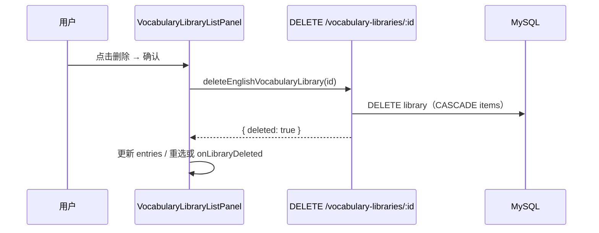

# 英语学习资源库与收藏：交互优化与单词库删除

## 1. 背景与目标

本轮改动围绕**资源库 / 收藏 / 导入**三条用户路径，解决四类问题：

| 序号 | 问题 | 目标 |
|------|------|------|
| ① | 首屏 Loading 仅用 `py-12` 占位，无法在滚动区域内垂直居中 | 在 `ScrollArea` 可视高度内居中展示 Loading |
| ② | 资源库滚动累积超过 500 词后，收藏状态接口 `words` 超限返回 400 | Service 自动分批；页面仅增量查询新词 |
| ③ | JSON 导入保存成功后仍停留在导入页 | 跳转到资源库并选中新建单词库 |
| ④ | 单词库列表无法删除；删除需连同库内词条 | 二次确认 + `DELETE` API + DB 级联删除词条 |

**说明**：收藏状态查询的专题说明另见 [`vocab-favorite-status-query.md`](./vocab-favorite-status-query.md)。若与仓库最新源码不一致，**以源码为准**。

---

## 2. 改动范围

| 层级 | 路径 | 对应功能点 |
|------|------|------------|
| UI 组件 | `apps/frontend/src/components/ui/scroll-area.tsx` | ① 视口子节点 flex 撑满（既有能力，本轮回用） |
| 收藏页 | `.../favorites/VocabularyFavoritesPanel.tsx` | ① |
| 收藏页 | `.../favorites/ClassicQuotesFavoritesPanel.tsx` | ① |
| 资源库 | `.../library/VocabularyLibraryListPanel.tsx` | ① ④ |
| 资源库 | `.../library/VocabularyLibraryWordsPanel.tsx` | ① |
| 资源库 | `.../library/EnglishLearningLibraryPage.tsx` | ④ 删除后清空 URL |
| 导入页 | `.../import/EnglishLearningImportPage.tsx` | ③ |
| 常量 | `apps/frontend/src/constant/index.ts` | ② `VOCAB_FAVORITE_STATUS_BATCH_SIZE` |
| Service | `apps/frontend/src/service/index.ts` | ② ④ |
| Hook | `apps/frontend/src/hooks/useIncrementalVocabFavoriteStatus.ts` | ② |
| Hook 导出 | `apps/frontend/src/hooks/index.ts` | ② |
| 单词包 | `.../vocab/VocabularySection.tsx` | ② 接入 Hook |
| 文案 | `apps/frontend/src/i18n/locales/zh-CN.ts`、`en-US.ts` | ④ |
| 后端 Service | `apps/backend/.../english-learning.service.ts` | ④ |
| 后端 Controller | `apps/backend/.../english-learning.controller.ts` | ④ |
| 实体 / 迁移 | `english-vocabulary-library-item.entity.ts`、`1778901200000-vocabulary-library-items.ts` | ④ FK `ON DELETE CASCADE`（既有，本轮回用） |

---

## 3. 实现思路总览

```mermaid
flowchart TB
  subgraph UX1["① Loading 垂直居中"]
    SA[ScrollArea Viewport flex min-h-full]
    LD[loading 分支: 唯一子节点 flex-1 items-center]
  end
  subgraph UX2["② 收藏状态"]
    HK[useIncrementalVocabFavoriteStatus]
    SVC[fetchEnglishVocabularyFavoriteStatus 分批 500]
    API[POST vocabulary-favorites/status]
  end
  subgraph UX3["③ 导入跳转"]
    IMP[upload 成功]
    NAV[navigate library?kind=vocab&library=id]
  end
  subgraph UX4["④ 删除词库"]
    CF[Confirm 二次确认]
    DEL[DELETE vocabulary-libraries/:id]
    DB[(library 行删除 → items CASCADE)]
  end
  SA --> LD
  HK --> SVC --> API
  IMP --> NAV
  CF --> DEL --> DB
```



---

## 4. 功能点 ①：ScrollArea 内 Loading 垂直居中

### 4.1 原因

Radix `ScrollArea` 在 Viewport 内用 `display: table` 包裹子节点，子内容高度随内容收缩，**无法占满视口**，`justify-center` 只能在内容高度内居中，视觉上偏上。

### 4.2 实现过程

1. **组件层（已有）**：`scroll-area.tsx` 对 Viewport 直接子节点强制 `flex flex-col min-h-full`。
2. **页面层（本轮）**：初始加载时，**不再**把 Loading 放在 `grid` 里用 `py-12`；改为 `ScrollArea` 的**唯一直接子节点**，类名 `min-h-full flex-1 items-center justify-center`。
3. **有数据时**：列表内容包在 `grid` 或 `flex-col` 中，与 loading 分支互斥（三元表达式）。

### 4.3 适用页面

- `VocabularyFavoritesPanel`、`ClassicQuotesFavoritesPanel`
- `VocabularyLibraryListPanel`、`VocabularyLibraryWordsPanel`

### 4.4 关键代码

**来源**：`apps/frontend/src/components/ui/scroll-area.tsx`（约 L48–L56）

```tsx
<ScrollAreaPrimitive.Viewport
  className={cn(
    'size-full max-w-full min-w-0 /* ... */',
    // 说明：压过 Radix 内联 display:table，使子节点可按视口高度做 flex 布局
    '[&>div]:flex! [&>div]:min-h-full! [&>div]:min-w-full! [&>div]:flex-col!',
    viewportClassName,
  )}
>
  {children}
</ScrollAreaPrimitive.Viewport>
```

**来源**：`apps/frontend/src/views/englishLearning/favorites/VocabularyFavoritesPanel.tsx`（约 L265–L276）

```tsx
<div className="flex h-full min-h-0 flex-col">
  <ScrollArea className="@container min-h-0 flex-1 px-4 py-4" onScroll={onViewportScroll}>
    {showInitialLoading ? (
      // 说明：作为 ScrollArea 唯一子节点，flex-1 + min-h-full 占满视口后垂直居中
      <div className="text-textcolor/60 flex min-h-full flex-1 items-center justify-center text-center text-sm">
        <Loading text={t('englishLearning.vocab.favoritesLoading')} />
      </div>
    ) : (
      <div className="grid grid-cols-2 gap-4">
        {/* 说明：有数据时的双列卡片，与 loading 分支互斥 */}
        {entries.map((row) => (/* ... */))}
      </div>
    )}
  </ScrollArea>
  <footer>{/* 底栏工具条 */}</footer>
</div>
```

**来源**：`apps/frontend/src/views/englishLearning/favorites/ClassicQuotesFavoritesPanel.tsx`（约 L282–L291）

```tsx
{showInitialLoading ? (
  <div className="text-textcolor/60 flex min-h-full flex-1 items-center justify-center text-center text-sm">
    <Loading text={t('englishLearning.classic.favoritesLoading')} />
  </div>
) : (
  <div className="grid grid-cols-2 gap-4">{/* 语句收藏列表 */}</div>
)}
```

**来源**：`apps/frontend/src/views/englishLearning/library/VocabularyLibraryListPanel.tsx`（约 L270–L276）

```tsx
<ScrollArea className="min-h-0 flex-1 py-4" onScroll={onViewportScroll}>
  {showInitialLoading ? (
    <div className="text-textcolor/60 flex min-h-full flex-1 items-center justify-center text-center text-sm">
      <Loading text={t('englishLearning.library.listLoading')} />
    </div>
  ) : (
    <div className="flex flex-col gap-4 px-4">{/* 单词库列表项 */}</div>
  )}
</ScrollArea>
```

### 4.5 布局约束

- 父级链须具备 `flex h-full min-h-0 flex-col`，且 `ScrollArea` 使用 `flex-1 min-h-0`，否则无剩余高度可撑满。

---

## 5. 功能点 ②：收藏状态分批查询与增量同步

### 5.1 原因

- 后端 `VocabularyFavoriteStatusDto` 限制 `words` 最多 **500** 条，资源库滚动加载全量查询会 400。
- 改前每次 `items` 变化都对**已加载全部词**重复请求，性能差。

### 5.2 实现过程（两层）

**层 A — Service 分批（兜底）**

1. 常量 `VOCAB_FAVORITE_STATUS_BATCH_SIZE = 500` 与后端对齐。
2. `fetchEnglishVocabularyFavoriteStatus`：`words.length ≤ 500` 单次 POST；否则按 500 切片**串行**请求，合并 `favoritedWordKeys`。

**层 B — Hook 增量（页面优化）**

1. 新建 `useIncrementalVocabFavoriteStatus(items)`。
2. `queriedKeysRef` 记录已查过的规范化词形；仅对新词调用 Service。
3. `itemsWordSig`（词面用 `\u0001` 拼接）判断**末尾追加** vs **整体替换**；替换时清空本地 Set 与 ref。
4. 结果 **merge** 进 `favoritedWordKeys`，不整表覆盖。
5. `VocabularyLibraryWordsPanel`、`VocabularySection` 删除原全量 `useEffect`，改用 Hook。

### 5.3 关键代码

**来源**：`apps/frontend/src/constant/index.ts`（约 L59–L60）

```typescript
/** 收藏状态批量查询单次最多词数，与后端 VocabularyFavoriteStatusDto 的 @ArrayMaxSize(500) 一致 */
export const VOCAB_FAVORITE_STATUS_BATCH_SIZE = 500;
```

**来源**：`apps/frontend/src/service/index.ts`（约 L657–L684，`fetchEnglishVocabularyFavoriteStatus`）

```typescript
export const fetchEnglishVocabularyFavoriteStatus = async (words: string[]) => {
  // 说明：常见路径（增量每批 ≤50～500）走单次请求
  if (words.length <= VOCAB_FAVORITE_STATUS_BATCH_SIZE) {
    return await http.post<{ favoritedWordKeys: string[] }>(
      `${ENGLISH_LEARNING_VOCABULARY_FAVORITES}/status`,
      { words },
    );
  }
  const favoritedWordKeys: string[] = [];
  let lastRes: Awaited<ReturnType<typeof http.post<{ favoritedWordKeys: string[] }>>>;
  // 说明：串行分批，避免并行打满连接；总耗时 ≈ 批次数 × RTT
  for (let i = 0; i < words.length; i += VOCAB_FAVORITE_STATUS_BATCH_SIZE) {
    const batch = words.slice(i, i + VOCAB_FAVORITE_STATUS_BATCH_SIZE);
    lastRes = await http.post<{ favoritedWordKeys: string[] }>(
      `${ENGLISH_LEARNING_VOCABULARY_FAVORITES}/status`,
      { words: batch },
    );
    const keys = lastRes.data?.favoritedWordKeys;
    if (Array.isArray(keys)) favoritedWordKeys.push(...keys);
  }
  return { ...lastRes!, data: { favoritedWordKeys } };
};
```

**来源**：`apps/frontend/src/hooks/useIncrementalVocabFavoriteStatus.ts`（全文约 L1–L84）

```typescript
const WORD_SIG_SEP = '\u0001'; // 说明：作词序列签名分隔符，降低与词面冲突概率

export function useIncrementalVocabFavoriteStatus(items: ReadonlyArray<{ word: string }>) {
  const [favoritedWordKeys, setFavoritedWordKeys] = useState<Set<string>>(() => new Set());
  const queriedKeysRef = useRef<Set<string>>(new Set());
  const prevItemsWordSigRef = useRef('');

  const itemsWordSig = useMemo(
    () => items.map((it) => it.word).join(WORD_SIG_SEP),
    [items],
  );

  useEffect(() => {
    if (items.length === 0) {
      setFavoritedWordKeys(new Set());
      queriedKeysRef.current = new Set();
      prevItemsWordSigRef.current = '';
      return;
    }

    const prevSig = prevItemsWordSigRef.current;
    // 说明：新 sig 以「旧 sig + 分隔符」为前缀 → 分页追加；否则视为换库/历史覆盖
    const appended =
      prevSig.length > 0 &&
      (itemsWordSig === prevSig || itemsWordSig.startsWith(`${prevSig}${WORD_SIG_SEP}`));

    if (!appended) {
      setFavoritedWordKeys(new Set());
      queriedKeysRef.current = new Set();
    }
    prevItemsWordSigRef.current = itemsWordSig;

    const wordsToQuery: string[] = [];
    for (const item of items) {
      const wk = normalizeEnglishVocabWordKey(item.word);
      if (!wk || queriedKeysRef.current.has(wk)) continue;
      queriedKeysRef.current.add(wk);
      wordsToQuery.push(item.word);
    }
    if (wordsToQuery.length === 0) return;

    let cancelled = false;
    void (async () => {
      try {
        const res = await fetchEnglishVocabularyFavoriteStatus(wordsToQuery);
        if (cancelled) return;
        const keys = res.data?.favoritedWordKeys;
        if (!Array.isArray(keys) || keys.length === 0) return;
        setFavoritedWordKeys((prev) => {
          const next = new Set(prev);
          for (const k of keys) next.add(k);
          return next;
        });
      } catch {
        if (!cancelled) {
          for (const word of wordsToQuery) {
            const wk = normalizeEnglishVocabWordKey(word);
            if (wk) queriedKeysRef.current.delete(wk);
          }
        }
      }
    })();
    return () => { cancelled = true; };
  }, [itemsWordSig, items]);

  return { favoritedWordKeys, setFavoritedWordKeys };
}
```

**来源**：`apps/frontend/src/views/englishLearning/library/VocabularyLibraryWordsPanel.tsx`（约 L53–L54）

```typescript
const { favoritedWordKeys, setFavoritedWordKeys } =
  useIncrementalVocabFavoriteStatus(items);
// 说明：fetchMore 追加 items 后，Hook 仅对新增词请求 /status
```

### 5.4 性能对比（资源库每页 50 词）

| 已加载词数 | 改前每次滚动 | 改后每次滚动 |
|-----------|-------------|-------------|
| 50 → 100 | 查 100 | 查 50 |
| 500 → 550 | 查 550（2 批） | 查 50 |

更细的序列图与后端 DTO 见 [`vocab-favorite-status-query.md`](./vocab-favorite-status-query.md)。

---

## 6. 功能点 ③：导入保存后跳转资源库

### 6.1 原因

用户保存 JSON 单词包后需立即在资源库中查看词条，停留在导入页多一步手动导航。

### 6.2 实现过程

1. `EnglishLearningImportPage` 引入 `useNavigate`。
2. `uploadEnglishVocabularyLibraryJson` 成功且 `res.data.id` 存在时，在成功 Toast 之后执行 `navigate`。
3. 目标 URL：`/english-learning/library?kind=vocab&library={id}`，`replace: true` 避免返回键回到导入页。
4. 资源库页 `listBootLibraryId` / `VocabularyLibraryListPanel` 根据 URL `library` 参数自动选中该库。

### 6.3 关键代码

**来源**：`apps/frontend/src/views/englishLearning/import/EnglishLearningImportPage.tsx`（约 L251–L297）

```typescript
const navigate = useNavigate();

const onSaveToVocab = useCallback(async () => {
  // 说明：校验 JSON、解析结果、标题等非空（略）
  try {
    setVocabSaveLoading(true);
    const res = await uploadEnglishVocabularyLibraryJson({
      title: importTitle.trim(),
      jsonUtf8: previewText,
    });
    if (res.success && res.data) {
      Toast({
        type: 'success',
        title: t('englishLearning.import.saveVocabSuccess', {
          count: String(res.data.wordCount),
        }),
      });
      // 说明：跳转到资源库并带上新建库 id，左侧列表与右侧词条面板联动选中
      navigate(
        `/english-learning/library?kind=vocab&library=${encodeURIComponent(res.data.id)}`,
        { replace: true },
      );
    }
  } catch {
    // 错误由 http 层 Toast
  } finally {
    setVocabSaveLoading(false);
  }
}, [importTitle, jsonErrorKind, navigate, previewText, structFailReason, t]);
```

### 6.4 边界

- **经典语句导入**（`onSaveToClassic`）仍为占位，未实现保存 API，故**无**对应跳转。
- `encodeURIComponent` 防止 id 含特殊字符破坏 query。

---

## 7. 功能点 ④：单词库删除（含库内全部词条）

### 7.1 原因

资源库左侧需支持删除误导入或过期单词库；删除必须同时清除子表词条，且需二次确认防误触。

### 7.2 数据模型与级联策略

- 主表：`english_vocabulary_library`
- 子表：`english_vocabulary_library_item`，外键 `library_id` **`ON DELETE CASCADE`**
- 迁移：`apps/backend/src/migrations/1778901200000-vocabulary-library-items.ts` 已建 FK
- 实体：`EnglishVocabularyLibraryItem` 上 `@ManyToOne(..., { onDelete: 'CASCADE' })`

**实现选择**：Service 仅 `vocabLibraryRepo.remove(lib)`，依赖数据库级联删除子表，无需手写 `delete items`。

### 7.3 实现过程

**后端**

1. `deleteVocabularyLibrary(userId, libraryId)`：`assertVocabularyLibraryOwned` 后 `remove(lib)`。
2. `DELETE /api/english-learning/vocabulary-libraries/:libraryId`。

**前端**

1. `deleteEnglishVocabularyLibrary(libraryId)` → `http.delete`，path 拼 `libraryId`。
2. 列表项改为「主按钮选库 + 独立删除按钮」，避免嵌套 `<button>`。
3. `@design/Confirm`：展示标题、词数；`confirmVariant="destructive"`。
4. 删除成功：从 `entries` 过滤；若删的是当前选中库且还有其它库 → `onSelect(next[0])`；若列表空 → `onLibraryDeleted` 清空 URL `library`。
5. `EnglishLearningLibraryPage.onLibraryDeleted`：`setSelectedLibrary(null)` 并 `searchParams.delete('library')`。
6. i18n：`deleteConfirmTitle`、`deleteConfirmDesc`（含 `{title}`、`{count}`）等。

### 7.4 关键代码

**来源**：`apps/backend/src/migrations/1778901200000-vocabulary-library-items.ts`（约 L23–L24，摘录）

```sql
CONSTRAINT `FK_evli_library` FOREIGN KEY (`library_id`)
  REFERENCES `english_vocabulary_library`(`id`)
  ON DELETE CASCADE ON UPDATE NO ACTION
-- 说明：删除 library 行时，MySQL 自动删除关联 item 行
```

**来源**：`apps/backend/src/services/english-learning/english-learning.service.ts`（约 L1213–L1223）

```typescript
/**
 * 删除单词库及其全部词条（库表删除后子表由 FK ON DELETE CASCADE 级联清理）。
 */
async deleteVocabularyLibrary(
  userId: number,
  libraryId: string,
): Promise<{ deleted: boolean }> {
  const lib = await this.assertVocabularyLibraryOwned(userId, libraryId);
  await this.vocabLibraryRepo.remove(lib);
  return { deleted: true };
}
```

**来源**：`apps/backend/src/services/english-learning/english-learning.controller.ts`（约 L295–L311）

```typescript
/** 删除单词库（含库内全部词条，数据库级联删除） */
@Delete('vocabulary-libraries/:libraryId')
async deleteVocabularyLibrary(
  @Req() req: AuthedRequest,
  @Param('libraryId') libraryId: string,
) {
  const userId = req.user?.userId;
  if (userId == null) throw new UnauthorizedException('未授权');
  const data = await this.englishLearningService.deleteVocabularyLibrary(
    userId,
    libraryId,
  );
  return { success: true, data };
}
```

**来源**：`apps/frontend/src/service/index.ts`（约 L608–L616）

```typescript
/** 删除单词库（含库内全部词条） */
export const deleteEnglishVocabularyLibrary = async (libraryId: string) => {
  return await http.delete<{ deleted: boolean }>(
    ENGLISH_LEARNING_VOCABULARY_LIBRARIES, // '/english-learning/vocabulary-libraries'
    { params: [libraryId] }, // 说明：拼成 DELETE .../vocabulary-libraries/{libraryId}
  );
};
```

**来源**：`apps/frontend/src/views/englishLearning/library/VocabularyLibraryListPanel.tsx`（约 L157–L198、L226–L247）

```typescript
const requestDeleteLibrary = useCallback((lib: EnglishVocabularyLibraryListItem) => {
  setDeleteTarget(lib);
  setDeleteConfirmOpen(true);
}, []);

const executeDeleteLibrary = useCallback(async () => {
  const target = deleteTarget;
  if (!target) { setDeleteConfirmOpen(false); return; }
  setDeleting(true);
  try {
    await deleteEnglishVocabularyLibrary(target.id);
    const wasSelected = selectedId === target.id;
    setEntries((prev) => {
      const next = prev.filter((e) => e.id !== target.id);
      if (wasSelected) {
        if (next.length > 0) onSelectRef.current(next[0]);
        else onLibraryDeleted?.(target.id);
      }
      return next;
    });
    setDeleteConfirmOpen(false);
    setDeleteTarget(null);
    Toast({ type: 'success', title: t('englishLearning.library.deleteSuccess') });
  } catch {
    setDeleteConfirmOpen(false);
  } finally {
    setDeleting(false);
  }
}, [deleteTarget, onLibraryDeleted, selectedId, t]);

<Confirm
  open={deleteConfirmOpen}
  title={t('englishLearning.library.deleteConfirmTitle')}
  description={
    deleteTarget
      ? t('englishLearning.library.deleteConfirmDesc', {
          title: deleteTarget.title || '—',
          count: deleteTarget.wordCount,
        })
      : '\u00a0'
  }
  confirmVariant="destructive"
  closeOnConfirm={false}
  onConfirm={() => void executeDeleteLibrary()}
/>
```

**来源**：`apps/frontend/src/views/englishLearning/library/VocabularyLibraryListPanel.tsx`（列表项结构，约 L277–L322，摘录）

```tsx
<div className="flex w-full items-stretch gap-1 rounded-md border /* ... */">
  <button type="button" onClick={() => onSelect(lib)} className="flex-1 /* ... */">
    {/* 标题、词数、日期 */}
  </button>
  <Button
    type="button"
    variant="ghost"
    disabled={deleting}
    onClick={() => requestDeleteLibrary(lib)}
    aria-label={t('englishLearning.library.deleteAction')}
  >
    <Trash2 className="size-3.5" />
  </Button>
</div>
```

**来源**：`apps/frontend/src/views/englishLearning/library/EnglishLearningLibraryPage.tsx`（约 L57–L70）

```typescript
const onLibraryDeleted = useCallback(
  (_deletedId: string) => {
    setSelectedLibrary(null);
    setSearchParams((prev) => {
      const next = new URLSearchParams(prev);
      next.delete('library'); // 说明：列表已空时去掉 URL 中的 library，右侧显示「请选择」
      return next;
    }, { replace: true });
  },
  [setSearchParams],
);
```

### 7.5 端到端序列



---

## 8. 兼容性与影响

| 项 | 说明 |
|----|------|
| API | 新增 `DELETE vocabulary-libraries/:id`；`POST .../status` 契约未变 |
| 破坏性 | 无；删除为新增能力 |
| 收藏星标 | 删除词库不影响 `english_vocabulary_favorite` 表（收藏与词库分表） |
| 性能 | 资源库滚动时 status 请求量显著下降 |

---

## 9. 测试建议

### 9.1 Loading 居中

- [ ] 收藏页（单词/语句）首屏加载时 Loading 在内容区垂直居中
- [ ] 资源库左栏列表、右栏词条首屏加载同上

### 9.2 收藏状态

- [ ] 资源库导入 >500 词，滚动到底无 400，星标正确
- [ ] 每加载一页仅新增约 50 次 status 查询（Network 面板）

### 9.3 导入跳转

- [ ] 保存 JSON 后进入资源库且选中新建库
- [ ] 浏览器后退不回到导入页（`replace`）

### 9.4 删除词库

- [ ] 确认框展示标题与词数；取消不删
- [ ] 删除后库与词条不可再查；删当前库时自动选其它库或清空右侧
- [ ] 非本人 libraryId 返回 404

---

## 10. 相关文档与源码索引

| 说明 | 路径 |
|------|------|
| 收藏状态专题（更细） | `docs/frontend/vocab-favorite-status-query.md` |
| 资源库导入总览（单词） | `docs/frontend/english-learning-library-import.md` |
| 经典语句库导入 | `docs/frontend/classic-quotes-library-import.md` |
| ScrollArea | `apps/frontend/src/components/ui/scroll-area.tsx` |
| 增量 Hook | `apps/frontend/src/hooks/useIncrementalVocabFavoriteStatus.ts` |
| 单词库列表 | `apps/frontend/src/views/englishLearning/library/VocabularyLibraryListPanel.tsx` |
| 资源库页 | `apps/frontend/src/views/englishLearning/library/EnglishLearningLibraryPage.tsx` |
| 导入页 | `apps/frontend/src/views/englishLearning/import/EnglishLearningImportPage.tsx` |
| 后端删除 | `apps/backend/src/services/english-learning/english-learning.service.ts` |

---

## 11. 后续可做（非本轮）

- 经典语句库删除与导入保存（待语句库 API 落地后复用同一模式）。
- 删除词库时可选「同时移除这些词在收藏夹中的记录」（需产品确认）。
- status 分批改为有限并发（2～3 批 `Promise.all`）以缩短超大列表首查时间。
