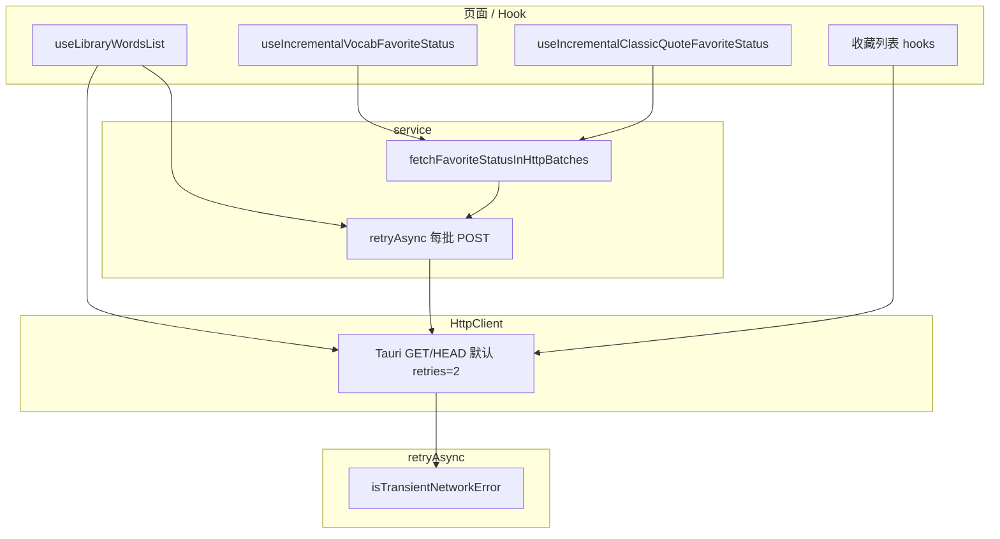

# 英语学习列表与收藏：网络韧性、分批重试与分页 Hook

> 在 [`vocab-favorite-status-query.md`](./vocab-favorite-status-query.md)（单词收藏状态增量查询 + 500 上限分批）基础上，本轮强化 **Tauri 瞬时网络失败** 下的可用性，并抽取 **资源库分页**、**经典句收藏状态** 的共用逻辑。

## 1. 背景与目标

### 1.1 用户视角

在 **资源库**（单词库 / 经典语句库右侧列表）、**收藏页**（单词 / 经典句）、**经典句包列表** 中，用户会快速滚动触发连续分页或批量「是否已收藏」查询。在 **Tauri 桌面端** 访问远程 HTTPS 时，偶发出现 `error sending request` 等瞬时错误，导致：

- 列表首屏或「加载更多」失败且无明确提示；
- 收藏星标状态查询失败，星标不亮或整表重查；
- 快速切换库 / Tab 时，慢请求返回后覆盖新库数据。

### 1.2 本轮目标

| 层级        | 目标                                                                        |
| ----------- | --------------------------------------------------------------------------- |
| 基础设施    | 识别瞬时网络错误（transient network error），提供可复用的 `retryAsync`      |
| HTTP 客户端 | Tauri 下对 **GET/HEAD** 默认额外重试 2 次（线性退避）                       |
| Service     | 收藏状态 `/status` 在 **50 词/句一批** 的 HTTP 粒度上重试，批次间 50ms 间隔 |
| Hook        | 单词 / 经典句收藏状态查询 **150ms 防抖**；经典句与单词对称的增量 Hook       |
| 视图        | 资源库列表分页抽到 `useLibraryWordsList`；收藏列表用 `loadGen` 丢弃过期响应 |
| i18n        | 列表加载失败 / 加载更多失败的可读 Toast 文案                                |

**未改后端 API 契约**；版本号 `1.0.12` 等为发布产物，与本文逻辑无关。

若与仓库最新源码不一致，**以源码为准**。

### 1.3 要解决的具体问题（改前 → 改后）

| # | 现象（用户 / 开发视角） | 根因 | 本轮如何解决 |
| - | ----------------------- | ---- | ------------ |
| P1 | Tauri 桌面端列表首屏或「加载更多」偶发空白，控制台 `error sending request`，需手动刷新 | 远程 HTTPS 在原生请求栈上瞬时失败；改前 GET **不重试** | **HttpClient**：Tauri 下 GET/HEAD 默认 `retries: 2`；**`useLibraryWordsList`** 再包一层 `retryAsync` |
| P2 | 资源库快速切换左侧库时，右侧短暂显示**上一库**词条 | 慢请求返回未校验「当前库 id」 | **`loadGenRef` + `libraryIdRef`**：返回前比对世代号与 id，过期响应直接丢弃 |
| P3 | 「加载更多」失败一次后，滚到底再也无法加载 | `catch` 里把 `hasMoreRef` 置为 `false` | **`fetchMore` 失败不关闭 `hasMoreRef`**，用户可再次滚到底触发 |
| P4 | 滚动加载后收藏星标不亮，或整表反复查 `/status` | 全量查状态 + 无防抖 + 失败后 key 仍标记「已查」 | **增量 Hook**（只查新 key）+ **150ms 防抖** + **失败回滚 `queriedKeysRef`**（详见 [`favorite-star-incremental-ui.md`](./favorite-star-incremental-ui.md)） |
| P4b | 星标「慢半拍」：条目已显示，已收藏星标要等全部 HTTP 批结束才一起亮 | 串行小批 + Hook 仅在全量返回后 `setState` 一次 | **`onPartialKeys` 渐进 merge** + **`runTasksWithConcurrency(3)`**（同上专文） |
| P5 | 经典句包列表条目多时，一次 POST 几百条 `englishes`，易超时 / 发送失败 | 单次 body 过大 | **HTTP 50 小批** + 批间 50ms + **`retryAsync` 每批** |
| P6 | 经典句包曾用内联 `useEffect` 全量 `fetchEnglishClassicQuoteFavoriteStatus` | 与资源库逻辑重复、难维护 | 抽出 **`useIncrementalClassicQuoteFavoriteStatus`**，与单词 Hook 对称 |
| P7 | 列表失败时 Toast 重复（HttpClient 默认 + 面板自定义） | 未传 `silent` | 列表类 API 透传 **`silent: true`**，由 Hook / 面板统一 i18n Toast |
| P8 | 收藏 Tab 切走后，进行中的列表请求仍 `setState` | 无取消世代 | **`active === false` 时 `loadGenRef++`**，丢弃过期响应 |
| P9 | 重试失败后 Toast 展示 `error sending request for url (...)` 或硬编码「请求接口异常」 | HttpClient 未脱敏 Tauri 原文、Toast 未走 i18n | **`shouldMaskAsUserFacingNetworkError` + `translateSync`**（详见 [`http-network-error-toast.md`](./http-network-error-toast.md)） |

**刻意不重试的场景**：`add/remove` 收藏等 **非幂等 POST** 仍只请求 1 次（避免重复副作用）；仅 **`/status` 查询** 在 service 层用 `retryAsync` 包裹。

---

## 2. 改动范围

| 说明                        | 路径                                                                                                                 |
| --------------------------- | -------------------------------------------------------------------------------------------------------------------- |
| HTTP 小批大小常量           | `apps/frontend/src/constant/index.ts`                                                                                |
| 通用重试工具（新建）        | `apps/frontend/src/utils/retryAsync.ts`                                                                              |
| HttpClient 读请求重试       | `apps/frontend/src/utils/fetch.ts`                                                                                   |
| 收藏状态分批 + 重试         | `apps/frontend/src/service/index.ts`                                                                                 |
| 经典句增量收藏 Hook（新建） | `apps/frontend/src/hooks/useIncrementalClassicQuoteFavoriteStatus.ts`                                                |
| 单词增量收藏 Hook（防抖）   | `apps/frontend/src/hooks/useIncrementalVocabFavoriteStatus.ts`                                                       |
| Hook 导出                   | `apps/frontend/src/hooks/index.ts`                                                                                   |
| 资源库分页 Hook（新建）     | `apps/frontend/src/views/englishLearning/library/useLibraryWordsList.ts`                                             |
| 单词库右侧面板              | `apps/frontend/src/views/englishLearning/library/VocabularyLibraryWordsPanel.tsx`                                    |
| 经典语句库右侧面板          | `apps/frontend/src/views/englishLearning/library/ClassicQuotesLibraryWordsPanel.tsx`                                 |
| 经典句包列表                | `apps/frontend/src/views/englishLearning/pack/ClassicQuotesPackList.tsx`                                             |
| 单词 / 经典句收藏列表       | `apps/frontend/src/views/englishLearning/favorites/useVocabularyFavoritesList.ts`、`useClassicQuoteFavoritesList.ts` |
| 文案                        | `apps/frontend/src/i18n/locales/zh-CN.ts`、`en-US.ts`                                                                |

---

## 3. 实现思路

### 3.1 分层重试（为何不只改一处）



1. **HttpClient（GET/HEAD）**：列表、收藏分页走 GET；在 Tauri 环境默认 `retries: 2`，覆盖「读列表」类失败，且读操作幂等，可安全重试。
2. **`retryAsync`（工具层）**：`useLibraryWordsList` 与收藏状态每批 POST 共用同一套「是否瞬时错误 + 线性退避」判断，避免在业务里复制 `catch` 逻辑。
3. **Service（收藏 `/status`）**：在遵守后端 **500** 上限的前提下，再拆 **50** 的 HTTP 批，减小单次 body，降低 Tauri 栈瞬时失败概率；批与批之间 `setTimeout(50)`，避免请求风暴。

**未采用**：对所有 POST 全局自动重试（非幂等，可能重复副作用）；仅 `/status` 与显式 `retryAsync` 包裹的调用重试。

### 3.2 收藏状态：500（DTO）× 50（HTTP）双层切片

- `VOCAB_FAVORITE_STATUS_BATCH_SIZE = 500`：与后端 `@ArrayMaxSize(500)` 对齐，逻辑 chunk 上限不变。
- `FAVORITE_STATUS_HTTP_BATCH_SIZE = 50`：每个 HTTP POST 最多 50 个 `words` / `englishes`；一个 500 chunk 最多 10 次 POST，串行执行。

单词与经典句共用 `fetchFavoriteStatusInHttpBatches(url, words, bodyKey)`，`bodyKey` 区分响应字段 `favoritedWordKeys` / `favoritedContentKeys`。

### 3.3 增量收藏状态 + 150ms 防抖

- **增量**：`queriedKeysRef` 记录已查过的规范化 key；列表 **末尾追加**（sig 前缀匹配）时保留已有 Set，只查新增项。
- **防抖**：`items` 在滚动加载时可能连续 setState，150ms 内合并为一次 `/status` 请求，减少无效调用。
- **失败回滚**：请求失败时从 `queriedKeysRef` 移除本批 key，下次 effect 可重试（不永久标记为已查）。

经典句新 Hook `useIncrementalClassicQuoteFavoriteStatus` 与单词 Hook 对称；`ClassicQuotesPackList` 删除内联全量 `useEffect`，改为共用 Hook（与资源库一致）。

### 3.4 `useLibraryWordsList`：分页 + 世代号

- `loadGenRef`：每次 `libraryId` 变化或清空时递增；`fetchFirstPage` / `fetchMore` 返回前比对 `gen`，丢弃过期响应。
- `retryAsync` 包裹 `fetchPage`：首屏与加载更多均自动重试。
- **加载更多失败**：不将 `hasMoreRef` 置 false，用户滚到底可再次触发（与改前「失败即不能再加载」相比更友好）。
- **silent**：面板层 `listEnglish*LibraryItems(..., { silent: true })`，避免 HttpClient 默认 Toast 与面板自定义 i18n Toast 重复。

### 3.5 收藏列表：`loadGen` + silent + 场景化 Toast

- `listEnglish*Favorites({ silent: true })`：失败由 hook 内 `Toast` + i18n 键提示，文案区分首屏 / 加载更多。
- `active` 从 true 变 false 时 `loadGenRef++`，取消进行中的请求副作用。

---

## 4. 重试机制详解

本轮存在 **三层** 重试能力，职责不同，**不要混为一谈**。

### 4.1 总览

| 层级 | 入口 | 默认额外重试次数 | 单次失败后等待 | 可重试条件 | 适用请求 |
| ---- | ---- | ---------------- | -------------- | ---------- | -------- |
| A. `retryAsync` | 工具函数显式调用 | `2`（总尝试 **3** 次） | `delayMs × (attempt + 1)`，默认 400 → 400ms、800ms | `shouldRetry(error)`，默认 `isTransientNetworkError` | `useLibraryWordsList` 的 `fetchPage`；`/status` 每个 HTTP 小批 |
| B. `HttpClient.request` | 所有 `http.get/post/...` | Tauri：**GET/HEAD 为 2**；其余 **0** | `400 × (attempt + 1)` ms | **无 response**、非 401、错误文案命中瞬时网络 | 资源库 / 收藏分页 **GET**；`/status` 的 POST **不重试**（B 层 retries=0） |
| C. 业务防抖 / 世代号 | Hook 内 | 非 HTTP 重试 | 150ms 合并 `/status` | — | 减少无效请求；切换库丢弃响应 |

### 4.2 `isTransientNetworkError` 判定

对 `error.message`（或 `String(error)`）转小写后，**子串匹配**任一即视为可重试：

`error sending request`、`network`、`failed to fetch`、`fetch failed`、`timeout`、`timed out`、`econnreset`、`connection reset`、`aborted`。

**不重试**：HTTP 已有 `response`（4xx/5xx 业务错误）、401 未授权、文案不匹配（如校验错误）、以及 **POST 写操作**（HttpClient 默认 `retries: 0`）。

### 4.3 `retryAsync` 执行顺序（伪代码）

```
总尝试次数 = retries + 1   // 默认 retries=2 → 最多 3 次

for attempt = 0 .. retries:
  try:
    return await fn()
  catch error:
    if attempt == retries 或 !shouldRetry(error):
      throw error
    await sleep(delayMs * (attempt + 1))   // 线性退避，非指数
```

各调用点参数：

| 调用处 | `retries` | `delayMs` | 最坏额外等待（仅重试间隔） |
| ------ | --------- | --------- | -------------------------- |
| `useLibraryWordsList` → `fetchPageWithRetry` | 2 | 400 | 400 + 800 = **1200ms** |
| `fetchFavoriteStatusInHttpBatches` 每批 | 2 | 350 | 350 + 700 = **1050ms** / 批 |

### 4.4 HttpClient 内重试（仅 Tauri + GET/HEAD）

```
maxAttempts = (config.retries ?? defaultRetries) + 1
defaultRetries = isTauri && (GET|HEAD) ? 2 : 0

for attempt = 0 .. maxAttempts-1:
  try: platformFetch → 解析 → 成功则 return
  catch:
    canRetry = 还有剩余次数
      && response == null        // 未拿到 HTTP 响应
      && !401
      && isTransientNetworkError(...)
    if canRetry: sleep(400 * (attempt+1)); continue
    if !silent: Toast
    throw
```

**浏览器 Web**：`defaultRetries = 0`，与改前一致（除非调用方显式传 `retries`）。

### 4.5 收藏 `/status`：分批 + 串行 + 仅 `retryAsync`

对一次 `fetchEnglish*FavoriteStatus(words)`（`words.length = N`）：

1. **逻辑 chunk**：每最多 **500** 条（对齐后端 `@ArrayMaxSize(500)`）。
2. **HTTP 小批**：每个 chunk 内每最多 **50** 条发 1 次 `http.post(..., { silent: true })`。
3. **每小批**：外包 `retryAsync`（3 次尝试）；POST 本身 **不走** HttpClient 默认重试。
4. **批间**：同 chunk 内相邻小批之间 `setTimeout(50)`；chunk 之间再 `50ms`（若还有下一 chunk）。

请求次数（成功路径，无重试）：

\[
\text{POST 次数} = \left\lceil \frac{N}{500} \right\rceil \times \left\lceil \frac{\min(N,500)}{50} \right\rceil
\]

例：`N=50` → 1 次 POST；`N=500` → 10 次 POST；`N=600` → 2×10=20 次 POST（串行）。

### 4.6 双层重试叠加（资源库 GET）

`useLibraryWordsList` 调用链：

```
retryAsync(() => fetchPage(...))  →  内部 list*LibraryItems → http.get(..., { silent: true })
```

在 **Tauri** 下，单次 `fetchPage` 失败时：

- 外层 `retryAsync` 最多 **3** 次完整 `fetchPage`；
- 每次 `http.get` 内层最多 **3** 次 `platformFetch`。

理论上极端坏情况下同一次用户操作最多 **3×3=9** 次 GET（仅当每次都卡在「无 response 的瞬时错误」）。正常一次成功则仍为 **1** 次 GET。这是为换稳定性刻意接受的叠加；若需收敛可后续只保留一层（例如去掉 `retryAsync` 仅依赖 HttpClient）。

**收藏列表 Hook**（`useVocabularyFavoritesList` 等）**未**包 `retryAsync`，仅享受 HttpClient 对 GET 的 Tauri 默认重试。

### 4.7 与防抖、失败回滚的配合（非 HTTP 重试）

- **150ms 防抖**：`items` 连续变化时只触发一次 `/status`，降低滚动时的请求次数（与 HTTP 重试正交）。
- **失败回滚**：`/status` 整批仍失败（3 次 `retryAsync` 用尽）后，从 `queriedKeysRef` 删除本批 key，下次 effect 会再次发起查询——属于 **业务层「迟后重试」**，不是立即循环重试。

---

## 5. 改动影响点（按场景）

### 5.1 按用户场景

| 场景 | 行为变化 | 用户可感知 |
| ---- | -------- | ---------- |
| Tauri 资源库选库 + 滚到底 | 列表 GET 自动重试；切换库不会串库 | 偶发网络抖动时少空白页；切换库更干净 |
| Tauri 资源库加载更多失败 | `hasMore` 仍为 true | Toast 提示失败，再滚到底可重试 |
| 资源库滚动显示星标 | 只查新增词；50 条一批查状态 | 星标可能略晚于词条出现（串行小批）；失败滚动能补齐 |
| 经典句包（直播 / 历史） | 全量查状态 → 增量查状态 | 长列表下更稳、请求体更小 |
| 收藏页 Tab | `silent` + 世代号 + GET 重试（Tauri） | 文案区分首屏 / 加载更多；切 Tab 减少错乱 setState |
| 浏览器 H5 | GET 默认不重试（与改前同） | 无额外重试流量 |

### 5.2 按代码模块

| 模块 | 影响 |
| ---- | ---- |
| `retryAsync.ts` | 新增公共能力；`fetch.ts` 复用 `isTransientNetworkError` |
| `fetch.ts` | Tauri GET/HEAD 多 2 次尝试；新增 `retries` 配置项 |
| `service/index.ts` | `/status` POST 次数 ↑（50 一批）；列表 API 增加 `silent` |
| `useIncremental*FavoriteStatus` | 单词防抖已存在；经典句新建对称 Hook |
| `useLibraryWordsList` | 单词库 / 经典语句库右栏共用分页逻辑 |
| `ClassicQuotesPackList` | 删除内联全量 status effect，改用增量 Hook |
| 收藏列表 hooks | `loadGen` + `silent` + 加载更多失败可重试（不关 hasMore） |
| i18n | 4 个错误文案键 |

### 5.3 对后端 / 运维

| 项 | 说明 |
| -- | ---- |
| API 契约 | 无破坏性变更；路径与 DTO 不变 |
| `/status` QPS | 单次逻辑最多 500 词不变，但 **HTTP 次数 = ceil(n/50)**，例如 500 词从 1 次 POST 变为 **10 次串行 POST** |
| GET 列表 | 失败重试时同一 offset 可能多 1～2 次 GET（Tauri），幂等，无副作用 |
| 日志 / 监控 | 短时错误率可能下降，请求总数在抖动场景下可能略升 |

---

## 6. 性能与风险评估

### 6.1 结论摘要

| 维度 | 评估 |
| ---- | ---- |
| 主线程 / UI | 请求均为 `async`，重试用 `setTimeout`，**不阻塞渲染** |
| 正常网络 | 额外开销主要是 `/status` **拆批 + 50ms 间隔**，首屏 50 条内通常 **1 次 POST**，影响很小 |
| 差网络 | 重试与等待增加延迟，但避免整页失败；**用延迟换成功率** |
| 服务端 | `/status` 小批后 **连接次数增多**；需关注极高并发桌面端是否放大 QPS（个人学习场景通常可接受） |
| 内存 | 增量 Set / `queriedKeysRef` 随列表增长，与改前同量级 |

### 6.2 延迟粗算（收藏星标）

假设单次 POST RTT = **R** ms，一批 50 条，新增 **N** 条待查（且落在同一 500 chunk 内）：

- 批次数 \(B = \lceil N/50 \rceil\)
- 成功路径耗时约：\(B \times R + (B-1) \times 50\) ms（串行）
- 例：N=200，R=80 → 4×80 + 3×50 = **470ms**（星标全部补齐前的时间上限量级）
- 若每批都耗尽 3 次 `retryAsync`：每批再加最多约 1050ms（见 4.3 表）

**防抖 150ms**：快速连续 `setItems` 时少打多次 `/status`，滚动加载时通常 **减少** 总请求数。

### 6.3 可能的问题与缓解

| 风险 | 说明 | 现状 / 建议 |
| ---- | ---- | ----------- |
| 星标「慢半拍」 | 串行 50 批 + 间隔，快滚长列表时星标晚于文字 | 可接受则保持；若要强体验可评估 **有限并发**（如 2～3 并行），需控总 QPS |
| GET 双重重试 | Tauri 下 `retryAsync` × HttpClient 最多 9 次 | 仅瞬时错误触发；仍失败才 Toast；后续可只保留一层 |
| `/status` 请求数增多 | 500 词从 1 POST → 10 POST | 降低单次失败率；后端若有限流需知晓 |
| `isTransientNetworkError` 过宽 | 含 `network` 子串可能误重试某些业务文案 | 目前依赖常见 fetch/Tauri 文案；若误重试可收紧匹配 |
| 收藏列表无 `retryAsync` | 仅 HttpClient 3 次 GET | 与资源库不一致；若收藏页仍偶发失败可对称加 `retryAsync` |

### 6.4 与改前的对比（性能）

| 能力 | 改前 | 改后 |
| ---- | ---- | ---- |
| 经典句包 status | 常一次 POST 全列表 | 增量 + 最多每 50 条一批，**长列表显著减负** |
| 资源库 status | 增量已有（见 vocab 文档） | 同增量 + **HTTP 小批 + 重试** |
| 列表 GET（Tauri） | 1 次 | 失败时最多 3 次（HttpClient）× 外层最多 3 次（仅资源库 Hook） |
| 滚动密集 setState | 可能多次 `/status` | 150ms 防抖 **减少** 调用 |

---

## 7. 关键代码与注释

### 7.1 瞬时网络错误与 `retryAsync`

**来源**：`apps/frontend/src/utils/retryAsync.ts`（约 L1–L55）

```typescript
/** 判断是否为可重试的瞬时网络错误（Tauri / fetch 常见文案） */
export function isTransientNetworkError(error: unknown): boolean {
	const msg = String(
		error && typeof error === "object" && "message" in error
			? (error as { message?: unknown }).message
			: error,
	).toLowerCase();
	return (
		msg.includes("error sending request") || // Tauri 原生层常见报错
		msg.includes("network") ||
		msg.includes("failed to fetch") ||
		msg.includes("fetch failed") ||
		msg.includes("timeout") ||
		msg.includes("timed out") ||
		msg.includes("econnreset") ||
		msg.includes("connection reset") ||
		msg.includes("aborted")
	);
}

/**
 * 对瞬时网络失败自动重试（线性退避：delayMs × (attempt + 1)，非指数）
 * 总尝试次数 = retries + 1
 */
export async function retryAsync<T>(
	fn: () => Promise<T>,
	options?: {
		retries?: number;
		delayMs?: number;
		shouldRetry?: (e: unknown) => boolean;
	},
): Promise<T> {
	const retries = options?.retries ?? 2;
	const delayMs = options?.delayMs ?? 400;
	const shouldRetry = options?.shouldRetry ?? isTransientNetworkError;
	// ... 循环 try/catch，不可重试或次数用尽则 throw
}
```

### 7.2 HttpClient：Tauri 下 GET/HEAD 默认重试

**来源**：`apps/frontend/src/utils/fetch.ts`（`RequestConfig.retries` 约 L84–L88；`request` 重试循环约 L441–L532）

```typescript
// RequestConfig 扩展
/** 瞬时网络失败时的额外重试次数（总尝试 = retries + 1） */
retries?: number;

// request() 内
const isIdempotentRead = method === 'GET' || method === 'HEAD';
// Tauri + 读请求：默认多试 2 次；写请求默认 0，避免重复提交
const defaultRetries = isTauriRuntime() && isIdempotentRead ? 2 : 0;
const maxAttempts = (finalConfig.retries ?? defaultRetries) + 1;

for (let attempt = 0; attempt < maxAttempts; attempt++) {
	try {
		// platformFetch → 解析 body → 成功则 return
	} catch (error) {
		// 401 不重试；无 response 且为瞬时网络错误则 400ms * (attempt+1) 后 continue
		const canRetry =
			attempt < maxAttempts - 1 &&
			!response &&
			!isUnauthorized &&
			(isTransientNetworkError(error) ||
				isTransientNetworkError(requestError.message));
		if (canRetry) { /* await delay; continue */ }
		if (!finalConfig.silent) { /* Toast */ }
		throw requestError;
	}
}
```

### 7.3 收藏状态：HTTP 小批 + `retryAsync` + 批间间隔

**来源**：`apps/frontend/src/constant/index.ts`（约 L61–L64）

```typescript
/** 与后端 DTO ArrayMaxSize(500) 一致 — 逻辑 chunk 上限 */
export const VOCAB_FAVORITE_STATUS_BATCH_SIZE = 500;
/** 单次 POST body 最多条数，降低 payload，减轻 Tauri 瞬时失败 */
export const FAVORITE_STATUS_HTTP_BATCH_SIZE = 50;
```

**来源**：`apps/frontend/src/service/index.ts`（`fetchFavoriteStatusInHttpBatches` 约 L772–L833）

```typescript
/** 收藏状态分批 POST：小批次 + 重试 + 批次间短间隔 */
async function fetchFavoriteStatusInHttpBatches(
	url: string,
	words: string[],
	bodyKey: "words" | "englishes",
): Promise<string[]> {
	const merged: string[] = [];
	// 外层：每最多 500 条为一个逻辑 chunk（对齐后端校验）
	for (
		let chunkStart = 0;
		chunkStart < words.length;
		chunkStart += VOCAB_FAVORITE_STATUS_BATCH_SIZE
	) {
		const chunk = words.slice(
			chunkStart,
			chunkStart + VOCAB_FAVORITE_STATUS_BATCH_SIZE,
		);
		// 内层：每最多 50 条发一次 HTTP
		for (let i = 0; i < chunk.length; i += FAVORITE_STATUS_HTTP_BATCH_SIZE) {
			const batch = chunk.slice(i, i + FAVORITE_STATUS_HTTP_BATCH_SIZE);
			const keys = await retryAsync(
				async () => {
					// silent: true — 失败由 Hook 层统一处理，避免连续 Toast
					const res = await http.post(
						url,
						{ [bodyKey]: batch },
						{ silent: true },
					);
					// 按 bodyKey 取 favoritedWordKeys 或 favoritedContentKeys
					return /* string[] */;
				},
				{ retries: 2, delayMs: 350 },
			);
			merged.push(...keys);
			if (i + FAVORITE_STATUS_HTTP_BATCH_SIZE < chunk.length) {
				await new Promise((r) => setTimeout(r, 50)); // 同 chunk 内批间喘息
			}
		}
		if (chunkStart + VOCAB_FAVORITE_STATUS_BATCH_SIZE < words.length) {
			await new Promise((r) => setTimeout(r, 50)); // chunk 间喘息
		}
	}
	return merged;
}

export const fetchEnglishVocabularyFavoriteStatus = async (words: string[]) => {
	const favoritedWordKeys = await fetchFavoriteStatusInHttpBatches(
		`${ENGLISH_LEARNING_VOCABULARY_FAVORITES}/status`,
		words,
		"words",
	);
	return { code: 200, success: true, message: "", data: { favoritedWordKeys } };
};
// fetchEnglishClassicQuoteFavoriteStatus 同理，bodyKey 为 'englishes'
```

列表类 API 增加可选 `silent?: boolean`，透传给 `http.get`（`listEnglishVocabularyLibraryItems`、`listEnglish*Favorites` 等）。

### 7.4 单词增量收藏：防抖与失败回滚

**来源**：`apps/frontend/src/hooks/useIncrementalVocabFavoriteStatus.ts`（约 L11–L85）

```typescript
const STATUS_QUERY_DEBOUNCE_MS = 150;

useEffect(() => {
	// 列表清空 → 重置 Set 与 queriedKeysRef
	// itemsWordSig 非「前缀追加」→ 视为换库/重载，清空本地收藏状态

	let cancelled = false;
	const timer = window.setTimeout(() => {
		const wordsToQuery: string[] = [];
		for (const item of items) {
			const wk = normalizeEnglishVocabWordKey(item.word);
			if (!wk || queriedKeysRef.current.has(wk)) continue;
			queriedKeysRef.current.add(wk); // 乐观标记，避免并发重复请求
			wordsToQuery.push(item.word);
		}
		if (wordsToQuery.length === 0) return;

		void (async () => {
			try {
				const res = await fetchEnglishVocabularyFavoriteStatus(wordsToQuery);
				if (cancelled) return;
				// merge 进 favoritedWordKeys
			} catch {
				if (!cancelled) {
					// 失败：撤销本批 queried 标记，便于下次滚动重试
					for (const word of wordsToQuery) {
						const wk = normalizeEnglishVocabWordKey(word);
						if (wk) queriedKeysRef.current.delete(wk);
					}
				}
			}
		})();
	}, STATUS_QUERY_DEBOUNCE_MS);

	return () => {
		cancelled = true;
		clearTimeout(timer);
	};
}, [itemsWordSig, items]);
```

### 7.5 经典句增量收藏 Hook（新建）

**来源**：`apps/frontend/src/hooks/useIncrementalClassicQuoteFavoriteStatus.ts`（约 L1–L88）

```typescript
// 与单词 Hook 相同模式：ENGLISH_SIG_SEP、150ms 防抖、queriedKeysRef、追加判定
// 差异：使用 classicQuoteFavoriteContentKey(item.english) 与 fetchEnglishClassicQuoteFavoriteStatus
export function useIncrementalClassicQuoteFavoriteStatus(
	items: ReadonlyArray<{ english: string }>,
) {
	// favoritedContentKeys / setFavoritedContentKeys
}
```

**接入点**：

- `ClassicQuotesLibraryWordsPanel`：与 `useLibraryWordsList` 组合；
- `ClassicQuotesPackList`：删除原全量 `useEffect` + `fetchEnglishClassicQuoteFavoriteStatus(items.map(...))`，改为本 Hook（增量 + 分批重试透明生效）。

### 7.6 资源库分页：`useLibraryWordsList`

**来源**：`apps/frontend/src/views/englishLearning/library/useLibraryWordsList.ts`（约 L25–L153）

```typescript
export function useLibraryWordsList<TItem, TLibrary>({
	libraryId,
	pageSize = VOCAB_LIBRARY_ITEMS_PAGE_SIZE,
	fetchPage,
}: UseLibraryWordsListOptions<TItem, TLibrary>) {
	const loadGenRef = useRef(0);

	const fetchPageWithRetry = useCallback(
		(id: string, offset: number) =>
			retryAsync(() => fetchPage(id, pageSize, offset), { retries: 2, delayMs: 400 }),
		[fetchPage, pageSize],
	);

	const fetchFirstPage = useCallback(async (id: string, gen: number) => {
		// loading、清空 items、offset/hasMore 复位
		try {
			const data = await fetchPageWithRetry(id, 0);
			if (gen !== loadGenRef.current || libraryIdRef.current !== id) return; // 世代校验
			// setItems / setResolvedLibrary / 更新 offsetRef、hasMoreRef
		} catch {
			Toast({ type: 'error', title: t('englishLearning.library.wordsLoadFailed') });
		}
	}, [/* ... */]);

	const fetchMore = useCallback(async () => {
		// ...
		} catch {
			// 不关闭 hasMoreRef — 滚到底可再次 fetchMore
			Toast({ type: 'error', title: t('englishLearning.library.wordsLoadMoreFailed') });
		}
	}, [/* ... */]);

	useEffect(() => {
		if (!libraryId) { loadGenRef.current += 1; /* 清空 */ return; }
		const gen = ++loadGenRef.current;
		void fetchFirstPage(libraryId, gen);
	}, [libraryId, fetchFirstPage]);

	return { items, resolvedLibrary, loading, loadingMore, onViewportScroll, setItems };
}
```

**面板接入示例**（单词库）：

**来源**：`apps/frontend/src/views/englishLearning/library/VocabularyLibraryWordsPanel.tsx`（约 L43–L76）

```typescript
const fetchVocabPage = useCallback(async (id, limit, offset) => {
	const res = await listEnglishVocabularyLibraryItems(id, {
		limit,
		offset,
		silent: true, // 错误 Toast 由 useLibraryWordsList 统一弹出
	});
	return { library: res.data.library, items: res.data.items ?? [] };
}, []);

const { items, loading, loadingMore, onViewportScroll } = useLibraryWordsList({
	libraryId,
	fetchPage: fetchVocabPage,
});
const { favoritedWordKeys, setFavoritedWordKeys } =
	useIncrementalVocabFavoriteStatus(items);
```

经典语句库面板结构相同，换用 `listEnglishClassicQuotesLibraryItems` 与 `useIncrementalClassicQuoteFavoriteStatus`。

### 7.7 收藏列表：`loadGen` 与场景化错误

**来源**：`apps/frontend/src/views/englishLearning/favorites/useVocabularyFavoritesList.ts`（模式与 `useClassicQuoteFavoritesList.ts` 相同，约 L27–L120）

```typescript
const loadGenRef = useRef(0);

const fetchFirstPage = useCallback(
	async (gen: number) => {
		try {
			const res = await listEnglishVocabularyFavorites({
				limit: VOCAB_HISTORY_PAGE_SIZE,
				offset: 0,
				silent: true,
			});
			if (gen !== loadGenRef.current) return;
			// setEntries ...
		} catch {
			Toast({ title: t("englishLearning.favorites.listLoadFailed") });
		}
	},
	[t],
);

useEffect(() => {
	if (!active) {
		loadGenRef.current += 1; // 切走 Tab 时作废进行中的请求
		return;
	}
	void fetchFirstPage(++loadGenRef.current);
}, [active, fetchFirstPage]);
```

### 7.8 i18n 新增键

| 键                                             | 用途               |
| ---------------------------------------------- | ------------------ |
| `englishLearning.library.wordsLoadFailed`      | 资源库首屏加载失败 |
| `englishLearning.library.wordsLoadMoreFailed`  | 资源库加载更多失败 |
| `englishLearning.favorites.listLoadFailed`     | 收藏首屏失败       |
| `englishLearning.favorites.listLoadMoreFailed` | 收藏加载更多失败   |

---

## 8. 兼容性速查

与 [§5 改动影响点](#5-改动影响点按场景)、[§6 性能与风险评估](#6-性能与风险评估) 互补，仅列结论：

| 项       | 说明                                                                    |
| -------- | ----------------------------------------------------------------------- |
| API      | 无破坏性变更；`/status` HTTP 次数随条数按 50 递增，单次 body 词数不变   |
| 浏览器   | 非 Tauri 时 GET 默认 `retries: 0`，行为与改前一致                       |
| 经典句包 | 全量查状态 → 增量查状态，长列表请求体与失败面显著减小                   |

---

## 9. 建议回归测试

1. **Tauri 桌面端**：资源库选库 → 快速滚到底多次加载更多；观察偶发失败后是否自动恢复或 Toast 提示合理。
2. **快速切换库**：在加载中途切换左侧库，确认右侧不出现上一库词条。
3. **收藏星标**：单词库 / 经典语句库滚动加载后，已收藏项星标亮起；失败重滚后仍能补齐状态。
4. **经典句包**：直播列表与历史分页列表，星标与增量查询一致。
5. **收藏页**：单词 / 经典句 Tab 切换、加载更多失败后再滚到底重试。
6. **浏览器**：确认无多余重试、列表仍正常。

---

## 10. 相关源码路径

| 说明             | 路径                                                                     |
| ---------------- | ------------------------------------------------------------------------ |
| 重试工具         | `apps/frontend/src/utils/retryAsync.ts`                                  |
| HTTP 客户端      | `apps/frontend/src/utils/fetch.ts`                                       |
| 收藏状态 Service | `apps/frontend/src/service/index.ts`                                     |
| 资源库分页 Hook  | `apps/frontend/src/views/englishLearning/library/useLibraryWordsList.ts` |
| 单词增量收藏     | `apps/frontend/src/hooks/useIncrementalVocabFavoriteStatus.ts`           |
| 经典句增量收藏   | `apps/frontend/src/hooks/useIncrementalClassicQuoteFavoriteStatus.ts`    |

## 11. 相关文档

- [`http-network-error-toast.md`](./http-network-error-toast.md) — 网络错误 Toast 友好化与 `translateSync`
- [`favorite-star-incremental-ui.md`](./favorite-star-incremental-ui.md) — 星标慢半拍、`onPartialKeys`、有限并发与乐观点击
- [`vocab-favorite-status-query.md`](./vocab-favorite-status-query.md) — 单词收藏状态增量查询与 500 上限（本轮在其上扩展 HTTP 50 小批与重试）
- [`english-learning-library-ux-and-delete.md`](./english-learning-library-ux-and-delete.md) — 资源库 UX 与删除
- [`tauri-macos-ats-http.md`](./tauri-macos-ats-http.md) — Tauri / HTTP 相关背景（若存在网络策略问题可交叉查阅）
