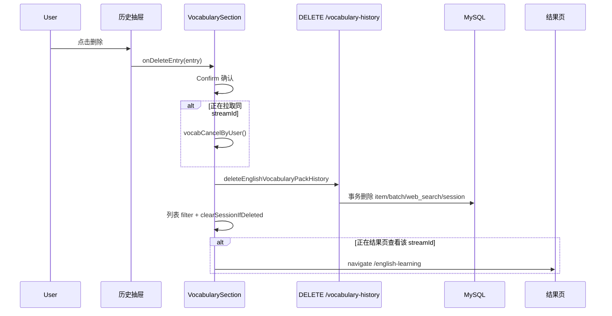
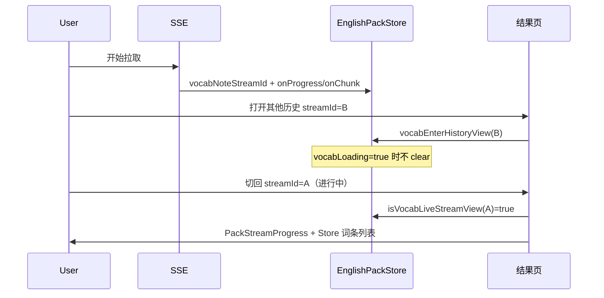

# 英语学习：拉取历史交互与删除实现说明

## 1. 背景与目标

本轮改动围绕「单词包 / 经典句包」**历史生成记录**与**进行中拉取**两类场景，解决以下产品问题：

| 问题 | 目标 |
|------|------|
| 历史列表无法删除 | 支持删除整条生成记录，并**级联删除**已落库的 pack_item 明细 |
| 打开历史会回填左侧学习表单 | 点击历史仅跳转结果页，**不修改** `vocabTopic` / 次数 / 快捷意图等 |
| 结果页在单词/语句间切换永远为空 | 移除结果页内 `kind` 切换 Tab，主题与联网摘要上移到页头 |
| 拉取中切换历史再切回进度丢失 | 用 `activeStreamId` 区分「进行中会话」与「纯历史」，保留 Store 实时状态 |
| 历史列表 API 500 | 修复 `vocabPackSessionRepo` 误注入 Batch 实体导致 `updatedAt` 查询失败 |
| 导入 JSON 需手填标题 | 上传文件后用**去后缀文件名**预填 `importTitle` |
| 收藏入口跳错路由 | `FavoriteSession` 跳转到收藏页而非单词库 |
| 拉取中历史行无进行中标识 | 历史抽屉对进行中 `streamId` 显示 **Spinner**，隐藏删除按钮 |
| Agent 保存到知识库后仍停留原页 | 追加 markdown 后 `navigate('/knowledge')` |

数据模型（Session + Item + Batch）见 [../backend/english-learning-pack-session-storage.md](../backend/english-learning-pack-session-storage.md)；结果页分页见 [english-learning-pack-session-items.md](./english-learning-pack-session-items.md)。

---

## 2. 改动范围

### 后端

| 路径 | 说明 |
|------|------|
| `apps/backend/src/services/english-learning/english-learning.service.ts` | 删除历史事务；修正构造函数 `@InjectRepository` |
| `apps/backend/src/services/english-learning/english-learning.controller.ts` | `DELETE vocabulary-history/:streamId`、`DELETE classic-quotes-history/:streamId` |

### 前端

| 路径 | 说明 |
|------|------|
| `apps/frontend/src/store/englishPack.ts` | `activeStreamId`、直播/历史视图判断、进入历史不清空进行中状态 |
| `apps/frontend/src/service/index.ts` | 删除历史 API 封装 |
| `apps/frontend/src/views/englishLearning/pack/EnglishLearningPackStreamPage.tsx` | 页头主题/联网、直播 vs 历史分页分流 |
| `apps/frontend/src/views/englishLearning/vocab/VocabularySection.tsx` | 历史删除、打开历史仅 navigate |
| `apps/frontend/src/views/englishLearning/vocab/VocabularyHistoryDrawer.tsx` | 删除按钮；拉取中 Spinner（`observer` + Store） |
| `apps/frontend/src/views/englishLearning/classic/ClassicQuotesHistoryDrawer.tsx` | 与单词包对称 |
| `apps/frontend/src/views/englishLearning/agent/AgentPanel.tsx` | 保存到知识库后跳转 `/knowledge` |
| `apps/frontend/src/views/englishLearning/favorites/FavoriteSession.tsx` | 收藏入口 `?kind=vocab\|classic` |
| `apps/frontend/src/views/englishLearning/pack/VocabularyPackList.tsx` | 移除列表内主题条（上移到结果页） |
| `apps/frontend/src/views/englishLearning/pack/PackStreamLiveLink.tsx` | 跳转结果页携带 `streamId` |
| `apps/frontend/src/views/englishLearning/import/EnglishLearningImportPage.tsx` | 文件名 → 导入标题 |
| `apps/frontend/src/i18n/locales/zh-CN.ts`、`en-US.ts` | `packHistory.delete*`、`vocab/classic.historyStreaming` |
| `apps/frontend/src/views/englishLearning/shared/EnglishSource.tsx` | 导入示例 JSON 与预览区渐变样式 |
| `apps/frontend/src/views/englishLearning/shared/LearningToolbar.tsx` | 侧栏快捷意图与模式按钮配色微调 |
| `apps/frontend/src/components/ui/checkbox.tsx` | 边框透明度 `border-theme/20` |

---

## 3. 实现思路

### 3.1 删除历史：服务端级联

一次 `DELETE` 在**单事务**内按依赖顺序删除四张表数据（单词包为例）：

```text
english_vocabulary_pack_item   ← 词条明细（用户要求的「拉取的单词」）
english_vocabulary             ← 轮次 batch 审计行
english_pack_web_search        ← 联网检索记录（packKind = vocabulary）
english_vocabulary_pack_session ← 会话元数据（列表排序依据）
```

经典句对称：`english_classic_quotes_pack_item`、`english_classic_quotes`、`packKind = classic_quotes`、`english_classic_quotes_pack_session`。

**为何不用 DB 外键 CASCADE**：与现有 pack 存储设计一致，由应用层显式 `manager.delete`，便于按 `userId + streamId` 限定范围。

### 3.2 修复 Session 仓库注入

`vocabPackSessionRepo` 上曾叠放 `@InjectRepository(EnglishVocabularyPackBatch)` 与 `@InjectRepository(EnglishVocabularyPackSession)`，Nest 实际注入 Batch 表，导致 `listVocabularyHistory` 按 `updatedAt` 排序报 `EntityPropertyNotFoundError`。修复为**仅保留 Session 实体**的装饰器；Batch 仍在 `saveVocabularyPackBatch` 事务内通过 `manager.getRepository` 使用。

### 3.3 打开历史：不回填学习表单

原 `vocabPrepareHistoryView(topic, organic)` 会写 `vocabTopic` 与 `vocabMasterSearchOrganic`，左侧表单被历史覆盖。

现策略：

- **Section**：`openHistoryDetail` 只做 `navigate(?kind=&streamId=)`，不请求详情、不写 Store。
- **结果页**：`useEffect` 拉 `get*HistoryDetail`，写入组件本地 `historyHeader`（主题 + 联网），用于**页头展示**；不调用会改表单字段的 Store 方法。

### 3.4 进行中拉取 vs 历史分页（`isLiveStreamView`）

| 条件 | 列表数据来源 | 进度条 | 页头主题/联网 |
|------|--------------|--------|----------------|
| 无 `streamId`，Store 有进行中/已有词条 | Store `vocabItems` | 显示 | Store |
| `streamId === vocabActiveStreamId` 且 loading 或有 items | Store | 显示 | Store |
| 其他 `streamId` | `list*PackItems` 分页 API | 隐藏 | `historyHeader` |

`vocabEnterHistoryView(streamId)`：**仅当**非 `vocabLoading` 且非「当前直播会话」时清空 Store 词条/进度，避免用户浏览其他历史时打断后台 SSE 写入的内存态。

### 3.5 结果页移除 kind 切换

`PackStreamKindTabs` 从结果页移除：`kind` 仍由 URL `?kind=vocab|classic` 决定，但不在结果页内切换（避免切到另一类时列表恒为空）。原列表内的主题 + `MasterWebSearchResultsBar` 上移到 `header` 右侧。

### 3.6 历史抽屉删除交互

与单词库删除类似：`Confirm` 二次确认 → `DELETE` API → 本地列表 `filter` → 若正在查看该 `streamId` 则 `navigate('/english-learning')` → 若删除的是进行中会话则先 `vocabCancelByUser()` 再删。

### 3.7 历史抽屉：拉取中行标识（Spinner）

历史列表在 SSE 进行中时，服务端往往已写入一条 `pack_session`（列表里可见），但词条仍在增量落库。此时若展示删除按钮，用户可能误删未完成会话。

策略：

| 条件 | 右侧 UI |
|------|---------|
| `vocabLoading && vocabActiveStreamId === h.streamId` | 固定显示 `Spinner`（teal），`role="status"` + `aria-label` |
| 否则 | hover 显示删除 `Button`（`Trash2`） |

抽屉组件导出为 `observer(...)`，直接读 `EnglishPackStore`，SSE 写入 `activeStreamId` 后列表行会**自动重渲染**，无需 Section 轮询。

经典句对称：`classicLoading` + `classicActiveStreamId`，Spinner 为 violet 色系。

---

## 3.8 实现过程（按依赖顺序）

便于交接时按步骤复现，推荐实现顺序如下：

1. **后端**：修正 `vocabPackSessionRepo` / `classicPackSessionRepo` 的 `@InjectRepository`（先消除历史列表 500）。
2. **后端**：实现 `deleteVocabularyPackHistory` / `deleteClassicQuotesPackHistory` 事务删除 + Controller `DELETE` 路由。
3. **前端 API**：`deleteEnglishVocabularyPackHistory`、`deleteEnglishClassicQuotesPackHistory`。
4. **Store**：`vocabActiveStreamId`、`vocabNoteStreamId`、`isVocabLiveStreamView`、`vocabEnterHistoryView`（替换 `vocabPrepareHistoryView`）、`vocabClearSessionIfDeleted`；SSE 工具在 progress 帧写入 `streamId`。
5. **结果页**：`historyHeader` 本地 state、 `useHistoryPagination = isHistoryView && !isLiveStreamView`、页头主题/联网、移除 `PackStreamKindTabs`。
6. **Section**：`openHistoryDetail` 仅 navigate；删除 Confirm + 进行中先 cancel。
7. **历史抽屉**：删除按钮 + `observer` + 拉取中 Spinner 条件分支。
8. **侧栏**：`PackStreamLiveLink` 跳转携带 `activeStreamId`。
9. **i18n**：`packHistory.*`、`historyStreaming`。
10. **其它**：导入标题取自文件名、收藏入口路由、Agent 保存后跳转知识库。

---

## 4. 关键代码与注释

### 4.1 后端：删除单词包历史

**来源**：`apps/backend/src/services/english-learning/english-learning.service.ts`（`deleteVocabularyPackHistory`，约 L3456–L3480）

```typescript
/**
 * 删除单词包拉取会话：明细、轮次审计、联网记录与会话元数据一并删除。
 */
async deleteVocabularyPackHistory(
	userId: number,
	streamId: string,
): Promise<{ deleted: boolean }> {
	// 先校验归属，避免删他人数据
	const session = await this.vocabPackSessionRepo.findOne({
		where: { userId, streamId },
	});
	if (!session) {
		throw new NotFoundException('拉取记录不存在或无权访问');
	}

	await this.dataSource.transaction(async (manager) => {
		// 1) 明细行：用户可见的「拉取的单词」
		await manager.delete(EnglishVocabularyPackItem, { userId, streamId });
		// 2) 每轮 batch 审计（无 items JSON，仅 round / item_count）
		await manager.delete(EnglishVocabularyPackBatch, { userId, streamId });
		// 3) 本会话联网检索 JSON
		await manager.delete(EnglishPackWebSearchRecord, {
			userId,
			streamId,
			packKind: 'vocabulary',
		});
		// 4) 会话头（历史列表一行）
		await manager.delete(EnglishVocabularyPackSession, { streamId, userId });
	});
	return { deleted: true };
}
```

**来源**：`apps/backend/src/services/english-learning/english-learning.controller.ts`（约 L341–L356）

```typescript
/** 删除单词包拉取历史（含 pack_item 明细） */
@Delete('vocabulary-history/:streamId')
async deleteVocabularyPackHistory(
	@Req() req: AuthedRequest,
	@Param('streamId') streamId: string,
) {
	const userId = req.user?.userId;
	if (userId == null) {
		throw new UnauthorizedException('未授权');
	}
	const data = await this.englishLearningService.deleteVocabularyPackHistory(
		userId,
		streamId,
	);
	return { success: true, data };
}
```

### 4.2 后端：修正 Session 仓库注入

**来源**：`apps/backend/src/services/english-learning/english-learning.service.ts`（构造函数，约 L223–L230）

```typescript
// 修复前（错误）：两个 @InjectRepository 叠在同一参数上，实际注入 Batch
// @InjectRepository(EnglishVocabularyPackBatch)
// @InjectRepository(EnglishVocabularyPackSession)
// private readonly vocabPackSessionRepo: ...

// 修复后：Session 列表 / 删除 / 详情仅操作 pack_session 表
@InjectRepository(EnglishVocabularyPackSession)
private readonly vocabPackSessionRepo: Repository<EnglishVocabularyPackSession>,
@InjectRepository(EnglishVocabularyPackItem)
private readonly vocabPackItemRepo: Repository<EnglishVocabularyPackItem>,
```

### 4.3 Store：进行中会话与进入历史

**来源**：`apps/frontend/src/store/englishPack.ts`（节选）

```typescript
/** 当前进行中的单词包 streamId（SSE progress/chunk 写入） */
vocabActiveStreamId: string | null = null;

/** SSE 回调侧记录 streamId，供结果页 URL 与直播视图对齐 */
vocabNoteStreamId(streamId: string | undefined) {
	if (!streamId?.trim()) return;
	runInAction(() => {
		this.vocabActiveStreamId = streamId.trim();
	});
}

/**
 * 是否应走 Store 实时列表（含进度条），而非历史分页 API。
 * - 无 streamId：只要正在拉取或内存里已有词条即视为直播页
 * - 有 streamId：必须与 activeStreamId 一致且仍有拉取态/词条
 */
isVocabLiveStreamView(streamId: string | null): boolean {
	if (!streamId) {
		return this.vocabLoading || this.vocabItems.length > 0;
	}
	if (this.vocabActiveStreamId !== streamId) return false;
	return this.vocabLoading || this.vocabItems.length > 0;
}

/**
 * 进入某条历史前调用：进行中拉取时不碰 Store；切回当前 streamId 也不清空。
 */
vocabEnterHistoryView(viewingStreamId: string) {
	if (this.vocabLoading) return;
	if (this.isVocabLiveStreamView(viewingStreamId)) return;
	runInAction(() => {
		this.vocabItems = [];
		this.vocabAgentToolLine = null;
		this.vocabProgress = null;
		// 注意：故意不修改 vocabTopic / vocabCountInput / vocabMasterSearchOrganic
	});
}
```

### 4.4 结果页：直播与历史分流

**来源**：`apps/frontend/src/views/englishLearning/pack/EnglishLearningPackStreamPage.tsx`（约 L46–L120）

```typescript
// 有 streamId 时：尝试进入历史模式，但不破坏进行中 Store
useEffect(() => {
	const sid = historyStreamId;
	if (!sid) {
		setHistoryItemCount(null);
		setHistoryHeader(null);
		return;
	}
	if (kind === 'vocab') {
		EnglishPackStore.vocabEnterHistoryView(sid);
	} else {
		EnglishPackStore.classicEnterHistoryView(sid);
	}
	// 异步拉 meta，仅写入页面 state，不写 MobX 表单字段
	void (async () => {
		const res = await getEnglishVocabularyHistoryDetail(sid);
		setHistoryHeader({
			topic: d.topic?.trim() ?? '',
			organic: mergeEnglishPackWebSearchOrganics(d.webSearchRounds),
		});
		setHistoryItemCount(d.itemCount ?? 0);
	})();
}, [historyStreamId, kind]);

const isLiveStreamView =
	kind === 'vocab'
		? EnglishPackStore.isVocabLiveStreamView(historyStreamId)
		: EnglishPackStore.isClassicLiveStreamView(historyStreamId);

// 仅「纯历史」走分页 hook；进行中或直播页走 Store
const useHistoryPagination = isHistoryView && !isLiveStreamView;
const vocabHistory = useVocabularyPackHistoryList(
	useHistoryPagination && kind === 'vocab' ? historyStreamId : null,
);

// 条数：直播用内存长度，历史用 meta.itemCount
const itemCount =
	isLiveStreamView || !isHistoryView
		? liveItemCount
		: (historyItemCount ?? liveItemCount);
```

### 4.5 Section：删除历史与打开历史

**来源**：`apps/frontend/src/views/englishLearning/vocab/VocabularySection.tsx`（`openHistoryDetail` / `executeDeleteHistory`，约 L147–L206）

```typescript
// 打开历史：只跳转，不写 Store 主题/次数
const openHistoryDetail = useCallback(
	(streamId: string) => {
		setLoadedStreamId(streamId);
		setHistoryDrawerOpen(false);
		navigate(
			`/english-learning/stream?kind=vocab&streamId=${encodeURIComponent(streamId)}`,
		);
	},
	[navigate],
);

const executeDeleteHistory = useCallback(async () => {
	const target = historyDeleteTarget;
	if (!target) return;

	setDeletingHistoryStreamId(target.streamId);
	try {
		// 若删的是正在拉的同一会话，先中止 SSE
		if (
			EnglishPackStore.vocabActiveStreamId === target.streamId &&
			EnglishPackStore.vocabLoading
		) {
			EnglishPackStore.vocabCancelByUser();
		}
		await deleteEnglishVocabularyPackHistory(target.streamId);
		EnglishPackStore.vocabClearSessionIfDeleted(target.streamId);

		setHistoryEntries((prev) =>
			prev.filter((e) => e.streamId !== target.streamId),
		);

		// 若结果页正在看该 streamId，退回首页
		if (
			location.pathname.includes('/english-learning/stream') &&
			new URLSearchParams(location.search).get('streamId') === target.streamId
		) {
			navigate('/english-learning', { replace: true });
		}
		Toast({ type: 'success', title: t('englishLearning.packHistory.deleteSuccess') });
	} finally {
		setDeletingHistoryStreamId(null);
		setHistoryDeleteConfirmOpen(false);
		setHistoryDeleteTarget(null);
	}
}, [/* ... */]);
```

**来源**：`apps/frontend/src/views/englishLearning/vocab/VocabularyHistoryDrawer.tsx`（`isStreaming` 与右侧操作区，约 L74–L168）

```tsx
const isStreaming =
	EnglishPackStore.vocabLoading &&
	EnglishPackStore.vocabActiveStreamId === h.streamId;

// ... 左侧 button：主题 / 词数 / 时间 ...

{isStreaming ? (
	<div
		role="status"
		className="my-1 mr-1 flex h-7 w-7 shrink-0 items-center justify-center"
		aria-label={t('englishLearning.vocab.historyStreaming')}
	>
		<Spinner className="size-4 shrink-0 text-teal-600 dark:text-teal-400" />
	</div>
) : (
	<Button
		variant="ghost"
		size="sm"
		disabled={busy || deleting}
		className="group-hover:flex hidden ..."
		aria-label={t('englishLearning.packHistory.deleteAction')}
		onClick={(e) => {
			e.stopPropagation();
			onDeleteEntry(h);
		}}
	>
		<Trash2 className="size-4" aria-hidden />
	</Button>
)}

export const VocabularyHistoryDrawer = observer(VocabularyHistoryDrawerInner);
```


经典句 `ClassicQuotesHistoryDrawer.tsx` 对称：`classicLoading` + `classicActiveStreamId`，Spinner 为 violet，文案键 `englishLearning.classic.historyStreaming`。

### 4.6 前端 API

**来源**：`apps/frontend/src/service/index.ts`（约 L549–L556）

```typescript
export const deleteEnglishVocabularyPackHistory = async (streamId: string) => {
	return await http.delete<{ deleted: boolean }>(
		ENGLISH_LEARNING_VOCABULARY_HISTORY,
		{ params: [streamId] },
	);
};
```

### 4.7 导入页：文件名作标题

**来源**：`apps/frontend/src/views/englishLearning/import/EnglishLearningImportPage.tsx`（`fileNameWithoutExtension` + `processJsonFile`，约 L44–L50、L168）

```typescript
/** 取文件名（不含路径）并去掉最后一个扩展名 */
function fileNameWithoutExtension(name: string): string {
	const base = name.replace(/\\/g, '/').split('/').pop() ?? name;
	const lastDot = base.lastIndexOf('.');
	if (lastDot <= 0) return base; // 「.gitignore」或无后缀
	return base.slice(0, lastDot);
}

const processJsonFile = useCallback((file: File) => {
	resetParsed();
	// 与 Input maxLength=100 对齐
	setImportTitle(fileNameWithoutExtension(file.name).slice(0, 100));
	const reader = new FileReader();
	// ...
}, [kind, resetParsed]);
```

### 4.8 侧栏直播入口携带 streamId

**来源**：`apps/frontend/src/views/englishLearning/pack/PackStreamLiveLink.tsx`（`onClick`，约 L112–L128）

```typescript
onClick={() => {
	const activeStreamId =
		kind === 'vocab'
			? EnglishPackStore.vocabActiveStreamId
			: EnglishPackStore.classicActiveStreamId;
	const q = new URLSearchParams({ kind });
	if (activeStreamId) {
		// 带上 streamId，结果页才能命中 isVocabLiveStreamView
		q.set('streamId', activeStreamId);
	}
	navigate(`/english-learning/stream?${q.toString()}`);
}}
```

### 4.9 Agent：保存到知识库后跳转

**来源**：`apps/frontend/src/views/englishLearning/agent/AgentPanel.tsx`（`onSaveToKnowledge`，约 L205–L214）

```typescript
const onSaveToKnowledge = useCallback(
	(body: string) => {
		const cur = knowledgeStore.markdown.trimEnd();
		const next = cur ? `${cur}\n\n${body}\n` : `${body}\n`;
		knowledgeStore.setMarkdown(next);
		// 追加成功后直接进入知识库页，便于继续编辑
		navigate('/knowledge');
	},
	[knowledgeStore, navigate, t],
);
```

### 4.10 收藏入口路由

**来源**：`apps/frontend/src/views/englishLearning/favorites/FavoriteSession.tsx`（约 L40–L55）

```typescript
onClick={() => {
	navigate('/english-learning/favorites?kind=vocab');
}}
// ...
onClick={() => {
	navigate('/english-learning/favorites?kind=classic');
}}
```

### 4.11 i18n 新增键

**来源**：`apps/frontend/src/i18n/locales/zh-CN.ts`（节选）

```typescript
'englishLearning.packHistory.deleteAction': '删除记录',
'englishLearning.packHistory.deleteConfirmTitle': '删除生成记录？',
'englishLearning.packHistory.deleteSuccess': '已删除生成记录',
'englishLearning.vocab.historyStreaming': '正在拉取',
'englishLearning.classic.historyStreaming': '正在拉取',
```

### 4.12 Store：删除后清理本地进行中态

**来源**：`apps/frontend/src/store/englishPack.ts`（`vocabClearSessionIfDeleted`，约 L299–L310）

```typescript
vocabClearSessionIfDeleted(streamId: string) {
	if (this.vocabActiveStreamId !== streamId) return;
	runInAction(() => {
		this.vocabActiveStreamId = null;
		this.vocabItems = [];
		this.vocabLoading = false;
		this.vocabAgentToolLine = null;
		this.vocabProgress = null;
		this.vocabAbort = null;
	});
}
```

---

## 5. 数据流示意





---

## 6. 兼容性与影响

| 项 | 说明 |
|----|------|
| API | 新增 `DELETE`，旧客户端无影响 |
| 删除进行中会话 | 会先 `cancel` 前端 SSE，后端 batch 可能残留最后一轮未写完数据；以 session 不存在为准 |
| 收藏 / 单词库 | 与 pack 历史独立，删除历史**不**动收藏与 library 表 |
| 结果页 kind | 仅能通过 URL 或首页入口区分 vocab/classic，结果页内不再切换 |

---

## 7. 回归建议

1. **删除**：历史抽屉删除一条记录 → 列表消失 → 再打开同 `streamId` 结果页应为空态；DB 中 `pack_item` 无对应行。
2. **删除进行中**：拉取过程中删除当前记录 → SSE 停止 → 侧栏直播条消失。
3. **不回填表单**：填好主题/次数后打开任意历史 → 左侧表单不变。
4. **直播保持**：拉取中打开其他历史再点回当前记录（或侧栏「打开结果页」）→ 进度条与已出词仍在。
5. **历史列表 API**：`GET /vocabulary-history` 正常返回且按 `updatedAt` 倒序。
6. **导入**：上传 `my-words.json` → 标题为 `my-words`。
7. **收藏入口**：首页收藏卡片进入 `/english-learning/favorites?kind=vocab|classic`。
8. **历史抽屉 Spinner**：拉取过程中打开历史抽屉 → 当前 `streamId` 行右侧为 Spinner、无删除；完成后出现删除按钮。
9. **Agent 保存**：对话中「保存到知识库」→ 跳转 `/knowledge` 且正文已追加。

---

## 8. 相关源码与文档

| 说明 | 路径 |
|------|------|
| Pack 存储模型 | [../backend/english-learning-pack-session-storage.md](../backend/english-learning-pack-session-storage.md) |
| 结果页分页前端 | [english-learning-pack-session-items.md](./english-learning-pack-session-items.md) |
| 结果页路由 | [english-learning-pack-stream-route.md](./english-learning-pack-stream-route.md) |
| 服务主文件 | `apps/backend/src/services/english-learning/english-learning.service.ts` |
| MobX Store | `apps/frontend/src/store/englishPack.ts` |

**若与仓库最新源码不一致，以源码为准。**
