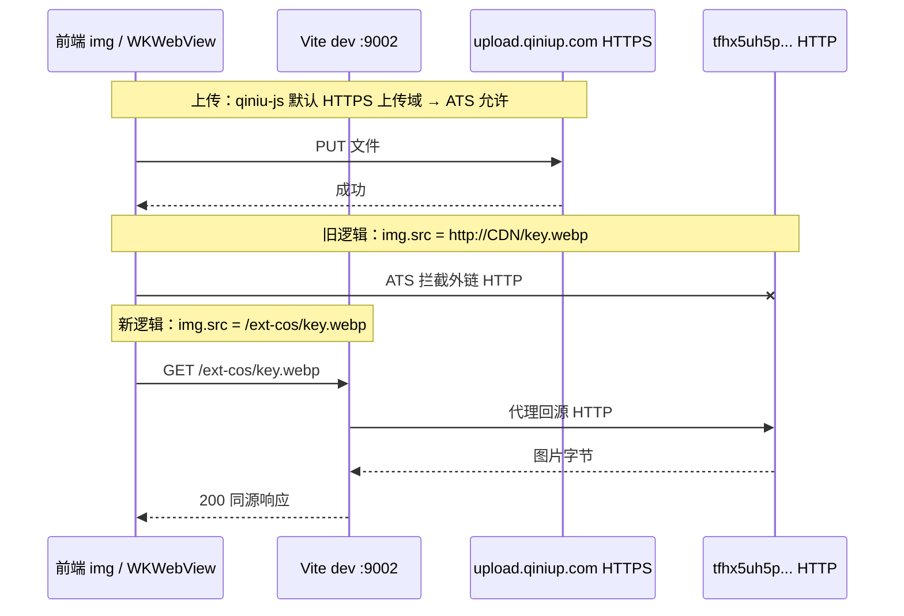

# 七牛 HTTP 展示代理（开发 / Web 生产 / Tauri）

> **文档角色**：**历史七牛** HTTP 展示链说明；云上传已迁 **腾讯云 COS**，实现与 env 见 [../backend/cos-object-storage.md](../backend/cos-object-storage.md)。  
> **展示机制仍适用**：持久化存完整对象 URL，DEV/Web 生产用 `/ext-cos/`（COS 对象同源代理，不限图片）+ `VITE_COS_PUBLIC_DOMAIN`（兼容 `VITE_QINIU_DOMAIN`）。**仅** `/ext-cos/`，不再兼容 `/ext-img/`。  
> **延伸阅读**  
> - COS 上传与 ACL：[../backend/cos-object-storage.md](../backend/cos-object-storage.md)  
> - macOS ATS 概念：[tauri-macos-ats-http.md](./tauri-macos-ats-http.md)  
> - 路由鉴权 mixed content 摘要：[route-auth.md](./route-auth.md) §12  
> - Nginx 生产代理：[../backend/nginx.md](../backend/nginx.md) `location /ext-cos/`  
> - 文档总索引：[../README.md](../README.md)

## 1. 背景与目标

### 1.1 现象

| 阶段 | 表现 |
|------|------|
| 七牛上传 | 成功（`qiniu-js` 走 HTTPS 上传域） |
| 本地展示 | `` 加载失败，控制台 ATS：`App Transport Security policy requires the use of a secure connection`（例：`girl-back.webp`） |
| 用户约束 | **本地继续使用七牛 HTTP CDN**，不改为 HTTPS |

### 1.2 目标

- **开发态**（含 `pnpm dev` + Tauri dev）：展示层走 **同源** `/ext-cos/` 代理到七牛 HTTP，绕过 WKWebView 对外链 HTTP 的 ATS 限制。
- **持久化**：数据库 / 用户信息仍保存 `http://{bucket}.clouddn.com/{key}` 原始 URL。
- **Tauri 生产包**：无 Vite 代理时，继续用 **Info.plist** 对当前 CDN 域名做 ATS 例外。

若与仓库最新源码不一致，**以源码为准**。

---

## 2. 改动范围

| 路径 | 说明 |
|------|------|
| `apps/frontend/src/utils/index.ts` | `rewriteQiniuHttpUrlToSameOriginProxy` + `resolveQiniuUrlForWebDisplay` 分支 |
| `apps/frontend/vite.config.ts` | 开发服务器 `/ext-cos` → `VITE_QINIU_DOMAIN` 代理 |
| `apps/frontend/src/views/download/index.tsx` | 预览列表 `` 走展示 URL 改写 |
| `apps/frontend/src-tauri/Info.plist` | `NSAllowsLocalNetworking`；CDN 域名 `tfhx5uh5p.hd-bkt.clouddn.com` |
| `apps/frontend/src-tauri/capabilities/default.json` | Tauri HTTP 插件允许访问的七牛 CDN URL 同步为新桶域 |

**调用方（未改逻辑，自动受益）**：`account`、`profile`、`Sidebar` 等已使用 `resolveQiniuUrlForWebDisplay` 的组件。

**未纳入本轮 diff**：`latest.json` / 版本号、`Sidebar` 登录图标等与七牛无关的改动。

---

## 3. 根因与数据流

### 3.1 为何「能上传、不能看图」



- **上传**与**读图**是不同 host：上传域多为 `*.qiniup.com`（HTTPS）；`VITE_QINIU_DOMAIN` 多为 `http://*.hd-bkt.clouddn.com/`。
- 旧版 `resolveQiniuUrlForWebDisplay` 在 **Tauri** 与 **非 PROD** 下 **原样返回 HTTP CDN URL**，Tauri 开发壳内 WKWebView 触发 ATS。
- 纯浏览器访问 `http://localhost:9002` 时，页面与七牛同为 HTTP，往往无 mixed content；**Tauri dev** 同样加载 `127.0.0.1:9002`，但对外部 HTTP 资源仍按 ATS 处理。

### 3.2 为何不采用「本地改 HTTPS」

产品要求本地仍用七牛 **HTTP** 桶域名。可选方案对比：

| 方案 | 结论 |
|------|------|
| 七牛控制台绑 HTTPS 域名 | 长期推荐，但违背「本地坚持 HTTP」 |
| 仅扩 Info.plist 放行 CDN | 开发仍可能漏请求；且与生产 Nginx 代理模型不一致 |
| **Vite `/ext-cos/` 代理（采用）** | 与生产 Web 的 `/ext-cos/` 模型一致；开发/Tauri dev 同源加载 |

---

## 4. 实现思路

### 4.1 展示 URL 三分支

| 环境 | `resolveQiniuUrlForWebDisplay` 行为 |
|------|-------------------------------------|
| `import.meta.env.DEV` | 改写为 `/ext-cos/{path}`（**含 Tauri dev**） |
| Tauri **生产**包 | 返回原始 HTTP URL（依赖 Info.plist） |
| Web **生产**（HTTPS） | 改写为 `/ext-cos/{path}`（Nginx 回源，见 route-auth §12） |

### 4.2 Vite 代理与生产 Nginx 对齐

开发态由 Vite `server.proxy` 承担 Nginx `location /ext-cos/` 的职责：`/ext-cos/girl-back.webp` → `http://tfhx5uh5p.hd-bkt.clouddn.com/girl-back.webp`。

### 4.3 Tauri 侧配套

- **Info.plist**：`NSAllowsLocalNetworking` 允许开发态 `http://localhost` API（如 `getUploadToken`）。
- **capabilities**：`http.allowlist` 中七牛 CDN 由旧桶 `tdxerr4c5...` 更新为 `tfhx5uh5p...`，与 `.env` 中 `VITE_QINIU_DOMAIN` 一致（供 Tauri HTTP 插件直连场景）。

---

## 5. 关键代码与注释

### 5.1 展示 URL 改写

**来源**：`apps/frontend/src/utils/index.ts`（约 L25–L65）

```typescript
/**
 * 将七牛 HTTP 资源 URL 改写为同源代理路径（展示用，不落库）
 */
function rewriteQiniuHttpUrlToSameOriginProxy(url: string): string {
	const qiniuDomainRaw = import.meta.env.VITE_QINIU_DOMAIN || '';
	const proxyPrefixRaw =
		import.meta.env.VITE_COS_PROXY_PREFIX || '/ext-cos/';
	if (!qiniuDomainRaw) return url;

	// 规范化域名末尾斜杠，保证 startsWith 判断稳定
	const normalizedQiniuDomain = qiniuDomainRaw.endsWith('/')
		? qiniuDomainRaw
		: `${qiniuDomainRaw}/`;
	if (!url.startsWith(normalizedQiniuDomain)) return url;

	// 代理前缀：/ext-cos/ + 对象 key（如 girl-back.webp）
	const normalizedProxyPrefix = proxyPrefixRaw.startsWith('/')
		? proxyPrefixRaw
		: `/${proxyPrefixRaw}`;
	const normalizedProxyPrefixWithSlash = normalizedProxyPrefix.endsWith('/')
		? normalizedProxyPrefix
		: `${normalizedProxyPrefix}/`;

	const rawPath = url.slice(normalizedQiniuDomain.length);
	return `${normalizedProxyPrefixWithSlash}${rawPath}`;
}

export const resolveQiniuUrlForWebDisplay = (url?: string): string => {
	if (!url) return '';
	// 开发：必须代理，否则 Tauri WKWebView ATS 拦 http://clouddn.com/...
	if (import.meta.env.DEV) {
		return rewriteQiniuHttpUrlToSameOriginProxy(url);
	}
	// Tauri 生产：无 Vite，走 plist 例外 + 原始 HTTP
	if (isTauriRuntime()) return url;
	if (!import.meta.env.PROD) return url;
	// Web 生产 HTTPS：mixed content 代理
	return rewriteQiniuHttpUrlToSameOriginProxy(url);
};
```

**示例**（`.env` 中 `VITE_QINIU_DOMAIN=http://tfhx5uh5p.hd-bkt.clouddn.com/`）：

| 持久化 URL（上传后写入） | 开发态 `` |
|--------------------------|-------------------|
| `http://tfhx5uh5p.hd-bkt.clouddn.com/girl-back.webp` | `/ext-cos/girl-back.webp` |

### 5.2 Vite 开发代理

**来源**：`apps/frontend/vite.config.ts`（约 L9–L64）

```typescript
export default defineConfig(({ mode }) => {
	// 从 .env 读取七牛 HTTP 源站，去掉末尾 /
	const env = loadEnv(mode, process.cwd(), '');
	const qiniuProxyTarget = (
		env.VITE_QINIU_DOMAIN || 'http://tfhx5uh5p.hd-bkt.clouddn.com'
	).replace(/\/$/, '');

	return {
		// ...
		server: {
			proxy: {
				'/api': {
					target: 'http://localhost:9112',
					changeOrigin: true,
				},
				// /ext-cos/xxx → {VITE_QINIU_DOMAIN}/xxx，保持 HTTP 回源
				'/ext-cos': {
					target: qiniuProxyTarget,
					changeOrigin: true,
					rewrite: (path) => path.replace(/^\/ext-cos/, '') || '/',
				},
			},
		},
	};
});
```

修改 `vite.config.ts` 后须 **重启** `pnpm dev` / `tauri dev`。

### 5.3 下载页预览

**来源**：`apps/frontend/src/views/download/index.tsx`（约 L251–L257）

```tsx
{domainUrls.map((i, key) => (
	<div key={key}>
		
	</div>
))}
```

上传完成时 `domainUrls` 仍存 **完整七牛 HTTP URL**（`VITE_QINIU_DOMAIN + res.key`），仅渲染时改写。

### 5.4 Info.plist（Tauri 生产 + 开发 API）

**来源**：`apps/frontend/src-tauri/Info.plist`（约 L13–L32）

```xml
<key>NSAppTransportSecurity</key>
<dict>
  <!-- 开发：http://localhost:9226/api 等 -->
  <key>NSAllowsLocalNetworking</key>
  <true/>
  <key>NSExceptionDomains</key>
  <dict>
    <key>tfhx5uh5p.hd-bkt.clouddn.com</key>
    <dict>
      <key>NSExceptionAllowsInsecureHTTPLoads</key>
      <true/>
      <key>NSIncludesSubdomains</key>
      <true/>
    </dict>
  </dict>
</dict>
```

### 5.5 Tauri HTTP 允许列表

**来源**：`apps/frontend/src-tauri/capabilities/default.json`（`http.allowlist` 片段）

```json
{
	"url": "http://tfhx5uh5p.hd-bkt.clouddn.com/*"
}
```

与 `VITE_QINIU_DOMAIN` 保持一致；换桶时需同步改 `.env`、本 allowlist 与 Info.plist。

---

## 6. 环境变量

| 变量 | 示例 | 作用 |
|------|------|------|
| `VITE_QINIU_DOMAIN` | `http://tfhx5uh5p.hd-bkt.clouddn.com/` | 上传后拼接对象 URL；Vite 代理回源目标 |
| `VITE_COS_PROXY_PREFIX` | `/ext-cos/` | 展示层改写前缀（与 Vite / Nginx 同源代理路径一致） |

---

## 7. 兼容性与影响

| 场景 | 影响 |
|------|------|
| 浏览器 `pnpm dev` | 七牛图走 `/ext-cos/`，行为与 Tauri dev 一致 |
| Tauri dev | 同上，解决 ATS 不显示 |
| Tauri 生产包 | 仍用 HTTP 直链 + Info.plist；**无** Vite 代理 |
| Web 生产 HTTPS | 行为与改前一致（`/ext-cos/` + Nginx） |
| 提交给后端的 avatar | **不变**，仍为七牛 HTTP 完整 URL |

**破坏性**：无 API 变更。若某处 `` 未走 `resolveQiniuUrlForWebDisplay`，开发态仍可能 ATS 失败，需补调用。

---

## 8. 回归测试建议

1. **Tauri dev**：上传头像 → 侧边栏/账户页立即显示；Network 中图片请求为 `http://127.0.0.1:9002/ext-cos/...`，非直连 `clouddn.com`。
2. **浏览器 dev**：同上。
3. **换桶**：修改 `VITE_QINIU_DOMAIN` 后，同步 `Info.plist`、`capabilities/default.json`，重启 dev。
4. **Tauri 生产包**：`tauri build` 后无 plist 时 CDN 图应仍能加载（ATS 例外）；有代理需求时用 Web 部署模型。
5. **持久化**：保存后接口 payload / DB 中 avatar 仍为 `http://tfhx5uh5p.../key`，非 `/ext-cos/`。

---

## 9. 相关源码路径

| 说明 | 路径 |
|------|------|
| 展示 URL 工具 | `apps/frontend/src/utils/index.ts` |
| 开发代理 | `apps/frontend/vite.config.ts` |
| 账户上传 | `apps/frontend/src/views/account/index.tsx` |
| 下载页预览 | `apps/frontend/src/views/download/index.tsx` |
| 侧栏头像 | `apps/frontend/src/components/design/Sidebar/index.tsx` |
| ATS / 麦克风 | `apps/frontend/src-tauri/Info.plist` |
| Tauri HTTP 白名单 | `apps/frontend/src-tauri/capabilities/default.json` |
| 上传 token API | `apps/frontend/src/service/index.ts` → `getUploadToken` |
| 后端 token | `apps/backend/src/services/upload/upload.service.ts` |

---

## 10. 后续可做

- 换桶时提供脚本或文档 checklist，一次性更新 `.env`、`Info.plist`、`capabilities` 三处。
- 抽取 `createQiniuJsUploadConfig()`（`upprotocol: 'https'` + `region`）统一上传配置，与展示代理解耦（若再次遇到「能传不能显」可优先查展示链）。
- 长期：七牛绑定 HTTPS 域名后，可逐步缩小 ATS 例外范围。
