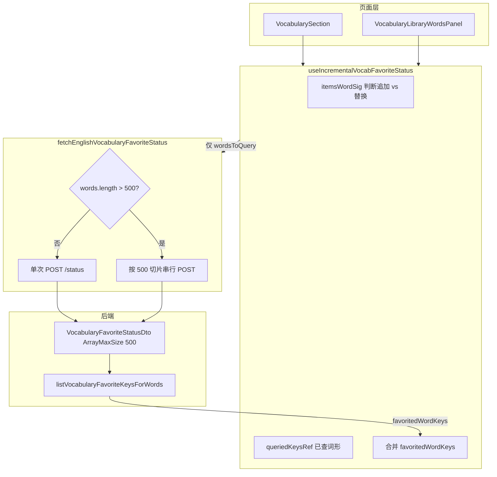
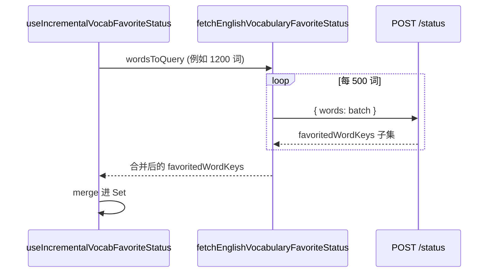

# 单词收藏状态查询：分批请求与增量同步

> 同一会话中的 Loading 居中、导入跳转、单词库删除等改动见 [`english-learning-library-ux-and-delete.md`](./english-learning-library-ux-and-delete.md)。

## 1. 背景与目标

### 1.1 用户视角

在**资源库右侧单词列表**（滚动分页加载）或**按主题生成的单词包**中，每个词条旁有收藏星标。进入页面或继续滚动加载时，需要知道「当前列表里哪些词已在收藏夹中」，以便正确高亮星标。

### 1.2 遇到的问题

1. **接口 400**：`POST /api/english-learning/vocabulary-favorites/status` 的请求体字段 `words` 在后端 DTO 上限制为 **最多 500 个元素**（`@ArrayMaxSize(500)`）。资源库滚动累积超过 500 个词后，前端仍一次性传入全部 `words`，服务端返回：

   ```text
   words must contain no more than 500 elements
   ```

2. **性能浪费**：改前每次 `items` 变化（例如每加载一页 +50 词）都会对**当前已加载的全部词**重新调用 `/status`，请求体随列表线性增长，网络与数据库压力重复放大。

### 1.3 本轮目标

| 层级 | 目标 |
|------|------|
| Service | 对超过 500 词的查询**自动分批** HTTP 请求并合并结果，调用方无需感知上限 |
| Hook | 仅对**尚未查询过**的词发起 `/status`，结果 **merge** 进 `favoritedWordKeys` |
| 页面 | 资源库 `VocabularyLibraryWordsPanel`、拉词 `VocabularySection` 共用 Hook，去掉各自重复的全量 `useEffect` |

**说明**：收藏/取消仍走既有 `addEnglishVocabularyFavorite` / `removeEnglishVocabularyFavorite`，本方案只优化**批量查状态**路径。

若与仓库最新源码不一致，**以源码为准**。

---

## 2. 改动范围

| 说明 | 路径 |
|------|------|
| 分批上限常量（与后端对齐） | `apps/frontend/src/constant/index.ts` |
| 分批请求与合并 | `apps/frontend/src/service/index.ts` → `fetchEnglishVocabularyFavoriteStatus` |
| 增量查询 Hook（新建） | `apps/frontend/src/hooks/useIncrementalVocabFavoriteStatus.ts` |
| Hook 导出 | `apps/frontend/src/hooks/index.ts` |
| 资源库单词面板接入 | `apps/frontend/src/views/englishLearning/library/VocabularyLibraryWordsPanel.tsx` |
| 单词包区接入 | `apps/frontend/src/views/englishLearning/vocab/VocabularySection.tsx` |
| 后端校验（未改，作为约束依据） | `apps/backend/src/services/english-learning/dto/vocabulary-favorite.dto.ts` |
| 后端接口（未改） | `apps/backend/src/services/english-learning/english-learning.controller.ts` → `vocabularyFavoritesStatus` |

**未改动**：收藏增删 API、收藏列表页、经典句收藏状态查询（经典句仍走 `fetchEnglishClassicQuoteFavoriteStatus`，逻辑独立）。

**相关旧文档**：`docs/frontend/english-learning-pack-favorites.md` 中 §4.6 仍描述「全量 `useEffect` + 单次 `fetchEnglishVocabularyFavoriteStatus`」，以本文为准。

---

## 3. 实现思路（整体过程）

### 3.1 分层设计



### 3.2 实现步骤（按落地顺序）

1. **对齐上限常量**  
   在 `constant/index.ts` 增加 `VOCAB_FAVORITE_STATUS_BATCH_SIZE = 500`，注释标明与后端 `VocabularyFavoriteStatusDto` 一致，避免魔法数字散落。

2. **Service 层分批**  
   改造 `fetchEnglishVocabularyFavoriteStatus`：  
   - `words.length ≤ 500`：行为与改前相同，单次 POST。  
   - `words.length > 500`：按 500 切片**串行**请求，将各批返回的 `favoritedWordKeys` 拼成数组，最后用最后一批响应的 envelope（`code` / `success` / `message`）包裹合并后的 `data`。

3. **抽取增量 Hook**  
   新建 `useIncrementalVocabFavoriteStatus(items)`：  
   - 维护 `favoritedWordKeys`（`Set`）与 `queriedKeysRef`（已向后端发起过 status 的**规范化词形**）。  
   - 根据 `itemsWordSig` 判断列表是**末尾追加**还是**整体替换**，替换时清空本地状态。  
   - 仅将未出现在 `queriedKeysRef` 中的词加入 `wordsToQuery`，调用 Service 后 **merge** 返回的已收藏键。  
   - 请求失败时从 `queriedKeysRef` 移除本批词形，便于下次 `items` 变化时重试。

4. **页面接入**  
   删除 `VocabularyLibraryWordsPanel` / `VocabularySection` 内原有的 `itemsWordSig` + 全量 `useEffect`，改为：

   ```typescript
   const { favoritedWordKeys, setFavoritedWordKeys } =
     useIncrementalVocabFavoriteStatus(items);
   ```

   用户点击星标时的 `setFavoritedWordKeys` 乐观更新逻辑保持不变。

### 3.3 关键决策与权衡

| 决策 | 理由 | 未采用方案 |
|------|------|------------|
| 上限放在 Service 分批 | 所有调用方自动合规，避免遗漏 | 仅在某页面 `slice(0, 500)` |
| 分批**串行** `await` | 控制并发，减轻 DB 瞬时压力 | `Promise.all` 并行多批（更快但更猛） |
| 增量在 Hook 而非页面 | 两处 UI 逻辑一致，避免复制 | 各页面各自维护 `queriedKeysRef` |
| 用 `itemsWordSig` 前缀判断追加 | 无额外 API；覆盖分页追加、流式 chunk | 后端按 `libraryId` 一次返回全库收藏键 |
| 列表替换时清空再查 | 切换词库/载入历史时状态正确 | 永不清理（易残留错误星标） |

### 3.4 列表「追加」与「替换」的判定

`itemsWordSig` 为 `items.map(it => it.word).join('\u0001')`（`\u0001` 在自然语言词面中极少出现，降低误拼接）。

- **追加**：新 sig 等于旧 sig，或以 `旧sig + '\u0001'` 为前缀（典型：资源库 `fetchMore` 追加一页）。  
  → 保留已有 `favoritedWordKeys` 与 `queriedKeysRef`，只查新增词。

- **替换**：新 sig 不满足上述关系（切换词库、历史详情覆盖、流式 `vocabOnDone` 重排等）。  
  → 清空 `favoritedWordKeys` 与 `queriedKeysRef`，对当前 `items` 全量做增量查询（等价于首查）。

- **清空**：`items.length === 0`（如切换库前先 `setItems([])`）。  
  → 重置所有 ref 与 state。

---

## 4. 关键代码与详细注释

### 4.1 前端常量：与后端上限对齐

**来源**：`apps/frontend/src/constant/index.ts`（约 L57–L60）

```typescript
/** 单词库内词条每页条数 */
export const VOCAB_LIBRARY_ITEMS_PAGE_SIZE = 50;

/**
 * 收藏状态批量查询单次最多词数。
 * 必须与后端 VocabularyFavoriteStatusDto 的 @ArrayMaxSize(500) 保持一致；
 * Service 层 fetchEnglishVocabularyFavoriteStatus 按此值切片。
 */
export const VOCAB_FAVORITE_STATUS_BATCH_SIZE = 500;
```

### 4.2 后端 DTO（约束来源，本轮未改代码）

**来源**：`apps/backend/src/services/english-learning/dto/vocabulary-favorite.dto.ts`（约 L44–L51）

```typescript
/** 批量查询当前列表中哪些词已收藏 */
export class VocabularyFavoriteStatusDto {
  @IsArray()
  @ArrayMaxSize(500) // 说明：单次请求 body.words 数组长度上限，超出则 400 Bad Request
  @IsString({ each: true })
  @MaxLength(500, { each: true }) // 说明：每个词面字符串最大长度
  words!: string[];
}
```

**来源**：`apps/backend/src/services/english-learning/english-learning.controller.ts`（`vocabularyFavoritesStatus` 方法附近）

```typescript
@Post('vocabulary-favorites/status')
async vocabularyFavoritesStatus(
  @Req() req: AuthedRequest,
  @Body() dto: VocabularyFavoriteStatusDto,
) {
  const userId = req.user?.userId;
  if (userId == null) {
    throw new UnauthorizedException('未授权');
  }
  // 说明：根据 dto.words 查库，返回当前用户已收藏的「规范化词形」列表
  const favoritedWordKeys =
    await this.englishLearningService.listVocabularyFavoriteKeysForWords(
      userId,
      dto.words,
    );
  return { success: true, data: { favoritedWordKeys } };
}
```

### 4.3 Service：自动分批并合并

**来源**：`apps/frontend/src/service/index.ts`（约 L647–L674，`fetchEnglishVocabularyFavoriteStatus`）

```typescript
/**
 * 查询当前列表中哪些词已收藏（返回规范化词形 word_key）。
 * - 词数 ≤ VOCAB_FAVORITE_STATUS_BATCH_SIZE：单次 POST，与历史行为一致。
 * - 词数更大：按 500 切片串行请求，合并各批 favoritedWordKeys。
 */
export const fetchEnglishVocabularyFavoriteStatus = async (words: string[]) => {
  // 说明：常见路径（增量 Hook 每批通常 ≤ 50～500），无额外开销
  if (words.length <= VOCAB_FAVORITE_STATUS_BATCH_SIZE) {
    return await http.post<{ favoritedWordKeys: string[] }>(
      `${ENGLISH_LEARNING_VOCABULARY_FAVORITES}/status`,
      { words },
    );
  }

  const favoritedWordKeys: string[] = [];
  let lastRes: Awaited<
    ReturnType<typeof http.post<{ favoritedWordKeys: string[] }>>
  >;

  // 说明：串行循环，总耗时 ≈ 批次数 × 单次 RTT；避免并行打满连接/DB
  for (let i = 0; i < words.length; i += VOCAB_FAVORITE_STATUS_BATCH_SIZE) {
    const batch = words.slice(i, i + VOCAB_FAVORITE_STATUS_BATCH_SIZE);
    lastRes = await http.post<{ favoritedWordKeys: string[] }>(
      `${ENGLISH_LEARNING_VOCABULARY_FAVORITES}/status`,
      { words: batch },
    );
    const keys = lastRes.data?.favoritedWordKeys;
    if (Array.isArray(keys)) {
      favoritedWordKeys.push(...keys);
    }
  }

  // 说明：沿用最后一批的 code/success/message，仅替换 data 为合并结果
  return {
    ...lastRes!,
    data: { favoritedWordKeys },
  };
};
```

### 4.4 Hook：增量查询与 merge

**来源**：`apps/frontend/src/hooks/useIncrementalVocabFavoriteStatus.ts`（全文约 L1–L84）

```typescript
/**
 * 按列表增量查询单词收藏状态：
 * - 仅对尚未查询过的词请求 POST .../vocabulary-favorites/status；
 * - 将返回的 favoritedWordKeys 合并进 Set（不整表覆盖）；
 * - 列表整体替换时清空本地状态并重新查询。
 */
import { useEffect, useMemo, useRef, useState } from 'react';
import {
  fetchEnglishVocabularyFavoriteStatus,
  normalizeEnglishVocabWordKey,
} from '@/service';

/** 词序列签名分隔符：避免词面文本本身包含常见分隔符导致误判 */
const WORD_SIG_SEP = '\u0001';

export function useIncrementalVocabFavoriteStatus(
  items: ReadonlyArray<{ word: string }>,
) {
  /** UI 用：已收藏的规范化词形集合（与后端 word_key 一致） */
  const [favoritedWordKeys, setFavoritedWordKeys] = useState<Set<string>>(
    () => new Set(),
  );

  /** 已向后端发起过 status 查询的词形（规范化后），不触发重渲染 */
  const queriedKeysRef = useRef<Set<string>>(new Set());

  /** 上一轮 items 的词序列签名，用于判断追加 vs 替换 */
  const prevItemsWordSigRef = useRef('');

  const itemsWordSig = useMemo(
    () => items.map((it) => it.word).join(WORD_SIG_SEP),
    [items],
  );

  useEffect(() => {
    // —— 1. 列表为空：重置（切换词库前常会 setItems([])）——
    if (items.length === 0) {
      setFavoritedWordKeys(new Set());
      queriedKeysRef.current = new Set();
      prevItemsWordSigRef.current = '';
      return;
    }

    const prevSig = prevItemsWordSigRef.current;

    /**
     * 是否为「在上一列表末尾追加」：
     * - sig 完全相同：items 引用变但内容未变，无需重复查；
     * - 新 sig 以 oldSig + SEP 开头：典型分页 fetchMore。
     */
    const appended =
      prevSig.length > 0 &&
      (itemsWordSig === prevSig ||
        itemsWordSig.startsWith(`${prevSig}${WORD_SIG_SEP}`));

    if (!appended) {
      // 说明：整体替换（换库、历史载入、done 重排等）→ 丢弃旧收藏状态缓存
      setFavoritedWordKeys(new Set());
      queriedKeysRef.current = new Set();
    }
    prevItemsWordSigRef.current = itemsWordSig;

    // —— 2. 收集本效应周期内需要新查的词面 ——
    const wordsToQuery: string[] = [];
    for (const item of items) {
      const wk = normalizeEnglishVocabWordKey(item.word);
      if (!wk || queriedKeysRef.current.has(wk)) continue;
      // 说明：先记入 queried，避免 Strict Mode 双次 effect 重复入队同一词
      queriedKeysRef.current.add(wk);
      wordsToQuery.push(item.word); // 说明：请求体仍传原始 word，由服务端规范化
    }

    if (wordsToQuery.length === 0) return;

    let cancelled = false;
    void (async () => {
      try {
        const res = await fetchEnglishVocabularyFavoriteStatus(wordsToQuery);
        if (cancelled) return;

        const keys = res.data?.favoritedWordKeys;
        if (!Array.isArray(keys) || keys.length === 0) return;

        // 说明：只把「已收藏」的键并入 Set；未返回的词视为未收藏
        setFavoritedWordKeys((prev) => {
          const next = new Set(prev);
          for (const k of keys) next.add(k);
          return next;
        });
      } catch {
        // 说明：失败时回滚 queried，下次 items 变化可重试；不清空已有 favorited 显示
        if (!cancelled) {
          for (const word of wordsToQuery) {
            const wk = normalizeEnglishVocabWordKey(word);
            if (wk) queriedKeysRef.current.delete(wk);
          }
        }
      }
    })();

    return () => {
      cancelled = true; // 说明：竞态：慢响应丢弃，避免覆盖新列表状态
    };
  }, [itemsWordSig, items]);

  return { favoritedWordKeys, setFavoritedWordKeys };
}
```

### 4.5 页面接入：资源库单词面板

**来源**：`apps/frontend/src/views/englishLearning/library/VocabularyLibraryWordsPanel.tsx`（约 L18–L57，摘录）

```typescript
import { useI18n, useIncrementalVocabFavoriteStatus } from '@/hooks';
// 说明：不再直接 import fetchEnglishVocabularyFavoriteStatus

export function VocabularyLibraryWordsPanel(/* ... */) {
  const [items, setItems] = useState<EnglishVocabularyLibraryItemRow[]>([]);
  // ...

  /**
   * 收藏状态由 Hook 维护：
   * - fetchFirstPage / fetchMore 更新 items 后，Hook 自动增量拉 status；
   * - 删掉了原 itemsWordSig + 全量 useEffect（每次对全部 items 请求）。
   */
  const { favoritedWordKeys, setFavoritedWordKeys } =
    useIncrementalVocabFavoriteStatus(items);

  const [favoriteActionKey, setFavoriteActionKey] = useState<string | null>(null);

  // fetchFirstPage：setItems([]) → Hook 清空；再 setItems(list) → 查首屏最多 50 词
  // fetchMore：append chunk → Hook 仅查本页新增 50 词
}
```

### 4.6 页面接入：单词包生成区

**来源**：`apps/frontend/src/views/englishLearning/vocab/VocabularySection.tsx`（约 L28–L86，摘录）

```typescript
import { useI18n, useIncrementalVocabFavoriteStatus } from '@/hooks';

function VocabularyPackSectionInner() {
  const items = EnglishPackStore.vocabItems; // MobX 观察列表

  const { favoritedWordKeys, setFavoritedWordKeys } =
    useIncrementalVocabFavoriteStatus(items);

  // 说明：流式 vocabOnChunk 追加 → 增量查新 chunk；
  // vocabOnDone 若词序变化导致 sig 非前缀 → Hook 视为替换并全量重查。
}
```

### 4.7 用户点击星标（与增量查询正交）

**来源**：`apps/frontend/src/views/englishLearning/library/VocabularyLibraryWordsPanel.tsx`（`toggleVocabularyFavorite` 附近，逻辑与改前一致）

```typescript
const toggleVocabularyFavorite = useCallback(
  async (item: EnglishVocabularyItem, currentlyFavorited: boolean) => {
    const wk = normalizeEnglishVocabWordKey(item.word);
    if (!wk) return;
    setFavoriteActionKey(wk);
    try {
      if (currentlyFavorited) {
        await removeEnglishVocabularyFavorite(item.word);
        setFavoritedWordKeys((prev) => {
          const next = new Set(prev);
          next.delete(wk);
          return next;
        });
      } else {
        await addEnglishVocabularyFavorite(item);
        setFavoritedWordKeys((prev) => {
          const next = new Set(prev);
          next.add(wk);
          return next;
        });
      }
    } finally {
      setFavoriteActionKey(null);
    }
  },
  [/* ... */],
);
```

---

## 5. 端到端数据流示例

### 5.1 资源库滚动加载（每页 50 词）

| 时刻 | `items` 数量 | Hook 行为 | `/status` 请求体大小 |
|------|-------------|-----------|---------------------|
| 首屏加载完成 | 50 | 替换 → 查 50 词 | 50 |
| 滚到底 +1 页 | 100 | 追加 → 只查新增 50 | 50 |
| 再 +1 页 | 150 | 追加 → 只查新增 50 | 50 |
| … 至 550 | 550 | 追加 → 只查新增 50 | 50（Service 仍单次） |

**改前**（对比）：滚到 550 词时会对 **550** 个词发 2 批（500+50），且每一页加载都会重复全量查询。

### 5.2 单次增量超过 500 词（边界）

若未来某次 `wordsToQuery.length > 500`（例如历史详情一次注入上千词），Hook 仍只调用一次 `fetchEnglishVocabularyFavoriteStatus(wordsToQuery)`，由 **Service 内部分批**，对调用方透明。



---

## 6. 兼容性与影响

| 项 | 说明 |
|----|------|
| API 契约 | 未改路径与响应结构；仅客户端请求切分方式变化 |
| 后端 | 无需发版即可修复 400；若将来提高 `@ArrayMaxSize`，需同步改 `VOCAB_FAVORITE_STATUS_BATCH_SIZE` |
| 行为 | 星标展示与改前一致；切换列表后短暂可能先无星标再填充（与改前全量请求相同） |
| 破坏性 | 无公开 API 破坏；内部删除页面内重复 `useEffect` |

---

## 7. 风险与回归建议

1. **竞态**：快速切换 `libraryId` 时，旧请求的 `cancelled` 应丢弃，避免星标闪错（Hook 已用 `cancelled` 标志）。  
2. **sig 误判**：若词面本身含 `\u0001`，理论上可能破坏前缀判断（极低概率）。  
3. **替换判定**：`vocabOnDone` 若最终列表与流式 chunk 词序不同，会触发全量重查（正确但多一次请求）。  
4. **失败重试**：status 失败时仅回滚 `queriedKeysRef`，不 Toast（与改前 catch 清空 Set 相比，已加载页的星标可能短暂不准直至滚动/刷新触发重查）。

**建议测试路径**：

- [ ] 资源库：导入 >500 词的 JSON，滚动加载到底，控制台无 400，星标与收藏夹一致  
- [ ] 资源库：切换左侧另一个词库，星标应重置再加载  
- [ ] 单词包：流式生成过程中星标随 chunk 出现；完成后星标仍正确  
- [ ] 单词包：打开历史详情，星标与收藏状态一致  
- [ ] 在列表中收藏/取消一个词，星标立即变化且刷新后仍正确  

---

## 8. 相关源码路径速查

| 说明 | 路径 |
|------|------|
| 分批常量 | `apps/frontend/src/constant/index.ts` |
| 分批 Service | `apps/frontend/src/service/index.ts` |
| 增量 Hook | `apps/frontend/src/hooks/useIncrementalVocabFavoriteStatus.ts` |
| Hook 导出 | `apps/frontend/src/hooks/index.ts` |
| 资源库右栏 | `apps/frontend/src/views/englishLearning/library/VocabularyLibraryWordsPanel.tsx` |
| 单词包区 | `apps/frontend/src/views/englishLearning/vocab/VocabularySection.tsx` |
| 后端 DTO 上限 | `apps/backend/src/services/english-learning/dto/vocabulary-favorite.dto.ts` |
| 收藏功能总览（旧） | `docs/frontend/english-learning-pack-favorites.md` |
| 资源库导入 | `docs/frontend/english-learning-library-import.md` |

---

## 9. 后续可做（非本轮）

- Service 分批改为**有限并发**（如 2～3 批 `Promise.all`）以缩短超大列表首查时间。  
- 后端提供 `GET .../vocabulary-favorites/keys?libraryId=`，词库场景一次拉全库收藏键，彻底避免按词数组传输。  
- 经典句 `fetchEnglishClassicQuoteFavoriteStatus` 若遇类似上限，可复用同一分批模式或独立 Hook。
