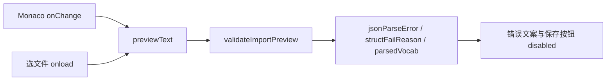

# 单词音节划分（segmentation）与导入页实时校验

> **延伸阅读**  
> - 单词库 JSON 导入与持久化总览：[english-learning-library-import.md](./english-learning-library-import.md)  
> - JSON 导入页路由与文件选择：[english-learning-json-import.md](./english-learning-json-import.md)

## 1. 背景与目标

### 1.1 用户视角

1. **音节划分展示**：导入或生成的单词条目除词面、音标、词性、释义、例句外，需要支持 **`segmentation`（音节划分）**，例如 `hel·lo`、`ap·ple`，在资源库、单词包列表与收藏列表中可见。
2. **导入后编辑仍要校验**：JSON 导入页在首次解析失败时，用户在 Monaco 中修正内容后，错误提示与「保存」按钮状态应**随编辑即时更新**；改前问题为校验结果只写在 state 里、编辑器 `onChange` 未重新跑解析。

### 1.2 技术目标

| 目标 | 做法 |
|------|------|
| 字段贯通 | 后端 DTO / 实体 / Service 解析与 API 响应统一带 `segmentation` |
| 可选、兼容旧数据 | DB 列 `varchar(500) NOT NULL DEFAULT ''`；JSON 无该键时按空串 |
| 前后端规则一致 | 导入页 `parseVocabularyImport` 与后端 `parseVocabularyPackRootToLibraryItems` 对齐 |
| 导入校验派生 | `validateImportPreview` + `useMemo(previewText, kind)`，编辑即重算 |

若与仓库最新源码不一致，**以源码为准**。

---

## 2. 改动范围

| 层级 | 路径 |
|------|------|
| 迁移 | `apps/backend/src/migrations/1780100000000-vocabulary-segmentation.ts` |
| 实体 | `english-vocabulary-library-item.entity.ts`、`english-vocabulary-pack-item.entity.ts`、`english-vocabulary-favorite.entity.ts` |
| JSON 类型 | `english-vocabulary.entity.ts` → `EnglishVocabularyPackItemJson` |
| DTO | `save-vocabulary-library.dto.ts`、`vocabulary-favorite.dto.ts` |
| 服务 | `english-learning.service.ts`（`VocabularyItemDto`、解析、落库、列表、收藏、导出） |
| DOCX | `english-favorites-docx.builder.ts` |
| 前端类型 | `apps/frontend/src/service/index.ts` |
| 导入页 | `EnglishLearningImportPage.tsx` |
| SSE 解析 | `englishLearningPackSse.ts` |
| 展示组件 | `apps/frontend/src/views/englishLearning/components/VocabularySegmentationLine.tsx` |
| 列表 UI | `VocabularyLibraryWordsPanel.tsx`、`VocabularyPackList.tsx`、`VocabularyFavoritesPanel.tsx` |
| 文案 | `zh-CN.ts`、`en-US.ts`（`hintVocab`、示例 JSON） |

**未改**：经典句导入结构；`segmentation` 仅作用于单词（vocabulary）链路。

---

## 3. 实现思路

### 3.1 为何单独加列而非塞进 example

- 音节划分是**独立展示维度**，与例句、释义并列，便于卡片 UI 放在音标下方。
- 与 `pos` 一样采用**可选字符串 + 默认空串**，旧库/旧 JSON 无需迁移数据内容即可上线。
- 三张表均可能展示单词：`library_item`（导入库）、`pack_item`（流式拉取）、`favorite`（收藏快照），故三表同加列。

### 3.2 解析键名兼容

后端集中 `parseVocabularySegmentationFromJsonRow`，依次尝试 `segmentation`、`syllables`、`syllable`，trim 后截断 500 字符，避免外部 JSON 字段名不统一导致静默丢失。

### 3.3 导入校验从「一次性 state」改为「派生」

**改前**：`processJsonFile` 里 `setStructFailReason` / `setParsedVocab`；`onPreviewEditorChange` 只 `setPreviewText`，错误状态残留。

**改后**：



- 仅 `fileReadError` 仍为独立 state（读文件失败与编辑器内容无关）。
- 合法 JSON 格式化进编辑器；非法 JSON 保留原文本，由 `validateImportPreview` 报 `jsonParseError`。

### 3.4 展示层

抽取 `VocabularySegmentationLine`：`segmentation` 有 trim 后非空才渲染一行，避免空 div 占位；各列表可传不同 `className` 适配间距。

---

## 4. 关键代码与注释

### 4.1 数据库迁移（三表加列）

**来源**：`apps/backend/src/migrations/1780100000000-vocabulary-segmentation.ts`（约 L7–L29）

```typescript
// 说明：对 library_item / pack_item / favorite 逐表检查 information_schema，避免重复 ADD
for (const table of [
  'english_vocabulary_library_item',
  'english_vocabulary_pack_item',
  'english_vocabulary_favorite',
]) {
  // ... 若尚无 segmentation 列则：
  await queryRunner.query(
    `ALTER TABLE \`${table}\` ADD \`segmentation\` varchar(500) NOT NULL DEFAULT ''`,
  );
}
```

### 4.2 后端：DTO 与词条类型

**来源**：`apps/backend/src/services/english-learning/english-learning.service.ts`（`VocabularyItemDto` 约 L138–L147）

```typescript
export type VocabularyItemDto = {
  word: string;
  ipa: string;
  pos: string;
  /** 音节划分，如 ap·ple；旧数据为空串 */
  segmentation: string;
  translationZh: string;
  example: string;
};
```

**来源**：`apps/backend/src/services/english-learning/english-learning.service.ts`（`parseVocabularySegmentationFromJsonRow` 约 L593–L603）

```typescript
private parseVocabularySegmentationFromJsonRow(
  r: Record<string, unknown>,
): string {
  const raw =
    (typeof r.segmentation === 'string' && r.segmentation) ||
    (typeof r.syllables === 'string' && r.syllables) ||
    (typeof r.syllable === 'string' && r.syllable) ||
    '';
  return raw.trim().slice(0, 500);
}
```

**来源**：`apps/backend/src/services/english-learning/english-learning.service.ts`（`parseVocabularyPackRootToLibraryItems` 摘录）

```typescript
const segmentation = this.parseVocabularySegmentationFromJsonRow(o);
itemsJson.push({
  word: word.slice(0, 500),
  ipa: ipa.slice(0, 2000),
  pos: pos || undefined,
  segmentation: segmentation || undefined, // 说明：落库 JSON 快照可选字段
  translationZh: /* ... */,
  example: /* ... */,
});
```

`mapLibraryItemRow` / `mapVocabPackItemRow` / `persistVocabularyLibrary` / `saveImportedVocabularyLibrary` / `addVocabularyFavorite` 均读写 `segmentation` 字段，保证 API 与 DB 一致。

### 4.3 前端：导入解析与实时校验

**来源**：`apps/frontend/src/views/englishLearning/import/EnglishLearningImportPage.tsx`（`parseVocabularyImport` 约 L64–L76）

```typescript
const segmentation =
  typeof o.segmentation === 'string'
    ? o.segmentation.trim().slice(0, 500)
    : '';
items.push({ word, ipa, pos, segmentation, translationZh, example });
```

**来源**：`apps/frontend/src/views/englishLearning/import/EnglishLearningImportPage.tsx`（`validateImportPreview` 约 L121–L177）

```typescript
function validateImportPreview(text: string, kind: ImportKind): ImportValidation {
  const trimmed = text.trim();
  if (!trimmed) {
    return { jsonParseError: false, structFailReason: null, parsedVocab: null, parsedClassic: null };
  }
  let parsed: unknown;
  try {
    parsed = JSON.parse(text);
  } catch {
    return { jsonParseError: true, structFailReason: null, parsedVocab: null, parsedClassic: null };
  }
  if (kind === 'vocab') {
    const res = parseVocabularyImport(parsed);
    if (res.ok) {
      return { jsonParseError: false, structFailReason: null, parsedVocab: res.items, parsedClassic: null };
    }
    return { jsonParseError: false, structFailReason: res.reason, parsedVocab: null, parsedClassic: null };
  }
  // ... classic 分支对称
}
```

**来源**：`apps/frontend/src/views/englishLearning/import/EnglishLearningImportPage.tsx`（组件内 `useMemo` 约 L214–L220）

```typescript
const importValidation = useMemo(
  () => validateImportPreview(previewText, kind),
  [previewText, kind],
);
const { jsonParseError, structFailReason, parsedVocab, parsedClassic } = importValidation;
```

**来源**：`apps/frontend/src/views/englishLearning/import/EnglishLearningImportPage.tsx`（`onPreviewEditorChange` 约 L301–L308）

```typescript
const onPreviewEditorChange = useCallback((next: string) => {
  if (!next.trim()) {
    setPreviewText('');
    return;
  }
  setPreviewText(next); // 说明：仅改文本，校验由 useMemo 自动跟进
}, []);
```

保存仍上传 `previewText` 原文（multipart）；服务端再次解析，与前端校验规则双重一致。

### 4.4 前端：列表展示组件

**来源**：`apps/frontend/src/views/englishLearning/components/VocabularySegmentationLine.tsx`（全文）

```tsx
/** 单词音节划分展示行（有内容时渲染） */
export function VocabularySegmentationLine({ segmentation, className = '...' }) {
  const text = segmentation?.trim();
  if (!text) return null;
  return <div className={className}>{text}</div>;
}
```

**来源**：`apps/frontend/src/views/englishLearning/library/VocabularyLibraryWordsPanel.tsx`（音标下方）

```tsx
{displayIpaWrapped(item.ipa)}
<VocabularySegmentationLine segmentation={item.segmentation} />
```

单词包 `VocabularyPackList`、收藏 `VocabularyFavoritesPanel` 用法相同。

### 4.5 导入 JSON 示例（页面顶栏）

```json
[
  {
    "word": "hello",
    "ipa": "/həˈləʊ/",
    "pos": "n.",
    "segmentation": "hel·lo",
    "translationZh": "你好",
    "example": "Hello, how are you?"
  }
]
```

---

## 5. API 与字段契约

| 字段 | 类型 | 必填 | 上限 | 说明 |
|------|------|------|------|------|
| `word` | string | 是 | 500 | 词面 |
| `ipa` | string | 是 | 2000 | 音标 |
| `pos` | string | 否 | 64 | 词性缩写 |
| `segmentation` | string | 否 | 500 | 音节划分，如 `ap·ple` |
| `translationZh` | string | 否* | 8000 | 缺省可落 `—` |
| `example` | string | 否* | 8000 | 缺省可落 `—` |

\* 导入解析仍要求至少 `word` + `ipa`；`translationZh` / `example` 在前后端有默认值。

列表 API（库内词条、包明细、收藏分页）响应中的 `EnglishVocabularyItem` / `VocabularyLibraryItemDto` 均包含 `segmentation`（可能为空串）。

---

## 6. 兼容性与影响

| 项 | 说明 |
|----|------|
| 破坏性 | 无：新增可选字段；旧客户端忽略未知 JSON 键仍可工作 |
| 旧数据 | 迁移后 `segmentation` 默认为 `''`，UI 不展示空行 |
| LLM 流式包 | `extractVocabularyItemsLoose` 已解析 `segmentation`；模型未输出时为空串 |
| 生产部署 | 须执行迁移 `1780100000000-vocabulary-segmentation`（或等价 DDL） |

---

## 7. 建议回归

1. 导入含 `segmentation` 的 JSON → 保存 → 资源库词条卡片音标下显示音节划分。
2. 导入故意错误 JSON → 编辑为合法且含有效 `word`/`ipa` → 红色错误消失、「保存到单词库」可点。
3. 收藏带 `segmentation` 的词条 → 收藏列表与 DOCX 导出含「音节划分」段落。
4. 流式生成若返回 `segmentation` → 单词包列表展示一致。

---

## 8. 相关源码路径

| 说明 | 路径 |
|------|------|
| 迁移 | `apps/backend/src/migrations/1780100000000-vocabulary-segmentation.ts` |
| 服务主逻辑 | `apps/backend/src/services/english-learning/english-learning.service.ts` |
| 库词条实体 | `apps/backend/src/services/english-learning/entity/english-vocabulary-library-item.entity.ts` |
| 导入页 | `apps/frontend/src/views/englishLearning/import/EnglishLearningImportPage.tsx` |
| 展示组件 | `apps/frontend/src/views/englishLearning/components/VocabularySegmentationLine.tsx` |
| 前端类型 | `apps/frontend/src/service/index.ts` |
