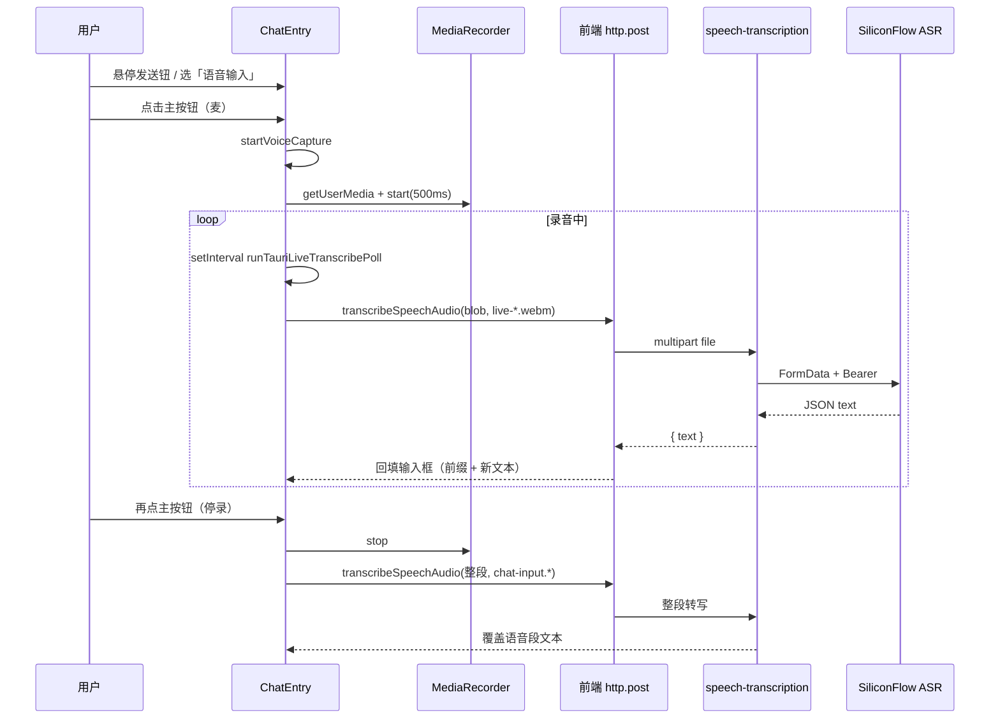

# 语音输入与语音识别（ASR）实现说明

本文档基于当前仓库实现，梳理 **Tauri 桌面端** 聊天/助手输入区「语音输入」的完整思路，并收录相关源码摘录与**逐行说明**（行号与 `apps/frontend`、`apps/backend` 中文件一致）。**文档仅描述与摘录代码，不修改业务源码。**

---

## 1. 目标与适用范围

| 维度 | 说明 |
|------|------|
| 运行环境 | **仅 Tauri 壳内**（`isTauriRuntime() === true`）展示「文本 / 语音」模式切换、麦克风录音与 live 增量转写；纯 Web 仅保留文本发送按钮，强制 `inputMode === 'text'`。 |
| 录音技术 | `navigator.mediaDevices.getUserMedia` + `MediaRecorder`，`timeslice` 500ms 产出 `Blob` 片段。 |
| 实时听写 | 定时将**累积**音频打成 `Blob` 调后端转写，用 `epoch` 与 `voiceRecordingRef` 丢弃过期响应；有最小字节与最小增长门槛，减少不完整 WebM 与重复请求。 |
| 停录 | 用户再次点击主按钮：`MediaRecorder.stop()` → 整段 `Blob` → 再调同一转写接口，**覆盖**本会话语音段文本（保留 `voiceBaseRef` 前缀）。 |
| 后端 | NestJS `POST /speech-transcription/transcription`，`multipart` 字段 `file`；硅基流动 OpenAI 兼容 `POST /v1/audio/transcriptions`。 |
| 业务约束 | 知识库 **AI 模式** 下左侧文档无正文时 `disableTextInput=true`：禁用文本输入、禁止悬停打开模式菜单、禁止开始语音/发送（录音中仍允许停录并识别，避免麦克风悬挂）。 |

---

## 2. 端到端数据流（概念）



---

## 3. 运行时与麦克风基础设施

### 3.1 `isTauriRuntime`（`apps/frontend/src/utils/runtime.ts`）

**摘录** `apps/frontend/src/utils/runtime.ts` 第 1–10 行：

```typescript
/**
 * 是否在 Tauri WebView（桌面壳）内运行。
 * 纯浏览器 / Vite dev 下为 false，可安全走 Web API 回退逻辑。
 */
export function isTauriRuntime(): boolean {
	if (typeof window === 'undefined') {
		return false;
	}
	return '__TAURI_INTERNALS__' in window;
}
```

| 行号 | 说明 |
|------|------|
| 1-4 | 模块注释：区分桌面壳与纯浏览器，语音 UI 仅壳内启用。 |
| 5 | 导出函数，供 `ChatEntry`、麦克风检测等调用。 |
| 6 | SSR 或无 `window` 时视为非 Tauri。 |
| 7 | 返回 `false`，避免访问 `window`。 |
| 9 | Tauri 在 `window` 上挂载内部符号，存在即判定为壳内。 |
| 10 | 函数结束。 |

### 3.2 `navigatorMediaDevices` 补丁与错误文案（`apps/frontend/src/utils/navigatorMediaDevices.ts`）

**摘录** `apps/frontend/src/utils/navigatorMediaDevices.ts` 第 1–78 行：

```typescript
/**
 * 部分 WebView（macOS WKWebView、旧版 Safari）只暴露前缀版 getUserMedia，
 * 未挂到 navigator.mediaDevices 上，会导致「没有麦克风接口」的假阴性。
 * 在读取能力或调用 getUserMedia 之前执行一次即可（幂等）。
 */
export function patchNavigatorMediaDevices(): void {
	if (typeof navigator === 'undefined') return;

	const nav = navigator as Navigator & {
		mediaDevices?: MediaDevices;
	};
	// lib.dom 中 MediaDevices 类型恒含 getUserMedia；运行时旧 WebView 可能仍缺省，用 unknown 判断
	const existingGum = (
		nav.mediaDevices as unknown as { getUserMedia?: unknown } | undefined
	)?.getUserMedia;
	if (typeof existingGum === 'function') return;

	type LegacyGum = (
		constraints: MediaStreamConstraints,
		onSuccess: (stream: MediaStream) => void,
		onError: (err: unknown) => void,
	) => void;

	const legacy = (
		(nav as unknown as { getUserMedia?: LegacyGum }).getUserMedia ??
		(nav as unknown as { webkitGetUserMedia?: LegacyGum }).webkitGetUserMedia ??
		(nav as unknown as { mozGetUserMedia?: LegacyGum }).mozGetUserMedia
	) as LegacyGum | undefined;

	if (!legacy) return;

	if (!nav.mediaDevices) {
		(nav as Navigator & { mediaDevices: MediaDevices }).mediaDevices =
			{} as MediaDevices;
	}

	const md = nav.mediaDevices as MediaDevices & {
		getUserMedia?: (
			constraints: MediaStreamConstraints,
		) => Promise<MediaStream>;
	};

	md.getUserMedia = (constraints: MediaStreamConstraints) =>
		new Promise<MediaStream>((resolve, reject) => {
			try {
				legacy.call(navigator, constraints, resolve, reject);
			} catch (e) {
				reject(e);
			}
		});
}

/** 将 getUserMedia 常见异常转成可读说明（中文） */
export function formatGetUserMediaError(err: unknown): string {
	if (err instanceof DOMException) {
		switch (err.name) {
			case 'NotAllowedError':
			case 'PermissionDeniedError':
				return '系统或浏览器拒绝了麦克风权限，请在系统设置中允许本应用访问麦克风，并留意是否点了「不允许」。';
			case 'NotFoundError':
			case 'DevicesNotFoundError':
				return '未检测到可用的麦克风，请连接麦克风或在系统设置中选择正确的输入设备。';
			case 'NotReadableError':
			case 'TrackStartError':
				return '麦克风可能被其他应用占用，请关闭视频会议/录音类软件后重试。';
			case 'SecurityError':
				return `安全限制导致无法访问麦克风：${err.message}（请使用 HTTPS 或 localhost 打开页面）`;
			case 'NotSupportedError':
				return '当前环境不支持所请求的音频采集方式，请更新系统或换用 Chrome / Edge。';
			default:
				return `无法访问麦克风（${err.name}）：${err.message}`;
		}
	}
	if (err instanceof Error) {
		return `无法访问麦克风：${err.message}`;
	}
	return `无法访问麦克风：${String(err)}`;
}
```

| 行号 | 说明 |
|------|------|
| 1-5 | 说明为何需要补丁：旧 WebView 未暴露标准 `mediaDevices.getUserMedia`。 |
| 6 | 导出幂等补丁函数。 |
| 7 | 无 `navigator`（SSR）直接返回。 |
| 9-11 | 将 `navigator` 断言为可带 `mediaDevices` 的类型。 |
| 12-16 | 若已有标准 `getUserMedia`，无需补丁。 |
| 16 | 已有则返回。 |
| 18-22 | 定义旧版回调式 `getUserMedia` 类型别名。 |
| 24-28 | 依次尝试 `getUserMedia` / `webkitGetUserMedia` / `mozGetUserMedia`。 |
| 30 | 无任何遗留 API 则无法补丁，返回。 |
| 32-35 | 若无 `mediaDevices` 对象则创建空壳以便挂载。 |
| 37-41 | 取得可扩展的 `mediaDevices` 引用。 |
| 43-50 | 用 Promise 包装 legacy 回调，对齐现代 API。 |
| 45-49 | `try/catch` 将同步异常转为 `reject`。 |
| 51 | `patchNavigatorMediaDevices` 结束。 |
| 53-54 | `formatGetUserMediaError`：把 DOM 异常映射为用户可读中文。 |
| 55-72 | 按 `DOMException.name` 分支返回具体提示。 |
| 74-76 | 普通 `Error` 回退。 |
| 77 | 未知类型回退为字符串化。 |
| 78 | 文件结束。 |

---

## 4. 前端 HTTP 与路由常量

### 4.1 API 路径（`apps/frontend/src/service/api.ts`）

**摘录** `apps/frontend/src/service/api.ts` 第 59 行：

```typescript
export const SPEECH_TRANSCRIPTION = '/speech-transcription/transcription';
```

| 行号 | 说明 |
|------|------|
| 59 | 语音转写上传的相对路径，与后端 `Controller('speech-transcription')` + `@Post('transcription')` 一致。 |

### 4.2 `transcribeSpeechAudio`（`apps/frontend/src/service/index.ts`）

**摘录** `apps/frontend/src/service/index.ts` 第 243–256 行：

```typescript
/** 语音转写：上传录音，返回识别文本（后端 speech-transcription 模块） */
export const transcribeSpeechAudio = async (blob: Blob, filename: string) => {
	const file = new File([blob], filename, {
		type: blob.type || 'audio/webm',
	});
	return await http.post<{ text: string }>(
		SPEECH_TRANSCRIPTION,
		{ file },
		{
			headers: { 'Content-Type': 'multipart/form-data' },
			timeout: 120000,
		},
	);
};
```

| 行号 | 说明 |
|------|------|
| 243 | JSDoc：标明后端模块职责。 |
| 244 | 导出异步方法；入参为录音 `Blob` 与文件名（影响 multer 侧后缀/类型推断）。 |
| 245-247 | 将 `Blob` 包装为 `File`，便于走统一 multipart 序列化。 |
| 248 | 泛型响应体形状 `{ text: string }`（与后端返回对齐）。 |
| 249 | POST 到 `SPEECH_TRANSCRIPTION`。 |
| 250 | 请求体字段名 `file`，与 `FileInterceptor('file')` 一致。 |
| 251-254 | 显式 multipart；120s 超时适配长音频整段转写。 |
| 255 | 返回 `http.post` 的 Promise。 |
| 256 | 声明结束。 |

---

## 5. 后端：语音转写模块

### 5.1 模块定义（`apps/backend/src/services/speech-transcription/speech-transcription.module.ts`）

**摘录** `apps/backend/src/services/speech-transcription/speech-transcription.module.ts` 第 1–13 行：

```typescript
import { Module } from '@nestjs/common';
import { SpeechTranscriptionController } from './speech-transcription.controller';
import { SiliconflowTranscriptionService } from './siliconflow-transcription.service';

/**
 * 公共语音转写（硅基流动 ASR）：HTTP 路由 + 可导出 {@link SiliconflowTranscriptionService} 供其它模块注入。
 */
@Module({
	controllers: [SpeechTranscriptionController],
	providers: [SiliconflowTranscriptionService],
	exports: [SiliconflowTranscriptionService],
})
export class SpeechTranscriptionModule {}
```

| 行号 | 说明 |
|------|------|
| 1 | 引入 Nest `Module`。 |
| 2-3 | 引入控制器与硅基转写服务。 |
| 5-7 | 模块职责说明。 |
| 8 | `@Module` 装饰器开始。 |
| 9 | 注册 HTTP 控制器。 |
| 10 | 注册可注入 Provider。 |
| 11 | 导出服务供其他 Nest 模块复用。 |
| 12 | 装饰器结束。 |
| 13 | 导出模块类。 |

### 5.2 控制器（`apps/backend/src/services/speech-transcription/speech-transcription.controller.ts`）

**摘录** `apps/backend/src/services/speech-transcription/speech-transcription.controller.ts` 第 1–41 行：

```typescript
import {
	BadRequestException,
	ClassSerializerInterceptor,
	Controller,
	Post,
	UploadedFile,
	UseGuards,
	UseInterceptors,
} from '@nestjs/common';
import { FileInterceptor } from '@nestjs/platform-express';
import { memoryStorage } from 'multer';
import { JwtGuard } from 'src/guards/jwt.guard';
import { SiliconflowTranscriptionService } from './siliconflow-transcription.service';

/**
 * 语音转文字 HTTP 接口（与 Chat / Knowledge 等业务解耦，仅做上传与 ASR）。
 */
@Controller('speech-transcription')
@UseInterceptors(ClassSerializerInterceptor)
@UseGuards(JwtGuard)
export class SpeechTranscriptionController {
	constructor(
		private readonly siliconflowTranscriptionService: SiliconflowTranscriptionService,
	) {}

	/**
	 * 上传录音文件，返回识别文本。multipart 字段名：file
	 */
	@Post('transcription')
	@UseInterceptors(
		FileInterceptor('file', {
			storage: memoryStorage(),
			limits: { fileSize: 25 * 1024 * 1024 },
		}),
	)
	async transcribe(@UploadedFile() file: Express.Multer.File) {
		if (!file?.buffer?.length) {
			throw new BadRequestException('请上传有效的音频文件');
		}
		return this.siliconflowTranscriptionService.transcribe(file);
	}
}
```

| 行号 | 说明 |
|------|------|
| 1-9 | Nest 装饰器与异常、上传类型导入。 |
| 10-11 | Multer 文件拦截与内存存储（不落盘，适合转发上游）。 |
| 12 | JWT 守卫：需登录才可转写。 |
| 13 | 硅基转写服务。 |
| 15-17 | 控制器职责注释。 |
| 18 | 路由前缀 `speech-transcription`。 |
| 19 | 类序列化拦截器。 |
| 20 | 全局路由守卫 JWT。 |
| 21 | 控制器类声明。 |
| 22-24 | 注入转写服务。 |
| 26-28 | 方法注释：字段名 `file`。 |
| 29 | POST 子路径 `transcription`。 |
| 30-34 | 单文件上传，内存存储，单文件上限 25MB。 |
| 36 | 处理函数：接收 `Express.Multer.File`。 |
| 37-39 | 空文件校验。 |
| 40 | 委托服务执行硅基请求并返回 `{ text }`。 |
| 41 | 类结束。 |

### 5.3 硅基流动转写服务（`apps/backend/src/services/speech-transcription/siliconflow-transcription.service.ts`）

**摘录** `apps/backend/src/services/speech-transcription/siliconflow-transcription.service.ts` 第 1–107 行：

```typescript
import { HttpException, HttpStatus, Injectable, Logger } from '@nestjs/common';
import { ConfigService } from '@nestjs/config';
import { KnowledgeQaEnum } from '../../enum/config.enum';

const DEFAULT_TRANSCRIPTION_MODEL = 'FunAudioLLM/SenseVoiceSmall';
/** 硅基文档列出的转写模型（用于无自定义配置时的说明与校验参考） */
const KNOWN_TRANSCRIPTION_MODELS = new Set<string>([
	DEFAULT_TRANSCRIPTION_MODEL,
	'TeleAI/TeleSpeechASR',
]);
/** 允许硅基后续新增 model id，限制为常见路径字符，避免误配置注入 multipart 字段 */
const TRANSCRIPTION_MODEL_ID_RE = /^[A-Za-z0-9./_-]{3,96}$/;

/**
 * SenseVoice 等常返回 `<|zh|><|NEUTRAL|>` 类富标签，剥离后更利于直接回填输入框。
 */
function normalizeAsrPlainText(raw: string): string {
	let s = raw.trim().replace(/<[^>]+>/g, '');
	s = s.replace(/\u00a0/g, ' ').replace(/\s+/g, ' ').trim();
	return s;
}

/**
 * 硅基流动 OpenAI 兼容「语音转文字」：POST /v1/audio/transcriptions
 * 模型默认 FunAudioLLM/SenseVoiceSmall，可用环境变量 SILICONFLOW_TRANSCRIPTION_MODEL 覆盖。
 * 供 Chat、Knowledge 等业务模块注入复用。
 */
@Injectable()
export class SiliconflowTranscriptionService {
	private readonly logger = new Logger(SiliconflowTranscriptionService.name);

	constructor(private readonly config: ConfigService) { }

	private resolveTranscriptionModel(): string {
		const configured = this.config
			.get<string>(KnowledgeQaEnum.SILICONFLOW_TRANSCRIPTION_MODEL)
			?.trim();
		if (!configured) return DEFAULT_TRANSCRIPTION_MODEL;
		if (!TRANSCRIPTION_MODEL_ID_RE.test(configured)) {
			this.logger.warn(
				`SILICONFLOW_TRANSCRIPTION_MODEL 格式无效，已回退为 ${DEFAULT_TRANSCRIPTION_MODEL}`,
			);
			return DEFAULT_TRANSCRIPTION_MODEL;
		}
		if (!KNOWN_TRANSCRIPTION_MODELS.has(configured)) {
			this.logger.log(`语音转写使用自定义模型: ${configured}`);
		}
		return configured;
	}

	async transcribe(file: Express.Multer.File): Promise<{ text: string }> {
		const apiKey =
			this.config.get<string>(KnowledgeQaEnum.SILICONFLOW_API_KEY) ||
			this.config.get<string>(KnowledgeQaEnum.DASHSCOPE_API_KEY);
		if (!apiKey?.trim()) {
			throw new HttpException(
				'未配置 SILICONFLOW_API_KEY，无法进行语音识别',
				HttpStatus.SERVICE_UNAVAILABLE,
			);
		}

		const baseUrl = (
			this.config.get<string>(KnowledgeQaEnum.SILICONFLOW_BASE_URL) ||
			'https://api.siliconflow.cn/v1'
		).replace(/\/$/, '');
		const url = `${baseUrl}/audio/transcriptions`;

		const formData = new FormData();
		const blob = new Blob([new Uint8Array(file.buffer)], {
			type: file.mimetype || 'application/octet-stream',
		});
		formData.append('file', blob, file.originalname || 'audio.webm');
		formData.append('model', this.resolveTranscriptionModel());

		const res = await fetch(url, {
			method: 'POST',
			headers: {
				Authorization: `Bearer ${apiKey.trim()}`,
			},
			body: formData,
		});

		const raw = await res.text();
		if (!res.ok) {
			throw new HttpException(
				`语音识别失败（${res.status}）：${raw.slice(0, 500)}`,
				res.status >= 400 && res.status < 600 ? res.status : HttpStatus.BAD_GATEWAY,
			);
		}

		let json: { text?: string } = {};
		try {
			json = JSON.parse(raw) as { text?: string };
		} catch {
			throw new HttpException(
				'语音识别返回非 JSON',
				HttpStatus.BAD_GATEWAY,
			);
		}

		const text =
			typeof json.text === 'string'
				? json.text
				: (json as { data?: { text?: string } }).data?.text ?? '';
		return { text: normalizeAsrPlainText(text) };
	}
}
```

| 行号 | 说明 |
|------|------|
| 1-3 | Nest 日志/异常、配置枚举导入。 |
| 5 | 默认转写模型 ID。 |
| 6-10 | 已知模型集合，用于日志分支（未知则记 log 仍采用）。 |
| 11-12 | 模型字符串白名单正则，防配置注入异常字符。 |
| 14-16 | `normalizeAsrPlainText` 注释：去掉 SenseVoice 风格标签。 |
| 17 | 函数声明。 |
| 18 | 去标签、压缩空白、trim。 |
| 19 | 不间断空格转普通空格。 |
| 20 | 返回清洗后字符串。 |
| 23-26 | 服务级注释：硅基 OpenAI 兼容接口与可配置模型。 |
| 28 | `@Injectable` 注册为 Provider。 |
| 29 | 服务类导出。 |
| 30 | Nest Logger 实例。 |
| 32 | 注入 `ConfigService`。 |
| 34 | 私有方法：解析最终 model 字符串。 |
| 35-37 | 读配置项 `SILICONFLOW_TRANSCRIPTION_MODEL` 并 trim。 |
| 38 | 未配置则用默认模型。 |
| 39-44 | 非法格式打 warn 并回退默认。 |
| 45-47 | 非文档列出模型时 info 记录自定义模型。 |
| 48 | 返回解析后的 model。 |
| 51 | 公开方法：接收内存中的上传文件。 |
| 52-54 | API Key：优先硅基，否则兼容读 DashScope key（项目内统一配置源）。 |
| 55-60 | 无 key 则 503，提示配置。 |
| 62-66 | 拼接 baseUrl，去掉末尾 `/`，得到 `.../audio/transcriptions`。 |
| 66 | `url` 常量。 |
| 68 | 构造 `FormData`（标准 Web API，Node 18+ 可用）。 |
| 69-71 | 将 `buffer` 转 `Blob` 并带 mime。 |
| 72 | 追加文件字段，文件名回退 `audio.webm`。 |
| 73 | 追加 model 字段。 |
| 75-81 | `fetch` POST，Bearer 鉴权。 |
| 83 | 先读文本便于错误分支切片。 |
| 84-89 | 非 2xx：抛出 `HttpException`，状态码映射 4xx/5xx 或 502。 |
| 91 | 预声明 JSON 变量。 |
| 92-94 | 尝试 `JSON.parse`。 |
| 94-98 | 非 JSON 响应 502。 |
| 101-104 | 兼容 `text` 顶层或嵌套 `data.text`。 |
| 105 | 返回归一化后的纯文本。 |
| 106 | `transcribe` 结束。 |
| 107 | 类结束。 |

---

## 6. `ChatEntry` 中的语音相关实现（`apps/frontend/src/components/design/ChatEntry/index.tsx`）

以下按逻辑分段列出**与语音直接相关**的常量、辅助函数、状态、副作用与 UI；文件顶部 UI 导入（约 1–46 行）为通用聊天组件依赖，此处不逐行展开。

### 6.1 常量与麦克风辅助（约 48–113 行）

**摘录** `apps/frontend/src/components/design/ChatEntry/index.tsx` 第 48–113 行：

```tsx
/** Tauri 增量 ASR：在实时与准确率之间折中（更大门槛减轻不完整 WebM 误识别） */
const TAURI_LIVE_POLL_MS = 1000;
const TAURI_LIVE_FIRST_POLL_MS = 500;
const TAURI_LIVE_MIN_BYTES = 9000;
const TAURI_LIVE_MIN_GROWTH = 4500;

/**
 * 无法使用麦克风时的说明（多为「非安全上下文」：HTTP + 局域网 IP）
 * Tauri WebView 可能错误上报 isSecureContext，故壳内不在此拦截，交给 getUserMedia 实测。
 * 返回 null 表示可尝试请求麦克风。
 */
function getMicrophoneUnavailableReason(): string | null {
	if (typeof window === 'undefined') return null;

	patchNavigatorMediaDevices();

	// 桌面壳内由系统权限与 WKWebView 决定，避免仅靠 isSecureContext 误判
	if (!isTauriRuntime() && !window.isSecureContext) {
		const { protocol, hostname, port } = window.location;
		const p = port ? `${port}` : '';
		if (
			protocol === 'http:' &&
			hostname !== 'localhost' &&
			hostname !== '127.0.0.1'
		) {
			return `麦克风仅在「安全页面」可用：你用 ${protocol}//${hostname}${p ? `:${p}` : ''}（局域网 IP）通过 HTTP 打开时，浏览器会禁用麦克风。请在本机用地址栏输入 http://localhost${p ? `:${p}` : ':9002'} 访问（与 vite 端口一致），或部署 HTTPS。`;
		}
		return '当前页面不是安全上下文，请使用 HTTPS，或通过 http://localhost / http://127.0.0.1 访问本地开发服务。';
	}

	if (!navigator.mediaDevices?.getUserMedia) {
		return '浏览器未提供麦克风接口（mediaDevices.getUserMedia）。请使用 Chrome / Edge 最新版；若在桌面壳内仍失败，请更新应用或联系开发者检查 WebView 权限。';
	}

	return null;
}

/** 获取麦克风音频流（先补丁前缀 API，再走标准 mediaDevices） */
async function getAudioMediaStream(): Promise<MediaStream> {
	patchNavigatorMediaDevices();
	if (!navigator.mediaDevices?.getUserMedia) {
		throw new Error('NO_GET_USER_MEDIA');
	}
	try {
		return await navigator.mediaDevices.getUserMedia({
			audio: {
				echoCancellation: true,
				noiseSuppression: true,
				autoGainControl: true,
				channelCount: { ideal: 1 },
			},
		});
	} catch (err) {
		// 部分 WebView 不支持组合约束时降级为默认麦克风
		if (err instanceof DOMException && err.name === 'OverconstrainedError') {
			return navigator.mediaDevices.getUserMedia({ audio: true });
		}
		throw err;
	}
}

/** Tauri 壳内麦克风失败时追加系统/构建说明 */
function withTauriMicNote(message: string): string {
	if (!isTauriRuntime()) return message;
	return `${message}（Tauri 桌面：请在系统设置「隐私与安全性」→「麦克风」中允许本应用；macOS 需在 Info.plist 声明 NSMicrophoneUsageDescription 并重新执行 tauri dev 或打包。）`;
}
```

| 行号 | 说明 |
|------|------|
| 48-49 | live 轮询间隔 1s。 |
| 50 | 首次轮询延迟 500ms，给 MediaRecorder 攒数据时间。 |
| 51 | 最小 Blob 字节：过小不解码，避免无效 ASR。 |
| 52 | 相对上次上传体积的最小增量，防抖与省流量。 |
| 54-57 | `getMicrophoneUnavailableReason`：说明壳内不测安全上下文。 |
| 59 | 无 `window` 不检测，返回 `null`。 |
| 61 | 先打补丁再检测。 |
| 64-65 | 非 Tauri 且非安全上下文才拦截。 |
| 66-67 | 解构 URL 拼提示文案。 |
| 68-74 | 局域网 HTTP 特判，引导 localhost/HTTPS。 |
| 75 | 其它非安全上下文通用提示。 |
| 78-80 | 无 `getUserMedia` 返回说明字符串。 |
| 82 | 通过检测返回 `null`。 |
| 85-86 | `getAudioMediaStream`：注释说明先补丁。 |
| 87 | 调用补丁。 |
| 88-90 | 仍无接口则抛固定错误码供上层 Toast。 |
| 91-99 | 优先带回声消除、降噪、AGC、单声道理想约束。 |
| 100 | `catch` 开始。 |
| 101-104 | `OverconstrainedError` 降级为 `{ audio: true }`。 |
| 105 | 其它错误继续抛出。 |
| 106 | `getAudioMediaStream` 结束。 |
| 109-110 | `withTauriMicNote`：非壳直接返回原消息。 |
| 111-112 | 壳内追加 macOS/系统权限说明。 |
| 113 | 函数结束。 |

### 6.2 组件 Props 中的 `disableTextInput`（约 150–178 行）

**摘录** `apps/frontend/src/components/design/ChatEntry/index.tsx` 第 150–178 行（片段）：

```tsx
	/** 为 true 时禁用底部输入框（知识库：左侧编辑器无正文时禁止在助手框输入） */
	disableTextInput?: boolean;
	placeholder?: string;
	/** i18n 翻译函数（可选）；不传则沿用组件内默认中文文案 */
	t?: ChatEntryT;
}

const ChatEntry: React.FC<ChatEntryProps> = ({
	// ...
	textareaClassName,
	disableTextInput = false,
	placeholder: placeholderProp,
	t,
}) => {
```

| 行号 | 说明 |
|------|------|
| 150-151 | 可选布尔：为真时锁定文本区并配合语音/菜单逻辑。 |
| 178 | 解构默认值 `false`，普通聊天页不传即不锁。 |

### 6.3 语音状态、菜单定时器、live 轮询（约 263–386 行）

摘录从 `inputMode` 状态到 `runTauriLiveTranscribePoll` 结束。

| 行号 | 说明 |
|------|------|
| 263-264 | `inputMode`：`text` \| `voice`，控制主按钮语义与是否走录音。 |
| 265-266 | `voiceRecording` / `voiceTranscribing`：驱动 UI 与禁用逻辑。 |
| 267-269 | `MediaRecorder`、分片缓存、麦克风流引用。 |
| 270-271 | `voiceBaseRef`：开录前输入框前缀；`voiceRecordingRef`：与 React 状态同步的同步标志，供异步轮询读。 |
| 273-282 | live 定时器、`busy` 锁、`epoch`、上次上传字节、上次识别文本。 |
| 283-285 | 悬停菜单开关与关闭防抖定时器 ref。 |
| 287-300 | `clear` / `schedule`：悬停离开 220ms 后关菜单。 |
| 302-306 | `openInputModeMenu`：`disableTextInput` 时直接返回；否则清定时器并打开菜单。 |
| 308-317 | `handleInputModeMenuOpenChange`：锁定时强制关并忽略 Radix 的 open 请求。 |
| 319-328 | `clearTauriLiveTimers`：清 interval/timeout。 |
| 330-336 | `runTauriLiveTranscribePoll`：非 Tauri、未在录、`busy`、无 recorder 或状态非 `recording` 则返回。 |
| 334 | 记录本轮 `epoch`，用于丢弃过期异步结果。 |
| 338-339 | 无 chunk 不请求。 |
| 341-345 | `requestData` 尽量刷出新数据（忽略异常）。 |
| 347-349 | 用当前全部 chunk 组 Blob（类型随 recorder）。 |
| 350-351 | 小于 `MIN_BYTES` 直接返回。 |
| 352-353 | 增量不足 `MIN_GROWTH` 返回，避免重复送同一段。 |
| 355 | 置 `busy`。 |
| 357 | 调用 `transcribeSpeechAudio`（live 文件名带时间戳）。 |
| 358-359 | `epoch` 或录音状态变化则丢弃结果。 |
| 360-361 | 解析 `text` 字符串。 |
| 363-365 | `bumpSent`：无论有无文本都推进已送体积基线。 |
| 366-369 | 空文本只 bump 返回。 |
| 370-372 | 与上次相同文本 bump 返回，避免 UI 抖动。 |
| 374-375 | 记录上次文本并 bump。 |
| 376-379 | 前缀 + 新文本 `setInput`，`startTransition` 降低卡顿感。 |
| 380-382 | `catch`：失败也 bump 体积，依赖后续更多音频；注释说明停录后整段仍会转写。 |
| 383-385 | `finally` 释放 `busy`。 |
| 386 | `useCallback` 依赖仅 `setInput`。 |

### 6.4 `pickRecorderMimeType`、`stopMediaTracks`、`startVoiceCapture`（约 388–489 行）

| 行号 | 说明 |
|------|------|
| 388-392 | 按优先级选浏览器支持的录音 MIME。 |
| 394-399 | 停止所有音轨并清空流引用，释放麦克风。 |
| 401-404 | `startVoiceCapture`：无 `navigator`、非 Tauri、或 `disableTextInput` 则直接返回。 |
| 406-413 | 预检麦克风不可用原因，Toast 提示。 |
| 415 | 记录开录前输入为前缀。 |
| 417-426 | 无 `MediaRecorder` Toast 返回。 |
| 428-431 | `getUserMedia` 成功则保存流、清空 chunk 数组。 |
| 433-449 | 创建 `MediaRecorder`，失败则停轨并 Toast。 |
| 451-456 | `ondataavailable` 追加非空 `BlobPart`。 |
| 457-458 | `start(500)` 每 500ms 触发 data。 |
| 460-461 | 标记正在录音（ref + state）。 |
| 462-464 | 新会话：递增 `epoch`、清零 live 体积与上次文本。 |
| 465-472 | 清旧定时器；首包延迟后启动轮询 + 周期 interval。 |
| 473-480 | `getUserMedia`/录音异常：Toast 可读错误。 |
| 481-489 | `useCallback` 依赖列表含 `disableTextInput`。 |

### 6.5 `finalizeVoiceAndTranscribe`、`discardActiveVoiceCapture`、`sendMessageWithVoiceReset`（约 491–593 行）

| 行号 | 说明 |
|------|------|
| 492-494 | 停 live：递增 `epoch`、清定时器、ref 标记非录音。 |
| 496-501 | 无活跃 recorder 则只更新 UI 与停轨。 |
| 503-506 | 等 `stop` 事件再 resolve。 |
| 508-515 | 组整段 Blob、清 chunk、释放 recorder 与轨、`setVoiceRecording(false)`。 |
| 517-520 | 空 Blob 直接 focus 输入框返回。 |
| 522-527 | 据 mime 选扩展名。 |
| 527-539 | `voiceTranscribing` 包裹整段 `transcribeSpeechAudio`；有文本则与前缀拼接 `setInput`。 |
| 541 | `finalize` 依赖：`chatInputRef`、`setInput`、清定时器、停轨。 |
| 543-546 | `discardActiveVoiceCapture` 注释：不发转写、用于发送后清理。 |
| 548 | 非 Tauri 直接返回。 |
| 549-554 | 判断是否存在进行中的录音或转写。 |
| 554 | 无则返回。 |
| 556-560 | 递增 `epoch`、清定时器与菜单、ref 非录音。 |
| 562-568 | 若 recorder 活跃则 `stop` 并等待。 |
| 569-573 | 清空缓存、停轨、状态复位。 |
| 574-580 | 依赖数组。 |
| 582-592 | `sendMessageWithVoiceReset`：先 `discard` 再 `sendMessage`，避免带着录音状态发消息。 |

### 6.6 生命周期与 `disableTextInput` 副作用（约 595–650 行）

| 行号 | 说明 |
|------|------|
| 595-605 | 卸载时：递增 `epoch`、清定时器、停轨、若仍在录则 `stop`。 |
| 607-609 | 非 Tauri 强制文本模式（Web 不展示语音 UI）。 |
| 611-630 | `disableTextInput` 为真：关菜单；若语音模式且空闲则切回文本，避免无法通过悬停菜单切回。 |
| 632-650 | Tauri 下输入从非空变空且仍有语音会话则 `discard`（与清空输入协同）。 |

### 6.7 主按钮逻辑与派生状态（约 652–706 行）

| 行号 | 说明 |
|------|------|
| 652-657 | 文本或非语音：`disableTextInput` 则不发；否则 `sendMessageWithVoiceReset` 并 focus。 |
| 659 | 转写中忽略点击。 |
| 660-662 | 录音中点击走 `finalizeVoiceAndTranscribe`（**不**因 `disableTextInput` 拦截，便于停录）。 |
| 664 | 锁且非录：禁止开麦与语音模式发送。 |
| 665-671 | 有字则发送；否则 `startVoiceCapture`。 |
| 672-682 | 依赖含 `disableTextInput`。 |
| 684 | `voiceUiActive`：壳内且语音模式。 |
| 686-690 | 语音空闲且有字：主按钮显示为「发送」火箭图标。 |
| 692-698 | `sendDisabled`：文本模式无字或 loading 或锁；录音/转写分支保持可停录；语音空闲麦或「有字发送」时受 `disableTextInput` 禁用。 |
| 700-706 | placeholder：录音中显示 live 听写提示文案。 |

### 6.8 `ChatTextArea` 与发送区 UI（约 774–788、887–1028 行）

**摘录** `apps/frontend/src/components/design/ChatEntry/index.tsx` 第 774–788 行：

```tsx
						<ChatTextArea
							ref={chatInputRef}
							mode="chat"
							placeholder={chatTextAreaPlaceholder}
							input={input}
							setInput={setInput}
							editMessage={editMessage}
							setEditMessage={setEditMessage}
							loading={loading}
							handleEditChange={handleEditChange}
							sendMessage={sendMessageWithVoiceReset}
							textareaClassName={textareaClassName}
							disableTextInput={disableTextInput}
							t={t}
						/>
```

| 行号 | 说明 |
|------|------|
| 775-788 | 输入区：`sendMessage` 包装为带语音清理的版本；`disableTextInput` 透传禁用编辑。 |

**摘录** `apps/frontend/src/components/design/ChatEntry/index.tsx` 第 887–1028 行：

```tsx
									{isTauriRuntime() ? (
										<DropdownMenu
											modal={false}
											open={disableTextInput ? false : inputModeMenuOpen}
											onOpenChange={handleInputModeMenuOpenChange}
										>
											<DropdownMenuTrigger asChild>
												<div
													className="inline-flex shrink-0 rounded-full"
													onPointerEnter={
														disableTextInput ? undefined : openInputModeMenu
													}
													onPointerLeave={
														disableTextInput
															? undefined
															: scheduleCloseInputModeMenu
													}
												>
													<Button
														variant="ghost"
														type="button"
														title={
															sendDisabled &&
															!voicePrimaryShowsSend &&
															(!voiceUiActive ||
																(!voiceRecording && !voiceTranscribing)) &&
															(!input.trim() || disableTextInput)
																? (t?.('chat.entry.sendDisabledHintWeb') ??
																	t?.('chat.entry.sendDisabledHint') ??
																	'请先输入内容')
																: undefined
														}
														aria-label={
															voicePrimaryShowsSend
																? (t?.('chat.entry.send') ?? '发送')
																: voiceUiActive
																	? voiceRecording
																		? (t?.('chat.entry.voice.stop') ??
																			'停止录音并识别')
																		: voiceTranscribing
																			? (t?.('chat.entry.voice.transcribing') ??
																				'识别中')
																			: (t?.('chat.entry.voice.start') ??
																				'开始录音')
																	: (t?.('chat.entry.send') ?? '发送')
														}
														aria-expanded={
															disableTextInput ? false : inputModeMenuOpen
														}
														aria-haspopup={
															disableTextInput ? undefined : 'menu'
														}
														onClick={(e) => {
															e.stopPropagation();
															setInputModeMenuOpen(false);
															void handleSendOrVoicePrimary();
														}}
														disabled={sendDisabled}
														className={cn(
															'lucide-stroke-draw-hover h-8.5 w-8.5 flex items-center justify-center rounded-full bg-linear-to-r from-teal-500 to-cyan-600 [&_svg]:overflow-visible',
															voiceUiActive &&
																voiceRecording &&
																'animate-pulse ring-2 ring-teal-400/60',
															inputMode === 'voice' &&
																!voiceRecording &&
																!voiceTranscribing &&
																!input.trim() &&
																'ring-2 ring-teal-400/35',
														)}
													>
														{voicePrimaryShowsSend ? (
															<Rocket className="-rotate-45" />
														) : voiceUiActive ? (
															voiceTranscribing ? (
																<Loader2 className="h-4 w-4 animate-spin" />
															) : voiceRecording ? (
																<Square className="h-3.5 w-3.5 fill-current" />
															) : (
																<Mic className="h-4 w-4" />
															)
														) : (
															<Rocket className="-rotate-45" />
														)}
													</Button>
												</div>
											</DropdownMenuTrigger>
											<DropdownMenuContent
												side="top"
												align="end"
												sideOffset={6}
												className="min-w-[168px]"
												onPointerEnter={clearCloseInputModeMenuTimer}
												onPointerLeave={scheduleCloseInputModeMenu}
												onCloseAutoFocus={(e) => e.preventDefault()}
											>
												<DropdownMenuLabel className="text-xs font-normal text-textcolor/60">
													{t?.('chat.entry.inputMode.label') ?? '输入模式'}
												</DropdownMenuLabel>
												<DropdownMenuSeparator />
												<DropdownMenuRadioGroup
													value={inputMode}
													onValueChange={(v) =>
														setInputMode(v as 'text' | 'voice')
													}
												>
													<DropdownMenuRadioItem
														value="text"
														className="gap-2 data-[state=checked]:text-teal-500"
													>
														<Keyboard className="h-3.5 w-3.5 shrink-0" />
														{t?.('chat.entry.inputMode.text') ?? '文本输入'}
													</DropdownMenuRadioItem>
													<DropdownMenuRadioItem
														value="voice"
														className="gap-2 data-[state=checked]:text-teal-500"
													>
														<Mic className="h-3.5 w-3.5 shrink-0" />
														{t?.('chat.entry.inputMode.voice') ?? '语音输入'}
													</DropdownMenuRadioItem>
												</DropdownMenuRadioGroup>
											</DropdownMenuContent>
										</DropdownMenu>
									) : (
										<Button
											variant="ghost"
											type="button"
											title={
												sendDisabled &&
												!voiceUiActive &&
												(!input.trim() || disableTextInput)
													? (t?.('chat.entry.sendDisabledHintWeb') ??
														t?.('chat.entry.sendDisabledHint') ??
														'请先输入内容')
													: undefined
											}
											aria-label={t?.('chat.entry.send') ?? '发送'}
											onClick={() => void handleSendOrVoicePrimary()}
											disabled={sendDisabled}
											className="lucide-stroke-draw-hover h-8.5 w-8.5 flex items-center justify-center rounded-full bg-linear-to-r from-teal-500 to-cyan-600 [&_svg]:overflow-visible"
										>
											<Rocket className="-rotate-45" />
										</Button>
									)}
```

**逐行说明（行号 = `ChatEntry/index.tsx` 文件内行号）**

| 行号 | 说明 |
|------|------|
| 887 | 判断 Tauri：壳内走下拉菜单 + 主按钮，否则走 Web 单按钮分支。 |
| 888 | 打开 `DropdownMenu`（Radix）。 |
| 889 | `modal={false}`：避免遮挡层抢焦点，利于悬停交互。 |
| 890 | 受控 `open`：`disableTextInput` 时强制关闭，禁止展示输入模式菜单。 |
| 891 | `onOpenChange`：锁定时在回调内丢弃「打开」请求（见 `handleInputModeMenuOpenChange`）。 |
| 892 | `DropdownMenu` 子节点开始。 |
| 893 | 用 `asChild` 把触发器行为合并到外层的 `div`。 |
| 894 | 包裹层 `div`，承载悬停指针事件。 |
| 895 | 圆角容器样式。 |
| 896-898 | 指针进入：未锁时调用 `openInputModeMenu` 展开菜单。 |
| 899-903 | 指针离开：未锁时延迟关闭菜单。 |
| 904 | `div` 子节点：内层为实际主按钮。 |
| 905 | `Button` 开始。 |
| 906 | 幽灵按钮变体。 |
| 907 | `type="button"` 防止表单误提交。 |
| 908-917 | `title`：在禁用且非「语音模式显示发送」等条件下，对空输入或锁定给出 Web/通用提示。 |
| 919-931 | `aria-label`：随「发送 / 停录 / 转写 / 开录 / 文本发送」语义切换，供读屏。 |
| 933-935 | `aria-expanded`：锁定时固定为 `false`，避免宣称有关联菜单。 |
| 936-938 | `aria-haspopup`：锁定时去掉 `menu`，与不可展开行为一致。 |
| 939-943 | 点击：阻止冒泡；关菜单；异步执行主按钮逻辑（文本发送或语音状态机）。 |
| 944 | `disabled` 绑定 `sendDisabled`（含无正文锁定）。 |
| 945-955 | `className`：基础渐变圆钮；录音中脉冲环；语音空闲且无字时弱环提示可开麦。 |
| 956 | `Button` 子节点开始。 |
| 957-969 | 图标：优先「语音模式且有字→火箭发送」；否则语音分支内转写/录音/麦；否则文本火箭。 |
| 970 | `Button` 结束。 |
| 971 | 外层 `div` 结束。 |
| 972 | `DropdownMenuTrigger` 结束。 |
| 973 | 下拉内容容器。 |
| 974-976 | 在发送钮上方弹出，`align="end"`，`sideOffset` 间距。 |
| 977 | 最小宽度，避免菜单过窄。 |
| 978-979 | 指针在菜单上时取消关闭定时器；离开时调度关闭。 |
| 980 | 关闭菜单时不自动抢焦点回触发器。 |
| 981 | 内容区子节点。 |
| 982-984 | 菜单标题文案。 |
| 985 | 分隔线。 |
| 986-990 | 单选组：受控 `inputMode`，变更时写入 `text` 或 `voice`。 |
| 992-998 | 「文本输入」项 + 图标。 |
| 999-1005 | 「语音输入」项 + 图标。 |
| 1006 | `RadioGroup` 结束。 |
| 1007 | `DropdownMenuContent` 结束。 |
| 1008 | `DropdownMenu` 结束。 |
| 1009 | Web 分支：`Button` 开始。 |
| 1010-1011 | 幽灵按钮、`type="button"`。 |
| 1012-1020 | `title`：纯 Web 无语音 UI，`sendDisabled` 且（无字或锁定）时提示。 |
| 1021 | Web 仅「发送」标签。 |
| 1022 | 点击同样走 `handleSendOrVoicePrimary`（内部已因非 Tauri 走文本发送分支）。 |
| 1023 | `disabled` 同源 `sendDisabled`。 |
| 1024 | 与 Tauri 主钮一致的视觉样式。 |
| 1025 | 子节点：火箭图标。 |
| 1026 | `Button` 结束。 |
| 1027 | 三元表达式 Web 分支结束。 |
| 1028 | 整个条件渲染结束。 |

---

## 7. 知识库 AI 助手侧传参（`apps/frontend/src/views/knowledge/KnowledgeAssistant.tsx`）

**摘录** `apps/frontend/src/views/knowledge/KnowledgeAssistant.tsx` 第 677–690 行：

```tsx
							<ChatEntry
								input={isRagMode ? ragInput : input}
								setInput={isRagMode ? setRagInput : setInput}
								className="w-full pl-0.5 pr-0.5 pb-4.5 border-theme/10"
								textareaClassName="min-h-9"
								sendMessage={sendMessage}
								placeholder={
									isRagMode
										? t('knowledge.assistant.placeholder.rag')
										: editorHasBody
											? t('knowledge.assistant.placeholder.ai')
											: t('knowledge.assistant.placeholder.aiNeedsBody')
								}
								disableTextInput={isRagMode ? false : !editorHasBody}
```

| 行号 | 说明 |
|------|------|
| 677 | 渲染 `ChatEntry`。 |
| 678-679 | RAG 与 AI 模式分流不同输入 state。 |
| 683-689 | 占位符随模式与是否有正文变化。 |
| 690 | **核心**：非 RAG 且无左侧正文时 `disableTextInput=true`，触发第 6 节菜单/语音/发送约束。 |

---

## 8. 国际化文案键（节选）

| 键 | 用途 |
|----|------|
| `chat.entry.inputMode.label` | 菜单标题「输入模式」 |
| `chat.entry.inputMode.text` / `chat.entry.inputMode.voice` | 文本/语音单选项 |
| `chat.entry.voice.noRecorder` | 无 MediaRecorder |
| `chat.entry.voice.micDenied` | 麦克风拒绝 |
| `chat.entry.voice.liveListening` | 录音中 placeholder |
| `chat.entry.voice.stop` / `transcribing` / `start` | 主按钮无障碍标签 |
| `chat.entry.sendDisabledHint` / `sendDisabledHintWeb` | 禁用发送提示 |

定义见 `apps/frontend/src/i18n/locales/zh-CN.ts`、`en-US.ts`。

---

## 9. 配置与运维要点

| 项 | 说明 |
|----|------|
| `SILICONFLOW_API_KEY` | 后端转写必填（或回退读 DashScope key，见服务实现）。 |
| `SILICONFLOW_BASE_URL` | 可选，默认 `https://api.siliconflow.cn/v1`。 |
| `SILICONFLOW_TRANSCRIPTION_MODEL` | 可选覆盖默认 `FunAudioLLM/SenseVoiceSmall`，需通过格式校验。 |
| Tauri macOS | 需在 `Info.plist` 声明 `NSMicrophoneUsageDescription`；用户系统设置中允许麦克风。 |
| JWT | 转写接口带 `JwtGuard`，前端 `http` 需带登录态。 |

---

## 10. 文档维护说明

- 源码行号随文件变更可能漂移；以仓库当前文件为准。
- 若新增 Web 端语音或其它 ASR 供应商，请同步更新本文「适用范围」与序列图。
