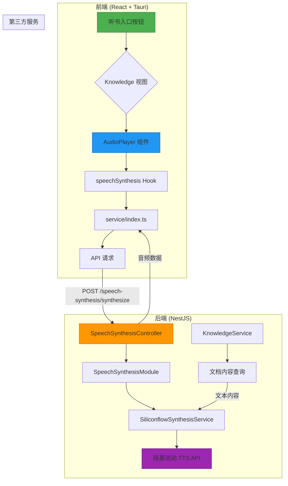
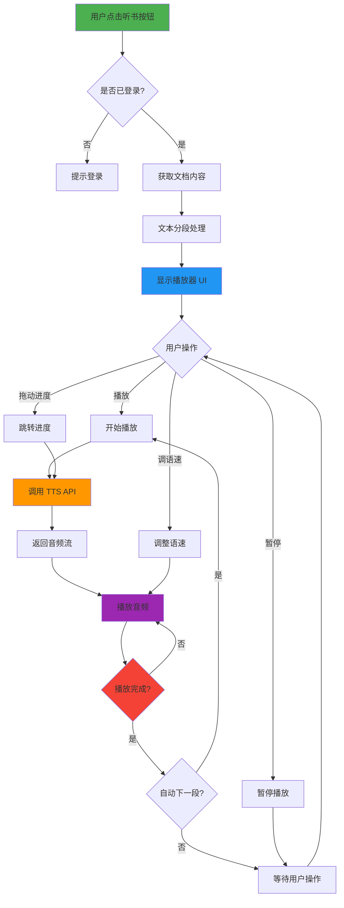
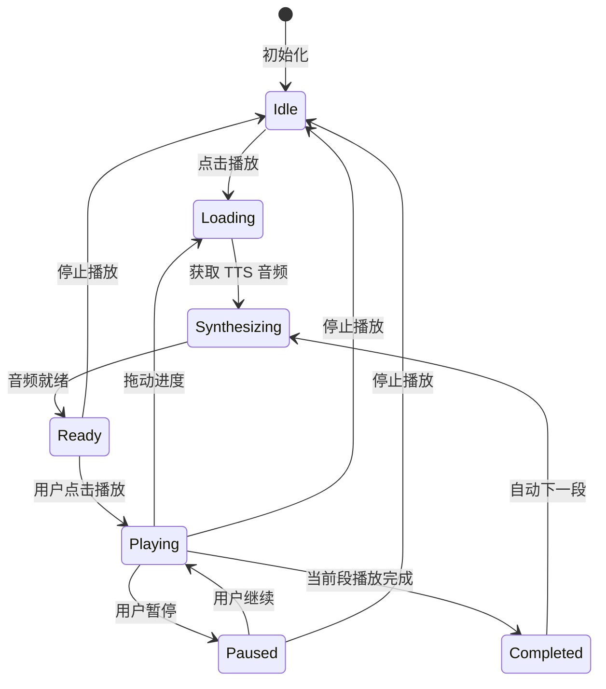
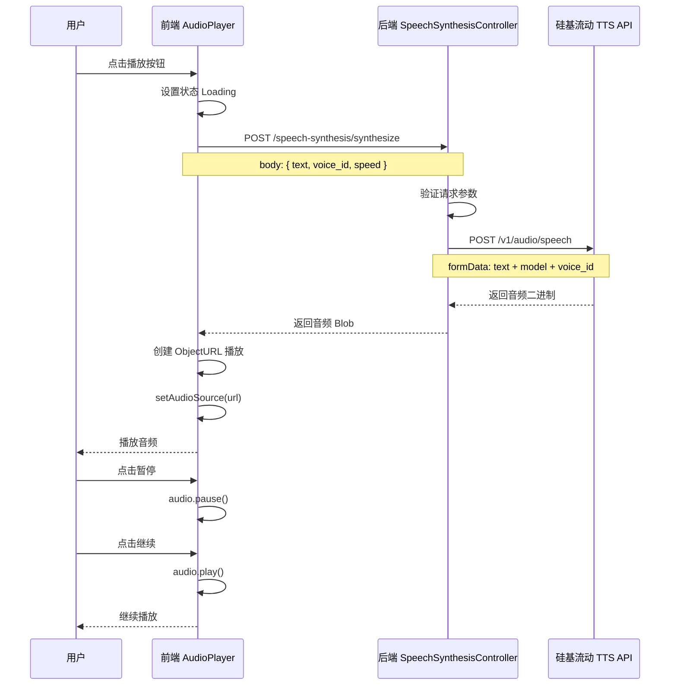
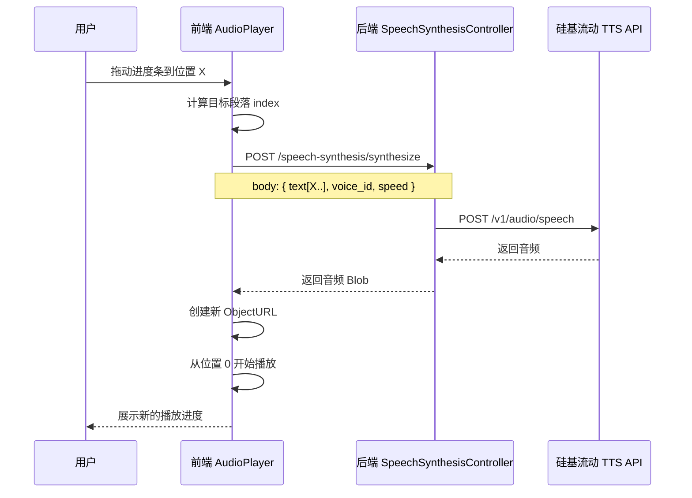
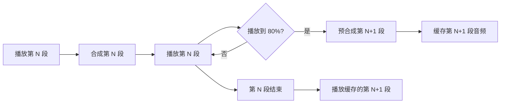
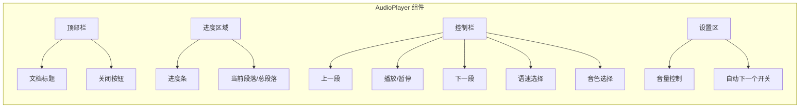

# 听书功能（Text-to-Speech）— 实现思路

> **状态**：规划 | **日期**：2026-08-15 | **需求摘要**：用户可将知识库/文档中的文本内容转换为语音进行朗读播放，支持播放控制、语速调节、进度跳转等功能。

## 0. 读本文你将得到什么

- 听书功能的完整架构设计与模块拆分
- 前后端协同的数据流与核心流程图
- 基于硅基流动 TTS API 的后端实现方案
- 前端播放器 UI 与音频处理方案
- 分阶段落地步骤与验收清单

---

## 1. 功能概述

### 1.1 一句话方案

用户在知识库/文档页面点击「听书」按钮，前端将文档内容分段发送至后端，后端调用硅基流动 TTS 服务将文本转为音频并返回，前端通过 `<audio>` 标签或 Web Audio API 实现流式播放。

### 1.2 核心功能点

| 功能 | 说明 |
|------|------|
| 文本转语音 | 将 Markdown/纯文本内容转换为自然流畅的语音 |
| 播放控制 | 播放/暂停、上一段/下一段、进度拖动 |
| 语速调节 | 0.5x ~ 2.0x 语速控制 |
| 分段朗读 | 按段落/句子分段转换，支持跳段 |
| 进度记忆 | 记录阅读进度，下次可继续收听 |
| 多音色 | 支持多种音色选择（男声/女声/童声） |

### 1.3 非目标（YAGNI）

- 不实现离线 TTS 引擎（依赖云端 API）
- 不实现音频缓存下载（后续迭代）
- 不实现多人同时听书的会话同步
- 不支持 EPUB/PDF 等特殊格式解析（仅支持现有知识库 Markdown）

---

## 2. 现状与复用

### 2.1 可复用模块

| 能力 | 已有位置 | 本需求用法 |
|------|----------|------------|
| 硅基流动 API 调用模式 | `apps/backend/src/services/speech-transcription/siliconflow-transcription.service.ts` | 复用其 API Key/Base URL 配置模式，新增 TTS 端点调用 |
| 文件上传 HTTP 接口模式 | `apps/backend/src/services/speech-transcription/speech-transcription.controller.ts` | 参考其 Controller + Service 分层模式 |
| 前端 HTTP 封装 | `apps/frontend/src/service/index.ts` | 复用 `http` 封装，新增 TTS 相关 API |
| API 路由常量定义 | `apps/frontend/src/service/api.ts` | 新增 TTS 路由常量 |
| 知识库数据模型 | `apps/backend/src/services/knowledge/knowledge.service.ts` | 复用 Knowledge 实体获取文档内容 |
| 前端知识库视图 | `apps/frontend/src/views/knowledge/index.tsx` | 新增听书入口按钮 |
| Tauri 本地存储 | `apps/frontend/src/store/knowledge.ts` | 存储听书进度偏好 |

### 2.2 现有语音转写服务架构参考

现有 `speech-transcription` 模块采用 **Controller → Service → 第三方 API** 的分层架构，TTS 模块将遵循相同模式：

```
SpeechTranscriptionController    →    SpeechSynthesisController
    │                                      │
    ▼                                      ▼
SiliconflowTranscriptionService  →  SiliconflowSynthesisService
    │                                      │
    ▼                                      ▼
硅基流动 /audio/transcriptions   →    硅基流动 /audio/speech
```

---

## 3. 架构设计

### 3.1 整体架构图



### 3.2 图内方法说明

| 节点/方法 | 说明 |
|-----------|------|
| `听书入口按钮` | UI 入口组件，点击触发听书流程 |
| `AudioPlayer 组件` | 音频播放器 UI，含播放控制、进度条、语速调节 |
| `speechSynthesis Hook` | 自定义 Hook，封装 TTS 调用逻辑与状态管理 |
| `service/index.ts` | 前端 API 封装层 |
| `SpeechSynthesisController` | 后端 TTS 控制器，处理 HTTP 请求 |
| `SiliconflowSynthesisService` | 硅基流动 TTS 服务封装 |
| `KnowledgeService` | 获取知识库文档内容 |
| `硅基流动 TTS API` | 第三方文本转语音服务 |

---

## 4. 核心流程

### 4.1 听书主流程图



### 4.2 图内方法说明

| 方法 | 输入 | 输出 | 说明 |
|------|------|------|------|
| `获取文档内容` | knowledgeId | markdown 文本 | 从知识库获取文档正文 |
| `文本分段处理` | 完整文本 | 段落数组 | 按段落/句子分割，每段 ≤ 2000 字符 |
| `调用 TTS API` | 文本段 + 音色 + 语速 | 音频二进制 | 调用后端合成接口 |
| `播放音频` | 音频 URL | - | 通过 `<audio>` 播放 |
| `跳转进度` | 目标位置 | - | 重新调用 TTS 合成目标位置之后的内容 |

### 4.3 听书状态机



### 4.4 时序图：播放一段音频



### 4.5 时序图：跳转进度



---

## 5. 模块设计

### 5.1 后端模块

#### 5.1.1 新增文件

| 文件路径 | 说明 |
|----------|------|
| `apps/backend/src/services/speech-synthesis/speech-synthesis.module.ts` | 模块定义 |
| `apps/backend/src/services/speech-synthesis/speech-synthesis.controller.ts` | HTTP 控制器 |
| `apps/backend/src/services/speech-synthesis/siliconflow-synthesis.service.ts` | 硅基流动 TTS 服务 |
| `apps/backend/src/services/speech-synthesis/dto/synthesize.dto.ts` | 请求 DTO |

#### 5.1.2 依赖注入关系

```
SpeechSynthesisModule
├── SpeechSynthesisController (controllers)
├── SiliconflowSynthesisService (providers)
└── SpeechSynthesisModule (exports)
```

#### 5.1.3 核心接口设计

```typescript
// POST /speech-synthesis/synthesize
interface SynthesizeRequestDto {
  text: string;           // 要合成的文本，最大 2000 字符
  voice_id?: string;      // 音色 ID，默认 "FunAudioLLM/CosyVoice2-0.5B"
  speed?: number;         // 语速，0.5 ~ 2.0，默认 1.0
  response_format?: string; // 音频格式：mp3(默认) / wav / pcm
}

// 响应：直接返回音频流
// Content-Type: audio/mpeg
// Body: 音频二进制数据
```

#### 5.1.4 `SiliconflowSynthesisService` 接口草图

```typescript
@Injectable()
export class SiliconflowSynthesisService {
  // 合成文本为音频
  async synthesize(params: {
    text: string;
    voiceId?: string;
    speed?: number;
    responseFormat?: 'mp3' | 'wav' | 'pcm';
  }): Promise<{ buffer: Buffer; contentType: string }> {
    // 1. 读取 API Key / Base URL 配置
    // 2. 构造 FormData
    //    - text: 文本内容
    //    - model: TTS 模型名称
    //    - voice_id: 音色 ID
    //    - speed: 语速
    //    - response_format: 输出格式
    // 3. fetch POST 到硅基流动 /audio/speech
    // 4. 返回音频 Buffer 和 Content-Type
  }
}
```

#### 5.1.5 音色配置

| 音色 ID | 描述 | 语言 |
|---------|------|------|
| `FunAudioLLM/CosyVoice2-0.5B` | 默认音色 | 中文 |
| `FunAudioLLM/CosyVoice2-0.5B:alice` | 年轻女声 | 中文 |
| `FunAudioLLM/CosyVoice2-0.5B:bob` | 成熟男声 | 中文 |
| `FunAudioLLM/CosyVoice2-0.5B:carol` | 温柔女声 | 中文 |

> 注：具体音色列表以硅基流动官方文档为准，可通过配置文件扩展。

### 5.2 前端模块

#### 5.2.1 新增文件

| 文件路径 | 说明 |
|----------|------|
| `apps/frontend/src/components/design/AudioPlayer/index.tsx` | 音频播放器组件 |
| `apps/frontend/src/hooks/useSpeechSynthesis.ts` | TTS 业务 Hook |
| `apps/frontend/src/store/audioPlayer.ts` | 播放器状态管理 (可选) |

#### 5.2.2 修改文件

| 文件路径 | 修改内容 |
|----------|----------|
| `apps/frontend/src/service/api.ts` | 新增 `SPEECH_SYNTHESIS` 路由常量 |
| `apps/frontend/src/service/index.ts` | 新增 `synthesizeSpeechAudio` API 封装 |
| `apps/frontend/src/views/knowledge/index.tsx` | 新增听书入口按钮 |

#### 5.2.3 `AudioPlayer` 组件设计

**Props 接口**

```typescript
interface AudioPlayerProps {
  /** 文档 ID，用于获取内容与记录进度 */
  documentId: string;
  /** 文档标题 */
  documentTitle: string;
  /** 完整文本内容 */
  content: string;
  /** 初始音色 ID */
  defaultVoiceId?: string;
  /** 初始语速 */
  defaultSpeed?: number;
  /** 关闭回调 */
  onClose?: () => void;
}
```

**状态管理**

```typescript
interface AudioPlayerState {
  isPlaying: boolean;
  isLoading: boolean;
  currentSegmentIndex: number;    // 当前播放段落索引
  totalSegments: number;          // 总段落数
  playbackPosition: number;        // 当前位置（秒）
  duration: number;                // 当前音频时长（秒）
  speed: number;                   // 语速
  voiceId: string;                 // 音色
  volume: number;                 // 音量
  error?: string;                  // 错误信息
}
```

**核心方法**

| 方法 | 说明 |
|------|------|
| `splitContent(text)` | 将文本按段落分割 |
| `synthesizeSegment(index)` | 合成指定段落的音频 |
| `play()` | 开始播放 |
| `pause()` | 暂停播放 |
| `seek(percent)` | 跳转到指定位置 |
| `changeSpeed(speed)` | 调整语速 |
| `changeVoice(voiceId)` | 切换音色 |
| `saveProgress()` | 保存播放进度 |

#### 5.2.4 `useSpeechSynthesis` Hook 草图

```typescript
export function useSpeechSynthesis() {
  const [state, setState] = useState<SpeechSynthesisState>({...});
  
  // 合成单段音频
  const synthesize = useCallback(async (text: string, options?) => {
    setState(s => ({ ...s, isLoading: true }));
    try {
      const blob = await synthesizeSpeechAudio(text, options);
      const url = URL.createObjectURL(blob);
      setState(s => ({ ...s, audioUrl: url, isLoading: false }));
    } catch (err) {
      setState(s => ({ ...s, error: err.message, isLoading: false }));
    }
  }, []);

  return { state, synthesize, ... };
}
```

---

## 6. 关键实现细节

### 6.1 文本分段策略

由于 TTS API 有单次文本长度限制（通常 2000 字符），需要实现智能分段：

```typescript
function splitText(content: string, maxLength = 2000): string[] {
  // 1. 移除 Markdown 格式标记（保留纯文本）
  const plainText = stripMarkdown(content);
  
  // 2. 按段落分割
  const paragraphs = plainText.split(/\n\n+/);
  
  // 3. 对超过 maxLength 的段落进行二次分割（按句子）
  const segments: string[] = [];
  for (const para of paragraphs) {
    if (para.length <= maxLength) {
      segments.push(para);
    } else {
      const sentences = splitBySentence(para);
      let buffer = '';
      for (const sent of sentences) {
        if ((buffer + sent).length > maxLength && buffer) {
          segments.push(buffer);
          buffer = '';
        }
        buffer += sent;
      }
      if (buffer) segments.push(buffer);
    }
  }
  
  return segments.filter(s => s.trim().length > 0);
}
```

### 6.2 流式 vs 分段加载

| 方案 | 优点 | 缺点 |
|------|------|------|
| **分段加载（推荐）** | 实现简单，兼容现有 API | 切换段落有短暂延迟 |
| 流式加载 | 无延迟体验好 | 需额外实现流处理逻辑 |

**推荐方案：分段加载 + 预加载下一段**



### 6.3 播放进度持久化

```typescript
interface ListenProgress {
  documentId: string;
  segmentIndex: number;
  position: number;      // 秒
  speed: number;
  voiceId: string;
  updatedAt: number;
}

// 存储位置：localStorage
// Key: `listen_progress_${documentId}`
```

### 6.4 错误处理

| 错误场景 | 处理方式 |
|----------|----------|
| TTS API 返回 4xx/5xx | Toast 提示「合成失败，请重试」 |
| 网络中断 | 显示离线状态，保留当前进度 |
| 音频解码失败 | 回退到上一段，跳过损坏段 |
| 文本为空 | 禁用播放按钮，提示「无内容可播放」 |

---

## 7. API 设计

### 7.1 后端 API

| 方法 | 路径 | 说明 |
|------|------|------|
| POST | `/speech-synthesis/synthesize` | 文本转语音，返回音频流 |

**请求体**

```json
{
  "text": "要合成的文本内容",
  "voice_id": "FunAudioLLM/CosyVoice2-0.5B",
  "speed": 1.0,
  "response_format": "mp3"
}
```

| 字段 | 类型 | 必填 | 说明 |
|------|------|------|------|
| text | string | 是 | 文本内容，1-2000 字符 |
| voice_id | string | 否 | 音色 ID，默认 CosyVoice |
| speed | number | 否 | 语速 0.5-2.0，默认 1.0 |
| response_format | string | 否 | mp3/wav/pcm，默认 mp3 |

**响应**

```
Content-Type: audio/mpeg
Body: <二进制音频数据>
```

### 7.2 前端 API 封装

```typescript
// service/api.ts
export const SPEECH_SYNTHESIS = '/speech-synthesis/synthesize';

// service/index.ts
export const synthesizeSpeechAudio = async (
  text: string,
  options?: { voiceId?: string; speed?: number }
): Promise<Blob> => {
  return await http.post(
    SPEECH_SYNTHESIS,
    { text, ...options },
    { responseType: 'blob', timeout: 30000 }
  );
};
```

---

## 8. 数据库设计

本功能不新增数据库表。听书进度保存在前端 `localStorage` 中。

若后续需要云端同步进度，可新增：

```sql
CREATE TABLE listen_progress (
  id VARCHAR(36) PRIMARY KEY,
  user_id INT NOT NULL,
  knowledge_id VARCHAR(36) NOT NULL,
  segment_index INT DEFAULT 0,
  position_seconds INT DEFAULT 0,
  speed DECIMAL(3,1) DEFAULT 1.0,
  voice_id VARCHAR(64) DEFAULT 'FunAudioLLM/CosyVoice2-0.5B',
  updated_at TIMESTAMP DEFAULT CURRENT_TIMESTAMP ON UPDATE CURRENT_TIMESTAMP,
  INDEX idx_user_knowledge (user_id, knowledge_id)
);
```

---

## 9. UI 设计

### 9.1 播放器组件结构



### 9.2 界面布局草图

```
┌─────────────────────────────────────────┐
│ 📖 文档标题                    ✕ 关闭   │
├─────────────────────────────────────────┤
│                                         │
│  ━━━━━━━━●━━━━━━━━━━━━━━━━━━━━━━━━  3/10 │
│                                         │
├─────────────────────────────────────────┤
│  ⏮  ▶/⏸  ⏭    1.0x ▼  🎤 音色 ▼       │
│                                         │
├─────────────────────────────────────────┤
│  🔊 音量 ━━━━━●━━━━━━   ☐ 自动下一段     │
└─────────────────────────────────────────┘
```

---

## 10. 分阶段落地

### M1：MVP - 基础听书能力

| 任务 | 说明 | 涉及模块 |
|------|------|----------|
| 后端 TTS 服务 | 实现 `SiliconflowSynthesisService` | `speech-synthesis` 模块 |
| 后端 Controller | 实现 `/speech-synthesis/synthesize` 接口 | `speech-synthesis` 模块 |
| 前端 API 封装 | 新增 `synthesizeSpeechAudio` | `service/` |
| 基础播放器 | 实现 AudioPlayer 组件（播放/暂停/进度） | `components/design/AudioPlayer/` |
| 知识库入口 | 在知识库页面添加听书按钮 | `views/knowledge/` |
| 文本分段 | 实现 Markdown 文本解析与分段 | `hooks/useSpeechSynthesis.ts` |

**验收标准**
- [ ] 用户可在知识库文档页点击听书按钮
- [ ] 文档内容可转换为音频并播放
- [ ] 支持播放/暂停控制
- [ ] 支持基础进度显示

### M2：体验优化

| 任务 | 说明 |
|------|------|
| 语速调节 | 支持 0.5x ~ 2.0x |
| 音色切换 | 支持 3-4 种音色 |
| 进度跳转 | 拖动进度条跳转 |
| 段落跳转 | 上一段/下一段按钮 |
| 预加载 | 播放当前段时预合成下一段 |
| 错误重试 | 合成失败自动重试一次 |

### M3：增强功能

| 任务 | 说明 |
|------|------|
| 进度持久化 | localStorage 保存进度 |
| 多文档历史 | 最近听书文档列表 |
| 定时关闭 | 睡眠模式定时停止 |
| 快捷键 | 全局播放/暂停快捷键 |
| 后台播放 | 最小化后继续播放（Tauri） |

---

## 11. 配置项

### 11.1 环境变量

| 变量名 | 说明 | 默认值 |
|--------|------|--------|
| `SILICONFLOW_TTS_MODEL` | TTS 模型名称 | `FunAudioLLM/CosyVoice2-0.5B` |
| `SILICONFLOW_TTS_DEFAULT_VOICE` | 默认音色 | `FunAudioLLM/CosyVoice2-0.5B` |
| `SILICONFLOW_TTS_MAX_TEXT_LENGTH` | 单段最大字符数 | `2000` |

### 11.2 复用现有配置

以下配置复用 `speech-transcription` 模块已有配置：

- `SILICONFLOW_API_KEY`
- `SILICONFLOW_BASE_URL`

---

## 12. 风险与应对

| 风险 | 影响 | 应对策略 |
|------|------|----------|
| TTS API 延迟高 | 首字响应慢 | 采用分段+预加载策略，无感切换 |
| API 调用成本 | 长文档费用高 | 限制单次最大文本长度，提供离线模式选项 |
| 音频文件大 | 网络传输慢 | 使用 mp3 格式，考虑服务端压缩 |
| 音色限制 | 语音多样性不足 | 预留音色扩展接口，支持后续新增 |
| 浏览器兼容 | Safari 音频播放问题 | 测试主流浏览器，提供降级方案 |

---

## 13. 参考文档

| 文档 | 说明 |
|------|------|
| [硅基流动 TTS 文档](https://docs.siliconflow.cn/) | 上游 API 参考 |
| [语音输入实现文档](./frontend/voice-input-implementation.md) | 现有语音模块架构参考 |
| [Web Audio API](https://developer.mozilla.org/zh-CN/docs/Web/API/Web_Audio_API) | 前端音频处理参考 |
