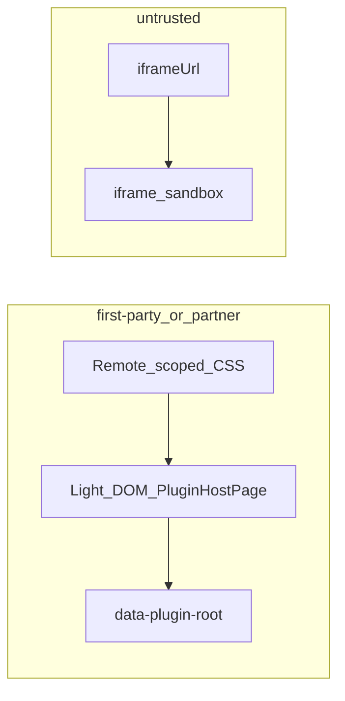

# MF 主/子样式互不影响

> **状态**：已落地（第一方 scoped CSS + untrusted iframe）  
> **日期**：2026-07-20  
> **关联**：[`mf-plugin-host.md`](../app/mf-plugin-host.md)、[`third-party-mf-plugin-onboarding.md`](./third-party-mf-plugin-onboarding.md)、[`apps/remote-plugins/README.md`](../../apps/remote-plugins/README.md)

---

## 1. 问题

Host 与 Remote 同页共享全局 CSS。Remote 若注入 Tailwind Preflight / 无作用域 utilities，会污染主站（字体、标签两端对齐等）；Host 若用「半套 Shadow + 劫持 head」又会让子应用 Button 吃不到 CSS，退回浏览器默认皮。

目标：**主→子、子→主互不破坏，且子应用组件（如 Button）保持自带样式。**

---

## 2. 市面成熟方案（摘要）

| 方案 | 代表 | 结论 |
|------|------|------|
| 构建期选择器作用域 | qiankun `experimentalStyleIsolation`、`postcss-prefixwrap` | **第一方/合作方主路径** |
| Shadow + **Remote 自己把 CSS insert 进 shadow** | MF `css-isolation` 示例、`css-boundary`、无界 | 正确 Shadow；Host 只搬 head 是错误半套 |
| iframe | wujie / 不可信脚本 | **`trust: untrusted` 强制** |
| CSS Modules / CSS-in-JS | MF 官方文档 | 与本仓 Tailwind utility 冲突大，不采用 |
| Host 运行时劫持 head → Shadow | 自研半套 | **否决**（子应用无样式） |

[Module Federation 官方](https://module-federation.io/guide/basic/css-isolate)：**不在 Runtime 做 CSS 沙箱**；在生产者处理，或 Remote 导出已包 Shadow 且 style-loader 注入 shadow。

---

## 3. 本仓选定模型

### 3.1 `first-party` / `partner`（MF 嵌入）

- Light DOM 挂载（[`PluginHostPage`](../../apps/frontend/src/plugins/host/PluginHostPage.tsx)），包装 `data-mf-plugin={id}`。
- Remote：
  - **禁止** `@import "tailwindcss"`（含 Preflight）。
  - utilities：`[data-plugin-root] { @tailwind utilities }`。
  - expose 根节点：`data-plugin-root`。
- 参考实现：[`apps/remote-plugins/src/styles.css`](../../apps/remote-plugins/src/styles.css)。

### 3.2 `untrusted`

- registry 必填 `iframeUrl`（生产 https）：须指向 Remote 的 **embed 落地页**（无独立预览壳），例如 `http://127.0.0.1:9008/embed/ebook/plugins/ideas-list`，不要用带导航的 `/ebook/plugins/ideas-list`。
- Host **不** `loadRemote`；[`PluginHostPage`](../../apps/frontend/src/plugins/host/PluginHostPage.tsx) 用 iframe + [`attachIframeBridge`](../../apps/frontend/src/plugins/core/attachIframeBridge.ts) 经 postMessage 转发 `http` / `ui` / `modules.ebook`。
- 不共享 React / 主文档 CSS。

---

## 4. 验收清单

1. 英语学习 → 学习笔记：「添加笔记」为主题 Button（非 UA 灰钮）。
2. 打开笔记后再进设置 → Edge 语音「语速」等标签与手札体正常。
3. 新 Remote：按 README 契约可 `partner` 上架；带 Preflight 的只能 `untrusted` + `iframeUrl`。

---

## 5. 明确不做

- 不恢复 Host `styleCapture` / 半套 Shadow。
- 不把全体第一方插件改成 iframe。
- 不把全仓 Tailwind 换成 CSS Modules。
