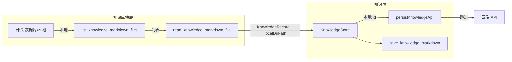

# 知识库：本地文件夹列表与 Monaco 清空同步 — 实现说明

本文整理**本次相关改动**的完整实现思路，并对**核心逻辑代码**按行说明含义（摘录自当前仓库，行号随文件演进可能略有偏移，以路径为准）。

---

## 1. 总览

### 1.1 目标

1. **知识库抽屉**：用开关在「云端数据库列表」与「本地指定文件夹内递归 `.md` 列表」之间切换；桌面端可选目录、读文件、删文件；打开条目后编辑器可保存到对应目录。
2. **Monaco 编辑器**：点击「清空」或从外部把正文设为空时，即使焦点仍在编辑器内，也能把视图与父组件 `value` 对齐（修复不同步问题）。

### 1.2 涉及文件

| 路径 | 作用 |
|------|------|
| `apps/frontend/src-tauri/src/command/knowledge.rs` | 列出目录下 `.md`、读取单文件 |
| `apps/frontend/src-tauri/src/lib.rs` | 注册 Tauri `invoke` 命令 |
| `apps/frontend/src/utils/knowledge-save.ts` | 前端封装 `invoke` |
| `apps/frontend/src/types/index.ts` | `KnowledgeRecord` / `KnowledgeListItem` 扩展字段 |
| `apps/frontend/src/views/knowledge/constants.ts` | 本地条目 id 前缀与判定函数 |
| `apps/frontend/src/store/knowledge.ts` | 列表分页 + 编辑器草稿（含 `knowledgeLocalDirPath`、清空草稿） |
| `apps/frontend/src/views/knowledge/index.tsx` | 保存走云端或仅磁盘、回填 `localDirPath` |
| `apps/frontend/src/views/knowledge/KnowledgeList.tsx` | 开关、选文件夹、本地列表与删除分支 |
| `apps/frontend/src/components/design/Monaco/index.tsx` | 外部 `value` 与编辑器同步策略 |

---

## 2. 实现思路（架构）

### 2.1 本地条目与云端 UUID 区分

- 云端条目使用后端返回的 **UUID** 作为 `id`。
- 本地文件夹列表中的每一项没有数据库 id，使用**合成 id**：`__local_md__:` + `encodeURIComponent(绝对路径)`，避免与 UUID 冲突，且便于删除后回调比对。
- 判定函数 `isKnowledgeLocalMarkdownId(id)`：凡 `id` 以前缀开头，则视为「仅本地、不写库」的编辑会话。

### 2.2 保存策略

- **`persistKnowledgeApi`**：若当前 `knowledgeEditingKnowledgeId` 为本地合成 id，**直接 return**，不调用 `update` / `save` 接口。
- **Tauri 写盘**：`filePath` 传入的「目录」在本地条目下取 **`knowledgeStore.knowledgeLocalDirPath`**（打开文件时设为**该 `.md` 所在目录**），否则沿用 `TAURI_KNOWLEDGE_DIR`。与既有 `previousTitle` 逻辑配合，支持改标题时的本地重命名。

### 2.3 Rust 侧能力

- **`list_knowledge_markdown_files`**：`dirPath` 可选；空则 `resolve_knowledge_dir`；递归收集 `.md`（跳过以 `.` 开头的目录名）；按修改时间降序。
- **`read_knowledge_markdown_file`**：校验路径为存在的 `.md` 文件后 `read_to_string`（UTF-8）。

### 2.4 抽屉 UI 行为

- **数据库模式**：打开抽屉时 `knowledgeStore.refreshList()`；列表滚动继续触发分页。
- **本地模式**：仅 Tauri 可用；`select_directory` 更新 `localFolderPath`；`invokeListKnowledgeMarkdownFiles` 填充 `localList`；点击行 `invokeReadKnowledgeMarkdownFile` 后组装 `KnowledgeRecord`（含 `localDirPath`）再 `onPick`。
- **删除**：若列表项带 `localAbsolutePath`，只删磁盘文件并刷新本地列表，不调 `deleteKnowledge`。

### 2.5 Monaco 清空不同步的根因与修复

**根因简述：**

1. 原逻辑在 `ed.hasTextFocus()` 时**不** `setValue`，工具栏「清空」后焦点常仍在编辑器 → 正文不清。
2. 原逻辑用 `next === lastEmittedRef.current` 提前返回；换篇或清空时另一个 effect 可能已把 `lastEmittedRef` 设成 `''`，与 props 一致，但**编辑器模型仍是旧内容** → 仍不清。

**修复策略：**

- 以 **`ed.getValue()` 与 props `value` 规范化后是否一致** 为是否需同步的首要条件。
- **有焦点时**：若既非「清空」（`next === ''`），也非「换篇」（`documentIdentity` 相对上次同步引用发生变化），则**不**覆盖，避免 `onDidChangeModelContent` 里 RAF 合并导致父组件 `value` 暂时落后时误删正在输入的字符。
- **清空**或**换篇**：允许在焦点仍在编辑器时执行 `setValue`。

---

## 3. 核心代码与逐行注释

以下「逐行」指摘录块内**每一行源码**均配有说明；超长 UI 结构仅保留与行为相关的属性行注释。

### 3.1 `constants.ts` — 前缀与判定

```ts
/** Tauri 下默认知识库目录（与保存/删除 invoke 使用的目录约定一致） */
export const TAURI_KNOWLEDGE_DIR =
	'/Users/dnhyxc/Documents/code/dnhyxc-ai/knowledge';

/** 本地 .md 列表项的合成 id 前缀，避免与云端 UUID 混淆 */
export const KNOWLEDGE_LOCAL_MD_ID_PREFIX = '__local_md__:';

/** 根据 id 判断是否当前处于「仅写本地、不调云端 CRUD」的编辑会话 */
export function isKnowledgeLocalMarkdownId(id: string | null | undefined): boolean {
	return (
		id != null && // null / undefined 视为云端或新草稿
		id !== '' && // 空字符串不当作本地前缀 id
		id.startsWith(KNOWLEDGE_LOCAL_MD_ID_PREFIX) // 以前缀匹配为准
	);
}

/** 编辑器区域高度 CSS */
export const EDITOR_HEIGHT = 'calc(100vh - 172px)';
```

### 3.2 `types/index.ts` — 类型扩展

```ts
export type KnowledgeRecord = {
	id: string;
	title: string | null;
	content: string;
	author: string | null;
	authorId: number | null;
	createdAt?: string;
	updatedAt?: string;
	/**
	 * 从本地文件夹打开时：Tauri 保存应使用的目录（一般为该文件父目录），
	 * 与仅用 TAURI_KNOWLEDGE_DIR 的云端条目区分
	 */
	localDirPath?: string;
};

/** 列表展示用：无 content；可附带本地绝对路径供读/删 */
export type KnowledgeListItem = Omit<KnowledgeRecord, 'content'> & {
	localAbsolutePath?: string; // 有值表示该行来自本地扫描，而非接口列表
};
```

### 3.3 `knowledge.ts`（编辑器草稿段）— 目录状态与清空

```ts
	/**
	 * 从本地文件夹列表打开时：保存/覆盖解析使用的目录（该文件所在目录）；
	 * 云端条目保持 null，保存时用 TAURI_KNOWLEDGE_DIR
	 */
	knowledgeLocalDirPath: string | null = null;

	setKnowledgeLocalDirPath(value: string | null) {
		this.knowledgeLocalDirPath = value; // 打开本地文件时写入父目录；云端打开时置 null
	}

	clearKnowledgeDraft() {
		this.knowledgeTitle = '';
		this.knowledgeEditingKnowledgeId = null;
		this.knowledgeLocalDiskTitle = null;
		this.knowledgeLocalDirPath = null; // 清空本地目录上下文，避免沿用上一文件的保存目录
		this.knowledgePersistedSnapshot = { title: '', content: '' };
		this.markdown = '';
		// ... 覆盖弹窗等一并重置
	}

	applyKnowledgeDraftFromChatReply(markdown: string) {
		// ...
		this.knowledgeLocalDirPath = null; // 从聊天注入草稿时按默认目录保存，不设本地扫描目录
	}
```

### 3.4 `knowledge-save.ts` — invoke 封装

```ts
/** 列出目录下 .md 的入参：dirPath 缺省则由 Rust 使用默认知识库目录 */
export type ListKnowledgeMarkdownInput = {
	dirPath?: string;
};

/** Rust 序列化 camelCase：updatedAtMs 对应 updated_at_ms */
export type KnowledgeMarkdownFileEntry = {
	path: string;      // 绝对路径
	title: string;     // 文件名去扩展名
	updatedAtMs: number; // 修改时间毫秒，前端转 ISO 展示
};

export async function invokeListKnowledgeMarkdownFiles(
	input: ListKnowledgeMarkdownInput,
): Promise<KnowledgeMarkdownFileEntry[]> {
	const { invoke } = await import('@tauri-apps/api/core');
	return invoke<KnowledgeMarkdownFileEntry[]>('list_knowledge_markdown_files', {
		input: {
			// 仅非空时传 dirPath，否则 Rust 收到「未传」用默认目录
			...(input.dirPath != null && input.dirPath !== ''
				? { dirPath: input.dirPath }
				: {}),
		},
	});
}

export async function invokeReadKnowledgeMarkdownFile(
	filePath: string,
): Promise<string> {
	const { invoke } = await import('@tauri-apps/api/core');
	const res = await invoke<{ content: string }>('read_knowledge_markdown_file', {
		input: { filePath }, // 与 Rust ReadKnowledgeMarkdownFileInput 对齐
	});
	return res.content; // 只把正文交给调用方
}
```

### 3.5 `views/knowledge/index.tsx` — 云端跳过与保存目录

```ts
	const persistKnowledgeApi = useCallback(async () => {
		const markdown = knowledgeStore.markdown ?? '';
		const trimmedTitle = knowledgeStore.knowledgeTitle.trim();
		const base = { title: trimmedTitle, content: markdown };
		const meta = buildAuthorMeta(getUserInfo);
		const editingId = knowledgeStore.knowledgeEditingKnowledgeId;
		/** 本地合成 id：不写后端，仅后续 Tauri 落盘 */
		if (isKnowledgeLocalMarkdownId(editingId)) {
			return; // 既不 update 也不 saveKnowledge
		}
		if (editingId) {
			// 云端更新...
		} else {
			// 云端新建...
		}
	}, [knowledgeStore, getUserInfo]);
```

```ts
			if (isTauriRuntime()) {
				const diskTitle = knowledgeStore.knowledgeLocalDiskTitle;
				const previousTitle =
					knowledgeStore.knowledgeEditingKnowledgeId &&
					diskTitle &&
					diskTitle !== trimmedTitle
						? diskTitle
						: undefined; // 标题变更时传给 Rust 做本地文件重命名
				const tauriBaseDir = isKnowledgeLocalMarkdownId(
					knowledgeStore.knowledgeEditingKnowledgeId,
				)
					? (knowledgeStore.knowledgeLocalDirPath?.trim() ||
							TAURI_KNOWLEDGE_DIR) // 本地条目优先用打开文件所在目录
					: TAURI_KNOWLEDGE_DIR; // 云端条目固定默认目录
				const payload: SaveKnowledgeMarkdownPayload = {
					title: trimmedTitle,
					content: markdown,
					filePath: tauriBaseDir, // 与既有 resolve/save 语义一致：目录 + 标题 → 路径
					...(previousTitle ? { previousTitle } : {}),
				};
				// invokeResolveKnowledgeMarkdownTarget → 存在则弹覆盖确认
			}
```

```ts
	const handlePickRecord = useCallback(
		(record: KnowledgeRecord) => {
			knowledgeStore.setKnowledgeOverwriteOpen(false);
			knowledgeStore.setKnowledgeEditingKnowledgeId(record.id);
			knowledgeStore.setKnowledgeLocalDirPath(record.localDirPath ?? null); // 本地打开带目录；云端为 null
			const t = (record.title ?? '').trim();
			knowledgeStore.setKnowledgeLocalDiskTitle(t || null);
			const content = record.content ?? '';
			knowledgeStore.setKnowledgePersistedSnapshot({ title: t, content });
			knowledgeStore.setKnowledgeTitle(record.title ?? '');
			knowledgeStore.setMarkdown(content);
		},
		[knowledgeStore],
	);
```

### 3.6 `KnowledgeList.tsx` — 路径工具与列表映射

```ts
/** 从绝对路径取父目录，兼容正斜杠与反斜杠 */
function dirnameFs(filePath: string): string {
	const n = filePath.replace(/[/\\]+$/, ''); // 去掉末尾多余分隔符
	const i = Math.max(n.lastIndexOf('/'), n.lastIndexOf('\\')); // 取最后一段分隔符
	if (i <= 0) return n; // 无分隔符则整体当作目录名退化处理
	return n.slice(0, i); // 父目录
}
```

```ts
		const loadLocalMarkdownList = useCallback(async () => {
			if (!isTauriRuntime()) return; // 浏览器不调 Rust
			setLocalLoading(true);
			try {
				const entries = await invokeListKnowledgeMarkdownFiles({
					dirPath: localFolderPath.trim() || undefined, // 空串则走默认目录
				});
				setLocalList(
					entries.map((e) => ({
						id: `${KNOWLEDGE_LOCAL_MD_ID_PREFIX}${encodeURIComponent(e.path)}`, // 合成唯一 id
						title: e.title,
						author: null,
						authorId: null,
						updatedAt: new Date(e.updatedAtMs).toISOString(), // 与 formatDate 一致
						localAbsolutePath: e.path, // 后续读文件、删文件、展示路径
					})),
				);
			} catch (e) {
				Toast({ /* ... */ });
				setLocalList([]); // 失败时清空列表避免展示脏数据
			} finally {
				setLocalLoading(false);
			}
		}, [localFolderPath]);
```

```ts
		const handleRowClick = useCallback(
			async (item: KnowledgeListItem) => {
				if (item.localAbsolutePath) {
					try {
						const content = await invokeReadKnowledgeMarkdownFile(
							item.localAbsolutePath,
						);
						const dir = dirnameFs(item.localAbsolutePath);
						const record: KnowledgeRecord = {
							id: item.id,
							title: item.title,
							content,
							author: null,
							authorId: null,
							updatedAt: item.updatedAt,
							localDirPath: dir, // 保存时 filePath 用此目录
						};
						await onPick?.(record);
						onOpenChange(false);
					} catch (e) {
						Toast({ /* ... */ });
					}
					return; // 不再走 fetchDetail
				}
				const detail = await knowledgeStore.fetchDetail(item.id); // 云端条目
				// ...
			},
			[knowledgeStore, onPick, onOpenChange],
		);
```

```ts
		const openDeleteFlow = useCallback(async (knowledge: KnowledgeListItem) => {
			setLocalFileDeleteOnly(false); // 默认走「库+本地」或「仅库」流程
			if (knowledge.localAbsolutePath && isTauriRuntime()) {
				setSelectKnowledge(knowledge);
				setDeleteLocalPath(knowledge.localAbsolutePath);
				setLocalFileDeleteOnly(true); // 标记：确认时只删文件、不调 deleteKnowledge
				setDeleteLocalOpen(true);
				return;
			}
			// ... 原有云端条目删除分支
		}, []);
```

```ts
				if (localFileDeleteOnly && selectKnowledge?.localAbsolutePath) {
					const result = await invokeDeleteKnowledgeMarkdown({
						title: selectKnowledge.title ?? '',
						filePath: deleteLocalPath, // 传完整 .md 路径，Rust 解析为单文件删除
					});
					// ...
					await loadLocalMarkdownList(); // 删后刷新本地列表
					return;
				}
```

### 3.7 `knowledge.rs` — 列出与读取（Rust）

```rust
/// 递归收集目录下（含子目录）的 `.md` 文件路径
fn collect_md_files(dir: &Path, out: &mut Vec<PathBuf>) -> Result<(), String> {
	let rd = fs::read_dir(dir).map_err(|e| e.to_string())?; // 打开目录
	for ent in rd {
		let ent = ent.map_err(|e| e.to_string())?;
		let name = ent.file_name();
		if name.to_string_lossy().starts_with('.') {
			continue; // 跳过 .git、.DS_Store 等隐藏目录
		}
		let p = ent.path();
		let meta = ent.metadata().map_err(|e| e.to_string())?;
		if meta.is_dir() {
			collect_md_files(&p, out)?; // 深度优先递归
		} else if meta.is_file() && is_md_file_path(&p) {
			out.push(p); // 仅收集 md
		}
	}
	Ok(())
}
```

```rust
#[tauri::command]
pub async fn list_knowledge_markdown_files(
	app: AppHandle,
	input: ListKnowledgeMarkdownInput,
) -> Result<Vec<KnowledgeMarkdownFileEntry>, String> {
	let dir = match input.dir_path.as_ref().map(|s| s.trim()).filter(|s| !s.is_empty()) {
		Some(d) => PathBuf::from(d),           // 用户指定目录
		None => resolve_knowledge_dir(&app).await?, // 与保存默认目录一致
	};
	// ... 校验存在且为目录
	let mut paths: Vec<PathBuf> = Vec::new();
	collect_md_files(&dir, &mut paths)?;
	paths.sort_by(|a, b| {
		let ta = fs::metadata(a).and_then(|m| m.modified()).ok();
		let tb = fs::metadata(b).and_then(|m| m.modified()).ok();
		tb.cmp(&ta) // 修改时间新的排前
	});
	// ... 填充 path / title / updated_at_ms
	Ok(out)
}
```

```rust
#[tauri::command]
pub fn read_knowledge_markdown_file(
	input: ReadKnowledgeMarkdownFileInput,
) -> Result<ReadKnowledgeMarkdownFileResult, String> {
	let trimmed = input.file_path.trim();
	if trimmed.is_empty() {
		return Err("filePath 不能为空".to_string());
	}
	let p = PathBuf::from(trimmed);
	if !p.exists() || !p.is_file() {
		return Err("文件不存在或不是普通文件".to_string());
	}
	if !is_md_file_path(&p) {
		return Err("仅允许读取 .md 文件".to_string());
	}
	let content = fs::read_to_string(&p).map_err(|e| e.to_string())?;
	Ok(ReadKnowledgeMarkdownFileResult { content })
}
```

### 3.8 `lib.rs` — 命令注册（节选）

```rust
use command::knowledge::{
    delete_knowledge_markdown, list_knowledge_markdown_files, read_knowledge_markdown_file,
    resolve_knowledge_markdown_target, save_knowledge_markdown,
};
// ...
        .invoke_handler(tauri::generate_handler![
            // ...
            list_knowledge_markdown_files, // 前端：invokeListKnowledgeMarkdownFiles
            read_knowledge_markdown_file,  // 前端：invokeReadKnowledgeMarkdownFile
        ])
```

### 3.9 `Monaco/index.tsx` — 外部 `value` 同步（逐行）

```ts
	/** 记录上一次完成同步时的 documentIdentity，用于判断是否「换篇」 */
	const prevIdentityForValueSyncRef = useRef(documentIdentity);
```

```ts
	/**
	 * 不向 Editor 传受控 value；外部正文与模型不一致时 setValue。
	 * 有焦点时若父组件 value 因 RAF 合并略滞后于编辑器，不可覆盖正在输入的内容；
	 * 但「清空」或「换篇」（documentIdentity 变化）必须写入。
	 */
	useEffect(() => {
		const ed = editorRef.current;
		if (!ed || imeComposingRef.current || ed.inComposition) return; // IME 中间态不写
		const next = normalizeMonacoEol(value ?? ''); // 父组件目标正文
		const cur = normalizeMonacoEol(ed.getValue()); // 编辑器当前正文
		const identityChanged =
			prevIdentityForValueSyncRef.current !== documentIdentity; // 是否换了一篇文档
		if (cur === next) {
			lastEmittedRef.current = next; // 已与 props 对齐
			prevIdentityForValueSyncRef.current = documentIdentity; // 同步 identity 记忆
			return; // 无需 setValue
		}
		const clearing = next === ''; // 外部要求清空
		if (ed.hasTextFocus() && !clearing && !identityChanged) return; // 焦点内且非清空、非换篇：防 RAF 滞后误覆盖
		prevIdentityForValueSyncRef.current = documentIdentity; // 即将写入，更新记忆
		lastEmittedRef.current = next;
		ed.setValue(next); // 强制与 props 一致
		ed.updateOptions({ placeholder: next.trim() ? '' : placeholder }); // 占位符与正文联动
	}, [value, placeholder, documentIdentity]); // identity 参与：换篇必同步
```

---

## 4. 数据流简图



---

## 5. 维护注意

- `TAURI_KNOWLEDGE_DIR` 当前为**写死的绝对路径**；多环境部署时可改为与 Rust `resolve_knowledge_dir` 对齐或由配置注入。
- 本地合成 id 依赖 `encodeURIComponent(path)`；若未来 id 长度或字符集成为问题，可改为哈希缩短，但需同步调整删除回调比对逻辑。

---

*文档版本：与仓库实现同步整理；若代码重构请对照 Git 历史更新本节行号与摘录。*
