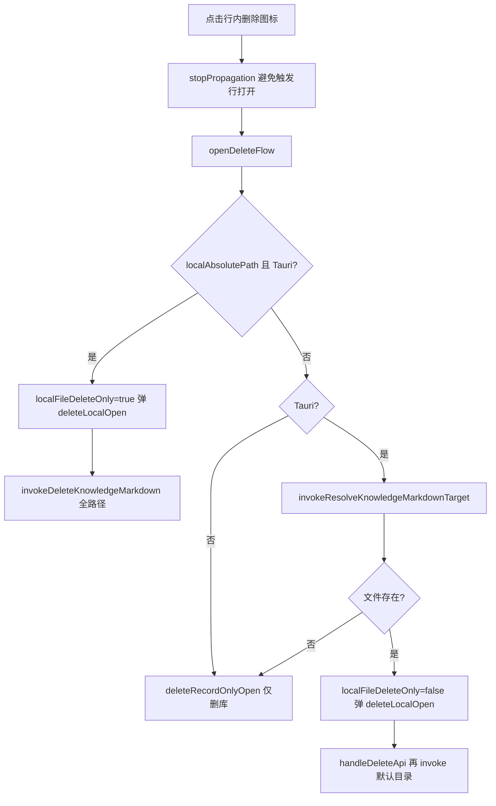
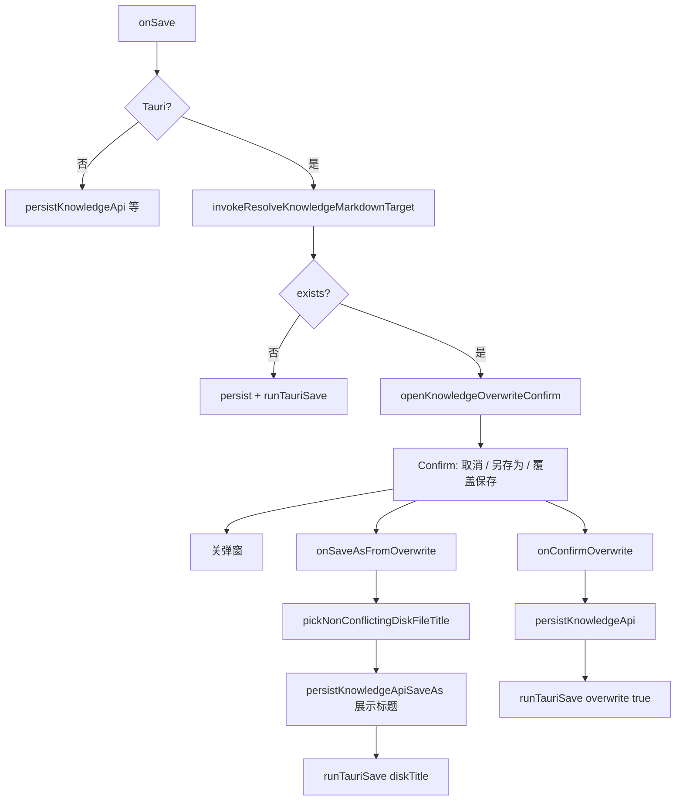
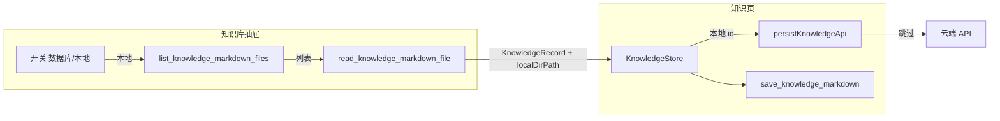

# 知识库：本地文件夹列表与 Monaco 清空同步 — 实现说明

本文整理**本次相关改动**的完整实现思路，并对**核心逻辑代码**按行说明含义（摘录自当前仓库，行号随文件演进可能略有偏移，以路径为准）。

---

## 1. 总览

### 1.1 目标

1. **知识库抽屉**：用开关在「云端数据库列表」与「本地指定文件夹内递归 `.md` 列表」之间切换；桌面端可选目录、读文件、删文件；打开条目后编辑器可保存到对应目录。
2. **Monaco 编辑器**：点击「清空」或从外部把正文设为空时，即使焦点仍在编辑器内，也能把视图与父组件 `value` 对齐（修复不同步问题）。

### 1.2 涉及文件

| 路径                                                    | 作用                                                                            |
| ------------------------------------------------------- | ------------------------------------------------------------------------------- |
| `apps/frontend/src-tauri/src/command/knowledge.rs`      | 列出目录下 `.md`、读取单文件                                                    |
| `apps/frontend/src-tauri/src/lib.rs`                    | 注册 Tauri `invoke` 命令                                                        |
| `apps/frontend/src/utils/knowledge-save.ts`             | 前端封装 `invoke`                                                               |
| `apps/frontend/src/types/index.ts`                      | `KnowledgeRecord` / `KnowledgeListItem` 扩展字段                                |
| `apps/frontend/src/views/knowledge/constants.ts`        | 本地条目 id 前缀与判定函数                                                      |
| `apps/frontend/src/store/knowledge.ts`                  | 列表分页 + 编辑器草稿（含 `knowledgeLocalDirPath`、清空草稿）                   |
| `apps/frontend/src/views/knowledge/index.tsx`           | 保存走云端或仅磁盘、回填 `localDirPath`；覆盖/另存为冲突流程                    |
| `apps/frontend/src/views/knowledge/KnowledgeList.tsx`   | 开关、选文件夹、本地列表与删除分支                                              |
| `apps/frontend/src/components/design/Confirm/index.tsx` | 通用确认框；支持第三钮「另存为」（`secondaryActionText` / `onSecondaryAction`） |
| `apps/frontend/src/components/design/Monaco/index.tsx`  | 外部 `value` 与编辑器同步策略                                                   |

---

## 2. 实现思路（架构）

### 2.1 本地条目与云端 UUID 区分

- 云端条目使用后端返回的 **UUID** 作为 `id`。
- 本地文件夹列表中的每一项没有数据库 id，使用**合成 id**：`__local_md__:` + `encodeURIComponent(绝对路径)`，避免与 UUID 冲突，且便于删除后回调比对。
- 判定函数 `isKnowledgeLocalMarkdownId(id)`：凡 `id` 以前缀开头，则视为「仅本地、不写库」的编辑会话。

### 2.2 保存策略

- **`persistKnowledgeApi`**：若当前 `knowledgeEditingKnowledgeId` 为本地合成 id，**直接 return**，不调用 `update` / `save` 接口。
- **Tauri 写盘**：`filePath` 传入的「目录」在本地条目下取 **`knowledgeStore.knowledgeLocalDirPath`**（打开文件时设为**该 `.md` 所在目录**），否则沿用 `TAURI_KNOWLEDGE_DIR`。与既有 `previousTitle` 逻辑配合，支持改标题时的本地重命名。

### 2.3 Rust 侧能力

- **`list_knowledge_markdown_files`**：`dirPath` 可选；空则 `resolve_knowledge_dir`；递归收集 `.md`（跳过以 `.` 开头的目录名）；按修改时间降序。
- **`read_knowledge_markdown_file`**：校验路径为存在的 `.md` 文件后 `read_to_string`（UTF-8）。

### 2.4 抽屉 UI 行为

- **数据库模式**：打开抽屉时 `knowledgeStore.refreshList()`；列表滚动继续触发分页。
- **本地模式**：仅 Tauri 可用；`select_directory` 更新 `localFolderPath`；`invokeListKnowledgeMarkdownFiles` 填充 `localList`；点击行 `invokeReadKnowledgeMarkdownFile` 后组装 `KnowledgeRecord`（含 `localDirPath`）再 `onPick`。
- **删除**：流程与 UI 约定见 **§2.6**。

### 2.5 Monaco 清空不同步的根因与修复

**根因简述：**

1. 原逻辑在 `ed.hasTextFocus()` 时**不** `setValue`，工具栏「清空」后焦点常仍在编辑器 → 正文不清。
2. 原逻辑用 `next === lastEmittedRef.current` 提前返回；换篇或清空时另一个 effect 可能已把 `lastEmittedRef` 设成 `''`，与 props 一致，但**编辑器模型仍是旧内容** → 仍不清。

**修复策略：**

- 以 **`ed.getValue()` 与 props `value` 规范化后是否一致** 为是否需同步的首要条件。
- **有焦点时**：若既非「清空」（`next === ''`），也非「换篇」（`documentIdentity` 相对上次同步引用发生变化），则**不**覆盖，避免 `onDidChangeModelContent` 里 RAF 合并导致父组件 `value` 暂时落后时误删正在输入的字符。
- **清空**或**换篇**：允许在焦点仍在编辑器时执行 `setValue`。

### 2.6 列表删除操作（实现思路）

**统一删除图标 UI（本地列表 = 数据库列表）**

- 数据库行与本地扫描行共用组件 `KnowledgeListRow`，同一颗 `Trash2`（`size={16}`）与同一套按钮样式（`p-1 rounded-md`、`hover:text-destructive`、`hover:bg-destructive/10`）。
- 默认 `opacity-0 pointer-events-none`，通过行容器 `className` 中的 **`group`**，配合 **`group-hover:opacity-100 group-hover:pointer-events-auto`**，仅在**鼠标悬停整行**时显示删除钮。
- **刻意不用 `focus-within`**：否则抽屉打开后焦点若落在第一行，第一个删除钮会长期可见，与产品预期不符。

**状态位**

| 状态                   | 含义                                                                             |
| ---------------------- | -------------------------------------------------------------------------------- |
| `deleteRecordOnlyOpen` | 仅删除云端记录的确认弹窗                                                         |
| `deleteLocalOpen`      | 涉及磁盘 `.md` 的确认弹窗（纯本地删文件 **或** 库+盘双删）                       |
| `localFileDeleteOnly`  | `true`：确认后**只**调 Tauri 删盘，**不**调 `deleteKnowledge`                    |
| `selectKnowledge`      | 当前在删流程中选中的列表项                                                       |
| `deleteLocalPath`      | 待删文件的绝对路径（本地行 = `localAbsolutePath`；库+盘流程 = resolve 出的路径） |

**`openDeleteFlow` 分支**

1. **`localAbsolutePath` 存在且 `isTauriRuntime()`**（本地文件夹列表行）：置 `localFileDeleteOnly = true`，`deleteLocalPath = localAbsolutePath`，打开 `deleteLocalOpen`。确认后走 `invokeDeleteKnowledgeMarkdown({ title, filePath })`，`filePath` 为**完整 `.md` 路径**，Rust 按既有规则解析为单文件；成功后 `onAfterLocalDelete(合成 id)`、`loadLocalMarkdownList()`。
2. **非 Tauri**：只打开「删除知识库记录」`deleteRecordOnlyOpen`（浏览器无法删本地默认目录文件）。
3. **Tauri + 云端列表行**：`invokeResolveKnowledgeMarkdownTarget({ title, filePath: TAURI_KNOWLEDGE_DIR })`；若目标不存在 → 同「仅删库」；若存在 → `deleteLocalPath = target.path`，`localFileDeleteOnly = false`，打开 `deleteLocalOpen`，文案为库+盘双删。

**`onConfirmDeleteLocal`**

- 若 `localFileDeleteOnly && selectKnowledge?.localAbsolutePath`：只执行磁盘删除分支（见上），**不**调用 `handleDeleteApi`。
- 否则：先 `handleDeleteApi`（`deleteKnowledge` + `removeFromLocalList`），再 `invokeDeleteKnowledgeMarkdown` 使用 `TAURI_KNOWLEDGE_DIR` 解析默认目录下标题对应文件。

**父页 `views/knowledge/index.tsx`**

- `onDeletedRecord`：`knowledgeEditingKnowledgeId === id` 时 `resetEditorToNewDraft()`。
- `onAfterLocalDelete`：比较**合成 id**（`__local_md__:…`），一致则清空草稿。

**Rust**：`delete_knowledge_markdown` 与保存共用路径解析（`DeleteKnowledgeMarkdownInput` / `compute_save_target_path`）；仅允许删除 `.md` 文件。



### 2.7 本地落盘同名冲突：覆盖保存与另存为

**触发条件（桌面端）**

- 用户在知识页点击保存（或快捷键）时，先组 `SaveKnowledgeMarkdownPayload`（`title` = 当前编辑器标题 trim、`filePath` = 本地扫描目录或默认 `TAURI_KNOWLEDGE_DIR`、可选 `previousTitle` 用于重命名）。
- 调用 `invokeResolveKnowledgeMarkdownTarget`：若返回 **`exists: true`**，说明目标路径上已有文件，**不**直接写入，而是由 `knowledgeStore.openKnowledgeOverwriteConfirm(targetPath, payload)` 打开确认弹窗，并记住待保存的 `payload`。

**状态（MobX）**

- `knowledgeOverwriteOpen`：弹窗显隐。
- `knowledgeOverwriteTargetPath`：冲突文件的绝对路径，用于文案展示。
- `knowledgePendingSavePayload`：打开弹窗时的保存入参快照；确认「覆盖」或「另存为」时从中读取目录等信息。
- `knowledgeLocalDiskTitle`：**磁盘侧**上次保存/打开时认定的文件名（无路径）；与 `knowledgeTitle`（编辑器展示）可分离——另存为后磁盘名为带时间后缀的文件名，但编辑器标题 intentionally 不变，下次保存时 `previousTitle` 仍指向磁盘上的真实文件名。

**「覆盖保存」**

- 先走既有 `persistKnowledgeApi()`（本地合成 id 则跳过接口）。
- 将挂起 `payload` 与 `overwrite: true` 合并后 `runTauriSave`。
- 成功后：`setKnowledgeLocalDiskTitle(merged.title)`（与当前编辑器标题一致）、`syncSnapshotAfterPersist`、关弹窗。

**「另存为」**

- **不**调用 `setKnowledgeTitle`：界面标题保持用户当前看到的名字。
- 用 `pickNonConflictingDiskFileTitle(展示标题, pendingBase)` 在**同一目录**内生成新文件名：在「主名」与扩展名之间插入 `_年-月-日-时:分:秒`（例如 `_2026-04-01-15:30:45`）；若该名仍冲突则再追加 `_2`、`_3`…（最多尝试 50 次）。
- Rust `sanitize_filename` 会把非法路径字符（含 `:`）替换为 `-`，故 Windows 上实际文件名中时间为 `15-30-45` 形式。
- `persistKnowledgeApiSaveAs(展示标题)`：**新建**一条云端记录（不更新当前编辑 id 为「更新」语义）；若当前是 `__local_md__:` 纯本地会话则**直接 return**，不调接口，仅写磁盘。
- `runTauriSave` 使用 **`title: diskTitle`**、`overwrite: false`。
- 成功后：`knowledgeLocalDiskTitle = diskTitle`；`syncSnapshotAfterPersist(展示标题, markdown)` 使脏标记与「展示标题 + 正文」一致；若原为纯本地打开且 invoke 返回 `filePath`，则用新路径更新 `knowledgeEditingKnowledgeId`（合成 id）与 `knowledgeLocalDirPath`，保证后续保存仍针对新文件。

**UI 组件**

- `Confirm` 增加可选第三按钮：`secondaryActionText` + `onSecondaryAction`，样式 outline，位于「取消」与主操作（覆盖保存，destructive）之间。
- 覆盖弹窗设置 `closeOnConfirm={false}`，因 `onConfirm` 为异步，失败时需保持打开；`confirmOnEnter` 仅绑定主确认键，避免与编辑器抢键（内部已排除 input/contenteditable）。



---

## 3. 核心代码与逐行注释

以下「逐行」指摘录块内**每一行源码**均配有说明；超长 UI 结构仅保留与行为相关的属性行注释。

### 3.1 `constants.ts` — 前缀与判定

```ts
/** Tauri 下默认知识库目录（与保存/删除 invoke 使用的目录约定一致） */
export const TAURI_KNOWLEDGE_DIR =
	"/Users/dnhyxc/Documents/code/dnhyxc-ai/knowledge";

/** 本地 .md 列表项的合成 id 前缀，避免与云端 UUID 混淆 */
export const KNOWLEDGE_LOCAL_MD_ID_PREFIX = "__local_md__:";

/** 根据 id 判断是否当前处于「仅写本地、不调云端 CRUD」的编辑会话 */
export function isKnowledgeLocalMarkdownId(
	id: string | null | undefined,
): boolean {
	return (
		id != null && // null / undefined 视为云端或新草稿
		id !== "" && // 空字符串不当作本地前缀 id
		id.startsWith(KNOWLEDGE_LOCAL_MD_ID_PREFIX) // 以前缀匹配为准
	);
}

/** 编辑器区域高度 CSS */
export const EDITOR_HEIGHT = "calc(100vh - 172px)";
```

### 3.2 `types/index.ts` — 类型扩展

```ts
export type KnowledgeRecord = {
	id: string;
	title: string | null;
	content: string;
	author: string | null;
	authorId: number | null;
	createdAt?: string;
	updatedAt?: string;
	/**
	 * 从本地文件夹打开时：Tauri 保存应使用的目录（一般为该文件父目录），
	 * 与仅用 TAURI_KNOWLEDGE_DIR 的云端条目区分
	 */
	localDirPath?: string;
};

/** 列表展示用：无 content；可附带本地绝对路径供读/删 */
export type KnowledgeListItem = Omit<KnowledgeRecord, "content"> & {
	localAbsolutePath?: string; // 有值表示该行来自本地扫描，而非接口列表
};
```

### 3.3 `knowledge.ts`（编辑器草稿段）— 目录状态与清空

```ts
	/**
	 * 从本地文件夹列表打开时：保存/覆盖解析使用的目录（该文件所在目录）；
	 * 云端条目保持 null，保存时用 TAURI_KNOWLEDGE_DIR
	 */
	knowledgeLocalDirPath: string | null = null;

	setKnowledgeLocalDirPath(value: string | null) {
		this.knowledgeLocalDirPath = value; // 打开本地文件时写入父目录；云端打开时置 null
	}

	clearKnowledgeDraft() {
		this.knowledgeTitle = '';
		this.knowledgeEditingKnowledgeId = null;
		this.knowledgeLocalDiskTitle = null;
		this.knowledgeLocalDirPath = null; // 清空本地目录上下文，避免沿用上一文件的保存目录
		this.knowledgePersistedSnapshot = { title: '', content: '' };
		this.markdown = '';
		// ... 覆盖弹窗等一并重置
	}

	applyKnowledgeDraftFromChatReply(markdown: string) {
		// ...
		this.knowledgeLocalDirPath = null; // 从聊天注入草稿时按默认目录保存，不设本地扫描目录
	}
```

（`knowledgeOverwriteOpen`、`knowledgePendingSavePayload`、`openKnowledgeOverwriteConfirm` 等与「覆盖 / 另存为」相关的字段与方法见 **§3.11.1**。）

### 3.4 `knowledge-save.ts` — invoke 封装

```ts
/** 列出目录下 .md 的入参：dirPath 缺省则由 Rust 使用默认知识库目录 */
export type ListKnowledgeMarkdownInput = {
	dirPath?: string;
};

/** Rust 序列化 camelCase：updatedAtMs 对应 updated_at_ms */
export type KnowledgeMarkdownFileEntry = {
	path: string; // 绝对路径
	title: string; // 文件名去扩展名
	updatedAtMs: number; // 修改时间毫秒，前端转 ISO 展示
};

export async function invokeListKnowledgeMarkdownFiles(
	input: ListKnowledgeMarkdownInput,
): Promise<KnowledgeMarkdownFileEntry[]> {
	const { invoke } = await import("@tauri-apps/api/core");
	return invoke<KnowledgeMarkdownFileEntry[]>("list_knowledge_markdown_files", {
		input: {
			// 仅非空时传 dirPath，否则 Rust 收到「未传」用默认目录
			...(input.dirPath != null && input.dirPath !== ""
				? { dirPath: input.dirPath }
				: {}),
		},
	});
}

export async function invokeReadKnowledgeMarkdownFile(
	filePath: string,
): Promise<string> {
	const { invoke } = await import("@tauri-apps/api/core");
	const res = await invoke<{ content: string }>(
		"read_knowledge_markdown_file",
		{
			input: { filePath }, // 与 Rust ReadKnowledgeMarkdownFileInput 对齐
		},
	);
	return res.content; // 只把正文交给调用方
}
```

### 3.5 `views/knowledge/index.tsx` — 云端跳过与保存目录

```ts
const persistKnowledgeApi = useCallback(async () => {
	const markdown = knowledgeStore.markdown ?? "";
	const trimmedTitle = knowledgeStore.knowledgeTitle.trim();
	const base = { title: trimmedTitle, content: markdown };
	const meta = buildAuthorMeta(getUserInfo);
	const editingId = knowledgeStore.knowledgeEditingKnowledgeId;
	/** 本地合成 id：不写后端，仅后续 Tauri 落盘 */
	if (isKnowledgeLocalMarkdownId(editingId)) {
		return; // 既不 update 也不 saveKnowledge
	}
	if (editingId) {
		// 云端更新...
	} else {
		// 云端新建...
	}
}, [knowledgeStore, getUserInfo]);
```

```ts
if (isTauriRuntime()) {
	const diskTitle = knowledgeStore.knowledgeLocalDiskTitle;
	const previousTitle =
		knowledgeStore.knowledgeEditingKnowledgeId &&
		diskTitle &&
		diskTitle !== trimmedTitle
			? diskTitle
			: undefined; // 标题变更时传给 Rust 做本地文件重命名
	const tauriBaseDir = isKnowledgeLocalMarkdownId(
		knowledgeStore.knowledgeEditingKnowledgeId,
	)
		? knowledgeStore.knowledgeLocalDirPath?.trim() || TAURI_KNOWLEDGE_DIR // 本地条目优先用打开文件所在目录
		: TAURI_KNOWLEDGE_DIR; // 云端条目固定默认目录
	const payload: SaveKnowledgeMarkdownPayload = {
		title: trimmedTitle,
		content: markdown,
		filePath: tauriBaseDir, // 与既有 resolve/save 语义一致：目录 + 标题 → 路径
		...(previousTitle ? { previousTitle } : {}),
	};
	// invokeResolveKnowledgeMarkdownTarget → 存在则弹覆盖确认
}
```

```ts
const handlePickRecord = useCallback(
	(record: KnowledgeRecord) => {
		knowledgeStore.setKnowledgeOverwriteOpen(false);
		knowledgeStore.setKnowledgeEditingKnowledgeId(record.id);
		knowledgeStore.setKnowledgeLocalDirPath(record.localDirPath ?? null); // 本地打开带目录；云端为 null
		const t = (record.title ?? "").trim();
		knowledgeStore.setKnowledgeLocalDiskTitle(t || null);
		const content = record.content ?? "";
		knowledgeStore.setKnowledgePersistedSnapshot({ title: t, content });
		knowledgeStore.setKnowledgeTitle(record.title ?? "");
		knowledgeStore.setMarkdown(content);
	},
	[knowledgeStore],
);
```

### 3.6 `KnowledgeList.tsx` — 路径工具与列表映射

```ts
/** 从绝对路径取父目录，兼容正斜杠与反斜杠 */
function dirnameFs(filePath: string): string {
	const n = filePath.replace(/[/\\]+$/, ""); // 去掉末尾多余分隔符
	const i = Math.max(n.lastIndexOf("/"), n.lastIndexOf("\\")); // 取最后一段分隔符
	if (i <= 0) return n; // 无分隔符则整体当作目录名退化处理
	return n.slice(0, i); // 父目录
}
```

```ts
const loadLocalMarkdownList = useCallback(async () => {
	if (!isTauriRuntime()) return; // 浏览器不调 Rust
	setLocalLoading(true);
	try {
		const entries = await invokeListKnowledgeMarkdownFiles({
			dirPath: localFolderPath.trim() || undefined, // 空串则走默认目录
		});
		setLocalList(
			entries.map((e) => ({
				id: `${KNOWLEDGE_LOCAL_MD_ID_PREFIX}${encodeURIComponent(e.path)}`, // 合成唯一 id
				title: e.title,
				author: null,
				authorId: null,
				updatedAt: new Date(e.updatedAtMs).toISOString(), // 与 formatDate 一致
				localAbsolutePath: e.path, // 后续读文件、删文件、展示路径
			})),
		);
	} catch (e) {
		Toast({
			/* ... */
		});
		setLocalList([]); // 失败时清空列表避免展示脏数据
	} finally {
		setLocalLoading(false);
	}
}, [localFolderPath]);
```

```ts
const handleRowClick = useCallback(
	async (item: KnowledgeListItem) => {
		if (item.localAbsolutePath) {
			try {
				const content = await invokeReadKnowledgeMarkdownFile(
					item.localAbsolutePath,
				);
				const dir = dirnameFs(item.localAbsolutePath);
				const record: KnowledgeRecord = {
					id: item.id,
					title: item.title,
					content,
					author: null,
					authorId: null,
					updatedAt: item.updatedAt,
					localDirPath: dir, // 保存时 filePath 用此目录
				};
				await onPick?.(record);
				onOpenChange(false);
			} catch (e) {
				Toast({
					/* ... */
				});
			}
			return; // 不再走 fetchDetail
		}
		const detail = await knowledgeStore.fetchDetail(item.id); // 云端条目
		// ...
	},
	[knowledgeStore, onPick, onOpenChange],
);
```

（行内删除的完整逐行注释见 **§3.10**。）

### 3.7 `knowledge.rs` — 列出与读取（Rust）

```rust
/// 递归收集目录下（含子目录）的 `.md` 文件路径
fn collect_md_files(dir: &Path, out: &mut Vec<PathBuf>) -> Result<(), String> {
	let rd = fs::read_dir(dir).map_err(|e| e.to_string())?; // 打开目录
	for ent in rd {
		let ent = ent.map_err(|e| e.to_string())?;
		let name = ent.file_name();
		if name.to_string_lossy().starts_with('.') {
			continue; // 跳过 .git、.DS_Store 等隐藏目录
		}
		let p = ent.path();
		let meta = ent.metadata().map_err(|e| e.to_string())?;
		if meta.is_dir() {
			collect_md_files(&p, out)?; // 深度优先递归
		} else if meta.is_file() && is_md_file_path(&p) {
			out.push(p); // 仅收集 md
		}
	}
	Ok(())
}
```

```rust
#[tauri::command]
pub async fn list_knowledge_markdown_files(
	app: AppHandle,
	input: ListKnowledgeMarkdownInput,
) -> Result<Vec<KnowledgeMarkdownFileEntry>, String> {
	let dir = match input.dir_path.as_ref().map(|s| s.trim()).filter(|s| !s.is_empty()) {
		Some(d) => PathBuf::from(d),           // 用户指定目录
		None => resolve_knowledge_dir(&app).await?, // 与保存默认目录一致
	};
	// ... 校验存在且为目录
	let mut paths: Vec<PathBuf> = Vec::new();
	collect_md_files(&dir, &mut paths)?;
	paths.sort_by(|a, b| {
		let ta = fs::metadata(a).and_then(|m| m.modified()).ok();
		let tb = fs::metadata(b).and_then(|m| m.modified()).ok();
		tb.cmp(&ta) // 修改时间新的排前
	});
	// ... 填充 path / title / updated_at_ms
	Ok(out)
}
```

```rust
#[tauri::command]
pub fn read_knowledge_markdown_file(
	input: ReadKnowledgeMarkdownFileInput,
) -> Result<ReadKnowledgeMarkdownFileResult, String> {
	let trimmed = input.file_path.trim();
	if trimmed.is_empty() {
		return Err("filePath 不能为空".to_string());
	}
	let p = PathBuf::from(trimmed);
	if !p.exists() || !p.is_file() {
		return Err("文件不存在或不是普通文件".to_string());
	}
	if !is_md_file_path(&p) {
		return Err("仅允许读取 .md 文件".to_string());
	}
	let content = fs::read_to_string(&p).map_err(|e| e.to_string())?;
	Ok(ReadKnowledgeMarkdownFileResult { content })
}
```

### 3.8 `lib.rs` — 命令注册（节选）

```rust
use command::knowledge::{
    delete_knowledge_markdown, list_knowledge_markdown_files, read_knowledge_markdown_file,
    resolve_knowledge_markdown_target, save_knowledge_markdown,
};
// ...
        .invoke_handler(tauri::generate_handler![
            // ...
            delete_knowledge_markdown,     // 前端：invokeDeleteKnowledgeMarkdown
            list_knowledge_markdown_files, // 前端：invokeListKnowledgeMarkdownFiles
            read_knowledge_markdown_file,  // 前端：invokeReadKnowledgeMarkdownFile
        ])
```

### 3.9 `Monaco/index.tsx` — 外部 `value` 同步（逐行）

```ts
/** 记录上一次完成同步时的 documentIdentity，用于判断是否「换篇」 */
const prevIdentityForValueSyncRef = useRef(documentIdentity);
```

```ts
/**
 * 不向 Editor 传受控 value；外部正文与模型不一致时 setValue。
 * 有焦点时若父组件 value 因 RAF 合并略滞后于编辑器，不可覆盖正在输入的内容；
 * 但「清空」或「换篇」（documentIdentity 变化）必须写入。
 */
useEffect(() => {
	const ed = editorRef.current;
	if (!ed || imeComposingRef.current || ed.inComposition) return; // IME 中间态不写
	const next = normalizeMonacoEol(value ?? ""); // 父组件目标正文
	const cur = normalizeMonacoEol(ed.getValue()); // 编辑器当前正文
	const identityChanged =
		prevIdentityForValueSyncRef.current !== documentIdentity; // 是否换了一篇文档
	if (cur === next) {
		lastEmittedRef.current = next; // 已与 props 对齐
		prevIdentityForValueSyncRef.current = documentIdentity; // 同步 identity 记忆
		return; // 无需 setValue
	}
	const clearing = next === ""; // 外部要求清空
	if (ed.hasTextFocus() && !clearing && !identityChanged) return; // 焦点内且非清空、非换篇：防 RAF 滞后误覆盖
	prevIdentityForValueSyncRef.current = documentIdentity; // 即将写入，更新记忆
	lastEmittedRef.current = next;
	ed.setValue(next); // 强制与 props 一致
	ed.updateOptions({ placeholder: next.trim() ? "" : placeholder }); // 占位符与正文联动
}, [value, placeholder, documentIdentity]); // identity 参与：换篇必同步
```

### 3.10 `KnowledgeList.tsx` / `knowledge-save.ts` / `index.tsx` — 删除操作（逐行注释）

#### 3.10.1 前端 invoke 封装

```ts
/** Tauri `delete_knowledge_markdown` 入参（与保存共用路径规则） */
export type DeleteKnowledgeMarkdownPayload = {
	title: string; // 与 filePath/dirPath 一起解析目标文件（目录模式下为「标题.md」）
	filePath?: string; // 可为完整 .md 路径或目录；本地列表删除传绝对路径文件
	dirPath?: string; // 仅目录时等价于 filePath 传目录
};

/** 桌面端按标题与路径删除本地 Markdown */
export async function invokeDeleteKnowledgeMarkdown(
	payload: DeleteKnowledgeMarkdownPayload,
): Promise<SaveKnowledgeMarkdownResult> {
	const { invoke } = await import("@tauri-apps/api/core"); // 动态 import，避免非 Tauri 打包问题
	return invoke<SaveKnowledgeMarkdownResult>("delete_knowledge_markdown", {
		input: buildDeleteInvokeInput(payload), // 转成 Rust 期望的 camelCase 字段
	});
}
```

#### 3.10.2 列表行：删除按钮（与数据源无关，样式一致）

```tsx
/** 单行：点击打开详情；删除图标与数据库列表一致，仅行 hover 时显示 */
function KnowledgeListRow(props: {
	item: KnowledgeListItem; // 云端或本地项；本地项带 localAbsolutePath
	selected: boolean; // 是否与当前编辑器 knowledgeEditingKnowledgeId 一致
	onActivate: (item: KnowledgeListItem) => void; // 点击行主体打开详情
	onTrashClick: (e: React.MouseEvent, item: KnowledgeListItem) => void; // 删除
}) {
	const { item, selected, onActivate, onTrashClick } = props; // 解构 props

	const onKeyDown = (e: React.KeyboardEvent) => {
		if (e.key === "Enter" || e.key === " ") {
			// 键盘激活行同点击
			e.preventDefault(); // 避免空格滚动页面
			void onActivate(item); // 打开条目
		}
	};

	return (
		<div
			role="button" // 可聚焦、可键盘操作
			tabIndex={0}
			aria-current={selected ? "true" : undefined} // 当前编辑高亮
			onClick={() => void onActivate(item)} // 整行打开详情
			onKeyDown={onKeyDown}
			className={cn(
				"w-full cursor-pointer overflow-hidden flex flex-col gap-1 p-2 rounded-md group transition-colors",
				// ↑ 必须有 group，供子元素 group-hover 显示删除钮
				selected ? "bg-theme/15" : "hover:bg-theme/10",
			)}
		>
			<div className="flex items-start justify-between gap-2 min-w-0 w-full">
				<div className="flow-root flex-1 min-w-0 max-w-full font-medium wrap-anywhere">
					{item.title?.trim() || "未命名"} {/* 列表标题 */}
				</div>
				<button
					type="button"
					aria-label={
						item.localAbsolutePath ? "删除本地 Markdown 文件" : "从知识库删除"
					} // 读屏区分语义；视觉样式相同
					className={cn(
						"cursor-pointer shrink-0 p-1 rounded-md text-textcolor/80 transition-opacity duration-150",
						"opacity-0 pointer-events-none", // 默认隐藏且不可点，避免误触
						"hover:text-destructive hover:bg-destructive/10", // 悬停删除钮本身高亮
						"group-hover:opacity-100 group-hover:pointer-events-auto", // 悬停整行才显示
					)}
					onClick={(e) => onTrashClick(e, item)} // 冒泡外层由 onTrashClick 内 stopPropagation
				>
					<Trash2 size={16} /> {/* 与数据库行相同图标尺寸 */}
				</button>
			</div>
			<div className="text-xs text-textcolor/50 space-y-0.5">
				更新 {formatDate(item.updatedAt?.toString() ?? "")}
			</div>
		</div>
	);
}
```

#### 3.10.3 状态与「仅删库」API

```ts
const [deleteLocalOpen, setDeleteLocalOpen] = useState(false); // 磁盘相关确认框显隐
const [deleteLocalPath, setDeleteLocalPath] = useState(""); // 弹窗展示的完整路径
const [localFileDeleteOnly, setLocalFileDeleteOnly] = useState(false); // true=只删盘不删库
const [deleteRecordOnlyOpen, setDeleteRecordOnlyOpen] = useState(false); // 仅删库确认框
const [selectKnowledge, setSelectKnowledge] =
	useState<KnowledgeListItem | null>(null); // 待删项

const handleDeleteApi = useCallback(
	async (item: KnowledgeListItem): Promise<boolean> => {
		const res = await deleteKnowledge(item.id); // REST 删除云端记录
		if (!res.success) {
			Toast({
				type: "error",
				title: "删除失败",
				message: res.message || "请稍后重试",
			});
			return false; // 中止后续删本地文件
		}
		knowledgeStore.removeFromLocalList(item.id); // 同步 MobX 列表与 total
		onDeletedRecord?.(item.id); // 通知父页：可能需清空编辑器
		return true;
	},
	[knowledgeStore, onDeletedRecord],
);
```

#### 3.10.4 `openDeleteFlow`（完整分支）

```ts
const openDeleteFlow = useCallback(async (knowledge: KnowledgeListItem) => {
	setLocalFileDeleteOnly(false); // 先清标记，避免沿用上一条的状态
	if (knowledge.localAbsolutePath && isTauriRuntime()) {
		setSelectKnowledge(knowledge); // 与 onTrashClick 重复设置，保证流程内一致
		setDeleteLocalPath(knowledge.localAbsolutePath); // Confirm 展示完整路径
		setLocalFileDeleteOnly(true); // 确认回调走「仅磁盘」分支
		setDeleteLocalOpen(true); // 打开删盘确认
		return; // 不再走云端 resolve
	}
	if (!isTauriRuntime()) {
		setDeleteRecordOnlyOpen(true); // Web 环境只能删库
		return;
	}
	try {
		const target = await invokeResolveKnowledgeMarkdownTarget({
			title: knowledge.title ?? "",
			content: "",
			filePath: TAURI_KNOWLEDGE_DIR, // 默认知识目录下是否有 标题.md
		});
		if (!target.exists) {
			setDeleteRecordOnlyOpen(true); // 无本地文件 → 只删库
			return;
		}
		setDeleteLocalPath(target.path); // 有文件 → 双删确认里展示路径
		setDeleteLocalOpen(true); // localFileDeleteOnly 仍为 false → 先删库再删盘
	} catch (e) {
		Toast({ type: "error", title: formatTauriInvokeError(e) });
	}
}, []);
```

#### 3.10.5 `onConfirmDeleteLocal`（确认删盘 / 库+盘）

```ts
const onConfirmDeleteLocal = useCallback(async () => {
	try {
		if (localFileDeleteOnly && selectKnowledge?.localAbsolutePath) {
			const result = await invokeDeleteKnowledgeMarkdown({
				title: selectKnowledge.title ?? "",
				filePath: deleteLocalPath, // 已是绝对 .md 路径
			});
			if (result.success === "success") {
				Toast({
					type: "success",
					title: "文件已删除",
					message: result.filePath,
				});
				setDeleteLocalOpen(false);
				setDeleteLocalPath("");
				setLocalFileDeleteOnly(false);
				onAfterLocalDelete?.(selectKnowledge.id); // 合成 id，父页比对后清空编辑器
				setSelectKnowledge(null);
				await loadLocalMarkdownList(); // 本地列表与磁盘一致
			} else {
				Toast({ type: "error", title: "删除失败", message: result.message });
			}
			return; // 绝不调用 handleDeleteApi
		}
		if (selectKnowledge) {
			const dbOk = await handleDeleteApi(selectKnowledge); // 先删库
			if (!dbOk) return; // 库删失败则不再动磁盘
		}
		const result = await invokeDeleteKnowledgeMarkdown({
			title: selectKnowledge?.title ?? "",
			filePath: TAURI_KNOWLEDGE_DIR, // 按默认目录 + 标题解析
		});
		if (result.success === "success") {
			Toast({ type: "success", title: "文件已删除", message: result.filePath });
			setDeleteLocalOpen(false);
			setDeleteLocalPath("");
			setLocalFileDeleteOnly(false);
			onAfterLocalDelete?.(selectKnowledge?.id ?? ""); // 云端 id 或空
			setSelectKnowledge(null);
		} else {
			Toast({ type: "error", title: "删除失败", message: result.message });
		}
	} catch (e) {
		Toast({ type: "error", title: formatTauriInvokeError(e) });
	}
}, [
	deleteLocalPath,
	handleDeleteApi,
	loadLocalMarkdownList,
	localFileDeleteOnly,
	onAfterLocalDelete,
	selectKnowledge,
]);
```

#### 3.10.6 点击删除与弹窗绑定

```ts
const onTrashClick = useCallback(
	async (e: React.MouseEvent, knowledge: KnowledgeListItem) => {
		e.stopPropagation(); // 防止触发行 onClick 打开详情
		setSelectKnowledge(knowledge); // 先记下当前行（openDeleteFlow 内会再设）
		await openDeleteFlow(knowledge); // 按行类型分支
	},
	[openDeleteFlow],
);

const deleteLocalFileName =
	deleteLocalPath.split(/[/\\]/).filter(Boolean).pop() ?? deleteLocalPath; // 弹窗标题用文件名
```

```tsx
				<Confirm open={deleteRecordOnlyOpen} onConfirm={onConfirmDeleteRecordOnly} title="删除知识库记录？" /* ... */ />
				<Confirm
					open={deleteLocalOpen}
					onOpenChange={(v) => {
						setDeleteLocalOpen(v);
						if (!v) {
							setDeleteLocalPath(''); // 关闭时清路径
							setLocalFileDeleteOnly(false); // 避免下次误用「仅删盘」标记
						}
					}}
					title="删除本地文件？"
					description={
						<>
							{localFileDeleteOnly
								? '将仅从磁盘删除该文件，不涉及云端知识库数据。'
								: '将同时移除数据库条目与本地同名文件。'}
							{/* ... 文件名与 deleteLocalPath 展示 ... */}
						</>
					}
					onConfirm={onConfirmDeleteLocal}
				/>
```

#### 3.10.7 知识页父组件回调

```ts
	const handleDeletedRecord = useCallback(
		(id: string) => {
			if (knowledgeStore.knowledgeEditingKnowledgeId === id) {
				resetEditorToNewDraft(); // 正在编辑的云端条目被删 → 清空草稿
			}
		},
		[knowledgeStore, resetEditorToNewDraft],
	);

	const handleAfterLocalDelete = useCallback(
		(deletedKnowledgeId: string) => {
			if (!deletedKnowledgeId) return;
			if (knowledgeStore.knowledgeEditingKnowledgeId === deletedKnowledgeId) {
				resetEditorToNewDraft(); // 正在编辑的本地合成 id 对应文件被删
			}
		},
		[knowledgeStore, resetEditorToNewDraft],
	);

			<KnowledgeList
				onAfterLocalDelete={handleAfterLocalDelete}
				onDeletedRecord={handleDeletedRecord}
				// ...
			/>
```

### 3.11 另存为与覆盖确认 — `knowledge.ts` / `Confirm` / `index.tsx` / `knowledge.rs`（逐行注释）

以下摘录与仓库实现一致；行号以路径为准，重构后可能偏移。

#### 3.11.1 `store/knowledge.ts` — 覆盖弹窗状态与 `knowledgeLocalDiskTitle`

```ts
	/** 桌面端：打开该条时的原标题，用于本地 .md 重命名 */
	knowledgeLocalDiskTitle: string | null = null; // 另存为后存「磁盘文件名」，可与 knowledgeTitle（展示）不同

	/** Tauri 覆盖确认弹窗：离开知识页再进入仍可继续确认 */
	knowledgeOverwriteOpen = false; // 是否显示「覆盖已有文件？」对话框

	knowledgeOverwriteTargetPath = ''; // 冲突目标的绝对路径，仅用于文案

	knowledgePendingSavePayload: SaveKnowledgeMarkdownPayload | null = null; // 打开弹窗时挂起的保存入参

	setKnowledgeLocalDiskTitle(value: string | null) {
		this.knowledgeLocalDiskTitle = value; // 覆盖保存或另存为成功后更新磁盘侧标题记忆
	}

	/** 打开「覆盖已有文件」确认（桌面端保存冲突时） */
	openKnowledgeOverwriteConfirm(
		targetPath: string, // resolve 返回的已存在文件路径
		payload: SaveKnowledgeMarkdownPayload, // 用户原本要点保存时的 title/filePath/previousTitle 等
	) {
		this.knowledgeOverwriteTargetPath = targetPath; // 弹窗里展示完整路径
		this.knowledgePendingSavePayload = payload; // 确认覆盖或另存为时取出
		this.knowledgeOverwriteOpen = true; // 显示 Confirm
	}

	/** 关闭覆盖确认并清空挂起的保存入参 */
	setKnowledgeOverwriteOpen(open: boolean) {
		this.knowledgeOverwriteOpen = open; // 同步 Radix open
		if (!open) {
			this.knowledgeOverwriteTargetPath = ''; // 避免下次误展示旧路径
			this.knowledgePendingSavePayload = null; // 避免沿用过期 payload
		}
	}
```

#### 3.11.2 `Confirm/index.tsx` — 第三钮「另存为」

```ts
	/** 可选第三钮（如「另存为」），样式为 outline，位于取消与确认之间 */
	secondaryActionText?: string; // 有文案才渲染第三按钮
	onSecondaryAction?: () => void | Promise<void>; // 点击时 void 包裹，避免未处理 Promise
```

```tsx
{
	secondaryActionText && onSecondaryAction ? (
		<Button
			type="button" // 避免表单误提交
			variant="outline" // 与取消同层级视觉，弱于 destructive 主确认
			onClick={() => void onSecondaryAction()} // 异步函数也安全触发
		>
			{secondaryActionText}
		</Button>
	) : null;
}
<AlertDialogPrimitive.Action
	onClick={handleConfirm} // 主确认：覆盖保存等
	className={cn(buttonVariants({ variant: confirmVariant }))}
>
	{confirmText}
</AlertDialogPrimitive.Action>;
```

#### 3.11.3 `views/knowledge/index.tsx` — 路径工具、拆扩展名、另存为文件名探测

```ts
/** 保存路径解析用：从绝对路径取父目录 */
function dirnameFs(filePath: string): string {
	const n = filePath.replace(/[/\\]+$/, ""); // 去掉末尾多余 / 或 \
	const i = Math.max(n.lastIndexOf("/"), n.lastIndexOf("\\")); // 最后一个路径分隔符
	if (i <= 0) return n; // 无父级时退化返回整串
	return n.slice(0, i); // 父目录绝对路径
}

/** 拆分标题中的主名与扩展（无扩展时默认 `.md`） */
function splitKnowledgeTitleStemAndExt(title: string): {
	stem: string; // 不含扩展名的显示用主名
	ext: string; // `.md` / `.markdown` / `.mdx` 之一，或默认 `.md`
} {
	const t = title.trim() || "未命名"; // 空标题兜底
	const lower = t.toLowerCase(); // 扩展名比较忽略大小写
	for (const ext of [".md", ".markdown", ".mdx"] as const) {
		if (lower.endsWith(ext)) {
			return { stem: t.slice(0, -ext.length), ext }; // 剥离已知扩展
		}
	}
	return { stem: t, ext: ".md" }; // 未匹配则整体作主名，扩展默认 md
}

/**
 * 另存为专用：仅用于 Tauri 落盘文件名，**不修改编辑器标题**。
 * 后缀为 `_年-月-日-时:分:秒`（如 `_2026-04-01-15:30:45`）；Rust 侧 sanitize 会把 `:` 换成 `-` 以兼容 Windows。
 * 仍冲突则再追加 `_2`、`_3`…
 */
async function pickNonConflictingDiskFileTitle(
	seedTitle: string, // 一般取当前展示标题，用于 stem/ext
	pending: SaveKnowledgeMarkdownPayload, // 提供 filePath 等，仅改 title 做 resolve
): Promise<string> {
	const d = new Date(); // 生成后缀的时刻
	const pad = (n: number) => String(n).padStart(2, "0"); // 月日时分秒两位补零
	const timeStr = `${d.getFullYear()}-${pad(d.getMonth() + 1)}-${pad(d.getDate())}-${pad(d.getHours())}:${pad(d.getMinutes())}:${pad(d.getSeconds())}`; // 年-月-日-时:分:秒
	const { stem, ext } = splitKnowledgeTitleStemAndExt(seedTitle); // 时间戳插在 stem 与 ext 之间
	for (let n = 0; n < 50; n++) {
		const mid = n === 0 ? `_${timeStr}` : `_${timeStr}_${n + 1}`; // 首次仅时间；冲突则 _2、_3…
		const candidate = `${stem}${mid}${ext}`; // 完整「标题」传给 Rust 再 sanitize
		const target = await invokeResolveKnowledgeMarkdownTarget({
			...pending, // 目录、previousTitle 等沿用挂起 payload（另存为流程里会删掉 previousTitle）
			title: candidate, // 只换文件名探测是否存在
			content: "", // 探测不需要正文
			overwrite: false, // 显式非覆盖语义
		});
		if (!target.exists) return candidate; // 第一个不存在的名字即为选用名
	}
	throw new Error("无法找到可用文件名"); // 极端情况：50 次仍冲突
}
```

#### 3.11.4 `runTauriSave` 与 `persistKnowledgeApiSaveAs`

```ts
const runTauriSave = useCallback(
	async (payload: SaveKnowledgeMarkdownPayload) => {
		const result = await invokeSaveKnowledgeMarkdown(payload); // 返回 success / message / filePath
		if (result.success === "success") {
			Toast({
				type: "success",
				title: "文件已保存",
				message: result.filePath
					? `已保存到：${result.filePath}` // 另存为后可从路径更新本地合成 id
					: "已保存到默认目录",
				duration: 1000,
			});
		} else {
			Toast({ type: "error", title: "保存失败", message: result.message });
		}
		return result; // 调用方读取 filePath、success
	},
	[],
);

/**
 * 另存为：始终新建云端记录（不更新当前 id），本地扫描打开的条目仍不写库。
 * @param apiTitle 与编辑器展示一致，写入接口的标题（可与本地磁盘文件名不同）
 */
const persistKnowledgeApiSaveAs = useCallback(
	async (apiTitle: string) => {
		const markdown = knowledgeStore.markdown ?? ""; // 当前正文（本函数内未直接上传，saveKnowledge 会带 content）
		const meta = buildAuthorMeta(getUserInfo); // author / authorId
		const editingId = knowledgeStore.knowledgeEditingKnowledgeId;
		if (isKnowledgeLocalMarkdownId(editingId)) {
			return; // 纯本地会话：只写盘，不调 saveKnowledge
		}
		const res = await saveKnowledge({
			title: apiTitle, // 接口标题 = 展示标题，非 diskTitle
			content: markdown,
			...meta,
		} as Omit<KnowledgeRecord, "id">);
		if (!res.success || !res.data?.id) {
			Toast({
				type: "error",
				title: "保存失败",
				message: res.message || "新建知识失败，请稍后重试",
			});
			throw new Error("saveKnowledge save-as failed"); // 阻止后续 Tauri 写盘与状态错乱
		}
		knowledgeStore.setKnowledgeEditingKnowledgeId(res.data.id); // 编辑上下文切到新云端 id
	},
	[knowledgeStore, getUserInfo],
);
```

#### 3.11.5 `onSave` 中冲突分支（打开弹窗）

```ts
const target = await invokeResolveKnowledgeMarkdownTarget(payload); // 保存前探测目标是否存在
if (!target.exists) {
	await persistKnowledgeApi(); // 无冲突：照常写库（或本地跳过）
	await runTauriSave(payload); // 写磁盘
	knowledgeStore.setKnowledgeLocalDiskTitle(trimmedTitle); // 磁盘名与展示一致
	syncSnapshotAfterPersist(trimmedTitle, markdown); // 脏标记归零
} else {
	knowledgeStore.openKnowledgeOverwriteConfirm(target.path, payload); // 有冲突：弹窗让用户选覆盖或另存为
}
```

#### 3.11.6 `onConfirmOverwrite`（覆盖保存）

```ts
const onConfirmOverwrite = useCallback(async () => {
	const pending = knowledgeStore.knowledgePendingSavePayload; // 打开弹窗时存的 payload
	if (!pending) return; // 已关闭或状态异常则直接返回
	const markdown = knowledgeStore.markdown ?? "";
	const trimmedTitle = knowledgeStore.knowledgeTitle.trim();
	const snap = knowledgeStore.knowledgePersistedSnapshot;
	if (snap.title === trimmedTitle && snap.content === markdown) {
		Toast({
			type: "info",
			title: "暂无修改",
			message: "标题与内容与上次保存一致，未执行保存",
			duration: 2000,
		});
		knowledgeStore.setKnowledgeOverwriteOpen(false); // 无变更则关弹窗
		return;
	}
	setSaveLoading(true);
	try {
		await persistKnowledgeApi(); // 先同步云端（本地 id 则跳过）
		const merged = { ...pending, overwrite: true }; // 强制覆盖落盘
		await runTauriSave(merged);
		knowledgeStore.setKnowledgeLocalDiskTitle(merged.title.trim()); // 覆盖后磁盘名即当前 title
		syncSnapshotAfterPersist(trimmedTitle, markdown); // 快照用展示标题 + 正文
		knowledgeStore.setKnowledgeOverwriteOpen(false); // 成功关闭
	} catch (e) {
		Toast({
			type: "error",
			title: formatTauriInvokeError(e),
		});
	} finally {
		setSaveLoading(false);
	}
}, [
	persistKnowledgeApi,
	runTauriSave,
	knowledgeStore,
	syncSnapshotAfterPersist,
]);
```

#### 3.11.7 `onSaveAsFromOverwrite`（另存为）

```ts
/** 覆盖弹窗：另存为——仅本地文件名带 `_时间`；编辑器标题与接口标题保持当前展示名 */
const onSaveAsFromOverwrite = useCallback(async () => {
	const pending = knowledgeStore.knowledgePendingSavePayload;
	if (!pending) return;
	const markdown = knowledgeStore.markdown ?? "";
	const displayTitle =
		knowledgeStore.knowledgeTitle.trim() || pending.title.trim(); // 展示/接口用标题
	const wasLocalOnly = isKnowledgeLocalMarkdownId(
		knowledgeStore.knowledgeEditingKnowledgeId,
	); // 另存为成功后是否需更新合成 id
	const pendingBase: SaveKnowledgeMarkdownPayload = { ...pending };
	delete pendingBase.previousTitle; // 新文件名不应再走「按旧名重命名」
	knowledgeStore.setKnowledgeOverwriteOpen(false); // 先关弹窗再执行耗时保存
	setSaveLoading(true);
	try {
		const diskTitle = await pickNonConflictingDiskFileTitle(
			displayTitle,
			pendingBase,
		); // 生成不冲突的磁盘文件名
		const savePayload: SaveKnowledgeMarkdownPayload = {
			...pendingBase,
			title: diskTitle, // Tauri 使用带时间后缀的名字
			content: markdown,
			overwrite: false, // 新文件路径，不应覆盖
		};
		await persistKnowledgeApiSaveAs(displayTitle); // 云端新建用展示名（纯本地则内部 return）
		const tauriRes = await runTauriSave(savePayload);
		if (tauriRes.success !== "success") return; // 失败则不更新本地磁盘标题与快照
		knowledgeStore.setKnowledgeLocalDiskTitle(diskTitle); // 下次保存 previousTitle 对应该文件
		syncSnapshotAfterPersist(displayTitle, markdown); // 快照标题仍为展示名，与输入框一致
		if (wasLocalOnly && tauriRes.filePath && tauriRes.filePath.length > 0) {
			knowledgeStore.setKnowledgeEditingKnowledgeId(
				`${KNOWLEDGE_LOCAL_MD_ID_PREFIX}${encodeURIComponent(tauriRes.filePath)}`,
			); // 编辑会话指向新文件的合成 id
			knowledgeStore.setKnowledgeLocalDirPath(dirnameFs(tauriRes.filePath)); // 父目录与文件一致
		}
	} catch (e) {
		Toast({
			type: "error",
			title: formatTauriInvokeError(e),
		});
	} finally {
		setSaveLoading(false);
	}
}, [
	knowledgeStore,
	persistKnowledgeApiSaveAs,
	runTauriSave,
	syncSnapshotAfterPersist,
]);
```

#### 3.11.8 覆盖确认 `Confirm` 绑定（节选）

```tsx
<Confirm
	open={knowledgeStore.knowledgeOverwriteOpen}
	onOpenChange={handleOverwriteOpenChange}
	title="覆盖已有文件？"
	description={
		<>
			当前目录下已存在同名文件「{overwriteFileName}
			」，确定要覆盖吗？此操作不可撤销。
			<div className="mt-2 block break-all text-xs opacity-80">
				{overwriteTargetPath}
			</div>
			<p className="mt-3 text-sm text-textcolor/80">
				也可选择「另存为」将文件保存为新文件
			</p>
		</>
	}
	descriptionClassName="text-left"
	confirmText="覆盖保存"
	confirmVariant="destructive"
	cancelText="取消保存"
	closeOnConfirm={false}
	confirmOnEnter
	secondaryActionText="另存为"
	onSecondaryAction={onSaveAsFromOverwrite}
	onConfirm={onConfirmOverwrite}
/>
```

```ts
const overwriteTargetPath = knowledgeStore.knowledgeOverwriteTargetPath; // 完整路径
const overwriteFileName =
	overwriteTargetPath.split(/[/\\]/).filter(Boolean).pop() ??
	overwriteTargetPath; // 弹窗标题行只展示文件名段
```

#### 3.11.9 `knowledge.rs` — `sanitize_filename` 与冒号

落盘前标题会经此函数处理：**冒号 `:` 会被替换为 `-`**，因此前端 `pickNonConflictingDiskFileTitle` 使用 `时:分:秒` 仅在「传入 Rust 前的字符串」层面对齐产品文案；实际文件名在 Windows 上合法。

```rust
fn sanitize_filename(title: &str) -> String {
	let base = if title.trim().is_empty() {
		let ms = SystemTime::now()
			.duration_since(UNIX_EPOCH)
			.map(|d| d.as_millis())
			.unwrap_or(0);
		format!("未命名-{}", ms) // 空标题用毫秒兜底文件名
	} else {
		title.trim().to_string() // 非空用 trim 后全文
	};
	let safe: String = base
		.chars()
		.map(|c| match c {
			'/' | '\\' | '?' | '%' | '*' | ':' | '|' | '"' | '<' | '>' => '-', // Windows/macOS 非法字符统一变 -
			c if c.is_whitespace() => '_', // 空白变下划线，避免文件名含空格问题
			c => c,
		})
		.collect();
	let trimmed: String = safe.chars().take(120).collect(); // 长度上限防路径过长
	format!("{}.md", trimmed) // 统一加 .md 扩展（与保存命令约定一致）
}
```

---

## 4. 数据流简图



---

## 5. 维护注意

- `TAURI_KNOWLEDGE_DIR` 当前为**写死的绝对路径**；多环境部署时可改为与 Rust `resolve_knowledge_dir` 对齐或由配置注入。
- 本地合成 id 依赖 `encodeURIComponent(path)`；若未来 id 长度或字符集成为问题，可改为哈希缩短，但需同步调整删除回调比对逻辑。
- 另存为文件名中的 `:` 依赖 Rust `sanitize_filename` 替换为 `-`；若修改 sanitize 规则，需同步核对 Windows 落盘与文档 **§2.7 / §3.11.9** 描述。

---

_文档版本：与仓库实现同步整理；若代码重构请对照 Git 历史更新本节行号与摘录。_
