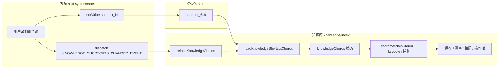

# 知识库快捷键（页面内 chord）设计说明

本文说明：**系统设置里可配置、但仅在知识库页生效**的快捷键如何实现，以及与 **Tauri 全局快捷键** 的差异。实现分散在 `knowledge-shortcuts.ts`、系统设置、知识页、`MarkdownEditor` 四处。

---

## 1. 设计思路

### 1.1 为什么要分两类快捷键？

| 类型 | `registerGlobally` | 持久化 | 谁来响应 |
|------|-------------------|--------|----------|
| 桌面全局快捷键（隐藏窗口、刷新等） | `true`（默认） | `shortcut_${key}` + Tauri `register_shortcut` | Rust 侧全局监听 |
| 知识库页面快捷键（保存、清空、列表、操作栏） | `false` | 仅 `shortcut_${key}` | 知识页 `window` 捕获阶段 `keydown` |

知识库操作强依赖当前页面上下文（Monaco 焦点、抽屉、底部栏），若注册为系统全局快捷键，容易在其它页面误触或与系统/其它应用冲突。因此：**只存字符串到 store，不调用 `register_shortcut`**，由知识页读取 chord 后自行匹配 `KeyboardEvent`。

### 1.2 数据流（主窗口单实例前提）



### 1.3 存储键与默认 chord（须与代码常量一致）

| 语义 | `key`（数字） | store 键名 | 默认串（示例） |
|------|---------------|------------|----------------|
| 知识库：保存 | 6 | `shortcut_6` | `Meta + S` |
| 知识库：清空草稿 | 7 | `shortcut_7` | `Meta + Shift + D` |
| 知识库：打开列表 | 8 | `shortcut_8` | `Meta + Shift + L` |
| 知识库：切换操作栏 | 9 | `shortcut_9` | `Meta + Shift + B` |

常量定义见 `apps/frontend/src/utils/knowledge-shortcuts.ts` 中的 `KNOWLEDGE_SHORTCUT_KEY_IDS` 与 `KNOWLEDGE_SHORTCUT_DEFAULT_CHORDS`；设置列表见 `apps/frontend/src/views/setting/system/config.ts` 的 `DEFAULT_INFO`。

### 1.4 为何用捕获阶段（`addEventListener(..., true)`）？

Monaco 编辑器内部会处理部分按键。在 **捕获阶段** 先判断是否为已配置的知识库 chord，命中则 `preventDefault()` 并执行业务逻辑，可避免与编辑器默认行为争抢。

### 1.5 为何需要 `e.code` 兜底？

部分环境下组合键按下时 `e.key` 可能不稳定；`eventKeyMatchesChord` 在 `e.key` 与期望主键一致时直接命中，否则用 `e.code`（如 `KeyB`、`Digit1`）与期望的小写主键比对，提高命中率。

### 1.6 旧 chord 迁移

历史上曾使用在 macOS 上易被系统吃掉的组合（如 `Meta + Control + D`），或 UI 提示与真实默认不一致（如 `Meta + Control + B`）。`loadKnowledgeShortcutChords` 在读取 store 后调用若干 `normalizeLegacy*Chord`，若命中旧串则写回新默认，避免用户升级后快捷键「失灵」。

### 1.7 底部操作栏为何受控？

切换操作栏的快捷键在 **知识页** 处理，状态也放在知识页（`markdownBottomBarOpen`）。`MarkdownEditor` 增加可选受控 props：`markdownBottomBarOpen` + `onMarkdownBottomBarOpenChange`，二者同时传入则完全由父组件驱动；未传则组件内部 `useState`，其它使用场景不受影响。Tooltip 文案由 `markdownBottomBarShortcutHint` 传入当前 store 中的 chord 展示字符串。

### 1.8 与 `visibilitychange` 的关系

曾在知识页监听 `visibilitychange` 以便从其它窗口回到本页时重载 chord。当前产品约定 **仅在主窗口** 配置快捷键，同窗口内保存会派发 `KNOWLEDGE_SHORTCUTS_CHANGED_EVENT`，故已移除 `visibilitychange` 监听。

---

## 2. 系统设置页：如何写入「仅页面」快捷键

文件：`apps/frontend/src/views/setting/system/index.tsx`  
配置：`apps/frontend/src/views/setting/system/config.ts`

录制流程要点：

1. 点击某项快捷键按钮 → `onChangeShortCut` 把该项设为「录制中」（`checkShortcut`），全局项会先 `clear_all_shortcuts`。
2. `keydown`（捕获）根据当前修饰键 + 主键拼出 `Meta + Shift + B` 这种字符串，写入该项的临时 `shortcut` 状态。
3. `keyup` 时若 `registerGlobally === false`：
   - `setValue('shortcut_${info.key}', shortcuts)` 持久化；
   - 更新界面上的 `defaultShortcut` 展示；
   - `window.dispatchEvent(new CustomEvent(KNOWLEDGE_SHORTCUTS_CHANGED_EVENT))` 通知知识页刷新。

若为全局项，则走 `register_shortcut` + 成功后再 `setValue`。

下面用**逐行注释**说明 `onKeyup` 中与知识库相关的分支（行号随文件变更可能略有偏移，以语义为准）：

```typescript
// onKeyup 回调开始：用户已松开按键，此时 shortcut 字符串已在 keydown 阶段拼好
const onKeyup = useCallback(
  (_e: KeyboardEvent) => {
    // 找到当前正在录制的那一条配置项（由 checkShortcut 对应 key 数字）
    const info = shortcutInfo.find((item) => item.key === checkShortcut);
    // 没有录制项，或还没有拼出任何组合，直接返回
    if (!info?.key || !info.shortcut) return;

    // 本次要写入 store / 注册全局的完整 chord 字符串，例如 "Meta + Shift + B"
    const shortcuts = info.shortcut;
    // registerGlobally === false 表示：知识库等，只写本地 store，不走 Tauri
    const pageOnly = info.registerGlobally === false;

    /** 知识库等：只写 store，由页面内 keydown 响应，不占用全局快捷键 */
    if (pageOnly) {
      void (async () => {
        // 持久化到与 key 对应的键，如 shortcut_9
        await setValue(`shortcut_${info.key}`, shortcuts);
        // 同步 React 状态：展示用 defaultShortcut 也改为当前 chord
        setShortcutInfo((prev) =>
          prev.map((item) =>
            item.key === checkShortcut
              ? { ...item, shortcut: shortcuts, defaultShortcut: shortcuts }
              : item,
          ),
        );
        // 通知知识页：无需刷新整页，重新 loadKnowledgeShortcutChords 即可
        window.dispatchEvent(
          new CustomEvent(KNOWLEDGE_SHORTCUTS_CHANGED_EVENT),
        );
      })();
      return;
    }

    // 以下分支：全局快捷键，需 Tauri register_shortcut（略）
  },
  [shortcutInfo, checkShortcut],
);
```

`getShortCutInfo`：进入设置页时对 `DEFAULT_INFO` 每一项 `getValue('shortcut_${i.key}')`，有值则用存储值作为展示用的 `defaultShortcut`，否则用配置里的默认串。

---

## 3. 工具模块：`knowledge-shortcuts.ts` 逐段说明

文件：`apps/frontend/src/utils/knowledge-shortcuts.ts`

以下按**源码顺序**说明每一段的职责（与文件内注释互补；具体行号以仓库为准）。

| 代码块 | 作用 |
|--------|------|
| `import { getValue, setValue }` | 读写持久化 store（与设置页同一套 API） |
| `KNOWLEDGE_SHORTCUT_KEY_IDS` | 数字 key 与语义绑定，与 `shortcut_${n}` 一一对应 |
| `KNOWLEDGE_SHORTCUT_DEFAULT_CHORDS` | 无存储或展示默认时的标准 chord 字符串；须与 `config.ts` 一致 |
| `ParsedChord` / `parseChordString` | 把 `"Meta + Shift + B"` 解析为 `{ meta, control, alt, shift, key: 'b' }`；必须至少一个修饰键，且主键恰好一段 |
| `eventPrimaryKeyNormalized` | 从 `e.key` 得到可比的主键字符串；纯修饰键返回 null |
| `eventKeyMatchesChord` | 比较事件主键与解析结果；`e.key` 优先，`e.code` 兜底字母与数字 |
| `chordMatchesStored`（导出） | 将 store 里的字符串解析后，与当前 `KeyboardEvent` 的修饰键 + 主键比较 |
| `normalizeLegacyClearChord` 等 | 读到历史错误默认时迁移并返回是否需写回 store |
| `loadKnowledgeShortcutChords`（导出） | `Promise.all` 读 `shortcut_6..9`，跑迁移，返回四个最终字符串 |
| `KNOWLEDGE_SHORTCUTS_CHANGED_EVENT`（导出） | 自定义事件名常量，设置页派发、知识页监听 |

**`chordMatchesStored` 逐行逻辑注释版**（教学用，与实现等价）：

```typescript
export function chordMatchesStored(
  stored: string | undefined, // 来自 store 的整串，如 "Meta + Shift + B"
  e: KeyboardEvent,           // 浏览器 keydown 事件
): boolean {
  const parsed = parseChordString(stored); // 解析失败则无法匹配
  if (!parsed) return false;
  if (e.metaKey !== parsed.meta) return false;     // macOS Command / Windows Win
  if (e.ctrlKey !== parsed.control) return false; // Control
  if (e.altKey !== parsed.alt) return false;
  if (e.shiftKey !== parsed.shift) return false;
  return eventKeyMatchesChord(e, parsed.key);     // 主键：key 优先，code 兜底
}
```

**`loadKnowledgeShortcutChords` 核心步骤注释版**：

```typescript
export async function loadKnowledgeShortcutChords(): Promise<{
  save: string;
  clear: string;
  openLibrary: string;
  toggleMarkdownBottomBar: string;
}> {
  // 并行读取四条 shortcut，减少异步等待
  const [s, c, o, b] = await Promise.all([
    getValue<string>(`shortcut_${KNOWLEDGE_SHORTCUT_KEY_IDS.save}`),
    getValue<string>(`shortcut_${KNOWLEDGE_SHORTCUT_KEY_IDS.clear}`),
    getValue<string>(`shortcut_${KNOWLEDGE_SHORTCUT_KEY_IDS.openLibrary}`),
    getValue<string>(
      `shortcut_${KNOWLEDGE_SHORTCUT_KEY_IDS.toggleMarkdownBottomBar}`,
    ),
  ]);
  // 清空：若仍是旧版 Meta+Control+D，写回 Meta+Shift+D
  const { value: clear, didMigrate: clearMigrated } =
    normalizeLegacyClearChord(c);
  if (clearMigrated) {
    await setValue(
      `shortcut_${KNOWLEDGE_SHORTCUT_KEY_IDS.clear}`,
      KNOWLEDGE_SHORTCUT_DEFAULT_CHORDS.clear,
    );
  }
  // 列表：旧 Meta+Control+L → Meta+Shift+L
  const { value: openLibrary, didMigrate: libMigrated } =
    normalizeLegacyOpenLibraryChord(o);
  if (libMigrated) {
    await setValue(
      `shortcut_${KNOWLEDGE_SHORTCUT_KEY_IDS.openLibrary}`,
      KNOWLEDGE_SHORTCUT_DEFAULT_CHORDS.openLibrary,
    );
  }
  // 操作栏：旧 Meta+Control+B → Meta+Shift+B
  const { value: toggleMarkdownBottomBar, didMigrate: barMigrated } =
    normalizeLegacyMarkdownBottomBarChord(b);
  if (barMigrated) {
    await setValue(
      `shortcut_${KNOWLEDGE_SHORTCUT_KEY_IDS.toggleMarkdownBottomBar}`,
      KNOWLEDGE_SHORTCUT_DEFAULT_CHORDS.toggleMarkdownBottomBar,
    );
  }
  return {
    save: s?.trim() || KNOWLEDGE_SHORTCUT_DEFAULT_CHORDS.save,
    clear,
    openLibrary,
    toggleMarkdownBottomBar,
  };
}
```

---

## 4. 知识库页：状态、监听与执行

文件：`apps/frontend/src/views/knowledge/index.tsx`

### 4.1 状态

- `knowledgeChords`：四个字符串，来自 `loadKnowledgeShortcutChords()`，用于 `chordMatchesStored` 与 Toolbar Tooltip。
- `markdownBottomBarOpen`：底部操作栏开闭；快捷键与 Monaco「操作栏」按钮都改这份状态。

### 4.2 重载 chord 的 effect

```typescript
useEffect(() => {
  void reloadKnowledgeChords(); // 挂载时从 store 拉最新
  const onShortcutsChanged = () => void reloadKnowledgeChords();
  window.addEventListener(
    KNOWLEDGE_SHORTCUTS_CHANGED_EVENT,
    onShortcutsChanged,
  );
  return () => {
    window.removeEventListener(
      KNOWLEDGE_SHORTCUTS_CHANGED_EVENT,
      onShortcutsChanged,
    );
  };
}, [reloadKnowledgeChords]);
```

逐行说明：

1. `void reloadKnowledgeChords()`：进入知识页立即同步一次快捷键配置（含迁移逻辑）。
2. `onShortcutsChanged`：收到设置页派发的自定义事件后再次异步加载。
3. `addEventListener` / `removeEventListener`：避免泄漏；仅主窗口场景下足够。

### 4.3 捕获阶段 keydown（逐行注释版）

```typescript
useEffect(() => {
  const onKeyDown = (e: KeyboardEvent) => {
    // 保存进行中或覆盖确认弹层打开时不响应快捷键，避免误触
    if (saveLoading || knowledgeStore.knowledgeOverwriteOpen) return;
    // 以下每个分支：先比对 chord，命中则阻止默认并执行动作
    if (chordMatchesStored(knowledgeChords.save, e)) {
      e.preventDefault();
      void onSave();
      return;
    }
    if (chordMatchesStored(knowledgeChords.clear, e)) {
      e.preventDefault();
      resetEditorToNewDraft();
      return;
    }
    if (chordMatchesStored(knowledgeChords.openLibrary, e)) {
      e.preventDefault();
      setListOpen((open) => !open); // 抽屉开关
      return;
    }
    if (chordMatchesStored(knowledgeChords.toggleMarkdownBottomBar, e)) {
      e.preventDefault();
      setMarkdownBottomBarOpen((open) => !open);
      return;
    }
  };
  // 第三个参数 true：捕获阶段，优先于 Monaco 等目标阶段处理
  window.addEventListener('keydown', onKeyDown, true);
  return () => window.removeEventListener('keydown', onKeyDown, true);
}, [
  knowledgeChords,
  onSave,
  saveLoading,
  knowledgeStore.knowledgeOverwriteOpen,
  resetEditorToNewDraft,
]);
```

### 4.4 传给 `MarkdownEditor`

知识页将底部栏状态与 chord 提示传入（节选）：

```tsx
<MarkdownEditor
  markdownBottomBarOpen={markdownBottomBarOpen}
  onMarkdownBottomBarOpenChange={setMarkdownBottomBarOpen}
  markdownBottomBarShortcutHint={knowledgeChords.toggleMarkdownBottomBar}
  // ... 其它 props
/>
```

---

## 5. `MarkdownEditor`：受控底部栏（节选思路）

文件：`apps/frontend/src/components/design/Monaco/index.tsx`

- `bottomBarControlled`：仅当 **同时** 传入 `markdownBottomBarOpen` 与 `onMarkdownBottomBarOpenChange` 时为 true。
- 受控：`markdownBottomBarOpen` 显示状态，`toggleMarkdownBottomBar` 调用 `onMarkdownBottomBarOpenChange(!prop)`。
- 非受控：使用 `internalMarkdownBottomBarOpen` 与 `setInternalMarkdownBottomBarOpen`。
- 「操作栏」按钮 `onClick={toggleMarkdownBottomBar}`；Tooltip `content={markdownBottomBarShortcutHint ?? 'Meta + Shift + B'}`。

---

## 6. 新增一条「知识库页面快捷键」时的检查清单

1. 在 `KNOWLEDGE_SHORTCUT_KEY_IDS` 增加未占用的数字 `key`，并在 `KNOWLEDGE_SHORTCUT_DEFAULT_CHORDS` 写默认串。
2. 在 `config.ts` 的 `DEFAULT_INFO` 增加一项，`registerGlobally: false`，`defaultShortcut` 引用常量。
3. 在 `loadKnowledgeShortcutChords` 中 `getValue` / 返回值对象中增加字段；如有旧键迁移需求，增加 `normalizeLegacy*`。
4. 在 `knowledge/index.tsx` 的 `knowledgeChords` 类型、初始 state、`onKeyDown` 分支中接入；若需 UI 联动，给子组件传 props。
5. 确认设置页 `onKeyup` 的 `pageOnly` 分支已覆盖所有 `registerGlobally: false` 项（无需改分支逻辑，只要 `DEFAULT_INFO` 配对正确）。
6. 运行 `biome check` 与 `tsc`，手动在知识页验证 chord 与 Tooltip。

---

## 7. 相关源文件路径

| 路径 | 职责 |
|------|------|
| `apps/frontend/src/utils/knowledge-shortcuts.ts` | chord 解析、匹配、加载、迁移、事件名 |
| `apps/frontend/src/views/setting/system/config.ts` | 快捷键列表元数据（含 `registerGlobally`） |
| `apps/frontend/src/views/setting/system/index.tsx` | 录制、持久化、全局注册、派发变更事件 |
| `apps/frontend/src/views/knowledge/index.tsx` | 知识页监听与业务动作 |
| `apps/frontend/src/components/design/Monaco/index.tsx` | Markdown 底部操作栏受控与 Tooltip |
