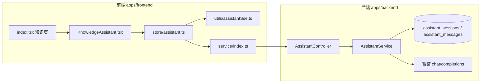

# 知识库右侧 Assistant AI 助手：完整实现说明

本文是知识编辑页 **右侧通用助手**（智谱 GLM、独立于主站 Chat）的 **完整** 实现说明：产品语义、前后端数据流、接口与表结构、MobX 状态机、SSE 协议、未保存草稿（ephemeral）、保存迁入（import-transcript）、清空/删除边界，以及 UI 与可观测性细节。实现代码以仓库当前版本为准；阅读时可对照下列路径跳转。

**相关文档**：持久化与数据落点的专题摘要仍保留在 `knowledge-assistant-ephemeral-persistence.md`（可与本文对照）；**以本文为权威总览**。

---

## 目录

1. [功能边界与术语](#1-功能边界与术语)
2. [系统架构一览](#2-系统架构一览)
3. [数据库与知识模块联动](#3-数据库与知识模块联动)
4. [后端：路由、DTO、服务逻辑](#4-后端路由dto服务逻辑)
5. [前端：页面编排与 documentKey](#5-前端页面编排与-documentkey)
6. [前端：assistantStore 状态机](#6-前端assistantstore-状态机)
7. [前端：SSE 消费协议 streamAssistantSse](#7-前端sse-消费协议-streamassistantsse)
8. [前端：KnowledgeAssistant UI 层](#8-前端knowledgeassistant-ui-层)
9. [HTTP 封装与类型](#9-http-封装与类型)
10. [关键时序与竞态](#10-关键时序与竞态)
11. [工程细节与约束](#11-工程细节与约束)
12. [文件索引](#12-文件索引)
13. [快捷卡片与 extraUserContentForModel](#13-快捷卡片与-extrausercontentformodel用户短句--模型长上下文)

---

## 1. 功能边界与术语

### 1.1 与主聊天（ChatBot）的隔离

| 维度 | 知识库助手 | 主站 Chat |
| --- | --- | --- |
| HTTP 路径前缀 | `/assistant/*` | `/chat/*` 等 |
| 流式消费 | `streamAssistantSse`（`apps/frontend/src/utils/assistantSse.ts`） | `streamFetch` 等 |
| 服务端服务 | `AssistantService` | `ChatService` / `GlmChatService` |
| 会话存储 | `assistant_sessions` / `assistant_messages` | 主会话消息表与缓存体系 |

二者 **不共享 sessionId**，避免混用。

### 1.2 术语表

| 术语 | 含义 |
| --- | --- |
| **documentKey** | 传给 `KnowledgeAssistant` 的字符串，格式为 `{assistantArticleBinding}__trash-{trashOpenNonce}`，用于区分「同一逻辑草稿在不同 UI  nonce 下」的助手实例。 |
| **assistantArticleBinding** | `index.tsx` 中 `useMemo`：`knowledgeTrashPreviewId` 存在时为 `__knowledge_trash__:{行id}`，否则为 `knowledgeEditingKnowledgeId ?? 'draft-new'`。 |
| **bindingId** | `knowledgeArticleBindingFromDocumentKey(documentKey)`：去掉 `__trash-*` 后缀后传给后端的「按文章查会话」标识（可为正式 UUID、`draft-new`、或回收站前缀串）。 |
| **knowledgeAssistantPersistenceAllowed** | `assistantStore` 布尔：为 `false` 表示 **未保存云端草稿**，走 ephemeral，不落库。 |
| **Ephemeral** | SSE body `ephemeral: true` + `contextTurns` + `content`；可选 `extraUserContentForModel`（仅拼进发给模型的 user 句，不落库）；不传 `sessionId` / `knowledgeArticleId`。 |
| **extraUserContentForModel** | 可选字符串：与 `content` 换行拼接后仅用于 **本轮** 智谱请求；**不**写入 `assistant_messages`，气泡与落库 user 正文仍为短 `content`（见 §13）。 |
| **Flush / import-transcript** | 首次保存成功后，把内存 `messages` 打成 `lines` 写入 `POST /assistant/session/import-transcript`。 |

---

## 2. 系统架构一览



---

## 3. 数据库与知识模块联动

### 3.1 表结构（TypeORM 实体）

- **`assistant_sessions`**（`assistant-session.entity.ts`）  
  - `id`：UUID 主键，即前端 **`sessionId`**。  
  - `user_id`：归属用户。  
  - `knowledge_article_id`：与知识条目的 **逻辑绑定键**（可为云端知识 UUID、`__knowledge_trash__:回收站行id` 等，与前端 `bindingId` 对齐）。  
  - `title` / `created_at` / `updated_at`。

- **`assistant_messages`**（`assistant-message.entity.ts`）  
  - `session_id` → 会话外键，`onDelete: CASCADE`。  
  - `role`：`user` / `assistant` / `system`。  
  - `turn_id`：同一轮用户+助手共用，支持流式占位后 UPDATE 正文。  
  - `content`：`longtext`。

### 3.2 删除知识时的清理

`KnowledgeService.remove`（`knowledge.service.ts`）在事务中：

1. 写入 `knowledge_trash` 快照；  
2. **`assistantSessionRepo.delete({ knowledgeArticleId: row.id })`**：删除绑定该知识 UUID 的助手会话（消息随 CASCADE）；  
3. 删除 `knowledge` 主表行。

因此删除后前端若仍持旧 `sessionId` 拉详情或点停止，后端对 **`getSessionDetail`** / **`stopStream`** 做了 **幂等软处理**（见 §10.3），避免 404 Toast。

---

## 4. 后端：路由、DTO、服务逻辑

### 4.1 控制器 `AssistantController`

路径：`apps/backend/src/services/assistant/assistant.controller.ts`。

- 全局 **`JwtGuard`**：所有路由需登录。  
- **`ClassSerializerInterceptor`**：响应序列化（Date → ISO 等）。

**路由注册顺序（重要）**：`POST session/import-transcript` 与 `GET session/for-knowledge` 必须写在 **`GET session/:sessionId`** 之前，否则路径会被 `:sessionId` 误匹配为字面量 `import-transcript` / `for-knowledge`。

| 方法 | 路径 | 作用 |
| --- | --- | --- |
| POST | `/assistant/session` | 创建空会话；可带 `knowledgeArticleId` 绑定或复用最近会话。 |
| POST | `/assistant/session/import-transcript` | 迁入草稿对话。 |
| GET | `/assistant/sessions` | 分页会话列表。 |
| GET | `/assistant/session/for-knowledge` | 按 `knowledgeArticleId` 查最近会话+消息；无则 `data: null`。 |
| GET | `/assistant/session/:sessionId` | 按 sessionId 拉详情；会话已删则返回 `session: null, messages: []`（HTTP 200）。 |
| PATCH | `/assistant/session/:sessionId/knowledge-article` | 改绑 `knowledgeArticleId`。 |
| POST | `/assistant/sse` | **Sse**：流式问答；body 为 `AssistantChatDto`。 |
| POST | `/assistant/stop` | 停止流式；会话已删则成功返回，不抛「会话不存在」。 |

**SSE 包装**：`chatSse` 将 `chatStream` 的 chunk `map` 为 `{ data: { type, content?, raw?, done } } }`，末尾 `concat` 一条 `{ done: true }`；`catchError` 把异常转成 `data.error` + `done: true`，避免 Observable 断链导致前端挂死。

### 4.2 DTO 要点

- **`AssistantChatDto`**（`assistant-chat.dto.ts`）  
  - `sessionId?`、`knowledgeArticleId?`、`ephemeral?`、`contextTurns?`、`content`（必填）、`maxTokens?`、`temperature?`。  
  - **`ephemeral === true`** 时与 `sessionId` / `knowledgeArticleId` **互斥**，校验失败抛 `BadRequestException`。  
  - `contextTurns`：多轮历史；**不含**本轮用户句——本轮由 **`content`** 表达；服务端 `buildEphemeralTurns` 会拼接为完整 turns 再送智谱。

- **`ImportAssistantTranscriptDto`**（`import-assistant-transcript.dto.ts`）  
  - `knowledgeArticleId`：保存后的知识 id。  
  - `lines`：最多 200 条，`user`/`assistant` 角色；超长时客户端提交 **按时间升序的最近 200 条**（`slice(-200)`）。

- **`AssistantStopDto`**：`sessionId`。

### 4.3 `AssistantService.chatStream` 分支摘要

路径：`apps/backend/src/services/assistant/assistant.service.ts`。

**A）`dto.ephemeral === true`**  

1. 校验互斥字段。  
2. **`runEphemeralChatStream`**：`buildEphemeralTurns` → token budget 裁剪 → 组装 `system + 历史` → `fetch` 智谱流式 → `parseGlmStreamData` → `subscriber.next`。  
3. **不写** `assistant_sessions` / `assistant_messages`，**不**使用 Redis `streamBusyKey` / epoch（与持久化流区分）。

**B）持久化路径（`ephemeral` 非 true）**  

1. 解析或创建 `AssistantSession`（`sessionId` 优先；否则 `knowledgeArticleId` 查最近；再无则新建并写 `knowledgeArticleId`）。  
2. **`insertUserAndAssistantPlaceholder`**：事务内插入本轮 user + assistant 占位（`turnId` 一致）。  
3. **`loadMessagesForSessionContext` + `buildTurnsForContext`**：从 DB 构建多轮上下文（流式中空助手可省略正文）。  
4. **`incrementStreamEpoch` + cache.set(streamBusyKey)`**：多实例下抢占/中止同会话旧流。  
5. 智谱流式读取循环中比对 epoch，必要时 **abort** 本地 fetch。  
6. 正常结束 **`finalizeTurn`**（UPDATE 助手正文）；异常 **`cleanupTurnOnFailure`**（有则写部分，无则删 turn 对）。

### 4.4 `importTranscript`

1. `findLatestSessionIdByKnowledgeArticle(userId, articleId)`。  
2. 无则 **新建** `AssistantSession` 并设 `knowledgeArticleId = articleId`；有则 **删光**该 session 下消息再插入。  
3. 按 `lines` 扫描：**必须以 `user` 行开启一轮**；每条 user 后可选一条 `assistant`；写入 `turnId` 成对。  
4. 更新 session `title`：取 **本批 `lines` 中** 首条有正文的 `user` 内容前 60 字（客户端超长时只提交最近 200 条，则标题对应该窗口内最早一轮用户句，而非整段草稿绝对首条）。  
5. 返回 `{ sessionId, inserted }`。

### 4.5 `getSessionDetail` / `stopStream`（删除知识后的幂等）

- **`getSessionDetail`**：若会话行不存在，返回 **`{ session: null, messages: [] }`**（仍 200），避免前端 http 层对 404 弹 Toast。  
- **`stopStream`**：若会话不存在，返回 **`{ success: true, message: '会话已不存在，无需停止' }`**；存在则读 Redis busy，无 busy 则「当前无进行中的生成」，有则 `incrementStreamEpoch` 通知读循环 abort。

---

## 5. 前端：页面编排与 documentKey

文件：`apps/frontend/src/views/knowledge/index.tsx`。

### 5.1 `assistantArticleBinding` 与 `documentKey`

摘录自 `apps/frontend/src/views/knowledge/index.tsx`（`assistantArticleBinding` 的 `useMemo` 定义）：

```tsx
/** 助手 / Monaco 文档维度的条目标识：回收站预览用独立前缀，避免多条均落在 draft-new 下同一会话 */
const assistantArticleBinding = useMemo(() => {
	if (knowledgeStore.knowledgeTrashPreviewId != null) {
		return `__knowledge_trash__:${knowledgeStore.knowledgeTrashPreviewId}`;
	}
	return knowledgeStore.knowledgeEditingKnowledgeId ?? 'draft-new';
}, [
	knowledgeStore.knowledgeTrashPreviewId,
	knowledgeStore.knowledgeEditingKnowledgeId,
]);
```

- **回收站预览**：`knowledgeEditingKnowledgeId` 常为 `null`，用 **`__knowledge_trash__:{trashRowId}`** 与列表中正式 UUID 区分，使助手历史不串。  
- **正式编辑**：binding 为云端 **`knowledgeEditingKnowledgeId`**（UUID）。  
- **新建未保存**：binding 为字面量 **`draft-new`**。

`KnowledgeAssistant` 接收的 **`documentKey`** 为：

```text
`${assistantArticleBinding}__trash-${trashOpenNonce}`
```

**含义**：`trashOpenNonce` 在打开回收站条目等场景递增，用于 **同一 binding 下强制换「助手会话槽」**，避免 UI 状态与旧会话纠缠；**勿与** `clearDocumentNonce` 混用——后者仅驱动 Monaco `documentIdentity`，避免清空草稿时误 bump `trashOpenNonce` 导致助手被意外重置（注释见 `resetEditorToNewDraft`）。

### 5.2 保存知识：`persistKnowledgeApi` / `persistKnowledgeApiSaveAs`

新建成功分支（节选逻辑说明，非全文件）：

1. `saveKnowledge` → `articleId = res.data.id`。  
2. `fromKey` / `toKey` 与上式 `documentKey` 规则一致。  
3. **`!knowledgeAssistantPersistenceAllowed`** 时 **`await flushEphemeralTranscriptIfNeeded(articleId, fromKey, toKey)`**（须 **早于** `setKnowledgeEditingKnowledgeId`，否则 `activate` 可能拉空库覆盖内存草稿）。  
4. `remapAssistantSessionDocumentKey`；`setKnowledgeEditingKnowledgeId`；若有 `sid` 再 **`patchAssistantSessionKnowledgeArticle`** 做幂等改绑。

### 5.3 清空草稿：`resetEditorToNewDraft`

顺序：`clearDocumentNonce++` → `clearKnowledgeDraft()` → **`assistantStore.clearAssistantStateOnKnowledgeDraftReset()`**。  

**原因**：未保存草稿清空后 `documentKey` 往往仍为 `draft-new__trash-*`，`useEffect([documentKey])` **不会**重跑，`activate` 不会清屏，必须 **显式** 清助手内存态。

---

## 6. 前端：assistantStore 状态机

文件：`apps/frontend/src/store/assistant.ts`。

### 6.1 状态字段（注释语义）

| 字段 | 说明 |
| --- | --- |
| `activeDocumentKey` | 当前文档键；切换/迁入时更新。 |
| `sessionId` | 当前持久化会话 id；ephemeral 下多为 `null`。 |
| `messages` | UI 气泡列表；流式中用新对象替换元素以触发 MobX 细粒度更新。 |
| `sessionByDocument` | `documentKey → sessionId` 内存缓存；换篇后仍保留其它 key。 |
| `abortStream` | 取消当前 SSE 的函数（`streamAssistantSse` 返回的 `AbortController.abort`）。 |
| `knowledgeAssistantPersistenceAllowed` | 由 `KnowledgeAssistant` 同步；默认 `true`，离开页面时复位 `true`。 |

### 6.2 模块级纯函数（避免 TS4094）

`buildImportTranscriptLinesFromMessages`、`buildEphemeralContextTurnsFromMessages` 放在 **类外**：若作为 `private` 实例方法，经 `store/index.ts` 导出默认实例类型时会触发 **TS4094**（匿名类导出不可含 private）。

- **迁入行**：每条 user/assistant 原样入列，**最多 200 条**（与后端 `ArrayMaxSize` 对齐）。  
- **Ephemeral 上下文**：跳过末尾 **「assistant 且 isStreaming 且正文空」** 的占位，避免把无效占位发给模型；**最多 120 条**（与 DTO `ArrayMaxSize(120)` 对齐）。

### 6.3 `activateForDocument(documentKey)` 流程（注释级）

1. **中止**上一路 SSE，`abortStream = null`。  
2. `runInAction`：写入 `activeDocumentKey`，**清空** `messages` / `sessionId` / `loadError`（每次切换文档从空白开始）。  
3. **`!knowledgeAssistantPersistenceAllowed`**：直接 **return**（不请求后端历史；草稿对话仅存内存）。  
4. 无 token：return。  
5. 若 **`sessionByDocument[documentKey]`** 已有 sid：走 **缓存命中** 分支。  
6. 否则若有 **`bindingId`**：`getAssistantSessionByKnowledgeArticle`；若返回 `data?.session?.sessionId`，则 **hydratedFromArticleApi = true**，一次性写入 `sessionByDocument`、`sessionId`、`messages`，并 **return**（避免二次 `fetchSessionMessages`）。  
7. 若仍无 sid：**return**（空会话，等待用户首条消息创建会话）。  
8. 若有 sid 且非 hydrated：`fetchSessionMessages()`；失败则 **删除**该 key 的缓存并清空 UI（防止脏 sid）。

### 6.4 `sendMessage` 流程

1. 防抖：`!text || isSending || isHistoryLoading` 则 return。  
2. **`ephemeral = !knowledgeAssistantPersistenceAllowed`**。  
3. 持久化：`ensureSessionForCurrentDocument`；ephemeral：校验 token + `activeDocumentKey`。  
4. **在 push 本轮消息之前** 计算 `contextTurns = buildEphemeralContextTurnsFromMessages(messages)`（仅 ephemeral）。  
5. 中止旧 SSE；`uuid` 生成 `userChatId` / `assistantChatId`；`push` user + 空 assistant（`isStreaming: true`）。  
6. **`applyAssistantPatch`**：累积 `content` / `thinkContent`，每次 **`runInAction` 替换整条 message 对象**（注释：让子 observer 稳定订阅）。  
7. **`streamAssistantSse`**：body 为 `{ ephemeral, content, contextTurns }` 或 `{ sessionId, content }`。  
8. `onComplete`：持久化成功后再 **`fetchSessionMessages`** 与 DB 对齐（ephemeral **跳过**，避免覆盖 UI）。  
9. `onError` / 外层 catch：收尾 `isStreaming`、`isSending`。

### 6.5 `stopGenerating`

1. **先** `abortStream()`（防止 await 网关期间仍收 delta）。  
2. `runInAction`：所有流式消息标记 `isStreaming=false`、`isStopped=true`。  
3. 若有 **`sessionId`**：`stopAssistantStream`（失败忽略）。

### 6.6 `fetchSessionMessages` 与已删会话

若 `payload.session == null`：删除 **`sessionByDocument[activeDocumentKey]`**，清空 `sessionId` 与 `messages`（与 §4.5 后端约定对齐）。

---

## 7. 前端：SSE 消费协议 `streamAssistantSse`

文件：`apps/frontend/src/utils/assistantSse.ts`。

### 7.1 传输层

- `POST BASE_URL + '/assistant/sse'`，`Authorization: Bearer` + `Content-Type: application/json`。  
- `getPlatformFetch`：兼容 Tauri / 浏览器 fetch。  
- `AbortController`：返回 `() => controller.abort()` 供停止。

### 7.2 行协议（与主 Chat 不同）

按 **换行** 切分 buffer；只处理 **`data:` 前缀** 行；`JSON.parse` 后：

| `parsed` 字段 | 处理 |
| --- | --- |
| `error`（string） | `onComplete(error)` 并结束 readLoop。 |
| `done === true` | `onComplete()` 正常结束。 |
| `type === 'thinking'` | 从 `raw` 或 `content` 取字符串 → `onThinking`。 |
| `type === 'usage'` | 忽略。 |
| `type === 'content'` 且 `content` 为 string | `onDelta(content)`。 |

解析失败 Toast「助手流解析失败」并 **continue**（尽力容错）。

---

## 8. 前端：`KnowledgeAssistant` UI 层

文件：`apps/frontend/src/views/knowledge/KnowledgeAssistant.tsx`。

### 8.1 持久化开关同步

摘录自 `apps/frontend/src/views/knowledge/KnowledgeAssistant.tsx`（`assistantPersistenceAllowed` 与同步 `useEffect`）：

```tsx
const assistantPersistenceAllowed = useMemo(() => {
	if (knowledgeStore.knowledgeTrashPreviewId != null) return true;
	const editingId = knowledgeStore.knowledgeEditingKnowledgeId;
	if (isKnowledgeLocalMarkdownId(editingId)) return true;
	if (editingId) return true;
	return false;
}, [
	knowledgeStore.knowledgeTrashPreviewId,
	knowledgeStore.knowledgeEditingKnowledgeId,
]);

useEffect(() => {
	assistantStore.setKnowledgeAssistantPersistenceAllowed(
		assistantPersistenceAllowed,
	);
	return () => {
		assistantStore.setKnowledgeAssistantPersistenceAllowed(true);
	};
}, [assistantPersistenceAllowed]);
```

- **卸载复位为 `true`**：避免离开知识页后其它功能误用「禁止持久化」。  
- **登录态**：`userStore.userInfo?.id` 控制占位文案与是否渲染输入区。  
- **编辑器须有正文**：`editorHasBody` 才允许输入（`ChatEntry.disableTextInput`）；左侧清空 markdown 时 **同步清空**助手输入框 `useEffect`。

### 8.2 单条气泡 `KnowledgeAssistantMessageBubble`

- **`observer`** 包裹单条，从 `assistantStore.messages` 按 `chatId` 查找。  
- **`data-msg-rev`**：合成「内容长度 + 思考长度 + 是否流式」字符串，**显式绑定** MobX 订阅字段，避免流式阶段子树不刷新（注释已说明非 hack）。  
- **`ChatMessageActions`**：`needShare={false}`；**「保存到知识」** 将助手正文 **append** 到 `knowledgeStore.markdown`。

### 8.3 滚动与代码块工具栏

- **`useStickToBottomScroll`**（`apps/frontend/src/hooks/useStickToBottomScroll.ts`）：`isStreaming` + `streamScrollTick` + `resetKey: documentKey`；除 `enableStickToBottom` 外，暴露 **`flushScrollToBottom`**（单次 `scrollTop = scrollHeight`，不改变内部「是否跟底」状态），供 §8.5 在条带插入 DOM 后强制贴底。  
- **`useChatCodeFloatingToolbar`**：`layoutDeps` 含 `streamScrollTick`，避免仅依赖 `markdown` 导致助手区代码块工具条不重排。

### 8.4 首页快捷卡片（润色 / 总结）

当 `messages.length === 0` 且左侧编辑器已有正文时，展示 `KNOWLEDGE_ASSISTANT_PROMPTS` 卡片；点击后走 **`sendKnowledgePromptCard`**，经 `buildKnowledgeAssistantDocumentMessage` 拆成 **短 `userMessageShort` + `extraUserContentForModel`**，调用 `assistantStore.sendMessage`。**完整契约、后端拼接顺序与回归注意** 见 **§13**。

### 8.5 流式结束后的快捷条（跟在消息流末尾 + 贴底滚动）

#### 8.5.1 产品语义

- **与 §8.4 区分**：§8.4 是 **空会话**（无气泡）时的首屏大卡片；本节是 **已有对话** 且 **当前轮发送与流式均已结束** 时，在 **最新消息气泡之后**、仍在 **`ScrollArea` 可滚动内容内** 展示的一排与 **`KNOWLEDGE_ASSISTANT_PROMPTS` 同源** 的快捷入口（再次调用 `sendKnowledgePromptCard`）。  
- **不固定在输入框上方**：条带作为消息列的「尾部块」，随长对话一起滚动；用户上滑阅读历史时，条带在列表底部而非盖住输入区。  
- **出现后视口贴底**：条带挂载会使 `scrollHeight` 增大；若不在布局后把视口滚到底，用户可能仍停留在旧 `scrollTop`，看不到新按钮。因此需在 **`showPostStreamActions` 变为 `true`** 时主动 **`flushScrollToBottom`**，并用 **`requestAnimationFrame` 再执行一次**，缓解 Radix `ScrollArea` 内层高度晚一帧才稳定的情况。

#### 8.5.2 显示条件（`showPostStreamActions`）

须 **同时** 满足：

| 条件 | 含义 |
| --- | --- |
| `isLoggedIn` | 已登录 |
| `messages.length > 0` | 已进入对话列表 |
| `editorHasBody` | 左侧编辑器有正文，润色/总结才有文档可带给模型 |
| `!isHistoryLoading` | 不在拉取历史 |
| `!isSending` | 不在发送请求生命周期内（含等待首包） |
| `!isStreaming` | 无助手气泡处于流式中 |

流式或发送中为 `false`，条带卸载，避免与进行中回复抢交互。

#### 8.5.3 实现要点（逐条）

1. 从 **`useStickToBottomScroll`** 解构 **`flushScrollToBottom`**，与既有 `enableStreamStickToBottom` 并存。  
2. 定义布尔 **`showPostStreamActions`**（上表条件合成），供 JSX 与 `useLayoutEffect` 共用。  
3. **`useLayoutEffect`** 依赖 **`[showPostStreamActions, flushScrollToBottom]`**：当 `showPostStreamActions === true` 时调用 **`flushScrollToBottom()`**，并在 **`requestAnimationFrame`** 内再调用一次；`false` 时不做事。  
4. **渲染位置**：在 **`ScrollArea`** 内、`messages.map(...)` **之后**，与气泡同一 **`max-w-3xl mx-auto`** 列容器内；条带内 **`KNOWLEDGE_ASSISTANT_PROMPTS.map`** 渲染按钮（与首屏卡片同源 `kind` / 标题，避免文案分叉）。  
5. **与流式跟底的关系**：流式阶段仍由 `useStickToBottomScroll` 根据 `isStreaming` / `contentRevision` 跟底；条带仅在 idle 出现，**贴底由本节 `useLayoutEffect` 补偿**，二者职责不重复。

#### 8.5.4 代码摘录（含源码注释）

```tsx
// 文件：apps/frontend/src/views/knowledge/KnowledgeAssistant.tsx（节选 + 与源码一致的注释）

const {
	viewportRef: scrollViewportRef,
	scrollViewportHandlers,
	enableStickToBottom: enableStreamStickToBottom,
	flushScrollToBottom,
} = useStickToBottomScroll({
	isStreaming: assistantStore.isStreaming,
	contentRevision: streamScrollTick,
	resetKey: documentKey || undefined,
});

/** 流式/发送结束后展示「重新总结/润色」条带（跟在消息后，见下方 ScrollArea 内渲染） */
const showPostStreamActions =
	isLoggedIn &&
	messages.length > 0 &&
	editorHasBody &&
	!assistantStore.isHistoryLoading &&
	!assistantStore.isSending &&
	!assistantStore.isStreaming;

// 条带插入后 scrollHeight 变化，须在布局后贴底，否则用户仍停在旧滚动位置
useLayoutEffect(() => {
	if (!showPostStreamActions) return;
	flushScrollToBottom();
	requestAnimationFrame(() => flushScrollToBottom());
}, [showPostStreamActions, flushScrollToBottom]);
```

```tsx
// 同一文件：ScrollArea 内消息列表末尾（节选）
{messages.map((message, index) => (
	<KnowledgeAssistantMessageBubble key={message.chatId} /* ... */ />
))}
{showPostStreamActions ? (
	<div className="flex w-full min-w-0 flex-wrap gap-3.5 mb-3">
		{KNOWLEDGE_ASSISTANT_PROMPTS.map((item) => (
			<Button
				key={item.kind}
				variant="dynamic"
				className="w-fit rounded-md border border-theme/10 bg-theme/5 p-2 text-left text-sm text-textcolor/70 transition-colors hover:border-theme/20 hover:text-textcolor"
				onClick={() => void sendKnowledgePromptCard(item.kind)}
			>
				{item.title}
			</Button>
		))}
	</div>
) : null}
```

#### 8.5.5 Hook 侧：`flushScrollToBottom` 语义（摘录）

```typescript
// 文件：apps/frontend/src/hooks/useStickToBottomScroll.ts（节选 + 接口注释）
/** 单次滚到物理底部，不修改是否跟底的内部状态 */
flushScrollToBottom: () => void;

const flushScrollToBottom = useCallback(() => {
	const vp = viewportRef.current;
	if (!vp) return;
	vp.scrollTop = vp.scrollHeight;
}, []);
```

### 8.6 右下角滚动角标按钮：置底 / 置顶（与 Monaco 预览一致）

本节说明 `KnowledgeAssistant.tsx` 的**滚动角标按钮**（右下角、输入框上方、与输入框右边对齐）的完整实现思路与关键代码。该按钮的“何时显示、显示置顶还是置底、阈值判定”等逻辑**刻意与** `apps/frontend/src/components/design/Monaco/preview.tsx` 的预览角标保持一致，避免出现两套不一致的滚动体验。

#### 8.6.1 设计目标与约束

核心目标：

- **体验一致**：判定逻辑、阈值、模式切换与 `preview.tsx` 一致（`hidden / toBottom / toTop` 三态）。
- **不影响流式贴底**：`KnowledgeAssistant` 的消息列表在流式输出（streaming，流式输出）时由 `useStickToBottomScroll` 负责自动滚动到底部；角标按钮只能“提示/跳转”，不能破坏 hook 的跟底状态机。
- **可中断可恢复**：用户手动向上滚动应当丝滑且能打断贴底；当用户回到底部（或点击“置底”）时，应当能恢复自动贴底；当流式进行中点击“置顶”时必须真的能留在顶部（不能被立刻拉回底部）。

#### 8.6.2 为什么“置顶”要先 disableStickToBottom

`useStickToBottomScroll` 在 `isStreaming === true` 且内部 `stickToBottomRef.current === true` 时，会在 `contentRevision` 变化（新 token 到来）后**强制把视口滚到底部**（详见 `useLayoutEffect([...contentRevision])`）。

因此：

- 若流式阶段用户点击“置顶”但不先 `disableStickToBottom()`，下一次 SSE chunk 到来就会把视口拉回底部，导致“流式时无法置顶”。
- 解决方式是在 `toTop` 分支里**先** `disableStickToBottom()` 再 `scrollTo({ top: 0 })`。

#### 8.6.3 与 Monaco 预览一致的判定逻辑（参考）

`preview.tsx` 中角标按钮的核心判定如下（节选）：

```tsx
// 文件：apps/frontend/src/components/design/Monaco/preview.tsx（节选）
// 语义：内容不可滚动 -> hidden；接近底部 -> toTop；否则 -> toBottom
const refreshPreviewScrollFab = useCallback(() => {
	if (!showPreviewScrollCornerFab) {
		setPreviewScrollFabMode('hidden');
		return;
	}
	const vp = localViewportRef.current;
	if (!vp) return;
	const { scrollTop, scrollHeight, clientHeight } = vp;
	const maxScroll = scrollHeight - clientHeight;
	if (maxScroll <= 4) {
		setPreviewScrollFabMode('hidden');
		return;
	}
	const threshold = 8;
	setPreviewScrollFabMode(
		scrollTop >= maxScroll - threshold ? 'toTop' : 'toBottom',
	);
}, [showPreviewScrollCornerFab]);
```

#### 8.6.4 `KnowledgeAssistant.tsx` 的完整实现思路（逐条）

实现步骤（与源码一致）：

1. **引入三态 mode**：`hidden | toBottom | toTop`，与 `preview.tsx` 对齐。
2. **计算 mode 的 refresh 函数**：取 `ScrollArea` 的 viewport（`scrollViewportRef.current`），用 `maxScroll <= 4` 与 `threshold = 8` 计算 `nextMode`。
3. **降低滚动抖动**：`onScroll` 高频触发时，如果每次都 `setState` 会导致重新渲染影响滚动手感；因此用 `scrollCornerFabModeRef` 记住上一次 mode，仅当 mode 变化时才 `setScrollCornerFabMode(nextMode)`。
4. **刷新时机**：
   - **滚动时**：在 `scrollViewportHandlers.onScroll` 之后追加 `refreshScrollCornerFab()`（保持与 hook 的滚动观测同一事件源）。
   - **内容/尺寸变化时**：`streamScrollTick / documentKey / messages.length` 变化会改变高度；通过 `setTimeout(0) + requestAnimationFrame` 与 `ResizeObserver` 触发 refresh（与 `preview.tsx` 的“正文变化/视口变化刷新”策略一致）。
5. **点击行为**：
   - `toBottom`：先 `enableStickToBottom()` 再 smooth 滚到底部，确保“回到底部后能恢复流式贴底”。
   - `toTop`：先 `disableStickToBottom()` 再 smooth 滚到顶部，确保“流式进行中也能置顶并停住”。
6. **按钮位置**：渲染在输入框容器上方，使用 `absolute bottom-full mb-2 right-0`，使其位于右下角、输入框上方且与输入框右边对齐。

#### 8.6.5 关键实现代码（带详细中文注释）

下面代码块为 `KnowledgeAssistant.tsx` 相关片段的“带注释重排版”，字段名/行为与仓库实现保持一致（注释为解释性中文，便于维护时对照）。

```tsx
// 文件：apps/frontend/src/views/knowledge/KnowledgeAssistant.tsx // 代码来源（方便回到真实文件对照）
// -------------------------------------------------------------------------------- // 分隔线：提高可读性
// 角标按钮三态：与 Monaco 预览保持一致（hidden=不显示，toBottom=置底，toTop=置顶） // 类型语义说明
type KnowledgeAssistantScrollCornerFabMode = 'hidden' | 'toBottom' | 'toTop'; // 与 preview.tsx 的 mode 命名保持一致
// -------------------------------------------------------------------------------- // 分隔线
// 从 useStickToBottomScroll 拿到：viewport ref、滚动事件处理、贴底控制、以及强制滚到底的方法 // hook 输出概览
const { // 开始解构 hook 返回值
	viewportRef: scrollViewportRef, // ScrollArea 的 viewport（可滚动容器）ref：角标判定与滚动跳转都依赖它
	scrollViewportHandlers, // hook 提供的滚动/滚轮/指针事件处理器：负责“流式贴底状态机”
	enableStickToBottom: enableStreamStickToBottom, // 允许自动贴底：回到底部后继续跟随流式输出
	disableStickToBottom: disableStreamStickToBottom, // 禁止自动贴底：用于“置顶”时打断流式拉回
	flushScrollToBottom, // 单次强制滚到底：不改变贴底状态（这里保留用于其它逻辑，如条带插入后贴底）
} = useStickToBottomScroll({ // 调用贴底 hook 并传入配置
	isStreaming: assistantStore.isStreaming, // streaming（流式输出）时：contentRevision 变化会触发 hook 的强制贴底逻辑
	contentRevision: streamScrollTick, // 内容版本戳：内容增长/流式状态变化时更新，用于驱动 hook 以及角标刷新
	resetKey: documentKey || undefined, // 换文档时重置 hook 内部滚动观测状态，避免沿用上一文档滚动位置
}); // useStickToBottomScroll 调用结束
// -------------------------------------------------------------------------------- // 分隔线
// UI 层的角标按钮模式 state：用于决定是否渲染按钮、渲染哪个图标、aria-label 文案等 // state 作用说明
const [scrollCornerFabMode, setScrollCornerFabMode] = // 声明 state：当前角标模式
	useState<KnowledgeAssistantScrollCornerFabMode>('hidden'); // 初始为 hidden：避免首屏瞬间闪按钮
// -------------------------------------------------------------------------------- // 分隔线
// 高频 scroll 事件里如果每次都 setState，会触发大量渲染，导致滚动“发黏/不丝滑” // 性能问题说明
// 因此用 ref 记录上一次 mode：只有 mode 真变了才 setState（减少渲染） // 解决策略说明
const scrollCornerFabModeRef = // 声明 ref：缓存上一帧 mode
	useRef<KnowledgeAssistantScrollCornerFabMode>('hidden'); // 初始与 state 对齐：避免第一次 refresh 误判为“变化”
// -------------------------------------------------------------------------------- // 分隔线
// refresh：根据 viewport 的 scrollTop / scrollHeight / clientHeight 计算按钮模式（与 Monaco 预览一致） // refresh 函数目的
const refreshScrollCornerFab = useCallback(() => { // 用 useCallback 保证引用稳定（依赖最小化）
	const vp = scrollViewportRef.current; // 读取 viewport DOM：ScrollArea 真正滚动的是 viewport
	if (!vp) return; // viewport 未就绪：直接返回（避免空引用）
	const { scrollTop, scrollHeight, clientHeight } = vp; // 取滚动位置与高度：用于计算“是否可滚/是否触底”
	// -------------------------------------------------------------------------------- // 分隔线（局部）
	const maxScroll = scrollHeight - clientHeight; // 最大可滚动距离：scrollTop 的理论上限
	let nextMode: KnowledgeAssistantScrollCornerFabMode = 'hidden'; // 预置下一状态：默认隐藏
	// -------------------------------------------------------------------------------- // 分隔线（局部）
	if (maxScroll <= 4) { // 与 preview.tsx 一致：可滚动距离太小（≤4px）视为不可滚动
		nextMode = 'hidden'; // 不可滚动：隐藏按钮
	} else { // 可滚动：根据是否接近底部决定显示“置顶”或“置底”
		const threshold = 8; // 与 preview.tsx 一致：触底阈值 8px（接近底部即认为在底部）
		nextMode = scrollTop >= maxScroll - threshold ? 'toTop' : 'toBottom'; // 在底部带：显示置顶；否则显示置底
	} // if/else 结束
	// -------------------------------------------------------------------------------- // 分隔线（局部）
	// 只有 mode 发生变化才 setState：避免 scroll 高频触发导致 UI 频繁 re-render 影响滚动手感 // 性能关键点
	if (scrollCornerFabModeRef.current !== nextMode) { // 判断是否真的发生了模式切换
		scrollCornerFabModeRef.current = nextMode; // 更新 ref：缓存最新模式，供下一次对比
		setScrollCornerFabMode(nextMode); // 更新 state：触发 UI 更新（图标/可见性/aria 文案）
	} // 条件块结束
}, [scrollViewportRef]); // 依赖 viewport ref：ref 对象本身稳定，但按规范仍写入依赖
// -------------------------------------------------------------------------------- // 分隔线
// 将 hook 的 onScroll 包装一层：保留其贴底状态机逻辑，再追加 refresh 角标模式 // 包装原因说明
const scrollAreaHandlers = useMemo(() => { // 用 useMemo 避免每次渲染都生成新 handlers
	const { onScroll: onViewportScroll, ...rest } = scrollViewportHandlers; // 拆出 onScroll，其余 handler 原样透传
	return { // 返回给 ScrollArea 展开使用的 handlers
		...rest, // 透传 onWheelCapture / onPointerDownCapture：保证“流式时可中断贴底”的既有行为不变
		onScroll: (e: UIEvent<HTMLDivElement>) => { // 重新实现 onScroll：在同一事件里串行执行
			onViewportScroll(e); // 先让 hook 处理滚动：更新 stickToBottomRef（是否跟底）等内部状态机
			// ...（此处省略：如代码块工具栏重排等其它滚动联动逻辑） // 与业务无关的其它逻辑提示
			refreshScrollCornerFab(); // 最后刷新角标按钮模式：根据当前 scrollTop 判断 toTop/toBottom/hidden
		}, // onScroll 结束
	}; // 返回对象结束
}, [scrollViewportHandlers, refreshScrollCornerFab]); // 依赖：handlers 与 refresh 引用变化时重算
// -------------------------------------------------------------------------------- // 分隔线
// 内容/尺寸变化时也要 refresh：流式输出、消息数量变化、切换文档会改变 scrollHeight，从而影响按钮模式 // effect 目的
useEffect(() => { // 监听相关依赖变化
	let ro: ResizeObserver | null = null; // ResizeObserver：观察 viewport 尺寸变化（如容器高度变化）
	const tid = window.setTimeout(() => { // setTimeout(0)：让 DOM 更新先落地（与 preview.tsx 策略一致）
		refreshScrollCornerFab(); // 先同步算一次：尽快更新按钮模式
		requestAnimationFrame(() => refreshScrollCornerFab()); // 再下一帧算一次：处理 Radix/布局晚一帧稳定的情况
		// -------------------------------------------------------------------------------- // 分隔线（局部）
		const vp = scrollViewportRef.current; // 再取一次 viewport：此时更可能已就绪
		if (vp) { // viewport 存在才观察
			ro = new ResizeObserver(() => refreshScrollCornerFab()); // 尺寸变动时刷新：例如窗口 resize、输入框高度变化
			ro.observe(vp); // 开始观察 viewport
		} // if 结束
	}, 0); // setTimeout 结束（delay=0）
	// -------------------------------------------------------------------------------- // 分隔线（局部）
	return () => { // effect 清理：避免泄漏
		window.clearTimeout(tid); // 取消未执行的 setTimeout
		ro?.disconnect(); // 停止 ResizeObserver
	}; // cleanup 结束
}, [ // 依赖数组开始：这些变化都可能改变 scrollHeight/布局
	streamScrollTick, // 流式输出 tick：内容长度变化会触发
	documentKey, // 文档切换：滚动容器内容完全变更
	messages.length, // 消息数量变化：插入/加载历史等会改变高度
	refreshScrollCornerFab, // refresh 函数引用变化：需要重新绑定
	scrollViewportRef, // viewport ref：理论上稳定，但为了完整性放入依赖
]); // useEffect 结束
// -------------------------------------------------------------------------------- // 分隔线
// 点击角标按钮：toBottom=置底并恢复贴底；toTop=置顶并打断贴底（否则流式会拉回） // 点击语义说明
const onScrollCornerFabClick = useCallback(() => { // useCallback：避免每次渲染生成新函数
	const vp = scrollViewportRef.current; // 取 viewport：后续 scrollTo 需要
	if (!vp) return; // viewport 不存在：直接返回
	// -------------------------------------------------------------------------------- // 分隔线（局部）
	if (scrollCornerFabMode === 'toBottom') { // 当前按钮是“置底”
		enableStreamStickToBottom(); // 先恢复自动贴底：确保后续流式 token 增量能继续跟底
		vp.scrollTo({ // smooth 滚到底部：给用户明确的“跳到底”反馈
			top: vp.scrollHeight - vp.clientHeight, // 计算物理底部 top：与 preview.tsx 一致
			behavior: 'smooth', // 平滑滚动（丝滑体验）
		}); // scrollTo 结束
	} else if (scrollCornerFabMode === 'toTop') { // 当前按钮是“置顶”
		disableStreamStickToBottom(); // 关键：先禁用贴底，否则 streaming 下一次 contentRevision 会把视口拉回底部
		vp.scrollTo({ top: 0, behavior: 'smooth' }); // 平滑滚动到顶部（读历史更方便）
	} // if/else 结束
}, [ // 依赖数组：点击逻辑依赖这些引用/状态
	scrollViewportRef, // 读取 viewport
	scrollCornerFabMode, // 决定走 toBottom 还是 toTop
	enableStreamStickToBottom, // toBottom 分支使用
	disableStreamStickToBottom, // toTop 分支使用
]); // useCallback 结束
// -------------------------------------------------------------------------------- // 分隔线
// JSX：按钮定位在输入框外层容器上方（右下角、输入框上方、右侧与输入框右侧对齐） // 布局说明
return ( // 组件返回开始
	<div className="relative w-full flex items-center justify-center pr-4 pl-3.5"> {/* 外层 relative：供按钮 absolute 定位；padding 与输入框一致 */} // 外层容器
		{messages.length > 0 && scrollCornerFabMode !== 'hidden' ? ( // 有消息且 mode 非 hidden 才显示按钮（避免空会话出现）
			<button // 角标按钮本体
				type="button" // 明确 button 类型：避免在 form 场景误提交
				className={cn( // 复用与 preview/ChatControls 类似的视觉样式
					'absolute bottom-full mb-2 right-0 z-10 flex h-8.5 w-8.5 items-center justify-center rounded-full border border-theme/5 bg-theme/5 text-textcolor/90 backdrop-blur-[2px] hover:bg-theme/15', // 位置与玻璃态样式：bottom-full=输入框上方；right-0=右对齐
					'focus-visible:outline-none focus-visible:ring-2 focus-visible:ring-theme/40', // 无障碍 focus ring：键盘可见
				)} // className 结束
				aria-label={ // 无障碍标签：屏幕阅读器读出操作含义
					scrollCornerFabMode === 'toBottom' ? '滚动到底部' : '滚动到顶部' // 根据 mode 切换文案
				} // aria-label 结束
				onClick={onScrollCornerFabClick} // 点击触发置底/置顶逻辑
			> {/* button children 开始 */} // children 容器说明
				{scrollCornerFabMode === 'toBottom' ? ( // toBottom 显示向下箭头
					<ArrowDown aria-hidden /> // 图标：对屏幕阅读器隐藏（由 aria-label 负责可读文案）
				) : ( // 否则（toTop）显示向上箭头
					<ArrowUp aria-hidden /> // 图标：同样 aria-hidden
				)} {/* 条件渲染结束 */} // 条件渲染说明
			</button> // button 结束
		) : null} {/* 不满足条件则不渲染按钮 */} // 条件渲染说明
		<ChatEntry /* 输入框本体：此处省略 props；按钮通过 right-0 与该区域右边对齐 */ /> // 输入框组件
	</div> // 外层容器结束
); // return 结束
```

#### 8.6.6 常见问题（FAQ）

- **为什么角标阈值不用 hook 的 `resumeWithinBottomPx`（默认 48px）？**  
  角标按钮的目标是与 `preview.tsx` 的体验一致（阈值 8px、模式切换明确）；而 `useStickToBottomScroll` 的 `resumeWithinBottomPx` 负责“贴底状态机”的稳定性与容错（更宽的底部带更符合用户拖拽/触控回到底部的判断）。两者职责不同，因此阈值不强行复用同一个值。

- **为什么要用 `scrollCornerFabModeRef`？**  
  `scroll` 事件频率很高；如果每次滚动都 `setState`，会导致 React 重新渲染频繁发生，从而影响滚动的丝滑程度。`ref` 让我们只在 mode 实际变化时更新 UI，减少不必要的渲染。

---

## 9. HTTP 封装与类型

文件：`apps/frontend/src/service/index.ts`、`apps/frontend/src/service/api.ts`。

- 常量：`ASSISTANT_SESSION`、`ASSISTANT_SESSION_IMPORT_TRANSCRIPT`、`ASSISTANT_SSE`、`ASSISTANT_STOP`。  
- **`AssistantSessionDetailPayload.session`** 可为 **`null`**：表示会话已在服务端删除，前端应清缓存（见 §6.6）。  
- **`getAssistantSessionByKnowledgeArticle`**：返回类型 `... | null` 与控制器 `data: null` 对齐。

---

## 10. 关键时序与竞态

### 10.1 首次保存：必须先 flush 再 `setEditingId`

若先 `setKnowledgeEditingKnowledgeId`，`assistantPersistenceAllowed` 变 `true`，`KnowledgeAssistant` 的 `useEffect` 触发 **`activateForDocument(toKey)`**，此时 DB 尚无迁入消息 → 拉空 → **覆盖** 内存中草稿对话 → **丢失**。正确顺序见 §5.2。

### 10.2 未保存草稿的数据落点

- **DB**：无 `assistant_sessions` / `assistant_messages` 记录。  
- **浏览器内存**：`assistantStore.messages`；刷新即失。  
- **智谱**：经后端转发；第三方留存不在本产品契约内。

### 10.3 删除知识后的助手请求

删除后主表会话已物理删除；前端可能仍 **`getAssistantSessionDetail`** 或 **`stopAssistantStream`**。后端 **不 404**（§4.5），前端 **`fetchSessionMessages` 见 `session: null` 清本地映射**（§6.6）。

---

## 11. 工程细节与约束

1. **DTO 数组上限**：后端 `contextTurns` 120、`import lines` 200；前端迁入用 **`lines.slice(-200)`**（最近 200 条，升序），与之一致。  
2. **路由顺序**：`import-transcript`、`for-knowledge` 须在 `session/:id` 之前（§4.1）。  
3. **MobX**：流式更新用 **替换数组元素** 而非原地 `push` delta 到不可观察结构。  
4. **TS4094**：助手 store 的辅助函数放模块级（§6.2）。  
5. **鉴权**：助手全路由 `JwtGuard`；SSE 未登录返回 `{ error: '未登录', done: true }`。

---

## 12. 文件索引

| 角色 | 路径 |
| --- | --- |
| 前端 Store | `apps/frontend/src/store/assistant.ts` |
| 前端 SSE | `apps/frontend/src/utils/assistantSse.ts` |
| 前端助手 UI | `apps/frontend/src/views/knowledge/KnowledgeAssistant.tsx` |
| 前端知识页 | `apps/frontend/src/views/knowledge/index.tsx` |
| 前端常量 | `apps/frontend/src/views/knowledge/constants.ts`（`isKnowledgeLocalMarkdownId`、`knowledgeAssistantArticleBinding`、`knowledgeAssistantDocumentKey`、`KNOWLEDGE_ASSISTANT_PROMPTS`、`buildKnowledgeAssistantDocumentMessage`） |
| 前端 API | `apps/frontend/src/service/index.ts`、`apps/frontend/src/service/api.ts` |
| 后端控制器 | `apps/backend/src/services/assistant/assistant.controller.ts` |
| 后端服务 | `apps/backend/src/services/assistant/assistant.service.ts` |
| 后端实体 | `apps/backend/src/services/assistant/assistant-session.entity.ts`、`assistant-message.entity.ts` |
| 后端 DTO | `apps/backend/src/services/assistant/dto/*.ts` |
| 知识删除联动 | `apps/backend/src/services/knowledge/knowledge.service.ts` |
| 专题摘要（持久化/落点） | `docs/knowledge/knowledge-assistant-ephemeral-persistence.md` |

---

## 13. 快捷卡片与 extraUserContentForModel（用户短句 + 模型长上下文）

本节描述知识库助手首页 **「润色文档内容」**、**「总结文档内容」** 两条快捷入口的完整设计：**用户气泡与数据库中的 user 正文仅为短标题**；**当前 Markdown 全文与任务说明**通过可选字段 **`extraUserContentForModel`** 在 **服务端** 拼入 **发给智谱的最后一条 user 消息** 中，**不单独落库、不增加 `assistant_messages` 列**。

### 13.1 需求拆解（逐条）

1. **展示与持久化一致**：用户看到的 user 气泡正文 = `Message.content` = 写入 `assistant_messages.content` 的字符串 = **`润色文档内容` 或 `总结文档内容`**（无整篇文档）。  
2. **模型可见全文**：智谱 `chat/completions` 的 `messages` 数组中，对应轮次的 **user** `content` 必须为 **短标题 + 换行 + 指令与文档围栏**（由后端拼接），否则模型无法润色/总结。  
3. **不传 extra 时行为不变**：普通键盘发送仅带 `content`；后端 **不** 做额外拼接（见 §13.4）。  
4. **Ephemeral 与持久化两条路径都要支持**：未保存草稿走 `buildEphemeralTurns`；已保存条目走「先 `insertUserAndAssistantPlaceholder` 写短 user → 再 `buildTurnsForContext` + 合并 extra → `takeRecentMessagesWithinTokenBudget`」。  
5. **持久化路径的 token 预算顺序**：必须 **先把 extra 合并进「完整多轮 turns」再截断预算**，否则会出现「先按短句算预算、再拼长文导致超出上下文」的误差（实现上先 `mergeExtraUserContentForModelIntoTurns` 再 `takeRecentMessagesWithinTokenBudget`）。  
6. **Ephemeral 路径**：`buildEphemeralTurns` 已在 **单条最后 user** 上合并 `content` 与 `extra`，随后 `takeRecentMessagesWithinTokenBudget` 作用于已含长文的 `allTurns`，与持久化侧「先合并再截断」语义一致。  
7. **前端不发两份 user**：`contextTurns` 仍由 **push 本轮之前** 的 `messages` 生成；本轮仅 **`content` + 可选 `extraUserContentForModel`** 进入 body（与后端「先历史再本轮 tail」一致）。  
8. **`activeDocumentKey` 与草稿**：`documentKey` 为 `draft-new__trash-*` 时也必须 `activateForDocument`，否则 ephemeral 发送会因 `activeDocumentKey` 为空提示「文档未就绪」（见 `KnowledgeAssistant.tsx` 内注释）。  
9. **多轮追问的局限**：历史里只存短 user 句，**不存**曾带给模型的文档；用户若后续只发「再总结一遍」而无新 extra，模型侧 **看不到** 旧文档全文——这是「不把文档写入 user 消息」的产品取舍。  
10. **回归建议**：在 §附录 A 中增加：快捷卡片发轮后 DB 中 user 行仅为短标题；网络抓包/服务端日志中智谱请求体最后一条 user 含 `--- 文档 ---` 围栏。

### 13.2 后端 DTO：`AssistantChatDto`

文件：`apps/backend/src/services/assistant/dto/assistant-chat.dto.ts`。

- **`content`**：必填，用户可见/可落库的短正文（快捷卡片时为「润色文档内容」或「总结文档内容」）。  
- **`extraUserContentForModel`**：可选；**仅**用于服务端拼装智谱上下文，**长度上限单独放宽**（与 `content` 的 `100_000` 区分）。

```typescript
// 文件：apps/backend/src/services/assistant/dto/assistant-chat.dto.ts（节选 + 注释）
@IsString()
@IsNotEmpty()
@MaxLength(100_000)
content: string;

/**
 * 仅拼入本轮发给模型的最后一条 user 正文之后（换行衔接），不入库、不写入历史摘要。
 * 用于知识库快捷操作：气泡与 `content` 仅短标题，长文档由该字段带给模型。
 */
@IsOptional()
@IsString()
@MaxLength(500_000)
extraUserContentForModel?: string;
```

### 13.3 后端服务：`buildEphemeralTurns` 与 `mergeExtraUserContentForModelIntoTurns`

文件：`apps/backend/src/services/assistant/assistant.service.ts`。

**Ephemeral**：在 `contextTurns` 之后追加的 **最后一条 user** 上，若有 `extraUserContentForModel` 则 `content + "\n\n" + extra`，否则仅为 `content.trim()`。

**持久化**：`insertUserAndAssistantPlaceholder(..., dto.content.trim())` 只写入短句；从库构建 `allTurns` 后调用 `mergeExtraUserContentForModelIntoTurns`：从 **末尾向前** 找到 **最近一条 `role: user`**，将 `"\n\n" + extra` 拼到其 `content` 后（仅本轮最后一条 user，通常为刚插入的那条）。

```typescript
// 文件：apps/backend/src/services/assistant/assistant.service.ts（节选 + 注释）

// 不落库多轮：先还原 contextTurns，再追加「本轮 user」；本轮 user 的正文 = 短 content 可选拼 extra
private buildEphemeralTurns(dto: AssistantChatDto): AssistantChatTurn[] {
	const turns: AssistantChatTurn[] = [];
	for (const r of dto.contextTurns ?? []) {
		if (r.role !== 'user' && r.role !== 'assistant') continue;
		turns.push({ role: r.role, content: r.content ?? '' });
	}
	const extra = dto.extraUserContentForModel?.trim();
	const tail = extra
		? `${dto.content.trim()}\n\n${extra}`
		: dto.content.trim();
	turns.push({ role: 'user', content: tail });
	return turns;
}

/** 将「仅给模型」的补充正文拼到上下文末尾最近一条 user 上（用于已按短 content 落库的场景） */
private mergeExtraUserContentForModelIntoTurns(
	turns: AssistantChatTurn[],
	extra?: string,
): AssistantChatTurn[] {
	const t = extra?.trim();
	if (!t) return turns; // 无 extra：原样返回，等价于「普通发送不做拼接」
	const out = turns.map((x) => ({ ...x }));
	for (let i = out.length - 1; i >= 0; i--) {
		if (out[i].role === 'user') {
			out[i] = {
				...out[i],
				content: `${out[i].content}\n\n${t}`,
			};
			break;
		}
	}
	return out;
}
```

**持久化流中合并与截断的位置**（节选）：

```typescript
// 文件：apps/backend/src/services/assistant/assistant.service.ts（持久化分支节选）
// 落库用户句仅为 dto.content（短标题）
const { assistantMessageId: aid } = await this.insertUserAndAssistantPlaceholder(
	session,
	turnId,
	dto.content.trim(),
);

const allDb = await this.loadMessagesForSessionContext(sessionId!);
const allTurns = this.buildTurnsForContext(allDb);
// 先合并 extra，再按 token 预算截取，避免预算按短句算准后再拼长文
const allTurnsForModel = this.mergeExtraUserContentForModelIntoTurns(
	allTurns,
	dto.extraUserContentForModel,
);
const budget = this.getHistoryTurnBudgetTokens(dto);
let contextTurns = takeRecentMessagesWithinTokenBudget(allTurnsForModel, budget);
```

### 13.4 「是否每次发送都拼接？」

**否。** 仅当请求体携带 **`extraUserContentForModel`** 且 **`.trim()` 后非空** 时，后端才会把其拼到 **本轮** 发给模型的 user 正文之后；未传或为空字符串时，`tail` 仅为 `dto.content.trim()`，`mergeExtraUserContentForModelIntoTurns` 直接 `return turns`。

### 13.5 前端常量：任务说明与文档围栏

文件：`apps/frontend/src/views/knowledge/constants.ts`。

- **`KNOWLEDGE_ASSISTANT_PROMPTS`**：`kind`（`'polish' | 'summarize'`）、图标、标题、副标题。  
- **`buildKnowledgeAssistantDocumentMessage`**：返回 **`userMessageShort`**（与气泡一致）与 **`extraUserContentForModel`**（不含短标题重复；为指令 + `--- 文档 ---` … `--- 文档结束 ---` 包裹的当前全文）。

```typescript
// 文件：apps/frontend/src/views/knowledge/constants.ts（节选 + 注释）

/**
 * 快捷卡片：`userMessageShort` 为气泡与落库正文；`extraUserContentForModel` 仅由后端拼进发给模型的 user 上下文，不入库。
 */
export function buildKnowledgeAssistantDocumentMessage(
	kind: KnowledgeAssistantPromptKind,
	documentMarkdown: string,
): { userMessageShort: string; extraUserContentForModel: string } {
	const doc = documentMarkdown.replace(/\s+$/, '');
	if (kind === 'polish') {
		return {
			userMessageShort: '润色文档内容',
			extraUserContentForModel: `请根据以下「当前知识库文档」全文进行润色与优化：…

--- 文档 ---
${doc}
--- 文档结束 ---`,
		};
	}
	return {
		userMessageShort: '总结文档内容',
		extraUserContentForModel: `请根据以下「当前知识库文档」全文输出一份简洁的中文总结：…

--- 文档 ---
${doc}
--- 文档结束 ---`,
	};
}
```

### 13.6 前端 Store：`sendMessage` 与 SSE body

文件：`apps/frontend/src/store/assistant.ts`。

- UI **push** 的用户消息：`content: text`（短），**不**把文档塞进 `Message.content`。  
- **`streamAssistantSse` body**：持久化与 ephemeral 均在存在 `extraUserContentForModel` 时 **展开写入** JSON（与 DTO 字段名一致）。

```typescript
// 文件：apps/frontend/src/store/assistant.ts（节选 + 注释）

async sendMessage(
	raw?: string,
	options?: { extraUserContentForModel?: string },
): Promise<void> {
	const text = (raw ?? '').trim();
	// ...
	const extraUserContentForModel = options?.extraUserContentForModel?.trim();

	runInAction(() => {
		this.messages.push({
			chatId: userChatId,
			role: 'user',
			content: text, // 仅短标题入 UI / 入 import-transcript 行
			timestamp: new Date(),
		});
		// ... assistant 占位
	});

	const abort = await streamAssistantSse({
		body: ephemeral
			? {
					ephemeral: true,
					content: text,
					...(extraUserContentForModel ? { extraUserContentForModel } : {}),
					contextTurns,
				}
			: {
					sessionId: sid,
					content: text,
					...(extraUserContentForModel ? { extraUserContentForModel } : {}),
				},
		// ...
	});
}
```

### 13.7 前端 UI：`KnowledgeAssistant`

文件：`apps/frontend/src/views/knowledge/KnowledgeAssistant.tsx`。

- **`activateForDocument`**：`documentKey` 非空即调用（含 `draft-new*`），保证 **`activeDocumentKey`** 就绪。  
- **`sendKnowledgePromptCard`**：校验登录、左侧有正文、非发送/加载/流式中；调用 `buildKnowledgeAssistantDocumentMessage`，再 `sendMessage(userMessageShort, { extraUserContentForModel })`。  
- **首页卡片**（空会话）：`KNOWLEDGE_ASSISTANT_PROMPTS` + `button`（或 `Button` 封装，以仓库为准）；进行中时 `pointer-events-none opacity-50`。  
- **流式结束后的快捷条**（有会话）、**`flushScrollToBottom` 贴底**：见 **§8.5**（与首屏卡片同源 `kind`，避免重复维护文案）。

```tsx
// 文件：apps/frontend/src/views/knowledge/KnowledgeAssistant.tsx（节选 + 注释）

// 未保存草稿的 key 也必须 activate，否则 ephemeral 下 activeDocumentKey 为空 →「文档未就绪」
useEffect(() => {
	if (!documentKey) return;
	void assistantStore.activateForDocument(documentKey);
}, [documentKey]);

/** 首页快捷卡片：用户气泡仅显示标题，请求体携带 extra（文档由后端拼进模型上下文） */
const sendKnowledgePromptCard = useCallback(
	async (kind: KnowledgeAssistantPromptKind) => {
		// ... 登录、正文、isSending / isHistoryLoading / isStreaming 校验
		const { userMessageShort, extraUserContentForModel } =
			buildKnowledgeAssistantDocumentMessage(kind, knowledgeStore.markdown ?? '');
		enableStreamStickToBottom();
		await assistantStore.sendMessage(userMessageShort, {
			extraUserContentForModel,
		});
	},
	[isLoggedIn, knowledgeStore.markdown, enableStreamStickToBottom],
);
```

### 13.8 与附录 B 的关系

附录 **B.2**、**B.3** 中的部分片段为 **教学式最小示例**；**含 `extraUserContentForModel` 的完整契约与分支** 以 **本节 §13** 与仓库源码为准（下文 B.2 / B.3 已更新为与当前实现对齐的摘要）。

---

## 附录 A：回归自检清单（维护用）

- [ ] 未登录：助手区文案与禁用逻辑正确。  
- [ ] 新建云端草稿：可问答、刷新后对话消失；保存后对话进库且再开可加载。  
- [ ] 已保存条目：多轮、停止生成、`fetchSessionMessages` 对齐。  
- [ ] 回收站预览：binding 前缀下会话隔离。  
- [ ] 本地 `__local_md__`：持久化允许为 true。  
- [ ] 清空草稿：助手气泡与映射清空。  
- [ ] 删除当前知识：无「会话不存在」误报；助手状态可恢复。  
- [ ] 另存为：与新建类似的 flush 顺序。  
- [ ] 快捷卡片（润色/总结）：DB user 行仅为短标题；SSE 可选 `extraUserContentForModel` 时智谱侧 user 含文档围栏（§13）。  
- [ ] 有对话且流式结束后：消息列表底部出现与 `KNOWLEDGE_ASSISTANT_PROMPTS` 同源的快捷条，且视口自动贴底（§8.5）。

---

## 附录 B：核心逻辑带读（与源码对照的中文注释）

下列片段为 **教学式重组**，行号以仓库文件为准；注释为中文，便于与 `assistant.ts` 对照阅读。

### B.1 `knowledgeArticleBindingFromDocumentKey`（解析条目标识）

```typescript
// 文件：apps/frontend/src/store/assistant.ts
// 作用：从完整 documentKey 中去掉 `__trash-{nonce}` 后缀，得到与后端 `knowledgeArticleId` 对齐的 bindingId。
// 例：`a1b2c3d4-...__trash-0` → `a1b2c3d4-...`；`draft-new__trash-1` → `draft-new`。
function knowledgeArticleBindingFromDocumentKey(documentKey: string): string {
	const sep = '__trash-';
	const i = documentKey.indexOf(sep);
	return (i >= 0 ? documentKey.slice(0, i) : documentKey).trim();
}
```

### B.2 `sendMessage` 双轨（持久化 vs ephemeral）语义

```typescript
// 文件：apps/frontend/src/store/assistant.ts — 逻辑重组说明（与当前实现一致；§13 补充 extra 字段）
async sendMessage(
	raw?: string,
	options?: { extraUserContentForModel?: string },
): Promise<void> {
	const text = (raw ?? '').trim();
	if (!text || this.isSending || this.isHistoryLoading) return;
	const extraUserContentForModel = options?.extraUserContentForModel?.trim();

	// 与 KnowledgeAssistant 同步的开关：false = 未保存云端草稿
	const ephemeral = !this.knowledgeAssistantPersistenceAllowed;

	let sid: string | null = null;
	if (!ephemeral) {
		// 持久化：确保库里有 session，后续 SSE 带 sessionId，服务端会落库占位消息
		sid = await this.ensureSessionForCurrentDocument();
		if (!sid) return;
	} else {
		// 临时：不创建 DB session；须校验登录与 activeDocumentKey（草稿也需 activate，见 §13.7）
		if (!readToken() || !this.activeDocumentKey) return;
	}

	// 关键：contextTurns 必须在「尚未 push 本轮 user/assistant」之前从 this.messages 生成，
	// 这样发给后端的 history 不含本轮；本轮 user 正文在 UI 与 push 中仅为 text（短句）。
	const contextTurns = ephemeral
		? buildEphemeralContextTurnsFromMessages(this.messages)
		: undefined;

	// push：用户气泡 content = text（短）；SSE body 同 text，并可带 extraUserContentForModel（仅服务端拼进模型）
	// ... streamAssistantSse({
	//   body: ephemeral
	//     ? { ephemeral: true, content: text, contextTurns, ...optionalExtra }
	//     : { sessionId: sid, content: text, ...optionalExtra },
	// })

	// onComplete：仅持久化路径 fetchSessionMessages，用 DB 最终态覆盖（含服务端 message id 等）
}
```

### B.3 后端 `buildEphemeralTurns`（与前端字段契约）

```typescript
// 文件：apps/backend/src/services/assistant/assistant.service.ts
// 顺序：先追加 dto.contextTurns[]（user/assistant），再追加本轮 user。
// 本轮 user 发给智谱的正文 = dto.content.trim() +（可选）"\n\n" + dto.extraUserContentForModel（§13）。
// 因此前端 contextTurns 不得包含本轮用户句；文档长文应放 extra，避免与落库短 content 混写。
private buildEphemeralTurns(dto: AssistantChatDto): AssistantChatTurn[] {
	const turns: AssistantChatTurn[] = [];
	for (const r of dto.contextTurns ?? []) {
		if (r.role !== 'user' && r.role !== 'assistant') continue;
		turns.push({ role: r.role, content: r.content ?? '' });
	}
	const extra = dto.extraUserContentForModel?.trim();
	const tail = extra
		? `${dto.content.trim()}\n\n${extra}`
		: dto.content.trim();
	turns.push({ role: 'user', content: tail });
	return turns;
}
```

### B.4 `chatStream` 入口分支（持久化 vs ephemeral）

```typescript
// 文件：apps/backend/src/services/assistant/assistant.service.ts — 语义摘要
if (dto.ephemeral === true) {
	// 禁止带 sessionId / knowledgeArticleId，避免误写库
	await this.runEphemeralChatStream(subscriber, dto);
	return;
}
// 以下：解析/创建 AssistantSession → insertUserAndAssistantPlaceholder → Redis epoch → 智谱流式 → finalize / cleanup
```

### B.5 NestJS Sse 行格式（前端解析依据）

每一行形如：`data: {"type":"content","content":"..."}\n`  
结束：`data: {"done":true}\n`（控制器在流末尾 concat 的 `done$`）。  
错误：`data: {"error":"...","done":true}` 或由 `catchError` 注入的 `error` 字段。
