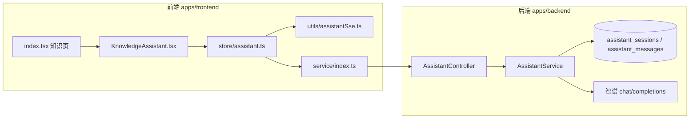

# 知识库右侧 Assistant AI 助手：完整实现说明

本文是知识编辑页 **右侧通用助手**（智谱 GLM、独立于主站 Chat）的 **完整** 实现说明：产品语义、前后端数据流、接口与表结构、MobX 状态机、SSE 协议、未保存草稿（ephemeral）、保存迁入（import-transcript）、清空/删除边界，以及 UI 与可观测性细节。实现代码以仓库当前版本为准；阅读时可对照下列路径跳转。

**相关文档**：持久化与数据落点的专题摘要仍保留在 `knowledge-assistant-ephemeral-persistence.md`（可与本文对照）；**以本文为权威总览**。

**问题修复记录**：

- `knowledge-assistant-streaming-across-documents.md`：修复「流式输出时切换文档再切回」导致只剩“思考中...”与停止的问题（前端状态机按文档隔离 + 稳定 key + 回调绑定）。
- `knowledge-assistant-streaming-across-documents.md`：修复「首次保存时若仍在流式：保存不应终止流式，且不应绑定不完整会话」的问题（延迟迁入 pendingEphemeralFlush，流式结束后再 flush）。

---

## 目录

1. [功能边界与术语](#1-功能边界与术语)
2. [系统架构一览](#2-系统架构一览)
3. [数据库与知识模块联动](#3-数据库与知识模块联动)
4. [后端：路由、DTO、服务逻辑](#4-后端路由dto服务逻辑)
5. [前端：页面编排与 documentKey](#5-前端页面编排与-documentkey)
6. [前端：assistantStore 状态机](#6-前端assistantstore-状态机)
7. [前端：SSE 消费协议 streamAssistantSse](#7-前端sse-消费协议-streamassistantsse)
8. [前端：KnowledgeAssistant UI 层](#8-前端knowledgeassistant-ui-层)
9. [HTTP 封装与类型](#9-http-封装与类型)
10. [关键时序与竞态](#10-关键时序与竞态)
11. [工程细节与约束](#11-工程细节与约束)
12. [文件索引](#12-文件索引)
13. [快捷卡片与 extraUserContentForModel](#13-快捷卡片与-extrausercontentformodel用户短句--模型长上下文)

---

## 1. 功能边界与术语

### 1.1 与主聊天（ChatBot）的隔离

| 维度          | 知识库助手                                                        | 主站 Chat                        |
| ------------- | ----------------------------------------------------------------- | -------------------------------- |
| HTTP 路径前缀 | `/assistant/*`                                                    | `/chat/*` 等                     |
| 流式消费      | `streamAssistantSse`（`apps/frontend/src/utils/assistantSse.ts`） | `streamFetch` 等                 |
| 服务端服务    | `AssistantService`                                                | `ChatService` / `GlmChatService` |
| 会话存储      | `assistant_sessions` / `assistant_messages`                       | 主会话消息表与缓存体系           |

二者 **不共享 sessionId**，避免混用。

### 1.2 术语表

| 术语                                     | 含义                                                                                                                                                                    |
| ---------------------------------------- | ----------------------------------------------------------------------------------------------------------------------------------------------------------------------- |
| **documentKey**                          | 传给 `KnowledgeAssistant` 的字符串，格式为 `{assistantArticleBinding}__trash-{trashOpenNonce}`，用于区分「同一逻辑草稿在不同 UI nonce 下」的助手实例。                  |
| **assistantArticleBinding**              | `index.tsx` 中 `useMemo`：`knowledgeTrashPreviewId` 存在时为 `__knowledge_trash__:{行id}`，否则为 `knowledgeEditingKnowledgeId ?? 'draft-new'`。                        |
| **bindingId**                            | `knowledgeArticleBindingFromDocumentKey(documentKey)`：去掉 `__trash-*` 后缀后传给后端的「按文章查会话」标识（可为正式 UUID、`draft-new`、或回收站前缀串）。            |
| **canonicalKey**                         | `assistantStore` 内部对 `documentKey` 规范化后的键：**`__trash-*` 前缀之前** 的条目标识；**`stateByDocument` / `sessionByDocument` / `activeSessionByDocument` / `sessionsByDocument` 均按 canonicalKey 分桶**，切换 trash nonce 不丢对话。 |
| **activeSessionByDocument**              | 文档 canonical → **当前 UI 选中的 `sessionId`**；持久化下 **`messages` / `abortStream` / `isSending`** 等 getter 指向 **`stateBySession[activeSid]`**（见 §6.7、§6.12）。 |
| **knowledgeAssistantPersistenceAllowed** | `assistantStore` 布尔：为 `false` 表示 **未保存云端草稿**，走 ephemeral，不落库。                                                                                       |
| **Ephemeral**                            | SSE body `ephemeral: true` + `contextTurns` + `content`；可选 `extraUserContentForModel`（仅拼进发给模型的 user 句，不落库）；不传 `sessionId` / `knowledgeArticleId`。 |
| **extraUserContentForModel**             | 可选字符串：与 `content` 换行拼接后仅用于 **本轮** 智谱请求；**不**写入 `assistant_messages`，气泡与落库 user 正文仍为短 `content`（见 §13）。                          |
| **Flush / import-transcript**            | 首次保存成功后，把内存 `messages` 打成 `lines` 写入 `POST /assistant/session/import-transcript`。                                                                       |

---

## 2. 系统架构一览



---

## 3. 数据库与知识模块联动

### 3.1 表结构（TypeORM 实体）

- **`assistant_sessions`**（`assistant-session.entity.ts`）
  - `id`：UUID 主键，即前端 **`sessionId`**。
  - `user_id`：归属用户。
  - `knowledge_article_id`：与知识条目的 **逻辑绑定键**（可为云端知识 UUID、`__knowledge_trash__:回收站行id` 等，与前端 `bindingId` 对齐）。
  - `title` / `created_at` / `updated_at`。

- **`assistant_messages`**（`assistant-message.entity.ts`）
  - `session_id` → 会话外键，`onDelete: CASCADE`。
  - `role`：`user` / `assistant` / `system`。
  - `turn_id`：同一轮用户+助手共用，支持流式占位后 UPDATE 正文。
  - `content`：`longtext`。

### 3.2 删除知识时的清理

`KnowledgeService.remove`（`knowledge.service.ts`）在事务中：

1. 写入 `knowledge_trash` 快照；
2. **`assistantSessionRepo.delete({ knowledgeArticleId: row.id })`**：删除绑定该知识 UUID 的助手会话（消息随 CASCADE）；
3. 删除 `knowledge` 主表行。

因此删除后前端若仍持旧 `sessionId` 拉详情或点停止，后端对 **`getSessionDetail`** / **`stopStream`** 做了 **幂等软处理**（见 §10.3），避免 404 Toast。

---

## 4. 后端：路由、DTO、服务逻辑

### 4.1 控制器 `AssistantController`

路径：`apps/backend/src/services/assistant/assistant.controller.ts`。

- 全局 **`JwtGuard`**：所有路由需登录。
- **`ClassSerializerInterceptor`**：响应序列化（Date → ISO 等）。

**路由注册顺序（重要）**：`POST session/import-transcript` 与 `GET session/for-knowledge` 必须写在 **`GET session/:sessionId`** 之前，否则路径会被 `:sessionId` 误匹配为字面量 `import-transcript` / `for-knowledge`。

| 方法  | 路径                                              | 作用                                                                            |
| ----- | ------------------------------------------------- | ------------------------------------------------------------------------------- |
| POST  | `/assistant/session`                              | 创建空会话；可带 `knowledgeArticleId` 绑定或复用最近会话。                      |
| POST  | `/assistant/session/import-transcript`            | 迁入草稿对话。                                                                  |
| GET   | `/assistant/sessions`                             | 分页会话列表。                                                                  |
| GET   | `/assistant/session/for-knowledge`                | 按 `knowledgeArticleId` 查最近会话+消息；无则 `data: null`。                    |
| GET   | `/assistant/session/:sessionId`                   | 按 sessionId 拉详情；会话已删则返回 `session: null, messages: []`（HTTP 200）。 |
| PATCH | `/assistant/session/:sessionId/knowledge-article` | 改绑 `knowledgeArticleId`。                                                     |
| POST  | `/assistant/sse`                                  | **Sse**：流式问答；body 为 `AssistantChatDto`。                                 |
| POST  | `/assistant/stop`                                 | 停止流式；会话已删则成功返回，不抛「会话不存在」。                              |

**SSE 包装**：`chatSse` 将 `chatStream` 的 chunk `map` 为 `{ data: { type, content?, raw?, done } } }`，末尾 `concat` 一条 `{ done: true }`；`catchError` 把异常转成 `data.error` + `done: true`，避免 Observable 断链导致前端挂死。

### 4.2 DTO 要点

- **`AssistantChatDto`**（`assistant-chat.dto.ts`）
  - `sessionId?`、`knowledgeArticleId?`、`ephemeral?`、`contextTurns?`、`content`（必填）、`maxTokens?`、`temperature?`。
  - **`ephemeral === true`** 时与 `sessionId` / `knowledgeArticleId` **互斥**，校验失败抛 `BadRequestException`。
  - `contextTurns`：多轮历史；**不含**本轮用户句——本轮由 **`content`** 表达；服务端 `buildEphemeralTurns` 会拼接为完整 turns 再送智谱。

- **`ImportAssistantTranscriptDto`**（`import-assistant-transcript.dto.ts`）
  - `knowledgeArticleId`：保存后的知识 id。
  - `lines`：最多 200 条，`user`/`assistant` 角色；超长时客户端提交 **按时间升序的最近 200 条**（`slice(-200)`）。

- **`AssistantStopDto`**：`sessionId`。

### 4.3 `AssistantService.chatStream` 分支摘要

路径：`apps/backend/src/services/assistant/assistant.service.ts`。

**A）`dto.ephemeral === true`**

1. 校验互斥字段。
2. **`runEphemeralChatStream`**：`buildEphemeralTurns` → token budget 裁剪 → 组装 `system + 历史` → `fetch` 智谱流式 → `parseGlmStreamData` → `subscriber.next`。
3. **不写** `assistant_sessions` / `assistant_messages`，**不**使用 Redis `streamBusyKey` / epoch（与持久化流区分）。

**B）持久化路径（`ephemeral` 非 true）**

1. 解析或创建 `AssistantSession`（`sessionId` 优先；否则 `knowledgeArticleId` 查最近；再无则新建并写 `knowledgeArticleId`）。
2. **`insertUserAndAssistantPlaceholder`**：事务内插入本轮 user + assistant 占位（`turnId` 一致）。
3. **`loadMessagesForSessionContext` + `buildTurnsForContext`**：从 DB 构建多轮上下文（流式中空助手可省略正文）。
4. **`incrementStreamEpoch` + cache.set(streamBusyKey)`**：多实例下抢占/中止同会话旧流。
5. 智谱流式读取循环中比对 epoch，必要时 **abort** 本地 fetch。
6. 正常结束 **`finalizeTurn`**（UPDATE 助手正文）；异常 **`cleanupTurnOnFailure`**（有则写部分，无则删 turn 对）。

### 4.4 `importTranscript`

1. `findLatestSessionIdByKnowledgeArticle(userId, articleId)`。
2. 无则 **新建** `AssistantSession` 并设 `knowledgeArticleId = articleId`；有则 **删光**该 session 下消息再插入。
3. 按 `lines` 扫描：**必须以 `user` 行开启一轮**；每条 user 后可选一条 `assistant`；写入 `turnId` 成对。
4. 更新 session `title`：取 **本批 `lines` 中** 首条有正文的 `user` 内容前 60 字（客户端超长时只提交最近 200 条，则标题对应该窗口内最早一轮用户句，而非整段草稿绝对首条）。
5. 返回 `{ sessionId, inserted }`。

### 4.5 `getSessionDetail` / `stopStream`（删除知识后的幂等）

- **`getSessionDetail`**：若会话行不存在，返回 **`{ session: null, messages: [] }`**（仍 200），避免前端 http 层对 404 弹 Toast。
- **`stopStream`**：若会话不存在，返回 **`{ success: true, message: '会话已不存在，无需停止' }`**；存在则读 Redis busy，无 busy 则「当前无进行中的生成」，有则 `incrementStreamEpoch` 通知读循环 abort。

---

## 5. 前端：页面编排与 documentKey

文件：`apps/frontend/src/views/knowledge/index.tsx`。

### 5.1 `assistantArticleBinding` 与 `documentKey`

摘录自 `apps/frontend/src/views/knowledge/index.tsx`（`assistantArticleBinding` 的 `useMemo` 定义）：

```tsx
/** 助手 / Monaco 文档维度的条目标识：回收站预览用独立前缀，避免多条均落在 draft-new 下同一会话 */
const assistantArticleBinding = useMemo(() => {
	if (knowledgeStore.knowledgeTrashPreviewId != null) {
		return `__knowledge_trash__:${knowledgeStore.knowledgeTrashPreviewId}`;
	}
	return knowledgeStore.knowledgeEditingKnowledgeId ?? "draft-new";
}, [
	knowledgeStore.knowledgeTrashPreviewId,
	knowledgeStore.knowledgeEditingKnowledgeId,
]);
```

- **回收站预览**：`knowledgeEditingKnowledgeId` 常为 `null`，用 **`__knowledge_trash__:{trashRowId}`** 与列表中正式 UUID 区分，使助手历史不串。
- **正式编辑**：binding 为云端 **`knowledgeEditingKnowledgeId`**（UUID）。
- **新建未保存**：binding 为字面量 **`draft-new`**。

`KnowledgeAssistant` 接收的 **`documentKey`** 为：

```text
`${assistantArticleBinding}__trash-${trashOpenNonce}`
```

**含义**：`trashOpenNonce` 在打开回收站条目等场景递增，用于 **同一 binding 下强制换「助手会话槽」**，避免 UI 状态与旧会话纠缠；**勿与** `clearDocumentNonce` 混用——后者仅驱动 Monaco `documentIdentity`，避免清空草稿时误 bump `trashOpenNonce` 导致助手被意外重置（注释见 `resetEditorToNewDraft`）。

### 5.2 保存知识：`persistKnowledgeApi` / `persistKnowledgeApiSaveAs`

新建成功分支（节选逻辑说明，非全文件）：

1. `saveKnowledge` → `articleId = res.data.id`。
2. `fromKey` / `toKey` 与上式 `documentKey` 规则一致。
3. **`!knowledgeAssistantPersistenceAllowed`** 时 **`await flushEphemeralTranscriptIfNeeded(articleId, fromKey, toKey)`**（须 **早于** `setKnowledgeEditingKnowledgeId`，否则 `activate` 可能拉空库覆盖内存草稿）。
4. `remapAssistantSessionDocumentKey`；`setKnowledgeEditingKnowledgeId`；若有 `sid` 再 **`patchAssistantSessionKnowledgeArticle`** 做幂等改绑。

### 5.3 清空草稿：`resetEditorToNewDraft`

顺序：`clearDocumentNonce++` → **`knowledgeStore.clearKnowledgeDraft()`** → 计算 **`nextAssistantDocumentKey = knowledgeAssistantDocumentKey(knowledgeAssistantArticleBinding(...), trashOpenNonce)`** → **`assistantStore.clearAssistantStateOnKnowledgeDraftReset(nextAssistantDocumentKey)`**。

**原因**：未保存草稿清空后 `documentKey` 往往仍为 `draft-new__trash-*`，`KnowledgeAssistant` 内 **`useEffect([documentKey, ...])` 不会**重跑；必须 **显式** 清助手内存态（含 ephemeral）。**传入 `nextAssistantDocumentKey`**：在 **`activeDocumentKey` 已与 props 对齐** 且 **`editorHasBody === false`** 时，组件侧会 **短路 `activateForDocument`**（见 §8.0.1），避免二次清空或误拉 `draft-new` 会话。

---

## 6. 前端：assistantStore 状态机

文件：`apps/frontend/src/store/assistant.ts`。本节与当前类实现 **逐行对齐**：核心是 **按「规范化文档键 canonicalKey」隔离每篇文档的运行态**，**切换文档不中断其它文档的 SSE**；`activeDocumentKey` 仅表示 **当前 UI 指针**（可为带 `__trash-*` 后缀的完整 `documentKey`）。

### 6.1 导出形态：`AssistantStoreApi` 与默认实例

- **`AssistantStore`**：MobX `makeAutoObservable` 的具体类，含 `private` 成员（`canonicalKey`、`ensureState`、`ensureSessionState`、`activeState`、`stateBySession`、`fetchSessionMessagesForDocumentKey` 等）。
- **`AssistantStoreApi`**：对外 **仅暴露公开 API 的 interface**，避免 `useStore()` 等处的导出类型把 **private 成员** 带进匿名类类型，触发 **TS4094**。
- **`const _assistantStore = new AssistantStore()`**，再 **`export const assistantStore: AssistantStoreApi = _assistantStore`** 与 **`export default assistantStore`**：`KnowledgeAssistant` 使用默认导出即可。

### 6.2 双键模型：`activeDocumentKey` vs `canonicalKey(documentKey)`

- **`knowledgeArticleBindingFromDocumentKey(documentKey)`**（模块级）：若 `documentKey` 含子串 **`__trash-`**，则取 **该子串之前** 的前缀并 `trim()`；否则整串 `trim()`。用于 **后端按文章查会话**、**状态桶 key** 等「稳定条目标识」。
- **`canonicalKey(raw)`**（类 `private`）：对入参 `trim()`；若为空返回 `''`；否则 **`knowledgeArticleBindingFromDocumentKey(raw) || raw`**。  
  **`stateByDocument` / `sessionByDocument` 一律以 canonicalKey 为键**，这样 `draft-new__trash-A` 与 `draft-new__trash-B` 共享同一运行态，避免切换回收站视图 nonce 时对话丢失或重复 hydrate。
- **`activeDocumentKey`**：`activateForDocument` 写入的是 **调用方传入的 `nextKey`（trim 后）**，**不**剥 `__trash-*`。因此「当前 props 的 `documentKey`」与 MobX 里 active 指针一致，便于 `ensureSessionForCurrentDocument` 里用 **`knowledgeArticleBindingFromDocumentKey(key)`** 得到绑定 id。

### 6.3 每文档状态：`stateByDocument` 与 `sessionByDocument`

**`private stateByDocument: Record<canonicalKey, { ... }>`** 每个桶包含：

| 字段 | 说明 |
| --- | --- |
| `sessionId` | 该文档持久化会话 id；ephemeral 阶段多为 `null`。 |
| `messages` | 该文档下的 `Message[]`；与当前 UI 是否聚焦无关，**切走文档后仍保留**（含流式中）。 |
| `isHistoryLoading` / `isSending` / `loadError` / `abortStream` | 该文档桶内的请求与流式句柄。 |
| `historyHydrated` | **已为该文档尝试过**「拉服务端历史 / 判定无会话」；为 `true` 时 **`activateForDocument` 不再重复请求**（避免频繁 effect 打爆接口）。 |
| `pendingEphemeralFlush` | 首次保存时若仍在流式：**延迟迁入** 任务 `{ cloudArticleId, fromDocumentKey, toDocumentKey }`；挂在 state 上以便 **`remapAssistantSessionDocumentKey` 时随 state 迁移**。 |

**`sessionByDocument: Record<canonicalKey, string>`**：canonicalKey → sessionId 的内存缓存；换篇后其它 key 的映射仍保留。

**`private get activeState()`**：`ensureState(this.activeDocumentKey)`——注意参数是 **可能含 trash 后缀的 activeDocumentKey**；`ensureState` 内部会先 **`canonicalKey(documentKey)`** 再取桶。

**只读 getter**（`sessionId`、`messages`、`isHistoryLoading`、`isSending`、`loadError`、`abortStream`）均代理 **`activeState`**，因此 UI 永远读写 **当前 active 文档桶**。

**`get isStreaming()`**：`this.messages.some(m => m.isStreaming)`，仅看 **当前 active 文档**。

### 6.4 全局标志：`knowledgeAssistantPersistenceAllowed`

- 默认 **`true`**。
- **`setKnowledgeAssistantPersistenceAllowed`**：`runInAction` 写入布尔。
- **`sendMessage`** 内 **`ephemeral = !this.knowledgeAssistantPersistenceAllowed`**：为 `true` 时走持久化（`sessionId` + 落库）；为 `false` 时走 **`streamAssistantSse` 的 `ephemeral: true`** + `contextTurns`，**不传 `sessionId`**。

### 6.5 模块级工具函数（避免 TS4094 + 与后端上限对齐）

与 §6.1 同理，下列函数放在 **类外**（不作为 `private` 方法导出）：

- **`readToken()`**：`localStorage.getItem('token')`（无 `window` 时返回 `''`）。
- **`mapApiMessagesToUi(rows)`**：过滤 `role` 为 `user`/`assistant`；映射为 `Message`（`id`/`chatId` 用服务端 `id`，`isStreaming: false`）。
- **`knowledgeArticleBindingFromDocumentKey`**：见 §6.2。
- **`buildImportTranscriptLinesFromMessages(messages)`**：逐条收集 user/assistant 的 `content`；**`lines.slice(-200)`** 与 `ImportAssistantTranscriptDto` 的 `@ArrayMaxSize(200)` 对齐（**时间顺序保留，取末尾窗口**）。
- **`buildEphemeralContextTurnsFromMessages(messages)`**：同上角色过滤；**跳过** `assistant && isStreaming && !(content).trim()` 的空占位；结果 **`slice(-120)`** 与 ephemeral `contextTurns` 上限对齐。

### 6.6 `isStreamingForDocumentKey` / `scheduleEphemeralFlushAfterStreaming`

- **`isStreamingForDocumentKey(documentKey)`**：对参数做 `canonicalKey`，若桶存在则 **`messages.some(m => m.isStreaming)`**。供知识保存逻辑判断「是否应延迟迁入」。
- **`scheduleEphemeralFlushAfterStreaming(cloudArticleId, fromDocumentKey, toDocumentKey)`**：对 **`fromDocumentKey`** 取 `ensureState` 后 `runInAction`：设置 **`pendingEphemeralFlush`**，并 **`historyHydrated = true`**。含义：保存后即将允许持久化，若立刻按文章拉历史会得到 **空会话**，易覆盖 UI；先标 hydrated，等 **流式结束** 后在 `onComplete` 里 **`flushEphemeralTranscriptIfNeeded`**。

### 6.7 `activateForDocument(documentKey)`（当前实现逐步，多会话版）

**不**在入口处 `abortStream`、**不**清空消息——换文档只 **切换指针并确保桶存在**，其它文档上的 SSE 继续跑。持久化模式下 **消息与会话指针** 以 **`stateBySession[sessionId]`** + **`activeSessionByDocument` / `sessionByDocument`** 为主；`stateByDocument` 仍承载 **`historyHydrated` / `isHistoryLoading`（文档级）** 等。

1. `nextKey = (documentKey ?? '').trim()`；空则 return。
2. `docKey = this.canonicalKey(nextKey)`。
3. **`runInAction`**：`this.activeDocumentKey = nextKey`；**`this.ensureState(docKey)`**。
4. `const state = this.ensureState(docKey)`（文档级：去重、hydrate 标记等）。
5. 若 **`!this.knowledgeAssistantPersistenceAllowed`**：return（ephemeral，不请求后端）。
6. 若 **`!readToken()`**：return。
7. 若 **`state.isHistoryLoading === true`**：return（并发去重，避免 effect 二次触发时重复打 `for-knowledge` / 详情）。
8. 若 **`state.historyHydrated === true`**：return。
9. `bindingId = knowledgeArticleBindingFromDocumentKey(nextKey)`。
10. **`sid`** 初值：**`this.activeSessionByDocument[docKey] ?? this.sessionByDocument[docKey] ?? null`**（用户上次在该文选中的会话优先）。
11. 若 **尚无 `sid`** 且 **`bindingId`** 非空：走 **`GET /assistant/session/for-knowledge`**（最近会话 + 消息）；成功则写入 **`sessionByDocument` / `activeSessionByDocument`**，并把消息灌入 **`ensureSessionState(sid).messages`**；`finally` 里 **`state.historyHydrated = true`**、**`state.isHistoryLoading = false`**；return。
12. 若无 **`bindingId`**：`historyHydrated = true`；return。
13. 若 **已有 `sid`**：`runInAction` 同步 **`sessionByDocument[docKey]`** 与 **`activeSessionByDocument[docKey]`**；取 **`ensureSessionState(sid)`**；若该会话 **已有消息 / 正在发送 / 正在拉历史** 则仅 **`historyHydrated = true`** 并 return；否则 **`getAssistantSessionDetail(sid)`** 拉全量消息写入 **`sstate.messages`**；异常时清理映射与消息；**`finally`** 置 **`sstate.isHistoryLoading = false`**、**`state.historyHydrated = true`**。

> **不在此函数内** 调用 **`GET /assistant/sessions/for-knowledge`**。全量会话列表由 **`refreshSessionListForCurrentDocument`**（如历史抽屉 `useEffect`）、**`ensureSessionForCurrentDocument` 成功后的异步刷新**、**`sendMessage` 内发起 SSE 后的异步刷新** 维护，见 `knowledge-assistant-multi-session-frontend-implementation.md`。

### 6.8 `remapAssistantSessionDocumentKey(fromKey, toKey)`

`from`/`to` 为 **`canonicalKey(fromKey)`** / **`canonicalKey(toKey)`**。若缺失或 `from === to`：仅当 **`activeDocumentKey === fromKey`** 时把 **`activeDocumentKey` 改为 `toKey`**（无前缀迁移需求时）。否则 **`runInAction`**：迁移 **`sessionByDocument`** 与 **`stateByDocument`** 中 `from` → `to` 的条目并删除 `from`；若 **`activeDocumentKey === fromKey`** 则 **`activeDocumentKey = toKey`**。

### 6.9 `clearAssistantStateOnKnowledgeDraftReset(syncActiveDocumentKey?, options?)`

用于 **`documentKey` 不变**（如仍为 `draft-new__trash-*`）但左侧已清空草稿的场景：`useEffect([documentKey])` **不会**再触发 `activate`，必须 **显式** 清助手。

1. `rawKey = this.activeDocumentKey`，`key = canonicalKey(rawKey)`，`state = key ? ensureState(key) : null`：
   - `prevSid = state?.sessionId ?? null`（持久化会话停止句柄）
   - `prevStreamId = state.ephemeralStreamId ?? null`（ephemeral（不落库）流式停止句柄，见 §7.3）
2. **`state?.abortStream?.()`**，并 **`state.abortStream = null`**。
3. **`runInAction`**：若 `key` 存在则 **`delete stateByDocument[key]`**、**`delete sessionByDocument[key]`**；若传入 **`syncActiveDocumentKey?.trim()`** 则 **`activeDocumentKey = next`** 并 **`ensureState(next)`**（避免后续 getter 空引用）。
4. 若 **`options?.stopBackend === true`**：按“可用句柄”停止后端流（可选：显式要求时才通知后端停流）：
   - 若 `prevSid` 存在：`stopAssistantStream({ sessionId: prevSid })`
   - 否则若 `prevStreamId` 存在：`stopAssistantStream({ streamId: prevStreamId })`

> 说明：清空内容/新建草稿的默认语义是“本地重置编辑态”，只需要 **中止前端 SSE** 并清理内存状态；不应默认调用后端 `/assistant/stop`，否则会把“清空内容”误变成“停止生成”。

### 6.10 `fetchSessionMessages` / `fetchSessionMessagesForDocumentKey`

- **`fetchSessionMessages()`**：取 **`this.activeDocumentKey`**，调用 **`fetchSessionMessagesForDocumentKey(key)`**。
- **`fetchSessionMessagesForDocumentKey(documentKey)`**（`private`，**偏单会话时代遗留**）：
  - `key = canonicalKey(documentKey)`；`state = ensureState(key)`（**文档桶**）。
  - 若 **`!state.sessionId`**：**直接 return**（多会话持久化路径下会话指针在 **`sessionByDocument` / `activeSessionByDocument`**，文档桶 **`state.sessionId`** 常保持 **null**，故该方法往往 **无操作**）。
  - 否则 **`await getAssistantSessionDetail(state.sessionId)`**。
  - 若 **`!payload?.session`**：**`runInAction`** **`delete sessionByDocument[key]`**、**`delete stateByDocument[key]`**（与 §4.5、§10.3 对齐）。
  - 若有 **`payload.messages`**：**`runInAction`** 写入 **`state.messages`**（文档桶；**与当前 UI 主数据源 `stateBySession` 可能不一致**——持久化对齐应以 **`sendMessage` onComplete**、**`activateForDocument`**、**`switchSessionForCurrentDocument`** 内的 **`getAssistantSessionDetail(sid)`** 为准）。

**多会话真相源（持久化、已登录）**：**`activeSessionByDocument[canonical]`** → **`ensureSessionState(sid).messages`**；全量元数据列表见 **`sessionsByDocument`** 与 **`refreshSessionListForCurrentDocument`**（详见 `knowledge-assistant-multi-session-frontend-implementation.md`）。

### 6.11 `flushEphemeralTranscriptIfNeeded` / `ensureSessionForCurrentDocument`

- **`flushEphemeralTranscriptIfNeeded(cloudArticleId, fromDocumentKey, toDocumentKey)`**：无 token 则 return。`from`/`to` 为 canonical；**`sourceState`** 从 **`stateByDocument[from] ?? stateByDocument[to] ?? ensureState(fromDocumentKey)`** 取。**`createAssistantSession({ knowledgeArticleId, forceNew: true })`** + **`importAssistantTranscript`**（可带 **`sessionId`**）迁入；成功后 **`sessionByDocument[to]`**、**`activeSessionByDocument[to]`**、**`ensureSessionState(sid).messages`** 与 **`toState.historyHydrated`** 等；并 **`void refreshSessionListForCurrentDocument()`**。
- **`ensureSessionForCurrentDocument()`**：若不允许持久化 return `null`；无 token / 无 **`activeDocumentKey`** 则 Toast 并 return；若 **`activeSessionByDocument[canonical]`** 已有则直接返回该 **`sessionId`**；否则 **`createAssistantSession`**（可带 **`knowledgeArticleId`**，**不传 `forceNew`** 以复用后端「最近会话」语义）；成功后写入 **`sessionByDocument` / `activeSessionByDocument`**、**`ensureSessionState(created)`**，并 **`void refreshSessionListForCurrentDocument()`**。

### 6.12 `sendMessage(raw?, options?)`

1. **`documentKey = activeDocumentKey.trim()`**；空则 Toast「文档未就绪」。
2. **`canonical = canonicalKey(documentKey)`**，**`docState = ensureState(canonical)`**；**`ephemeral = !knowledgeAssistantPersistenceAllowed`**。
3. **`text = (raw ?? '').trim()`**；空则 return。
4. **`extraUserContentForModel = options?.extraUserContentForModel?.trim()`**（可选）。
5. 非 ephemeral：**`sid = await ensureSessionForCurrentDocument()`**，失败 return。ephemeral：无 token Toast 后 return。
6. **关键**：**`state = ephemeral ? docState : this.ensureSessionState(sid!)`**；再判断 **`state.isSending || state.isHistoryLoading`** 则 return（互斥粒度为 **会话级**，支持多会话并发）。
7. **`contextTurns = ephemeral ? buildEphemeralContextTurnsFromMessages(state.messages) : undefined`**（在 push **之前** 快照历史）。
8. **`state.abortStream?.()`** 并 **`runInAction`** 清空 **`state.abortStream`**（仅打断 **当前 active 会话** 上一轮 SSE，其它 `sessionId` 的流式不受影响）。
9. **`userChatId` / `assistantChatId`**：`uuidv4()`；**`runInAction`**：`state.isSending = true`；`push` user 与 assistant 占位（**`isStreaming: true`**）。
10. **`applyAssistantPatch`**：按 **`assistantChatId`** 替换 **`state.messages[idx]`** 元素。
11. **`await streamAssistantSse`**：ephemeral 带 **`ephemeral: true` + `contextTurns`**；持久化带 **`sessionId: sid`**。
12. 返回的 **`abort`** 赋 **`state.abortStream`**；非 ephemeral 时 **`void refreshSessionListForCurrentDocument()`**（异步刷新会话列表）。
13. **`onComplete(err)`**：
    - **`userAborted`**：`err === ASSISTANT_SSE_USER_ABORT_MARKER` 时不把哨兵当业务错误。
    - **`runInAction`**：收尾 **`isSending`**、助手 **`isStreaming: false`**。
    - **`pendingEphemeralFlush`**：仍在 ephemeral 且当前 **`state`** 无流式时 **`flushEphemeralTranscriptIfNeeded`**。
    - 若 **无 err 且非 ephemeral**：**`getAssistantSessionDetail(sid)`**，且 **`payload.session.sessionId === sid`** 时才覆盖 **`state.messages`**（**禁止**用 **`activeSessionId`** 拉别的会话，防并发串写）。
14. **`onError`** / 外层 **`catch`**：收尾发送态与占位；**`pendingEphemeralFlush = null`**（错误不自动迁入）。

### 6.13 `stopGenerating`

1. **`this.abortStream?.()`** 然后 **`this.abortStream = null`**（注释：**先**断 SSE，避免 await **`stopAssistantStream`** 期间仍 apply delta 导致 `...prev` 仍 `isStreaming: true`）。
2. **`runInAction`**：**`this.isSending = false`**（走 active getter）；**`this.messages = this.messages.map(m => m.isStreaming ? { ...m, isStreaming: false, isStopped: true } : m)`**（**替换数组**保证切换/映射时 UI 一致）。
3. **停止后端生成**：
   - **持久化会话**：`const sid = this.sessionId`；有则 **`await stopAssistantStream({ sessionId: sid })`**（失败忽略）。
   - **ephemeral（不落库）**：无 `sid` 时尝试读取 `activeState.ephemeralStreamId`，若存在则 **`await stopAssistantStream({ streamId })`**（失败忽略）。

### 6.14 修复：点击「停止」不再清空已接收流式正文（停止后只剩「思考中」问题）

#### 6.14.1 现象与调用链

在知识库助手里点击「停止」时，前端会依次发生：

- 先 **中止 SSE（Server-Sent Events，服务器推送事件）**：`abortStream()` → `AbortController.abort()`
- 再调用后端停止接口：`/api/assistant/stop`
- 随后某些逻辑会继续调用会话详情：`/api/assistant/session/:sessionId`

问题表现为：**前端界面上已经接收到的 assistant 正文被清空/回退**，只剩下思考区（`thinkContent`）或「思考中」占位，导致用户误以为没有输出。

#### 6.14.2 根因（为什么会“停止后被覆盖”）

核心原因是「用户主动停止」在旧实现里被当作「正常完成且无错误」处理，从而触发了“用服务端会话对齐覆盖本地消息”的逻辑：

- `streamAssistantSse` 在捕获到 `AbortError`（用户停止导致）时会调用 `finish()`。
- `finish()` 默认会 `onComplete()` **不带参数**，于是 `onComplete(err)` 里的 `err === undefined`。
- `sendMessage` 的 `onComplete` 里有「`!err && !ephemeral` 时拉会话详情并覆盖本地 messages」的逻辑。
- **停止瞬间后端往往还没把本轮 assistant 的流式片段落库**（或只落库了部分），会话详情返回的 messages 比本地已累积的短。
- 自然完成分支会用 **`getAssistantSessionDetail(sid)`** 返回的 messages **整表替换** **本会话** `state.messages`（`state` 为 **`ensureSessionState(sid)`**），若误判为“无 err 的成功完成”，会在服务端尚未落库本轮 assistant 时用**更短**的服务端列表覆盖本地已累积正文。

一句话：**“用户停止”被误判为“成功完成” → 触发详情拉取并对齐 messages → 用未落库/不完整的服务端历史覆盖了本地已生成内容。**

#### 6.14.3 修复策略（不影响现有功能的前提）

我们需要在“用户主动停止”与“正常完成”之间做出可区分的信号，并保证：

- **正常完成**（`done === true` 或流自然结束）仍会对 **闭包捕获的 `sid`** 调用 **`getAssistantSessionDetail`**，且在 **`payload.session.sessionId === sid`** 时才覆盖 **`state.messages`**，保持与服务端一致并避免多会话并发串写。
- **用户停止**（`AbortError`）不再触发上述对齐覆盖（对齐数据很可能不完整），从而保留本地已接收正文。

实现上采用 **哨兵值（sentinel，哨兵字符串）**：

- SSE 层在 `AbortError` 时 `onComplete(ASSISTANT_SSE_USER_ABORT_MARKER)`。
- Store 层识别到该哨兵后：
  - 不把它当成真实错误文案写到气泡里
  - 不走 “无 err → `getAssistantSessionDetail` 覆盖 messages” 的对齐路径

#### 6.14.4 关键实现代码（含详细中文注释）

**① SSE 层：为用户停止提供“可识别的完成原因”**

文件：`apps/frontend/src/utils/assistantSse.ts`

```ts
// 用户主动 `abort()` 时传给 `onComplete` 的哨兵值（非后端错误文案）。
// 业务侧应跳过「成功后拉会话对齐」等逻辑，避免服务端尚未落库时覆盖本地已生成片段。
export const ASSISTANT_SSE_USER_ABORT_MARKER =
	'__FRONT_ASSISTANT_SSE_USER_ABORT__';

// ...

} catch (err: unknown) {
	// 关键：AbortError 不是“正常完成”，它意味着用户点了停止。
	// 如果这里调用 finish()（不带参数），上层会误以为 err 为空，从而去拉 session 对齐并覆盖 UI。
	if (err instanceof DOMException && err.name === 'AbortError') {
		// 传入哨兵值，让上层能区分“用户停止”与“自然完成”
		finish(ASSISTANT_SSE_USER_ABORT_MARKER);
		return;
	}
	// 非 AbortError 才走真正的 onError（例如网络错误、解析异常等）
	const e =
		err instanceof Error ? err : new Error(String(err ?? '请求中断'));
	onError?.(e);
}
```

**② Store 层：识别“用户停止”，避免用服务端会话覆盖本地已接收正文**

文件：`apps/frontend/src/store/assistant.ts`

```ts
import {
	ASSISTANT_SSE_USER_ABORT_MARKER,
	streamAssistantSse,
} from '@/utils/assistantSse';

// ...

onComplete: async (err) => {
	// 是否为“用户主动停止”的哨兵值
	const userAborted = err === ASSISTANT_SSE_USER_ABORT_MARKER;

	runInAction(() => {
		state.isSending = false;
		const idx = state.messages.findIndex((m) => m.chatId === assistantChatId);
		if (idx >= 0) {
			const prev = state.messages[idx] as Message;
			const next: Message = {
				...prev,
				isStreaming: false, // 无论自然完成/失败/停止，都要结束流式态
			};

			// 关键：用户停止时 err 是哨兵值，不应当显示“生成失败：xxx”
			// 同时也不应当标记 isStopped（这里的 isStopped 语义是“失败/异常中止”）
			if (err && !userAborted) {
				next.content = next.content || `生成失败：${err}`;
				next.isStopped = true;
			}

			// 替换对象以确保 MobX 订阅与 UI 渲染稳定
			state.messages[idx] = next;
		}
	});

	state.abortStream = null;

	// ...（pendingEphemeralFlush 逻辑保持不变）

	// 关键：只有“真正无 err 的自然完成”才按本次 sid 拉详情对齐（禁止用 active 指针误绑其它会话）。
	if (!err && !ephemeral && sid) {
		try {
			const res = await getAssistantSessionDetail(sid);
			const payload = res.data;
			if (payload?.session?.sessionId === sid) {
				runInAction(() => {
					state.messages = mapApiMessagesToUi(payload.messages ?? []);
				});
			}
		} catch {
			// 忽略：界面已展示累积正文
		}
	}
},
```

#### 6.14.5 行为验证（预期结果）

- 点击「停止」后：
  - UI 中 **已经接收到的 assistant 正文仍保留**（不再被清空/回退）
  - 不会出现把哨兵值当作错误文案显示
  - 仍会调用 `/api/assistant/stop`（原有功能不变）
- 不点击停止、让流自然完成时：
  - 仍会在完成后对 **本次请求的 `sessionId`** 调用 **`getAssistantSessionDetail`** 与服务端落库历史对齐（多会话下不可用 `fetchSessionMessagesForDocumentKey` 误绑当前 UI 会话）

### 6.15 修复：避免重复请求 `/assistant/session/for-knowledge`（同一 knowledgeArticleId 连续请求两次）

#### 6.15.1 现象

在知识库页面进入/切换条目时，浏览器网络面板可观察到同一个接口在极短时间内被请求两次：

- `GET /api/assistant/session/for-knowledge?knowledgeArticleId=...`

这会带来：

- 无意义的重复网络开销
- 在慢网/高延迟下可能造成加载态抖动（第二次请求覆写第一次返回）

#### 6.15.2 根因（UI effect 自触发）

`KnowledgeAssistant.tsx` 使用 `useEffect` 触发 `activateForDocument(documentKey)`，其依赖数组包含 `assistantStore.activeDocumentKey`：

- `activateForDocument` 内部会写入 `activeDocumentKey`
- 写入会导致 effect **再次触发**
- 当 `editorHasBody === true` 时不会被短路，于是会对同一 `documentKey` 连续调用两次 `activateForDocument`
- `activateForDocument` 在首次请求开始后，旧实现没有“并发去重”，因此会发起两次 `for-knowledge` 请求

#### 6.15.3 修复策略（不改变 UI 依赖与现有时序）

为了不改动 UI 的依赖关系（避免引入新的边界/时序问题），修复放在 store 层：

- 当同一 canonical 文档桶已经进入 `isHistoryLoading === true`（说明正在拉历史/会话）时，后续重复的 `activateForDocument` 直接 `return`。
- 这样：
  - 第一次请求正常进行并写入 state
  - 第二次触发被“并发去重”拦截，不会再打接口

#### 6.15.4 关键实现代码（含详细中文注释）

文件：`apps/frontend/src/store/assistant.ts`

```ts
// 并发去重：UI 层 effect 可能因 `activeDocumentKey` 被写入而二次触发 activate。
// 若同一 canonical 文档正在拉取历史/会话，则直接复用进行中的结果，避免重复请求
// `/assistant/session/for-knowledge?knowledgeArticleId=...`。
if (state.isHistoryLoading) {
	return;
}
```

#### 6.15.5 行为验证（预期结果）

- 同一 `knowledgeArticleId` 在一次激活流程中只会请求一次 `for-knowledge`
- 历史 hydrate、session 绑定、UI 渲染逻辑保持不变

### 6.16 调整：清空内容（按钮/⌘⇧D）不再调用 `/api/assistant/stop`

#### 6.16.1 需求

点击「清空内容」或使用快捷键 **⌘⇧D** 会触发清空草稿逻辑。目标是：

- 清空内容时 **不要** 调用 `POST /api/assistant/stop`
- 但「停止生成」按钮的语义保持不变（仍应调用 stop）

#### 6.16.2 根因

知识页清空草稿会调用 store 的 `clearAssistantStateOnKnowledgeDraftReset`。
旧实现中该方法在清理本地状态后，会在末尾无条件（只要有 `prevSid`）调用：

- `stopAssistantStream(prevSid)` → `/api/assistant/stop`

因此“清空内容”的动作被绑定到了“停止生成”的后端语义上。

#### 6.16.3 修复策略

将 `clearAssistantStateOnKnowledgeDraftReset` 的“是否通知后端 stop”改为**显式可选**：

- 默认：仅中止前端 SSE + 清理内存 state（不调 stop）
- 需要时：调用方传 `{ stopBackend: true }`，才会调用 `/api/assistant/stop`

这样既满足“清空不 stop”，也保留未来特殊入口的扩展能力。

#### 6.16.4 关键实现代码（含详细中文注释）

文件：`apps/frontend/src/store/assistant.ts`

```ts
clearAssistantStateOnKnowledgeDraftReset(
	syncActiveDocumentKey?: string | null,
	options?: { stopBackend?: boolean },
): void {
	// ...（省略：中止前端 SSE、清理 stateByDocument/sessionByDocument、同步 activeDocumentKey 等）

	// 清空内容/新建草稿属于“本地重置编辑态”，只需要中断前端 SSE 并清理内存 state。
	// 若此处调用后端 stop，会导致“清空内容”也中止服务端生成，影响用户对停止语义的预期。
	// 如确有需要（例如某些入口希望清空时也停止服务端任务），可显式传入 `{ stopBackend: true }`。
	if (options?.stopBackend && prevSid) {
		void stopAssistantStream(prevSid).catch(() => {});
	}
}
```

#### 6.16.5 不受影响的功能点

- 「停止生成」按钮仍走 `stopGenerating()`，依然会调用 `/api/assistant/stop`
- 清空内容仍会立即中止前端 SSE，并清空本地消息/映射（避免气泡残留）

---

## 7. 前端：SSE 消费协议 `streamAssistantSse`

文件：`apps/frontend/src/utils/assistantSse.ts`。

### 7.1 传输层

- `POST BASE_URL + '/assistant/sse'`，`Authorization: Bearer` + `Content-Type: application/json`。
- `getPlatformFetch`：兼容 Tauri / 浏览器 fetch。
- `AbortController`：返回 `() => controller.abort()` 供停止。
- `AbortError`：用户点「停止」触发；会 `onComplete(ASSISTANT_SSE_USER_ABORT_MARKER)`（**哨兵值**），用于区分“用户停止”与“自然完成”，避免停止后用服务端历史覆盖本地已接收片段。

### 7.2 行协议（与主 Chat 不同）

按 **换行** 切分 buffer；只处理 **`data:` 前缀** 行；`JSON.parse` 后：

| `parsed` 字段                               | 处理                                            |
| ------------------------------------------- | ----------------------------------------------- |
| `error`（string）                           | `onComplete(error)` 并结束 readLoop。           |
| `done === true`                             | `onComplete()` 正常结束。                       |
| `type === 'thinking'`                       | 从 `raw` 或 `content` 取字符串 → `onThinking`。 |
| `type === 'meta'`                           | 解析 `raw.streamId`（string）→ `onMeta({streamId})`（ephemeral stop 句柄）。 |
| `type === 'usage'`                          | 忽略。                                          |
| `type === 'content'` 且 `content` 为 string | `onDelta(content)`。                            |

解析失败 Toast「助手流解析失败」并 **continue**（尽力容错）。

### 7.3 `streamId`（ephemeral 可停止句柄）的下发与消费

#### 7.3.1 需求与约束

知识库“新建未保存云端草稿”会走 `ephemeral=true`（不落库、无 `sessionId`）。为了让**清空内容/停止生成**也能停止后端侧模型流式，需要后端提供一个 **ephemeral stop 句柄**。

设计约束：

- **不影响原有** `sessionId` 停止语义（持久化会话仍用 `sessionId` stop）。
- `streamId` 仅用于**本次 ephemeral 流**，不落库；并按用户隔离（同一 `streamId` 仅能由所属用户 stop）。

#### 7.3.2 后端下发方式（SSE `meta` 事件）

后端在 `ephemeral=true` 的 SSE 开始阶段下发：

```json
{ "type": "meta", "raw": { "streamId": "uuid" } }
```

前端在 `streamAssistantSse` 里识别 `type === 'meta'`，并通过 `onMeta` 回调把 `streamId` 交给 store 保存。

#### 7.3.3 前端落地：store 记录并用于 stop

文件：`apps/frontend/src/store/assistant.ts`（简化示意，含中文注释）

```ts
// ephemeral：后端下发的可 stop 句柄（streamId）
state.ephemeralStreamId = null;

const abort = await streamAssistantSse({
  body: { ephemeral: true, content: text, contextTurns },
  callbacks: {
    onMeta: (meta) => {
      // 仅 ephemeral 才消费 streamId
      if (meta?.streamId) {
        state.ephemeralStreamId = meta.streamId;
      }
    },
    onComplete: () => {
      // 结束后清理句柄，避免误用旧 streamId
      state.ephemeralStreamId = null;
    },
    onError: () => {
      state.ephemeralStreamId = null;
    },
  },
});
```

#### 7.3.4 类型安全：`ephemeralStreamId` 作为文档桶 state 的正式字段（避免 `any`）

**实现思路**

- `ephemeralStreamId` 属于“文档维度运行态”的一部分，应与 `sessionId / messages / abortStream` 一样挂在 **`stateByDocument[canonicalKey]`** 上。
- 将其写入 **显式 TypeScript 字段**后：
  - `clearAssistantStateOnKnowledgeDraftReset` 读取 `prevStreamId` 时不再需要 `(state as any)`
  - `sendMessage` / `stopGenerating` 读写句柄时也不再需要 `(this.activeState as any)`
- **行为不变**：字段默认 `null`；仅在 `ephemeral=true` 且收到 `meta.streamId` 后赋值；在 `onComplete/onError/发送前重置` 等路径清理为 `null`。

**关键实现代码（含详细中文注释）**

文件：`apps/frontend/src/store/assistant.ts`

```ts
// 文档桶：把 ephemeral 的 stop 句柄与 session 并列建模，避免隐式挂字段导致只能写 `(state as any)` 的类型逃逸
private stateByDocument: Record<
	string,
	{
		sessionId: string | null;
		messages: Message[];
		isHistoryLoading: boolean;
		isSending: boolean;
		loadError: string | null;
		abortStream: (() => void) | null;
		/**
		 * ephemeral（不落库）流式停止句柄：
		 * - 后端在 `ephemeral=true` 的 SSE 开始阶段下发 `meta.streamId`
		 * - 前端保存到该字段，供“停止生成/清空草稿”调用 `/assistant/stop` 使用
		 */
		ephemeralStreamId: string | null;
		/** 是否已尝试拉取过历史（避免频繁 activate 时重复请求） */
		historyHydrated: boolean;
		/**
		 * 首次保存时若仍在流式输出：先不迁入（避免绑定不完整对话），等流式结束后再 flush。
		 * 该字段挂在 state 上，确保在 `fromKey → toKey` remap 时会随 state 一起迁移。
		 */
		pendingEphemeralFlush: {
			cloudArticleId: string;
			fromDocumentKey: string;
			toDocumentKey: string;
		} | null;
	}
> = {};

private ensureState(documentKey: string) {
	// ...（省略：canonicalKey 计算）

	// 新建桶时必须初始化 ephemeralStreamId，避免出现 undefined 与类型不一致
	if (!this.stateByDocument[key]) {
		this.stateByDocument[key] = {
			sessionId: null,
			messages: [],
			isHistoryLoading: false,
			isSending: false,
			loadError: null,
			abortStream: null,
			ephemeralStreamId: null,
			historyHydrated: false,
			pendingEphemeralFlush: null,
		};
	}
	return this.stateByDocument[key];
}
```

**与 stop 的衔接（类型安全读取）**

```ts
// clear：优先 sessionId；否则用 ephemeralStreamId
const prevSid = state?.sessionId ?? null;
const prevStreamId = state?.ephemeralStreamId ?? null;

// stopGenerating：无 sessionId 时读取 activeState.ephemeralStreamId
const streamId = this.activeState.ephemeralStreamId;
```

### 7.4 `/assistant/stop` 入参扩展（前端调用约定）

前端 `stopAssistantStream` 统一改为发送 payload（二选一）：

- 持久化：`{ sessionId: string }`
- ephemeral：`{ streamId: string }`

这样：

- “停止生成”按钮在持久化与 ephemeral 下都能停止后端流
- “清空内容（仅草稿重置）”在 ephemeral 下也能停止后端流（前提：已收到 `streamId`）

---

## 8. 前端：`KnowledgeAssistant` UI 层

文件：`apps/frontend/src/views/knowledge/KnowledgeAssistant.tsx`。根组件 **`KnowledgeAssistant`** 与单条气泡 **`KnowledgeMessageBubble`** 均为 **`observer`**，直接订阅 **`assistantStore`**（默认 import），与 **`useStore()`** 解构的 **`knowledgeStore` / `userStore`** 组合成页面逻辑。

### 8.0 Props、受控输入与派生状态

**`KnowledgeAssistantProps`**

| Prop | 类型 | 说明 |
| --- | --- | --- |
| `documentKey` | `string` | **必填**。与 Markdown 编辑器 **`documentIdentity`** 一致；驱动 **`activateForDocument`**；与 **`useStickToBottomScroll`** 的 **`resetKey` / `idleFlushKey`** 组合见 **§8.3**。 |
| `input` | `string` | **可选**。传入则由父组件 **受控** 助手输入框（知识页把状态抬到 `index.tsx`，便于编辑器右键等外部入口写草稿）。 |
| `setInput` | `(value: string) => void` | **可选**。与 `input` 成对使用；不传则组件内 **`useState('')`** 非受控。 |

**派生**

- **`isLoggedIn`**：`Boolean(userStore.userInfo?.id)`。
- **`editorHasBody`**：`Boolean((knowledgeStore.markdown ?? '').trim())`——既影响 **占位与快捷卡片** 是否出现，也驱动 **`ChatEntry.disableTextInput`** 与 **发送前校验**（快捷卡片会 Toast「请先在左侧编辑器输入正文」）。
- **`messages`**：**AI / RAG 双模式**下为 **`isRagMode ? knowledgeRagQaStore.messages : assistantStore.messages`**（MobX，`observer` 自动追踪）。
- **`streamScrollTick`**（与贴底 hook、代码块 toolbar、角标刷新共用，基于当前 **`messages`**）：  
  - 有最后一条消息时：`` `${messages.length}:${lastMsg.chatId}:${lastMsg.content.length}:${lastMsg.thinkContent?.length ?? 0}:${lastMsg.isStreaming ? 1 : 0}` ``  
  - 否则：`String(messages.length)`。  
  语义：**消息列表版本戳**，流式阶段随 `content` / `thinkContent` / `isStreaming` 变化，驱动 **`useStickToBottomScroll` 的 `contentRevision`** 与布局类 effect。

### 8.0.1 `activateForDocument` 的 `useEffect`（与 `editorHasBody` 的短路）

```tsx
useEffect(() => {
	if (!documentKey) return;
	if (assistantStore.activeDocumentKey === documentKey && !editorHasBody) {
		return;
	}
	void assistantStore.activateForDocument(documentKey);
}, [documentKey, editorHasBody, assistantStore.activeDocumentKey]);
```

- **首段**：`documentKey` 为空不激活。
- **第二段（关键）**：当 **当前 store 的 `activeDocumentKey` 已与 props 一致** 且 **`editorHasBody === false`** 时 **不再调用 `activate`**。  
  **原因**：清空草稿后 **`clearAssistantStateOnKnowledgeDraftReset(nextKey)`** 会把 `activeDocumentKey` 同步到下一 key；此时左侧无正文，若再 `activate` 会 **二次清空** 并可能错误去拉 **`draft-new`** 会话。未保存草稿的 key（`draft-new__trash-*`）在 **有正文** 时仍会走 `activate`，保证 **`activeDocumentKey` 写入**（否则 ephemeral 发送会 Toast「文档未就绪」——见组件文件头注释）。

### 8.0.2 输入区工具条分层门控（`ChatEntry.entryChildren`）

当前实现将输入区上方工具条拆为两层布尔（位于 `KnowledgeAssistant.tsx`）：

1. **`showEntryToolbar`**：控制工具条整体是否展示（当前为 `isLoggedIn`）。  
   作用：即使处于 RAG，也保留 **AI/RAG 模式切换**，避免“切到 RAG 后无法切回 AI”。
2. **`showAiSessionActions`**：控制 **AI 多会话操作**（历史 / 新对话）是否展示。  
   条件为 `!isRagMode && isLoggedIn && knowledgeAssistantPersistenceAllowed && Boolean(sessionListForActiveDocument)`。
3. **抽屉刷新**：`useEffect([isAiHistoryDrawerOpen])` 在 `open === true` 时调用 `refreshSessionListForCurrentDocument()`；列表来自 `sessionListForActiveDocument`，点击项后 `switchSessionForCurrentDocument` 并关闭抽屉。

结论：RAG 模式下工具条仍可见，但仅隐藏“历史/新对话”操作，模式切换按钮保留。更细的会话列表刷新与分页见 `knowledge-assistant-multi-session-frontend-implementation.md`。

### 8.1 持久化开关同步、复制态清理、左侧清空输入防抖

**`assistantPersistenceAllowed`（`useMemo`）** 与源码一致：

- **`knowledgeTrashPreviewId != null`** → **`true`**（回收站预览允许持久化）。
- 否则若 **`isKnowledgeLocalMarkdownId(editingId)`** → **`true`**（本地 Markdown 条目，与云端 UUID 区分）。
- 否则若 **`knowledgeEditingKnowledgeId` 真值** → **`true`**（已绑定可落库 id）。
- 否则 **`false`**（典型：**新建未保存云端草稿**，仅 `draft-new`）。

**`useEffect` 同步到 store**：挂载时 **`assistantStore.setKnowledgeAssistantPersistenceAllowed(assistantPersistenceAllowed)`**；**卸载 cleanup** 调 **`setKnowledgeAssistantPersistenceAllowed(true)`**，避免离开知识页后全局误保持「禁止持久化」。

**复制反馈**：`isCopyedId` state + **`copyTimerRef`**；**`onCopy`** 写剪贴板、`setIsCopyedId(chatId)`、**500ms** 后清空；组件 **卸载 `useEffect`** 里 **`clearTimeout(copyTimerRef)`**。

**左侧 `markdown` 变空时清空助手输入**（避免禁用输入后仍残留草稿）：

- 若 **`(knowledgeStore.markdown ?? '').trim()`** 非空：直接 return。
- 否则 **`setTimeout(200ms)`** 后再检测一次仍为空才 **`setInput('')`**。  
  **原因**（源码注释）：开启助手会导致 Monaco 视图切换与 **重挂载**，父级 `markdown` 可能出现 **极短暂空串**；若立即清空会造成「刚粘贴进输入框就被清掉」。

### 8.2 单条气泡 `KnowledgeMessageBubble`

- **独立文件**：`apps/frontend/src/views/knowledge/KnowledgeMessageBubble.tsx`。
- **`observer`** 子组件；通过父级传入的 **`selectMessageByChatId(chatId)`** 取 `Message`，找不到 return `null`。
- **`streamRev` / `data-msg-rev`**：  
  - **assistant**：`` `${content.length}:${thinkContent?.length ?? 0}:${isStreaming ? 1 : 0}` ``  
  - **user**：`` `${content.length}` ``  
  绑定到 DOM **`data-msg-rev`**，使 MobX 在流式阶段 **稳定订阅** 正文长度、思考区长度与流式标记（注释：**消息内容版本戳**，语义化依赖，非 hack 预读）。
- **布局**：根 `div` 使用 **`min-w-0 max-w-full flex-1`** 等，避免 flex 子项被代码块/长行 **撑破 ScrollArea**；用户气泡 **`items-end`**，气泡容器用户侧 **`w-fit self-end`** + 青色浅底边框，助手侧 **`flex-1`** + theme 浅底。
- **`ChatAssistantMessage`**：用户消息传入额外 **`className`** 约束 markdown-body 的 **`min-w-0` / `max-w-full` / `overflow-x-auto`**；助手消息传入 **`scrollViewportRef`**，供 **代码块吸顶条** 与 **MdPreview 懒挂载**。
- **`ChatMessageActions`**：绝对定位在气泡 **`message-md-wrap`** 下方（`-bottom-9`）；用户 **`right-0`**，助手 **`left-0`**；分享相关 props（`needShare/isSharing/checkedMessages/setCheckedMessage`）在 **`KnowledgeMessageBubble` 内统一计算与兜底**（见 **§8.2.3**）；`onSaveToKnowledge` 由父级传入（见下）。**流式输出期间**与通用组件行为的差异见 **§8.2.1**。

**`onSaveToKnowledge`（父组件 `useCallback`）**：取 **`message.content`** trim，空则 Toast「没有可写入的正文」；否则 **`cur = knowledgeStore.markdown.trimEnd()`**，若 **`cur`** 非空则 **`next = cur + 两个换行 + body + 单个换行`**，否则 **`next = body + 单个换行`**，再 **`knowledgeStore.setMarkdown(next)`**，Toast「已追加到当前知识文档」。

#### 8.2.1 流式输出期间：复制、保存到知识库与操作条显隐

**产品目标**：助手回复仍在 **SSE 流式（streaming）** 写入 **`Message.content` / 思考区** 时，**正文未稳定**，不应复制半成品，也不应「保存到知识库」写入编辑器。须 **只约束当前正在输出的那条消息**（`message.isStreaming === true`），历史气泡保持可复制、可保存。

**实现分两层**（职责分离，避免仅靠子组件隐藏仍被 hover 误点）：

| 层级 | 文件 | 行为 |
| --- | --- | --- |
| **知识库气泡组件** | `apps/frontend/src/views/knowledge/KnowledgeMessageBubble.tsx` | 当 **`message.isStreaming`** 为真时 **不渲染** 包裹 **`ChatMessageActions`** 的外层 **`div`**（`absolute -bottom-9` 整块不出现）。**仅**影响当前流式条；**`!message.isStreaming`** 的其它消息照常展示操作条。用户消息通常无 **`isStreaming`**，不受影响。 |
| **通用消息操作组件** | `apps/frontend/src/components/design/ChatMessageActions/index.tsx` | 内部根据 **`blockCopySaveWhileStreaming = Boolean(message.isStreaming)`**：流式时对 **复制**、**保存到知识库** 使用 **`opacity-30`、`pointer-events-none`（及/或 `onClick` 早退）**、`title` 提示「输出完成后可…」。**ChatBot**、**分享页** 等仍挂载该组件、未在父级整段隐藏时，用户仍能看到操作区轮廓但无法点复制/保存，避免其它入口误用半成品。 |

**设计说明**：

1. **为何知识库要整段不挂载**：知识库侧产品要求「流式时不展示操作」，避免空占位或 hover 区域干扰阅读；条件渲染比仅禁用图标更干净。
2. **为何组件内仍保留 `blockCopySaveWhileStreaming`**：同一 **`ChatMessageActions`** 被 **`ChatBotView`** 等复用；若仅改 **`KnowledgeAssistant`**，其它页面在流式未完成时仍可误点复制；组件内兜底形成**统一安全边界**（知识库为「隐藏 + 双保险」，其它为「禁用」）。
3. **判定依据**：以消息模型上的 **`isStreaming`** 为准（**`Message`** 类型见 **`apps/frontend/src/types/chat.ts`**），由 **`assistantStore`** / **`knowledgeRagQaStore`** 在流式开始、结束、停止时维护，与 **`assistantStore.isStreaming`** 等会话级聚合字段区分：本条 **`message.isStreaming`** 才对应「本条仍在输出」。

**代码锚点（与源码一致，维护时以源文件为准）**：

```tsx
// KnowledgeMessageBubble.tsx — KnowledgeMessageBubble 内（节选）
{!message.isStreaming ? (
	<div className={cn('absolute -bottom-9', message.role === 'user' ? 'right-0' : 'left-0')}>
		<ChatMessageActions /* needShare={false}, onSaveToKnowledge, ... */ />
	</div>
) : null}
```

```tsx
// ChatMessageActions/index.tsx（节选；思路说明）
const blockCopySaveWhileStreaming = Boolean(message.isStreaming);
// 复制：<Copy /> 在 block 时为 opacity-30 + pointer-events-none，title「输出完成后可复制」
// 保存：<LayersPlus /> 外层在 block 时为 cursor-not-allowed opacity-30 pointer-events-none，title「输出完成后可保存到知识库」
```

#### 8.2.2 AI 助手分享：与 ChatBot 通用的分享状态机 + 知识库侧接入

**目标**：在不影响既有消息渲染、复制/保存、流式贴底等逻辑前提下，为 **AI 助手**接入“与 ChatBot 一致”的分享能力：

- **分享勾选模式**（isSharing）：出现勾选框，支持全选/取消全选；
- **成对勾选**：按「一问一答」成组勾选（user + assistant 两条）；
- **创建分享链接**：复用现有分享弹窗 `ShareChat`；
- **通用维护**：把“分享状态机”抽为公共 hooks（ChatBot 与 Assistant 共用同一份）。

> 约束：RAG 助手当前不落库会话（无 `activeSessionId`），因此本节仅开放 **AI 模式且持久化允许**时的分享。

##### 8.2.2.1 公共 hooks：`useShareSelection` 与 `useShareFlow`（逐行注释）

文件：`apps/frontend/src/hooks/useShareSelection.ts`、`apps/frontend/src/hooks/useShareFlow.ts`。

`useShareSelection` 负责“勾选集合与成对 toggle”；`useShareFlow` 负责“分享模式 + 弹窗开关 + 一键进入/退出分享模式”，从而让上层页面只做最少接线。

```ts
// 文件：apps/frontend/src/hooks/useShareSelection.ts（节选 + 逐行注释）

export function useShareSelection<TMessage extends { chatId: string }>({
	enabled, // 是否允许分享：false 时所有操作 noop，避免影响现有页面逻辑
	pairResolver, // 成对勾选策略：输入 message + 可选 allMessages，输出 [id1,id2] 或 null
	getAllMessages, // 可选：默认消息来源（用于全选/判断是否全选/成对定位）
}: {
	enabled: boolean;
	pairResolver: (
		msg: TMessage,
		allMessages?: TMessage[],
	) => [string, string] | null;
	getAllMessages?: () => TMessage[];
}) {
	// isSharing：是否进入分享勾选模式（UI 层决定何时展示底栏/checkbox）
	const [isSharing, setIsSharing] = useState(false);

	// checkedMessages：已勾选的 chatId 集合；成对勾选时会同时写入两条 id
	const [checkedMessages, setCheckedMessages] = useState<Set<string>>(
		() => new Set(),
	);

	// clearAllCheckedMessages：清空集合（取消分享、取消全选、关闭弹窗时复用）
	const clearAllCheckedMessages = useCallback(() => {
		setCheckedMessages(new Set());
	}, []);

	// togglePair：对一对 id 执行“成对 toggle”（已选则删除，未选则添加）
	const togglePair = useCallback(
		(pair: [string, string]) => {
			if (!enabled) return; // 未启用分享：不改状态
			const [a, b] = pair;
			setCheckedMessages((prev) => {
				const next = new Set(prev); // Set 不可变更新：避免直接 mutate 导致状态不刷新
				if (next.has(a) || next.has(b)) {
					next.delete(a);
					next.delete(b);
				} else {
					next.add(a);
					next.add(b);
				}
				return next;
			});
		},
		[enabled],
	);

	// setCheckedMessage：把一条消息映射成一组 pair 并执行 toggle
	const setCheckedMessage = useCallback(
		(message: TMessage, allMessages?: TMessage[]) => {
			if (!enabled) return;
			const pair = pairResolver(message, allMessages ?? getAllMessages?.());
			if (!pair) return; // 无法配对（例如边界不完整）则忽略
			togglePair(pair);
		},
		[enabled, getAllMessages, pairResolver, togglePair],
	);

	// setAllCheckedMessages：全选当前展示列表（调用方可传 messages；不传则用 getAllMessages）
	const setAllCheckedMessages = useCallback(
		(messages?: TMessage[]) => {
			if (!enabled) return;
			const list = messages ?? getAllMessages?.() ?? [];
			setCheckedMessages(new Set(list.map((m) => m.chatId)));
		},
		[enabled, getAllMessages],
	);

	// isAllChecked：判断是否已全选（同上：可传 messages；否则用 getAllMessages）
	const isAllChecked = useCallback(
		(messages?: TMessage[]) => {
			if (!enabled) return false;
			const list = messages ?? getAllMessages?.() ?? [];
			if (!list.length) return false;
			return list.every((m) => checkedMessages.has(m.chatId));
		},
		[checkedMessages, enabled, getAllMessages],
	);

	// selectedPairCount：约定每组 = 2 条消息，因此 size/2 向下取整
	const selectedPairCount = useMemo(() => {
		if (!enabled) return 0;
		return Math.floor(checkedMessages.size / 2);
	}, [enabled, checkedMessages]);

	return {
		isSharing,
		setIsSharing,
		checkedMessages,
		setCheckedMessage,
		setAllCheckedMessages,
		clearAllCheckedMessages,
		isAllChecked,
		selectedPairCount,
	};
}
```

```ts
// 文件：apps/frontend/src/hooks/useShareFlow.ts（节选 + 逐行注释）

// SharePairCandidate：分享配对所需最小字段，避免工具函数依赖完整 Message 类型
export type SharePairCandidate = {
	chatId: string;
	role?: string;
	parentId?: string;
	childrenIds?: string[];
};

// resolveSharePairFromList：在线性消息列表中解析“一问一答”pair
// 规则：优先 parent/children 关系，缺失时再做前后线性兜底
export function resolveSharePairFromList<TMessage extends SharePairCandidate>(
	message: TMessage,
	messages: TMessage[],
): [string, string] | null {
	if (!messages.length) return null;
	const byId = new Map(messages.map((m) => [m.chatId, m]));
	const idx = messages.findIndex((m) => m.chatId === message.chatId);
	if (idx < 0) return null;
	if (message.role === 'assistant') {
		const parentId = message.parentId;
		if (parentId) {
			const parent = byId.get(parentId);
			if (parent?.role === 'user') return [parent.chatId, message.chatId];
		}
		for (let i = idx - 1; i >= 0; i -= 1) {
			const prev = messages[i];
			if (prev?.role === 'user') return [prev.chatId, message.chatId];
		}
		for (let i = idx + 1; i < messages.length; i += 1) {
			const next = messages[i];
			if (next?.role === 'user') return [next.chatId, message.chatId];
		}
		return null;
	}
	const lastChildId = message.childrenIds?.[message.childrenIds.length - 1];
	if (lastChildId) {
		const child = byId.get(lastChildId);
		if (child?.role === 'assistant') return [message.chatId, child.chatId];
	}
	for (let i = idx + 1; i < messages.length; i += 1) {
		const next = messages[i];
		if (next?.role === 'assistant') return [message.chatId, next.chatId];
	}
	for (let i = idx - 1; i >= 0; i -= 1) {
		const prev = messages[i];
		if (prev?.role === 'assistant') return [message.chatId, prev.chatId];
	}
	return null;
}

export function useShareFlow<TMessage extends { chatId: string }>({
	enabled, // 是否允许分享
	pairResolver, // 成对勾选策略
	getAllMessages, // 可选：默认消息来源
}: {
	enabled: boolean;
	pairResolver: (
		msg: TMessage,
		allMessages?: TMessage[],
	) => [string, string] | null;
	getAllMessages?: () => TMessage[];
}) {
	// shareModelVisible：分享弹窗是否打开（UI 可用此状态渲染 ShareChat）
	const [shareModelVisible, setShareModelVisible] = useState(false);

	// shareSelection：复用下层的勾选状态机
	const shareSelection = useShareSelection<TMessage>({
		enabled,
		pairResolver,
		getAllMessages,
	});

	// onShowShareModel：打开弹窗（未启用分享时直接返回）
	const onShowShareModel = useCallback(() => {
		if (!enabled) return;
		setShareModelVisible(true);
	}, [enabled]);

	// onCloseShareModel：关闭弹窗时同时退出分享模式并清空选中（避免下次进入残留）
	const onCloseShareModel = useCallback(() => {
		setShareModelVisible(false);
		shareSelection.setIsSharing(false);
		shareSelection.clearAllCheckedMessages();
	}, [shareSelection]);

	// onCancelShare：只退出分享模式并清空（不涉及弹窗）
	const onCancelShare = useCallback(() => {
		shareSelection.setIsSharing(false);
		shareSelection.clearAllCheckedMessages();
	}, [shareSelection]);

	// onStartShare：进入分享模式；可选传 messagesToSelect 用于“进入即全选”的页面（ChatBot 用）
	const onStartShare = useCallback(
		(messagesToSelect?: TMessage[]) => {
			if (!enabled) return;
			shareSelection.setIsSharing(true);
			shareSelection.setAllCheckedMessages(messagesToSelect);
		},
		[enabled, shareSelection],
	);

	// onStartShareWithMessage：点击“分享图标”进入分享时，确定性选中当前这一组
	// 注意：这里用 replaceCheckedMessages（覆盖）而非 toggle（翻转），避免首击被抵消
	const onStartShareWithMessage = useCallback(
		(message: TMessage, allMessages?: TMessage[]) => {
			if (!enabled) return;
			const pair = pairResolver(message, allMessages ?? getAllMessages?.());
			shareSelection.setIsSharing(true);
			if (pair) {
				shareSelection.replaceCheckedMessages(pair);
				return;
			}
			shareSelection.clearAllCheckedMessages();
		},
		[enabled, getAllMessages, pairResolver, shareSelection],
	);

	return {
		shareSelection,
		shareModelVisible,
		onShowShareModel,
		onCloseShareModel,
		onCancelShare,
		onStartShare,
		onStartShareWithMessage,
	};
}
```

##### 8.2.2.2 知识库侧接入：`useKnowledgeAssistantShare` + `KnowledgeAssistantShareBar`（逐行注释）

文件：`apps/frontend/src/views/knowledge/KnowledgeAssistantShareBar.tsx`。

知识库侧把“是否允许分享、成对勾选策略、ShareChat 弹窗节点”等集中到 `useKnowledgeAssistantShare`，`KnowledgeAssistant.tsx` 仅做接线，降低维护成本。

```tsx
// 文件：apps/frontend/src/views/knowledge/KnowledgeAssistantShareBar.tsx（节选 + 逐行注释）

// resolveSharePairFromList 由 hooks 导出，Knowledge 侧不再重复实现配对规则
import { resolveSharePairFromList, useShareFlow } from '@/hooks';

export function useKnowledgeAssistantShare(params: {
	aiMessages: Message[]; // 当前 AI 模式消息列表（线性：user -> assistant）
	isLoggedIn: boolean; // 登录态：未登录不允许分享
	isRagMode: boolean; // RAG 模式不开放分享（无持久化 sessionId）
}) {
	const { aiMessages, isLoggedIn, isRagMode } = params;

	// shareModelVisible：分享弹窗开关（复用 ShareChat）
	const [shareModelVisible, setShareModelVisible] = useState(false);
	// pendingShareChatId：记录“首击分享图标”的目标消息，供分享态稳定后兜底重放
	const [pendingShareChatId, setPendingShareChatId] = useState<string | null>(
		null,
	);

	// allowAiShare：仅在 AI 模式 + 已登录 + 允许持久化 + 有 activeSessionId 时开放分享
	const allowAiShare =
		!isRagMode &&
		isLoggedIn &&
		assistantStore.knowledgeAssistantPersistenceAllowed &&
		Boolean(assistantStore.activeSessionId);

	// shareFlow：复用公共 hook；pairResolver 与本地解析函数共用同一工具函数
	const shareFlow = useShareFlow<Message>({
		enabled: allowAiShare,
		getAllMessages: () => aiMessages,
		pairResolver: (message, all) =>
			resolveSharePairFromList(message, all ?? aiMessages),
	});

	const { shareSelection } = shareFlow;

	// resolveSharePair：复用统一配对工具，避免页面内双份逻辑漂移
	const resolveSharePair = useCallback(
		(message: Message): [string, string] | null =>
			resolveSharePairFromList(message, aiMessages),
		[aiMessages],
	);

	// onShare：首击分享图标时，直接“进入分享 + 确定性选中当前组”
	// 额外做 microtask + rAF 重放，降低切换分享态时被覆盖的概率
	const onShare = useCallback((message?: Message) => {
		if (!allowAiShare) return;
		if (!message) return;
		setPendingShareChatId(message.chatId);
		shareSelection.setIsSharing(true);
		const pair = resolveSharePair(message);
		if (!pair) return;
		shareSelection.replaceCheckedMessages(pair);
		queueMicrotask(() => {
			shareSelection.replaceCheckedMessages(pair);
		});
		requestAnimationFrame(() => {
			shareSelection.replaceCheckedMessages(pair);
		});
	}, [allowAiShare, resolveSharePair, shareSelection]);

	// 分享态已稳定后，再按 pendingShareChatId 做一次兜底覆盖
	useEffect(() => {
		if (!shareSelection.isSharing || !pendingShareChatId) return;
		const target = aiMessages.find((m) => m.chatId === pendingShareChatId);
		if (!target) return;
		const pair = resolveSharePair(target);
		if (pair) {
			shareSelection.replaceCheckedMessages(pair);
		}
		setPendingShareChatId(null);
	}, [
		aiMessages,
		pendingShareChatId,
		resolveSharePair,
		shareSelection,
		shareSelection.isSharing,
	]);

	// onCloseShareModel：关闭弹窗后退出分享并清空
	const onCloseShareModel = useCallback(() => {
		setShareModelVisible(false);
		setPendingShareChatId(null);
		shareFlow.onCancelShare();
	}, [shareFlow]);

	// shareChatNode：封装 ShareChat 节点；外层只需渲染它
	const shareChatNode = allowAiShare ? (
		<ShareChat
			open={shareModelVisible}
			onOpenChange={onCloseShareModel}
			checkedMessages={shareSelection.checkedMessages}
			orderedMessageIds={aiMessages.map((m) => m.chatId)}
			// 上一行：与 ChatBot 侧一致，按当前列表展示顺序写入 createShare.messageIds，避免 Set 无序；只读分享页与 ChatBotView 对齐见 docs/chat/share.md §四
			sessionId={assistantStore.activeSessionId ?? undefined} // 走 share/create 的 chatSessionId 字段
			sessionType="assistant" // 告诉后端直接查 assistant，避免错误回退
		/>
	) : null;

	return {
		allowAiShare,
		shareFlow,
		shareSelection,
		onShare,
		setShareModelVisible,
		shareChatNode,
	};
}
```

##### 8.2.2.3 Share 弹窗复用：`ShareChat` 增加 `sessionId/sessionType/orderedMessageIds`（逐行注释）

文件：`apps/frontend/src/components/design/Share/index.tsx`（通过 `@design/Share` 引用；**不是** `views/chat/share`，后者为**只读分享页** `apps/frontend/src/views/share/index.tsx`）。

该组件原本从路由 `params.id` 取 chat 会话；为复用到知识库助手，新增可选 `sessionId`（并透传可选 `sessionType`）。为与 **ChatBotView** 展示顺序一致，新增可选 **`orderedMessageIds`**：创建分享时按该数组顺序在勾选集合上重建 **`messageIds`**（详见 **`docs/chat/share.md` §四**）。

```ts
// 文件：apps/frontend/src/components/design/Share/index.tsx（节选 + 逐行注释）

interface ShareProps {
	open: boolean; // 弹窗开关
	onOpenChange: () => void; // 关闭弹窗回调（外部负责清空分享状态）
	checkedMessages: Set<string>; // 已选择的 chatId 集合（成对勾选）
	orderedMessageIds?: string[]; // 可选：当前 UI 列表顺序（主聊天=getDisplayMessages；助手=aiMessages）
	sessionId?: string; // 可选：外部注入会话 id（知识库助手用）
	sessionType?: 'chat' | 'assistant'; // 可选：告诉后端查哪个数据源（避免回退）
}

const onCreateShare = useCallback(async () => {
	setLoading(true);
	const chatSessionId = sessionId ?? params?.id; // 优先使用外部注入 id，否则使用路由参数
	if (!chatSessionId) {
		setLoading(false);
		return;
	}
	const data = { chatSessionId, sessionType, shareType, baseUrl: /* ... */ };
	if (checkedMessages.size) {
		const selected = [...checkedMessages];
		if (orderedMessageIds?.length) {
			const selectedSet = new Set(selected);
			const orderedSelected = orderedMessageIds.filter((id) => selectedSet.has(id));
			const orderedSet = new Set(orderedSelected);
			const rest = selected.filter((id) => !orderedSet.has(id));
			data.messageIds = [...orderedSelected, ...rest]; // 顺序 = 展示顺序 + 兜底未出现在 ordered 中的勾选
		} else {
			data.messageIds = selected; // 无 orderedMessageIds 时退化为 Set 展开顺序（弱保证）
		}
	}
	const res = await createShare(data);
	// ... 成功后拼主题 query 并复制链接 ...
}, [params?.id, checkedMessages, orderedMessageIds, theme, sessionId, sessionType, shareType, onCopy]);
```

##### 8.2.2.4 后端统一封装：按 `sessionType` 选择数据源（逐行注释）

文件：`apps/backend/src/services/share/share.service.ts`、DTO：`apps/backend/src/services/share/dto/share.dto.ts`。

要求：**不做错误回退重试**，用参数明确选择数据源（chat/assistant），并在 assistant 分支保证消息顺序稳定（user 在上，assistant 在下）。

```ts
// 文件：apps/backend/src/services/share/dto/share.dto.ts（节选 + 逐行注释）

export class CreateShareDto {
	chatSessionId: string; // 复用字段名：承载 chat_sessions.id 或 assistant_sessions.id
	sessionType?: 'chat' | 'assistant'; // 可选：不传默认 chat，assistant 侧应传 'assistant'
	messageIds?: string[]; // 可选：只分享勾选的消息（按顺序传入）
	baseUrl?: string; // 可选：拼完整 shareUrl
}
```

```ts
// 文件：apps/backend/src/services/share/share.service.ts（节选 + 逐行注释）

private async resolveShareMessagesBySessionId(params: {
	sessionId: string; // 会话 id（chat 或 assistant）
	sessionType: 'chat' | 'assistant'; // 明确数据源：禁止用异常回退
	messageIds?: string[]; // 可选：只取指定消息
}) {
	if (params.sessionType === 'chat') {
		// chat：复用 MessageService.findMessages（含按 messageIds 重排的既有逻辑）
		const session = await this.messageService.findMessages({
			chatSessionId: params.sessionId,
			messageIds: params.messageIds,
		});
		return { /* ... */ };
	}

	// assistant：直接查 assistant_sessions / assistant_messages
	const qb = this.assistantMessageRepo
		.createQueryBuilder('m')
		.where('m.session_id = :sid', { sid: params.sessionId });

	if (params.messageIds?.length) {
		qb.andWhere('m.id IN (:...ids)', { ids: params.messageIds });
	}

	const rows = await qb
		.orderBy('m.created_at', 'ASC') // 先按时间升序
		.addOrderBy(\"CASE WHEN m.role = 'user' THEN 0 ELSE 1 END\", 'ASC') // 同秒时强制 user 在 assistant 前
		.addOrderBy('m.id', 'ASC') // 再兜底按 uuid 保证稳定
		.getMany();

	// 当存在 messageIds：在内存中再按「创建分享时数组下标」稳定重排（与主聊天 findMessages 语义一致），
	// 避免仅靠 DB 排序与前端 getDisplayMessages/orderedMessageIds 不一致；getShare 响应另带 shareMessageIds 供只读页使用（见 docs/chat/share.md §四）。
	// …orderedRows / messages 映射略…

	return { /* ... */ };
}
```

> **补充（与只读分享页对齐）**：`getShare` 会话类响应会携带 **`shareMessageIds: cacheData.messageIds`**；前端 **`apps/frontend/src/views/share/index.tsx`** 用 **`pickMessagesInShareIdsOrder` + `getFormatMessages`** 与 **ChatBotView** 的展示链对齐。完整说明见 **`docs/chat/share.md` 第四章**。

#### 8.2.3 分享透传逻辑下沉到 `KnowledgeMessageBubble`（逐行注释）

**目标**：保持 `useKnowledgeAssistantShare` 仍在页面级（`KnowledgeAssistant.tsx`）只创建一次的前提下，把**每条消息**所需的分享 props 计算/兜底迁入 `KnowledgeMessageBubble.tsx`，降低 `KnowledgeAssistant.tsx` 的“分享侵入”，同时确保现有行为完全一致。

**关键约束：不能把 `useKnowledgeAssistantShare(...)` 迁入气泡组件**

- **生命周期**：`KnowledgeMessageBubble` 在 `messages.map(...)` 中会被渲染多次；若在气泡内部调用 `useKnowledgeAssistantShare`，会为每条消息创建一套独立的 `shareSelection/shareModelVisible/shareChatNode`。
- **行为变化**：会导致分享模式状态割裂、弹窗重复挂载、勾选集合不同步，属于不可接受的逻辑变化。
- **正确边界**：`useKnowledgeAssistantShare` 是“会话级状态机”，必须只初始化一次并由页面层统一渲染 `shareChatNode`。

因此，本次仅下沉“分享透传/兜底”，不下沉“状态机创建”。

##### 8.2.3.1 父级接线：`KnowledgeAssistant.tsx` 仅传 `allowAiShare + shareSelection + onShare`

```tsx
// 文件：apps/frontend/src/views/knowledge/KnowledgeAssistant.tsx（节选 + 逐行注释）

{messages.map((message, index) => (
	<KnowledgeMessageBubble
		key={message.chatId} // React key：按 chatId 稳定复用节点
		selectMessageByChatId={
			isRagMode ? selectRagMessageByChatId : selectAssistantMessageByChatId
		} // 双模式下按当前 store 选择 message 源
		chatId={message.chatId} // 仅传 id：气泡内部再取 message，减少父级订阅面
		index={index} // 操作条依赖 index（例如上下条按钮可用性）
		messagesLength={messages.length} // 操作条依赖总数（例如是否最后一条）
		isCopyedId={isCopyedId} // 复制反馈态：用于显示“已复制”
		onCopy={onCopy} // 点击复制回调
		onSaveToKnowledge={onSaveToKnowledge} // 保存到知识库回调
		allowAiShare={allowAiShare} // 是否允许 AI 分享（RAG/未登录/不可持久化时为 false）
		shareSelection={shareSelection} // 页面级 shareSelection：全局唯一
		onShare={onShare} // 进入分享模式回调（不再在父级算 needShare 等）
		scrollViewportRef={scrollViewportRef as RefObject<HTMLElement | null>} // 供助手消息内部代码块工具条使用
	/>
))}
```

##### 8.2.3.2 气泡内兜底：`KnowledgeMessageBubble.tsx` 统一计算 `needShare/isSharing/checkedMessages/setCheckedMessage`

```tsx
// 文件：apps/frontend/src/views/knowledge/KnowledgeMessageBubble.tsx（节选 + 逐行注释）

type ShareSelectionLike = {
	isSharing: boolean; // 是否处于分享勾选模式
	checkedMessages: Set<string>; // 已勾选的消息 id 集合
	setCheckedMessage: (message: Message) => void; // 成对勾选入口（由 useShareSelection 提供）
};

export const KnowledgeMessageBubble = observer(function KnowledgeMessageBubble({
	allowAiShare = false, // 默认不允许分享：保持旧行为（不展示分享入口）
	shareSelection, // 可选：页面级传入；不存在则在本组件内兜底
	onShare, // 可选：点击分享回调
	// ... 其它与消息渲染相关 props ...
}) {
	// isSharing：仅当 allowAiShare 为真时才读取 shareSelection；否则固定 false
	const isSharing = allowAiShare ? Boolean(shareSelection?.isSharing) : false;

	// checkedMessages：allowAiShare 为真时取全局集合，否则用空 Set 兜底
	const checkedMessages = allowAiShare
		? (shareSelection?.checkedMessages ?? new Set<string>())
		: new Set<string>();

	// setCheckedMessage：allowAiShare 为真时透传；否则为 undefined（ChatMessageActions 内部会自行兜底）
	const setCheckedMessage = allowAiShare
		? shareSelection?.setCheckedMessage
		: undefined;

	// needShare：只在“允许分享 + 当前不在分享模式”时展示分享入口（与原父级逻辑一致）
	const needShare = allowAiShare && !isSharing;

	return (
		<ChatMessageActions
			needShare={needShare} // 控制是否展示分享按钮
			onShare={needShare ? onShare : undefined} // 仅 needShare 时挂载 onShare，避免分享模式下重复触发
			isSharing={isSharing} // 分享模式下展示 checkbox
			checkedMessages={checkedMessages} // checkbox 勾选态来源
			setCheckedMessage={setCheckedMessage} // 点击 checkbox/分享按钮时用于勾选当前 pair
			// ... 其它 props 不变 ...
		/>
	);
});
```

### 8.3 滚动、贴底、代码块浮动工具栏

**`useStickToBottomScroll`**（`apps/frontend/src/hooks/useStickToBottomScroll.ts`）入参（**AI / RAG 双模式**下由 `isRagMode` 分支；详见 **§8.3.1–§8.3.3**）：

- **`isStreaming`**：RAG 时为 **`knowledgeRagQaStore.isStreaming`**，AI 时为 **`assistantStore.isStreaming`**。
- **`contentRevision: streamScrollTick`**：由当前模式下的 **`messages`** 末条推导（条数、`chatId`、正文/思考区长度、`isStreaming`），流式阶段随 token 变化。
- **`resetKey`**：RAG 时为固定 **`'knowledge-rag-qa-global'`**；AI 时为模板字符串 `` `${documentKey}:session:${activeSessionId ?? 'none'}` ``（**换文档或换会话**时重置 hook 内部跟底与 `scrollTop` 观测，避免沿用上一会话滚动状态）。
- **`idleFlushKey`**（可选）：AI 模式传入 **`aiIdleFlushKey`**（见 §8.3.3）；RAG 时传 **`null`** 以清除 hook 内「非流式已贴底」记忆，避免切回 AI 时误判已滚过。

解构：**`viewportRef` → `scrollViewportRef`**、**`scrollViewportHandlers`**、**`enableStickToBottom` → `enableStreamStickToBottom`**、**`disableStickToBottom` → `disableStreamStickToBottom`**、**`flushScrollToBottom`**。

- **`sendMessage` / `sendKnowledgePromptCard`** 在发消息前调用 **`enableStreamStickToBottom()`**，保证发完后流式跟底。
- **角标「置顶」**前须 **`disableStreamStickToBottom()`**（见 §8.6），否则下一 token 会 **`useLayoutEffect`** 把视口拉回底部。

**`useChatCodeFloatingToolbar`**（`scrollViewportRef as RefObject<HTMLElement | null>`）：

- **`layoutDeps`**：含 **`streamScrollTick`**、**`documentKey`**、**`messages.length`**、**`isRagMode`**、**`knowledgeRagQaStore.isStreaming`**——双模式下正文/流式增量会变高，**勿仅用 `knowledgeStore.markdown`**。
- **`passiveScrollLayout: true`**，**`passiveScrollDeps`**：含 **`documentKey`**、**`messages.length`**、**`streamScrollTick`**，以及 **`isRagMode ? knowledgeRagQaStore.isStreaming : assistantStore.isStreaming`**——滚动时由父级统一 **`relayout`**。

**`scrollAreaHandlers`（`useMemo`）**：从 **`scrollViewportHandlers`** 拆出 **`onScroll`**，包装为：

1. **`onViewportScroll(e)`**（贴底状态机）
2. **`relayoutCodeToolbar()`**
3. **`refreshScrollCornerFab()`**

展开到 **`<ScrollArea {...scrollAreaHandlers} />`**，并设置 **`viewportClassName="pb-1 [overflow-anchor:none]"`**（关闭 overflow-anchor，减少浏览器自动滚动锚点干扰）、**`className="min-h-0 flex-1"`**、**`ref={scrollViewportRef}`**。

**页面结构**：根 **`relative flex h-full w-full flex-col overflow-hidden`**；顶部 **`ChatCodeFloatingToolbar`**（与 hook 配套）；中间历史区或空态；底部 **`ChatEntry`** 包在 **`isLoggedIn`** 条件内（未登录整块输入区不渲染——与知识页 **`bottomBarAssistantNode`** gate 叠加时，以入口层为准）。**`ChatEntry.entryChildren`** 由独立组件 **`KnowledgeAssistantEntryToolbar`** 渲染（见 **§8.3.4**）。

#### 8.3.1 实现思路：非流式为何要 `idleFlushKey`

Hook 内随 **`contentRevision`** 自动 **`flushScrollToBottom`** 的 **`useLayoutEffect`** 在 **`!isStreaming` 时直接 return**（见源码 `useStickToBottomScroll.ts`）。因此仅依赖 **`isStreaming` + `contentRevision`** 时，下列场景**不会**自动贴底：

- 进入助手、**历史拉取结束**后首屏有消息但当前不在流式；
- **切换会话**后消息列表替换且非流式；
- **MdPreview / 图片**等异步撑高 **`scrollHeight`**，首帧 `flush` 仍可能停在旧位置。

**做法**：在 hook 中增加可选 **`idleFlushKey`**。调用方用短字符串描述「当前应视为一次新的非流式列表形态」；**`null` / 空串**表示不就绪（加载中、无消息、RAG 模式），hook **清除**已应用 key，待就绪后再滚；**非空且与上次不同**时 **恢复跟底**并在一帧链路内多次 **`flush`**（含 **`setTimeout(0)`**），与流式贴底互补且不抢同一条消息内的 **`contentRevision`** 粒度（同一条仅正文变长仍由流式分支处理）。

#### 8.3.2 实现代码：`useStickToBottomScroll` 中与 `idleFlushKey` 相关的接口与 `useLayoutEffect`（逐行注释）

下列为 **`apps/frontend/src/hooks/useStickToBottomScroll.ts`** 中与 **`idleFlushKey`** 直接相关的片段在文档中的**逐行注释版**（逻辑与仓库源码一致；维护时以源文件为准）。

```typescript
// --- 选项类型：调用方可传可不传；不传则完全不跑 idle 贴底逻辑 ---
idleFlushKey?: string | null;

// --- 解构时重命名为 idleFlushKeyProp，避免与 effect 内局部变量混淆 ---
idleFlushKey: idleFlushKeyProp,
} = options;

// --- 记录「上一次已对哪个 idleFlushKey 执行过贴底」，用于去重，避免每帧重复滚 ---
const idleFlushAppliedKeyRef = useRef<string | null>(null);

// --- 布局阶段执行：保证在浏览器绘制前尽量把 scrollTop 对齐到最新 scrollHeight ---
useLayoutEffect(() => {
	// --- 未传 idleFlushKey：旧组件完全不启用本能力，零行为变化 ---
	if (idleFlushKeyProp === undefined) return;
	// --- 传 null 或 ''：表示「当前不就绪」，清除记忆；例如历史加载中、消息数为 0、RAG 模式传 null 清 AI 残留 ---
	if (idleFlushKeyProp === null || idleFlushKeyProp === '') {
		idleFlushAppliedKeyRef.current = null;
		return;
	}
	// --- 与上次已贴底的 key 相同：同一次列表形态，不再打断用户阅读 ---
	if (idleFlushAppliedKeyRef.current === idleFlushKeyProp) return;
	// --- 记下本次 key，后续相同 key 的重复渲染不再贴底 ---
	idleFlushAppliedKeyRef.current = idleFlushKeyProp;

	// --- 与 enableStickToBottom() 等价：恢复「跟底」内部开关 ---
	stickToBottomRef.current = true;
	// --- 立即滚一次：处理首帧布局 ---
	flushScrollToBottom();
	requestAnimationFrame(() => {
		// --- 下一帧再滚：处理 Radix ScrollArea / flex 子树晚一帧的高度 ---
		flushScrollToBottom();
		requestAnimationFrame(() => {
			// --- 再下一帧再滚：进一步对齐内层 table/flex 包裹导致的高度稳定时机 ---
			flushScrollToBottom();
			window.setTimeout(() => {
				// --- 宏任务再滚：覆盖 MdPreview、图片 onload 等异步撑高 scrollHeight ---
				flushScrollToBottom();
			}, 0);
		});
	});
}, [idleFlushKeyProp, flushScrollToBottom]); // --- 仅当 key 或 flush 回调引用变化时重跑 ---
```

#### 8.3.3 实现代码：`KnowledgeAssistant.tsx` 中 `aiIdleFlushKey` 与 `useStickToBottomScroll` 调用（逐行注释）

下列为 **`apps/frontend/src/views/knowledge/KnowledgeAssistant.tsx`** 中与 **`aiIdleFlushKey`**、**hook 入参** 对应的**逐行注释版**（与仓库源码一致；若分隔符或字段与源文件有出入，以源文件为准）。

```typescript
// --- 仅在 AI 模式、历史已就绪、且至少有一条消息时返回非空串；否则返回 null 让 hook 清记忆 ---
const aiIdleFlushKey = useMemo((): string | null => {
	if (isRagMode) return null; // --- RAG：不跑 AI 的 idle 贴底；传 null 清 hook 内 idle 状态 ---
	if (assistantStore.isHistoryLoading) return null; // --- 加载中：不就绪，避免在 Loading 与列表切换中间态误滚 ---
	if (aiMessages.length === 0) return null; // --- 无消息：ScrollArea 可能未挂载消息列表，不生成 key ---
	const first = aiMessages[0]; // --- 首条：参与签名，区分「仅首部变化」等少见形态（与实现保持一致）---
	const last = aiMessages[aiMessages.length - 1]; // --- 末条：新用户消息会改 last.chatId，触发再贴底 ---
	// --- 签名：documentKey + 会话 + 条数 + 首尾 chatId，用 '-' 连接；任一段变化即视为列表形态变化 ---
	return `${documentKey}-${assistantStore.activeSessionId ?? ''}-${aiMessages.length}-${first?.chatId ?? ''}-${last?.chatId ?? ''}`;
}, [
	isRagMode,
	documentKey,
	assistantStore.activeSessionId,
	assistantStore.isHistoryLoading,
	aiMessages.length,
	aiMessages[0]?.chatId,
	aiMessages[aiMessages.length - 1]?.chatId,
]);

const {
	viewportRef: scrollViewportRef,
	scrollViewportHandlers,
	enableStickToBottom: enableStreamStickToBottom,
	disableStickToBottom: disableStreamStickToBottom,
	flushScrollToBottom,
} = useStickToBottomScroll({
	isStreaming: isRagMode
		? knowledgeRagQaStore.isStreaming
		: assistantStore.isStreaming, // --- 双模式流式来源 ---
	contentRevision: streamScrollTick, // --- 流式内容版本：同一条消息内增量靠它跟底 ---
	resetKey: isRagMode
		? 'knowledge-rag-qa-global'
		: documentKey
			? `${documentKey}:session:${assistantStore.activeSessionId ?? 'none'}` // --- AI：文档 + 会话切换时重置内部滚动观测 ---
			: undefined,
	idleFlushKey: aiIdleFlushKey, // --- AI：非流式就绪贴底；RAG 时 aiIdleFlushKey 为 null ---
});
```

#### 8.3.4 实现思路与代码：`KnowledgeAssistantEntryToolbar`（输入区上工具条）

**文件**：`apps/frontend/src/views/knowledge/KnowledgeAssistantEntryToolbar.tsx`。

**思路（本次更新）**：在既有迁出结构上，将“工具条是否显示”与“AI 多会话按钮是否显示”拆成两层门控，解决 RAG 模式下整条工具条被隐藏的问题：

- `showEntryToolbar`：登录后始终展示（保证模式切换按钮可用）。
- `showAiSessionActions`：仅 AI + 可持久化 + 有会话列表时展示历史/新对话。

父组件仍只传入布尔、状态 setter、贴底回调与模式，不改变锁定 Toast、`switchSessionForCurrentDocument` 成功后的贴底链路。

**为何包 `observer`**：子组件内直接读取 **`assistantStore.sessionListForActiveDocument`**、**`activeSessionId`** 并调用 store 方法；用 **`observer`** 包裹才能在列表/当前会话变化时**自动重渲染**，与原先写在父 `observer` 内时 MobX 订阅范围等价。

**Props 一览**：

| Prop | 含义 |
| --- | --- |
| `showEntryToolbar` | 是否展示工具条整体（当前为登录后展示，含模式切换） |
| `showAiSessionActions` | 是否展示 AI 多会话操作（历史/新对话） |
| `isAiSessionSwitcherLocked` | 草稿迁入等场景下禁止切会话 / 新对话 |
| `isAiHistoryDrawerOpen` / `setIsAiHistoryDrawerOpen` | 历史 Drawer 受控开关 |
| `enableStreamStickToBottom` / `flushScrollToBottom` | 来自 `useStickToBottomScroll`，会话切换后贴底 |
| `assistantMode` / `setAssistantMode` | `'ai' \| 'rag'` 与 setter |

**逐行注释摘录**（在仓库源码基础上为文档追加行尾/行上注释；**以 `KnowledgeAssistantEntryToolbar.tsx` 为准**）：

> **说明**：仓库源码中组件参数为解构写法（`{ showEntryToolbar, showAiSessionActions, ... }`）；下块仍写作 `props.xxx` 便于逐项注释。

```tsx
// 文件：apps/frontend/src/views/knowledge/KnowledgeAssistantEntryToolbar.tsx（节选 + 文档注释）

export interface KnowledgeAssistantEntryToolbarProps {
	showEntryToolbar: boolean; // 工具条整体开关（登录后展示，保证 RAG 下也能切回 AI）
	showAiSessionActions: boolean; // AI 多会话操作开关（历史/新对话）
	isAiSessionSwitcherLocked: boolean; // 草稿迁入等：禁止打开历史 / 新对话
	isAiHistoryDrawerOpen: boolean; // Drawer 受控 open
	setIsAiHistoryDrawerOpen: Dispatch<SetStateAction<boolean>>; // 父级 state setter
	enableStreamStickToBottom: () => void; // 切会话后恢复跟底
	flushScrollToBottom: () => void; // 切会话后视口贴底
	assistantMode: KnowledgeAssistantMode['id']; // 'ai' | 'rag'
	setAssistantMode: (m: KnowledgeAssistantMode['id']) => void; // 与父级 localStorage 偏好同步
}

export const KnowledgeAssistantEntryToolbar = observer(
	function KnowledgeAssistantEntryToolbar(props: KnowledgeAssistantEntryToolbarProps) {
		// observer：读取 assistantStore.sessionListForActiveDocument / activeSessionId 时自动订阅 MobX
		return (
			<div className="flex w-full items-center gap-2 pb-1">
				{props.showEntryToolbar ? (
					<div className="flex w-full items-center gap-2">
						{props.showAiSessionActions ? (
							<>
								<Button
									disabled={props.isAiSessionSwitcherLocked} // 锁定时按钮灰显
									onClick={() => {
										if (props.isAiSessionSwitcherLocked) {
											Toast({ type: 'info', title: '正在保存对话，请稍后再查看历史对话' });
											return; // 不打开抽屉
										}
										props.setIsAiHistoryDrawerOpen(true); // 打开历史 Drawer
									}}
								>
									<Clock className="h-4 w-4" />
								</Button>
								<Button
									disabled={props.isAiSessionSwitcherLocked}
									onClick={() => {
										if (props.isAiSessionSwitcherLocked) {
											Toast({ type: 'info', title: '正在保存对话，请稍后再新建对话' });
											return;
										}
										void assistantStore.createNewSessionForCurrentDocument(); // 新建或复用空会话（store 内逻辑）
									}}
								>
									<CirclePlus />
									新对话
								</Button>
							</>
						) : null}
						<Drawer
							open={props.isAiHistoryDrawerOpen}
							onOpenChange={(next) => {
								if (next && props.isAiSessionSwitcherLocked) {
									Toast({ type: 'info', title: '正在保存对话，请稍后再查看历史对话' });
									return; // 阻止在锁定态打开抽屉，避免未落库时切会话
								}
								props.setIsAiHistoryDrawerOpen(next);
							}}
						>
							{assistantStore.sessionListForActiveDocument.length === 0 ? (
								<div>暂无历史对话</div>
							) : (
								assistantStore.sessionListForActiveDocument.map((s) => (
									<button
										key={s.sessionId}
										type="button"
										onClick={() => {
											void assistantStore
												.switchSessionForCurrentDocument(s.sessionId)
												.then(() => {
													props.setIsAiHistoryDrawerOpen(false); // 关抽屉
													props.enableStreamStickToBottom(); // 恢复跟底
													props.flushScrollToBottom();
													requestAnimationFrame(() => props.flushScrollToBottom()); // 再贴一帧，对齐 ScrollArea 高度
												});
										}}
									>
										{/* title / updatedAt 展示略；与源码一致 */}
									</button>
								))
							)}
						</Drawer>
						{/* 模式切换按钮始终展示：RAG 模式下也能切回 AI */}
						{KNOWLEDGE_ASSISTANT_MODES.map((item) => (
							<Button key={item.id} onClick={() => props.setAssistantMode(item.id)}>
								{/* icon + label 略 */}
							</Button>
						))}
					</div>
				) : null}
			</div>
		);
	},
);
```

> 上表为**缩略结构**（省略 `className`、`title`、`width` 等与行为无关的样式属性）；**完整可编译 TSX** 以仓库 **`KnowledgeAssistantEntryToolbar.tsx`** 为准，行为与迁出前 **`KnowledgeAssistant.tsx`** 内联实现一致。

#### 8.3.5 历史会话抽屉：滚动加载更多（逻辑下沉 store + 后端分页配合，逐行注释）

**目标**：让知识助手的「历史对话 Drawer」支持与 ChatBot 会话列表一致的“滚动触底加载更多”体验，并满足：

- **逻辑位置一致**：滚动触底判断、loading 状态与 loadMore 触发都放在 **store** 中（与 `apps/frontend/src/views/chat/session-list/index.tsx` 的模式一致）。
- **不影响现有交互**：点击会话仍然走 `switchSessionForCurrentDocument(...).then(() => close + enableStick + flush...)`；父级 `KnowledgeAssistant.tsx` 仍在抽屉打开时调用 `refreshSessionListForCurrentDocument()`（只会拉第一页）。
- **后端可配合分页**：把 `GET /assistant/sessions/for-knowledge` 从“全量返回”改成支持 `pageNo/pageSize`。

---

##### 8.3.5.1 前端 store：分页态 + loading 标记 + onScroll 触底触发（逐行注释）

文件：`apps/frontend/src/store/assistant.ts`。

```ts
// 文件：apps/frontend/src/store/assistant.ts（节选 + 逐行注释）
import type { UIEvent } from 'react'; // ScrollArea onScroll 事件类型：与 ChatBot SessionList 对齐

export interface AssistantStoreApi {
	// ... 既有 API 省略 ...
	refreshSessionListForCurrentDocument(): Promise<void>; // 打开 Drawer 时刷新第一页
	onHistorySessionViewportScroll(e: UIEvent<HTMLElement>): void; // 触底加载更多：由 UI 直接绑定到 ScrollArea.onScroll
	readonly historySessionLoading: boolean; // 首次加载中（第一页）
	readonly historySessionLoadingMore: boolean; // 加载更多中（第 2 页起）
}

export class AssistantStore {
	// sessionsByDocument：既有缓存，存“已拉取的会话元信息列表”
	sessionsByDocument: Record<string, Array<{ sessionId: string; title: string | null; createdAt: string; updatedAt: string }>> = {};

	// sessionsPageByDocument：新增分页信息（按 canonical 文档维度存）
	private sessionsPageByDocument: Record<string, { pageNo: number; pageSize: number; total: number }> = {};

	// historySessionLoadingByDocument：新增首屏 loading（按文档维度存，避免切换文档串状态）
	private historySessionLoadingByDocument: Record<string, boolean> = {};

	// historySessionLoadingMoreByDocument：新增加载更多 loading（同上）
	private historySessionLoadingMoreByDocument: Record<string, boolean> = {};

	// historySessionLoading：对外 getter，UI 不关心 docKey 的细节
	get historySessionLoading(): boolean {
		const docKey = this.canonicalKey(this.activeDocumentKey); // canonical：去掉 __trash-* 等后缀
		if (!docKey) return false; // 无文档：不加载
		return Boolean(this.historySessionLoadingByDocument[docKey]); // 未设置则 false
	}

	// historySessionLoadingMore：同上（加载更多）
	get historySessionLoadingMore(): boolean {
		const docKey = this.canonicalKey(this.activeDocumentKey);
		if (!docKey) return false;
		return Boolean(this.historySessionLoadingMoreByDocument[docKey]);
	}

	// hasMoreHistorySessionsForActiveDocument：是否还有更多页（用于 onScroll 早退）
	private get hasMoreHistorySessionsForActiveDocument(): boolean {
		const docKey = this.canonicalKey(this.activeDocumentKey);
		if (!docKey) return false;
		const page = this.sessionsPageByDocument[docKey]; // 没有分页信息说明还没拉过第一页
		if (!page) return false;
		const list = this.sessionsByDocument[docKey] ?? []; // 当前已加载条目数
		return list.length < (page.total ?? 0); // total 由后端返回，兜底为 0
	}

	// refreshSessionListForCurrentDocument：拉第一页（用于 Drawer 打开时）
	async refreshSessionListForCurrentDocument(): Promise<void> {
		if (!this.knowledgeAssistantPersistenceAllowed) return; // 草稿/不可持久化：不拉
		if (!readToken()) return; // 未登录：不拉
		const key = this.activeDocumentKey; // 当前文档 key
		const canonical = this.canonicalKey(key); // 用 canonical 做字典 key
		const binding = knowledgeArticleBindingFromDocumentKey(key); // 用 binding 做后端查询参数
		if (!canonical || !binding) return; // 任一无效都直接返回

		try {
			runInAction(() => {
				this.historySessionLoadingByDocument[canonical] = true; // 首屏 loading = true
			});

			const pageNo = 1; // 第一页
			const pageSize = 20; // 默认页大小（与后端默认一致）
			const res = await getAssistantSessionsByKnowledgeArticle(binding, { pageNo, pageSize }); // 请求第一页
			const data = res.data; // http 封装返回的数据
			if (data?.list) {
				runInAction(() => {
					this.sessionsByDocument[canonical] = data.list ?? []; // 覆盖写入第一页列表
					this.sessionsPageByDocument[canonical] = {
						pageNo: data.pageNo ?? pageNo, // 记录当前页号（后端为准）
						pageSize: data.pageSize ?? pageSize, // 记录页大小
						total: data.total ?? (data.list?.length ?? 0), // 记录 total；兜底为当前 list 长度
					};
				});
			}
		} catch {
			// 忽略异常：不影响主流程（与 store 既有 refresh 风格一致）
		} finally {
			runInAction(() => {
				this.historySessionLoadingByDocument[canonical] = false; // 收尾：关闭首屏 loading
			});
		}
	}

	// loadMoreSessionListForCurrentDocument：拉第 2 页及以后（由 onScroll 触发）
	private async loadMoreSessionListForCurrentDocument(): Promise<void> {
		if (!this.knowledgeAssistantPersistenceAllowed) return; // 不允许持久化：不加载更多
		if (!readToken()) return; // 未登录：不加载更多
		const key = this.activeDocumentKey;
		const canonical = this.canonicalKey(key);
		const binding = knowledgeArticleBindingFromDocumentKey(key);
		if (!canonical || !binding) return;
		if (this.historySessionLoadingByDocument[canonical]) return; // 首屏加载中：不并发
		if (this.historySessionLoadingMoreByDocument[canonical]) return; // 正在 loadMore：不并发
		const page = this.sessionsPageByDocument[canonical]; // 必须先有第一页分页信息
		if (!page) return;
		if (!this.hasMoreHistorySessionsForActiveDocument) return; // 没有更多：直接返回

		runInAction(() => {
			this.historySessionLoadingMoreByDocument[canonical] = true; // 打开加载更多 loading
		});

		try {
			const nextPageNo = (page.pageNo ?? 1) + 1; // 下一页页码
			const pageSize = page.pageSize ?? 20; // 页大小沿用第一页
			const res = await getAssistantSessionsByKnowledgeArticle(binding, { pageNo: nextPageNo, pageSize }); // 请求下一页
			const data = res.data;
			if (data?.list?.length) {
				runInAction(() => {
					const prev = this.sessionsByDocument[canonical] ?? []; // 已加载的列表
					const seen = new Set(prev.map((s) => s.sessionId)); // 去重：避免并发或后端数据变化导致重复
					const appended = data.list.filter((s) => !seen.has(s.sessionId)); // 只追加未出现过的 sessionId
					this.sessionsByDocument[canonical] = [...prev, ...appended]; // 追加写回（保持原有顺序：updatedAt desc 的分页拼接）
					this.sessionsPageByDocument[canonical] = {
						pageNo: data.pageNo ?? nextPageNo, // 更新当前页号
						pageSize: data.pageSize ?? pageSize, // 更新页大小
						total: data.total ?? page.total, // total 以新返回为准，兜底为旧 total
					};
				});
			}
		} catch {
			// ignore
		} finally {
			runInAction(() => {
				this.historySessionLoadingMoreByDocument[canonical] = false; // 关闭加载更多 loading
			});
		}
	}

	// onHistorySessionViewportScroll：与 ChatBot SessionList 一致的“触底加载更多”入口
	onHistorySessionViewportScroll = (e: UIEvent<HTMLElement>) => {
		if (this.historySessionLoading) return; // 首屏加载中：不触发
		if (this.historySessionLoadingMore) return; // loadMore 中：不触发
		if (!this.hasMoreHistorySessionsForActiveDocument) return; // 无更多：不触发

		const el = e.currentTarget; // 当前滚动容器
		const remaining = el.scrollHeight - el.scrollTop - el.clientHeight; // 距离底部的剩余像素
		if (remaining > 80) return; // 与 ChatBot 一致：未接近底部则返回（80px 阈值）
		void this.loadMoreSessionListForCurrentDocument(); // 触发加载更多（异步，不阻塞滚动）
	};
}
```

---

##### 8.3.5.2 前端 UI：抽屉只绑定 `store.onScroll` 并渲染 loading/empty/loadMore（逐行注释）

文件：`apps/frontend/src/views/knowledge/KnowledgeAssistantEntryToolbar.tsx`。

```tsx
// 文件：apps/frontend/src/views/knowledge/KnowledgeAssistantEntryToolbar.tsx（节选 + 逐行注释）

<Drawer title="历史对话" open={isAiHistoryDrawerOpen} onOpenChange={/* ... */}>
	{assistantStore.historySessionLoading ? (
		<Spinner className="w-4 h-4 mr-2 text-teal-500" /> // 首屏加载时展示 Spinner（位置与既有实现一致）
	) : null}

	<ScrollArea
		className="h-full overflow-y-auto pr-2 box-border" // 滚动容器：同原样式
		onScroll={assistantStore.onHistorySessionViewportScroll} // 触底判断下沉到 store（与 ChatBot 一致）
	>
		<div className="flex flex-col gap-1 pr-2">
			{assistantStore.historySessionLoading &&
			assistantStore.sessionListForActiveDocument.length === 0 ? (
				<div className="text-sm text-textcolor/60 py-6 text-center">
					加载中…
				</div> // 首屏占位：仅在“加载中 + 当前列表为空”时出现
			) : null}

			{!assistantStore.historySessionLoading &&
			assistantStore.sessionListForActiveDocument.length === 0 &&
			!assistantStore.historySessionLoadingMore ? (
				<div className="text-sm text-textcolor/60 py-6 text-center">
					暂无历史对话
				</div> // 空态：仅在“非加载中 + 列表为空 + 非加载更多”时出现
			) : null}

			{assistantStore.sessionListForActiveDocument.map((s) => (
				<button
					key={s.sessionId} // 列表 key
					type="button"
					onClick={() => {
						// 切会话逻辑保持不变：成功后关闭抽屉 + 恢复跟底 + flush 两次
						void assistantStore
							.switchSessionForCurrentDocument(s.sessionId)
							.then(() => {
								setIsAiHistoryDrawerOpen(false);
								enableStreamStickToBottom();
								flushScrollToBottom();
								requestAnimationFrame(() => flushScrollToBottom());
							});
					}}
				>
					{/* title + updatedAt 渲染略 */}
				</button>
			))}

			{assistantStore.historySessionLoadingMore ? (
				<div className="text-xs text-textcolor/50 py-2 text-center">
					加载更多…
				</div> // 加载更多提示：触底后 store 拉下一页时出现
			) : null}
		</div>
	</ScrollArea>
</Drawer>
```

---

##### 8.3.5.3 前端 service：为 `sessions/for-knowledge` 追加分页参数（逐行注释）

文件：`apps/frontend/src/service/index.ts`。

```ts
// 文件：apps/frontend/src/service/index.ts（节选 + 逐行注释）

export const getAssistantSessionsByKnowledgeArticle = async (
	knowledgeArticleId: string, // 必填：知识条目标识
	params?: { pageNo?: number; pageSize?: number }, // 新增：分页参数（可选）
) => {
	return await http.get<{
		knowledgeArticleId: string; // 回传：当前查询的知识条目
		list: AssistantSessionListItem[]; // 当前页列表
		total?: number; // 新增：总数（用于 hasMore 判断）
		pageNo?: number; // 新增：当前页号
		pageSize?: number; // 新增：页大小
	}>(ASSISTANT_SESSIONS_FOR_KNOWLEDGE, {
		querys: { knowledgeArticleId, ...(params ?? {}) }, // query 参数合并：兼容不传分页时默认第一页
	});
};
```

---

##### 8.3.5.4 后端 DTO + Controller + Service：`sessions/for-knowledge` 支持分页（逐行注释）

文件：`apps/backend/src/services/assistant/dto/assistant-sessions-for-knowledge.dto.ts`、`apps/backend/src/services/assistant/assistant.controller.ts`、`apps/backend/src/services/assistant/assistant.service.ts`。

```ts
// 文件：apps/backend/src/services/assistant/dto/assistant-sessions-for-knowledge.dto.ts（节选 + 逐行注释）

export class AssistantSessionsForKnowledgeDto {
	knowledgeArticleId!: string; // 既有：知识条目 id
	pageNo?: number = 1; // 新增：页号（默认 1）
	pageSize?: number = 20; // 新增：页大小（默认 20，与前端一致）
}
```

```ts
// 文件：apps/backend/src/services/assistant/assistant.controller.ts（节选 + 逐行注释）

@Get('sessions/for-knowledge')
async listSessionsForKnowledge(@Req() req: AuthedRequest, @Query() query: AssistantSessionsForKnowledgeDto) {
	const userId = req.user?.userId; // 当前登录用户
	if (userId == null) return { success: false, message: '未登录' }; // 未登录直接返回
	const data = await this.assistantService.listSessionsByKnowledgeArticle(
		userId,
		query.knowledgeArticleId, // 文章绑定 id
		{ pageNo: query.pageNo, pageSize: query.pageSize }, // 新增：分页参数透传
	);
	return { success: true, data }; // 响应中带 list/total/pageNo/pageSize
}
```

```ts
// 文件：apps/backend/src/services/assistant/assistant.service.ts（节选 + 逐行注释）

async listSessionsByKnowledgeArticle(userId: number, knowledgeArticleId: string, page?: { pageNo?: number; pageSize?: number }) {
	const articleId = knowledgeArticleId.trim(); // 入参清理
	if (!articleId) throw new BadRequestException('knowledgeArticleId 不能为空'); // 空值保护

	const pageNo = page?.pageNo ?? 1; // 默认页号
	const pageSize = page?.pageSize ?? 20; // 默认页大小

	const [list, total] = await this.sessionRepo.findAndCount({
		where: { userId, knowledgeArticleId: articleId }, // 只查当前用户该知识条目
		select: ['id', 'title', 'createdAt', 'updatedAt'], // 仅取列表需要字段（不拉 messages）
		order: { updatedAt: 'DESC' }, // 最近活跃在前
		skip: (pageNo - 1) * pageSize, // 分页偏移
		take: pageSize, // 每页条数
	});

	return {
		knowledgeArticleId: articleId, // 回传 articleId
		list: list.map((s) => ({ sessionId: s.id, title: s.title, createdAt: s.createdAt, updatedAt: s.updatedAt })), // 字段映射
		total, // 新增：总数
		pageNo, // 新增：当前页号
		pageSize, // 新增：页大小
	};
}
```

### 8.4 空会话 UI、首屏快捷卡片与 `sendMessage` / `sendKnowledgePromptCard`

**分支一：`assistantStore.isHistoryLoading`**

- 中间区 **`flex-1` 居中**，渲染 **`<Loading text="正在加载对话…" />`**（`@design/Loading`），不展示消息列表与空态文案。

**分支二：`!messages.length`（且无历史加载）**

- **外层**：`text-textcolor/70`、`pt-4 pl-4 pr-4.5`、`items-start justify-center`。
- **若 `knowledgeStore.markdown` 为真**（注意：此处用 **truthy**，与 `editorHasBody` 的 trim 略有不同——空字符串才走欢迎语）：
  - 展示 **两列并排** **`KNOWLEDGE_ASSISTANT_PROMPTS.map`**：每项为 **`type="button"`**，**`flex-1`**，**`item.icon`**（`Sparkle` / `Sparkles`）+ 标题 + 描述。
  - 当 **`isSending || isHistoryLoading || isStreaming`**：整卡 **`pointer-events-none opacity-50`**，禁止连点。
  - **`onClick={() => void sendKnowledgePromptCard(item.kind)}`**。
- **否则**（左侧无 markdown 字符串）：展示带 **`Sparkles`** 图标的欢迎说明文案（「Hi，我是您的专属知识库助手！…」），背景 **`bg-theme/5`**、边框 **`border-theme/10`**。

**`sendMessage(content?: string)`（`useCallback`）**

1. **`text = (content ?? input).trim()`**，空则 return。
2. **`!isLoggedIn`**：Toast「请先登录后再使用助手」；return。
3. **`setInput('')`**（发送前清空输入框）。
4. **`enableStreamStickToBottom()`**。
5. **`await assistantStore.sendMessage(text)`**（无第二参数——普通键盘发送不带 `extraUserContentForModel`）。

依赖数组：`[input, isLoggedIn, enableStreamStickToBottom]`（**未**列入 `setInput`：父级受控时由父级 setter 稳定引用）。

**`sendKnowledgePromptCard(kind)`（`useCallback`）**

1. **`!isLoggedIn`**：同上 Toast。
2. **`md = (knowledgeStore.markdown ?? '').trim()`**，空则 Toast「请先在左侧编辑器输入正文」。
3. 若 **`isSending || isHistoryLoading || isStreaming`**：Toast「请等待当前回复结束后再试」。
4. **`buildKnowledgeAssistantDocumentMessage(kind, knowledgeStore.markdown ?? '')`** 得到 **`userMessageShort`** 与 **`extraUserContentForModel`**（定义见 **`apps/frontend/src/views/knowledge/utils.ts`**，常量 **`KnowledgeAssistantPromptKind`** 见 **`constants.ts`**）。
5. **`enableStreamStickToBottom()`**。
6. **`await assistantStore.sendMessage(userMessageShort, { extraUserContentForModel })`**。

依赖：`[isLoggedIn, knowledgeStore.markdown, enableStreamStickToBottom]`。

**`stopGenerating`**：`void assistantStore.stopGenerating()`，作为 **`ChatEntry`** 的 **`stopGenerating`** 传入条件：**仅当 `assistantStore.isStreaming`** 时传入该回调，否则 **`undefined`**（不显示停止按钮）。

**`ChatEntry`（已登录时）**

- **`input` / `setInput`**：受控或非受控由 props 决定（见 §8.0）。
- **`className="w-full pl-0.5 pr-0.5 pb-4.5 border-theme/10"`**，**`textareaClassName="min-h-9"`**。
- **`placeholder`**：`editorHasBody` 为真时「请输入您的问题」，否则「请先在左侧编辑器输入正文后再向我提问」。
- **`disableTextInput={isRagMode ? false : !editorHasBody}`**（RAG 不依赖左侧正文；AI 仍要求先有正文）。
- **`loading`**：**RAG** 时为 **`knowledgeRagQaStore.isSending`**；**AI** 时为 **`assistantStore.isSending || assistantStore.isHistoryLoading`**（流式中 **`isSending`** 在 store 里与首轮请求绑定，停止后会清）。

快捷卡片与 **`extraUserContentForModel`** 的后端契约见 **§13**。

### 8.5 流式结束后的快捷条（跟在消息流末尾 + 贴底滚动）

#### 8.5.1 产品语义

- **与 §8.4 区分**：§8.4 是 **空会话**（无气泡）时的首屏大卡片；本节是 **已有对话** 且 **当前轮发送与流式均已结束** 时，在 **最新消息气泡之后**、仍在 **`ScrollArea` 可滚动内容内** 展示的一排与 **`KNOWLEDGE_ASSISTANT_PROMPTS` 同源** 的快捷入口（再次调用 `sendKnowledgePromptCard`）。
- **不固定在输入框上方**：条带作为消息列的「尾部块」，随长对话一起滚动；用户上滑阅读历史时，条带在列表底部而非盖住输入区。
- **出现后视口贴底**：条带挂载会使 `scrollHeight` 增大；若不在布局后把视口滚到底，用户可能仍停留在旧 `scrollTop`，看不到新按钮。因此需在 **`showPostStreamActions` 变为 `true`** 时主动 **`flushScrollToBottom`**，并用 **`requestAnimationFrame` 再执行一次**，缓解 Radix `ScrollArea` 内层高度晚一帧才稳定的情况。

#### 8.5.2 显示条件（`showPostStreamActions`）

须 **同时** 满足：

| 条件                  | 含义                                          |
| --------------------- | --------------------------------------------- |
| `!isRagMode`          | 仅 **AI 模式** 展示（RAG 另有 **`showRagNewConversation`** 与独立贴底 effect） |
| `isLoggedIn`          | 已登录                                        |
| `aiMessages.length > 0` | 已进入 **AI** 对话列表（源码用 `aiMessages`，非 RAG 的 `messages`） |
| `editorHasBody`       | 左侧编辑器有正文，润色/总结才有文档可带给模型 |
| `!isHistoryLoading`   | 不在拉取历史                                  |
| `!isSending`          | 不在发送请求生命周期内（含等待首包）          |
| `!isStreaming`        | 无助手气泡处于流式中                          |

流式或发送中为 `false`，条带卸载，避免与进行中回复抢交互。

#### 8.5.3 实现要点（逐条）

1. 从 **`useStickToBottomScroll`** 解构 **`flushScrollToBottom`**，与既有 `enableStreamStickToBottom` 并存。
2. 定义布尔 **`showPostStreamActions`**（上表条件合成，含 **`!isRagMode`** 与 **`aiMessages.length`**），供 JSX 与 `useLayoutEffect` 共用。
3. **`useLayoutEffect`** 依赖 **`[showPostStreamActions, flushScrollToBottom]`**：当 `showPostStreamActions === true` 时调用 **`flushScrollToBottom()`**，并在 **`requestAnimationFrame`** 内再调用一次；`false` 时不做事。
4. **渲染位置**：在 **`ScrollArea`** 内、`messages.map(...)` **之后**，与气泡同一 **`max-w-3xl mx-auto`** 列容器内；条带内 **`KNOWLEDGE_ASSISTANT_PROMPTS.map`** 渲染按钮（与首屏卡片同源 `kind` / 标题，避免文案分叉）。
5. **与流式跟底的关系**：流式阶段仍由 `useStickToBottomScroll` 根据 `isStreaming` / `contentRevision` 跟底；条带仅在 idle 出现，**贴底由本节 `useLayoutEffect` 补偿**，二者职责不重复。

#### 8.5.4 代码摘录（含源码注释）

下列摘录与 **`KnowledgeAssistant.tsx`** 当前实现一致；**完整 hook 入参（含 `idleFlushKey`）**见 **§8.3.3**。

```tsx
// 文件：apps/frontend/src/views/knowledge/KnowledgeAssistant.tsx（节选；与源码一致）

const {
	viewportRef: scrollViewportRef,
	scrollViewportHandlers,
	enableStickToBottom: enableStreamStickToBottom,
	disableStickToBottom: disableStreamStickToBottom,
	flushScrollToBottom,
} = useStickToBottomScroll({
	isStreaming: isRagMode
		? knowledgeRagQaStore.isStreaming
		: assistantStore.isStreaming, // --- AI / RAG 分支 ---
	contentRevision: streamScrollTick,
	resetKey: isRagMode
		? 'knowledge-rag-qa-global'
		: documentKey
			? `${documentKey}:session:${assistantStore.activeSessionId ?? 'none'}`
			: undefined,
	idleFlushKey: aiIdleFlushKey, // --- 见 §8.3.3；进入助手 / 历史就绪 / 切会话等非流式贴底 ---
});

/** 流式/发送结束后展示「重新总结/润色」条带（跟在消息后，见下方 ScrollArea 内渲染） */
const showPostStreamActions =
	!isRagMode && // --- 非 RAG ---
	isLoggedIn &&
	aiMessages.length > 0 && // --- 与上表一致：用 AI 消息列表 ---
	editorHasBody &&
	!assistantStore.isHistoryLoading &&
	!assistantStore.isSending &&
	!assistantStore.isStreaming;

// 条带插入后 scrollHeight 变化，须在布局后贴底，否则用户仍停在旧滚动位置
useLayoutEffect(() => {
	if (!showPostStreamActions) return; // --- 未展示条带则不滚，避免无意义 flush ---
	flushScrollToBottom(); // --- 布局后立刻贴底 ---
	requestAnimationFrame(() => flushScrollToBottom()); // --- 下一帧再贴：高度晚一帧稳定 ---
}, [showPostStreamActions, flushScrollToBottom]); // --- 条带显隐或 flush 引用变化时重跑 ---

// RAG「新对话」条带出现后同样贴底（与 AI 条带分离，条件为 showRagNewConversation）
useLayoutEffect(() => {
	if (!showRagNewConversation) return;
	flushScrollToBottom();
	requestAnimationFrame(() => flushScrollToBottom());
}, [showRagNewConversation, flushScrollToBottom]);
```

```tsx
// 同一文件：ScrollArea 内消息列表末尾（节选）
{
	messages.map((message, index) => (
		<KnowledgeMessageBubble key={message.chatId} /* ... */ />
	));
}
{
	showPostStreamActions ? (
		<div className="flex w-full min-w-0 flex-wrap gap-3.5 mb-3">
			{KNOWLEDGE_ASSISTANT_PROMPTS.map((item) => (
				<Button
					key={item.kind}
					variant="dynamic"
					className="w-fit rounded-md border border-theme/10 bg-theme/5 p-2 text-left text-sm text-textcolor/80 transition-colors hover:border-theme/20 hover:text-textcolor"
					onClick={() => void sendKnowledgePromptCard(item.kind)}
				>
					{item.title}
				</Button>
			))}
		</div>
	) : null;
}
```

#### 8.5.5 Hook 侧：`flushScrollToBottom` 语义（摘录）

```typescript
// 文件：apps/frontend/src/hooks/useStickToBottomScroll.ts（节选 + 接口注释）
/** 单次滚到物理底部，不修改是否跟底的内部状态 */
flushScrollToBottom: () => void;

const flushScrollToBottom = useCallback(() => {
	const vp = viewportRef.current; // --- Radix ScrollArea 将 ref 挂在 Viewport ---
	if (!vp) return; // --- 列表未挂载（例如仍在 Loading）则 noop ---
	vp.scrollTop = vp.scrollHeight; // --- 物理底部：依赖浏览器同步后的 scrollHeight ---
}, []);
```

**补充**：非流式、依赖 **`idleFlushKey`** 的多次 `flush`（含 `setTimeout(0)`）见 **§8.3.2**，与上段「单次 flush 函数本体」是**组合使用**关系。

### 8.6 右下角滚动角标按钮：置底 / 置顶（与 Monaco 预览一致）

本节说明 `KnowledgeAssistant.tsx` 的**滚动角标按钮**（右下角、输入框上方、与输入框右边对齐）的完整实现思路与关键代码。该按钮的“何时显示、显示置顶还是置底、阈值判定”等逻辑**刻意与** `apps/frontend/src/components/design/Monaco/preview.tsx` 的预览角标保持一致，避免出现两套不一致的滚动体验。

#### 8.6.1 设计目标与约束

核心目标：

- **体验一致**：判定逻辑、阈值、模式切换与 `preview.tsx` 一致（`hidden / toBottom / toTop` 三态）。
- **不影响流式贴底**：`KnowledgeAssistant` 的消息列表在流式输出（streaming，流式输出）时由 `useStickToBottomScroll` 负责自动滚动到底部；角标按钮只能“提示/跳转”，不能破坏 hook 的跟底状态机。
- **可中断可恢复**：用户手动向上滚动应当丝滑且能打断贴底；当用户回到底部（或点击“置底”）时，应当能恢复自动贴底；当流式进行中点击“置顶”时必须真的能留在顶部（不能被立刻拉回底部）。

#### 8.6.2 为什么“置顶”要先 disableStickToBottom

`useStickToBottomScroll` 在 `isStreaming === true` 且内部 `stickToBottomRef.current === true` 时，会在 `contentRevision` 变化（新 token 到来）后**强制把视口滚到底部**（详见 `useLayoutEffect([...contentRevision])`）。

因此：

- 若流式阶段用户点击“置顶”但不先 `disableStickToBottom()`，下一次 SSE chunk 到来就会把视口拉回底部，导致“流式时无法置顶”。
- 解决方式是在 `toTop` 分支里**先** `disableStickToBottom()` 再 `scrollTo({ top: 0 })`。

#### 8.6.3 与 Monaco 预览一致的判定逻辑（参考）

`preview.tsx` 中角标按钮的核心判定如下（节选）：

```tsx
// 文件：apps/frontend/src/components/design/Monaco/preview.tsx（节选）
// 语义：内容不可滚动 -> hidden；接近底部 -> toTop；否则 -> toBottom
const refreshPreviewScrollFab = useCallback(() => {
	if (!showPreviewScrollCornerFab) {
		setPreviewScrollFabMode("hidden");
		return;
	}
	const vp = localViewportRef.current;
	if (!vp) return;
	const { scrollTop, scrollHeight, clientHeight } = vp;
	const maxScroll = scrollHeight - clientHeight;
	if (maxScroll <= 4) {
		setPreviewScrollFabMode("hidden");
		return;
	}
	const threshold = 8;
	setPreviewScrollFabMode(
		scrollTop >= maxScroll - threshold ? "toTop" : "toBottom",
	);
}, [showPreviewScrollCornerFab]);
```

#### 8.6.4 `KnowledgeAssistant.tsx` 的完整实现思路（逐条）

实现步骤（与源码一致）：

1. **引入三态 mode**：`hidden | toBottom | toTop`，与 `preview.tsx` 对齐。
2. **计算 mode 的 refresh 函数**：取 `ScrollArea` 的 viewport（`scrollViewportRef.current`），用 `maxScroll <= 4` 与 `threshold = 8` 计算 `nextMode`。
3. **降低滚动抖动**：`onScroll` 高频触发时，如果每次都 `setState` 会导致重新渲染影响滚动手感；因此用 `scrollCornerFabModeRef` 记住上一次 mode，仅当 mode 变化时才 `setScrollCornerFabMode(nextMode)`。
4. **刷新时机**：
   - **滚动时**：在 **`scrollViewportHandlers.onScroll`** 之后依次 **`relayoutCodeToolbar()`**（`useChatCodeFloatingToolbar` 返回）与 **`refreshScrollCornerFab()`**（与 hook 同一滚动事件源，见 §8.3）。
   - **内容/尺寸变化时**：`streamScrollTick / documentKey / messages.length` 变化会改变高度；通过 **`setTimeout(0) + requestAnimationFrame`** 与 **`ResizeObserver.observe(viewport)`** 触发 refresh（与 `preview.tsx` 的“正文变化/视口变化刷新”策略一致）。
5. **点击行为**：
   - `toBottom`：先 `enableStickToBottom()` 再 smooth 滚到底部，确保“回到底部后能恢复流式贴底”。
   - `toTop`：先 `disableStickToBottom()` 再 smooth 滚到顶部，确保“流式进行中也能置顶并停住”。
6. **按钮位置与图标（与当前源码一致）**：角标渲染在 **已登录** 时包裹 **`ChatEntry`** 的外层 **`div.relative.w-full.flex...pr-4.pl-3.5`** 内；条件为 **`messages.length > 0 && scrollCornerFabMode !== 'hidden'`**。按钮 **`type="button"`**，**`absolute bottom-full mb-5 right-4.5 z-10`**，**`h-8.5 w-8.5`**，**`cursor-pointer`**，**`text-textcolor/70`**，圆角描边与 **`backdrop-blur-[2px]`** 与源码一致。**`toBottom`** 分支使用 **`ChevronDown`**，**`toTop`** 使用 **`ChevronUp`**（来自 **`lucide-react`**，非 `ArrowDown`/`ArrowUp`）。**`aria-label`**：`toBottom` →「滚动到底部」，否则「滚动到顶部」。

#### 8.6.5 与源码对齐的实现清单（避免文档内大段重复漂移）

下列行为以 **`KnowledgeAssistant.tsx`** 为准，维护时 **直接读源文件** 单文件即可：

- **三态类型**：`KnowledgeAssistantScrollCornerFabMode = 'hidden' | 'toBottom' | 'toTop'`。
- **`refreshScrollCornerFab`**：`maxScroll <= 4` → `hidden`；否则 **`threshold = 8`**，`scrollTop >= maxScroll - threshold` → `toTop`，否则 `toBottom`；**`scrollCornerFabModeRef` 与 state 同步**，仅 mode 变化时 `setState`。
- **`scrollAreaHandlers`**：在 **`onViewportScroll`** 之后依次 **`relayoutCodeToolbar()`**、**`refreshScrollCornerFab()`**（文档 §8.3）。
- **`useEffect`（ResizeObserver）**：依赖 **`[streamScrollTick, documentKey, messages.length, refreshScrollCornerFab, scrollViewportRef]`**，**`setTimeout(0)`** 内两次 **`refreshScrollCornerFab`** + **`rAF`**，并对 viewport **`ResizeObserver`**。
- **`onScrollCornerFabClick`**：依赖含 **`disableStreamStickToBottom`**；**`toBottom`**：**`enableStreamStickToBottom()`** 后 **`vp.scrollTo({ top: scrollHeight - clientHeight, behavior: 'smooth' })`**；**`toTop`**：**`disableStreamStickToBottom()`** 后 **`vp.scrollTo({ top: 0, behavior: 'smooth' })`**。

如需可复制的完整 TSX，请在仓库中打开 **`apps/frontend/src/views/knowledge/KnowledgeAssistant.tsx`**（约第 262–533 行：角标 + 输入区）。

#### 8.6.6 常见问题（FAQ）

- **为什么角标阈值不用 hook 的 `resumeWithinBottomPx`（默认 48px）？**  
  角标按钮的目标是与 `preview.tsx` 的体验一致（阈值 8px、模式切换明确）；而 `useStickToBottomScroll` 的 `resumeWithinBottomPx` 负责“贴底状态机”的稳定性与容错（更宽的底部带更符合用户拖拽/触控回到底部的判断）。两者职责不同，因此阈值不强行复用同一个值。

- **为什么要用 `scrollCornerFabModeRef`？**  
  `scroll` 事件频率很高；如果每次滚动都 `setState`，会导致 React 重新渲染频繁发生，从而影响滚动的丝滑程度。`ref` 让我们只在 mode 实际变化时更新 UI，减少不必要的渲染。

### 8.7 未登录时不渲染底部助手面板（入口层 gate）

知识页（`apps/frontend/src/views/knowledge/index.tsx`）通过 **`isCloudLoggedIn = Boolean(userStore.userInfo.id)`** 在 **入口层** 对 **`bottomBarAssistantNode`** 做 gate：**未登录时传入 `undefined`**，从而：

- **UI 层面**：未登录用户 **不 mount** `KnowledgeAssistant`，不占底部助手分屏。
- **组件层面**：避免未登录仍执行 **`activateForDocument`**、持久化开关 **`useEffect`** 等副作用（组件内部仍有 **`isLoggedIn`** 分支，但入口不渲染更干净）。
- **与 Monaco 对齐**：`apps/frontend/src/components/design/Monaco/index.tsx` 使用 **`bottomBarAssistantNode`**（注释中提及的旧名 **`bottomBarCustomNode`** 已过渡）；仅在传入该 prop 时启用 **`bottomBarAssistantNodeEnabled`** 等逻辑。

```tsx
// 文件：apps/frontend/src/views/knowledge/index.tsx（节选）
bottomBarAssistantNode={
	isCloudLoggedIn ? (
		<KnowledgeAssistant
			documentKey={knowledgeAssistantDocumentKey(
				assistantArticleBinding,
				trashOpenNonce,
			)}
			input={assistantInput}
			setInput={setAssistantInput}
		/>
	) : null
}
```

---

## 9. HTTP 封装与类型

文件：`apps/frontend/src/service/index.ts`、`apps/frontend/src/service/api.ts`。

- 常量：`ASSISTANT_SESSION`、`ASSISTANT_SESSION_IMPORT_TRANSCRIPT`、`ASSISTANT_SSE`、`ASSISTANT_STOP`。
- **`AssistantSessionDetailPayload.session`** 可为 **`null`**：表示会话已在服务端删除，前端应 **删除整桶 state**（见 §6.10）。
- **`getAssistantSessionByKnowledgeArticle`**：返回类型 `... | null` 与控制器 `data: null` 对齐。

---

## 10. 关键时序与竞态

### 10.1 首次保存：必须先 flush 再 `setEditingId`

若先 `setKnowledgeEditingKnowledgeId`，`assistantPersistenceAllowed` 变 `true`，`KnowledgeAssistant` 的 `useEffect` 触发 **`activateForDocument(toKey)`**，此时 DB 尚无迁入消息 → 拉空 → **覆盖** 内存中草稿对话 → **丢失**。正确顺序见 §5.2。

### 10.2 未保存草稿的数据落点

- **DB**：无 `assistant_sessions` / `assistant_messages` 记录。
- **浏览器内存**：`assistantStore.messages`；刷新即失。
- **智谱**：经后端转发；第三方留存不在本产品契约内。

### 10.3 删除知识后的助手请求

删除后主表会话已物理删除；前端可能仍 **`getAssistantSessionDetail`** 或 **`stopAssistantStream`**。后端 **不 404**（§4.5）。**`activateForDocument`** 在详情 **`payload.session == null`** 时会 **`delete sessionByDocument` / `activeSessionByDocument`** 并清空该 **`stateBySession[sid]`** 的消息；**`switchSessionForCurrentDocument`** 遇空 session 时主要将 **`sstate.messages`** 置空（未必删映射）。遗留的 **`fetchSessionMessagesForDocumentKey`** 在 **`payload.session == null`** 时仍会 **`delete sessionByDocument[canonical]`** 与 **`delete stateByDocument[canonical]`**（见 §6.10）。

---

## 11. 工程细节与约束

1. **DTO 数组上限**：后端 `contextTurns` 120、`import lines` 200；前端迁入用 **`lines.slice(-200)`**（最近 200 条，升序），与之一致。
2. **路由顺序**：`import-transcript`、`for-knowledge` 须在 `session/:id` 之前（§4.1）。
3. **MobX**：流式更新用 **替换数组元素** 而非原地 `push` delta 到不可观察结构。
4. **TS4094**：助手 store 的 **模块级纯函数** 放类外（§6.5）；对外导出 **`AssistantStoreApi`** 接口 + **`assistantStore` 实例** 的显式标注（§6.1），避免 `useStore()` 推断类型带入 **private** 成员。
5. **鉴权**：助手全路由 `JwtGuard`；SSE 未登录返回 `{ error: '未登录', done: true }`。

---

## 12. 文件索引

| 角色                    | 路径                                                                                                                                                                                                                           |
| ----------------------- | ------------------------------------------------------------------------------------------------------------------------------------------------------------------------------------------------------------------------------ |
| 前端 Store              | `apps/frontend/src/store/assistant.ts`                                                                                                                                                                                         |
| 前端 SSE                | `apps/frontend/src/utils/assistantSse.ts`                                                                                                                                                                                      |
| 前端助手 UI             | `apps/frontend/src/views/knowledge/KnowledgeAssistant.tsx`                                                                                                                                                                     |
| 前端助手输入区工具条    | `apps/frontend/src/views/knowledge/KnowledgeAssistantEntryToolbar.tsx`（`ChatEntry.entryChildren`：历史抽屉 / 新对话 / AI·RAG 切换）                                                                                            |
| 前端贴底滚动 Hook       | `apps/frontend/src/hooks/useStickToBottomScroll.ts`（含可选 `idleFlushKey` 非流式贴底）                                                                                                                                          |
| 前端消息操作条（通用） | `apps/frontend/src/components/design/ChatMessageActions/index.tsx`（流式时禁用复制/保存；详 **§8.2.1**）                                                                                                                      |
| 前端消息气泡（知识助手） | `apps/frontend/src/views/knowledge/KnowledgeMessageBubble.tsx`（单条消息渲染 + 操作条显隐 + 分享透传兜底；详 **§8.2、§8.2.3**）                                                                                               |
| 前端分享状态机（通用） | `apps/frontend/src/hooks/useShareSelection.ts`、`apps/frontend/src/hooks/useShareFlow.ts`（ChatBot 与助手共用；详 **§8.2.2.1**）                                                                                               |
| 前端助手分享 UI        | `apps/frontend/src/views/knowledge/KnowledgeAssistantShareBar.tsx`（`useKnowledgeAssistantShare` + 分享底栏；详 **§8.2.2.2**）                                                                                                 |
| 分享弹窗（复用）        | `apps/frontend/src/views/chat/share/index.tsx`（支持 `sessionId/sessionType`；详 **§8.2.2.3**）                                                                                                                                |
| 前端知识页              | `apps/frontend/src/views/knowledge/index.tsx`                                                                                                                                                                                  |
| 前端常量                | `apps/frontend/src/views/knowledge/constants.ts`（`KNOWLEDGE_ASSISTANT_PROMPTS`、`KnowledgeAssistantPromptKind`、本地目录常量等）                                                                                                  |
| 前端助手工具            | `apps/frontend/src/views/knowledge/utils.ts`（`isKnowledgeLocalMarkdownId`、`knowledgeAssistantArticleBinding`、`knowledgeAssistantDocumentKey`、`buildKnowledgeAssistantDocumentMessage`）                                        |
| 前端 API                | `apps/frontend/src/service/index.ts`、`apps/frontend/src/service/api.ts`                                                                                                                                                       |
| 后端控制器              | `apps/backend/src/services/assistant/assistant.controller.ts`                                                                                                                                                                  |
| 后端服务                | `apps/backend/src/services/assistant/assistant.service.ts`                                                                                                                                                                     |
| 后端实体                | `apps/backend/src/services/assistant/assistant-session.entity.ts`、`assistant-message.entity.ts`                                                                                                                               |
| 后端 DTO                | `apps/backend/src/services/assistant/dto/*.ts`                                                                                                                                                                                 |
| 分享服务（后端）         | `apps/backend/src/services/share/share.service.ts`、`apps/backend/src/services/share/dto/share.dto.ts`（按 `sessionType` 选择数据源；详 **§8.2.2.4**）                                                                       |
| 知识删除联动            | `apps/backend/src/services/knowledge/knowledge.service.ts`                                                                                                                                                                     |
| 专题摘要（持久化/落点） | `docs/knowledge/knowledge-assistant-ephemeral-persistence.md`                                                                                                                                                                  |

---

## 13. 快捷卡片与 extraUserContentForModel（用户短句 + 模型长上下文）

本节描述知识库助手首页 **「润色文档内容」**、**「总结文档内容」** 两条快捷入口的完整设计：**用户气泡与数据库中的 user 正文仅为短标题**；**当前 Markdown 全文与任务说明**通过可选字段 **`extraUserContentForModel`** 在 **服务端** 拼入 **发给智谱的最后一条 user 消息** 中，**不单独落库、不增加 `assistant_messages` 列**。

### 13.1 需求拆解（逐条）

1. **展示与持久化一致**：用户看到的 user 气泡正文 = `Message.content` = 写入 `assistant_messages.content` 的字符串 = **`润色文档内容` 或 `总结文档内容`**（无整篇文档）。
2. **模型可见全文**：智谱 `chat/completions` 的 `messages` 数组中，对应轮次的 **user** `content` 必须为 **短标题 + 换行 + 指令与文档围栏**（由后端拼接），否则模型无法润色/总结。
3. **不传 extra 时行为不变**：普通键盘发送仅带 `content`；后端 **不** 做额外拼接（见 §13.4）。
4. **Ephemeral 与持久化两条路径都要支持**：未保存草稿走 `buildEphemeralTurns`；已保存条目走「先 `insertUserAndAssistantPlaceholder` 写短 user → 再 `buildTurnsForContext` + 合并 extra → `takeRecentMessagesWithinTokenBudget`」。
5. **持久化路径的 token 预算顺序**：必须 **先把 extra 合并进「完整多轮 turns」再截断预算**，否则会出现「先按短句算预算、再拼长文导致超出上下文」的误差（实现上先 `mergeExtraUserContentForModelIntoTurns` 再 `takeRecentMessagesWithinTokenBudget`）。
6. **Ephemeral 路径**：`buildEphemeralTurns` 已在 **单条最后 user** 上合并 `content` 与 `extra`，随后 `takeRecentMessagesWithinTokenBudget` 作用于已含长文的 `allTurns`，与持久化侧「先合并再截断」语义一致。
7. **前端不发两份 user**：`contextTurns` 仍由 **push 本轮之前** 的 `messages` 生成；本轮仅 **`content` + 可选 `extraUserContentForModel`** 进入 body（与后端「先历史再本轮 tail」一致）。
8. **`activeDocumentKey` 与草稿**：`documentKey` 为 `draft-new__trash-*` 时也必须 `activateForDocument`，否则 ephemeral 发送会因 `activeDocumentKey` 为空提示「文档未就绪」（见 `KnowledgeAssistant.tsx` 内注释）。
9. **多轮追问的局限**：历史里只存短 user 句，**不存**曾带给模型的文档；用户若后续只发「再总结一遍」而无新 extra，模型侧 **看不到** 旧文档全文——这是「不把文档写入 user 消息」的产品取舍。
10. **回归建议**：在 §附录 A 中增加：快捷卡片发轮后 DB 中 user 行仅为短标题；网络抓包/服务端日志中智谱请求体最后一条 user 含 `--- 文档 ---` 围栏。

### 13.2 后端 DTO：`AssistantChatDto`

文件：`apps/backend/src/services/assistant/dto/assistant-chat.dto.ts`。

- **`content`**：必填，用户可见/可落库的短正文（快捷卡片时为「润色文档内容」或「总结文档内容」）。
- **`extraUserContentForModel`**：可选；**仅**用于服务端拼装智谱上下文，**长度上限单独放宽**（与 `content` 的 `100_000` 区分）。

```typescript
// 文件：apps/backend/src/services/assistant/dto/assistant-chat.dto.ts（节选 + 注释）
@IsString()
@IsNotEmpty()
@MaxLength(100_000)
content: string;

/**
 * 仅拼入本轮发给模型的最后一条 user 正文之后（换行衔接），不入库、不写入历史摘要。
 * 用于知识库快捷操作：气泡与 `content` 仅短标题，长文档由该字段带给模型。
 */
@IsOptional()
@IsString()
@MaxLength(500_000)
extraUserContentForModel?: string;
```

### 13.3 后端服务：`buildEphemeralTurns` 与 `mergeExtraUserContentForModelIntoTurns`

文件：`apps/backend/src/services/assistant/assistant.service.ts`。

**Ephemeral**：在 `contextTurns` 之后追加的 **最后一条 user** 上，若有 `extraUserContentForModel` 则 `content + "\n\n" + extra`，否则仅为 `content.trim()`。

**持久化**：`insertUserAndAssistantPlaceholder(..., dto.content.trim())` 只写入短句；从库构建 `allTurns` 后调用 `mergeExtraUserContentForModelIntoTurns`：从 **末尾向前** 找到 **最近一条 `role: user`**，将 `"\n\n" + extra` 拼到其 `content` 后（仅本轮最后一条 user，通常为刚插入的那条）。

```typescript
// 文件：apps/backend/src/services/assistant/assistant.service.ts（节选 + 注释）

// 不落库多轮：先还原 contextTurns，再追加「本轮 user」；本轮 user 的正文 = 短 content 可选拼 extra
private buildEphemeralTurns(dto: AssistantChatDto): AssistantChatTurn[] {
	const turns: AssistantChatTurn[] = [];
	for (const r of dto.contextTurns ?? []) {
		if (r.role !== 'user' && r.role !== 'assistant') continue;
		turns.push({ role: r.role, content: r.content ?? '' });
	}
	const extra = dto.extraUserContentForModel?.trim();
	const tail = extra
		? `${dto.content.trim()}\n\n${extra}`
		: dto.content.trim();
	turns.push({ role: 'user', content: tail });
	return turns;
}

/** 将「仅给模型」的补充正文拼到上下文末尾最近一条 user 上（用于已按短 content 落库的场景） */
private mergeExtraUserContentForModelIntoTurns(
	turns: AssistantChatTurn[],
	extra?: string,
): AssistantChatTurn[] {
	const t = extra?.trim();
	if (!t) return turns; // 无 extra：原样返回，等价于「普通发送不做拼接」
	const out = turns.map((x) => ({ ...x }));
	for (let i = out.length - 1; i >= 0; i--) {
		if (out[i].role === 'user') {
			out[i] = {
				...out[i],
				content: `${out[i].content}\n\n${t}`,
			};
			break;
		}
	}
	return out;
}
```

**持久化流中合并与截断的位置**（节选）：

```typescript
// 文件：apps/backend/src/services/assistant/assistant.service.ts（持久化分支节选）
// 落库用户句仅为 dto.content（短标题）
const { assistantMessageId: aid } =
	await this.insertUserAndAssistantPlaceholder(
		session,
		turnId,
		dto.content.trim(),
	);

const allDb = await this.loadMessagesForSessionContext(sessionId!);
const allTurns = this.buildTurnsForContext(allDb);
// 先合并 extra，再按 token 预算截取，避免预算按短句算准后再拼长文
const allTurnsForModel = this.mergeExtraUserContentForModelIntoTurns(
	allTurns,
	dto.extraUserContentForModel,
);
const budget = this.getHistoryTurnBudgetTokens(dto);
let contextTurns = takeRecentMessagesWithinTokenBudget(
	allTurnsForModel,
	budget,
);
```

### 13.4 「是否每次发送都拼接？」

**否。** 仅当请求体携带 **`extraUserContentForModel`** 且 **`.trim()` 后非空** 时，后端才会把其拼到 **本轮** 发给模型的 user 正文之后；未传或为空字符串时，`tail` 仅为 `dto.content.trim()`，`mergeExtraUserContentForModelIntoTurns` 直接 `return turns`。

### 13.5 前端常量、工具函数：任务说明与文档围栏

- **`apps/frontend/src/views/knowledge/constants.ts`**：**`KNOWLEDGE_ASSISTANT_PROMPTS`**（`kind`：`'polish' | 'summarize'`、**`LucideIcon`**、标题、副标题）、**`KnowledgeAssistantPromptKind`** 等。
- **`apps/frontend/src/views/knowledge/utils.ts`**：**`buildKnowledgeAssistantDocumentMessage`**——返回 **`userMessageShort`**（与气泡一致）与 **`extraUserContentForModel`**（指令 + `--- 文档 ---` … `--- 文档结束 ---` 包裹的当前全文；**`documentMarkdown` 会先 `replace(/\s+$/, '')` 去尾空白**）。

```typescript
// 文件：apps/frontend/src/views/knowledge/utils.ts（节选 + 注释）

/**
 * 快捷卡片：`userMessageShort` 为气泡与落库正文；`extraUserContentForModel` 仅由后端拼进发给模型的 user 上下文，不入库。
 */
export function buildKnowledgeAssistantDocumentMessage(
	kind: KnowledgeAssistantPromptKind,
	documentMarkdown: string,
): { userMessageShort: string; extraUserContentForModel: string } {
	const doc = documentMarkdown.replace(/\s+$/, "");
	if (kind === "polish") {
		return {
			userMessageShort: "润色文档内容",
			extraUserContentForModel: `请根据以下「当前知识库文档」全文进行润色与优化：…

--- 文档 ---
${doc}
--- 文档结束 ---`,
		};
	}
	return {
		userMessageShort: "总结文档内容",
		extraUserContentForModel: `请根据以下「当前知识库文档」全文输出一份简洁的中文总结：…

--- 文档 ---
${doc}
--- 文档结束 ---`,
	};
}
```

### 13.6 前端 Store：`sendMessage` 与 SSE body

文件：`apps/frontend/src/store/assistant.ts`。

- UI **push** 的用户消息：`content: text`（短），**不**把文档塞进 `Message.content`。
- **`streamAssistantSse` body**：持久化与 ephemeral 均在存在 `extraUserContentForModel` 时 **展开写入** JSON（与 DTO 字段名一致）。

```typescript
// 文件：apps/frontend/src/store/assistant.ts（节选 + 注释）

async sendMessage(
	raw?: string,
	options?: { extraUserContentForModel?: string },
): Promise<void> {
	const text = (raw ?? '').trim();
	// ...
	const extraUserContentForModel = options?.extraUserContentForModel?.trim();

	runInAction(() => {
		this.messages.push({
			chatId: userChatId,
			role: 'user',
			content: text, // 仅短标题入 UI / 入 import-transcript 行
			timestamp: new Date(),
		});
		// ... assistant 占位
	});

	const abort = await streamAssistantSse({
		body: ephemeral
			? {
					ephemeral: true,
					content: text,
					...(extraUserContentForModel ? { extraUserContentForModel } : {}),
					contextTurns,
				}
			: {
					sessionId: sid,
					content: text,
					...(extraUserContentForModel ? { extraUserContentForModel } : {}),
				},
		// ...
	});
}
```

### 13.7 前端 UI：`KnowledgeAssistant`

文件：`apps/frontend/src/views/knowledge/KnowledgeAssistant.tsx`。

- **`activateForDocument`**：`documentKey` 非空即调用（含 `draft-new*`），保证 **`activeDocumentKey`** 就绪。
- **`sendKnowledgePromptCard`**：校验登录、左侧有正文、非发送/加载/流式中；调用 `buildKnowledgeAssistantDocumentMessage`，再 `sendMessage(userMessageShort, { extraUserContentForModel })`。
- **首页卡片**（空会话）：`KNOWLEDGE_ASSISTANT_PROMPTS` + `button`（或 `Button` 封装，以仓库为准）；进行中时 `pointer-events-none opacity-50`。
- **流式结束后的快捷条**（有会话）、**`flushScrollToBottom` 贴底**：见 **§8.5**（与首屏卡片同源 `kind`，避免重复维护文案）。

```tsx
// 文件：apps/frontend/src/views/knowledge/KnowledgeAssistant.tsx（节选 + 注释）

// 未保存草稿的 key 也必须 activate，否则 ephemeral 下 activeDocumentKey 为空 →「文档未就绪」
useEffect(() => {
	if (!documentKey) return;
	void assistantStore.activateForDocument(documentKey);
}, [documentKey]);

/** 首页快捷卡片：用户气泡仅显示标题，请求体携带 extra（文档由后端拼进模型上下文） */
const sendKnowledgePromptCard = useCallback(
	async (kind: KnowledgeAssistantPromptKind) => {
		// ... 登录、正文、isSending / isHistoryLoading / isStreaming 校验
		const { userMessageShort, extraUserContentForModel } =
			buildKnowledgeAssistantDocumentMessage(
				kind,
				knowledgeStore.markdown ?? "",
			);
		enableStreamStickToBottom();
		await assistantStore.sendMessage(userMessageShort, {
			extraUserContentForModel,
		});
	},
	[isLoggedIn, knowledgeStore.markdown, enableStreamStickToBottom],
);
```

### 13.8 与附录 B 的关系

附录 **B.2**、**B.3** 中的部分片段为 **教学式最小示例**；**含 `extraUserContentForModel` 的完整契约与分支** 以 **本节 §13** 与仓库源码为准（下文 B.2 / B.3 已更新为与当前实现对齐的摘要）。

---

## 附录 A：回归自检清单（维护用）

- [ ] 未登录：助手区文案与禁用逻辑正确。
- [ ] 新建云端草稿：可问答、刷新后对话消失；保存后对话进库且再开可加载。
- [ ] 已保存条目：多轮、停止生成、自然完成后 **`getAssistantSessionDetail(sid)`** 对齐。
- [ ] 回收站预览：binding 前缀下会话隔离。
- [ ] 本地 `__local_md__`：持久化允许为 true。
- [ ] 清空草稿：助手气泡与映射清空。
- [ ] 删除当前知识：无「会话不存在」误报；助手状态可恢复。
- [ ] 另存为：与新建类似的 flush 顺序。
- [ ] 快捷卡片（润色/总结）：DB user 行仅为短标题；SSE 可选 `extraUserContentForModel` 时智谱侧 user 含文档围栏（§13）。
- [ ] 有对话且流式结束后：消息列表底部出现与 `KNOWLEDGE_ASSISTANT_PROMPTS` 同源的快捷条，且视口自动贴底（§8.5）。
- [ ] 历史对话抽屉：会话列表支持删除；正在流式输出的会话右上角显示旋转 loading，不展示删除入口；点击“删除”会二次确认并删除成功后列表与 activeSession 自动修正（§14）。

---

## 附录 B：核心逻辑带读（与源码对照的中文注释）

下列片段为 **教学式重组**，行号以仓库文件为准；注释为中文，便于与 `assistant.ts` 对照阅读。

### B.1 `knowledgeArticleBindingFromDocumentKey`（解析条目标识）

```typescript
// 文件：apps/frontend/src/store/assistant.ts
// 作用：从完整 documentKey 中去掉 `__trash-{nonce}` 后缀，得到与后端 `knowledgeArticleId` 对齐的 bindingId。
// 例：`a1b2c3d4-...__trash-0` → `a1b2c3d4-...`；`draft-new__trash-1` → `draft-new`。
function knowledgeArticleBindingFromDocumentKey(documentKey: string): string {
	const sep = "__trash-";
	const i = documentKey.indexOf(sep);
	return (i >= 0 ? documentKey.slice(0, i) : documentKey).trim();
}
```

### B.2 `sendMessage` 双轨（持久化 vs ephemeral）语义

```typescript
// 文件：apps/frontend/src/store/assistant.ts — 逻辑重组说明（与当前实现一致；§13 补充 extra 字段）
async sendMessage(
	raw?: string,
	options?: { extraUserContentForModel?: string },
): Promise<void> {
	const text = (raw ?? '').trim();
	if (!text || this.isSending || this.isHistoryLoading) return;
	const extraUserContentForModel = options?.extraUserContentForModel?.trim();

	// 与 KnowledgeAssistant 同步的开关：false = 未保存云端草稿
	const ephemeral = !this.knowledgeAssistantPersistenceAllowed;

	let sid: string | null = null;
	if (!ephemeral) {
		// 持久化：确保库里有 session，后续 SSE 带 sessionId，服务端会落库占位消息
		sid = await this.ensureSessionForCurrentDocument();
		if (!sid) return;
	} else {
		// 临时：不创建 DB session；须校验登录与 activeDocumentKey（草稿也需 activate，见 §13.7）
		if (!readToken() || !this.activeDocumentKey) return;
	}

	// 关键：contextTurns 必须在「尚未 push 本轮 user/assistant」之前从 this.messages 生成，
	// 这样发给后端的 history 不含本轮；本轮 user 正文在 UI 与 push 中仅为 text（短句）。
	const contextTurns = ephemeral
		? buildEphemeralContextTurnsFromMessages(this.messages)
		: undefined;

	// push：用户气泡 content = text（短）；SSE body 同 text，并可带 extraUserContentForModel（仅服务端拼进模型）
	// ... streamAssistantSse({
	//   body: ephemeral
	//     ? { ephemeral: true, content: text, contextTurns, ...optionalExtra }
	//     : { sessionId: sid, content: text, ...optionalExtra },
	// })

	// onComplete：持久化路径对闭包 sid 调用 getAssistantSessionDetail，sessionId 校验通过后覆盖 messages
}
```

### B.3 后端 `buildEphemeralTurns`（与前端字段契约）

```typescript
// 文件：apps/backend/src/services/assistant/assistant.service.ts
// 顺序：先追加 dto.contextTurns[]（user/assistant），再追加本轮 user。
// 本轮 user 发给智谱的正文 = dto.content.trim() +（可选）"\n\n" + dto.extraUserContentForModel（§13）。
// 因此前端 contextTurns 不得包含本轮用户句；文档长文应放 extra，避免与落库短 content 混写。
private buildEphemeralTurns(dto: AssistantChatDto): AssistantChatTurn[] {
	const turns: AssistantChatTurn[] = [];
	for (const r of dto.contextTurns ?? []) {
		if (r.role !== 'user' && r.role !== 'assistant') continue;
		turns.push({ role: r.role, content: r.content ?? '' });
	}
	const extra = dto.extraUserContentForModel?.trim();
	const tail = extra
		? `${dto.content.trim()}\n\n${extra}`
		: dto.content.trim();
	turns.push({ role: 'user', content: tail });
	return turns;
}
```

### B.4 `chatStream` 入口分支（持久化 vs ephemeral）

```typescript
// 文件：apps/backend/src/services/assistant/assistant.service.ts — 语义摘要
if (dto.ephemeral === true) {
	// 禁止带 sessionId / knowledgeArticleId，避免误写库
	await this.runEphemeralChatStream(subscriber, dto);
	return;
}
// 以下：解析/创建 AssistantSession → insertUserAndAssistantPlaceholder → Redis epoch → 智谱流式 → finalize / cleanup
```

### B.5 NestJS Sse 行格式（前端解析依据）

每一行形如：`data: {"type":"content","content":"..."}\n`  
结束：`data: {"done":true}\n`（控制器在流末尾 concat 的 `done$`）。  
错误：`data: {"error":"...","done":true}` 或由 `catchError` 注入的 `error` 字段。

---

## 14. 历史会话删除（UI/Store/Service/Backend 一致性方案）

本节描述「知识助手」历史对话抽屉中，**每条历史会话 item 右上角的删除能力**，以及为什么要在 **前端禁用 + 后端兜底** 两层同时实现。

### 14.1 目标与约束

- **目标**：
	- 历史会话列表 item 右上角提供删除入口；
	- 点击后弹出 `Confirm（确认对话框）`，在确认框中点击“删除”才真正删除；
	- 删除成功后，列表即时移除该条，并自动修正 `activeSessionId`（删除当前会话时自动切到列表第一条）；
	- 若该会话正在流式输出，则：
		- **不允许删除**（避免竞态/误删）；
		- 在删除按钮同位置展示 `Spinner（旋转加载图标）`，作为「正在输出」的视觉反馈。

- **约束**：
	- 不改变当前业务实现逻辑（仅在既有结构上补齐删除能力与保护）；
	- UI 层的限制不能替代后端兜底（安全边界必须在后端）。

### 14.2 UI：抽屉列表 item 的删除图标 / 旋转图标 / 二次确认

关键点：

- `assistantStore.isSessionStreaming(sessionId)` 用于判断该 session 是否正在输出；
- `isStreaming === true` 时，右上角固定位置渲染 `Spinner`，并且不渲染删除按钮；
- `isStreaming === false` 时，删除按钮仍保持 **hover 才显示**（避免列表视觉噪声）；
- 点击删除按钮只负责：
	- `stopPropagation()`（避免触发“切换会话”的 item 点击行为）；
	- 打开确认弹窗并记录目标 `sessionId`。

```tsx
// 文件：apps/frontend/src/views/knowledge/KnowledgeAssistantEntryToolbar.tsx
// 片段：Drawer 内的 sessionList 渲染逻辑（教学式摘录，语义与当前实现一致）

import Confirm from '@design/Confirm'; // Confirm（确认对话框）：用于二次确认删除
import { Spinner } from '@/components/ui/spinner'; // Spinner（旋转加载图标）：流式输出时占位展示

// ... 省略 props 与其它 UI ...

// deleteConfirmOpen：控制确认弹窗是否打开
const [deleteConfirmOpen, setDeleteConfirmOpen] = useState(false);
// deleteTargetSessionId：当前待删除的 sessionId
const [deleteTargetSessionId, setDeleteTargetSessionId] = useState<string | null>(null);

// deleteTargetTitle：用于确认弹窗中展示「将要删除的对话名称」
const deleteTargetTitle = useMemo(() => {
	// 若没有目标会话，直接返回空串
	if (!deleteTargetSessionId) return '';
	// 从当前列表中找目标会话（列表中存的是元信息：title/createdAt/updatedAt）
	const row = sessionList.find((s) => s.sessionId === deleteTargetSessionId);
	// title 为空时，用 sessionId 前 8 位兜底，避免 UI 出现空白
	return row?.title?.trim()
		? row.title.trim()
		: `对话 ${deleteTargetSessionId.slice(0, 8)}`;
}, [deleteTargetSessionId, sessionList]);

// onConfirmDelete：点击确认弹窗中的“删除”按钮时触发
const onConfirmDelete = useCallback(async () => {
	// 没有目标会话就不做任何事
	if (!deleteTargetSessionId) return;
	// 真正删除逻辑交由 store，保证 UI 不直接操作缓存结构
	await assistantStore.deleteSessionForCurrentDocument(deleteTargetSessionId);
	// 删除后关闭弹窗
	setDeleteConfirmOpen(false);
	// 清空目标 sessionId，避免下次误用
	setDeleteTargetSessionId(null);
}, [deleteTargetSessionId]);

return (
	<>
		{/* Confirm：二次确认删除（避免误触删除） */}
		<Confirm
			// open：受控打开状态
			open={deleteConfirmOpen}
			// onOpenChange：关闭时清理 deleteTargetSessionId，避免残留
			onOpenChange={(v) => {
				setDeleteConfirmOpen(v);
				if (!v) setDeleteTargetSessionId(null);
			}}
			// title：确认弹窗标题
			title="删除对话？"
			// description：提示“不可撤销”，并展示将要删除的对话名称
			description={
				<div className="text-left">
					确定要删除该历史对话吗？此操作无法撤销。
					{deleteTargetTitle ? (
						<div className="mt-2 font-medium text-base wrap-anywhere">
							对话名称：「{deleteTargetTitle}」
						</div>
					) : null}
				</div>
			}
			// confirmText：确认按钮文字
			confirmText="删除"
			// confirmVariant：危险操作样式
			confirmVariant="destructive"
			// closeOnConfirm：由 onConfirm 执行完再手动关闭（便于接入异步删除）
			closeOnConfirm={false}
			// onConfirm：真正删除
			onConfirm={onConfirmDelete}
			// onCancel：取消时关闭弹窗并清理目标
			onCancel={() => {
				setDeleteConfirmOpen(false);
				setDeleteTargetSessionId(null);
			}}
		/>

		{/* sessionList：历史会话列表 */}
		{sessionList.map((s) => {
			// active：当前激活会话高亮
			const active = assistantStore.activeSessionId === s.sessionId;
			// isStreaming：该会话是否正在流式输出（输出中禁删）
			const isStreaming = assistantStore.isSessionStreaming(s.sessionId);
			// title：展示标题（为空兜底）
			const title = s.title?.trim() ? s.title.trim() : `对话 ${s.sessionId.slice(0, 8)}`;

			return (
				<button
					// key：列表渲染 key
					key={s.sessionId}
					// type：避免默认 submit 行为
					type="button"
					// className：group 用于 hover 时显示删除按钮；relative 用于右上角绝对定位
					className={cn(
						'group relative cursor-pointer w-full text-left rounded-md px-2.5 py-2 hover:bg-theme/10 transition-colors',
						active ? 'bg-theme/10' : '',
					)}
					// onClick：点击 item 切换会话（与删除按钮互斥，删除按钮会 stopPropagation）
					onClick={() => {
						void assistantStore.switchSessionForCurrentDocument(s.sessionId).then(() => {
							setIsAiHistoryDrawerOpen(false);
							enableStreamStickToBottom();
							flushScrollToBottom();
							requestAnimationFrame(() => flushScrollToBottom());
						});
					}}
				>
					{/* 右上角：流式输出时显示 Spinner，占位删除按钮位置 */}
					{isStreaming ? (
						<span className="absolute right-2 top-2 flex items-center justify-center h-7 w-7 rounded-md text-textcolor/60">
							<Spinner className="size-4 text-textcolor/60" />
						</span>
					) : (
						/* 非流式：hover 才显示删除按钮，减少视觉噪声 */
						<button
							type="button"
							// hidden + group-hover:flex：仅 hover 时显示
							className="cursor-pointer absolute right-2 top-2 hidden group-hover:flex items-center justify-center h-7 w-7 rounded-md text-textcolor/70 hover:text-red-500 hover:bg-red-500/10"
							aria-label="删除对话"
							onClick={(e) => {
								// 阻止触发父 button 的“切换会话”
								e.stopPropagation();
								// 记录待删除目标会话
								setDeleteTargetSessionId(s.sessionId);
								// 打开确认弹窗
								setDeleteConfirmOpen(true);
							}}
						>
							<Trash2 className="h-4 w-4" />
						</button>
					)}

					{/* 标题：一行截断 */}
					<div className="text-sm text-textcolor line-clamp-1">{title}</div>
					{/* 更新时间：时间戳展示 */}
					<div className="text-xs text-textcolor/50 mt-1">
						{s.updatedAt ? new Date(s.updatedAt).toLocaleString() : ''}
					</div>
				</button>
			);
		})}
	</>
);
```

### 14.3 Store：删除流程、列表缓存修正、activeSession 自动切换

关键点：

- **流式会话禁止删除**：在 `deleteSessionForCurrentDocument` 里二次兜底（避免绕过 UI）；
- 删除成功后：
	- 从 `sessionsByDocument[canonical]` 中移除该条；
	- 同步更新分页 `total`（若存在）；
	- 清理 `stateBySession[sessionId]`（避免残留占用内存与影响后续判断）；
	- 如果删除的是当前激活会话，则自动切换到列表第一条；若列表为空则清空映射。

```ts
// 文件：apps/frontend/src/store/assistant.ts
// 片段：isSessionStreaming + deleteSessionForCurrentDocument（教学式摘录，语义与当前实现一致）

// isSessionStreaming：纯判断函数，供 UI/删除逻辑复用
isSessionStreaming(sessionId: string): boolean {
	// 规范化 sessionId，避免空格导致 stateBySession 命中失败
	const sid = (sessionId ?? '').trim();
	// 空 sid 直接 false
	if (!sid) return false;
	// 取会话运行态（可能不存在）
	const sstate = this.stateBySession[sid];
	// 只要 messages 中存在 isStreaming === true，就认为该会话正在流式输出
	return Boolean(sstate?.messages?.some((m) => m.isStreaming));
}

// deleteSessionForCurrentDocument：历史会话抽屉的删除入口（业务逻辑集中在 store）
async deleteSessionForCurrentDocument(sessionId: string): Promise<void> {
	// 未允许持久化时（ephemeral）直接不处理
	if (!this.knowledgeAssistantPersistenceAllowed) return;
	// 未登录直接不处理
	if (!readToken()) return;
	// 规范化 sessionId
	const sid = (sessionId ?? '').trim();
	// 空 sid 直接返回
	if (!sid) return;
	// 取 canonicalKey（保证 documentKey 的 __trash-* 等后缀不影响缓存命中）
	const canonical = this.canonicalKey(this.activeDocumentKey);
	// 无 canonical 直接返回
	if (!canonical) return;

	// 正在流式输出的会话不允许删除（避免竞态/误删与状态错乱）
	if (this.isSessionStreaming(sid)) {
		// Toast（提示）：反馈给用户“输出中不可删除”
		Toast({ type: 'info', title: '该对话正在输出中，暂不支持删除' });
		return;
	}

	// deleteAssistantSession：前端 service 封装的 DELETE /assistant/session/:sessionId
	const res = await deleteAssistantSession(sid);
	// deletedId：后端回传的 sessionId（若没有则回退到 sid）
	const deletedId = (res.data as any)?.sessionId ?? sid;

	// runInAction：批量更新 mobx 状态，避免多次渲染抖动
	runInAction(() => {
		// 1) 从当前文档会话列表中移除已删除项
		const prev = this.sessionsByDocument[canonical] ?? [];
		this.sessionsByDocument[canonical] = prev.filter((s) => s.sessionId !== deletedId);

		// 2) 同步更新分页 total（如果 page 信息存在）
		const page = this.sessionsPageByDocument[canonical];
		if (page) {
			this.sessionsPageByDocument[canonical] = {
				...page,
				// total 最小为 0，避免负数
				total: Math.max(0, (page.total ?? 0) - 1),
			};
		}

		// 3) 清理会话运行态缓存（messages/isSending/isHistoryLoading 等）
		delete this.stateBySession[deletedId];

		// 4) 若删除的是当前激活会话：自动切到列表第一条；无则清空映射
		const curActive = this.activeSessionByDocument[canonical] ?? null;
		if (curActive === deletedId) {
			const next = (this.sessionsByDocument[canonical] ?? [])[0]?.sessionId ?? null;
			if (next) {
				// 将 activeSession 与 sessionByDocument 同步切到 next
				this.activeSessionByDocument[canonical] = next;
				this.sessionByDocument[canonical] = next;
			} else {
				// 列表已空：清空映射
				delete this.activeSessionByDocument[canonical];
				delete this.sessionByDocument[canonical];
			}
		}
	});

	// 若删除导致 activeSession 切换到 next：沿用既有切换逻辑拉取消息（避免 UI 断层）
	const nextActive = this.activeSessionByDocument[canonical] ?? null;
	if (nextActive && nextActive !== sid) {
		await this.switchSessionForCurrentDocument(nextActive);
	}
}
```

### 14.4 Service：前端 DELETE 封装

关键点：使用 `http.delete` 对齐已有 `http.get/post/patch` 风格；路径复用 `ASSISTANT_SESSION` 常量，走 `params: [sessionId]` 与现有 `getAssistantSessionDetail` 一致。

```ts
// 文件：apps/frontend/src/service/index.ts
// 片段：deleteAssistantSession（教学式摘录，语义与当前实现一致）

// deleteAssistantSession：删除助手会话（会同时删除该会话下消息）
export const deleteAssistantSession = async (sessionId: string) => {
	// http.delete：请求 DELETE /assistant/session/:sessionId
	return await http.delete<{ sessionId: string }>(ASSISTANT_SESSION, {
		// params：与其它 assistant session 相关接口保持一致
		params: [sessionId],
	});
};
```

### 14.5 Backend：删除接口与“流式写入兜底清理”为什么必须保留

关键点：

- **前端禁删不是安全边界**：用户可绕过 UI 直接调用接口；或旧版本前端不包含该限制；
- **存在竞态（race condition）**：前端判断不流式 → 请求途中又开始流式；
- **多实例一致性**：通过 Redis 里的 epoch/busy key 机制，让其它实例上的流式也能立刻失效。

因此在后端删除会话时保留：

- `incrementStreamEpoch(sid)`：递增流世代号（epoch），使正在运行的流式检测到 epoch 变化后停止继续写入；
- `cache.del(streamBusyKey(sid))`：清理 busy 标记，避免删除后会话仍被视为“忙”。

```ts
// 文件：apps/backend/src/services/assistant/assistant.service.ts
// 片段：deleteSession（教学式摘录，语义与当前实现一致）

async deleteSession(userId: number, sessionId: string) {
	// 规范化 sessionId
	const sid = (sessionId ?? '').trim();
	// 空 sid 直接报错（BadRequestException）
	if (!sid) {
		throw new BadRequestException('sessionId 不能为空');
	}
	// 校验归属：确保只能删除自己的会话
	const session = await this.sessionRepo.findOne({
		where: { id: sid, userId },
		select: ['id'],
	});
	// 不存在直接 404
	if (!session) {
		throw new NotFoundException('会话不存在');
	}

	// 终止可能存在的流式写入（多实例下通过 epoch 生效）
	await this.incrementStreamEpoch(sid);
	// 清理 busy key，避免删除后仍被视为忙
	await this.cache.del(this.streamBusyKey(sid));

	// 事务：先删消息再删会话，避免外键约束导致失败
	await this.dataSource.transaction(async (manager) => {
		// 删除该会话下所有消息
		await manager.delete(AssistantMessage, { session: { id: sid } as any });
		// 删除会话本身
		await manager.delete(AssistantSession, { id: sid, userId } as any);
	});

	// 返回删除的 sessionId，便于前端做缓存同步
	return { sessionId: sid };
}
```

对应 Controller：

```ts
// 文件：apps/backend/src/services/assistant/assistant.controller.ts
// 片段：DELETE /assistant/session/:sessionId（教学式摘录，语义与当前实现一致）

@Delete('session/:sessionId')
async deleteSession(
	@Req() req: AuthedRequest,
	@Param('sessionId') sessionId: string,
) {
	// 从 JWT 中取用户 id
	const userId = req.user?.userId;
	// 未登录直接返回失败
	if (userId == null) {
		return { success: false, message: '未登录' };
	}
	// 调用 service 删除
	const data = await this.assistantService.deleteSession(userId, sessionId);
	// 统一封装 success 结构
	return { success: true, data };
}
```

### 14.6 交互回归点（建议自测）

- **非流式会话**：hover 出现删除图标 → 点击 → 弹出确认框 → 确认删除后列表立刻移除；
- **删除当前激活会话**：删除后自动切换到列表第一条，并且消息区能正常加载；
- **流式会话**：右上角显示旋转 loading，hover 不出现删除图标，任何路径都不会删除；
- **绕过 UI 调用接口（后端兜底）**：删除时仍会终止可能存在的流式写入（epoch/busy 清理生效）。

---

## 15. 文章分享复用会话分享链路（同接口 + 同页面 + URL 参数分流）

本节目标：在不影响既有“会话分享（chat/assistant）”逻辑的前提下，新增“**知识文章分享**”能力，并要求：

- **共用分享接口**：仍走 `POST /share/create` 与 `GET /share/get/:shareId`；
- **共用分享页面**：仍访问 `/share/:shareId`，通过 URL 参数区分渲染；
- **URL 参数控制分享目标**：例如 `?type=knowledge` 表示分享文章；
- **兼容旧链接**：老的会话分享链接没有 `type` 参数，仍按会话分享渲染。

### 15.1 设计取舍：为什么要引入 `shareType`

- `sessionType` 只区分会话数据源（`chat` / `assistant`），不适合表达“文章 vs 会话”；
- 文章分享不再是“消息列表”，而是“知识记录（title/content/updatedAt）”；
- 因此新增 `shareType: 'session' | 'knowledge'`：
	- `session`：沿用原逻辑；
	- `knowledge`：在 `GET /share/get/:shareId` 中查询 `knowledge` 表并返回文章数据。

### 15.2 后端：DTO 扩展（逐行注释）

关键点：

- `CreateShareDto` 增加 `shareType`（可选，默认 `session`）；
- `ShareCacheData` 将 `shareType` 写入 Redis，供 `getShare` 决策；
- `GetShareResponseDto` 增加可选的 `knowledge` 字段（仅文章分享返回）。

```ts
// 文件：apps/backend/src/services/share/dto/share.dto.ts
// 片段：CreateShareDto / GetShareResponseDto / ShareCacheData（教学式摘录，语义与当前实现一致）

export class CreateShareDto {
	// chatSessionId：历史原因保留命名；当 shareType=knowledge 时复用为 knowledgeId（保持接口不变）
	@IsString()
	chatSessionId: string;

	// shareType：分享目标类型；不传则默认 session（完全兼容旧前端）
	@IsIn(['session', 'knowledge'])
	@IsOptional()
	shareType?: 'session' | 'knowledge';

	// sessionType：仅在 shareType=session 时使用，用于选择 chat / assistant 会话数据源
	@IsIn(['chat', 'assistant'])
	@IsOptional()
	sessionType?: 'chat' | 'assistant';

	// messageIds：仅会话分享时可选；文章分享不使用该字段
	@IsArray()
	@IsString({ each: true })
	@IsOptional()
	messageIds?: string[];

	// baseUrl：前端可传入用于拼接完整 shareUrl
	@IsString()
	@IsOptional()
	baseUrl?: string;
}

export class GetShareResponseDto {
	// shareId：URL 中的 shareId
	shareId: string;
	// title：分享标题（会话分享取对话标题；文章分享取知识标题）
	title: string;
	// createdAt / expiresAt：分享创建与过期时间戳
	createdAt: number;
	expiresAt?: number | null;

	// shareType：返回给前端用于调试/扩展；核心渲染分流由 URL 参数 type 控制
	@IsOptional()
	shareType?: 'session' | 'knowledge';

	// knowledge：仅当 shareType=knowledge 时返回文章数据（会话分享不返回该字段）
	@IsOptional()
	knowledge?: {
		id: string;
		title: string | null;
		content: string;
		createdAt: number;
		updatedAt: number;
	};
}

export interface ShareCacheData {
	// shareId：Redis key 中也会包含该 id
	shareId: string;
	// chatSessionId：会话分享=chatSessionId；文章分享=knowledgeId（复用字段避免改接口）
	chatSessionId: string;
	// shareType：session / knowledge（决定 getShare 分支）
	shareType?: 'session' | 'knowledge';
	// sessionType：会话分享时用于选择 chat / assistant
	sessionType?: 'chat' | 'assistant';
	// messageIds：会话分享时可选
	messageIds?: string[];
	// createdAt / expiresAt：控制分享有效期
	createdAt: number;
	expiresAt: number | null;
}
```

### 15.3 后端：ShareService 的分支与 URL 参数生成（逐行注释）

关键点：

- `createShare`：当 `shareType=knowledge` 时，返回的 `shareUrl` 自动拼上 `?type=knowledge`，使“通过 URL 参数控制渲染”天然成立；
- `getShare`：先看 Redis 中的 `shareType`：
	- `knowledge`：查 `knowledge` 表，返回 `{ knowledge: { ... } }`；
	- `session`：完全沿用既有会话分享逻辑（chat/assistant）。

```ts
// 文件：apps/backend/src/services/share/share.service.ts
// 片段：createShare / getShare（教学式摘录，语义与当前实现一致）

async createShare(dto: CreateShareDto) {
	// shareId：用于 URL 的随机 id（去掉 - 便于粘贴）
	const shareId = randomUUID().replace(/-/g, '');
	// now / expiresAt：控制分享有效期（默认 7 天）
	const now = Date.now();
	const expiresAt = now + DEFAULT_EXPIRES_IN;
	// shareType：不传默认 session，确保旧前端不受影响
	const shareType = dto.shareType ?? 'session';

	// cacheData：写入 Redis 的最小参数集合（不查库，提升创建速度）
	const cacheData: ShareCacheData = {
		shareId,
		chatSessionId: dto.chatSessionId,
		shareType,
		sessionType: dto.sessionType,
		messageIds: dto.messageIds,
		createdAt: now,
		expiresAt,
	};

	// set：写入 Redis 并设置 TTL（到期自动清理）
	await this.cache.set(this.getCacheKey(shareId), cacheData, DEFAULT_EXPIRES_IN);

	// shareUrl：文章分享额外拼 `?type=knowledge`，会话分享保持原样
	return {
		shareId,
		shareUrl: dto.baseUrl
			? `${dto.baseUrl}/share/${shareId}${shareType === 'knowledge' ? '?type=knowledge' : ''}`
			: `/share/${shareId}${shareType === 'knowledge' ? '?type=knowledge' : ''}`,
		createdAt: now,
		expiresAt,
	};
}

async getShare(shareId: string) {
	// 从 Redis 读取 cacheData：拿到 shareType / chatSessionId / sessionType / messageIds
	const cacheData = await this.cache.get<ShareCacheData>(this.getCacheKey(shareId));
	if (!cacheData) {
		// 不存在或已过期：保持原接口的错误语义
		throw new HttpException('分享不存在或已过期', HttpStatus.BAD_REQUEST);
	}

	// shareType=knowledge：chatSessionId 复用为 knowledgeId
	if ((cacheData.shareType ?? 'session') === 'knowledge') {
		const id = (cacheData.chatSessionId ?? '').trim();
		// 查询 knowledge 表：只取必要字段
		const row = await this.knowledgeRepo.findOne({
			where: { id },
			select: ['id', 'title', 'content', 'createdAt', 'updatedAt'],
		});
		if (!row) {
			// 文章被删除等场景：返回 404
			throw new NotFoundException('知识文章不存在');
		}
		// 返回文章数据：会话分享字段 messages 不出现
		return {
			shareId: cacheData.shareId,
			shareType: 'knowledge',
			title: row.title?.trim() || '知识分享',
			createdAt: cacheData.createdAt,
			expiresAt: cacheData.expiresAt,
			knowledge: {
				id: row.id,
				title: row.title,
				content: row.content ?? '',
				createdAt: row.createdAt?.getTime?.() ?? Date.now(),
				updatedAt: row.updatedAt?.getTime?.() ?? Date.now(),
			},
		};
	}

	// shareType=session：完全沿用既有会话分享逻辑（chat/assistant）
	const resolved = await this.resolveShareMessagesBySessionId({
		sessionId: cacheData.chatSessionId,
		sessionType: cacheData.sessionType ?? 'chat',
		messageIds: cacheData.messageIds,
	});
	return {
		...(resolved.session ? resolved.session : {}),
		messages: resolved.messages,
		shareId: cacheData.shareId,
		shareType: 'session',
		title: resolved.title,
		createdAt: cacheData.createdAt,
		expiresAt: cacheData.expiresAt,
	};
}
```

### 15.4 前端：Share 弹窗复用（逐行注释）

关键点：

- `Share` 弹窗增加 `shareType` 参数；
- 文章分享时传 `shareType="knowledge"`；
- 仍复用 `createShare` 接口，不影响会话分享（默认不传 shareType 即为 session）。

```tsx
// 文件：apps/frontend/src/components/design/Share/index.tsx
// 片段：ShareProps + onCreateShare（教学式摘录，语义与当前实现一致）

interface ShareProps {
	open: boolean;
	onOpenChange: () => void;
	checkedMessages: Set<string>;
	sessionId?: string;
	sessionType?: 'chat' | 'assistant';
	// shareType：session / knowledge；不传默认 session
	shareType?: 'session' | 'knowledge';
}

const onCreateShare = useCallback(async () => {
	// loading：创建分享中禁用按钮
	setLoading(true);
	// chatSessionId：历史命名；文章分享时复用为 knowledgeId
	const chatSessionId = sessionId ?? params?.id;
	if (chatSessionId) {
		// data：发给后端 createShare 的 payload
		const data = {
			chatSessionId,
			sessionType, // 会话分享可能需要；文章分享可忽略
			shareType,   // 关键：knowledge 时触发后端写入 shareType 并拼 `?type=knowledge`
			baseUrl: import.meta.env.DEV
				? import.meta.env.VITE_DEV_WEB_DOMAIN
				: import.meta.env.VITE_PROD_WEB_DOMAIN,
		};
		// messageIds：仅当勾选集合非空时才传（会话分享用）
		if (checkedMessages.size) {
			(data as any).messageIds = [...checkedMessages];
		}
		const res = await createShare(data);
		setLoading(false);
		// ... 成功后复制 shareUrl（保持原行为） ...
	}
}, [params?.id, checkedMessages, sessionId, sessionType, shareType]);
```

知识页入口（文章分享按钮）：

```tsx
// 文件：apps/frontend/src/views/knowledge/index.tsx
// 片段：onShareKnowledge + Share 挂载（教学式摘录，语义与当前实现一致）

const [shareOpen, setShareOpen] = useState(false);
const shareCheckedMessages = useMemo(() => new Set<string>(), []);

// onShareKnowledge：只有保存到云端后（有 knowledgeEditingKnowledgeId）才允许分享
const onShareKnowledge = useCallback(() => {
	const id = (knowledgeStore.knowledgeEditingKnowledgeId ?? '').trim();
	if (!id) {
		Toast({ type: 'info', title: '请先保存到知识库后再分享' });
		return;
	}
	setShareOpen(true);
}, [knowledgeStore.knowledgeEditingKnowledgeId]);

return (
	<>
		{/* ... 省略页面主体 ... */}
		<Share
			open={shareOpen}
			onOpenChange={() => setShareOpen(false)}
			checkedMessages={shareCheckedMessages} // 文章分享不需要 messageIds，传空集合即可
			sessionId={knowledgeStore.knowledgeEditingKnowledgeId ?? undefined} // 复用为 knowledgeId
			shareType="knowledge" // 关键：告诉后端这是文章分享
		/>
	</>
);
```

### 15.5 分享页：同路由下按 URL 参数分流渲染（逐行注释）

关键点：

- 路由仍是 `/share/:shareId`；
- 当 URL 含 `?type=knowledge` 时：渲染文章视图；
- 否则保持原会话消息流渲染；
- 文章视图复用现有的 `MdPreview`（`components/design/MdPreview`）渲染 markdown。

```tsx
// 文件：apps/frontend/src/views/share/index.tsx
// 片段：读取 URL 参数并分流渲染（教学式摘录，语义与当前实现一致）

const params = useParams();
const location = useLocation();

// knowledgeData：文章分享的数据容器；为 null 表示当前是会话分享
const [knowledgeData, setKnowledgeData] = useState<{
	id: string;
	title: string | null;
	content: string;
	createdAt: number;
	updatedAt: number;
} | null>(null);

const getShareData = async (id: string) => {
	// type：从 URL 读取 `type=knowledge`，用于控制前端渲染分支
	const type = new URLSearchParams(location.search).get('type');
	// getShare：仍复用同一个接口
	const res = await getShare<any>(id);
	if (res.success) {
		if (type === 'knowledge') {
			// 文章分享：取 res.data.knowledge
			setKnowledgeData(res.data?.knowledge ?? null);
			// 清空 chatData，避免混渲染
			setChatData(undefined);
		} else {
			// 会话分享：沿用旧逻辑
			setChatData(res.data);
			setKnowledgeData(null);
		}
	}
};

return (
	<div>
		{/* 文章分享不需要 ChatCodeFloatingToolbar（它服务于消息 code fence 吸顶） */}
		{knowledgeData ? null : <ChatCodeFloatingToolbar />}

		{/* header：根据 knowledgeData 切换标题文案 */}
		<div className="text-base font-bold">
			{knowledgeData ? '分享文章内容' : '分享对话内容'}
		</div>

		{/* body：knowledgeData 存在则渲染文章，否则渲染消息列表 */}
		{knowledgeData ? (
			<div>
				<div className="text-lg font-bold">{knowledgeData.title?.trim() || '未命名'}</div>
				<div className="text-xs">更新 {new Date(knowledgeData.updatedAt).toLocaleString()}</div>
				<MdPreview value={knowledgeData.content ?? ''} />
			</div>
		) : (
			<div>
				{/* ... 旧的 chatData.messages 渲染逻辑保持不变 ... */}
			</div>
		)}
	</div>
);
```

---

## 16. 将 Monaco 的 Markdown 预览组件抽为公共组件（迁入 `components/design/Markdown`）

本节目标：把原本仅供 `Monaco` 使用的 `MarkdownPreview`（基于 `MarkdownParser`、支持 Mermaid 岛、支持 hash/目录滚动等）抽成公共组件，统一放到：

- `apps/frontend/src/components/design/Markdown/index.tsx`

要求：**不改变现有实现逻辑**，仅调整引用路径与导出位置，便于其它页面复用。

### 16.1 迁移策略：保持实现文件不动，新增公共入口转导出

为了最小化风险，本次采用“**入口转导出**”策略：

- 仍保留实现文件 `components/design/Monaco/MarkdownPreview.tsx`（不改内部逻辑）；
- 在 `components/design/Markdown/index.tsx` 中 **default re-export** 该组件；
- 同时把 props 类型 `ParserMarkdownPreviewPaneProps` 导出，供外部使用；
- `Monaco/index.tsx` 的 import 路径改为从公共入口引入。

### 16.2 代码：公共入口 `components/design/Markdown/index.tsx`（逐行注释）

```ts
// 文件：apps/frontend/src/components/design/Markdown/index.tsx
// 作用：作为公共入口，转导出 Monaco 的 ParserMarkdownPreviewPane，不改变任何实现逻辑

// default export：直接把 Monaco/MarkdownPreview 的默认导出透传出去
export { default } from '../Monaco/MarkdownPreview';

// type export：把预览组件的 props 类型也一并对外暴露
export type { ParserMarkdownPreviewPaneProps } from '../Monaco/MarkdownPreview';
```

### 16.3 代码：实现文件仅导出类型（逐行注释）

为了让上面的 `export type { ... }` 可用，需要把原本文件内的 interface 变为导出接口（不改任何字段）：

```ts
// 文件：apps/frontend/src/components/design/Monaco/MarkdownPreview.tsx
// 片段：把 interface 改为 export interface（仅影响类型可见性，不影响运行逻辑）

export interface ParserMarkdownPreviewPaneProps {
	markdown: string;
	viewportRef?: RefObject<HTMLDivElement | null>;
	documentIdentity?: string;
	onViewportScrollFollow?: () => void;
	showPreviewScrollCornerFab?: boolean;
	enableMermaid?: boolean;
}
```

### 16.4 代码：Monaco 改用公共入口（逐行注释）

```ts
// 文件：apps/frontend/src/components/design/Monaco/index.tsx
// 片段：import 路径调整（逻辑不变）

// 旧：import ParserMarkdownPreviewPane from './MarkdownPreview';
// 新：从公共入口引入，便于其它页面复用与统一管理
import ParserMarkdownPreviewPane from '@/components/design/Markdown';
```

---

## 17. 知识库编辑器快捷键：分享文章（Meta + Shift + O）

本节目标：在 `@apps/frontend/src/views/setting/system` 中新增一条与「清空草稿（Meta + Shift + D）」**同一实现模式**的快捷键配置，用于触发知识编辑器顶栏的“分享”按钮（`KnowledgeEditorToolbar.tsx`）。

要求：

- **实现方式与清空一致**：快捷键在系统设置中可配置（存储到 `shortcut_${key}`），但 **registerGlobally=false**，即仅在知识库页面内监听 `keydown` 捕获阶段执行；
- **不影响现有逻辑**：新增只扩展 chord 列表与捕获分支，不修改原有 save/clear/openLibrary 等行为；
- **Tooltip 文案一致**：`KnowledgeEditorToolbar` 的分享按钮 tooltip 显示来自系统设置的 chord 字符串（无配置则回退默认值）。

### 17.1 关键设计：为什么 `registerGlobally=false`

- 知识库快捷键（保存/清空/分享/打开列表等）属于**页面内语义**，不应占用全局快捷键；
- 在桌面端（Tauri）全局快捷键由 Rust 注册，可能与系统/其它应用冲突；
- 因此知识库快捷键采用一致策略：**仅写入 store**，由知识库页面内的 `window.addEventListener('keydown', ..., true)` 捕获阶段执行。

### 17.2 系统设置：增加“知识库：分享文章”条目（逐行注释）

```ts
// 文件：apps/frontend/src/views/setting/system/config.ts
// 片段：DEFAULT_INFO 中新增一条（与 knowledge_clear 完全一致）

{
	// label：设置页展示名称
	label: '知识库：分享文章',
	// key：对应 storage key：shortcut_${key}，且与 knowledge-shortcuts.ts 中定义一致
	key: KNOWLEDGE_SHORTCUT_KEY_IDS.share,
	// id：输入框 id（沿用现有实现）
	id: 'shortcut',
	// shortcut：受控输入中间态（按键盘录入时写入）
	shortcut: '',
	// defaultShortcut：默认 chord（当 storage 中无值时使用）
	defaultShortcut: KNOWLEDGE_SHORTCUT_DEFAULT_CHORDS.share,
	// placeholder：输入提示
	placeholder: '按键盘输入快捷键',
	// action：语义标识（仅用于描述，不参与执行；与其它 knowledge_* 一致）
	action: 'knowledge_share',
	// registerGlobally=false：仅在知识页内监听，不走 Tauri 全局注册
	registerGlobally: false,
},
```

### 17.3 快捷键常量：新增 `share` 的 key 与默认 chord（逐行注释）

```ts
// 文件：apps/frontend/src/utils/knowledge-shortcuts.ts
// 片段：KNOWLEDGE_SHORTCUT_KEY_IDS + KNOWLEDGE_SHORTCUT_DEFAULT_CHORDS

export const KNOWLEDGE_SHORTCUT_KEY_IDS = {
	// save/clear 等已有 key 保持不变
	save: 6,
	clear: 7,
	// share：新增一个未占用的 key（对应系统设置存储 shortcut_23）
	share: 23,
	// ... 其它 key 省略 ...
} as const;

export const KNOWLEDGE_SHORTCUT_DEFAULT_CHORDS = {
	// save/clear 等已有默认值保持不变
	save: 'Meta + S',
	clear: 'Meta + Shift + D',
	// share：默认 chord（与 KnowledgeEditorToolbar tooltip 回退文案一致）
	share: 'Meta + Shift + O',
	// ... 其它默认值省略 ...
} as const;
```

### 17.4 从 store 读取 chords：`loadKnowledgeShortcutChords` 增加 share（逐行注释）

```ts
// 文件：apps/frontend/src/utils/knowledge-shortcuts.ts
// 片段：loadKnowledgeShortcutChords 增加 share（与 save/clear 同模式）

export async function loadKnowledgeShortcutChords(): Promise<{
	save: string;
	clear: string;
	// share：新增字段
	share: string;
	openLibrary: string;
	// ... 其余省略 ...
}> {
	// Promise.all：并行读取 storage，share 与其它字段同一批获取
	const [s, c, sh, o /* ... */] = await Promise.all([
		// save：读 shortcut_6
		getValue<string>(`shortcut_${KNOWLEDGE_SHORTCUT_KEY_IDS.save}`),
		// clear：读 shortcut_7（含历史迁移 normalize）
		getValue<string>(`shortcut_${KNOWLEDGE_SHORTCUT_KEY_IDS.clear}`),
		// share：读 shortcut_23
		getValue<string>(`shortcut_${KNOWLEDGE_SHORTCUT_KEY_IDS.share}`),
		// openLibrary：读 shortcut_8
		getValue<string>(`shortcut_${KNOWLEDGE_SHORTCUT_KEY_IDS.openLibrary}`),
		// ... 其余省略 ...
	]);

	// ... clear/openLibrary 的 legacy normalize 逻辑保持不变 ...

	return {
		// save：无值则回退默认
		save: s?.trim() || KNOWLEDGE_SHORTCUT_DEFAULT_CHORDS.save,
		// clear：normalize 后返回（保持原逻辑）
		clear,
		// share：无值则回退默认
		share: sh?.trim() || KNOWLEDGE_SHORTCUT_DEFAULT_CHORDS.share,
		// openLibrary：normalize 后返回（保持原逻辑）
		openLibrary,
		// ... 其余省略 ...
	};
}
```

### 17.5 知识页：捕获阶段监听 `keydown`，命中后触发 `onShareKnowledge()`（逐行注释）

关键点：与清空草稿（`knowledgeChords.clear`）完全一致——在 `window` 捕获阶段判断 chord，`preventDefault()` 后执行对应动作。

```ts
// 文件：apps/frontend/src/views/knowledge/index.tsx
// 片段：knowledgeChords 增加 share + keydown 捕获分支 + toolbar tooltip 透传

// knowledgeChords：新增 share 字段，默认值来自 KNOWLEDGE_SHORTCUT_DEFAULT_CHORDS.share
const [knowledgeChords, setKnowledgeChords] = useState({
	save: KNOWLEDGE_SHORTCUT_DEFAULT_CHORDS.save,
	clear: KNOWLEDGE_SHORTCUT_DEFAULT_CHORDS.clear,
	share: KNOWLEDGE_SHORTCUT_DEFAULT_CHORDS.share,
	openLibrary: KNOWLEDGE_SHORTCUT_DEFAULT_CHORDS.openLibrary,
	openTrash: KNOWLEDGE_SHORTCUT_DEFAULT_CHORDS.openTrash,
	pasteToAssistant: KNOWLEDGE_SHORTCUT_DEFAULT_CHORDS.pasteToAssistant,
	// ... 其余省略 ...
});

useEffect(() => {
	const onKeyDown = (e: KeyboardEvent) => {
		// 与现有逻辑一致：保存中或覆盖确认弹窗打开时不响应快捷键
		if (saveLoading || knowledgeStore.knowledgeOverwriteOpen) return;

		// save：命中则保存
		if (chordMatchesStored(knowledgeChords.save, e)) {
			e.preventDefault();
			void onSave();
			return;
		}

		// clear：命中则清空草稿
		if (chordMatchesStored(knowledgeChords.clear, e)) {
			e.preventDefault();
			resetEditorToNewDraft();
			return;
		}

		// share：命中则触发分享（调用与按钮一致的 onShareKnowledge）
		if (chordMatchesStored(knowledgeChords.share, e)) {
			e.preventDefault();
			onShareKnowledge();
			return;
		}

		// openLibrary/openTrash/pasteToAssistant 等保持原逻辑
	};
	// 捕获阶段：优先于 Monaco 默认行为（与清空草稿一致）
	window.addEventListener('keydown', onKeyDown, true);
	return () => window.removeEventListener('keydown', onKeyDown, true);
}, [
	knowledgeChords,
	onSave,
	onShareKnowledge,
	saveLoading,
	knowledgeStore.knowledgeOverwriteOpen,
	resetEditorToNewDraft,
	isCloudLoggedIn,
]);

// toolbar：把 share chord 文案透传给 KnowledgeEditorToolbar，保证 tooltip 显示与系统设置一致
<KnowledgeEditorToolbar
	// ... 省略其它 props ...
	shortcutHintSave={knowledgeChords.save}
	shortcutHintClear={knowledgeChords.clear}
	shortcutHintShare={knowledgeChords.share}
	shortcutHintOpenLibrary={knowledgeChords.openLibrary}
	shortcutHintOpenTrash={knowledgeChords.openTrash}
/>;
```

### 17.6 `KnowledgeEditorToolbar`：tooltip 文案回退与按钮行为不变（逐行注释）

```tsx
// 文件：apps/frontend/src/views/knowledge/KnowledgeEditorToolbar.tsx
// 片段：分享按钮 tooltip（实现模式与清空按钮一致：prop 文案优先，否则回退默认）

<Tooltip side="bottom" content={shortcutHintShare ?? 'Meta + Shift + O'}>
	<Button variant="link" className={linkBtn} onClick={onShareKnowledge}>
		<Share2 className="mt-0.5" />
		<span className="mt-0.5">分享</span>
	</Button>
</Tooltip>
```

