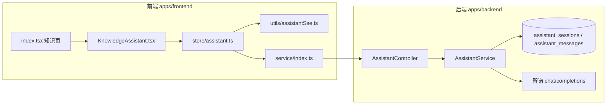

# 知识库右侧 Assistant AI 助手：完整实现说明

本文是知识编辑页 **右侧通用助手**（智谱 GLM、独立于主站 Chat）的 **完整** 实现说明：产品语义、前后端数据流、接口与表结构、MobX 状态机、SSE 协议、未保存草稿（ephemeral）、保存迁入（import-transcript）、清空/删除边界，以及 UI 与可观测性细节。实现代码以仓库当前版本为准；阅读时可对照下列路径跳转。

**相关文档**：持久化与数据落点的专题摘要仍保留在 `knowledge-assistant-ephemeral-persistence.md`（可与本文对照）；**以本文为权威总览**。

---

## 目录

1. [功能边界与术语](#1-功能边界与术语)
2. [系统架构一览](#2-系统架构一览)
3. [数据库与知识模块联动](#3-数据库与知识模块联动)
4. [后端：路由、DTO、服务逻辑](#4-后端路由dto服务逻辑)
5. [前端：页面编排与 documentKey](#5-前端页面编排与-documentkey)
6. [前端：assistantStore 状态机](#6-前端assistantstore-状态机)
7. [前端：SSE 消费协议 streamAssistantSse](#7-前端sse-消费协议-streamassistantsse)
8. [前端：KnowledgeAssistant UI 层](#8-前端knowledgeassistant-ui-层)
9. [HTTP 封装与类型](#9-http-封装与类型)
10. [关键时序与竞态](#10-关键时序与竞态)
11. [工程细节与约束](#11-工程细节与约束)
12. [文件索引](#12-文件索引)

---

## 1. 功能边界与术语

### 1.1 与主聊天（ChatBot）的隔离

| 维度 | 知识库助手 | 主站 Chat |
| --- | --- | --- |
| HTTP 路径前缀 | `/assistant/*` | `/chat/*` 等 |
| 流式消费 | `streamAssistantSse`（`apps/frontend/src/utils/assistantSse.ts`） | `streamFetch` 等 |
| 服务端服务 | `AssistantService` | `ChatService` / `GlmChatService` |
| 会话存储 | `assistant_sessions` / `assistant_messages` | 主会话消息表与缓存体系 |

二者 **不共享 sessionId**，避免混用。

### 1.2 术语表

| 术语 | 含义 |
| --- | --- |
| **documentKey** | 传给 `KnowledgeAssistant` 的字符串，格式为 `{assistantArticleBinding}__trash-{trashOpenNonce}`，用于区分「同一逻辑草稿在不同 UI  nonce 下」的助手实例。 |
| **assistantArticleBinding** | `index.tsx` 中 `useMemo`：`knowledgeTrashPreviewId` 存在时为 `__knowledge_trash__:{行id}`，否则为 `knowledgeEditingKnowledgeId ?? 'draft-new'`。 |
| **bindingId** | `knowledgeArticleBindingFromDocumentKey(documentKey)`：去掉 `__trash-*` 后缀后传给后端的「按文章查会话」标识（可为正式 UUID、`draft-new`、或回收站前缀串）。 |
| **knowledgeAssistantPersistenceAllowed** | `assistantStore` 布尔：为 `false` 表示 **未保存云端草稿**，走 ephemeral，不落库。 |
| **Ephemeral** | SSE body `ephemeral: true` + `contextTurns` + `content`；不传 `sessionId` / `knowledgeArticleId`。 |
| **Flush / import-transcript** | 首次保存成功后，把内存 `messages` 打成 `lines` 写入 `POST /assistant/session/import-transcript`。 |

---

## 2. 系统架构一览



---

## 3. 数据库与知识模块联动

### 3.1 表结构（TypeORM 实体）

- **`assistant_sessions`**（`assistant-session.entity.ts`）  
  - `id`：UUID 主键，即前端 **`sessionId`**。  
  - `user_id`：归属用户。  
  - `knowledge_article_id`：与知识条目的 **逻辑绑定键**（可为云端知识 UUID、`__knowledge_trash__:回收站行id` 等，与前端 `bindingId` 对齐）。  
  - `title` / `created_at` / `updated_at`。

- **`assistant_messages`**（`assistant-message.entity.ts`）  
  - `session_id` → 会话外键，`onDelete: CASCADE`。  
  - `role`：`user` / `assistant` / `system`。  
  - `turn_id`：同一轮用户+助手共用，支持流式占位后 UPDATE 正文。  
  - `content`：`longtext`。

### 3.2 删除知识时的清理

`KnowledgeService.remove`（`knowledge.service.ts`）在事务中：

1. 写入 `knowledge_trash` 快照；  
2. **`assistantSessionRepo.delete({ knowledgeArticleId: row.id })`**：删除绑定该知识 UUID 的助手会话（消息随 CASCADE）；  
3. 删除 `knowledge` 主表行。

因此删除后前端若仍持旧 `sessionId` 拉详情或点停止，后端对 **`getSessionDetail`** / **`stopStream`** 做了 **幂等软处理**（见 §10.3），避免 404 Toast。

---

## 4. 后端：路由、DTO、服务逻辑

### 4.1 控制器 `AssistantController`

路径：`apps/backend/src/services/assistant/assistant.controller.ts`。

- 全局 **`JwtGuard`**：所有路由需登录。  
- **`ClassSerializerInterceptor`**：响应序列化（Date → ISO 等）。

**路由注册顺序（重要）**：`POST session/import-transcript` 与 `GET session/for-knowledge` 必须写在 **`GET session/:sessionId`** 之前，否则路径会被 `:sessionId` 误匹配为字面量 `import-transcript` / `for-knowledge`。

| 方法 | 路径 | 作用 |
| --- | --- | --- |
| POST | `/assistant/session` | 创建空会话；可带 `knowledgeArticleId` 绑定或复用最近会话。 |
| POST | `/assistant/session/import-transcript` | 迁入草稿对话。 |
| GET | `/assistant/sessions` | 分页会话列表。 |
| GET | `/assistant/session/for-knowledge` | 按 `knowledgeArticleId` 查最近会话+消息；无则 `data: null`。 |
| GET | `/assistant/session/:sessionId` | 按 sessionId 拉详情；会话已删则返回 `session: null, messages: []`（HTTP 200）。 |
| PATCH | `/assistant/session/:sessionId/knowledge-article` | 改绑 `knowledgeArticleId`。 |
| POST | `/assistant/sse` | **Sse**：流式问答；body 为 `AssistantChatDto`。 |
| POST | `/assistant/stop` | 停止流式；会话已删则成功返回，不抛「会话不存在」。 |

**SSE 包装**：`chatSse` 将 `chatStream` 的 chunk `map` 为 `{ data: { type, content?, raw?, done } } }`，末尾 `concat` 一条 `{ done: true }`；`catchError` 把异常转成 `data.error` + `done: true`，避免 Observable 断链导致前端挂死。

### 4.2 DTO 要点

- **`AssistantChatDto`**（`assistant-chat.dto.ts`）  
  - `sessionId?`、`knowledgeArticleId?`、`ephemeral?`、`contextTurns?`、`content`（必填）、`maxTokens?`、`temperature?`。  
  - **`ephemeral === true`** 时与 `sessionId` / `knowledgeArticleId` **互斥**，校验失败抛 `BadRequestException`。  
  - `contextTurns`：多轮历史；**不含**本轮用户句——本轮由 **`content`** 表达；服务端 `buildEphemeralTurns` 会拼接为完整 turns 再送智谱。

- **`ImportAssistantTranscriptDto`**（`import-assistant-transcript.dto.ts`）  
  - `knowledgeArticleId`：保存后的知识 id。  
  - `lines`：最多 200 条，`user`/`assistant` 角色；超长时客户端提交 **按时间升序的最近 200 条**（`slice(-200)`）。

- **`AssistantStopDto`**：`sessionId`。

### 4.3 `AssistantService.chatStream` 分支摘要

路径：`apps/backend/src/services/assistant/assistant.service.ts`。

**A）`dto.ephemeral === true`**  

1. 校验互斥字段。  
2. **`runEphemeralChatStream`**：`buildEphemeralTurns` → token budget 裁剪 → 组装 `system + 历史` → `fetch` 智谱流式 → `parseGlmStreamData` → `subscriber.next`。  
3. **不写** `assistant_sessions` / `assistant_messages`，**不**使用 Redis `streamBusyKey` / epoch（与持久化流区分）。

**B）持久化路径（`ephemeral` 非 true）**  

1. 解析或创建 `AssistantSession`（`sessionId` 优先；否则 `knowledgeArticleId` 查最近；再无则新建并写 `knowledgeArticleId`）。  
2. **`insertUserAndAssistantPlaceholder`**：事务内插入本轮 user + assistant 占位（`turnId` 一致）。  
3. **`loadMessagesForSessionContext` + `buildTurnsForContext`**：从 DB 构建多轮上下文（流式中空助手可省略正文）。  
4. **`incrementStreamEpoch` + cache.set(streamBusyKey)`**：多实例下抢占/中止同会话旧流。  
5. 智谱流式读取循环中比对 epoch，必要时 **abort** 本地 fetch。  
6. 正常结束 **`finalizeTurn`**（UPDATE 助手正文）；异常 **`cleanupTurnOnFailure`**（有则写部分，无则删 turn 对）。

### 4.4 `importTranscript`

1. `findLatestSessionIdByKnowledgeArticle(userId, articleId)`。  
2. 无则 **新建** `AssistantSession` 并设 `knowledgeArticleId = articleId`；有则 **删光**该 session 下消息再插入。  
3. 按 `lines` 扫描：**必须以 `user` 行开启一轮**；每条 user 后可选一条 `assistant`；写入 `turnId` 成对。  
4. 更新 session `title`：取 **本批 `lines` 中** 首条有正文的 `user` 内容前 60 字（客户端超长时只提交最近 200 条，则标题对应该窗口内最早一轮用户句，而非整段草稿绝对首条）。  
5. 返回 `{ sessionId, inserted }`。

### 4.5 `getSessionDetail` / `stopStream`（删除知识后的幂等）

- **`getSessionDetail`**：若会话行不存在，返回 **`{ session: null, messages: [] }`**（仍 200），避免前端 http 层对 404 弹 Toast。  
- **`stopStream`**：若会话不存在，返回 **`{ success: true, message: '会话已不存在，无需停止' }`**；存在则读 Redis busy，无 busy 则「当前无进行中的生成」，有则 `incrementStreamEpoch` 通知读循环 abort。

---

## 5. 前端：页面编排与 documentKey

文件：`apps/frontend/src/views/knowledge/index.tsx`。

### 5.1 `assistantArticleBinding` 与 `documentKey`

摘录自 `apps/frontend/src/views/knowledge/index.tsx`（`assistantArticleBinding` 的 `useMemo` 定义）：

```tsx
/** 助手 / Monaco 文档维度的条目标识：回收站预览用独立前缀，避免多条均落在 draft-new 下同一会话 */
const assistantArticleBinding = useMemo(() => {
	if (knowledgeStore.knowledgeTrashPreviewId != null) {
		return `__knowledge_trash__:${knowledgeStore.knowledgeTrashPreviewId}`;
	}
	return knowledgeStore.knowledgeEditingKnowledgeId ?? 'draft-new';
}, [
	knowledgeStore.knowledgeTrashPreviewId,
	knowledgeStore.knowledgeEditingKnowledgeId,
]);
```

- **回收站预览**：`knowledgeEditingKnowledgeId` 常为 `null`，用 **`__knowledge_trash__:{trashRowId}`** 与列表中正式 UUID 区分，使助手历史不串。  
- **正式编辑**：binding 为云端 **`knowledgeEditingKnowledgeId`**（UUID）。  
- **新建未保存**：binding 为字面量 **`draft-new`**。

`KnowledgeAssistant` 接收的 **`documentKey`** 为：

```text
`${assistantArticleBinding}__trash-${trashOpenNonce}`
```

**含义**：`trashOpenNonce` 在打开回收站条目等场景递增，用于 **同一 binding 下强制换「助手会话槽」**，避免 UI 状态与旧会话纠缠；**勿与** `clearDocumentNonce` 混用——后者仅驱动 Monaco `documentIdentity`，避免清空草稿时误 bump `trashOpenNonce` 导致助手被意外重置（注释见 `resetEditorToNewDraft`）。

### 5.2 保存知识：`persistKnowledgeApi` / `persistKnowledgeApiSaveAs`

新建成功分支（节选逻辑说明，非全文件）：

1. `saveKnowledge` → `articleId = res.data.id`。  
2. `fromKey` / `toKey` 与上式 `documentKey` 规则一致。  
3. **`!knowledgeAssistantPersistenceAllowed`** 时 **`await flushEphemeralTranscriptIfNeeded(articleId, fromKey, toKey)`**（须 **早于** `setKnowledgeEditingKnowledgeId`，否则 `activate` 可能拉空库覆盖内存草稿）。  
4. `remapAssistantSessionDocumentKey`；`setKnowledgeEditingKnowledgeId`；若有 `sid` 再 **`patchAssistantSessionKnowledgeArticle`** 做幂等改绑。

### 5.3 清空草稿：`resetEditorToNewDraft`

顺序：`clearDocumentNonce++` → `clearKnowledgeDraft()` → **`assistantStore.clearAssistantStateOnKnowledgeDraftReset()`**。  

**原因**：未保存草稿清空后 `documentKey` 往往仍为 `draft-new__trash-*`，`useEffect([documentKey])` **不会**重跑，`activate` 不会清屏，必须 **显式** 清助手内存态。

---

## 6. 前端：assistantStore 状态机

文件：`apps/frontend/src/store/assistant.ts`。

### 6.1 状态字段（注释语义）

| 字段 | 说明 |
| --- | --- |
| `activeDocumentKey` | 当前文档键；切换/迁入时更新。 |
| `sessionId` | 当前持久化会话 id；ephemeral 下多为 `null`。 |
| `messages` | UI 气泡列表；流式中用新对象替换元素以触发 MobX 细粒度更新。 |
| `sessionByDocument` | `documentKey → sessionId` 内存缓存；换篇后仍保留其它 key。 |
| `abortStream` | 取消当前 SSE 的函数（`streamAssistantSse` 返回的 `AbortController.abort`）。 |
| `knowledgeAssistantPersistenceAllowed` | 由 `KnowledgeAssistant` 同步；默认 `true`，离开页面时复位 `true`。 |

### 6.2 模块级纯函数（避免 TS4094）

`buildImportTranscriptLinesFromMessages`、`buildEphemeralContextTurnsFromMessages` 放在 **类外**：若作为 `private` 实例方法，经 `store/index.ts` 导出默认实例类型时会触发 **TS4094**（匿名类导出不可含 private）。

- **迁入行**：每条 user/assistant 原样入列，**最多 200 条**（与后端 `ArrayMaxSize` 对齐）。  
- **Ephemeral 上下文**：跳过末尾 **「assistant 且 isStreaming 且正文空」** 的占位，避免把无效占位发给模型；**最多 120 条**（与 DTO `ArrayMaxSize(120)` 对齐）。

### 6.3 `activateForDocument(documentKey)` 流程（注释级）

1. **中止**上一路 SSE，`abortStream = null`。  
2. `runInAction`：写入 `activeDocumentKey`，**清空** `messages` / `sessionId` / `loadError`（每次切换文档从空白开始）。  
3. **`!knowledgeAssistantPersistenceAllowed`**：直接 **return**（不请求后端历史；草稿对话仅存内存）。  
4. 无 token：return。  
5. 若 **`sessionByDocument[documentKey]`** 已有 sid：走 **缓存命中** 分支。  
6. 否则若有 **`bindingId`**：`getAssistantSessionByKnowledgeArticle`；若返回 `data?.session?.sessionId`，则 **hydratedFromArticleApi = true**，一次性写入 `sessionByDocument`、`sessionId`、`messages`，并 **return**（避免二次 `fetchSessionMessages`）。  
7. 若仍无 sid：**return**（空会话，等待用户首条消息创建会话）。  
8. 若有 sid 且非 hydrated：`fetchSessionMessages()`；失败则 **删除**该 key 的缓存并清空 UI（防止脏 sid）。

### 6.4 `sendMessage` 流程

1. 防抖：`!text || isSending || isHistoryLoading` 则 return。  
2. **`ephemeral = !knowledgeAssistantPersistenceAllowed`**。  
3. 持久化：`ensureSessionForCurrentDocument`；ephemeral：校验 token + `activeDocumentKey`。  
4. **在 push 本轮消息之前** 计算 `contextTurns = buildEphemeralContextTurnsFromMessages(messages)`（仅 ephemeral）。  
5. 中止旧 SSE；`uuid` 生成 `userChatId` / `assistantChatId`；`push` user + 空 assistant（`isStreaming: true`）。  
6. **`applyAssistantPatch`**：累积 `content` / `thinkContent`，每次 **`runInAction` 替换整条 message 对象**（注释：让子 observer 稳定订阅）。  
7. **`streamAssistantSse`**：body 为 `{ ephemeral, content, contextTurns }` 或 `{ sessionId, content }`。  
8. `onComplete`：持久化成功后再 **`fetchSessionMessages`** 与 DB 对齐（ephemeral **跳过**，避免覆盖 UI）。  
9. `onError` / 外层 catch：收尾 `isStreaming`、`isSending`。

### 6.5 `stopGenerating`

1. **先** `abortStream()`（防止 await 网关期间仍收 delta）。  
2. `runInAction`：所有流式消息标记 `isStreaming=false`、`isStopped=true`。  
3. 若有 **`sessionId`**：`stopAssistantStream`（失败忽略）。

### 6.6 `fetchSessionMessages` 与已删会话

若 `payload.session == null`：删除 **`sessionByDocument[activeDocumentKey]`**，清空 `sessionId` 与 `messages`（与 §4.5 后端约定对齐）。

---

## 7. 前端：SSE 消费协议 `streamAssistantSse`

文件：`apps/frontend/src/utils/assistantSse.ts`。

### 7.1 传输层

- `POST BASE_URL + '/assistant/sse'`，`Authorization: Bearer` + `Content-Type: application/json`。  
- `getPlatformFetch`：兼容 Tauri / 浏览器 fetch。  
- `AbortController`：返回 `() => controller.abort()` 供停止。

### 7.2 行协议（与主 Chat 不同）

按 **换行** 切分 buffer；只处理 **`data:` 前缀** 行；`JSON.parse` 后：

| `parsed` 字段 | 处理 |
| --- | --- |
| `error`（string） | `onComplete(error)` 并结束 readLoop。 |
| `done === true` | `onComplete()` 正常结束。 |
| `type === 'thinking'` | 从 `raw` 或 `content` 取字符串 → `onThinking`。 |
| `type === 'usage'` | 忽略。 |
| `type === 'content'` 且 `content` 为 string | `onDelta(content)`。 |

解析失败 Toast「助手流解析失败」并 **continue**（尽力容错）。

---

## 8. 前端：`KnowledgeAssistant` UI 层

文件：`apps/frontend/src/views/knowledge/KnowledgeAssistant.tsx`。

### 8.1 持久化开关同步

摘录自 `apps/frontend/src/views/knowledge/KnowledgeAssistant.tsx`（`assistantPersistenceAllowed` 与同步 `useEffect`）：

```tsx
const assistantPersistenceAllowed = useMemo(() => {
	if (knowledgeStore.knowledgeTrashPreviewId != null) return true;
	const editingId = knowledgeStore.knowledgeEditingKnowledgeId;
	if (isKnowledgeLocalMarkdownId(editingId)) return true;
	if (editingId) return true;
	return false;
}, [
	knowledgeStore.knowledgeTrashPreviewId,
	knowledgeStore.knowledgeEditingKnowledgeId,
]);

useEffect(() => {
	assistantStore.setKnowledgeAssistantPersistenceAllowed(
		assistantPersistenceAllowed,
	);
	return () => {
		assistantStore.setKnowledgeAssistantPersistenceAllowed(true);
	};
}, [assistantPersistenceAllowed]);
```

- **卸载复位为 `true`**：避免离开知识页后其它功能误用「禁止持久化」。  
- **登录态**：`userStore.userInfo?.id` 控制占位文案与是否渲染输入区。  
- **编辑器须有正文**：`editorHasBody` 才允许输入（`ChatEntry.disableTextInput`）；左侧清空 markdown 时 **同步清空**助手输入框 `useEffect`。

### 8.2 单条气泡 `KnowledgeAssistantMessageBubble`

- **`observer`** 包裹单条，从 `assistantStore.messages` 按 `chatId` 查找。  
- **`data-msg-rev`**：合成「内容长度 + 思考长度 + 是否流式」字符串，**显式绑定** MobX 订阅字段，避免流式阶段子树不刷新（注释已说明非 hack）。  
- **`ChatMessageActions`**：`needShare={false}`；**「保存到知识」** 将助手正文 **append** 到 `knowledgeStore.markdown`。

### 8.3 滚动与代码块工具栏

- **`useStickToBottomScroll`**：`isStreaming` + `streamScrollTick` + `resetKey: documentKey`。  
- **`useChatCodeFloatingToolbar`**：`layoutDeps` 含 `streamScrollTick`，避免仅依赖 `markdown` 导致助手区代码块工具条不重排。

---

## 9. HTTP 封装与类型

文件：`apps/frontend/src/service/index.ts`、`apps/frontend/src/service/api.ts`。

- 常量：`ASSISTANT_SESSION`、`ASSISTANT_SESSION_IMPORT_TRANSCRIPT`、`ASSISTANT_SSE`、`ASSISTANT_STOP`。  
- **`AssistantSessionDetailPayload.session`** 可为 **`null`**：表示会话已在服务端删除，前端应清缓存（见 §6.6）。  
- **`getAssistantSessionByKnowledgeArticle`**：返回类型 `... | null` 与控制器 `data: null` 对齐。

---

## 10. 关键时序与竞态

### 10.1 首次保存：必须先 flush 再 `setEditingId`

若先 `setKnowledgeEditingKnowledgeId`，`assistantPersistenceAllowed` 变 `true`，`KnowledgeAssistant` 的 `useEffect` 触发 **`activateForDocument(toKey)`**，此时 DB 尚无迁入消息 → 拉空 → **覆盖** 内存中草稿对话 → **丢失**。正确顺序见 §5.2。

### 10.2 未保存草稿的数据落点

- **DB**：无 `assistant_sessions` / `assistant_messages` 记录。  
- **浏览器内存**：`assistantStore.messages`；刷新即失。  
- **智谱**：经后端转发；第三方留存不在本产品契约内。

### 10.3 删除知识后的助手请求

删除后主表会话已物理删除；前端可能仍 **`getAssistantSessionDetail`** 或 **`stopAssistantStream`**。后端 **不 404**（§4.5），前端 **`fetchSessionMessages` 见 `session: null` 清本地映射**（§6.6）。

---

## 11. 工程细节与约束

1. **DTO 数组上限**：后端 `contextTurns` 120、`import lines` 200；前端迁入用 **`lines.slice(-200)`**（最近 200 条，升序），与之一致。  
2. **路由顺序**：`import-transcript`、`for-knowledge` 须在 `session/:id` 之前（§4.1）。  
3. **MobX**：流式更新用 **替换数组元素** 而非原地 `push` delta 到不可观察结构。  
4. **TS4094**：助手 store 的辅助函数放模块级（§6.2）。  
5. **鉴权**：助手全路由 `JwtGuard`；SSE 未登录返回 `{ error: '未登录', done: true }`。

---

## 12. 文件索引

| 角色 | 路径 |
| --- | --- |
| 前端 Store | `apps/frontend/src/store/assistant.ts` |
| 前端 SSE | `apps/frontend/src/utils/assistantSse.ts` |
| 前端助手 UI | `apps/frontend/src/views/knowledge/KnowledgeAssistant.tsx` |
| 前端知识页 | `apps/frontend/src/views/knowledge/index.tsx` |
| 前端常量 | `apps/frontend/src/views/knowledge/constants.ts`（`isKnowledgeLocalMarkdownId`） |
| 前端 API | `apps/frontend/src/service/index.ts`、`apps/frontend/src/service/api.ts` |
| 后端控制器 | `apps/backend/src/services/assistant/assistant.controller.ts` |
| 后端服务 | `apps/backend/src/services/assistant/assistant.service.ts` |
| 后端实体 | `apps/backend/src/services/assistant/assistant-session.entity.ts`、`assistant-message.entity.ts` |
| 后端 DTO | `apps/backend/src/services/assistant/dto/*.ts` |
| 知识删除联动 | `apps/backend/src/services/knowledge/knowledge.service.ts` |
| 专题摘要（持久化/落点） | `docs/knowledge/knowledge-assistant-ephemeral-persistence.md` |

---

## 附录 A：回归自检清单（维护用）

- [ ] 未登录：助手区文案与禁用逻辑正确。  
- [ ] 新建云端草稿：可问答、刷新后对话消失；保存后对话进库且再开可加载。  
- [ ] 已保存条目：多轮、停止生成、`fetchSessionMessages` 对齐。  
- [ ] 回收站预览：binding 前缀下会话隔离。  
- [ ] 本地 `__local_md__`：持久化允许为 true。  
- [ ] 清空草稿：助手气泡与映射清空。  
- [ ] 删除当前知识：无「会话不存在」误报；助手状态可恢复。  
- [ ] 另存为：与新建类似的 flush 顺序。

---

## 附录 B：核心逻辑带读（与源码对照的中文注释）

下列片段为 **教学式重组**，行号以仓库文件为准；注释为中文，便于与 `assistant.ts` 对照阅读。

### B.1 `knowledgeArticleBindingFromDocumentKey`（解析条目标识）

```typescript
// 文件：apps/frontend/src/store/assistant.ts
// 作用：从完整 documentKey 中去掉 `__trash-{nonce}` 后缀，得到与后端 `knowledgeArticleId` 对齐的 bindingId。
// 例：`a1b2c3d4-...__trash-0` → `a1b2c3d4-...`；`draft-new__trash-1` → `draft-new`。
function knowledgeArticleBindingFromDocumentKey(documentKey: string): string {
	const sep = '__trash-';
	const i = documentKey.indexOf(sep);
	return (i >= 0 ? documentKey.slice(0, i) : documentKey).trim();
}
```

### B.2 `sendMessage` 双轨（持久化 vs ephemeral）语义

```typescript
// 文件：apps/frontend/src/store/assistant.ts — 逻辑重组说明
async sendMessage(raw?: string): Promise<void> {
	const text = (raw ?? '').trim();
	if (!text || this.isSending || this.isHistoryLoading) return;

	// 与 KnowledgeAssistant 同步的开关：false = 未保存云端草稿
	const ephemeral = !this.knowledgeAssistantPersistenceAllowed;

	let sid: string | null = null;
	if (!ephemeral) {
		// 持久化：确保库里有 session，后续 SSE 带 sessionId，服务端会落库占位消息
		sid = await this.ensureSessionForCurrentDocument();
		if (!sid) return;
	} else {
		// 临时：不创建 DB session；仅校验登录与 documentKey 已就绪
		if (!readToken() || !this.activeDocumentKey) return;
	}

	// 关键：contextTurns 必须在「尚未 push 本轮 user/assistant」之前从 this.messages 生成，
	// 这样发给后端的 history 不含本轮；本轮仅放在 body.content（与后端 buildEphemeralTurns 一致）。
	const contextTurns = ephemeral
		? buildEphemeralContextTurnsFromMessages(this.messages)
		: undefined;

	// 再 push UI：用户气泡 + 空助手占位（isStreaming 触发滚动与 Markdown 懒加载等）
	// ... streamAssistantSse({ body: ephemeral ? { ephemeral: true, content: text, contextTurns } : { sessionId: sid, content: text } })

	// onComplete：仅持久化路径 fetchSessionMessages，用 DB 最终态覆盖（含服务端 message id 等）
}
```

### B.3 后端 `buildEphemeralTurns`（与前端字段契约）

```typescript
// 文件：apps/backend/src/services/assistant/assistant.service.ts
// 顺序：先追加 dto.contextTurns[]（user/assistant），再追加本轮 user（dto.content）。
// 因此前端 contextTurns 不得包含本轮用户句。
private buildEphemeralTurns(dto: AssistantChatDto): AssistantChatTurn[] {
	const turns: AssistantChatTurn[] = [];
	for (const r of dto.contextTurns ?? []) {
		if (r.role !== 'user' && r.role !== 'assistant') continue;
		turns.push({ role: r.role, content: r.content ?? '' });
	}
	turns.push({ role: 'user', content: dto.content.trim() });
	return turns;
}
```

### B.4 `chatStream` 入口分支（持久化 vs ephemeral）

```typescript
// 文件：apps/backend/src/services/assistant/assistant.service.ts — 语义摘要
if (dto.ephemeral === true) {
	// 禁止带 sessionId / knowledgeArticleId，避免误写库
	await this.runEphemeralChatStream(subscriber, dto);
	return;
}
// 以下：解析/创建 AssistantSession → insertUserAndAssistantPlaceholder → Redis epoch → 智谱流式 → finalize / cleanup
```

### B.5 NestJS Sse 行格式（前端解析依据）

每一行形如：`data: {"type":"content","content":"..."}\n`  
结束：`data: {"done":true}\n`（控制器在流末尾 concat 的 `done$`）。  
错误：`data: {"error":"...","done":true}` 或由 `catchError` 注入的 `error` 字段。
