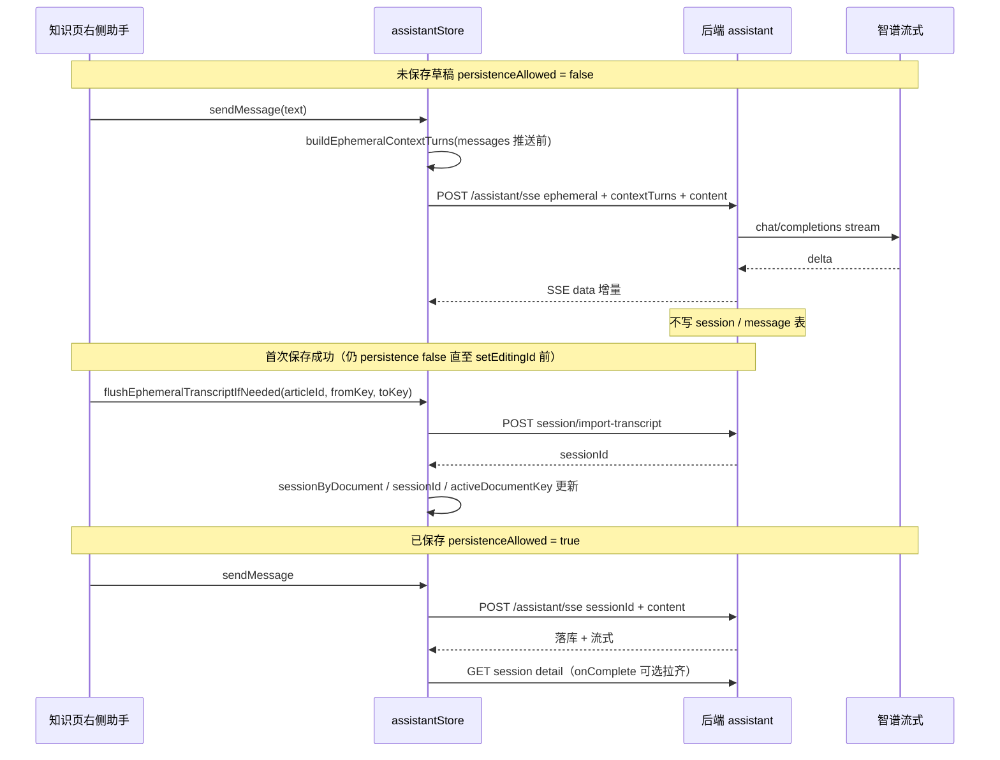

# 知识库助手：未保存草稿不落库与保存后迁入

> **完整实现总览**（全链路接口、SSE、UI、表结构、竞态与回归清单）见同目录 **`knowledge-assistant-complete.md`**。本文侧重 **持久化策略**、**数据落点**、**保存/删除边界** 的专题说明，可与总览对照阅读。

> **流式切换/首次保存修复记录**：见同目录 `knowledge-assistant-streaming-across-documents.md`（切换文档不再打断流式、稳定 key 避免 state 分裂；首次保存时若仍在流式，延迟迁入避免绑定不完整对话）。

本文说明「知识编辑页右侧通用助手（assistant）」在 **未保存云端知识草稿** 与 **已保存 / 本地 / 回收站预览** 两种形态下的持久化策略、前后端协作方式，以及 **清空草稿** 时与助手状态的联动。实现分散在 NestJS `assistant` 模块与前端 `assistantStore`、`KnowledgeAssistant`、`knowledge/index` 等处。

---

## 1. 业务目标（产品语义）

| 场景 | 助手能否提问 | 是否写入数据库（会话 / 消息） |
| --- | --- | --- |
| 新建云端知识、尚未 `saveKnowledge` 得到正式 `id` | 可以（流式回复） | **否**：仅内存 + 智谱流式，不落库 |
| 已有云端 `knowledgeEditingKnowledgeId` | 可以 | **是**：按 `sessionId` 或 `knowledgeArticleId` 走原有落库流式 |
| 本地 Markdown（`__local_md__:` 前缀） | 可以 | **是**（与「已绑定稳定文档」一致，允许持久化） |
| 回收站预览（`knowledgeTrashPreviewId`） | 可以 | **是**（条目在服务端仍存在，按条目标识拉会话） |
| 草稿阶段对话后，**首次保存成功** | — | **是**：把当前 UI 中的对话行 **迁入** 新条目对应会话 |
| 清空标题与正文（`resetEditorToNewDraft`） | — | 内存助手 **一并清空**（避免 `documentKey` 不变导致气泡残留） |

核心原则：**没有可绑定的云端知识 `id` 时，不向 DB 写入助手会话与消息**；保存成功后通过 **import-transcript** 一次性补写，再与正常「按 session 流式」路径对齐。

---

## 1.1 未保存云端知识：助手「会话」和对话内容保存到哪里？

本节回答：**没有保存的知识**对应的助手多轮对话，在磁盘 / 数据库里到底有没有记录、分别存在哪一层。

### 1.1.1 结论一览

| 层级 | 是否写入 | 说明 |
| --- | --- | --- |
| 本应用 **MySQL** 表 `assistant_sessions` | **否** | 未保存草稿阶段不会为该草稿创建「可复用的服务端会话行」；`ephemeral` 流式分支也不会写库。 |
| 本应用 **MySQL** 表 `assistant_messages` | **否** | 用户句、助手句均不落库。 |
| **前端内存**（MobX `assistantStore`） | **是** | 对话列表在 `messages` 中；当前文档维度在 `activeDocumentKey`；`sessionId` 一般为 `null`；`sessionByDocument[documentKey]` 通常也无服务端 `sessionId`。 |
| **浏览器进程** | 间接 | 仅作为运行前端代码的载体；刷新页面后，若从未保存知识，这些气泡 **会丢失**（无云端可拉取的历史）。 |
| **智谱 / 大模型侧** | 视供应商策略 | 请求经后端转发至智谱；**本产品数据库不保存**该轮上下文；第三方是否留存不在本文约定范围内。 |

因此，产品语义上的「未保存知识的助手会话」**只存在于当前标签页的前端内存里**，不是「有一个 sessionId 但没绑定文章」，而是 **根本没有持久化会话实体**。

### 1.1.2 前端具体存了什么

路径：`apps/frontend/src/store/assistant.ts`。

- **`messages: Message[]`**：用户气泡与助手气泡（含流式中的 `content` / `thinkContent` / `isStreaming` 等），即你在右侧看到的完整对话。
- **`activeDocumentKey`**：与当前编辑器一致的文档键（例如 `draft-new__trash-0`），用于逻辑分支；**不**作为数据库主键。
- **`sessionId`**：持久化模式下才会稳定持有服务端会话 id；**ephemeral 模式下保持 `null`**（不向 `createAssistantSession` 要 id）。
- **`sessionByDocument`**：文档键 → 服务端 `sessionId` 的缓存；草稿阶段一般 **没有** 可写入的 `sessionId`，该映射多为空（迁入成功后才会写入 `toKey` 对应项）。

### 1.1.3 发消息时请求里带了什么、后端写了什么

当 `knowledgeAssistantPersistenceAllowed === false` 时，`sendMessage` 会：

1. 在 **push 本轮用户消息与助手占位之前**，用当前 `messages` 生成 **`contextTurns`**（历史轮次；末尾「空且仍在流式」的助手占位会排除，避免把无效占位发给模型）。
2. 再 `push` 本轮 UI 消息。
3. 调用 `POST` 知识助手 SSE 接口（如 `/assistant/sse`），请求体为 **`ephemeral: true`**、`content`（本轮用户输入）、**`contextTurns`**；**可选** `extraUserContentForModel`（仅服务端拼进发给智谱的最后一条 user，**不落库**；用于知识库「润色/总结」快捷卡片，见 `knowledge-assistant-complete.md` **§13**）；**不传** `sessionId`、**不传** `knowledgeArticleId`。

后端 `AssistantService.chatStream` 在 `dto.ephemeral === true` 时进入 **`runEphemeralChatStream`**：只拼装智谱 `messages` 并消费流式结果，**不**走「占位插入 `assistant_messages`、事务、turnId」等落库路径。因此 **会话与对话不会进入 `assistant_sessions` / `assistant_messages`**（UI 中的 `messages` 仍仅存短 `content`；长文档仅经 `extraUserContentForModel` 参与当次模型请求）。

### 1.1.4 与「已保存知识」的对比（帮助记忆）

| 维度 | 未保存云端草稿 | 已保存云端条目 |
| --- | --- | --- |
| 服务端会话行 | 无 | 有（`assistant_sessions`，且 `knowledge_article_id` 存知识 `id`） |
| 服务端消息行 | 无 | 有（`assistant_messages`，外键 `session_id`） |
| 多轮上下文从哪来 | 每次请求由前端拼 **`contextTurns`** | 历史在 DB，流式请求主要带 **`sessionId`**（或由 `knowledgeArticleId` 解析出会话） |

---

## 1.2 保存知识时：如何把助手会话与对话关联到对应知识？

本节说明：**用户点击保存、接口返回正式 `knowledgeArticleId`（知识条目 id）之后**，助手侧如何从「纯前端内存」变成「数据库里可随文章恢复的历史」，以及 **关联字段** 落在哪些表、哪些 API。

### 1.2.1 知识本体与助手会话是两条线

- **知识正文 / 标题**：由知识库模块的创建接口写入（例如 `saveKnowledge` 返回的 `res.data.id`），对应业务上的 **知识条目主键**（下文记作 **`articleId`**，即云端 UUID 字符串）。
- **助手历史**：存在 **助手专用** 表，通过 **`assistant_sessions.knowledge_article_id`** 与 **`articleId`** 对齐（同一字符串），从而「按文章拉助手」。

实体定义见：`apps/backend/src/services/assistant/assistant-session.entity.ts`（表名 **`assistant_sessions`**，列 **`knowledge_article_id`**）、`assistant-message.entity.ts`（表名 **`assistant_messages`**，`session_id` 外键指向会话）。

### 1.2.2 首次保存（新建）时的完整顺序

以下对应 `apps/frontend/src/views/knowledge/index.tsx` 中 `persistKnowledgeApi` 在 **`editingId` 为空** 且 `saveKnowledge` 成功后的分支。

```text
1) 调用知识 API：saveKnowledge({ title, content, ... }) → 返回 articleId（res.data.id）
2) 计算助手 documentKey 迁移：
   - fromKey = {草稿期 binding}__trash-{nonce}
   - toKey   = {articleId}__trash-{nonce}
3) 若当前仍为「未允许持久化」(knowledgeAssistantPersistenceAllowed === false)：
     await flushEphemeralTranscriptIfNeeded(articleId, fromKey, toKey)
   - 前端把 assistantStore.messages 序列化为 lines（user/assistant 交替；超过 200 条时 **只提交最近 200 条** `slice(-200)`，时间序仍为升序）
   - POST assistant/session/import-transcript
       body: { knowledgeArticleId: articleId, lines }
4) remapAssistantSessionDocumentKey(fromKey, toKey)   // 内存映射兜底
5) knowledgeStore.setKnowledgeEditingKnowledgeId(articleId)
6) 若 assistantStore 上已有该 toKey 的 sessionId：
     patchAssistantSessionKnowledgeArticle(sessionId, { knowledgeArticleId: articleId })
```

**为什么必须先 flush、再 `setKnowledgeEditingKnowledgeId`？**  
若先切换为「已保存」状态，`KnowledgeAssistant` 会立刻认为允许持久化并可能触发 `activateForDocument` 去拉 **空** 的服务端历史，从而用空列表 **覆盖** 仍停留在内存里的草稿对话，造成丢失。先 `import-transcript` 把库写好，再切编辑 id，可避免该竞态。

### 1.2.3 `import-transcript` 在服务端如何「关联」到知识

路径：`AssistantService.importTranscript`（`apps/backend/src/services/assistant/assistant.service.ts`）。

1. **按用户 + `knowledgeArticleId`（即刚保存下来的 `articleId`）查找是否已有会话**  
   `findLatestSessionIdByKnowledgeArticle(userId, articleId)`：查 `assistant_sessions` 中 **`user_id` + `knowledge_article_id` = articleId** 且最近更新的一条。
2. **若没有会话**  
   - `randomUUID()` 新建一行 **`assistant_sessions`**，并 **写入 `knowledge_article_id = articleId`**。  
   - 从这一刻起，**「助手会话 ↔ 知识条目」** 在数据库上的关联就是这一列。
3. **若已有会话**  
   - 校验归属后，**删除该 `session_id` 下全部 `assistant_messages`**，再按 `lines` 重插（保证迁入结果与前端提交的 transcript 一致）。
4. **按 `lines` 写入 `assistant_messages`**  
   - 解析规则：按序遇到 `user` 行则开启一轮，写入 user 行；若下一行是 `assistant` 则作为同一轮的助手内容（与服务端 `turnId` 成对逻辑一致）。  
   - 每条消息通过 ORM 关联到上面的 **`AssistantSession`**（外键 **`session_id`**）。
5. 返回 **`{ sessionId, inserted }`**；前端用返回的 **`sessionId`** 写入 `sessionByDocument[toKey]`、`assistantStore.sessionId`，并把 **`activeDocumentKey`** 从 `fromKey` 切到 `toKey`（与 UI 上新的 `documentKey` 对齐）。

至此：**知识条目 `articleId` → `assistant_sessions.knowledge_article_id`**；**该会话下所有气泡 → `assistant_messages.session_id`**。之后用户在该文章下继续提问，走 **`sessionId` 的持久化流式**，新轮次会继续追加到同一 `session_id` 下。

### 1.2.4 `patchAssistantSessionKnowledgeArticle` 还起什么作用

路径：`assistantStore.persistKnowledgeArticleBindingOnServer` → 后端 `updateSessionKnowledgeArticleId`。

- **新建迁入**时，`importTranscript` 在 **创建新会话** 的分支里已经把 **`knowledge_article_id` 设为 `articleId`**，理论上与 patch 目标一致。
- **仍调用 patch** 的原因：统一覆盖「保存后改绑 / 另存为 / 文档键已变但服务端绑定需对齐」等场景；在首次保存成功且已有 `sessionId` 时，再 PATCH 一次 **`knowledgeArticleId`**，属于 **幂等对齐**，避免后续按文章拉历史时偶发不一致。

### 1.2.5 另存为（`persistKnowledgeApiSaveAs`）

逻辑与「新建保存」类似：得到 **新的 `articleId`** 后，在 **`knowledgeAssistantPersistenceAllowed === false`** 时同样先 **`flushEphemeralTranscriptIfNeeded`**，把当前内存对话迁入 **新条目** 对应的会话，再 `remap`、`setKnowledgeEditingKnowledgeId`。

### 1.2.6 保存后用户再打开该知识

- 前端 `documentKey` 含真实 **`articleId`**，`knowledgeAssistantPersistenceAllowed === true`。
- `activateForDocument` 在无本地会话指针时，按 **`knowledgeArticleId`** 调 **`GET /assistant/session/for-knowledge`**（封装名 **`getAssistantSessionByKnowledgeArticle`**），取**最近**会话及消息写入 **`activeSessionByDocument` / `sessionByDocument`** 与 **`stateBySession[sid].messages`**；若内存已有 **`sid`** 则改走 **`getAssistantSessionDetail(sid)`**。**不在此阶段拉全量** `sessions/for-knowledge`（列表见多会话前端文档）。

---

## 2. 术语与前端维度键（documentKey）

- **`documentKey`**：传给 `KnowledgeAssistant` 的 prop，与列表/回收站分栏用的 `trashOpenNonce` 组合，形如  
  `{assistantArticleBinding}__trash-{nonce}`。  
  其中 `assistantArticleBinding` 来自 `apps/frontend/src/views/knowledge/index.tsx` 的 `useMemo`：回收站预览为 `__knowledge_trash__:{id}`，否则为 `knowledgeEditingKnowledgeId ?? 'draft-new'`。
- **`knowledgeAssistantPersistenceAllowed`**：`assistantStore` 上的布尔值，由 `KnowledgeAssistant` 根据 `knowledgeStore` 计算并同步。为 `false` 时表示当前是 **未保存云端草稿**，走 **ephemeral SSE**。
- **Ephemeral（临时流式）**：请求体带 `ephemeral: true` + `contextTurns`（历史轮次）+ 本轮 `content`；**不传** `sessionId` / `knowledgeArticleId`。
- **Flush（迁入）**：首次保存成功后，将内存中的 `messages` 序列化为 `lines`，调用 `POST assistant/session/import-transcript`，在服务端创建或复用该 `knowledgeArticleId` 的会话并写入消息。

---

## 3. 架构与数据流（概览）



---

## 4. 后端实现要点

### 4.1 DTO：`AssistantChatDto`（流式入口）

路径：`apps/backend/src/services/assistant/dto/assistant-chat.dto.ts`。

- `ephemeral?: boolean`：为 `true` 时走不落库分支；与 `sessionId`、`knowledgeArticleId` **互斥**（服务端校验，非法组合抛 `BadRequestException`）。
- `contextTurns?: AssistantContextTurnDto[]`：多轮上下文；**不含**本轮用户句（本轮由 `content` 字段承载，服务端 `buildEphemeralTurns` 会把 `contextTurns` 与 `content` 拼成完整 messages 再调智谱）。

### 4.2 DTO：`ImportAssistantTranscriptDto`（迁入）

路径：`apps/backend/src/services/assistant/dto/import-assistant-transcript.dto.ts`。

- `knowledgeArticleId`：保存后的云端知识条目 id。
- `lines`：按时间**从早到晚**的 `user` / `assistant` 行，**最多 200 条**；草稿轮次更多时由前端截成 **最近 200 条** 再提交。服务端按「user 一条 + 紧随其 optional assistant」解析并插入（与 `AssistantService.importTranscript` 实现一致）。

### 4.3 控制器路由顺序

路径：`apps/backend/src/services/assistant/assistant.controller.ts`。

`POST session/import-transcript` 必须注册在 **`POST session/:id`** 等动态路由之前，否则 `import-transcript` 会被当成 `:id` 匹配。

### 4.4 服务层：`chatStream` 与 `runEphemeralChatStream`

路径：`apps/backend/src/services/assistant/assistant.service.ts`。

- `dto.ephemeral === true` 时调用 `runEphemeralChatStream`：仅智谱流式，**无** DB 占位、**无** Redis epoch 等与持久化会话相关的逻辑。
- `importTranscript`：按用户 + `knowledgeArticleId` 查找或创建 `AssistantSession`；若会话已存在则先删除该 session 下旧消息再插入（避免重复迁入脏数据时策略明确，调用方应仅在「草稿转正式」场景调用）。

---

## 5. 前端实现要点

### 5.1 持久化开关：`KnowledgeAssistant.tsx`

路径：`apps/frontend/src/views/knowledge/KnowledgeAssistant.tsx`。

- `assistantPersistenceAllowed`：`knowledgeTrashPreviewId != null` **或** 本地 md id **或** 已有 `knowledgeEditingKnowledgeId` → `true`；否则为未保存云端草稿 → `false`。
- `useEffect` 同步到 `assistantStore.setKnowledgeAssistantPersistenceAllowed`；组件 **卸载** 时设回 `true`，避免影响应用其它页面误用「禁止持久化」状态。

### 5.2 `assistantStore`（MobX）

路径：`apps/frontend/src/store/assistant.ts`。

| 成员 / 方法 | 作用 |
| --- | --- |
| `knowledgeAssistantPersistenceAllowed` | 是否允许拉后端历史、建 session、落库流式 |
| `activateForDocument(documentKey)` | 若不允许持久化：只更新 `activeDocumentKey` 并清空占位状态后 **return**，不请求历史 |
| `ensureSessionForCurrentDocument()` | 不允许持久化时 **return null** |
| `sendMessage` | 不允许持久化：`contextTurns` 来自 `buildEphemeralContextTurnsFromMessages`（先快照再 `push` 占位）；SSE 为 `{ ephemeral: true, content, contextTurns }`；完成后 **不** 拉会话详情。允许持久化：按 **`ensureSessionState(sid)`** 写入流式与 **`onComplete` 内 `getAssistantSessionDetail(sid)`** 对齐；**`void refreshSessionListForCurrentDocument()`**；详见 `knowledge-assistant-complete.md` §6.12 |
| `flushEphemeralTranscriptIfNeeded` | **`createAssistantSession({ knowledgeArticleId, forceNew: true })`** 后 **`importAssistantTranscript`**（可带 **`sessionId`**）；成功后更新 **`sessionByDocument` / `activeSessionByDocument`**、**`ensureSessionState(sid).messages`**，并在 `activeDocumentKey === fromKey` 时改为 `toKey`；**`void refreshSessionListForCurrentDocument()`** |
| `clearAssistantStateOnKnowledgeDraftReset` | 清空/新建草稿时：abort SSE、清空 `messages` / `sessionId`、删除当前 `activeDocumentKey` 的内存映射；若有 `sessionId` 则异步 `stopAssistantStream` |

**说明**：`buildEphemeralContextTurnsFromMessages` 与 `buildImportTranscriptLinesFromMessages` 放在模块顶层（非 class `private`），避免 `apps/frontend/src/store/index.ts` 聚合导出实例类型时触发 TS4094（「exported anonymous class 不可含 private 成员」）。

### 5.3 保存知识：`index.tsx` 中顺序约束

路径：`apps/frontend/src/views/knowledge/index.tsx` 的 `persistKnowledgeApi` / `persistKnowledgeApiSaveAs`。

在 **新建** 成功且 `res.data.id` 存在时：

1. 计算 `fromKey` / `toKey`（与助手 `documentKey` 规则一致）。
2. 若 `!assistantStore.knowledgeAssistantPersistenceAllowed`，**先** `await flushEphemeralTranscriptIfNeeded(articleId, fromKey, toKey)`。
3. 再 `remapAssistantSessionDocumentKey`、`setKnowledgeEditingKnowledgeId`、`patchAssistantSessionKnowledgeArticle`（如有 sid）。

**原因**：若先 `setKnowledgeEditingKnowledgeId`，`assistantPersistenceAllowed` 变为 `true`，`KnowledgeAssistant` 的 `useEffect` 可能先 `activate` 拉空会话并覆盖界面，草稿阶段内存对话会丢失。

### 5.4 清空草稿：`resetEditorToNewDraft`

同一文件内：在 `knowledgeStore.clearKnowledgeDraft()` 之后调用  
`assistantStore.clearAssistantStateOnKnowledgeDraftReset()`。

**原因**：未保存草稿清空时 `documentKey` 往往仍为 `draft-new__trash-*`，`useEffect([documentKey])` **不会**再次触发 `activateForDocument`，必须在重置编辑器时显式清空助手 UI 与内存映射。

### 5.5 HTTP 封装

路径：`apps/frontend/src/service/index.ts` 中的 `importAssistantTranscript`；常量见 `apps/frontend/src/service/api.ts`（`ASSISTANT_SESSION_IMPORT_TRANSCRIPT`）。

### 5.6 删除知识后的助手接口（避免「会话不存在」误报）

删除云端知识时，`KnowledgeService.remove` 会在主表删除前执行 `assistantSessionRepo.delete({ knowledgeArticleId: row.id })`，对应助手会话与消息一并消失。此时若用户曾打开过该条目的助手，浏览器内存里可能仍有旧 **`sessionId`**，并可能触发：

- **`GET /assistant/session/:sessionId`** 拉详情；
- **`POST /assistant/stop`** 停止流式（例如删除瞬间仍在生成）。

为避免上述合法竞态触发 **HTTP 404** 进而被全局拦截器当成错误 Toast，约定如下：

| 接口 | 行为 |
| --- | --- |
| `AssistantService.getSessionDetail` | 会话行已不存在时 **不抛** `NotFoundException`，返回 **`{ session: null, messages: [] }`**（仍 200）。 |
| `AssistantService.stopStream` | 会话行已不存在时 **不抛**，返回 **`{ success: true, message: '会话已不存在，无需停止' }`**，与「幂等停止」一致。 |
| 前端 `assistantStore.fetchSessionMessagesForDocumentKey`（遗留） | 若 `payload.session == null`，**`delete sessionByDocument[canonical]`** 与 **`delete stateByDocument[canonical]`**；多会话主路径以 **`activateForDocument` / `getAssistantSessionDetail`** 的清理为准（见 `knowledge-assistant-complete.md` §6.10、§10.3）。 |

---

## 6. 与主聊天（ChatBot）的差异（边界）

- 知识助手消费的是 **`/assistant/sse`** 与独立 SSE 解析（`apps/frontend/src/utils/assistantSse.ts`），与主会话的 `streamFetch` 协议不同。
- **Ephemeral** 仅服务于「知识未保存」场景；主聊天若需类似能力应单独设计，勿混用本开关。

---

## 7. 相关文件清单（便于代码导航）

| 层级 | 路径 |
| --- | --- |
| 后端 DTO | `apps/backend/src/services/assistant/dto/assistant-chat.dto.ts` |
| 后端 DTO | `apps/backend/src/services/assistant/dto/import-assistant-transcript.dto.ts` |
| 后端控制器 | `apps/backend/src/services/assistant/assistant.controller.ts` |
| 后端服务 | `apps/backend/src/services/assistant/assistant.service.ts` |
| 前端 Store | `apps/frontend/src/store/assistant.ts` |
| 前端助手 UI | `apps/frontend/src/views/knowledge/KnowledgeAssistant.tsx` |
| 前端知识页编排 | `apps/frontend/src/views/knowledge/index.tsx` |
| 前端 SSE 工具 | `apps/frontend/src/utils/assistantSse.ts` |
| 前端 API | `apps/frontend/src/service/index.ts`、`apps/frontend/src/service/api.ts` |

---

## 8. 维护建议

- 修改 `documentKey` 或 `trashOpenNonce` 策略时，同步检查 `fromKey`/`toKey` 与 `flushEphemeralTranscriptIfNeeded` 参数是否仍一致。
- 调整「是否持久化」判定时，同时更新 `KnowledgeAssistant` 中的 `assistantPersistenceAllowed` 与本文 **§1** 表格及 **§2** 术语，避免产品与实现漂移。
- `import-transcript` 会清空已存在会话下的消息再写入：仅应在「草稿首次绑定正式 articleId」路径调用；已保存条目的日常对话应继续走 `sessionId` 流式落库。
- **数据落点与保存关联** 的权威说明以 **§1.1、§1.2** 为准；改表结构或改 `importTranscript` 语义时须同步修订这两节。
