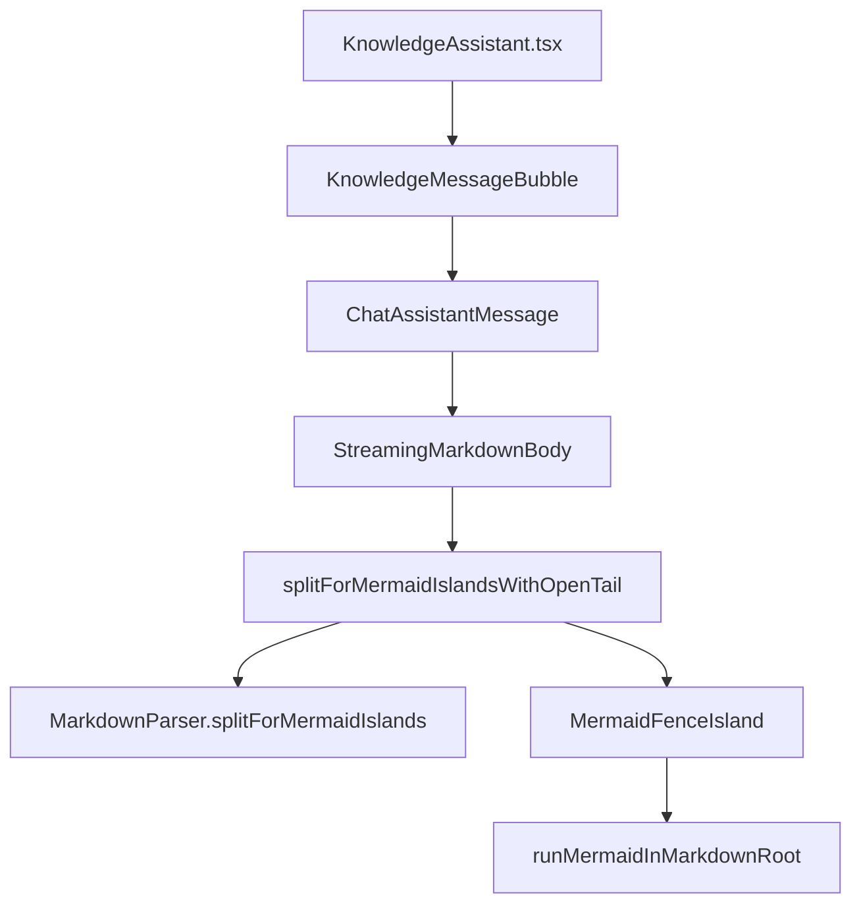

# 知识库助手流式 Mermaid 无法出图：问题分析与修复

> **延伸阅读**  
> - 知识库文档索引：[README.md](./README.md)  
> - 助手总览与消息渲染链：[knowledge-assistant-complete.md](./knowledge-assistant-complete.md) §8  
> - Monaco 预览 Mermaid 岛（对照行为）：同文 §11 / `apps/frontend/src/components/design/Markdown/index.tsx`  
> - 工具包 Mermaid 契约：[../tools/index.md](../tools/index.md) §11（`@dnhyxc-ai/markdown-kit`）

## 1. 背景与目标

### 1.1 现象

知识库右侧 **Assistant** 在流式输出含 ` ```mermaid ` 围栏的架构图（如 `flowchart TB` + 多个 `subgraph`）时，出现：

- 气泡内 **无 SVG 流程图**，或长时间空白；
- 左侧 **Monaco Markdown 预览**、主站 **ChatBot** 流式对同类内容 **可正常出图**。

助手与 Chat 共用 `ChatAssistantMessage` → `StreamingMarkdownBody` → `MermaidFenceIsland`，并非独立渲染器；差异来自 **拆分策略、流式态标记、DSL 预处理** 的组合。

### 1.2 技术目标

| 目标 | 做法 |
|------|------|
| 闭合围栏后尽快出图 | `MermaidFenceIsland` 的 `isStreaming` 仅依赖 `part.complete`，不绑定整条消息的 `message.isStreaming` |
| 与 Monaco 预览对齐拆分 | `enableOpenTail: true` 始终探测尾部开放 mermaid |
| 流式结束收尾 | 消息 `isStreaming === false` 时强制所有 mermaid 段 `complete: true` |
| 无 lang 的围栏 | `isMermaidFenceLang` 根据正文首行 `flowchart` 等识别 |
| 中文架构图标签 | `normalizeMermaidFenceBody` 对 `()`、`:` 等补双引号 |
| 解析失败可见 | 非流式失败时在占位内展示 `pre` 源码，避免「空白」 |
| 布局不挤没图 | 知识库气泡 `min-w-0` + `streamRev` key |

若与仓库最新源码不一致，**以源码为准**。

---

## 2. 改动范围

| 路径 | 说明 |
|------|------|
| `packages/markdown-kit/src/mermaid/detect-mermaid-source.ts` | **新增**：`looksLikeMermaidDiagramSource` / `isMermaidFenceLang` |
| `packages/markdown-kit/src/markdown/parser.ts` | `splitForMermaidIslands` 使用 `isMermaidFenceLang`；`mermaidBracketLabelNeedsQuoting` 扩展 `()`、`:` |
| `packages/markdown-kit/src/index.ts` | 导出上述 API |
| `packages/markdown-kit/test/markdown/parser.test.ts` | 括号/冒号标签规范化单测 |
| `apps/frontend/src/utils/splitMarkdownFences.ts` | 开放尾、`finalizeOpenTail`、`patchIncompleteNonMermaidFence` 与 lang 判断 |
| `apps/frontend/src/components/design/ChatAssistantMessage/StreamingMarkdownBody.tsx` | 拆分与 `isStreaming` 传参 |
| `apps/frontend/src/components/design/ChatAssistantMessage/index.tsx` | 恢复 `patchIncompleteNonMermaidFence` |
| `apps/frontend/src/components/design/MermaidFenceIsland/index.tsx` | 渲染失败回退 UI |
| `apps/frontend/src/views/knowledge/KnowledgeMessageBubble.tsx` | 助手气泡布局与 remount key |
| `apps/frontend/package.json` | 恢复 `@dnhyxc-ai/markdown-kit` workspace 依赖 |

**未改**：后端 SSE、`assistantStore` 消息结构；`AssistantService` 提示词。

---

## 3. 渲染链路（知识库助手）



要点：

1. **`chatMdParser`** 构造时 `enableMermaid: false`（避免整段 `render` 再产出 Mermaid 占位，与「岛」重复）；Mermaid **仅**走 `splitForMermaidIslands` + `MermaidFenceIsland`。
2. 正文经 `bodyText`：`patchIncompleteNonMermaidFence` → 有机引用占位（若有）→ 传入 `StreamingMarkdownBody` 的 `markdown`。
3. 知识库与 Chat **同组件**；本修复同时惠及 Chat 流式 Mermaid。

---

## 4. 根因分析（分点）

### 4.1 `isStreaming` 误绑整条消息（主因之一）

**原逻辑**：`MermaidFenceIsland` 接收 `isStreaming={message.isStreaming || !part.complete}`。

当模型已输出完整 ` ```mermaid … ``` `，但助手消息仍在流式（后续还有说明文字）时：

- `part.complete === true`（围栏已闭合）；
- `message.isStreaming === true` → 岛仍按 **流式节流** 跑 Mermaid，`suppressErrors: true`，且长期不「立即提交」最终 SVG。

**Monaco 预览**使用 `isStreaming={!part.complete}`，闭合围栏后 **立刻**按完整图渲染。

**修复**：改为 `isStreaming={!part.complete}`，与预览一致。

### 4.2 流式结束与 `complete` 标志

流式阶段若走 **开放尾** 路径，最后一块 mermaid 的 `complete: false`。消息结束后若未强制 `complete: true`，岛会一直认为在流式中。

**修复**：`!isStreaming` 时对 `parts` 中所有 `type === 'mermaid'` 置 `complete: true`，并清空 `openMermaidId`。

### 4.3 `enableOpenTail` 仅在 `message.isStreaming` 时开启（旧行为）

旧代码 `enableOpenTail: isStreaming` 在消息结束瞬间关闭开放尾探测；若此时围栏未闭合，markdown-it 无 fence token，Mermaid 段可能 **整段丢失**。

**修复**：

- 聊天流式：`enableOpenTail: true`（与 Monaco `enableMermaid` 时一致）；
- 另提供 `finalizeOpenTail`（`enableOpenTail: false` 时仍合并未闭合尾并 `complete: true`），供其他调用方；当前 `StreamingMarkdownBody` 以「始终 openTail + 结束强制 complete」为主路径。

### 4.4 DSL 未规范化导致 Mermaid 解析失败（主因之二）

典型失败标签（模型常输出）：

```text
MAP[Map 存储结构 key: namespace:libraryId]
LRU[LRU 淘汰策略 (Max 12)]
```

Mermaid flowchart 对 **未加引号** 方括号内的 `()`、`:` 易产生歧义。旧版 `relaxMermaidBracketLabels` **仅**处理含 `/` 或 `+` 的标签（如 `SA[ScrollArea + ref]`）。

解析失败后 `MermaidFenceIsland` 不提交错误 SVG；若从未成功出图，仅 `inner.textContent = dsl`，在部分全局样式下 **近乎不可见**，用户感知为「没图」。

**修复**：`mermaidBracketLabelNeedsQuoting` 对 `/[\/+():]/` 匹配的标签补 `"..."` 双引号。

### 4.5 无 `mermaid` lang 的围栏

模型有时输出：

````markdown
```
flowchart TB
  ...
```
````

**修复**：`isMermaidFenceLang('', body)` 在 lang 为空且正文首条非注释行匹配 `flowchart|graph|sequenceDiagram|...` 时视为 Mermaid。

### 4.6 未闭合非 Mermaid 围栏吞正文

联网场景常见未闭合 ` ```json `，markdown-it 会把后续内容吞进 code。`patchIncompleteNonMermaidFence` 曾被注释，导致 **后面的 mermaid 块无法被正常拆分**。

**修复**：在 `ChatAssistantMessage` 的 `bodyText` 中恢复调用；对 mermaid 开放尾 **不** 补假闭合行（`isMermaidFenceLang` 判断）。

### 4.7 知识库 flex 布局挤宽

助手面板在 `max-w-3xl` + `ScrollArea` 内，flex 子项默认 `min-width: auto`，宽图或长行可能把 Mermaid 容器挤出可视区。

**修复**：`KnowledgeMessageBubble` 为助手侧 `ChatAssistantMessage` 增加 `min-w-0`、`[&_.streaming-md-body]:min-w-0` 等 class；`key={chatId}-${streamRev}` 保证流式字段变化时稳定刷新。

---

## 5. 实现思路（按模块）

### 5.1 `detect-mermaid-source.ts`（markdown-kit）

集中「是否按 Mermaid 岛处理」的判断，避免 `lang === 'mermaid'` 写死多处。

- `looksLikeMermaidDiagramSource(body)`：扫描首条非空、非 `%%` 注释行，匹配图类型关键字。
- `isMermaidFenceLang(lang, body)`：`lang === 'mermaid'` → true；其它非空 lang → false；空 lang → 看正文是否像 Mermaid。

用于：`parser.splitForMermaidIslands`、`splitMarkdownByCodeFences`、`splitOpenMermaidTail`、`patchIncompleteNonMermaidFence`。

### 5.2 `normalizeMermaidFenceBody`（markdown-kit）

在 `MermaidFenceIsland` 提交渲染前调用（`runMermaidInMarkdownRoot` 之前对 `.mermaid` 节点写入的文本已 normalize）。

扩展规则：

| 字符/场景 | 处理 |
|-----------|------|
| `/`、`+` | 原有：未引号则包双引号 |
| `(`、`)`、`:` | 新增：架构图节点/说明常见 |
| 已有 `"..."` | 跳过 |
| `[/.../]` 梯形 | 跳过 |

### 5.3 `splitForMermaidIslandsWithOpenTail`（frontend）

| 分支 | 行为 |
|------|------|
| `enableOpenTail === false` 且 `finalizeOpenTail` | 尝试 `splitOpenMermaidTail`，有则 `mergeOpenTail(..., true)` |
| `enableOpenTail === false` | 仅 `parser.splitForMermaidIslands` |
| `enableOpenTail === true` 且无开放尾 | 仅 parser 拆分 |
| `enableOpenTail === true` 且有开放尾 | prefix 用 parser 拆，尾部 `{ type:'mermaid', complete:false }` |

`mergeOpenTail` 统一生成 `openMermaidId`（未 complete 时）。

### 5.4 `StreamingMarkdownBody`（frontend）

`useMemo` 内：

1. `splitForMermaidIslandsWithOpenTail({ enableOpenTail: true, ... })`
2. 若 `!isStreaming`：所有 mermaid 段 `complete: true`，`openMermaidId: null`
3. `renderMermaidPart` → `MermaidFenceToolbarActions` + `MermaidFenceIsland(isStreaming: !part.complete)`

### 5.5 `MermaidFenceIsland` 失败回退

`commitSvgIfOk` 在 `!svg || looksLikeErrorSvg(svg)` 时：

- 流式：仍 `inner.textContent = dsl`（暂存，避免错误 SVG 闪烁）；
- **非流式**：解析 `mermaidStreamingFallbackHtml(code)` 中的 `<pre>`，写入 `inner.innerHTML`，用户可见源码并可用顶栏切「图表」重试。

---

## 6. 关键代码与注释

### 6.1 Mermaid 围栏语言识别

**来源**：`packages/markdown-kit/src/mermaid/detect-mermaid-source.ts`（全文约 L1–L27）

```typescript
// 图类型首行：flowchart、graph、sequenceDiagram 等
const MERMAID_DIAGRAM_HEAD_RE =
	/^(?:flowchart|graph|sequenceDiagram|classDiagram|...)\b/i;

export function looksLikeMermaidDiagramSource(body: string): boolean {
	const lines = body.replace(/\r\n/g, '\n').split('\n');
	for (const line of lines) {
		const t = line.trim();
		if (!t || t.startsWith('%%')) continue; // 跳过空行与 Mermaid 注释
		return MERMAID_DIAGRAM_HEAD_RE.test(t);
	}
	return false;
}

export function isMermaidFenceLang(lang: string, body: string): boolean {
	const primary = lang.trim().split(/\s+/)[0]?.toLowerCase() ?? '';
	if (primary === 'mermaid') return true;
	if (primary) return false; // json、ts 等明确 lang 不当 mermaid
	return looksLikeMermaidDiagramSource(body); // ``` 无 lang：看正文
}
```

### 6.2 方括号标签自动加引号

**来源**：`packages/markdown-kit/src/markdown/parser.ts`（约 L146–L188）

```typescript
function mermaidBracketLabelNeedsQuoting(raw: string): boolean {
	const t = raw.trim();
	if (t.startsWith('"') || mermaidBracketLabelLooksTrapezoid(raw)) {
		return false;
	}
	// 含 () : / + 的未引号标签易触发 flowchart 解析错误
	return /[/+():]/.test(t);
}

function relaxMermaidBracketLabels(body: string): string {
	let text = body;
	// subgraph 标题：subgraph Id [标题]
	text = text.replace(
		/(^|\n)([\t ]*subgraph\s+\S+\s+)\[([^\]\r\n]+)\]/g,
		(full, lead, pre, title) => {
			const raw = title as string;
			if (!mermaidBracketLabelNeedsQuoting(raw)) return full;
			return `${lead}${pre}["${escapeMermaidDoubleQuotedLabelInner(raw)}"]`;
		},
	);
	// 节点：Id[标签]
	text = text.replace(/\b([A-Za-z_][\w]*)\[([^\]\r\n]*)\]/g, (full, id, label) => {
		if (MERMAID_FLOWCHART_ID_SKIP.has(id)) return full;
		const raw = label as string;
		if (!mermaidBracketLabelNeedsQuoting(raw)) return full;
		return `${id}["${escapeMermaidDoubleQuotedLabelInner(raw)}"]`;
	});
	return text;
}

export function normalizeMermaidFenceBody(body: string): string {
	const eol = body.replace(/\r\n/g, '\n').replace(/\r/g, '\n');
	return relaxMermaidBracketLabels(eol);
}
```

**规范化示例**：

| 输入 | 输出 |
|------|------|
| `LRU[LRU 淘汰策略 (Max 12)]` | `LRU["LRU 淘汰策略 (Max 12)"]` |
| `MAP[Map 存储结构 key: namespace:libraryId]` | `MAP["Map 存储结构 key: namespace:libraryId"]` |
| `SA[ScrollArea + ref]` | `SA["ScrollArea + ref"]` |

### 6.3 `splitForMermaidIslands` 使用 lang 判断

**来源**：`packages/markdown-kit/src/markdown/parser.ts`（约 L599–L601）

```typescript
if (isMermaidFenceLang(lang, body)) {
	raw.push({ type: 'mermaid', text: body, complete: true });
} else if (rawFence !== '') {
	raw.push({ type: 'markdown', text: rawFence, lineBase0: start });
}
```

### 6.4 流式拆分与结束收尾

**来源**：`apps/frontend/src/components/design/ChatAssistantMessage/StreamingMarkdownBody.tsx`（约 L54–L72、L104–L108）

```typescript
const { parts, openMermaidId } = useMemo(() => {
	const split = splitForMermaidIslandsWithOpenTail({
		markdown,
		parser,
		enableOpenTail: true, // 与 Monaco 预览一致
		openMermaidIdPrefix: 'mmd-open-line-',
	});
	if (!isStreaming) {
		return {
			...split,
			parts: split.parts.map((p) =>
				p.type === 'mermaid' ? { ...p, complete: true } : p,
			),
			openMermaidId: null,
		};
	}
	return split;
}, [markdown, parser, isStreaming]);

// ...

<MermaidFenceIsland
	code={part.text}
	preferDark={preferDark}
	isStreaming={!part.complete} // 不再使用 message.isStreaming
	openMermaidPreview={openMermaidPreview}
/>
```

### 6.5 开放尾合并与 `patchIncompleteNonMermaidFence`

**来源**：`apps/frontend/src/utils/splitMarkdownFences.ts`（约 L207–L246、L263–L276）

```typescript
const mergeOpenTail = (openTail, complete) => {
	const headParts = parser.splitForMermaidIslands(openTail.prefix);
	const parts = [
		...headParts,
		{ type: 'mermaid', text: openTail.body, complete },
	];
	return {
		parts,
		openTail,
		openMermaidId: complete ? null : `${openMermaidIdPrefix}${openTail.openLine}`,
	};
};

// enableOpenTail === false 时仍可通过 finalizeOpenTail 收尾未闭合 mermaid
if (!enableOpenTail) {
	const openTail = finalizeOpenTail ? splitOpenMermaidTail(markdown) : null;
	if (openTail) return mergeOpenTail(openTail, true);
	return { parts: parser.splitForMermaidIslands(markdown), openTail: null, openMermaidId: null };
}

export function patchIncompleteNonMermaidFence(markdown: string): string {
	// ... 若最后一段是未闭合围栏且不是 mermaid，补 ``` 闭合行
	const body = last.text.split('\n').slice(1).join('\n');
	if (isMermaidFenceLang(lang, body)) return markdown; // 不破坏 mermaid 开放尾
	return `${normalized}\n${'`'.repeat(tickLen)}`;
}
```

### 6.6 恢复正文修补

**来源**：`apps/frontend/src/components/design/ChatAssistantMessage/index.tsx`（约 L212–L213）

```typescript
raw = patchIncompleteNonMermaidFence(raw);
```

### 6.7 渲染失败可见回退

**来源**：`apps/frontend/src/components/design/MermaidFenceIsland/index.tsx`（约 L150–L161）

```typescript
if (!svg || looksLikeErrorSvg(svg)) {
	if (!hasEverRenderedRef.current) {
		if (!isStreamingRef.current) {
			const fallback = mermaidStreamingFallbackHtml(code);
			const doc = new DOMParser().parseFromString(fallback, 'text/html');
			const pre = doc.querySelector('pre');
			inner.innerHTML = pre?.outerHTML ?? fallback;
		} else {
			inner.textContent = dsl;
		}
	}
	return;
}
```

### 6.8 知识库气泡布局

**来源**：`apps/frontend/src/views/knowledge/KnowledgeMessageBubble.tsx`（约 L65–L68、L96–L102）

```typescript
const streamRev =
	message.role === 'assistant'
		? `${message.content.length}:${message.thinkContent?.length ?? 0}:${message.isStreaming ? 1 : 0}`
		: `${message.content.length}`;

<ChatAssistantMessage
	key={`${message.chatId}-${streamRev}`}
	message={message}
	scrollViewportRef={scrollViewportRef}
	t={t}
	className="min-w-0 w-full max-w-full [&_.streaming-md-body]:min-w-0 [&_.markdown-mermaid-wrap]:max-w-full"
/>
```

---

## 7. 行为对比表

| 场景 | 修复前 | 修复后 |
|------|--------|--------|
| mermaid 已闭合，消息仍流式 | 岛长期流式节流，图迟滞或不出 | 闭合即 `complete`，立即出图 |
| 含 `(Max 12)`、`key:` 节点 | 解析失败，空白或纯文本 | 自动引号后正常 SVG |
| ` ``` ` + `flowchart` 无 lang | 当普通代码块 | 识别为 Mermaid 岛 |
| 流式结束，尾块 `complete:false` | 岛一直认为流式 | 强制 `complete: true` |
| 未闭合 ` ```json ` 后有 mermaid | 可能被吞 | `patchIncompleteNonMermaidFence` 修补 |
| 解析失败且已停流 | 不可见 dsl | `pre` 展示源码 |

---

## 8. 兼容性与影响

- **破坏性**：无 API 变更；Chat、英语学习等共用 `ChatAssistantMessage` 的页面同步受益。
- **markdown-kit**：修改 `dist` 前须执行 `pnpm -C packages/markdown-kit build`；前端依赖已恢复 `workspace:*`。
- **性能**：`enableOpenTail: true` 每次正文变化多一次按行扫描；长文可接受，与 Monaco 预览同级。
- **误判**：无 lang 且正文像 Mermaid 的 ``` 块会进岛；若模型用 ``` 输出非 Mermaid 伪代码且首行像 `graph`，可能误判（少见）。

---

## 9. 回归测试建议

1. **知识库助手**：流式输出用户提供的 `flowchart TB` + 三 subgraph 样例；围栏闭合后应出图，结束后保持。
2. **闭合后仍流式**：mermaid 块后继续输出段落文字，图不应消失。
3. **Monaco 预览**：同篇文档预览与助手气泡 DSL 一致时，图应一致。
4. **ChatBot**：同一段 mermaid 流式，行为与助手一致。
5. **无 lang 围栏**：`` ```\nflowchart LR\n  A-->B\n``` `` 应出图。
6. **失败可见**：故意错误 DSL，停流后应见源码 `pre`，顶栏可切「图表」。
7. **未闭合 json**：`` ```json\n{ "a": 1\n``` + 后续 mermaid，mermaid 仍应拆分。

---

## 10. 构建与部署注意

```bash
pnpm -C packages/markdown-kit build
pnpm install   # 若 frontend 刚恢复 markdown-kit 依赖
```

开发态修改 `packages/markdown-kit/src` 后未 build 时，前端可能仍读旧 `dist`，表现为「改了无效」。

---

## 11. 相关源码路径

| 说明 | 路径 |
|------|------|
| 助手消息气泡 | `apps/frontend/src/views/knowledge/KnowledgeMessageBubble.tsx` |
| 助手面板 | `apps/frontend/src/views/knowledge/KnowledgeAssistant.tsx` |
| 流式 Markdown 正文 | `apps/frontend/src/components/design/ChatAssistantMessage/StreamingMarkdownBody.tsx` |
| 助手消息壳 | `apps/frontend/src/components/design/ChatAssistantMessage/index.tsx` |
| Mermaid 岛 | `apps/frontend/src/components/design/MermaidFenceIsland/index.tsx` |
| 围栏拆分 | `apps/frontend/src/utils/splitMarkdownFences.ts` |
| 按行围栏 | `apps/frontend/src/utils/markdownFenceLineParser.ts` |
| Mermaid lang 检测 | `packages/markdown-kit/src/mermaid/detect-mermaid-source.ts` |
| DSL 规范化 | `packages/markdown-kit/src/markdown/parser.ts` |
| Mermaid 运行时 | `packages/markdown-kit/src/mermaid/in-markdown.ts` |
| Monaco 预览对照 | `apps/frontend/src/components/design/Markdown/index.tsx` |

---

## 12. 后续可做（未实现）

- 边标签 `|命中缓存|` 指向 **subgraph 名**（如 `Hook`）在部分 Mermaid 版本需改为指向子图内节点 id。
- 将 `finalizeOpenTail` 显式接入 `StreamingMarkdownBody` 的 `enableOpenTail: false` 分支（当前以 `enableOpenTail: true` + 结束强制 complete 为主）。
- 错误 SVG 检测 `looksLikeErrorSvg` 若遇新版 Mermaid 文案变化，需同步选择器。
