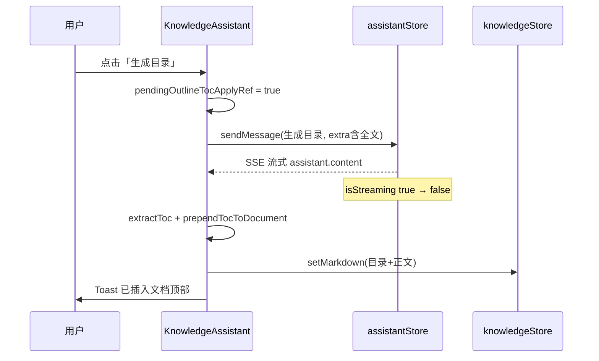

# 知识库助手：「生成目录」完成后自动写入编辑器文首

> **延伸阅读**  
> - 快捷卡片与 `extraUserContentForModel`：[knowledge-assistant-prompt-cards.md](./knowledge-assistant-prompt-cards.md)  
> - 助手总览：[knowledge-assistant-complete.md](./knowledge-assistant-complete.md) §13

## 1. 背景与目标

### 1.1 用户视角

用户使用知识库 AI 模式点击 **「生成目录」** 快捷卡后，模型会在助手气泡中返回可粘贴的 Markdown 目录。原先需要用户手动复制并贴到左侧编辑器文首；若文档顶部已有目录，也不应重复插入。

### 1.2 技术目标

| 目标 | 做法 |
|------|------|
| 流式结束后自动写入 | 监听 `assistantStore.isStreaming` 由 true→false，且本轮为 outline 快捷卡 |
| 文首去重 | `documentHasLeadingToc` 检测已有 `## 目录` 或锚点列表 |
| 解析助手回复 | `extractTocBlockFromAssistantReply` 抽取目录块（可剥掉外层 markdown 围栏） |
| 合并正文 | `prependTocToDocument`：目录 + 空行 + 原正文 |
| 用户反馈 | Toast：已插入 / 已有目录跳过 |

若与仓库最新源码不一致，**以源码为准**。

---

## 2. 改动范围

| 路径 | 说明 |
|------|------|
| `apps/frontend/src/views/knowledge/utils.ts` | 目录检测、提取、prepend、匹配 outline 轮次 |
| `apps/frontend/src/views/knowledge/KnowledgeAssistant.tsx` | `pendingOutlineTocApplyRef` + `useEffect` 写入逻辑 |
| `apps/frontend/src/i18n/locales/zh-CN.ts` | `tocAlreadyAtTop` / `tocPrependedToDoc` |
| `apps/frontend/src/i18n/locales/en-US.ts` | 英文 Toast |

**未改**：后端 API；`sendMessage` / `extraUserContentForModel` 契约；RAG 模式（不触发 outline 写入）。

---

## 3. 实现思路

### 3.1 为何在 `KnowledgeAssistant` 而非 Store

- 写入目标是 **`knowledgeStore.markdown`**（左侧 Monaco），属于知识页领域状态，不宜塞进通用 `assistantStore`。
- 需同时读 `knowledgeStore.markdown` 与 `assistantStore.messages`，放在已聚合两者的 `KnowledgeAssistant` 最直接。

### 3.2 触发条件（须同时满足）

1. 用户点击 **`kind === 'outline'`** 快捷卡且 `sendMessage` 真正入队（`messages.length` 有增长）。
2. **`pendingOutlineTocApplyRef`** 在发送前置 true，流式结束处置 false。
3. **`wasStreaming` → `!streaming`** 边沿（避免挂载时误触）。
4. **`findCompletedOutlineAssistantReply`** 找到 user 气泡为「生成目录」且下一条 assistant 已结束、未中断、有正文。
5. 文首 **`!documentHasLeadingToc`**；否则 Toast 提示已有目录。
6. **`extractTocBlockFromAssistantReply`** 非空；解析失败则静默跳过（模型可能只给说明文字）。

### 3.3 文首「已有目录」判定

- 第一个非空块的首行匹配 `^#{1,6}\s*(目录|Table of Contents|TOC|Contents)`（不区分大小写），或  
- 首块内至少 2 行且均为 `- [text](#anchor)` 形式（无标题的纯锚点目录列表）。

### 3.4 与「保存到知识库」操作条的区别

| 能力 | 行为 |
|------|------|
| `onSaveToKnowledge`（消息操作条） | 将**整段**助手正文 **追加** 到文档末尾 |
| 本功能（outline 自动） | 仅 **目录块** **prepend** 到文首，且仅 outline 一轮 |

---

## 4. 关键代码与注释

### 4.1 常量与 outline 用户短句

**来源**：`apps/frontend/src/views/knowledge/utils.ts`（约 L1–L16）

```typescript
/** 与快捷卡 userMessageShort、i18n 标题「生成目录」一致 */
export const KNOWLEDGE_ASSISTANT_OUTLINE_USER_SHORT = '生成目录';

const TOC_HEADING_LINE_RE =
  /^#{1,6}\s*(目录|Table\s+of\s+Contents|TOC|Contents)\s*$/i;
const TOC_LIST_ITEM_RE = /^[-*+]\s+\[[^\]]+\]\([^)]+\)\s*$/;
```

### 4.2 文首是否已有目录

**来源**：`apps/frontend/src/views/knowledge/utils.ts`（`documentHasLeadingToc` 约 L93–L111）

```typescript
export function documentHasLeadingToc(markdown: string): boolean {
  const trimmed = markdown.trimStart();
  const firstBlock = trimmed.split(/\n{2,}/)[0] ?? '';
  // 说明：先看首块第一行是否为「目录」标题
  // 再看首块是否全是锚点列表项（至少 2 条）
  // ...
}
```

### 4.3 从助手回复提取目录块

**来源**：`apps/frontend/src/views/knowledge/utils.ts`（`extractTocBlockFromAssistantReply` 约 L113–L174）

```typescript
export function extractTocBlockFromAssistantReply(content: string): string | null {
  let text = content.trim();
  // 说明：若整段包在 ```markdown 围栏内，先剥围栏
  const wholeFence = text.match(/^```(?:markdown|md)?\s*\n([\s\S]*?)\n```\s*$/);
  if (wholeFence) text = wholeFence[1].trim();

  // 说明：从「## 目录」或首条锚点列表起扫描，遇非目录段落即截断
  // ...
}
```

### 4.4 匹配最近一轮「生成目录」助手消息

**来源**：`apps/frontend/src/views/knowledge/utils.ts`（`findCompletedOutlineAssistantReply` 约 L187–L209）

```typescript
export function findCompletedOutlineAssistantReply(messages: Message[]): Message | null {
  for (let i = messages.length - 1; i >= 0; i--) {
    if (messages[i].role !== 'user') continue;
    if (messages[i].content?.trim() !== KNOWLEDGE_ASSISTANT_OUTLINE_USER_SHORT) continue;
    const assistant = messages[i + 1];
    if (assistant?.role === 'assistant' && !assistant.isStreaming && !assistant.isStopped) {
      return assistant;
    }
    return null; // 说明：有 user 无有效 assistant 则本轮失败
  }
  return null;
}
```

### 4.5 发送 outline 时打标 + 流式结束写入

**来源**：`apps/frontend/src/views/knowledge/KnowledgeAssistant.tsx`（`sendKnowledgePromptCard` 摘录约 L493–L509）

```typescript
const messagesLenBefore = assistantStore.messages.length;
if (kind === 'outline') {
  pendingOutlineTocApplyRef.current = true;
}
await assistantStore.sendMessage(userMessageShort, { extraUserContentForModel });
// 说明：发送未入队（长度不变）时清除标记，避免下次其它回复误触发
if (kind === 'outline' && assistantStore.messages.length === messagesLenBefore) {
  pendingOutlineTocApplyRef.current = false;
}
```

**来源**：`apps/frontend/src/views/knowledge/KnowledgeAssistant.tsx`（`useEffect` 约 L519–L561）

```typescript
useEffect(() => {
  if (isRagMode) return;
  const streaming = assistantStore.isStreaming;
  const wasStreaming = wasAssistantStreamingRef.current;
  wasAssistantStreamingRef.current = streaming;

  if (!wasStreaming || streaming || !pendingOutlineTocApplyRef.current) return;
  pendingOutlineTocApplyRef.current = false;

  const assistant = findCompletedOutlineAssistantReply(assistantStore.messages);
  if (!assistant) return;
  if (documentHasLeadingToc(knowledgeStore.markdown ?? '')) {
    Toast({ type: 'info', title: t('knowledge.assistant.tocAlreadyAtTop') });
    return;
  }
  const tocBlock = extractTocBlockFromAssistantReply(assistant.content ?? '');
  if (!tocBlock) return;

  knowledgeStore.setMarkdown(prependTocToDocument(knowledgeStore.markdown ?? '', tocBlock));
  Toast({ type: 'success', title: t('knowledge.assistant.tocPrependedToDoc') });
}, [/* isRagMode, isStreaming, messages, knowledgeStore, t */]);
```

---

## 5. 数据流



---

## 6. 兼容性与影响

| 项 | 说明 |
|----|------|
| 破坏性 | 无 API 变更；仅 outline 成功完成后可能改左侧 markdown |
| 撤销 | 未自动接入 undo；用户可用编辑器撤销 |
| 多轮 outline | 每次成功完成且文首无目录时都会 prepend；已有目录则跳过 |
| 持久化 | 与手动编辑相同，需用户保存条目后落库 |
| RAG 模式 | `isRagMode` 早退，不写入 |

---

## 7. 建议回归

1. 左侧有正文 → 点「生成目录」→ 流式结束 → 编辑器文首出现目录块，助手区 Toast「已将生成的目录插入文档顶部」。
2. 文首已有 `## 目录` → 再点「生成目录」→ Toast「文档开头已有目录，未重复插入」，正文不变。
3. 流式中点停止 → 不应写入（`isStopped` 或找不到有效 assistant）。
4. 未登录 / 无正文 → 仍被 `sendKnowledgePromptCard` 前置校验拦截，不置 pending 标记。
5. 模型回复无目录结构（仅文字说明）→ 静默不写入，不 Toast 成功。

---

## 8. 相关源码路径

| 说明 | 路径 |
|------|------|
| 目录工具函数 | `apps/frontend/src/views/knowledge/utils.ts` |
| 写入时机 | `apps/frontend/src/views/knowledge/KnowledgeAssistant.tsx` |
| outline 快捷 prompt | `utils.ts` → `buildKnowledgeAssistantDocumentMessage` case `outline` |
| 快捷卡配置 | `apps/frontend/src/views/knowledge/constants.ts` |
| 中文文案 | `apps/frontend/src/i18n/locales/zh-CN.ts` |
