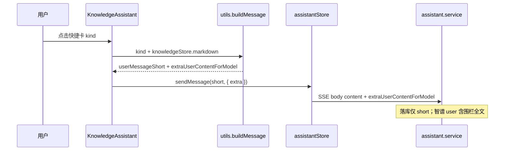

# 知识库助手：文档快捷卡片（四入口）

> **延伸阅读**  
> - 快捷卡片与 `extraUserContentForModel` 后端契约总览：[knowledge-assistant-complete.md](./knowledge-assistant-complete.md) §13  
> - 持久化 / Ephemeral 发送路径：[knowledge-assistant-ephemeral-persistence.md](./knowledge-assistant-ephemeral-persistence.md)

## 1. 背景与目标

### 1.1 用户视角

知识库 **AI 模式**下，左侧编辑器有正文时，助手空会话首屏与流式结束后的条带需提供**一键文档操作**：在不全文塞进聊天气泡的前提下，让模型基于当前 Markdown 完成润色、总结、生成目录、扩写等任务。

### 1.2 技术目标

| 目标 | 做法 |
|------|------|
| 扩展能力 | `KnowledgeAssistantPromptKind` 由 2 种增至 4 种 |
| 标题精简 | 中文 `titleKey` 统一为 **四字**（与气泡短句一致） |
| 模型可见全文 | 仍走 `extraUserContentForModel` + 文档围栏，后端拼接逻辑不变 |
| 四卡布局 | 首屏 `grid-cols-2`；流式后条带 `flex-1` 均分 |

若与仓库最新源码不一致，**以源码为准**。

---

## 2. 改动范围

| 路径 | 说明 |
|------|------|
| `apps/frontend/src/views/knowledge/constants.ts` | `kind` 联合类型、`KNOWLEDGE_ASSISTANT_PROMPTS` 四项配置与图标 |
| `apps/frontend/src/views/knowledge/utils.ts` | `buildKnowledgeAssistantDocumentMessage`：`switch` 四类短句 + 长 prompt |
| `apps/frontend/src/i18n/locales/zh-CN.ts` | 四字标题与描述文案 |
| `apps/frontend/src/i18n/locales/en-US.ts` | 英文标题与描述 |
| `apps/frontend/src/views/knowledge/KnowledgeAssistant.tsx` | 首屏 2×2 网格、流式后快捷条、`sendKnowledgePromptCard` |
| `apps/frontend/src/views/knowledge/KnowledgeAssistantEntryToolbar.tsx` | 边框 `border-theme/5` 等与助手面板视觉统一（次要） |
| `apps/frontend/src/views/knowledge/KnowledgeMessageBubble.tsx` | 气泡边框透明度微调（次要） |

**未改**：后端 `AssistantChatDto`、`assistant.service` 拼接逻辑；RAG 模式不展示文档快捷卡片（`sendKnowledgePromptCard` 内 `if (isRagMode) return`）。

---

## 3. 实现思路

### 3.1 为何新增 `outline` / `expand`

- **润色 / 总结**：原有能力，分别优化表达与压缩信息。
- **outline（生成目录）**：按标题层级输出可粘贴文首的 Markdown 目录（锚点链接），与「总结」不同——总结是摘要，目录是导航结构。
- **expand（扩写）**：在保留主旨下充实背景与例证，与「总结」方向相反。

四类共用同一发送管道，避免为每种操作单独写 SSE 分支。

### 3.2 短句 + 长文的契约（不变）

1. **`userMessageShort`**：写入气泡、`assistant_messages.content`（四字中文）。
2. **`extraUserContentForModel`**：任务说明 + `--- 文档 ---` 围栏全文，仅服务端并入智谱 user 消息。
3. **`docFence` 抽取**：`utils.ts` 内统一拼接，减少四类 prompt 重复。

### 3.3 UI 布局

- **空会话 + 有正文**：`grid grid-cols-2 gap-3` 展示 4 张卡片（原单行 `flex` 在 4 项时过挤）。
- **流式结束后**：`showPostStreamActions` 条带改为 `flex justify-between` + 每项 `flex-1`，仅显示图标 + 四字标题，节省纵向空间。
- **前置条件**：与原先一致——须登录、左侧有正文、非发送/流式/加载中；否则 Toast 提示。

### 3.4 文案约定

| kind | 标题（zh） | 用户气泡 | 模型任务要点 |
|------|------------|----------|----------------|
| `polish` | 润色文档 | 润色文档 | 润色优化全文，保留原意与代码块 |
| `summarize` | 总结文档 | 总结文档 | 中文总结，不必贴全文 |
| `outline` | 生成目录 | 生成目录 | 文首 Markdown 目录，锚点链接 |
| `expand` | 扩写文档 | 扩写文档 | 扩写全文或先列要点再全文 |

---

## 4. 关键代码与注释

### 4.1 常量与卡片配置

**来源**：`apps/frontend/src/views/knowledge/constants.ts`（约 L13–L58）

```typescript
/** 与 buildKnowledgeAssistantDocumentMessage 的 switch 分支一一对应 */
export type KnowledgeAssistantPromptKind =
  | 'polish'
  | 'summarize'
  | 'outline'   // 说明：生成 Markdown 目录，非「大纲摘要」
  | 'expand';

export const KNOWLEDGE_ASSISTANT_PROMPTS: KnowledgeAssistantPromptItem[] = [
  { kind: 'polish', icon: Sparkle, titleKey: '...polish.title', ... },
  { kind: 'summarize', icon: Sparkles, ... },
  { kind: 'outline', icon: ListTree, ... },  // 说明：目录 / 树形结构语义
  { kind: 'expand', icon: PenLine, ... },
];
```

### 4.2 构建短句与模型侧长 prompt

**来源**：`apps/frontend/src/views/knowledge/utils.ts`（`buildKnowledgeAssistantDocumentMessage` 约 L43–L79）

```typescript
const docFence = `--- 文档 ---\n${doc}\n--- 文档结束 ---`;

switch (kind) {
  case 'outline':
    return {
      userMessageShort: '生成目录', // 说明：四字，与 i18n title 一致
      extraUserContentForModel: `请根据以下「当前知识库文档」全文，生成一份可直接粘贴在文首的 Markdown **目录**：…

${docFence}`,
    };
  case 'expand':
    return {
      userMessageShort: '扩写文档',
      extraUserContentForModel: `请根据以下「当前知识库文档」全文进行扩写：…

${docFence}`,
    };
  // polish / summarize 同理
}
```

### 4.3 发送入口

**来源**：`apps/frontend/src/views/knowledge/KnowledgeAssistant.tsx`（`sendKnowledgePromptCard` 约 L454–L492）

```typescript
const sendKnowledgePromptCard = useCallback(async (kind: KnowledgeAssistantPromptKind) => {
  if (isRagMode) return; // 说明：RAG 不做「当前编辑器全文」类快捷操作
  // ... 登录、正文、忙碌态校验
  const { userMessageShort, extraUserContentForModel } =
    buildKnowledgeAssistantDocumentMessage(kind, knowledgeStore.markdown ?? '');
  await assistantStore.sendMessage(userMessageShort, { extraUserContentForModel });
}, [/* ... */]);
```

### 4.4 首屏 2×2 与流式后条带

**来源**：`apps/frontend/src/views/knowledge/KnowledgeAssistant.tsx`（约 L660–L685、L751–L765）

```tsx
{/* 空会话 + editorHasBody：四宫格快捷卡 */}
<div className="grid w-full grid-cols-2 gap-3">
  {KNOWLEDGE_ASSISTANT_PROMPTS.map((item) => (
    <button onClick={() => void sendKnowledgePromptCard(item.kind)}>...</button>
  ))}
</div>

{/* showPostStreamActions：流式结束后同款 kind，紧凑横条 */}
<div className="mb-3 flex justify-between min-w-0 gap-1.5 mr-10">
  {KNOWLEDGE_ASSISTANT_PROMPTS.map((item) => (
    <Button variant="link" className="flex-1 ..." onClick={...}>
      <item.icon />
      {t(item.titleKey)}
    </Button>
  ))}
</div>
```

### 4.5 i18n 四字标题（中文）

**来源**：`apps/frontend/src/i18n/locales/zh-CN.ts`（`knowledge.assistant.prompts.*.title` 附近）

```typescript
'knowledge.assistant.prompts.polish.title': '润色文档',
'knowledge.assistant.prompts.summarize.title': '总结文档',
'knowledge.assistant.prompts.outline.title': '生成目录',
'knowledge.assistant.prompts.expand.title': '扩写文档',
```

---

## 5. 数据流



---

## 6. 兼容性与影响

| 项 | 说明 |
|----|------|
| API | 无变更；仍用既有 `extraUserContentForModel` 可选字段 |
| 历史会话 | 旧气泡仍为「润色文档内容」等长标题，仅展示差异，无迁移 |
| RAG | 快捷卡不展示/不响应（逻辑层 `isRagMode` 拦截） |
| 多轮追问 | 历史 user 行无文档全文；再次操作需重新点快捷卡（与 §13 取舍一致） |

---

## 7. 建议回归

1. 左侧有正文、AI 模式、空会话：见 4 张四字卡片，点击「生成目录」气泡为「生成目录」，回复应含目录块而非全文摘要。
2. 流式结束后：消息下方横条 4 按钮可再次触发，且与首屏 `kind` 行为一致。
3. 无正文 / 未登录 / 流式中：Toast 拦截，不发 SSE。
4. RAG 模式：无文档快捷卡（或点击无效果）。
5. 持久化会话：DB 中 user 行 `content` 仅为四字短句；抓包最后一条 user 含 `--- 文档 ---`。

---

## 8. 相关源码路径

| 说明 | 路径 |
|------|------|
| 卡片常量 | `apps/frontend/src/views/knowledge/constants.ts` |
| Prompt 构建 | `apps/frontend/src/views/knowledge/utils.ts` |
| UI 与发送 | `apps/frontend/src/views/knowledge/KnowledgeAssistant.tsx` |
| 中文文案 | `apps/frontend/src/i18n/locales/zh-CN.ts` |
| 后端 extra 拼接 | `apps/backend/src/services/assistant/assistant.service.ts` |
| DTO | `apps/backend/src/services/assistant/dto/assistant-chat.dto.ts` |
| 契约总览 | `docs/knowledge/knowledge-assistant-complete.md` §13 |
