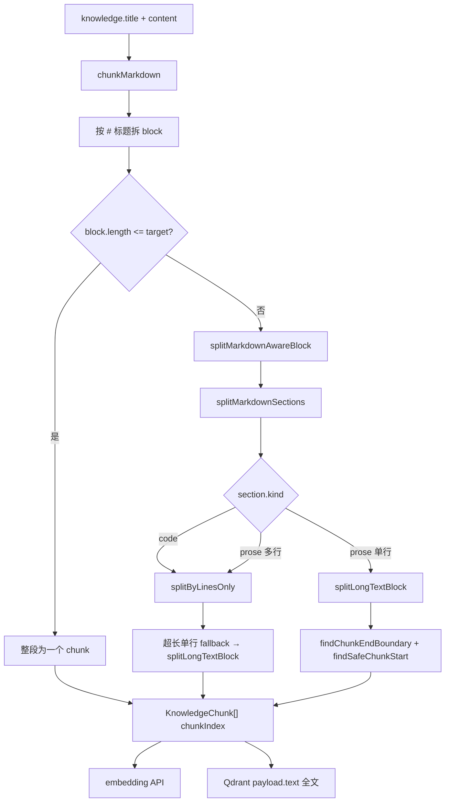

# 知识库向量分片（Chunk）实现方案

> **文档角色**：知识库入库前 **Markdown → 分片（chunk）→ embedding → Qdrant payload** 的**主文档**（语义边界、代码围栏、overlap）。  
> **延伸阅读**：[vector-bge-global-round.md](./vector-bge-global-round.md)（BGE 档位 200 字、分批 upsert、Unicode 清洗）、[siliconflow-vector-full-url.md](./siliconflow-vector-full-url.md)（`chunkMarkdown` 与档位）、[knowledge-rag-implementation-backend.md](./knowledge-rag-implementation-backend.md)（RAG 检索消费 `payload.text`）。

## 1. 背景与目标

### 1.1 问题

知识库文章保存后会执行 **向量化入库**：正文切成多段，每段生成 embedding 向量，并将 **分片全文** 写入 Qdrant 的 `payload.text`。RAG 命中后直接把该字段拼进上下文，**不再**从 MySQL `knowledge.content` 回源。

旧实现存在三类缺陷：

| 现象 | 根因 |
|------|------|
| Qdrant 里出现 `ole.log(result)`，丢失 `console` | 按 **固定字符数**（BGE 档约 200）滑动切分，断点落在 `console.log` 标识符中间 |
| overlap 后下一片仍从词中开始 | overlap 起点未对齐；曾错误回退到 **全文第一行**，跳过中间内容 |
| 代码示例无 opening ` ``` `、仅行尾 ` ``` ` 仍被当「正文」硬切 | 围栏解析只认「行首 ` ``` `」，整段代码走字符滑动切分 |
| emoji 分片边界孤立 surrogate | UTF-16 码元边界切断 emoji，payload JSON 可能 400 |

用户看到的 `contentHash` / `text` 末尾 `…` 多为 **Qdrant Dashboard 展示截断**；应用 `console.log` → `ole.log` 则是 **真实分片错误**。

### 1.2 目标

- 分片 **语义可读**：代码行完整、`console.log` 等标识符不被拦腰截断。
- **Markdown 感知**：代码围栏内按行打包；兼容「仅行尾闭合 ` ``` `」的写法。
- 与现有档位参数兼容：`default`（BGE）约 200 字 + overlap 32；`member`（Qwen3）约 2000 + overlap 128。
- 逻辑集中在 `knowledge-chunk.ts`，`chunkMarkdown` 只负责标题分块与调用入口。

若与仓库最新源码不一致，**以源码为准**。

---

## 2. 改动范围

| 路径 | 说明 |
|------|------|
| `apps/backend/src/utils/knowledge-chunk.ts` | **新增**：分片算法全集（标识符边界、按行、围栏、Markdown 编排） |
| `apps/backend/src/utils/knowledge-chunk.spec.ts` | 单元测试（`console.log`、`years old ```` 等） |
| `apps/backend/src/services/knowledge-embedding/knowledge-embedding.service.ts` | `chunkMarkdown` 超长块改为 `splitMarkdownAwareBlock`；移除内联 `sliceUtf16Safe` 滑动循环 |

**未改**：`indexKnowledge` 写 Qdrant、`KNOWLEDGE_DEFAULT_CHUNK_TARGET_CHARS` 常量值、embedding API 侧 `KNOWLEDGE_BGE_EMBEDDING_MAX_CHARS` 截断（仅影响向量计算，不截 payload）。

---

## 3. 端到端数据流



**要点**：

1. **payload.text = 分片结果全文**（经 `sanitizeKnowledgeStorageText` 清洗），RAG 直接引用。
2. **chunkIndex** 为文章内从 0 递增的序号，与 Qdrant point id（`randomUUID`）无关。
3. **重新保存**才会 delete 旧点 + upsert 新分片；仅升级后端不改旧条目无效。

---

## 4. 分片参数（按向量档位）

**来源**：`apps/backend/src/utils/create-llm.ts`（约 L167–175）、`chunkMarkdown`（约 L738–742）

| 档位 `tier` | 目标长度 `target` | overlap | 典型 collection |
|-------------|-------------------|---------|-----------------|
| `default`（BGE） | `KNOWLEDGE_DEFAULT_CHUNK_TARGET_CHARS` = **200** | **32** | `knowledge_chunks_v2` |
| `member`（Qwen3） | **2000** | **128** | `knowledge_chunks_qwen3_2560` |

`chunkMarkdown` 根据作者向量档位（`resolveChunkTierForAuthor`）选择 `target/overlap`，再调用 `splitMarkdownAwareBlock`。

---

## 5. 分层实现思路

### 5.1 第一层：标题优先（`chunkMarkdown`）

**来源**：`apps/backend/src/services/knowledge-embedding/knowledge-embedding.service.ts`（`chunkMarkdown` 约 L728–767）

```typescript
// 说明：标题与正文合并为 raw，再按 Markdown 标题行拆成多个 block
const raw = `${input.title?.trim() || ''}\n\n${input.content ?? ''}`.trim();
const lines = raw.split(/\r?\n/);
// 遇到 #{1,6} 标题且 buf 非空时，先 flush 上一个 block
for (const line of lines) {
  const isHeading = /^#{1,6}\s+/.test(line);
  if (isHeading && buf.length > 0) {
    blocks.push(buf.join('\n').trim());
    buf = [];
  }
  buf.push(line);
}
// 说明：每个 block 若超过 target，交给 splitMarkdownAwareBlock
chunks.push(...splitMarkdownAwareBlock(b, target, overlap));
```

**设计取舍**：标题边界优先于长度，保证同一小节尽量在同 block 内再细分；极长无标题代码清单仍会在 block 内二次切分。

### 5.2 第二层：Markdown 围栏（`splitMarkdownSections`）

**来源**：`apps/backend/src/utils/knowledge-chunk.ts`（约 L208–283）

将 block 拆为 `prose` / `code` 两类 **section**：

| 触发条件 | 行为 |
|----------|------|
| 整行匹配 opening fence：`^```[\w-]*$` | 进入 `code` 模式 |
| `prose` 模式下某行含 ` ``` `（如 `years old ````） | 该行之前累积内容视为 **code**，行内 ` ``` ` 前为代码最后一行 |
| `code` 模式下非整行 opening 的行尾 ` ``` ` | 闭合代码块，后续为 prose |

**为何要做行尾闭合**：面试题、笔记里常见「代码后直接跟 ` ``` `」且 **没有** 独立 opening 行，旧逻辑整段当 prose 走字符切分，是 `ole.log` 高发场景。

### 5.3 第三层：按 section 类型选策略（`splitMarkdownAwareBlock`）

**来源**：`apps/backend/src/utils/knowledge-chunk.ts`（约 L297–320）

```typescript
// 说明：code 段 → 仅按行打包；prose 多行 → 同样按行；单行 prose → 字符滑动 + 语义边界
if (section.kind === 'code') {
  chunks.push(...splitByLinesOnly(section.text, target, overlap));
} else {
  chunks.push(...splitMultilineSection(section.text, target, overlap));
}
```

**按行切（`splitByLinesOnly`）**：

- 贪心累加行，超过 `target` 则 flush 当前包。
- overlap：从上一包末尾 **整行** 回退，累计字符达到 `overlap`。
- 某单行长度 > `target`：fallback 到 `splitLongTextBlock`（极少见）。

### 5.4 第四层：字符滑动 + 语义边界（`splitLongTextBlock`）

用于 **无换行超长串** 或 **按行 fallback**。

**断点选择（`findChunkEndBoundary`）**：

1. 在 `[minEnd, preferredEnd]` 内从后向前扫描，`minEnd ≈ start + target/2`，避免片过短。
2. **跳过**落在标识符内部的断点（`isInsideIdentifier`：`console.log`、`$foo`、`.` 链式调用视为一体）。
3. **优先级**：换行(5) > 空白(4) > `;{})` 等(3) > 非标识符边界(2)。
4. 若仍落在词中：**向前延伸**到下一安全边界，或下一换行，最后才 **扩展到全文末尾**（禁止 mid-word 硬切）。

**overlap 起点（`findSafeChunkStart`）**：

1. 从 `end - overlap` 起，若落在标识符内则前进到边界。
2. 若可回退到 **本行首** 且 `lineStart >= minPos`，则对齐行首（完整 `console.log(...)` 行）。
3. **禁止** `lineStart < minPos` 时跳到文档第一行（修复「跳过中间内容」bug）。
4. 若仍无法前进：`i = end` 强制推进，避免死循环。

**UTF-16（`sliceUtf16Safe`）**：在最终 `[i, end)` 切片时避开 surrogate 对中间，与 [vector-bge-global-round.md](./vector-bge-global-round.md) §4.5 一致。

---

## 6. 关键代码与注释

### 6.1 标识符内不断开

**来源**：`apps/backend/src/utils/knowledge-chunk.ts`（`isInsideIdentifier` 约 L22–40）

```typescript
// 说明：断点 breakAt 左侧字符与右侧字符是否仍属于同一「标识符 token」
export function isInsideIdentifier(text: string, breakAt: number): boolean {
  const left = text[breakAt - 1]!;
  const right = text[breakAt]!;
  // 说明：字母数字下划线 $；以及 console . log 这种点号两侧都有标识符字符的情况
  const leftPart =
    isIdentChar(left) ||
    (left === '.' && breakAt >= 2 && isIdentChar(text[breakAt - 2]!) && isIdentChar(right));
  const rightPart =
    isIdentChar(right) ||
    (right === '.' && isIdentChar(left) && breakAt + 1 < text.length && isIdentChar(text[breakAt + 1]!));
  return leftPart && rightPart;
}
```

### 6.2 行尾闭合围栏

**来源**：`apps/backend/src/utils/knowledge-chunk.ts`（`splitMarkdownSections` 内 prose 分支约 L248–258）

```typescript
if (mode === 'prose') {
  const close = splitClosingFenceLine(line); // 正则 ^(.*?)`{3,}\s*(.*)$
  if (close && /`{3,}/.test(line)) {
    const codeLines = [...buf];
    if (close.before.trim()) codeLines.push(close.before); // 如 console.log... years old
    if (codeText) sections.push({ kind: 'code', text: codeText });
    buf = [];
    if (close.after.trim()) buf.push(close.after); // ``` 后的用途列表等
    continue;
  }
}
```

### 6.3 overlap 窗口内对齐行首

**来源**：`apps/backend/src/utils/knowledge-chunk.ts`（`findSafeChunkStart` 约 L112–123）

```typescript
export function findSafeChunkStart(text: string, minPos: number): number {
  const min = Math.max(0, minPos);
  let pos = min;
  while (pos < text.length && isInsideIdentifier(text, pos)) {
    pos++; // 说明：先走出 console.log 等 token 内部
  }
  if (pos <= min) return min;
  const lineStart = text.lastIndexOf('\n', pos - 1) + 1;
  // 说明：仅当行首仍在 overlap 窗口内才回退，避免跳到全文 line 0
  if (lineStart >= min && lineStart < pos) return lineStart;
  return pos;
}
```

---

## 7. 与 embedding / Qdrant 的边界

| 环节 | 是否截断 `text` | 说明 |
|------|-----------------|------|
| `chunkMarkdown` → payload | **否** | 完整分片写入 Qdrant |
| BGE `normalizeEmbeddingInput` | **是**（最多 200 字） | 仅发给 embedding API；检索上下文仍用 payload 全文 |
| Qdrant Dashboard | **展示省略** | `contentHash` 固定 64 位仍显示 `…` 属 UI |

因此：**修复分片后 RAG 上下文以 payload 为准**；若 embedding 输入被截断，可能影响向量质量，但不会出现 payload 内 `ole.log`（那是分片 bug，不是 embedding 截断）。

---

## 8. 兼容性与运维

| 维度 | 说明 |
|------|------|
| 破坏性 | 无 API 变更；**已入库向量不会自动更新** |
| 必须操作 | 对受影响文章 **重新保存** 触发 `indexKnowledge`（delete + upsert） |
| 回归建议 | ① 含 ` ``` ` 代码块的长文 ② 行尾 ` ``` ` 无 opening ③ ES6 面试题类多代码段 ④ RAG 问「highlight 函数」应命中含 `function highlight` 的分片 |
| 单元测试 | `pnpm test -- knowledge-chunk.spec.ts` |

---

## 9. 后续可做

- 将 `KNOWLEDGE_DEFAULT_CHUNK_TARGET_CHARS` 提至 400–480（BGE 约 512 token），减少单片过短（需重算向量）。
- Qdrant 只存 `knowledgeId + chunkIndex`，RAG 时从 DB 按 **相同算法版本** 还原正文（需持久化 chunk 或算法版本号）。
- Parent-child：小片检索、大片作 parent 上下文。

---

## 10. 相关源码路径

| 说明 | 路径 |
|------|------|
| 分片算法 | `apps/backend/src/utils/knowledge-chunk.ts` |
| 分片测试 | `apps/backend/src/utils/knowledge-chunk.spec.ts` |
| 标题 + 入库编排 | `apps/backend/src/services/knowledge-embedding/knowledge-embedding.service.ts` |
| 分片长度常量 | `apps/backend/src/utils/create-llm.ts` |
| RAG 消费 payload.text | `apps/backend/src/services/knowledge-qa/knowledge-qa.service.ts` |
| Qdrant upsert | `apps/backend/src/services/qdrant/qdrant.service.ts` |
