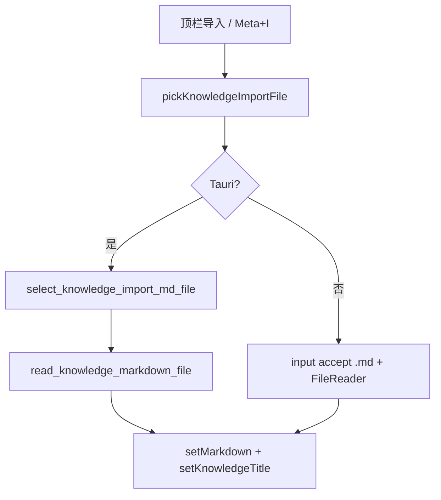

# 知识库编辑器：从本地 `.md` 导入

> 页面快捷键总览见 [`shortcuts.md`](./shortcuts.md)。Monaco 与保存链路见 [`local-folder-and-monaco-sync.md`](./local-folder-and-monaco-sync.md)。

## 1. 背景与目标

### 1.1 用户问题

知识库顶栏需要「导入」：把本地 Markdown 文件内容写入当前编辑器草稿，而不是仅能从知识库列表 / 本地目录打开已有条目。

### 1.2 本轮目标

| 项 | 说明 |
|----|------|
| 文件类型 | **仅 `.md`**（非 md 拒绝并 Toast） |
| 写入行为 | 替换 `knowledgeStore.markdown`；**每次导入**用文件名更新 `knowledgeTitle`（去掉 `.md` 后缀） |
| 单文件上限 | 5MB |
| 桌面端 | 系统文件对话框过滤器为 **Markdown (*.md)**，不依赖可被用户改成「所有文件」的 Web `accept` |
| 快捷键 | 默认 **Meta + I**，`shortcut_24`，可在系统设置配置 |

若与仓库最新源码不一致，**以源码为准**。

---

## 2. 改动范围

| 说明 | 路径 |
|------|------|
| 导入编排 | `apps/frontend/src/views/knowledge/index.tsx` |
| 顶栏按钮 | `apps/frontend/src/views/knowledge/KnowledgeEditorToolbar.tsx` |
| 选择与读取（Web / Tauri 分支） | `apps/frontend/src/views/knowledge/knowledge-import.ts`（新建） |
| Tauri invoke 封装 | `apps/frontend/src/utils/knowledge-save.ts` |
| Tauri 命令 | `apps/frontend/src-tauri/src/command/knowledge.rs`、`lib.rs` |
| 快捷键 ID / 默认 chord | `apps/frontend/src/utils/knowledge-shortcuts.ts`、`views/setting/system/config.ts` |
| 文案 | `apps/frontend/src/i18n/locales/zh-CN.ts`、`en-US.ts` |

---

## 3. 实现思路

### 3.1 为何 `accept=".md"` 不够？

HTML `<input type="file" accept=".md">` 在 macOS / Windows 上通常只是**提示**，用户仍可在对话框中切换到「所有文件」并选中 `.txt` 等。因此采用**双轨**：

1. **Tauri**：`rfd::FileDialog` 仅注册 `["md"]` 过滤器（与「另存为」类命令一致）。
2. **Web**：`accept=".md"` + 选中后 **`isKnowledgeImportMdFile`** 校验；失败 `not_md` → Toast。

### 3.2 数据流



### 3.3 与「从列表打开」的区别

| 操作 | `knowledgeEditingKnowledgeId` | 快照 `knowledgePersistedSnapshot` |
|------|--------------------------------|-----------------------------------|
| 列表 pick | 设为条目 id | 设为打开时正文/标题 |
| **导入** | **不变**（仍在当前草稿/条目上下文） | **不变**（导入后表现为未保存脏点） |

导入不会自动切换云端条目或本地 `__local_md__` 绑定；用户需自行保存。

### 3.4 标题更新策略

早期实现仅在标题为空时填充文件名；已改为**每次成功导入**都执行 `importFileNameToTitle(fileName)`，避免连续导入 `a.md` → `b.md` 时标题仍停留在 `a`。

---

## 4. 关键代码与注释

### 4.1 统一入口：Web / Tauri 分支

**来源**：`apps/frontend/src/views/knowledge/knowledge-import.ts`（约 L95–L115）

```typescript
// 说明：桌面端走系统对话框 + 已有 read_knowledge_markdown_file；浏览器走隐藏 input
export function pickKnowledgeImportFile(): Promise<KnowledgeImportFileResult | null> {
	if (isTauriRuntime()) {
		return pickKnowledgeImportFileTauri();
	}
	return pickKnowledgeImportFileWeb();
}
```

### 4.2 页面写入 store

**来源**：`apps/frontend/src/views/knowledge/index.tsx`（`onImport` 回调，约 L715–L759）

```typescript
// 说明：正文整篇替换；标题始终跟文件名（去掉 .md）
knowledgeStore.setMarkdown(content);
const titleFromFile = importFileNameToTitle(picked.fileName);
if (titleFromFile) {
	knowledgeStore.setKnowledgeTitle(titleFromFile);
}
// 错误码：not_md | file_too_large → 对应 i18n Toast
```

### 4.3 Tauri：仅 .md 对话框

**来源**：`apps/frontend/src-tauri/src/command/knowledge.rs`（`select_knowledge_import_md_file` 附近）

```rust
// 说明：pick_file 过滤器只有 json 的同类命令在 common.rs（英语学习导入）
match FileDialog::new().add_filter("Markdown", &["md"]).pick_file() {
    Some(path) => Ok(path.to_string_lossy().to_string()),
    None => Err("canceled".to_string()),
}
```

读取仍复用 **`read_knowledge_markdown_file`**（Rust 内 `is_md_file_path` 二次校验）。

### 4.4 快捷键

**来源**：`apps/frontend/src/utils/knowledge-shortcuts.ts`（`KNOWLEDGE_SHORTCUT_KEY_IDS.import = 24`，默认 `Meta + I`）

知识页 `keydown` 捕获阶段在 `save` 之后匹配 `knowledgeChords.import`，调用 `onImport()`；与 Monaco 内组合键分层方式同 [`shortcuts.md`](./shortcuts.md)。

---

## 5. 兼容性与影响

- **破坏性**：无 API 变更；新顶栏按钮与快捷键为增量能力。
- **未登录 / 回收站预览**：导入仍只改 store 草稿，不触发云端创建。
- **自动保存**：导入后若开启自动保存，会在脏检查通过后按既有防抖逻辑落盘（见 [`auto-save.md`](./auto-save.md)）。

---

## 6. 建议回归测试

| 场景 | 操作 |
|------|------|
| Web 选 .md | 顶栏导入，正文与标题更新 |
| Web 强行选非 md | 若对话框允许「所有文件」，应 Toast「仅支持导入 .md 文件」 |
| Tauri 对话框 | 过滤器仅 Markdown；选 .md 后内容与标题正确 |
| 连续导入 | 先 `a.md` 再 `b.md`，标题应为 `b` |
| 快捷键 | Meta+I（或自定义 chord）与按钮行为一致 |
| 超大文件 | \>5MB 提示过大 |

---

## 7. 相关源码路径

| 说明 | 路径 |
|------|------|
| 导入工具 | `apps/frontend/src/views/knowledge/knowledge-import.ts` |
| 页面编排 | `apps/frontend/src/views/knowledge/index.tsx` |
| 顶栏 | `apps/frontend/src/views/knowledge/KnowledgeEditorToolbar.tsx` |
| invoke | `apps/frontend/src/utils/knowledge-save.ts` |
| Tauri | `apps/frontend/src-tauri/src/command/knowledge.rs` |

英语学习 JSON 导入的同类「严格扩展名 + Tauri 对话框」模式见 [`../english/english-learning-json-import.md`](../english/english-learning-json-import.md) §7。
