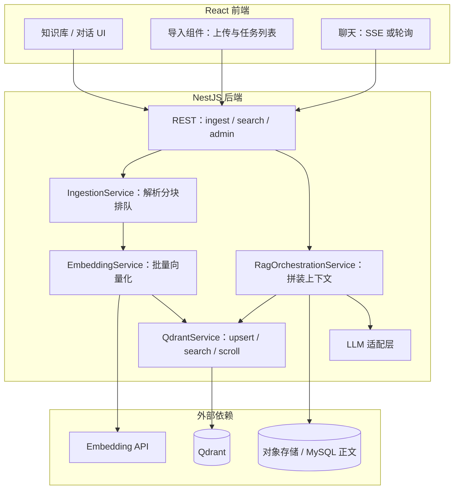

# 企业级知识库 RAG 检索：NestJS + React + 文档导入（import）+ Qdrant 实现说明

本文描述如何在 **NestJS（NestJS，Node 服务端框架）** 与 **React（React，前端 UI 库）** 组合栈中，落地 **RAG（Retrieval-Augmented Generation，检索增强生成）**：以 **Qdrant（Qdrant，向量数据库）** 存向量与元数据，通过 **文档导入（document import / ingestion，文档入库流水线）** 写入索引，并在问答时做 **向量检索 + 上下文拼装 + LLM（Large Language Model，大语言模型）** 生成。适用于 monorepo 或前后端分离仓库；与当前仓库内「知识 Markdown 落 MySQL + 助手会话」可并存——本文侧重 **向量检索层** 的通用企业级做法。

**相关文档**：知识页助手与落库语义见 `knowledge-assistant-complete.md`；本文不重复其会话协议，仅说明如何把 **检索结果** 接入同一类 `extraUserContentForModel` 或 system 上下文槽位。

---

## 1. 目标与范围

### 1.1 目标

| 能力 | 说明 |
| --- | --- |
| **可导入** | 支持用户或任务触发：单文件 / 批量 / 目录同步，将原始文档解析为可检索单元。 |
| **可索引** | 分块（chunking）、向量化（embedding）、写入 Qdrant，并保留可追溯元数据（来源、版本、权限）。 |
| **可检索** | 用户问题 → 查询向量 →（可选）关键词/BM25 混合 →（可选）重排（rerank）→ Top-K 片段。 |
| **可生成** | 将 Top-K 片段以可控模板注入 LLM，输出带 **引用（citation）** 的答案，并记录审计信息。 |
| **可运维** | 多环境配置、健康检查、重试、限流、观测指标与成本估算。 |

### 1.2 范围

- **后端**：NestJS 模块化服务、REST/SSE、与 Qdrant 的 gRPC/HTTP 客户端、与 Embedding 供应商的 HTTP 调用。
- **前端**：React 侧导入入口、任务进度、检索调试面板（可选）、对话 UI 与引用展示。
- **「import」在本文中的含义**（避免歧义）：
  1. **业务语义**：**文档导入 / 入库（ingestion）**——把文件或同步源变成向量库中的点（points）。
  2. **工程语义**：TypeScript **`import` 语句**——在 monorepo 中共享 **DTO（Data Transfer Object，数据传输对象）**、错误码、分页类型，保证前后端契约一致。
  3. **可选优化**：对重型解析器使用 **`import()` 动态导入**——按路由或 worker 懒加载，降低冷启动内存。

### 1.3 非目标

- 不绑定某一固定 Embedding 模型厂商（实现层通过接口适配）。
- 不要求替换现有关系型库中的「权威正文」；向量库是 **检索加速与语义近似** 层，正文仍以业务库或对象存储为准时可采用「仅存 chunk_id + 回源拉原文」策略。

---

## 2. 术语表

| 术语 | 含义 |
| --- | --- |
| **Collection（集合）** | Qdrant 中一类向量数据的逻辑容器；可按租户、业务域或环境拆分。 |
| **Point（点）** | 一条向量记录：含 `id`、`vector`、`payload`（元数据）。 |
| **Chunk（块）** | 对原文连续片段的切分单元；块大小影响召回粒度与 embedding 成本。 |
| **Embedding（嵌入向量）** | 将文本映射到稠密向量空间，用于相似度检索。 |
| **Hybrid search（混合检索）** | 向量相似度 + 稀疏检索（如 BM25）融合，提高专有名词命中率。 |
| **Rerank（重排）** | 对粗排 Top-N 用小模型或交叉编码器再排序，提高 Top-K 质量（本仓库已对接 DashScope `qwen3-rerank`）。 |

---

## 3. 总体架构



**数据流摘要**：

1. **导入**：文件 → 解析文本 → 分块 → embedding → `upsert` 到 Qdrant，`payload` 写业务外键。
2. **问答**：用户 query → embedding → `search` → 取 payload 回源（可选）→ 拼 prompt → LLM → 流式返回 + citations。

---

## 4. 需求规格（企业级拆分）

### 4.1 功能需求

| ID | 需求 | 验收要点 |
| --- | --- | --- |
| FR-01 | 用户可上传受支持格式并触发索引 | 返回 `jobId`，可查询状态；失败可重试 |
| FR-02 | 同一文档再导入产生 **新版本** | 旧版本可标记 `deprecated` 或按 `version` 过滤检索 |
| FR-03 | 多租户隔离 | `payload.tenant_id` 强制过滤；API 层从 JWT 注入，禁止客户端覆盖 |
| FR-04 | 检索接口支持 Top-K、score 阈值、metadata 过滤 | 单测覆盖过滤组合 |
| FR-05 | 答案需带来源引用 | 每条引用对应 `point_id` 或 `chunk_id` + 原文片段范围 |
| FR-06 | 可观测 | 记录 `latency_ms`、`token_usage`、`qdrant_collection`、错误码 |

### 4.2 非功能需求（NFR）

- **可用性**：Qdrant 不可用时 API 明确降级（503 + 重试建议），不静默吞错。
- **一致性**：写入采用 **幂等键**（如 `sha256(document_id + chunk_index + version)` 作为 point id 或 payload 字段），重复导入不产生重复语义点。
- **安全**：仅服务端持有 Qdrant API Key；前端只调自家 NestJS。
- **合规**：导入前病毒扫描（可选）、PII（Personally Identifiable Information，个人可识别信息）检测与脱敏策略可配置。

---

## 5. Qdrant 数据模型建议

### 5.1 Collection 划分策略

| 策略 | 适用 | 说明 |
| --- | --- | --- |
| 每租户一 Collection | 强隔离、大客户 | 运维成本高 |
| 单 Collection + `tenant_id` 过滤 | 中小规模默认 | **推荐起点**；所有 query 必须带 filter |

### 5.2 Payload 契约（示例）

```json
{
  "tenant_id": "uuid",
  "knowledge_id": "uuid",
  "document_id": "uuid",
  "version": 3,
  "chunk_index": 12,
  "title": "可选：章节标题",
  "uri": "可选：s3:// 或内部路径",
  "start_offset": 10240,
  "end_offset": 11200,
  "acl": ["role:editor", "user:uuid"],
  "created_at": "ISO-8601"
}
```

**约束**：

- `vector` 维度必须与 Collection 创建时维度一致；更换 embedding 模型需 **新 collection 迁移** 或 **re-embed 全量**。
- 检索时 **强制** `must: [{ key: tenant_id, match: { value: ... } }]`，防止跨租户泄漏。

### 5.3 索引与搜索参数

- 距离度量：与 embedding 模型文档一致（常见 **Cosine（余弦相似度）**）。
- `hnsw_ef`、`exact` 等参数按延迟与召回折中；生产环境建议压测后固化默认值，并允许管理员覆盖。

---

## 6. NestJS 模块设计

### 6.1 推荐目录

```
apps/backend/src/rag/
├── rag.module.ts
├── rag.controller.ts              # 对外：ingest / query / health
├── ingestion/
│   ├── ingestion.service.ts       # 编排：解析 → chunk → enqueue
│   ├── chunking.ts                # 分块策略：固定窗口 / 结构感知（Markdown 标题）
│   └── parsers/                   # pdf / docx / md 等适配器
├── embedding/
│   └── embedding.service.ts       # 批量、429 重试、维度校验
├── qdrant/
│   └── qdrant.service.ts          # 封装 @qdrant/js-client-rest 或 gRPC
├── retrieval/
│   ├── retrieval.service.ts       # search + optional hybrid + rerank
│   └── prompt-templates.ts        # system / user 模板与 max token 预算
└── dto/
    └── ...                          # 与前端共享时可抽到 packages/shared-types
```

### 6.2 核心接口（契约）

- **`POST /rag/ingest`**：multipart 或 JSON（`documentId` + 存储引用）；返回 `{ jobId }`。
- **`GET /rag/jobs/:jobId`**：状态 `pending | running | succeeded | failed` + 错误详情。
- **`POST /rag/query`**：body `{ question, knowledgeId?, topK, minScore? }`；返回 `{ chunks[], citations[] }` 或直接进入 **SSE 对话** 由服务端内部调用 retrieval。
- **`GET /rag/health`**：Nest 存活 + Qdrant ping + embedding 探测（可选轻量字符串）。

### 6.3 与队列（BullMQ）结合

企业级导入几乎必选 **异步队列**：

- API 只入队；worker 进程执行 CPU/IO 密集解析与大批量 embedding。
- 任务幂等：`jobId = hash(tenant_id + document_id + version)`。
- 死信队列（DLQ）与人工重放接口。

---

## 7. 文档导入（ingestion）流水线

### 7.1 阶段定义

| 阶段 | 输入 | 输出 | 失败处理 |
| --- | --- | --- | --- |
| P1 摄取 | 文件字节或存储 URL | 规范化文本 + MIME 检测 | 不支持格式 → 明确错误码 |
| P2 清洗 | 原始文本 | 去 BOM、统一换行、可选 HTML strip | 记录告警字段 |
| P3 分块 | 清洗文本 | `Chunk[]` | 超长单段按窗口切 |
| P4 向量化 | `Chunk[]` | `float[][]` | 429/5xx 指数退避 |
| P5 写入 | vectors + payloads | Qdrant upsert 结果 | 部分失败 batch 重试 |

### 7.2 分块策略选择

- **固定字符窗口 + overlap（重叠）**：实现简单；默认 baseline。
- **Markdown 感知**：按 `##` 标题边界优先切，减少表格/代码块被拦腰截断（可结合本仓库 `@dnhyxc-ai/tools` 的 Markdown 解析能力做结构切分，属增强项）。
- **代码仓库 RAG**：按文件/函数 AST 切分（本文不展开）。

### 7.3 版本与删除

- **软删除**：payload `deleted_at`；检索默认过滤 `deleted_at is empty`。
- **硬删除**：`delete` filter by `document_id` + `version`；或按 point id 批量删除。

---

## 8. 检索与生成编排（RAG Orchestration）

### 8.0.1 本仓库已落地：DashScope `qwen3-rerank` 的请求体结构（避免 400 参数错误）

在 DashScope 的 `text-rerank` 服务中，`query` 与 `documents` 必须放在 `input` 字段下，否则会出现类似：

- `InternalError.Algo.InvalidParameter: Field required: input.query & Field required: input.documents`

推荐请求体（与本仓库后端实现一致）：

```json
{
  "model": "qwen3-rerank",
  "input": {
    "query": "什么是重排序模型",
    "documents": [
      "重排序模型广泛应用于搜索引擎和推荐系统，按相关性对候选文本进行排序",
      "量子计算是计算科学的前沿领域",
      "预训练语言模型的发展为重排序模型带来了新的进展"
    ],
    "top_n": 2
  }
}
```

### 8.1 标准路径

1. `q = normalize(question)`（去空白、限制长度）。
2. `vq = await embedding.embedQuery(q)`。
3. `hits = await qdrant.search({ vector: vq, filter: tenant + knowledge, limit: N })`。
4. （可选）**Hybrid**：并行 BM25（如 OpenSearch）合并分数。
5. （可选）**Rerank**：取 Top-N（N>K）再精排到 Top-K。
6. **预算裁剪**：按 token 预算拼接片段，优先高分；长文档可只取每篇最高分 1 段再全局 Top-K。
7. 调用 LLM：system 中写明「仅依据给定片段作答；无依据则说不知道」；user 中带 `【片段 i】`。

### 8.2 引用（citation）格式

建议服务端返回结构化引用，前端只渲染：

```json
{
  "answer": "...",
  "citations": [
    { "pointId": "...", "knowledgeId": "...", "excerpt": "...", "score": 0.82 }
  ]
}
```

---

## 9. React 前端职责

| 区域 | 职责 |
| --- | --- |
| **导入** | `FormData` 上传、`react-query` 或 SWR 轮询 `jobId`、失败重试与取消（AbortController）。 |
| **检索调试（可选）** | 管理页展示原始 hits JSON，便于排障（权限需收紧）。 |
| **对话** | 消费 SSE；展示引用卡片；点击跳转知识详情（依赖 `knowledge_id` + `start_offset`）。 |
| **类型共享** | 从 `packages/*` 或 `shared-types` **静态 `import`** DTO，避免手写重复类型。 |

**与 `import` 语句相关的工程建议**：

- 将 `RagQueryRequest`、`RagQueryResponse`、`IngestJobStatus` 抽到 **共享包**，前端与 NestJS 共用，减少 OpenAPI 漂移。
- 大体积 Markdown 解析库若仅在导入页使用：路由级 **`import()` 懒加载** 降低首屏 bundle。

---

## 10. 配置与环境变量（示例）

```env
# Qdrant
QDRANT_URL=https://qdrant.example.com
QDRANT_API_KEY=...

# Embedding（示例占位）
EMBEDDING_PROVIDER=openai
EMBEDDING_MODEL=text-embedding-3-small
EMBEDDING_API_KEY=...

# 业务
RAG_DEFAULT_TOPK=8
RAG_MIN_SCORE=0.25
```

所有密钥仅出现在服务端；前端构建产物中不得包含 `QDRANT_*`。

---

## 11. 安全与权限

- **鉴权**：所有 `/rag/*` 路由走 JWT + RBAC（Role-Based Access Control，基于角色的访问控制）；`knowledge_id` 与 ACL 在服务端校验，不信任 query 参数。
- **提示注入**：用户问题可能包含「忽略上文」类指令；在模板中固定 **系统优先级** 并记录原始 query 哈希便于审计。
- **速率限制**：按 `tenant_id` + IP 对 `ingest` / `query` 限流，防止向量库与 embedding 账单被打爆。

---

## 12. 测试与验收清单

### 12.1 单测 / 集成测

- [ ] 无 `tenant_id` filter 的 search 在代码审查中 **不可合并**（静态规则或封装强制参数）。
- [ ] 同一文档重复导入不产生重复 point（幂等键验证）。
- [ ] Qdrant 超时与 5xx 时 API 返回约定错误体，且不部分更新成功状态为「全部成功」。

### 12.2 E2E（可选）

- [ ] 导入一篇含唯一字符串的文档 → 提问该字符串 → 回答中引用正确 `knowledge_id`。
- [ ] 删除文档后检索不应再命中（验证 filter 或硬删）。

---

## 13. 与现有仓库的衔接建议

本仓库已有 **NestJS 知识 CRUD**（如 `knowledge.controller.ts` 的 Markdown 保存）与 **React 知识页 + Assistant SSE**。引入 Qdrant 时的最小侵入路径：

1. **写路径**：在 `save` / 更新正文的 service 成功后，发送 **异步任务** 重建该 `knowledge_id` 的向量（或增量 diff 后仅更新变更块）。
2. **读路径**：在调用智谱前，`AssistantService` 内调用 `RetrievalService.retrieve(bindingId, userQuestion)`，将结果注入 `extraUserContentForModel` 或 system 片段（与 `knowledge-assistant-complete.md` 中的「仅拼进模型、可选不落库」策略对齐）。

---

## 14. 参考链接（官方文档）

- [NestJS 文档](https://docs.nestjs.com/)
- [Qdrant 文档](https://qdrant.tech/documentation/)
- [Qdrant TypeScript/JavaScript 客户端](https://github.com/qdrant/qdrant-js)

---

**文档维护**：新增环境变量、更换 embedding 维度或调整 payload 契约时，请同步更新本文 §5、§10 与前端共享类型包版本说明。
