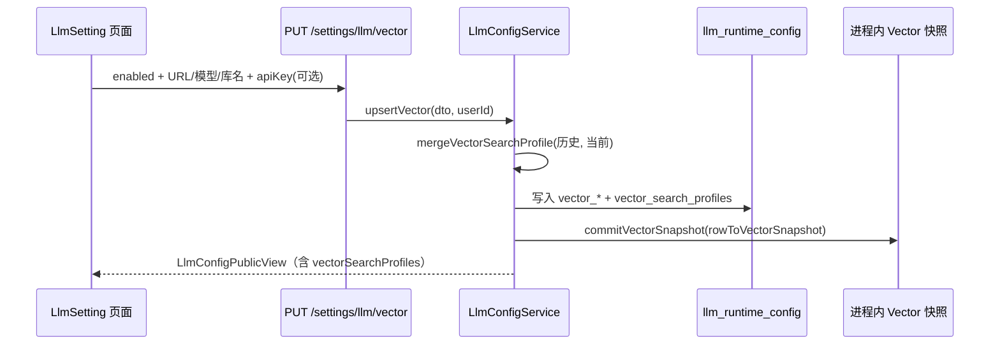
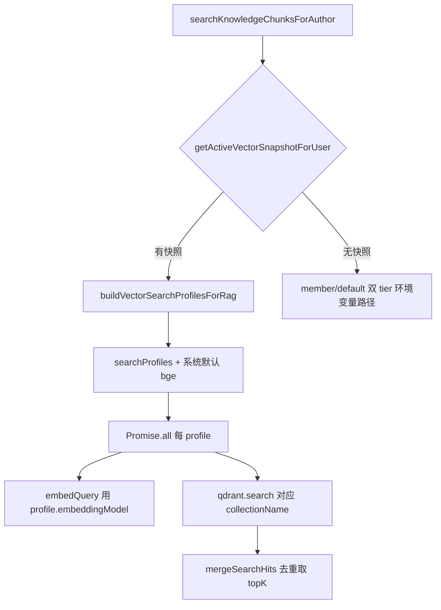

# 知识库：用户向量配置与多库 RAG 检索

> **文档角色**：本轮主文档——设置页**独立向量模型配置**、`vector_search_profiles` 累积、RAG **多向量库并行检索**及**系统默认 bge 库**始终纳入检索。  
> **延伸阅读**：[siliconflow-vector-full-url.md](./siliconflow-vector-full-url.md)（完整 URL / 分片档位）、[knowledge-member-vector-tier.md](./knowledge-member-vector-tier.md)（会员 Qwen3 双库）、[knowledge-vector-create-llm.md](./knowledge-vector-create-llm.md)（凭证与 `create-llm`）、[../llm/llm-runtime-settings.md](../llm/llm-runtime-settings.md)（对话 LLM 运行时配置）。  
> 若与仓库最新源码不一致，**以源码为准**。

---

## 1. 背景与目标

### 1.1 问题

- 对话大模型已在设置页按账号保存，但知识库 **embedding / rerank** 仍只走服务端环境变量与会员档位，用户无法自备硅基 Key 与模型。
- 用户切换向量模型或向量库名后，**新文章写入新 collection**，旧 collection 中的存量切片在 RAG 中**搜不到**。
- 会员环境变量双库（Qwen3 + bge）与用户自定义配置的行为需要清晰边界：自定义启用后应由用户配置主导，同时**不能丢掉系统默认 bge 存量**。

### 1.2 目标

1. 在 **设置 → 大模型** 页增加**向量模型**区块：API Key、Embedding / Rerank **完整 URL**、向量 / 重排模型名、向量库名；与对话大模型**独立保存、独立恢复**。
2. 每次保存将 `{ collectionName, embeddingModel, rerankModel }` **累积**进 `vector_search_profiles`（按 collection 唯一）。
3. RAG 检索：用户启用自定义向量后，对 `searchProfiles` **并行多库检索**；并**始终并入**系统默认 `BAAI/bge-large-zh-v1.5` + `knowledge_chunks_v2`（default tier）。
4. **入库**仍只写入**当前激活**的 collection；**删除向量**时清理用户记录的全部自定义库 + 系统默认库。

---

## 2. 改动范围

| 路径 | 说明 |
|------|------|
| `apps/backend/src/services/llm-config/llm-runtime-config.entity.ts` | 向量字段 + `vector_search_profiles` JSON |
| `apps/backend/src/migrations/1781384914561-em.ts` | 新增 `vector_search_profiles` 列 |
| `apps/backend/src/services/llm-config/llm-vector-profile.ts` | `VectorSearchProfile`、merge / parse |
| `apps/backend/src/services/llm-config/llm-config.service.ts` | `upsertVector` / `clearVector`、快照拆分、API 解析 |
| `apps/backend/src/services/llm-config/llm-runtime-snapshot.store.ts` | `VectorRuntimeSnapshot` 与独立缓存 |
| `apps/backend/src/services/llm-config/llm-config.controller.ts` | `PUT/DELETE /settings/llm/vector` |
| `apps/backend/src/services/knowledge-embedding/knowledge-embedding.service.ts` | 多库 RAG、`buildVectorSearchProfilesForRag` |
| `apps/backend/src/services/knowledge/knowledge.service.ts` | 删除向量时传入 `authorId` |
| `apps/frontend/src/views/setting/llm/index.tsx` | 向量表单、已纳入检索列表、独立保存/恢复 |
| `apps/frontend/src/service/llmSettings.ts` | 向量 API 与类型 |
| `apps/frontend/src/service/api.ts` | `SETTINGS_LLM_VECTOR` 路由常量 |

---

## 3. 端到端数据流（总览）

### 3.1 设置页保存向量配置



### 3.2 RAG 向量召回（用户已启用自定义向量）



### 3.3 配置优先级（知识库 embedding / rerank / collection）

| 能力 | 用户 `vectorActive` 时 | 未配置向量时 |
|------|------------------------|--------------|
| embedding 凭证 | `vectorSnap.apiKey` + `vectorBaseUrl` + **当前** `embeddingModel` | `resolveKnowledgeEmbeddingApiConfig(config, tier)` |
| rerank 凭证 | `vectorSnap.apiKey` + `rerankBaseUrl` + **当前** `rerankModel` | `resolveKnowledgeRerankApiConfig(config, tier)` |
| **入库** collection | `vectorSnap.collectionName`（当前激活库） | `qdrant.getKnowledgeCollectionName(tier)` |
| **RAG 检索** collection | `searchProfiles` 多库 + 系统默认 bge | 会员双库或 default 单库 |

---

## 4. 后端实现详解

### 4.1 数据模型 `llm_runtime_config`

每用户一行，对话与向量字段共存：

| 列名 | 用途 |
|------|------|
| `vector_enabled` | 是否启用用户向量配置 |
| `vector_base_url` | Embedding **完整请求 URL** |
| `vector_rerank_url` | Rerank **完整请求 URL**（独立字段，不从 embedding URL 推导） |
| `vector_embedding_model` | 当前激活的向量模型名 |
| `vector_rerank_model` | 当前激活的重排模型名 |
| `vector_collection_name` | 当前激活的向量库名（入库目标） |
| `vector_api_key_enc` | 加密后的向量 API Key |
| `vector_search_profiles` | JSON 数组：`{ collectionName, embeddingModel, rerankModel }[]` |

迁移 `1781384914561-em.ts` 仅新增 `vector_search_profiles` json 列；其余向量列在更早迁移中已存在。

### 4.2 HTTP API

**来源**：`apps/backend/src/services/llm-config/llm-config.controller.ts`（约 L29–L69）

| 方法 | 路径 | 说明 |
|------|------|------|
| `GET` | `/settings/llm` | 返回对话 + 向量公共视图（含 `vectorSearchProfiles`） |
| `GET` | `/settings/llm/defaults` | 返回 `vector` 默认 URL / 模型 / 库名 hints |
| `PUT` | `/settings/llm` | 仅更新对话大模型 |
| `DELETE` | `/settings/llm` | 仅清空对话大模型 |
| `PUT` | `/settings/llm/vector` | 保存向量配置（`UpsertLlmVectorConfigDto`） |
| `DELETE` | `/settings/llm/vector` | 清空向量配置 |

所有路由经 `JwtGuard`，`userId` 来自 JWT。

DTO `UpsertLlmVectorConfigDto` 要点：

- `enabled: false` 时仅关闭 `vector_enabled`，不删其它向量字段（与 `upsertVector` 内分支一致）。
- `apiKey` 可选：省略或空字符串表示**保留**已加密密钥；首次保存必须提供 Key。

### 4.3 进程内快照：对话与向量分离缓存

**来源**：`apps/backend/src/services/llm-config/llm-runtime-snapshot.store.ts`

- `LlmRuntimeSnapshot` 与 `VectorRuntimeSnapshot` 使用**两套** `Map` + `loaded*UserIds`。
- `VectorRuntimeSnapshot` 字段：
  - `baseUrl`：embedding URL
  - `rerankBaseUrl`：rerank URL（注意与 DB 列 `vector_rerank_url` 映射）
  - `searchProfiles`：累积的多库检索档位

`commitVectorSnapshot` 仅在 `isVectorSnapshotActive` 为真时写入缓存；否则缓存为 `null`（表示「已加载但无有效向量配置」）。

**来源**：`apps/backend/src/services/llm-config/llm-config.service.ts`（`isVectorSnapshotActive`，约 L113–L125）

```typescript
private isVectorSnapshotActive(s: VectorRuntimeSnapshot | null): s is VectorRuntimeSnapshot {
	if (!s?.enabled) return false;
	return (
		!!s.apiKey.trim() &&
		!!s.baseUrl.trim() &&
		!!s.rerankBaseUrl.trim() &&
		!!s.embeddingModel.trim() &&
		!!s.rerankModel.trim() &&
		!!s.collectionName.trim() &&
		s.searchProfiles.length > 0 // 说明：profiles 为空则不算激活，RAG 不走用户自定义分支
	);
}
```

`getActiveVectorSnapshotForUser`：先查 `hasVectorRuntimeSnapshot` → 命中则读缓存；否则 `loadVectorSnapshotFromDb` 再 `commit`。

### 4.4 `upsertVector`：校验、累积 profiles、写库

**来源**：`apps/backend/src/services/llm-config/llm-config.service.ts`（`upsertVector`，约 L450–L523）

关键步骤：

1. `assertValidHttpUrl` 校验 embedding / rerank URL（须 `http(s)`，去尾斜杠）。
2. `assertValidCollectionName`：非空且 `/^[a-zA-Z0-9_-]+$/`。
3. `parseProfilesFromRow(row)` 读历史 profiles；`mergeVectorSearchProfile` 并入本次 `currentProfile`。
4. API Key：有新输入则 `encryptApiKey`；无新输入且 DB 无密钥则 400。
5. `rowToVectorSnapshot` → `commitVectorSnapshot` 刷新进程缓存。

**来源**：`apps/backend/src/services/llm-config/llm-vector-profile.ts`（`parseVectorSearchProfilesJson`，约 L20–L49）

```typescript
export function parseVectorSearchProfilesJson(
	raw: string | null | undefined,
	fallback: VectorSearchProfile | null,
): VectorSearchProfile[] {
	const fromJson: VectorSearchProfile[] = [];
	// 说明：解析 DB JSON 数组，逐项 buildVectorSearchProfile 过滤非法项
	if (raw?.trim()) {
		try {
			const parsed = JSON.parse(raw) as unknown;
			if (Array.isArray(parsed)) {
				for (const item of parsed) {
					const profile = buildVectorSearchProfile({ /* ... */ });
					if (profile) fromJson.push(profile);
				}
			}
		} catch {
			// ignore invalid JSON
		}
	}
	if (fromJson.length > 0) return fromJson;
	return fallback ? [fallback] : []; // 说明：JSON 为空时用当前行三字段构造单条 fallback
}
```

### 4.5 `clear` 与 `clearVector` 互不整行删除

- `clear()`：清对话字段；若行上仍有向量配置则**保留行**只关 `enabled`。
- `clearVector()`：清全部 `vector_*` 与 `vector_search_profiles`；若行上仍有对话配置则**保留行**。

避免用户只恢复一侧配置时误删另一侧数据。

### 4.6 `KnowledgeEmbeddingService` 配置解析链

**来源**：`apps/backend/src/services/knowledge-embedding/knowledge-embedding.service.ts`（约 L103–L168）

注入 `LlmConfigService` 后，统一通过私有方法解析：

| 方法 | 用户向量优先 | 回退 |
|------|--------------|------|
| `resolveEmbeddingApiConfig` | `resolveKnowledgeVectorApiConfigForUser(..., 'embedding')` | `resolveKnowledgeEmbeddingApiConfig(config, tier)` |
| `resolveRerankApiConfig` | `resolveKnowledgeVectorApiConfigForUser(..., 'rerank')` | `resolveKnowledgeRerankApiConfig(config, tier)` |
| `resolveCollectionName` | `resolveKnowledgeCollectionNameForUser` → `snap.collectionName` | `qdrant.getKnowledgeCollectionName(tier)` |
| `resolveChunkTierForAuthor` | 若快照 embedding 含 `qwen3` → `member` 分片档位 | `resolveTierForAuthor`（会员 member / 非会员 default） |

`embedQuery` / `embedDocuments` 改为 `await resolveEmbeddingApiConfig(authorId, tier)`，入库与 RAG 共用同一套「用户优先」逻辑。

**注意**：RAG 多库检索时，每个 profile 的 query 向量使用**该 profile 的 `embeddingModel`**，但 apiKey 与 embedding URL 共用用户快照中的值（见 §4.7）。

### 4.7 RAG：`searchKnowledgeChunksForAuthor`

**来源**：`apps/backend/src/services/knowledge-embedding/knowledge-embedding.service.ts`（约 L365–L441）

**分支 A — 有 `vectorSnap`（用户向量已激活）**

```typescript
const profiles = this.buildVectorSearchProfilesForRag(vectorSnap);
// profiles 示例（仅配置 Qwen3 时）：
// [
//   { collectionName: 'knowledge_chunks_qwen3_2560', embeddingModel: 'Qwen/...', rerankModel: '...' },
//   { collectionName: 'knowledge_chunks_v2', embeddingModel: 'BAAI/bge-large-zh-v1.5', rerankModel: '...' },
// ]

const batches = await Promise.all(
	profiles.map(async (profile) => {
		const apiConfig = {
			apiKey: vectorSnap.apiKey,
			baseURL: vectorSnap.baseUrl,
			model: profile.embeddingModel, // 说明：按库切换 embedding 模型
		};
		const qvec = await this.createEmbeddingsClient(apiConfig).embedQuery(input.question);
		return await this.qdrant.searchKnowledgeChunks({
			vector: qvec,
			topK: input.topK,
			authorId: input.authorId,
			collectionName: profile.collectionName,
		});
	}),
);
return this.mergeSearchHits(batches, input.topK);
```

`buildVectorSearchProfilesForRag` 始终 `mergeVectorSearchProfile(searchProfiles, systemDefaultProfile)`，系统默认：

- `collectionName`: `getKnowledgeCollectionName('default')` → 通常 `knowledge_chunks_v2`
- `embeddingModel`: `DEFAULT_KNOWLEDGE_EMBEDDING_MODEL`
- `rerankModel`: `DEFAULT_KNOWLEDGE_RERANK_MODEL`

**分支 B — 无 `vectorSnap`**

与改造前一致：`resolveTierForAuthor` → 会员 `['member','default']` 并行，非会员仅 `['default']`；embedding 走环境变量 tier 预设。

**`mergeSearchHits`**（约 L170–L201）：以 `knowledgeId:chunkIndex` 为键跨库去重，保留**更高 score**，再排序截断 `topK`。

### 4.8 入库：`indexKnowledge`

**来源**：`apps/backend/src/services/knowledge-embedding/knowledge-embedding.service.ts`（约 L678–L755）

流程：

1. `chunkTier = resolveChunkTierForAuthor` → 决定分片 `target/overlap`（Qwen3 更长）。
2. `embedDocuments(..., { authorId })` → 用户向量或 env tier。
3. `collectionName = resolveCollectionName(authorId, chunkTier)` → **仅当前激活库**。
4. `ensureKnowledgeCollection` → `deleteKnowledgeVectors`（多库清理）→ `upsertKnowledgeChunks` 写入当前库。

入库**不会**把向量写入 profiles 里列出的其它历史库；历史库数据来自用户曾用旧模型保存时的写入。

### 4.9 删除：`deleteKnowledgeVectors`

**来源**：`apps/backend/src/services/knowledge-embedding/knowledge-embedding.service.ts`（约 L488–L504）

```typescript
async deleteKnowledgeVectors(input: { knowledgeId: string; authorId?: number | null }) {
	const customNames =
		await this.llmConfigService.resolveKnowledgeCollectionNamesForUser(input.authorId);
	for (const name of customNames) {
		await this.qdrant.deleteKnowledgePointsByKnowledgeId(input.knowledgeId, name);
	}
	// 说明：最后再删默认路径（系统 default/member 双库兜底）
	await this.qdrant.deleteKnowledgePointsByKnowledgeId(input.knowledgeId);
}
```

`knowledge.service.ts` 在回收站物理删除、清空回收站时传入 `authorId`，确保用户自定义多库中的 points 一并清理。

### 4.10 Rerank

`rerank()` 使用 `resolveRerankApiConfig(authorId)`：用户向量激活时走 `vectorRerankUrl` + **当前** `rerankModel`（非多 profile 并行 rerank；检索阶段已多库合并后再 rerank 一次）。

---

## 5. 前端实现详解

### 5.1 API 层 `llmSettings.ts`

**来源**：`apps/frontend/src/service/llmSettings.ts`

```typescript
export type LlmSettingsView = {
	// ... 对话字段 ...
	vectorEnabled: boolean;
	vectorBaseUrl: string;
	vectorRerankUrl: string;
	vectorEmbeddingModel: string;
	vectorRerankModel: string;
	vectorCollectionName: string;
	vectorSearchProfiles: Array<{
		collectionName: string;
		embeddingModel: string;
		rerankModel: string;
	}>;
	vectorApiKeyConfigured: boolean;
	vectorApiKey: string;
	vectorApiKeyMask: string | null;
	vectorActive: boolean; // 说明：与后端 isVectorSnapshotActive 对齐
};

export const updateLlmVectorSettings = (body: UpsertLlmVectorSettingsBody) =>
	http.put<LlmSettingsView>(SETTINGS_LLM_VECTOR, body);

export const clearLlmVectorSettings = () =>
	http.delete<LlmSettingsView>(SETTINGS_LLM_VECTOR);
```

路由常量（`apps/frontend/src/service/api.ts`）：

- `SETTINGS_LLM = '/settings/llm'`
- `SETTINGS_LLM_DEFAULTS = '/settings/llm/defaults'`
- `SETTINGS_LLM_VECTOR = '/settings/llm/vector'`

### 5.2 页面组件 `LlmSetting`

**来源**：`apps/frontend/src/views/setting/llm/index.tsx`

单页 `observer` 组件，**上半区**对话大模型、**下半区**向量模型，各自底栏（提示 + 保存/恢复按钮）。向量区使用独立的 `vectorSaving` 状态，与对话 `saving` 互不阻塞（按钮互相 `disabled` 避免并发提交）。

### 5.3 本地默认与预设表

**来源**：`apps/frontend/src/views/setting/llm/index.tsx`（约 L103–L169）

| 常量 | 作用 |
|------|------|
| `FALLBACK_VECTOR_DEFAULTS` | 前端硬编码兜底（与后端 `getDefaultVectorHints` 一致） |
| `VECTOR_EMBEDDING_URL_PRESETS` | Embedding URL 预设（硅基完整 URL） |
| `VECTOR_RERANK_URL_PRESETS` | Rerank URL 预设 |
| `VECTOR_EMBEDDING_MODEL_PRESETS` | bge / Qwen3-Embedding-4B，**内嵌推荐 collectionName** |
| `VECTOR_RERANK_MODEL_PRESETS` | bge-reranker / Qwen3-Reranker |
| `VECTOR_COLLECTION_PRESETS` | `knowledge_chunks_v2` / `knowledge_chunks_qwen3_2560` |
| `VECTOR_EMBEDDING_MODEL_TO_COLLECTION` | 切换向量模型时自动配对库名 |

**模型 → 库名联动**（`onVectorEmbeddingModelChange`）：

```typescript
const onVectorEmbeddingModelChange = useCallback((next: string) => {
	if (next.trim() === vectorEmbeddingModel.trim()) return;
	setVectorEmbeddingModel(next);
	resetVectorApiKey(); // 说明：换模型清空 Key，与对话区行为一致
	const pairedCollection = VECTOR_EMBEDDING_MODEL_TO_COLLECTION.get(next.trim());
	if (pairedCollection) setVectorCollectionName(pairedCollection);
}, [resetVectorApiKey, vectorEmbeddingModel]);
```

修改 URL / 库名等字段时也会 `resetVectorApiKey()`，避免误用旧服务商密钥。

### 5.4 初始加载 `load`

**来源**：`apps/frontend/src/views/setting/llm/index.tsx`（`load`，约 L368–L433）

1. `getLlmSettingsDefaults()` → 用服务端 `vector` hints 更新 `vectorDefaults`（失败则用 `FALLBACK_VECTOR_DEFAULTS`）。
2. `getLlmSettings()` → 填充对话与向量表单；`resolveTextField` 空字段回退到 defaults。
3. API Key：`resolveApiKeyFields(serverKey, readEnvSiliconflowApiKey())` — 服务端无密钥时用 `VITE_SILICONFLOW_API_KEY` 预填展示，**保存后才落库**。

`view` 保存完整 `LlmSettingsView`，其中 `vectorSearchProfiles` 仅用于只读列表展示，**不参与表单编辑**（由后端每次 save 累积）。

### 5.5 草稿检测与底栏提示

向量区与对话区**对称**的一套状态机：

| 变量 | 含义 |
|------|------|
| `canSaveVector` | 六项（Key + 双 URL + 三名称）均非空 |
| `hasVectorUnsavedChanges` | `vectorActive` 时，表单相对已保存 `view` 有差异 |
| `inactiveVectorBaseline` | 未激活时对比基准（有历史字段用历史，否则 defaults + env Key） |
| `hasVectorDraftChanges` | 未激活时对比 `inactiveVectorBaseline` |
| `canSubmitVectorSave` | `canSaveVector && hasVectorDraftChanges` |

`vectorFooterHint` 四态（与对话 `footerHint` 平行）：

- **active**（绿）：`vectorActive && !hasVectorDraftChanges` → `setting.llm.vectorActiveHint`
- **default**（灰）：无草稿 → `vectorDefaultHint`（展示默认 embedding 模型名）
- **incomplete**：有草稿但字段不全 → `vectorIncompleteDraftHint`
- **pending**（琥珀）：可保存未保存 → `vectorUnsavedHint` / `vectorReadyToSaveHint`

### 5.6 保存与恢复

**来源**：`apps/frontend/src/views/setting/llm/index.tsx`（`onSaveVector` / `onClearVector`，约 L771–L826）

```typescript
const onSaveVector = async () => {
	const trimmedKey = vectorApiKey.trim();
	const keyUnchanged = trimmedKey === savedVectorApiKey.trim();
	const res = await updateLlmVectorSettings({
		enabled: true,
		baseUrl: vectorBaseUrl.trim(),
		rerankUrl: vectorRerankUrl.trim(),
		embeddingModel: vectorEmbeddingModel.trim(),
		rerankModel: vectorRerankModel.trim(),
		collectionName: vectorCollectionName.trim(),
		// 说明：Key 未改时不传 apiKey，后端保留已加密密钥
		...(!keyUnchanged && trimmedKey ? { apiKey: trimmedKey } : {}),
	});
	if (res.success && res.data) {
		setView(res.data); // 说明：刷新 vectorSearchProfiles 列表
		// ... 回写 Key 展示态 ...
	}
};

const onClearVector = async () => {
	const res = await clearLlmVectorSettings();
	if (res.success && res.data) {
		setView(res.data);
		applyVectorDefaults(vectorDefaults); // 说明：表单项回到 defaults，非会员/会员无关
		setVectorApiKey(readEnvSiliconflowApiKey());
	}
};
```

对话区的 `onSave` / `onClear` 调用 `updateLlmSettings` / `clearLlmSettings`，**不会**触及向量字段。

### 5.7 UI 结构

**来源**：`apps/frontend/src/views/setting/llm/index.tsx`（约 L974–L1221）

向量区块布局：

1. 标题 `setting.llm.vectorTitle` + 说明 `vectorDesc`
2. 六个 `CreatableCombobox` / `Input` 表单项（Embedding URL、Rerank URL、向量模型、重排模型、库名、API Key）
3. **已纳入检索的向量库**（条件：`view.vectorSearchProfiles.length > 0`）
   - 标题 `vectorSearchProfilesTitle`
   - 说明 `vectorSearchProfilesDesc`（并行检索 + 始终含系统 bge 库）
   - `map` 展示 `collectionName · embeddingModel`（`font-mono`）
4. 底栏：`vectorFooterHint` + **恢复向量默认** + **保存向量配置**

i18n 键位于 `apps/frontend/src/i18n/locales/zh-CN.ts` / `en-US.ts` 的 `setting.llm.*` 下（向量相关约 20+ 键）。

### 5.8 与会员 UI 的关系

向量区块**不**根据 `useMembershipActive` 隐藏或切换预设；会员 / 非会员均可配置同一套向量表单。会员档位逻辑仅影响**未启用用户向量时**的后端 env 回退路径。

---

## 6. 兼容性与影响

| 场景 | 行为 |
|------|------|
| 未配置向量 | RAG / 入库与改造前一致（env + 会员档位） |
| 首次保存向量 | 当前库写入 profiles；RAG 额外始终查系统 bge 库 |
| 切换模型后再保存 | profiles 增加新 collection；旧库仍可被 RAG 检索 |
| 恢复向量默认 | `clearVector` 清空向量字段与 profiles；回到 env 档位 |
| 对话大模型 | 与向量互不影响 |

**回归建议**：

- 会员 + 仅配置 Qwen3 库 → RAG profiles 应含 Qwen3 + `knowledge_chunks_v2` 两条。
- 保存文章只更新当前 `vectorCollectionName` 对应库。
- 回收站物理删除应清理 `searchProfiles` 各库 + 系统默认库 points。
- 设置页：向量保存后列表出现新库；恢复向量默认后 `vectorActive=false` 且列表清空。

---

## 7. 相关源码路径

| 说明 | 路径 |
|------|------|
| 向量 profile 工具 | `apps/backend/src/services/llm-config/llm-vector-profile.ts` |
| 向量 CRUD / 快照 | `apps/backend/src/services/llm-config/llm-config.service.ts` |
| 快照缓存 | `apps/backend/src/services/llm-config/llm-runtime-snapshot.store.ts` |
| HTTP 路由 | `apps/backend/src/services/llm-config/llm-config.controller.ts` |
| RAG / 入库 / 删除 | `apps/backend/src/services/knowledge-embedding/knowledge-embedding.service.ts` |
| 回收站删向量 | `apps/backend/src/services/knowledge/knowledge.service.ts` |
| 设置页 UI | `apps/frontend/src/views/setting/llm/index.tsx` |
| 前端 API | `apps/frontend/src/service/llmSettings.ts` |
| 默认模型常量 | `apps/backend/src/utils/create-llm.ts` |
