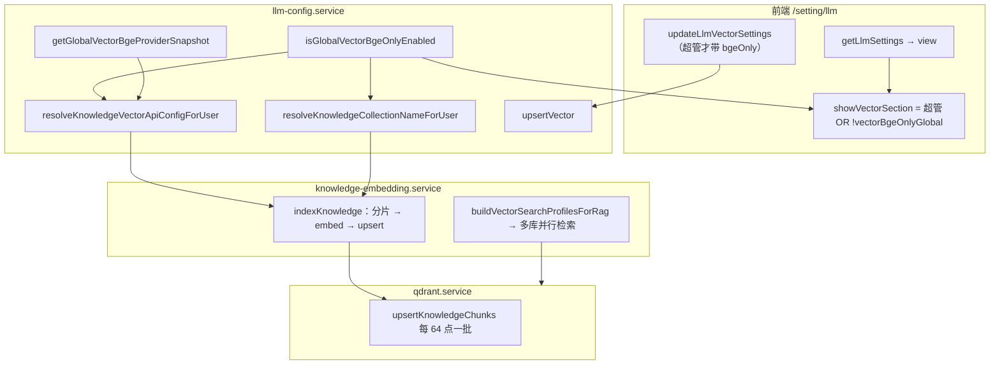

# 全站仅 BGE 策略、入库修复与向量设置页体验

> **文档角色**：本轮在 [user-vector-rag-config.md](./user-vector-rag-config.md) 之上的增量——超级管理员全站 BGE、凭证与入库修复、会员 RAG 默认库并入、设置页交互与文案。  
> **延伸阅读**：[user-vector-rag-config.md](./user-vector-rag-config.md)、[siliconflow-vector-full-url.md](./siliconflow-vector-full-url.md)

---

## 1. 背景与目标

| # | 问题（用户视角） | 根因摘要 | 本轮目标 |
|---|----------------|----------|----------|
| 1 | 超管开启「仅 BGE」后，知识库保存/向量化报错 | 仍用**文章作者** API Key + 强制 BGE 模型 → 硅基 400；或 Qdrant 单次 upsert 体过大 / payload 含非法 UTF-16 | 全站 BGE 时统一用**开启开关的超管**向量凭证；分批 upsert + 安全分片 |
| 2 | 非超管保存自定义向量被拒 | 后端对「请求里出现 `bgeOnly`」一律拒绝；前端总会传 `bgeOnly: false` | 仅禁止非超管**开启** BGE；非超管请求不传 `bgeOnly` |
| 3 | 会员已配 Qwen3-8B，RAG 仍漏检 4B 存量 | `buildVectorSearchProfilesForRag` 只并入系统 bge，未并入会员默认 2560 库 | 有效会员始终 merge `knowledge_chunks_qwen3_2560` |
| 4 | 设置页 label 不齐、文案不直观 | 大模型与向量区块各自布局；「Embedding URL」语义不清 | 统一 `LLM_FORM_ROW_CLASS`；改为「向量模型 URL」「重排模型 URL」 |

---

## 2. 改动范围

| 路径 | 说明 |
|------|------|
| `apps/backend/src/services/llm-config/llm-config.service.ts` | 全站 BGE 判定、超管 provider 凭证、`upsertVector` 权限、`vectorBgeOnlyGlobal` |
| `apps/backend/src/services/llm-config/llm-runtime-config.entity.ts` | `vector_bge_only` 列 |
| `apps/backend/src/migrations/1781388218470-em-only.ts` | 迁移 `vector_bge_only` |
| `apps/backend/src/services/knowledge-embedding/knowledge-embedding.service.ts` | BGE 分支、RAG profiles、Unicode 清洗、分片安全、embedding 条数校验 |
| `apps/backend/src/services/qdrant/qdrant.service.ts` | 分批 upsert（64 点/批） |
| `apps/backend/src/utils/create-llm.ts` | BGE 分片/批量常量（与 BGE 档位配合） |
| `apps/frontend/src/views/setting/llm/index.tsx` | 页面主实现：显隐、开关、表单、保存逻辑 |
| `apps/frontend/src/service/llmSettings.ts` | `LlmSettingsView` / `UpsertLlmVectorSettingsBody` 类型与 HTTP |
| `apps/frontend/src/i18n/locales/zh-CN.ts` / `en-US.ts` | 向量 URL、BGE 开关、底部提示文案 |

---

## 3. 端到端数据流（总览）



---

## 4. 分点实现说明

### 4.1 全站仅 BGE 策略（后端）

**行为定义**

1. **站点级开关**：任意**超级管理员**账号在 DB 中 `vector_bge_only = true`，即 `isGlobalVectorBgeOnlyEnabled()` 为 true，**全员**入库与 RAG 走 BGE 单库。
2. **个人级开关**：全站未开启时，仅超管本人可将 `vector_bge_only` 设为 true，仅影响该超管账号。
3. **对用户生效的统一判断**：`isVectorBgeOnlyActiveForUser(authorId)` — 全站开启 → 所有人 true；否则仅超管且个人开关为 true。
4. **collection 固定**：BGE 生效时 `resolveKnowledgeCollectionNameForUser` 返回 `knowledge_chunks_v2`（env `QDRANT_KNOWLEDGE_COLLECTION`）。
5. **删除范围**：BGE 生效时 `resolveKnowledgeCollectionNamesForUser` 只返回单库名，删除向量时不会扫其它 collection。

**来源**：`apps/backend/src/services/llm-config/llm-config.service.ts`（约 L255–302、`resolveKnowledgeCollectionNameForUser`）

```typescript
/** 站点级：任一超管 vector_bge_only=true 即全站生效 */
async isGlobalVectorBgeOnlyEnabled(): Promise<boolean> {
  const rows = await this.repo.find({
    where: { vectorBgeOnly: true },
    select: { userId: true },
  });
  for (const row of rows) {
  // 说明：必须校验 userId 对应超级管理员角色，避免普通用户误开字段
    if (await this.userService.userHasSuperAdminRole(row.userId)) {
      return true;
    }
  }
  return false;
}

/** 知识库向量是否仅走 BGE 单库 */
async isVectorBgeOnlyActiveForUser(userId): Promise<boolean> {
  if (await this.isGlobalVectorBgeOnlyEnabled()) return true;
  // ... 仅超管个人开关
}

async resolveKnowledgeCollectionNameForUser(userId): Promise<string | null> {
  if (await this.isVectorBgeOnlyActiveForUser(userId)) {
    return this.getDefaultKnowledgeCollectionName(); // knowledge_chunks_v2
  }
  const snap = await this.getActiveVectorSnapshotForUser(userId);
  if (snap) return snap.collectionName;
  return null;
}
```

**对外暴露给前端的字段**：`getPublicView` 在 `buildPublicView` 基础上附加 `vectorBgeOnlyGlobal`（与当前用户自己的 `vectorBgeOnly` 不同：前者表示「站点是否已被某超管锁住 BGE」）。

**来源**：`apps/backend/src/services/llm-config/llm-config.service.ts`（约 L455–462）

```typescript
async getPublicView(userId?: number): Promise<LlmConfigPublicView> {
  const row = await this.repo.findOne({ where: { userId: uid } });
  const vectorBgeOnlyGlobal = await this.isGlobalVectorBgeOnlyEnabled();
  return {
    ...this.buildPublicView(row),
    vectorBgeOnlyGlobal, // 前端用来隐藏非超管的向量区块
  };
}
```

**入库侧 tier 与模型强制**

`KnowledgeEmbeddingService.resolveEmbeddingApiConfig` / `resolveRerankApiConfig` 在 `bgeOnly` 时把 tier 固定为 `default`（200 字小分片 + bge 模型），并在 override 之后再次覆盖 `model` 为 `DEFAULT_KNOWLEDGE_EMBEDDING_MODEL` / `DEFAULT_KNOWLEDGE_RERANK_MODEL`。

**来源**：`apps/backend/src/services/knowledge-embedding/knowledge-embedding.service.ts`（约 L132–179）

```typescript
const bgeOnly =
  await this.llmConfigService.isVectorBgeOnlyActiveForUser(authorId);
const t = bgeOnly ? 'default' : (tier ?? await this.resolveTierForAuthor(authorId));
const override =
  await this.llmConfigService.resolveKnowledgeVectorApiConfigForUser(authorId, 'embedding');
const config = override ?? resolveKnowledgeEmbeddingApiConfig(this.config, t);
if (bgeOnly) {
  return { ...config, model: DEFAULT_KNOWLEDGE_EMBEDDING_MODEL };
}
```

---

### 4.2 全站 BGE 时的凭证来源（后端）

**问题**：全站 BGE 后若仍读文章作者的 `getActiveVectorSnapshotForUser(authorId)`，作者可能是会员且 Key 只开通了 Qwen3，却请求 `BAAI/bge-large-zh-v1.5` → 硅基 400。

**策略**：`resolveKnowledgeVectorApiConfigForUser` 在 `isGlobalVectorBgeOnlyEnabled()` 为 true 时：

1. 调用 `getGlobalVectorBgeProviderSnapshot()`：遍历 `vector_bge_only=true` 的行，找到**超级管理员**且向量快照有效（有 Key、URL）的第一人。
2. 使用其 `apiKey`、`baseUrl` / `rerankBaseUrl`；**模型名**仍强制为 BGE 默认（不信任快照里的 Qwen 模型名）。
3. 若无可用超管快照，返回 `null`，回退 env + 会员档位解析（与旧逻辑衔接）。

**来源**：`apps/backend/src/services/llm-config/llm-config.service.ts`（约 L269–367）

```typescript
async resolveKnowledgeVectorApiConfigForUser(userId, preset): Promise<KnowledgeVectorApiConfig | null> {
  if (await this.isGlobalVectorBgeOnlyEnabled()) {
    const providerSnap = await this.getGlobalVectorBgeProviderSnapshot();
    if (!providerSnap) return null;
    const baseURL =
      preset === 'embedding' ? providerSnap.baseUrl : providerSnap.rerankBaseUrl;
    const model =
      preset === 'embedding'
        ? DEFAULT_KNOWLEDGE_EMBEDDING_MODEL
        : DEFAULT_KNOWLEDGE_RERANK_MODEL;
    return { apiKey: providerSnap.apiKey, baseURL, model };
  }
  // 非全站 BGE：作者自己的向量快照 + 个人 bgeOnly 时强制 BGE 模型名
  // ...
}
```

**运维注意**：超管开启全站 BGE 前，应先在本页保存**有效向量 API Key**（硅基 Key 需能调 BGE embedding/rerank）。

---

### 4.3 非超管保存向量配置（后端 + 前端）

#### 4.3.1 后端 `upsertVector` 权限收窄

| 请求体 `bgeOnly` | 非超管 | 超管 |
|------------------|--------|------|
| 未传 | 允许保存普通向量 | 允许 |
| `false` | **允许**（修复前会 400） | 允许，且可关闭个人 BGE |
| `true` | **拒绝** | 允许，写入 `vector_bge_only` |

**来源**：`apps/backend/src/services/llm-config/llm-config.service.ts`（约 L557–591）

```typescript
if (dto.bgeOnly === true && !isSuperAdmin) {
  throw new BadRequestException('仅超级管理员可设置仅 BGE 向量模式');
}
// enabled=true 时
const bgeOnly =
  dto.bgeOnly !== undefined ? dto.bgeOnly : Boolean(row.vectorBgeOnly);
if (bgeOnly && !isSuperAdmin) {
  throw new BadRequestException('仅超级管理员可启用仅 BGE 向量模式');
}
```

当 `bgeOnly === true` 保存时，后端还会**覆盖** embedding/rerank 模型名与 collection 为 BGE 默认值（与前端开关联动一致）。

#### 4.3.2 前端：条件提交 `bgeOnly`

**来源**：`apps/frontend/src/views/setting/llm/index.tsx`（`onSaveVector`，约 L804–818）

```typescript
const res = await updateLlmVectorSettings({
  enabled: true,
  baseUrl: vectorBaseUrl.trim(),
  rerankUrl: vectorRerankUrl.trim(),
  embeddingModel: vectorEmbeddingModel.trim(),
  rerankModel: vectorRerankModel.trim(),
  collectionName: vectorCollectionName.trim(),
  // 说明：仅超管才把 BGE 开关状态提交给后端；非超管完全不传 bgeOnly 字段
  ...(isSuperAdmin ? { bgeOnly: vectorBgeOnly } : {}),
  // Key 未改时不重复提交 apiKey
  ...(!keyUnchanged && trimmedKey ? { apiKey: trimmedKey } : {}),
});
```

**来源**：`apps/frontend/src/service/llmSettings.ts`（约 L44–53）

```typescript
export type UpsertLlmVectorSettingsBody = {
  enabled: boolean;
  baseUrl?: string;
  rerankUrl?: string;
  embeddingModel?: string;
  rerankModel?: string;
  collectionName?: string;
  apiKey?: string;
  bgeOnly?: boolean; // 可选；非超管不应传
};
```

---

### 4.4 Qdrant 分批 upsert（后端）

**现象**：BGE 档 `KNOWLEDGE_DEFAULT_CHUNK_TARGET_CHARS = 200`，一篇长文可产生 200+ 分片；每个 point 的 payload 含 `text` 全文片段，单次 `upsert` 请求体可达约 1.2MB+，Qdrant JS 客户端或网关返回 Bad Request。

**修复**：`KNOWLEDGE_QDRANT_UPSERT_BATCH_SIZE = 64`，循环 `client.upsert`。

**来源**：`apps/backend/src/services/qdrant/qdrant.service.ts`（约 L31–32、L111–126）

```typescript
/** 单次 upsert 点数上限（避免请求体超过 Qdrant/网关约 1.2MB；BGE 小分片长文易触发） */
const KNOWLEDGE_QDRANT_UPSERT_BATCH_SIZE = 64;

async upsertKnowledgeChunks(input): Promise<void> {
  const points = input.points;
  if (points.length === 0) return;
  for (let i = 0; i < points.length; i += KNOWLEDGE_QDRANT_UPSERT_BATCH_SIZE) {
    const batch = points.slice(i, i + KNOWLEDGE_QDRANT_UPSERT_BATCH_SIZE);
    await this.client.upsert(name, { points: batch });
  }
}
```

`indexKnowledge` 在 delete 旧点后调用上述方法，逻辑不变，仅写入层分批。

---

### 4.5 Unicode 安全分片与 payload 清洗（后端）

#### 4.5.1 分片边界：`sliceUtf16Safe`

JavaScript 字符串按 UTF-16 码元索引；在 200 字符处切分可能落在 emoji 的 surrogate 对中间，产生**孤立 surrogate**。写入 Qdrant JSON payload 时可能 400。

**来源**：`apps/backend/src/services/knowledge-embedding/knowledge-embedding.service.ts`（约 L89–101、`chunkMarkdown` 约 L784–788）

```typescript
function sliceUtf16Safe(text: string, start: number, end: number): string {
  let s = Math.max(0, start);
  let e = Math.min(text.length, end);
  // 说明：若 start 落在低代理（0xDC00–0xDFFF），前移一位避开半个字符
  if (s > 0 && s < text.length) {
    const lead = text.charCodeAt(s);
    if (lead >= 0xdc00 && lead <= 0xdfff) s++;
  }
  // 说明：若 end 前一位是高代理（0xD800–0xDBFF），回退一位
  if (e > s && e <= text.length) {
    const trail = text.charCodeAt(e - 1);
    if (trail >= 0xd800 && trail <= 0xdbff) e--;
  }
  return text.slice(s, e);
}

// chunkMarkdown 长块滑动窗口中使用 sliceUtf16Safe 而非 raw slice
const piece = sliceUtf16Safe(b, i, end).trim();
```

#### 4.5.2 入库前清洗：`sanitizeKnowledgeStorageText`

对 title、chunk `text`、以及 embedding 请求前的输入统一清洗：去掉 NUL、非法 Unicode、**所有 surrogate 区**（宁可丢 emoji 也不送非法 JSON）。

**来源**：`apps/backend/src/services/knowledge-embedding/knowledge-embedding.service.ts`（约 L81–87、L865–871）

```typescript
function sanitizeKnowledgeStorageText(text: string): string {
  return String(text ?? '')
    .replace(/\0/g, '')
    .replace(/\uFFFE|\uFFFF/g, '')
    .replace(/[\uD800-\uDFFF]/g, '');
}

const payload: QdrantKnowledgePayload = {
  title: sanitizeKnowledgeStorageText(title),
  text: sanitizeKnowledgeStorageText(c.text),
  // ...
};
```

#### 4.5.3 embedding 条数校验

避免 API 返回条数少于分片数时 `vectors[i]` 为 `undefined` 写入 Qdrant（维度校验失败 Bad Request）。

**来源**：`apps/backend/src/services/knowledge-embedding/knowledge-embedding.service.ts`（约 L823–835）

```typescript
const vectors = await this.embedDocuments(chunks.map((c) => c.text), { authorId, tier: chunkTier });
if (vectors.length !== chunks.length) {
  throw new Error(
    `embedding 向量条数与分片不一致：vectors=${vectors.length} chunks=${chunks.length}`,
  );
}
```

---

### 4.6 会员 RAG 默认 Qwen3-4B 库（后端）

**场景**：会员在设置页保存了 Qwen3-8B + `knowledge_chunks_qwen3_4096`，RAG 的 `searchProfiles` 来自用户快照；若未显式 merge 会员 env 默认库，**2560 维 4B 存量**不会被检索。

**策略**：`buildVectorSearchProfilesForRag` 合并顺序：

1. 用户 `vectorSnap.searchProfiles`（历史保存累积）
2. **系统 default bge 库**（`knowledge_chunks_v2` + bge 模型）— 始终 merge
3. 若 `isUserMembershipActive(authorId)`：**会员 default 库**（`knowledge_chunks_qwen3_2560` + `Qwen3-Embedding-4B`）

与「用户未配向量、走 env 双库」路径对齐。

**来源**：`apps/backend/src/services/knowledge-embedding/knowledge-embedding.service.ts`（约 L209–231）

```typescript
private async buildVectorSearchProfilesForRag(vectorSnap, authorId): Promise<VectorSearchProfile[]> {
  const systemDefaultProfile = {
    collectionName: this.qdrant.getKnowledgeCollectionName('default'),
    embeddingModel: DEFAULT_KNOWLEDGE_EMBEDDING_MODEL,
    rerankModel: DEFAULT_KNOWLEDGE_RERANK_MODEL,
  };
  let profiles = mergeVectorSearchProfile(vectorSnap.searchProfiles, systemDefaultProfile);
  if (await this.userService.isUserMembershipActive(authorId)) {
    profiles = mergeVectorSearchProfile(profiles, {
      collectionName: this.qdrant.getKnowledgeCollectionName('member'),
      embeddingModel: DEFAULT_MEMBER_KNOWLEDGE_EMBEDDING_MODEL,
      rerankModel: DEFAULT_MEMBER_KNOWLEDGE_RERANK_MODEL,
    });
  }
  return profiles;
}
```

**注意**：全站 BGE 开启时，入库只写 `knowledge_chunks_v2`，但 RAG 若作者仍有自定义向量快照，多库并行逻辑仍可能跑多个 profile（除 BGE 强制单库写入外）；与 `isVectorBgeOnlyActiveForUser` 在检索侧的 profile 构建需结合 [user-vector-rag-config.md](./user-vector-rag-config.md) 理解。

---

### 4.7 前端：页面结构与状态（`index.tsx`）

**路由**：`设置 → 大模型` → `apps/frontend/src/views/setting/llm/index.tsx`（MobX `observer` 组件 `LlmSetting`）。

#### 4.7.1 依赖与权限 Hook

| Hook / 来源 | 用途 |
|-------------|------|
| `useI18n()` | `t`、`locale`（驱动 label 宽度） |
| `useIsSuperAdmin()` | `isSuperAdmin` — BGE 开关、传 `bgeOnly`、向量区块显隐 |
| `useMembershipActive()` | 对话大模型默认预设（与向量区块无直接耦合） |

#### 4.7.2 向量区块显隐：`showVectorSection`

**来源**：`apps/frontend/src/views/setting/llm/index.tsx`（约 L226–228）

```typescript
const showVectorSection = useMemo(
  () => isSuperAdmin || !view?.vectorBgeOnlyGlobal,
  [isSuperAdmin, view?.vectorBgeOnlyGlobal],
);
```

| `vectorBgeOnlyGlobal` | 超管 | 普通用户 |
|-----------------------|------|----------|
| `false` | 显示向量区块 | 显示向量区块 |
| `true` | **显示**（可关开关、配 Key） | **隐藏**整段向量 UI |

整段向量 UI 包在 `{showVectorSection ? ( <> ... </> ) : null}` 内（约 L1007）。

#### 4.7.3 本地 state 一览

| state | 含义 |
|-------|------|
| `view` | 服务端 `LlmSettingsView`，含 `vectorBgeOnly`、`vectorBgeOnlyGlobal`、`vectorSearchProfiles` 等 |
| `vectorBgeOnly` | 超管 BGE 开关草稿 |
| `vectorBaseUrl` / `vectorRerankUrl` | 向量 / 重排完整 URL |
| `vectorEmbeddingModel` / `vectorRerankModel` / `vectorCollectionName` | 模型与库名 |
| `vectorApiKey` / `savedVectorApiKey` | 回显与「未改 Key 不提交」判断 |
| `vectorDefaults` | `getLlmSettingsDefaults` 下发的服务端默认 |
| `vectorSaving` | 向量保存/恢复中 |

#### 4.7.4 初始加载：`load`

1. `getLlmSettingsDefaults()` → `applyVectorDefaults(vd)`
2. `getLlmSettings()` → 填充对话 LLM + 向量各字段
3. `setVectorBgeOnly(Boolean(res.data.vectorBgeOnly))`

**来源**：约 L391–449。

#### 4.7.5 草稿与可保存判断

| 计算属性 | 逻辑 |
|----------|------|
| `canSaveVector` | 向量五项 + Key 均非空 |
| `hasVectorUnsavedChanges` | `vectorActive` 时对比 `view` 各字段 + `vectorBgeOnly` |
| `inactiveVectorBaseline` | 未启用向量时，对比默认值或已存字段 |
| `hasVectorDraftChanges` | 已启用走 `hasVectorUnsavedChanges`，未启用走 baseline |
| `canSubmitVectorSave` | `canSaveVector && hasVectorDraftChanges` |

`vectorBgeOnly` 参与未保存判断（约 L575、L641），避免只拨开关不保存时底部提示不准。

#### 4.7.6 向量底部提示：`vectorFooterHint`

优先级（约 L705–739）：

1. `vectorActive && vectorBgeOnly && !hasVectorDraftChanges` → 绿色「仅 BGE 向量库模式生效中」
2. `vectorActive && !hasVectorDraftChanges` → 绿色「某某向量配置生效中」
3. 无草稿 → 灰色默认模型提示
4. 草稿不完整 → 补全提示
5. 有待保存 → 琥珀色未保存 / 可保存提示

---

### 4.8 前端：超管 BGE 开关与字段禁用

仅 `isSuperAdmin` 时渲染开关区域（约 L1017–1049）。

**来源**：`apps/frontend/src/views/setting/llm/index.tsx`（Switch `onCheckedChange`）

```typescript
<Switch
  id="vector-bge-only"
  checked={vectorBgeOnly}
  onCheckedChange={(checked) => {
    setVectorBgeOnly(checked);
    if (checked) {
      // 说明：开启时本地表单同步为 BGE 默认三元组，与后端 upsertVector(bgeOnly=true) 覆盖逻辑一致
      setVectorEmbeddingModel(FALLBACK_VECTOR_DEFAULTS.embeddingModel);
      setVectorRerankModel(FALLBACK_VECTOR_DEFAULTS.rerankModel);
      setVectorCollectionName(FALLBACK_VECTOR_DEFAULTS.collectionName);
    }
  }}
  disabled={saving || vectorSaving}
/>
```

**BGE 开启后禁用的字段**（仍可调 URL 与 API Key）：

- `vectorEmbeddingModel`、`vectorRerankModel`、`vectorCollectionName` 的 `CreatableCombobox`：`disabled={saving || vectorSaving || vectorBgeOnly}`（约 L1124、L1152、L1180）

**已纳入检索列表**：`!vectorBgeOnly` 时才展示 `view.vectorSearchProfiles`（BGE 单库模式下列表无意义，约 L1226–1253）。

---

### 4.9 前端：表单布局与预设常量

#### 4.9.1 统一行布局

**来源**：约 L24–32

```typescript
const LLM_FORM_ROW_CLASS =
  'flex flex-col gap-2 sm:flex-row sm:items-center sm:gap-4';

function getLlmFormLabelClass(locale: string) {
  return locale === 'zh-CN'
    ? 'shrink-0 inline-block whitespace-nowrap sm:w-[6.5em] sm:min-w-[6.5em] text-justify [text-align-last:justify]'
    : 'shrink-0 inline-block whitespace-nowrap sm:w-32 sm:min-w-32 text-end';
}
```

- 大模型三区（Base URL、模型、Key）与向量六区共用 `LLM_FORM_ROW_CLASS` + `llmFormLabelClass`。
- 中文：`6.5em` + `text-justify` / `text-align-last:justify` 实现单行两端对齐。
- 英文：`w-32` + `text-end` 右对齐，避免英文 label 换行。

#### 4.9.2 向量默认值与预设表

**来源**：约 L113–179

```typescript
const FALLBACK_VECTOR_DEFAULTS = {
  baseUrl: 'https://api.siliconflow.cn/v1/embeddings',
  rerankUrl: 'https://api.siliconflow.cn/v1/rerank',
  embeddingModel: 'BAAI/bge-large-zh-v1.5',
  rerankModel: 'BAAI/bge-reranker-v2-m3',
  collectionName: 'knowledge_chunks_v2',
};

const VECTOR_EMBEDDING_MODEL_PRESETS = [
  { modelName: 'BAAI/bge-large-zh-v1.5', collectionName: 'knowledge_chunks_v2', ... },
  { modelName: 'Qwen/Qwen3-Embedding-4B', collectionName: 'knowledge_chunks_qwen3_2560', ... },
];
```

`onVectorEmbeddingModelChange`：切换 embedding 预设时通过 `VECTOR_EMBEDDING_MODEL_TO_COLLECTION` **自动配对库名**，并 `resetVectorApiKey()`（换模型清 Key，约 L357–366）。

向量 URL / 重排 URL 变更同样 `resetVectorApiKey()`（约 L1064–1068、L1091–1095）。

#### 4.9.3 表单项与 i18n key 映射

| UI Label（中文） | i18n key | 控件 id |
|------------------|----------|---------|
| 向量模型 URL | `setting.llm.vectorEmbeddingUrl` | `vector-base-url` |
| 重排模型 URL | `setting.llm.vectorRerankUrl` | `vector-rerank-url` |
| 向量模型名称 | `setting.llm.vectorEmbeddingModel` | `vector-embedding-model` |
| 重排模型名称 | `setting.llm.vectorRerankModel` | `vector-rerank-model` |
| 向量库名称 | `setting.llm.vectorCollectionName` | `vector-collection` |
| API Key | `setting.llm.vectorApiKey` | `vector-api-key` |

---

### 4.10 前端：API 层（`llmSettings.ts`）

| 方法 | 路径常量 | 说明 |
|------|----------|------|
| `getLlmSettings` | `SETTINGS_LLM` | GET，返回含 `vectorBgeOnly`、`vectorBgeOnlyGlobal` 的完整 view |
| `getLlmSettingsDefaults` | `SETTINGS_LLM_DEFAULTS` | 向量默认 URL/模型/库名 |
| `updateLlmVectorSettings` | `SETTINGS_LLM_VECTOR` | PUT 向量配置 |
| `clearLlmVectorSettings` | `SETTINGS_LLM_VECTOR` | DELETE 恢复向量默认 |

`LlmSettingsView` 中与本轮相关的字段（约 L32–34）：

```typescript
vectorBgeOnly: boolean;        // 当前用户是否开启个人/已保存的仅 BGE
vectorBgeOnlyGlobal: boolean;  // 站点是否已有超管开启全站 BGE
vectorSearchProfiles: Array<{ collectionName; embeddingModel; rerankModel }>;
```

---

### 4.11 文案（i18n）

**来源**：`apps/frontend/src/i18n/locales/zh-CN.ts`（约 L129–168）

| key | 中文（本轮变更要点） |
|-----|-------------------|
| `setting.llm.vectorEmbeddingUrl` | **向量模型 URL**（原 Embedding 接口地址） |
| `setting.llm.vectorRerankUrl` | **重排模型 URL** |
| `setting.llm.vectorBgeOnlyLabel` | 仅使用 BGE 向量库 |
| `setting.llm.vectorBgeOnlyDesc` | 开启后入库/RAG/重排固定 bge + knowledge_chunks_v2 |
| `setting.llm.vectorBgeOnlyActiveHint` | 仅 BGE 向量库模式生效中（knowledge_chunks_v2） |

英文 mirror：`apps/frontend/src/i18n/locales/en-US.ts` 同 key。

---

## 5. 场景行为矩阵

| 场景 | 向量设置页 | 入库 collection | embedding 凭证 | RAG profiles（有自定义向量时） |
|------|------------|-----------------|----------------|-------------------------------|
| 默认 | 所有人可见区块 | 作者 tier / 自定义 | 作者向量或 env | 用户库 + bge +（会员）4B 库 |
| 超管个人 BGE | 超管见开关 | `knowledge_chunks_v2` | 超管向量或全站 provider | 视快照与 BGE 策略 |
| 全站 BGE | 非超管隐藏区块 | `knowledge_chunks_v2` | **开启开关的超管**向量 Key | 同左 + 会员 4B merge 规则仍适用 |
| 非超管保存向量 | 传参无 `bgeOnly` | 用户选定库 | 用户 Key | 用户累积库 + bge + 会员 4B |

---

## 6. 风险与回归建议

1. **全站 BGE**：超管开/关开关；会员与非会员各保存长文（含 emoji）；确认向量化成功且 collection 为 v2。
2. **凭证**：全站 BGE 下用会员账号保存文章，确认后端日志 embedding 用的是超管 Key（非会员 Qwen Key）。
3. **非超管保存**：普通用户修改向量 URL/模型后保存，不应出现「仅超级管理员可设置仅 BGE」。
4. **分批 upsert**：200+ 分片文章单次保存不触发 Qdrant Bad Request。
5. **会员 RAG**：会员配置 8B 库后，RAG 日志/调试应出现 `knowledge_chunks_qwen3_2560` profile。
6. **前端 UI**：`vectorBgeOnlyGlobal=true` 时非超管整段向量消失；超管仍可操作开关；中英文 label 对齐一致。

---

## 7. 相关源码路径

| 说明 | 路径 |
|------|------|
| 全站 BGE、凭证、`vectorBgeOnlyGlobal` | `apps/backend/src/services/llm-config/llm-config.service.ts` |
| 入库、分片、RAG profiles | `apps/backend/src/services/knowledge-embedding/knowledge-embedding.service.ts` |
| Qdrant 分批写入 | `apps/backend/src/services/qdrant/qdrant.service.ts` |
| 设置页 UI 与交互 | `apps/frontend/src/views/setting/llm/index.tsx` |
| 前端 HTTP 与类型 | `apps/frontend/src/service/llmSettings.ts` |
| 中文文案 | `apps/frontend/src/i18n/locales/zh-CN.ts` |
| 英文文案 | `apps/frontend/src/i18n/locales/en-US.ts` |

若与仓库最新源码不一致，以源码为准。
