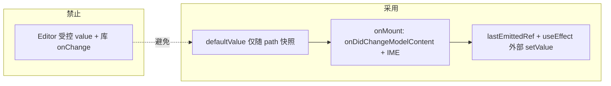

# Monaco Markdown 编辑器：中文 IME 重影 / 叠字问题与解决方案

本文记录知识库等页面使用 `@monaco-editor/react` + 透明主题编辑 Markdown 时，**中文输入法（IME）** 出现**重影、拼音与汉字叠画、仅首行正常换行后必现**等问题的**成因**与**最终解决办法**；并单独说明与 IME 缓解方案相关的 **Tab / 缩进（`tabSize`）** 问题及处理（**§4**）；以及分屏模式下 **「跟随滚动」** 如何按**标题锚点**与源码行号对齐预览，并支持 **单向 / 双边** 三种跟滚模式与 **React `memo` 集成**（**§5**、**§5.11**）。**§2.8** 将根因、设计取舍与 **§3–§5** 的落代码方式串成**实现思路**，便于后续维护与排查。

**分屏跟随滚动（算法与拆岛行号）** 已演进为 **`MarkdownScrollSyncSnapshot` + `getScrollTop()` 折线插值** 与 **`lineBase0` 全文行号修正**；**以当前源码为准的完整说明**见 **`docs/monaco-markdown-split-scroll-sync.md`**。本文 **§5** 中若仍出现旧符号（如 `HeadingScrollCache`、`sync*ByHeadings`），视为历史叙述，维护时请以前述专文与 `apps/frontend/src/components/design/Monaco/utils.ts` 为准。

---

## 1. 现象归纳

| 现象 | 说明 |
|------|------|
| 拼音/汉字叠在一起 | 输入过程中同一位置像画了两次字 |
| 受控模式下更明显 | 向 `<Editor>` 传 `value` + 库自带 `onChange` 时尤甚 |
| 仅首行正常、回车后每行都重影 | 与多行后的折行、布局重算强相关 |
| 换应用主题后偶发重影 | 全透明 `editor.background` 与页面背景同时变化时合成层更易错位 |

---

## 2. 根因分析（分层）

### 2.1 受控 `value` 与库内全文同步

`@monaco-editor/react` 在传入**非 undefined 的 `value`** 时，会在 `value` 变化时对整篇文档执行 **`executeEdits` 类全文替换**。

中文 IME 组合过程中，真实内容在 **隐藏 `textarea` 的合成串** 与 **Monaco 模型** 之间存在时间差；若此时父组件又根据**略旧的 `value`** 回写编辑器，就会与合成层**叠绘**，表现为重叠、抖动。

**对策**：对业务侧保持「看起来像受控」的体验，但对 **Monaco 组件不传 `value`**，改用 **`defaultValue` + 稳定 `path` + `key`**，在 `onMount` 里用 `onDidChangeModelContent` 等方式上报，并用 `lastEmittedRef` + `useEffect` 仅在**外部数据源**变化时 `setValue`。

### 2.2 `defaultValue` 每键都变 → `memo(Editor)` 无意义

即使去掉受控 `value`，若每次渲染都把**最新全文**当作 `defaultValue` 传入，`Editor` 的 props 仍在变，子组件持续重渲染，同样会放大与 IME 的冲突。

**对策**：用 **`editorBootstrapTextRef`**（或等价逻辑）仅在 **`monacoModelPath` / `documentIdentity` 变化**时更新「引导用的初始文本」；同一条文档内输入时 **`defaultValue` 对 React 比较保持恒定**。

### 2.3 透明主题 + 主题切换

自定义主题若将 `editor.background` 设为 **`#00000000`**，画布背后会直接透出页面的 `color-mix`、渐变等。全局换肤时底层重绘与编辑器层合成不同步时，容易出现**重影感**（与「纯换行 IME」问题不同维度）。

当前仍保留**玻璃主题**（继承 `vs` / `vs-dark` / `hc-black` 高亮、仅 chrome 透明）时，若再遇到换肤重影，可考虑在换肤后 **`editor.layout()`** 或改为**不透明**编辑区底色（见历史迭代说明）。

### 2.4 换行后重影：`wordWrap` + `automaticLayout`（本次关键）

**首行**往往不触发「整篇折行重算」；**一回车成多行**后，`wordWrap: on` 会按视口宽度反复重算折行，再叠加 **`automaticLayout: true`** 在内容高度变化时触发布局，与**透明底 + Canvas + IME 合成层**容易在**第二行及之后**叠画。

**对策（Markdown 专用）**：

- **`wordWrap: 'off'`**：取消视口折行，长行横向滚动，避免换行后每键触发大范围重排。  
- 关闭 **`folding` / `stickyScroll` / `glyphMargin`** 等额外装饰层，减少多行时的多余绘制。  
- **`accessibilitySupport: 'off'`**、**`cursorBlinking: 'solid'`**：减少辅助层与光标闪烁带来的重绘。  
- **`onDidCompositionEnd`** 后在 **`requestAnimationFrame` 链中调用 `editor.layout()` 两次**，让合成结束后的几何与 IME 对齐。

### 2.5 组合事件时序

部分浏览器上 **`compositionstart` 晚于首字符进入模型**，若仅靠 Monaco 的 `onDidCompositionStart`，仍可能在组合初期误触发 `pushToParent`。

**对策**：在 **`textarea.inputarea` 上监听原生 `compositionstart` / `compositionend`**，尽早置位 `imeComposingRef`；内容变更上报时同时判断 **`editor.inComposition`**；**结束时的正文上报**以 **`onDidCompositionEnd` + `queueMicrotask`** 为主，避免与原生 `compositionend` 各推一次。

### 2.6 外部 `value` 回写

MobX/React 回显时，若 `value` 与编辑器当前内容一致但仍是「父级回传的本人编辑」，应用 **`lastEmittedRef`**：与最近一次**本编辑器**推上去的内容相同则**不要 `setValue`**；且 **`hasTextFocus()`** 且 props 落后于模型时**不要用旧 props 覆盖**（避免 IME 中间态被整篇替换）。

### 2.7 分屏预览抢主线程

分屏时右侧 Markdown 全量 `render` 若与左侧同帧执行，会加重卡顿与「像重影」的观感。

**对策**：预览侧使用 **`useDeferredValue(value)`** 等方法降低优先级（实现见 `index.tsx`）。

### 2.8 实现思路：从根因到代码的分层策略

本节把 **§2** 各条根因与 **§3–§5** 中的具体写法串成一条「**为何这样实现**」的推理链，便于新人把握整体架构，而不是只见零散开关。

#### 2.8.1 总体原则

- **分层缓解，而非单点「神配置」**  
  IME 重影往往是 **受控回写 + 折行布局 + 合成层 + 事件时序** 叠加的结果。实现上把对策拆到：**数据流（伪受控）**、**Markdown 专用排版选项**、**组合阶段门控与 layout**、**透明主题的保守用法** 等层，各层可单独验证，避免改一处牵一片却说不清因果。

- **「看起来像受控」与「底层不要真受控」分离**  
  产品需要父组件持有最新正文、换篇、外部同步；Monaco 需要避免在 composition 期间被整篇 `setValue`。思路是：**业务状态照常更新**，但 **`<Editor>` 不传 `value`**，用 **`defaultValue` 快照 + `path`/`key` 换篇** + **`onDidChangeModelContent` 上报**，把「谁有权改 buffer」收敛到 **编辑器内部 + 明确的 `useEffect` 外部写入**。

- **热路径少做事（跟滚专指）**  
  滚动事件频率高，任何 **每帧 `querySelectorAll` + N 次 `getBoundingClientRect`** 都会触发布局读，主线程吃紧时表现为跟滚发涩。思路是 **冷路径量一次、热路径只算插值**（**§5.8**），与游戏或编辑器里常见的 dirty flag / 缓存一致。

- **程序化滚动必须考虑「对向监听」**  
  改 `scrollTop` 或 `revealLine*` 会触发 scroll/scrollChange，若对侧回调再写回来会形成环路。思路是 **有向抑制位 + 双 `requestAnimationFrame` 延后清除**（**§5.9.3**），让本帧及紧随其后的同步事件先跑完，再恢复监听。

#### 2.8.2 IME 与编辑数据流：具体推理

| 根因（§2） | 实现思路 | 落点（§3 / 代码） |
|------------|----------|-------------------|
| 非 undefined `value` 触发库内全文同步 | 断开对 Monaco 的受控 `value`，改 `defaultValue` + 挂载后订阅 | **§3.2**，`index.tsx` |
| `defaultValue` 每渲染都变 → 子树仍抖动 | 用 **`editorBootstrapTextRef`** 仅在 **path / documentIdentity** 变化时更新快照，同篇编辑期 React 看到的 `defaultValue` 不变 | **§2.2、§3.2** |
| 组合开始晚于首字符 | **`textarea` 原生 `compositionstart/end`** 与 **`editor.inComposition`** 双通道置位 | **`handleEditorMount`** |
| 组合结束与上报竞态 | **`onDidCompositionEnd` + `queueMicrotask`** 再推父级；与原生 `compositionend` 分工，避免双推 | **§3.4** |
| 同帧多次 `contentChange` | **`requestAnimationFrame` 合并** 再 `pushToParent` | **§3.4** |
| 组合结束后几何未对齐 | **双 rAF 后 `editor.layout()`** | **§2.4、§3.4** |
| 外部 `value` 与模型一致但仍为「本人编辑」回流 | **`lastEmittedRef`** + **有焦点且 props 落后则不 `setValue`** | **§2.6** |

#### 2.8.3 Markdown 专用选项：为何是一组「减负绘」配置

**核心判断**：多行 + `wordWrap: on` + `automaticLayout` 会放大 **折行重算** 与 **IME 合成层** 的交错，第二行起更容易叠画。因此 Markdown 语言分支下优先 **关掉视口折行**（`wordWrap: 'off'`），用横向滚动换稳定，属于 **用交互换正确性** 的产品取舍。

在此之上，**folding / stickyScroll / glyphMargin** 等是「额外装饰几何」，能关则关，降低多行时的绘制与命中测试成本；**`accessibilitySupport: 'off'`**、**`cursorBlinking: 'solid'`** 同理，减少并行层刷新。它们不是「玄学优化」，而是与 **§2.4** 同一逻辑：**减少与 composition 同时发生的布局与重绘**。

**`disableMonospaceOptimizations` / 字体栈** 与 IME、Tab 列宽三角关系见 **§4.2 B**；当前默认仍偏 IME，需要列对齐时再评估 Markdown 单独 `false`。

#### 2.8.4 分屏跟随滚动：问题建模与方案选择

- **为何不用整篇 `scrollTop` 比例**  
  源码一行在预览中对应的像素高度差异极大（标题、代码块、公式等），全局比例只保证「大概在同一垂直位置」，不保证「同一章节」。**建模目标**改为：在 **源码行号维度** 上分段连续，在 **预览滚动** 维度上用 **锚点间线性插值** 逼近「跟节」。

- **为何选「标题行」作锚点**  
  - 语义清晰：用户心里也是以章节为单位浏览。  
  - DOM 稳定：标题是块级元素，易 `querySelectorAll` + `getBoundingClientRect`，且 markdown-it 提供 **`token.map`** 与 Monaco 行号可对齐（**§5.1**）。  
  - 无标题文档仍可用 **文首 / 文末** 两点 + 中间无标题时退化为 **比例同步**（**§5.5**），不丢功能。

- **缓存何时失效**  
  行数变、预览 `scrollHeight`/`clientHeight` 变，说明排版或视口变了，锚点几何不再可信，必须重走冷路径（**§5.8**）。**`useDeferredValue`** 导致的一帧 HTML 滞后是已知局限（**§5.7**），接受「短时偏差、下一帧自愈」，避免为绝对精确引入更重 Source Map 方案。

- **单向 vs 双边与回声抑制**  
  正向：首可见行 → `topLine` → 预览 `scrollTop`。反向：预览 `scrollTop` → 反插值行号 → `revealLineNearTop`。产品在 UI 上拆成 **仅右跟左、仅左跟右、双边** 三种（**§5.11**）：单向模式下在入口函数里**直接不注册或不执行**对向同步，避免「只想滚一侧却被另一侧拽回去」；**双边**时两条边都启用，仍靠 **成对 `suppress*Ref` + 双 rAF 清除** 打破环路（**§5.9.3、§5.10.4**）。

#### 2.8.5 预览与主线程：为何 `useDeferredValue`

左侧输入应优先响应；右侧全量 `markdown-it` + highlight 若与左侧同优先级，会抢主线程，加重卡顿与「像重影」的观感。思路是 **把预览更新推迟到 React 并发调度里较低优先级**，与跟滚缓存结合：跟滚仍能跑，但极端快速输入时允许极短窗口内锚点集合与编辑器略有偏差（**§5.7**）。

#### 2.8.6 阅读地图

| 想深入的方向 | 建议章节 |
|--------------|----------|
| 清单式文件与 props | **§3** |
| Tab / Prettier / model 缩进 | **§4** |
| 跟滚公式、缓存、模式 UI、`memo` 与走读 | **§5、§5.10、§5.11** |
| 可调权衡 | **§6** |

---

## 3. 解决方案总览（实现清单）

相关代码主要在：

- `apps/frontend/src/components/design/Monaco/index.tsx` — 主编排、IME、`mergedEditorOptions`、`Editor` 的 props、分屏 **`onDidScrollChange`** 与 **`previewViewportRef`**  
- `apps/frontend/src/components/design/Monaco/utils.ts` — **`syncPreviewScrollFromMarkdownEditorByHeadings`**、**`syncEditorScrollFromPreviewByHeadings`**、**`buildHeadingScrollCache`**、**`HeadingScrollCache`**，及比例回退 **`editorVerticalScrollRatio` / `setPreviewVerticalScrollRatio`**（详见 **§5**、**§5.8**、**§5.9**）  
- `apps/frontend/src/components/design/Monaco/glassTheme.ts` — 继承内置主题的透明 chrome 主题注册  
- `apps/frontend/src/components/design/Monaco/options.ts` — 全局默认编辑器选项（Markdown 在 index 内再覆盖一部分）  
- `packages/tools/src/markdown/parser.ts` — **`MarkdownParser`**；默认开启 **`enableHeadingAnchorIds`** 提供标题 `id`，**`enableHeadingSourceLineAttr`** 为预览标题注入 **`data-md-heading-line`**（详见 **§5**）
- `apps/frontend/src/views/knowledge/index.tsx` — 传入 **`documentIdentity`**，保证换篇时 model 与引导文本一致  

### 3.1 数据流（概念）



### 3.2 `Editor` 侧要点

- **`beforeMount`**：`registerMonacoGlassThemes`，主题 id 使用 `GLASS_THEME_BY_UI[theme]`。  
- **`path={monacoModelPath}`**，**`key={monacoModelPath}`**，**`defaultValue={editorBootstrapTextRef.current}`**。  
- **不传 `value`、不传库自带 `onChange`**（变更只在 `onMount` 订阅里处理）。

### 3.3 Markdown 专用 `mergedEditorOptions`（与换行重影直接相关）

在 `language === 'markdown'` 时额外设置（与 `index.tsx` 保持一致，后续若有改动以代码为准）：

| 选项 | 作用 |
|------|------|
| `wordWrap: 'off'` | 避免多行后反复折行重算与 IME 打架 |
| `folding: false` / `foldingHighlight: false` | 减少装饰层 |
| `stickyScroll: { enabled: false }` | 关闭粘性滚动条区域 |
| `glyphMargin: false` | 关闭字形边距 |
| `accessibilitySupport: 'off'` | 减少无障碍树带来的额外绘制 |
| `cursorBlinking: 'solid'` | 稳定光标，减少闪烁重绘 |
| **不**单独设置 `fontFamily` | 继承 `options.ts` 的 `EDITOR_FONT_STACK`（拉丁等宽在前、中文回退），避免「黑体优先」比例字导致 Tab/空格列观感异常（详见 **§4**） |
| `fontLigatures: false`、`disableMonospaceOptimizations: true`（与全局一致）、`colorDecorators: false` | 连字 / 等宽路径 / 装饰对 IME 测量的干扰；若缩进列仍异常，可按 **§4.2 B** 评估 Markdown 下改为 `disableMonospaceOptimizations: false` |

### 3.4 内容上报与 `layout`

- 非组合阶段：`onDidChangeModelContent` → **`requestAnimationFrame` 合并**同一帧内多次变更再 `pushToParent`。  
- `onDidCompositionStart`：**取消**挂起的 `pushRaf`，并置 `imeComposingRef`。  
- `onDidCompositionEnd`：`queueMicrotask` 内 **`pushToParent` + 双 `requestAnimationFrame` 调用 `editor.layout()`**。  
- `editor.onDidDispose`： **`cancelAnimationFrame(pushRaf)`**。

### 3.5 知识库 `documentIdentity`

传入 `detailStore.knowledgeEditingKnowledgeId ?? 'draft-new'`，使 **`monacoModelPath` 随条目变化**，避免多篇文档共用同一 URI 或错误复用引导文本。

---

## 4. Tab / 缩进（`tabSize`）问题：成因与处理（与 IME 方案的关系）

中文 IME 重影的缓解手段里，有一部分会**间接影响「缩进看起来像 1」或 Tab 列不齐**。本节说明**原因**、Monaco 内部依赖哪些配置、以及**当前仓库里对应实现**落在哪些文件（以代码为准）。

### 4.1 现象

- 按 **Tab** 时每次只像进了 **1 格**，或格式化后列表/嵌套仍像 **1 空格** 宽度。  
- 与「行首真实插入了几个空格字符」可能不一致：有时是**模型里就是 1**（逻辑错误），有时是**比例字体下列宽看起来像 1**（观感问题）。

### 4.2 根因分层

#### A. `@monaco-editor/react` 与 Standalone 的初始化顺序

库内顺序大致为：先 **`monaco.editor.createModel`**（得到 `ITextModel`），再 **`monaco.editor.create(..., { model, ...options })`**。  
Standalone 在 `editor.create` 里才会把传入的 `tabSize`、`detectIndentation` 等写入**全局配置**并同步到 `ModelService`。因此**第一个 model** 在创建瞬间，若仍走默认的 **`detectIndentation: true`**，可能按正文**推断**出与预期不符的 `tabSize` / `indentSize`（极端情况下与 `TextModelResolvedOptions` 的兜底逻辑叠加，表现为缩进宽度异常）。

**处理思路**：在全局 `options` 中关闭推断，并在 **model 创建后**再次把 `tabSize` / `indentSize` 写回 model（例如在 `beforeMount` 里订阅 `monaco.editor.onDidCreateModel`，或在 `onMount` 里对当前 model 调用 `updateOptions`）。**当前仓库**：`options.ts` 已显式配置 `tabSize`、`indentSize`；若线上仍复现，可再补 **`detectIndentation: false`**、**`insertSpaces: true`** 及上述 model 级写回（见 4.4）。

#### B. 与 IME 相关的字体与排版路径

曾为减轻重影采用 **「中文黑体 / 系统无衬线优先」** 的 `fontFamily` 或 **`disableMonospaceOptimizations: true`**（变宽混排路径）：在**比例字体**下，**空格与 Tab 的像素宽度**容易与 Monaco 按「列」计算的 `tabSize` 不一致，用户会感觉「怎么都是一格」。  

**处理思路**：Markdown 编辑区**不再单独覆盖** `fontFamily`，继承 `options.ts` 里 **拉丁等宽在前、中文回退在后** 的 `EDITOR_FONT_STACK`；在「重影」与「列对齐」之间取舍时，可评估将 Markdown 的 **`disableMonospaceOptimizations` 设为 `false`**（与全局 `true` 区分），以换更稳定的 Tab 列对齐——需结合真机 IME 回归。**当前仓库**：`index.tsx` 的 `mergedEditorOptions` 在 `language === 'markdown'` 时**未**设置 `fontFamily`，与全局栈一致；Markdown 下 **`disableMonospaceOptimizations` 仍为 `true`**（与 `options.ts` 相同，偏 IME）。

#### C. 光标/输入逻辑使用的 model 选项

Monaco 在插入 Tab 时，`CursorConfiguration` 使用 **`model.getOptions()`** 中的 **`indentSize`**、**`tabSize`**、**`insertSpaces`**（见 `cursorCommon.js`）。仅改编辑器 UI 选项而不同步 model，仍可能表现为缩进错误。

**处理思路**：保证 **`editor.updateOptions`** 与 **`model.updateOptions`** 一致（至少在挂载、`setModel`、外部同步正文之后）。

#### D. 格式化（Prettier）与编辑器不一致

若 Prettier 对 Markdown 使用 **`useTabs: true`**，会插入 **Tab 字符**；在比例字体或较窄 Tab 渲染下，也容易「看起来像一格」。

**处理思路**：Markdown 专用格式化覆盖为 **`useTabs: false`**，**`tabWidth`** 与编辑器常量一致。

### 4.3 当前代码中的落地点（实现清单）

| 位置 | 内容 |
|------|------|
| `apps/frontend/src/components/design/Monaco/options.ts` | 导出 **`MONACO_TAB_SIZE`**（当前为 `2`）；全局 **`tabSize: 2`**、**`indentSize: 2`**，与缩进宽度单一数据源一致。 |
| `apps/frontend/src/components/design/Monaco/format.ts` | `formatMarkdownWithPrettier` 在 `...PRETTIER_CODE_OPTIONS` 之上设置 **`useTabs: false`**、**`tabWidth: MONACO_TAB_SIZE`**，避免 Markdown 格式化产出 Tab 字符与编辑器观感冲突。 |
| `apps/frontend/src/components/design/Monaco/index.tsx` | **`mergedEditorOptions`**：Markdown 分支继承 `...options` 的字体栈（不单独 `fontFamily`），**`disableMonospaceOptimizations`** 与全局一致为 **`true`**（偏 IME；列不齐时可试 `false`，见 4.2 B）；并保留 **`wordWrap: 'off'`** 等；**`handleEditorMount`** 内负责 IME 与内容上报（若在此增加 `model.updateOptions` / `editor.updateOptions` 同步缩进，可与 4.2 节 A/C 对照）。 |
| `apps/frontend/src/components/design/Monaco/glassTheme.ts` | **`beforeMount`** 中注册玻璃主题；如需全局兜底「任一 model 创建即写缩进」，可在此与 `registerMonacoGlassThemes` 一并注册 **`monaco.editor.onDidCreateModel`**（当前文件以主题为限，是否增加监听以仓库为准）。 |

### 4.4 若仍异常时的排查顺序（建议）

1. 在 DevTools 中对当前编辑器执行（或通过临时日志）：**`editor.getModel()?.getOptions()`**，确认 **`tabSize`**、**`indentSize`**、**`insertSpaces`**。  
2. 在 **`options`** 中补充 **`detectIndentation: false`**、**`insertSpaces: true`**（若尚未配置），避免推断覆盖。  
3. 在 **`onMount`**（或 `onDidCreateModel`）对 model 执行 **`updateOptions({ tabSize, indentSize, insertSpaces })`**，并与 **`editor.updateOptions`** 对齐。  
4. 核对 Markdown 下 **`fontFamily` / `disableMonospaceOptimizations`** 是否与产品接受的 IME 表现平衡。  
5. 确认格式化走 **`format.ts`** 中 Markdown 分支（**`useTabs: false`**）。

### 4.5 与本文其它章节的关系

- **§2.4、§3.3** 的 `wordWrap: 'off'`、关 folding 等仍主要服务 **IME 重影**；**§4** 专门把 **Tab/缩进** 与「为 IME 改字体、改排版路径」的副作用拆开说明，避免再出现「只改重影、缩进又坏」的维护盲区。

---

## 5. 分屏「跟随滚动」：按标题锚点同步（实现逻辑）

分屏（左编辑、右预览）在**任意一种跟滚模式**开启时，右侧预览的 `scrollTop` **不再**简单按「编辑器已滚高度 / 编辑器可滚总高」的比例去乘预览可滚高度。原因是：源码一行对应预览里未必是同等像素高度（标题、列表、代码块、KaTeX、GFM 等块级结构高度差异大），**整篇比例同步**会出现「明明滚到某一节标题，预览却停在另一段中间」的错位感。

当前实现改为：**以 Markdown 标题行为锚点**，在「文首 ↔ 各标题 ↔ 文末」之间用**源码行号**与预览 **`scrollTop`** 做**分段线性映射**。同步方向由 **`MarkdownSplitScrollFollowMode`** 控制（**§5.11**）：**仅预览跟编辑**、**仅编辑跟预览**，或 **双边**（两侧互相同步，仍用 **§5.9.3** 回声抑制防环路）。两套方向的 **utils 层 API** 不变，共用 **`HeadingScrollCache`** 与插值几何。

核心正向 API：`utils.ts` 的 **`syncPreviewScrollFromMarkdownEditorByHeadings`**；反向 API：**`syncEditorScrollFromPreviewByHeadings`**；预览 DOM 行号由 `packages/tools` 的 **`MarkdownParser`** 注入（§5.1）。**与源码逐行对照的走读**见 **§5.10**；**模式门控、底部栏按钮、`memo` 与稳定回调**见 **§5.11**。

### 5.1 预览侧：标题绑定源码行号（`data-md-heading-line`）

- **`MarkdownParserOptions.enableHeadingSourceLineAttr`**（默认 `false`）：为 `true` 时，在 **`heading_open`** 渲染阶段给每个标题 token 写入属性 **`data-md-heading-line`**，值为 **`token.map[0] + 1`**（**1-based**，与 Monaco `ITextModel` 行号一致）。
- `token.map` 来自 **markdown-it** 对块级 token 记录的源码行区间（起始行为 0-based），故 `+1` 后与 `editor.getVisibleRanges()[0].startLineNumber` 同一套坐标。
- **ATX（`#`）与 Setext（下划线标题）** 只要解析为 `heading_open`，都会带该属性；**围栏代码块内**不会出现标题 token，因此不会误标。
- 知识库 Monaco 内嵌的 **`ParserMarkdownPreviewPane`** 构造解析器时显式传入 **`enableHeadingSourceLineAttr: true`**（与 `enableChatCodeFenceToolbar` 等并列）；其它场景（如仅会话列表缩略预览）若未开启，则预览 HTML 无该属性，同步逻辑会走回退（见 5.5）。

实现位置：`packages/tools/src/markdown/parser.ts` 中 **`patchHeadingPreviewAttrs`**（包装 `renderer.rules.heading_open`：在调用链前对 token 写入 **`data-md-heading-line`**；若同时开启 **`enableHeadingAnchorIds`** 则还写入 **`id`**，见目录锚点功能，与跟随滚动共用标题 DOM）。

### 5.2 编辑器侧：用「首可见行」代表当前阅读位置

- 取 **`editor.getModel()`**；无 model 则直接回退（5.5）。
- 取 **`editor.getVisibleRanges()[0].startLineNumber`** 作为 **`topLine`**（视口顶部对应的第一行）。未取到可见区时按行 1 处理。
- 该信号表示用户当前**从哪一行开始看**，在标题锚点之间做插值时，语义是「阅读进度在源码行维度上落在哪一段」，而不是画布像素一比一对应。

### 5.3 预览侧：锚点序列 `points` 的构造

在右侧 **滚动视口** `viewport`（Radix `ScrollArea` 的 viewport 节点，`previewViewportRef` 指向该元素）内：

1. **`querySelectorAll('[data-md-heading-line]')`**，读出每个标题元素的行号，按行号排序。
2. **文首锚点**：`{ line: 1, scrollTop: 0 }`（文档顶对齐预览顶、不额外滚动）。
3. **每个标题锚点**：对该 DOM 元素计算「若要把该标题顶边与视口顶边对齐，预览应使用的 **`scrollTop`**」。计算用 **`getBoundingClientRect`**：  
   `scrollTopToAlign = viewport.scrollTop + (el.top - viewport.top)`  
   该值与当前 `viewport.scrollTop` 无关，避免依赖 offsetParent 链；再 **`clamp` 到 `[0, maxScroll]`**，`maxScroll = scrollHeight - clientHeight`。
4. **同一源码行多个标题元素**：按排序后顺序，若与上一点 **行号相同**，则 **合并**为更新上一点的 `scrollTop`（典型情况：**第一行就是 `# 标题`**，文首锚点与首标题行号均为 1，应用标题元素算出的 `scrollTop` 覆盖文首的 0）。
5. **文末锚点**：`{ line: lineCount, scrollTop: maxScroll }`，其中 **`lineCount = model.getLineCount()`**。这样当用户滚到文档后部时，预览也会趋向底对齐。

### 5.4 插值：在相邻锚点间按行号线性映射

设排序后的锚点序列为 \(P_0, P_1, \ldots, P_k\)，每个 \(P_j = (\text{line}_j, \text{scrollTop}_j)\)，且 **`line` 单调不减**。

1. 自 **`i = 0`** 起循环：在 **`i < points.length - 1`** 且 **`points[i + 1].line <= topLine`** 时执行 **`i++`**（**`topLine` 恰好等于下一锚点行号**时会进入下一段，使该段起点对应「标题顶对齐」的 **`scrollTop`**）。结束后 **`a = points[i]`**，**`b = points[min(i + 1, length - 1)]`**；若 **`a`** 与 **`b`** 为同一点，分母用 **`max(1, b.line - a.line)`** 避免除零。
2. 比例  
   \[
   t = \mathrm{clamp}_{[0,1]}\Bigl(\frac{\text{topLine} - a.\text{line}}{b.\text{line} - a.\text{line}}\Bigr)
   \]
3. 预览目标滚动：  
   **`targetScrollTop = a.scrollTop + t × (b.scrollTop - a.scrollTop)`**，再 **`clamp` 到 `[0, maxScroll]`** 写回 **`viewport.scrollTop`**。

直观理解：在**两个标题之间的源码区间**内，用户从上一标题行滚到下一标题行，预览在**对应两个标题 DOM 位置之间**按比例移动；**文首到第一个标题**、**最后一个标题到文末**同理。这样「跟节」比「跟整篇像素比例」稳定得多。

### 5.5 回退：无标题或尚无 DOM 锚点时

若 **没有 model**、或 **预览中没有任何带 `data-md-heading-line` 的元素**（正文无标题、或解析器未开注入、或预览尚未挂载完成），则退回到 **`editorVerticalScrollRatio` + `setPreviewVerticalScrollRatio`**：仍按**整篇垂直滚动比例**同步，与早期实现一致，避免完全失去联动。

### 5.6 接线与时序（`index.tsx`）

- **`previewViewportRef`**：传给 `ParserMarkdownPreviewPane` 的 **`viewportRef`**，与 Radix 内层可滚 viewport 绑定，保证读写的 `scrollTop` 作用在正确容器上。
- **`headingScrollCacheRef`**：持有 **`HeadingScrollCache | null`**（见 **§5.8**），**正向 / 反向**同步函数均传入同一 **`cacheRef`**；**`splitScrollFollowMode === 'none'`** 或退出分屏时逻辑上可不再依赖缓存（effect 内会置 **`null`**）；**`documentIdentity` 换篇**时在 **`useLayoutEffect`** 中置 **`null`** 并重置预览与编辑器滚动，避免沿用上一篇位置。
- **`splitScrollFollowMode` / `MarkdownSplitScrollFollowMode`**：**`'none' | 'previewFollowsEditor' | 'editorFollowsPreview' | 'bidirectional'`**，一次只开一种；语义与 UI 见 **§5.11**。
- **`splitScrollFollowModeRef` / `viewModeRef`**：在**每次 render** 末尾写 **`ref.current = state`**（与过去仅用 **`useEffect` 同步 ref** 相比），保证 **`useLayoutEffect` 及其内部 `requestAnimationFrame` 回调**读到与当前 UI 一致的跟滚模式，避免滞后一帧导致误判 **`'none'`** 或门控错误（**§5.11.5**）。
- **`scrollFollowActive`**：派生量 **`splitScrollFollowMode !== 'none'`**；为 **true** 时才重建标题缓存、挂 **`ResizeObserver`** 等「跟滚基础设施」。
- **`editorFollowsPreviewActive`**：派生量 **`mode === 'editorFollowsPreview' || mode === 'bidirectional'`**；为 **true** 时才向预览传入 **`onViewportScrollFollow`**（经 **§5.11.6** 的 **`dispatchViewportScrollFollow`** 转发，而非裸传 **`syncEditorFromPreview`**）。
- **`flushEditorScrollToPreviewSync`**：封装 **编辑器 → 预览** 的 **`syncPreviewScrollFromMarkdownEditorByHeadings(..., headingScrollCacheRef)`**，写入预览 **`scrollTop` 前**置 **`suppressPreviewScrollEchoRef = true`**，**`finally`** 里 **双 rAF** 清除（**§5.9.3**）。
- **`syncPreviewFromEditor`**：**`onDidScrollChange`** 入口；若 **`suppressEditorScrollEchoRef`** 为 **true** 则 **return**；若 **`splitScrollFollowModeRef.current`** 不是 **`previewFollowsEditor` 或 `bidirectional`** 则 **return**（单向「仅左跟右」时不应改预览）；否则 **rAF** 合并后 **`flushEditorScrollToPreviewSync`**。
- **`syncEditorFromPreview`**：**预览 `scroll` → 编辑器**；若 **`suppressPreviewScrollEchoRef`** 为 **true** 则 **return**；若模式不是 **`editorFollowsPreview` 或 `bidirectional`** 则 **return**；否则 **rAF** 后 **`suppressEditorScrollEchoRef = true`**，**`syncEditorScrollFromPreviewByHeadings`**，再双 **rAF** 清除抑制。
- **`ParserMarkdownPreviewPane`**：**`memo(...)`** 包裹；**`onViewportScrollFollow`** 见 **§5.11.6**。**`ScrollArea` 的 `onScroll`** 内先 **`syncScrollMetrics`**，再 **`onViewportScrollFollow?.()`**。
- **`useLayoutEffect`**（依赖 **`deferredPreviewMarkdown`、`viewMode`、`splitScrollFollowMode`、`scrollFollowActive`、`isMarkdown`** 等）：分屏且 **`scrollFollowActive`** 时 **`rebuildHeadingPreviewScrollCache`**，双 **rAF** 后：若模式为 **`previewFollowsEditor` 或 `bidirectional`** 才 **`alignPreviewScrollToEditor`**；**仅 `editorFollowsPreview`** 时不调用，避免布局阶段把预览强行对齐到编辑区、破坏「只让编辑跟预览」的预期。
- **`useLayoutEffect`（`documentIdentity`）**：换篇时 **`headingScrollCacheRef = null`**，**`previewViewportRef.scrollTop/Left = 0`**，若编辑器已挂载则 **`setScrollTop(0)` / `setScrollLeft(0)`**。
- **`ResizeObserver`**：预览 **viewport** 尺寸变化 → **rAF 合并**后 **`rebuildHeadingPreviewScrollCache`**，下一 **rAF** 内仅当模式为 **`previewFollowsEditor` 或 `bidirectional`** 时 **`flushEditorScrollToPreviewSync`**（resize 时把预览与当前编辑首行对齐；纯「左跟右」模式不刷预览）。
- **`alignPreviewScrollToEditor`**：分屏时调用 **`flushEditorScrollToPreviewSync`**。
- **`editor.onDidDispose`**：取消 **`scrollSyncRafRef`** 与 **`previewToEditorRafRef`**，避免卸载后仍写对侧滚动。

### 5.7 与 §2.7 的关系与局限

- 预览仍由 **`useDeferredValue(value)`** 降低更新优先级（§2.7），**极端快速输入**时预览 HTML 可能略滞后于一帧，短时间内标题节点集合与编辑器行号可能短暂不一致；下一帧渲染完成后会自然对齐。
- **局限**：插值在**源码行号**维度是线性的，**同一标题区间内**预览像素高度与行数仍不成正比，只能做到「区间对了、区间内大致跟随」；若需像素级对齐，需要更重的布局度量（例如逐行 Source Map 或块级映射表）。
- **回归建议**：分屏下按 **§5.11** 分别验证三种跟滚模式；文档含多级 `#` 标题，从文首滚到文末，观察预览 / 编辑是否大致与当前章节同步；无标题短文应仍能整体比例滚动。

### 5.8 性能与顺滑：`HeadingScrollCache`（滚动热路径）

**问题**：若每次 **`onDidScrollChange`**（经 rAF）都执行 **§5.3** 的全流程，则每帧都会对预览 **`querySelectorAll('[data-md-heading-line]')`**，并对**每个标题**调用 **`getBoundingClientRect`**。Monaco 滚动事件很密，容易形成**高频布局读**，主线程吃紧时表现为预览跟随**发涩、掉帧**。

**做法**：把「锚点测量」与「按 `topLine` 插值写 `scrollTop`」拆开。

1. **冷路径 — `buildHeadingScrollCache(viewport, lineCount)`**（`utils.ts`）  
   - 与原先单次同步相同：枚举标题节点、算各锚点 **`scrollTop`**、拼 **`points`**，并记录当时的 **`viewport.scrollHeight` / `clientHeight`**、**`lineCount`**。  
   - 无标题时返回 **`useRatioFallback: true`**，热路径仍走整篇比例（**§5.5**）。

2. **有效性 — `isHeadingScrollCacheValid(cache, viewport, lineCount)`**  
   - 当且仅当 **`cache.lineCount === model.getLineCount()`** 且 **`scrollHeight` / `clientHeight` 与当前 viewport 一致** 时，认为缓存仍对应当前布局；否则丢弃缓存走冷路径。

3. **热路径 — `syncPreviewScrollFromMarkdownEditorByHeadings(editor, viewport, cacheRef?)`**  
   - 若传入 **`cacheRef`** 且 **`cacheRef.current` 有效**：只做 **`getVisibleRanges` → `interpolatePreviewScrollTop` → 赋值 `viewport.scrollTop`**，**不再**每帧扫 DOM。  
   - 若无效或未传 ref：执行完整测量，并把新结果写回 **`cacheRef.current`**（下一帧起可走热路径）。

4. **`index.tsx` 何时重建缓存**  
   - **`useLayoutEffect`**：随 **`deferredPreviewMarkdown`、分屏、`splitScrollFollowMode`（**`scrollFollowActive`**）** 重建；**双 rAF** 中的第二次测量兼顾代码高亮等导致的**滞后增高**；第二次 **rAF** 末尾是否 **`alignPreviewScrollToEditor`** 见 **§5.6 / §5.11.3**。  
   - **`ResizeObserver`**：预览区尺寸变化时重建，并对齐一次；回调经 **`previewResizeRafRef`** 合并，减轻**拖拽分栏**时的连续测量；是否 **`flushEditorScrollToPreviewSync`** 见 **§5.11.3**。

**维护注意**：修改锚点 DOM 结构或标题属性名时，需同步 **`buildHeadingScrollCache`** 与 **`MarkdownParser`** 的注入约定；若新增会改变预览高度的异步内容（大图懒加载等），可能需在适当时机**主动 `rebuildHeadingPreviewScrollCache`**，否则短时内缓存与真实布局会偏差。

### 5.9 预览 → 编辑器、反向插值与回声抑制

#### 5.9.1 反向插值 `interpolateLineFromPreviewScroll`

与 **§5.4** 正向映射对偶：已知预览 **`y = viewport.scrollTop`**（**`clamp` 到 `[0, maxPreview]`**），在锚点序列 **`points`** 上找段 **`[a, b]`**，使得 **`a.scrollTop ≤ y ≤ b.scrollTop`**（通过自 **`i = 0`** 起在 **`points[i+1].scrollTop < y`** 时 **`i++`** 实现，边界与正向略有差异：按 **scrollTop** 分段）。

- 若 **`|b.scrollTop - a.scrollTop| < ε`**，退化为 **`a.line`**。  
- 否则 **`t = clamp((y - a.scrollTop) / (b.scrollTop - a.scrollTop))`**，**`line = a.line + t × (b.line - a.line)`**，再 **`clamp` 到 `[1, lineCount]`**。

#### 5.9.2 API `syncEditorScrollFromPreviewByHeadings`

- 与 **`syncPreviewScrollFromMarkdownEditorByHeadings`** 相同：优先 **有效缓存**；**`useRatioFallback`** 时用 **`y / maxPreview`** 与编辑器 **`maxEditor = contentHeight - layout.height`** 做比例，**`editor.setScrollTop(ratio × maxEditor)`**。  
- 有标题锚点时：对 **`interpolateLineFromPreviewScroll`** 的结果 **四舍五入** 得行号 **`ln`**，调用 **`editor.revealLineNearTop(ln)`**。当前 TypeScript 对 **`IStandaloneCodeEditor`** 未暴露 **`revealLineAtTop`**，故采用 **`revealLineNearTop`**（接近「顶对齐」语义，与严格顶对齐略有差别）。

#### 5.9.3 回声抑制（防双向环路）

程序化 **`viewport.scrollTop = …`** 会触发预览 **`scroll`**；**`revealLineNearTop`** 会触发 **`onDidScrollChange`**。若不加区分，会出现 **编辑器 → 预览 → 编辑器 → …** 的振荡。

- **`suppressPreviewScrollEchoRef`**：在 **编辑器驱动**、即将写入预览 **`scrollTop`** 前置 **true**；**`ParserMarkdownPreviewPane`** 的滚动回调开头若见 **true** 则 **不调用 `syncEditorFromPreview`**。清除时机：**双 `requestAnimationFrame`**（跳过同一更新周期内由本次写入触发的 scroll 事件）。实现上由 **`scheduleClearSuppressPreviewEcho`** 调度。  
- **`suppressEditorScrollEchoRef`**：在 **预览驱动**、即将 **`revealLineNearTop`** 前置 **true**；**`syncPreviewFromEditor`** 开头若见 **true** 则 **不**再写预览。清除由 **`scheduleClearSuppressEditorEcho`** 双 **rAF** 完成。

**`flushEditorScrollToPreviewSync`** 统一包裹「置 **`suppressPreviewScrollEchoRef` → 调正向 sync → 调度清除**」，供 **`syncPreviewFromEditor`、`alignPreviewScrollToEditor`、`ResizeObserver`** 等路径复用，避免漏设抑制。  
在 **`previewFollowsEditor` / `bidirectional`** 下会走上述正向链；**仅 `editorFollowsPreview`** 时不在布局 / resize 路径强行 **`flush`**，避免破坏单向语义（**§5.6、§5.11.3**）。

#### 5.9.4 与 §5.8 的关系

反向同步在热路径上同样 **只读缓存 + 插值 + 调 Monaco**，不重复 **`querySelectorAll`**；冷路径仍可能 **`buildHeadingScrollCache`** 并写回 **`cacheRef`**。

### 5.10 代码走读：按文件、函数与调用链

以下与仓库实现一一对应，便于对照阅读与改需求时定位。

#### 5.10.1 `apps/frontend/src/components/design/Monaco/utils.ts`（纯函数与类型）

| 符号 | 作用 |
|------|------|
| **`clamp01(n)`** | 将 **`n`** 限制在 **`[0, 1]`**，用于比例 **`t`** 与编辑器/预览的归一化滚动比。 |
| **`editorVerticalScrollRatio(editor)`** | **`getLayoutInfo().height`**、**`getContentHeight()`** 得 **`maxScroll`**；若 **`maxScroll ≤ 0`** 返回 **0**；否则 **`getScrollTop() / maxScroll`** 再 **`clamp01`**。整篇比例回退时用。 |
| **`setPreviewVerticalScrollRatio(viewport, ratio)`** | **`maxScroll = scrollHeight - clientHeight`**，**`viewport.scrollTop = clamp01(ratio) * maxScroll`**。 |
| **`scrollTopToAlignElementTop(viewport, el)`**（模块内私有） | **`viewport.scrollTop + (el.getBoundingClientRect().top - viewport.getBoundingClientRect().top)`**，得到「把 **`el` 顶边贴齐视口顶」所需的 **`scrollTop`**，与当前 **`viewport.scrollTop`** 无关，避免用 **`offsetParent`** 链累加出错。 |
| **`HeadingScrollPoint`** | **`{ line: number; scrollTop: number }`**，锚点：源码行号 ↔ 预览目标 **`scrollTop`**。 |
| **`HeadingScrollCache`** | **`points`**、快照 **`scrollHeight` / `clientHeight` / `lineCount`**、**`useRatioFallback`**；用于判断缓存是否仍有效及是否走标题插值。 |
| **`interpolatePreviewScrollTop(points, topLine, maxScroll)`**（私有） | **§5.4** 的代码实现：用 **`while (points[i+1].line <= topLine) i++`** 定位段 **`[a,b]`**；**`denom = max(1, b.line - a.line)`**；**`t = clamp01((topLine - a.line) / denom)`**；返回 **`a.scrollTop + t * (b.scrollTop - a.scrollTop)`** 再 **`clamp` 到 `[0, maxScroll]`**。 |
| **`interpolateLineFromPreviewScroll(points, y, maxScroll, lineCount)`**（私有） | **§5.9.1** 的实现：**`y`** 先 **`clamp` 到 `[0, maxScroll]`**；**`points.length < 2`** 返回 **1**；**`while (points[i+1].scrollTop < y) i++`**（注意与正向 **`<= topLine`** 不同，按像素段左闭右开式推进）；**`ds ≈ 0`** 时返回 **`a.line`**；否则 **`t = clamp01((y - a.scrollTop) / ds)`**，**`line = a.line + t * (b.line - a.line)`**，最后 **`clamp` 到 `[1, lineCount]`**。 |
| **`isHeadingScrollCacheValid(cache, viewport, lineCount)`** | 三者同时成立：**`cache.lineCount === lineCount`**、**`cache.scrollHeight === viewport.scrollHeight`**、**`cache.clientHeight === viewport.clientHeight`**。任一变化（改文、换行数、预览增高或视口变高）即失效。 |
| **`buildHeadingScrollCache(viewport, lineCount)`** | **冷路径**：**`querySelectorAll('[data-md-heading-line]')`** → 解析 **`data-md-heading-line`** → 按 **`line`** 排序；若无元素 → 返回 **`useRatioFallback: true`** 且 **`points: []`**；否则先 **`{ line: 1, scrollTop: 0 }`**，再逐标题 **`scrollTopToAlignElementTop`**（**`clamp` 到 `[0, maxScroll]`**），**同行号则合并更新 `scrollTop`**，最后 **`{ line: lineCount, scrollTop: maxScroll }`**，并写入当前 **`scrollHeight` / `clientHeight`**。 |
| **`syncPreviewScrollFromMarkdownEditorByHeadings(editor, viewport, cacheRef?)`** | **无 model** → **`setPreviewVerticalScrollRatio(viewport, editorVerticalScrollRatio(editor))`** 后 **return**。有 model：**`topLine = getVisibleRanges()[0]?.startLineNumber ?? 1`**，**`maxScroll`** 从 viewport 现算。若 **`cacheRef?.current` 且 `isHeadingScrollCacheValid`**：**`useRatioFallback`** 则比例写预览；否则 **`viewport.scrollTop = interpolatePreviewScrollTop(...)`**。否则 **冷路径**：**`buildHeadingScrollCache`** → 赋 **`cacheRef.current`** → 同上分支写 **`scrollTop`** 或比例。 |
| **`syncEditorScrollFromPreviewByHeadings(editor, viewport, cacheRef?)`** | **无 model** → **return**（不滚编辑器）。**`y = viewport.scrollTop`**，**`maxPreview` / `maxEditor`** 分别从 viewport 与 **`getContentHeight() - layout.height`** 计算。缓存有效且非 fallback：**`revealLineNearTop(round(interpolateLineFromPreviewScroll(...)))`**。缓存有效且 fallback：**`setScrollTop(ratio * maxEditor)`**。否则先 **`buildHeadingScrollCache`** 写缓存，再同样两分枝。 |

#### 5.10.2 `apps/frontend/src/components/design/Monaco/index.tsx`：`MarkdownEditor` 中与跟滚相关的 ref

| Ref | 用途 |
|-----|------|
| **`editorRef`** | **`onMount`** 赋值为 Monaco 实例；正向/反向同步、**`rebuildHeadingPreviewScrollCache`** 均读它。 |
| **`previewViewportRef`** | 分屏时由 **`ParserMarkdownPreviewPane`** 的 **`viewportRef`** 与 **`assignViewportRef`** 同步指向 **Radix Viewport**；换篇 **`useLayoutEffect`** 里 **`scrollTop/Left = 0`**。 |
| **`headingScrollCacheRef`** | **`HeadingScrollCache \| null`**；传给两个 **`sync*ByHeadings`** 的第三个参数；换篇、退出分屏/跟随时可清空。 |
| **`scrollSyncRafRef`** | 合并 **`onDidScrollChange`** 触发的正向同步，避免每事件一帧内重复 **`flushEditorScrollToPreviewSync`**。 |
| **`previewToEditorRafRef`** | 合并预览 **`scroll`** 触发的反向同步。 |
| **`suppressPreviewScrollEchoRef`** | **`true`** 表示「即将或正在由编辑器程序化改预览 **`scrollTop`**」，**`syncEditorFromPreview`** 开头见则 **return**。 |
| **`suppressEditorScrollEchoRef`** | **`true`** 表示「即将或正在由预览程序化改编辑器滚动」，**`syncPreviewFromEditor`** 开头见则 **return**。 |
| **`viewModeRef`** | 每轮 render 写 **`viewModeRef.current = viewMode`**，供 **`alignPreviewScrollToEditor`** 等与 **`onDidScrollChange` 异步回调**读最新分屏状态。 |
| **`splitScrollFollowModeRef`** | 每轮 render 写 **`splitScrollFollowModeRef.current = splitScrollFollowMode`**；**`syncPreviewFromEditor` / `syncEditorFromPreview`** 内读 **`.current`** 做模式门控，避免依赖挂载时闭包里的旧模式。 |
| **`syncEditorFromPreviewRef`** | 每轮 render 赋 **`current = syncEditorFromPreview`**，供 **`dispatchViewportScrollFollow`** 转发到**最新**回调实现（**§5.11.6**）。 |
| **`dispatchViewportScrollFollow`** | **`useCallback` 且依赖数组 `[]`**：体为 **`syncEditorFromPreviewRef.current()`**；作为 **`onViewportScrollFollow`** 传入预览，**引用稳定**，缓解 **`memo(ParserMarkdownPreviewPane)`** 与单向/双边切换时的重渲染问题。 |

#### 5.10.3 `index.tsx`：核心回调如何拼在一起

1. **`rebuildHeadingPreviewScrollCache`**  
   取 **`previewViewportRef` + `editorRef.getModel()`**，若缺一则 **return**；否则 **`headingScrollCacheRef.current = buildHeadingScrollCache(vp, model.getLineCount())`**。不在滚动热路径里由用户每滚调用，而是由 **layout / resize / 内容变更** 触发。

2. **`scheduleClearSuppressPreviewEcho` / `scheduleClearSuppressEditorEcho`**  
   各执行 **嵌套两次 `requestAnimationFrame`**，在**下一帧再下一帧**把对应 **`suppress*Ref`** 置回 **`false`**，让浏览器先处理完本次 **`scrollTop` / `revealLineNearTop` 触发的原生 scroll 事件**，再恢复对向监听。

3. **`flushEditorScrollToPreviewSync`**  
   **`suppressPreviewScrollEchoRef = true`** → **`try { syncPreviewScrollFromMarkdownEditorByHeadings(editor, vp, headingScrollCacheRef) }`** → **`finally { scheduleClearSuppressPreviewEcho() }`**。所有「应把预览拉到与编辑器一致」的入口应走此函数，避免漏设抑制。

4. **`syncPreviewFromEditor`**  
   若 **`suppressEditorScrollEchoRef`** → **return**。若 **`viewModeRef` 非 split** 或 **`splitScrollFollowModeRef.current`** 非 **`previewFollowsEditor` / `bidirectional`** → **return**。**`cancelAnimationFrame(scrollSyncRafRef)`** 后 **`requestAnimationFrame`** 里调 **`flushEditorScrollToPreviewSync`**。

5. **`syncEditorFromPreview`**  
   若 **`suppressPreviewScrollEchoRef`** → **return**。若 **`splitScrollFollowModeRef.current`** 非 **`editorFollowsPreview` / `bidirectional`** → **return**。**`cancelAnimationFrame(previewToEditorRafRef)`** 后 **`requestAnimationFrame`** 内：**`suppressEditorScrollEchoRef = true`** → **`try { syncEditorScrollFromPreviewByHeadings(ed, v, headingScrollCacheRef) }`** → **`finally { scheduleClearSuppressEditorEcho() }`**。

6. **`handleEditorMount`**  
   **`editor.onDidScrollChange(() => syncPreviewFromEditor())`**（**`syncPreviewFromEditor`** 自身再按模式短路）；**`onDidDispose`** 里 **`cancelAnimationFrame`** **`scrollSyncRafRef` 与 `previewToEditorRafRef`**，防止卸载后仍调度。

7. **分屏下的 `ParserMarkdownPreviewPane`**  
   **`onViewportScrollFollow={editorFollowsPreviewActive ? dispatchViewportScrollFollow : undefined}`**。组件内 **`handleViewportScroll`**：**`syncScrollMetrics()`** → **`onViewportScrollFollow?.()`**。

#### 5.10.4 调用链速查（用户操作 → 函数）

以下在 **`viewMode === 'split'`** 且 **`splitScrollFollowMode !== 'none'`** 的前提下成立；具体方向还受 **§5.11.3** 模式门控（单向时整条链在一侧被短路）。

**用户滚动编辑器**

1. Monaco 触发 **`onDidScrollChange`**。  
2. **`syncPreviewFromEditor`**：若 **`suppressEditorScrollEchoRef`** 或模式不允许「编辑 → 预览」→ **return**；否则 **rAF** → **`flushEditorScrollToPreviewSync`**。  
3. **`suppressPreviewScrollEchoRef = true`** → **`syncPreviewScrollFromMarkdownEditorByHeadings`**（热路径只算 **`topLine` + 插值 + 写 `viewport.scrollTop`**）→ 双 **rAF** 清除 **`suppressPreviewScrollEchoRef`**。  
4. 预览 **`scroll` 事件**到 **`handleViewportScroll`**：若 **`suppressPreviewScrollEchoRef === true`** → **`dispatchViewportScrollFollow` / `syncEditorFromPreview`** 入口即 **return**，环路打断。

**用户滚动预览**

1. **`handleViewportScroll`** → **`dispatchViewportScrollFollow?.()`**（若 **`editorFollowsPreviewActive`**）。  
2. **rAF** → **`suppressEditorScrollEchoRef = true`** → **`syncEditorScrollFromPreviewByHeadings`** → **`revealLineNearTop`** → 双 **rAF** 清除 **`suppressEditorScrollEchoRef`**。  
3. Monaco **`onDidScrollChange`**：**`syncPreviewFromEditor`** 见 **`suppressEditorScrollEchoRef === true`**（清除前）→ **return**，避免立刻把预览 **`scrollTop`** 再改回去。

#### 5.10.5 `ParserMarkdownPreviewPane` 与 `ScrollArea` ref

- **`assignViewportRef(node)`**：同时写入 **`localViewportRef.current`** 与父级传入的 **`viewportRef.current`**，保证子组件与 **`MarkdownEditor`** 的 **`previewViewportRef`** 指向同一 DOM。  
- **`useLayoutEffect([documentIdentity])`**：换篇时 **`localViewportRef` 滚到顶**，与父级对 **`previewViewportRef`** 的换篇逻辑一致（分屏时实为同一节点）。  
- **`ScrollArea`**（`@ui/scroll-area`）把 **`ref` 与 `onScroll` 挂在 Radix `Viewport`** 上，因此 **`scrollTop`**、**`scrollHeight`**、**`clientHeight`** 均针对该可滚层，与 **`buildHeadingScrollCache` 的 `querySelectorAll` 作用域**一致。

#### 5.10.6 `packages/tools/src/markdown/parser.ts`（与锚点相关的渲染钩子）

- **`render(text)`** 内 **`const env: MarkdownRenderEnv = {}`**，**`this.md.render(processedText, env)`**，为标题 **`id`** 去重提供 **`env.headingSlugCounts`**（目录功能）；与 **`data-md-heading-line`** 独立但同在 **`patchHeadingPreviewAttrs`** 的 **`heading_open`** 包装里写入属性。  
- **`patchHeadingPreviewAttrs`**：保存原 **`heading_open`** 规则；新规则里若 **`token.map` 存在**：当 **`enableHeadingSourceLineAttr === true`** 时写 **`taskListAttrSet(..., 'data-md-heading-line', String(map[0]+1))`**；当 **`enableHeadingAnchorIds !== false`** 时，从 **`tokens[idx+1]`** 内联 token 抽纯文本 → **`slugifyHeadingText` / `nextHeadingAnchorId`** → **`taskListAttrSet(..., 'id', id)`**；最后 **`prev(...)` 或 `self.renderToken`**。

### 5.11 跟滚模式、实现思路与 React 集成（详细）

本节对应 `apps/frontend/src/components/design/Monaco/index.tsx` 中与 **`MarkdownSplitScrollFollowMode`**、底部操作栏、**`ParserMarkdownPreviewPane` + `memo`** 相关的增量设计，便于排查「某一种模式不生效」或「双边切换后预览不跟」等问题。

#### 5.11.1 类型与产品语义

```ts
type MarkdownSplitScrollFollowMode =
  | 'none'
  | 'previewFollowsEditor'  // 右边预览跟随左边编辑
  | 'editorFollowsPreview' // 左边编辑跟随右边预览
  | 'bidirectional';       // 双边跟随（互相同步 + 回声抑制）
```

| 模式 | 用户操作 → 系统行为 |
|------|---------------------|
| **`none`** | 不跟滚；不挂预览 **`onViewportScrollFollow`**；**`useLayoutEffect` / `ResizeObserver`** 中与跟滚相关的重建与对齐不运行（**`scrollFollowActive === false`** 时清空 **`headingScrollCacheRef`**）。 |
| **`previewFollowsEditor`** | 滚**编辑区** → 预览 **`scrollTop`** 跟随；滚**预览** → **不**改编辑区（**`onViewportScrollFollow`** 为 **`undefined`**，**`syncEditorFromPreview`** 不会被预览 **`scroll` 调用）。 |
| **`editorFollowsPreview`** | 滚**预览** → 编辑器 **`revealLineNearTop`** 跟随；滚**编辑区** → **不**改预览（**`syncPreviewFromEditor`** 入口按 **`splitScrollFollowModeRef`** 直接 **return**）。布局 / 分栏 resize **不**执行 **`alignPreviewScrollToEditor` / `flushEditorScrollToPreviewSync`**，避免一打开模式就把预览拽到与编辑区对齐。 |
| **`bidirectional`** | 两侧均可驱动对侧；**§5.9.3** 的 **`suppressPreviewScrollEchoRef` / `suppressEditorScrollEchoRef`** 与 **双 rAF** 清除必须始终成对使用，否则会 **编辑器 ↔ 预览** 振荡。 |

**UI**：分屏时底部操作栏三个图标按钮（**`ChevronsRight` / `ChevronsLeft` / `ScrollText`**），分别对应上表三种非 **`none`** 模式；**再点当前已选模式**切回 **`none`**；点另一种模式则**互斥切换**（状态机始终是四选一）。

#### 5.11.2 实现思路：为何拆成四种状态

- **整篇锚点插值**（§5.2–§5.5）解决的是「**几何上**怎么对齐」；**模式**解决的是「**哪一侧的用户手势有权改对侧**」。  
- **单向**满足「只读预览对照改稿」或「只盯编辑区、预览仅作参照」：**关闭对向 hook** 比仅靠 **`suppress*Ref`** 更直观，也避免 **`ResizeObserver` / `useLayoutEffect`** 在「仅左跟右」时误改预览。  
- **双边**保留原有产品能力；与单向共用 **utils** 与 **缓存**，仅在 **`index.tsx`** 入口处分流。

#### 5.11.3 派生标志与门控表（与代码一一对应）

- **`scrollFollowActive`**：`splitScrollFollowMode !== 'none'` — 是否维持 **`HeadingScrollCache`** 冷路径、**`ResizeObserver`** 等。  
- **`editorFollowsPreviewActive`**：`mode === 'editorFollowsPreview' || mode === 'bidirectional'` — 是否向 **`ParserMarkdownPreviewPane`** 传入 **`onViewportScrollFollow`**。

| 逻辑 | 允许 **`previewFollowsEditor`** | 允许 **`editorFollowsPreview`** | 允许 **`bidirectional`** |
|------|--------------------------------|--------------------------------|---------------------------|
| **`syncPreviewFromEditor`（`onDidScrollChange`）** | ✓ | ✗ | ✓ |
| **`syncEditorFromPreview`（预览 `onScroll`）** | ✗ | ✓ | ✓ |
| **`useLayoutEffect` 第二帧 **`alignPreviewScrollToEditor`** | ✓ | ✗ | ✓ |
| **`ResizeObserver` 末尾 **`flushEditorScrollToPreviewSync`** | ✓ | ✗ | ✓ |

实现上 **`sync*`** 函数读 **`splitScrollFollowModeRef.current`** 做分支；**`useLayoutEffect` / `ResizeObserver`** 的内层 **rAF** 同样读 **`.current`**，与 **§5.11.5** 渲染期 ref 同步配合。

#### 5.11.4 `memo(ParserMarkdownPreviewPane)` 与 `dispatchViewportScrollFollow`（双边不生效的根因与修复）

**现象**：在 **`editorFollowsPreview`** 与 **`bidirectional`** 之间切换时，**`onViewportScrollFollow`** 形参往往都指向**同一个** **`syncEditorFromPreview`**（**`useCallback`** 引用不变）；**`markdown` / `documentIdentity` / `viewportRef`** 也未变。  
**`memo` 默认浅比较**认为 props 未变 → **子组件不重渲染** → 内部 **`handleViewportScroll`**（依赖 **`onViewportScrollFollow`**）仍闭包在**旧** props 上。单向与双边对「是否应响应预览滚动」的细微差别若依赖子树刷新，会出现 **双边模式开启后预览滚不动编辑区** 等表现。

**思路**：给预览传 **引用稳定** 的外壳函数 **`dispatchViewportScrollFollow`**（**`useCallback`，`[]`**），体为 **`syncEditorFromPreviewRef.current()`**；每一轮父组件 render 把 **`syncEditorFromPreviewRef.current = syncEditorFromPreview`**。这样：

- **`memo`** 在「需要回调」时看到的 **`onViewportScrollFollow`** 引用**恒定**，不会因 **`syncEditorFromPreview` 身份**变化而强制重挂载预览；  
- 实际执行时总调用**最新** **`syncEditorFromPreview`**，其内部再读 **`splitScrollFollowModeRef`**，模式判断始终正确。

#### 5.11.5 `viewModeRef` / `splitScrollFollowModeRef` 为何在 render 内赋值

滚动相关回调可能在 **`useLayoutEffect` 安排的 `requestAnimationFrame`** 里读 ref。若仅用 **`useEffect(() => { ref.current = mode }, [mode])`** 同步，则同一提交内 **layout effect 先于 passive effect** 执行，**rAF 若较早触发**时 ref 可能仍指向**上一帧**模式，导致误判 **`'none'`** 或走错分支。  
**做法**：在声明 ref 之后、同一组件函数体内直接 **`ref.current = state`**，保证任意 **layout effect / 同步子树** 开始前 ref 已与 **当前 render 的 state** 一致。

#### 5.11.6 阅读提示

改跟滚行为时建议同时对照：**§5.6**（接线）、**§5.10**（符号表与调用链）、本节（模式与 React 边界）；**utils 层**（§5.10.1）一般无需为单向/双边分叉。

---

## 6. 权衡与后续可调项

- **`wordWrap: 'off'`** 下，超长行需**横向滚动**。若产品强需求自动折行，可尝试 **`wordWrap: 'bounded'`** 或较大 **`wordWrapColumn`** 等折中，并在真机 IME 上回归。  
- 玻璃主题仍使用**全透明**编辑区底色时，若在**仅换肤**场景再出现合成问题，可评估：换肤后强制 **`layout()`**，或改为读取设计 token 的**不透明**底色写入 `defineTheme`。

---

## 7. 回归检查建议

1. 单行中文、连续组词。  
2. **首行输入后回车**，在第二行、第三行再输入中文。  
3. 中英文混排、换行前后各输入一段。  
4. 切换 **vs / vs-dark**（及页面明暗主题）。  
5. **分屏预览**下快速输入（观察卡顿与视觉是否异常）。  
6. **切换知识库条目**后内容是否与列表一致、无串篇。  
7. **Tab / 格式化**：列表嵌套、代码围栏内缩进是否为 **2 空格** 宽度；`getModel().getOptions()` 中 `tabSize` / `indentSize` 是否与预期一致（参见 **§4**）。  
8. **分屏跟随滚动**：在 **§5.11** 三种模式下分别验证：① **右边跟随左边** — 仅滚编辑区时预览跟手、滚预览时编辑区不动；② **左边跟随右边** — 仅滚预览时编辑区跟手、滚编辑区时预览不动；③ **双边** — 两侧互跟且无振荡；**无标题**短文是否仍能整体比例回退；快速滚动是否顺滑（**§5**、**§5.8**、**§5.9**、**§5.11**）。

---

## 8. 修订记录

- 文档初稿：总结「受控回写 + 换行折行布局 + IME 时序 + 玻璃主题」等成因与当前代码中的对策。  
- 增补 **§4**：Tab/缩进问题与 IME 方案的关联、`@monaco-editor/react` 建 model 时机、Prettier 与 `MONACO_TAB_SIZE`；修正 **§3.3** 中已过时的「中文优先 `fontFamily`」表述；原 §4–§6 顺延为 §5–§7。  
- 代码为准：若 `index.tsx` / `options.ts` / `format.ts` / `glassTheme.ts` 与本文不一致，**以仓库实现优先**，并建议同步更新本节。  
- **§6**（现 **§7**）增补 Tab/缩进回归项；**§4.2 B、§4.3** 与 `index.tsx` 对齐（Markdown 下 `disableMonospaceOptimizations` 实际为 `true`）；修正 `index.tsx` 中与实现不符的注释。  
- 增补 **§5**：分屏「跟随滚动」按标题锚点与源码行号插值同步的实现说明（`MarkdownParser.enableHeadingSourceLineAttr`、`utils.ts` 插值、`index.tsx` 时序）；原 **§5–§7** 顺延为 **§6–§8**；**§7**（回归）增补跟随滚动检查项。  
- 增补 **§5.8** 与 **§5.6** 修订：**`HeadingScrollCache`**、**`buildHeadingScrollCache`**、滚动热路径与冷路径；**`useLayoutEffect` + 双 rAF** 重建锚点；**`ResizeObserver` + `previewResizeRafRef`** 合并 resize；解决跟随滚动时每帧全量 DOM 测量导致的卡顿感。  
- 增补 **§5.9**：预览 → 编辑器的 **`interpolateLineFromPreviewScroll`**、**`syncEditorScrollFromPreviewByHeadings`**（**`revealLineNearTop`**）、**`suppressPreviewScrollEchoRef` / `suppressEditorScrollEchoRef`** 与 **`flushEditorScrollToPreviewSync`**；**§5** 开篇与 **§5.6** 接线改为双向跟随表述；**§3**、**§7** 相应补充。  
- 增补 **§5.10**：按 **`utils.ts` / `index.tsx` / `markdown/parser.ts`** 的**函数表、ref 表、用户滚编辑器/预览的调用链**与 **`ParserMarkdownPreviewPane` ref** 做代码级走读；**§5.1** 实现处更正为 **`patchHeadingPreviewAttrs`**。  
- **§5** 开篇增加「与源码逐行对照见 **§5.10**」；**§5.4** 插值步骤合并重复条目，编号为 1–3。  
- 增补 **§2.8**：从根因到代码的**实现思路**（分层原则、IME 根因—思路—落点表、Markdown 选项动机、跟滚建模与锚点/缓存/回声取舍、预览 defer、阅读地图）。  
- 增补 **§5.11**：**`MarkdownSplitScrollFollowMode`**（**`none` / 右跟左 / 左跟右 / 双边**）语义与底部栏三按钮；**派生标志**与 **门控表**；**`dispatchViewportScrollFollow` + `syncEditorFromPreviewRef`** 解决 **`memo(ParserMarkdownPreviewPane)`** 下双边不生效；**render 内同步 `viewModeRef` / `splitScrollFollowModeRef`** 的时序原因。同步修订 **§5** 开篇、**§5.6**、**§5.8** 缓存触发描述、**§5.9.3**、**§5.10.2–5.10.4**、**§2.8.4**、**§7** 回归项与引言。
