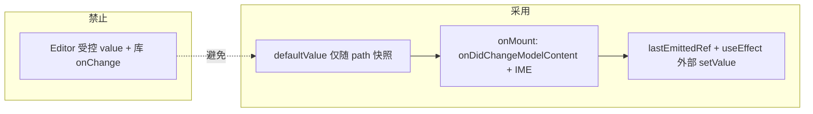

# Monaco Markdown 编辑器：中文 IME 重影 / 叠字问题与解决方案

本文记录知识库等页面使用 `@monaco-editor/react` + 透明主题编辑 Markdown 时，**中文输入法（IME）** 出现**重影、拼音与汉字叠画、仅首行正常换行后必现**等问题的**成因**与**最终解决办法**；并单独说明与 IME 缓解方案相关的 **Tab / 缩进（`tabSize`）** 问题及处理（**§4**）；以及分屏模式下 **「跟随滚动」** 如何按**标题锚点**与源码行号对齐预览（**§5**），便于后续维护与排查。

---

## 1. 现象归纳

| 现象 | 说明 |
|------|------|
| 拼音/汉字叠在一起 | 输入过程中同一位置像画了两次字 |
| 受控模式下更明显 | 向 `<Editor>` 传 `value` + 库自带 `onChange` 时尤甚 |
| 仅首行正常、回车后每行都重影 | 与多行后的折行、布局重算强相关 |
| 换应用主题后偶发重影 | 全透明 `editor.background` 与页面背景同时变化时合成层更易错位 |

---

## 2. 根因分析（分层）

### 2.1 受控 `value` 与库内全文同步

`@monaco-editor/react` 在传入**非 undefined 的 `value`** 时，会在 `value` 变化时对整篇文档执行 **`executeEdits` 类全文替换**。

中文 IME 组合过程中，真实内容在 **隐藏 `textarea` 的合成串** 与 **Monaco 模型** 之间存在时间差；若此时父组件又根据**略旧的 `value`** 回写编辑器，就会与合成层**叠绘**，表现为重叠、抖动。

**对策**：对业务侧保持「看起来像受控」的体验，但对 **Monaco 组件不传 `value`**，改用 **`defaultValue` + 稳定 `path` + `key`**，在 `onMount` 里用 `onDidChangeModelContent` 等方式上报，并用 `lastEmittedRef` + `useEffect` 仅在**外部数据源**变化时 `setValue`。

### 2.2 `defaultValue` 每键都变 → `memo(Editor)` 无意义

即使去掉受控 `value`，若每次渲染都把**最新全文**当作 `defaultValue` 传入，`Editor` 的 props 仍在变，子组件持续重渲染，同样会放大与 IME 的冲突。

**对策**：用 **`editorBootstrapTextRef`**（或等价逻辑）仅在 **`monacoModelPath` / `documentIdentity` 变化**时更新「引导用的初始文本」；同一条文档内输入时 **`defaultValue` 对 React 比较保持恒定**。

### 2.3 透明主题 + 主题切换

自定义主题若将 `editor.background` 设为 **`#00000000`**，画布背后会直接透出页面的 `color-mix`、渐变等。全局换肤时底层重绘与编辑器层合成不同步时，容易出现**重影感**（与「纯换行 IME」问题不同维度）。

当前仍保留**玻璃主题**（继承 `vs` / `vs-dark` / `hc-black` 高亮、仅 chrome 透明）时，若再遇到换肤重影，可考虑在换肤后 **`editor.layout()`** 或改为**不透明**编辑区底色（见历史迭代说明）。

### 2.4 换行后重影：`wordWrap` + `automaticLayout`（本次关键）

**首行**往往不触发「整篇折行重算」；**一回车成多行**后，`wordWrap: on` 会按视口宽度反复重算折行，再叠加 **`automaticLayout: true`** 在内容高度变化时触发布局，与**透明底 + Canvas + IME 合成层**容易在**第二行及之后**叠画。

**对策（Markdown 专用）**：

- **`wordWrap: 'off'`**：取消视口折行，长行横向滚动，避免换行后每键触发大范围重排。  
- 关闭 **`folding` / `stickyScroll` / `glyphMargin`** 等额外装饰层，减少多行时的多余绘制。  
- **`accessibilitySupport: 'off'`**、**`cursorBlinking: 'solid'`**：减少辅助层与光标闪烁带来的重绘。  
- **`onDidCompositionEnd`** 后在 **`requestAnimationFrame` 链中调用 `editor.layout()` 两次**，让合成结束后的几何与 IME 对齐。

### 2.5 组合事件时序

部分浏览器上 **`compositionstart` 晚于首字符进入模型**，若仅靠 Monaco 的 `onDidCompositionStart`，仍可能在组合初期误触发 `pushToParent`。

**对策**：在 **`textarea.inputarea` 上监听原生 `compositionstart` / `compositionend`**，尽早置位 `imeComposingRef`；内容变更上报时同时判断 **`editor.inComposition`**；**结束时的正文上报**以 **`onDidCompositionEnd` + `queueMicrotask`** 为主，避免与原生 `compositionend` 各推一次。

### 2.6 外部 `value` 回写

MobX/React 回显时，若 `value` 与编辑器当前内容一致但仍是「父级回传的本人编辑」，应用 **`lastEmittedRef`**：与最近一次**本编辑器**推上去的内容相同则**不要 `setValue`**；且 **`hasTextFocus()`** 且 props 落后于模型时**不要用旧 props 覆盖**（避免 IME 中间态被整篇替换）。

### 2.7 分屏预览抢主线程

分屏时右侧 Markdown 全量 `render` 若与左侧同帧执行，会加重卡顿与「像重影」的观感。

**对策**：预览侧使用 **`useDeferredValue(value)`** 等方法降低优先级（实现见 `index.tsx`）。

---

## 3. 解决方案总览（实现清单）

相关代码主要在：

- `apps/frontend/src/components/design/Monaco/index.tsx` — 主编排、IME、`mergedEditorOptions`、`Editor` 的 props、分屏 **`onDidScrollChange`** 与 **`previewViewportRef`**  
- `apps/frontend/src/components/design/Monaco/utils.ts` — **`syncPreviewScrollFromMarkdownEditorByHeadings`**、**`buildHeadingScrollCache`**、**`HeadingScrollCache`**，及比例回退 **`editorVerticalScrollRatio` / `setPreviewVerticalScrollRatio`**（详见 **§5**、**§5.8**）  
- `apps/frontend/src/components/design/Monaco/glassTheme.ts` — 继承内置主题的透明 chrome 主题注册  
- `apps/frontend/src/components/design/Monaco/options.ts` — 全局默认编辑器选项（Markdown 在 index 内再覆盖一部分）  
- `packages/tools/src/markdown-parser.ts` — **`MarkdownParser`**；**`enableHeadingSourceLineAttr`** 为预览标题注入 **`data-md-heading-line`**（详见 **§5**）  
- `apps/frontend/src/views/knowledge/index.tsx` — 传入 **`documentIdentity`**，保证换篇时 model 与引导文本一致  

### 3.1 数据流（概念）

### 3.2 `Editor` 侧要点

- **`beforeMount`**：`registerMonacoGlassThemes`，主题 id 使用 `GLASS_THEME_BY_UI[theme]`。  
- **`path={monacoModelPath}`**，**`key={monacoModelPath}`**，**`defaultValue={editorBootstrapTextRef.current}`**。  
- **不传 `value`、不传库自带 `onChange`**（变更只在 `onMount` 订阅里处理）。

### 3.3 Markdown 专用 `mergedEditorOptions`（与换行重影直接相关）

在 `language === 'markdown'` 时额外设置（与 `index.tsx` 保持一致，后续若有改动以代码为准）：

| 选项 | 作用 |
|------|------|
| `wordWrap: 'off'` | 避免多行后反复折行重算与 IME 打架 |
| `folding: false` / `foldingHighlight: false` | 减少装饰层 |
| `stickyScroll: { enabled: false }` | 关闭粘性滚动条区域 |
| `glyphMargin: false` | 关闭字形边距 |
| `accessibilitySupport: 'off'` | 减少无障碍树带来的额外绘制 |
| `cursorBlinking: 'solid'` | 稳定光标，减少闪烁重绘 |
| **不**单独设置 `fontFamily` | 继承 `options.ts` 的 `EDITOR_FONT_STACK`（拉丁等宽在前、中文回退），避免「黑体优先」比例字导致 Tab/空格列观感异常（详见 **§4**） |
| `fontLigatures: false`、`disableMonospaceOptimizations: true`（与全局一致）、`colorDecorators: false` | 连字 / 等宽路径 / 装饰对 IME 测量的干扰；若缩进列仍异常，可按 **§4.2 B** 评估 Markdown 下改为 `disableMonospaceOptimizations: false` |

### 3.4 内容上报与 `layout`

- 非组合阶段：`onDidChangeModelContent` → **`requestAnimationFrame` 合并**同一帧内多次变更再 `pushToParent`。  
- `onDidCompositionStart`：**取消**挂起的 `pushRaf`，并置 `imeComposingRef`。  
- `onDidCompositionEnd`：`queueMicrotask` 内 **`pushToParent` + 双 `requestAnimationFrame` 调用 `editor.layout()`**。  
- `editor.onDidDispose`： **`cancelAnimationFrame(pushRaf)`**。

### 3.5 知识库 `documentIdentity`

传入 `detailStore.knowledgeEditingKnowledgeId ?? 'draft-new'`，使 **`monacoModelPath` 随条目变化**，避免多篇文档共用同一 URI 或错误复用引导文本。

---

## 4. Tab / 缩进（`tabSize`）问题：成因与处理（与 IME 方案的关系）

中文 IME 重影的缓解手段里，有一部分会**间接影响「缩进看起来像 1」或 Tab 列不齐**。本节说明**原因**、Monaco 内部依赖哪些配置、以及**当前仓库里对应实现**落在哪些文件（以代码为准）。

### 4.1 现象

- 按 **Tab** 时每次只像进了 **1 格**，或格式化后列表/嵌套仍像 **1 空格** 宽度。  
- 与「行首真实插入了几个空格字符」可能不一致：有时是**模型里就是 1**（逻辑错误），有时是**比例字体下列宽看起来像 1**（观感问题）。

### 4.2 根因分层

#### A. `@monaco-editor/react` 与 Standalone 的初始化顺序

库内顺序大致为：先 **`monaco.editor.createModel`**（得到 `ITextModel`），再 **`monaco.editor.create(..., { model, ...options })`**。  
Standalone 在 `editor.create` 里才会把传入的 `tabSize`、`detectIndentation` 等写入**全局配置**并同步到 `ModelService`。因此**第一个 model** 在创建瞬间，若仍走默认的 **`detectIndentation: true`**，可能按正文**推断**出与预期不符的 `tabSize` / `indentSize`（极端情况下与 `TextModelResolvedOptions` 的兜底逻辑叠加，表现为缩进宽度异常）。

**处理思路**：在全局 `options` 中关闭推断，并在 **model 创建后**再次把 `tabSize` / `indentSize` 写回 model（例如在 `beforeMount` 里订阅 `monaco.editor.onDidCreateModel`，或在 `onMount` 里对当前 model 调用 `updateOptions`）。**当前仓库**：`options.ts` 已显式配置 `tabSize`、`indentSize`；若线上仍复现，可再补 **`detectIndentation: false`**、**`insertSpaces: true`** 及上述 model 级写回（见 4.4）。

#### B. 与 IME 相关的字体与排版路径

曾为减轻重影采用 **「中文黑体 / 系统无衬线优先」** 的 `fontFamily` 或 **`disableMonospaceOptimizations: true`**（变宽混排路径）：在**比例字体**下，**空格与 Tab 的像素宽度**容易与 Monaco 按「列」计算的 `tabSize` 不一致，用户会感觉「怎么都是一格」。  

**处理思路**：Markdown 编辑区**不再单独覆盖** `fontFamily`，继承 `options.ts` 里 **拉丁等宽在前、中文回退在后** 的 `EDITOR_FONT_STACK`；在「重影」与「列对齐」之间取舍时，可评估将 Markdown 的 **`disableMonospaceOptimizations` 设为 `false`**（与全局 `true` 区分），以换更稳定的 Tab 列对齐——需结合真机 IME 回归。**当前仓库**：`index.tsx` 的 `mergedEditorOptions` 在 `language === 'markdown'` 时**未**设置 `fontFamily`，与全局栈一致；Markdown 下 **`disableMonospaceOptimizations` 仍为 `true`**（与 `options.ts` 相同，偏 IME）。

#### C. 光标/输入逻辑使用的 model 选项

Monaco 在插入 Tab 时，`CursorConfiguration` 使用 **`model.getOptions()`** 中的 **`indentSize`**、**`tabSize`**、**`insertSpaces`**（见 `cursorCommon.js`）。仅改编辑器 UI 选项而不同步 model，仍可能表现为缩进错误。

**处理思路**：保证 **`editor.updateOptions`** 与 **`model.updateOptions`** 一致（至少在挂载、`setModel`、外部同步正文之后）。

#### D. 格式化（Prettier）与编辑器不一致

若 Prettier 对 Markdown 使用 **`useTabs: true`**，会插入 **Tab 字符**；在比例字体或较窄 Tab 渲染下，也容易「看起来像一格」。

**处理思路**：Markdown 专用格式化覆盖为 **`useTabs: false`**，**`tabWidth`** 与编辑器常量一致。

### 4.3 当前代码中的落地点（实现清单）

| 位置 | 内容 |
|------|------|
| `apps/frontend/src/components/design/Monaco/options.ts` | 导出 **`MONACO_TAB_SIZE`**（当前为 `2`）；全局 **`tabSize: 2`**、**`indentSize: 2`**，与缩进宽度单一数据源一致。 |
| `apps/frontend/src/components/design/Monaco/format.ts` | `formatMarkdownWithPrettier` 在 `...PRETTIER_CODE_OPTIONS` 之上设置 **`useTabs: false`**、**`tabWidth: MONACO_TAB_SIZE`**，避免 Markdown 格式化产出 Tab 字符与编辑器观感冲突。 |
| `apps/frontend/src/components/design/Monaco/index.tsx` | **`mergedEditorOptions`**：Markdown 分支继承 `...options` 的字体栈（不单独 `fontFamily`），**`disableMonospaceOptimizations`** 与全局一致为 **`true`**（偏 IME；列不齐时可试 `false`，见 4.2 B）；并保留 **`wordWrap: 'off'`** 等；**`handleEditorMount`** 内负责 IME 与内容上报（若在此增加 `model.updateOptions` / `editor.updateOptions` 同步缩进，可与 4.2 节 A/C 对照）。 |
| `apps/frontend/src/components/design/Monaco/glassTheme.ts` | **`beforeMount`** 中注册玻璃主题；如需全局兜底「任一 model 创建即写缩进」，可在此与 `registerMonacoGlassThemes` 一并注册 **`monaco.editor.onDidCreateModel`**（当前文件以主题为限，是否增加监听以仓库为准）。 |

### 4.4 若仍异常时的排查顺序（建议）

1. 在 DevTools 中对当前编辑器执行（或通过临时日志）：**`editor.getModel()?.getOptions()`**，确认 **`tabSize`**、**`indentSize`**、**`insertSpaces`**。  
2. 在 **`options`** 中补充 **`detectIndentation: false`**、**`insertSpaces: true`**（若尚未配置），避免推断覆盖。  
3. 在 **`onMount`**（或 `onDidCreateModel`）对 model 执行 **`updateOptions({ tabSize, indentSize, insertSpaces })`**，并与 **`editor.updateOptions`** 对齐。  
4. 核对 Markdown 下 **`fontFamily` / `disableMonospaceOptimizations`** 是否与产品接受的 IME 表现平衡。  
5. 确认格式化走 **`format.ts`** 中 Markdown 分支（**`useTabs: false`**）。

### 4.5 与本文其它章节的关系

- **§2.4、§3.3** 的 `wordWrap: 'off'`、关 folding 等仍主要服务 **IME 重影**；**§4** 专门把 **Tab/缩进** 与「为 IME 改字体、改排版路径」的副作用拆开说明，避免再出现「只改重影、缩进又坏」的维护盲区。

---

## 5. 分屏「跟随滚动」：按标题锚点同步（实现逻辑）

分屏（左编辑、右预览）开启 **「跟随滚动」** 时，右侧预览的 `scrollTop` **不再**简单按「编辑器已滚高度 / 编辑器可滚总高」的比例去乘预览可滚高度。原因是：源码一行对应预览里未必是同等像素高度（标题、列表、代码块、KaTeX、GFM 等块级结构高度差异大），**整篇比例同步**会出现「明明滚到某一节标题，预览却停在另一段中间」的错位感。

当前实现改为：**以 Markdown 标题行为锚点**，在「文首 ↔ 各标题 ↔ 文末」之间用**源码行号**做一维插值，把编辑器**当前首可见行**映射到预览**垂直滚动位置**。核心代码在 `apps/frontend/src/components/design/Monaco/utils.ts` 的 **`syncPreviewScrollFromMarkdownEditorByHeadings`**（可选传入 **`headingScrollCacheRef`** 走热路径，见 **§5.8**），预览 DOM 行号由 `packages/tools` 的 **`MarkdownParser`** 在渲染标题时注入。

### 5.1 预览侧：标题绑定源码行号（`data-md-heading-line`）

- **`MarkdownParserOptions.enableHeadingSourceLineAttr`**（默认 `false`）：为 `true` 时，在 **`heading_open`** 渲染阶段给每个标题 token 写入属性 **`data-md-heading-line`**，值为 **`token.map[0] + 1`**（**1-based**，与 Monaco `ITextModel` 行号一致）。
- `token.map` 来自 **markdown-it** 对块级 token 记录的源码行区间（起始行为 0-based），故 `+1` 后与 `editor.getVisibleRanges()[0].startLineNumber` 同一套坐标。
- **ATX（`#`）与 Setext（下划线标题）** 只要解析为 `heading_open`，都会带该属性；**围栏代码块内**不会出现标题 token，因此不会误标。
- 知识库 Monaco 内嵌的 **`ParserMarkdownPreviewPane`** 构造解析器时显式传入 **`enableHeadingSourceLineAttr: true`**（与 `enableChatCodeFenceToolbar` 等并列）；其它场景（如仅会话列表缩略预览）若未开启，则预览 HTML 无该属性，同步逻辑会走回退（见 5.5）。

实现位置：`packages/tools/src/markdown-parser.ts` 中 **`patchHeadingSourceLineAttr`**（包装原有 `renderer.rules.heading_open`，在 `renderToken` 前 `taskListAttrSet(token, 'data-md-heading-line', ...)`）。

### 5.2 编辑器侧：用「首可见行」代表当前阅读位置

- 取 **`editor.getModel()`**；无 model 则直接回退（5.5）。
- 取 **`editor.getVisibleRanges()[0].startLineNumber`** 作为 **`topLine`**（视口顶部对应的第一行）。未取到可见区时按行 1 处理。
- 该信号表示用户当前**从哪一行开始看**，在标题锚点之间做插值时，语义是「阅读进度在源码行维度上落在哪一段」，而不是画布像素一比一对应。

### 5.3 预览侧：锚点序列 `points` 的构造

在右侧 **滚动视口** `viewport`（Radix `ScrollArea` 的 viewport 节点，`previewViewportRef` 指向该元素）内：

1. **`querySelectorAll('[data-md-heading-line]')`**，读出每个标题元素的行号，按行号排序。
2. **文首锚点**：`{ line: 1, scrollTop: 0 }`（文档顶对齐预览顶、不额外滚动）。
3. **每个标题锚点**：对该 DOM 元素计算「若要把该标题顶边与视口顶边对齐，预览应使用的 **`scrollTop`**」。计算用 **`getBoundingClientRect`**：  
   `scrollTopToAlign = viewport.scrollTop + (el.top - viewport.top)`  
   该值与当前 `viewport.scrollTop` 无关，避免依赖 offsetParent 链；再 **`clamp` 到 `[0, maxScroll]`**，`maxScroll = scrollHeight - clientHeight`。
4. **同一源码行多个标题元素**：按排序后顺序，若与上一点 **行号相同**，则 **合并**为更新上一点的 `scrollTop`（典型情况：**第一行就是 `# 标题`**，文首锚点与首标题行号均为 1，应用标题元素算出的 `scrollTop` 覆盖文首的 0）。
5. **文末锚点**：`{ line: lineCount, scrollTop: maxScroll }`，其中 **`lineCount = model.getLineCount()`**。这样当用户滚到文档后部时，预览也会趋向底对齐。

### 5.4 插值：在相邻锚点间按行号线性映射

设排序后的锚点序列为 \(P_0, P_1, \ldots, P_k\)，每个 \(P_j = (\text{line}_j, \text{scrollTop}_j)\)，且 **`line` 单调不减**。

1. 自 **`i = 0`** 起循环：在 **`i < points.length - 1`** 且 **`points[i + 1].line <= topLine`** 时执行 **`i++`**（**`topLine` 恰好等于下一锚点行号**时会进入下一段，使该段起点对应「标题顶对齐」的 **`scrollTop`**）。结束后取 **`a = points[i]`**、**`b = points[min(i + 1, length - 1)]`**；若已处于**文末锚点**且 **`a`** 与 **`b`** 重合，分母用 **`max(1, b.line - a.line)`** 避免除零。
2. 令 **`a = points[i]`**，**`b = points[i+1]`**（若退化到同一点，则 `b` 与 `a` 相同，下面分母仍用 `max(1, b.line - a.line)` 避免除零）。
3. 比例  
   \[
   t = \mathrm{clamp}_{[0,1]}\Bigl(\frac{\text{topLine} - a.\text{line}}{b.\text{line} - a.\text{line}}\Bigr)
   \]
4. 预览目标滚动：  
   **`targetScrollTop = a.scrollTop + t × (b.scrollTop - a.scrollTop)`**，再 **`clamp` 到 `[0, maxScroll]`** 写回 **`viewport.scrollTop`**。

直观理解：在**两个标题之间的源码区间**内，用户从上一标题行滚到下一标题行，预览在**对应两个标题 DOM 位置之间**按比例移动；**文首到第一个标题**、**最后一个标题到文末**同理。这样「跟节」比「跟整篇像素比例」稳定得多。

### 5.5 回退：无标题或尚无 DOM 锚点时

若 **没有 model**、或 **预览中没有任何带 `data-md-heading-line` 的元素**（正文无标题、或解析器未开注入、或预览尚未挂载完成），则退回到 **`editorVerticalScrollRatio` + `setPreviewVerticalScrollRatio`**：仍按**整篇垂直滚动比例**同步，与早期实现一致，避免完全失去联动。

### 5.6 接线与时序（`index.tsx`）

- **`previewViewportRef`**：传给 `ParserMarkdownPreviewPane` 的 **`viewportRef`**，与 Radix 内层可滚 viewport 绑定，保证读写的 `scrollTop` 作用在正确容器上。
- **`headingScrollCacheRef`**：持有 **`HeadingScrollCache | null`**（见 **§5.8**），传给 **`syncPreviewScrollFromMarkdownEditorByHeadings` 的第三个参数**；退出分屏或关闭跟随时置 **`null`**，避免沿用过期测量。
- **`splitPreviewScrollFollow`**：仅在为 **true** 且 **`viewMode === 'split'`** 时执行同步；**`viewModeRef` / `splitScrollFollowRef`** 供回调内读取最新状态，避免闭包陈旧。
- **`useLayoutEffect`**（依赖 **`deferredPreviewMarkdown`、`viewMode`、`splitPreviewScrollFollow`、`isMarkdown`**）：在分屏且开启跟随时调用 **`rebuildHeadingPreviewScrollCache`**，并在 **`requestAnimationFrame` 内再测一帧**后执行 **`alignPreviewScrollToEditor`**，减轻 **highlight.js** 等异步撑高预览后锚点 **`scrollTop`** 偏差。
- **`ResizeObserver`** 监听预览 **viewport**：分栏宽度变化时重建缓存并在 **rAF** 内再同步一次；观察器回调用 **`previewResizeRafRef`** **合并到单帧**，避免拖拽分隔条时连续触发多次全量 DOM 测量。
- **`editor.onDidScrollChange`** → **`syncPreviewFromEditor`**：内部 **`cancelAnimationFrame` + `requestAnimationFrame`** 合并到**下一帧**再调用 **`syncPreviewScrollFromMarkdownEditorByHeadings(..., headingScrollCacheRef)`**。
- **`alignPreviewScrollToEditor`**：与滚动同步共用上述 **`sync` + `cacheRef`** 调用方式。
- **`editor.onDidDispose`**：取消挂起的 **`scrollSyncRafRef`**，避免卸载后仍改预览滚动。

### 5.7 与 §2.7 的关系与局限

- 预览仍由 **`useDeferredValue(value)`** 降低更新优先级（§2.7），**极端快速输入**时预览 HTML 可能略滞后于一帧，短时间内标题节点集合与编辑器行号可能短暂不一致；下一帧渲染完成后会自然对齐。
- **局限**：插值在**源码行号**维度是线性的，**同一标题区间内**预览像素高度与行数仍不成正比，只能做到「区间对了、区间内大致跟随」；若需像素级对齐，需要更重的布局度量（例如逐行 Source Map 或块级映射表）。
- **回归建议**：分屏开启跟随滚动，文档含多级 `#` 标题，从文首滚到文末，观察预览是否大致与当前章节同步；无标题短文应仍能整体比例滚动。

### 5.8 性能与顺滑：`HeadingScrollCache`（滚动热路径）

**问题**：若每次 **`onDidScrollChange`**（经 rAF）都执行 **§5.3** 的全流程，则每帧都会对预览 **`querySelectorAll('[data-md-heading-line]')`**，并对**每个标题**调用 **`getBoundingClientRect`**。Monaco 滚动事件很密，容易形成**高频布局读**，主线程吃紧时表现为预览跟随**发涩、掉帧**。

**做法**：把「锚点测量」与「按 `topLine` 插值写 `scrollTop`」拆开。

1. **冷路径 — `buildHeadingScrollCache(viewport, lineCount)`**（`utils.ts`）  
   - 与原先单次同步相同：枚举标题节点、算各锚点 **`scrollTop`**、拼 **`points`**，并记录当时的 **`viewport.scrollHeight` / `clientHeight`**、**`lineCount`**。  
   - 无标题时返回 **`useRatioFallback: true`**，热路径仍走整篇比例（**§5.5**）。

2. **有效性 — `isHeadingScrollCacheValid(cache, viewport, lineCount)`**  
   - 当且仅当 **`cache.lineCount === model.getLineCount()`** 且 **`scrollHeight` / `clientHeight` 与当前 viewport 一致** 时，认为缓存仍对应当前布局；否则丢弃缓存走冷路径。

3. **热路径 — `syncPreviewScrollFromMarkdownEditorByHeadings(editor, viewport, cacheRef?)`**  
   - 若传入 **`cacheRef`** 且 **`cacheRef.current` 有效**：只做 **`getVisibleRanges` → `interpolatePreviewScrollTop` → 赋值 `viewport.scrollTop`**，**不再**每帧扫 DOM。  
   - 若无效或未传 ref：执行完整测量，并把新结果写回 **`cacheRef.current`**（下一帧起可走热路径）。

4. **`index.tsx` 何时重建缓存**  
   - **`useLayoutEffect`**：随 **`deferredPreviewMarkdown`、分屏、跟随开关** 重建；**双 rAF** 中的第二次测量兼顾代码高亮等导致的**滞后增高**。  
   - **`ResizeObserver`**：预览区尺寸变化时重建，并对齐一次；回调经 **`previewResizeRafRef`** 合并，减轻**拖拽分栏**时的连续测量。

**维护注意**：修改锚点 DOM 结构或标题属性名时，需同步 **`buildHeadingScrollCache`** 与 **`MarkdownParser`** 的注入约定；若新增会改变预览高度的异步内容（大图懒加载等），可能需在适当时机**主动 `rebuildHeadingPreviewScrollCache`**，否则短时内缓存与真实布局会偏差。

---

## 6. 权衡与后续可调项

- **`wordWrap: 'off'`** 下，超长行需**横向滚动**。若产品强需求自动折行，可尝试 **`wordWrap: 'bounded'`** 或较大 **`wordWrapColumn`** 等折中，并在真机 IME 上回归。  
- 玻璃主题仍使用**全透明**编辑区底色时，若在**仅换肤**场景再出现合成问题，可评估：换肤后强制 **`layout()`**，或改为读取设计 token 的**不透明**底色写入 `defineTheme`。

---

## 7. 回归检查建议

1. 单行中文、连续组词。  
2. **首行输入后回车**，在第二行、第三行再输入中文。  
3. 中英文混排、换行前后各输入一段。  
4. 切换 **vs / vs-dark**（及页面明暗主题）。  
5. **分屏预览**下快速输入（观察卡顿与视觉是否异常）。  
6. **切换知识库条目**后内容是否与列表一致、无串篇。  
7. **Tab / 格式化**：列表嵌套、代码围栏内缩进是否为 **2 空格** 宽度；`getModel().getOptions()` 中 `tabSize` / `indentSize` 是否与预期一致（参见 **§4**）。  
8. **分屏跟随滚动**：开启「跟随滚动」后，含多级标题的长文从顶滚到底，预览是否大致与当前章节对齐；**无标题**短文是否仍能整体联动；连续快速滚动时预览是否仍较顺滑（参见 **§5**，含 **§5.8** 缓存路径）。

---

## 8. 修订记录

- 文档初稿：总结「受控回写 + 换行折行布局 + IME 时序 + 玻璃主题」等成因与当前代码中的对策。  
- 增补 **§4**：Tab/缩进问题与 IME 方案的关联、`@monaco-editor/react` 建 model 时机、Prettier 与 `MONACO_TAB_SIZE`；修正 **§3.3** 中已过时的「中文优先 `fontFamily`」表述；原 §4–§6 顺延为 §5–§7。  
- 代码为准：若 `index.tsx` / `options.ts` / `format.ts` / `glassTheme.ts` 与本文不一致，**以仓库实现优先**，并建议同步更新本节。  
- **§6**（现 **§7**）增补 Tab/缩进回归项；**§4.2 B、§4.3** 与 `index.tsx` 对齐（Markdown 下 `disableMonospaceOptimizations` 实际为 `true`）；修正 `index.tsx` 中与实现不符的注释。  
- 增补 **§5**：分屏「跟随滚动」按标题锚点与源码行号插值同步的实现说明（`MarkdownParser.enableHeadingSourceLineAttr`、`utils.ts` 插值、`index.tsx` 时序）；原 **§5–§7** 顺延为 **§6–§8**；**§7**（回归）增补跟随滚动检查项。  
- 增补 **§5.8** 与 **§5.6** 修订：**`HeadingScrollCache`**、**`buildHeadingScrollCache`**、滚动热路径与冷路径；**`useLayoutEffect` + 双 rAF** 重建锚点；**`ResizeObserver` + `previewResizeRafRef`** 合并 resize；解决跟随滚动时每帧全量 DOM 测量导致的卡顿感。
