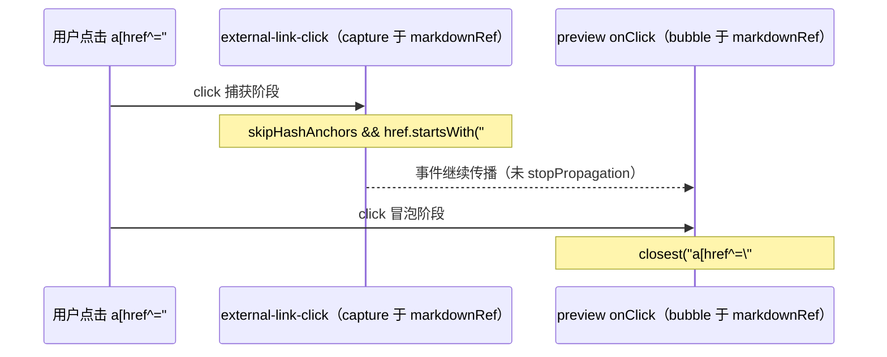

# Monaco Markdown 预览：目录锚点（`#fragment`）滚动与 Layout 误滚治理

本文记录**知识库 / Monaco 分屏预览**中，点击目录或正文内 **`href="#..."` 页内锚点**时的完整实现实录：为何曾出现「整页主内容上移」、为何在治理后又出现「点击目录无法跳转」，以及当前代码如何同时满足**只滚预览视口**与**锚点必达**。

---

## 1. 背景与目标

### 1.1 现象（历史问题）

1. **Layout 误滚**：点击预览区目录（TOC，目录）链接后，不仅预览在动，**外层 Layout 中包裹 `<Outlet />` 的 `overflow-y-auto` 主内容区**也会发生纵向滚动，视觉上像「整块页面上移」。
2. **跳转失效（治理副作用）**：为抑制误滚，对外链拦截器在「跳过哈希锚点」分支补充 `preventDefault()` 后，若预览侧**未正确解析目标标题 DOM**，则浏览器默认的片段导航被禁止，表现为**点击目录无反应**。

### 1.2 目标

- **页内 `#` 链接**：禁止浏览器默认的「片段导航」去滚动**错误的滚动容器**（主布局 Outlet）。
- **滚动容器**：仅对 **Radix `ScrollArea` 的 Viewport**（`apps/frontend/src/components/ui/scroll-area.tsx` 中 `ref` 落在 `ScrollAreaPrimitive.Viewport`）写入 `scrollTop` / `scrollTo`。
- **禁止**对标题调用 **`Element.scrollIntoView()`**（会沿滚动链滚动多个祖先，与默认片段导航同类问题）。

---

## 2. 根因拆解（实现层面）

### 2.1 浏览器默认「片段导航」

对 `<a href="#section-id">`，若不在捕获阶段取消默认行为，浏览器会执行**片段导航**：在文档内查找 `id="section-id"` 的元素并将其滚入视口。  
**滚动目标容器**由布局决定，往往是**最近的滚动祖先**；当预览嵌套在「可滚主区域」内时，**主区域可能被一并滚动** → 用户看到 Layout 整体上移。

### 2.2 外链拦截器曾「只跳过、不取消默认」

`attachExternalLinkClickInterceptor`（`apps/frontend/src/utils/external-link-click.ts`）在 `skipHashAnchors: true` 时，若仅 `return` 而不 **`preventDefault()`**，则**无法阻止**上述默认片段导航。  
因此必须与预览侧自定义滚动**配合**：先/并行取消默认，再由预览逻辑**显式**滚动 Viewport。

### 2.3 预览侧查找范围过窄（导致「无法跳转」）

`ParserMarkdownPreviewPane` 在正文含 **` ```mermaid ` 围栏**时会走 **`splitForMermaidIslandsWithOpenTail`**，将 Markdown 拆成多块渲染；每块 `parser.render()` 外层仍带 **`.markdown-body`** 容器类名，DOM 上会出现**多个** `.markdown-body` 兄弟节点。

若锚点解析写成：

```ts
// 反例：只会在第一个 .markdown-body 子树内查找
const root = el.querySelector('.markdown-body') ?? el;
dest = root.querySelector(`#${CSS.escape(id)}`);
```

则**目录在某段、标题在另一段**时，`querySelector` 找不到目标 → 自定义滚动不执行；而浏览器默认片段导航会在**更大范围**（甚至整文档）内查找 `id`，此前用户仍可能「看到在动」（尽管滚错了容器）。  
**一旦对 `#` 统一 `preventDefault()`，此缺陷即暴露为「完全无法跳转」。**

**正例**：在预览根容器 **`el`（`markdownRef` 指向的整棵子树）** 内查找：

```ts
dest = el.querySelector(`#${CSS.escape(id)}`);
```

这样**所有分段**内的标题均在搜索范围内。

### 2.4 与 `scrollIntoView` 的关系

历史上若使用 `scrollIntoView` 定位标题，同样会触发**多祖先滚动**。当前统一使用 `scrollPreviewViewportToRevealElement`（`Monaco/utils.ts`），内部基于 `getBoundingClientRect` 与 `scroll-margin-top` 计算**仅 Viewport** 的 `scrollTop`。

---

## 3. 事件顺序（捕获 / 冒泡）

以下仅描述与 **`#` 锚点**相关的路径（省略外链 `openExternalUrl` 分支）。



要点：

- **捕获阶段**取消默认，避免浏览器再去滚 Layout。
- **冒泡阶段**完成「找目标 + 滚 Viewport」；不在捕获里滚，以免与后续监听器顺序强耦合。
- **`skipHashAnchors` 分支不调用 `stopPropagation`**，以便同节点上的冒泡监听仍能执行。

---

## 4. 涉及文件与职责

| 路径 | 职责 |
|------|------|
| `apps/frontend/src/utils/external-link-click.ts` | 在容器上以 **capture** 监听 `click`；外链 `preventDefault` + `openExternalUrl`；对 **`#` 且 `skipHashAnchors`**：`preventDefault` 后返回 |
| `apps/frontend/src/components/design/Monaco/preview.tsx` | 注册拦截器 + **bubble** `onClick`：解析 `href`、在 **`el` 整子树** 查找目标、`scrollPreviewViewportToRevealElement` |
| `apps/frontend/src/components/design/Monaco/utils.ts` | `scrollPreviewViewportToRevealElement` / `scrollTopToAlignHeadingTop`：只操作传入的 Viewport |
| `apps/frontend/src/components/ui/scroll-area.tsx` | `forwardRef` 指向 **Viewport**，保证 `localViewportRef` 与真实滚动节点一致 |
| `apps/frontend/src/components/design/ChatAssistantMessage/index.tsx` | 同样挂载 `attachExternalLinkClickInterceptor`；正文内 `#` 默认不再触发浏览器片段导航（一般无独立 Viewport 滚动需求） |

---

## 5. 实现实录（按模块）

### 5.1 `external-link-click.ts`：`#` 必须 `preventDefault`

**变更要点**：在 `skipHashAnchors && href.startsWith('#')` 时调用 **`e.preventDefault()`**，再 `return`。  
**原因**：否则浏览器片段导航仍会执行，主布局 Outlet 被滚动。

### 5.2 `preview.tsx`：查找范围从「首个 `.markdown-body`」改为「整块 `el`」

**变更要点**：将 `const root = el.querySelector('.markdown-body') ?? el` 改为在 **`el`** 上直接 `querySelector(\`#${CSS.escape(id)}\`)`。  
**原因**：Mermaid 岛分段时存在多个 `.markdown-body`，目录与标题可能不在同一段。

### 5.3 `utils.ts`（既有）

保持使用 **`scrollPreviewViewportToRevealElement(viewport, dest, { behavior: 'smooth' })`**，禁止对标题直接 **`scrollIntoView`**（注释已在源码中说明滚动链副作用）。

---

## 6. 参考实现代码（带详细注释）

下列摘录与仓库实现**语义一致**，便于阅读；维护时以**实际源文件**为准。

### 6.1 外链拦截器：`#` 取消默认片段导航

文件：`apps/frontend/src/utils/external-link-click.ts`

```typescript
/**
 * 在容器上以捕获阶段监听 click，统一处理 .markdown-body 内链接。
 *
 * 与页内锚点相关的关键约束：
 * - 当 skipHashAnchors === true 且 href 以 "#" 开头时：
 *   必须 e.preventDefault()，否则浏览器仍会执行「片段导航」，
 *   滚动「最近可滚动祖先」，其中常包含 Layout 里 overflow-y-auto 的 Outlet。
 * - 此分支不 stopPropagation，以便宿主在冒泡阶段自行滚动预览 Viewport。
 */
export function attachExternalLinkClickInterceptor(
	container: HTMLElement,
	opts: AttachExternalLinkClickOptions = {},
): () => void {
	const { anchorSelector = '.markdown-body a', skipHashAnchors = true, stopPropagation = true } = opts;

	const onClickCapture = (e: MouseEvent) => {
		const target = e.target as HTMLElement | null;
		if (!target) return;

		// closest：点击发生在 <a> 内子节点（如 <span>）时仍能命中外层 <a>
		const a = target.closest<HTMLAnchorElement>(anchorSelector);
		if (!a || !container.contains(a)) return;

		const href = a.getAttribute('href')?.trim() ?? '';
		if (!href) return;

		// —— 页内锚点：只取消默认，把「滚到哪里」交给预览等业务逻辑 ——
		if (skipHashAnchors && href.startsWith('#')) {
			e.preventDefault(); // 关键：禁止片段导航，避免误滚 Layout
			return; // 不 stopPropagation：让 markdownRef 上的冒泡监听继续跑
		}

		// —— 外链：打开系统浏览器 / 新标签，并阻止 WebView 内导航 ——
		e.preventDefault();
		if (stopPropagation) e.stopPropagation();
		void openExternalUrl(href);
	};

	container.addEventListener('click', onClickCapture, true);
	return () => container.removeEventListener('click', onClickCapture, true);
}
```

### 6.2 预览：`#` 锚点只滚 Radix Viewport

文件：`apps/frontend/src/components/design/Monaco/preview.tsx`（逻辑位于 `useEffect` 内）

```typescript
// markdownRef：包住 ScrollArea 与内部 HTML 的根节点，作为事件委托根与 DOM 查询根
const el = markdownRef.current;
if (!el) return;

const detachExternalLinkInterceptor = attachExternalLinkClickInterceptor(el, {
	anchorSelector: '.markdown-body a',
	skipHashAnchors: true,
	stopPropagation: true, // 仅对外链分支生效；# 分支见上文
});

const onClick = (e: MouseEvent) => {
	const target = e.target as HTMLElement;
	if (!el.contains(target)) return;

	const link = target.closest<HTMLAnchorElement>('a[href^="#"]');
	if (!link) return;

	const href = link.getAttribute('href');
	if (!href || href.length <= 1) return;

	// 去掉 "#"，decodeURIComponent：兼容 %E4%B8%AD 等编码；+ 视作空格与常见 form 语义对齐
	const raw = href.slice(1);
	const id = decodeURIComponent(raw.replace(/\+/g, ' '));
	if (!id) return;

	let dest: Element | null = null;
	try {
		// 必须在整块预览子树 el 内查找：
		// - Mermaid 岛穿插时存在多个 .markdown-body，只查第一个会漏掉标题
		// - el.querySelector 会遍历所有后代，覆盖所有分段
		dest = el.querySelector(`#${CSS.escape(id)}`);
	} catch {
		dest = null;
	}

	if (!(dest instanceof HTMLElement)) return;

	e.preventDefault();
	e.stopPropagation(); // 避免其它全局 click 逻辑误处理
	link.blur(); // 降低 :focus-visible 与键盘滚动副作用

	const vp = localViewportRef.current; // Radix ScrollArea Viewport 节点
	if (!vp) return;

	scrollPreviewViewportToRevealElement(vp, dest, { behavior: 'smooth' });
};

el.addEventListener('click', onClick);
```

### 6.3 仅滚 Viewport：`scrollPreviewViewportToRevealElement`

文件：`apps/frontend/src/components/design/Monaco/utils.ts`（语义摘要）

```typescript
/**
 * 将标题滚入「预览 Viewport」的可视区域：
 * - 通过 scrollTopToAlignHeadingTop 计算目标 scrollTop（考虑 scroll-margin-top）
 * - 使用 viewport.scrollTo({ top, behavior })，不调用 el.scrollIntoView()
 *
 * 禁止 scrollIntoView 的原因：其会沿滚动链滚动多个 overflow 祖先，
 * 导致 Layout 中 Outlet 等区域被连带滚动（整页内容上移）。
 */
export function scrollPreviewViewportToRevealElement(
	viewport: HTMLElement,
	el: HTMLElement,
	options?: { behavior?: ScrollBehavior },
): void {
	const rawTop = scrollTopToAlignHeadingTop(viewport, el);
	const maxScroll = Math.max(0, viewport.scrollHeight - viewport.clientHeight);
	const top = Math.max(0, Math.min(maxScroll, rawTop));
	viewport.scrollTo({ top, behavior: options?.behavior ?? 'smooth' });
}
```

---

## 7. 回归与排查清单

1. **无 Mermaid**：单块 `.markdown-body`，点击目录 → 仅预览 Viewport 滚动，Layout Outlet `scrollTop` 不变。
2. **含 Mermaid 岛**：目录与标题分居不同 HTML 段，点击目录仍能命中标题并滚动。
3. **外链**：`http(s)://...` 仍走 `openExternalUrl`，不被误判为页内锚点。
4. **空 `#` 或 `#` 单独**：不进入无效滚动逻辑（与 `href.length > 1` 等守卫一致）。

若仍有个别文档无法跳转：核对 **目录 `href` 的 fragment** 与 **`MarkdownParser` 生成的标题 `id`** 是否一致（例如第三方 TOC 使用 `user-content-` 前缀而标题未带此前缀）；此类需在解析层或 slug 规则上单独对齐，本文不展开。

---

## 8. 与既有文档的关系

- **`docs/monaco/markdown-split-scroll-sync.md`**：分屏「跟滚」与快照；本文专注 **TOC / `#` 点击** 与 **Layout 误滚**，互补。
- **`docs/frontend/tauri-browser.md`**：`attachExternalLinkClickInterceptor` 的接入说明；本文补充 **哈希锚点 + `preventDefault`** 的必要性。
- **`docs/mermaid/markdown-zoom-and-preview.md` §8**：`ParserMarkdownPreviewPane` 拆岛路径；与本文 **§2.3** 多 `.markdown-body` 根因直接相关。

---

*文档版本：与仓库中 `external-link-click.ts`、`Monaco/preview.tsx`、`Monaco/utils.ts`（`scrollPreviewViewportToRevealElement`）当前实现对齐；修改上述实现时请同步更新本文 §5–§6。*
