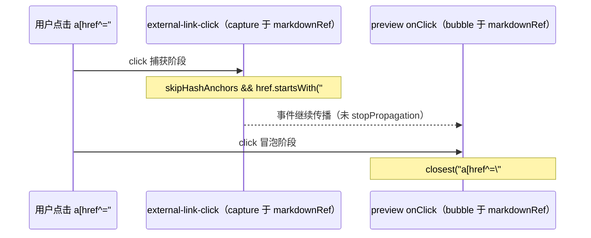

# Monaco Markdown 预览：目录锚点（`#fragment`）滚动与 Layout 误滚治理

本文记录**知识库 / Monaco 分屏预览**与 **ChatBot 助手气泡**中，点击目录或正文内 **`href="#..."` 页内锚点**时的完整实现实录：为何曾出现「整页主内容上移」、为何在治理后又出现「点击目录无法跳转」，以及当前代码如何同时满足**只滚正确视口**与**锚点必达**。公共逻辑已收敛至 **`useMarkdownHashLinkViewportScroll` / `attachMarkdownHashLinkNavigation`**（详见 **§9**）。

---

## 1. 背景与目标

### 1.1 现象（历史问题）

1. **Layout 误滚**：点击预览区目录（TOC，目录）链接后，不仅预览在动，**外层 Layout 中包裹 `<Outlet />` 的 `overflow-y-auto` 主内容区**也会发生纵向滚动，视觉上像「整块页面上移」。
2. **跳转失效（治理副作用）**：为抑制误滚，对外链拦截器在「跳过哈希锚点」分支补充 `preventDefault()` 后，若预览侧**未正确解析目标标题 DOM**，则浏览器默认的片段导航被禁止，表现为**点击目录无反应**。

### 1.2 目标

- **页内 `#` 链接**：禁止浏览器默认的「片段导航」去滚动**错误的滚动容器**（主布局 Outlet）。
- **滚动容器**：仅对 **Radix `ScrollArea` 的 Viewport**（`apps/frontend/src/components/ui/scroll-area.tsx` 中 `ref` 落在 `ScrollAreaPrimitive.Viewport`）写入 `scrollTop` / `scrollTo`。
- **禁止**对标题调用 **`Element.scrollIntoView()`**（会沿滚动链滚动多个祖先，与默认片段导航同类问题）。

---

## 2. 根因拆解（实现层面）

### 2.1 浏览器默认「片段导航」

对 `<a href="#section-id">`，若不在捕获阶段取消默认行为，浏览器会执行**片段导航**：在文档内查找 `id="section-id"` 的元素并将其滚入视口。  
**滚动目标容器**由布局决定，往往是**最近的滚动祖先**；当预览嵌套在「可滚主区域」内时，**主区域可能被一并滚动** → 用户看到 Layout 整体上移。

### 2.2 外链拦截器曾「只跳过、不取消默认」

`attachExternalLinkClickInterceptor`（`apps/frontend/src/utils/external-link-click.ts`）在 `skipHashAnchors: true` 时，若仅 `return` 而不 **`preventDefault()`**，则**无法阻止**上述默认片段导航。  
因此必须与预览侧自定义滚动**配合**：先/并行取消默认，再由预览逻辑**显式**滚动 Viewport。

### 2.3 预览侧查找范围过窄（导致「无法跳转」）

`ParserMarkdownPreviewPane` 在正文含 **` ```mermaid ` 围栏**时会走 **`splitForMermaidIslandsWithOpenTail`**，将 Markdown 拆成多块渲染；每块 `parser.render()` 外层仍带 **`.markdown-body`** 容器类名，DOM 上会出现**多个** `.markdown-body` 兄弟节点。

若锚点解析写成：

```ts
// 反例：只会在第一个 .markdown-body 子树内查找
const root = el.querySelector('.markdown-body') ?? el;
dest = root.querySelector(`#${CSS.escape(id)}`);
```

则**目录在某段、标题在另一段**时，`querySelector` 找不到目标 → 自定义滚动不执行；而浏览器默认片段导航会在**更大范围**（甚至整文档）内查找 `id`，此前用户仍可能「看到在动」（尽管滚错了容器）。  
**一旦对 `#` 统一 `preventDefault()`，此缺陷即暴露为「完全无法跳转」。**

**正例**：在预览根容器 **`el`（`markdownRef` 指向的整棵子树）** 内查找：

```ts
dest = el.querySelector(`#${CSS.escape(id)}`);
```

这样**所有分段**内的标题均在搜索范围内。

### 2.4 与 `scrollIntoView` 的关系

历史上若使用 `scrollIntoView` 定位标题，同样会触发**多祖先滚动**。当前统一使用 `scrollPreviewViewportToRevealElement`（`Monaco/utils.ts`），内部基于 `getBoundingClientRect` 与 `scroll-margin-top` 计算**仅 Viewport** 的 `scrollTop`。

---

## 3. 事件顺序（捕获 / 冒泡）

以下仅描述与 **`#` 锚点**相关的路径（省略外链 `openExternalUrl` 分支）。



要点：

- **捕获阶段**取消默认，避免浏览器再去滚 Layout。
- **冒泡阶段**完成「找目标 + 滚 Viewport」；不在捕获里滚，以免与后续监听器顺序强耦合。
- **`skipHashAnchors` 分支不调用 `stopPropagation`**，以便同节点上的冒泡监听仍能执行。

---

## 4. 涉及文件与职责

| 路径 | 职责 |
|------|------|
| `apps/frontend/src/utils/external-link-click.ts` | 在容器上以 **capture** 监听 `click`；外链 `preventDefault` + `openExternalUrl`；对 **`#` 且 `skipHashAnchors`**：`preventDefault` 后返回 |
| `apps/frontend/src/components/design/Monaco/preview.tsx` | 调用 **`useMarkdownHashLinkViewportScroll`**；围栏 **`bindMarkdownCodeFenceActions`** 仍单独 `useEffect` |
| `apps/frontend/src/components/design/Monaco/utils.ts` | `scrollPreviewViewportToRevealElement` / `scrollTopToAlignHeadingTop`：只操作传入的 Viewport |
| `apps/frontend/src/components/ui/scroll-area.tsx` | `forwardRef` 指向 **Viewport**，保证 `localViewportRef` 与真实滚动节点一致 |
| `apps/frontend/src/hooks/useMarkdownHashLinkViewportScroll.ts` | 公共 **`attachMarkdownHashLinkNavigation`** + **`useMarkdownHashLinkViewportScroll`**：`preview.tsx` 与 `ChatAssistantMessage` 共用 |
| `apps/frontend/src/components/design/ChatAssistantMessage/index.tsx` | 调用上述 Hook；`getViewport` 内优先 `scrollViewportRef`，否则 `closest('[data-slot="scroll-area-viewport"]')` |

---

## 5. 实现实录（按模块）

### 5.0 `useMarkdownHashLinkViewportScroll.ts`（推荐入口）

页内锚点与外链 `#` 的 **`preventDefault`**、冒泡点击、`#id` 在整棵宿主子树内解析、以及 **`scrollPreviewViewportToRevealElement`** 均集中在本模块；宿主仅提供 **`containerRef`** 与 **`getViewport()`**（及可选 `scrollBehavior` / `anchorSelector`）。非 React 场景可只调用 **`attachMarkdownHashLinkNavigation(host, getViewport, options)`**。

### 5.1 `external-link-click.ts`：`#` 必须 `preventDefault`

**变更要点**：在 `skipHashAnchors && href.startsWith('#')` 时调用 **`e.preventDefault()`**，再 `return`。  
**原因**：否则浏览器片段导航仍会执行，主布局 Outlet 被滚动。

### 5.2 `preview.tsx`：查找范围从「首个 `.markdown-body`」改为「整块 `el`」

**变更要点**：将 `const root = el.querySelector('.markdown-body') ?? el` 改为在 **`el`** 上直接 `querySelector(\`#${CSS.escape(id)}\`)`。  
**原因**：Mermaid 岛分段时存在多个 `.markdown-body`，目录与标题可能不在同一段。

### 5.3 `utils.ts`（既有）

保持使用 **`scrollPreviewViewportToRevealElement(viewport, dest, { behavior: 'smooth' })`**，禁止对标题直接 **`scrollIntoView`**（注释已在源码中说明滚动链副作用）。

---

## 6. 参考实现代码（带详细注释）

下列摘录与仓库实现**语义一致**，便于阅读；维护时以**实际源文件**为准。

### 6.1 外链拦截器：`#` 取消默认片段导航

文件：`apps/frontend/src/utils/external-link-click.ts`

```typescript
/**
 * 在容器上以捕获阶段监听 click，统一处理 .markdown-body 内链接。
 *
 * 与页内锚点相关的关键约束：
 * - 当 skipHashAnchors === true 且 href 以 "#" 开头时：
 *   必须 e.preventDefault()，否则浏览器仍会执行「片段导航」，
 *   滚动「最近可滚动祖先」，其中常包含 Layout 里 overflow-y-auto 的 Outlet。
 * - 此分支不 stopPropagation，以便宿主在冒泡阶段自行滚动预览 Viewport。
 */
export function attachExternalLinkClickInterceptor(
	container: HTMLElement,
	opts: AttachExternalLinkClickOptions = {},
): () => void {
	const { anchorSelector = '.markdown-body a', skipHashAnchors = true, stopPropagation = true } = opts;

	const onClickCapture = (e: MouseEvent) => {
		const target = e.target as HTMLElement | null;
		if (!target) return;

		// closest：点击发生在 <a> 内子节点（如 <span>）时仍能命中外层 <a>
		const a = target.closest<HTMLAnchorElement>(anchorSelector);
		if (!a || !container.contains(a)) return;

		const href = a.getAttribute('href')?.trim() ?? '';
		if (!href) return;

		// —— 页内锚点：只取消默认，把「滚到哪里」交给预览等业务逻辑 ——
		if (skipHashAnchors && href.startsWith('#')) {
			e.preventDefault(); // 关键：禁止片段导航，避免误滚 Layout
			return; // 不 stopPropagation：让 markdownRef 上的冒泡监听继续跑
		}

		// —— 外链：打开系统浏览器 / 新标签，并阻止 WebView 内导航 ——
		e.preventDefault();
		if (stopPropagation) e.stopPropagation();
		void openExternalUrl(href);
	};

	container.addEventListener('click', onClickCapture, true);
	return () => container.removeEventListener('click', onClickCapture, true);
}
```

### 6.2 预览：`#` 锚点只滚 Radix Viewport

**说明**：原先内联在 `preview.tsx` 的 `useEffect` 中的逻辑已 **抽离** 至 **`useMarkdownHashLinkViewportScroll`**（见 **§9**）。下列代码块为**等价语义**的归档说明；维护时以 Hook 源文件为准。

### 6.3 仅滚 Viewport：`scrollPreviewViewportToRevealElement`

文件：`apps/frontend/src/components/design/Monaco/utils.ts`（语义摘要）

```typescript
/**
 * 将标题滚入「预览 Viewport」的可视区域：
 * - 通过 scrollTopToAlignHeadingTop 计算目标 scrollTop（考虑 scroll-margin-top）
 * - 使用 viewport.scrollTo({ top, behavior })，不调用 el.scrollIntoView()
 *
 * 禁止 scrollIntoView 的原因：其会沿滚动链滚动多个 overflow 祖先，
 * 导致 Layout 中 Outlet 等区域被连带滚动（整页内容上移）。
 */
export function scrollPreviewViewportToRevealElement(
	viewport: HTMLElement,
	el: HTMLElement,
	options?: { behavior?: ScrollBehavior },
): void {
	const rawTop = scrollTopToAlignHeadingTop(viewport, el);
	const maxScroll = Math.max(0, viewport.scrollHeight - viewport.clientHeight);
	const top = Math.max(0, Math.min(maxScroll, rawTop));
	viewport.scrollTo({ top, behavior: options?.behavior ?? 'smooth' });
}
```

---

## 7. 回归与排查清单

1. **无 Mermaid**：单块 `.markdown-body`，点击目录 → 仅预览 Viewport 滚动，Layout Outlet `scrollTop` 不变。
2. **含 Mermaid 岛**：目录与标题分居不同 HTML 段，点击目录仍能命中标题并滚动。
3. **外链**：`http(s)://...` 仍走 `openExternalUrl`，不被误判为页内锚点。
4. **空 `#` 或 `#` 单独**：不进入无效滚动逻辑（与 `href.length > 1` 等守卫一致）。

若仍有个别文档无法跳转：核对 **目录 `href` 的 fragment** 与 **`MarkdownParser` 生成的标题 `id`** 是否一致（例如第三方 TOC 使用 `user-content-` 前缀而标题未带此前缀）；此类需在解析层或 slug 规则上单独对齐，本文不展开。

---

## 8. 与既有文档的关系

- **`docs/monaco/markdown-split-scroll-sync.md`**：分屏「跟滚」与快照；本文专注 **TOC / `#` 点击** 与 **Layout 误滚**，互补。
- **`docs/frontend/tauri-browser.md`**：`attachExternalLinkClickInterceptor` 的接入说明；本文补充 **哈希锚点 + `preventDefault`** 的必要性。
- **`docs/mermaid/markdown-zoom-and-preview.md` §8**：`ParserMarkdownPreviewPane` 拆岛路径；与本文 **§2.3** 多 `.markdown-body` 根因直接相关。

---

## 9. 公共 Hook 抽取：`useMarkdownHashLinkViewportScroll`（实现思路详录）

本节记录 **为何抽**、**抽什么**、**不抽什么**、**宿主如何接**，并附 **带中文行内注释的参考代码**（与 `apps/frontend/src/hooks/useMarkdownHashLinkViewportScroll.ts` 语义一致）。

### 9.1 动机与问题域

1. **双宿主重复**：`ParserMarkdownPreviewPane`（Monaco 预览）与 `ChatAssistantMessage`（ChatBot / 知识库助手等）均需：  
   - 对 `.markdown-body a` 挂载 **`attachExternalLinkClickInterceptor`**（`#` 须 `preventDefault`）；  
   - 冒泡 **`click`** 解析 `href="#..."`，在**整棵宿主子树**内查找 `#id`，调用 **`scrollPreviewViewportToRevealElement`**。  
2. **复制粘贴风险**：两处手写若只改一处，易出现「预览已修、聊天仍误滚」或「拦截器已加 `preventDefault`、冒泡未滚」等分叉。  
3. **滚动写入口不同**：预览用 **`localViewportRef`**（Radix Viewport）；聊天优先 **`scrollViewportRef`**（ChatBot 传入），否则 **`closest('[data-slot="scroll-area-viewport"]')`** 回退到外层会话 `ScrollArea`。抽象为 **`getViewport(): HTMLElement | null`**，由宿主在**每次点击**时返回当前有效节点。

### 9.2 设计边界（刻意不合并的部分）

| 能力 | 是否放入公共模块 | 说明 |
|------|------------------|------|
| 外链 `#` + 拦截器 + 冒泡锚点滚动 | **是** | `attachMarkdownHashLinkNavigation` / Hook |
| `bindMarkdownCodeFenceActions`（复制/下载围栏） | **否** | 与目录锚点正交；各宿主 **`useEffect` 单独绑定**，避免 Hook 参数膨胀与下载回调耦合 |

### 9.3 两层 API

1. **`attachMarkdownHashLinkNavigation(host, getViewport, options?)`**  
   - **纯函数**，返回 `() => void` 卸载。适合非 React、或与其它命令式逻辑在同一 `useEffect` 内拼合。  
2. **`useMarkdownHashLinkViewportScroll(containerRef, getViewport, options?)`**  
   - 内部 `useEffect`：在 `containerRef.current` 上调用 `attach`，依赖 **`containerRef`、`getViewport`、`enabled`、`anchorSelector`、`scrollBehavior`**。

### 9.4 `getViewport` 必须是「回调」的原因

- Ref 的 **`.current` 在挂载前后会变化**；若在 `attach` 时快照一次，可能仍为 `null`。  
- **每次点击**再调用 `getViewport()`，保证拿到「当前」的 Radix Viewport（预览）或聊天列表 Viewport（含回退）。

### 9.5 参考实现：公共模块（带详细注释）

文件：`apps/frontend/src/hooks/useMarkdownHashLinkViewportScroll.ts`

```typescript
import type { RefObject } from 'react';
import { useEffect } from 'react';
import { scrollPreviewViewportToRevealElement } from '@/components/design/Monaco/utils';
import { attachExternalLinkClickInterceptor } from '@/utils/external-link-click';

const DEFAULT_ANCHOR_SELECTOR = '.markdown-body a';

export type AttachMarkdownHashLinkNavigationOptions = {
	anchorSelector?: string;
	scrollBehavior?: ScrollBehavior;
};

/**
 * 命令式入口：在 host 上同时完成
 * 1) 捕获阶段外链拦截（# 仅 preventDefault，不 stopPropagation）
 * 2) 冒泡阶段目录点击 → 仅滚 getViewport() 返回的容器
 */
export function attachMarkdownHashLinkNavigation(
	host: HTMLElement,
	// 每次点击调用：返回实际要写 scrollTop 的节点（如 Radix ScrollArea Viewport）
	getViewport: () => HTMLElement | null,
	options?: AttachMarkdownHashLinkNavigationOptions,
): () => void {
	const anchorSelector = options?.anchorSelector ?? DEFAULT_ANCHOR_SELECTOR;
	const behavior = options?.scrollBehavior ?? 'smooth';

	// 与 §6.1 一致：skipHashAnchors 为 true 且 href 以 # 开头时必须 preventDefault
	const detachInterceptor = attachExternalLinkClickInterceptor(host, {
		anchorSelector,
		skipHashAnchors: true,
		stopPropagation: true,
	});

	const onClick = (e: MouseEvent) => {
		const target = e.target as HTMLElement;
		if (!host.contains(target)) return;

		const link = target.closest<HTMLAnchorElement>('a[href^="#"]');
		if (!link) return;
		const href = link.getAttribute('href');
		if (!href || href.length <= 1) return;

		const raw = href.slice(1);
		const id = decodeURIComponent(raw.replace(/\+/g, ' '));
		if (!id) return;

		let dest: Element | null = null;
		try {
			// 关键：在 host 根上 querySelector，覆盖多块 .markdown-body（Mermaid 拆岛）
			dest = host.querySelector(`#${CSS.escape(id)}`);
		} catch {
			dest = null;
		}
		if (!(dest instanceof HTMLElement)) return;

		e.preventDefault();
		e.stopPropagation();
		link.blur();

		const vp = getViewport();
		if (vp) {
			// 只改 vp.scrollTop，禁止 dest.scrollIntoView()
			scrollPreviewViewportToRevealElement(vp, dest, { behavior });
		}
	};

	host.addEventListener('click', onClick);
	return () => {
		detachInterceptor();
		host.removeEventListener('click', onClick);
	};
}

export function useMarkdownHashLinkViewportScroll(
	containerRef: RefObject<HTMLElement | null>,
	getViewport: () => HTMLElement | null,
	options?: { enabled?: boolean } & AttachMarkdownHashLinkNavigationOptions,
): void {
	const { enabled = true, anchorSelector, scrollBehavior } = options ?? {};
	useEffect(() => {
		if (!enabled) return;
		const el = containerRef.current;
		if (!el) return;
		return attachMarkdownHashLinkNavigation(el, getViewport, {
			anchorSelector,
			scrollBehavior,
		});
	}, [containerRef, getViewport, enabled, anchorSelector, scrollBehavior]);
}
```

### 9.6 宿主一：`Monaco/preview.tsx`

- **`containerRef`**：`markdownRef`（包住 `ScrollArea` 与 `dangerouslySetInnerHTML` 的根，与拆岛后多段 HTML 同树）。  
- **`getViewport`**：`() => localViewportRef.current`（`ScrollArea` 的 `ref` 回调写入的 Viewport）。  
- **围栏**：**另一个** `useEffect` 仅 `bindMarkdownCodeFenceActions`，避免与 Hook 抢同一卸载职责。

```typescript
import { useMarkdownHashLinkViewportScroll } from '@/hooks';

// …组件内 …
const getMarkdownHashScrollViewport = useCallback(
	() => localViewportRef.current,
	[],
);
useMarkdownHashLinkViewportScroll(markdownRef, getMarkdownHashScrollViewport);

useEffect(() => {
	const el = markdownRef.current;
	if (!el) return;
	const detachCodeFenceActions = bindMarkdownCodeFenceActions(el, {
		onDownload(payload) {
			void downloadChatCodeBlock(payload.block, payload.lang);
		},
	});
	return () => detachCodeFenceActions();
}, []);
```

### 9.7 宿主二：`ChatAssistantMessage/index.tsx`

- **`containerRef`**：`shellRef`（整条助手气泡：思考区 + 正文 `StreamingMarkdownBody`，保证 TOC 与标题在同一查询根下）。  
- **`getViewport`**：优先 **`scrollViewportRef?.current`**（ChatBot 传入的会话 `ScrollArea` Viewport）；否则用 **`shellRef.current?.closest('[data-slot="scroll-area-viewport"]')`**，兼容未传 ref 的用户消息气泡等。

```typescript
import { useMarkdownHashLinkViewportScroll } from '@/hooks';

const getMarkdownHashScrollViewport = useCallback(() => {
	const shell = shellRef.current;
	return (
		scrollViewportRef?.current ??
		(shell?.closest(
			'[data-slot="scroll-area-viewport"]',
		) as HTMLElement | null) ??
		null
	);
}, [scrollViewportRef]);

useMarkdownHashLinkViewportScroll(shellRef, getMarkdownHashScrollViewport);

useEffect(() => {
	const el = shellRef.current;
	if (!el) return;
	const detachCodeFenceActions = bindMarkdownCodeFenceActions(el, {
		onDownload(payload) {
			void downloadChatCodeBlock(payload.block, payload.lang);
		},
	});
	return () => detachCodeFenceActions();
}, []);
```

### 9.8 导出与发现路径

- **`export * from './useMarkdownHashLinkViewportScroll'`** 已加入 `apps/frontend/src/hooks/index.ts`，业务可 **`import { useMarkdownHashLinkViewportScroll } from '@/hooks'`**。

---

*文档版本：与仓库中 `external-link-click.ts`、`hooks/useMarkdownHashLinkViewportScroll.ts`、`Monaco/preview.tsx`、`ChatAssistantMessage/index.tsx`、`Monaco/utils.ts`（`scrollPreviewViewportToRevealElement`）当前实现对齐；修改上述实现时请同步更新本文 §5–§6 与 **§9**。*
