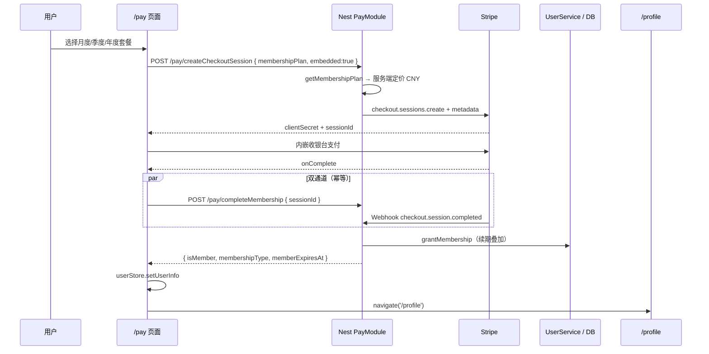

# Stripe 会员充值与开通实现说明

> **文档角色**：本轮「会员三档套餐 + Stripe 支付成功开通会员 + 资料页展示 + 到期校正 + 支付后跳转个人主页」的**主实现文**。  
> **延伸阅读**：微信扫码通道规划见仓库 `apps/backend/specs/yungouos-wechat-native-membership.md`（未在本轮落地）；前端会员判定与资料页金色标识见 [membership-active-hook.md](./membership-active-hook.md)。

---

## 1. 背景与目标

### 1.1 要解决什么问题

- 用户需在应用内**购买会员**（非任意金额充值），价格固定且**不可在前端篡改**。
- 支付成功后应**持久化会员状态**（到期时间、类型），个人资料页展示会员徽章与有效期。
- 会员**到期后**应正确降级为非会员；前端 localStorage 中的旧 `isMember` 不应长期误导 UI。
- 内嵌 Stripe Checkout 完成后，应**确认开通**（Webhook 或前端兜底 API），并**跳转 `/profile`**。

### 1.2 套餐定价（CNY，服务端权威）

| code | 名称 | 价格（元） | Stripe 最小单位（分） | 有效天数 |
|------|------|------------|------------------------|----------|
| `membership_monthly` | 月度会员 | 9.9 | 990 | 30 |
| `membership_quarterly` | 季度会员 | 25.9 | 2590 | 90 |
| `membership_yearly` | 年度会员 | 99.9 | 9990 | 365 |

前端仅展示与选择套餐；**实际扣款金额由后端 `MEMBERSHIP_PLANS` 决定**。

---

## 2. 改动范围

### 2.1 后端

| 路径 | 变更 |
|------|------|
| `apps/backend/src/services/user/user.entity.ts` | 新增 `isMember`、`membershipType`、`memberExpiresAt` |
| `apps/backend/src/migrations/1781094867978-pay.ts` | 用户表会员字段迁移 |
| `apps/backend/src/services/user/user.service.ts` | 开通、到期校正、批量过期、`toMembershipPayload` |
| `apps/backend/src/services/pay/membership.constants.ts` | **新建**：套餐 catalog 与天数解析 |
| `apps/backend/src/services/pay/membership.service.ts` | **新建**：幂等开通 + Stripe metadata 解析 |
| `apps/backend/src/services/pay/pay.service.ts` | 按套餐创建 Session；Webhook / completeMembership 开通 |
| `apps/backend/src/services/pay/pay.controller.ts` | 新增 `POST /pay/completeMembership` |
| `apps/backend/src/services/pay/dto/create-checkout-session.dto.ts` | 新增 `membershipPlan`；自定义 `amount` 改为可选 |
| `apps/backend/src/services/pay/dto/complete-checkout-membership.dto.ts` | **新建** |
| `apps/backend/src/services/pay/pay.module.ts` | 注册 `MembershipService` |

### 2.2 前端

| 路径 | 变更 |
|------|------|
| `apps/frontend/src/constants/membershipPlans.ts` | **新建**：与后端一致的套餐展示数据 |
| `apps/frontend/src/views/pay/index.tsx` | 三档卡片选套餐；支付完成开通并跳转 profile |
| `apps/frontend/src/views/profile/index.tsx` | 会员徽章、到期/非会员文案、购买按钮状态；**见** [membership-active-hook.md](./membership-active-hook.md) |
| `apps/frontend/src/hooks/useMembershipActive.ts` | **新建**：统一会员判定 Hook（资料页、LLM 设置页） |
| `apps/frontend/src/views/setting/llm/index.tsx` | 按会员状态默认硅基 / GLM（使用 Hook） |
| `apps/frontend/src/service/index.ts` | `createCheckoutSession` 传 `membershipPlan`；`completeCheckoutMembership` |
| `apps/frontend/src/service/api.ts` | `COMPLETE_CHECKOUT_MEMBERSHIP` |
| `apps/frontend/src/i18n/locales/zh-CN.ts` / `en-US.ts` | 套餐、资料页、支付 Toast 文案 |

---

## 3. 端到端数据流



**关键决策**

1. **服务端定价**：防篡改；前端不传 `amount`。
2. **双通道开通**：Webhook 可靠；`completeMembership` 供内嵌 Checkout 即时反馈（本地未配 Webhook 时仍可用）。
3. **幂等键**：Redis `pay:membership:grant:{stripeSessionId}`，同一 Session 重复回调不重复加时。
4. **续期规则**：若当前 `memberExpiresAt > now`，在新到期日上**叠加**套餐天数，而非从「今天」重算。
5. **到期校正**：读用户时 `syncMembershipIfExpired`，写回 `isMember=false`、`membershipType=free`，保留 `memberExpiresAt` 供展示。

---

## 4. 数据库与 User 模型

### 4.1 实体字段

**来源**：`apps/backend/src/services/user/user.entity.ts`（约 L37–L47）

```typescript
/** 是否为有效会员（开通时置 true；到期后由读时校正或批量任务置 false） */
@Column({ type: 'boolean', default: false })
isMember!: boolean;

/** 会员类型，如 free / premium */
@Column({ type: 'varchar', length: 32, default: 'free' })
membershipType!: string;

/** 会员到期时间；null 表示未开通或未设到期 */
@Column({ type: 'timestamp', nullable: true })
memberExpiresAt!: Date | null;
```

### 4.2 迁移

**来源**：`apps/backend/src/migrations/1781094867978-pay.ts`

生产环境需执行 TypeORM migration；开发若 `DB_SYNC=true` 可由 synchronize 自动建列。

---

## 5. 套餐 catalog（后端权威）

**来源**：`apps/backend/src/services/pay/membership.constants.ts`（约 L1–L55）

```typescript
export const MEMBERSHIP_PLANS: Record<MembershipPlanCode, MembershipPlanDefinition> = {
	membership_monthly: {
		code: 'membership_monthly',
		priceYuan: 9.9,
		amountMinorUnits: 990,   // Stripe：CNY 以「分」为单位
		durationDays: 30,
		defaultProductName: '月度会员',
	},
	membership_quarterly: {
		code: 'membership_quarterly',
		priceYuan: 25.9,
		amountMinorUnits: 2590,
		durationDays: 90,
		defaultProductName: '季度会员',
	},
	membership_yearly: {
		code: 'membership_yearly',
		priceYuan: 99.9,
		amountMinorUnits: 9990,
		durationDays: 365,
		defaultProductName: '年度会员',
	},
};

export function getMembershipPlan(code: string | undefined): MembershipPlanDefinition | null {
	if (!code) return null;
	return MEMBERSHIP_PLANS[code as MembershipPlanCode] ?? null;
}
```

**说明**：改价时只改此文件（及前端 `membershipPlans.ts` 展示价），无需改支付页输入框。

---

## 6. 支付 API 与 Stripe 集成

### 6.1 创建 Checkout Session

**来源**：`apps/backend/src/services/pay/pay.service.ts`（`createCheckoutSession`，约 L61–L120）

```typescript
async createCheckoutSession(dto: CreateCheckoutSessionDto, userId: number) {
	const plan = dto.membershipPlan ? getMembershipPlan(dto.membershipPlan) : null;
	if (dto.membershipPlan && !plan) {
		throw new BadRequestException('无效的会员套餐');
	}

	// 有套餐时：货币固定 CNY，金额与商品名均来自 catalog，忽略客户端 amount
	const currency = plan ? 'cny' : dto.currency;
	const unitAmount = plan ? plan.amountMinorUnits : dto.amount;
	const productName = plan?.defaultProductName ?? dto.productName ?? '订单支付';
	const membershipDays = plan ? plan.durationDays : resolveMembershipDays(dto.membershipDays);

	const common = {
		mode: 'payment' as const,
		line_items: [{ quantity: 1, price_data: { currency, unit_amount: unitAmount, product_data: { name: productName } } }],
		client_reference_id: String(userId),
		metadata: {
			userId: String(userId),
			membershipDays: String(membershipDays),
			membershipType: DEFAULT_MEMBERSHIP_TYPE, // premium
			...(plan ? { membershipPlan: plan.code } : {}),
		},
	};
	// embedded: ui_mode + redirect_on_completion: 'never'
}
```

**DTO 校验**（`create-checkout-session.dto.ts`）：传 `membershipPlan` 时 **`amount` / `membershipDays` 不参与校验**（`ValidateIf` 跳过）。

### 6.2 Webhook：`checkout.session.completed`

**来源**：`apps/backend/src/services/pay/pay.service.ts`（`handleWebhookEvent` → `grantMembershipFromCheckoutSession`）

- 仅当 `payment_status === 'paid'` 才开通。
- 从 `metadata` 解析 `userId`、`membershipDays`、`membershipPlan`。
- 调用 `MembershipService.grantAfterPayment({ grantId: session.id, ... })`。

本地调试：

```bash
stripe listen --forward-to localhost:9112/api/pay/webhook
```

需配置 `STRIPE_WEBHOOK_SECRET`。

### 6.3 前端兜底：`POST /pay/completeMembership`

**来源**：`apps/backend/src/services/pay/pay.controller.ts`（约 L50–L68）

内嵌 Checkout 的 `onComplete` **不保证** Webhook 已到达，故前端携带 `sessionId` 请求：

1. Stripe API `sessions.retrieve` 校验 `payment_status === 'paid'`。
2. 校验 Session 归属当前 JWT 用户（`metadata.userId` 或 `client_reference_id`）。
3. 与 Webhook **共用** `grantAfterPayment`，Redis 幂等。

**响应体**（经 ResponseInterceptor 包装）：

```typescript
{ isMember: boolean; membershipType: string; memberExpiresAt: Date | null }
```

---

## 7. 开通、幂等与到期

### 7.1 `grantMembership`（续期叠加）

**来源**：`apps/backend/src/services/user/user.service.ts`（约 L152–L176）

```typescript
async grantMembership(userId: number, opts: { durationDays: number; membershipType?: string }) {
	const user = await this.userRepository.findOne({ where: { id: userId } });
	const now = new Date();
	// 若仍在有效期内，从原到期日续期；否则从「现在」起算
	const base =
		user.memberExpiresAt && user.memberExpiresAt > now
			? user.memberExpiresAt
			: now;
	const expires = new Date(base.getTime() + opts.durationDays * 24 * 60 * 60 * 1000);
	user.isMember = true;
	user.membershipType = opts.membershipType ?? 'premium';
	user.memberExpiresAt = expires;
	return this.userRepository.save(user);
}
```

### 7.2 幂等：`MembershipService.grantAfterPayment`

**来源**：`apps/backend/src/services/pay/membership.service.ts`（约 L27–L58）

```typescript
async grantAfterPayment(userId: number, opts: { grantId: string; membershipDays?: number; membershipType?: string }) {
	const cacheKey = `pay:membership:grant:${opts.grantId}`;
	const cachedUserId = await this.cache.get<string>(cacheKey);
	// 同一 Stripe Session 已处理过 → 直接返回当前会员快照，不再叠加天数
	if (cachedUserId != null && Number(cachedUserId) === userId) {
		const user = await this.userService.findOne(userId);
		if (user) return this.userService.toMembershipPayload(user);
	}
	const user = await this.userService.grantMembership(userId, { durationDays, membershipType });
	await this.cache.set(cacheKey, String(userId), 90 * 24 * 60 * 60 * 1000);
	return this.userService.toMembershipPayload(user);
}
```

### 7.3 到期校正（读时 lazy sync）

**来源**：`apps/backend/src/services/user/user.service.ts`（约 L119–L150）

| 方法 | 作用 |
|------|------|
| `isMembershipActive` | `isMember && (memberExpiresAt 为空或未过期)` |
| `syncMembershipIfExpired` | 过期则写回 `isMember=false`、`membershipType=free` |
| `expireDueMemberships` | 批量 SQL 更新，可挂定时任务 |

**挂载点**：`findByUsername`、`findByEmail`、`findOne`、`findProfile` 在返回前调用 `syncMembershipIfExpired`。

**前端判定**：`profile/index.tsx` 的 `isPaidMemberFromUserInfo` **优先看 `memberExpiresAt`**，到期后即使 localStorage 里 `isMember===true` 也不显示会员。

### 7.4 `toMembershipPayload`

返回给前端的快照；`isMember` 按**当前时刻**计算，不要求 DB 已 sync：

```typescript
toMembershipPayload(user: User) {
	const active = this.isMembershipActive(user);
	return {
		isMember: active,
		membershipType: active ? user.membershipType : 'free',
		memberExpiresAt: user.memberExpiresAt,
	};
}
```

---

## 8. 前端实现

### 8.1 套餐常量（展示用）

**来源**：`apps/frontend/src/constants/membershipPlans.ts`

与后端 `priceYuan`、`durationDays`、`code` 保持一致；**不参与计价**。

### 8.2 会员充值页 `/pay`

**来源**：`apps/frontend/src/views/pay/index.tsx`

**UI 行为**

- 移除货币、金额、商品说明输入；改为 **3 列卡片**（`role="radiogroup"`）选择套餐。
- 价格只读展示：`t('pay.plan.price', { price: '9.9' })`。
- 下单：`createCheckoutSession({ membershipPlan: selectedPlan, currency: 'cny', embedded: true })`。

**支付完成**（`onComplete` 摘录）

**来源**：`apps/frontend/src/views/pay/index.tsx`（约 L120–L155）

```typescript
onComplete: () => {
	const sid = checkoutSessionIdRef.current;
	destroyEmbedded();
	void (async () => {
		try {
			if (sid) {
				const membershipRes = await completeCheckoutMembership({ sessionId: sid });
				const payload = membershipRes.data;
				if (payload) {
					// 合并会员字段到 MobX + localStorage，资料页即时可读
					userStore.setUserInfo({
						...userStore.userInfo,
						isMember: payload.isMember,
						membershipType: payload.membershipType,
						memberExpiresAt: payload.memberExpiresAt,
					});
				}
			}
			Toast({ type: 'success', title: t('pay.toast.paid.title'), message: t('pay.toast.paid.membershipMessage') });
		} catch {
			Toast({ type: 'success', title: t('pay.toast.paid.title'), message: t('pay.toast.paid.message') });
		}
		navigate('/profile'); // 购买成功后进入个人主页
	})();
},
```

### 8.3 个人资料页 `/profile`

**来源**：`apps/frontend/src/views/profile/index.tsx`

| 状态 | UI |
|------|-----|
| 有效会员 | 皇冠徽章 + 「会员有效期至 …」 |
| 非会员 | 「非会员」徽章 + `profile.membership.nonMemberHint` 引导文案 |
| 按钮 | 「编辑账户资料」；「购买会员」跳转 `/pay`（已是会员时 `disabled`） |

**到期判断**（摘录）

```typescript
function isPaidMemberFromUserInfo(u: object): boolean {
	const expiresRaw = r.memberExpiresAt ?? r.memberExpireAt;
	if (expiresRaw != null && String(expiresRaw).trim() !== '') {
		const exp = new Date(String(expiresRaw));
		if (!Number.isNaN(exp.getTime())) {
			return exp.getTime() > Date.now(); // 过期 → 非会员
		}
	}
	// ... 兼容 isMember、membershipType 等历史字段
}
```

---

## 9. 环境变量与部署

| 变量 | 说明 |
|------|------|
| `STRIPE_SECRET_KEY` | 后端 Secret key（`sk_` 开头） |
| `STRIPE_WEBHOOK_SECRET` | Webhook 签名校验 |
| `VITE_STRIPE_PUBLISHABLE_KEY` | 前端 Publishable key（`pk_` 开头） |

Redis：幂等缓存使用全局 `CacheModule`（与验证码等同实例）。

---

## 10. 兼容性与影响

- **破坏性**：原「任意金额充值」UI 已替换为三档套餐；后端仍保留无 `membershipPlan` 时的自定义 `amount` 分支（兼容旧客户端）。
- **登录响应**：User 实体新增字段会随登录 JSON 返回；旧客户端忽略即可。
- **未做**：YunGouOS 微信扫码、退款 UI、会员权益与具体配额联动（仅状态与到期时间）。

---

## 11. 建议回归测试

1. 未登录访问 `/pay` → 提示登录。
2. 三档套餐各下一单（Stripe 测试卡）→ 资料页徽章 + 到期日正确。
3. 已是会员时再购月度 → 到期日在原基础上 +30 天。
4. 支付完成 → 自动跳转 `/profile`，无需手动刷新。
5. 将 `memberExpiresAt` 改为过去时间并重新登录 → 非会员文案与禁用购买按钮逻辑（或 sync 后恢复购买）。
6. 同一 Session 重复调用 `completeMembership` + Webhook → 会员天数不重复叠加。
7. 切换中/英 → 套餐名、Toast、资料页文案正确。

---

## 12. 相关源码路径

| 说明 | 路径 |
|------|------|
| 套餐定价（后端） | `apps/backend/src/services/pay/membership.constants.ts` |
| 幂等开通 | `apps/backend/src/services/pay/membership.service.ts` |
| Stripe 会话 / Webhook | `apps/backend/src/services/pay/pay.service.ts` |
| 用户会员字段与续期 | `apps/backend/src/services/user/user.service.ts` |
| 充值页 | `apps/frontend/src/views/pay/index.tsx` |
| 资料页 | `apps/frontend/src/views/profile/index.tsx` |
| 前端套餐展示 | `apps/frontend/src/constants/membershipPlans.ts` |
| 微信扫码 SPEC（未实现） | `apps/backend/specs/yungouos-wechat-native-membership.md` |

若与仓库最新源码不一致，**以源码为准**。
