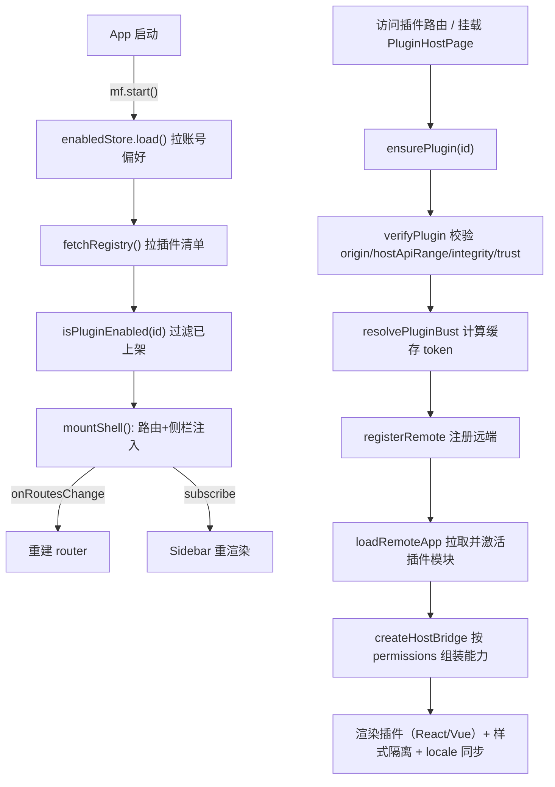

# 01 · 概念与架构：主项目到底在接入什么

> **本章目的**：先建立正确的全局模型，再谈代码。读完本章你应该能回答：微前端解决了什么问题？kit 分几层？你的项目要写哪几样东西？子应用如何被「动态」接进来？

---

## 1. 微前端解决了什么问题

一个主项目（Host）里，有若干独立开发的子项目 / 插件（Remote / Plugin）。直接全部打包进主项目的问题：

| 问题 | 说明 |
|------|------|
| **耦合** | 子团队发版要等主项目一起，改一个模块要重新构建全站 |
| **体积** | 所有子项目打进一个 bundle，首屏越来越慢 |
| **依赖冲突** | 各子项目想用不同版本的 React / 工具库，主项目锁死版本 |
| **上线流程** | 子项目上线受制于主项目发布节奏 |

**微前端的解法**：子项目独立构建、独立部署到自己的静态服务器；主项目**运行时**按需通过 **Module Federation** 动态拉取子项目产出的 `remoteEntry`，再渲染。主项目不再关心子项目何时发版——它每次加载到的都是子项目**当前最新**的构建产物。

## 2. 一句话模型

> **主项目 = 一个「插件宿主」**：启动时读一份「插件清单（registry）」，把清单里「已上架」的插件挂上路由 / 侧栏 / 业务槽位；用户访问对应页面时，宿主按需用 Module Federation 加载插件的远端模块并渲染，同时通过 **HostBridge** 把宿主能力（Toast、http、导航、业务模块……）按权限交给插件。

```
主项目 Host（运行时）
 ├─ 读 registry（插件清单，静态 JSON，可放 CDN / COS / 同源路径）
 ├─ 过滤：只处理「已上架 enabled」的插件
 ├─ 注入：路由（routeInjector）+ 侧栏（sidebarInjector）+ 业务槽（surface）
 └─ 按需加载：访问时才 registerRemote + loadRemoteApp（Module Federation）
        │
        ▼
    插件 Remote（独立构建、独立部署）
     ├─ mf-manifest.json / remoteEntry.js
     ├─ expose ./App（React 组件 / Vue mount）
     └─ 通过 HostBridge props 使用宿主能力
```

## 3. kit 的三层架构

你的主项目接入时，代码会分布在**三层**：

| 层 | 内容 | 谁写 | 本仓对应 |
|----|------|------|----------|
| **业务层** | 页面里 `<PluginHostPage pluginId="xxx" />`；路由里 `mf.start()` | 你 | `apps/frontend/src/router`、各 `views/*` |
| **Host 适配层** | `createFederation()` 的调用、registry 拉取、上架偏好、design 皮肤包装 | 你（每个项目一份） | `apps/frontend/src/federation/**` |
| **kit 内核** | 生命周期 / MF 加载 / Bridge / 样式隔离 / React 挂载 | 通用，跨项目复用 | `packages/federation-kit/src/**` |

**核心决策**：业务代码**永远不要直接 import kit**，而是从你的适配层（本仓 `@/federation`）导入。这样产品差异（Toast、http、i18n、registry 位置）只出现在适配层一个地方。

## 4. 三种接入模式（对应三种「挂」法）

| 模式 | 子应用形态 | 适用场景 | 宿主侧动作 |
|------|-----------|----------|------------|
| **自动路由注入** | 有独立页面的插件 | 插件有自己的一级页面（如视频播放器） | kit 自动注入 `routePath` 路由 + 侧栏菜单；用户访问时懒加载 |
| **业务内嵌挂载** | 嵌入业务页的插件 | 插件是现有页面里的一块（如电子书阅读页里的「想法列表」） | 业务页手动 `<PluginHostPage pluginId="..." />`，registry 里 `injectRoute: false` |
| **iframe 隔离** | 不可信第三方 | 插件代码不受信任，需要沙箱隔离 | kit 渲染 `iframe`，走 `postMessage` 通信 |

> 三种模式**共用同一套 registry 与生命周期**，只是「入口」不同：路由注入 / 页面手动挂载 / iframe 渲染。

## 5. 「动态」体现在哪几个环节

1. **清单动态**：新增插件 = 往 registry JSON 加一条记录 + 部署子应用静态资源，**主项目零代码改动**。
2. **路由动态**：`routeInjector` 在运行时把插件路由塞进路由表，`onRoutesChange` 通知宿主重建 router。
3. **侧栏动态**：`sidebarInjector` 在运行时把插件菜单塞进侧栏，Sidebar 组件订阅后自动重渲染。
4. **加载动态**：`ensurePlugin` 按需 `loadRemoteApp`，插件代码不进主项目 bundle。
5. **启停动态**：`setEnabled` 上架/下架即时生效（含卸载已加载插件）。

## 6. 数据流一图



## 7. 关键术语表

| 术语 | 含义 |
|------|------|
| **Host** | 主项目 / 宿主，本指南的主角 |
| **Remote / Plugin** | 子项目 / 插件，独立构建部署，expose 一个入口模块 |
| **registry** | 插件清单 JSON，描述所有插件的 id、路由、入口、版本、权限、信任等级等 |
| **entry** | 插件入口地址，通常指向 `mf-manifest.json`（含构建指纹与 remoteEntry 位置） |
| **expose** | 插件暴露的模块名，如 `./App` |
| **remoteName** | 插件在 MF 中的远端名，默认用插件 id |
| **HostBridge** | 宿主传给插件的 props：`{ api, plugin }`，是插件的「能力钱包」 |
| **capabilities** | 宿主能力（Toast / http / navigate / 业务模块…），由适配层注入 |
| **permissions** | 插件清单里声明的权限字符串，决定 bridge 上有哪些能力 |
| **enabledStore** | 上架偏好存取器（默认 localStorage，也可接账号服务） |
| **bust** | 缓存破坏 token（version@manifestHash），解决发版后旧缓存问题 |
| **surface** | 宿主业务「槽位」名，如 `ebook.read`，把插件归组到某个业务区 |

> 下一步：[02-preparation.md](./02-preparation.md) 准备你的项目环境。
