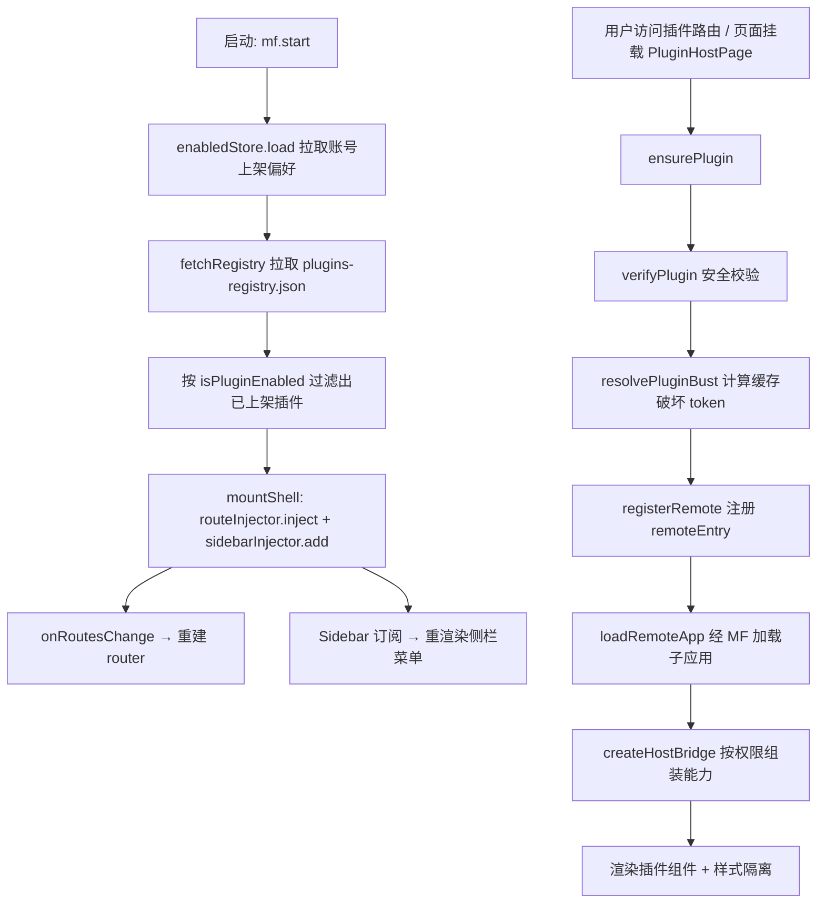

# @dnhyxc-ai/federation-kit 主项目接入指南（Host Integration Guide）

> **一句话**：本目录面向**主项目（Host）开发者**，手把手讲解如何把 `@dnhyxc-ai/federation-kit` 接入自己的项目，实现**动态子项目 / 插件**的接入：运行时拉取 registry、动态注入路由与侧栏、按需加载 MF 子应用、安全校验、样式隔离、上架偏好等。
>
> **写法约定**：每一份代码都带**逐行中文注释**（注释写在代码上方），并在代码块前后用正文充分解释**意图与语义**。读者照抄即可接入。
>
> **对照源码**：本文以当前仓库 `apps/frontend/src/federation/**`（本仓 Host 适配层）与 `packages/federation-kit/src/**`（kit 内核）为准。若与源码不一致，以源码为准。
>
> **与 `docs/implements` 的区别**：`implements` 讲「本仓具体怎么实现」；本目录讲「你的项目怎么接入」，是可落地的接入手册。

---

## 目录（阅读顺序）

| 顺序 | 文件 | 内容 | 篇幅 |
|------|------|------|------|
| 1 | [01-concepts.md](./01-concepts.md) | **先读**：微前端要解决的问题、kit 三层架构、三种接入模式、一张数据流图 | 概念 |
| 2 | [02-preparation.md](./02-preparation.md) | 前置准备：装依赖、Vite federation 配置、路径别名、环境变量、registry 托管位置 | 实操 |
| 3 | [03-registry.md](./03-registry.md) | `plugins-registry.json` **全字段详解**（每个字段的作用与取值），这是「动态接入」的源头 | 配置 |
| 4 | [04-create-federation.md](./04-create-federation.md) | `createFederation()` 门面**全部配置项**逐项讲解 + 返回值 `mf` 对象每个方法 | 核心 |
| 5 | [05-start-router-injection.md](./05-start-router-injection.md) | `mf.start()`、动态路由注入、防刷新闪 404、侧栏菜单注入 | 核心 |
| 6 | [06-mount-modes.md](./06-mount-modes.md) | 三种挂载模式：自动路由 / 业务内嵌 / iframe；`FederationPlugin`、`PluginHostPage`、`PluginHostSurface`、slots、hooks | 核心 |
| 7 | [07-bridge-permissions.md](./07-bridge-permissions.md) | HostBridge API：子应用能拿到什么；permissions 权限表；capabilities 能力注入；iframe RPC 扩展 | 能力 |
| 8 | [08-enabled-registry-impl.md](./08-enabled-registry-impl.md) | 上架偏好 `enabledStore` + registry 拉取/缓存/保存的实现 | 数据 |
| 9 | [09-security-isolation.md](./09-security-isolation.md) | 安全校验（origin / hostApiRange / integrity / trust）、缓存破坏、样式隔离、untrusted iframe | 安全 |
| 10 | [10-complete-example.md](./10-complete-example.md) | 端到端完整示例：从零搭建一个 Host，并把本仓真实接入代码逐文件贴出 | 综合 |

> 时间紧只需看：README 速览 → [02](./02-preparation.md) → [04](./04-create-federation.md) 的第 1 节与第 3 节 → [05](./05-start-router-injection.md) → [06](./06-mount-modes.md) 的「自动路由」一节，即可跑通 MVP。

---

## 30 秒速览（三步接入）

在最简场景下，主项目接入微前端只需要三步（其余全部有默认值）：

```ts
// 第 1 步：创建 Federation（只需一个 registryUrl，其余配置可后续按需补）
import { createFederation } from '@dnhyxc-ai/federation-kit';

// 创建全局唯一的 Host 门面：负责拉取插件清单、管理插件生命周期、注入路由/侧栏
const mf = createFederation({
  // registryUrl：指向一份描述"有哪些子项目/插件"的 JSON 清单，kit 会自动 fetch 并缓存
  registryUrl: '/remotes/plugins-registry.json',
});
```

```ts
// 第 2 步：启动（≈ qiankun 的 start()）
// 启动后 kit 会：拉 registry → 判断每个插件是否"上架" → 为已上架且允许注入路由的插件挂上动态路由壳与侧栏菜单
await mf.start();

// 把主项目 SPA 的导航函数回写给 kit，让插件能调用"跳转到某个路径"
mf.setNavigate((to) => router.navigate(to));

// 订阅动态路由变化，路由表变化时重建 router（新增/下架插件时刷新路由）
mf.onRoutesChange(() => remountRouter());
```

```tsx
// 第 3 步：在页面里声明式挂载（≈ <micro-app name="xxx" />）
import { FederationPlugin } from '@dnhyxc-ai/federation-kit/react';

// 按插件 id 挂载任意一个已上架的插件；loading/error 等 UI 可用 slots 自定义
<FederationPlugin name="learningNotes" />
// 或更短的别名 <Plugin />
```

---

## 三层心智模型

```text
┌────────────────────────────────────────────────────────────┐
│  业务层：页面 / Layout / Router（只 import 你的适配层）        │
│  <PluginHostPage pluginId="xxx" />                          │
├────────────────────────────────────────────────────────────┤
│  Host 适配层（你项目里的一层薄封装，本仓为 src/federation）      │
│  · 能力注入（Toast / http / i18n / 业务模块）                 │
│  · registry 拉取 / 上架偏好                                  │
│  · design 皮肤包装（PluginHostPage / Surface / Shell）       │
├────────────────────────────────────────────────────────────┤
│  @dnhyxc-ai/federation-kit（通用内核，跨项目复用）              │
│  · createFederation 门面 + PluginManager 生命周期             │
│  · MF 加载（loadRemote / registerRemote / cache bust）       │
│  · HostBridge + iframe Bridge + EventBus                     │
│  · style-isolation（sandbox + portal）                       │
│  · react（FederationPlugin / PluginHostView / hooks）        │
└────────────────────────────────────────────────────────────┘
```

**为什么要有适配层？** kit 是通用内核，不关心你的 Toast 长什么样、registry 放哪、用什么 i18n。这些「产品差异」集中在你的适配层里注入，业务代码只认一个 `@/federation` 别名，未来升级 kit 不用改业务。

---

## 动态接入的核心链路（先建立全局图景）



---

## 两种「动态」的含义

| 维度 | 说明 |
|------|------|
| **运行时动态** | 子项目**不在主项目构建期**打包进 bundle；主项目运行时读到 registry 才知道有哪些子项目，并按需（路由懒加载 / 页面挂载）通过 Module Federation 拉取 |
| **配置动态** | 新增 / 下架子项目**只改 registry JSON**（或账号偏好），无需改主项目代码、无需重新发版 |

**核心结论**：主项目代码里**没有**硬编码任何子项目，只写 `createFederation` + 挂载组件；子项目列表完全由 registry 驱动。

---

## 文档中出现的真实路径速查

| 路径 | 角色 |
|------|------|
| `apps/frontend/src/federation/index.ts` | 本仓 Host 适配层统一出口 |
| `apps/frontend/src/federation/runtime/index.ts` | `createFederation` 唯一调用点 |
| `apps/frontend/src/federation/registry/index.ts` | registry 拉取/缓存/保存 |
| `apps/frontend/src/federation/enabled/prefs.ts` | 账号上架偏好 |
| `apps/frontend/src/federation/host/*` | `PluginHostPage` / `PluginHostSurface` / `PluginPageShell` / `PluginErrorBoundary` |
| `apps/frontend/src/router/index.tsx` | `mf.start()` + 动态路由重建 |
| `apps/frontend/src/router/buildRoutes.ts` | 静态路由 + 动态插件路由合并 |
| `packages/federation-kit/src/createFederation.ts` | kit 门面实现 |
| `packages/federation-kit/src/runtime/createPluginRuntime.ts` | `PluginManager` 生命周期 |
| `packages/federation-kit/src/mf/mf.ts` | MF 加载 / remote 注册 / 缓存破坏 |
| `packages/federation-kit/src/bridge/*` | HostBridge / iframe / Vue 桥 |
| `packages/federation-kit/src/style-isolation/*` | 样式隔离 |
