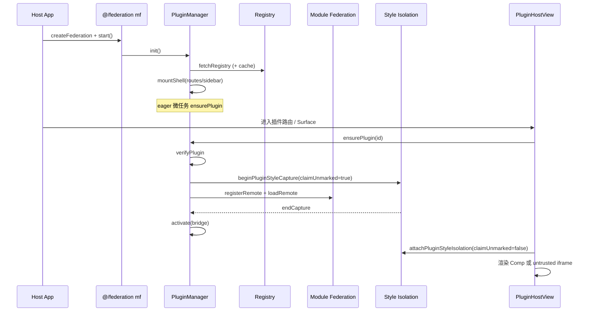

# 微前端架构总览（federation-kit 实现思路与原理）

> **一句话**：本仓用 Module Federation 做「插件式微前端」——通用运行时在 `@dnhyxc-ai/federation-kit`，产品接线在 `apps/frontend/src/federation`；加载 Remote、密封 Host API、隔离 CSS/弹层，业务只通过 `@/federation` 使用。  
> **入口（用户）**：侧栏/路由进入插件页（如学习笔记）、电子书页挂 surface 插件、设置里上下架插件。  
> **入口（代码）**：`mf.start()` → 路由重建 → `<PluginHostPage />` / `<PluginHostSurface />` / `<FederationPlugin />`。  
> **文档目标**：建立整图后再下钻分册；分册含全文级逐行注释代码。  
> **非目标**：不讲某个插件业务功能本身；不改源码。  
> **分册**：[README](./README.md) · [07 方法字典](./07-api-method-reference.md) · [02 Runtime](./02-runtime-mf-bridge.md) · [03 样式隔离](./03-style-isolation.md) · [04 React](./04-react-host-view.md) · [05 适配层](./05-host-adapter-frontend.md) · [06 复刻](./06-replication-playbook.md)

---

## 0. 先看这里

### 0.1 30 秒读懂

- **做什么**：Host 拉插件清单 → 按账号偏好挂路由/侧栏壳 → 进入页面时 MF 加载 Remote（或 iframe）→ Bridge 按权限暴露 toast/http/导航等 → 样式与 body 弹层隔离到 realm。
- **不做什么**：不把业务 Toast/COS/ebook 写进 kit；不要求插件改编译器做 scoped CSS；不靠 Shadow DOM。
- **三层**：
  1. **业务消费**：router / Header / Sidebar / ebook / 笔记页  
  2. **适配层**：`@/federation`（capabilities + design slots + registry）  
  3. **kit**：runtime / MF / bridge / style-isolation / react  

### 0.2 为何拆成「kit + 适配层」

| 放在 kit | 放在本仓适配层 |
|----------|----------------|
| MF 注册/加载、校验、事件总线 | COS registry、账号偏好持久化 |
| Bridge 密封、iframe RPC | Toast / http / ebook / Tauri 全屏 |
| 样式隔离（前缀 + Portal） | `PluginHostPage` 的 design Loading/按钮 |
| `FederationPlugin` / hooks | `PluginHostSurface` 产品 surface 约定 |

原则：**可换 Host 的进 kit；绑死本产品的留适配层**。

### 0.3 端到端架构图



### 0.4 文件地图（建造序）

| 序 | 路径 | 职责 | 详解 |
|----|------|------|------|
| 1 | `federation-kit/src/types/*`、`config/types.ts` | 契约 | [02](./02-runtime-mf-bridge.md) |
| 2 | `host-api/*`、`enabled/*`、`registry/cache.ts` | 总线/偏好/缓存 | [02](./02-runtime-mf-bridge.md) |
| 3 | `mf/*`、`runtime/*`、`bridge/*`、`inject/*` | 加载与注入 | [02](./02-runtime-mf-bridge.md) |
| 4 | `createFederation.ts`、`index.ts` | 门面 | [02](./02-runtime-mf-bridge.md) |
| 5 | `style-isolation/**` | CSS + Portal | [03](./03-style-isolation.md) |
| 6 | `react/**` | 声明式挂载 | [04](./04-react-host-view.md) |
| 7 | `apps/frontend/src/federation/**` | 本仓接线 | [05](./05-host-adapter-frontend.md) |

### 0.5 全库功能点索引（跨分册）

| 编号 | 简述 | 分册 |
|------|------|------|
| — | **查某个方法的作用/目的/调用链** | **[07 方法字典](./07-api-method-reference.md)** |
| R1–R19 | createFederation、加载、Bridge、注入器等 | [02](./02-runtime-mf-bridge.md) F1–F19 |
| S1–S12 | realm、claimUnmarked、head/CSSOM、Portal、z-index | [03](./03-style-isolation.md) F1–F12 |
| V1–V10 | FederationPlugin、slots、iframe、hooks | [04](./04-react-host-view.md) F1–F10 |
| A1–A11 | `@/federation`、Surface、ebook、全屏 | [05](./05-host-adapter-frontend.md) F1–F11 |

---

## 1. 用户旅程

### 1.1 启动 Host

1. 用户打开本站 SPA。  
2. 路由层调用 `mf.start()`（适配层已 `createFederation` 注入 Toast/http/registry）。  
3. 运行时拉取插件清单（失败则用本地缓存），按「已上架」往侧栏/路由塞**壳**（此时 Remote 可能尚未下载）。  
4. 后台微任务对 eager 插件 `ensurePlugin`，减少首次点进白屏。

### 1.2 进入信任插件页（如学习笔记）

1. 用户点侧栏「学习笔记」。  
2. `PluginHostPage` → `FederationPlugin` → `PluginHostView`。  
3. `ensurePlugin`：校验 → **短窗**样式捕获 → `loadRemote` → `activate(bridge)`。  
4. 挂载根打上 `data-mf-style-realm` + `data-plugin-root`；**长窗**继续隔离延迟 CSS，并把 body 弹层收进 portal。  
5. 插件通过密封 Bridge 调 `toast` / `http` / `navigate` 等（无权限则没有该方法）。

### 1.3 进入不受信插件

1. registry 标 `trust: 'untrusted'` 且提供 `iframeUrl`。  
2. Host 不执行 Remote JS，只挂 sandbox iframe。  
3. `attachIframeBridge` 用 postMessage 做 RPC（http/ui），插件改不了 Host 对象图。

### 1.4 电子书 surface

1. 阅读页渲染 `<PluginHostSurface surface="ebook.read" … />`。  
2. hook 按 surface + 上架偏好筛插件；按 `host.slot` 挂 toolbar / drawer-triggers / drawer。  
3. ebook 能力通过适配层可变绑定进 capabilities，供插件跳 CFI 等。

### 1.5 离开 / 下架

1. 卸载页：样式捕获与 portal dispose；可选 `unloadPlugin`。  
2. 下架：偏好写入 → 壳列表刷新 → `usePluginEnabled` 为 false 时页面提示已下架。

---

## 2. 问题与解决方案总表

| 编号 | 现象 / 风险 | 根因 | 本项目做法 | 详见 |
|------|-------------|------|------------|------|
| P1 | Remote CSS 污染 Host | 共享 document | 选择器前缀 + realm | [03](./03-style-isolation.md) |
| P2 | EP/antd 弹层丢样式或点不到 | Teleport 到 body | portal scope + stamp realm | [03](./03-style-isolation.md) |
| P3 | Markdown / Toast 样式或交互坏 | 挂载长窗误认领 Host CSS；portal 盖住 Toast | `claimUnmarked=false`；portal z-index 低于 Toaster | [03](./03-style-isolation.md) |
| P4 | `.` 与 `./react` 双份单例 | tsup 双入口 | `globalThis` 共享栈/patch/默认 Host | [02](./02-runtime-mf-bridge.md) [03](./03-style-isolation.md) |
| P5 | 插件乱调 Host API | 直接传可变对象 | permissions ∩ capabilities + `deepFreeze` | [02](./02-runtime-mf-bridge.md) |
| P6 | 不受信代码同域执行 | 一律 MF | `trust: untrusted` + iframe RPC | [02](./02-runtime-mf-bridge.md) [04](./04-react-host-view.md) |
| P7 | 刷新闪 404 | 路由注入异步 | Host `pluginsReady` 占位（适配/路由层） | [05](./05-host-adapter-frontend.md) |
| P8 | registry 断网空白 | 只信网络 | localStorage/缓存回退 | [02](./02-runtime-mf-bridge.md) |
| P9 | Vue Remote 无法挂 React Host | 框架不同 | `normalizePluginModule` + `createVueHostBridge` | [02](./02-runtime-mf-bridge.md) |
| P10 | 业务到处依赖 kit 包名 | 耦合 | 约定只从 `@/federation` 导入 | [05](./05-host-adapter-frontend.md) |

---

## 3. 实现思路总览

### 3.1 总体策略

1. **壳与肉分离**：`init` 只注入路由/侧栏壳；真正 `loadRemote` 延到 `ensurePlugin`（或 eager）。  
2. **能力要密封**：Bridge 按权限裁剪并 `deepFreeze`，防止插件改 Host 实现。  
3. **样式不靠约定自觉**：Host 侧劫持 head/CSSOM + body portal，Remote 无感。  
4. **加载短窗狠、挂载长窗稳**：`claimUnmarked` 区分「像 Remote 入口 CSS」与「Host 全局晚到样式」。  
5. **双入口要共态**：默认 Federation、捕获栈、head/CSSOM/portal 状态进 `globalThis`。

### 3.2 控制流（状态）

插件在 Manager 中大致：`loading → activated | failed`；另有 `unloaded`。  
UI 侧 `PluginHostView` 用 `busy/error/retryKey` 驱动 slots。

### 3.3 数据流

```text
registry.json → PluginDescriptor[]
     ↓ enabledStore.filter
RouteInjector / SidebarInjector（壳）
     ↓ ensurePlugin
verify → style capture → loadRemote → normalize → bridge.activate
     ↓
PluginHostView 渲染 + attachPluginStyleIsolation
```

### 3.4 样式隔离一句话

- **realm**：同一 Remote entry 共用一个 `data-mf-style-realm`。  
- **CSS**：规则改写成 `[realm] .x,[realm].x`；`html/body` 映射到 `[realm][data-plugin-root]`。  
- **Portal**：body 弹层进全屏 `data-mf-portal-scope`（容器 `pointer-events:none`，子节点可点）；z-index 低于 Host Toast。

### 3.5 本仓接线一句话

`runtime/index.ts` 里 `createFederation({ capabilities, fetchRegistry, enabledStore, … })`；页面用 `PluginHostPage` / `PluginHostSurface`，不要业务直连 kit。

---

## 4. 分册导读（细节在分册）

本节不重复粘贴数千行源码。每个主题的**全文 + 逐行注释**在对应分册 §4 / 附录。

| 你想搞清… | 打开 |
|-----------|------|
| **某个方法干什么、为啥存在** | **[07 方法字典](./07-api-method-reference.md)**（`ensurePlugin` / `runLoad` / `resolvePluginBust`…） |
| `start` 之后谁调谁 | [02 §3–§4](./02-runtime-mf-bridge.md) |
| `verify` / bust / Vue 归一 | [02 F8–F10](./02-runtime-mf-bridge.md) / [07 §1–§2](./07-api-method-reference.md) |
| Bridge 权限与 iframe RPC | [02 F15–F16](./02-runtime-mf-bridge.md) / [07 §4](./07-api-method-reference.md) |
| 为何 Markdown 曾坏、如何修 | [03 F2/F5/F8](./03-style-isolation.md) |
| Portal 样式每一行含义 | [03 F7–F8](./03-style-isolation.md) + scopeDom |
| `<FederationPlugin />` | [04](./04-react-host-view.md) |
| ebook 抽屉插件怎么挂 | [05 F6/F10](./05-host-adapter-frontend.md) |
| 换项目怎么从零搭 | [06](./06-replication-playbook.md) |

---

## 5. 关键设计约束（读代码时的「为什么」）

1. **不用 Shadow DOM**：第三方组件（EP/antd）大量假定 `document.head` / `body`；前缀隔离 + portal 更可落地。  
2. **不用 qiankun 子应用 JS 沙箱为主路径**：主路径是 MF 共享 React；不受信才 iframe。  
3. **tsup 双入口**：`react` 单独打包以免强依赖 React；副作用是单例必须 `globalThis`。  
4. **Host Toast 显式高 z-index**：不依赖 sonner 注入 CSS 是否被误改写。  

---

## 6. 验收总表（跨分册）

| 编号 | 手动步骤 | 期望 | 对应 |
|------|----------|------|------|
| T1 | 冷启动进站 | 侧栏出现已上架插件壳 | R6 |
| T2 | 进学习笔记 | 插件 UI 正常；Host Markdown 其他页样式正常 | R7+S2 |
| T3 | 插件内 Toast | 约 2s 关闭；悬停暂停；关闭钮可出 | S8 + sonner |
| T4 | 插件 Select/Message | 浮层有插件样式且可点 | S7 |
| T5 | 下架插件 | 入口消失或页内「已下架」 | A4 |
| T6 | ebook 开插件抽屉 | surface 插件出现 | A6 |
| T7 | 不受信插件 | iframe 沙箱；RPC 可用 | R16+V6 |

更细验收见 [06](./06-replication-playbook.md)。

---

## 7. 影响边界

- **会动到的**：插件路由、侧栏、嵌入页、全局 head 样式与 body 弹层路径。  
- **不应误伤的**：Host 自有 Markdown、sonner Toast、Host 主题 CSS 变量。  
- **双入口注意**：业务适配层可同时依赖 `.` 与 `./react`；改单例逻辑必须改 `globalThis` 键，测两侧。

---

## 8. 修订记录

| 日期 | 说明 |
|------|------|
| 2026-08-10 | 初版：按抽包后 kit + `@/federation` 适配层整理总览与分册索引 |
