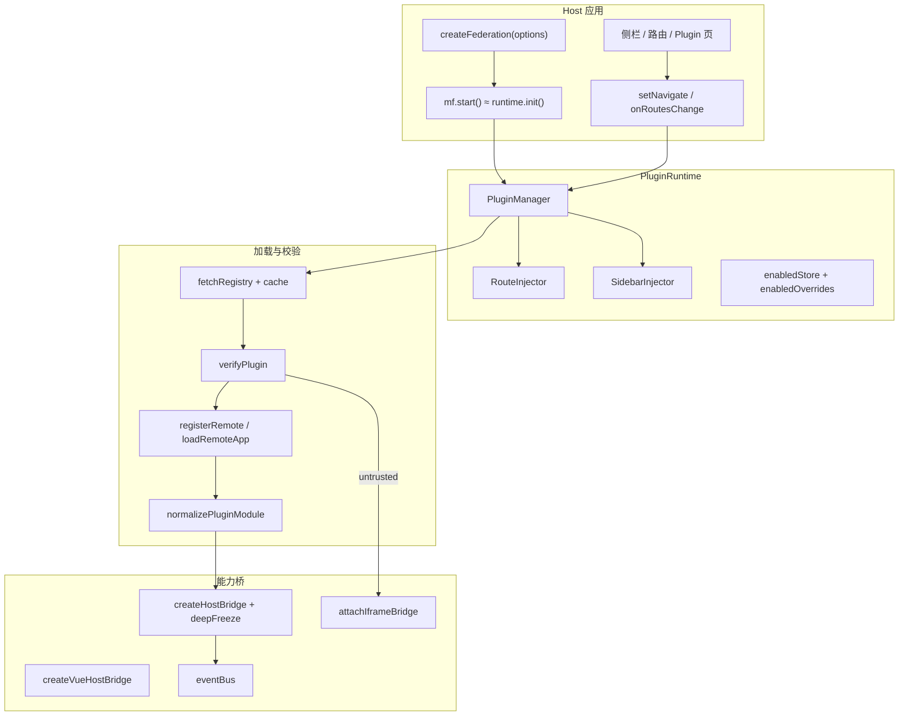
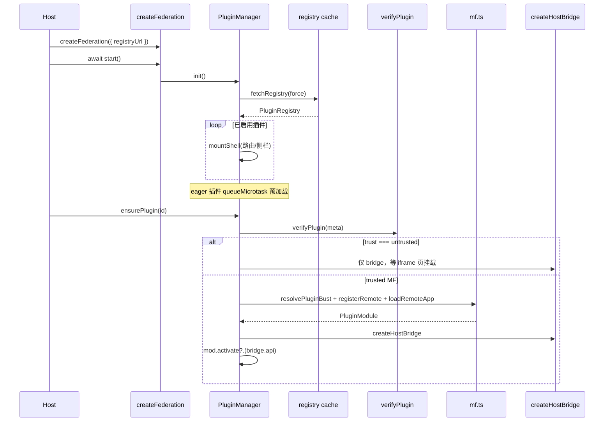

# federation-kit Runtime（createFederation / MF / Bridge）— 功能实现详解与复刻指南

> **一句话**：Host 用 `createFederation` 拉起插件运行时——拉 registry、校验、按启用偏好挂路由/侧栏壳，再按需 Module Federation 加载 React/Vue Remote，或用 iframe + postMessage 跑不受信插件，并通过密封的 Host Bridge 把主题/导航/HTTP/事件等能力按权限交给插件。  
> **入口**：Host 启动时 `createFederation({ registryUrl })` → `await mf.start()`；用户点侧栏/路由进入插件页时 `manager.ensurePlugin(id)`；不受信插件走 iframe bridge。  
> **关联文件**：见 §0.4。  
> **文档目标**：读懂 kit 核心运行时全链路；按 §5 可在其他 Host 项目复刻等价装配。  
> **非目标**：样式隔离实现细节（见 style-isolation 专文）、React 宿主组件（`PluginHostView`/`FederationPlugin`）、具体业务 Host 适配层（`apps/frontend/src/federation`）。  
> **手册版本**：2026-08-10（按 feature-impl-guide；源码以 `packages/federation-kit/src` 为准）。  
> **方法字典**：每个函数的作用/目的/签名/调用链/副作用见 **[07-api-method-reference.md](./07-api-method-reference.md)**（含 `resolvePluginBust`、`ensurePlugin`、`loadPlugin`、`runLoad`、`createPluginRuntime` 等）。

---

## 0. 先看这里（必填，一眼建立模型）

### 0.1 30 秒读懂

- **做什么**：把「插件清单 + 启用偏好 + MF 远程加载 + 权限密封 Bridge + 路由/侧栏注入」收成可 `start()` 的 Host 运行时。
- **不做什么**：不负责插件业务 UI；不内置 Vue runtime（Vue Remote 自带 mount）；不把第三方域名写进 Host capabilities（MF 走原生 fetch）。
- **关键角色**：
  - **接入层**：`createFederation` 拼默认 capabilities / EnabledStore / fetchRegistry，产出 `FederationHost`。
  - **运行时**：`createPluginRuntime` + `PluginManager` 管生命周期（壳 → 校验 → 加载 → 激活/卸载）。
  - **加载与契约**：`mf.ts` 注册 Remote；`PluginVerifier` 管信任与完整性；`createHostBridge` / Vue / iframe 把能力交给插件。

### 0.2 功能点总表（必填）

| 编号 | 功能点（简述） | 用户/Host 可感知表现 | 关键实现位置 | 正文 |
|------|----------------|----------------------|--------------|------|
| F1 | 一行 `createFederation` 接入并 `start` | 已启用插件出现侧栏/路由壳 | `createFederation.ts` → `createFederation` | §4.1 |
| F2 | 默认单例跨 `.` / `./react` 入口共享 | `<Plugin />` 无 Context 也能找到 Host | `getDefaultFederation` / `setDefaultFederation` | §4.2 |
| F3 | 拉 registry 失败仍可用本地缓存 | 离线/断网仍能看到上次清单 | `fetchRegistryFromUrl` + `registry/cache.ts` | §4.3 |
| F4 | localStorage 启用偏好 + 变更通知 | 上架开关立刻反映到壳列表 | `createLocalEnabledStore` + `enabledOverrides` | §4.4 |
| F5 | `createPluginRuntime` 注入校验/偏好/样式配置 | 运行时按 Host 配置收紧安全策略 | `createPluginRuntime` | §4.5 |
| F6 | `init`：挂壳 + eager 微任务预加载 | 启动后侧栏先出，远程稍后就绪 | `PluginManager.init` / `mountShell` | §4.6 |
| F7 | `ensurePlugin` / `loadPlugin` 去重与 bust | 同版本不重复加载；更新后强制换新 | `ensurePlugin` / `runLoad` / `inflight` | §4.7 |
| F8 | 加载前 `verifyPlugin` | 非法源/API 不兼容/坏签名直接失败 | `PluginVerifier.ts` | §4.8 |
| F9 | MF：manifest 指纹 bust + 注册 + loadRemote | 发布者只更新自有静态资源即可失效缓存 | `mf/mf.ts` | §4.9 |
| F10 | Vue Remote 规范成 React 组件 | Host 仍只渲染 React `default` | `normalizePluginModule` + `createVueHostBridge` | §4.10 |
| F11 | 启用偏好全局 getter / 订阅 | UI 与 Manager 读同一套「是否上架」 | `enabled/enabledOverrides.ts` | §4.11 |
| F12 | Host surface 列表（如 ebook.read） | 业务面按 surface 挂抽屉/工具栏插件 | `enabled/hostSurface.ts` | §4.12 |
| F13 | 路由注入器 + 变更订阅 | Host 重建 router 吃进插件 path | `inject/RouteInjector.ts` | §4.13 |
| F14 | 侧栏注入器单例 | 侧栏菜单出现/消失插件项 | `inject/SidebarInjector.ts` | §4.14 |
| F15 | 按 permissions ∩ capabilities 密封 Bridge | 插件只能用被授权的 toast/http/nav/modules | `createHostBridge` + `deepFreeze` | §4.15 |
| F16 | iframe postMessage RPC（不受信） | 沙箱页可调 http/ui，改不了 Host 对象 | `attachIframeBridge.ts` | §4.16 |
| F17 | 插件事件总线按 pluginId 隔离 | 插件间不串事件；卸载清监听 | `host-api/EventBus.ts` | §4.17 |
| F18 | 类型契约：Descriptor / Registry / Bridge | TS 约束清单字段与 Bridge 形状 | `types/*` + `config/types.ts` | §4.18 |
| F19 | 包入口再导出全景 | 消费方 `from 'federation-kit'` 一次拿齐 | `src/index.ts` | §4.19 |

### 0.3 架构一图（必填）



加载主路径时序：



### 0.4 文件地图与建造顺序（必填）

| 建造序 | 文件 | 职责（一句话） | 依赖 |
|--------|------|----------------|------|
| 1 | `types/localeText.ts` | 语言与多语文案选取 | 无 |
| 2 | `types/index.ts` | Descriptor / Registry / Bridge / LoadedPlugin | 1 |
| 3 | `config/types.ts` | HostConfig / Capabilities / EnabledStore | 2 |
| 4 | `host-api/deepFreeze.ts` | 深度冻结 Bridge | 无 |
| 5 | `host-api/EventBus.ts` | 按插件隔离的事件总线 | 无 |
| 6 | `enabled/enabledOverrides.ts` | 全局启用 getter / 订阅 | 无 |
| 7 | `registry/cache.ts` | registry localStorage 缓存 | 6 |
| 8 | `enabled/hostSurface.ts` | 按 surface 同步列出已上架插件 | 6, 7 |
| 9 | `runtime/PluginVerifier.ts` | 源站/API/完整性/签名校验 | 2 |
| 10 | `bridge/createHostBridge.ts` | permissions ∩ capabilities → 密封 api | 3,4,5 |
| 11 | `bridge/createVueHostBridge.tsx` | Vue mount → React 壳 | 2 |
| 12 | `bridge/attachIframeBridge.ts` | iframe postMessage RPC | 2 |
| 13 | `mf/normalizePluginModule.ts` | Remote 原始模块规范化 | 11 |
| 14 | `mf/mf.ts` | MF 实例、bust、register、loadRemote | 13 |
| 15 | `inject/RouteInjector.ts` | 插件路由表 + 订阅 | 无 |
| 16 | `inject/SidebarInjector.ts` | 侧栏项单例 | 2 |
| 17 | `runtime/createPluginRuntime.ts` | PluginManager + createPluginRuntime | 6–16 |
| 18 | `createFederation.ts` | 主流式接入入口 | 7,17 |
| 19 | `index.ts` | 公共导出面 | 全部 |

---

## 1. 用户旅程

> 视角：Host 开发者把 federation-kit 接进应用后，终端用户打开带插件的产品。

1. **进入（Host 启动）**：应用启动调用 `createFederation({ registryUrl })`，再 `await mf.start()`。背后：读启用偏好 → 强制拉最新 registry（失败用缓存）→ 给每个已启用插件挂路由壳和侧栏项 → `preload:'eager'` 的插件丢进微任务预加载。
2. **主路径（点进插件）**：用户点侧栏或直接进插件路由 → Host 页调用 `manager.ensurePlugin(id)` → 校验 entry/API/完整性 → trusted：注册 MF Remote、捕获样式、`loadRemote`、规范化模块、`activate`、状态 `activated`；页面用密封 `bridge` 渲染 `mod.default`。
3. **分支（Vue 插件）**：Remote 标 `framework:'vue'` 或 default 为 `{ mount }` → Host 不装 Vue，用 `createVueHostBridge` 包成 React 组件，在 layout effect 里 `mount(el, bridgeBag)`。
4. **分支（不受信）**：`trust:'untrusted'` 必须有合法 `iframeUrl` → 不走 MF；Host 渲染 iframe，`attachIframeBridge` 用 postMessage 提供 http/ui RPC。
5. **分支（下架/失败）**：下架 `setEnabled(id,false)` → `deactivate`、清 event、拆路由/侧栏；加载失败记 `status:'failed'` 与 `error`，同 bust 再次 ensure 会直接抛错除非 `force`。
6. **离开**：卸载插件或关应用；监听器与 inflight 清理，避免串台。

---

## 2. 问题与解决方案总表（必填）

| 问题编号 | 现象 / 风险 | 根因 | 解决方案（本项目做法） | 对应功能点 |
|----------|---------------------|------|------------------------|------------|
| P1 | 双入口打包两份 kit，单例分裂 | ESM 多份模块作用域 | `globalThis` 键共享 federation / enabled / bus / sidebar | F2,F11,F14,F17 |
| P2 | registry 拉取失败整站挂 | 强依赖网络 | fetch 失败回落 `readRegistryCache`，最差空清单 | F3 |
| P3 | 刷新瞬间误显示「已下架」 | 异步偏好未 ready 时 get 为 false | `configureEnabledReady`；未 ready 勿当最终态 | F4,F11 |
| P4 | WKWebView 强缓存 remoteEntry.js | 固定文件名 ESM 缓存 | manifest 指纹 bust + `afterResolve` 给 entry 加 `?v=` | F9 |
| P5 | MF 再拉一次 manifest 浪费/不一致 | register 仍用 manifest URL | `resolvePluginBust` 时解析 remoteEntry 并缓存，register 直连 | F9 |
| P6 | 插件改写 bridge.api 越权 | 普通对象可写 | `deepFreeze` 密封；permissions 裁剪字段 | F15 |
| P7 | 导航逃出插件子树 | navigate 无范围检查 | `nav:subtree` 时强制 `to.startsWith(routePath)` | F15 |
| P8 | Host 不想装 Vue 却要跑 Vue 插件 | 直接 export SFC 需 vue | Remote 导出 `mount(el,bridge)`；Host 只提供 DOM 壳 | F10 |
| P9 | 不受信代码同域跑会污染 Host | 同窗共享 JS | untrusted 强制 iframe + origin 校验 + RPC 白名单 | F8,F16 |
| P10 | 并发 ensure 同一插件加载两次 | 无 inflight 合并 | `inflight` Map；非 force 共用同一 Promise | F7 |
| P11 | 第三方插件域名要写进桌面 CORS 白名单 | 走 Host 定制 http | MF 一律原生 fetch/import，对方 Nginx 开 CORS 即可 | F9 |
| P12 | 发布者改 Host registry 才刷新缓存 | bust 误用 registry.updatedAt | bust = `version@manifestHash`，Remote 自更新即可 | F9 |

---

## 3. 实现思路总览（必填）

### 3.1 总体策略

运行时拆成三层：**配置装配**（`createFederation`）→ **生命周期**（`PluginManager`）→ **加载与桥**（MF / verifier / bridge）。启用态与 registry 缓存用 localStorage + 全局通知，让侧栏/surface 列表与 Manager 无 Prop 钻透也能同步。安全默认：生产禁非 https entry；Bridge 按权限裁剪并冻结；不受信只走 iframe。

### 3.2 数据流与控制流

- **输入**：`registryUrl` / `fetchRegistry`、`enabledStore`、`capabilities`、可选 `createRoute`/`HostPage`。
- **核心状态**：`plugins: Map<id, LoadedPlugin>`（status/bust/bridge/mod）、`inflight`、`RouteInjector.byPlugin`、`SidebarInjector._items`、enabled prefs、registry cache。
- **主循环**：`init` 挂壳；用户进入时 `ensurePlugin` → verify →（MF|iframe）→ activate。
- **结束**：`unloadPlugin` / `setEnabled(false)`：deactivate、`eventBus.clearPlugin`、拆壳。

### 3.3 模块职责

- **createFederation**：给缺省、组 config、包成 `FederationHost` API（qiankun `start` 风格）。
- **PluginManager**：唯一生命周期编排者。
- **mf / normalize**：远程模块拿到后变成 Host 可渲染的 `PluginModule`。
- **bridge\***：把 Host 能力翻译成插件能碰的密封表面（同窗对象或 postMessage）。
- **inject\***：把「有哪些路由/菜单」推给 Host UI，而不是 kit 自己拥有 router。

---

## 4. 分功能点详解（必填，核心）

本章按 **F1–F19** 展开；每点含功能说明 / 思路 / 问题 / 过程 / 代码（逐行上方注释）/ 复刻提示。要求列出的源文件均附**磁盘全文**（或标明「与上文全文同文件的节选」）。

### 4.1 F1：createFederation 主流式接入

#### （1）功能说明

Host 不想手搓十几处配置时，调用 `createFederation({ registryUrl })` 就能拿到带 `start` / `manager` / 注入器的对象；`start()` 等价于拉清单并挂已启用插件的壳。

#### （2）实现思路

函数内补齐 storage 前缀、默认 EnabledStore、默认 theme/locale/navigate、拼 `PluginHostConfig`，再交给 `createPluginRuntime`。`asDefault !== false` 时写入默认单例，方便 React 薄封装无 Context 取 Host。

#### （3）问题与对策

对应 P1、P2：默认能力可被 `capabilities` 部分覆盖；registry 拉失败在 `fetchRegistryFromUrl` 内回落缓存。

#### （4）实现过程

1. 解析 `storagePrefix` / `registryCacheKey` / `enabledStore`。  
2. 决定 `fetchRegistry`：自定义 > URL 封装 > 只读缓存。  
3. 合并 `HostCapabilities` 默认值。  
4. `createPluginRuntime` → 组装 `FederationHost` 方法表面。  
5. 可选 `setDefaultFederation`。

#### （5）关键代码（逐行上方注释）
- **位置**：`packages/federation-kit/src/createFederation.ts` → `createFederation / createFederationFromUrl / getDefaultFederation`（全文）
- **说明**：下列为磁盘源码全文；每一行可执行/可配置代码的上方均有中文意图注释。

```ts
// 只导入类型 { ComponentType }（擦除后无运行时代码），来源 `react`
import type { ComponentType } from 'react';
// 只导入类型 {（擦除后无运行时代码），来源 `?`
import type {
	// 具名导入成员：`EnabledStore`
	EnabledStore,
	// 具名导入成员：`HostCapabilities`
	HostCapabilities,
	// 具名导入成员：`HostHttpClient`
	HostHttpClient,
	// 具名导入成员：`HostTheme`
	HostTheme,
	// 具名导入成员：`PluginHostConfig`
	PluginHostConfig,
	// 具名导入成员：`StyleIsolationConfig`
	StyleIsolationConfig,
// 结束具名导入，模块路径为 `./config/types`
} from './config/types';
// 从 `./enabled/enabledOverrides` 导入下列运行时符号，供本模块装配/调用
import { notifyPluginEnabled } from './enabled/enabledOverrides';
// 只导入类型 { RouteInjector }（擦除后无运行时代码），来源 `./inject/RouteInjector`
import type { RouteInjector } from './inject/RouteInjector';
// 只导入类型 { SidebarInjector }（擦除后无运行时代码），来源 `./inject/SidebarInjector`
import type { SidebarInjector } from './inject/SidebarInjector';
// 从 `./registry/cache` 导入下列运行时符号，供本模块装配/调用
import { readRegistryCache, writeRegistryCache } from './registry/cache';
// 开始具名导入列表：下列符号来自紧随的 from 模块
import {
	// 具名导入成员：`createPluginRuntime`
	createPluginRuntime,
	// 具名导入成员：`类型 PluginManager`
	type PluginManager,
	// 具名导入成员：`类型 PluginRouteFactory`
	type PluginRouteFactory,
	// 具名导入成员：`类型 PluginRuntime`
	type PluginRuntime,
// 结束具名导入，模块路径为 `./runtime/createPluginRuntime`
} from './runtime/createPluginRuntime';
// 只导入类型 { HostBridgeProps, HostLocale, PluginRegistry }（擦除后无运行时代码），来源 `./types`
import type { HostBridgeProps, HostLocale, PluginRegistry } from './types';

/** 避免循环：本文件只依赖类型与运行时，registry 读写内联 */

// 内部函数 `defaultTheme`：收拢可复用逻辑，避免调用处复制粘贴
function defaultTheme(): HostTheme {
	// 进入 try：后续可能因网络/解析/DOM 抛错，必须可兜底
	try {
		// 声明 `t`，承接本段计算/配置结果供后续使用
		const t = document.documentElement.getAttribute('data-theme');
		// 若满足条件则进入本分支：(t === 'dark' || t === 'light') return t;
		if (t === 'dark' || t === 'light') return t;
		// 若满足条件则进入本分支：(
		if (
			// 读取 DOM/主题标记，推断 Host 当前外观
			document.documentElement.classList.contains('dark') ||
			// 读取 DOM/主题标记，推断 Host 当前外观
			document.body.classList.contains('dark')
		// 结束当前字面量、参数列表或语句，回到外层继续
		) {
			// 把结果返回给调用方：'dark';
			return 'dark';
		// 作用域边界：开始或结束一段逻辑块
		}
	// 打开对象/函数体：随后字段或语句属于该作用域
	} catch {
		/* ignore */
	// 作用域边界：开始或结束一段逻辑块
	}
	// 把结果返回给调用方：'light';
	return 'light';
// 作用域边界：开始或结束一段逻辑块
}

// 内部函数 `createLocalEnabledStore`：收拢可复用逻辑，避免调用处复制粘贴
function createLocalEnabledStore(prefix: string): EnabledStore {
	// 声明 `key`，承接本段计算/配置结果供后续使用
	const key = `${prefix}.enabled.v1`;
	// 声明 `read`，承接本段计算/配置结果供后续使用
	const read = (): Record<string, boolean> => {
		// 进入 try：后续可能因网络/解析/DOM 抛错，必须可兜底
		try {
			// 把结果返回给调用方：JSON.parse(localStorage.getItem(key) || '{}') as Record<
			return JSON.parse(localStorage.getItem(key) || '{}') as Record<
				// 具名导入成员：`string`
				string,
				// 具名导入成员：`boolean`
				boolean
			// 推进控制流：>;
			>;
		// 打开对象/函数体：随后字段或语句属于该作用域
		} catch {
			// 把结果返回给调用方：{};
			return {};
		// 作用域边界：开始或结束一段逻辑块
		}
	// 结束当前字面量、参数列表或语句，回到外层继续
	};
	// 把结果返回给调用方：{
	return {
		// 字段/参数 `get`：写入契约或配置结构
		get: (id) => read()[id] === true,
		// 字段/参数 `set`：写入契约或配置结构
		set: (id, on) => {
			// 声明 `next`，承接本段计算/配置结果供后续使用
			const next = { ...read(), [id]: on };
			// 若满足条件则进入本分支：(!on) delete next[id];
			if (!on) delete next[id];
			// 赋值更新 `else next[id]`，让后续逻辑看到最新状态
			else next[id] = true;
			// 访问 localStorage 做持久化读写
			localStorage.setItem(key, JSON.stringify(next));
			// 广播启用态变更，让侧栏/列表订阅者立刻重算
			notifyPluginEnabled();
		// 结束当前字面量、参数列表或语句，回到外层继续
		},
	// 结束当前字面量、参数列表或语句，回到外层继续
	};
// 作用域边界：开始或结束一段逻辑块
}

// 内部异步函数 `fetchRegistryFromUrl`：封装可 await 步骤，默认不对外暴露
async function fetchRegistryFromUrl(
	// 字段/参数 `url`：写入契约或配置结构
	url: string,
	// 字段/参数 `cacheKey`：写入契约或配置结构
	cacheKey: string,
	// 字段/参数 `opts`：写入契约或配置结构
	opts?: { force?: boolean },
// 结束当前字面量、参数列表或语句，回到外层继续
): Promise<PluginRegistry> {
	// 声明 `bust`，承接本段计算/配置结果供后续使用
	const bust = opts?.force
		// 赋值更新 `? `${url}${url.includes('?') ? '&' : '?'}t`，让后续逻辑看到最新状态
		? `${url}${url.includes('?') ? '&' : '?'}t=${Date.now()}`
		// 三元/可选链续行
		: url;
	// 进入 try：后续可能因网络/解析/DOM 抛错，必须可兜底
	try {
		// `res`：发起网络请求获取远程资源
		const res = await fetch(bust, { cache: 'no-store' });
		// 若满足条件则进入本分支：(!res.ok) throw new Error(`registry $
		if (!res.ok) throw new Error(`registry ${res.status}`);
		// 声明 `data`，承接本段计算/配置结果供后续使用
		const data = (await res.json()) as PluginRegistry;
		// 若满足条件则进入本分支：(!Array.isArray(data.plugins))
		if (!Array.isArray(data.plugins))
			// 抛错中断：让上层标记 failed 或向用户提示原因
			throw new Error('registry.plugins missing');
		// 调用：writeRegistryCache(cacheKey, data);
		writeRegistryCache(cacheKey, data);
		// 把结果返回给调用方：data;
		return data;
	// 打开对象/函数体：随后字段或语句属于该作用域
	} catch (e) {
		// 打日志便于排查；不把原始异常直接甩给终端用户 UI
		console.warn('[federation-kit] registry fetch failed, using cache', e);
		// 把结果返回给调用方：(
		return (
			// 打开对象/函数体：随后字段或语句属于该作用域
			readRegistryCache(cacheKey) ?? {
				// 字段/参数 `updatedAt`：写入契约或配置结构
				updatedAt: new Date(0).toISOString(),
				// 字段/参数 `plugins`：写入契约或配置结构
				plugins: [],
			// 作用域边界：开始或结束一段逻辑块
			}
		// 结束当前字面量、参数列表或语句，回到外层继续
		);
	// 作用域边界：开始或结束一段逻辑块
	}
// 作用域边界：开始或结束一段逻辑块
}

// 导出类型 `CreateFederationOptions`，约束 Host/插件两侧数据结构
export type CreateFederationOptions<
	// 赋值更新 `TRoute extends { path?: string }`，让后续逻辑看到最新状态
	TRoute extends { path?: string } = { path?: string },
// 赋值更新 `>`，让后续逻辑看到最新状态
> = {
	/**
	 * 最简接入：registry JSON 地址（kit 自行 fetch + 缓存）。
	 * 与 `fetchRegistry` 二选一；都缺省则空 registry。
	 */
	// 字段/参数 `registryUrl`：写入契约或配置结构
	registryUrl?: string;
	// 字段 `fetchRegistry`：拉取/刷新插件清单的函数
	fetchRegistry?: PluginHostConfig['fetchRegistry'];
	// 字段/参数 `hostApiVersion`：写入契约或配置结构
	hostApiVersion?: string;
	// 字段/参数 `prod`：写入契约或配置结构
	prod?: boolean;
	// 字段/参数 `skipIntegrity`：写入契约或配置结构
	skipIntegrity?: boolean;
	// 字段/参数 `storagePrefix`：写入契约或配置结构
	storagePrefix?: string;
	// 字段/参数 `registryCacheKey`：写入契约或配置结构
	registryCacheKey?: string;
	// 字段/参数 `iframeChannel`：写入契约或配置结构
	iframeChannel?: string;
	// 字段 `enabledStore`：启用偏好存储抽象
	enabledStore?: EnabledStore;
	// 字段/参数 `persistEnabled`：写入契约或配置结构
	persistEnabled?: PluginHostConfig['persistEnabled'];
	/** 覆盖默认 capabilities；未给的字段用内置默认 */
	// 字段 `capabilities`：Host 可注入的能力集合
	capabilities?: Partial<HostCapabilities>;
	// 字段/参数 `styleIsolation`：写入契约或配置结构
	styleIsolation?: StyleIsolationConfig;
	// 字段/参数 `iframeRpcHandlers`：写入契约或配置结构
	iframeRpcHandlers?: PluginHostConfig['iframeRpcHandlers'];
	// 字段/参数 `translate`：写入契约或配置结构
	translate?: PluginHostConfig['translate'];
	// 字段/参数 `createRoute`：写入契约或配置结构
	createRoute?: PluginRouteFactory<TRoute>;
	// 字段/参数 `HostPage`：写入契约或配置结构
	HostPage?: ComponentType<{ pluginId: string; pageShell?: boolean }>;
	// 字段/参数 `routeInjector`：写入契约或配置结构
	routeInjector?: RouteInjector<TRoute>;
	/** 设为默认单例，供 `<Plugin />` 无 Context 使用；默认 true */
	// 字段/参数 `asDefault`：写入契约或配置结构
	asDefault?: boolean;
// 结束当前字面量、参数列表或语句，回到外层继续
};

// 导出类型 `FederationHost`，约束 Host/插件两侧数据结构
export type FederationHost<
	// 赋值更新 `TRoute extends { path?: string }`，让后续逻辑看到最新状态
	TRoute extends { path?: string } = { path?: string },
// 赋值更新 `>`，让后续逻辑看到最新状态
> = {
	/** 拉 registry、挂路由/侧栏壳（≈ qiankun start） */
	// 字段/参数 `start`：写入契约或配置结构
	start: () => Promise<void>;
	// 字段/参数 `runtime`：写入契约或配置结构
	runtime: PluginRuntime<TRoute>;
	// 字段/参数 `manager`：写入契约或配置结构
	manager: PluginManager<TRoute>;
	// 字段/参数 `routeInjector`：写入契约或配置结构
	routeInjector: RouteInjector<TRoute>;
	// 字段/参数 `sidebarInjector`：写入契约或配置结构
	sidebarInjector: SidebarInjector;
	// 字段/参数 `setNavigate`：写入契约或配置结构
	setNavigate: (fn: (to: string) => void) => void;
	/** 路由注入变化时回调（用来重建 router） */
	// 字段/参数 `onRoutesChange`：写入契约或配置结构
	onRoutesChange: (fn: () => void) => () => void;
	// 字段/参数 `getIframeBridgeOptions`：写入契约或配置结构
	getIframeBridgeOptions: () => {
		// 字段 `channel`：postMessage 通道名，防串台
		channel?: string;
		// 字段 `getLocale`：读取 Host 当前语言
		getLocale: () => HostLocale | string;
		// 字段/参数 `onLocaleChange`：写入契约或配置结构
		onLocaleChange?: (handler: (locale: HostLocale) => void) => () => void;
		// 字段/参数 `extraRpc`：写入契约或配置结构
		extraRpc?: Record<
			// 具名导入成员：`string`
			string,
			// 箭头函数回调/工厂：延迟到调用时再执行具体逻辑
			(bridge: HostBridgeProps, args: unknown[]) => unknown | Promise<unknown>
		// 推进控制流：>;
		>;
	// 结束当前字面量、参数列表或语句，回到外层继续
	};
	// 字段/参数 `config`：写入契约或配置结构
	config: PluginHostConfig;
// 结束当前字面量、参数列表或语句，回到外层继续
};

// 声明 `DEFAULT_HOST_KEY`，承接本段计算/配置结果供后续使用
const DEFAULT_HOST_KEY = '__dnhyxc_ai_federation_default__';

// 局部类型别名 `GlobalFederationBag`，仅本文件/邻近模块使用
type GlobalFederationBag = typeof globalThis & {
	// 推进控制流：[DEFAULT_HOST_KEY]?: FederationHost | null;
	[DEFAULT_HOST_KEY]?: FederationHost | null;
// 结束当前字面量、参数列表或语句，回到外层继续
};

// 声明 `defaultFederation`，承接本段计算/配置结果供后续使用
let defaultFederation: FederationHost | null = null;

// 导出函数 `getDefaultFederation`：本模块对外可直接调用的能力入口
export function getDefaultFederation(): FederationHost | null {
	// 若满足条件则进入本分支：(defaultFederation) return defaultFederation;
	if (defaultFederation) return defaultFederation;
	// 跨入口（`.` / `./react`）双份打包时用 globalThis 共享单例
	// 把结果返回给调用方：(globalThis as GlobalFederationBag)[DEFAULT_HOST_KEY] ?? null;
	return (globalThis as GlobalFederationBag)[DEFAULT_HOST_KEY] ?? null;
// 作用域边界：开始或结束一段逻辑块
}

// 导出函数 `setDefaultFederation`：本模块对外可直接调用的能力入口
export function setDefaultFederation(host: FederationHost | null) {
	// 赋值更新 `defaultFederation`，让后续逻辑看到最新状态
	defaultFederation = host;
	// 挂到 globalThis，解决 `.` / `./react` 双入口单例分裂
	(globalThis as GlobalFederationBag)[DEFAULT_HOST_KEY] = host;
// 作用域边界：开始或结束一段逻辑块
}

/**
 * 主流式接入入口（qiankun `start` 风格）。
 *
 * @example
 * ```ts
 * const mf = createFederation({ registryUrl: '/remotes/plugins-registry.json' });
 * await mf.start();
 * mf.setNavigate((to) => router.navigate(to));
 * ```
 */
// 导出函数 `createFederation`：本模块对外可直接调用的能力入口
export function createFederation<
	// 赋值更新 `TRoute extends { path?: string }`，让后续逻辑看到最新状态
	TRoute extends { path?: string } = { path?: string },
// 赋值更新 `>(options: CreateFederationOptions<TRoute>`，让后续逻辑看到最新状态
>(options: CreateFederationOptions<TRoute> = {}): FederationHost<TRoute> {
	// 声明 `storagePrefix`，承接本段计算/配置结果供后续使用
	const storagePrefix = options.storagePrefix ?? 'mf.plugin';
	// 声明 `registryCacheKey`，承接本段计算/配置结果供后续使用
	const registryCacheKey =
		// 推进控制流：options.registryCacheKey ?? `${storagePrefix}.registry.v1`;
		options.registryCacheKey ?? `${storagePrefix}.registry.v1`;
	// 声明 `enabledStore`，承接本段计算/配置结果供后续使用
	const enabledStore =
		// 调用：options.enabledStore ?? createLocalEnabledStore(storagePrefix);
		options.enabledStore ?? createLocalEnabledStore(storagePrefix);

	// 声明 `fetchRegistry`，承接本段计算/配置结果供后续使用
	const fetchRegistry =
		// 条件表达式续行：与上一行组成完整判断
		options.fetchRegistry ??
		// 推进控制流：(options.registryUrl
		(options.registryUrl
			// 箭头函数回调/工厂：延迟到调用时再执行具体逻辑
			? (opts?: { force?: boolean }) =>
					// 调用：fetchRegistryFromUrl(options.registryUrl!, registryCacheKey, opts)
					fetchRegistryFromUrl(options.registryUrl!, registryCacheKey, opts)
			// 箭头函数回调/工厂：延迟到调用时再执行具体逻辑
			: async () =>
					// 打开对象/函数体：随后字段或语句属于该作用域
					readRegistryCache(registryCacheKey) ?? {
						// 字段/参数 `updatedAt`：写入契约或配置结构
						updatedAt: new Date(0).toISOString(),
						// 字段/参数 `plugins`：写入契约或配置结构
						plugins: [],
					// 调用：});
					});

	// 声明 `userCaps`，承接本段计算/配置结果供后续使用
	const userCaps = options.capabilities ?? {};
	// 声明 `capabilities`，承接本段计算/配置结果供后续使用
	const capabilities: HostCapabilities = {
		// 字段 `getTheme`：读取 Host 当前主题 light/dark
		getTheme: userCaps.getTheme ?? defaultTheme,
		// 字段 `getLocale`：读取 Host 当前语言
		getLocale: userCaps.getLocale ?? (() => 'zh-CN'),
		// 字段 `navigate`：Host 路由跳转实现
		navigate: userCaps.navigate ?? ((to: string) => window.location.assign(to)),
		// 字段/参数 `toast`：写入契约或配置结构
		toast: userCaps.toast,
		// 字段/参数 `http`：写入契约或配置结构
		http: userCaps.http,
		// 字段/参数 `downloadBlob`：写入契约或配置结构
		downloadBlob: userCaps.downloadBlob,
		// 字段/参数 `setAppFullscreen`：写入契约或配置结构
		setAppFullscreen: userCaps.setAppFullscreen,
		// 字段/参数 `modules`：写入契约或配置结构
		modules: userCaps.modules,
		// 字段/参数 `buildModules`：写入契约或配置结构
		buildModules: userCaps.buildModules,
		// 字段/参数 `onLocaleChange`：写入契约或配置结构
		onLocaleChange: userCaps.onLocaleChange,
	// 结束当前字面量、参数列表或语句，回到外层继续
	};

	// 声明 `config`，承接本段计算/配置结果供后续使用
	const config: PluginHostConfig = {
		// 字段/参数 `hostApiVersion`：写入契约或配置结构
		hostApiVersion: options.hostApiVersion,
		// 字段/参数 `prod`：写入契约或配置结构
		prod: options.prod,
		// 字段/参数 `skipIntegrity`：写入契约或配置结构
		skipIntegrity: options.skipIntegrity,
		// 具名导入成员：`storagePrefix`
		storagePrefix,
		// 具名导入成员：`registryCacheKey`
		registryCacheKey,
		// 字段/参数 `iframeChannel`：写入契约或配置结构
		iframeChannel: options.iframeChannel ?? 'mf-iframe',
		// 具名导入成员：`fetchRegistry`
		fetchRegistry,
		// 字段/参数 `persistEnabled`：写入契约或配置结构
		persistEnabled: options.persistEnabled,
		// 具名导入成员：`enabledStore`
		enabledStore,
		// 具名导入成员：`capabilities`
		capabilities,
		// 字段/参数 `styleIsolation`：写入契约或配置结构
		styleIsolation: options.styleIsolation,
		// 字段/参数 `iframeRpcHandlers`：写入契约或配置结构
		iframeRpcHandlers: options.iframeRpcHandlers,
		// 字段/参数 `translate`：写入契约或配置结构
		translate: options.translate,
	// 结束当前字面量、参数列表或语句，回到外层继续
	};

	// 声明 `runtime`，承接本段计算/配置结果供后续使用
	const runtime = createPluginRuntime<TRoute>(config, {
		// 字段/参数 `createRoute`：写入契约或配置结构
		createRoute: options.createRoute,
		// 字段/参数 `HostPage`：写入契约或配置结构
		HostPage: options.HostPage,
		// 字段/参数 `routeInjector`：写入契约或配置结构
		routeInjector: options.routeInjector,
	// 调用：});
	});

	// 声明 `host`，承接本段计算/配置结果供后续使用
	const host: FederationHost<TRoute> = {
		// 字段/参数 `start`：写入契约或配置结构
		start: () => runtime.init(),
		// 具名导入成员：`runtime`
		runtime,
		// 字段/参数 `manager`：写入契约或配置结构
		manager: runtime.manager,
		// 字段/参数 `routeInjector`：写入契约或配置结构
		routeInjector: runtime.routeInjector,
		// 字段/参数 `sidebarInjector`：写入契约或配置结构
		sidebarInjector: runtime.sidebarInjector,
		// 字段/参数 `setNavigate`：写入契约或配置结构
		setNavigate: (fn) => runtime.manager.setNavigate(fn),
		// 字段/参数 `onRoutesChange`：写入契约或配置结构
		onRoutesChange: (fn) => runtime.routeInjector.subscribe(fn),
		// 字段/参数 `getIframeBridgeOptions`：写入契约或配置结构
		getIframeBridgeOptions: () => ({
			// 字段 `channel`：postMessage 通道名，防串台
			channel: config.iframeChannel,
			// 字段 `getLocale`：读取 Host 当前语言
			getLocale: () => capabilities.getLocale(),
			// 字段/参数 `onLocaleChange`：写入契约或配置结构
			onLocaleChange: capabilities.onLocaleChange,
			// 字段/参数 `extraRpc`：写入契约或配置结构
			extraRpc: config.iframeRpcHandlers,
		// 列表项续行：`})`
		}),
		// 具名导入成员：`config`
		config,
	// 结束当前字面量、参数列表或语句，回到外层继续
	};

	// 若满足条件则进入本分支：(options.asDefault !== false)
	if (options.asDefault !== false) {
		// 调用：setDefaultFederation(host as FederationHost);
		setDefaultFederation(host as FederationHost);
	// 作用域边界：开始或结束一段逻辑块
	}

	// 把结果返回给调用方：host;
	return host;
// 作用域边界：开始或结束一段逻辑块
}

/** 便捷：仅 URL 即可创建（等同 createFederation({ registryUrl })） */
// 导出函数 `createFederationFromUrl`：本模块对外可直接调用的能力入口
export function createFederationFromUrl(
	// 字段/参数 `registryUrl`：写入契约或配置结构
	registryUrl: string,
	// 字段/参数 `opts`：写入契约或配置结构
	opts?: Omit<CreateFederationOptions, 'registryUrl'>,
// 结束当前字面量、参数列表或语句，回到外层继续
) {
	// 把结果返回给调用方：createFederation({ ...opts, registryUrl });
	return createFederation({ ...opts, registryUrl });
// 作用域边界：开始或结束一段逻辑块
}

// 再导出一组类型，让消费方只依赖包入口即可拿到契约
export type { HostHttpClient };
```

#### （6）复刻提示

- 可原样搬迁：`createLocalEnabledStore`、`fetchRegistryFromUrl` 回落策略。  
- 必须替换：`registryUrl`、`capabilities.toast/http/navigate`、路由类型 `TRoute`。  
- 最小验证：`await createFederation({registryUrl}).start()` 后侧栏出现已启用插件项。


### 4.2 F2：默认 Federation 单例（跨入口）

#### （1）功能说明

kit 可能被打进两个入口包（主入口与 `./react`）。若只用模块级 `let`，会出现「创建了 Host 但组件侧 `getDefaultFederation()` 为空」。

#### （2）实现思路

模块变量 + `globalThis[DEFAULT_HOST_KEY]` 双写；读取时本地优先，否则读全局。

#### （3）问题与对策

对应 P1。注意键名稳定，勿与业务全局冲突。

#### （4）实现过程

1. 定义 `DEFAULT_HOST_KEY`。  
2. `setDefaultFederation` 同时写本地与 globalThis。  
3. `getDefaultFederation` 两级查找。

#### （5）关键代码（逐行上方注释）
- **位置**：`packages/federation-kit/src/createFederation.ts` → `getDefaultFederation` / `setDefaultFederation`（节选）
- **说明**：与 F1 全文同一文件；此处只摘单例相关符号，避免重复贴 260 行。

```ts
// 声明 `DEFAULT_HOST_KEY`，承接本段计算/配置结果供后续使用
const DEFAULT_HOST_KEY = '__dnhyxc_ai_federation_default__';

// 局部类型别名 `GlobalFederationBag`，仅本文件/邻近模块使用
type GlobalFederationBag = typeof globalThis & {
	// 推进控制流：[DEFAULT_HOST_KEY]?: FederationHost | null;
	[DEFAULT_HOST_KEY]?: FederationHost | null;
// 结束当前字面量、参数列表或语句，回到外层继续
};

// 声明 `defaultFederation`，承接本段计算/配置结果供后续使用
let defaultFederation: FederationHost | null = null;

// 导出函数 `getDefaultFederation`：本模块对外可直接调用的能力入口
export function getDefaultFederation(): FederationHost | null {
	// 若满足条件则进入本分支：(defaultFederation) return defaultFederation;
	if (defaultFederation) return defaultFederation;
	// 跨入口（`.` / `./react`）双份打包时用 globalThis 共享单例
	// 把结果返回给调用方：(globalThis as GlobalFederationBag)[DEFAULT_HOST_KEY] ?? null;
	return (globalThis as GlobalFederationBag)[DEFAULT_HOST_KEY] ?? null;
// 作用域边界：开始或结束一段逻辑块
}

// 导出函数 `setDefaultFederation`：本模块对外可直接调用的能力入口
export function setDefaultFederation(host: FederationHost | null) {
	// 赋值更新 `defaultFederation`，让后续逻辑看到最新状态
	defaultFederation = host;
	// 挂到 globalThis，解决 `.` / `./react` 双入口单例分裂
	(globalThis as GlobalFederationBag)[DEFAULT_HOST_KEY] = host;
// 作用域边界：开始或结束一段逻辑块
}
```

#### （6）复刻提示

- 可原样搬迁：globalThis 单例模式。  
- 必须替换：全局键名（避免多产品同页冲突）。  
- 最小验证：从 A 入口 set、从 B 入口 get 拿到同一对象。


### 4.3 F3：Registry 拉取与本地缓存

#### （1）功能说明

插件清单是一张 JSON。网络不好时，系统仍尽量用上次成功缓存的清单启动，而不是白屏。

#### （2）实现思路

`writeRegistryCache` 成功拉取后写入 localStorage；失败 `readRegistryCache`；再失败返回空 `plugins:[]`。写缓存会 `notifyPluginEnabled` 唤醒订阅者。`fetchRegistryFromUrl` 见 §4.1 全文。

#### （3）问题与对策

对应 P2。`assertRegistryHostApiCompatible` 可在 Host 侧额外批量校验 hostApiRange。

#### （4）实现过程

1. `fetch`（可 force bust query）。  
2. 校验 `plugins` 数组。  
3. `writeRegistryCache`。  
4. catch → read cache → 空清单。

#### （5）关键代码（逐行上方注释）
- **位置**：`packages/federation-kit/src/registry/cache.ts` → `readRegistryCache / writeRegistryCache / assertRegistryHostApiCompatible`（全文）
- **说明**：下列为磁盘源码全文；每一行可执行/可配置代码的上方均有中文意图注释。

```ts
// 从 `../enabled/enabledOverrides` 导入下列运行时符号，供本模块装配/调用
import { notifyPluginEnabled } from '../enabled/enabledOverrides';
// 从 `../runtime/PluginVerifier` 导入下列运行时符号，供本模块装配/调用
import { satisfiesRange } from '../runtime/PluginVerifier';
// 只导入类型 { PluginRegistry }（擦除后无运行时代码），来源 `../types`
import type { PluginRegistry } from '../types';

// 导出函数 `formatRegistryUpdatedAt`：本模块对外可直接调用的能力入口
export function formatRegistryUpdatedAt(d = new Date()): string {
	// 声明 `pad`，承接本段计算/配置结果供后续使用
	const pad = (n: number) => String(n).padStart(2, '0');
	// 把结果返回给调用方：`${d.getFullYear()}/${pad(d.getMonth() + 1)}/${pad(d.getDate())} ${pad(d.getHour…
	return `${d.getFullYear()}/${pad(d.getMonth() + 1)}/${pad(d.getDate())} ${pad(d.getHours())}:${pad(d.getMinutes())}:${pad(d.getSeconds())}`;
// 作用域边界：开始或结束一段逻辑块
}

// 导出函数 `readRegistryCache`：本模块对外可直接调用的能力入口
export function readRegistryCache(cacheKey: string): PluginRegistry | null {
	// 进入 try：后续可能因网络/解析/DOM 抛错，必须可兜底
	try {
		// 读写 localStorage 得到 `cached`，用于偏好/清单持久化
		const cached = localStorage.getItem(cacheKey);
		// 若满足条件则进入本分支：(!cached) return null;
		if (!cached) return null;
		// `data`：反序列化本地字符串；坏数据由 catch 兜底
		const data = JSON.parse(cached) as PluginRegistry;
		// 若满足条件则进入本分支：(!Array.isArray(data.plugins) || data.plugins.length === 0) return nul…
		if (!Array.isArray(data.plugins) || data.plugins.length === 0) return null;
		// 把结果返回给调用方：data;
		return data;
	// 打开对象/函数体：随后字段或语句属于该作用域
	} catch {
		// 把结果返回给调用方：null;
		return null;
	// 作用域边界：开始或结束一段逻辑块
	}
// 作用域边界：开始或结束一段逻辑块
}

// 导出函数 `writeRegistryCache`：本模块对外可直接调用的能力入口
export function writeRegistryCache(cacheKey: string, data: PluginRegistry) {
	// 进入 try：后续可能因网络/解析/DOM 抛错，必须可兜底
	try {
		// 访问 localStorage 做持久化读写
		localStorage.setItem(cacheKey, JSON.stringify(data));
	// 打开对象/函数体：随后字段或语句属于该作用域
	} catch {
		/* ignore */
	// 作用域边界：开始或结束一段逻辑块
	}
	// 广播启用态变更，让侧栏/列表订阅者立刻重算
	notifyPluginEnabled();
// 作用域边界：开始或结束一段逻辑块
}

// 导出函数 `clearRegistryCache`：本模块对外可直接调用的能力入口
export function clearRegistryCache(cacheKey: string) {
	// 进入 try：后续可能因网络/解析/DOM 抛错，必须可兜底
	try {
		// 访问 localStorage 做持久化读写
		localStorage.removeItem(cacheKey);
	// 打开对象/函数体：随后字段或语句属于该作用域
	} catch {
		/* ignore */
	// 作用域边界：开始或结束一段逻辑块
	}
	// 广播启用态变更，让侧栏/列表订阅者立刻重算
	notifyPluginEnabled();
// 作用域边界：开始或结束一段逻辑块
}

// 导出函数 `assertRegistryHostApiCompatible`：本模块对外可直接调用的能力入口
export function assertRegistryHostApiCompatible(
	// 字段/参数 `data`：写入契约或配置结构
	data: PluginRegistry,
	// 字段/参数 `hostApiVersion`：写入契约或配置结构
	hostApiVersion: string,
	// 字段/参数 `translate`：写入契约或配置结构
	translate?: (key: string, params?: Record<string, string>) => string,
// 结束当前字面量、参数列表或语句，回到外层继续
): void {
	// 声明 `t`，承接本段计算/配置结果供后续使用
	const t = (key: string, params?: Record<string, string>) =>
		// 推进控制流：translate?.(key, params) ?? key;
		translate?.(key, params) ?? key;
	// 遍历集合：对每个元素做相同处理（注入、校验或清理）
	for (const p of data.plugins) {
		// 声明 `range`，承接本段计算/配置结果供后续使用
		const range = p.hostApiRange?.trim();
		// 若满足条件则进入本分支：(!range)
		if (!range) {
			// 抛错中断：让上层标记 failed 或向用户提示原因
			throw new Error(t('plugins.registry.missingHostApiRange', { id: p.id }));
		// 作用域边界：开始或结束一段逻辑块
		}
		// 若满足条件则进入本分支：(!satisfiesRange(hostApiVersion, range))
		if (!satisfiesRange(hostApiVersion, range)) {
			// 抛错中断：让上层标记 failed 或向用户提示原因
			throw new Error(
				// 打开对象/函数体：随后字段或语句属于该作用域
				t('plugins.registry.hostApiIncompatible', {
					// 字段 `id`：插件唯一 id，全表/启用偏好/Map 的主键
					id: p.id,
					// 具名导入成员：`range`
					range,
					// 字段/参数 `hostApi`：写入契约或配置结构
					hostApi: hostApiVersion,
				// 列表项续行：`})`
				}),
			// 结束当前字面量、参数列表或语句，回到外层继续
			);
		// 作用域边界：开始或结束一段逻辑块
		}
	// 作用域边界：开始或结束一段逻辑块
	}
// 作用域边界：开始或结束一段逻辑块
}
```

#### （6）复刻提示

- 可原样搬迁：读写封装与空数组拒绝策略。  
- 必须替换：`cacheKey` 前缀。  
- 最小验证：断网第二次启动仍能读到上次 plugins。


### 4.4 F4：默认 EnabledStore（localStorage）

#### （1）功能说明

用户在插件中心打开/关闭某个插件后，刷新页面仍保持；关闭时尽量从存储里删掉该键而不是存一堆 `false`。

#### （2）实现思路

`createLocalEnabledStore`：`get` 读 JSON map；`set` 写回并 `notifyPluginEnabled`。也可注入自定义 `enabledStore`（例如跟用户账号同步）。

#### （3）问题与对策

对应 P3：若 store 异步，需实现 `load`/`isReady` 并在 runtime 里 `configureEnabledReady`。

#### （4）实现过程

1. 拼 key `${prefix}.enabled.v1`。  
2. get：`read()[id] === true`。  
3. set：合并 map；false 则 delete 键；stringify；通知。

#### （5）关键代码（逐行上方注释）
- **位置**：`packages/federation-kit/src/createFederation.ts` → `createLocalEnabledStore`（节选）
- **说明**：默认 EnabledStore；完整文件见 §4.1。

```ts
// 内部函数 `createLocalEnabledStore`：收拢可复用逻辑，避免调用处复制粘贴
function createLocalEnabledStore(prefix: string): EnabledStore {
	// 声明 `key`，承接本段计算/配置结果供后续使用
	const key = `${prefix}.enabled.v1`;
	// 声明 `read`，承接本段计算/配置结果供后续使用
	const read = (): Record<string, boolean> => {
		// 进入 try：后续可能因网络/解析/DOM 抛错，必须可兜底
		try {
			// 把结果返回给调用方：JSON.parse(localStorage.getItem(key) || '{}') as Record<
			return JSON.parse(localStorage.getItem(key) || '{}') as Record<
				// 具名导入成员：`string`
				string,
				// 具名导入成员：`boolean`
				boolean
			// 推进控制流：>;
			>;
		// 打开对象/函数体：随后字段或语句属于该作用域
		} catch {
			// 把结果返回给调用方：{};
			return {};
		// 作用域边界：开始或结束一段逻辑块
		}
	// 结束当前字面量、参数列表或语句，回到外层继续
	};
	// 把结果返回给调用方：{
	return {
		// 字段/参数 `get`：写入契约或配置结构
		get: (id) => read()[id] === true,
		// 字段/参数 `set`：写入契约或配置结构
		set: (id, on) => {
			// 声明 `next`，承接本段计算/配置结果供后续使用
			const next = { ...read(), [id]: on };
			// 若满足条件则进入本分支：(!on) delete next[id];
			if (!on) delete next[id];
			// 赋值更新 `else next[id]`，让后续逻辑看到最新状态
			else next[id] = true;
			// 访问 localStorage 做持久化读写
			localStorage.setItem(key, JSON.stringify(next));
			// 广播启用态变更，让侧栏/列表订阅者立刻重算
			notifyPluginEnabled();
		// 结束当前字面量、参数列表或语句，回到外层继续
		},
	// 结束当前字面量、参数列表或语句，回到外层继续
	};
// 作用域边界：开始或结束一段逻辑块
}
```

#### （6）复刻提示

- 可原样搬迁：true-only 存储压缩法。  
- 必须替换：是否改为服务端偏好。  
- 最小验证：set(true)→刷新→get 为 true；set(false)→键消失。


### 4.5 F5：createPluginRuntime 装配

#### （1）功能说明

真正把「校验环境、启用 getter、surface 缓存键、样式隔离、默认路由工厂」拧到一颗螺丝上的是 `createPluginRuntime`，然后 new 出 `PluginManager`。

#### （2）实现思路

先 `configure*` 全局副作用，再决定 `createRoute`（用户传入优先，否则用 `HostPage` 生成占位路由），最后返回 `{ manager, init, ... }`。

#### （3）问题与对策

无独立踩坑；边界：`skipIntegrity` 默认 true——生产若要强制 SRI 需显式关掉。

#### （4）实现过程

1. 解析 hostApiVersion / prod / skipIntegrity。  
2. configureVerifyEnv / Enabled* / HostSurface / StyleIsolation。  
3. 补 createRoute。  
4. `new PluginManager` 并返回 Runtime。

#### （5）关键代码（逐行上方注释）
- **位置**：`packages/federation-kit/src/runtime/createPluginRuntime.ts` → `PluginManager / createPluginRuntime`（全文）
- **说明**：下列为磁盘源码全文；每一行可执行/可配置代码的上方均有中文意图注释。

```ts
// 只导入类型 { ComponentType, ReactNode }（擦除后无运行时代码），来源 `react`
import type { ComponentType, ReactNode } from 'react';
// 从 `react` 导入下列运行时符号，供本模块装配/调用
import { createElement } from 'react';
// 从 `../bridge/createHostBridge` 导入下列运行时符号，供本模块装配/调用
import { createHostBridge } from '../bridge/createHostBridge';
// 只导入类型 { PluginHostConfig }（擦除后无运行时代码），来源 `../config/types`
import type { PluginHostConfig } from '../config/types';
// 开始具名导入列表：下列符号来自紧随的 from 模块
import {
	// 具名导入成员：`configureEnabledGetter`
	configureEnabledGetter,
	// 具名导入成员：`configureEnabledReady`
	configureEnabledReady,
	// 具名导入成员：`isPluginEnabled`
	isPluginEnabled,
	// 具名导入成员：`notifyPluginEnabled`
	notifyPluginEnabled,
// 结束具名导入，模块路径为 `../enabled/enabledOverrides`
} from '../enabled/enabledOverrides';
// 从 `../enabled/hostSurface` 导入下列运行时符号，供本模块装配/调用
import { configureHostSurfaceCacheKey } from '../enabled/hostSurface';
// 从 `../host-api/EventBus` 导入下列运行时符号，供本模块装配/调用
import { eventBus } from '../host-api/EventBus';
// 开始具名导入列表：下列符号来自紧随的 from 模块
import {
	// 具名导入成员：`createRouteInjector`
	createRouteInjector,
	// 具名导入成员：`类型 RouteInjector`
	type RouteInjector,
// 结束具名导入，模块路径为 `../inject/RouteInjector`
} from '../inject/RouteInjector';
// 开始具名导入列表：下列符号来自紧随的 from 模块
import {
	// 具名导入成员：`类型 SidebarInjector`
	type SidebarInjector,
	// 具名导入成员：`sidebarInjector`
	sidebarInjector,
// 结束具名导入，模块路径为 `../inject/SidebarInjector`
} from '../inject/SidebarInjector';
// 从 `../mf/mf` 导入下列运行时符号，供本模块装配/调用
import { loadRemoteApp, registerRemote, resolvePluginBust } from '../mf/mf';
// 开始具名导入列表：下列符号来自紧随的 from 模块
import {
	// 具名导入成员：`beginPluginStyleCapture`
	beginPluginStyleCapture,
	// 具名导入成员：`configureStyleIsolation`
	configureStyleIsolation,
// 结束具名导入，模块路径为 `../style-isolation`
} from '../style-isolation';
// 只导入类型 { LoadedPlugin, PluginDescriptor }（擦除后无运行时代码），来源 `../types`
import type { LoadedPlugin, PluginDescriptor } from '../types';
// 从 `./PluginVerifier` 导入下列运行时符号，供本模块装配/调用
import { configureVerifyEnv, verifyPlugin } from './PluginVerifier';

// 导出类型 `PluginRouteFactory`，约束 Host/插件两侧数据结构
export type PluginRouteFactory<TRoute extends { path?: string }> = (
	// 字段/参数 `meta`：写入契约或配置结构
	meta: PluginDescriptor,
// 结束当前字面量、参数列表或语句，回到外层继续
) => TRoute;

// 导出类 `PluginManager`，持有可变运行时状态与生命周期方法
export class PluginManager<
	// 赋值更新 `TRoute extends { path?: string }`，让后续逻辑看到最新状态
	TRoute extends { path?: string } = { path?: string },
// 打开对象/函数体：随后字段或语句属于该作用域
> {
	// 声明类成员：对外隐藏实现细节，仅类内/受控访问
	private plugins = new Map<string, LoadedPlugin>();
	// 声明类成员：对外隐藏实现细节，仅类内/受控访问
	private inflight = new Map<string, Promise<void>>();
	// 声明类成员：对外隐藏实现细节，仅类内/受控访问
	private navigateImpl: (to: string) => void;
	// 声明类成员：对外隐藏实现细节，仅类内/受控访问
	readonly routeInjector: RouteInjector<TRoute>;
	// 声明类成员：对外隐藏实现细节，仅类内/受控访问
	readonly sidebarInjector: SidebarInjector = sidebarInjector;
	// 声明类成员：对外隐藏实现细节，仅类内/受控访问
	private readonly config: PluginHostConfig;
	// 声明类成员：对外隐藏实现细节，仅类内/受控访问
	private readonly createRoute: PluginRouteFactory<TRoute> | undefined;

	// 推进控制流：constructor(
	constructor(
		// 字段/参数 `config`：写入契约或配置结构
		config: PluginHostConfig,
		// 字段/参数 `opts`：写入契约或配置结构
		opts?: {
			// 字段/参数 `routeInjector`：写入契约或配置结构
			routeInjector?: RouteInjector<TRoute>;
			// 字段/参数 `createRoute`：写入契约或配置结构
			createRoute?: PluginRouteFactory<TRoute>;
		// 结束当前字面量、参数列表或语句，回到外层继续
		},
	// 结束当前字面量、参数列表或语句，回到外层继续
	) {
		// 更新或读取实例字段，维持 PluginManager 等对象的运行时状态
		this.config = config;
		// 更新或读取实例字段，维持 PluginManager 等对象的运行时状态
		this.navigateImpl = config.capabilities.navigate;
		// 更新或读取实例字段，维持 PluginManager 等对象的运行时状态
		this.routeInjector = opts?.routeInjector ?? createRouteInjector<TRoute>();
		// 更新或读取实例字段，维持 PluginManager 等对象的运行时状态
		this.createRoute = opts?.createRoute;
	// 作用域边界：开始或结束一段逻辑块
	}

	// 箭头函数回调/工厂：延迟到调用时再执行具体逻辑
	setNavigate(fn: (to: string) => void) {
		// 更新或读取实例字段，维持 PluginManager 等对象的运行时状态
		this.navigateImpl = fn;
	// 作用域边界：开始或结束一段逻辑块
	}

	// 打开对象/函数体：随后字段或语句属于该作用域
	get(id: string) {
		// 把结果返回给调用方：this.plugins.get(id);
		return this.plugins.get(id);
	// 作用域边界：开始或结束一段逻辑块
	}

	// 打开对象/函数体：随后字段或语句属于该作用域
	list() {
		// 把结果返回给调用方：[...this.plugins.values()];
		return [...this.plugins.values()];
	// 作用域边界：开始或结束一段逻辑块
	}

	// 打开对象/函数体：随后字段或语句属于该作用域
	async init() {
		// 等待异步完成后再继续：this.config.enabledStore.load?.();
		await this.config.enabledStore.load?.();
		// 声明 `registry`，承接本段计算/配置结果供后续使用
		const registry = await this.config.fetchRegistry({ force: true });
		// 声明 `enabled`，承接本段计算/配置结果供后续使用
		const enabled = registry.plugins.filter((p) => isPluginEnabled(p.id));
		// 遍历集合：对每个元素做相同处理（注入、校验或清理）
		for (const meta of enabled) {
			// 更新或读取实例字段，维持 PluginManager 等对象的运行时状态
			this.mountShell(meta);
		// 作用域边界：开始或结束一段逻辑块
		}
		// 声明 `eager`，承接本段计算/配置结果供后续使用
		const eager = enabled.filter((p) => p.preload === 'eager');
		// 若满足条件则进入本分支：(eager.length === 0) return;
		if (eager.length === 0) return;
		// 箭头函数回调/工厂：延迟到调用时再执行具体逻辑
		queueMicrotask(() => {
			// 故意不 await：后台触发，不阻塞当前调用栈返回
			void Promise.all(eager.map((p) => this.loadPlugin(p)));
		// 调用：});
		});
	// 作用域边界：开始或结束一段逻辑块
	}

	// 打开对象/函数体：随后字段或语句属于该作用域
	async syncEnabledShells() {
		// 等待异步完成后再继续：this.config.enabledStore.load?.();
		await this.config.enabledStore.load?.();
		// 声明 `registry`，承接本段计算/配置结果供后续使用
		const registry = await this.config.fetchRegistry();
		// 遍历集合：对每个元素做相同处理（注入、校验或清理）
		for (const meta of registry.plugins) {
			// 若满足条件则进入本分支：(isPluginEnabled(meta.id)) this.mountShell(meta);
			if (isPluginEnabled(meta.id)) this.mountShell(meta);
			// 调用：else await this.unloadPlugin(meta.id);
			else await this.unloadPlugin(meta.id);
		// 作用域边界：开始或结束一段逻辑块
		}
		// 广播启用态变更，让侧栏/列表订阅者立刻重算
		notifyPluginEnabled();
	// 作用域边界：开始或结束一段逻辑块
	}

	// 声明类成员：对外隐藏实现细节，仅类内/受控访问
	private mountShell(meta: PluginDescriptor) {
		// 若满足条件则进入本分支：(meta.injectRoute !== false && this.createRoute)
		if (meta.injectRoute !== false && this.createRoute) {
			// 更新或读取实例字段，维持 PluginManager 等对象的运行时状态
			this.routeInjector.inject(meta.id, [this.createRoute(meta)]);
		// 作用域边界：开始或结束一段逻辑块
		}
		// 若满足条件则进入本分支：(meta.menu)
		if (meta.menu) {
			// 更新或读取实例字段，维持 PluginManager 等对象的运行时状态
			this.sidebarInjector.add({
				// 字段 `pluginId`：侧栏/事件/表面列表关联的插件 id
				pluginId: meta.id,
				// 字段/参数 `path`：写入契约或配置结构
				path: meta.routePath,
				// 字段/参数 `nameKey`：写入契约或配置结构
				nameKey: meta.id,
				// 字段/参数 `icon`：写入契约或配置结构
				icon: meta.menu.icon ?? 'Puzzle',
				// 字段/参数 `order`：写入契约或配置结构
				order: meta.menu.order,
			// 调用：});
			});
		// 作用域边界：开始或结束一段逻辑块
		}
	// 作用域边界：开始或结束一段逻辑块
	}

	// 打开对象/函数体：随后字段或语句属于该作用域
	async ensurePlugin(id: string, opts?: { force?: boolean }) {
		// 等待异步完成后再继续：this.config.enabledStore.load?.();
		await this.config.enabledStore.load?.();
		// 声明 `registry`，承接本段计算/配置结果供后续使用
		const registry = await this.config.fetchRegistry({ force: true });
		// 声明 `meta`，承接本段计算/配置结果供后续使用
		const meta = registry.plugins.find(
			// 箭头函数回调/工厂：延迟到调用时再执行具体逻辑
			(p) => p.id === id && isPluginEnabled(p.id),
		// 结束当前字面量、参数列表或语句，回到外层继续
		);
		// 若满足条件则进入本分支：(!meta)
		if (!meta) {
			// 抛错中断：让上层标记 failed 或向用户提示原因
			throw new Error(`registry 中无启用插件 ${id}`);
		// 作用域边界：开始或结束一段逻辑块
		}
		// 声明 `bust`，承接本段计算/配置结果供后续使用
		const bust = await resolvePluginBust(meta);
		// 声明 `cur`，承接本段计算/配置结果供后续使用
		const cur = this.plugins.get(id);
		// 若满足条件则进入本分支：(cur?.status === 'activated' && cur.bust === bust && !opts?.force)
		if (cur?.status === 'activated' && cur.bust === bust && !opts?.force) {
			// 把结果返回给调用方：cur;
			return cur;
		// 作用域边界：开始或结束一段逻辑块
		}
		// 若满足条件则进入本分支：(cur?.status === 'failed' && !opts?.force && cur.bust === bust)
		if (cur?.status === 'failed' && !opts?.force && cur.bust === bust) {
			// 抛错中断：让上层标记 failed 或向用户提示原因
			throw new Error(cur.error || `加载 ${id} 失败`);
		// 作用域边界：开始或结束一段逻辑块
		}

		// 声明 `pending`，承接本段计算/配置结果供后续使用
		const pending = this.inflight.get(id);
		// 若满足条件则进入本分支：(pending && !opts?.force)
		if (pending && !opts?.force) {
			// 等待异步完成后再继续：pending;
			await pending;
			// 声明 `after`，承接本段计算/配置结果供后续使用
			const after = this.plugins.get(id);
			// 若满足条件则进入本分支：(after?.status === 'activated' && after.bust === bust) return after;
			if (after?.status === 'activated' && after.bust === bust) return after;
			// 若满足条件则进入本分支：(after?.status !== 'activated')
			if (after?.status !== 'activated') {
				// 抛错中断：让上层标记 failed 或向用户提示原因
				throw new Error(after?.error || `加载 ${id} 失败`);
			// 作用域边界：开始或结束一段逻辑块
			}
		// 作用域边界：开始或结束一段逻辑块
		}

		// 更新或读取实例字段，维持 PluginManager 等对象的运行时状态
		this.mountShell(meta);
		// 等待异步完成后再继续：this.loadPlugin(meta, opts, bust);
		await this.loadPlugin(meta, opts, bust);
		// 声明 `next`，承接本段计算/配置结果供后续使用
		const next = this.plugins.get(id);
		// 若满足条件则进入本分支：(next?.status !== 'activated')
		if (next?.status !== 'activated') {
			// 抛错中断：让上层标记 failed 或向用户提示原因
			throw new Error(next?.error || `加载 ${id} 失败`);
		// 作用域边界：开始或结束一段逻辑块
		}
		// 把结果返回给调用方：next;
		return next;
	// 作用域边界：开始或结束一段逻辑块
	}

	// 推进控制流：async loadPlugin(
	async loadPlugin(
		// 字段/参数 `meta`：写入契约或配置结构
		meta: PluginDescriptor,
		// 字段/参数 `opts`：写入契约或配置结构
		opts?: { force?: boolean },
		// 字段/参数 `bustToken`：写入契约或配置结构
		bustToken?: string,
	// 结束当前字面量、参数列表或语句，回到外层继续
	) {
		// 声明 `bust`，承接本段计算/配置结果供后续使用
		const bust = bustToken ?? (await resolvePluginBust(meta));
		// 声明 `prev`，承接本段计算/配置结果供后续使用
		const prev = this.plugins.get(meta.id);
		// 若满足条件则进入本分支：(prev?.status === 'activated' && prev.bust === bust && !opts?.force)
		if (prev?.status === 'activated' && prev.bust === bust && !opts?.force) {
			// 提前结束：当前路径无需再执行后续步骤
			return;
		// 作用域边界：开始或结束一段逻辑块
		}
		// 若满足条件则进入本分支：(prev?.status === 'activated')
		if (prev?.status === 'activated') {
			// 等待异步完成后再继续：this.unloadPlugin(meta.id);
			await this.unloadPlugin(meta.id);
			// 更新或读取实例字段，维持 PluginManager 等对象的运行时状态
			this.mountShell(meta);
		// 作用域边界：开始或结束一段逻辑块
		}

		// 声明 `existing`，承接本段计算/配置结果供后续使用
		const existing = this.inflight.get(meta.id);
		// 若满足条件则进入本分支：(existing)
		if (existing) {
			// 若满足条件则进入本分支：(!opts?.force) return existing;
			if (!opts?.force) return existing;
			// 等待异步完成后再继续：existing.catch(() => {});
			await existing.catch(() => {});
		// 作用域边界：开始或结束一段逻辑块
		}

		// 声明 `run`，承接本段计算/配置结果供后续使用
		const run = this.runLoad(meta, bust);
		// 更新或读取实例字段，维持 PluginManager 等对象的运行时状态
		this.inflight.set(meta.id, run);
		// 进入 try：后续可能因网络/解析/DOM 抛错，必须可兜底
		try {
			// 等待异步完成后再继续：run;
			await run;
		// 打开对象/函数体：随后字段或语句属于该作用域
		} finally {
			// 若满足条件则进入本分支：(this.inflight.get(meta.id) === run)
			if (this.inflight.get(meta.id) === run) {
				// 更新或读取实例字段，维持 PluginManager 等对象的运行时状态
				this.inflight.delete(meta.id);
			// 作用域边界：开始或结束一段逻辑块
			}
		// 作用域边界：开始或结束一段逻辑块
		}
	// 作用域边界：开始或结束一段逻辑块
	}

	// 声明类成员：对外隐藏实现细节，仅类内/受控访问
	private async runLoad(meta: PluginDescriptor, bust: string) {
		// 声明 `nav`，承接本段计算/配置结果供后续使用
		const nav = (to: string) => this.navigateImpl(to);
		// 声明 `loading`，承接本段计算/配置结果供后续使用
		const loading: LoadedPlugin = {
			// 具名导入成员：`meta`
			meta,
			// 字段/参数 `bridge`：写入契约或配置结构
			bridge: createHostBridge(meta, this.config.capabilities, nav),
			// 字段/参数 `mod`：写入契约或配置结构
			mod: { default: () => null },
			// 字段 `status`：加载生命周期状态
			status: 'loading',
			// 具名导入成员：`bust`
			bust,
		// 结束当前字面量、参数列表或语句，回到外层继续
		};
		// 更新或读取实例字段，维持 PluginManager 等对象的运行时状态
		this.plugins.set(meta.id, loading);

		// 进入 try：后续可能因网络/解析/DOM 抛错，必须可兜底
		try {
			// 等待异步完成后再继续：verifyPlugin(meta);
			await verifyPlugin(meta);

			// 若满足条件则进入本分支：(meta.trust === 'untrusted')
			if (meta.trust === 'untrusted') {
				// 更新或读取实例字段，维持 PluginManager 等对象的运行时状态
				this.plugins.set(meta.id, {
					// 具名导入成员：`meta`
					meta,
					// 字段/参数 `bridge`：写入契约或配置结构
					bridge: createHostBridge(meta, this.config.capabilities, nav),
					// 字段/参数 `mod`：写入契约或配置结构
					mod: { default: () => null },
					// 字段 `status`：加载生命周期状态
					status: 'activated',
					// 具名导入成员：`bust`
					bust,
				// 调用：});
				});
				// 提前结束：当前路径无需再执行后续步骤
				return;
			// 作用域边界：开始或结束一段逻辑块
			}

			// 向 MF 运行时注册/覆盖 Remote（force 以支持热更新）
			registerRemote(meta, bust);
			// 声明 `endCapture`，承接本段计算/配置结果供后续使用
			const endCapture = beginPluginStyleCapture(
				// 列表项续行：`meta.id`
				meta.id,
				// 列表项续行：`meta.entry`
				meta.entry,
				// 列表项续行：`meta.remoteName`
				meta.remoteName,
			// 结束当前字面量、参数列表或语句，回到外层继续
			);
			// 声明 `mod`，承接本段计算/配置结果供后续使用
			let mod: Awaited<ReturnType<typeof loadRemoteApp>>;
			// 进入 try：后续可能因网络/解析/DOM 抛错，必须可兜底
			try {
				// 按 `remoteName/expose` 拉取远程模块
				mod = await loadRemoteApp(meta);
			// 打开对象/函数体：随后字段或语句属于该作用域
			} finally {
				// 调用：endCapture();
				endCapture();
			// 作用域边界：开始或结束一段逻辑块
			}
			// `bridge`：按权限裁剪并密封后的 Host Bridge
			const bridge = createHostBridge(meta, this.config.capabilities, nav);
			// 等待异步完成后再继续：mod.activate?.(bridge.api);
			await mod.activate?.(bridge.api);

			// 更新或读取实例字段，维持 PluginManager 等对象的运行时状态
			this.plugins.set(meta.id, {
				// 具名导入成员：`meta`
				meta,
				// 具名导入成员：`bridge`
				bridge,
				// 具名导入成员：`mod`
				mod,
				// 字段 `status`：加载生命周期状态
				status: 'activated',
				// 具名导入成员：`bust`
				bust,
			// 调用：});
			});
		// 打开对象/函数体：随后字段或语句属于该作用域
		} catch (e) {
			// 声明 `message`，承接本段计算/配置结果供后续使用
			const message = e instanceof Error ? e.message : String(e);
			// 打日志便于排查；不把原始异常直接甩给终端用户 UI
			console.error(`[PluginManager] load ${meta.id} failed`, e);
			// 更新或读取实例字段，维持 PluginManager 等对象的运行时状态
			this.plugins.set(meta.id, {
				// 展开合并：在保留旧字段基础上覆盖新值
				...loading,
				// 字段 `status`：加载生命周期状态
				status: 'failed',
				// 字段/参数 `error`：写入契约或配置结构
				error: message,
			// 调用：});
			});
		// 作用域边界：开始或结束一段逻辑块
		}
	// 作用域边界：开始或结束一段逻辑块
	}

	// 打开对象/函数体：随后字段或语句属于该作用域
	async unloadPlugin(id: string) {
		// 声明 `loaded`，承接本段计算/配置结果供后续使用
		const loaded = this.plugins.get(id);
		// 若满足条件则进入本分支：(!loaded)
		if (!loaded) {
			// 更新或读取实例字段，维持 PluginManager 等对象的运行时状态
			this.routeInjector.remove(id);
			// 更新或读取实例字段，维持 PluginManager 等对象的运行时状态
			this.sidebarInjector.remove(id);
			// 提前结束：当前路径无需再执行后续步骤
			return;
		// 作用域边界：开始或结束一段逻辑块
		}
		// 进入 try：后续可能因网络/解析/DOM 抛错，必须可兜底
		try {
			// 等待异步完成后再继续：loaded.mod.deactivate?.();
			await loaded.mod.deactivate?.();
		// 打开对象/函数体：随后字段或语句属于该作用域
		} catch (e) {
			// 打日志便于排查；不把原始异常直接甩给终端用户 UI
			console.error(`[PluginManager] deactivate ${id}`, e);
		// 作用域边界：开始或结束一段逻辑块
		}
		// 调用：eventBus.clearPlugin(id);
		eventBus.clearPlugin(id);
		// 更新或读取实例字段，维持 PluginManager 等对象的运行时状态
		this.routeInjector.remove(id);
		// 更新或读取实例字段，维持 PluginManager 等对象的运行时状态
		this.sidebarInjector.remove(id);
		// 更新或读取实例字段，维持 PluginManager 等对象的运行时状态
		this.plugins.set(id, {
			// 展开合并：在保留旧字段基础上覆盖新值
			...loaded,
			// 字段 `status`：加载生命周期状态
			status: 'unloaded',
		// 调用：});
		});
	// 作用域边界：开始或结束一段逻辑块
	}

	// 打开对象/函数体：随后字段或语句属于该作用域
	async setEnabled(id: string, enabled: boolean) {
		// 声明 `persist`，承接本段计算/配置结果供后续使用
		const persist =
			// 更新或读取实例字段，维持 PluginManager 等对象的运行时状态
			this.config.persistEnabled ??
			// 箭头函数回调/工厂：延迟到调用时再执行具体逻辑
			(async (pluginId, on) => {
				// 等待异步完成后再继续：this.config.enabledStore.set?.(pluginId, on);
				await this.config.enabledStore.set?.(pluginId, on);
				// 广播启用态变更，让侧栏/列表订阅者立刻重算
				notifyPluginEnabled();
				// 把结果返回给调用方：this.config.fetchRegistry({ force: true });
				return this.config.fetchRegistry({ force: true });
			// 调用：});
			});
		// 声明 `registry`，承接本段计算/配置结果供后续使用
		const registry = await persist(id, enabled);
		// 若满足条件则进入本分支：(!enabled)
		if (!enabled) {
			// 等待异步完成后再继续：this.unloadPlugin(id);
			await this.unloadPlugin(id);
			// 提前结束：当前路径无需再执行后续步骤
			return;
		// 作用域边界：开始或结束一段逻辑块
		}
		// 声明 `meta`，承接本段计算/配置结果供后续使用
		const meta = registry.plugins.find((p) => p.id === id && p.enabled);
		// 若满足条件则进入本分支：(!meta) return;
		if (!meta) return;
		// 更新或读取实例字段，维持 PluginManager 等对象的运行时状态
		this.mountShell(meta);
	// 作用域边界：开始或结束一段逻辑块
	}
// 作用域边界：开始或结束一段逻辑块
}

// 导出类型 `PluginRuntime`，约束 Host/插件两侧数据结构
export type PluginRuntime<
	// 赋值更新 `TRoute extends { path?: string }`，让后续逻辑看到最新状态
	TRoute extends { path?: string } = { path?: string },
// 赋值更新 `>`，让后续逻辑看到最新状态
> = {
	// 字段/参数 `config`：写入契约或配置结构
	config: PluginHostConfig;
	// 字段/参数 `manager`：写入契约或配置结构
	manager: PluginManager<TRoute>;
	// 字段/参数 `routeInjector`：写入契约或配置结构
	routeInjector: RouteInjector<TRoute>;
	// 字段/参数 `sidebarInjector`：写入契约或配置结构
	sidebarInjector: SidebarInjector;
	// 字段/参数 `init`：写入契约或配置结构
	init: () => Promise<void>;
	// 字段/参数 `hostApiVersion`：写入契约或配置结构
	hostApiVersion: string;
// 结束当前字面量、参数列表或语句，回到外层继续
};

// 导出函数 `createPluginRuntime`：本模块对外可直接调用的能力入口
export function createPluginRuntime<
	// 赋值更新 `TRoute extends { path?: string }`，让后续逻辑看到最新状态
	TRoute extends { path?: string } = { path?: string },
// 推进控制流：>(
>(
	// 字段/参数 `config`：写入契约或配置结构
	config: PluginHostConfig,
	// 字段/参数 `opts`：写入契约或配置结构
	opts?: {
		// 字段/参数 `routeInjector`：写入契约或配置结构
		routeInjector?: RouteInjector<TRoute>;
		// 字段/参数 `createRoute`：写入契约或配置结构
		createRoute?: PluginRouteFactory<TRoute>;
		/** 默认 createElement 包装；若提供 createRoute 优先 */
		// 字段/参数 `HostPage`：写入契约或配置结构
		HostPage?: ComponentType<{ pluginId: string; pageShell?: boolean }>;
	// 结束当前字面量、参数列表或语句，回到外层继续
	},
// 结束当前字面量、参数列表或语句，回到外层继续
): PluginRuntime<TRoute> {
	// 声明 `hostApiVersion`，承接本段计算/配置结果供后续使用
	const hostApiVersion = config.hostApiVersion?.trim() || '1.0.0';
	// 声明 `prod`，承接本段计算/配置结果供后续使用
	const prod =
		// 条件表达式续行：与上一行组成完整判断
		config.prod ??
		// 赋值更新 `(typeof process !`，让后续逻辑看到最新状态
		(typeof process !== 'undefined' && process.env?.NODE_ENV === 'production');
	// 声明 `skipIntegrity`，承接本段计算/配置结果供后续使用
	const skipIntegrity = config.skipIntegrity ?? true;
	// 声明 `storagePrefix`，承接本段计算/配置结果供后续使用
	const storagePrefix = config.storagePrefix ?? 'mf.plugin';

	// 打开对象/函数体：随后字段或语句属于该作用域
	configureVerifyEnv({
		// 具名导入成员：`hostApiVersion`
		hostApiVersion,
		// 具名导入成员：`prod`
		prod,
		// 具名导入成员：`skipIntegrity`
		skipIntegrity,
		// 字段/参数 `translate`：写入契约或配置结构
		translate: config.translate,
	// 调用：});
	});
	// 箭头函数回调/工厂：延迟到调用时再执行具体逻辑
	configureEnabledGetter((id) => config.enabledStore.get(id));
	// 箭头函数回调/工厂：延迟到调用时再执行具体逻辑
	configureEnabledReady(() => config.enabledStore.isReady?.() ?? true);
	// 推进控制流：configureHostSurfaceCacheKey(
	configureHostSurfaceCacheKey(
		// 列表项续行：`config.registryCacheKey ?? `${storagePrefix}.registry.v1``
		config.registryCacheKey ?? `${storagePrefix}.registry.v1`,
	// 结束当前字面量、参数列表或语句，回到外层继续
	);
	// 调用：configureStyleIsolation(config.styleIsolation);
	configureStyleIsolation(config.styleIsolation);

	// 声明 `createRoute`，承接本段计算/配置结果供后续使用
	let createRoute = opts?.createRoute;
	// 若满足条件则进入本分支：(!createRoute && opts?.HostPage)
	if (!createRoute && opts?.HostPage) {
		// 声明 `Page`，承接本段计算/配置结果供后续使用
		const Page = opts.HostPage;
		// 箭头函数回调/工厂：延迟到调用时再执行具体逻辑
		createRoute = (meta) =>
			// 打开对象/函数体：随后字段或语句属于该作用域
			({
				// 字段/参数 `path`：写入契约或配置结构
				path: meta.routePath,
				// 字段/参数 `Component`：写入契约或配置结构
				Component: (() =>
					// 用 React.createElement 生成节点，避免本层强绑 JSX 运行时
					createElement(Page, {
						// 字段 `pluginId`：侧栏/事件/表面列表关联的插件 id
						pluginId: meta.id,
						// 字段/参数 `pageShell`：写入契约或配置结构
						pageShell: true,
					// 列表项续行：`})) as ComponentType`
					})) as ComponentType,
				// 字段/参数 `meta`：写入契约或配置结构
				meta: {
					// 字段/参数 `titleI18n`：写入契约或配置结构
					titleI18n: meta.title,
					// 字段/参数 `title`：写入契约或配置结构
					title: meta.id,
				// 结束当前字面量、参数列表或语句，回到外层继续
				},
			// 推进控制流：}) as unknown as TRoute;
			}) as unknown as TRoute;
	// 作用域边界：开始或结束一段逻辑块
	}

	// 声明 `manager`，承接本段计算/配置结果供后续使用
	const manager = new PluginManager(config, {
		// 字段/参数 `routeInjector`：写入契约或配置结构
		routeInjector: opts?.routeInjector,
		// 具名导入成员：`createRoute`
		createRoute,
	// 调用：});
	});

	// 把结果返回给调用方：{
	return {
		// 具名导入成员：`config`
		config,
		// 具名导入成员：`manager`
		manager,
		// 字段/参数 `routeInjector`：写入契约或配置结构
		routeInjector: manager.routeInjector,
		// 字段/参数 `sidebarInjector`：写入契约或配置结构
		sidebarInjector: manager.sidebarInjector,
		// 字段/参数 `init`：写入契约或配置结构
		init: () => manager.init(),
		// 具名导入成员：`hostApiVersion`
		hostApiVersion,
	// 结束当前字面量、参数列表或语句，回到外层继续
	};
// 作用域边界：开始或结束一段逻辑块
}

/** 供 Host 路由工厂使用的默认页类型占位 */
// 再导出一组类型，让消费方只依赖包入口即可拿到契约
export type { ReactNode };
```

#### （6）复刻提示

- 可原样搬迁：configure 集中在 factory。  
- 必须替换：`HostPage` / `createRoute` 与你们路由库对齐。  
- 最小验证：runtime.init 后 routeInjector.getRoutes() 含启用插件 path。


### 4.6 F6：init：挂壳与 eager 预加载

#### （1）功能说明

`start()` 之后，用户应立刻在侧栏看到已启用插件入口；真正下载 Remote 可以稍后再做，除非标了 `preload:'eager'`。

#### （2）实现思路

`mountShell` 只动 Route/Sidebar；`loadPlugin` 另走。eager 用 `queueMicrotask` 避免堵住 init 返回。

#### （3）问题与对策

边界：`injectRoute === false` 不注入路由；无 `menu` 不进侧栏。

#### （4）实现过程

1. `enabledStore.load?.()`。  
2. `fetchRegistry({ force:true })`。  
3. filter `isPluginEnabled` → `mountShell`。  
4. eager → microtask 里 `Promise.all(loadPlugin)`。

#### （5）关键代码（逐行上方注释）
- **位置**：`packages/federation-kit/src/runtime/createPluginRuntime.ts` → `PluginManager.init` / `mountShell`（节选）
- **说明**：完整类见 §4.5。

```ts
	// 打开对象/函数体：随后字段或语句属于该作用域
	async init() {
		// 等待异步完成后再继续：this.config.enabledStore.load?.();
		await this.config.enabledStore.load?.();
		// 声明 `registry`，承接本段计算/配置结果供后续使用
		const registry = await this.config.fetchRegistry({ force: true });
		// 声明 `enabled`，承接本段计算/配置结果供后续使用
		const enabled = registry.plugins.filter((p) => isPluginEnabled(p.id));
		// 遍历集合：对每个元素做相同处理（注入、校验或清理）
		for (const meta of enabled) {
			// 更新或读取实例字段，维持 PluginManager 等对象的运行时状态
			this.mountShell(meta);
		// 作用域边界：开始或结束一段逻辑块
		}
		// 声明 `eager`，承接本段计算/配置结果供后续使用
		const eager = enabled.filter((p) => p.preload === 'eager');
		// 若满足条件则进入本分支：(eager.length === 0) return;
		if (eager.length === 0) return;
		// 箭头函数回调/工厂：延迟到调用时再执行具体逻辑
		queueMicrotask(() => {
			// 故意不 await：后台触发，不阻塞当前调用栈返回
			void Promise.all(eager.map((p) => this.loadPlugin(p)));
		// 调用：});
		});
	// 作用域边界：开始或结束一段逻辑块
	}

	// 打开对象/函数体：随后字段或语句属于该作用域
	async syncEnabledShells() {
		// 等待异步完成后再继续：this.config.enabledStore.load?.();
		await this.config.enabledStore.load?.();
		// 声明 `registry`，承接本段计算/配置结果供后续使用
		const registry = await this.config.fetchRegistry();
		// 遍历集合：对每个元素做相同处理（注入、校验或清理）
		for (const meta of registry.plugins) {
			// 若满足条件则进入本分支：(isPluginEnabled(meta.id)) this.mountShell(meta);
			if (isPluginEnabled(meta.id)) this.mountShell(meta);
			// 调用：else await this.unloadPlugin(meta.id);
			else await this.unloadPlugin(meta.id);
		// 作用域边界：开始或结束一段逻辑块
		}
		// 广播启用态变更，让侧栏/列表订阅者立刻重算
		notifyPluginEnabled();
	// 作用域边界：开始或结束一段逻辑块
	}

	// 声明类成员：对外隐藏实现细节，仅类内/受控访问
	private mountShell(meta: PluginDescriptor) {
		// 若满足条件则进入本分支：(meta.injectRoute !== false && this.createRoute)
		if (meta.injectRoute !== false && this.createRoute) {
			// 更新或读取实例字段，维持 PluginManager 等对象的运行时状态
			this.routeInjector.inject(meta.id, [this.createRoute(meta)]);
		// 作用域边界：开始或结束一段逻辑块
		}
		// 若满足条件则进入本分支：(meta.menu)
		if (meta.menu) {
			// 更新或读取实例字段，维持 PluginManager 等对象的运行时状态
			this.sidebarInjector.add({
				// 字段 `pluginId`：侧栏/事件/表面列表关联的插件 id
				pluginId: meta.id,
				// 字段/参数 `path`：写入契约或配置结构
				path: meta.routePath,
				// 字段/参数 `nameKey`：写入契约或配置结构
				nameKey: meta.id,
				// 字段/参数 `icon`：写入契约或配置结构
				icon: meta.menu.icon ?? 'Puzzle',
				// 字段/参数 `order`：写入契约或配置结构
				order: meta.menu.order,
			// 调用：});
			});
		// 作用域边界：开始或结束一段逻辑块
		}
	// 作用域边界：开始或结束一段逻辑块
	}
```

#### （6）复刻提示

- 可原样搬迁：壳与加载分离。  
- 必须替换：侧栏 item 字段映射到你们菜单组件。  
- 最小验证：enabled 插件有菜单；disabled 无；eager 在控制台可见后续 load。


### 4.7 F7：ensure/load：bust、inflight、失败态

#### （1）功能说明

用户点进插件页时要保证「当前启用版本已激活」。同一插件连点不应重复下载；版本/指纹变了要卸旧装新；失败要能读到原因。

#### （2）实现思路

`resolvePluginBust` 得 token；`activated && same bust && !force` 直接返回；`inflight` 合并并发；`runLoad` 写 loading→activated/failed；换 bust 先 `unloadPlugin`。

#### （3）问题与对策

对应 P10。`untrusted` 在 verify 通过后直接 activated 占位（真正 UI 在 iframe）。

#### （4）实现过程

1. 查 registry + enabled。  
2. 算 bust，命中缓存则返回。  
3. 等 inflight 或开 `runLoad`。  
4. verify → register/load/activate 或 iframe 占位。  
5. finally 清 inflight。

#### （5）关键代码（逐行上方注释）
- **位置**：`packages/federation-kit/src/runtime/createPluginRuntime.ts` → `ensurePlugin` / `loadPlugin` / `runLoad`（节选）
- **说明**：完整类见 §4.5。

```ts
	// 打开对象/函数体：随后字段或语句属于该作用域
	async ensurePlugin(id: string, opts?: { force?: boolean }) {
		// 等待异步完成后再继续：this.config.enabledStore.load?.();
		await this.config.enabledStore.load?.();
		// 声明 `registry`，承接本段计算/配置结果供后续使用
		const registry = await this.config.fetchRegistry({ force: true });
		// 声明 `meta`，承接本段计算/配置结果供后续使用
		const meta = registry.plugins.find(
			// 箭头函数回调/工厂：延迟到调用时再执行具体逻辑
			(p) => p.id === id && isPluginEnabled(p.id),
		// 结束当前字面量、参数列表或语句，回到外层继续
		);
		// 若满足条件则进入本分支：(!meta)
		if (!meta) {
			// 抛错中断：让上层标记 failed 或向用户提示原因
			throw new Error(`registry 中无启用插件 ${id}`);
		// 作用域边界：开始或结束一段逻辑块
		}
		// 声明 `bust`，承接本段计算/配置结果供后续使用
		const bust = await resolvePluginBust(meta);
		// 声明 `cur`，承接本段计算/配置结果供后续使用
		const cur = this.plugins.get(id);
		// 若满足条件则进入本分支：(cur?.status === 'activated' && cur.bust === bust && !opts?.force)
		if (cur?.status === 'activated' && cur.bust === bust && !opts?.force) {
			// 把结果返回给调用方：cur;
			return cur;
		// 作用域边界：开始或结束一段逻辑块
		}
		// 若满足条件则进入本分支：(cur?.status === 'failed' && !opts?.force && cur.bust === bust)
		if (cur?.status === 'failed' && !opts?.force && cur.bust === bust) {
			// 抛错中断：让上层标记 failed 或向用户提示原因
			throw new Error(cur.error || `加载 ${id} 失败`);
		// 作用域边界：开始或结束一段逻辑块
		}

		// 声明 `pending`，承接本段计算/配置结果供后续使用
		const pending = this.inflight.get(id);
		// 若满足条件则进入本分支：(pending && !opts?.force)
		if (pending && !opts?.force) {
			// 等待异步完成后再继续：pending;
			await pending;
			// 声明 `after`，承接本段计算/配置结果供后续使用
			const after = this.plugins.get(id);
			// 若满足条件则进入本分支：(after?.status === 'activated' && after.bust === bust) return after;
			if (after?.status === 'activated' && after.bust === bust) return after;
			// 若满足条件则进入本分支：(after?.status !== 'activated')
			if (after?.status !== 'activated') {
				// 抛错中断：让上层标记 failed 或向用户提示原因
				throw new Error(after?.error || `加载 ${id} 失败`);
			// 作用域边界：开始或结束一段逻辑块
			}
		// 作用域边界：开始或结束一段逻辑块
		}

		// 更新或读取实例字段，维持 PluginManager 等对象的运行时状态
		this.mountShell(meta);
		// 等待异步完成后再继续：this.loadPlugin(meta, opts, bust);
		await this.loadPlugin(meta, opts, bust);
		// 声明 `next`，承接本段计算/配置结果供后续使用
		const next = this.plugins.get(id);
		// 若满足条件则进入本分支：(next?.status !== 'activated')
		if (next?.status !== 'activated') {
			// 抛错中断：让上层标记 failed 或向用户提示原因
			throw new Error(next?.error || `加载 ${id} 失败`);
		// 作用域边界：开始或结束一段逻辑块
		}
		// 把结果返回给调用方：next;
		return next;
	// 作用域边界：开始或结束一段逻辑块
	}

	// 推进控制流：async loadPlugin(
	async loadPlugin(
		// 字段/参数 `meta`：写入契约或配置结构
		meta: PluginDescriptor,
		// 字段/参数 `opts`：写入契约或配置结构
		opts?: { force?: boolean },
		// 字段/参数 `bustToken`：写入契约或配置结构
		bustToken?: string,
	// 结束当前字面量、参数列表或语句，回到外层继续
	) {
		// 声明 `bust`，承接本段计算/配置结果供后续使用
		const bust = bustToken ?? (await resolvePluginBust(meta));
		// 声明 `prev`，承接本段计算/配置结果供后续使用
		const prev = this.plugins.get(meta.id);
		// 若满足条件则进入本分支：(prev?.status === 'activated' && prev.bust === bust && !opts?.force)
		if (prev?.status === 'activated' && prev.bust === bust && !opts?.force) {
			// 提前结束：当前路径无需再执行后续步骤
			return;
		// 作用域边界：开始或结束一段逻辑块
		}
		// 若满足条件则进入本分支：(prev?.status === 'activated')
		if (prev?.status === 'activated') {
			// 等待异步完成后再继续：this.unloadPlugin(meta.id);
			await this.unloadPlugin(meta.id);
			// 更新或读取实例字段，维持 PluginManager 等对象的运行时状态
			this.mountShell(meta);
		// 作用域边界：开始或结束一段逻辑块
		}

		// 声明 `existing`，承接本段计算/配置结果供后续使用
		const existing = this.inflight.get(meta.id);
		// 若满足条件则进入本分支：(existing)
		if (existing) {
			// 若满足条件则进入本分支：(!opts?.force) return existing;
			if (!opts?.force) return existing;
			// 等待异步完成后再继续：existing.catch(() => {});
			await existing.catch(() => {});
		// 作用域边界：开始或结束一段逻辑块
		}

		// 声明 `run`，承接本段计算/配置结果供后续使用
		const run = this.runLoad(meta, bust);
		// 更新或读取实例字段，维持 PluginManager 等对象的运行时状态
		this.inflight.set(meta.id, run);
		// 进入 try：后续可能因网络/解析/DOM 抛错，必须可兜底
		try {
			// 等待异步完成后再继续：run;
			await run;
		// 打开对象/函数体：随后字段或语句属于该作用域
		} finally {
			// 若满足条件则进入本分支：(this.inflight.get(meta.id) === run)
			if (this.inflight.get(meta.id) === run) {
				// 更新或读取实例字段，维持 PluginManager 等对象的运行时状态
				this.inflight.delete(meta.id);
			// 作用域边界：开始或结束一段逻辑块
			}
		// 作用域边界：开始或结束一段逻辑块
		}
	// 作用域边界：开始或结束一段逻辑块
	}

	// 声明类成员：对外隐藏实现细节，仅类内/受控访问
	private async runLoad(meta: PluginDescriptor, bust: string) {
		// 声明 `nav`，承接本段计算/配置结果供后续使用
		const nav = (to: string) => this.navigateImpl(to);
		// 声明 `loading`，承接本段计算/配置结果供后续使用
		const loading: LoadedPlugin = {
			// 具名导入成员：`meta`
			meta,
			// 字段/参数 `bridge`：写入契约或配置结构
			bridge: createHostBridge(meta, this.config.capabilities, nav),
			// 字段/参数 `mod`：写入契约或配置结构
			mod: { default: () => null },
			// 字段 `status`：加载生命周期状态
			status: 'loading',
			// 具名导入成员：`bust`
			bust,
		// 结束当前字面量、参数列表或语句，回到外层继续
		};
		// 更新或读取实例字段，维持 PluginManager 等对象的运行时状态
		this.plugins.set(meta.id, loading);

		// 进入 try：后续可能因网络/解析/DOM 抛错，必须可兜底
		try {
			// 等待异步完成后再继续：verifyPlugin(meta);
			await verifyPlugin(meta);

			// 若满足条件则进入本分支：(meta.trust === 'untrusted')
			if (meta.trust === 'untrusted') {
				// 更新或读取实例字段，维持 PluginManager 等对象的运行时状态
				this.plugins.set(meta.id, {
					// 具名导入成员：`meta`
					meta,
					// 字段/参数 `bridge`：写入契约或配置结构
					bridge: createHostBridge(meta, this.config.capabilities, nav),
					// 字段/参数 `mod`：写入契约或配置结构
					mod: { default: () => null },
					// 字段 `status`：加载生命周期状态
					status: 'activated',
					// 具名导入成员：`bust`
					bust,
				// 调用：});
				});
				// 提前结束：当前路径无需再执行后续步骤
				return;
			// 作用域边界：开始或结束一段逻辑块
			}

			// 向 MF 运行时注册/覆盖 Remote（force 以支持热更新）
			registerRemote(meta, bust);
			// 声明 `endCapture`，承接本段计算/配置结果供后续使用
			const endCapture = beginPluginStyleCapture(
				// 列表项续行：`meta.id`
				meta.id,
				// 列表项续行：`meta.entry`
				meta.entry,
				// 列表项续行：`meta.remoteName`
				meta.remoteName,
			// 结束当前字面量、参数列表或语句，回到外层继续
			);
			// 声明 `mod`，承接本段计算/配置结果供后续使用
			let mod: Awaited<ReturnType<typeof loadRemoteApp>>;
			// 进入 try：后续可能因网络/解析/DOM 抛错，必须可兜底
			try {
				// 按 `remoteName/expose` 拉取远程模块
				mod = await loadRemoteApp(meta);
			// 打开对象/函数体：随后字段或语句属于该作用域
			} finally {
				// 调用：endCapture();
				endCapture();
			// 作用域边界：开始或结束一段逻辑块
			}
			// `bridge`：按权限裁剪并密封后的 Host Bridge
			const bridge = createHostBridge(meta, this.config.capabilities, nav);
			// 等待异步完成后再继续：mod.activate?.(bridge.api);
			await mod.activate?.(bridge.api);

			// 更新或读取实例字段，维持 PluginManager 等对象的运行时状态
			this.plugins.set(meta.id, {
				// 具名导入成员：`meta`
				meta,
				// 具名导入成员：`bridge`
				bridge,
				// 具名导入成员：`mod`
				mod,
				// 字段 `status`：加载生命周期状态
				status: 'activated',
				// 具名导入成员：`bust`
				bust,
			// 调用：});
			});
		// 打开对象/函数体：随后字段或语句属于该作用域
		} catch (e) {
			// 声明 `message`，承接本段计算/配置结果供后续使用
			const message = e instanceof Error ? e.message : String(e);
			// 打日志便于排查；不把原始异常直接甩给终端用户 UI
			console.error(`[PluginManager] load ${meta.id} failed`, e);
			// 更新或读取实例字段，维持 PluginManager 等对象的运行时状态
			this.plugins.set(meta.id, {
				// 展开合并：在保留旧字段基础上覆盖新值
				...loading,
				// 字段 `status`：加载生命周期状态
				status: 'failed',
				// 字段/参数 `error`：写入契约或配置结构
				error: message,
			// 调用：});
			});
		// 作用域边界：开始或结束一段逻辑块
		}
	// 作用域边界：开始或结束一段逻辑块
	}
```

#### （6）复刻提示

- 可原样搬迁：inflight + bust 相等短路。  
- 必须替换：失败 UI（toast/错误页）由 Host 读 `LoadedPlugin.error`。  
- 最小验证：并发 ensure 只打一次 remote；改 manifest 后 bust 变并重新 activate。


### 4.8 F8：PluginVerifier 校验

#### （1）功能说明

加载前先问三件事：入口网址是否可信协议、Host API 版本是否落在插件声明范围、（可选）文件哈希是否匹配；不受信插件则检查 iframeUrl。

#### （2）实现思路

`satisfiesRange` 支持 `^` / `>=` / 精确；`entryUrlAllowed` 生产仅 https；`sha384` 比对 `integrity`；`signature==='invalid'` 直接拒。

#### （3）问题与对策

对应 P9。`skipIntegrity` 默认跳过哈希——上线强制完整性时关掉。

#### （4）实现过程

1. configureVerifyEnv。  
2. untrusted 分支查 iframeUrl。  
3. trusted：origin → hostApiRange → integrity → signature。

#### （5）关键代码（逐行上方注释）
- **位置**：`packages/federation-kit/src/runtime/PluginVerifier.ts` → `verifyPlugin / satisfiesRange / configureVerifyEnv`（全文）
- **说明**：下列为磁盘源码全文；每一行可执行/可配置代码的上方均有中文意图注释。

```ts
// 只导入类型 { PluginDescriptor }（擦除后无运行时代码），来源 `../types`
import type { PluginDescriptor } from '../types';

// 导出类型 `VerifyEnv`，约束 Host/插件两侧数据结构
export type VerifyEnv = {
	// 字段/参数 `hostApiVersion`：写入契约或配置结构
	hostApiVersion: string;
	// 字段/参数 `prod`：写入契约或配置结构
	prod: boolean;
	// 字段/参数 `skipIntegrity`：写入契约或配置结构
	skipIntegrity: boolean;
	// 字段/参数 `translate`：写入契约或配置结构
	translate?: (key: string, params?: Record<string, string>) => string;
// 结束当前字面量、参数列表或语句，回到外层继续
};

// 内部函数 `parseSemver`：收拢可复用逻辑，避免调用处复制粘贴
function parseSemver(v: string): [number, number, number] | null {
	// 声明 `m`，承接本段计算/配置结果供后续使用
	const m = v
		// 调用：.trim()
		.trim()
		// 调用：.replace(/^v/, '')
		.replace(/^v/, '')
		// 调用：.match(/^(\d+)\.(\d+)\.(\d+)/);
		.match(/^(\d+)\.(\d+)\.(\d+)/);
	// 若满足条件则进入本分支：(!m) return null;
	if (!m) return null;
	// 把结果返回给调用方：[Number(m[1]), Number(m[2]), Number(m[3])];
	return [Number(m[1]), Number(m[2]), Number(m[3])];
// 作用域边界：开始或结束一段逻辑块
}

/** 支持 `^x.y.z` / `>=x.y.z` / 精确版本 */
// 导出函数 `satisfiesRange`：本模块对外可直接调用的能力入口
export function satisfiesRange(version: string, range: string): boolean {
	// 声明 `ver`，承接本段计算/配置结果供后续使用
	const ver = parseSemver(version);
	// 若满足条件则进入本分支：(!ver) return false;
	if (!ver) return false;
	// 声明 `r`，承接本段计算/配置结果供后续使用
	const r = range.trim();
	// 若满足条件则进入本分支：(r.startsWith('^'))
	if (r.startsWith('^')) {
		// 声明 `base`，承接本段计算/配置结果供后续使用
		const base = parseSemver(r.slice(1));
		// 若满足条件则进入本分支：(!base) return false;
		if (!base) return false;
		// 若满足条件则进入本分支：(ver[0] !== base[0]) return false;
		if (ver[0] !== base[0]) return false;
		// 若满足条件则进入本分支：(ver[0] === 0)
		if (ver[0] === 0) {
			// 把结果返回给调用方：ver[1] === base[1] && ver[2] >= base[2];
			return ver[1] === base[1] && ver[2] >= base[2];
		// 作用域边界：开始或结束一段逻辑块
		}
		// 把结果返回给调用方：ver[1] > base[1] || (ver[1] === base[1] && ver[2] >= base[2]);
		return ver[1] > base[1] || (ver[1] === base[1] && ver[2] >= base[2]);
	// 作用域边界：开始或结束一段逻辑块
	}
	// 若满足条件则进入本分支：(r.startsWith('>='))
	if (r.startsWith('>=')) {
		// 声明 `base`，承接本段计算/配置结果供后续使用
		const base = parseSemver(r.slice(2));
		// 若满足条件则进入本分支：(!base) return false;
		if (!base) return false;
		// 把结果返回给调用方：(
		return (
			// 条件表达式续行：与上一行组成完整判断
			ver[0] > base[0] ||
			// 赋值更新 `(ver[0]`，让后续逻辑看到最新状态
			(ver[0] === base[0] && ver[1] > base[1]) ||
			// 赋值更新 `(ver[0]`，让后续逻辑看到最新状态
			(ver[0] === base[0] && ver[1] === base[1] && ver[2] >= base[2])
		// 结束当前字面量、参数列表或语句，回到外层继续
		);
	// 作用域边界：开始或结束一段逻辑块
	}
	// 声明 `exact`，承接本段计算/配置结果供后续使用
	const exact = parseSemver(r);
	// 把结果返回给调用方：(
	return (
		// 赋值更新 `!!exact && exact[0]`，让后续逻辑看到最新状态
		!!exact && exact[0] === ver[0] && exact[1] === ver[1] && exact[2] === ver[2]
	// 结束当前字面量、参数列表或语句，回到外层继续
	);
// 作用域边界：开始或结束一段逻辑块
}

// 导出函数 `entryUrlAllowed`：本模块对外可直接调用的能力入口
export function entryUrlAllowed(
	// 字段 `entry`：Remote 入口（多为 mf-manifest.json URL）
	entry: string,
	// 字段/参数 `opts`：写入契约或配置结构
	opts?: { prod?: boolean },
// 结束当前字面量、参数列表或语句，回到外层继续
): boolean {
	// 声明 `url`，承接本段计算/配置结果供后续使用
	let url: URL;
	// 进入 try：后续可能因网络/解析/DOM 抛错，必须可兜底
	try {
		// 赋值更新 `url`，让后续逻辑看到最新状态
		url = new URL(entry);
	// 打开对象/函数体：随后字段或语句属于该作用域
	} catch {
		// 把结果返回给调用方：false;
		return false;
	// 作用域边界：开始或结束一段逻辑块
	}
	// 若满足条件则进入本分支：(url.protocol === 'https:') return true;
	if (url.protocol === 'https:') return true;
	// 声明 `prod`，承接本段计算/配置结果供后续使用
	const prod = opts?.prod ?? false;
	// 若满足条件则进入本分支：(prod) return false;
	if (prod) return false;
	// 把结果返回给调用方：(
	return (
		// 赋值更新 `url.protocol`，让后续逻辑看到最新状态
		url.protocol === 'http:' &&
		// 赋值更新 `(url.hostname`，让后续逻辑看到最新状态
		(url.hostname === 'localhost' || url.hostname === '127.0.0.1')
	// 结束当前字面量、参数列表或语句，回到外层继续
	);
// 作用域边界：开始或结束一段逻辑块
}

// 内部异步函数 `sha384Base64`：封装可 await 步骤，默认不对外暴露
async function sha384Base64(buf: ArrayBuffer): Promise<string> {
	// 声明 `digest`，承接本段计算/配置结果供后续使用
	const digest = await crypto.subtle.digest('SHA-384', buf);
	// 声明 `bytes`，承接本段计算/配置结果供后续使用
	const bytes = new Uint8Array(digest);
	// 声明 `bin`，承接本段计算/配置结果供后续使用
	let bin = '';
	// 遍历集合：对每个元素做相同处理（注入、校验或清理）
	for (const b of bytes) bin += String.fromCharCode(b);
	// 把结果返回给调用方：`sha384-${btoa(bin)}`;
	return `sha384-${btoa(bin)}`;
// 作用域边界：开始或结束一段逻辑块
}

// 导出类 `PluginVerifyError`，持有可变运行时状态与生命周期方法
export class PluginVerifyError extends Error {
	// 推进控制流：constructor(
	constructor(
		// 字段/参数 `message`：写入契约或配置结构
		message: string,
		// 声明类成员：对外隐藏实现细节，仅类内/受控访问
		readonly code:
			// 推进控制流：| 'TRUST'
			| 'TRUST'
			// 推进控制流：| 'ORIGIN'
			| 'ORIGIN'
			// 推进控制流：| 'HOST_API'
			| 'HOST_API'
			// 推进控制流：| 'INTEGRITY'
			| 'INTEGRITY'
			// 推进控制流：| 'SIGNATURE'
			| 'SIGNATURE'
			// 列表项续行：`| 'IFRAME'`
			| 'IFRAME',
	// 结束当前字面量、参数列表或语句，回到外层继续
	) {
		// 调用：super(message);
		super(message);
		// 更新或读取实例字段，维持 PluginManager 等对象的运行时状态
		this.name = 'PluginVerifyError';
	// 作用域边界：开始或结束一段逻辑块
	}
// 作用域边界：开始或结束一段逻辑块
}

// 声明 `defaultEnv`，承接本段计算/配置结果供后续使用
const defaultEnv: VerifyEnv = {
	// 字段/参数 `hostApiVersion`：写入契约或配置结构
	hostApiVersion: '1.0.0',
	// 字段/参数 `prod`：写入契约或配置结构
	prod: false,
	// 字段/参数 `skipIntegrity`：写入契约或配置结构
	skipIntegrity: true,
// 结束当前字面量、参数列表或语句，回到外层继续
};

// 声明 `verifyEnv`，承接本段计算/配置结果供后续使用
let verifyEnv: VerifyEnv = { ...defaultEnv };

// 导出函数 `configureVerifyEnv`：本模块对外可直接调用的能力入口
export function configureVerifyEnv(env: Partial<VerifyEnv>) {
	// 赋值更新 `verifyEnv`，让后续逻辑看到最新状态
	verifyEnv = { ...verifyEnv, ...env };
// 作用域边界：开始或结束一段逻辑块
}

// 导出异步 API `verifyPlugin`：内部含 I/O 或校验，调用方必须 await
export async function verifyPlugin(d: PluginDescriptor): Promise<void> {
	// 声明 `{ hostApiVersion, prod, skipIntegrity, translate }`，承接本段计算/配置结果供后续使用
	const { hostApiVersion, prod, skipIntegrity, translate } = verifyEnv;
	// 声明 `t`，承接本段计算/配置结果供后续使用
	const t = (key: string, params?: Record<string, string>) =>
		// 条件表达式续行：与上一行组成完整判断
		translate?.(key, params) ??
		// 推进控制流：`${key}${params ? ` ${JSON.stringify(params)}` : ''}`;
		`${key}${params ? ` ${JSON.stringify(params)}` : ''}`;

	// 若满足条件则进入本分支：(d.trust === 'untrusted')
	if (d.trust === 'untrusted') {
		// 声明 `src`，承接本段计算/配置结果供后续使用
		const src = d.iframeUrl?.trim();
		// 若满足条件则进入本分支：(!src)
		if (!src) {
			// 抛错中断：让上层标记 failed 或向用户提示原因
			throw new PluginVerifyError(
				// 推进控制流：`plugin ${d.id}: untrusted requires iframeUrl`,
				`plugin ${d.id}: untrusted requires iframeUrl`,
				// 列表项续行：`'IFRAME'`
				'IFRAME',
			// 结束当前字面量、参数列表或语句，回到外层继续
			);
		// 作用域边界：开始或结束一段逻辑块
		}
		// 若满足条件则进入本分支：(!entryUrlAllowed(src,
		if (!entryUrlAllowed(src, { prod })) {
			// 抛错中断：让上层标记 failed 或向用户提示原因
			throw new PluginVerifyError(
				// 推进控制流：`plugin ${d.id}: iframeUrl must be https (or localhost http in dev)`,
				`plugin ${d.id}: iframeUrl must be https (or localhost http in dev)`,
				// 列表项续行：`'ORIGIN'`
				'ORIGIN',
			// 结束当前字面量、参数列表或语句，回到外层继续
			);
		// 作用域边界：开始或结束一段逻辑块
		}
		// 提前结束：当前路径无需再执行后续步骤
		return;
	// 作用域边界：开始或结束一段逻辑块
	}

	// 若满足条件则进入本分支：(!entryUrlAllowed(d.entry,
	if (!entryUrlAllowed(d.entry, { prod })) {
		// 抛错中断：让上层标记 failed 或向用户提示原因
		throw new PluginVerifyError(
			// 推进控制流：`plugin ${d.id}: entry must be https (or localhost http in dev)`,
			`plugin ${d.id}: entry must be https (or localhost http in dev)`,
			// 列表项续行：`'ORIGIN'`
			'ORIGIN',
		// 结束当前字面量、参数列表或语句，回到外层继续
		);
	// 作用域边界：开始或结束一段逻辑块
	}

	// 若满足条件则进入本分支：(!satisfiesRange(hostApiVersion, d.hostApiRange))
	if (!satisfiesRange(hostApiVersion, d.hostApiRange)) {
		// 抛错中断：让上层标记 failed 或向用户提示原因
		throw new PluginVerifyError(
			// 打开对象/函数体：随后字段或语句属于该作用域
			t('plugins.verify.hostApiIncompatible', {
				// 字段 `id`：插件唯一 id，全表/启用偏好/Map 的主键
				id: d.id,
				// 字段/参数 `hostApi`：写入契约或配置结构
				hostApi: hostApiVersion,
				// 字段/参数 `range`：写入契约或配置结构
				range: d.hostApiRange,
			// 列表项续行：`})`
			}),
			// 列表项续行：`'HOST_API'`
			'HOST_API',
		// 结束当前字面量、参数列表或语句，回到外层继续
		);
	// 作用域边界：开始或结束一段逻辑块
	}

	// 若满足条件则进入本分支：(d.integrity && !skipIntegrity)
	if (d.integrity && !skipIntegrity) {
		// `res`：发起网络请求获取远程资源
		const res = await fetch(d.entry, { cache: 'no-store' });
		// 若满足条件则进入本分支：(!res.ok)
		if (!res.ok) {
			// 抛错中断：让上层标记 failed 或向用户提示原因
			throw new PluginVerifyError(
				// 推进控制流：`plugin ${d.id}: fetch entry failed ${res.status}`,
				`plugin ${d.id}: fetch entry failed ${res.status}`,
				// 列表项续行：`'INTEGRITY'`
				'INTEGRITY',
			// 结束当前字面量、参数列表或语句，回到外层继续
			);
		// 作用域边界：开始或结束一段逻辑块
		}
		// 声明 `hash`，承接本段计算/配置结果供后续使用
		const hash = await sha384Base64(await res.arrayBuffer());
		// 若满足条件则进入本分支：(hash !== d.integrity)
		if (hash !== d.integrity) {
			// 抛错中断：让上层标记 failed 或向用户提示原因
			throw new PluginVerifyError(
				// 推进控制流：`plugin ${d.id}: integrity mismatch`,
				`plugin ${d.id}: integrity mismatch`,
				// 列表项续行：`'INTEGRITY'`
				'INTEGRITY',
			// 结束当前字面量、参数列表或语句，回到外层继续
			);
		// 作用域边界：开始或结束一段逻辑块
		}
	// 作用域边界：开始或结束一段逻辑块
	}

	// 若满足条件则进入本分支：(d.signature === 'invalid')
	if (d.signature === 'invalid') {
		// 抛错中断：让上层标记 failed 或向用户提示原因
		throw new PluginVerifyError(`plugin ${d.id}: bad signature`, 'SIGNATURE');
	// 作用域边界：开始或结束一段逻辑块
	}
// 作用域边界：开始或结束一段逻辑块
}
```

#### （6）复刻提示

- 可原样搬迁：semver 子集与 SRI 比对。  
- 必须替换：`translate` 键到你们的 i18n。  
- 最小验证：http 非 localhost 在 prod 抛 ORIGIN；range 不符抛 HOST_API。


### 4.9 F9：MF 加载：bust / register / loadRemote

#### （1）功能说明

可信插件是远端打好的 Module Federation 包。Host 要注册 remote、共享 React、带缓存破坏参数加载 expose，最后拿到模块。

#### （2）实现思路

单例 MF instance；shared react/react-dom；拉 mf-manifest 得 buildId 与 remoteEntry 绝对地址；`registerRemotes` 直连 remoteEntry；runtime plugin `afterResolve` 再补 `?v=`；`loadRemote(`${name}/${expose}`)`。

#### （3）问题与对策

对应 P4、P5、P11、P12。故意不 shared vue。

#### （4）实现过程

1. `resolvePluginBust` → fetchManifestMeta。  
2. `registerRemote` 写 bustByRemote 并 registerRemotes force。  
3. `loadRemoteApp` → normalize。

#### （5）关键代码（逐行上方注释）
- **位置**：`packages/federation-kit/src/mf/mf.ts` → `registerRemote / loadRemoteApp / resolvePluginBust`（全文）
- **说明**：下列为磁盘源码全文；每一行可执行/可配置代码的上方均有中文意图注释。

```ts
// 开始具名导入列表：下列符号来自紧随的 from 模块
import {
	// 具名导入成员：`createInstance`
	createInstance,
	// 具名导入成员：`getInstance`
	getInstance,
	// 具名导入成员：`类型 ModuleFederation`
	type ModuleFederation,
	// 具名导入成员：`类型 ModuleFederationRuntimePlugin`
	type ModuleFederationRuntimePlugin,
// 结束具名导入，模块路径为 `@module-federation/enhanced/runtime`
} from '@module-federation/enhanced/runtime';
// 导入 `React`（来自 `react`），后续直接使用其导出能力
import React from 'react';
// 导入 `ReactDOM`（来自 `react-dom`），后续直接使用其导出能力
import ReactDOM from 'react-dom';
// 只导入类型 { PluginDescriptor, PluginModule }（擦除后无运行时代码），来源 `../types`
import type { PluginDescriptor, PluginModule } from '../types';
// 开始具名导入列表：下列符号来自紧随的 from 模块
import {
	// 具名导入成员：`normalizePluginModule`
	normalizePluginModule,
	// 具名导入成员：`类型 RawRemoteModule`
	type RawRemoteModule,
// 结束具名导入，模块路径为 `./normalizePluginModule`
} from './normalizePluginModule';

// 声明 `mf`，承接本段计算/配置结果供后续使用
let mf: ModuleFederation | null = null;
// 声明 `sharedReady`，承接本段计算/配置结果供后续使用
let sharedReady = false;
// 声明 `bustPluginReady`，承接本段计算/配置结果供后续使用
let bustPluginReady = false;

/** remoteName → bust token；afterResolve 给改写后的 remoteEntry.js 补上 */
// `bustByRemote` 用 Map 保存，按 id/key O(1) 查找
const bustByRemote = new Map<string, string>();
/**
 * registry entry（通常 mf-manifest.json）→ 解析出的 remoteEntry.js 绝对地址。
 * resolvePluginBust 拉 manifest 时写入，registerRemote 直接注册 remoteEntry，避免 MF 再拉一次 manifest。
 */
// `remoteEntryByManifest` 用 Map 保存，按 id/key O(1) 查找
const remoteEntryByManifest = new Map<string, string>();

// 内部函数 `entryKey`：收拢可复用逻辑，避免调用处复制粘贴
function entryKey(entry: string): string {
	// 进入 try：后续可能因网络/解析/DOM 抛错，必须可兜底
	try {
		// 声明 `u`，承接本段计算/配置结果供后续使用
		const u = new URL(entry);
		// 赋值更新 `u.search`，让后续逻辑看到最新状态
		u.search = '';
		// 赋值更新 `u.hash`，让后续逻辑看到最新状态
		u.hash = '';
		// 把结果返回给调用方：u.href;
		return u.href;
	// 打开对象/函数体：随后字段或语句属于该作用域
	} catch {
		// 把结果返回给调用方：entry;
		return entry;
	// 作用域边界：开始或结束一段逻辑块
	}
// 作用域边界：开始或结束一段逻辑块
}

/** 从 manifest 正文 / entry URL 得到 remoteEntry.js 绝对地址 */
// 内部函数 `resolveRemoteEntryUrl`：收拢可复用逻辑，避免调用处复制粘贴
function resolveRemoteEntryUrl(entry: string, manifestText: string): string {
	// 进入 try：后续可能因网络/解析/DOM 抛错，必须可兜底
	try {
		// `json`：反序列化本地字符串；坏数据由 catch 兜底
		const json = JSON.parse(manifestText) as {
			// 字段/参数 `metaData`：写入契约或配置结构
			metaData?: { publicPath?: string; remoteEntry?: { name?: string } };
		// 结束当前字面量、参数列表或语句，回到外层继续
		};
		// 声明 `file`，承接本段计算/配置结果供后续使用
		const file = json.metaData?.remoteEntry?.name?.trim() || 'remoteEntry.js';
		// 声明 `publicPath`，承接本段计算/配置结果供后续使用
		const publicPath = json.metaData?.publicPath?.trim();
		// 若满足条件则进入本分支：(publicPath) return new URL(file, publicPath).href;
		if (publicPath) return new URL(file, publicPath).href;
	// 打开对象/函数体：随后字段或语句属于该作用域
	} catch {
		/* 非 JSON 或结构异常：按 entry 路径回退 */
	// 作用域边界：开始或结束一段逻辑块
	}
	// 进入 try：后续可能因网络/解析/DOM 抛错，必须可兜底
	try {
		// 声明 `u`，承接本段计算/配置结果供后续使用
		const u = new URL(entry);
		// 若满足条件则进入本分支：(/remoteEntry\.js$/i.test(u.pathname))
		if (/remoteEntry\.js$/i.test(u.pathname)) {
			// 赋值更新 `u.search`，让后续逻辑看到最新状态
			u.search = '';
			// 赋值更新 `u.hash`，让后续逻辑看到最新状态
			u.hash = '';
			// 把结果返回给调用方：u.href;
			return u.href;
		// 作用域边界：开始或结束一段逻辑块
		}
		// 赋值更新 `u.pathname`，让后续逻辑看到最新状态
		u.pathname = u.pathname.replace(/[^/]*$/, 'remoteEntry.js');
		// 赋值更新 `u.search`，让后续逻辑看到最新状态
		u.search = '';
		// 赋值更新 `u.hash`，让后续逻辑看到最新状态
		u.hash = '';
		// 把结果返回给调用方：u.href;
		return u.href;
	// 打开对象/函数体：随后字段或语句属于该作用域
	} catch {
		// 把结果返回给调用方：entry;
		return entry;
	// 作用域边界：开始或结束一段逻辑块
	}
// 作用域边界：开始或结束一段逻辑块
}

/**
 * MF 一律走 WebView 原生 fetch/import（不走 plugin-http）。
 * 这样第三方插件域名不必写进 capabilities；对方 Nginx 对
 * `https://dnhyxc.cn:9002` + `tauri://localhost` 开 CORS 即可，加插件不发桌面版。
 */
// 内部函数 `getMf`：收拢可复用逻辑，避免调用处复制粘贴
function getMf(): ModuleFederation {
	// 若满足条件则进入本分支：(mf) return mf;
	if (mf) return mf;
	// 进入 try：后续可能因网络/解析/DOM 抛错，必须可兜底
	try {
		// 声明 `existing`，承接本段计算/配置结果供后续使用
		const existing = getInstance();
		// 若满足条件则进入本分支：(existing)
		if (existing) {
			// 赋值更新 `mf`，让后续逻辑看到最新状态
			mf = existing;
			// 把结果返回给调用方：mf;
			return mf;
		// 作用域边界：开始或结束一段逻辑块
		}
	// 打开对象/函数体：随后字段或语句属于该作用域
	} catch {
		/* no default instance yet */
	// 作用域边界：开始或结束一段逻辑块
	}
	// 赋值更新 `mf`，让后续逻辑看到最新状态
	mf = createInstance({ name: 'host', remotes: [] });
	// 把结果返回给调用方：mf;
	return mf;
// 作用域边界：开始或结束一段逻辑块
}

/** 给任意 URL 写入/覆盖 `v=`（manifest 与 remoteEntry 共用） */
// 导出函数 `withBust`：本模块对外可直接调用的能力入口
export function withBust(url: string, bust: string): string {
	// 声明 `token`，承接本段计算/配置结果供后续使用
	const token = bust.trim();
	// 若满足条件则进入本分支：(!token) return url;
	if (!token) return url;
	// 进入 try：后续可能因网络/解析/DOM 抛错，必须可兜底
	try {
		// 声明 `u`，承接本段计算/配置结果供后续使用
		const u = new URL(url);
		// 调用：u.searchParams.set('v', token);
		u.searchParams.set('v', token);
		// 把结果返回给调用方：u.href;
		return u.href;
	// 打开对象/函数体：随后字段或语句属于该作用域
	} catch {
		// 声明 `hashIdx`，承接本段计算/配置结果供后续使用
		const hashIdx = url.indexOf('#');
		// 声明 `hash`，承接本段计算/配置结果供后续使用
		const hash = hashIdx >= 0 ? url.slice(hashIdx) : '';
		// 声明 `noHash`，承接本段计算/配置结果供后续使用
		const noHash = hashIdx >= 0 ? url.slice(0, hashIdx) : url;
		// 声明 `qIdx`，承接本段计算/配置结果供后续使用
		const qIdx = noHash.indexOf('?');
		// 声明 `base`，承接本段计算/配置结果供后续使用
		const base = qIdx >= 0 ? noHash.slice(0, qIdx) : noHash;
		// 声明 `params`，承接本段计算/配置结果供后续使用
		const params = new URLSearchParams(qIdx >= 0 ? noHash.slice(qIdx + 1) : '');
		// 调用：params.set('v', token);
		params.set('v', token);
		// 把结果返回给调用方：`${base}?${params.toString()}${hash}`;
		return `${base}?${params.toString()}${hash}`;
	// 作用域边界：开始或结束一段逻辑块
	}
// 作用域边界：开始或结束一段逻辑块
}

// 导出函数 `pluginBust`：本模块对外可直接调用的能力入口
export function pluginBust(
	// 字段/参数 `meta`：写入契约或配置结构
	meta: Pick<PluginDescriptor, 'version'>,
	/** Remote 构建指纹（manifest hash）；勿用 registry.updatedAt，避免发布者改 Host 清单 */
	// 字段/参数 `buildId`：写入契约或配置结构
	buildId?: string,
// 结束当前字面量、参数列表或语句，回到外层继续
): string {
	// 把结果返回给调用方：[meta.version.trim(), buildId?.trim()].filter(Boolean).join('@');
	return [meta.version.trim(), buildId?.trim()].filter(Boolean).join('@');
// 作用域边界：开始或结束一段逻辑块
}

/** FNV-1a 32-bit；仅作 cache bust，非安全哈希 */
// 内部函数 `hashText`：收拢可复用逻辑，避免调用处复制粘贴
function hashText(text: string): string {
	// 声明 `h`，承接本段计算/配置结果供后续使用
	let h = 2166136261;
	// 遍历集合：对每个元素做相同处理（注入、校验或清理）
	for (let i = 0; i < text.length; i++) {
		// 赋值更新 `h ^`，让后续逻辑看到最新状态
		h ^= text.charCodeAt(i);
		// 赋值更新 `h`，让后续逻辑看到最新状态
		h = Math.imul(h, 16777619);
	// 作用域边界：开始或结束一段逻辑块
	}
	// 把结果返回给调用方：(h >>> 0).toString(16);
	return (h >>> 0).toString(16);
// 作用域边界：开始或结束一段逻辑块
}

/**
 * 拉取 Remote 自有的 mf-manifest（仅此一次网络请求）：
 * - 内容指纹 → bust
 * - 解析 remoteEntry 绝对地址 → 供 registerRemote 直连，MF 不再二次拉 manifest
 */
// 内部异步函数 `fetchManifestMeta`：封装可 await 步骤，默认不对外暴露
async function fetchManifestMeta(
	// 字段 `entry`：Remote 入口（多为 mf-manifest.json URL）
	entry: string,
// 结束当前字面量、参数列表或语句，回到外层继续
): Promise<{ buildId: string; remoteEntryUrl: string }> {
	// 声明 `url`，承接本段计算/配置结果供后续使用
	const url = withBust(entry, `t${Date.now()}`);
	// `res`：发起网络请求获取远程资源
	const res = await fetch(url, { cache: 'no-store' });
	// 若满足条件则进入本分支：(!res.ok)
	if (!res.ok) {
		// 抛错中断：让上层标记 failed 或向用户提示原因
		throw new Error(`entry buildId ${res.status}: ${entry}`);
	// 作用域边界：开始或结束一段逻辑块
	}
	// 声明 `text`，承接本段计算/配置结果供后续使用
	const text = await res.text();
	// 声明 `remoteEntryUrl`，承接本段计算/配置结果供后续使用
	const remoteEntryUrl = resolveRemoteEntryUrl(entry, text);
	// 调用：remoteEntryByManifest.set(entryKey(entry), remoteEntryUrl);
	remoteEntryByManifest.set(entryKey(entry), remoteEntryUrl);
	// 把结果返回给调用方：{ buildId: hashText(text), remoteEntryUrl };
	return { buildId: hashText(text), remoteEntryUrl };
// 作用域边界：开始或结束一段逻辑块
}

/**
 * 拉取 Remote 自有的 mf-manifest，用内容指纹做 bust。
 * 发布者只更新自己域名上的静态资源即可；无需也不应改 Host registry。
 */
// 导出异步 API `fetchEntryBuildId`：内部含 I/O 或校验，调用方必须 await
export async function fetchEntryBuildId(entry: string): Promise<string> {
	// 声明 `{ buildId }`，承接本段计算/配置结果供后续使用
	const { buildId } = await fetchManifestMeta(entry);
	// 把结果返回给调用方：buildId;
	return buildId;
// 作用域边界：开始或结束一段逻辑块
}

/** trusted MF：version@manifestHash；untrusted：仅 version（iframe 不走 MF entry） */
// 导出异步 API `resolvePluginBust`：内部含 I/O 或校验，调用方必须 await
export async function resolvePluginBust(
	// 字段/参数 `meta`：写入契约或配置结构
	meta: Pick<PluginDescriptor, 'version' | 'entry' | 'trust'>,
// 结束当前字面量、参数列表或语句，回到外层继续
): Promise<string> {
	// 若满足条件则进入本分支：(meta.trust === 'untrusted')
	if (meta.trust === 'untrusted') {
		// 把结果返回给调用方：pluginBust(meta);
		return pluginBust(meta);
	// 作用域边界：开始或结束一段逻辑块
	}
	// 声明 `{ buildId }`，承接本段计算/配置结果供后续使用
	const { buildId } = await fetchManifestMeta(meta.entry);
	// 把结果返回给调用方：pluginBust(meta, buildId);
	return pluginBust(meta, buildId);
// 作用域边界：开始或结束一段逻辑块
}

/**
 * snapshot 插件会把 entry 改写成无 query 的 `.../remoteEntry.js`，
 * WKWebView 会对固定名 ESM 强缓存。本钩子在改写之后补 bust。
 */
// 声明 `bustRemoteEntryPlugin`，承接本段计算/配置结果供后续使用
const bustRemoteEntryPlugin: ModuleFederationRuntimePlugin = {
	// 字段/参数 `name`：写入契约或配置结构
	name: 'bust-remote-entry',
	// 打开对象/函数体：随后字段或语句属于该作用域
	async afterResolve(args) {
		// 声明 `name`，承接本段计算/配置结果供后续使用
		const name = args.remoteInfo?.name;
		// 声明 `bust`，承接本段计算/配置结果供后续使用
		const bust = name ? bustByRemote.get(name) : undefined;
		// args.remoteInfo?.entry 为 http://127.0.0.1:9008/remoteEntry.js
		// 若满足条件则进入本分支：(bust && args.remoteInfo?.entry)
		if (bust && args.remoteInfo?.entry) {
			// 给 http://127.0.0.1:9008/remoteEntry.js 加上 ?v=1.2.0
			// 返回 http://127.0.0.1:9008/remoteEntry.js?v=1.2.0
			// 赋值更新 `args.remoteInfo.entry`，让后续逻辑看到最新状态
			args.remoteInfo.entry = withBust(args.remoteInfo.entry, bust);
		// 作用域边界：开始或结束一段逻辑块
		}
		// 把结果返回给调用方：args;
		return args;
	// 结束当前字面量、参数列表或语句，回到外层继续
	},
// 结束当前字面量、参数列表或语句，回到外层继续
};

// 内部函数 `ensureBustPlugin`：收拢可复用逻辑，避免调用处复制粘贴
function ensureBustPlugin() {
	// 若满足条件则进入本分支：(bustPluginReady) return;
	if (bustPluginReady) return;
	// 调用：getMf().registerPlugins([bustRemoteEntryPlugin]);
	getMf().registerPlugins([bustRemoteEntryPlugin]);
	// 赋值更新 `bustPluginReady`，让后续逻辑看到最新状态
	bustPluginReady = true;
// 作用域边界：开始或结束一段逻辑块
}

// 内部函数 `ensureShared`：收拢可复用逻辑，避免调用处复制粘贴
function ensureShared() {
	// 若满足条件则进入本分支：(sharedReady) return;
	if (sharedReady) return;
	// 声明 `instance`，承接本段计算/配置结果供后续使用
	const instance = getMf();
	// 打开对象/函数体：随后字段或语句属于该作用域
	instance.registerShared({
		// 字段/参数 `react`：写入契约或配置结构
		react: {
			// 字段 `version`：插件语义化版本，参与 cache bust
			version: React.version,
			// 字段/参数 `scope`：写入契约或配置结构
			scope: 'default',
			// 字段/参数 `get`：写入契约或配置结构
			get: async () => () => React,
			// 字段/参数 `shareConfig`：写入契约或配置结构
			shareConfig: {
				// 字段/参数 `singleton`：写入契约或配置结构
				singleton: true,
				// 字段/参数 `requiredVersion`：写入契约或配置结构
				requiredVersion: `^${React.version}`,
			// 结束当前字面量、参数列表或语句，回到外层继续
			},
		// 结束当前字面量、参数列表或语句，回到外层继续
		},
		// 打开对象/函数体：随后字段或语句属于该作用域
		'react-dom': {
			// 字段 `version`：插件语义化版本，参与 cache bust
			version: ReactDOM.version || React.version,
			// 字段/参数 `scope`：写入契约或配置结构
			scope: 'default',
			// 字段/参数 `get`：写入契约或配置结构
			get: async () => () => ReactDOM,
			// 字段/参数 `shareConfig`：写入契约或配置结构
			shareConfig: {
				// 字段/参数 `singleton`：写入契约或配置结构
				singleton: true,
				// 字段/参数 `requiredVersion`：写入契约或配置结构
				requiredVersion: `^${ReactDOM.version || React.version}`,
			// 结束当前字面量、参数列表或语句，回到外层继续
			},
		// 结束当前字面量、参数列表或语句，回到外层继续
		},
		// 故意不 shared vue：Host 不安装 Vue；Vue Remote 自带 runtime + mount API
	// 调用：});
	});
	// 赋值更新 `sharedReady`，让后续逻辑看到最新状态
	sharedReady = true;
// 作用域边界：开始或结束一段逻辑块
}

// 内部函数 `remoteNameOf`：收拢可复用逻辑，避免调用处复制粘贴
function remoteNameOf(d: PluginDescriptor) {
	// 把结果返回给调用方：d.remoteName?.trim() || d.id;
	return d.remoteName?.trim() || d.id;
// 作用域边界：开始或结束一段逻辑块
}

/** `./IdeasList` → `IdeasList` */
// 内部函数 `exposeBaseOf`：收拢可复用逻辑，避免调用处复制粘贴
function exposeBaseOf(d: PluginDescriptor) {
	// 声明 `raw`，承接本段计算/配置结果供后续使用
	const raw = (d.expose?.trim() || './App').replace(/^\.\//, '');
	// 把结果返回给调用方：raw || 'App';
	return raw || 'App';
// 作用域边界：开始或结束一段逻辑块
}

// 导出函数 `registerRemote`：本模块对外可直接调用的能力入口
export function registerRemote(d: PluginDescriptor, bust?: string) {
	// 调用：ensureShared();
	ensureShared();
	// 调用：ensureBustPlugin();
	ensureBustPlugin();
	// 声明 `token`，承接本段计算/配置结果供后续使用
	const token = (bust ?? d.version).trim();
	// 声明 `name`，承接本段计算/配置结果供后续使用
	const name = remoteNameOf(d);
	// 若满足条件则进入本分支：(token) bustByRemote.set(name, token);
	if (token) bustByRemote.set(name, token);
	/* 优先用 resolvePluginBust 已解析的 remoteEntry，跳过 MF 对 mf-manifest 的第二次请求 */
	// 声明 `remoteEntry`，承接本段计算/配置结果供后续使用
	const remoteEntry =
		// 条件表达式续行：与上一行组成完整判断
		remoteEntryByManifest.get(entryKey(d.entry)) ??
		// 调用：resolveRemoteEntryUrl(d.entry, '');
		resolveRemoteEntryUrl(d.entry, '');
	// 向 MF 运行时注册/覆盖 Remote（force 以支持热更新）
	getMf().registerRemotes(
		// 推进控制流：[
		[
			// 作用域边界：开始或结束一段逻辑块
			{
				// 具名导入成员：`name`
				name,
				// 字段 `entry`：Remote 入口（多为 mf-manifest.json URL）
				entry: withBust(remoteEntry, token),
				// 字段/参数 `type`：写入契约或配置结构
				type: 'module',
			// 结束当前字面量、参数列表或语句，回到外层继续
			},
		// 结束当前字面量、参数列表或语句，回到外层继续
		],
		// 推进控制流：{ force: true },
		{ force: true },
	// 结束当前字面量、参数列表或语句，回到外层继续
	);
// 作用域边界：开始或结束一段逻辑块
}

// 导出异步 API `loadRemoteApp`：内部含 I/O 或校验，调用方必须 await
export async function loadRemoteApp(
	// 字段/参数 `d`：写入契约或配置结构
	d: PluginDescriptor,
// 结束当前字面量、参数列表或语句，回到外层继续
): Promise<PluginModule> {
	// 在加载插件之前，确保 shared 和 bust 插件已注册
	// 调用：ensureShared();
	ensureShared();
	// 确保 bust 插件已注册
	// 调用：ensureBustPlugin();
	ensureBustPlugin();
	// 声明 `name`，承接本段计算/配置结果供后续使用
	const name = remoteNameOf(d);
	// 声明 `expose`，承接本段计算/配置结果供后续使用
	const expose = exposeBaseOf(d);
	// 声明 `raw`，承接本段计算/配置结果供后续使用
	const raw = await getMf().loadRemote<RawRemoteModule>(`${name}/${expose}`);
	// 若满足条件则进入本分支：(!raw?.default)
	if (!raw?.default) {
		// 抛错中断：让上层标记 failed 或向用户提示原因
		throw new Error(
			// 推进控制流：`plugin ${d.id}: expose ./${expose} missing default export`,
			`plugin ${d.id}: expose ./${expose} missing default export`,
		// 结束当前字面量、参数列表或语句，回到外层继续
		);
	// 作用域边界：开始或结束一段逻辑块
	}
	// Vue Remote → Host React 桥；React Remote 原样
	// 把结果返回给调用方：normalizePluginModule(raw, d);
	return normalizePluginModule(raw, d);
// 作用域边界：开始或结束一段逻辑块
}
```

#### （6）复刻提示

- 可原样搬迁：manifest 指纹 bust + remoteEntry 直连。  
- 必须替换：shared 库版本策略（若 Host 用 Preact 等）。  
- 最小验证：改 Remote 静态资源不改 Host registry 也能加载新包。


### 4.10 F10：normalize + Vue Host Bridge

#### （1）功能说明

Host 页面只认识「React 组件 + bridge」。Vue 插件不能直接塞进来，要先变成「在一个 div 里 mount Vue」的 React 壳。

#### （2）实现思路

`isVueRemoteModule` 看 meta.framework / raw.framework / `{mount}`；是则 `createVueHostBridge`。桥用可变 `bridgeRef` 热更新 api；`useLayoutEffect` 空依赖 mount 一次。

#### （3）问题与对策

对应 P8。须显式 framework，避免把 React FC 误判成 mount 对象。

#### （4）实现过程

1. normalize 判定框架。  
2. resolveMount。  
3. React 壳挂载 dispose。

#### （5）关键代码（逐行上方注释）

**（5a）normalizePluginModule.ts**

- **位置**：`packages/federation-kit/src/mf/normalizePluginModule.ts`
- **说明**：生命周期已支持 **named export + `default` 静态属性**（`pickPluginLifecycle`），缺钩子时 `console.info`。  
  **完整带逐行注释的现行源码、调用链与 Remote 正误对照** → **[08-lifecycle-hooks.md](./08-lifecycle-hooks.md)**（本章旧摘录已过时，以 08 与磁盘源码为准）。

**（5b）createVueHostBridge.tsx**

- **位置**：`packages/federation-kit/src/bridge/createVueHostBridge.tsx` → `createVueHostBridge`（全文）
- **说明**：下列为磁盘源码全文；每一行可执行/可配置代码的上方均有中文意图注释。

```tsx
/**
 * Host 侧 Vue 桥：PluginHostPage 只渲染 React `default`。
 * Host **不依赖 vue**——Vue Remote 自己 createApp，expose 导出 mount(el, bridge)。
 */
// 开始具名导入列表：下列符号来自紧随的 from 模块
import {
	// 具名导入成员：`类型 ComponentType`
	type ComponentType,
	// 具名导入成员：`createElement`
	createElement,
	// 具名导入成员：`useEffect`
	useEffect,
	// 具名导入成员：`useLayoutEffect`
	useLayoutEffect,
	// 具名导入成员：`useRef`
	useRef,
// 结束具名导入，模块路径为 `react`
} from 'react';
// 只导入类型 { HostBridgeProps }（擦除后无运行时代码），来源 `../types`
import type { HostBridgeProps } from '../types';

/** Vue 根组件 props：Remote 在 mount 内对 bridge 做 reactive */
// 导出类型 `VuePluginRootProps`，约束 Host/插件两侧数据结构
export type VuePluginRootProps = {
	// 字段/参数 `bridge`：写入契约或配置结构
	bridge: HostBridgeProps;
// 结束当前字面量、参数列表或语句，回到外层继续
};

/** Remote mount 返回的卸载函数 */
// 导出类型 `VueRemoteDisposer`，约束 Host/插件两侧数据结构
export type VueRemoteDisposer = () => void;

/** Remote mount：挂到 el，可返回 disposer；Host 会把同一 bridge 对象上的字段热更新 */
// 导出类型 `VueRemoteMount`，约束 Host/插件两侧数据结构
export type VueRemoteMount = (
	// 字段/参数 `el`：写入契约或配置结构
	el: HTMLElement,
	// 字段/参数 `bridge`：写入契约或配置结构
	bridge: HostBridgeProps,
// 结束当前字面量、参数列表或语句，回到外层继续
) => VueRemoteDisposer | undefined;

// 导出类型 `VueRemoteExpose`，约束 Host/插件两侧数据结构
export type VueRemoteExpose =
	// 推进控制流：| VueRemoteMount
	| VueRemoteMount
	// 箭头函数回调/工厂：延迟到调用时再执行具体逻辑
	| { mount: VueRemoteMount; unmount?: () => void };

// 内部函数 `resolveMount`：收拢可复用逻辑，避免调用处复制粘贴
function resolveMount(expose: unknown, pluginId: string): VueRemoteMount {
	// 若满足条件则进入本分支：(typeof expose === 'function') return expose as VueRemoteMount;
	if (typeof expose === 'function') return expose as VueRemoteMount;
	// 若满足条件则进入本分支：(
	if (
		// 条件表达式续行：与上一行组成完整判断
		expose &&
		// 赋值更新 `typeof expose`，让后续逻辑看到最新状态
		typeof expose === 'object' &&
		// 赋值更新 `typeof (expose as { mount?: unknown }).mount`，让后续逻辑看到最新状态
		typeof (expose as { mount?: unknown }).mount === 'function'
	// 结束当前字面量、参数列表或语句，回到外层继续
	) {
		// 把结果返回给调用方：(expose as { mount: VueRemoteMount }).mount;
		return (expose as { mount: VueRemoteMount }).mount;
	// 作用域边界：开始或结束一段逻辑块
	}
	// 抛错中断：让上层标记 failed 或向用户提示原因
	throw new Error(
		// 推进控制流：`plugin ${pluginId}: framework "vue" 须 default 导出 mount(el, bridge) 或 …
		`plugin ${pluginId}: framework "vue" 须 default 导出 mount(el, bridge) 或 { mount }（Host 不内置 Vue，勿直接 export SFC）`,
	// 结束当前字面量、参数列表或语句，回到外层继续
	);
// 作用域边界：开始或结束一段逻辑块
}

/**
 * 把 Vue Remote 的 mount 包成 Host 可用的 React 组件。
 * registry `framework: 'vue'`；Remote 勿自建 React 桥、勿让 Host 安装 vue。
 */
// 导出函数 `createVueHostBridge`：本模块对外可直接调用的能力入口
export function createVueHostBridge(
	// 字段/参数 `expose`：写入契约或配置结构
	expose: VueRemoteExpose,
	// 赋值更新 `pluginId`，让后续逻辑看到最新状态
	pluginId = 'unknown',
// 结束当前字面量、参数列表或语句，回到外层继续
): ComponentType<HostBridgeProps> {
	// 声明 `mount`，承接本段计算/配置结果供后续使用
	const mount = resolveMount(expose, pluginId);

	// 内部函数 `VueHostBridge`：收拢可复用逻辑，避免调用处复制粘贴
	function VueHostBridge(props: HostBridgeProps) {
		// `elRef` 用 ref 跨渲染保持可变引用（DOM 或 bridge 袋）
		const elRef = useRef<HTMLDivElement | null>(null);
		// 可变 bag：Remote 侧 reactive(bridge) 后可收到 api/locale 热更新
		// `bridgeRef` 用 ref 跨渲染保持可变引用（DOM 或 bridge 袋）
		const bridgeRef = useRef<HostBridgeProps>({
			// 字段/参数 `api`：写入契约或配置结构
			api: props.api,
			// 字段/参数 `plugin`：写入契约或配置结构
			plugin: props.plugin,
		// 调用：});
		});

		// 箭头函数回调/工厂：延迟到调用时再执行具体逻辑
		useEffect(() => {
			// 赋值更新 `bridgeRef.current.api`，让后续逻辑看到最新状态
			bridgeRef.current.api = props.api;
			// 赋值更新 `bridgeRef.current.plugin`，让后续逻辑看到最新状态
			bridgeRef.current.plugin = props.plugin;
		// 调用：}, [props.api, props.plugin]);
		}, [props.api, props.plugin]);

		// useLayoutEffect：排在父级 attachPluginStyleIsolation 之后、paint 之前，
		// 避免 Element Plus onBeforeMount 建 popper 容器时 Portal 桥尚未就绪。
		// ponytail: 空 deps——mount 一次；SFC HMR 由 Remote 自有 Vue runtime 处理
		// 箭头函数回调/工厂：延迟到调用时再执行具体逻辑
		useLayoutEffect(() => {
			// 声明 `el`，承接本段计算/配置结果供后续使用
			const el = elRef.current;
			// 若满足条件则进入本分支：(!el) return;
			if (!el) return;

			// 声明 `dispose`，承接本段计算/配置结果供后续使用
			const dispose = mount(el, bridgeRef.current);
			// 声明 `explicitUnmount`，承接本段计算/配置结果供后续使用
			const explicitUnmount =
				// 赋值更新 `typeof expose`，让后续逻辑看到最新状态
				typeof expose === 'object' && expose && 'unmount' in expose
					// 推进控制流：? expose.unmount
					? expose.unmount
					// 三元/可选链续行
					: undefined;

			// 把结果返回给调用方：() => {
			return () => {
				// 若满足条件则进入本分支：(typeof dispose === 'function') dispose();
				if (typeof dispose === 'function') dispose();
				// 调用：else explicitUnmount?.();
				else explicitUnmount?.();
			// 结束当前字面量、参数列表或语句，回到外层继续
			};
		// 调用：}, []);
		}, []);

		// 把结果返回给调用方：createElement('div', {
		return createElement('div', {
			// 字段/参数 `ref`：写入契约或配置结构
			ref: elRef,
			// 字段/参数 `className`：写入契约或配置结构
			className: 'h-full w-full min-h-0',
			// 推进控制流：'data-plugin-root': true,
			'data-plugin-root': true,
			// 推进控制流：'data-mf-framework': 'vue',
			'data-mf-framework': 'vue',
		// 调用：});
		});
	// 作用域边界：开始或结束一段逻辑块
	}

	// 赋值更新 `VueHostBridge.displayName`，让后续逻辑看到最新状态
	VueHostBridge.displayName = 'VueHostBridge';
	// 把结果返回给调用方：VueHostBridge;
	return VueHostBridge;
// 作用域边界：开始或结束一段逻辑块
}
```

#### （6）复刻提示

- 可原样搬迁：mount API 约定与 bridgeRef 热更新。  
- 必须替换：壳 div className 是否符合你们布局。  
- 最小验证：Vue Remote 能显示且改 locale 后 Remote reactive 收到更新。


### 4.11 F11：启用偏好全局覆盖层

#### （1）功能说明

很多组件只想问「插件 X 开了没」，不想层层传 props。于是有一个全局 getter + 订阅，runtime 启动时把真正的 `enabledStore.get` 打进去。

#### （2）实现思路

`globalThis` 上挂 `getPref` / `isReady` / `listeners`；`notifyPluginEnabled` 广播。

#### （3）问题与对策

对应 P1、P3。默认 `isReady=false` 直到 configure。

#### （4）实现过程

1. store() 懒创建全局袋。  
2. configure getter/ready。  
3. isPluginEnabled / subscribe / notify。

#### （5）关键代码（逐行上方注释）
- **位置**：`packages/federation-kit/src/enabled/enabledOverrides.ts` → `configureEnabledGetter / isPluginEnabled / notifyPluginEnabled`（全文）
- **说明**：下列为磁盘源码全文；每一行可执行/可配置代码的上方均有中文意图注释。

```ts
// 局部类型别名 `Listener`，仅本文件/邻近模块使用
type Listener = () => void;

// 声明 `ENABLED_KEY`，承接本段计算/配置结果供后续使用
const ENABLED_KEY = '__dnhyxc_ai_federation_enabled__';

// 局部类型别名 `EnabledBag`，仅本文件/邻近模块使用
type EnabledBag = {
	// 字段/参数 `getPref`：写入契约或配置结构
	getPref: (id: string) => boolean;
	/** 偏好是否已拉取；缺省 true（同步 localStorage store） */
	// 字段/参数 `isReady`：写入契约或配置结构
	isReady: () => boolean;
	// 字段/参数 `listeners`：写入契约或配置结构
	listeners: Set<Listener>;
// 结束当前字面量、参数列表或语句，回到外层继续
};

// 局部类型别名 `GlobalBag`，仅本文件/邻近模块使用
type GlobalBag = typeof globalThis & {
	// 推进控制流：[ENABLED_KEY]?: EnabledBag;
	[ENABLED_KEY]?: EnabledBag;
// 结束当前字面量、参数列表或语句，回到外层继续
};

// 内部函数 `store`：收拢可复用逻辑，避免调用处复制粘贴
function store(): EnabledBag {
	// 声明 `g`，承接本段计算/配置结果供后续使用
	const g = globalThis as GlobalBag;
	// 若满足条件则进入本分支：(!g[ENABLED_KEY])
	if (!g[ENABLED_KEY]) {
		// 赋值更新 `g[ENABLED_KEY]`，让后续逻辑看到最新状态
		g[ENABLED_KEY] = {
			// 字段/参数 `getPref`：写入契约或配置结构
			getPref: () => false,
			// 未 configure 前视为未就绪，避免刷新把 false 闪成「已下架」
			// 字段/参数 `isReady`：写入契约或配置结构
			isReady: () => false,
			// 字段/参数 `listeners`：写入契约或配置结构
			listeners: new Set(),
		// 结束当前字面量、参数列表或语句，回到外层继续
		};
	// 作用域边界：开始或结束一段逻辑块
	}
	// 把结果返回给调用方：g[ENABLED_KEY]!;
	return g[ENABLED_KEY]!;
// 作用域边界：开始或结束一段逻辑块
}

/** 由 createPluginRuntime / Host adapter 注入偏好读取 */
// 导出函数 `configureEnabledGetter`：本模块对外可直接调用的能力入口
export function configureEnabledGetter(get: (id: string) => boolean) {
	// 赋值更新 `store().getPref`，让后续逻辑看到最新状态
	store().getPref = get;
// 作用域边界：开始或结束一段逻辑块
}

/** 异步偏好：未 ready 前勿把 false 当成「已下架」 */
// 导出函数 `configureEnabledReady`：本模块对外可直接调用的能力入口
export function configureEnabledReady(get: () => boolean) {
	// 赋值更新 `store().isReady`，让后续逻辑看到最新状态
	store().isReady = get;
// 作用域边界：开始或结束一段逻辑块
}

// 导出函数 `isEnabledPrefsReady`：本模块对外可直接调用的能力入口
export function isEnabledPrefsReady(): boolean {
	// 把结果返回给调用方：store().isReady();
	return store().isReady();
// 作用域边界：开始或结束一段逻辑块
}

// 导出函数 `notifyPluginEnabled`：本模块对外可直接调用的能力入口
export function notifyPluginEnabled() {
	// 遍历集合：对每个元素做相同处理（注入、校验或清理）
	for (const fn of store().listeners) fn();
// 作用域边界：开始或结束一段逻辑块
}

// 导出函数 `subscribePluginEnabled`：本模块对外可直接调用的能力入口
export function subscribePluginEnabled(fn: Listener) {
	// 调用：store().listeners.add(fn);
	store().listeners.add(fn);
	// 把结果返回给调用方：() => {
	return () => {
		// 调用：store().listeners.delete(fn);
		store().listeners.delete(fn);
	// 结束当前字面量、参数列表或语句，回到外层继续
	};
// 作用域边界：开始或结束一段逻辑块
}

// 导出函数 `isPluginEnabled`：本模块对外可直接调用的能力入口
export function isPluginEnabled(id: string): boolean {
	// 把结果返回给调用方：store().getPref(id);
	return store().getPref(id);
// 作用域边界：开始或结束一段逻辑块
}
```

#### （6）复刻提示

- 可原样搬迁：全局袋 + 订阅。  
- 必须替换：键名。  
- 最小验证：notify 后所有 subscribe 回调触发。


### 4.12 F12：Host Surface 插件列表

#### （1）功能说明

电子书阅读页只想要「挂在 ebook.read 这个面」的插件，而不是全部侧栏插件。`listHostSurfacePlugins(surface)` 同步读缓存并过滤。

#### （2）实现思路

读 registry cache → filter enabled 且 `host.surface` 匹配 → 按 `host.order` 排序。

#### （3）问题与对策

边界：缓存空则返回 []；不发起网络。

#### （4）实现过程

1. configureHostSurfaceCacheKey。  
2. list 时 parse + filter + sort。

#### （5）关键代码（逐行上方注释）
- **位置**：`packages/federation-kit/src/enabled/hostSurface.ts` → `listHostSurfacePlugins / configureHostSurfaceCacheKey`（全文）
- **说明**：下列为磁盘源码全文；每一行可执行/可配置代码的上方均有中文意图注释。

```ts
// 只导入类型 { PluginDescriptor }（擦除后无运行时代码），来源 `../types`
import type { PluginDescriptor } from '../types';
// 从 `./enabledOverrides` 导入下列运行时符号，供本模块装配/调用
import { isPluginEnabled } from './enabledOverrides';

// 声明 `SURFACE_KEY`，承接本段计算/配置结果供后续使用
const SURFACE_KEY = '__dnhyxc_ai_federation_surface_cache_key__';

// 局部类型别名 `GlobalBag`，仅本文件/邻近模块使用
type GlobalBag = typeof globalThis & {
	// 推进控制流：[SURFACE_KEY]?: string;
	[SURFACE_KEY]?: string;
// 结束当前字面量、参数列表或语句，回到外层继续
};

// 内部函数 `getRegistryCacheKey`：收拢可复用逻辑，避免调用处复制粘贴
function getRegistryCacheKey(): string {
	// 把结果返回给调用方：(globalThis as GlobalBag)[SURFACE_KEY] ?? 'mf.plugin.registry.v1';
	return (globalThis as GlobalBag)[SURFACE_KEY] ?? 'mf.plugin.registry.v1';
// 作用域边界：开始或结束一段逻辑块
}

// 导出函数 `configureHostSurfaceCacheKey`：本模块对外可直接调用的能力入口
export function configureHostSurfaceCacheKey(key: string) {
	// 挂到 globalThis，解决 `.` / `./react` 双入口单例分裂
	(globalThis as GlobalBag)[SURFACE_KEY] = key;
// 作用域边界：开始或结束一段逻辑块
}

// 导出类型 `PluginHostSurface`，约束 Host/插件两侧数据结构
export type PluginHostSurface = string;

/** 同步读 registry 缓存中声明了指定 Host surface 且已上架的插件（按 order） */
// 导出函数 `listHostSurfacePlugins`：本模块对外可直接调用的能力入口
export function listHostSurfacePlugins(
	// 字段/参数 `surface`：写入契约或配置结构
	surface: PluginHostSurface,
// 结束当前字面量、参数列表或语句，回到外层继续
): PluginDescriptor[] {
	// 进入 try：后续可能因网络/解析/DOM 抛错，必须可兜底
	try {
		// 读写 localStorage 得到 `cached`，用于偏好/清单持久化
		const cached = localStorage.getItem(getRegistryCacheKey());
		// 若满足条件则进入本分支：(!cached) return [];
		if (!cached) return [];
		// `data`：反序列化本地字符串；坏数据由 catch 兜底
		const data = JSON.parse(cached) as { plugins?: PluginDescriptor[] };
		// 声明 `list`，承接本段计算/配置结果供后续使用
		const list = (data.plugins ?? []).filter(
			// 箭头函数回调/工厂：延迟到调用时再执行具体逻辑
			(p) => isPluginEnabled(p.id) && p.host?.surface === surface,
		// 结束当前字面量、参数列表或语句，回到外层继续
		);
		// 把结果返回给调用方：list.sort((a, b) => (a.host?.order ?? 100) - (b.host?.order ?? 100));
		return list.sort((a, b) => (a.host?.order ?? 100) - (b.host?.order ?? 100));
	// 打开对象/函数体：随后字段或语句属于该作用域
	} catch {
		// 把结果返回给调用方：[];
		return [];
	// 作用域边界：开始或结束一段逻辑块
	}
// 作用域边界：开始或结束一段逻辑块
}
```

#### （6）复刻提示

- 可原样搬迁：同步列表函数。  
- 必须替换：你们的 surface 字符串约定。  
- 最小验证：registry 中带 host.surface 的启用插件能被列出。


### 4.13 F13：RouteInjector

#### （1）功能说明

插件要进 Host 路由表，但不能让 kit 依赖某一款 router。注入器只存「插件 → 路由数组」，变了就通知 Host 重建。

#### （2）实现思路

path 列表浅比较避免无谓 notify；`getRoutes` flat；`subscribe` 返回卸载函数。`createFederation.onRoutesChange` 即 subscribe。

#### （3）问题与对策

无；注意 Host 必须订阅，否则注入了也看不到。

#### （4）实现过程

1. inject / remove。  
2. notify listeners。  
3. Host 在回调里重建 router。

#### （5）关键代码（逐行上方注释）
- **位置**：`packages/federation-kit/src/inject/RouteInjector.ts` → `RouteInjector / createRouteInjector`（全文）
- **说明**：下列为磁盘源码全文；每一行可执行/可配置代码的上方均有中文意图注释。

```ts
// 局部类型别名 `Listener`，仅本文件/邻近模块使用
type Listener = () => void;

/** 泛型路由注入器；Host 自行定义 TRoute（如本仓 RouteConfig） */
// 导出类 `RouteInjector`，持有可变运行时状态与生命周期方法
export class RouteInjector<
	// 赋值更新 `TRoute extends { path?: string }`，让后续逻辑看到最新状态
	TRoute extends { path?: string } = { path?: string },
// 打开对象/函数体：随后字段或语句属于该作用域
> {
	// 声明类成员：对外隐藏实现细节，仅类内/受控访问
	private byPlugin = new Map<string, TRoute[]>();
	// 声明类成员：对外隐藏实现细节，仅类内/受控访问
	private listeners = new Set<Listener>();

	// 打开对象/函数体：随后字段或语句属于该作用域
	inject(pluginId: string, routes: TRoute[]) {
		// 声明 `prev`，承接本段计算/配置结果供后续使用
		const prev = this.byPlugin.get(pluginId);
		// 若满足条件则进入本分支：(
		if (
			// 条件表达式续行：与上一行组成完整判断
			prev &&
			// 赋值更新 `prev.length`，让后续逻辑看到最新状态
			prev.length === routes.length &&
			// 箭头函数回调/工厂：延迟到调用时再执行具体逻辑
			prev.every((r, i) => r.path === routes[i]?.path)
		// 结束当前字面量、参数列表或语句，回到外层继续
		) {
			// 提前结束：当前路径无需再执行后续步骤
			return;
		// 作用域边界：开始或结束一段逻辑块
		}
		// 更新或读取实例字段，维持 PluginManager 等对象的运行时状态
		this.byPlugin.set(pluginId, routes);
		// 更新或读取实例字段，维持 PluginManager 等对象的运行时状态
		this.notify();
	// 作用域边界：开始或结束一段逻辑块
	}

	// 打开对象/函数体：随后字段或语句属于该作用域
	remove(pluginId: string) {
		// 若满足条件则进入本分支：(!this.byPlugin.delete(pluginId)) return;
		if (!this.byPlugin.delete(pluginId)) return;
		// 更新或读取实例字段，维持 PluginManager 等对象的运行时状态
		this.notify();
	// 作用域边界：开始或结束一段逻辑块
	}

	// 打开对象/函数体：随后字段或语句属于该作用域
	getRoutes(): TRoute[] {
		// 把结果返回给调用方：[...this.byPlugin.values()].flat();
		return [...this.byPlugin.values()].flat();
	// 作用域边界：开始或结束一段逻辑块
	}

	// 打开对象/函数体：随后字段或语句属于该作用域
	subscribe(fn: Listener) {
		// 更新或读取实例字段，维持 PluginManager 等对象的运行时状态
		this.listeners.add(fn);
		// 把结果返回给调用方：() => {
		return () => {
			// 更新或读取实例字段，维持 PluginManager 等对象的运行时状态
			this.listeners.delete(fn);
		// 结束当前字面量、参数列表或语句，回到外层继续
		};
	// 作用域边界：开始或结束一段逻辑块
	}

	// 声明类成员：对外隐藏实现细节，仅类内/受控访问
	private notify() {
		// 遍历集合：对每个元素做相同处理（注入、校验或清理）
		for (const fn of this.listeners) fn();
	// 作用域边界：开始或结束一段逻辑块
	}
// 作用域边界：开始或结束一段逻辑块
}

// 导出函数 `createRouteInjector`：本模块对外可直接调用的能力入口
export function createRouteInjector<
	// 赋值更新 `TRoute extends { path?: string }`，让后续逻辑看到最新状态
	TRoute extends { path?: string } = { path?: string },
// 打开对象/函数体：随后字段或语句属于该作用域
>() {
	// 把结果返回给调用方：new RouteInjector<TRoute>();
	return new RouteInjector<TRoute>();
// 作用域边界：开始或结束一段逻辑块
}
```

#### （6）复刻提示

- 可原样搬迁：整类。  
- 必须替换：TRoute 形状与重建 router 的方式。  
- 最小验证：inject 后 subscribe 触发；remove 后 getRoutes 不含该 path。


### 4.14 F14：SidebarInjector 单例

#### （1）功能说明

侧栏组件可能和 createFederation 不在同一打包入口；用 Proxy 转到 `globalThis` 上的同一 `SidebarInjector`。

#### （2）实现思路

按 pluginId 替换项并按 order 排序；字段未变则跳过 notify。

#### （3）问题与对策

对应 P1。

#### （4）实现过程

1. add/remove/subscribe。  
2. Proxy get 绑定 this。

#### （5）关键代码（逐行上方注释）
- **位置**：`packages/federation-kit/src/inject/SidebarInjector.ts` → `SidebarInjector / sidebarInjector`（全文）
- **说明**：下列为磁盘源码全文；每一行可执行/可配置代码的上方均有中文意图注释。

```ts
// 只导入类型 { PluginSidebarItem }（擦除后无运行时代码），来源 `../types`
import type { PluginSidebarItem } from '../types';

// 局部类型别名 `Listener`，仅本文件/邻近模块使用
type Listener = () => void;

// 声明 `SIDEBAR_KEY`，承接本段计算/配置结果供后续使用
const SIDEBAR_KEY = '__dnhyxc_ai_federation_sidebar__';

// 导出类 `SidebarInjector`，持有可变运行时状态与生命周期方法
export class SidebarInjector {
	// 声明类成员：对外隐藏实现细节，仅类内/受控访问
	private _items: PluginSidebarItem[] = [];
	// 声明类成员：对外隐藏实现细节，仅类内/受控访问
	private listeners = new Set<Listener>();

	// 访问器：对外提供受控读写，内部仍可封装校验
	get items() {
		// 把结果返回给调用方：this._items;
		return this._items;
	// 作用域边界：开始或结束一段逻辑块
	}

	// 打开对象/函数体：随后字段或语句属于该作用域
	add(item: PluginSidebarItem) {
		// 声明 `prev`，承接本段计算/配置结果供后续使用
		const prev = this._items.find((x) => x.pluginId === item.pluginId);
		// 若满足条件则进入本分支：(
		if (
			// 条件表达式续行：与上一行组成完整判断
			prev &&
			// 赋值更新 `prev.path`，让后续逻辑看到最新状态
			prev.path === item.path &&
			// 赋值更新 `prev.nameKey`，让后续逻辑看到最新状态
			prev.nameKey === item.nameKey &&
			// 赋值更新 `prev.icon`，让后续逻辑看到最新状态
			prev.icon === item.icon &&
			// 赋值更新 `prev.order`，让后续逻辑看到最新状态
			prev.order === item.order
		// 结束当前字面量、参数列表或语句，回到外层继续
		) {
			// 提前结束：当前路径无需再执行后续步骤
			return;
		// 作用域边界：开始或结束一段逻辑块
		}
		// 更新或读取实例字段，维持 PluginManager 等对象的运行时状态
		this._items = [
			// 展开合并：在保留旧字段基础上覆盖新值
			...this._items.filter((x) => x.pluginId !== item.pluginId),
			// 具名导入成员：`item`
			item,
		// 结束当前字面量、参数列表或语句，回到外层继续
		].sort((a, b) => a.order - b.order);
		// 更新或读取实例字段，维持 PluginManager 等对象的运行时状态
		this.notify();
	// 作用域边界：开始或结束一段逻辑块
	}

	// 打开对象/函数体：随后字段或语句属于该作用域
	remove(pluginId: string) {
		// 声明 `next`，承接本段计算/配置结果供后续使用
		const next = this._items.filter((x) => x.pluginId !== pluginId);
		// 若满足条件则进入本分支：(next.length === this._items.length) return;
		if (next.length === this._items.length) return;
		// 更新或读取实例字段，维持 PluginManager 等对象的运行时状态
		this._items = next;
		// 更新或读取实例字段，维持 PluginManager 等对象的运行时状态
		this.notify();
	// 作用域边界：开始或结束一段逻辑块
	}

	// 打开对象/函数体：随后字段或语句属于该作用域
	subscribe(fn: Listener) {
		// 更新或读取实例字段，维持 PluginManager 等对象的运行时状态
		this.listeners.add(fn);
		// 把结果返回给调用方：() => {
		return () => {
			// 更新或读取实例字段，维持 PluginManager 等对象的运行时状态
			this.listeners.delete(fn);
		// 结束当前字面量、参数列表或语句，回到外层继续
		};
	// 作用域边界：开始或结束一段逻辑块
	}

	// 声明类成员：对外隐藏实现细节，仅类内/受控访问
	private notify() {
		// 遍历集合：对每个元素做相同处理（注入、校验或清理）
		for (const fn of this.listeners) fn();
	// 作用域边界：开始或结束一段逻辑块
	}
// 作用域边界：开始或结束一段逻辑块
}

// 局部类型别名 `GlobalBag`，仅本文件/邻近模块使用
type GlobalBag = typeof globalThis & {
	// 推进控制流：[SIDEBAR_KEY]?: SidebarInjector;
	[SIDEBAR_KEY]?: SidebarInjector;
// 结束当前字面量、参数列表或语句，回到外层继续
};

// 内部函数 `getSidebar`：收拢可复用逻辑，避免调用处复制粘贴
function getSidebar(): SidebarInjector {
	// 声明 `g`，承接本段计算/配置结果供后续使用
	const g = globalThis as GlobalBag;
	// 若满足条件则进入本分支：(!g[SIDEBAR_KEY]) g[SIDEBAR_KEY] = new SidebarInjector();
	if (!g[SIDEBAR_KEY]) g[SIDEBAR_KEY] = new SidebarInjector();
	// 把结果返回给调用方：g[SIDEBAR_KEY]!;
	return g[SIDEBAR_KEY]!;
// 作用域边界：开始或结束一段逻辑块
}

/** 跨入口共享侧栏注入器 */
// 导出常量/单例 `sidebarInjector`，全应用应共享同一引用
export const sidebarInjector = new Proxy({} as SidebarInjector, {
	// 打开对象/函数体：随后字段或语句属于该作用域
	get(_t, prop, _receiver) {
		// 声明 `s`，承接本段计算/配置结果供后续使用
		const s = getSidebar();
		// 声明 `value`，承接本段计算/配置结果供后续使用
		const value = Reflect.get(s, prop, s);
		// 把结果返回给调用方：typeof value === 'function' ? value.bind(s) : value;
		return typeof value === 'function' ? value.bind(s) : value;
	// 结束当前字面量、参数列表或语句，回到外层继续
	},
// 调用：});
});
```

#### （6）复刻提示

- 可原样搬迁：Proxy 单例。  
- 必须替换：icon 名到图标组件的映射在 Host。  
- 最小验证：两入口 import 的 sidebarInjector.items 内容一致。


### 4.15 F15：createHostBridge + deepFreeze

#### （1）功能说明

插件拿到的不是整个 Host，而是一张「按权限裁过、冻住」的卡片：主题、语言、事件、以及可选的 toast/导航/http/modules。

#### （2）实现思路

`permissions` Set 决定挂哪些字段；`nav:subtree` 校验前缀；`buildModules` 优先否则按 `modules:key` 过滤；最后 `deepFreeze`。

#### （3）问题与对策

对应 P6、P7。

#### （4）实现过程

1. 基础 api（theme/locale/event）。  
2. 按 permission 挂 ui/navigate/http/modules。  
3. deepFreeze 返回。

#### （5）关键代码（逐行上方注释）

**（5a）createHostBridge.ts**

- **位置**：`packages/federation-kit/src/bridge/createHostBridge.ts` → `createHostBridge`（全文）
- **说明**：下列为磁盘源码全文；每一行可执行/可配置代码的上方均有中文意图注释。

```ts
// 只导入类型 { HostCapabilities }（擦除后无运行时代码），来源 `../config/types`
import type { HostCapabilities } from '../config/types';
// 从 `../host-api/deepFreeze` 导入下列运行时符号，供本模块装配/调用
import { deepFreeze } from '../host-api/deepFreeze';
// 从 `../host-api/EventBus` 导入下列运行时符号，供本模块装配/调用
import { eventBus } from '../host-api/EventBus';
// 只导入类型 { HostBridgeProps, PluginDescriptor }（擦除后无运行时代码），来源 `../types`
import type { HostBridgeProps, PluginDescriptor } from '../types';

/** 按 permissions ∩ capabilities 组装并密封 */
// 导出函数 `createHostBridge`：本模块对外可直接调用的能力入口
export function createHostBridge(
	// 字段/参数 `d`：写入契约或配置结构
	d: PluginDescriptor,
	// 字段 `capabilities`：Host 可注入的能力集合
	capabilities: HostCapabilities,
	// 字段 `navigate`：Host 路由跳转实现
	navigate: (to: string) => void = capabilities.navigate,
// 结束当前字面量、参数列表或语句，回到外层继续
): HostBridgeProps {
	// `allow` 用 Set 去重（订阅者或事件名）
	const allow = new Set(d.permissions);
	// 声明 `api`，承接本段计算/配置结果供后续使用
	const api: Record<string, unknown> = {
		// 字段/参数 `theme`：写入契约或配置结构
		theme: capabilities.getTheme(),
		// 字段/参数 `locale`：写入契约或配置结构
		locale: capabilities.getLocale(),
		// 字段/参数 `event`：写入契约或配置结构
		event: {
			// 字段/参数 `on`：写入契约或配置结构
			on: (event: string, handler: (data?: unknown) => void) =>
				// 列表项续行：`eventBus.on(d.id, event, handler)`
				eventBus.on(d.id, event, handler),
			// 字段/参数 `off`：写入契约或配置结构
			off: (event: string, handler: (data?: unknown) => void) =>
				// 列表项续行：`eventBus.off(d.id, event, handler)`
				eventBus.off(d.id, event, handler),
			// 字段/参数 `emit`：写入契约或配置结构
			emit: (event: string, data?: unknown) => eventBus.emit(d.id, event, data),
		// 结束当前字面量、参数列表或语句，回到外层继续
		},
	// 结束当前字面量、参数列表或语句，回到外层继续
	};

	// 若满足条件则进入本分支：(allow.has('ui:toast') && capabilities.toast)
	if (allow.has('ui:toast') && capabilities.toast) {
		// 声明 `ui`，承接本段计算/配置结果供后续使用
		const ui: Record<string, unknown> = {
			// 字段/参数 `showToast`：写入契约或配置结构
			showToast: capabilities.toast,
		// 结束当前字面量、参数列表或语句，回到外层继续
		};
		// 若满足条件则进入本分支：(capabilities.setAppFullscreen)
		if (capabilities.setAppFullscreen) {
			// 赋值更新 `ui.setAppFullscreen`，让后续逻辑看到最新状态
			ui.setAppFullscreen = capabilities.setAppFullscreen;
		// 作用域边界：开始或结束一段逻辑块
		}
		// 若满足条件则进入本分支：(capabilities.downloadBlob)
		if (capabilities.downloadBlob) {
			// 赋值更新 `ui.downloadBlob`，让后续逻辑看到最新状态
			ui.downloadBlob = (options: {
				// 字段/参数 `fileName`：写入契约或配置结构
				fileName: string;
				// 字段/参数 `data`：写入契约或配置结构
				data: ArrayBuffer | Uint8Array;
				// 字段/参数 `mimeType`：写入契约或配置结构
				mimeType?: string;
			// 箭头函数回调/工厂：延迟到调用时再执行具体逻辑
			}) =>
				// 打开对象/函数体：随后字段或语句属于该作用域
				capabilities.downloadBlob!({
					// 展开合并：在保留旧字段基础上覆盖新值
					...options,
					// 字段 `pluginId`：侧栏/事件/表面列表关联的插件 id
					pluginId: d.id,
				// 调用：});
				});
		// 作用域边界：开始或结束一段逻辑块
		}
		// 浅层冻结，禁止增删改对象自有键
		api.ui = Object.freeze(ui);
	// 作用域边界：开始或结束一段逻辑块
	}

	// 若满足条件则进入本分支：(allow.has('nav:subtree'))
	if (allow.has('nav:subtree')) {
		// 箭头函数回调/工厂：延迟到调用时再执行具体逻辑
		api.navigate = (to: string) => {
			// 若满足条件则进入本分支：(!to.startsWith(d.routePath))
			if (!to.startsWith(d.routePath)) {
				// 抛错中断：让上层标记 failed 或向用户提示原因
				throw new Error(`NAV_OUT_OF_SCOPE: ${to}`);
			// 作用域边界：开始或结束一段逻辑块
			}
			// 调用：navigate(to);
			navigate(to);
		// 结束当前字面量、参数列表或语句，回到外层继续
		};
	// 作用域边界：开始或结束一段逻辑块
	}

	// 若满足条件则进入本分支：(allow.has('http:plugin-api') && capabilities.http)
	if (allow.has('http:plugin-api') && capabilities.http) {
		// 浅层冻结，禁止增删改对象自有键
		api.http = Object.freeze({ ...capabilities.http });
	// 作用域边界：开始或结束一段逻辑块
	}

	// 若满足条件则进入本分支：(capabilities.buildModules)
	if (capabilities.buildModules) {
		// 声明 `built`，承接本段计算/配置结果供后续使用
		const built = capabilities.buildModules(allow);
		// 若满足条件则进入本分支：(built && Object.keys(built).length > 0)
		if (built && Object.keys(built).length > 0) {
			// 浅层冻结，禁止增删改对象自有键
			api.modules = Object.freeze(built);
		// 作用域边界：开始或结束一段逻辑块
		}
	// 打开对象/函数体：随后字段或语句属于该作用域
	} else {
		// 声明 `modules`，承接本段计算/配置结果供后续使用
		const modules: Record<string, unknown> = {};
		// 声明 `hostMods`，承接本段计算/配置结果供后续使用
		const hostMods = capabilities.modules ?? {};
		// 遍历集合：对每个元素做相同处理（注入、校验或清理）
		for (const [key, value] of Object.entries(hostMods)) {
			// 若满足条件则进入本分支：(allow.has(`modules:$
			if (allow.has(`modules:${key}`)) {
				// 赋值更新 `modules[key]`，让后续逻辑看到最新状态
				modules[key] = value;
			// 作用域边界：开始或结束一段逻辑块
			}
		// 作用域边界：开始或结束一段逻辑块
		}
		// 若满足条件则进入本分支：(Object.keys(modules).length > 0)
		if (Object.keys(modules).length > 0) {
			// 浅层冻结，禁止增删改对象自有键
			api.modules = Object.freeze(modules);
		// 作用域边界：开始或结束一段逻辑块
		}
	// 作用域边界：开始或结束一段逻辑块
	}

	// 把结果返回给调用方：deepFreeze({
	return deepFreeze({
		// 具名导入成员：`api`
		api,
		// 字段/参数 `plugin`：写入契约或配置结构
		plugin: {
			// 字段 `id`：插件唯一 id，全表/启用偏好/Map 的主键
			id: d.id,
			// 字段 `version`：插件语义化版本，参与 cache bust
			version: d.version,
			// 字段 `routePath`：插件路由前缀；nav:subtree 越界检查也依赖它
			routePath: d.routePath,
		// 结束当前字面量、参数列表或语句，回到外层继续
		},
	// 推进控制流：}) as HostBridgeProps;
	}) as HostBridgeProps;
// 作用域边界：开始或结束一段逻辑块
}
```

**（5b）deepFreeze.ts**

- **位置**：`packages/federation-kit/src/host-api/deepFreeze.ts` → `deepFreeze`（全文）
- **说明**：下列为磁盘源码全文；每一行可执行/可配置代码的上方均有中文意图注释。

```ts
/** 深度冻结，防止插件改写 Bridge 结构 */
// 导出函数 `deepFreeze`：本模块对外可直接调用的能力入口
export function deepFreeze<T>(value: T): T {
	// 若满足条件则进入本分支：(value === null || typeof value !== 'object' || Object.isFrozen(value)…
	if (value === null || typeof value !== 'object' || Object.isFrozen(value)) {
		// 把结果返回给调用方：value;
		return value;
	// 作用域边界：开始或结束一段逻辑块
	}
	// 遍历集合：对每个元素做相同处理（注入、校验或清理）
	for (const key of Reflect.ownKeys(value as object)) {
		// 声明 `child`，承接本段计算/配置结果供后续使用
		const child = (value as Record<PropertyKey, unknown>)[key];
		// 若满足条件则进入本分支：(child && typeof child === 'object')
		if (child && typeof child === 'object') {
			// 深度冻结整个结构，防止插件篡改嵌套 api
			deepFreeze(child);
		// 作用域边界：开始或结束一段逻辑块
		}
	// 作用域边界：开始或结束一段逻辑块
	}
	// 把结果返回给调用方：Object.freeze(value);
	return Object.freeze(value);
// 作用域边界：开始或结束一段逻辑块
}
```

#### （6）复刻提示

- 可原样搬迁：权限裁剪 + 冻结。  
- 必须替换：permission 字符串与 modules 业务 API。  
- 最小验证：无 `nav:subtree` 时 api.navigate 为 undefined；有则越界 path 抛 NAV_OUT_OF_SCOPE。


### 4.16 F16：iframe Bridge（不受信）

#### （1）功能说明

不受信插件跑在 iframe 里，不能直接拿 JS 对象。Host 监听 message：子页 `ready` 后发 `init`；子页 `rpc` 则执行白名单方法并回 `rpc-result`。

#### （2）实现思路

校验 `ev.source`、origin、channel；`dispatchRpc` 覆盖 http.* 与 ui.*；`extraRpc` 可扩展；locale 变化可推送。

#### （3）问题与对策

对应 P9。

#### （4）实现过程

1. attach 监听 load/message。  
2. ready/load → sendInit。  
3. rpc → dispatch → post result。  
4. 返回 disposer。

#### （5）关键代码（逐行上方注释）
- **位置**：`packages/federation-kit/src/bridge/attachIframeBridge.ts` → `attachIframeBridge / dispatchRpc`（全文）
- **说明**：下列为磁盘源码全文；每一行可执行/可配置代码的上方均有中文意图注释。

```ts
// 只导入类型 { HostBridgeProps, HostLocale }（擦除后无运行时代码），来源 `../types`
import type { HostBridgeProps, HostLocale } from '../types';

// 导出常量/单例 `DEFAULT_MF_IFRAME_CHANNEL`，全应用应共享同一引用
export const DEFAULT_MF_IFRAME_CHANNEL = 'dnhyxc-mf-iframe';

// 局部类型别名 `RpcMsg`，仅本文件/邻近模块使用
type RpcMsg = {
	// 字段 `channel`：postMessage 通道名，防串台
	channel: string;
	// 字段/参数 `type`：写入契约或配置结构
	type: 'rpc';
	// 字段 `id`：插件唯一 id，全表/启用偏好/Map 的主键
	id: string;
	// 字段/参数 `method`：写入契约或配置结构
	method: string;
	// 字段/参数 `args`：写入契约或配置结构
	args: unknown[];
// 结束当前字面量、参数列表或语句，回到外层继续
};

// 局部类型别名 `ReadyMsg`，仅本文件/邻近模块使用
type ReadyMsg = {
	// 字段 `channel`：postMessage 通道名，防串台
	channel: string;
	// 字段/参数 `type`：写入契约或配置结构
	type: 'ready';
	// 字段 `pluginId`：侧栏/事件/表面列表关联的插件 id
	pluginId: string;
// 结束当前字面量、参数列表或语句，回到外层继续
};

// 内部函数 `isRecord`：收拢可复用逻辑，避免调用处复制粘贴
function isRecord(v: unknown): v is Record<string, unknown> {
	// 把结果返回给调用方：!!v && typeof v === 'object';
	return !!v && typeof v === 'object';
// 作用域边界：开始或结束一段逻辑块
}

// 内部异步函数 `dispatchRpc`：封装可 await 步骤，默认不对外暴露
async function dispatchRpc(
	// 字段/参数 `bridge`：写入契约或配置结构
	bridge: HostBridgeProps,
	// 字段/参数 `method`：写入契约或配置结构
	method: string,
	// 字段/参数 `args`：写入契约或配置结构
	args: unknown[],
	// 字段/参数 `extra`：写入契约或配置结构
	extra?: Record<
		// 具名导入成员：`string`
		string,
		// 箭头函数回调/工厂：延迟到调用时再执行具体逻辑
		(bridge: HostBridgeProps, args: unknown[]) => unknown | Promise<unknown>
	// 列表项续行：`>`
	>,
// 结束当前字面量、参数列表或语句，回到外层继续
): Promise<unknown> {
	// 若满足条件则进入本分支：(extra?.[method])
	if (extra?.[method]) {
		// 把结果返回给调用方：extra[method](bridge, args);
		return extra[method](bridge, args);
	// 作用域边界：开始或结束一段逻辑块
	}
	// 声明 `{ api }`，承接本段计算/配置结果供后续使用
	const { api } = bridge;

	// 按 method/枚举值分发到具体处理分支，避免长串 if
	switch (method) {
		// 处理分支 `'http.get'`：执行对应 Host 能力或 RPC
		case 'http.get':
			// 若满足条件则进入本分支：(!api.http) throw new Error('HTTP_DENIED');
			if (!api.http) throw new Error('HTTP_DENIED');
			// 把结果返回给调用方：api.http.get(String(args[0] ?? ''));
			return api.http.get(String(args[0] ?? ''));
		// 处理分支 `'http.post'`：执行对应 Host 能力或 RPC
		case 'http.post':
			// 若满足条件则进入本分支：(!api.http) throw new Error('HTTP_DENIED');
			if (!api.http) throw new Error('HTTP_DENIED');
			// 把结果返回给调用方：api.http.post(String(args[0] ?? ''), args[1]);
			return api.http.post(String(args[0] ?? ''), args[1]);
		// 处理分支 `'http.put'`：执行对应 Host 能力或 RPC
		case 'http.put':
			// 若满足条件则进入本分支：(!api.http) throw new Error('HTTP_DENIED');
			if (!api.http) throw new Error('HTTP_DENIED');
			// 把结果返回给调用方：api.http.put(String(args[0] ?? ''), args[1]);
			return api.http.put(String(args[0] ?? ''), args[1]);
		// 处理分支 `'http.delete'`：执行对应 Host 能力或 RPC
		case 'http.delete':
			// 若满足条件则进入本分支：(!api.http) throw new Error('HTTP_DENIED');
			if (!api.http) throw new Error('HTTP_DENIED');
			// 把结果返回给调用方：api.http.delete(String(args[0] ?? ''));
			return api.http.delete(String(args[0] ?? ''));
		// 处理分支 `'ui.showToast'`：执行对应 Host 能力或 RPC
		case 'ui.showToast':
			// 若满足条件则进入本分支：(!api.ui) throw new Error('UI_DENIED');
			if (!api.ui) throw new Error('UI_DENIED');
			// 推进控制流：api.ui.showToast(
			api.ui.showToast(
				// 打开对象/函数体：随后字段或语句属于该作用域
				args[0] as {
					// 字段/参数 `message`：写入契约或配置结构
					message: string;
					// 字段/参数 `type`：写入契约或配置结构
					type?: 'success' | 'error' | 'info';
				// 结束当前字面量、参数列表或语句，回到外层继续
				},
			// 结束当前字面量、参数列表或语句，回到外层继续
			);
			// 把结果返回给调用方：null;
			return null;
		// 处理分支 `'ui.downloadBlob': {`：执行对应 Host 能力或 RPC
		case 'ui.downloadBlob': {
			// 若满足条件则进入本分支：(!api.ui?.downloadBlob) throw new Error('UI_DENIED');
			if (!api.ui?.downloadBlob) throw new Error('UI_DENIED');
			// 声明 `opt`，承接本段计算/配置结果供后续使用
			const opt = args[0] as {
				// 字段/参数 `fileName`：写入契约或配置结构
				fileName?: string;
				// 字段/参数 `data`：写入契约或配置结构
				data?: ArrayBuffer | Uint8Array;
				// 字段/参数 `mimeType`：写入契约或配置结构
				mimeType?: string;
			// 结束当前字面量、参数列表或语句，回到外层继续
			};
			// 若满足条件则进入本分支：(!opt?.fileName || opt.data == null)
			if (!opt?.fileName || opt.data == null) {
				// 抛错中断：让上层标记 failed 或向用户提示原因
				throw new Error('INVALID_DOWNLOAD_ARGS');
			// 作用域边界：开始或结束一段逻辑块
			}
			// 把结果返回给调用方：api.ui.downloadBlob({
			return api.ui.downloadBlob({
				// 字段/参数 `fileName`：写入契约或配置结构
				fileName: String(opt.fileName),
				// 字段/参数 `data`：写入契约或配置结构
				data: opt.data,
				// 字段/参数 `mimeType`：写入契约或配置结构
				mimeType: opt.mimeType,
			// 调用：});
			});
		// 作用域边界：开始或结束一段逻辑块
		}
		// 未识别分支：抛错或忽略，防止静默做出错误行为
		default:
			// 抛错中断：让上层标记 failed 或向用户提示原因
			throw new Error(`UNKNOWN_RPC: ${method}`);
	// 作用域边界：开始或结束一段逻辑块
	}
// 作用域边界：开始或结束一段逻辑块
}

// 导出类型 `AttachIframeBridgeOptions`，约束 Host/插件两侧数据结构
export type AttachIframeBridgeOptions = {
	// 字段 `channel`：postMessage 通道名，防串台
	channel?: string;
	// 字段 `getLocale`：读取 Host 当前语言
	getLocale: () => HostLocale | string;
	// 字段/参数 `onLocaleChange`：写入契约或配置结构
	onLocaleChange?: (handler: (locale: HostLocale) => void) => () => void;
	// 字段/参数 `extraRpc`：写入契约或配置结构
	extraRpc?: Record<
		// 具名导入成员：`string`
		string,
		// 箭头函数回调/工厂：延迟到调用时再执行具体逻辑
		(bridge: HostBridgeProps, args: unknown[]) => unknown | Promise<unknown>
	// 推进控制流：>;
	>;
// 结束当前字面量、参数列表或语句，回到外层继续
};

/** Host ↔ untrusted iframe：把 bridge 能力经 postMessage 暴露给 embed 页 */
// 导出函数 `attachIframeBridge`：本模块对外可直接调用的能力入口
export function attachIframeBridge(
	// 字段/参数 `iframe`：写入契约或配置结构
	iframe: HTMLIFrameElement,
	// 字段/参数 `bridge`：写入契约或配置结构
	bridge: HostBridgeProps,
	// 字段/参数 `targetOrigin`：写入契约或配置结构
	targetOrigin: string,
	// 字段/参数 `opts`：写入契约或配置结构
	opts: AttachIframeBridgeOptions,
// 结束当前字面量、参数列表或语句，回到外层继续
): () => void {
	// 声明 `channel`，承接本段计算/配置结果供后续使用
	const channel = opts.channel ?? DEFAULT_MF_IFRAME_CHANNEL;
	// 声明 `win`，承接本段计算/配置结果供后续使用
	const win = () => iframe.contentWindow;

	// 声明 `sendInit`，承接本段计算/配置结果供后续使用
	const sendInit = () => {
		// 声明 `w`，承接本段计算/配置结果供后续使用
		const w = win();
		// 若满足条件则进入本分支：(!w) return;
		if (!w) return;
		// 经 postMessage 与 iframe 通信（init / locale / rpc-result）
		w.postMessage(
			// 作用域边界：开始或结束一段逻辑块
			{
				// 具名导入成员：`channel`
				channel,
				// 字段/参数 `type`：写入契约或配置结构
				type: 'init',
				// 字段/参数 `theme`：写入契约或配置结构
				theme: bridge.api.theme,
				// 字段/参数 `locale`：写入契约或配置结构
				locale: opts.getLocale(),
				// 字段/参数 `plugin`：写入契约或配置结构
				plugin: bridge.plugin,
			// 结束当前字面量、参数列表或语句，回到外层继续
			},
			// 具名导入成员：`targetOrigin`
			targetOrigin,
		// 结束当前字面量、参数列表或语句，回到外层继续
		);
	// 结束当前字面量、参数列表或语句，回到外层继续
	};

	// 声明 `pushLocale`，承接本段计算/配置结果供后续使用
	const pushLocale = (locale: HostLocale | string) => {
		// 声明 `w`，承接本段计算/配置结果供后续使用
		const w = win();
		// 若满足条件则进入本分支：(!w) return;
		if (!w) return;
		// 经 postMessage 与 iframe 通信（init / locale / rpc-result）
		w.postMessage({ channel, type: 'locale', locale }, targetOrigin);
	// 结束当前字面量、参数列表或语句，回到外层继续
	};

	// 声明 `unlistenLocale`，承接本段计算/配置结果供后续使用
	const unlistenLocale = opts.onLocaleChange?.((next) => {
		// 若满足条件则进入本分支：(next === 'zh-CN' || next === 'en-US') pushLocale(next);
		if (next === 'zh-CN' || next === 'en-US') pushLocale(next);
	// 调用：});
	});

	// 声明 `onMessage`，承接本段计算/配置结果供后续使用
	const onMessage = (ev: MessageEvent) => {
		// 若满足条件则进入本分支：(ev.source !== win()) return;
		if (ev.source !== win()) return;
		// 若满足条件则进入本分支：(targetOrigin !== '*' && ev.origin !== targetOrigin) return;
		if (targetOrigin !== '*' && ev.origin !== targetOrigin) return;
		// 声明 `data`，承接本段计算/配置结果供后续使用
		const data = ev.data;
		// 若满足条件则进入本分支：(!isRecord(data) || data.channel !== channel) return;
		if (!isRecord(data) || data.channel !== channel) return;

		// 若满足条件则进入本分支：(data.type === 'ready')
		if (data.type === 'ready') {
			// 声明 `ready`，承接本段计算/配置结果供后续使用
			const ready = data as ReadyMsg;
			// 若满足条件则进入本分支：(ready.pluginId && ready.pluginId !== bridge.plugin.id) return;
			if (ready.pluginId && ready.pluginId !== bridge.plugin.id) return;
			// 调用：sendInit();
			sendInit();
			// 提前结束：当前路径无需再执行后续步骤
			return;
		// 作用域边界：开始或结束一段逻辑块
		}

		// 若满足条件则进入本分支：(data.type !== 'rpc') return;
		if (data.type !== 'rpc') return;
		// 声明 `rpc`，承接本段计算/配置结果供后续使用
		const rpc = data as RpcMsg;
		// 若满足条件则进入本分支：(typeof rpc.id !== 'string' || typeof rpc.method !== 'string') return;
		if (typeof rpc.id !== 'string' || typeof rpc.method !== 'string') return;
		// 声明 `args`，承接本段计算/配置结果供后续使用
		const args = Array.isArray(rpc.args) ? rpc.args : [];

		// 故意不 await：后台触发，不阻塞当前调用栈返回
		void (async () => {
			// 进入 try：后续可能因网络/解析/DOM 抛错，必须可兜底
			try {
				// 声明 `value`，承接本段计算/配置结果供后续使用
				const value = await dispatchRpc(
					// 具名导入成员：`bridge`
					bridge,
					// 列表项续行：`rpc.method`
					rpc.method,
					// 具名导入成员：`args`
					args,
					// 列表项续行：`opts.extraRpc`
					opts.extraRpc,
				// 结束当前字面量、参数列表或语句，回到外层继续
				);
				// 经 postMessage 与 iframe 通信（init / locale / rpc-result）
				win()?.postMessage(
					// 作用域边界：开始或结束一段逻辑块
					{
						// 具名导入成员：`channel`
						channel,
						// 字段/参数 `type`：写入契约或配置结构
						type: 'rpc-result',
						// 字段 `id`：插件唯一 id，全表/启用偏好/Map 的主键
						id: rpc.id,
						// 字段/参数 `ok`：写入契约或配置结构
						ok: true,
						// 具名导入成员：`value`
						value,
					// 结束当前字面量、参数列表或语句，回到外层继续
					},
					// 具名导入成员：`targetOrigin`
					targetOrigin,
				// 结束当前字面量、参数列表或语句，回到外层继续
				);
			// 打开对象/函数体：随后字段或语句属于该作用域
			} catch (e) {
				// 经 postMessage 与 iframe 通信（init / locale / rpc-result）
				win()?.postMessage(
					// 作用域边界：开始或结束一段逻辑块
					{
						// 具名导入成员：`channel`
						channel,
						// 字段/参数 `type`：写入契约或配置结构
						type: 'rpc-result',
						// 字段 `id`：插件唯一 id，全表/启用偏好/Map 的主键
						id: rpc.id,
						// 字段/参数 `ok`：写入契约或配置结构
						ok: false,
						// 字段/参数 `error`：写入契约或配置结构
						error: e instanceof Error ? e.message : String(e),
					// 结束当前字面量、参数列表或语句，回到外层继续
					},
					// 具名导入成员：`targetOrigin`
					targetOrigin,
				// 结束当前字面量、参数列表或语句，回到外层继续
				);
			// 作用域边界：开始或结束一段逻辑块
			}
		// 调用：})();
		})();
	// 结束当前字面量、参数列表或语句，回到外层继续
	};

	// 注册浏览器事件监听；卸载时必须成对 remove
	window.addEventListener('message', onMessage);

	// 声明 `onLoad`，承接本段计算/配置结果供后续使用
	const onLoad = () => sendInit();
	// 注册浏览器事件监听；卸载时必须成对 remove
	iframe.addEventListener('load', onLoad);
	// 若满足条件则进入本分支：(iframe.contentDocument?.readyState === 'complete')
	if (iframe.contentDocument?.readyState === 'complete') {
		// 调用：sendInit();
		sendInit();
	// 作用域边界：开始或结束一段逻辑块
	}

	// 把结果返回给调用方：() => {
	return () => {
		// 移除监听，避免插件卸载后仍处理消息造成泄漏
		window.removeEventListener('message', onMessage);
		// 移除监听，避免插件卸载后仍处理消息造成泄漏
		iframe.removeEventListener('load', onLoad);
		// 调用：unlistenLocale?.();
		unlistenLocale?.();
	// 结束当前字面量、参数列表或语句，回到外层继续
	};
// 作用域边界：开始或结束一段逻辑块
}

/** @deprecated 兼容旧名；请用 DEFAULT_MF_IFRAME_CHANNEL 或 config.iframeChannel */
// 导出常量/单例 `MF_IFRAME_CHANNEL`，全应用应共享同一引用
export const MF_IFRAME_CHANNEL = 'dnhyxc-mf-iframe';
```

#### （6）复刻提示

- 可原样搬迁：RPC 信封格式。  
- 必须替换：`channel`、`targetOrigin`（勿生产用 `*`）。  
- 最小验证：iframe 调 `ui.showToast` Host 真弹出；无 http 权限返回 HTTP_DENIED。


### 4.17 F17：EventBus

#### （1）功能说明

插件可通过 bridge.api.event 订阅/触发自家事件；卸载时一键清掉，避免幽灵回调。

#### （2）实现思路

key=`pluginId:event`；`byPlugin` 记事件名集；Proxy 单例。

#### （3）问题与对策

对应 P1。注意：事件默认不跨插件广播（emit 带 pluginId）。

#### （4）实现过程

1. on/off/emit。  
2. clearPlugin 删该插件所有 key。

#### （5）关键代码（逐行上方注释）
- **位置**：`packages/federation-kit/src/host-api/EventBus.ts` → `eventBus / EventBusImpl`（全文）
- **说明**：下列为磁盘源码全文；每一行可执行/可配置代码的上方均有中文意图注释。

```ts
// 局部类型别名 `Handler`，仅本文件/邻近模块使用
type Handler = (data?: unknown) => void;

// 声明 `BUS_KEY`，承接本段计算/配置结果供后续使用
const BUS_KEY = '__dnhyxc_ai_federation_event_bus__';

// 定义类 `EventBusImpl`，封装私有字段与对外方法
class EventBusImpl {
	// 声明类成员：对外隐藏实现细节，仅类内/受控访问
	private listeners = new Map<string, Set<Handler>>();
	// 声明类成员：对外隐藏实现细节，仅类内/受控访问
	private byPlugin = new Map<string, Set<string>>();

	// 打开对象/函数体：随后字段或语句属于该作用域
	on(pluginId: string, event: string, handler: Handler) {
		// 声明 `key`，承接本段计算/配置结果供后续使用
		const key = `${pluginId}:${event}`;
		// 声明 `set`，承接本段计算/配置结果供后续使用
		let set = this.listeners.get(key);
		// 若满足条件则进入本分支：(!set)
		if (!set) {
			// 访问器：对外提供受控读写，内部仍可封装校验
			set = new Set();
			// 更新或读取实例字段，维持 PluginManager 等对象的运行时状态
			this.listeners.set(key, set);
		// 作用域边界：开始或结束一段逻辑块
		}
		// 调用：set.add(handler);
		set.add(handler);
		// 声明 `events`，承接本段计算/配置结果供后续使用
		let events = this.byPlugin.get(pluginId);
		// 若满足条件则进入本分支：(!events)
		if (!events) {
			// 赋值更新 `events`，让后续逻辑看到最新状态
			events = new Set();
			// 更新或读取实例字段，维持 PluginManager 等对象的运行时状态
			this.byPlugin.set(pluginId, events);
		// 作用域边界：开始或结束一段逻辑块
		}
		// 调用：events.add(event);
		events.add(event);
	// 作用域边界：开始或结束一段逻辑块
	}

	// 打开对象/函数体：随后字段或语句属于该作用域
	off(pluginId: string, event: string, handler: Handler) {
		// 更新或读取实例字段，维持 PluginManager 等对象的运行时状态
		this.listeners.get(`${pluginId}:${event}`)?.delete(handler);
	// 作用域边界：开始或结束一段逻辑块
	}

	// 打开对象/函数体：随后字段或语句属于该作用域
	emit(pluginId: string, event: string, data?: unknown) {
		// 声明 `set`，承接本段计算/配置结果供后续使用
		const set = this.listeners.get(`${pluginId}:${event}`);
		// 若满足条件则进入本分支：(!set) return;
		if (!set) return;
		// 遍历集合：对每个元素做相同处理（注入、校验或清理）
		for (const h of set) {
			// 进入 try：后续可能因网络/解析/DOM 抛错，必须可兜底
			try {
				// 调用：h(data);
				h(data);
			// 打开对象/函数体：随后字段或语句属于该作用域
			} catch (e) {
				// 打日志便于排查；不把原始异常直接甩给终端用户 UI
				console.error('[EventBus] handler error', pluginId, event, e);
			// 作用域边界：开始或结束一段逻辑块
			}
		// 作用域边界：开始或结束一段逻辑块
		}
	// 作用域边界：开始或结束一段逻辑块
	}

	// 打开对象/函数体：随后字段或语句属于该作用域
	clearPlugin(pluginId: string) {
		// 声明 `events`，承接本段计算/配置结果供后续使用
		const events = this.byPlugin.get(pluginId);
		// 若满足条件则进入本分支：(!events) return;
		if (!events) return;
		// 遍历集合：对每个元素做相同处理（注入、校验或清理）
		for (const event of events) {
			// 更新或读取实例字段，维持 PluginManager 等对象的运行时状态
			this.listeners.delete(`${pluginId}:${event}`);
		// 作用域边界：开始或结束一段逻辑块
		}
		// 更新或读取实例字段，维持 PluginManager 等对象的运行时状态
		this.byPlugin.delete(pluginId);
	// 作用域边界：开始或结束一段逻辑块
	}
// 作用域边界：开始或结束一段逻辑块
}

// 局部类型别名 `GlobalBag`，仅本文件/邻近模块使用
type GlobalBag = typeof globalThis & {
	// 推进控制流：[BUS_KEY]?: EventBusImpl;
	[BUS_KEY]?: EventBusImpl;
// 结束当前字面量、参数列表或语句，回到外层继续
};

// 内部函数 `getBus`：收拢可复用逻辑，避免调用处复制粘贴
function getBus(): EventBusImpl {
	// 声明 `g`，承接本段计算/配置结果供后续使用
	const g = globalThis as GlobalBag;
	// 若满足条件则进入本分支：(!g[BUS_KEY]) g[BUS_KEY] = new EventBusImpl();
	if (!g[BUS_KEY]) g[BUS_KEY] = new EventBusImpl();
	// 把结果返回给调用方：g[BUS_KEY]!;
	return g[BUS_KEY]!;
// 作用域边界：开始或结束一段逻辑块
}

/** 跨 `.` / `./react` 入口共享同一 EventBus */
// 导出常量/单例 `eventBus`，全应用应共享同一引用
export const eventBus = new Proxy({} as EventBusImpl, {
	// 打开对象/函数体：随后字段或语句属于该作用域
	get(_t, prop, _receiver) {
		// 声明 `bus`，承接本段计算/配置结果供后续使用
		const bus = getBus();
		// 声明 `value`，承接本段计算/配置结果供后续使用
		const value = Reflect.get(bus, prop, bus);
		// 把结果返回给调用方：typeof value === 'function' ? value.bind(bus) : value;
		return typeof value === 'function' ? value.bind(bus) : value;
	// 结束当前字面量、参数列表或语句，回到外层继续
	},
// 调用：});
});
```

#### （6）复刻提示

- 可原样搬迁：整文件。  
- 必须替换：若需要跨插件总线，另设显式通道，勿默默打通。  
- 最小验证：unload 后旧 handler 不再触发。


### 4.18 F18：类型契约（config + types + locale）

#### （1）功能说明

清单字段、Bridge 形状、Host 配置用 TypeScript 写死，避免 Host 与插件各说各话。

#### （2）实现思路

`PluginDescriptor` 描述 registry 项；`HostBridgeProps` 描述运行时卡片；`PluginHostConfig` 描述装配；`pickPluginLocaleText` 取多语文案。

#### （3）问题与对策

无；扩展 permission/surface 用开放字符串，kit 不硬编码业务面。

#### （4）实现过程

1. 定 locale 类型。  
2. 定 Descriptor/Registry/Module/Loaded。  
3. 定 HostCapabilities/EnabledStore/PluginHostConfig。

#### （5）关键代码（逐行上方注释）

**（5a）localeText.ts**

- **位置**：`packages/federation-kit/src/types/localeText.ts` → `pickPluginLocaleText / HostLocale`（全文）
- **说明**：下列为磁盘源码全文；每一行可执行/可配置代码的上方均有中文意图注释。

```ts
/** 与 Host 顶栏语言一致 */
// 导出类型 `HostLocale`，约束 Host/插件两侧数据结构
export type HostLocale = 'zh-CN' | 'en-US';

/** registry 内嵌多语言文案（与 Host `locale` 对齐） */
// 导出类型 `PluginLocaleMap`，约束 Host/插件两侧数据结构
export type PluginLocaleMap = Partial<Record<HostLocale, string>>;

/**
 * 从 registry 的 locale map（或旧版纯字符串）取当前语言文案。
 * 优先当前 locale → zh-CN → en-US → 空串。
 */
// 导出函数 `pickPluginLocaleText`：本模块对外可直接调用的能力入口
export function pickPluginLocaleText(
	// 字段/参数 `value`：写入契约或配置结构
	value: PluginLocaleMap | string | undefined | null,
	// 字段/参数 `locale`：写入契约或配置结构
	locale: string,
// 结束当前字面量、参数列表或语句，回到外层继续
): string {
	// 若满足条件则进入本分支：(value == null) return '';
	if (value == null) return '';
	// 若满足条件则进入本分支：(typeof value === 'string') return value.trim();
	if (typeof value === 'string') return value.trim();
	// 声明 `cur`，承接本段计算/配置结果供后续使用
	const cur = value[locale as HostLocale]?.trim();
	// 若满足条件则进入本分支：(cur) return cur;
	if (cur) return cur;
	// 把结果返回给调用方：value['zh-CN']?.trim() || value['en-US']?.trim() || '';
	return value['zh-CN']?.trim() || value['en-US']?.trim() || '';
// 作用域边界：开始或结束一段逻辑块
}
```

**（5b）types/index.ts**

- **位置**：`packages/federation-kit/src/types/index.ts` → `PluginDescriptor / HostBridgeProps / LoadedPlugin`（全文）
- **说明**：下列为磁盘源码全文；每一行可执行/可配置代码的上方均有中文意图注释。

```ts
// 只导入类型 React（擦除后无运行时代码），来源 `react`
import type React from 'react';
// 只导入类型 { HostLocale, PluginLocaleMap }（擦除后无运行时代码），来源 `./localeText`
import type { HostLocale, PluginLocaleMap } from './localeText';

// 再导出一组类型，让消费方只依赖包入口即可拿到契约
export type { HostLocale, PluginLocaleMap } from './localeText';
// 再导出一组实现符号，构成公共 API 面
export { pickPluginLocaleText } from './localeText';

// 导出类型 `PluginTrust`，约束 Host/插件两侧数据结构
export type PluginTrust = 'first-party' | 'partner' | 'untrusted';

/** 开放字符串；常见值：ui:toast / nav:subtree / http:plugin-api / modules:* */
// 导出类型 `PluginPermission`，约束 Host/插件两侧数据结构
export type PluginPermission = string;

// 导出接口 `PluginDescriptor`：字段即契约，缺字段会在类型层暴露
export interface PluginDescriptor {
	// 字段 `id`：插件唯一 id，全表/启用偏好/Map 的主键
	id: string;
	// 字段/参数 `title`：写入契约或配置结构
	title?: PluginLocaleMap;
	// 字段/参数 `description`：写入契约或配置结构
	description?: string | PluginLocaleMap;
	// 字段 `routePath`：插件路由前缀；nav:subtree 越界检查也依赖它
	routePath: string;
	// 字段 `entry`：Remote 入口（多为 mf-manifest.json URL）
	entry: string;
	// 字段 `version`：插件语义化版本，参与 cache bust
	version: string;
	// 字段 `hostApiRange`：插件声明兼容的 Host API 版本范围
	hostApiRange: string;
	// 字段/参数 `menu`：写入契约或配置结构
	menu?: { order: number; icon?: string };
	// 字段/参数 `injectRoute`：写入契约或配置结构
	injectRoute?: boolean;
	// 字段/参数 `host`：写入契约或配置结构
	host?: {
		/** 宿主业务面，如 `ebook.read`；kit 不硬编码 */
		// 字段/参数 `surface`：写入契约或配置结构
		surface: string;
		// 字段/参数 `slot`：写入契约或配置结构
		slot: 'drawer' | 'toolbar' | (string & {});
		// 字段/参数 `icon`：写入契约或配置结构
		icon?: string;
		// 字段/参数 `order`：写入契约或配置结构
		order?: number;
	// 结束当前字面量、参数列表或语句，回到外层继续
	};
	// 字段/参数 `remoteName`：写入契约或配置结构
	remoteName?: string;
	// 字段/参数 `expose`：写入契约或配置结构
	expose?: string;
	// 字段/参数 `framework`：写入契约或配置结构
	framework?: 'react' | 'vue';
	// 字段 `permissions`：权限字符串列表，与 capabilities 求交后决定 Bridge 字段
	permissions: PluginPermission[];
	// 字段/参数 `preload`：写入契约或配置结构
	preload?: 'eager' | 'route' | 'idle';
	// 字段/参数 `enabled`：写入契约或配置结构
	enabled: boolean;
	// 字段/参数 `integrity`：写入契约或配置结构
	integrity?: string;
	// 字段/参数 `signature`：写入契约或配置结构
	signature?: string;
	// 字段 `trust`：信任级别：决定走 MF 还是强制 iframe
	trust: PluginTrust;
	// 字段 `iframeUrl`：不受信插件的嵌入页地址
	iframeUrl?: string;
// 作用域边界：开始或结束一段逻辑块
}

// 导出接口 `PluginRegistry`：字段即契约，缺字段会在类型层暴露
export interface PluginRegistry {
	// 字段/参数 `updatedAt`：写入契约或配置结构
	updatedAt: string;
	// 字段/参数 `plugins`：写入契约或配置结构
	plugins: PluginDescriptor[];
// 作用域边界：开始或结束一段逻辑块
}

// 导出接口 `HostBridgeProps`：字段即契约，缺字段会在类型层暴露
export interface HostBridgeProps {
	// 字段/参数 `api`：写入契约或配置结构
	api: Readonly<{
		// 字段/参数 `theme`：写入契约或配置结构
		theme: 'light' | 'dark';
		// 字段/参数 `locale`：写入契约或配置结构
		locale: HostLocale;
		// 字段 `navigate`：Host 路由跳转实现
		navigate?: (to: string) => void;
		// 字段/参数 `event`：写入契约或配置结构
		event: {
			// 字段/参数 `on`：写入契约或配置结构
			on: (event: string, handler: (data?: unknown) => void) => void;
			// 字段/参数 `off`：写入契约或配置结构
			off: (event: string, handler: (data?: unknown) => void) => void;
			// 字段/参数 `emit`：写入契约或配置结构
			emit: (event: string, data?: unknown) => void;
		// 结束当前字面量、参数列表或语句，回到外层继续
		};
		// 字段/参数 `http`：写入契约或配置结构
		http?: {
			// 字段/参数 `get`：写入契约或配置结构
			get: <T = unknown>(url: string) => Promise<T>;
			// 字段/参数 `post`：写入契约或配置结构
			post: <T = unknown>(url: string, body?: unknown) => Promise<T>;
			// 字段/参数 `put`：写入契约或配置结构
			put: <T = unknown>(url: string, body?: unknown) => Promise<T>;
			// 字段/参数 `delete`：写入契约或配置结构
			delete: <T = unknown>(url: string) => Promise<T>;
		// 结束当前字面量、参数列表或语句，回到外层继续
		};
		// 字段/参数 `ui`：写入契约或配置结构
		ui?: {
			// 字段/参数 `showToast`：写入契约或配置结构
			showToast: (options: {
				// 字段/参数 `message`：写入契约或配置结构
				message: string;
				// 字段/参数 `type`：写入契约或配置结构
				type?: 'success' | 'error' | 'info';
			// 箭头函数回调/工厂：延迟到调用时再执行具体逻辑
			}) => void;
			// 字段/参数 `setAppFullscreen`：写入契约或配置结构
			setAppFullscreen?: (full: boolean) => Promise<void>;
			// 字段/参数 `downloadBlob`：写入契约或配置结构
			downloadBlob?: (options: {
				// 字段/参数 `fileName`：写入契约或配置结构
				fileName: string;
				// 字段/参数 `data`：写入契约或配置结构
				data: ArrayBuffer | Uint8Array;
				// 字段/参数 `mimeType`：写入契约或配置结构
				mimeType?: string;
			// 箭头函数回调/工厂：延迟到调用时再执行具体逻辑
			}) => Promise<{
				// 字段/参数 `ok`：写入契约或配置结构
				ok: boolean;
				// 字段/参数 `hostToasted`：写入契约或配置结构
				hostToasted: boolean;
				// 字段/参数 `message`：写入契约或配置结构
				message?: string;
			// 推进控制流：}>;
			}>;
		// 结束当前字面量、参数列表或语句，回到外层继续
		};
		// 字段/参数 `modules`：写入契约或配置结构
		modules?: Readonly<Record<string, unknown>>;
	// 推进控制流：}>;
	}>;
	// 字段/参数 `plugin`：写入契约或配置结构
	plugin: Readonly<Pick<PluginDescriptor, 'id' | 'version' | 'routePath'>>;
// 作用域边界：开始或结束一段逻辑块
}

// 导出接口 `PluginModule`：字段即契约，缺字段会在类型层暴露
export interface PluginModule {
	// 未识别分支：抛错或忽略，防止静默做出错误行为
	default: React.ComponentType<HostBridgeProps>;
	// 字段/参数 `activate`：写入契约或配置结构
	activate?: (api: HostBridgeProps['api']) => Promise<void> | void;
	// 字段/参数 `deactivate`：写入契约或配置结构
	deactivate?: () => Promise<void> | void;
// 作用域边界：开始或结束一段逻辑块
}

// 导出类型 `PluginStatus`，约束 Host/插件两侧数据结构
export type PluginStatus =
	// 推进控制流：| 'registered'
	| 'registered'
	// 推进控制流：| 'loading'
	| 'loading'
	// 调用插件 activate 钩子，传入 bridge.api 做初始化
	| 'activated'
	// 推进控制流：| 'failed'
	| 'failed'
	// 推进控制流：| 'unloaded';
	| 'unloaded';

// 导出接口 `LoadedPlugin`：字段即契约，缺字段会在类型层暴露
export interface LoadedPlugin {
	// 字段/参数 `meta`：写入契约或配置结构
	meta: PluginDescriptor;
	// 字段/参数 `bridge`：写入契约或配置结构
	bridge: HostBridgeProps;
	// 字段/参数 `mod`：写入契约或配置结构
	mod: PluginModule;
	// 字段 `status`：加载生命周期状态
	status: PluginStatus;
	// 字段/参数 `error`：写入契约或配置结构
	error?: string;
	// 字段 `bust`：缓存破坏 token（version@manifestHash）
	bust?: string;
// 作用域边界：开始或结束一段逻辑块
}

// 导出接口 `PluginSidebarItem`：字段即契约，缺字段会在类型层暴露
export interface PluginSidebarItem {
	// 字段 `pluginId`：侧栏/事件/表面列表关联的插件 id
	pluginId: string;
	// 字段/参数 `path`：写入契约或配置结构
	path: string;
	// 字段/参数 `nameKey`：写入契约或配置结构
	nameKey: string;
	// 字段/参数 `icon`：写入契约或配置结构
	icon: string;
	// 字段/参数 `order`：写入契约或配置结构
	order: number;
	// 字段/参数 `requiresAuth`：写入契约或配置结构
	requiresAuth?: boolean;
// 作用域边界：开始或结束一段逻辑块
}
```

**（5c）config/types.ts**

- **位置**：`packages/federation-kit/src/config/types.ts` → `PluginHostConfig / HostCapabilities / EnabledStore`（全文）
- **说明**：下列为磁盘源码全文；每一行可执行/可配置代码的上方均有中文意图注释。

```ts
// 只导入类型 { ReactNode }（擦除后无运行时代码），来源 `react`
import type { ReactNode } from 'react';
// 只导入类型 {（擦除后无运行时代码），来源 `?`
import type {
	// 具名导入成员：`HostBridgeProps`
	HostBridgeProps,
	// 具名导入成员：`HostLocale`
	HostLocale,
	// 具名导入成员：`PluginDescriptor`
	PluginDescriptor,
	// 具名导入成员：`PluginRegistry`
	PluginRegistry,
// 结束具名导入，模块路径为 `../types`
} from '../types';

// 导出类型 `HostTheme`，约束 Host/插件两侧数据结构
export type HostTheme = 'light' | 'dark';

// 导出接口 `HostHttpClient`：字段即契约，缺字段会在类型层暴露
export interface HostHttpClient {
	// 字段/参数 `get`：写入契约或配置结构
	get: <T = unknown>(url: string) => Promise<T>;
	// 字段/参数 `post`：写入契约或配置结构
	post: <T = unknown>(url: string, body?: unknown) => Promise<T>;
	// 字段/参数 `put`：写入契约或配置结构
	put: <T = unknown>(url: string, body?: unknown) => Promise<T>;
	// 字段/参数 `delete`：写入契约或配置结构
	delete: <T = unknown>(url: string) => Promise<T>;
// 作用域边界：开始或结束一段逻辑块
}

// 导出接口 `HostCapabilities`：字段即契约，缺字段会在类型层暴露
export interface HostCapabilities {
	// 字段 `getTheme`：读取 Host 当前主题 light/dark
	getTheme: () => HostTheme;
	// 字段 `getLocale`：读取 Host 当前语言
	getLocale: () => HostLocale;
	// 字段 `navigate`：Host 路由跳转实现
	navigate: (to: string) => void;
	// 字段/参数 `toast`：写入契约或配置结构
	toast?: (options: {
		// 字段/参数 `message`：写入契约或配置结构
		message: string;
		// 字段/参数 `type`：写入契约或配置结构
		type?: 'success' | 'error' | 'info';
	// 箭头函数回调/工厂：延迟到调用时再执行具体逻辑
	}) => void;
	// 字段/参数 `http`：写入契约或配置结构
	http?: HostHttpClient;
	// 字段/参数 `downloadBlob`：写入契约或配置结构
	downloadBlob?: (options: {
		// 字段/参数 `fileName`：写入契约或配置结构
		fileName: string;
		// 字段/参数 `data`：写入契约或配置结构
		data: ArrayBuffer | Uint8Array;
		// 字段/参数 `mimeType`：写入契约或配置结构
		mimeType?: string;
		// 字段 `pluginId`：侧栏/事件/表面列表关联的插件 id
		pluginId: string;
	// 箭头函数回调/工厂：延迟到调用时再执行具体逻辑
	}) => Promise<{ ok: boolean; hostToasted: boolean; message?: string }>;
	// 字段/参数 `setAppFullscreen`：写入契约或配置结构
	setAppFullscreen?: (full: boolean) => Promise<void>;
	/** 业务模块挂载点（如 ebook）；按 permission `modules:xxx` 装配 */
	// 字段/参数 `modules`：写入契约或配置结构
	modules?: Record<string, unknown>;
	/**
	 * 自定义 modules 装配（如 `modules:chat` → `openThread`）。
	 * 若提供则优先于 `modules` 的简单键匹配。
	 */
	// 字段/参数 `buildModules`：写入契约或配置结构
	buildModules?: (
		// 字段 `permissions`：权限字符串列表，与 capabilities 求交后决定 Bridge 字段
		permissions: ReadonlySet<string>,
	// 结束当前字面量、参数列表或语句，回到外层继续
	) => Record<string, unknown> | undefined;
	/** 监听 Host locale 变化；返回取消订阅 */
	// 字段/参数 `onLocaleChange`：写入契约或配置结构
	onLocaleChange?: (handler: (locale: HostLocale) => void) => () => void;
// 作用域边界：开始或结束一段逻辑块
}

// 导出接口 `EnabledStore`：字段即契约，缺字段会在类型层暴露
export interface EnabledStore {
	// 字段/参数 `get`：写入契约或配置结构
	get: (pluginId: string) => boolean;
	// 字段/参数 `set`：写入契约或配置结构
	set?: (pluginId: string, enabled: boolean) => Promise<void> | void;
	// 字段/参数 `subscribe`：写入契约或配置结构
	subscribe?: (fn: () => void) => () => void;
	// 字段/参数 `load`：写入契约或配置结构
	load?: () => Promise<void>;
	/** 异步偏好是否已就绪；缺省视为 true */
	// 字段/参数 `isReady`：写入契约或配置结构
	isReady?: () => boolean;
// 作用域边界：开始或结束一段逻辑块
}

// 导出接口 `StyleIsolationConfig`：字段即契约，缺字段会在类型层暴露
export interface StyleIsolationConfig {
	/** 覆盖默认 Host 主题 CSS 变量剥离正则 */
	// 字段/参数 `themePropPattern`：写入契约或配置结构
	themePropPattern?: RegExp;
	/** Vite 开发态 Host 源码根标记，默认 `/apps/frontend` */
	// 字段/参数 `hostViteRootMarker`：写入契约或配置结构
	hostViteRootMarker?: string;
// 作用域边界：开始或结束一段逻辑块
}

// 导出接口 `PluginRouteSpec`：字段即契约，缺字段会在类型层暴露
export interface PluginRouteSpec {
	// 字段/参数 `path`：写入契约或配置结构
	path: string;
	// 字段 `pluginId`：侧栏/事件/表面列表关联的插件 id
	pluginId: string;
	// 字段/参数 `title`：写入契约或配置结构
	title?: PluginDescriptor['title'];
// 作用域边界：开始或结束一段逻辑块
}

// 导出接口 `PluginHostConfig`：字段即契约，缺字段会在类型层暴露
export interface PluginHostConfig {
	// 字段/参数 `hostApiVersion`：写入契约或配置结构
	hostApiVersion?: string;
	/** 生产环境（影响 entry http 准入）；缺省看 `process.env.NODE_ENV` */
	// 字段/参数 `prod`：写入契约或配置结构
	prod?: boolean;
	// 字段/参数 `skipIntegrity`：写入契约或配置结构
	skipIntegrity?: boolean;
	// 字段/参数 `storagePrefix`：写入契约或配置结构
	storagePrefix?: string;
	/** registry localStorage key；缺省 `${storagePrefix}.registry.v1` */
	// 字段/参数 `registryCacheKey`：写入契约或配置结构
	registryCacheKey?: string;
	// 字段 `fetchRegistry`：拉取/刷新插件清单的函数
	fetchRegistry: (opts?: { force?: boolean }) => Promise<PluginRegistry>;
	/** 上架/下架后刷新；缺省用 fetchRegistry + enabledStore.set */
	// 字段/参数 `persistEnabled`：写入契约或配置结构
	persistEnabled?: (id: string, enabled: boolean) => Promise<PluginRegistry>;
	// 字段 `enabledStore`：启用偏好存储抽象
	enabledStore: EnabledStore;
	// 字段 `capabilities`：Host 可注入的能力集合
	capabilities: HostCapabilities;
	// 字段/参数 `styleIsolation`：写入契约或配置结构
	styleIsolation?: StyleIsolationConfig;
	/** iframe postMessage channel；默认 `mf-iframe` */
	// 字段/参数 `iframeChannel`：写入契约或配置结构
	iframeChannel?: string;
	/** 自定义路由壳元素；缺省由 Host 自行订阅 routeInjector */
	// 字段/参数 `createRouteElement`：写入契约或配置结构
	createRouteElement?: (pluginId: string) => ReactNode;
	/** 扩展 iframe RPC（在内置 http/ui 之后） */
	// 字段/参数 `iframeRpcHandlers`：写入契约或配置结构
	iframeRpcHandlers?: Record<
		// 具名导入成员：`string`
		string,
		// 箭头函数回调/工厂：延迟到调用时再执行具体逻辑
		(bridge: HostBridgeProps, args: unknown[]) => unknown | Promise<unknown>
	// 推进控制流：>;
	>;
	// 字段/参数 `translate`：写入契约或配置结构
	translate?: (key: string, params?: Record<string, string>) => string;
// 作用域边界：开始或结束一段逻辑块
}
```

#### （6）复刻提示

- 可原样搬迁：类型文件作契约真源。  
- 必须替换：HostLocale 枚举是否扩语言。  
- 最小验证：错误缺字段时 tsc 能拦住。


### 4.19 F19：包入口导出全景

#### （1）功能说明

使用方通常 `import { createFederation, attachIframeBridge, ... } from 'federation-kit'`，由 `index.ts` 汇总再导出（含 style-isolation 等邻域符号）。

#### （2）实现思路

按域分组 export；类型用 `export type`。

#### （3）问题与对策

无；深路径 import 非必须，便于 tree-shake 也可直达子路径（视包 exports 字段）。

#### （4）实现过程

1. 列出 bridge/runtime/mf/enabled/inject/host-api/types。  
2. 保持与 README 示例一致。

#### （5）关键代码（逐行上方注释）
- **位置**：`packages/federation-kit/src/index.ts` → `package public exports`（全文）
- **说明**：下列为磁盘源码全文；每一行可执行/可配置代码的上方均有中文意图注释。

```ts
// 再导出一组实现符号，构成公共 API 面
export {
	// 具名导入成员：`类型 AttachIframeBridgeOptions`
	type AttachIframeBridgeOptions,
	// 具名导入成员：`attachIframeBridge`
	attachIframeBridge,
	// 具名导入成员：`DEFAULT_MF_IFRAME_CHANNEL`
	DEFAULT_MF_IFRAME_CHANNEL,
	// 具名导入成员：`MF_IFRAME_CHANNEL`
	MF_IFRAME_CHANNEL,
// 结束具名导入，模块路径为 `./bridge/attachIframeBridge`
} from './bridge/attachIframeBridge';
// 再导出一组实现符号，构成公共 API 面
export { createHostBridge } from './bridge/createHostBridge';
// 再导出一组实现符号，构成公共 API 面
export {
	// 具名导入成员：`createVueHostBridge`
	createVueHostBridge,
	// 具名导入成员：`类型 VuePluginRootProps`
	type VuePluginRootProps,
	// 具名导入成员：`类型 VueRemoteExpose`
	type VueRemoteExpose,
	// 具名导入成员：`类型 VueRemoteMount`
	type VueRemoteMount,
// 结束具名导入，模块路径为 `./bridge/createVueHostBridge`
} from './bridge/createVueHostBridge';
// 再导出一组类型，让消费方只依赖包入口即可拿到契约
export type {
	// 具名导入成员：`EnabledStore`
	EnabledStore,
	// 具名导入成员：`HostCapabilities`
	HostCapabilities,
	// 具名导入成员：`HostHttpClient`
	HostHttpClient,
	// 具名导入成员：`HostTheme`
	HostTheme,
	// 具名导入成员：`PluginHostConfig`
	PluginHostConfig,
	// 具名导入成员：`PluginRouteSpec`
	PluginRouteSpec,
	// 具名导入成员：`StyleIsolationConfig`
	StyleIsolationConfig,
// 结束具名导入，模块路径为 `./config/types`
} from './config/types';
// 再导出一组实现符号，构成公共 API 面
export {
	// 具名导入成员：`类型 CreateFederationOptions`
	type CreateFederationOptions,
	// 具名导入成员：`createFederation`
	createFederation,
	// 具名导入成员：`createFederationFromUrl`
	createFederationFromUrl,
	// 具名导入成员：`类型 FederationHost`
	type FederationHost,
	// 具名导入成员：`getDefaultFederation`
	getDefaultFederation,
	// 具名导入成员：`setDefaultFederation`
	setDefaultFederation,
// 结束具名导入，模块路径为 `./createFederation`
} from './createFederation';

// 再导出一组实现符号，构成公共 API 面
export {
	// 具名导入成员：`configureEnabledGetter`
	configureEnabledGetter,
	// 具名导入成员：`configureEnabledReady`
	configureEnabledReady,
	// 具名导入成员：`isEnabledPrefsReady`
	isEnabledPrefsReady,
	// 具名导入成员：`isPluginEnabled`
	isPluginEnabled,
	// 具名导入成员：`notifyPluginEnabled`
	notifyPluginEnabled,
	// 具名导入成员：`subscribePluginEnabled`
	subscribePluginEnabled,
// 结束具名导入，模块路径为 `./enabled/enabledOverrides`
} from './enabled/enabledOverrides';
// 再导出一组实现符号，构成公共 API 面
export {
	// 具名导入成员：`configureHostSurfaceCacheKey`
	configureHostSurfaceCacheKey,
	// 具名导入成员：`listHostSurfacePlugins`
	listHostSurfacePlugins,
	// 具名导入成员：`类型 PluginHostSurface`
	type PluginHostSurface,
// 结束具名导入，模块路径为 `./enabled/hostSurface`
} from './enabled/hostSurface';

// 再导出一组实现符号，构成公共 API 面
export { deepFreeze } from './host-api/deepFreeze';
// 再导出一组实现符号，构成公共 API 面
export { eventBus } from './host-api/EventBus';

// 再导出一组实现符号，构成公共 API 面
export {
	// 具名导入成员：`createRouteInjector`
	createRouteInjector,
	// 具名导入成员：`RouteInjector`
	RouteInjector,
// 结束具名导入，模块路径为 `./inject/RouteInjector`
} from './inject/RouteInjector';
// 再导出一组实现符号，构成公共 API 面
export {
	// 具名导入成员：`SidebarInjector`
	SidebarInjector,
	// 具名导入成员：`sidebarInjector`
	sidebarInjector,
// 结束具名导入，模块路径为 `./inject/SidebarInjector`
} from './inject/SidebarInjector';

// 再导出一组实现符号，构成公共 API 面
export {
	// 具名导入成员：`fetchEntryBuildId`
	fetchEntryBuildId,
	// 具名导入成员：`loadRemoteApp`
	loadRemoteApp,
	// 具名导入成员：`pluginBust`
	pluginBust,
	// 具名导入成员：`registerRemote`
	registerRemote,
	// 具名导入成员：`resolvePluginBust`
	resolvePluginBust,
// 结束具名导入，模块路径为 `./mf/mf`
} from './mf/mf';
// 再导出一组实现符号，构成公共 API 面
export {
	// 具名导入成员：`isVueRemoteModule`
	isVueRemoteModule,
	// 具名导入成员：`normalizePluginModule`
	normalizePluginModule,
	// 具名导入成员：`类型 RawRemoteModule`
	type RawRemoteModule,
// 结束具名导入，模块路径为 `./mf/normalizePluginModule`
} from './mf/normalizePluginModule';

// 再导出一组实现符号，构成公共 API 面
export {
	// 具名导入成员：`assertRegistryHostApiCompatible`
	assertRegistryHostApiCompatible,
	// 具名导入成员：`clearRegistryCache`
	clearRegistryCache,
	// 具名导入成员：`formatRegistryUpdatedAt`
	formatRegistryUpdatedAt,
	// 具名导入成员：`readRegistryCache`
	readRegistryCache,
	// 具名导入成员：`writeRegistryCache`
	writeRegistryCache,
// 结束具名导入，模块路径为 `./registry/cache`
} from './registry/cache';

// 再导出一组实现符号，构成公共 API 面
export {
	// 具名导入成员：`createPluginRuntime`
	createPluginRuntime,
	// 具名导入成员：`PluginManager`
	PluginManager,
	// 具名导入成员：`类型 PluginRouteFactory`
	type PluginRouteFactory,
	// 具名导入成员：`类型 PluginRuntime`
	type PluginRuntime,
// 结束具名导入，模块路径为 `./runtime/createPluginRuntime`
} from './runtime/createPluginRuntime';
// 再导出一组实现符号，构成公共 API 面
export {
	// 具名导入成员：`configureVerifyEnv`
	configureVerifyEnv,
	// 具名导入成员：`entryUrlAllowed`
	entryUrlAllowed,
	// 具名导入成员：`PluginVerifyError`
	PluginVerifyError,
	// 具名导入成员：`satisfiesRange`
	satisfiesRange,
	// 具名导入成员：`verifyPlugin`
	verifyPlugin,
// 结束具名导入，模块路径为 `./runtime/PluginVerifier`
} from './runtime/PluginVerifier';
// 再导出一组实现符号，构成公共 API 面
export {
	// 具名导入成员：`__styleIsolationTest`
	__styleIsolationTest,
	// 具名导入成员：`attachPluginStyleIsolation`
	attachPluginStyleIsolation,
	// 具名导入成员：`beginPluginStyleCapture`
	beginPluginStyleCapture,
	// 具名导入成员：`claimPluginPortalTarget`
	claimPluginPortalTarget,
	// 具名导入成员：`clearPluginPortalClaim`
	clearPluginPortalClaim,
	// 具名导入成员：`configureStyleIsolation`
	configureStyleIsolation,
	// 具名导入成员：`类型 StyleIsolationOptions`
	type StyleIsolationOptions,
	// 具名导入成员：`styleRealmKey`
	styleRealmKey,
// 结束具名导入，模块路径为 `./style-isolation`
} from './style-isolation';
// 再导出一组实现符号，构成公共 API 面
export { DEFAULT_HOST_THEME_CUSTOM_PROP } from './style-isolation/css/themeStrip';
// 再导出一组类型，让消费方只依赖包入口即可拿到契约
export type {
	// 具名导入成员：`HostBridgeProps`
	HostBridgeProps,
	// 具名导入成员：`HostLocale`
	HostLocale,
	// 具名导入成员：`LoadedPlugin`
	LoadedPlugin,
	// 具名导入成员：`PluginDescriptor`
	PluginDescriptor,
	// 具名导入成员：`PluginLocaleMap`
	PluginLocaleMap,
	// 具名导入成员：`PluginModule`
	PluginModule,
	// 具名导入成员：`PluginPermission`
	PluginPermission,
	// 具名导入成员：`PluginRegistry`
	PluginRegistry,
	// 具名导入成员：`PluginSidebarItem`
	PluginSidebarItem,
	// 具名导入成员：`PluginStatus`
	PluginStatus,
	// 具名导入成员：`PluginTrust`
	PluginTrust,
// 结束具名导入，模块路径为 `./types`
} from './types';
// 再导出一组实现符号，构成公共 API 面
export { pickPluginLocaleText } from './types';
```

#### （6）复刻提示

- 可原样搬迁：出口分组方式。  
- 必须替换：package.json `exports` 映射。  
- 最小验证：在空白 Host 项目只依赖入口符号即可编译调用 `createFederation`。

---

## 5. 跨项目复刻手册（必填）

### 5.1 前置条件

- 运行环境：浏览器（需 `fetch`、`localStorage`；完整性校验需 WebCrypto）。  
- 框架：Host 为 React（共享 react/react-dom）；Vue 仅出现在 Remote。  
- 依赖：`@module-federation/enhanced/runtime`。  
- 宿主能力：可重建的路由表、侧栏渲染、`navigate`、可选 toast/http。  
- 契约：可公开访问的 `plugins-registry.json` 与各插件 mf-manifest/remoteEntry（或 iframeUrl）。

### 5.2 推荐建造顺序（按依赖）

1. **Step 1 — 类型**：移植 `types/*`、`config/types.ts`；验收：tsc 通过空 Host 引用 Descriptor。  
2. **Step 2 — 基础设施**：`deepFreeze`、`EventBus`、`enabledOverrides`、`registry/cache`；验收：notify/subscribe、缓存读写。  
3. **Step 3 — 校验与 Bridge**：`PluginVerifier`、`createHostBridge`、iframe/Vue bridge；验收：越权 navigate 抛错；freeze 后赋值失败。  
4. **Step 4 — MF**：`normalize` + `mf.ts`；验收：能 `loadRemoteApp` 一个最小 React Remote。  
5. **Step 5 — 注入器 + PluginManager**：路由/侧栏 + runtime；验收：init 挂壳、ensure 激活。  
6. **Step 6 — createFederation + index**：验收：`start` 端到端。  
7. **Step 7 — Host UI 接线**：`setNavigate`、`onRoutesChange`、插件页 `ensurePlugin`；验收：点击侧栏进入插件。

### 5.3 最小可运行切片（MVP）

只做 **F1+F3+F5+F6+F8+F9+F13+F15+F18**：固定一个 first-party React Remote、localStorage 启用、无 Vue/iframe/surface。增强顺序：F11 订阅 UI → F14 侧栏 → F10 Vue → F16 iframe → F12 surface → F7 并发/bust 细节打磨。

### 5.4 平台差异清单

| 本项目用法 | 可移植抽象 | 其他项目常见替身 |
|------------|------------|------------------|
| `@module-federation/enhanced/runtime` | 「运行时注册 Remote 并 load expose」 | 原生 MF runtime / 自研 script 加载 |
| localStorage registry/enabled | 「持久化清单与开关」 | IndexedDB / 用户云端偏好 |
| `window.location.assign` 默认 navigate | 「Host 导航」 | react-router `navigate` / vue-router |
| postMessage iframe RPC | 「跨源能力调用」 | Comlink / 自研 protocol |
| globalThis 单例 | 「多入口共享」 | 真正单包 + DI 容器 |

### 5.5 验收用例（对应功能点）

- [ ] F1：`createFederation` + `start` 无抛错  
- [ ] F3：断网二次启动仍有缓存 plugins  
- [ ] F6：启用插件侧栏可见；未启用不可见  
- [ ] F7：并发 ensure 只加载一次  
- [ ] F8：错误 entry 协议被拒  
- [ ] F9：Remote 更新后 bust 变化可加载新版本  
- [ ] F10：Vue 插件可见且不需 Host 安装 vue  
- [ ] F15：无权限时无 http/ui；导航越界抛错  
- [ ] F16：iframe RPC toast 成功；origin 不匹配忽略  
- [ ] F17：unload 后 event 不触发  
- [ ] 回归：关闭全部插件后 Host 原有路由仍正常  

### 5.6 常见移植失误

1. 忘记 `onRoutesChange` 订阅 → 壳注入了但路由器未重建。  
2. 生产未设 `prod:true` → 误允许任意 http entry。  
3. bust 误用 registry.updatedAt → 插件自己发版 Host 仍强缓存。  
4. Vue Remote 直接 export SFC → Host 无 vue 直接炸。  
5. iframe `targetOrigin='*'` 上生产 → 消息可被恶意页收发。  
6. 双入口未用 globalThis → 默认 Host 找不到。  
7. `skipIntegrity` 忘关却以为有 SRI → 安全性误判。

---

## 6. 验证要点（建议）

- [ ] 主路径：start → 侧栏 → ensure → 插件 UI  
- [ ] 边界：disabled / injectRoute:false / 无 menu  
- [ ] 失败：verify 失败 status=failed；同 bust 再 ensure 抛错  
- [ ] 与宿主并存：插件导航不冲出 routePath；unload 清侧栏  

---

## 7. 影响与边界（必填，放文末）

### 7.1 对本项目其他功能的影响

- **是否影响已有功能点**：局部 — Host 需改为依赖 `federation-kit` 而非旧 `plugins/core`。  
- **是否影响既有正常逻辑**：局部 — 路由重建、侧栏订阅、插件页 ensure 接线必须正确，否则表现为「有清单无入口」。

### 7.2 影响点明细

| # | 对象 | 方式 | 程度 | 说明与回归 |
|---|------|------|------|------------|
| 1 | Host 路由 | RouteInjector 变更触发重建 | 高 | 回归：原生路由与插件路由并存 |
| 2 | 侧栏 | SidebarInjector 项增删 | 高 | 回归：排序与 icon |
| 3 | 电子书等 surface | listHostSurfacePlugins | 中 | 回归：抽屉插件显隐随 enabled |
| 4 | 样式隔离 | beginPluginStyleCapture 在 load 路径调用 | 中 | 见专文；本文不展开 |
| 5 | 打包体积 | 共享 react singleton | 中 | 回归：Host/Remote 多 React 实例问题是否消失 |

### 7.3 文档范围外的相邻能力

样式隔离沙箱/Portal、React `PluginHostView`/`usePluginEnabled`、前端 `apps/frontend/src/federation` 业务 capabilities（ebook/fullscreen）等故意不写，避免与运行时核心混篇。
