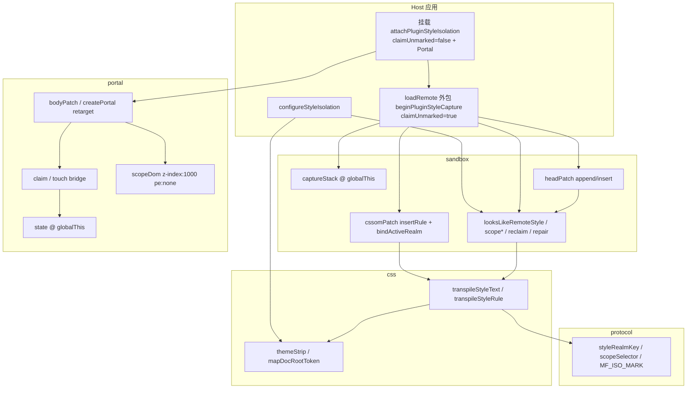
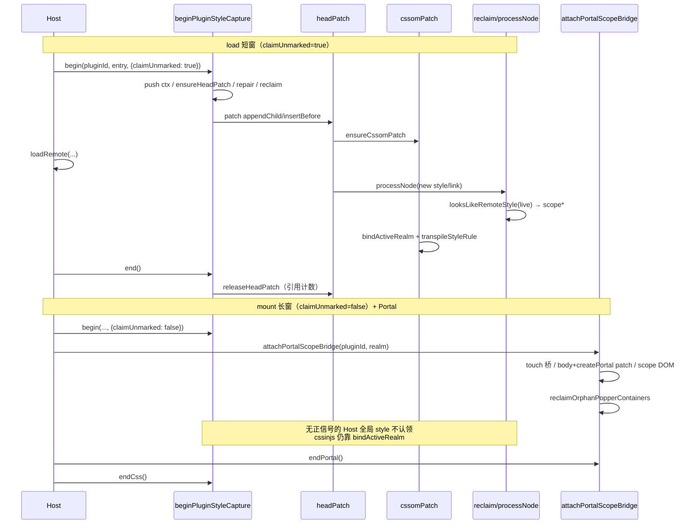

# federation-kit 样式隔离系统（功能实现详解与复刻指南）

> **一句话**：把 Module Federation Remote 注入的 CSS 与挂到 `document.body` 的弹层，收进按 entry 共享的样式域（realm），避免污染 Host，同时不误伤 Host 的 markdown / sonner Toast。  
> **入口**：Host 在 `loadRemote` 外包 `beginPluginStyleCapture`；插件页挂载时调 `attachPluginStyleIsolation`；启动时可选 `configureStyleIsolation`。  
> **关联文件**：`packages/federation-kit/src/style-isolation/**`（protocol / css / sandbox / portal / configure）。  
> **文档目标**：读懂整套隔离协议与沙箱/Portal 协作；能按复刻手册在其他 Host 落地等价逻辑。  
> **非目标**：不讲 MF 加载器本身、不讲插件业务 UI、不写 `styleIsolation.smoke.ts` 全文（只摘要断言）。

---

## 0. 先看这里（一眼建立模型）

### 0.1 30 秒读懂

- **做什么**：给每个 Remote（同 entry）一个 `data-mf-style-realm` 域；CSS 选择器加前缀；body 弹层收进全屏 portal scope 并打 realm；Host 关键样式（如 sonner）永不认领。
- **不做什么**：不改 Remote 源码；不靠 Shadow DOM；不把 Host 全局 CSS 包进插件域。
- **关键角色**：
  - **protocol**：realm 键、选择器、幂等/升版判定
  - **css**：选择器前缀转译 + Host 主题变量剥离
  - **sandbox**：捕获窗、head/CSSOM 劫持、认领/reclaim/repair
  - **portal**：body/createPortal 重定向、claim、z-index 与 Toast 共存
  - **configure**：Host 主题正则与 Vite 根标记

### 0.2 功能点总表（必填）

| 编号 | 功能点（简述） | 用户可感知表现 | 关键实现位置 | 正文小节 |
|------|----------------|----------------|--------------|----------|
| F1 | realm 键：同 entry 共用一个样式域 | 同 Remote 多插件切来切去样式不丢、不串 | `protocol/index.ts` → `styleRealmKey` | §4.1 |
| F2 | load 短窗 vs mount 长窗的 `claimUnmarked` | 加载期能收 Remote 入口 CSS；挂载长窗不误收 Host 全局样式 | `sandbox/capture.ts` / `attach.ts` | §4.2 |
| F3 | head append/insert 劫持 | Remote 往 head 塞 style 时立刻被隔离 | `sandbox/headPatch.ts` | §4.3 |
| F4 | CSSOM `bindActiveRealm` | antd cssinjs 的 `insertRule` 也进 realm | `sandbox/cssomPatch.ts` | §4.4 |
| F5 | `looksLikeRemoteStyle` 正信号认领 | 只收「像 Remote」的节点，空 style / Host vite-id / sonner 不收 | `sandbox/reclaim.ts` | §4.5 |
| F6 | reclaim + repair | 切回插件样式还在；被误隔离的 Host 样式被剥回 | `sandbox/reclaim.ts` | §4.6 |
| F7 | Portal retarget（body / createPortal） | EP Message/Select 弹层有 Remote 样式，且不炸 NotFoundError | `portal/bodyPatch.ts` / `attachPortal.ts` | §4.7 |
| F8 | portal z-index vs Toast | Toast 可悬停暂停、关闭钮 group-hover 正常 | `portal/scopeDom.ts` | §4.8 |
| F9 | 双入口 `globalThis` 共享 | 主入口与 `./react` 双份打包时不双劫持、不 release 崩 | `context` / `headPatch` / `cssomPatch` / `portal/state` | §4.9 |
| F10 | CSS 前缀转译 + themeStrip | Remote 样式只打在 realm；Host 主题色不被 Remote `:root` 盖住 | `css/transpile.ts` / `themeStrip.ts` | §4.10 |
| F11 | `configureStyleIsolation` | 换 Host 主题变量或 monorepo 路径仍可配 | `configure.ts` | §4.11 |
| F12 | 空 style 延后认领 | sonner「先插空再填全文」不会被误打 owner | `reclaim.ts` → `scopeStyleElement` | §4.12 |

### 0.3 架构一图



### 0.4 文件地图与建造顺序

| 建造序 | 文件 | 职责（一句话） | 依赖 |
|--------|------|----------------|------|
| 1 | `protocol/index.ts` | realm 键、选择器、幂等/升版 | 无 |
| 2 | `css/themeStrip.ts` | `:root/html/body` 映射 + Host 主题剥离 | protocol |
| 3 | `css/transpile.ts` | 整段/单条 CSS 前缀转译 | protocol, themeStrip |
| 4 | `sandbox/context.ts` | 捕获栈（globalThis） | 无 |
| 5 | `sandbox/reclaim.ts` | 认领正信号、scope、reclaim、repair | transpile, protocol, context |
| 6 | `sandbox/cssomPatch.ts` | insertRule 劫持 + bindActiveRealm | transpile, context |
| 7 | `sandbox/headPatch.ts` | head 插入劫持，联动 CSSOM | reclaim, cssomPatch, context |
| 8 | `sandbox/capture.ts` | begin 捕获窗 | protocol, context, headPatch, reclaim |
| 9 | `portal/state.ts` | Portal 共享状态（globalThis） | 无 |
| 10 | `portal/scopeDom.ts` | scope 容器、打标、z-index | protocol, claim, state |
| 11 | `portal/bodyPatch.ts` | body/createPortal 重定向 | claim, scopeDom, state |
| 12 | `portal/claim.ts` | touch 桥、认领、override | bodyPatch, scopeDom, state |
| 13 | `portal/attachPortal.ts` | 挂载期 Portal 桥 | claim, bodyPatch, scopeDom, state |
| 14 | `sandbox/attach.ts` | 挂载总入口：CSS + Portal | capture, attachPortal |
| 15 | `configure.ts` | Host 配置入口 | themeStrip, reclaim |
| 16 | `index.ts` | 包出口 + smoke 测试钩子 | 以上 |

---

## 1. 用户旅程

1. **进入（打开插件页）**：Host 先 `beginPluginStyleCapture`（短窗，`claimUnmarked=true`）再 `loadRemote`。Remote 往 `document.head` 塞的 style/link，以及 cssinjs 的 `insertRule`，都被标上同一个 realm，选择器加上 `[data-mf-style-realm="…"]`。
2. **主路径（插件已挂上）**：`attachPluginStyleIsolation` 开长窗（`claimUnmarked=false`）+ Portal 桥。之后 HMR / 延迟 CSS 仍会隔离，但**不会**把 Host 偶然插入的无标记全局样式收走。弹层（Message、下拉）挂到 portal scope，并打上 realm，于是「自身选择器」`[realm].el-popper` 能命中。
3. **分支（Host Toast / markdown）**：sonner 的 style 带 `[data-sonner-toaster]` → 标成 Host 关键并 peal 掉误加的前缀；Toast 节点本身跳过 Portal 收编；portal scope 的 `z-index:1000` 低于 Toaster，悬停不会被挡住。
4. **离开（卸载插件）**：结束捕获、拆 Portal scope、引用计数到 0 时还原 head/CSSOM/body 原型。同 entry 的 CSS 仍可留在 head（归 realm），下次挂载 `reclaimEntryStyles` 收回。

---

## 2. 问题与解决方案总表

| 问题编号 | 现象 / 风险 | 根因 | 解决方案 | 对应功能点 |
|----------|-------------|------|----------|------------|
| P1 | Host markdown / 页面被 Remote 的 `html,body,#root` 或 utilities 撑乱 | Remote CSS 全局泄漏 | 选择器前缀 + html/body→`[realm][data-plugin-root]`；`findMatchingBrace` 正确处理 Tailwind 转义引号 | F10 |
| P2 | Host sonner Toaster 失 `fixed`、样式怪 | 空窗期/误认领把 Host style 包进 realm | `isHostCriticalCss`、空 style 不认领、`repairHostCriticalStyles`、`mfHostStyle` | F5, F6, F12 |
| P3 | Toast 悬停无法暂停、关闭钮 group-hover 不触发 | portal scope `z-index` 过高且子节点 `pointer-events:auto` 盖住 Toast | scope `z-index:1000`（低于 sonner ~2147483000）；sonner 跳过收编 | F8 |
| P4 | 挂载长窗把 Host 后注入的全局 CSS 收进插件 | `claimUnmarked=true` 在长窗不安全 | load 短窗 true；mount 长窗 false；CSS-in-JS 靠 `bindActiveRealm` | F2, F4 |
| P5 | 空 style 被打上 owner，随后填入的 Host CSS 被当成 Remote | sonner 等「先插空再写全文」 | 空节点不认领；`scopeStyleElement` 对空节点只挂 pending MO，有文本后再 `looksLikeRemoteStyle` | F12 |
| P6 | 主入口与 `./react` 双份打包 → 双劫持 / release 后 `orig.call` 崩 | 模块级单例各有一份 | 状态与原生引用一律挂 `globalThis` 固定键 | F9 |
| P7 | antd Message 离开动画不触发、挂住不消失 | 给 `@keyframes` 改名但 `animation-name` 分条未同步 | CSSOM/文本路径都保留原 keyframes 名 | F10 |
| P8 | 切插件后样式丢失，或 EP popper 游离在 body 无样式 | 同 entry CSS 未 reclaim；Teleport 容器先建在 body | `reclaimEntryStyles` + `reclaimOrphanPopperContainers` | F1, F6, F7 |

---

## 3. 实现思路总览

### 3.1 总体策略

对齐 qiankun `experimentalStyleIsolation` 的**选择器前缀**，而不是 `@scope`（旧协议会升到 `/*mf-iso:3*/` 前缀）。样式域键按 **entry 目录**共享，这样同一 Remote 多插件实例共用 CSS。捕获分两档：`claimUnmarked` 只在 load 短窗放开「无标记也收」；挂载长窗只收正信号，CSS-in-JS 靠 insertRule 时 `bindActiveRealm`。弹层用 body 代理 + 全屏 pe:none scope，避免改 Remote 源码。

### 3.2 load 捕获 vs mount 挂载（Mermaid）



### 3.3 模块职责（谁调用谁）

- Host / runtime → `configureStyleIsolation`（一次性）
- loader → `beginPluginStyleCapture` → headPatch → cssomPatch / reclaim
- 页面挂载 → `attachPluginStyleIsolation` → capture(`claimUnmarked:false`) + `attachPortalScopeBridge`
- Portal 路径：bodyPatch ↔ claim ↔ scopeDom，状态在 `portal/state` 的 globalThis

---

## 4. 分功能点详解


### 4.1 F1：realm 键（同 entry 共用样式域）

#### （1）功能说明

同一个 Remote 入口（manifest / remoteEntry 所在目录）算出同一个字符串 realm。多个插件若共用该 Remote，CSS 只隔离一份，切换时还能 reclaim 回来。

#### （2）实现思路

优先 `entry:${origin}${dir}/`（剥掉 query/hash 与入口文件名）；URL 非法再退到 `remote:` / `plugin:`。选择器用引号内转义，不用 `CSS.escape`（属性值场景）。

#### （3）问题与对策

对应 P8：切插件丢样式——因 realm 按 entry 共享，reclaim 能按同一 owner 找回。

#### （4）实现过程

1. `styleRealmKey(entry, remoteName, pluginId)` 规范化 URL  
2. `scopeSelector(realm)` 生成 `[data-mf-style-realm="…"]`  
3. 捕获 ctx / dataset.mfStyleOwner 都写这个 realm  

#### （5）关键代码（摘录）

- **位置**：`protocol/index.ts` → `styleRealmKey` / `scopeSelector`
- **完整源码**：见 §8.3

```ts
// 尝试按绝对 URL 规范化 entry
export function styleRealmKey(
	// 远程入口 URL 或路径
	entry: string,
	// 可选 Module Federation remote 名
	remoteName?: string,
	// 可选插件 id，URL 解析失败时的最终回退键
	pluginId?: string,
// 闭合函数参数列表并标注返回类型
): string {
	// 尝试按绝对 URL 规范化 entry
	try {
		// 解析 entry 为 URL；非法则进 catch 回退分支
		const u = new URL(entry);
		// 去掉 query，避免同入口不同缓存参数拆成多 realm
		u.search = '';
		// 去掉 hash，只保留定位路径
		u.hash = '';
		// 剥掉末尾 manifest/remoteEntry 文件名，得到 Remote 根路径
		let path = u.pathname.replace(
			// 继续上一行表达式的参数或字符串
			/\/(?:mf-manifest\.json|remoteEntry\.js)\/?$/i,
			// 继续上一行表达式的参数或字符串
			'',
		// 闭合当前代码块或调用
		);
		// 保证路径以 / 结尾，统一目录形态的 realm 键
		if (!path.endsWith('/')) path += '/';
		// 返回 entry:origin+path 形式的共享 realm
		return `entry:${u.origin}${path}`;
	// 闭合当前代码块或调用
	} catch {
		// 去掉 remoteName 首尾空白
		const named = remoteName?.trim();
		// 显式 remote 名且不同于 pluginId 时用 remote: 键
		if (named && named !== pluginId) return `remote:${named}`;
		// 再无可用名则用 plugin: 键，unknown 兜底
		return `plugin:${pluginId || 'unknown'}`;
	// 闭合当前代码块或调用
	}
// 闭合当前代码块或调用
}

// 生成与 DOM data-mf-style-realm 匹配的属性选择器
export function scopeSelector(realm: string): string {
	// 属性值内转义反斜杠与双引号（勿用 CSS.escape）
	const v = realm.replace(/\\/g, '\\\\').replace(/"/g, '\\"');
	// 拼出属性选择器
	return `[data-mf-style-realm="${v}"]`;
// 闭合当前代码块或调用
}
```

#### （6）复刻提示

- 可原样搬：URL 规范化与 `entry:` 前缀约定  
- 须替换：入口文件名正则（若你们不叫 `mf-manifest.json` / `remoteEntry.js`）  
- 最小验证：两插件同 entry → realm 字符串全等  

---

### 4.2 F2：load 短窗 vs mount 长窗的 `claimUnmarked`

#### （1）功能说明

加载 Remote 的几秒内，很多入口 CSS 还没打任何 mf 标记——短窗允许「无标记也收」。插件挂着很长一段时间时，Host 自己也会往 head 塞全局 style——长窗禁止无标记认领，否则 Host 被包进插件域。

#### （2）实现思路

`CaptureCtx.claimUnmarked`：默认 true（`opts?.claimUnmarked !== false`）；`attachPluginStyleIsolation` 显式传 `false`。正信号路径与 CSSOM `bindActiveRealm` 不受「禁止无标记」影响。

#### （3）问题与对策

对应 P4。

#### （4）实现过程

1. `beginPluginStyleCapture` 写入 ctx 并 push 栈  
2. `attachPluginStyleIsolation` 以 `claimUnmarked:false` 再开一窗并挂 Portal  
3. `looksLikeRemoteStyle` 末尾：无标记仅当 `claimUnmarked && activeCtx`  

#### （5）关键代码

```ts
// 挂载期样式隔离入口：CSS 捕获 + Portal 收编
export function attachPluginStyleIsolation(
	// 插件 id
	pluginId: string,
	// Remote entry
	// 执行语句：entry: string,
	entry: string,
	// 可选 remote 名
	remoteName?: string,
// 闭合函数参数列表并标注返回类型
): () => void {
	// 由 entry 计算共享 realm
	const realm = styleRealmKey(entry, remoteName, pluginId);
	// 长窗：不认领无 Remote 正信号的 Host 全局样式
	const endCss = beginPluginStyleCapture(pluginId, entry, remoteName, {
		// 禁止无标记认领
		claimUnmarked: false,
	// 闭合当前代码块或调用
	});
	// 同步挂上 Portal/Teleport 收编桥
	const endPortal = attachPortalScopeBridge(pluginId, realm);
	// 返回组合清理函数
	return () => {
		// 先拆 Portal
		endPortal();
		// 再结束 CSS 捕获窗
		endCss();
	// 闭合当前代码块或调用
	};
// 闭合当前代码块或调用
}
```

```ts
// 在 loadRemote 前后包一层：捕获本次注入的 CSS
export function beginPluginStyleCapture(
	// 执行语句：pluginId: string,
	pluginId: string,
	// 执行语句：entry: string,
	entry: string,
	// 执行语句：remoteName?: string,
	remoteName?: string,
	// 执行语句：opts?: BeginStyleCaptureOptions,
	opts?: BeginStyleCaptureOptions,
// 闭合函数参数列表并标注返回类型
): () => void {
	// 计算 realm
	const realm = styleRealmKey(entry, remoteName, pluginId);
	// 组装捕获上下文
	const ctx: CaptureCtx = {
		// 执行语句：pluginId,
		pluginId,
		// 执行语句：realm,
		realm,
		// 从 entry 取 origin，供 link 同域认领
		entryOrigin: entryOriginOf(entry),
		// 默认 true；挂载期应显式 false
		claimUnmarked: opts?.claimUnmarked !== false,
	// 闭合当前代码块或调用
	};
	// 压入全局捕获栈
	captureStack.push(ctx);
	// 确保 head 劫持已安装
	ensureHeadPatch();
	// 先修已被误伤的 Host 关键样式
	repairHostCriticalStyles();
	// 收回 head 里同 entry 的旧样式
	reclaimEntryStyles(ctx);
	// 只听 head 直系 childList；空 style / HMR 由节点级 MO 负责
	const obs = new MutationObserver((mutations) => {
		// 栈顶已不是本 realm 则忽略
		if (activeCtx()?.realm !== realm) return;
		// 遍历本次突变
		for (const m of mutations) {
			// 对每个新增节点尝试隔离
			for (const n of m.addedNodes) processNode(n, ctx);
		// 闭合当前代码块或调用
		}
	// 闭合当前代码块或调用
	});
	// 观察 document.head 子节点增删
	obs.observe(document.head, { childList: true });
	// 返回结束函数
	return () => {
		// 断开 head MO
		obs.disconnect();
		// 从栈中移除本 ctx（支持嵌套）
		const idx = captureStack.lastIndexOf(ctx);
		// 找到才删
		if (idx >= 0) captureStack.splice(idx, 1);
		// 释放 head patch 引用计数
		releaseHeadPatch();
	// 闭合当前代码块或调用
	};
// 闭合当前代码块或调用
}
```

#### （6）复刻提示

- 可原样搬：两档 `claimUnmarked` 语义  
- 最小验证：挂载后 Host 动态插入无标记全局 CSS，插件卸载后 Host 样式仍全局生效  

---

### 4.3 F3：head append/insert 劫持

#### （1）功能说明

有些库不走你能观察到的「正常路径」，直接 `document.head.appendChild(style)`。劫持这两个方法，插入后立刻 `processNode`。

#### （2）实现思路

引用计数 `depth` + 原生函数挂 `globalThis`，避免双入口重复包一层。安装时顺带 `ensureCssomPatch`。

#### （3）问题与对策

对应 P6（双入口）。

#### （4）实现过程

1. `ensureHeadPatch`：depth>0 只加计数  
2. 保存 native append/insert  
3. 包装后调用 `processNode`  
4. `releaseHeadPatch` 减到 0 还原并 `releaseCssomPatch`  

#### （5）关键代码

见 §8.9 全文；要点：

```ts
// head patch 状态挂 globalThis，避免双入口各劫持一次
const HEAD_PATCH_KEY = '__dnhyxc_ai_federation_head_patch__';

// 劫持 head.appendChild/insertBefore，插入后对节点做样式隔离
export function ensureHeadPatch() {
	// 取或创建全局 store
	const s = store();
	// 已安装则只增加引用计数
	if (s.depth > 0) {
		// 执行语句：s.depth += 1;
		s.depth += 1;
		// 执行语句：return;
		return;
	// 闭合当前代码块或调用
	}
	// 缓存 head 引用
	const head = document.head;
	// 绑定原生 appendChild
	const nativeAppend = head.appendChild.bind(head) as <T extends Node>(node: T) => T;
	// 绑定原生 insertBefore
	const nativeInsert = head.insertBefore.bind(head) as <T extends Node>(node: T, ref: Node | null) => T;
	// 持久化原生引用供 release
	s.origAppend = nativeAppend;
	// 执行语句：s.origInsert = nativeInsert;
	s.origInsert = nativeInsert;
	// 包装 appendChild：先原生插入再隔离
	head.appendChild = function appendScoped<T extends Node>(node: T): T {
		// 声明常量 ret
		const ret = nativeAppend(node);
		// 取当前捕获栈顶上下文
		const ctx = activeCtx();
		// 对插入 head 的单个节点尝试认领并隔离
		if (ctx) processNode(node, ctx);
		// 返回结果给调用方
		return ret;
	// 闭合当前代码块或调用
	};
	// 包装 insertBefore：同上
	head.insertBefore = function insertScoped<T extends Node>(node: T, ref: Node | null): T {
		// 声明常量 ret
		const ret = nativeInsert(node, ref);
		// 取当前捕获栈顶上下文
		const ctx = activeCtx();
		// 对插入 head 的单个节点尝试认领并隔离
		if (ctx) processNode(node, ctx);
		// 返回结果给调用方
		return ret;
	// 闭合当前代码块或调用
	};
	// 标记已安装
	s.depth = 1;
	// 同步安装 CSSOM insertRule 劫持
	ensureCssomPatch();
// 闭合当前代码块或调用
}
```

#### （6）复刻提示

- 必须用 globalThis 存 depth 与 orig，不要用模块级 let  

---

### 4.4 F4：CSSOM `bindActiveRealm`

#### （1）功能说明

antd cssinjs 常先插一个空/几乎空的 style，再 `sheet.insertRule`。挂载长窗不会认领无标记 style，所以要在 **insertRule 当下**把栈顶 realm 写回 `dataset.mfStyleOwner`，并转译规则文本。

#### （2）实现思路

`sheetOwnerRealm` 已有 owner 则复用；否则 `bindActiveRealm` 写入 owner/scoped/origin；Host 标记 `mfHostStyle=1` 永不绑。

#### （3）问题与对策

对应 P4、P7（keyframes 名保持在 `transpileStyleRule`）。

#### （4）实现过程

1. `ensureCssomPatch` 包装 `CSSStyleSheet.prototype.insertRule`  
2. 每次调用先 `bindActiveRealm(this)`  
3. 有 realm 则 `transpileStyleRule` 再原生插入  

#### （5）关键代码

```ts
// 无 owner 时把当前捕获栈 realm 写回 style 元素
function bindActiveRealm(sheet: CSSStyleSheet): string | null {
	// 已有 owner 直接用
	const existing = sheetOwnerRealm(sheet);
	// 条件成立时进入分支
	if (existing) return existing;
	// 取栈顶捕获上下文
	const ctx = activeCtx();
	// 取 stylesheet 的 ownerNode
	const owner = sheet.ownerNode;
	// 无上下文或不是 style 元素则无法绑定
	if (!ctx || !(owner instanceof HTMLStyleElement)) return null;
	// Host 关键样式永不绑定
	if (owner.dataset.mfHostStyle === '1') return null;
	// 写入 realm 作为 owner
	owner.dataset.mfStyleOwner = ctx.realm;
	// 标记已纳入隔离体系
	owner.dataset.mfScoped = '1';
	// 同步 entry origin
	if (ctx.entryOrigin) owner.dataset.mfStyleOrigin = ctx.entryOrigin;
	// 返回本 realm 供转译
	return ctx.realm;
// 闭合当前代码块或调用
}
```

#### （6）复刻提示

- 最小验证：挂载长窗下打开 antd Message，规则选择器带 realm，动画名与 keyframes 一致  

---

### 4.5 F5：`looksLikeRemoteStyle` 正信号

#### （1）功能说明

「像不像这个 Remote 的样式」用一套正信号：已有 origin/owner、link 同域、vite-id 含 remote host / `apps/<remote>`、短窗无标记非空文本等。反向信号：`mfHostStyle`、sonner 文本、Host vite 根、`packages/` 等。

#### （2）实现思路

`live` vs `reclaim`：reclaim 更保守，无标记直接 false。空文本 live 也 false（交给 pending MO）。

#### （3）问题与对策

对应 P2、P5。

#### （4）实现过程

见 reclaim 内决策树；全文 §8.11。

#### （5）关键代码（决策要点）

```ts
// 无标记 style：reclaim 不碰；空节点不认领
if (mode === 'reclaim') return false;
// sonner 先插空再填全文；CSS-in-JS 走 insertRule
if (!(el.textContent ?? '').trim()) return false;
// 仅短窗且栈顶仍是本 realm 才认领无标记
return Boolean(ctx.claimUnmarked && activeCtx()?.realm === ctx.realm);
```

#### （6）复刻提示

- Host Vite 根检测依赖 `hostViteRootMarker`，换仓库路径用 configure  

---

### 4.6 F6：reclaim + repair

#### （1）功能说明

每次打开捕获窗：先 `repairHostCriticalStyles`（把误包的 Host CSS 剥回），再 `reclaimEntryStyles`（把同 entry 已注入样式收回当前 realm）。

#### （2）实现思路

repair 认 critical：`mfHostStyle` / sonner 文本 / Host vite-id；剥 `@scope`、mf-iso 标记与 realm 选择器。reclaim 只对 `looksLikeRemoteStyle(..., 'reclaim')` 为真的节点 scope。

#### （3）问题与对策

对应 P2、P8。

#### （4）实现过程

1. begin 时 repair → reclaim  
2. reclaim 遍历 head style/link  
3. style 走 `scopeStyleElement`；link 走 `scopeLinkElement`  

#### （5）关键代码

见 §8.11 `repairHostCriticalStyles` / `reclaimEntryStyles`。

#### （6）复刻提示

- 若 Host 还有其它「全局注入 CSS」特征串，可扩 `isHostCriticalCss`（保持白名单式，别做成业务配置巨坑）  

---

### 4.7 F7：Portal retarget

#### （1）功能说明

Remote 把弹层 `appendChild` 到 `document.body`，或 React `createPortal(children, document.body)`。劫持后改挂到 `[data-mf-portal-scope]`，并给节点打 realm。remove/replace 若还以为父节点是 body，会 NotFoundError → `resolveRetargetedChildParent`。

#### （2）实现思路

认领顺序：override → lastTouched → focus → sticky hover。跳过 script/style/sonner/`data-mf-host-portal`。EP 先建的 `#*-popper-container-*` 在 attach 时 `reclaimOrphanPopperContainers`。

#### （3）问题与对策

对应 P8；双入口见 P6。

#### （4）实现过程

1. `attachPortalScopeBridge` 注册插件、建 scope、收 orphan  
2. body/createPortal patch 调 `retargetPortalContainer`  
3. 重定向后 `stampRealmOnPortalNode`  
4. remove/replace 用实际 parent  

#### （5）关键代码

```ts
// append 被重定向到 portal scope 后，调用方仍可能对 body 做 remove/replace
export function resolveRetargetedChildParent(
	// 调用方以为的父节点（常为 body）
	assumedParent: Node,
	// 实际子节点
	child: Node,
// 闭合函数参数列表并标注返回类型
): Node {
	// 读真实父节点
	const actual = child.parentNode;
	// 父节点已变则改从实际父节点操作，避免 NotFoundError
	return actual && actual !== assumedParent ? actual : assumedParent;
// 闭合当前代码块或调用
}
```

#### （6）复刻提示

- 原生方法闭包捕获后永不置空；release 只还原 prototype（见 bodyPatch 文件头注释）  

---

### 4.8 F8：portal z-index vs Toast

#### （1）功能说明

portal scope 全屏 `pointer-events:none`，子节点 `pe:auto`。若 z-index 高于 Host Toaster，透明全屏层会挡住 Toast 的悬停。

#### （2）实现思路

`PORTAL_SCOPE_STYLE` 固定 `z-index:1000`；sonner 常用更高值。注入的 pointer CSS 标 `mfHostStyle=1`。Toast 节点 `shouldSkipPortalNode`。

#### （3）问题与对策

对应 P3。

#### （4）实现过程

1. `ensureBodyPortalScope` 写入 style 串  
2. `ensurePortalPointerCss` 一次注入子节点 pe:auto  
3. bodyPatch 跳过 sonner  

#### （5）关键代码

```ts
// z-index 须低于 Host Toaster，否则 pe:auto 子节点会挡住 Toast 悬停
const PORTAL_SCOPE_STYLE =
	// 配置点击穿透：scope 本身穿透，子节点恢复可点
	'position:fixed;inset:0;width:100%;height:100%;margin:0;padding:0;overflow:visible;pointer-events:none;z-index:1000;';
```

#### （6）复刻提示

- 核对 Host Toast 的 z-index；portal 必须更低  

---

### 4.9 F9：双入口 `globalThis` 共享

#### （1）功能说明

kit 可能被主入口和 `./react` 打成两份。若用模块级 `let depth` / `let stack`，会各劫持一次；一份 release 把 orig 置空，另一份还在调 → 崩。

#### （2）实现思路

固定键：

| 键 | 用途 |
|----|------|
| `__dnhyxc_ai_federation_style_capture__` | 捕获栈 |
| `__dnhyxc_ai_federation_head_patch__` | head depth + orig |
| `__dnhyxc_ai_federation_cssom_patch__` | CSSOM depth + orig |
| `__dnhyxc_ai_federation_portal__` | portal plugins/state/natives |

`captureStack` / `portalPlugins` 等 export 的是 store 里同一引用。

#### （3）问题与对策

对应 P6。

#### （4）实现过程

各模块 `store()` 读 globalThis；首次初始化。

#### （5）关键代码

```ts
// 挂 globalThis：主入口与 ./react 双份打包时必须共用同一栈
const CAPTURE_KEY = '__dnhyxc_ai_federation_style_capture__';

// 取或创建全局 store
function store(): CaptureBag {
	// 挂到 globalThis，保证双入口共用同一份状态
	const g = globalThis as GlobalBag;
	// 捕获栈在 globalThis 上的键
	if (!g[CAPTURE_KEY]) {
		// 捕获栈在 globalThis 上的键
		g[CAPTURE_KEY] = { stack: [] };
	// 闭合当前代码块或调用
	}
	// 捕获栈在 globalThis 上的键
	return g[CAPTURE_KEY]!;
// 闭合当前代码块或调用
}

// 与 store 同源；各入口 import 后仍是同一数组
export const captureStack = store().stack;
```

#### （6）复刻提示

- 换项目时改键前缀防撞车，但同一运行时必须唯一  

---

### 4.10 F10：CSS 前缀转译 + themeStrip

#### （1）功能说明

整段 CSS：`@import/@namespace/@font-face` hoist；旧 `@scope` unwrap；普通选择器变 `[realm] .x,[realm].x`；`:root`→realm；`html/body`→`[realm][data-plugin-root]`。`:root` 上 Host 语义变量（background/primary/…）剥掉，保留 `--el-*` / `--color-*` 等。

#### （2）实现思路

手写扫描器（注释/字符串/括号），避免 Tailwind `content-\[\"\"\]` 弄断 `@layer` 配对导致后半段泄漏。keyframes **不改名**（antd 分条 insertRule）。

#### （3）问题与对策

对应 P1、P7。

#### （4）实现过程

`transpileStyleText` → extract → `prefixCssRules` → 打 `MF_ISO_MARK`；CSSOM 走 `transpileStyleRule`。

#### （5）关键代码

全文见 §8.4 / §8.5。要点：`mapDocRootToken`、`stripHostThemeDecls`、`prefixOneSelector`。

#### （6）复刻提示

- 主题剥离正则用 `configureStyleIsolation({ themePropPattern })` 适配你们的 design tokens  

---

### 4.11 F11：`configureStyleIsolation`

#### （1）功能说明

Host 启动调一次：覆盖主题变量正则、Host Vite 根路径标记（dev 下区分 Host/Remote style）。

#### （2）实现思路

薄封装，分别打进 themeStrip 与 reclaim。

#### （3）问题与对策

无独立踩坑；边界：marker 变更清缓存。

#### （4）实现过程

见 configure.ts 全文 §8.2。

#### （5）关键代码

```ts
// 在 createPluginRuntime / Host 启动时调用一次
export function configureStyleIsolation(opts?: StyleIsolationOptions) {
	// 覆盖 Host 主题变量剥离正则
	if (opts?.themePropPattern) setHostThemePropPattern(opts.themePropPattern);
	// 覆盖 Host Vite 源码根标记（并清缓存）
	if (opts?.hostViteRootMarker != null) {
		// 配置 Host Vite 源码根路径标记
		setHostViteRootMarker(opts.hostViteRootMarker);
	// 闭合当前代码块或调用
	}
// 闭合当前代码块或调用
}
```

#### （6）复刻提示

- 非本 monorepo 时务必设 `hostViteRootMarker`  

---

### 4.12 F12：空 style 延后认领

#### （1）功能说明

sonner 等会先 `appendChild(空 style)` 再写 `textContent`。若空窗期打上 `mfStyleOwner`，随后全文会被当成 Remote 隔离 → Toaster 失 fixed。

#### （2）实现思路

`looksLikeRemoteStyle` 对空文本返回 false；`scopeStyleElement` 对空节点只挂 pending MO，有文本后再二次判定。

#### （3）问题与对策

对应 P2、P5。

#### （4）实现过程

见 `scopeStyleElement` 空分支。

#### （5）关键代码

```ts
// 空 style：等文本出现后再用 looksLikeRemoteStyle 判定（勿空窗期打 owner）
if (!text.trim()) {
	// 已有 pending 观察者则跳过
	if (pendingStyleObservers.has(el)) return;
	// 文本出现后再决定是否隔离
	const mo = new MutationObserver(() => {
		// 条件成立时进入分支
		if (!(el.textContent ?? '').trim()) return;
		// 执行语句：mo.disconnect();
		mo.disconnect();
		// 空 style 等待 textContent 的 WeakMap 观察者表
		pendingStyleObservers.delete(el);
		// 标记 Host 关键样式，认领与 CSSOM 一律跳过
		if (el.dataset.mfHostStyle === '1') return;
		// 取当前捕获栈顶上下文
		const ctx = activeCtx();
		// 判断节点是否像当前 Remote 的样式（正信号）
		if (!ctx || ctx.realm !== realm || !looksLikeRemoteStyle(el, ctx, 'live')) {
			// 执行语句：return;
			return;
		// 闭合当前代码块或调用
		}
		// 把单个 style 元素 CSS 前缀隔离并打标
		scopeStyleElement(el, realm, entryOrigin);
	// 闭合当前代码块或调用
	});
	// 空 style 等待 textContent 的 WeakMap 观察者表
	pendingStyleObservers.set(el, mo);
	// 执行语句：mo.observe(el, { childList: true, characterData:…
	mo.observe(el, { childList: true, characterData: true, subtree: true });
	// 执行语句：return;
	return;
// 闭合当前代码块或调用
}
```

#### （6）复刻提示

- 任何「先空后填」的 Host CSS 注入都受益于这条规则  

---

## 5. 跨项目复刻手册

### 5.1 前置条件

- 浏览器 Host（可改 `document.head` / 原型）  
- React 若用 `createPortal`（Vue Teleport 可只靠 body patch + orphan reclaim）  
- Remote 与 Host 同页（非 iframe 沙箱）  

### 5.2 推荐建造顺序

1. **protocol**：realm + scopeSelector + MF_ISO_MARK  
2. **themeStrip + transpile**：单测/smoke 先绿  
3. **context + reclaim + cssom + head + capture**：跑通 load 短窗  
4. **portal state/scope/body/claim/attach**：跑通弹层  
5. **attach + configure + index 出口**  
6. **接 Host**：loadRemote 外包 begin；挂载调 attach；启动 configure  

### 5.3 最小可运行切片（MVP）

- F1 + F10 + F3 + F2（仅 load 短窗）即可演示「Remote CSS 不再污染 Host」  
- 增强：F4（cssinjs）→ F7/F8（弹层与 Toast）→ F6/F12（repair/空节点）→ F9（双入口）  

### 5.4 平台差异清单

| 本项目用法 | 可移植抽象 | 其他项目常见替身 |
|------------|------------|------------------|
| MF entry URL realm | 「按资源根共享样式域」 | 按 remoteName 固定键 |
| Vite `data-vite-dev-id` | 「dev 样式来源标记」 | webpack 无则只靠短窗+origin |
| sonner 特征串 | 「Host 关键 CSS 指纹」 | 换成你们 Toast 库选择器 |
| ReactDOM.createPortal | 「声明式 Portal」 | Vue Teleport + body patch |
| `z-index:1000` | 「低于 Host Toast」 | 按 Toast 实测调整 |

### 5.5 验收用例

- [ ] F1：同 entry 两插件 realm 相同  
- [ ] F2：挂载后 Host 无标记全局 CSS 不被加 realm 前缀  
- [ ] F3/F4：Remote style 与 insertRule 规则带 `[data-mf-style-realm]`  
- [ ] F5/F12：sonner 空→满 后仍为全局 fixed  
- [ ] F6：误隔离后再次 begin 能 repair  
- [ ] F7：Message/Select 弹层有 Remote 样式；卸载无 NotFoundError  
- [ ] F8：Toast 悬停暂停自动关闭  
- [ ] F9：双入口同时 import 不崩  
- [ ] F10：`:root` Host token 被剥；`--el-*` 保留；keyframes 名不变  
- [ ] smoke：见 §7  

### 5.6 常见移植失误

1. 挂载长窗仍 `claimUnmarked=true` → Host CSS 被收  
2. 空 style 立刻写 owner → Toast 被隔离  
3. portal z-index 过大 → Toast 悬停失效  
4. 模块级单例而非 globalThis → 双包崩溃  
5. 给 keyframes 改名 → Message 动画挂住  
6. `findMatchingBrace` 未跳过转义引号 → Tailwind utilities 后泄漏  
7. html/body 只映射到裸 realm → 浮层被 `height:100%` 拉成竖条  

---

## 6. 验证要点

- [ ] 主路径：load + mount 后 Remote 页面样式正常、Host 布局不被改  
- [ ] 边界：HMR 换 CSS、切插件 reclaim、EP orphan popper  
- [ ] 失败：link CORS 失败时原 link 保留（隔离降级）  
- [ ] 与宿主并存：markdown 阅读区、sonner Toast 悬停/关闭  

---

## 7. `styleIsolation.smoke.ts` 断言摘要（不贴全文）

运行方式以包内脚本为准（文件头注释仍可能写旧 frontend 路径）。核心断言：

| 类别 | 断言要点 |
|------|----------|
| realm | `…/mf-manifest.json` → `entry:http://localhost:9008/` |
| hoist | `@import` / `@font-face` / `@namespace` 保留；无 `@scope` 外壳 |
| 双前缀 | `.box` → `[realm] .box,[realm].box` |
| keyframes | 名与 `animation` / `animation-name` 引用保持一致（文本+CSSOM） |
| themeStrip | 剥 `--brand-accent` / `--theme-background` / `--background`；保留 `--color-*` 别名与 `--el-*` |
| html/body | 映射到 `[realm][data-plugin-root]`，裸 realm 不得吃 `height:100%` |
| 升版 | 旧 `mf-iso:2` + `@scope` → `mf-iso:3` 双前缀 |
| Tailwind | `@layer utilities` 含转义引号时后段 `html,body/#root` 不得泄漏 |
| `:is(html,body)` | 映射到 plugin-root，逗号不拆坏 |
| Portal 辅助 | `resolveRetargetedChildParent`：orphan 留 assumed；已重定向用实际 parent |
| HMR 幂等 | 已前缀（含旧 mark）`styleNeedsRescope===false`；裸选择器为 true |

---

## 8. 完整标注源码附录

> 以下为磁盘只读原文的逐行中文意图注释版（可执行行上方必有中文注释）。路径均相对 `packages/federation-kit/src/style-isolation/`。


### 8.1 `index.ts` — 包出口

- **位置**：`packages/federation-kit/src/style-isolation/index.ts`
- **说明**：完整可运行源码（逐行中文意图注释）

```ts
/**
 * Host 侧 CSS 隔离（对齐 qiankun experimentalStyleIsolation + 社区 body 弹层修法）。
 *
 * 分层：protocol / css(transpile) / sandbox(head+CSSOM) / portal(body 代理)。
 */

// 再导出公开 API
export {
	// Host 启动时配置主题剥离与 Vite 根标记
	configureStyleIsolation,
	// 定义类型别名 StyleIsolationOptions
	type StyleIsolationOptions,
// 继续表达式：} from './configure';
} from './configure';
// 再导出公开 API
export {
	// Host 打开 Portal 外壳前同步认领插件
	claimPluginPortalTarget,
	// 清除 Portal 认领覆盖
	clearPluginPortalClaim,
// 继续表达式：} from './portal/claim';
} from './portal/claim';
// 由 entry/remoteName/pluginId 计算共享样式域键
export { styleRealmKey } from './protocol';
// 挂载期：CSS 捕获 + Portal 收编总入口
export { attachPluginStyleIsolation } from './sandbox/attach';
// 打开样式捕获窗口并返回结束函数
export { beginPluginStyleCapture } from './sandbox/capture';

// 导入依赖模块/符号
import {
	// 对 CSS 文本做选择器前缀隔离转译
	transpileStyleRule,
	// 对 CSS 文本做选择器前缀隔离转译
	transpileStyleText,
	// 按大括号深度剥最外层旧 @scope
	unwrapScope,
// 继续表达式：} from './css/transpile';
} from './css/transpile';
// append 被重定向后，remove/replace 改从实际父节点操作
import { resolveRetargetedChildParent } from './portal/bodyPatch';
// 判断文本是否已带当前协议标记与 realm 前缀
import { alreadyScoped, scopeSelector, styleNeedsRescope } from './protocol';

/** @internal smoke / 自检用 */
export const __styleIsolationTest = {
	// 对 CSS 文本做选择器前缀隔离转译
	transpileStyleText,
	// 对 CSS 文本做选择器前缀隔离转译
	transpileStyleRule,
	// 按大括号深度剥最外层旧 @scope
	unwrapScope,
	// 生成 data-mf-style-realm 属性选择器
	scopeSelector,
	// append 被重定向后，remove/replace 改从实际父节点操作
	resolveRetargetedChildParent,
	// 判断文本是否已带当前协议标记与 realm 前缀
	alreadyScoped,
	// 判断 HMR/回写是否还需要再 wrap
	styleNeedsRescope,
// 继续表达式：};
};
```

### 8.2 `configure.ts` — Host 配置

- **位置**：`packages/federation-kit/src/style-isolation/configure.ts`
- **说明**：完整可运行源码（逐行中文意图注释）

```ts
// 配置 Host 主题变量剥离正则
import { setHostThemePropPattern } from './css/themeStrip';
// 配置 Host Vite 源码根路径标记
import { setHostViteRootMarker } from './sandbox/reclaim';

// 导出类型定义
export type StyleIsolationOptions = {
	// Host 主题 CSS 变量匹配模式，用于剥离
	themePropPattern?: RegExp;
	// 解析并缓存 Host Vite 源码根路径
	hostViteRootMarker?: string;
// 继续表达式：};
};

/** 在 createPluginRuntime / Host 启动时调用一次 */
export function configureStyleIsolation(opts?: StyleIsolationOptions) {
	// Host 主题 CSS 变量匹配模式，用于剥离
	if (opts?.themePropPattern) setHostThemePropPattern(opts.themePropPattern);
	// 解析并缓存 Host Vite 源码根路径
	if (opts?.hostViteRootMarker != null) {
		// 配置 Host Vite 源码根路径标记
		setHostViteRootMarker(opts.hostViteRootMarker);
	// 继续表达式：}
	}
// 继续表达式：}
}
```

### 8.3 `protocol/index.ts` — 隔离协议

- **位置**：`packages/federation-kit/src/style-isolation/protocol/index.ts`
- **说明**：完整可运行源码（逐行中文意图注释）

```ts
/**
 * 样式隔离协议：realm 键、DOM 契约属性、选择器与幂等判定。
 */

/** 隔离协议版本标记；升版后强制重写 head 里旧前缀 CSS */
export const MF_ISO_MARK = '/*mf-iso:3*/';
// 协议版本标记，用于幂等与升版重写
export const MF_ISO_MARK_RE = /\/\*mf-iso(?::\d+)?\*\//g;
/** html/body 布局选择器后缀：只命中插件根，不命中打了 realm 的浮层 */
export const PLUGIN_ROOT_ATTR = '[data-plugin-root]';

// 把选择器里的特殊字符转义，避免 realm 含 : / 时属性选择器非法
export function cssEscapeIdent(id: string): string {
	// 条件成立时进入分支
	if (typeof CSS !== 'undefined' && typeof CSS.escape === 'function') {
		// 返回规范转义后的标识/字符串片段
		return CSS.escape(id);
		// 结束 CSS.escape 可用分支
	}
	// 无 CSS.escape 时手工转义非 [A-Za-z0-9_-] 字符
	return id.replace(/[^a-zA-Z0-9_-]/g, '\\$&');
	// 结束 cssEscapeIdent
}

/**
 * 同一 MF Remote（同 entry 源）共用一个样式域。
 * 优先 entry origin+目录；显式 remoteName 且异于 id 时作补充键。
 */
export function styleRealmKey(
	// 执行语句：entry: string,
	entry: string,
	// 可选 Module Federation remote 名
	remoteName?: string,
	// 可选插件 id，URL 解析失败时的最终回退键
	pluginId?: string,
	// 返回 realm 字符串；try 内按 URL 规范化
): string {
	// 尝试按绝对 URL 规范化 entry
	try {
		// 解析 entry 为 URL；非法则进 catch 回退分支
		const u = new URL(entry);
		// 去掉 query，避免同入口不同缓存参数拆成多 realm
		u.search = '';
		// 去掉 hash，只保留定位路径
		u.hash = '';
		// 剥掉末尾 manifest/remoteEntry 文件名，得到 Remote 根路径
		let path = u.pathname.replace(
			// 匹配 mf-manifest.json 或 remoteEntry.js（可带尾斜杠）
			/\/(?:mf-manifest\.json|remoteEntry\.js)\/?$/i,
			// replace 第二参：删掉入口文件名，留下目录路径
			'',
			// 结束 pathname.replace 调用
		);
		// 保证路径以 / 结尾，统一目录形态的 realm 键
		if (!path.endsWith('/')) path += '/';
		// 返回 entry:origin+path 形式的共享 realm
		return `entry:${u.origin}${path}`;
		// URL 非法时按 remoteName / pluginId 回退
	} catch {
		// 去掉 remoteName 首尾空白
		const named = remoteName?.trim();
		// 显式 remote 名且不同于 pluginId 时用 remote: 键
		if (named && named !== pluginId) return `remote:${named}`;
		// 再无可用名则用 plugin: 键，unknown 兜底
		return `plugin:${pluginId || 'unknown'}`;
		// 结束 styleRealmKey 的 catch
	}
	// 结束 styleRealmKey
}

// 生成与 DOM data-mf-style-realm 匹配的属性选择器（引号内转义，勿用 CSS.escape）
export function scopeSelector(realm: string): string {
	// 声明常量 v
	const v = realm.replace(/\\/g, '\\\\').replace(/"/g, '\\"');
	// 写入或匹配样式域属性，使前缀选择器生效
	return `[data-mf-style-realm="${v}"]`;
// 继续表达式：}
}

/** 已带当前协议标记 + realm 前缀（transpile 可跳过） */
export function alreadyScoped(text: string, sel: string): boolean {
	// 返回结果给调用方
	return (
		// 协议版本标记，用于幂等与升版重写
		text.includes(MF_ISO_MARK) &&
		// 写入或匹配样式域属性，使前缀选择器生效
		text.includes('data-mf-style-realm=') &&
		// 执行语句：text.includes(sel)
		text.includes(sel)
	// 继续表达式：);
	);
// 继续表达式：}
}

/**
 * HMR/回写是否还需要再 wrap。
 * 已有 realm 前缀且无旧 @scope → false（避免与 antd cssinjs 互殴卡死）。
 */
export function styleNeedsRescope(text: string, sel: string): boolean {
	// 声明常量 t
	const t = text.trim();
	// 条件成立时进入分支
	if (!t) return false;
	// 条件成立时进入分支
	if (/@scope\s*\(/.test(t)) return true;
	// 任意版本 mf-iso 且已含本 realm 选择器 → 视为已前缀，勿再写 textContent
	if (text.includes(sel) && /\/\*mf-iso(?::\d+)?\*\//.test(text)) return false;
	// 条件成立时进入分支
	if (text.includes(sel)) return false;
	// 返回结果给调用方
	return true;
// 继续表达式：}
}
```

### 8.4 `css/transpile.ts` — 选择器前缀转译

- **位置**：`packages/federation-kit/src/style-isolation/css/transpile.ts`
- **说明**：完整可运行源码（逐行中文意图注释）

```ts
/**
 * CSS 选择器前缀转译（对齐 qiankun experimentalStyleIsolation）。
 * wrapWithPrefix：历史名 wrapWithScope，现为选择器前缀隔离入口。
 */
import { alreadyScoped, MF_ISO_MARK, MF_ISO_MARK_RE } from '../protocol';
// 导入依赖模块/符号
import {
	// 判断选择器列表是否全是 :root/:host
	isDocRootOnlySelectors,
	// 把 :root/html/body 映射到 realm 或 plugin-root
	mapDocRootToken,
	// 从 :root 声明中剥掉 Host 语义主题变量
	stripHostThemeDecls,
// 继续表达式：} from './themeStrip';
} from './themeStrip';

// 匹配整段 @font-face（含嵌套大括号），供 hoist 为全局
const FONT_FACE_RE = /@font-face\s*\{[^}]*(?:\{[^}]*\}[^}]*)*\}/g;
// 匹配 @namespace 声明，须 hoist 到文件顶
const NAMESPACE_RE = /@namespace\s+[^;]+;/g;
// @import 正则续行声明：整句提到文件最前
const IMPORT_RE =
	// 继续表达式：/@import\s+(?:url\(\s*["']?[^"')]+["']?\s*\)|["'…
	/@import\s+(?:url\(\s*["']?[^"')]+["']?\s*\)|["'][^"']+["'])[^;]*;/g;

/** 按大括号深度剥最外层 @scope (…) { … }，保留 hoist 段 */
// 见上行 JSDoc：按大括号深度剥最外层 @scope，保留 hoist 段
export function unwrapScope(cssText: string): string {
	// 定位最外层 @scope (…) { 的起始
	const m = cssText.match(/@scope\s*\([^)]*\)\s*\{/);
	// 无匹配或无 index 则原样返回（未包 scope 或异常）
	if (!m || m.index == null) return cssText;
	// @scope 匹配起点下标
	const start = m.index;
	// 外层 { 的下标（match 末字符）
	const openAt = start + m[0].length - 1;
	// 大括号嵌套深度，用于找到配对的外层 }
	let depth = 0;
	// 从开括号起扫描到串尾找闭合
	for (let i = openAt; i < cssText.length; i++) {
		// 当前字符
		const ch = cssText[i];
		// 遇 { 加深一层
		if (ch === '{') depth++;
		// 遇 } 进入减深分支
		else if (ch === '}') {
			// 减一层深度
			depth--;
			// 回到 0 说明外层 @scope 块结束
			if (depth === 0) {
				// @scope 之前的 hoist/前缀文本
				const before = cssText.slice(0, start).trimEnd();
				// @scope 大括号内的样式正文
				const inner = cssText.slice(openAt + 1, i).trim();
				// 闭合 } 之后的剩余文本
				const after = cssText.slice(i + 1).trim();
				// 拼接非空三段，剥掉最外层 scope
				return [before, inner, after].filter(Boolean).join('\n');
				// 结束 depth===0 分支
			}
			// 结束 ch==='}' 分支
		}
		// 结束 for 扫描
	}
	// 未找到配对 } 则原样返回，避免截断损坏
	return cssText;
	// 结束 unwrapScope
}

// 用正则抽出 at-rule，返回抽出列表与剩余 CSS
function extractAtRules(
	// 待扫描的 CSS 文本
	cssText: string,
	// 匹配目标 at-rule 的全局正则
	regex: RegExp,
	// 返回类型：抽出片段与剩余串；函数体开始
): { extracted: string[]; remaining: string } {
	// 收集匹配到的 at-rule 原文
	const extracted: string[] = [];
	// replace 回调：记下 match 并从正文删除
	const remaining = cssText.replace(regex, (match) => {
		// 把整段 match 推进 extracted
		extracted.push(match);
		// 用空串删掉该 at-rule，留给后续 hoist
		return '';
		// 结束 replace 回调
	});
	// 返回抽出结果与剩余 CSS
	return { extracted, remaining };
	// 结束 extractAtRules
}

/**
 * 单个选择器加前缀（对齐 qiankun css.ts + body 弹层双选择器）：
 * - :root → realm（变量可打在浮层根）
 * - html/body → `[realm][data-plugin-root]`（避免 Toast 吃到 height:100%）
 * - 其余：`[realm] .x` + `[realm].x`
 */
function prefixOneSelector(selector: string, sel: string): string {
	// 去掉首尾空白，后续一律基于规范化后的选择器串处理
	const s = selector.trim();
	// 空串或已含 realm 选择器（避免重复加前缀）则原样返回
	if (!s || s.includes(sel)) return s;
	// 检测是否以 :root / html / body 开头（后跟空白、组合符、伪类/属性等或串尾）
	const lead = s.match(/^(?::root|html|body)(?=[\s.:#[\]>|+~*,]|$)/i);
	// 文档根令牌打头：只改写该令牌，后缀（如 .foo、> .bar）原样拼接
	if (lead) {
		// :root→realm；html/body→realm+[data-plugin-root]，再接剩余选择器
		return mapDocRootToken(lead[0], sel) + s.slice(lead[0].length);
	// 继续表达式：}
	}
	// 非打头：组合符 / :is()/:where() 参数里的 :root/html/body 也要映射
	// （如「div > body .x」「:is(html, body) ol」——后者若不改会双前缀后永远匹配不到，或切分坏时泄漏）
	const rooted = s.replace(
		// 边界含 `(`, `,`，供 :is(html, body) 内替换
		/(^|[\s>+~,(])(?::root|html|body)(?=[\s.:#[\]>|+~*,)]|$)/gi,
		// full=边界+令牌，p=边界；令牌部分走 mapDocRootToken
		(full, p: string) => `${p}${mapDocRootToken(full.slice(p.length), sel)}`,
	// 继续表达式：);
	);
	// 若发生过文档根映射，直接返回改写结果（不再套双选择器）
	if (rooted !== s) return rooted;
	// 普通选择器：对齐 qiankun——后代 `[realm] .x` + 同元素 `[realm].x`（覆盖弹层根自身）
	return `${sel} ${s},${sel}${s}`;
// 继续表达式：}
}

/**
 * 按顶层逗号拆选择器列表（括号 / 方括号 / 字符串内的逗号不拆）。
 * 避免 `:is(html, body) ol` 被切成残片后泄漏或错前缀。
 */
export function splitSelectorList(list: string): string[] {
	// 执行语句：const parts: string[] = [];
	const parts: string[] = [];
	// 声明可变变量 start
	let start = 0;
	// 声明可变变量 depth
	let depth = 0;
	// 开始循环遍历
	for (let i = 0; i < list.length; i++) {
		// 声明常量 ch
		const ch = list[i];
		// 条件成立时进入分支
		if (ch === '\\') {
			// 执行语句：i++;
			i++;
			// 跳过本轮循环继续下一轮
			continue;
		// 继续表达式：}
		}
		// 条件成立时进入分支
		if (ch === '"' || ch === "'") {
			// 声明常量 q
			const q = ch;
			// 执行语句：i++;
			i++;
			// 条件循环直至不成立
			while (i < list.length) {
				// 条件成立时进入分支
				if (list[i] === '\\') {
					// 执行语句：i += 2;
					i += 2;
					// 跳过本轮循环继续下一轮
					continue;
				// 继续表达式：}
				}
				// 条件成立时进入分支
				if (list[i] === q) break;
				// 执行语句：i++;
				i++;
			// 继续表达式：}
			}
			// 跳过本轮循环继续下一轮
			continue;
		// 继续表达式：}
		}
		// 条件成立时进入分支
		if (ch === '(' || ch === '[') depth++;
		// 前一条件不成立时再判断
		else if (ch === ')' || ch === ']') depth = Math.max(0, depth - 1);
		// 前一条件不成立时再判断
		else if (ch === ',' && depth === 0) {
			// 执行语句：parts.push(list.slice(start, i));
			parts.push(list.slice(start, i));
			// 执行语句：start = i + 1;
			start = i + 1;
		// 继续表达式：}
		}
	// 继续表达式：}
	}
	// 执行语句：parts.push(list.slice(start));
	parts.push(list.slice(start));
	// 返回结果给调用方
	return parts;
// 继续表达式：}
}

/** 逗号分组选择器列表加前缀 */
function prefixSelectorList(list: string, sel: string): string {
	// 按顶层逗号拆选择器列表（括号内不拆）
	return splitSelectorList(list)
		// 对单个选择器做文档根映射或双前缀
		.map((part) => prefixOneSelector(part, sel))
		// 继续表达式：.join(',');
		.join(',');
// 继续表达式：}
}

/** 从 openIdx（指向 `{`）起找配对 `}`，返回闭合下标；失败返回 -1 */
function findMatchingBrace(css: string, openIdx: number): number {
	// 大括号嵌套深度：从 openIdx 的 `{` 起算，回到 0 即找到配对 `}`
	let depth = 0;
	// 自开括号位置线性扫描到串尾
	for (let i = openIdx; i < css.length; i++) {
		// 当前字符，用于分支识别注释 / 字符串 / 括号
		const ch = css[i];
		// 选择器里常见 `\"`（如 .after\:content-\[\"\"\]）：勿把转义引号当成字符串起点，
		// 否则 @layer utilities 配对失败会把后续 html/body/#root 整段泄漏到 Host
		if (ch === '\\') {
			// 执行语句：i++;
			i++;
			// 跳过本轮循环继续下一轮
			continue;
		// 继续表达式：}
		}
		// 块注释 /* ... */：内部的 `{` `}` 不计深度，整段跳过
		if (ch === '/' && css[i + 1] === '*') {
			// 定位注释结束符；缺失则视为直到串尾
			const end = css.indexOf('*/', i + 2);
			// 将 i 落到 `*/` 末字符（或串尾），for 循环还会再 +1
			i = end < 0 ? css.length : end + 1;
			// 跳过本轮后续括号逻辑
			continue;
		// 继续表达式：}
		}
		// 引号字符串：内部的 `{` `}` 不计深度，需正确处理转义
		if (ch === '"' || ch === "'") {
			// 记录开引号类型，用于匹配同型闭引号
			const q = ch;
			// 从开引号后一字符开始扫字符串体
			i++;
			// 扫到串尾或配对闭引号为止
			while (i < css.length) {
				// 反斜杠转义：跳过转义符与下一字符，避免把 `\"` 当结束
				if (css[i] === '\\') {
					// 执行语句：i += 2;
					i += 2;
					// 跳过本轮循环继续下一轮
					continue;
				// 继续表达式：}
				}
				// 遇到同型闭引号则结束字符串扫描
				if (css[i] === q) break;
				// 普通字符继续前进
				i++;
			// 继续表达式：}
			}
			// 字符串已消费完，本轮不再计括号
			continue;
		// 继续表达式：}
		}
		// 遇 `{` 加深一层嵌套
		if (ch === '{') depth++;
		// 遇 `}` 进入减深分支
		else if (ch === '}') {
			// 减一层深度
			depth--;
			// 回到 0 说明 openIdx 处那层 `{` 已配对闭合
			if (depth === 0) return i;
		// 继续表达式：}
		}
	// 继续表达式：}
	}
	// 扫描结束仍未配对：CSS 残缺或括号不平衡
	return -1;
// 继续表达式：}
}

/**
 * 类 qiankun 选择器前缀：遍历规则，@media 等递归；@keyframes 原样（名已在外层加前缀）。
 * 手写轻量 CSS 扫描器：按注释 / 空白 / at-rule / 普通规则分段处理，
 * 把普通选择器改写成带 data-mf-style-realm 前缀的形式，实现 Remote 样式隔离。
 */
export function prefixCssRules(css: string, sel: string): string {
	// 累积改写后的 CSS 文本
	let out = '';
	// 当前扫描下标
	let i = 0;
	// 源串长度，循环上界
	const n = css.length;
	// 线性扫描整段 CSS，直到耗尽
	while (i < n) {
		// 块注释 /* ... */：原样拷贝，避免把注释内容当选择器改写
		if (css.startsWith('/*', i)) {
			// 找注释结束符；缺失则视为直到串尾
			const end = css.indexOf('*/', i + 2);
			// 切片终点：含 */ 两字符，或直接到 n
			const j = end < 0 ? n : end + 2;
			// 注释整段追加到输出
			out += css.slice(i, j);
			// 跳过已消费的注释区间
			i = j;
			// 跳过本轮循环继续下一轮
			continue;
		// 继续表达式：}
		}
		// 当前字符，用于分支判断
		const ch = css[i];
		// 空白（空格/换行/制表等）原样保留，维持可读格式
		if (/\s/.test(ch)) {
			// 执行语句：out += ch;
			out += ch;
			// 执行语句：i++;
			i++;
			// 跳过本轮循环继续下一轮
			continue;
		// 继续表达式：}
		}

		// at-rule：以 @ 开头（@media / @keyframes / @import 等）
		if (ch === '@') {
			// 记录 at-rule 起始，便于整段切片
			const preludeStart = i;
			// 从 @ 后扫描 prelude，直到块起始 `{` 或语句结束 `;`
			let j = i + 1;
			// 条件循环直至不成立
			while (j < n && css[j] !== '{' && css[j] !== ';') j++;
			// 提取 at-rule 名（小写），用于决定是否递归改写内部
			const name =
				// 执行语句：css
				css
					// 继续表达式：.slice(i, j)
					.slice(i, j)
					// 继续表达式：.match(/^@[\w-]+/i)?.[0]
					.match(/^@[\w-]+/i)?.[0]
					// 继续表达式：?.toLowerCase() ?? '';
					?.toLowerCase() ?? '';
			// 形如 `@import "...";` / `@charset "...";`：无块体，整句原样输出
			if (css[j] === ';') {
				// 执行语句：out += css.slice(preludeStart, j + 1);
				out += css.slice(preludeStart, j + 1);
				// 执行语句：i = j + 1;
				i = j + 1;
				// 跳过本轮循环继续下一轮
				continue;
			// 继续表达式：}
			}
			// 既无 `{` 也无 `;`：畸形片段，逐字吐出避免死循环
			if (css[j] !== '{') {
				// 执行语句：out += css[i++];
				out += css[i++];
				// 跳过本轮循环继续下一轮
				continue;
			// 继续表达式：}
			}
			// 配对找到 at-rule 块的闭合 `}`
			const close = findMatchingBrace(css, j);
			// 括号不匹配：剩余原文直接拼上并结束，防止越界
			if (close < 0) {
				// 执行语句：out += css.slice(i);
				out += css.slice(i);
				// 跳出当前循环或开关
				break;
			// 继续表达式：}
			}
			// 块内 CSS（不含两侧大括号），供可嵌套 at-rule 递归
			const inner = css.slice(j + 1, close);
			// `@xxx ...` 到 `{` 之前的 prelude（含条件表达式）
			const prelude = css.slice(preludeStart, j);
			// keyframes / font-face / property / page：内部是关键帧或描述符，不是选择器，整块原样
			if (
				// 执行语句：name.startsWith('@keyframes') ||
				name.startsWith('@keyframes') ||
				// 执行语句：name === '@-webkit-keyframes' ||
				name === '@-webkit-keyframes' ||
				// 执行语句：name === '@font-face' ||
				name === '@font-face' ||
				// 执行语句：name === '@property' ||
				name === '@property' ||
				// 执行语句：name === '@page'
				name === '@page'
			// 进入代码块
			) {
				// 执行语句：out += css.slice(preludeStart, close + 1);
				out += css.slice(preludeStart, close + 1);
			// 否则进入另一分支
			} else if (
				// 条件/分组类 at-rule：内部仍是普通规则，需递归加 realm 前缀
				name === '@media' ||
				// 执行语句：name === '@supports' ||
				name === '@supports' ||
				// 执行语句：name === '@layer' ||
				name === '@layer' ||
				// 执行语句：name === '@container' ||
				name === '@container' ||
				// 执行语句：name === '@document'
				name === '@document'
			// 进入代码块
			) {
				// 保留 prelude 与外层大括号，只改写内部规则
				out += `${prelude}{${prefixCssRules(inner, sel)}}`;
			// 否则进入另一分支
			} else {
				// 未知 at-rule：保守原样，避免误伤第三方扩展语法
				out += css.slice(preludeStart, close + 1);
			// 继续表达式：}
			}
			// 消费完整 at-rule（含闭合 `}`）
			i = close + 1;
			// 跳过本轮循环继续下一轮
			continue;
		// 继续表达式：}
		}

		// 普通规则：selector { declarations }
		// 从当前位置找规则块的 `{`
		const open = css.indexOf('{', i);
		// 找不到开括号：剩余文本无法构成规则，原样输出后结束
		if (open < 0) {
			// 执行语句：out += css.slice(i);
			out += css.slice(i);
			// 跳出当前循环或开关
			break;
		// 继续表达式：}
		}
		// 配对闭合 `}`，正确跳过字符串与注释内的括号
		const close = findMatchingBrace(css, open);
		// 闭合失败：剩余原文拼上并结束
		if (close < 0) {
			// 执行语句：out += css.slice(i);
			out += css.slice(i);
			// 跳出当前循环或开关
			break;
		// 继续表达式：}
		}
		// `{` 前的选择器列表（可能含逗号分组）
		const selectors = css.slice(i, open);
		// 从 `{` 到 `}` 的声明块本体
		let body = css.slice(open, close + 1);
		// :root/:host 上的 Host 主题绝对值剥掉，嵌入后继承主站；--color-* / --el-* 保留
		if (isDocRootOnlySelectors(selectors)) {
			// 从 :root 声明中剥掉 Host 语义主题变量
			body = stripHostThemeDecls(body);
		// 继续表达式：}
		}
		// 对选择器列表逐段加 realm 前缀
		out += `${prefixSelectorList(selectors, sel)}${body}`;
		// 跳到本规则之后，继续扫描下一条
		i = close + 1;
	// 继续表达式：}
	}
	// 返回完成选择器前缀隔离后的 CSS
	return out;
// 继续表达式：}
}

/**
 * hoist 全局 at-rule + keyframes 前缀 + 选择器前缀隔离。
 * @import 顶置；旧 @scope 会先 unwrap 再按前缀重写。
 */
export function transpileStyleText(
	// 执行语句：cssText: string,
	cssText: string,
	// 执行语句：sel: string,
	sel: string,
	// 执行语句：_realm: string,
	_realm: string,
// 进入代码块
): string {
	// 去掉首尾空白，便于空串判断与后续匹配
	const trimmed = cssText.trim();
	// 空样式直接原样返回，避免无意义改写
	if (!trimmed) return cssText;

	// 已是当前 realm 的 v2 前缀协议 → 幂等跳过，防止重复 wrap
	if (alreadyScoped(trimmed, sel)) return trimmed;

	// 旧 @scope 外壳先剥掉，再清掉历史 mf-iso 标记，得到可重写的裸 CSS
	const bare = unwrapScope(trimmed).replace(MF_ISO_MARK_RE, '').trim();
	// 抽出顶层 @import（须保持文档最前，不能进前缀作用域）
	const { extracted: imports, remaining: afterImport } = extractAtRules(
		// 执行语句：bare,
		bare,
		// 匹配 @import 以便顶置
		IMPORT_RE,
	// 继续表达式：);
	);
	// 抽出 @font-face（全局字体描述，hoist 到前缀规则之外）
	const { extracted: fontFaces, remaining: afterFont } = extractAtRules(
		// 执行语句：afterImport,
		afterImport,
		// 匹配 @font-face 以便 hoist 为全局
		FONT_FACE_RE,
	// 继续表达式：);
	);
	// 抽出 @namespace（同样须全局生效，不能被 realm 选择器包裹）
	const { extracted: namespaces, remaining: afterNs } = extractAtRules(
		// 执行语句：afterFont,
		afterFont,
		// 匹配 @namespace 以便 hoist 到文件顶
		NAMESPACE_RE,
	// 继续表达式：);
	);

	// 选择器前缀隔离；@keyframes 名不改（antd effect style 与 animation-name 分标签注入）
	const prefixed = prefixCssRules(afterNs, sel).trim();
	// hoist 段顺序：@import → @namespace → @font-face（符合 CSS 顶置约定）
	const hoisted = [...imports, ...namespaces, ...fontFaces].join('\n');
	// 正文打上 MF_ISO_MARK，供 alreadyScoped / HMR 识别已转译
	const body = prefixed ? `${MF_ISO_MARK}\n${prefixed}` : MF_ISO_MARK;
	// 有 hoist 则拼在正文前；否则只返回带标记的隔离正文
	return hoisted ? `${hoisted}\n${body}` : body;
// 继续表达式：}
}

/**
 * 单条 CSSOM insertRule 文本转译。
 * 注意：antd cssinjs 会把 `@keyframes X` 与 `animation-name:X` 分成两次 insertRule；
 * 若只给 keyframes 加 realm 前缀、不同步改名引用，离开动画永不触发，Message 会挂住不消失。
 * 故 CSSOM 路径保留原 keyframes 名（cssinjs 已带 hash），只做选择器前缀。
 */
export function transpileStyleRule(
	// 单条 CSSOM insertRule 的原始文本
	ruleText: string,
	// 当前 Remote 的选择器前缀（如 [data-mf-style-realm="…"]）
	sel: string,
	// realm 仅整段 transpileStyleText 改 keyframes 名时需要；CSSOM 分条路径刻意不用
	_realm: string,
// 进入代码块
): string {
	// 去掉首尾空白，便于空串与 at-rule 前缀匹配
	const trimmed = ruleText.trim();
	// 空规则原样返回，避免无意义改写
	if (!trimmed) return ruleText;
	// 已带隔离标记或已含本 realm 选择器 → 视为已转译，幂等跳过
	if (trimmed.includes(MF_ISO_MARK) || trimmed.includes(sel)) {
		// 防止 HMR / 重复 insertRule 时二次前缀
		return trimmed;
	// 继续表达式：}
	}
	// @font-face / @namespace 必须全局生效，不能包进 realm 选择器
	if (/^@font-face\b/i.test(trimmed) || /^@namespace\b/i.test(trimmed)) {
		// 原样放行，与 transpileStyleText 的 hoist 语义一致
		return trimmed;
	// 继续表达式：}
	}
	// @import 须保持文档顶置语义，单条路径也不改写
	if (/^@import\b/i.test(trimmed)) return trimmed;
	// @keyframes 保留原名：antd cssinjs 把 keyframes 与 animation-name 分两次 insertRule，
	// 若此处改名而引用侧未同步，离开动画失效（如 Message 挂住不消失）
	if (
		// 继续表达式：/^@keyframes\b/i.test(trimmed) ||
		/^@keyframes\b/i.test(trimmed) ||
		// 继续表达式：/^@-webkit-keyframes\b/i.test(trimmed)
		/^@-webkit-keyframes\b/i.test(trimmed)
	// 进入代码块
	) {
		// cssinjs 自身已带 hash，跨 Remote 撞名风险可接受
		return trimmed;
	// 继续表达式：}
	}
	// 普通规则：只做选择器前缀；勿对单条跑 prefixKeyframes（会与分条的 animation-name 脱节）
	return prefixCssRules(trimmed, sel);
// 继续表达式：}
}

// wrapWithScope：历史名，现为选择器前缀隔离入口
export function wrapWithPrefix(
	// 执行语句：cssText: string,
	cssText: string,
	// 执行语句：sel: string,
	sel: string,
	// 执行语句：realm: string,
	realm: string,
// 进入代码块
): string {
	// 对 CSS 文本做选择器前缀隔离转译
	return transpileStyleText(cssText, sel, realm);
// 继续表达式：}
}
```

### 8.5 `css/themeStrip.ts` — 主题剥离与文档根映射

- **位置**：`packages/federation-kit/src/style-isolation/css/themeStrip.ts`
- **说明**：完整可运行源码（逐行中文意图注释）

```ts
/**
 * Remote :root/:host 上 Host 语义主题 token 剥离（可配置）。
 */
import { PLUGIN_ROOT_ATTR } from '../protocol';

/** :root → realm；html/body → realm + [data-plugin-root] */
// 把 :root/html/body 映射到 realm 或 plugin-root
export function mapDocRootToken(token: string, sel: string): string {
	// 条件成立时进入分支
	if (/^:root$/i.test(token)) return sel;
	// 插件根属性选择器常量
	if (/^(?:html|body)$/i.test(token)) return `${sel}${PLUGIN_ROOT_ATTR}`;
	// 返回结果给调用方
	return token;
// 继续表达式：}
}

/**
 * 默认：本产品 shadcn / brand / theme-* 变量。
 * Host 可通过 `configureStyleIsolation({ themePropPattern })` 覆盖。
 */
export const DEFAULT_HOST_THEME_CUSTOM_PROP =
	// 继续表达式：/^--(?:brand-accent(?:-soft|-light|-dark)?|theme…
	/^--(?:brand-accent(?:-soft|-light|-dark)?|theme-[a-z0-9-]+|background|foreground|card(?:-foreground)?|popover(?:-foreground)?|primary(?:-foreground)?|secondary(?:-foreground)?|muted(?:-foreground)?|accent(?:-foreground)?|destructive|border|input|ring|radius)$/i;

// Host 主题 CSS 变量匹配模式，用于剥离
let themePropPattern: RegExp = DEFAULT_HOST_THEME_CUSTOM_PROP;

// 配置 Host 主题变量剥离正则
export function setHostThemePropPattern(pattern?: RegExp) {
	// Host 主题 CSS 变量匹配模式，用于剥离
	themePropPattern = pattern ?? DEFAULT_HOST_THEME_CUSTOM_PROP;
// 继续表达式：}
}

// 导出函数 getHostThemePropPattern
export function getHostThemePropPattern(): RegExp {
	// Host 主题 CSS 变量匹配模式，用于剥离
	return themePropPattern;
// 继续表达式：}
}

/** @deprecated 使用 getHostThemePropPattern()；保留别名兼容旧 smoke */
export const HOST_THEME_CUSTOM_PROP = DEFAULT_HOST_THEME_CUSTOM_PROP;

// 判断选择器列表是否全是 :root/:host
export function isDocRootOnlySelectors(selectors: string): boolean {
	// 声明常量 parts
	const parts = selectors
		// 继续表达式：.split(',')
		.split(',')
		// 继续表达式：.map((s) => s.trim())
		.map((s) => s.trim())
		// 继续表达式：.filter(Boolean);
		.filter(Boolean);
	// 返回结果给调用方
	return parts.length > 0 && parts.every((s) => /^(:root|:host)$/i.test(s));
// 继续表达式：}
}

// 从 :root 声明中剥掉 Host 语义主题变量
export function stripHostThemeDecls(declBlock: string): string {
	// 条件成立时进入分支
	if (declBlock.length < 2 || declBlock[0] !== '{') return declBlock;
	// 声明常量 inner
	const inner = declBlock.slice(1, -1);
	// 声明常量 pat
	const pat = getHostThemePropPattern();
	// 声明常量 cleaned
	const cleaned = inner.replace(
		// 继续表达式：/(^|;)\s*(--[\w-]+)\s*:\s*[^;]*/g,
		/(^|;)\s*(--[\w-]+)\s*:\s*[^;]*/g,
		// 继续表达式：(full, lead: string, prop: string) => (pat.test(…
		(full, lead: string, prop: string) => (pat.test(prop) ? lead : full),
	// 继续表达式：);
	);
	// 声明常量 tidy
	const tidy = cleaned
		// 继续表达式：.replace(/;\s*;+/g, ';')
		.replace(/;\s*;+/g, ';')
		// 继续表达式：.replace(/^\s*;\s*/, '')
		.replace(/^\s*;\s*/, '')
		// 继续表达式：.replace(/;\s*$/, '')
		.replace(/;\s*$/, '')
		// 继续表达式：.trim();
		.trim();
	// 返回结果给调用方
	return `{${tidy}}`;
// 继续表达式：}
}
```

### 8.6 `sandbox/context.ts` — 捕获栈

- **位置**：`packages/federation-kit/src/style-isolation/sandbox/context.ts`
- **说明**：完整可运行源码（逐行中文意图注释）

```ts
/**
 * 样式捕获窗口上下文（嵌套 begin/attach 用栈）。
 * 挂 globalThis：主入口与 ./react 双份打包时必须共用同一栈。
 */
export type CaptureCtx = {
	// 执行语句：pluginId: string;
	pluginId: string;
	/** realm / mfStyleOwner 键：同一 Remote 多插件共享 */
	realm: string;
	// 执行语句：entryOrigin: string;
	entryOrigin: string;
	/**
	 * true（loadRemote 短窗）：允许认领窗口内无标记的新 style（Remote 入口 CSS）。
	 * false（挂载长窗）：只认有 Remote 正信号的节点，避免误收 Host 全局样式。
	 */
	claimUnmarked: boolean;
// 继续表达式：};
};

// 捕获栈在 globalThis 上的键
const CAPTURE_KEY = '__dnhyxc_ai_federation_style_capture__';

// 定义类型别名 CaptureBag
type CaptureBag = {
	// 执行语句：stack: CaptureCtx[];
	stack: CaptureCtx[];
// 继续表达式：};
};

// 挂到 globalThis，保证双入口共用同一份状态
type GlobalBag = typeof globalThis & {
	// 捕获栈在 globalThis 上的键
	[CAPTURE_KEY]?: CaptureBag;
// 继续表达式：};
};

// 定义函数 store
function store(): CaptureBag {
	// 挂到 globalThis，保证双入口共用同一份状态
	const g = globalThis as GlobalBag;
	// 捕获栈在 globalThis 上的键
	if (!g[CAPTURE_KEY]) {
		// 捕获栈在 globalThis 上的键
		g[CAPTURE_KEY] = { stack: [] };
	// 继续表达式：}
	}
	// 捕获栈在 globalThis 上的键
	return g[CAPTURE_KEY]!;
// 继续表达式：}
}

/** 与 store 同源；各入口 import 后仍是同一数组 */
export const captureStack = store().stack;

// 取当前捕获栈顶上下文
export function activeCtx(): CaptureCtx | null {
	// 声明常量 stack
	const stack = store().stack;
	// 返回结果给调用方
	return stack[stack.length - 1] ?? null;
// 继续表达式：}
}
```

### 8.7 `sandbox/capture.ts` — begin 捕获窗

- **位置**：`packages/federation-kit/src/style-isolation/sandbox/capture.ts`
- **说明**：完整可运行源码（逐行中文意图注释）

```ts
/**
 * loadRemote / 挂载期样式捕获窗口。
 */
import { styleRealmKey } from '../protocol';
// 捕获窗口栈：嵌套 begin/attach 时取栈顶
import { activeCtx, type CaptureCtx, captureStack } from './context';
// 确保 head.appendChild/insertBefore 已被劫持
import { ensureHeadPatch, releaseHeadPatch } from './headPatch';
// 导入依赖模块/符号
import {
	// 从 entry URL 解析 origin
	entryOriginOf,
	// 对插入 head 的单个节点尝试认领并隔离
	processNode,
	// 挂载时收回 head 中同 entry 的已注入样式
	reclaimEntryStyles,
	// 纠正已被误隔离的 Host 关键样式
	repairHostCriticalStyles,
// 继续表达式：} from './reclaim';
} from './reclaim';

// 导出类型定义
export type BeginStyleCaptureOptions = {
	/**
	 * loadRemote 默认 true；挂载期应传 false。
	 * @see CaptureCtx.claimUnmarked
	 */
	claimUnmarked?: boolean;
// 继续表达式：};
};

/**
 * 在 loadRemote 前后包一层：捕获本次注入的 CSS 并按选择器前缀隔离到 realm。
 */
export function beginPluginStyleCapture(
	// 执行语句：pluginId: string,
	pluginId: string,
	// 执行语句：entry: string,
	entry: string,
	// 执行语句：remoteName?: string,
	remoteName?: string,
	// 执行语句：opts?: BeginStyleCaptureOptions,
	opts?: BeginStyleCaptureOptions,
// 进入代码块
): () => void {
	// 由 entry/remoteName/pluginId 计算共享样式域键
	const realm = styleRealmKey(entry, remoteName, pluginId);
	// 进入代码块
	const ctx: CaptureCtx = {
		// 执行语句：pluginId,
		pluginId,
		// 执行语句：realm,
		realm,
		// 从 entry URL 解析 origin
		entryOrigin: entryOriginOf(entry),
		// 控制是否认领无 Remote 正信号的未标记样式
		claimUnmarked: opts?.claimUnmarked !== false,
	// 继续表达式：};
	};
	// 捕获窗口栈：嵌套 begin/attach 时取栈顶
	captureStack.push(ctx);
	// 确保 head.appendChild/insertBefore 已被劫持
	ensureHeadPatch();
	// 纠正已被误隔离的 Host 关键样式
	repairHostCriticalStyles();
	// 挂载时收回 head 中同 entry 的已注入样式
	reclaimEntryStyles(ctx);

	// ponytail: 只听 head 直系 childList；空 style / HMR 由节点级 MO 负责
	const obs = new MutationObserver((mutations) => {
		// 取当前捕获栈顶上下文
		if (activeCtx()?.realm !== realm) return;
		// 开始循环遍历
		for (const m of mutations) {
			// 对插入 head 的单个节点尝试认领并隔离
			for (const n of m.addedNodes) processNode(n, ctx);
		// 继续表达式：}
		}
	// 继续表达式：});
	});
	// 执行语句：obs.observe(document.head, { childList: true });
	obs.observe(document.head, { childList: true });

	// 返回结果给调用方
	return () => {
		// 执行语句：obs.disconnect();
		obs.disconnect();
		// 捕获窗口栈：嵌套 begin/attach 时取栈顶
		const idx = captureStack.lastIndexOf(ctx);
		// 捕获窗口栈：嵌套 begin/attach 时取栈顶
		if (idx >= 0) captureStack.splice(idx, 1);
		// 减少 head patch 引用计数，到 0 时恢复原生
		releaseHeadPatch();
	// 继续表达式：};
	};
// 继续表达式：}
}
```

### 8.8 `sandbox/attach.ts` — 挂载总入口

- **位置**：`packages/federation-kit/src/style-isolation/sandbox/attach.ts`
- **说明**：完整可运行源码（逐行中文意图注释）

```ts
/**
 * 挂载期样式隔离入口：CSS 捕获 + Portal 收编。
 */
import { attachPortalScopeBridge } from '../portal/attachPortal';
// 由 entry/remoteName/pluginId 计算共享样式域键
import { styleRealmKey } from '../protocol';
// 打开样式捕获窗口并返回结束函数
import { beginPluginStyleCapture } from './capture';

/**
 * 插件页挂载期间继续隔离（HMR / 延迟 CSS）+ Portal/Teleport 静默纳入 realm。
 * claimUnmarked:false — 长窗内不认领无 Remote 正信号的 Host 全局样式。
 */
export function attachPluginStyleIsolation(
	// 执行语句：pluginId: string,
	pluginId: string,
	// 执行语句：entry: string,
	entry: string,
	// 执行语句：remoteName?: string,
	remoteName?: string,
// 进入代码块
): () => void {
	// 由 entry/remoteName/pluginId 计算共享样式域键
	const realm = styleRealmKey(entry, remoteName, pluginId);
	// 打开样式捕获窗口并返回结束函数
	const endCss = beginPluginStyleCapture(pluginId, entry, remoteName, {
		// 控制是否认领无 Remote 正信号的未标记样式
		claimUnmarked: false,
	// 继续表达式：});
	});
	// 挂载期注册插件并收编 orphan popper
	const endPortal = attachPortalScopeBridge(pluginId, realm);
	// 返回结果给调用方
	return () => {
		// 执行语句：endPortal();
		endPortal();
		// 执行语句：endCss();
		endCss();
	// 继续表达式：};
	};
// 继续表达式：}
}
```

### 8.9 `sandbox/headPatch.ts` — head 劫持

- **位置**：`packages/federation-kit/src/style-isolation/sandbox/headPatch.ts`
- **说明**：完整可运行源码（逐行中文意图注释）

```ts
/**
 * document.head append/insert 劫持。
 * patch 深度与原生引用挂 globalThis，避免双入口重复劫持。
 */
import { activeCtx } from './context';
// 确保 CSSStyleSheet.insertRule 已被劫持
import { ensureCssomPatch, releaseCssomPatch } from './cssomPatch';
// 对插入 head 的单个节点尝试认领并隔离
import { processNode } from './reclaim';

// head patch 状态在 globalThis 上的键
const HEAD_PATCH_KEY = '__dnhyxc_ai_federation_head_patch__';

// 定义类型别名 HeadPatchBag
type HeadPatchBag = {
	// 执行语句：depth: number;
	depth: number;
	// 执行语句：origAppend: (<T extends Node>(node: T) => T) | n…
	origAppend: (<T extends Node>(node: T) => T) | null;
	// 执行语句：origInsert: (<T extends Node>(node: T, ref: Node…
	origInsert: (<T extends Node>(node: T, ref: Node | null) => T) | null;
// 继续表达式：};
};

// 挂到 globalThis，保证双入口共用同一份状态
type GlobalBag = typeof globalThis & {
	// head patch 状态在 globalThis 上的键
	[HEAD_PATCH_KEY]?: HeadPatchBag;
// 继续表达式：};
};

// 定义函数 store
function store(): HeadPatchBag {
	// 挂到 globalThis，保证双入口共用同一份状态
	const g = globalThis as GlobalBag;
	// head patch 状态在 globalThis 上的键
	if (!g[HEAD_PATCH_KEY]) {
		// head patch 状态在 globalThis 上的键
		g[HEAD_PATCH_KEY] = {
			// 执行语句：depth: 0,
			depth: 0,
			// 执行语句：origAppend: null,
			origAppend: null,
			// 执行语句：origInsert: null,
			origInsert: null,
		// 继续表达式：};
		};
	// 继续表达式：}
	}
	// head patch 状态在 globalThis 上的键
	return g[HEAD_PATCH_KEY]!;
// 继续表达式：}
}

/** 劫持 head.appendChild/insertBefore，插入后对节点做样式隔离 */
export function ensureHeadPatch() {
	// 声明常量 s
	const s = store();
	// 条件成立时进入分支
	if (s.depth > 0) {
		// 执行语句：s.depth += 1;
		s.depth += 1;
		// 执行语句：return;
		return;
	// 继续表达式：}
	}
	// 声明常量 head
	const head = document.head;
	// 调用或劫持 appendChild
	const nativeAppend = head.appendChild.bind(head) as <T extends Node>(
		// 执行语句：node: T,
		node: T,
	// 继续表达式：) => T;
	) => T;
	// 调用或劫持 insertBefore
	const nativeInsert = head.insertBefore.bind(head) as <T extends Node>(
		// 执行语句：node: T,
		node: T,
		// 执行语句：ref: Node | null,
		ref: Node | null,
	// 继续表达式：) => T;
	) => T;
	// 执行语句：s.origAppend = nativeAppend;
	s.origAppend = nativeAppend;
	// 执行语句：s.origInsert = nativeInsert;
	s.origInsert = nativeInsert;

	// 调用或劫持 appendChild
	head.appendChild = function appendScoped<T extends Node>(node: T): T {
		// 声明常量 ret
		const ret = nativeAppend(node);
		// 取当前捕获栈顶上下文
		const ctx = activeCtx();
		// 对插入 head 的单个节点尝试认领并隔离
		if (ctx) processNode(node, ctx);
		// 返回结果给调用方
		return ret;
	// 继续表达式：};
	};

	// 调用或劫持 insertBefore
	head.insertBefore = function insertScoped<T extends Node>(
		// 执行语句：node: T,
		node: T,
		// 执行语句：ref: Node | null,
		ref: Node | null,
	// 进入代码块
	): T {
		// 声明常量 ret
		const ret = nativeInsert(node, ref);
		// 取当前捕获栈顶上下文
		const ctx = activeCtx();
		// 对插入 head 的单个节点尝试认领并隔离
		if (ctx) processNode(node, ctx);
		// 返回结果给调用方
		return ret;
	// 继续表达式：};
	};

	// 执行语句：s.depth = 1;
	s.depth = 1;
	// 确保 CSSStyleSheet.insertRule 已被劫持
	ensureCssomPatch();
// 继续表达式：}
}

/** 减少 head patch 引用；到 0 时恢复 append/insert 并释放 CSSOM */
export function releaseHeadPatch() {
	// 声明常量 s
	const s = store();
	// 条件成立时进入分支
	if (s.depth <= 0) return;
	// 执行语句：s.depth -= 1;
	s.depth -= 1;
	// 条件成立时进入分支
	if (s.depth > 0) return;
	// 条件成立时进入分支
	if (s.origAppend) {
		// 调用或劫持 appendChild
		document.head.appendChild =
			// 调用或劫持 appendChild
			s.origAppend as typeof document.head.appendChild;
	// 继续表达式：}
	}
	// 条件成立时进入分支
	if (s.origInsert) {
		// 调用或劫持 insertBefore
		document.head.insertBefore =
			// 调用或劫持 insertBefore
			s.origInsert as typeof document.head.insertBefore;
	// 继续表达式：}
	}
	// 执行语句：s.origAppend = null;
	s.origAppend = null;
	// 执行语句：s.origInsert = null;
	s.origInsert = null;
	// 减少 CSSOM patch 引用计数，到 0 时恢复原生
	releaseCssomPatch();
// 继续表达式：}
}
```

### 8.10 `sandbox/cssomPatch.ts` — CSSOM 劫持

- **位置**：`packages/federation-kit/src/style-isolation/sandbox/cssomPatch.ts`
- **说明**：完整可运行源码（逐行中文意图注释）

```ts
/**
 * CSSOM insertRule 沙箱（antd cssinjs 等）。
 * 深度与原生 insertRule 挂 globalThis，避免双入口重复劫持。
 *
 * 挂载长窗 claimUnmarked=false 时，无标记 style 不会被 head MO 认领；
 * 此处在 insertRule 时把「当前捕获栈」写回 owner，专收 Remote CSS-in-JS。
 */
import { transpileStyleRule } from '../css/transpile';
// 生成 data-mf-style-realm 属性选择器
import { scopeSelector } from '../protocol';
// 取当前捕获栈顶上下文
import { activeCtx } from './context';

// CSSOM patch 状态在 globalThis 上的键
const CSSOM_PATCH_KEY = '__dnhyxc_ai_federation_cssom_patch__';

// 定义类型别名 CssomPatchBag
type CssomPatchBag = {
	// 执行语句：depth: number;
	depth: number;
	// 劫持 CSSOM insertRule，在写入前做选择器前缀转译
	origInsertRule: typeof CSSStyleSheet.prototype.insertRule | null;
// 继续表达式：};
};

// 挂到 globalThis，保证双入口共用同一份状态
type GlobalBag = typeof globalThis & {
	// CSSOM patch 状态在 globalThis 上的键
	[CSSOM_PATCH_KEY]?: CssomPatchBag;
// 继续表达式：};
};

// 定义函数 store
function store(): CssomPatchBag {
	// 挂到 globalThis，保证双入口共用同一份状态
	const g = globalThis as GlobalBag;
	// CSSOM patch 状态在 globalThis 上的键
	if (!g[CSSOM_PATCH_KEY]) {
		// CSSOM patch 状态在 globalThis 上的键
		g[CSSOM_PATCH_KEY] = { depth: 0, origInsertRule: null };
	// 继续表达式：}
	}
	// CSSOM patch 状态在 globalThis 上的键
	return g[CSSOM_PATCH_KEY]!;
// 继续表达式：}
}

/** 从 stylesheet 的 ownerNode 读 mfStyleOwner 作为 realm */
export function sheetOwnerRealm(sheet: CSSStyleSheet): string | null {
	// 声明常量 owner
	const owner = sheet.ownerNode;
	// 条件成立时进入分支
	if (!(owner instanceof HTMLStyleElement)) return null;
	// 标记 Host 关键样式，认领与 CSSOM 一律跳过
	if (owner.dataset.mfHostStyle === '1') return null;
	// 返回结果给调用方
	return owner.dataset.mfStyleOwner || null;
// 继续表达式：}
}

// 在 insertRule 时把当前捕获栈 realm 写回 owner
function bindActiveRealm(sheet: CSSStyleSheet): string | null {
	// 从 stylesheet ownerNode 读取 mfStyleOwner
	const existing = sheetOwnerRealm(sheet);
	// 条件成立时进入分支
	if (existing) return existing;
	// 取当前捕获栈顶上下文
	const ctx = activeCtx();
	// 声明常量 owner
	const owner = sheet.ownerNode;
	// 条件成立时进入分支
	if (!ctx || !(owner instanceof HTMLStyleElement)) return null;
	// 标记 Host 关键样式，认领与 CSSOM 一律跳过
	if (owner.dataset.mfHostStyle === '1') return null;
	// 执行语句：owner.dataset.mfStyleOwner = ctx.realm;
	owner.dataset.mfStyleOwner = ctx.realm;
	// 执行语句：owner.dataset.mfScoped = '1';
	owner.dataset.mfScoped = '1';
	// 条件成立时进入分支
	if (ctx.entryOrigin) owner.dataset.mfStyleOrigin = ctx.entryOrigin;
	// 返回结果给调用方
	return ctx.realm;
// 继续表达式：}
}

/** 确保 CSSStyleSheet.insertRule 被包一层转译 */
export function ensureCssomPatch() {
	// 声明常量 s
	const s = store();
	// 条件成立时进入分支
	if (s.depth > 0) {
		// 执行语句：s.depth += 1;
		s.depth += 1;
		// 执行语句：return;
		return;
	// 继续表达式：}
	}
	// 劫持 CSSOM insertRule，在写入前做选择器前缀转译
	const nativeInsertRule = CSSStyleSheet.prototype.insertRule;
	// 执行语句：s.origInsertRule = nativeInsertRule;
	s.origInsertRule = nativeInsertRule;
	// 劫持 CSSOM insertRule，在写入前做选择器前缀转译
	CSSStyleSheet.prototype.insertRule = function mfInsertRule(
		// 执行语句：rule: string,
		rule: string,
		// 执行语句：index?: number,
		index?: number,
	// 进入代码块
	): number {
		// 在 insertRule 时把当前捕获栈 realm 写回 owner
		const realm = bindActiveRealm(this);
		// 条件成立时进入分支
		if (realm) {
			// 生成 data-mf-style-realm 属性选择器
			const sel = scopeSelector(realm);
			// 对 CSS 文本做选择器前缀隔离转译
			rule = transpileStyleRule(rule, sel, realm);
		// 继续表达式：}
		}
		// 返回结果给调用方
		return nativeInsertRule.call(this, rule, index);
	// 继续表达式：};
	};
	// 执行语句：s.depth = 1;
	s.depth = 1;
// 继续表达式：}
}

/** 减少 CSSOM patch 引用；到 0 时恢复原生 insertRule */
export function releaseCssomPatch() {
	// 声明常量 s
	const s = store();
	// 条件成立时进入分支
	if (s.depth <= 0) return;
	// 执行语句：s.depth -= 1;
	s.depth -= 1;
	// 条件成立时进入分支
	if (s.depth > 0) return;
	// 条件成立时进入分支
	if (
		// 执行语句：s.origInsertRule &&
		s.origInsertRule &&
		// 劫持 CSSOM insertRule，在写入前做选择器前缀转译
		CSSStyleSheet.prototype.insertRule !== s.origInsertRule
	// 进入代码块
	) {
		// 劫持 CSSOM insertRule，在写入前做选择器前缀转译
		CSSStyleSheet.prototype.insertRule = s.origInsertRule;
	// 继续表达式：}
	}
	// 执行语句：s.origInsertRule = null;
	s.origInsertRule = null;
// 继续表达式：}
}
```

### 8.11 `sandbox/reclaim.ts` — 认领 / scope / reclaim / repair

- **位置**：`packages/federation-kit/src/style-isolation/sandbox/reclaim.ts`
- **说明**：完整可运行源码（逐行中文意图注释）

```ts
/**
 * Remote 样式认领、scope 写回、HMR、reclaim。
 */

// 历史别名：选择器前缀隔离入口
import { unwrapScope, wrapWithPrefix } from '../css/transpile';
// 导入依赖模块/符号
import {
	// 判断文本是否已带当前协议标记与 realm 前缀
	alreadyScoped,
	// 协议版本标记，用于幂等与升版重写
	MF_ISO_MARK_RE,
	// 生成 data-mf-style-realm 属性选择器
	scopeSelector,
	// 判断 HMR/回写是否还需要再 wrap
	styleNeedsRescope,
// 继续表达式：} from '../protocol';
} from '../protocol';
// 取当前捕获栈顶上下文
import { activeCtx, type CaptureCtx } from './context';

// 从 entry URL 取 origin，供 link 同域认领与 data-mf-style-origin
export function entryOriginOf(entry: string): string {
	// 尝试解析绝对 URL
	try {
		// 返回 origin（协议+主机+端口）
		return new URL(entry).origin;
		// 相对路径或非法 URL
	} catch {
		// 解析失败返回空串，调用方按无 origin 处理
		return '';
		// 结束 entryOriginOf 的 catch
	}
	// 结束 entryOriginOf
}

/** Host Vite 源码根路径标记；可通过 configureStyleIsolation 覆盖 */
let hostViteRootMarker = '/apps/frontend';
// 解析并缓存 Host Vite 源码根路径
let hostViteRootCache: string | null = null;

// 配置 Host Vite 源码根路径标记
export function setHostViteRootMarker(marker?: string) {
	// 解析并缓存 Host Vite 源码根路径
	hostViteRootMarker = marker?.trim() || '/apps/frontend';
	// 解析并缓存 Host Vite 源码根路径
	hostViteRootCache = null;
// 继续表达式：}
}

// 解析并缓存 Host Vite 源码根路径
function hostViteRoot(): string {
	// 解析并缓存 Host Vite 源码根路径
	if (hostViteRootCache != null) return hostViteRootCache;
	// 尝试执行可能失败的操作
	try {
		// 声明常量 path
		const path = decodeURIComponent(
			// 创建新实例或对象
			new URL(import.meta.url).pathname.replace(/\\/g, '/'),
		// 继续表达式：);
		);
		// 解析并缓存 Host Vite 源码根路径
		const marker = hostViteRootMarker;
		// 声明常量 idx
		const idx = path.lastIndexOf(marker);
		// 条件成立时进入分支
		if (idx >= 0) {
			// 解析并缓存 Host Vite 源码根路径
			hostViteRootCache = path.slice(0, idx + marker.length);
			// 解析并缓存 Host Vite 源码根路径
			return hostViteRootCache;
		// 继续表达式：}
		}
	// 进入代码块
	} catch {
		/* ignore */
	// 继续表达式：}
	}
	// 解析并缓存 Host Vite 源码根路径
	hostViteRootCache = hostViteRootMarker;
	// 解析并缓存 Host Vite 源码根路径
	return hostViteRootCache;
// 继续表达式：}
}

/**
 * 是否为 Host 自身 Vite 注入的 style（dev）。
 * 只排除 Host；Remote 须靠 entry host / apps/<remote> 等正信号认领。
 */
function isHostViteDevStyle(viteId: string): boolean {
	// 声明常量 id
	const id = viteId.replace(/\\/g, '/');
	// 解析并缓存 Host Vite 源码根路径
	const root = hostViteRoot();
	// 条件成立时进入分支
	if (root && id.includes(root)) return true;
	// 解析并缓存 Host Vite 源码根路径
	const escaped = hostViteRootMarker.replace(/[.*+?^${}()|[\]\\]/g, '\\$&');
	// 条件成立时进入分支
	if (new RegExp(`${escaped}(?:/|$)`, 'i').test(id)) return true;
	// Host Vite 相对 id（无 monorepo apps/ 段）；Remote 一般是 @fs 绝对路径含 apps/<name>
	if (!/\/apps\//i.test(id) && (/^\/src\//.test(id) || /^\/@id\//.test(id))) {
		// 返回结果给调用方
		return true;
	// 继续表达式：}
	}
	// Host 消费的 workspace 包（如 markdown-kit），不在 apps/<remote> 下
	if (/\/packages\//i.test(id)) return true;
	// 返回结果给调用方
	return false;
// 继续表达式：}
}

/** 检测已知会被误伤的 Host 全局 CSS（仅作认领拒绝 / 修复，不是业务名单扩展点） */
function isHostCriticalCss(text: string): boolean {
	// sonner __insertCSS；误隔离后 Toaster 失 fixed
	return text.includes('[data-sonner-toaster]');
// 继续表达式：}
}

// 定义函数 isHostMarkedStyleEl
function isHostMarkedStyleEl(el: HTMLElement): boolean {
	// 标记 Host 关键样式，认领与 CSSOM 一律跳过
	return el.dataset.mfHostStyle === '1';
// 继续表达式：}
}

/** 纠正已被误隔离的 Host 样式（sonner + 带 Host vite-id 的误认领） */
export function repairHostCriticalStyles() {
	// 开始循环遍历
	for (const node of document.head.querySelectorAll(
		// 继续表达式：'style, link[rel="stylesheet"]',
		'style, link[rel="stylesheet"]',
	// 进入代码块
	)) {
		// 条件成立时进入分支
		if (!(node instanceof HTMLElement)) continue;
		// 声明常量 text
		const text =
			// 执行语句：node instanceof HTMLStyleElement ? (node.textCon…
			node instanceof HTMLStyleElement ? (node.textContent ?? '') : '';
		// 声明常量 viteId
		const viteId = node.getAttribute('data-vite-dev-id') || '';
		// 声明常量 critical
		const critical =
			// 执行语句：isHostMarkedStyleEl(node) ||
			isHostMarkedStyleEl(node) ||
			// 检测已知会被误伤的 Host 全局 CSS
			(text ? isHostCriticalCss(text) : false) ||
			// 判断 vite-id 是否属于 Host 自身注入
			(viteId ? isHostViteDevStyle(viteId) : false);
		// 条件成立时进入分支
		if (!critical) continue;
		// 标记 Host 关键样式，认领与 CSSOM 一律跳过
		node.dataset.mfHostStyle = '1';
		// 条件成立时进入分支
		if (node instanceof HTMLStyleElement) {
			// 声明可变变量 css
			let css = node.textContent ?? '';
			// 按大括号深度剥最外层旧 @scope
			if (css.includes('@scope')) css = unwrapScope(css);
			// 条件成立时进入分支
			if (
				// 执行语句：css.includes('mf-iso') ||
				css.includes('mf-iso') ||
				// 写入或匹配样式域属性，使前缀选择器生效
				css.includes('data-mf-style-realm')
			// 进入代码块
			) {
				// 执行语句：css = css
				css = css
					// 协议版本标记，用于幂等与升版重写
					.replace(MF_ISO_MARK_RE, '')
					// 写入或匹配样式域属性，使前缀选择器生效
					.replace(/\[data-mf-style-realm=(?:"[^"]*"|'[^']*')\]/g, '')
					// 标记插件根，限制 html/body 布局规则只打在根上
					.replace(/\[data-plugin-root\]/g, '');
			// 继续表达式：}
			}
			// 条件成立时进入分支
			if (css !== (node.textContent ?? '')) node.textContent = css;
		// 继续表达式：}
		}
		// 条件成立时进入分支
		if (node instanceof HTMLLinkElement && node.disabled) {
			// 执行语句：node.disabled = false;
			node.disabled = false;
		// 继续表达式：}
		}
		// 删除对象属性/数据集字段
		delete node.dataset.mfScoped;
		// 删除对象属性/数据集字段
		delete node.dataset.mfStyleOwner;
		// 删除对象属性/数据集字段
		delete node.dataset.mfStyleOrigin;
	// 继续表达式：}
	}
// 继续表达式：}
}

// 判断 style/link 是否应归当前捕获 ctx 的 Remote（live 或 reclaim）
export function looksLikeRemoteStyle(
	// 待判定的 style 或 stylesheet link
	el: HTMLStyleElement | HTMLLinkElement,
	// 当前插件捕获上下文
	ctx: CaptureCtx,
	// live=捕获窗口认领；reclaim=挂载时收回，更保守
	mode: 'live' | 'reclaim' = 'live',
	// 返回是否视为该 Remote 的样式；函数体开始
): boolean {
	// 已标 Host 关键样式则永不认领
	if (isHostMarkedStyleEl(el)) return false;

	// 读此前写入的 entry origin
	const origin = el.dataset.mfStyleOrigin;
	// 有 origin 标记时只认与 ctx.entryOrigin 相同的
	if (origin) return origin === ctx.entryOrigin;

	// 读 mfStyleOwner（可能是 realm 或旧版 pluginId）
	const owner = el.dataset.mfStyleOwner;
	// owner 已是本 realm 或本 pluginId 则认领
	if (owner === ctx.realm || owner === ctx.pluginId) return true;
	// owner 已是其它规范键则说明归属别的 Remote
	if (
		// entry: 前缀的其它 realm
		owner?.startsWith('entry:') ||
		// remote: 前缀的其它名
		owner?.startsWith('remote:') ||
		// plugin: 前缀的其它插件
		owner?.startsWith('plugin:')
		// 结束「已是规范 owner 键」条件
	) {
		// 归属其它 Remote，明确不认领
		return false;
		// 结束其它 owner 键分支
	}

	// link 元素：用 href 的 origin 与 entry 比对
	if (el instanceof HTMLLinkElement) {
		// 非 stylesheet 或无 href 则不是可认领样式表
		if (el.rel !== 'stylesheet' || !el.href) return false;
		// 解析 href 的 origin
		try {
			// 同域即视为该 Remote 的 link
			return new URL(el.href).origin === ctx.entryOrigin;
			// href 非法 URL
		} catch {
			// 解析失败则不认领
			return false;
			// 结束 link 分支 try/catch
		}
		// 结束 HTMLLinkElement 分支
	}

	// style 元素：读文本做 Host 关键与 vite id 判定
	const text = el.textContent ?? '';
	// 检测已知会被误伤的 Host 全局 CSS
	if (isHostCriticalCss(text)) {
		// 标记 Host 关键样式，认领与 CSSOM 一律跳过
		el.dataset.mfHostStyle = '1';
		// 删除对象属性/数据集字段
		delete el.dataset.mfScoped;
		// 删除对象属性/数据集字段
		delete el.dataset.mfStyleOwner;
		// 删除对象属性/数据集字段
		delete el.dataset.mfStyleOrigin;
		// 返回结果给调用方
		return false;
	// 继续表达式：}
	}

	// 声明常量 viteId
	const viteId = el.getAttribute('data-vite-dev-id') || '';
	// 条件成立时进入分支
	if (viteId) {
		// 判断 vite-id 是否属于 Host 自身注入
		if (isHostViteDevStyle(viteId)) return false;
		// 尝试执行可能失败的操作
		try {
			// 声明常量 host
			const host = new URL(ctx.entryOrigin).host;
			// 条件成立时进入分支
			if (host && viteId.includes(host)) return true;
		// 进入代码块
		} catch {
			/* ignore */
		// 继续表达式：}
		}
		// 其它 apps/<remote> 路径：仅栈顶为本 realm 时认领
		if (
			// 继续表达式：/\/apps\//i.test(viteId) &&
			/\/apps\//i.test(viteId) &&
			// 取当前捕获栈顶上下文
			activeCtx()?.realm === ctx.realm
		// 进入代码块
		) {
			// 返回结果给调用方
			return true;
		// 继续表达式：}
		}
		// load 短窗：其余非 Host vite 样式（Remote 依赖）可认领
		return Boolean(
			// 控制是否认领无 Remote 正信号的未标记样式
			ctx.claimUnmarked && activeCtx()?.realm === ctx.realm,
		// 继续表达式：);
		);
	// 继续表达式：}
	}

	// 生产无 vite id：旧版 owner=pluginId 且仍包着该 plugin 的 @scope → 可升到 realm
	if (owner) {
		// 条件成立时进入分支
		if (
			// 取当前捕获栈顶上下文
			activeCtx()?.realm === ctx.realm &&
			// 继续表达式：(text.includes(`[data-mf-plugin="${owner}"]`) ||
			(text.includes(`[data-mf-plugin="${owner}"]`) ||
				// 执行语句：text.includes(`[data-mf-plugin='${owner}']`))
				text.includes(`[data-mf-plugin='${owner}']`))
		// 进入代码块
		) {
			// 返回结果给调用方
			return true;
		// 继续表达式：}
		}
		// 返回结果给调用方
		return false;
	// 继续表达式：}
	}

	// 无标记 style：reclaim 不碰；空节点不认领（sonner 先插空再填全文；CSS-in-JS 走 insertRule）
	if (mode === 'reclaim') return false;
	// 条件成立时进入分支
	if (!(el.textContent ?? '').trim()) return false;
	// 控制是否认领无 Remote 正信号的未标记样式
	return Boolean(ctx.claimUnmarked && activeCtx()?.realm === ctx.realm);
// 继续表达式：}
}

// 空 style 等待 textContent 出现的 MutationObserver，弱键防泄漏
const pendingStyleObservers = new WeakMap<HTMLStyleElement, MutationObserver>();
// 已 scoped 的 style 监听 HMR 改文，弱键防泄漏
const hmrStyleObservers = new WeakMap<HTMLStyleElement, MutationObserver>();

/**
 * 仅对 Vite HMR style（data-vite-dev-id）监听换文重隔离。
 * antd cssinjs 等运行时靠 insertRule patch；对其 textContent 再 wrap 会互殴卡死整页。
 */
function watchScopedStyleHmr(
	// 已打过 mf 隔离标记的 style 元素
	el: HTMLStyleElement,
	// 当前归属的 style realm（与 data-mf-style-owner 对齐）
	realm: string,
	// Remote 入口 origin，重 scope 时原样传回
	entryOrigin: string | undefined,
	// 本 realm 的 [data-mf-style-realm="…"] 选择器，供 styleNeedsRescope 判断
	sel: string,
	// 函数体开始
) {
	// 同一元素已挂 HMR observer 则跳过，防止重复监听
	if (hmrStyleObservers.has(el)) return;
	// 非 Vite 开发态 style（无 data-vite-dev-id）不监听：antd cssinjs 等靠 insertRule，再 wrap text 会互殴卡死
	if (!el.getAttribute('data-vite-dev-id')) return;

	// 子树文本/节点变化时检查是否需要重新隔离
	const mo = new MutationObserver(() => {
		// owner 已不是本 realm：可能被别的插件认领，本观察者不再处理
		if (el.dataset.mfStyleOwner !== realm) return;
		// 读取当前 CSS 文本（null 当空串）
		const text = el.textContent ?? '';
		// 已带本 realm 前缀且无需剥旧 @scope → 不必重写，避免无意义写回
		if (!styleNeedsRescope(text, sel)) return;
		// 先断开，避免 set textContent 同步再进本回调形成死循环
		mo.disconnect();
		// 从弱表摘掉，允许后续再次 watch（scopeStyleElement 末尾会重挂）
		hmrStyleObservers.delete(el);
		// 清掉 scoped 标，让 scopeStyleElement 重新走完整 wrap 路径
		delete el.dataset.mfScoped;
		// 按原 realm/origin 重新隔离（内部会再调用本函数挂新 observer）
		scopeStyleElement(el, realm, entryOrigin);
		// 结束 MutationObserver 回调
	});
	// 登记弱引用，便于去重与元素回收时自动释放
	hmrStyleObservers.set(el, mo);
	// 监听子节点与字符数据（含文本节点替换），覆盖 Vite HMR 改 style 内容的常见路径
	mo.observe(el, { childList: true, characterData: true, subtree: true });
	// 结束 watchScopedStyleHmr
}

// 把单个 style 元素的 CSS 包进 @scope，并打 owner/origin 标记
export function scopeStyleElement(
	// 待隔离的 style
	el: HTMLStyleElement,
	// 目标 realm
	realm: string,
	// 可选 Remote origin
	entryOrigin?: string,
	// 函数体开始
) {
	// 先读文本做 Host 关键检测
	const text0 = el.textContent ?? '';
	// 检测已知会被误伤的 Host 全局 CSS
	if (isHostCriticalCss(text0)) {
		// 标记 Host 关键样式，认领与 CSSOM 一律跳过
		el.dataset.mfHostStyle = '1';
		// 删除对象属性/数据集字段
		delete el.dataset.mfScoped;
		// 删除对象属性/数据集字段
		delete el.dataset.mfStyleOwner;
		// 删除对象属性/数据集字段
		delete el.dataset.mfStyleOrigin;
		// 执行语句：return;
		return;
	// 继续表达式：}
	}
	// 生成 data-mf-style-realm 属性选择器
	const sel = scopeSelector(realm);
	// 声明常量 text
	const text = el.textContent ?? '';
	// 空 style：等文本出现后再用 looksLikeRemoteStyle 判定（勿空窗期打 owner）
	if (!text.trim()) {
		// 空 style 等待 textContent 的 WeakMap 观察者表
		if (pendingStyleObservers.has(el)) return;
		// 监听 DOM 变化以捕获新插入的样式节点
		const mo = new MutationObserver(() => {
			// 条件成立时进入分支
			if (!(el.textContent ?? '').trim()) return;
			// 执行语句：mo.disconnect();
			mo.disconnect();
			// 空 style 等待 textContent 的 WeakMap 观察者表
			pendingStyleObservers.delete(el);
			// 标记 Host 关键样式，认领与 CSSOM 一律跳过
			if (el.dataset.mfHostStyle === '1') return;
			// 取当前捕获栈顶上下文
			const ctx = activeCtx();
			// 条件成立时进入分支
			if (
				// 继续表达式：!ctx ||
				!ctx ||
				// 执行语句：ctx.realm !== realm ||
				ctx.realm !== realm ||
				// 判断节点是否像当前 Remote 的样式（正信号）
				!looksLikeRemoteStyle(el, ctx, 'live')
			// 进入代码块
			) {
				// 执行语句：return;
				return;
			// 继续表达式：}
			}
			// 把单个 style 元素 CSS 前缀隔离并打标
			scopeStyleElement(el, realm, entryOrigin);
		// 继续表达式：});
		});
		// 空 style 等待 textContent 的 WeakMap 观察者表
		pendingStyleObservers.set(el, mo);
		// 进入代码块
		mo.observe(el, {
			// 执行语句：childList: true,
			childList: true,
			// 执行语句：characterData: true,
			characterData: true,
			// 执行语句：subtree: true,
			subtree: true,
		// 继续表达式：});
		});
		// 执行语句：return;
		return;
	// 继续表达式：}
	}
	// 已隔离到本 realm：旧 @scope 迁移；协议升版（缺当前 mf-iso 标记）时重写一次
	if (
		// 执行语句：el.dataset.mfScoped === '1' &&
		el.dataset.mfScoped === '1' &&
		// 执行语句：el.dataset.mfStyleOwner === realm &&
		el.dataset.mfStyleOwner === realm &&
		// 判断 HMR/回写是否还需要再 wrap
		!styleNeedsRescope(text, sel)
	// 进入代码块
	) {
		// 判断文本是否已带当前协议标记与 realm 前缀
		if (!alreadyScoped(text, sel)) {
			// 已有前缀但标记过旧 → 升到当前协议（html/body→plugin-root 等）
			el.textContent = wrapWithPrefix(text, sel, realm);
		// 继续表达式：}
		}
		// 条件成立时进入分支
		if (entryOrigin) el.dataset.mfStyleOrigin = entryOrigin;
		// 仅对 Vite HMR style 监听换文重隔离
		watchScopedStyleHmr(el, realm, entryOrigin, sel);
		// 执行语句：return;
		return;
	// 继续表达式：}
	}
	// 正式把 CSS 前缀隔离写回 textContent
	el.textContent = wrapWithPrefix(text, sel, realm);
	// 标记已完成隔离
	el.dataset.mfScoped = '1';
	// owner 设为 realm，供 CSSOM / reclaim 识别
	el.dataset.mfStyleOwner = realm;
	// 写入 entry origin
	if (entryOrigin) el.dataset.mfStyleOrigin = entryOrigin;
	// 挂上 HMR 重隔离监听
	watchScopedStyleHmr(el, realm, entryOrigin, sel);
	// 结束 scopeStyleElement
}

// fetch 外链 CSS，换成带 @scope 的 style，并禁用原 link
async function scopeLinkElement(
	// stylesheet link
	// 执行语句：el: HTMLLinkElement,
	el: HTMLLinkElement,
	// 目标 realm
	realm: string,
	// Remote origin，写入 dataset
	entryOrigin: string,
	// async 函数体开始
) {
	// 读绝对 href
	const href = el.href;
	// 无 href 无法拉取，直接返回
	if (!href) return;
	// 本 realm 的 scope 选择器
	const sel = scopeSelector(realm);
	// 查找是否已有从同 href 注入的 style（避免重复 fetch）
	const existing = Array.from(
		// head 里带 data-mf-from-link 的 style
		document.head.querySelectorAll('style[data-mf-from-link]'),
		// dataset.mfFromLink 等于当前 href 则复用
	).find((s) => (s as HTMLElement).dataset.mfFromLink === href) as
		// 断言为 HTMLStyleElement 或 undefined（联合类型上行）
			| HTMLStyleElement
			// 联合类型下行：undefined
			| undefined;
	// 已有注入 style：对其重新 scope，并禁用本 link
	if (existing) {
		// 确保复用节点归属当前 realm
		scopeStyleElement(existing, realm, entryOrigin);
		// 标记 link 已处理
		el.dataset.mfScoped = '1';
		// owner 与 style 对齐
		el.dataset.mfStyleOwner = realm;
		// origin 对齐
		el.dataset.mfStyleOrigin = entryOrigin;
		// 禁用 link，避免双份样式（裸 CSS + scoped）
		el.disabled = true;
		// 复用路径结束
		return;
		// 结束 existing 分支
	}
	// link 已按本 realm scoped 过则跳过
	if (el.dataset.mfScoped === '1' && el.dataset.mfStyleOwner === realm) return;
	// CORS 拉取 CSS 文本
	try {
		// omit 凭证、cors 模式，避免无关 cookie；跨域失败进 catch
		const res = await fetch(href, { credentials: 'omit', mode: 'cors' });
		// 非 2xx 则放弃隔离，保留原 link
		if (!res.ok) return;
		// 读响应体为 CSS 字符串
		const css = await res.text();
		// 新建 style 承载隔离后的 CSS
		const style = document.createElement('style');
		// 先禁用 link，避免 fetch 窗口内未隔离样式闪烁污染 Host
		// 立刻禁用原 link，缩短未隔离窗口
		el.disabled = true;
		// 写入 wrap 后的 CSS
		style.textContent = wrapWithPrefix(css, sel, realm);
		// 标记新 style 已隔离
		style.dataset.mfScoped = '1';
		// owner=realm
		// 执行语句：style.dataset.mfStyleOwner = realm;
		style.dataset.mfStyleOwner = realm;
		// origin=entryOrigin
		// 执行语句：style.dataset.mfStyleOrigin = entryOrigin;
		style.dataset.mfStyleOrigin = entryOrigin;
		// 记录来源 href，供下次复用查找
		style.dataset.mfFromLink = href;
		// 插到 link 后面，保持级联大致顺序
		el.insertAdjacentElement('afterend', style);
		// 原 link 打上已处理标记
		el.dataset.mfScoped = '1';
		// owner 同步
		el.dataset.mfStyleOwner = realm;
		// origin 同步
		el.dataset.mfStyleOrigin = entryOrigin;
		// fetch/CORS 失败（降级见块内注释）
	} catch {
		/* CORS / 离线：保持原 link，不阻断功能（隔离降级） */
		// 结束 scopeLinkElement try/catch
	}
	// 结束 scopeLinkElement
}

// 对单次插入 head 的节点：若是 Remote style/link 则隔离
export function processNode(node: Node, ctx: CaptureCtx) {
	// 非 HTMLElement 忽略（文本节点等）
	if (!(node instanceof HTMLElement)) return;
	// style 标签路径
	if (node instanceof HTMLStyleElement) {
		// 不像本 Remote 的样式则跳过
		if (!looksLikeRemoteStyle(node, ctx)) return;
		// 包 @scope 并打标
		scopeStyleElement(node, ctx.realm, ctx.entryOrigin);
		// style 处理完毕，避免再落入 link 分支
		return;
		// 结束 HTMLStyleElement 分支
	}
	// stylesheet link 路径
	if (node instanceof HTMLLinkElement && node.rel === 'stylesheet') {
		// 不像本 Remote 则跳过
		if (!looksLikeRemoteStyle(node, ctx)) return;
		// 异步 fetch+替换；void 表示不阻塞插入路径
		void scopeLinkElement(node, ctx.realm, ctx.entryOrigin);
		// 结束 HTMLLinkElement 分支
	}
	// 结束 processNode
}

/** 挂载时把 head 里已注入、同 entry 的样式收回当前 realm（修复切换插件后无样式） */
// 见上行 JSDoc：挂载时收回 head 里同 entry 的样式到当前 realm
export function reclaimEntryStyles(ctx: CaptureCtx) {
	// 先修 Host 关键样式，避免误 reclaim
	repairHostCriticalStyles();
	// 收集 head 内所有 style 与 stylesheet link
	const nodes = document.head.querySelectorAll('style, link[rel="stylesheet"]');
	// 逐个尝试收回
	for (const node of nodes) {
		// 只处理 style 或 stylesheet link
		if (
			// 类型守卫：必须是 style 或 link
			!(node instanceof HTMLStyleElement || node instanceof HTMLLinkElement)
			// 结束类型守卫条件
		) {
			// continue 下一 node
			continue;
			// 结束非 style/link 分支
		}
		// reclaim 模式：无标记的不碰，只收有归属线索的
		if (!looksLikeRemoteStyle(node, ctx, 'reclaim')) continue;
		// style → 同步 scopeStyleElement
		if (node instanceof HTMLStyleElement) {
			// 隔离 style 文本并打 realm 标
			scopeStyleElement(node, ctx.realm, ctx.entryOrigin);
			// link → 异步 scopeLinkElement
		} else {
			// fire-and-forget 拉取并替换为 scoped style
			void scopeLinkElement(node, ctx.realm, ctx.entryOrigin);
			// 结束 style vs link 分支
		}
		// 结束 for nodes
	}
	// 结束 reclaimEntryStyles
}
```

### 8.12 `portal/state.ts` — Portal 共享状态

- **位置**：`packages/federation-kit/src/style-isolation/portal/state.ts`
- **说明**：完整可运行源码（逐行中文意图注释）

```ts
/**
 * Portal 收编共享状态（claim / scopeDom / bodyPatch / attach 共用）。
 * 必须挂 globalThis：kit 主入口与 ./react 双份打包时否则会各劫持一次 body，
 * release 把 orig 置空后另一份仍在调用 → origBodyRemove.call 崩。
 */
import type ReactDOM from 'react-dom';

// Portal 共享状态在 globalThis 上的键
const PORTAL_KEY = '__dnhyxc_ai_federation_portal__';

// 导出类型定义
export type PortalNatives = {
	// 调用或劫持 appendChild
	appendChild: typeof Node.prototype.appendChild;
	// 调用或劫持 insertBefore
	insertBefore: typeof Node.prototype.insertBefore;
	// 执行语句：append: typeof Element.prototype.append;
	append: typeof Element.prototype.append;
	// 执行语句：prepend: typeof Element.prototype.prepend;
	prepend: typeof Element.prototype.prepend;
	// 执行语句：removeChild: typeof Node.prototype.removeChild;
	removeChild: typeof Node.prototype.removeChild;
	// 执行语句：replaceChild: typeof Node.prototype.replaceChild…
	replaceChild: typeof Node.prototype.replaceChild;
	// 劫持 ReactDOM.createPortal，把 body 弹层收进 scope
	createPortal: typeof ReactDOM.createPortal;
// 继续表达式：};
};

// 定义类型别名 PortalBag
type PortalBag = {
	// 执行语句：plugins: Set<string>;
	plugins: Set<string>;
	// 执行语句：realmByPlugin: Map<string, string>;
	realmByPlugin: Map<string, string>;
	// 进入代码块
	state: {
		// 执行语句：lastTouchedPluginId: string | null;
		lastTouchedPluginId: string | null;
		// 执行语句：touchBridgeInstalled: boolean;
		touchBridgeInstalled: boolean;
		// Host 打开外壳前的同步 Portal 认领覆盖
		portalClaimOverride: string | null;
		// 内部挂 scope 时置忙，避免递归劫持
		bodyPatchBusy: boolean;
		// 劫持 ReactDOM.createPortal，把 body 弹层收进 scope
		createPortalPatched: boolean;
		// 执行语句：bodyPortalPatched: boolean;
		bodyPortalPatched: boolean;
		// 执行语句：portalPointerCssInstalled: boolean;
		portalPointerCssInstalled: boolean;
	// 继续表达式：};
	};
	// 执行语句：natives: PortalNatives | null;
	natives: PortalNatives | null;
// 继续表达式：};
};

// 挂到 globalThis，保证双入口共用同一份状态
type GlobalBag = typeof globalThis & {
	// Portal 共享状态在 globalThis 上的键
	[PORTAL_KEY]?: PortalBag;
// 继续表达式：};
};

// 定义函数 store
function store(): PortalBag {
	// 挂到 globalThis，保证双入口共用同一份状态
	const g = globalThis as GlobalBag;
	// Portal 共享状态在 globalThis 上的键
	if (!g[PORTAL_KEY]) {
		// Portal 共享状态在 globalThis 上的键
		g[PORTAL_KEY] = {
			// 执行语句：plugins: new Set(),
			plugins: new Set(),
			// 执行语句：realmByPlugin: new Map(),
			realmByPlugin: new Map(),
			// 进入代码块
			state: {
				// 执行语句：lastTouchedPluginId: null,
				lastTouchedPluginId: null,
				// 执行语句：touchBridgeInstalled: false,
				touchBridgeInstalled: false,
				// Host 打开外壳前的同步 Portal 认领覆盖
				portalClaimOverride: null,
				// 内部挂 scope 时置忙，避免递归劫持
				bodyPatchBusy: false,
				// 劫持 ReactDOM.createPortal，把 body 弹层收进 scope
				createPortalPatched: false,
				// 执行语句：bodyPortalPatched: false,
				bodyPortalPatched: false,
				// 执行语句：portalPointerCssInstalled: false,
				portalPointerCssInstalled: false,
			// 继续表达式：},
			},
			// 执行语句：natives: null,
			natives: null,
		// 继续表达式：};
		};
	// 继续表达式：}
	}
	// Portal 共享状态在 globalThis 上的键
	return g[PORTAL_KEY]!;
// 继续表达式：}
}

/** 与 store 同源的共享引用（各入口 import 后仍是同一 Set / 对象） */
export const portalPlugins = store().plugins;
// 插件 id 到 realm 的映射
export const portalRealmByPlugin = store().realmByPlugin;
// Portal 运行时共享状态对象
export const portalState = store().state;

// 读取已保存的原生 DOM/createPortal 引用
export function getPortalNatives(): PortalNatives | null {
	// 返回结果给调用方
	return store().natives;
// 继续表达式：}
}

// 保存原生 DOM/createPortal 引用供 release 还原
export function setPortalNatives(natives: PortalNatives | null): void {
	// 执行语句：store().natives = natives;
	store().natives = natives;
// 继续表达式：}
}
```

### 8.13 `portal/claim.ts` — 认领与 touch 桥

- **位置**：`packages/federation-kit/src/style-isolation/portal/claim.ts`
- **说明**：完整可运行源码（逐行中文意图注释）

```ts
/**
 * Portal 认领：pointer/focus 桥、override claim、resolveClaimPluginId。
 */
import { cssEscapeIdent } from '../protocol';
// 导入依赖模块/符号
import {
	// 确保 body 挂载相关原型方法已被劫持
	ensureBodyPortalPatch,
	// 执行语句：ensureCreatePortalPatch,
	ensureCreatePortalPatch,
	// 无活跃插件时还原 body/createPortal 原型
	maybeReleaseBodyPortalPatch,
// 继续表达式：} from './bodyPatch';
} from './bodyPatch';
// 获取或创建全屏 portal scope 容器
import { ensureBodyPortalScope } from './scopeDom';
// 当前已挂载并注册 Portal 的插件 id 集合
import { portalPlugins, portalRealmByPlugin, portalState } from './state';

// 从元素向上找 portal-scope 或 plugin 根得到插件 id
function claimIdFromElement(el: Element | null): string | null {
	// 条件成立时进入分支
	if (!el) return null;
	// 声明常量 scope
	const scope = el.closest('[data-mf-portal-scope]');
	// 条件成立时进入分支
	if (scope) {
		// 声明常量 id
		const id = scope.getAttribute('data-mf-portal-scope');
		// 当前已挂载并注册 Portal 的插件 id 集合
		if (id && portalPlugins.has(id)) return id;
	// 继续表达式：}
	}
	// 声明常量 root
	const root = el.closest(
		// 继续表达式：'[data-mf-plugin]:not([data-mf-portal-stamp]):no…
		'[data-mf-plugin]:not([data-mf-portal-stamp]):not([data-mf-portal-scope])',
	// 继续表达式：);
	);
	// 声明常量 id
	const id = root?.getAttribute('data-mf-plugin');
	// 当前已挂载并注册 Portal 的插件 id 集合
	return id && portalPlugins.has(id) ? id : null;
// 继续表达式：}
}

/** 安装 pointer/focus 桥：更新 lastTouchedPluginId 供 Portal 认领 */
export function ensureTouchBridge() {
	// Portal 运行时共享状态对象
	if (portalState.touchBridgeInstalled || typeof document === 'undefined') {
		// 执行语句：return;
		return;
	// 继续表达式：}
	}
	// Portal 运行时共享状态对象
	portalState.touchBridgeInstalled = true;

	// 执行语句：document.addEventListener(
	document.addEventListener(
		// 继续表达式：'pointerover',
		'pointerover',
		// 进入代码块
		(e) => {
			// 从元素向上找 portal-scope 或 plugin 根得到插件 id
			const to = claimIdFromElement(
				// 执行语句：e.target instanceof Element ? e.target : null,
				e.target instanceof Element ? e.target : null,
			// 继续表达式：);
			);
			// 从元素向上找 portal-scope 或 plugin 根得到插件 id
			const from = claimIdFromElement(
				// 执行语句：e.relatedTarget instanceof Element ? e.relatedTa…
				e.relatedTarget instanceof Element ? e.relatedTarget : null,
			// 继续表达式：);
			);
			// 条件成立时进入分支
			if (to === from) return;
			// Portal 运行时共享状态对象
			portalState.lastTouchedPluginId = to;
		// 继续表达式：},
		},
		// 执行语句：true,
		true,
	// 继续表达式：);
	);
	// 执行语句：document.addEventListener(
	document.addEventListener(
		// 继续表达式：'focusin',
		'focusin',
		// 进入代码块
		(e) => {
			// 从元素向上找 portal-scope 或 plugin 根得到插件 id
			portalState.lastTouchedPluginId = claimIdFromElement(
				// 执行语句：e.target instanceof Element ? e.target : null,
				e.target instanceof Element ? e.target : null,
			// 继续表达式：);
			);
		// 继续表达式：},
		},
		// 执行语句：true,
		true,
	// 继续表达式：);
	);
// 继续表达式：}
}

/** override → touch → focus → sticky hover */
// 按 override→touch→focus→hover 解析当前认领插件
export function resolveClaimPluginId(): string | null {
	// Host 打开外壳前的同步 Portal 认领覆盖
	const override = portalState.portalClaimOverride;
	// 条件成立时进入分支
	if (
		// 执行语句：override &&
		override &&
		// 当前已挂载并注册 Portal 的插件 id 集合
		(portalPlugins.has(override) || portalRealmByPlugin.has(override))
	// 进入代码块
	) {
		// 返回结果给调用方
		return override;
	// 继续表达式：}
	}
	// Portal 运行时共享状态对象
	const touched = portalState.lastTouchedPluginId;
	// 当前已挂载并注册 Portal 的插件 id 集合
	if (touched && portalPlugins.has(touched)) return touched;

	// 声明常量 ae
	const ae = document.activeElement;
	// 条件成立时进入分支
	if (ae instanceof Element) {
		// 从元素向上找 portal-scope 或 plugin 根得到插件 id
		const id = claimIdFromElement(ae);
		// 条件成立时进入分支
		if (id) return id;
	// 继续表达式：}
	}

	// 当前已挂载并注册 Portal 的插件 id 集合
	for (const id of portalPlugins) {
		// 声明常量 host
		const host = document.querySelector(
			// 转义 CSS 标识，避免属性选择器非法
			`[data-mf-portal-scope="${cssEscapeIdent(id)}"]`,
		// 继续表达式：);
		);
		// 条件成立时进入分支
		if (
			// 执行语句：host instanceof HTMLElement &&
			host instanceof HTMLElement &&
			// 执行语句：host.childElementCount > 0 &&
			host.childElementCount > 0 &&
			// 继续表达式：(host.matches(':hover') || host.querySelector(':…
			(host.matches(':hover') || host.querySelector(':hover'))
		// 进入代码块
		) {
			// 返回结果给调用方
			return id;
		// 继续表达式：}
		}
	// 继续表达式：}
	}
	// 返回结果给调用方
	return null;
// 继续表达式：}
}

/**
 * Host 打开会 Portal 的外壳（如 Drawer）之前同步认领，
 * 让首帧 createPortal 就进 scope。
 */
export function claimPluginPortalTarget(pluginId: string, realm: string): void {
	// 安装 pointer/focus 桥以更新 lastTouchedPluginId
	ensureTouchBridge();
	// 执行语句：ensureCreatePortalPatch();
	ensureCreatePortalPatch();
	// 确保 body 挂载相关原型方法已被劫持
	ensureBodyPortalPatch();
	// 插件 id 到 realm 的映射
	portalRealmByPlugin.set(pluginId, realm);
	// Host 打开外壳前的同步 Portal 认领覆盖
	portalState.portalClaimOverride = pluginId;
	// Portal 运行时共享状态对象
	portalState.lastTouchedPluginId = pluginId;
	// 获取或创建全屏 portal scope 容器
	ensureBodyPortalScope(pluginId);
// 继续表达式：}
}

// 清除 Portal 认领覆盖
export function clearPluginPortalClaim(pluginId?: string | null): void {
	// Host 打开外壳前的同步 Portal 认领覆盖
	if (pluginId && portalState.portalClaimOverride !== pluginId) return;
	// Host 打开外壳前的同步 Portal 认领覆盖
	portalState.portalClaimOverride = null;
	// 无活跃插件时还原 body/createPortal 原型
	maybeReleaseBodyPortalPatch();
// 继续表达式：}
}
```

### 8.14 `portal/scopeDom.ts` — scope DOM 与 z-index

- **位置**：`packages/federation-kit/src/style-isolation/portal/scopeDom.ts`
- **说明**：完整可运行源码（逐行中文意图注释）

```ts
/**
 * Portal scope DOM：全屏 overlay 容器、realm 打标、pointer-events CSS。
 */
import { cssEscapeIdent } from '../protocol';
// 按 override→touch→focus→hover 解析当前认领插件
import { resolveClaimPluginId } from './claim';
// 插件 id 到 realm 的映射
import { portalRealmByPlugin, portalState } from './state';

/**
 * Portal overlay 根：全屏 fixed + pointer-events:none（点击穿透到主界面），
 * 子树由 ensurePortalPointerCss 恢复事件。
 *
 * z-index 须低于 Host Toaster（sonner / 显式 ~2147483000），否则 pe:auto 子节点
 * 会挡住 Toast 悬停（无法暂停自动关闭、关闭钮 group-hover 不触发）。
 */
const PORTAL_SCOPE_STYLE =
	// 配置点击穿透：scope 本身穿透，子节点恢复可点
	'position:fixed;inset:0;width:100%;height:100%;margin:0;padding:0;overflow:visible;pointer-events:none;z-index:1000;';

// 注入 portal 子节点恢复 pointer-events 的 Host 样式
function ensurePortalPointerCss() {
	// 条件成立时进入分支
	if (
		// Portal 运行时共享状态对象
		portalState.portalPointerCssInstalled ||
		// 执行语句：typeof document === 'undefined'
		typeof document === 'undefined'
	// 进入代码块
	) {
		// 执行语句：return;
		return;
	// 继续表达式：}
	}
	// Portal 运行时共享状态对象
	portalState.portalPointerCssInstalled = true;
	// 声明常量 style
	const style = document.createElement('style');
	// 标记 Host 关键样式，认领与 CSSOM 一律跳过
	style.dataset.mfHostStyle = '1';
	// 配置点击穿透：scope 本身穿透，子节点恢复可点
	style.textContent = '[data-mf-portal-scope]>*{pointer-events:auto;}';
	// 调用或劫持 appendChild
	document.head.appendChild(style);
// 继续表达式：}
}

/** body 弹层节点打上 realm，使 `[realm].el-popper` 自身选择器生效 */
export function stampRealmOnPortalNode(node: Node) {
	// 条件成立时进入分支
	if (node instanceof DocumentFragment) {
		// 给弹层节点打上 realm/plugin 属性
		for (const child of node.childNodes) stampRealmOnPortalNode(child);
		// 执行语句：return;
		return;
	// 继续表达式：}
	}
	// 条件成立时进入分支
	if (!(node instanceof HTMLElement)) return;
	// 按 override→touch→focus→hover 解析当前认领插件
	const id = resolveClaimPluginId();
	// 插件 id 到 realm 的映射
	const realm = id ? portalRealmByPlugin.get(id) : undefined;
	// 条件成立时进入分支
	if (!realm) return;
	// 写入或匹配样式域属性，使前缀选择器生效
	node.setAttribute('data-mf-style-realm', realm);
	// 条件成立时进入分支
	if (id) node.setAttribute('data-mf-plugin', id);
// 继续表达式：}
}

/** 获取或创建 body 上某插件的 portal scope 容器 */
export function ensureBodyPortalScope(pluginId: string): HTMLElement {
	// 注入 portal 子节点恢复 pointer-events 的 Host 样式
	ensurePortalPointerCss();
	// 转义 CSS 标识，避免属性选择器非法
	const sel = `[data-mf-portal-scope="${cssEscapeIdent(pluginId)}"]`;
	// 声明可变变量 el
	let el = document.querySelector(sel) as HTMLElement | null;
	// 插件 id 到 realm 的映射
	const realm = portalRealmByPlugin.get(pluginId);
	// 条件成立时进入分支
	if (el) {
		// 写入或匹配样式域属性，使前缀选择器生效
		if (realm && el.getAttribute('data-mf-style-realm') !== realm) {
			// 写入或匹配样式域属性，使前缀选择器生效
			el.setAttribute('data-mf-style-realm', realm);
		// 继续表达式：}
		}
		// portal scope 全屏 fixed 与 pointer-events/z-index 样式串
		el.style.cssText = PORTAL_SCOPE_STYLE;
		// 返回结果给调用方
		return el;
	// 继续表达式：}
	}
	// 执行语句：el = document.createElement('div');
	el = document.createElement('div');
	// 执行语句：el.setAttribute('data-mf-plugin', pluginId);
	el.setAttribute('data-mf-plugin', pluginId);
	// 写入或匹配样式域属性，使前缀选择器生效
	if (realm) el.setAttribute('data-mf-style-realm', realm);
	// 执行语句：el.setAttribute('data-mf-portal-scope', pluginId…
	el.setAttribute('data-mf-portal-scope', pluginId);
	// 执行语句：el.dataset.mfPortalStamp = '1';
	el.dataset.mfPortalStamp = '1';
	// portal scope 全屏 fixed 与 pointer-events/z-index 样式串
	el.style.cssText = PORTAL_SCOPE_STYLE;
	// 内部挂 scope 时置忙，避免递归劫持
	portalState.bodyPatchBusy = true;
	// 尝试执行可能失败的操作
	try {
		// 调用或劫持 appendChild
		document.body.appendChild(el);
	// 进入代码块
	} finally {
		// 内部挂 scope 时置忙，避免递归劫持
		portalState.bodyPatchBusy = false;
	// 继续表达式：}
	}
	// 返回结果给调用方
	return el;
// 继续表达式：}
}

// 移除某插件的 portal scope 容器
export function removeBodyPortalScope(pluginId: string) {
	// 执行语句：document
	document
		// 转义 CSS 标识，避免属性选择器非法
		.querySelector(`[data-mf-portal-scope="${cssEscapeIdent(pluginId)}"]`)
		// 继续表达式：?.remove();
		?.remove();
// 继续表达式：}
}
```

### 8.15 `portal/bodyPatch.ts` — body / createPortal 重定向

- **位置**：`packages/federation-kit/src/style-isolation/portal/bodyPatch.ts`
- **说明**：完整可运行源码（逐行中文意图注释）

```ts
/**
 * body / createPortal 原型劫持：把挂到 document.body 的节点收编进 portal scope。
 *
 * 原生方法闭包捕获后永不置空；release 只还原 prototype。
 * 状态见 state.ts（globalThis），避免双入口双份 patch。
 */
import { isValidElement, type ReactNode } from 'react';
// 导入依赖模块/符号
import ReactDOM from 'react-dom';
// 按 override→touch→focus→hover 解析当前认领插件
import { resolveClaimPluginId } from './claim';
// 给弹层节点打上 realm/plugin 属性
import { ensureBodyPortalScope, stampRealmOnPortalNode } from './scopeDom';
// 导入依赖模块/符号
import {
	// 读取已保存的原生 DOM/createPortal 引用
	getPortalNatives,
	// 当前已挂载并注册 Portal 的插件 id 集合
	portalPlugins,
	// Portal 运行时共享状态对象
	portalState,
	// 保存原生 DOM/createPortal 引用供 release 还原
	setPortalNatives,
// 继续表达式：} from './state';
} from './state';

// 不应被 Portal 收编的标签集合
const PORTAL_SKIP_TAGS = new Set([
	// 继续表达式：'SCRIPT',
	'SCRIPT',
	// 继续表达式：'STYLE',
	'STYLE',
	// 继续表达式：'LINK',
	'LINK',
	// 继续表达式：'META',
	'META',
	// 继续表达式：'NOSCRIPT',
	'NOSCRIPT',
	// 继续表达式：'TEMPLATE',
	'TEMPLATE',
	// 继续表达式：'BASE',
	'BASE',
// 继续表达式：]);
]);

// 判断容器是否是 document.body/documentElement
function isBodyPortalTarget(
	// 执行语句：container: Element | DocumentFragment | null | u…
	container: Element | DocumentFragment | null | undefined,
// 进入代码块
): boolean {
	// 返回结果给调用方
	return container === document.body || container === document.documentElement;
// 继续表达式：}
}

// 判断节点是否应跳过 Portal 收编
function shouldSkipPortalNode(node: Node): boolean {
	// 条件成立时进入分支
	if (node instanceof DocumentFragment) return false;
	// 条件成立时进入分支
	if (!(node instanceof Element)) return true;
	// 不应被 Portal 收编的标签集合
	if (PORTAL_SKIP_TAGS.has(node.tagName)) return true;
	// 条件成立时进入分支
	if (node.hasAttribute('data-mf-portal-scope')) return true;
	// 条件成立时进入分支
	if (node.hasAttribute('data-mf-portal-stamp')) return true;
	// 识别/保护 Host sonner Toast，避免误隔离或误收编
	if (node.hasAttribute('data-sonner-toaster')) return true;
	// 识别/保护 Host sonner Toast，避免误隔离或误收编
	if (node.hasAttribute('data-sonner-toast')) return true;
	// 条件成立时进入分支
	if (node.hasAttribute('data-mf-host-portal')) return true;
	// 返回结果给调用方
	return false;
// 继续表达式：}
}

// 把 body/html 目标重定向到当前插件 portal scope
function retargetPortalContainer(
	// 执行语句：container: Element | DocumentFragment,
	container: Element | DocumentFragment,
// 进入代码块
): Element | DocumentFragment {
	// 判断容器是否是 document.body/documentElement
	if (!isBodyPortalTarget(container)) return container;
	// 条件成立时进入分支
	if (
		// 执行语句：container instanceof Element &&
		container instanceof Element &&
		// 执行语句：container.closest('[data-mf-host-portal]')
		container.closest('[data-mf-host-portal]')
	// 进入代码块
	) {
		// 返回结果给调用方
		return container;
	// 继续表达式：}
	}
	// 按 override→touch→focus→hover 解析当前认领插件
	const id = resolveClaimPluginId();
	// 条件成立时进入分支
	if (!id) return container;
	// 获取或创建全屏 portal scope 容器
	return ensureBodyPortalScope(id);
// 继续表达式：}
}

// 判断 createPortal 子树是否为 Host 受保护弹层
function isHostProtectedPortalChildren(children: ReactNode): boolean {
	// 条件成立时进入分支
	if (!isValidElement(children)) return false;
	// 声明常量 p
	const p = children.props as {
		// 执行语句：className?: string;
		className?: string;
		// 识别/保护 Host sonner Toast，避免误隔离或误收编
		'data-sonner-toaster'?: unknown;
		// 继续表达式：'data-mf-host-portal'?: unknown;
		'data-mf-host-portal'?: unknown;
	// 继续表达式：};
	};
	// 识别/保护 Host sonner Toast，避免误隔离或误收编
	if (p['data-sonner-toaster'] != null || p['data-mf-host-portal'] != null) {
		// 返回结果给调用方
		return true;
	// 继续表达式：}
	}
	// 声明常量 cn
	const cn = p.className;
	// 返回结果给调用方
	return typeof cn === 'string' && /\btoaster\b/.test(cn);
// 继续表达式：}
}

// 首次安装时抓取并保存原生方法
function ensurePortalNatives() {
	// 读取已保存的原生 DOM/createPortal 引用
	const existing = getPortalNatives();
	// 条件成立时进入分支
	if (existing) return existing;
	// 声明常量 natives
	const natives = {
		// 调用或劫持 appendChild
		appendChild: Node.prototype.appendChild,
		// 调用或劫持 insertBefore
		insertBefore: Node.prototype.insertBefore,
		// 执行语句：append: Element.prototype.append,
		append: Element.prototype.append,
		// 执行语句：prepend: Element.prototype.prepend,
		prepend: Element.prototype.prepend,
		// 执行语句：removeChild: Node.prototype.removeChild,
		removeChild: Node.prototype.removeChild,
		// 执行语句：replaceChild: Node.prototype.replaceChild,
		replaceChild: Node.prototype.replaceChild,
		// 劫持 ReactDOM.createPortal，把 body 弹层收进 scope
		createPortal: ReactDOM.createPortal.bind(ReactDOM),
	// 继续表达式：};
	};
	// 保存原生 DOM/createPortal 引用供 release 还原
	setPortalNatives(natives);
	// 返回结果给调用方
	return natives;
// 继续表达式：}
}

// 导出函数 ensureCreatePortalPatch
export function ensureCreatePortalPatch() {
	// 劫持 ReactDOM.createPortal，把 body 弹层收进 scope
	if (portalState.createPortalPatched) return;
	// 劫持 ReactDOM.createPortal，把 body 弹层收进 scope
	const { createPortal: nativeCreatePortal } = ensurePortalNatives();
	// 劫持 ReactDOM.createPortal，把 body 弹层收进 scope
	portalState.createPortalPatched = true;
	// 劫持 ReactDOM.createPortal，把 body 弹层收进 scope
	ReactDOM.createPortal = ((children, container, key) => {
		// 判断 createPortal 子树是否为 Host 受保护弹层
		if (isHostProtectedPortalChildren(children)) {
			// 返回结果给调用方
			return nativeCreatePortal(children, container as Element, key);
		// 继续表达式：}
		}
		// 声明常量 next
		const next =
			// Host 打开外壳前的同步 Portal 认领覆盖
			portalPlugins.size > 0 || portalState.portalClaimOverride
				// 把 body/html 目标重定向到当前插件 portal scope
				? retargetPortalContainer(container as Element | DocumentFragment)
				// 继续表达式：: container;
				: container;
		// 返回结果给调用方
		return nativeCreatePortal(children, next as Element, key);
	// 劫持 ReactDOM.createPortal，把 body 弹层收进 scope
	}) as typeof ReactDOM.createPortal;
// 继续表达式：}
}

/**
 * append 被重定向到 portal scope 后，调用方仍可能对 body 做 remove/replace。
 * 若 child 实际父节点已变，改从实际父节点操作，避免 NotFoundError。
 */
export function resolveRetargetedChildParent(
	// 执行语句：assumedParent: Node,
	assumedParent: Node,
	// 执行语句：child: Node,
	child: Node,
// 进入代码块
): Node {
	// 声明常量 actual
	const actual = child.parentNode;
	// 返回结果给调用方
	return actual && actual !== assumedParent ? actual : assumedParent;
// 继续表达式：}
}

// 判断 body 挂载是否应改挂到 portal scope
function retargetBodyMount(parent: Node, node: Node): Node {
	// 内部挂 scope 时置忙，避免递归劫持
	if (portalState.bodyPatchBusy) return parent;
	// 条件成立时进入分支
	if (parent !== document.body && parent !== document.documentElement) {
		// 返回结果给调用方
		return parent;
	// 继续表达式：}
	}
	// Host 打开外壳前的同步 Portal 认领覆盖
	if (portalPlugins.size === 0 && !portalState.portalClaimOverride) {
		// 返回结果给调用方
		return parent;
	// 继续表达式：}
	}
	// 判断节点是否应跳过 Portal 收编
	if (shouldSkipPortalNode(node)) return parent;
	// 把 body/html 目标重定向到当前插件 portal scope
	return retargetPortalContainer(parent as Element);
// 继续表达式：}
}

// 确保 body 挂载相关原型方法已被劫持
export function ensureBodyPortalPatch() {
	// Portal 运行时共享状态对象
	if (portalState.bodyPortalPatched) return;

	// 只在首次安装时抓原生方法（ensurePortalNatives）；勿把已 patch 的函数存成 orig
	const {
		// 调用或劫持 appendChild
		appendChild: nativeAppend,
		// 调用或劫持 insertBefore
		insertBefore: nativeInsert,
		// 执行语句：append: nativeAppendFn,
		append: nativeAppendFn,
		// 执行语句：prepend: nativePrepend,
		prepend: nativePrepend,
		// 执行语句：removeChild: nativeRemove,
		removeChild: nativeRemove,
		// 执行语句：replaceChild: nativeReplace,
		replaceChild: nativeReplace,
	// 首次安装时抓取并保存原生方法
	} = ensurePortalNatives();

	// Portal 运行时共享状态对象
	portalState.bodyPortalPatched = true;

	// 调用或劫持 appendChild
	Node.prototype.appendChild = function mfAppendChild<T extends Node>(
		// 执行语句：node: T,
		node: T,
	// 进入代码块
	): T {
		// 条件成立时进入分支
		if (
			// 内部挂 scope 时置忙，避免递归劫持
			portalState.bodyPatchBusy ||
			// 继续表达式：(this !== document.body && this !== document.doc…
			(this !== document.body && this !== document.documentElement) ||
			// Host 打开外壳前的同步 Portal 认领覆盖
			(portalPlugins.size === 0 && !portalState.portalClaimOverride)
		// 进入代码块
		) {
			// 返回结果给调用方
			return nativeAppend.call(this, node) as T;
		// 继续表达式：}
		}
		// 判断 body 挂载是否应改挂到 portal scope
		const parent = retargetBodyMount(this, node);
		// 声明常量 ret
		const ret = nativeAppend.call(parent, node) as T;
		// 给弹层节点打上 realm/plugin 属性
		if (parent !== this) stampRealmOnPortalNode(node);
		// 返回结果给调用方
		return ret;
	// 继续表达式：};
	};

	// 调用或劫持 insertBefore
	Node.prototype.insertBefore = function mfInsertBefore<T extends Node>(
		// 执行语句：node: T,
		node: T,
		// 执行语句：ref: Node | null,
		ref: Node | null,
	// 进入代码块
	): T {
		// 条件成立时进入分支
		if (
			// 内部挂 scope 时置忙，避免递归劫持
			portalState.bodyPatchBusy ||
			// 继续表达式：(this !== document.body && this !== document.doc…
			(this !== document.body && this !== document.documentElement) ||
			// Host 打开外壳前的同步 Portal 认领覆盖
			(portalPlugins.size === 0 && !portalState.portalClaimOverride)
		// 进入代码块
		) {
			// 返回结果给调用方
			return nativeInsert.call(this, node, ref) as T;
		// 继续表达式：}
		}
		// 判断 body 挂载是否应改挂到 portal scope
		const parent = retargetBodyMount(this, node);
		// 条件成立时进入分支
		if (parent !== this) {
			// 声明常量 ret
			const ret = nativeAppend.call(parent, node) as T;
			// 给弹层节点打上 realm/plugin 属性
			stampRealmOnPortalNode(node);
			// 返回结果给调用方
			return ret;
		// 继续表达式：}
		}
		// 返回结果给调用方
		return nativeInsert.call(this, node, ref) as T;
	// 继续表达式：};
	};

	// 执行语句：Node.prototype.removeChild = function mfRemoveCh…
	Node.prototype.removeChild = function mfRemoveChild<T extends Node>(
		// 执行语句：child: T,
		child: T,
	// 进入代码块
	): T {
		// 条件成立时进入分支
		if (
			// 内部挂 scope 时置忙，避免递归劫持
			portalState.bodyPatchBusy ||
			// 继续表达式：(this !== document.body && this !== document.doc…
			(this !== document.body && this !== document.documentElement)
		// 进入代码块
		) {
			// 返回结果给调用方
			return nativeRemove.call(this, child) as T;
		// 继续表达式：}
		}
		// append 被重定向后，remove/replace 改从实际父节点操作
		const parent = resolveRetargetedChildParent(this, child);
		// 返回结果给调用方
		return nativeRemove.call(parent, child) as T;
	// 继续表达式：};
	};

	// 执行语句：Node.prototype.replaceChild = function mfReplace…
	Node.prototype.replaceChild = function mfReplaceChild<T extends Node>(
		// 执行语句：node: Node,
		node: Node,
		// 执行语句：child: T,
		child: T,
	// 进入代码块
	): T {
		// 条件成立时进入分支
		if (
			// 内部挂 scope 时置忙，避免递归劫持
			portalState.bodyPatchBusy ||
			// 继续表达式：(this !== document.body && this !== document.doc…
			(this !== document.body && this !== document.documentElement)
		// 进入代码块
		) {
			// 返回结果给调用方
			return nativeReplace.call(this, node, child) as T;
		// 继续表达式：}
		}
		// append 被重定向后，remove/replace 改从实际父节点操作
		const parent = resolveRetargetedChildParent(this, child);
		// 返回结果给调用方
		return nativeReplace.call(parent, node, child) as T;
	// 继续表达式：};
	};

	// 执行语句：Element.prototype.append = function mfAppend(
	Element.prototype.append = function mfAppend(
		// 继续表达式：...nodes: (Node | string)[]
		...nodes: (Node | string)[]
	// 进入代码块
	): void {
		// 条件成立时进入分支
		if (
			// 内部挂 scope 时置忙，避免递归劫持
			portalState.bodyPatchBusy ||
			// 继续表达式：(this !== document.body && this !== document.doc…
			(this !== document.body && this !== document.documentElement) ||
			// Host 打开外壳前的同步 Portal 认领覆盖
			(portalPlugins.size === 0 && !portalState.portalClaimOverride)
		// 进入代码块
		) {
			// 执行语句：nativeAppendFn.apply(this, nodes);
			nativeAppendFn.apply(this, nodes);
			// 执行语句：return;
			return;
		// 继续表达式：}
		}
		// 开始循环遍历
		for (const n of nodes) {
			// 条件成立时进入分支
			if (typeof n === 'string') {
				// 执行语句：nativeAppendFn.call(this, n);
				nativeAppendFn.call(this, n);
				// 跳过本轮循环继续下一轮
				continue;
			// 继续表达式：}
			}
			// 判断 body 挂载是否应改挂到 portal scope
			const parent = retargetBodyMount(this, n);
			// 条件成立时进入分支
			if (parent !== this) {
				// 执行语句：nativeAppend.call(parent, n);
				nativeAppend.call(parent, n);
				// 给弹层节点打上 realm/plugin 属性
				stampRealmOnPortalNode(n);
			// 否则进入另一分支
			} else {
				// 执行语句：nativeAppendFn.call(this, n);
				nativeAppendFn.call(this, n);
			// 继续表达式：}
			}
		// 继续表达式：}
		}
	// 继续表达式：};
	};

	// 执行语句：Element.prototype.prepend = function mfPrepend(
	Element.prototype.prepend = function mfPrepend(
		// 继续表达式：...nodes: (Node | string)[]
		...nodes: (Node | string)[]
	// 进入代码块
	): void {
		// 条件成立时进入分支
		if (
			// 内部挂 scope 时置忙，避免递归劫持
			portalState.bodyPatchBusy ||
			// 继续表达式：(this !== document.body && this !== document.doc…
			(this !== document.body && this !== document.documentElement) ||
			// Host 打开外壳前的同步 Portal 认领覆盖
			(portalPlugins.size === 0 && !portalState.portalClaimOverride)
		// 进入代码块
		) {
			// 执行语句：nativePrepend.apply(this, nodes);
			nativePrepend.apply(this, nodes);
			// 执行语句：return;
			return;
		// 继续表达式：}
		}
		// 开始循环遍历
		for (const n of nodes) {
			// 条件成立时进入分支
			if (typeof n === 'string') {
				// 执行语句：nativePrepend.call(this, n);
				nativePrepend.call(this, n);
				// 跳过本轮循环继续下一轮
				continue;
			// 继续表达式：}
			}
			// 判断 body 挂载是否应改挂到 portal scope
			const parent = retargetBodyMount(this, n);
			// 条件成立时进入分支
			if (parent !== this) {
				// 执行语句：nativeAppend.call(parent, n);
				nativeAppend.call(parent, n);
				// 给弹层节点打上 realm/plugin 属性
				stampRealmOnPortalNode(n);
			// 否则进入另一分支
			} else {
				// 执行语句：nativePrepend.call(this, n);
				nativePrepend.call(this, n);
			// 继续表达式：}
			}
		// 继续表达式：}
		}
	// 继续表达式：};
	};
// 继续表达式：}
}

// 无活跃插件时还原 body/createPortal 原型
export function maybeReleaseBodyPortalPatch() {
	// Portal 运行时共享状态对象
	if (!portalState.bodyPortalPatched) return;
	// Host 打开外壳前的同步 Portal 认领覆盖
	if (portalPlugins.size > 0 || portalState.portalClaimOverride) return;
	// 读取已保存的原生 DOM/createPortal 引用
	const natives = getPortalNatives();
	// 条件成立时进入分支
	if (natives) {
		// 调用或劫持 appendChild
		Node.prototype.appendChild = natives.appendChild;
		// 调用或劫持 insertBefore
		Node.prototype.insertBefore = natives.insertBefore;
		// 执行语句：Element.prototype.append = natives.append;
		Element.prototype.append = natives.append;
		// 执行语句：Element.prototype.prepend = natives.prepend;
		Element.prototype.prepend = natives.prepend;
		// 执行语句：Node.prototype.removeChild = natives.removeChild…
		Node.prototype.removeChild = natives.removeChild;
		// 执行语句：Node.prototype.replaceChild = natives.replaceChi…
		Node.prototype.replaceChild = natives.replaceChild;
		// 劫持 ReactDOM.createPortal，把 body 弹层收进 scope
		if (portalState.createPortalPatched) {
			// 劫持 ReactDOM.createPortal，把 body 弹层收进 scope
			ReactDOM.createPortal = natives.createPortal;
			// 劫持 ReactDOM.createPortal，把 body 弹层收进 scope
			portalState.createPortalPatched = false;
		// 继续表达式：}
		}
	// 继续表达式：}
	}
	// 保存原生 DOM/createPortal 引用供 release 还原
	setPortalNatives(null);
	// Portal 运行时共享状态对象
	portalState.bodyPortalPatched = false;
// 继续表达式：}
}
```

### 8.16 `portal/attachPortal.ts` — 挂载期 Portal 桥

- **位置**：`packages/federation-kit/src/style-isolation/portal/attachPortal.ts`
- **说明**：完整可运行源码（逐行中文意图注释）

```ts
/**
 * 插件挂载期 Portal 桥：注册插件、建 scope、收回 EP orphan popper。
 */

// 导入依赖模块/符号
import {
	// 确保 body 挂载相关原型方法已被劫持
	ensureBodyPortalPatch,
	// 执行语句：ensureCreatePortalPatch,
	ensureCreatePortalPatch,
	// 无活跃插件时还原 body/createPortal 原型
	maybeReleaseBodyPortalPatch,
// 继续表达式：} from './bodyPatch';
} from './bodyPatch';
// 安装 pointer/focus 桥以更新 lastTouchedPluginId
import { ensureTouchBridge } from './claim';
// 获取或创建全屏 portal scope 容器
import { ensureBodyPortalScope, removeBodyPortalScope } from './scopeDom';
// 当前已挂载并注册 Portal 的插件 id 集合
import { portalPlugins, portalRealmByPlugin, portalState } from './state';

/**
 * Element Plus 等会先在 body 建 `#*-popper-container-*`，再 Teleport 进该容器。
 * attach 时把已游离的容器收进当前插件的 portal scope。
 */
function reclaimOrphanPopperContainers(pluginId: string) {
	// 获取或创建全屏 portal scope 容器
	const scope = ensureBodyPortalScope(pluginId);
	// 开始循环遍历
	for (const node of Array.from(document.body.children)) {
		// 条件成立时进入分支
		if (!(node instanceof HTMLElement)) continue;
		// 条件成立时进入分支
		if (!/-popper-container-/i.test(node.id || '')) continue;
		// 条件成立时进入分支
		if (node.closest('[data-mf-portal-scope]')) continue;
		// 调用或劫持 appendChild
		scope.appendChild(node);
	// 继续表达式：}
	}
// 继续表达式：}
}

// 挂载期注册插件并收编 orphan popper
export function attachPortalScopeBridge(
	// 执行语句：pluginId: string,
	pluginId: string,
	// 执行语句：realm: string,
	realm: string,
// 进入代码块
): () => void {
	// 安装 pointer/focus 桥以更新 lastTouchedPluginId
	ensureTouchBridge();
	// 执行语句：ensureCreatePortalPatch();
	ensureCreatePortalPatch();
	// 确保 body 挂载相关原型方法已被劫持
	ensureBodyPortalPatch();
	// 当前已挂载并注册 Portal 的插件 id 集合
	portalPlugins.add(pluginId);
	// 插件 id 到 realm 的映射
	portalRealmByPlugin.set(pluginId, realm);
	// Portal 运行时共享状态对象
	portalState.lastTouchedPluginId = pluginId;
	// 获取或创建全屏 portal scope 容器
	ensureBodyPortalScope(pluginId);
	// 把游离的 EP popper 容器收进当前 scope
	reclaimOrphanPopperContainers(pluginId);
	// 返回结果给调用方
	return () => {
		// 当前已挂载并注册 Portal 的插件 id 集合
		portalPlugins.delete(pluginId);
		// 插件 id 到 realm 的映射
		portalRealmByPlugin.delete(pluginId);
		// 移除某插件的 portal scope 容器
		removeBodyPortalScope(pluginId);
		// Portal 运行时共享状态对象
		if (portalState.lastTouchedPluginId === pluginId) {
			// Portal 运行时共享状态对象
			portalState.lastTouchedPluginId = null;
		// 继续表达式：}
		}
		// 无活跃插件时还原 body/createPortal 原型
		maybeReleaseBodyPortalPatch();
	// 继续表达式：};
	};
// 继续表达式：}
}
```


---

## 9. 影响与边界

### 9.1 对本项目其他功能的影响

- **是否影响已有功能点**：局部 — Host 全局 CSS 注入、Toast、body Portal、cssinjs 路径均被拦截或保护  
- **是否影响既有正常逻辑**：局部 — 原型劫持有引用计数与 release；未挂载插件且无 override 时 body patch 可卸掉  

### 9.2 影响点明细

| # | 对象 | 方式 | 程度 | 说明与回归 |
|---|------|------|------|------------|
| 1 | `document.head.appendChild/insertBefore` | 包装 | 中 | 有捕获窗时插入后 processNode；回归 Host 动态 style |
| 2 | `CSSStyleSheet.insertRule` | 包装 | 中 | 有 realm 时转译；回归 antd Message 动画 |
| 3 | `Node`/`Element` body 挂载与 `createPortal` | 包装 | 高 | 弹层进 scope；回归 Host Drawer/Toast |
| 4 | head 内已有 Remote CSS | reclaim 改写 textContent | 中 | 切插件样式恢复 |
| 5 | Host sonner / markdown 相关 CSS | repair + 跳过认领 | 高 | Toaster fixed、阅读区布局 |

### 9.3 文档范围外的相邻能力

MF runtime / 插件注册 / iframe bridge / Host 业务页如何调用（仅在旅程中点到入口名）；`styleIsolation.smoke.ts` 全文以源码为准。
