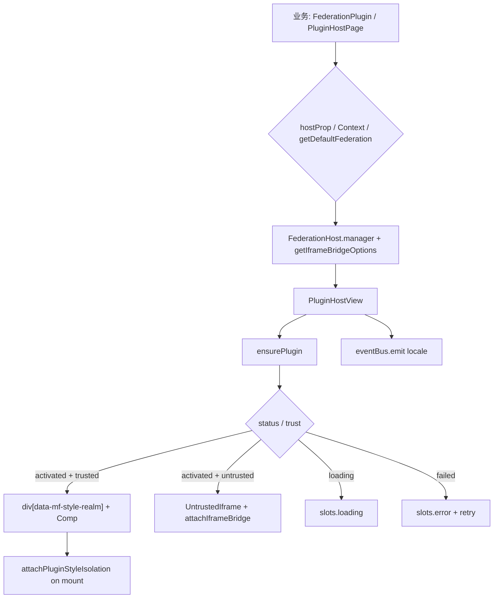

# React Host View（功能实现详解与复刻指南）

> **一句话**：用声明式 `<FederationPlugin />` / `PluginHostView` 把已加载的 MF 插件画进宿主页面，并处理加载中、失败、不信任 iframe、样式隔离与语种同步。  
> **入口**：业务页渲染 `<FederationPlugin name="…" />`，或本仓经 `@/federation` 的 `PluginHostPage` 间接调用。  
> **关联文件**：`packages/federation-kit/src/react/*`  
> **文档目标**：读懂 React 挂载层；按复刻手册可在其他 React 宿主落地等价视图。  
> **非目标**：不写 `createFederation` 启动细节、registry 拉取、样式隔离内部实现（见同目录其他篇）；不写本仓 design 包装（见 `05-host-adapter-frontend.md`）。

---

## 0. 先看这里（必填，一眼建立模型）

### 0.1 30 秒读懂

- **做什么**：解析「用哪个 FederationHost」→ 确保插件已激活 → 按 trust 渲染 React 组件或 sandbox iframe → 挂载时做样式隔离 → 用 slots 注入宿主 UI。
- **不做什么**：不拉 registry、不写账号偏好、不提供本仓 Loading/Button 皮肤（那是 slots / 适配层的事）。
- **关键角色**：
  - **界面层**：`FederationPlugin` / `PluginHostView` / slots
  - **状态层**：`busy` / `error` / `retryKey` + `PluginManager` 状态
  - **能力层**：`attachIframeBridge`、`attachPluginStyleIsolation`、`eventBus`、默认 `FederationHost`

### 0.2 功能点总表（必填）

| 编号 | 功能点（简述） | 用户可感知表现 | 关键实现位置（文件 → 符号） | 正文小节 |
|------|----------------|----------------|------------------------------|----------|
| F1 | 通过 Context 或默认单例拿到 Host | 未配置时报错；配置后能挂插件 | `FederationPlugin.tsx` → `FederationProvider` / `useFederation` | §4.1 |
| F2 | 声明式挂载插件（类 micro-app） | 页面出现插件内容 | `FederationPlugin.tsx` → `FederationPlugin` | §4.2 |
| F3 | 解析 locale 并随宿主切换 | 插件文案随语言变 | `FederationPlugin.tsx` → locale `useEffect` | §4.3 |
| F4 | 通用挂载视图：ensure + 状态机 | 先 loading，再内容或失败重试 | `PluginHostView.tsx` → `PluginHostView` | §4.4 |
| F5 | 信任插件：React 根 + 样式隔离 | 插件 UI 出现且 CSS 不污染宿主 | `PluginHostView.tsx` → `attachPluginStyleIsolation` | §4.5 |
| F6 | 不信任插件：sandbox iframe + bridge | iframe 内跑远程页，仍能调 Host API | `PluginHostView.tsx` → `UntrustedIframe` | §4.6 |
| F7 | slots 注入 loading / error / shell | 宿主可换成自己的 Loading/按钮 | `PluginHostView.tsx` → `PluginHostViewSlots` | §4.7 |
| F8 | 按 surface 列出宿主槽插件 | 顶栏/抽屉只显示该 surface 的插件 | `useHostSurfacePlugins.ts` | §4.8 |
| F9 | 订阅插件上架开关 | 下架后入口消失或提示已下架 | `usePluginEnabled.ts` | §4.9 |
| F10 | react 入口再导出 | 外部从 `@dnhyxc-ai/federation-kit/react` 导入 | `index.ts` | §4.10 |

### 0.3 架构一图（必填）



### 0.4 文件地图与建造顺序（必填）

| 建造序 | 文件 | 职责（一句话） | 依赖 |
|--------|------|----------------|------|
| 1 | `usePluginEnabled.ts` | 订阅上架偏好 | `enabledOverrides` |
| 2 | `useHostSurfacePlugins.ts` | 按 surface 列插件 | `hostSurface` + enabled |
| 3 | `PluginHostView.tsx` | 通用挂载视图 | manager / bridge / style-isolation |
| 4 | `FederationPlugin.tsx` | Provider + 声明式薄包装 | PluginHostView + createFederation |
| 5 | `index.ts` | 对外导出 | 1–4 |

---

## 1. 用户旅程

1. **进入**：宿主页渲染 `<FederationPlugin name="learningNotes" />`（或本仓 `PluginHostPage`）。组件先找 Host：显式 `host` → Context → 默认单例。
2. **主路径**：`PluginHostView` 调 `ensurePlugin`；成功后若信任则渲染插件默认导出组件，并在 layout 阶段挂上样式隔离；若不信任则开 sandbox iframe 并挂 postMessage bridge。
3. **分支**：加载中显示 slots.loading；失败显示 slots.error 与重试；缺 iframeUrl 显示 missingIframeUrl；语种变化经 `eventBus` 推给插件。
4. **离开**：卸载时取消 ensure、拆 bridge、拆样式隔离；组件树销毁。

---

## 2. 问题与解决方案总表（必填）

| 问题编号 | 现象 / 风险 | 根因 | 解决方案（本项目做法） | 对应功能点 |
|----------|---------------------|------|------------------------|------------|
| P1 | 多入口打包两份 kit，Context 对不上 | ESM 双份模块 | `getDefaultFederation` + `globalThis`；可显式传 `host` | F1, F2 |
| P2 | 首屏闪「不可用」 | ensure 前状态空 | 未 activated/failed 时默认 `busy` | F4 |
| P3 | 插件 CSS 污染宿主 | 同文档共享样式 | `attachPluginStyleIsolation` + `data-mf-style-realm` | F5 |
| P4 | 不可信远程代码直跑危险 | trust=untrusted | sandbox iframe + bridge RPC | F6 |
| P5 | kit 不想依赖宿主 UI 库 | 通用包 | slots 注入 loading/error/shell | F7 |
| P6 | 偏好未拉完就当「已下架」 | 异步 prefs | `ready` 标志 + `usePluginEnabledState` | F9 |

---

## 3. 实现思路总览（必填）

### 3.1 总体策略

把「拿 Host」和「画插件」拆开：`FederationPlugin` 只解析 Host / locale / iframe 选项，真正生命周期在 `PluginHostView`。UI 皮肤全部经 slots，kit 只给极简 fallback。默认 `asDefault: true` 的 `createFederation` 让声明式挂载无需 Provider（类 micro-app）。

### 3.2 数据流与控制流

- 输入：`pluginId`、`manager`、`locale`、`iframeBridge`、`slots`、`pageShell`、`variant`
- 核心状态：`busy`、`error`、`retryKey`、manager 上的 `LoadedPlugin`
- 主循环：`useEffect(ensure)` → 读 status → 分支渲染 → `useLayoutEffect(styleIsolation)` / `useEffect(locale emit)`
- 结束：卸载 cancel + cleanup 返回函数

### 3.3 模块职责

| 模块 | 谁调用我 | 我调用谁 |
|------|----------|----------|
| `FederationProvider` | 可选外包根 | React Context |
| `FederationPlugin` | 业务 / PluginHostPage | `useFederationSafe`、`PluginHostView` |
| `PluginHostView` | FederationPlugin | manager、bridge、style-isolation、eventBus |
| hooks | Surface / 业务页 | enabled / hostSurface |

---

## 4. 分功能点详解（必填，核心）

### 4.1 F1：Context / 默认单例解析 FederationHost

#### （1）功能说明

组件需要知道「用哪套插件运行时」。优先用 React Context；没有则用 `createFederation({ asDefault: true })` 登记的默认单例；都没有就抛错，避免静默失败。

#### （2）实现思路

`FederationContext` + `getDefaultFederation()` 双通道，兼容「根上包 Provider」与「全局单例」两种接入。

#### （3）问题与对策

对应 P1：跨入口双份打包时可显式传 `host` prop（见 F2）。

#### （4）实现过程

1. 建 Context。  
2. `FederationProvider` 注入 host。  
3. `useFederation` / `useFederationSafe` 解析。

#### （5）关键代码（逐行上方注释）

- **位置**：`packages/federation-kit/src/react/FederationPlugin.tsx` → Provider / hooks（约第 1–43、136–139 行）

```tsx
// 从 React 引入 Context、元素工厂、类型与常用 hooks
import {
	// 创建可跨树传递的 Context 对象
	createContext,
	// 不用 JSX 也能创建元素（便于库侧控制）
	createElement,
	// 子节点类型
	type ReactNode,
	// 读取 Context
	useContext,
	// 副作用
	useEffect,
	// 记忆化
	useMemo,
	// 本地状态
	useState,
// 标明来自 react 包
} from 'react';
// iframe bridge 选项类型
import type { AttachIframeBridgeOptions } from '../bridge/attachIframeBridge';
// Host 配置类型
import type { PluginHostConfig } from '../config/types';
// 默认单例与 Host 类型
import { type FederationHost, getDefaultFederation } from '../createFederation';
// 宿主语种类型
import type { HostLocale } from '../types';
// 挂载视图与相关类型
import {
	// manager 窄类型
	type PluginHostManager,
	// 真正渲染插件的视图
	PluginHostView,
	// 视图 props
	type PluginHostViewProps,
	// slots 类型
	type PluginHostViewSlots,
	// default | toolbar
	type PluginHostViewVariant,
// 来自同目录 PluginHostView
} from './PluginHostView';

// 存放当前 FederationHost；未包 Provider 时为 null
const FederationContext = createContext<FederationHost | null>(null);

// 可选：在树顶注入 Host，供子孙 useFederation
export function FederationProvider({
	// 要注入的 Host 实例
	host,
	// 子树
	children,
}: {
	// Host 必填
	host: FederationHost;
	// 子节点必填
	children: ReactNode;
}) {
	// 用 createElement 提供 Context.Provider，value 为 host
	return createElement(FederationContext.Provider, { value: host }, children);
}

// 强制取得 Host；没有就抛错
export function useFederation(): FederationHost {
	// 先读 Context
	const ctx = useContext(FederationContext);
	// Context 没有则回退默认单例
	const host = ctx ?? getDefaultFederation();
	// 仍没有：接入方未 createFederation / 未 Provider
	if (!host) {
		// 明确报错，避免后面 NPE
		throw new Error(
			'[federation-kit] 请先 createFederation() / <FederationProvider>，或 asDefault: true',
		);
	}
	// 返回可用 Host
	return host;
}

/** 可选：未配置时返回 null（给包装层 fallback） */
// 安全版：给包装层自行 fallback，不抛错
export function useFederationSafe(): FederationHost | null {
	// Context 优先，否则默认单例，都没有则 null
	return useContext(FederationContext) ?? getDefaultFederation();
}
```

#### （6）复刻提示

- 可原样搬迁：Context + 默认单例解析。  
- 必须替换：错误文案、是否强制 asDefault。  
- 最小验证：无 Host 时抛错；有默认单例时可渲染。

---

### 4.2 F2：声明式 `FederationPlugin`（≈ micro-app）

#### （1）功能说明

像写 `<micro-app name="xxx" />`：给插件 id，其余（manager、bridge）从 Host 取。也可显式传 `host`，避免双份打包。

#### （2）实现思路

薄包装：解析 id / variant / locale / bridge，再 `createElement(PluginHostView, …)`。

#### （3）问题与对策

对应 P1：`host` prop 覆盖 Context/默认。

#### （4）实现过程

1. 定义窄 `FederationPluginHost` 与 props。  
2. 解析 host 与 id。  
3. 算 variant（兼容旧 `part=toolbar`）。  
4. 交给 PluginHostView。

#### （5）关键代码（逐行上方注释）

- **位置**：同文件 → `FederationPlugin`（约第 45–134、141–142 行）

```tsx
/** 避免 PluginManager 私有字段导致的泛型不兼容 */
// 对外只暴露挂载所需字段，避免泛型 RouteConfig 冲突
export type FederationPluginHost = {
	// 插件管理器（get / ensurePlugin）
	manager: PluginHostManager;
	// 从完整 config 挑出 iframe 相关能力
	config: Pick<
		PluginHostConfig,
		'capabilities' | 'iframeChannel' | 'iframeRpcHandlers'
	>;
	// 生成 attachIframeBridge 所需选项
	getIframeBridgeOptions: () => AttachIframeBridgeOptions;
};

// FederationPlugin 的对外 props
export type FederationPluginProps = {
	/** 插件 id（与 registry 一致）；也可用 name */
	// 兼容 name
	name?: string;
	// 正式字段 pluginId
	pluginId?: string;
	// 根 className
	className?: string;
	// 是否走 shell slot（路由全页）
	pageShell?: boolean;
	// 紧凑态等
	variant?: PluginHostViewVariant;
	/** 兼容旧 part=toolbar */
	// 旧 API：toolbar 映射到 variant
	part?: 'toolbar' | 'drawer-triggers' | 'drawer';
	// UI 注入
	slots?: PluginHostViewSlots;
	// 强制语种
	locale?: HostLocale;
	// 错误边界组件
	ErrorBoundary?: PluginHostViewProps['ErrorBoundary'];
	/** 覆盖默认 host；跨入口双份打包时建议显式传入 */
	host?: FederationPluginHost;
};

/**
 * 声明式挂载（≈ `<micro-app name="xxx" />`）。
 * 依赖 `createFederation({ asDefault: true })` 或外包 `<FederationProvider>`。
 */
export function FederationPlugin({
	// 解构全部 props
	name,
	pluginId,
	className,
	pageShell,
	variant,
	part,
	slots,
	locale: localeProp,
	ErrorBoundary,
	host: hostProp,
}: FederationPluginProps) {
	// 安全取 Host（可能 null）
	const ctxHost = useFederationSafe();
	// 显式 host 优先
	const host = hostProp ?? ctxHost;
	// 没有 Host 无法挂载
	if (!host) {
		throw new Error(
			'[federation-kit] FederationPlugin 需要 createFederation() 或 FederationProvider',
		);
	}

	// pluginId 与 name 二选一
	const id = pluginId ?? name;
	// 都没给则报错
	if (!id) {
		throw new Error('[federation-kit] FederationPlugin 需要 name 或 pluginId');
	}

	// variant 优先；否则旧 part=toolbar → toolbar，其余 default
	const resolvedVariant: PluginHostViewVariant =
		variant ?? (part === 'toolbar' ? 'toolbar' : 'default');

	// 此处省略：locale state / effect 与 iframeBridge useMemo —— 见 §4.3

	// 创建 PluginHostView，把解析结果全部传入
	return createElement(PluginHostView, {
		pluginId: id,
		manager: host.manager,
		locale,
		iframeBridge,
		pageShell,
		variant: resolvedVariant,
		className,
		slots,
		ErrorBoundary,
	});
}

/** @deprecated 别名，更短 */
// 短别名，便于 <Plugin name="…" />
export const Plugin = FederationPlugin;
```

#### （6）复刻提示

- 可原样搬迁：props 解析与 createElement。  
- 本仓习惯：`PluginHostPage` 显式 `host={mf}`。  
- 最小验证：`<FederationPlugin name="…" />` 能进 loading。

---

### 4.3 F3：locale 解析与订阅

#### （1）功能说明

插件要知道当前中/英。可 props 固定；否则读 Host `getLocale`，并订阅 `onLocaleChange`。

#### （2）实现思路

`useState` 初值 + `useEffect` 订阅；props 有值则只跟 props。

#### （3）问题与对策

无独立踩坑；注意 effect 清理退订。

#### （4）实现过程

1. 初值：`localeProp ?? getLocale()`。  
2. props 有值则 set 并 return。  
3. 否则订阅 onLocaleChange。

#### （5）关键代码（逐行上方注释）

```tsx
// locale 本地状态：初值优先 props，否则 capabilities.getLocale
const [locale, setLocale] = useState<HostLocale>(
	() => localeProp ?? host.config.capabilities.getLocale(),
);

// 跟随 props 或宿主语种变化
useEffect(() => {
	// 外层强制 locale 时只同步 props
	if (localeProp) {
		setLocale(localeProp);
		return;
	}
	// 先刷一次当前语种
	setLocale(host.config.capabilities.getLocale());
	// 订阅后续变化；返回 cleanup
	return host.config.capabilities.onLocaleChange?.((next) => {
		setLocale(next);
	});
	// 依赖 host 与 localeProp
}, [host, localeProp]);

// 记忆 iframe bridge 选项，避免无谓重挂 bridge
const iframeBridge: AttachIframeBridgeOptions = useMemo(
	() => host.getIframeBridgeOptions(),
	[host],
);
```

#### （6）复刻提示

- 宿主须实现 `getLocale` / 可选 `onLocaleChange`。  
- 最小验证：切语言后插件收到更新（见 F5 的 eventBus）。

---

### 4.4 F4：`PluginHostView` ensure + 状态机

#### （1）功能说明

视图挂上后确保插件加载。加载中显示 loading；失败可重试；已激活则渲染内容。故意：ensure 完成前不把「未加载」当成不可用。

#### （2）实现思路

`retryKey` 驱动重试；`busy` 默认 true（除非已 activated/failed）；`bump` 强制在 manager 就地更新后重渲染。

#### （3）问题与对策

对应 P2。

#### （4）实现过程

1. 初始化 busy/error。  
2. effect 内 ensurePlugin。  
3. 按 status 分支渲染。

#### （5a）类型、辅助、状态与 ensure（逐行上方注释）

- **位置**：`PluginHostView.tsx`（约第 1–168 行）

```tsx
// React 类型与 hooks
import {
	type ComponentType,
	type ReactNode,
	useEffect,
	useLayoutEffect,
	useMemo,
	useRef,
	useState,
} from 'react';
// iframe bridge API
import {
	type AttachIframeBridgeOptions,
	attachIframeBridge,
} from '../bridge/attachIframeBridge';
// 向插件推事件（如 locale）
import { eventBus } from '../host-api/EventBus';
// PluginManager 类型
import type { PluginManager } from '../runtime/createPluginRuntime';
// 样式隔离挂载与 realm key
import { attachPluginStyleIsolation, styleRealmKey } from '../style-isolation';
// 桥 props、语种、已加载插件类型
import type { HostBridgeProps, HostLocale, LoadedPlugin } from '../types';

/** 避免 Host 侧 `PluginManager<RouteConfig>` 与默认泛型声明冲突 */
// 只 Pick get / ensurePlugin，避开泛型冲突
export type PluginHostManager = Pick<PluginManager, 'get' | 'ensurePlugin'>;

// 视图变体：影响 slots 展示
export type PluginHostViewVariant = 'default' | 'toolbar';

// slots：宿主注入 UI
export type PluginHostViewSlots = {
	// 加载中
	loading?: (ctx: {
		pluginId: string;
		variant: PluginHostViewVariant;
	}) => ReactNode;
	// 失败 + 重试
	error?: (ctx: {
		pluginId: string;
		error: string;
		retry: () => void;
		busy: boolean;
		variant: PluginHostViewVariant;
	}) => ReactNode;
	// 不信任但缺 iframeUrl
	missingIframeUrl?: (ctx: { pluginId: string }) => ReactNode;
	// 路由页外壳
	shell?: (node: ReactNode) => ReactNode;
	/** 挂到插件根节点的额外 className */
	rootClassName?: string;
};

// 视图 props
export type PluginHostViewProps = {
	pluginId: string;
	manager: PluginHostManager;
	locale: HostLocale;
	iframeBridge: AttachIframeBridgeOptions;
	pageShell?: boolean;
	/** toolbar 紧凑态；影响 loading/error slots 的 variant */
	variant?: PluginHostViewVariant;
	className?: string;
	slots?: PluginHostViewSlots;
	ErrorBoundary?: ComponentType<{
		pluginId: string;
		children: ReactNode;
	}>;
};

// 把最新 locale 写进 bridge.api，避免插件读到过期语种
function withLiveLocale(
	bridge: HostBridgeProps,
	locale: HostLocale,
): HostBridgeProps {
	return {
		...bridge,
		api: {
			...bridge.api,
			locale,
		},
	};
}

// 主视图组件
export function PluginHostView({
	pluginId,
	manager,
	locale,
	iframeBridge,
	pageShell,
	variant = 'default',
	className,
	slots,
	ErrorBoundary,
}: PluginHostViewProps) {
	// 每次 +1 触发强制重试 ensure
	const [retryKey, setRetryKey] = useState(0);
	// 未 activated / failed 时默认 busy，避免首屏在 ensurePlugin 前闪「不可用」
	const [busy, setBusy] = useState(() => {
		const s = manager.get(pluginId)?.status;
		return s !== 'activated' && s !== 'failed';
	});
	// 若已是 failed，带上错误文案
	const [error, setError] = useState<string | null>(() => {
		const cur = manager.get(pluginId);
		return cur?.status === 'failed' ? (cur.error ?? null) : null;
	});
	// 哑 bump：ensure 成功后 manager 就地改对象，靠 bump 触发重渲染
	const [, bump] = useState(0);

	// 主加载 effect
	useEffect(() => {
		let cancelled = false;
		(async () => {
			const cur = manager.get(pluginId);
			// 已激活：清 busy/error 并 bump
			if (cur?.status === 'activated') {
				setBusy(false);
				setError(null);
				bump((n) => n + 1);
				return;
			}
			// 首次进入且已 failed：展示错误，不自动再 ensure
			if (cur?.status === 'failed' && retryKey === 0) {
				setError(cur.error ?? null);
				setBusy(false);
				return;
			}

			setBusy(true);
			setError(null);
			try {
				// retryKey>0 时 force 重载
				await manager.ensurePlugin(pluginId, { force: retryKey > 0 });
			} catch (e) {
				if (!cancelled) {
					setError(e instanceof Error ? e.message : String(e));
				}
			} finally {
				if (!cancelled) {
					setBusy(false);
					bump((n) => n + 1);
				}
			}
		})();
		return () => {
			cancelled = true;
		};
	}, [pluginId, retryKey, manager]);

	// 此处省略：activated / loading / error 渲染分支 —— 见 §4.5–§4.7
}
```

#### （6）复刻提示

- 务必保留「默认 busy」与「not loaded ≠ failed」。  
- 最小验证：冷启动先看到 loading，再看到内容。

---

### 4.5 F5：信任插件根节点 + `attachPluginStyleIsolation`

#### （1）功能说明

信任插件在宿主 React 树里渲染。根节点打上 `data-mf-plugin` / `data-mf-style-realm`；激活后在 `useLayoutEffect` 里挂样式隔离，绘制前尽量完成，减少闪烁。

#### （2）实现思路

仅 `status===activated` 且非 untrusted 时 attach；cleanup 由 attach 返回。另用 eventBus 推 locale。

#### （3）问题与对策

对应 P3。

#### （4）实现过程

1. 读 loaded meta。  
2. layout effect 挂隔离。  
3. effect 发 locale。  
4. 渲染 Comp + liveBridge。

#### （5）关键代码（逐行上方注释）

```tsx
	// 从 manager 取当前加载结果
	const loaded: LoadedPlugin | undefined = manager.get(pluginId);
	const entry = loaded?.meta.entry;
	const trust = loaded?.meta.trust;
	const status = loaded?.status;

	// 绘制前挂样式隔离（仅信任插件）
	useLayoutEffect(() => {
		if (status !== 'activated' || trust === 'untrusted' || !entry) return;
		return attachPluginStyleIsolation(pluginId, entry, loaded?.meta.remoteName);
	}, [pluginId, status, entry, trust, loaded?.meta.remoteName]);

	// 激活后把 locale 推给插件运行时
	useEffect(() => {
		if (status !== 'activated') return;
		eventBus.emit(pluginId, 'locale', locale);
	}, [pluginId, status, locale]);

	// bridge + 最新 locale
	const liveBridge = useMemo(
		() => (loaded?.bridge ? withLiveLocale(loaded.bridge, locale) : null),
		[loaded?.bridge, locale],
	);

	// pageShell 时经 shell slot 包一层
	const wrap = (node: ReactNode) => {
		const inner = pageShell && slots?.shell ? slots.shell(node) : node;
		return inner;
	};

	const Bound = ErrorBoundary;

	// …… untrusted 分支见 §4.6 ……

		if (!liveBridge) return null;
		// 插件默认导出组件
		const Comp = loaded.mod.default;
		// 样式 realm key（与隔离一致）
		const realm = styleRealmKey(
			loaded.meta.entry,
			loaded.meta.remoteName,
			pluginId,
		);
		const body = (
			<div
				className={[
					slots?.rootClassName,
					className,
					`plugin-${pluginId}`,
					'h-full w-full min-h-0',
				]
					.filter(Boolean)
					.join(' ')}
				data-mf-plugin={pluginId}
				data-mf-style-realm={realm}
				data-plugin-root
			>
				<Comp {...liveBridge} />
			</div>
		);
		return wrap(Bound ? <Bound pluginId={pluginId}>{body}</Bound> : body);
```

#### （6）复刻提示

- 根节点必须带 realm 属性，否则隔离对不上。  
- 最小验证：插件样式不改宿主按钮颜色。

---

### 4.6 F6：不信任插件 — `UntrustedIframe`

#### （1）功能说明

`trust=untrusted` 时不把远程 JS 跑进宿主。用 sandbox iframe 打开 `iframeUrl`，再 `attachIframeBridge` 做受限通信。

#### （2）实现思路

独立小组件：ref + effect 里按 src 算 origin 再挂 bridge；缺 url 走 missingIframeUrl slot。

#### （3）问题与对策

对应 P4。

#### （4）实现过程

1. 校验 iframeUrl。  
2. 渲染 iframe（sandbox 白名单）。  
3. effect 挂 bridge 并 cleanup。

#### （5）关键代码（逐行上方注释）

```tsx
function UntrustedIframe({
	pluginId,
	src,
	bridge,
	iframeBridge,
}: {
	pluginId: string;
	src: string;
	bridge: HostBridgeProps;
	iframeBridge: AttachIframeBridgeOptions;
}) {
	const iframeRef = useRef<HTMLIFrameElement>(null);

	useEffect(() => {
		const el = iframeRef.current;
		if (!el) return;
		let origin: string;
		try {
			origin = new URL(src).origin;
		} catch {
			return;
		}
		return attachIframeBridge(el, bridge, origin, iframeBridge);
	}, [src, bridge, iframeBridge]);

	return (
		<iframe
			ref={iframeRef}
			title={pluginId}
			src={src}
			className="h-full w-full border-0"
			data-mf-plugin={pluginId}
			data-mf-trust="untrusted"
			sandbox="allow-scripts allow-same-origin allow-forms allow-popups"
		/>
	);
}

// 在 PluginHostView activated 分支：
	if (loaded?.status === 'activated') {
		if (loaded.meta.trust === 'untrusted') {
			const src = loaded.meta.iframeUrl?.trim();
			if (!src) {
				return wrap(
					slots?.missingIframeUrl?.({ pluginId }) ?? (
						<div>missing iframeUrl: {pluginId}</div>
					),
				);
			}
			const body = (
				<UntrustedIframe
					pluginId={pluginId}
					src={src}
					bridge={loaded.bridge}
					iframeBridge={iframeBridge}
				/>
			);
			return wrap(Bound ? <Bound pluginId={pluginId}>{body}</Bound> : body);
		}
		// …… trusted 见 §4.5 ……
	}
```

#### （6）复刻提示

- sandbox 权限按产品收紧；改权限要同步安全评审。  
- 最小验证：untrusted 插件在 iframe 内，且能调通一条 RPC。

---

### 4.7 F7：slots（loading / error / shell）

#### （1）功能说明

kit 不绑宿主 UI。loading、error、外壳、缺 iframeUrl 都可注入；不传则用纯文本 fallback。

#### （2）实现思路

`wrap` 处理 shell；失败分支提供 `retry: () => setRetryKey(n+1)`。

#### （3）问题与对策

对应 P5。

#### （4）实现过程

1. busy/loading → loading slot。  
2. failed → error slot + retry。  
3. pageShell → shell。

#### （5）关键代码（逐行上方注释）

```tsx
	const failed = Boolean(error) || loaded?.status === 'failed';
	// 尚未 ensure / 加载中：一律 Loading，勿把「not loaded」当成不可用
	if (busy || loaded?.status === 'loading' || !failed) {
		return wrap(
			slots?.loading?.({ pluginId, variant }) ?? <div>loading {pluginId}…</div>,
		);
	}

	const detail = error || loaded?.error || 'failed';

	return wrap(
		slots?.error?.({
			pluginId,
			error: detail,
			busy,
			retry: () => setRetryKey((n) => n + 1),
			variant,
		}) ?? (
			<div>
				unavailable {pluginId}: {detail}
				<button type="button" onClick={() => setRetryKey((n) => n + 1)}>
					retry
				</button>
			</div>
		),
	);
```

#### （6）复刻提示

- 本仓 `PluginHostPage` 是 slots 范例（见 05 篇）。  
- 最小验证：断网失败后点 retry 会重新 ensure。

---

### 4.8 F8：`useHostSurfacePlugins`

#### （1）功能说明

按 surface（如 `ebook.read`）列出应出现在该槽的插件，并在上架偏好变化时刷新。

#### （2）实现思路

初值 `listHostSurfacePlugins`；订阅 `subscribePluginEnabled`。

#### （3）问题与对策

无；注意 surface 变了要重订。

#### （4）实现过程

1. useState 初值。  
2. effect sync + subscribe。

#### （5）完整源码（逐行上方注释）

- **位置**：`useHostSurfacePlugins.ts`

```ts
// React hooks
import { useEffect, useState } from 'react';
// 上架偏好变化订阅
import { subscribePluginEnabled } from '../enabled/enabledOverrides';
// 按 surface 过滤插件列表
import {
	listHostSurfacePlugins,
	type PluginHostSurface,
} from '../enabled/hostSurface';
// 插件描述符类型
import type { PluginDescriptor } from '../types';

// 返回当前 surface 应展示的插件数组
export function useHostSurfacePlugins(
	surface: PluginHostSurface,
): PluginDescriptor[] {
	// 同步初值，避免首帧空列表闪烁
	const [plugins, setPlugins] = useState(() => listHostSurfacePlugins(surface));

	useEffect(() => {
		// 拉最新列表
		const sync = () => setPlugins(listHostSurfacePlugins(surface));
		sync();
		// 偏好变化时再 sync；返回退订
		return subscribePluginEnabled(sync);
	}, [surface]);

	return plugins;
}
```

#### （6）复刻提示

- surface 字符串须与 registry `host.surface` 一致。  
- 最小验证：下架后该 surface 列表变短。

---

### 4.9 F9：`usePluginEnabled` / `usePluginEnabledState`

#### （1）功能说明

查插件是否上架。`ready=false` 表示偏好未拉完，业务勿显示「已下架」。

#### （2）实现思路

状态含 `enabled`+`ready`；订阅同一 notify 总线。

#### （3）问题与对策

对应 P6。

#### （4）实现过程

1. 初值读同步 API。  
2. 订阅刷新。  
3. 简版 hook 只返回 boolean。

#### （5）完整源码（逐行上方注释）

```ts
import { useEffect, useState } from 'react';
import {
	isEnabledPrefsReady,
	isPluginEnabled,
	subscribePluginEnabled,
} from '../enabled/enabledOverrides';

export type PluginEnabledState = {
	enabled: boolean;
	/** false：偏好尚未拉取，勿展示「已下架」 */
	ready: boolean;
};

export function usePluginEnabledState(pluginId: string): PluginEnabledState {
	const [state, setState] = useState<PluginEnabledState>(() => ({
		enabled: isPluginEnabled(pluginId),
		ready: isEnabledPrefsReady(),
	}));

	useEffect(() => {
		const sync = () =>
			setState({
				enabled: isPluginEnabled(pluginId),
				ready: isEnabledPrefsReady(),
			});
		sync();
		return subscribePluginEnabled(sync);
	}, [pluginId]);

	return state;
}

export function usePluginEnabled(pluginId: string): boolean {
	return usePluginEnabledState(pluginId).enabled;
}
```

#### （6）复刻提示

- 业务应用 `ready`（见英语学习笔记页）。  
- 最小验证：未登录/未拉取时不误显示已下架。

---

### 4.10 F10：`react/index.ts` 再导出

#### （1）功能说明

统一 `@dnhyxc-ai/federation-kit/react` 入口，并附带 Vue bridge 相关类型方便混用。

#### （2）实现思路

纯 re-export，无逻辑。

#### （3）问题与对策

无。

#### （4）实现过程

按模块导出类型与符号。

#### （5）完整源码（逐行上方注释）

```ts
// 再导出 Vue 远程相关类型（便于同一入口）
export type {
	VuePluginRootProps,
	VueRemoteExpose,
	VueRemoteMount,
} from '../bridge/createVueHostBridge';
// Vue bridge 工厂
export { createVueHostBridge } from '../bridge/createVueHostBridge';
// 声明式挂载与 Provider / hooks
export {
	FederationPlugin,
	type FederationPluginHost,
	type FederationPluginProps,
	FederationProvider,
	Plugin,
	useFederation,
	useFederationSafe,
} from './FederationPlugin';
// 底层视图与类型
export {
	type PluginHostManager,
	PluginHostView,
	type PluginHostViewProps,
	type PluginHostViewSlots,
	type PluginHostViewVariant,
} from './PluginHostView';
// surface 列表 hook
export { useHostSurfacePlugins } from './useHostSurfacePlugins';
// 上架状态 hooks
export {
	type PluginEnabledState,
	usePluginEnabled,
	usePluginEnabledState,
} from './usePluginEnabled';
```

#### （6）复刻提示

- package.json `exports["./react"]` 指到此入口。  
- 本仓业务勿直接依赖该路径，应走 `@/federation`（见 05 篇）。

---

## 5. 跨项目复刻手册（必填）

### 5.1 前置条件

- React 18+  
- 已 `createFederation`（建议 `asDefault: true`）且 `await mf.start()`  
- 插件在 registry 中且可 ensure  

### 5.2 推荐建造顺序

1. **Step 1 — hooks**：搬 `usePluginEnabled*` / `useHostSurfacePlugins`；验收：订阅能刷新。  
2. **Step 2 — PluginHostView**：ensure + 三态 + iframe + 样式隔离；验收：信任插件可渲染。  
3. **Step 3 — FederationPlugin**：Provider + 声明式；验收：`<Plugin name />` 可挂。  
4. **Step 4 — slots**：换成项目 Loading/Error；验收：失败 UI 为项目皮肤。  
5. **Step 5 — index 导出**。

### 5.3 最小可运行切片（MVP）

- 必做：F1、F2、F4、F5  
- 增强：F6 iframe、F7 精美 slots、F8/F9 surface/上架  

### 5.4 平台差异清单

| 本项目用法 | 可移植抽象 | 其他项目常见替身 |
|------------|------------|------------------|
| `getDefaultFederation` | 全局 Host 单例 | DI / Zustand 存 host |
| `attachPluginStyleIsolation` | 挂载时 CSS 隔离 | Shadow DOM / iframe 全量 |
| slots | UI 注入点 | render props / 主题包 |
| sandbox iframe | 不信任执行 | 仅信任插件 / Web Worker |

### 5.5 验收用例（对应功能点）

- [ ] F1：无 Host 抛错；有默认单例可渲染  
- [ ] F2：`<FederationPlugin name="…" />` 出内容  
- [ ] F3：切语言插件收到 locale  
- [ ] F4：冷启动先 loading；失败可 retry  
- [ ] F5：样式不泄漏；有 data-mf-style-realm  
- [ ] F6：untrusted 走 iframe + bridge  
- [ ] F7：自定义 slots 生效  
- [ ] F8：surface 过滤正确  
- [ ] F9：ready 前不显示已下架  
- [ ] F10：从 `/react` 可导入  

### 5.6 常见移植失误

1. 忘记 asDefault 又没 Provider → 运行时抛错。  
2. 双份打包未传 `host` → 挂到空 manager。  
3. 把 not-loaded 当 failed → 闪「不可用」。  
4. 信任插件未 attach 隔离 → CSS 互污染。  
5. untrusted 未配 iframeUrl → 空白/缺省文案。  
6. 忽略 `ready` → 误显已下架。  

---

## 6. 验证要点（建议）

- [ ] 主路径：信任插件全页挂载  
- [ ] 边界：toolbar variant、pageShell  
- [ ] 失败与重试  
- [ ] 与宿主页并存：样式、全屏、抽屉  

---

## 7. 影响与边界（必填）

### 7.1 对本项目其他功能的影响

- **是否影响已有功能点**：局部 — 所有插件挂载 UI 经此层。  
- **是否影响既有正常逻辑**：否（纯展示层）— 不改 registry/业务 API。  

### 7.2 影响点明细

| # | 对象 | 方式 | 程度 | 说明与回归 |
|---|------|------|------|------------|
| 1 | 路由插件页 | 渲染 | 高 | 回归 ensure / loading / retry |
| 2 | ebook surface | 渲染 | 高 | toolbar / drawer |
| 3 | 样式隔离 | mount | 高 | 进页无闪、退页无残留 |
| 4 | iframe 插件 | 通信 | 中 | RPC 仍通 |

### 7.3 文档范围外的相邻能力

`createFederation`、registry、enabled 存储、style-isolation 内部、本仓 `PluginHostPage` / `PluginHostSurface` 见其他文档（含 `05-host-adapter-frontend.md`）。
