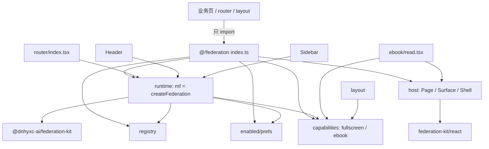

# 本仓 Host 适配层（功能实现详解与复刻指南）

> **一句话**：把 `@dnhyxc-ai/federation-kit` 接到本仓产品能力（Toast、COS registry、账号偏好、ebook、全屏、design slots），并规定业务**只从 `@/federation` 导入**。  
> **入口**：`apps/frontend/src/federation/index.ts`；路由启动 `mf.start()`；页面用 `PluginHostPage` / `PluginHostSurface`。  
> **关联文件**：`apps/frontend/src/federation/**`，及 router / Header / Sidebar / ebook / layout 等消费点。  
> **文档目标**：读懂适配层如何接线；按复刻手册在其他宿主项目建等价「薄适配层」。  
> **非目标**：不重写 kit 内核（见 `04-react-host-view.md` 等）；不整文件复述 Header/Sidebar/ebook（只引用调用点）。

**约定（必须遵守）**：业务代码只 `import { … } from '@/federation'`，**不要**在业务侧直接写 `@dnhyxc-ai/federation-kit`。适配层内部可以依赖 kit；对外再导出常用符号。

---

## 0. 先看这里（必填，一眼建立模型）

### 0.1 30 秒读懂

- **做什么**：`createFederation` 注入本仓能力 → registry/偏好读写 → design 皮肤包装 `FederationPlugin` → ebook/全屏等产品 API。
- **不做什么**：不实现 MF 加载器本身；不在业务页散落 kit 导入。
- **关键角色**：
  - **门面**：`index.ts` / `runtime/`
  - **数据**：`registry/` + `enabled/prefs`
  - **UI 模版**：`host/*`
  - **产品能力**：`capabilities/*`
  - **消费方**：router、Header、Sidebar、layout、ebook、英语笔记

### 0.2 功能点总表（必填）

| 编号 | 功能点（简述） | 用户可感知表现 | 关键实现位置 | 正文小节 |
|------|----------------|----------------|-------------|----------|
| F1 | `@/federation` 统一出口 | 业务一处 import | `index.ts` | §4.1 |
| F2 | `createFederation` 本仓门面 `mf` | 启动后插件路由/侧栏可用 | `runtime/index.ts` | §4.2 |
| F3 | COS/本地 registry 拉取与落盘 | 插件列表最新 | `registry/index.ts` | §4.3 |
| F4 | 账号上架偏好 | 下架后入口消失 | `enabled/prefs.ts` | §4.4 |
| F5 | `PluginHostPage` design slots | 本仓 Loading/错误/外壳 | `host/PluginHostPage.tsx` | §4.5 |
| F6 | `PluginHostSurface` 槽模版 | ebook 顶栏/抽屉插件 | `host/PluginHostSurface.tsx` | §4.6 |
| F7 | `PluginPageShell` 路由外壳 | 全页边距；影院态收边 | `host/PluginPageShell.tsx` | §4.7 |
| F8 | `PluginErrorBoundary` | 插件崩溃不拖垮宿主 | `host/PluginErrorBoundary.tsx` | §4.8 |
| F9 | 应用级影院全屏 | 藏侧栏/顶栏；Tauri/Web 全屏 | `capabilities/appFullscreen.ts` | §4.9 |
| F10 | ebook Host API 可变绑定 | 插件能跳 CFI / 开想法 | `capabilities/ebookHostApi.ts` | §4.10 |
| F11 | 消费方接线（router 等） | 启动、导航、槽位、笔记页 | 多文件调用点 | §4.11 |
| F12 | 动态插件 SVG 图标 | 侧栏/Surface 自定义图标跟选中色 | `host/PluginIcon*` | [09](./09-plugin-host-icons.md) |

### 0.3 架构一图（必填）



### 0.4 文件地图与建造顺序（必填）

| 建造序 | 文件 | 职责（一句话） | 依赖 |
|--------|------|----------------|------|
| 1 | `capabilities/appFullscreen.ts` | 影院态总线 | 运行时检测 |
| 2 | `capabilities/ebookHostApi.ts` | ebook 可变 handlers | 无 |
| 3 | `enabled/prefs.ts` | 账号偏好缓存 | service + kit notify |
| 4 | `registry/index.ts` | registry 拉存 | prefs + upload |
| 5 | `runtime/index.ts` | createFederation 门面 | 1–4 |
| 6 | `host/PluginErrorBoundary.tsx` | 错误边界 | i18n |
| 7 | `host/PluginPageShell.tsx` | 路由外壳 | fullscreen |
| 8 | `host/PluginHostPage.tsx` | design slots + 注册路由页 | runtime + shell |
| 9 | `host/PluginHostSurface.tsx` | surface 槽模版 | Page + kit hooks |
| 9b | `host/PluginIcon.tsx` + `pluginIconUrl.ts` | 动态 SVG 图标 | 见 [09](./09-plugin-host-icons.md) |
| 10 | `index.ts` | 再导出 | 全部 |
| 11 | 消费方接线 | router/Header/… | 10 |

---

## 1. 用户旅程

1. **进入**：App 路由 `mf.start()` 拉 registry、灌偏好、挂动态路由/侧栏。
2. **主路径**：打开插件路由 → `createPluginRoute` 渲染已注册的 `PluginHostPage` → slots 显示本仓 Loading → `FederationPlugin` 挂内容。ebook 阅读页用 `PluginHostSurface` 出触发器/toolbar/抽屉，并用 `setEbookHostHandlers` 绑书本能力。
3. **分支**：下架则 `usePluginEnabled` 隐藏入口；偏好未就绪不显示「已下架」；插件调全屏 → layout 藏壳；插件崩溃被 ErrorBoundary 接住。
4. **离开**：登出清偏好缓存；离开 ebook 置 `setEbookHostHandlers(null)`。

---

## 2. 问题与解决方案总表（必填）

| 问题编号 | 现象 / 风险 | 根因 | 解决方案 | 对应功能点 |
|----------|-------------|------|----------|------------|
| P1 | 业务到处 import kit，升级难 | 无门面 | `@/federation` 再导出 | F1 |
| P2 | kit 不知 Toast/COS/i18n | 通用包 | runtime capabilities 注入 | F2 |
| P3 | registry CDN 缓存旧 | 强缓存 | force bust + localStorage 兜底 | F3 |
| P4 | 未登录/未拉完当已下架 | 异步 | prefsReady + ensure | F4 |
| P5 | 每页重写 Loading/Drawer | 重复 | Page / Surface 模版 | F5, F6 |
| P6 | 圆角+overflow 废 backdrop-filter | Chromium | Shell 不写 overflow-hidden 于圆角层 | F7 |
| P7 | bridge 冻结后 ebook 仍要最新书 | 冻结 API | handlers 可变间接层 | F10 |
| P8 | 动态路由闪 404 | start 异步 | pluginsReady 占位 | F11 |

---

## 3. 实现思路总览（必填）

### 3.1 总体策略

适配层 =「产品差异集中地」。kit 保持可移植；本仓把 http、Toast、registry URL、偏好、ebook、全屏、design 组件全部塞进 `federation/`，业务只认一个别名。

### 3.2 数据流与控制流

`mf.start()` → `fetchPluginRegistry` + `enabledStore.load` → injectors 更新 → router `onRoutesChange` 重建 → 页面 `PluginHostPage`/`Surface` → kit `FederationPlugin`。

### 3.3 模块职责

| 模块 | 谁调用我 | 我调用谁 |
|------|----------|----------|
| `index.ts` | 全业务 | 子目录 + kit |
| `runtime` | router / Page | kit createFederation |
| `registry` | runtime / 管理页 | fetch / upload |
| `prefs` | runtime / user store | 账号 API |
| `host/*` | 业务页 / 路由 | kit/react + design |
| `capabilities` | runtime / layout / ebook | DOM / Tauri / 可变 handlers |

---

## 4. 分功能点详解（必填，核心）

### 4.1 F1：`index.ts` 统一出口

#### （1）功能说明

所有微前端相关符号从这里出去，并写明「业务勿直连 kit」。

#### （2）实现思路

再导出 kit 常用符号 + 本仓子模块。

#### （3）问题与对策

对应 P1。

#### （4）实现过程

分组 export：kit 核心 → kit/react → capabilities → prefs → host → registry → runtime。

#### （5）完整源码（逐行上方注释）

- **位置**：`apps/frontend/src/federation/index.ts`

```ts
/**
 * 本仓微前端 Host 适配：业务侧只从这里导入。
 * 勿在业务代码直接写 `@dnhyxc-ai/federation-kit`（本文件再导出常用符号）。
 *
 * 目录：
 * - runtime/       createFederation 门面（mf / pluginManager）
 * - registry/      COS registry 拉取与落盘
 * - enabled/       账号上架偏好
 * - host/          统一挂载模版（Page / Surface / Shell）
 * - capabilities/  产品能力（全屏、ebook API）
 */

// 从 kit 主入口再导出运行时常用工具与类型
export {
	// Portal 目标占用（抽屉打开前）
	claimPluginPortalTarget,
	// 释放 Portal 占用
	clearPluginPortalClaim,
	// Host HTTP 客户端类型
	type HostHttpClient,
	// 偏好是否已就绪
	isEnabledPrefsReady,
	// 某插件是否上架
	isPluginEnabled,
	// 按 surface 列插件
	listHostSurfacePlugins,
	// 通知偏好变更
	notifyPluginEnabled,
	// 插件描述符
	type PluginDescriptor,
	// registry 结构
	type PluginRegistry,
	// 多语言 title 选取
	pickPluginLocaleText,
	// 样式 realm key
	styleRealmKey,
	// 订阅偏好变更
	subscribePluginEnabled,
} from '@dnhyxc-ai/federation-kit';
// 从 kit/react 再导出声明式挂载与 hooks
export {
	FederationPlugin,
	type FederationPluginProps,
	type PluginEnabledState,
	type PluginHostViewSlots,
	type PluginHostViewVariant,
	useHostSurfacePlugins,
	usePluginEnabled,
	usePluginEnabledState,
} from '@dnhyxc-ai/federation-kit/react';

// 本仓：影院全屏
export {
	APP_FULLSCREEN_EVENT,
	getAppFullscreen,
	setAppFullscreen,
	subscribeAppFullscreen,
} from './capabilities/appFullscreen';
// 本仓：ebook 模块 API
export {
	createEbookModulesApi,
	type EbookHostHandlers,
	type EbookHostThought,
	getEbookHostHandlers,
	setEbookHostHandlers,
} from './capabilities/ebookHostApi';
// 本仓：账号偏好
export {
	arePluginEnabledPrefsReady,
	clearPluginEnabledPrefsCache,
	ensurePluginEnabledPrefsLoaded,
	getPluginEnabledPref,
	prefetchPluginEnabledPrefs,
	setPluginEnabledPref,
} from './enabled/prefs';
// 本仓：host UI 模版
export { PluginErrorBoundary } from './host/PluginErrorBoundary';
export { PluginHostPage } from './host/PluginHostPage';
export {
	PluginHostSurface,
	type PluginHostSurfacePart,
	type PluginHostSurfaceProps,
} from './host/PluginHostSurface';
export { PluginIcon, type PluginIconProps } from './host/PluginIcon';
export {
	applyPluginIconUrl,
	type HostSvgParts,
	isPluginIconUrl,
	isThemeablePaint,
	normalizeSvgForHostIcon,
	type PluginIconKind,
	type PluginIconTheme,
} from './host/pluginIconUrl';
export { PluginPageShell } from './host/PluginPageShell';
// 本仓：registry
export {
	assertRegistryHostApiCompatible,
	clearPluginRegistryCache,
	fetchPluginRegistry,
	fetchPluginRegistryRawText,
	formatRegistryUpdatedAt,
	overlayUserEnabled,
	PLUGIN_REGISTRY_CACHE_KEY,
	PLUGIN_REGISTRY_FILENAME,
	PLUGIN_REGISTRY_STATIC_PATH,
	persistPluginEnabled,
	savePluginRegistry,
} from './registry';
// 本仓：运行时门面
export {
	appRuntime,
	getAppIframeBridgeOptions,
	HOST_API_VERSION,
	mf,
	pluginManager,
	routeInjector,
	sidebarInjector,
	startFederation,
} from './runtime';
```

#### （6）复刻提示

- 其他项目可建 `src/federation/index.ts` 同样再导出。  
- 最小验证：业务 grep 无直接 `@dnhyxc-ai/federation-kit`（适配层除外）。

---

### 4.2 F2：`runtime/index.ts` — `mf = createFederation`

#### （1）功能说明

本仓唯一 `createFederation` 调用点：注入版本、registry、偏好、样式隔离标记、Toast、http、全屏、ebook、iframe RPC 等。

#### （2）实现思路

产品差异全集中此文件；导出 `mf` / injectors；`registerPluginHostPage` 供路由工厂懒绑 Page。

#### （3）问题与对策

对应 P2。

#### （4）实现过程

1. 读 theme/locale。  
2. `createPluginRoute` 用已注册 hostPage。  
3. `createFederation({…})`。  
4. 导出别名。

#### （5）完整源码（逐行上方注释）

- **位置**：`apps/frontend/src/federation/runtime/index.ts`

```ts
/**
 * 本仓微前端门面：基于 createFederation（主流 start + <Plugin />）。
 * 产品差异（Toast / COS / ebook / 偏好）集中在此文件。
 */
// kit：创建门面与类型
import {
	createFederation,
	DEFAULT_HOST_THEME_CUSTOM_PROP,
	type HostHttpClient,
	type PluginDescriptor,
} from '@dnhyxc-ai/federation-kit';
// 本仓 Toast
import { Toast } from '@ui/sonner';
// React 元素工厂（路由 Component）
import { type ComponentType, createElement } from 'react';
// 语种
import { getActiveLocale, type Locale, translateSync } from '@/i18n';
// 路由配置类型
import type { RouteConfig } from '@/router/routes';
// 下载与事件
import { downloadBlob, isTauriRuntime, onListen } from '@/utils';
// 本仓 http
import { http } from '@/utils/fetch';
// 全屏能力
import { setAppFullscreen } from '../capabilities/appFullscreen';
// ebook modules
import { createEbookModulesApi } from '../capabilities/ebookHostApi';
// 偏好 store 适配
import {
	arePluginEnabledPrefsReady,
	ensurePluginEnabledPrefsLoaded,
	getPluginEnabledPref,
	setPluginEnabledPref,
} from '../enabled/prefs';
// registry
import {
	fetchPluginRegistry,
	PLUGIN_REGISTRY_CACHE_KEY,
	persistPluginEnabled,
} from '../registry';

// docx 默认 MIME（插件下载兜底）
const DOCX_MIME =
	'application/vnd.openxmlformats-officedocument.wordprocessingml.document';

// 从 DOM 读当前主题
function readTheme(): 'light' | 'dark' {
	try {
		const t = document.documentElement.getAttribute('data-theme');
		if (t === 'dark' || t === 'light') return t;
		if (document.documentElement.classList.contains('dark')) return 'dark';
		if (
			document.body.classList.contains('dark') ||
			document.body.classList.contains('theme-black')
		) {
			return 'dark';
		}
	} catch {
		/* ignore */
	}
	return 'light';
}

// 映射到 HostLocale
function readLocale(): 'zh-CN' | 'en-US' {
	return getActiveLocale() === 'en-US' ? 'en-US' : 'zh-CN';
}

// 路由工厂持有的 Page 组件（由 PluginHostPage 模块注册）
let hostPage: ComponentType<{ pluginId: string; pageShell?: boolean }> | null =
	null;

// 供 PluginHostPage 在模块加载时自注册
export function registerPluginHostPage(
	page: ComponentType<{ pluginId: string; pageShell?: boolean }>,
) {
	hostPage = page;
}

// 把 registry 元数据变成 React Router 配置
function createPluginRoute(meta: PluginDescriptor): RouteConfig {
	const Page: ComponentType = () => {
		if (!hostPage) throw new Error('PluginHostPage not registered');
		return createElement(hostPage, { pluginId: meta.id, pageShell: true });
	};
	return {
		path: meta.routePath,
		Component: Page,
		meta: { titleI18n: meta.title, title: meta.id },
	};
}

/** 全局 MF Host（asDefault，供 <Plugin /> / FederationPlugin 使用） */
export const mf = createFederation<RouteConfig>({
	// Host API 版本（与插件 hostApiRange 比对）
	hostApiVersion: import.meta.env.VITE_HOST_API_VERSION?.trim() || '1.0.0',
	// 生产标记
	prod: import.meta.env.PROD,
	// 默认跳过完整性校验（可用 env 打开）
	skipIntegrity: import.meta.env.VITE_PLUGIN_SKIP_INTEGRITY !== 'false',
	// localStorage 前缀
	storagePrefix: 'dnhyxc.plugin',
	// registry 缓存 key
	registryCacheKey: PLUGIN_REGISTRY_CACHE_KEY,
	// iframe 通道名
	iframeChannel: 'dnhyxc-mf-iframe',
	// 拉 registry
	fetchRegistry: fetchPluginRegistry,
	// 上架写回
	persistEnabled: persistPluginEnabled,
	// 账号偏好适配
	enabledStore: {
		get: getPluginEnabledPref,
		set: setPluginEnabledPref,
		load: ensurePluginEnabledPrefsLoaded,
		isReady: arePluginEnabledPrefsReady,
	},
	// 样式隔离：主题变量 + 宿主路径标记
	styleIsolation: {
		themePropPattern: DEFAULT_HOST_THEME_CUSTOM_PROP,
		hostViteRootMarker: '/apps/frontend',
	},
	// i18n
	translate: (key, params) =>
		translateSync(key, params as Record<string, string>),
	// 动态路由
	createRoute: createPluginRoute,
	// 产品能力
	capabilities: {
		getTheme: readTheme,
		getLocale: readLocale,
		navigate: (to) => window.location.assign(to),
		toast: (options) => {
			Toast({
				type: options.type ?? 'info',
				title: options.message,
			});
		},
		http: {
			get: ((url: string) => http.get(url)) as HostHttpClient['get'],
			post: ((url: string, body?: unknown) =>
				http.post(url, body)) as HostHttpClient['post'],
			put: ((url: string, body?: unknown) =>
				http.put(url, body)) as HostHttpClient['put'],
			delete: ((url: string) => http.delete(url)) as HostHttpClient['delete'],
		},
		setAppFullscreen,
		downloadBlob: async (options) => {
			const mime = options.mimeType?.trim() || DOCX_MIME;
			const raw = options.data;
			const bytes =
				raw instanceof ArrayBuffer ? new Uint8Array(raw) : new Uint8Array(raw);
			const blob = new Blob([bytes], { type: mime });
			const result = await downloadBlob(
				{
					file_name: options.fileName || 'download',
					id: `plugin-${options.pluginId}-${Date.now()}`,
					overwrite: true,
				},
				blob,
			);
			const hostToasted = isTauriRuntime();
			if (result.success !== 'success') {
				return {
					ok: false as const,
					hostToasted,
					message: result.message || '下载失败',
				};
			}
			return { ok: true as const, hostToasted };
		},
		buildModules: (allow) => {
			const modules: Record<string, unknown> = {};
			if (allow.has('modules:chat')) {
				modules.openThread = (id: unknown) => {
					if (typeof id !== 'string') throw new Error('INVALID_THREAD_ID');
					window.location.assign(`/chat/c/${id}`);
				};
			}
			if (allow.has('modules:ebook')) {
				modules.ebook = createEbookModulesApi();
			}
			return Object.keys(modules).length > 0 ? modules : undefined;
		},
		onLocaleChange: (handler) => {
			let unlisten: (() => void) | undefined;
			void onListen<Locale>('locale', (next) => {
				if (next === 'zh-CN' || next === 'en-US') handler(next);
			}).then((fn) => {
				unlisten = fn;
			});
			return () => unlisten?.();
		},
	},
	// iframe 侧 ebook RPC 转发到 bridge.api.modules.ebook
	iframeRpcHandlers: {
		'ebook.getBookId': (bridge) => {
			const ebook = bridge.api.modules?.ebook as
				| { getBookId: () => string | null }
				| undefined;
			return ebook?.getBookId() ?? null;
		},
		'ebook.getBookTitle': (bridge) => {
			const ebook = bridge.api.modules?.ebook as
				| { getBookTitle: () => string | null }
				| undefined;
			return ebook?.getBookTitle() ?? null;
		},
		'ebook.navigateToCfi': async (bridge, args) => {
			const ebook = bridge.api.modules?.ebook as
				| { navigateToCfi: (cfi: string) => void | Promise<void> }
				| undefined;
			await ebook?.navigateToCfi(String(args[0] ?? ''));
			return null;
		},
		'ebook.openThought': (bridge, args) => {
			const ebook = bridge.api.modules?.ebook as
				| { openThought: (t: unknown) => void }
				| undefined;
			ebook?.openThought(args[0]);
			return null;
		},
		'ebook.closeIdeasList': (bridge) => {
			const ebook = bridge.api.modules?.ebook as
				| { closeIdeasList?: () => void }
				| undefined;
			ebook?.closeIdeasList?.();
			return null;
		},
	},
});

// 便捷别名
export const pluginManager = mf.manager;
export const routeInjector = mf.routeInjector;
export const sidebarInjector = mf.sidebarInjector;
export const HOST_API_VERSION = mf.runtime.hostApiVersion;
export const appRuntime = mf.runtime;

export const getAppIframeBridgeOptions = () => mf.getIframeBridgeOptions();

/** @deprecated 用 mf.start() */
export const startFederation = () => mf.start();
```

#### （6）复刻提示

- 换项目时主要改 `capabilities` 与 `fetchRegistry`。  
- 最小验证：`await mf.start()` 后 `routeInjector.getRoutes()` 非空（有插件时）。

---

### 4.3 F3：`registry/index.ts`

#### （1）功能说明

从 COS/同源路径拉 `plugins-registry.json`，本地缓存；失败用缓存；管理页可校验 hostApiRange 并回写。

#### （2）实现思路

`resolveUploadedFileUrl` 对齐图片上传路径；`persistPluginEnabled` 只改账号偏好，不改 catalog。

#### （3）问题与对策

对应 P3。

#### （4）实现过程

URL → fetch → parse → cache；save / overlay / persistEnabled。

#### （5）完整源码（逐行上方注释）

```ts
import {
	isPluginEnabled,
	notifyPluginEnabled,
	type PluginRegistry,
	satisfiesRange,
} from '@dnhyxc-ai/federation-kit';
import { translateSync } from '@/i18n';
import { putUploadRemoteJson } from '@/service';
import { getPlatformFetch } from '@/utils/fetch';
import { resolveUploadedFileUrl } from '@/utils/upload-file-url';
import { setPluginEnabledPref } from '../enabled/prefs';

const HOST_API_VERSION =
	import.meta.env.VITE_HOST_API_VERSION?.trim() || '1.0.0';

const CACHE_KEY = `dnhyxc.plugin.registry.${import.meta.env.PROD ? 'prod' : 'dev'}.v1`;
export const PLUGIN_REGISTRY_CACHE_KEY = CACHE_KEY;
export const PLUGIN_REGISTRY_FILENAME = 'plugins-registry.json';
/** 落盘相对路径；展示/拉取用 resolveUploadedFileUrl（与图片一致） */
export const PLUGIN_REGISTRY_STATIC_PATH = `/remotes/${PLUGIN_REGISTRY_FILENAME}`;

/**
 * 对齐 `resolveUploadedFileUrl`：
 * - Web DEV：同源 `/remotes/...`（Vite 代理）
 * - Web PROD：同源 `/api/upload/serve?path=...`
 * - Tauri DEV：静态源站 `/remotes/...`
 * - Tauri PROD：`/api/upload/serve?path=...`
 */
function registryUrl(): string {
	const override = (
		import.meta.env.PROD
			? import.meta.env.VITE_PROD_PLUGIN_REGISTRY_URL
			: import.meta.env.VITE_DEV_PLUGIN_REGISTRY_URL
	)?.trim();
	if (override) return override;
	return resolveUploadedFileUrl(PLUGIN_REGISTRY_STATIC_PATH);
}

export function formatRegistryUpdatedAt(d = new Date()): string {
	const pad = (n: number) => String(n).padStart(2, '0');
	return `${d.getFullYear()}/${pad(d.getMonth() + 1)}/${pad(d.getDate())} ${pad(d.getHours())}:${pad(d.getMinutes())}:${pad(d.getSeconds())}`;
}

function readCache(): PluginRegistry | null {
	try {
		const cached = localStorage.getItem(CACHE_KEY);
		if (!cached) return null;
		const data = JSON.parse(cached) as PluginRegistry;
		if (!Array.isArray(data.plugins) || data.plugins.length === 0) return null;
		return data;
	} catch {
		return null;
	}
}

function writeCache(data: PluginRegistry) {
	try {
		localStorage.setItem(CACHE_KEY, JSON.stringify(data));
	} catch {
		/* ignore */
	}
	notifyPluginEnabled();
}

function withCacheBust(url: string): string {
	const sep = url.includes('?') ? '&' : '?';
	return `${url}${sep}t=${Date.now()}`;
}

async function fetchRegistryText(
	url: string,
	force?: boolean,
): Promise<string> {
	const doFetch = /^https?:\/\//i.test(url)
		? await getPlatformFetch()
		: globalThis.fetch.bind(globalThis);
	const fetchUrl = force ? withCacheBust(url) : url;
	const res = await doFetch(fetchUrl, {
		cache: 'no-store',
		...(force ? { headers: { 'Cache-Control': 'no-cache' } } : {}),
	});
	if (!res.ok) throw new Error(`registry ${res.status}`);
	return res.text();
}

function parseRegistry(text: string, url: string): PluginRegistry {
	let data: PluginRegistry;
	try {
		data = JSON.parse(text) as PluginRegistry;
	} catch {
		throw new Error(
			`registry not JSON (${url}): ${text.slice(0, 80).replace(/\s+/g, ' ')}`,
		);
	}
	if (!Array.isArray(data.plugins)) {
		throw new Error('registry.plugins missing');
	}
	return data;
}

export async function fetchPluginRegistry(opts?: {
	force?: boolean;
}): Promise<PluginRegistry> {
	let url: string;
	try {
		url = registryUrl();
	} catch (e) {
		console.warn('[plugins] registry url missing', e);
		return readCache() ?? { updatedAt: new Date(0).toISOString(), plugins: [] };
	}

	try {
		const text = await fetchRegistryText(url, opts?.force);
		const data = parseRegistry(text, url);
		writeCache(data);
		return data;
	} catch (e) {
		console.warn('[plugins] registry fetch failed, using cache', e);
		return readCache() ?? { updatedAt: new Date(0).toISOString(), plugins: [] };
	}
}

/** 拉取远端原文（用于配置编辑页） */
export async function fetchPluginRegistryRawText(): Promise<string> {
	const url = registryUrl();
	const text = await fetchRegistryText(url, true);
	try {
		return `${JSON.stringify(JSON.parse(text), null, 2)}\n`;
	} catch {
		return text;
	}
}

export function clearPluginRegistryCache() {
	try {
		localStorage.removeItem(CACHE_KEY);
	} catch {
		/* ignore */
	}
	notifyPluginEnabled();
}

/** 保存前校验：hostApiRange 必须覆盖当前 Host API，避免误把 version 语义写进 hostApiRange */
export function assertRegistryHostApiCompatible(data: PluginRegistry): void {
	for (const p of data.plugins) {
		const range = p.hostApiRange?.trim();
		if (!range) {
			throw new Error(
				translateSync('plugins.registry.missingHostApiRange', { id: p.id }),
			);
		}
		if (!satisfiesRange(HOST_API_VERSION, range)) {
			throw new Error(
				translateSync('plugins.registry.hostApiIncompatible', {
					id: p.id,
					range,
					hostApi: HOST_API_VERSION,
				}),
			);
		}
	}
}

/** 将整份 registry 写回服务端 remotes，并刷新本地缓存 */
export async function savePluginRegistry(
	data: PluginRegistry,
): Promise<PluginRegistry> {
	assertRegistryHostApiCompatible(data);
	const next: PluginRegistry = {
		...data,
		updatedAt: formatRegistryUpdatedAt(),
		plugins: data.plugins,
	};
	const payload = `${JSON.stringify(next, null, 2)}\n`;
	await putUploadRemoteJson(PLUGIN_REGISTRY_FILENAME, payload);
	writeCache(next);
	return next;
}

/** 用当前账号偏好覆盖 registry 里的 enabled（仅展示/运行时，不写回服务端） */
export function overlayUserEnabled(data: PluginRegistry): PluginRegistry {
	return {
		...data,
		plugins: data.plugins.map((p) => ({
			...p,
			enabled: isPluginEnabled(p.id),
		})),
	};
}

/** 上架/下架：写入服务端账号偏好（Web/桌面同步），不改 registry catalog */
export async function persistPluginEnabled(
	id: string,
	enabled: boolean,
): Promise<PluginRegistry> {
	const data = await fetchPluginRegistry({ force: true });
	const hit = data.plugins.find((p) => p.id === id);
	if (!hit) {
		throw new Error(translateSync('plugins.registry.pluginNotFound', { id }));
	}
	await setPluginEnabledPref(id, enabled);
	notifyPluginEnabled();
	return overlayUserEnabled(data);
}
```

#### （6）复刻提示

- URL 解析换成项目静态资源策略。  
- 最小验证：断网时仍能读到上次缓存的 plugins。

---

### 4.4 F4：`enabled/prefs.ts`

#### （1）功能说明

按登录用户缓存「已上架插件 id 列表」。未拉完 `prefsReady=false`；未登录视为空且 ready。

#### （2）实现思路

内存 Set + 单飞 `loadPromise`；写回后用响应校正，异常时保留乐观缓存。

#### （3）问题与对策

对应 P4。

#### （4）实现过程

normalize → ensure load → get/set → clear on logout。

#### （5）完整源码（逐行上方注释）

```ts
import { notifyPluginEnabled } from '@dnhyxc-ai/federation-kit';
import { getPluginEnabledPrefs, updatePluginEnabledPrefs } from '@/service';
import { getLoggedInUserId } from '@/store/loggedInUserId';

let cachedUserId = 0;
let cachedIds = new Set<string>();
let loadPromise: Promise<void> | null = null;
/** 未拉取完成前 get 为 false，勿当成「已下架」 */
let prefsReady = false;

export function arePluginEnabledPrefsReady(): boolean {
	return prefsReady;
}

function normalizeIds(raw: unknown): string[] {
	if (typeof raw === 'string') {
		try {
			return normalizeIds(JSON.parse(raw));
		} catch {
			return [];
		}
	}
	if (!Array.isArray(raw)) return [];
	const seen = new Set<string>();
	const out: string[] = [];
	for (const item of raw) {
		if (typeof item !== 'string') continue;
		const id = item.trim().slice(0, 64);
		if (!id || seen.has(id)) continue;
		seen.add(id);
		out.push(id);
	}
	return out;
}

function setCache(userId: number, ids: string[]): void {
	cachedUserId = userId;
	cachedIds = new Set(normalizeIds(ids));
}

/** 兼容 res.data.enabledIds / 偶发整包 / JSON 字符串 */
function idsFromResponse(data: unknown): string[] {
	if (!data || typeof data !== 'object') return [];
	const obj = data as Record<string, unknown>;
	if ('enabledIds' in obj) return normalizeIds(obj.enabledIds);
	if (Array.isArray(data)) return normalizeIds(data);
	return [];
}

export function clearPluginEnabledPrefsCache(): void {
	cachedUserId = 0;
	cachedIds = new Set();
	loadPromise = null;
	prefsReady = false;
	notifyPluginEnabled();
}

/** 同步读内存缓存；未加载则视为全关 */
export function getPluginEnabledPref(id: string): boolean {
	return cachedIds.has(id);
}

/** 从服务端拉取并写入内存 */
export async function ensurePluginEnabledPrefsLoaded(
	userId?: number,
): Promise<void> {
	const id = userId ?? getLoggedInUserId();
	if (id <= 0) {
		cachedUserId = 0;
		cachedIds = new Set();
		loadPromise = null;
		prefsReady = true;
		notifyPluginEnabled();
		return;
	}
	if (cachedUserId === id && prefsReady && !loadPromise) return;
	if (loadPromise) {
		await loadPromise;
		return;
	}

	loadPromise = (async () => {
		try {
			const res = await getPluginEnabledPrefs({ silent: true });
			setCache(id, idsFromResponse(res.data));
		} catch {
			setCache(id, []);
		} finally {
			prefsReady = true;
			loadPromise = null;
			notifyPluginEnabled();
		}
	})();

	await loadPromise;
}

/** 登录后预拉取 */
export function prefetchPluginEnabledPrefs(userId?: number): void {
	void ensurePluginEnabledPrefsLoaded(userId);
}

/**
 * 更新单个插件上架状态并写回服务端。
 * 未登录时仅改内存（默认关，切号即丢）。
 */
export async function setPluginEnabledPref(
	id: string,
	enabled: boolean,
): Promise<void> {
	const userId = getLoggedInUserId();
	const next = new Set(cachedIds);
	if (enabled) next.add(id);
	else next.delete(id);
	const enabledIds = [...next];

	if (userId <= 0) {
		setCache(0, enabledIds);
		return;
	}

	setCache(userId, enabledIds);
	const res = await updatePluginEnabledPrefs({ enabledIds });
	const saved = idsFromResponse(res.data);
	// 响应异常时保留乐观缓存，避免把已开启项冲成全关
	setCache(userId, saved.length > 0 || !enabled ? saved : enabledIds);
}
```

#### （6）复刻提示

- 换成项目的用户偏好 API。  
- 调用点：`store/user.ts` 登录预拉；`resetUserState` 清缓存。

---

### 4.5 F5：`PluginHostPage`（design slots）

#### （1）功能说明

本仓对 `FederationPlugin` 的标准包装：注入 Loading/Spinner/Button/Tooltip、ErrorBoundary、可选 PageShell，并 `host={mf}`、模块加载时 `registerPluginHostPage`。

#### （2）实现思路

默认 slots + override 合并；`pageShell` 控制是否包 Shell。

#### （3）问题与对策

对应 P5。

#### （4）实现过程

建 defaultSlots → 合并 → 渲染 FederationPlugin → 自注册。

#### （5）完整源码（逐行上方注释）

```tsx
/**
 * 本仓 design slots 包装 `<FederationPlugin />`。
 * 任意项目可直接用 kit 的 FederationPlugin + 自己的 slots。
 */
import Tooltip from '@design/Tooltip';
import {
	FederationPlugin,
	type PluginHostViewSlots,
} from '@dnhyxc-ai/federation-kit/react';
import { CircleQuestionMark } from 'lucide-react';
import type { ReactNode } from 'react';
import Loading from '@/components/design/Loading';
import { Button, Spinner } from '@/components/ui';
import { useI18n } from '@/hooks';
import { cn } from '@/lib/utils';
import { mf, registerPluginHostPage } from '../runtime';
import { PluginErrorBoundary } from './PluginErrorBoundary';
import { PluginPageShell } from './PluginPageShell';

type Props = {
	pluginId: string;
	className?: string;
	part?: 'toolbar' | 'drawer-triggers' | 'drawer';
	pageShell?: boolean;
	slots?: PluginHostViewSlots;
};

export function PluginHostPage({
	pluginId,
	className,
	part,
	pageShell,
	slots: slotsOverride,
}: Props) {
	const { locale, t } = useI18n();

	const defaultSlots: PluginHostViewSlots = {
		rootClassName: cn(className),
		shell: (node) => <PluginPageShell>{node}</PluginPageShell>,
		missingIframeUrl: ({ pluginId: id }) => (
			<div className="text-muted-foreground p-6 text-sm">
				{t('plugins.host.missingIframeUrl', { id })}
			</div>
		),
		loading: ({ pluginId: id, variant: v }) => {
			if (v === 'toolbar') {
				return (
					<div className="text-textcolor h-full w-full flex items-center justify-center">
						<div className="flex items-center gap-2 px-2">
							<Spinner className="text-muted-foreground size-4" />
							loading...
						</div>
					</div>
				);
			}
			// 白底圆角卡与原先一致；外层 p-5.5 仅路由 pageShell（内嵌页已自带边距）
			const card = (
				<div className="bg-theme-background h-full p-4.5 rounded-md">
					<Loading
						text={t('plugins.host.loadingNamed', { id })}
						className="flex items-center h-full"
					/>
				</div>
			);
			if (!pageShell) return card;
			return (
				<div className="mx-auto text-textcolor h-full flex flex-col gap-3 p-5.5 pt-0">
					{card}
				</div>
			);
		},
		error: ({ pluginId: id, error, retry, busy, variant: v }) => {
			if (v === 'toolbar') {
				return (
					<div className="text-textcolor h-full w-full flex items-center justify-center">
						<span className="text-sm pl-2 text-textcolor/80">
							{t('plugins.host.loadingNamed', { id })}
						</span>
						<Tooltip
							side="bottom"
							sideOffset={-2}
							delayDuration={200}
							shadow
							content={
								<div className="flex flex-col gap-3 pt-1 pb-2 text-textcolor">
									<div className="text-sm max-w-[280px] whitespace-normal wrap-break-word">
										<div className="text-sm">
											{t('plugins.host.unavailable', { id })}
										</div>
										<div className="text-sm mt-2 text-rose-400">{error}</div>
									</div>
									<Button
										type="button"
										variant={busy ? 'loading' : 'default'}
										className="w-fit"
										disabled={busy}
										onClick={retry}
									>
										{t('plugins.host.reload')}
									</Button>
								</div>
							}
						>
							<Button
								type="button"
								variant="ghost"
								size="icon-sm"
								className="text-orange-500"
							>
								<CircleQuestionMark className="size-4" />
							</Button>
						</Tooltip>
					</div>
				);
			}
			const card = (
				<div className="bg-theme-background h-full p-4.5 rounded-md">
					<div className="flex flex-col gap-3">
						<span>
							{t('plugins.host.unavailable', { id })}
							{error ? `: ${error}` : ''}
						</span>
						<Button
							type="button"
							variant={busy ? 'loading' : 'default'}
							className="w-fit"
							disabled={busy}
							onClick={retry}
						>
							{t('plugins.host.reload')}
						</Button>
					</div>
				</div>
			);
			if (!pageShell) return card;
			return (
				<div className="mx-auto text-textcolor h-full flex flex-col gap-3 p-5.5 pt-0">
					{card}
				</div>
			);
		},
	};

	const slots: PluginHostViewSlots = {
		...defaultSlots,
		...slotsOverride,
		shell:
			slotsOverride?.shell ??
			(pageShell ? defaultSlots.shell : (node: ReactNode) => node),
	};

	return (
		<FederationPlugin
			host={mf}
			name={pluginId}
			className={className}
			pageShell={pageShell}
			part={part}
			locale={locale === 'en-US' ? 'en-US' : 'zh-CN'}
			slots={slots}
			ErrorBoundary={PluginErrorBoundary}
		/>
	);
}

registerPluginHostPage(PluginHostPage);
```

#### （6）复刻提示

- 换 design 组件即可；务必 `host={mf}` 与自注册。  
- 内嵌示例：`views/englishLearning/notes/index.tsx` 用 `<PluginHostPage pluginId="learningNotes" />`。

---

### 4.6 F6：`PluginHostSurface`

#### （1）功能说明

按 `surface` + `part` 统一渲染 toolbar / 抽屉触发器 / Drawer 内容；插件内容一律走 `PluginHostPage`。

#### （2）实现思路

`useHostSurfacePlugins` 过滤 slot；打开抽屉前 `claimPluginPortalTarget`。

#### （3）问题与对策

对应 P5。

#### （4）实现过程

列插件 → 三分支渲染 → portal claim/clear。

#### （5）完整源码（逐行上方注释）

> **图标专章**：`PluginIcon` / `pluginIconUrl` 的逐行实现见 [09-plugin-host-icons.md](./09-plugin-host-icons.md)。下文已去掉已废弃的 `DEFAULT_PLUGIN_HOST_ICONS` 白名单。

```tsx
/**
 * 统一 Host Surface 模版：抽屉 / 顶栏触发器 / 内联 toolbar。
 * 插件内容一律走 PluginHostPage，保证 loading/error/隔离 UI 与路由页一致。
 */
import { Drawer } from '@design/Drawer';
import Tooltip from '@design/Tooltip';
import {
	claimPluginPortalTarget,
	clearPluginPortalClaim,
	type PluginDescriptor,
	pickPluginLocaleText,
	styleRealmKey,
} from '@dnhyxc-ai/federation-kit';
import { useHostSurfacePlugins } from '@dnhyxc-ai/federation-kit/react';
import { Button } from '@ui/index';
import { type CSSProperties, useEffect } from 'react';
import { useI18n } from '@/hooks';
import { cn } from '@/lib/utils';
import { PluginHostPage } from './PluginHostPage';
import { PluginIcon } from './PluginIcon';

export type PluginHostSurfacePart = 'toolbar' | 'drawer-triggers' | 'drawer';

export type PluginHostSurfaceProps = {
	/** registry `host.surface`，如 `ebook.read` */
	surface: string;
	/**
	 * - toolbar：slot=toolbar，顶栏内联 PluginHostPage
	 * - drawer-triggers：slot=drawer，顶栏图标按钮
	 * - drawer：slot=drawer，底部 Drawer + PluginHostPage
	 */
	part: PluginHostSurfacePart;
	openPluginId?: string | null;
	onOpenPluginIdChange?: (id: string | null) => void;
	chromeStyle?: CSSProperties;
	/** 过滤/排序；默认按 registry order */
	filterPlugins?: (list: PluginDescriptor[]) => PluginDescriptor[];
	className?: string;
	triggerClassName?: string;
	drawerBodyClassName?: string;
};

/**
 * 业务页插件槽统一模版。
 * 新增同 surface 插件只需改 registry，不必再写一套 Drawer/触发器。
 */
export function PluginHostSurface({
	surface,
	part,
	openPluginId = null,
	onOpenPluginIdChange,
	chromeStyle,
	filterPlugins,
	className,
	triggerClassName,
	drawerBodyClassName = 'py-2 pl-0',
}: PluginHostSurfaceProps) {
	const { locale } = useI18n();
	const listed = useHostSurfacePlugins(surface);
	const all = filterPlugins ? filterPlugins(listed) : listed;
	const drawerPlugins = all.filter((p) => p.host?.slot === 'drawer');
	const toolbarPlugins = all.filter((p) => p.host?.slot === 'toolbar');

	useEffect(() => {
		if (part !== 'drawer-triggers' && part !== 'drawer') return;
		if (
			openPluginId &&
			!drawerPlugins.some((p) => p.id === openPluginId) &&
			onOpenPluginIdChange
		) {
			onOpenPluginIdChange(null);
		}
	}, [drawerPlugins, openPluginId, onOpenPluginIdChange, part]);

	/** 渲染顶栏插件 */
	if (part === 'toolbar') {
		if (toolbarPlugins.length === 0) return null;
		return (
			<div className={cn('contents', className)}>
				{toolbarPlugins.map((p) => (
					<div
						key={p.id}
						className="flex min-w-0 shrink items-center"
						data-plugin-host-slot="toolbar"
						data-plugin-host-surface={surface}
						data-plugin-id={p.id}
					>
						<PluginHostPage
							pluginId={p.id}
							className="h-auto! min-h-0 w-full max-w-full"
							part="toolbar"
						/>
					</div>
				))}
			</div>
		);
	}

	/** 渲染抽屉触发器插件 */
	if (part === 'drawer-triggers') {
		if (drawerPlugins.length === 0) return null;
		return (
			<div className={cn('contents', className)}>
				{drawerPlugins.map((p) => {
					const label = pickPluginLocaleText(p.title, locale) || p.id;
					const open = openPluginId === p.id;
					return (
						<Tooltip
							key={p.id}
							side="bottom"
							sideOffset={6}
							delayDuration={200}
							shadow
							content={label}
						>
							<Button
								type="button"
								variant="ghost"
								size="icon-sm"
								className={cn(
									'lucide-stroke-draw-hover [&_svg]:overflow-visible',
									open
										? 'bg-theme/15 text-teal-500'
										: 'text-textcolor/80 hover:text-teal-500',
									triggerClassName,
								)}
								aria-pressed={open}
								aria-label={label}
								data-plugin-host-slot="drawer-trigger"
								data-plugin-host-surface={surface}
								data-plugin-id={p.id}
								onClick={() => {
									if (!open) {
										claimPluginPortalTarget(
											p.id,
											styleRealmKey(p.entry, p.remoteName, p.id),
										);
									} else {
										clearPluginPortalClaim(p.id);
									}
									onOpenPluginIdChange?.(open ? null : p.id);
								}}
							>
								<PluginIcon name={p.host?.icon} className="size-4" />
							</Button>
						</Tooltip>
					);
				})}
			</div>
		);
	}

	/** 渲染抽屉插件 */
	const openMeta = drawerPlugins.find((p) => p.id === openPluginId);
	if (!openMeta) return null;

	claimPluginPortalTarget(
		openMeta.id,
		styleRealmKey(openMeta.entry, openMeta.remoteName, openMeta.id),
	);

	return (
		<Drawer
			title={pickPluginLocaleText(openMeta.title, locale) || openMeta.id}
			open={!!openPluginId}
			onOpenChange={(open) => {
				if (!open) {
					clearPluginPortalClaim(openPluginId);
					onOpenPluginIdChange?.(null);
				}
			}}
			bodyClassName={drawerBodyClassName}
			contentStyle={chromeStyle}
		>
			<div
				className={cn('relative flex h-full min-h-0 flex-col', className)}
				data-plugin-host-slot="drawer"
				data-plugin-host-surface={surface}
				data-plugin-id={openMeta.id}
			>
				{openPluginId ? (
					<PluginHostPage pluginId={openPluginId} part="drawer" />
				) : null}
			</div>
		</Drawer>
	);
}
```

#### （6）复刻提示

- ebook 调用见 §4.11。  
- 新 surface 只需 registry 配 `host.surface/slot/icon`（`icon` 推荐 SVG URL）。  
- 图标加载/消毒/动画完整实现见 [09-plugin-host-icons.md](./09-plugin-host-icons.md)。

---

### 4.7 F7：`PluginPageShell`

#### （1）功能说明

插件独立路由页的边距 + 圆角内容区；影院全屏时收边。故意不在圆角层写 `overflow-hidden`，以免废掉子树 `backdrop-filter`。

#### （2）实现思路

订阅 `subscribeAppFullscreen`。

#### （3）问题与对策

对应 P6。

#### （4）实现过程

state ← getAppFullscreen；订阅；按 theater 切 class。

#### （5）完整源码（逐行上方注释）

```tsx
/**
 * 插件独立路由页的 Host 统一外壳（边距 + 圆角内容区）。
 * 业务内嵌挂载不要用；影院全屏时收起边距以免挡画面。
 *
 * 勿在圆角容器上写 overflow-hidden：与 border-radius 同层时，
 * Chromium 会让子树 backdrop-filter 采不到更深的 video（本地独立跑正常、MF 嵌入失效）。
 */
import { type ReactNode, useEffect, useState } from 'react';
import { cn } from '@/lib/utils';
import {
	getAppFullscreen,
	subscribeAppFullscreen,
} from '../capabilities/appFullscreen';

export function PluginPageShell({
	children,
	className,
}: {
	children: ReactNode;
	className?: string;
}) {
	const [theater, setTheater] = useState(getAppFullscreen);
	useEffect(() => subscribeAppFullscreen(setTheater), []);

	return (
		<div
			className={cn(
				'mx-auto flex h-full min-h-0 flex-col',
				theater ? 'p-0' : 'p-5.5 pt-0',
				className,
			)}
		>
			<div
				className={cn(
					'h-full min-h-0 bg-theme-background overflow-auto',
					theater ? 'rounded-none p-0' : 'rounded-md',
				)}
			>
				{children}
			</div>
		</div>
	);
}
```

#### （6）复刻提示

- 全屏联动 layout 同步藏 Sidebar/Header。  
- 最小验证：影院态无外边距；退出恢复。

---

### 4.8 F8：`PluginErrorBoundary`

#### （1）功能说明

插件 render 抛错时显示失败文案，并 `console.error`，不拖垮整页。

#### （2）实现思路

class 组件 `getDerivedStateFromError` + 函数式 Fallback（用 i18n）。

#### （3）问题与对策

无；注意 hooks 不能写在 class render 错误路径外的错误边界本身——故拆 Fallback。

#### （4）实现过程

捕获 → 设 state → 渲染 Fallback。

#### （5）完整源码（逐行上方注释）

```tsx
import { Component, type ErrorInfo, type ReactNode } from 'react';
import { useI18n } from '@/hooks';

type Props = {
	pluginId: string;
	children: ReactNode;
};

type State = { error: Error | null };

function PluginErrorFallback({
	pluginId,
	message,
}: {
	pluginId: string;
	message: string;
}) {
	const { t } = useI18n();
	return (
		<div className="p-6 text-sm text-muted-foreground">
			<p className="font-medium text-foreground mb-1">
				{t('plugins.host.loadFailed', { id: pluginId })}
			</p>
			<p className="opacity-70">{message}</p>
		</div>
	);
}

export class PluginErrorBoundary extends Component<Props, State> {
	state: State = { error: null };

	static getDerivedStateFromError(error: Error): State {
		return { error };
	}

	componentDidCatch(error: Error, info: ErrorInfo) {
		console.error(`[plugin:${this.props.pluginId}]`, error, info);
	}

	render() {
		if (this.state.error) {
			return (
				<PluginErrorFallback
					pluginId={this.props.pluginId}
					message={this.state.error.message}
				/>
			);
		}
		return this.props.children;
	}
}
```

#### （6）复刻提示

- 传入 `FederationPlugin` 的 `ErrorBoundary` prop。  
- 最小验证：插件故意 throw 时宿主其它区域仍可点。

---

### 4.9 F9：`appFullscreen.ts`

#### （1）功能说明

插件调 `api.ui.setAppFullscreen` → 内存态 + 自定义事件 + Tauri/Web 系统全屏；layout/Shell 订阅藏壳。

#### （2）实现思路

模块级 `full` + listeners；先改布局态再请求系统全屏。

#### （3）问题与对策

系统设计约束：系统全屏失败时布局态仍切换。

#### （4）实现过程

get/subscribe/notify/set。

#### （5）完整源码（逐行上方注释）

```ts
/**
 * Host 应用级影院/全屏状态。
 * 插件只调 bridge `api.ui.setAppFullscreen`；壳层显隐由 Layout 订阅。
 */
import { isTauriRuntime } from '@/utils/runtime';

export const APP_FULLSCREEN_EVENT = 'host:app-fullscreen';

type Listener = (full: boolean) => void;

let full = false;
const listeners = new Set<Listener>();

export function getAppFullscreen(): boolean {
	return full;
}

export function subscribeAppFullscreen(fn: Listener): () => void {
	listeners.add(fn);
	return () => {
		listeners.delete(fn);
	};
}

function notify(next: boolean) {
	full = next;
	for (const fn of listeners) fn(next);
	window.dispatchEvent(
		new CustomEvent(APP_FULLSCREEN_EVENT, { detail: { full: next } }),
	);
}

/** Host / bridge 入口：改布局态 + 系统窗口全屏 */
export async function setAppFullscreen(next: boolean): Promise<void> {
	if (full !== next) notify(next);

	if (isTauriRuntime()) {
		try {
			const { getCurrentWindow } = await import('@tauri-apps/api/window');
			await getCurrentWindow().setFullscreen(next);
		} catch (err) {
			console.warn('[host] setFullscreen failed', err);
		}
		return;
	}

	try {
		if (next) {
			if (!document.fullscreenElement) {
				await document.documentElement.requestFullscreen();
			}
		} else if (document.fullscreenElement) {
			await document.exitFullscreen();
		}
	} catch {
		/* 布局态已切换即可 */
	}
}
```

#### （6）复刻提示

- layout 须订阅并处理 Esc 退出（见 §4.11）。  
- 最小验证：插件进影院后侧栏/顶栏消失。

---

### 4.10 F10：`ebookHostApi.ts`

#### （1）功能说明

bridge 上的 `modules.ebook` 是冻结对象，但内部读可变 `handlers`，阅读页挂载时注册当前书的 id/导航/想法。

#### （2）实现思路

`setEbookHostHandlers` 写指针；`createEbookModulesApi` 返回 freeze 的转发函数。

#### （3）问题与对策

对应 P7。

#### （4）实现过程

类型 → set/get → createEbookModulesApi。

#### （5）完整源码（逐行上方注释）

```ts
/** 阅读页注册的可变 ebook 能力；bridge 冻结后仍读到最新 book / 导航实现 */

export type EbookHostThought = {
	id: string;
	userId: number | string;
	cfiRange: string;
	quote: string;
	content: string;
	username?: string;
	avatar?: string;
	createdAt?: string;
	updatedAt?: string;
	isPublic?: boolean;
};

export type EbookHostHandlers = {
	getBookId: () => string | null;
	getBookTitle: () => string | null;
	navigateToCfi: (cfi: string) => void | Promise<void>;
	openThought: (thought: EbookHostThought) => void;
	closeIdeasList?: () => void;
};

let handlers: EbookHostHandlers | null = null;

export function setEbookHostHandlers(next: EbookHostHandlers | null) {
	handlers = next;
}

export function getEbookHostHandlers(): EbookHostHandlers | null {
	return handlers;
}

export function createEbookModulesApi() {
	return Object.freeze({
		getBookId: () => handlers?.getBookId() ?? null,
		getBookTitle: () => handlers?.getBookTitle() ?? null,
		navigateToCfi: (cfi: string) => {
			const fn = handlers?.navigateToCfi;
			if (!fn) throw new Error('EBOOK_API_UNBOUND');
			return fn(cfi);
		},
		openThought: (thought: EbookHostThought) => {
			const fn = handlers?.openThought;
			if (!fn) throw new Error('EBOOK_API_UNBOUND');
			fn(thought);
		},
		closeIdeasList: () => {
			handlers?.closeIdeasList?.();
		},
	});
}
```

#### （6）复刻提示

- 阅读页 effect 注册/清理见 §4.11。  
- 最小验证：未绑定时 navigate 抛 `EBOOK_API_UNBOUND`；绑定后可跳 CFI。

---

### 4.11 F11：消费方如何接线（引用调用点）

#### （1）功能说明

适配层写好后，真正「跑起来」靠 router 启动、壳订阅 injectors、业务页挂 Surface/Page、用户态拉偏好。

#### （2）实现思路

不改这些大文件，只说明谁 import 了什么、哪几行关键。

#### （3）问题与对策

对应 P8（pluginsReady）。

#### （4）实现过程 / 调用点

**1）路由启动 — `apps/frontend/src/router/index.tsx`**

```tsx
// 只从门面拿 mf
import { mf } from '@/federation';

// 订阅动态路由变化 → 抬 routeEpoch 重建 router
const unsub = mf.onRoutesChange(() => {
	setRouteEpoch((n) => n + 1);
});
// 启动 federation；结束后 pluginsReady=true，避免闪 404
void mf
	.start()
	.catch((e) => console.error('[federation] start failed', e))
	.finally(() => {
		setPluginsReady(true);
		setRouteEpoch((n) => n + 1);
	});

// 把 React Router navigate 回写给 mf
mf.setNavigate((to) => {
	void r.navigate(to);
});
```

**2）拼路由 — `router/buildRoutes.ts`**

```ts
import { routeInjector } from '@/federation';
// 静态壳 + 动态插件路由
const dynamic = routeInjector.getRoutes();
```

**3）顶栏面包屑 — `components/design/Header/index.tsx`**

```tsx
import { routeInjector } from '@/federation';
// 插件路由变更时刷新面包屑用的 routeEpoch
return routeInjector.subscribe(() => {
	setRouteEpoch((n) => n + 1);
});
```

**4）侧栏菜单 — `components/design/Sidebar/index.tsx`**

```tsx
import { sidebarInjector } from '@/federation';
const [pluginMenus, setPluginMenus] = useState(() => [
	...sidebarInjector.items,
]);
useEffect(() => {
	const sync = () => setPluginMenus([...sidebarInjector.items]);
	sync();
	return sidebarInjector.subscribe(sync);
}, []);
```

**5）影院壳 — `layout/index.tsx`**

```tsx
import {
	getAppFullscreen,
	setAppFullscreen,
	subscribeAppFullscreen,
} from '@/federation';
const [theater, setTheater] = useState(getAppFullscreen);
useEffect(() => subscribeAppFullscreen(setTheater), []);
// Web Esc 退出 document 全屏时同步关影院态
// theater 为 true 时不渲染 Sidebar / Header
```

**6）ebook 阅读 — `views/ebook/read.tsx`（节选）**

```tsx
import {
	PluginHostSurface,
	setEbookHostHandlers,
} from '@/federation';

// 挂载当前书的 handlers；离开或非 epub 清空
useEffect(() => {
	if (book?.fmt !== 'epub') {
		setEbookHostHandlers(null);
		return;
	}
	setEbookHostHandlers({
		getBookId: () => bookId,
		getBookTitle: () => bookTitle,
		navigateToCfi: (cfi) => ensureQuoteCfiInViewport(cfi),
		openThought: openHostThought,
		closeIdeasList: () => setHostDrawerPluginId(null),
	});
	return () => setEbookHostHandlers(null);
}, [/* book + callbacks */]);

// 顶栏：抽屉触发器 + toolbar
<PluginHostSurface
	surface="ebook.read"
	part="drawer-triggers"
	openPluginId={hostDrawerPluginId}
	onOpenPluginIdChange={setHostDrawerPluginId}
/>
<PluginHostSurface surface="ebook.read" part="toolbar" />

// 页底：抽屉本体
<PluginHostSurface
	surface="ebook.read"
	part="drawer"
	openPluginId={hostDrawerPluginId}
	onOpenPluginIdChange={setHostDrawerPluginId}
	chromeStyle={epubSurfaceProps?.chromeStyle}
/>
```

**7）英语笔记内嵌 — `views/englishLearning/notes/index.tsx`**

```tsx
import {
	ensurePluginEnabledPrefsLoaded,
	PluginHostPage,
	usePluginEnabled,
} from '@/federation';
// prefsReady && !enabled → 已下架文案；否则 PluginHostPage
```

**8）侧栏入口显隐 — `NotesSession.tsx`**：`usePluginEnabled('learningNotes')` 为 false 则 `return null`。

**9）登录偏好 — `store/user.ts`**：`ensurePluginEnabledPrefsLoaded` / `prefetchPluginEnabledPrefs`；登出 `resetUserState` → `clearPluginEnabledPrefsCache`。

#### （5）关键代码

见上各节选（完整大文件不整份粘贴）。

#### （6）复刻提示

- 新宿主最少：`mf.start` + `setNavigate` + `onRoutesChange` + 一个 `PluginHostPage`。  
- Surface 仅在「一页多槽」场景需要。

---

## 5. 跨项目复刻手册（必填）

### 5.1 前置条件

- 已接入 `@dnhyxc-ai/federation-kit`  
- React Router（或可注入路由表）  
- 可选：账号偏好 API、上传静态 registry  

### 5.2 推荐建造顺序

1. capabilities（fullscreen / 领域 API）  
2. prefs + registry  
3. runtime `createFederation`  
4. host Page/Shell/Boundary/Surface  
5. `index.ts` 门面  
6. router start + 1～2 个业务挂载点  

### 5.3 最小可运行切片（MVP）

- F1 + F2 + F5 + F11（router start + 一页 PluginHostPage）  
- 增强：F3/F4 远程 registry 与账号偏好；F6 ebook surface；F9/F10 全屏与 ebook  

### 5.4 平台差异清单

| 本项目用法 | 可移植抽象 | 其他项目替身 |
|------------|------------|--------------|
| `@/federation` | Host 适配门面 | `src/mf-host/index.ts` |
| COS `resolveUploadedFileUrl` | registry URL 策略 | 固定 CDN / 后端 API |
| 账号 prefs API | enabledStore | localStorage only |
| design Loading/Drawer | slots / Surface | antd / MUI |
| Tauri setFullscreen | 桌面全屏 | 仅 Fullscreen API |

### 5.5 验收用例

- [ ] F1：业务无直连 kit  
- [ ] F2：`mf.start` 成功  
- [ ] F3：断网有缓存  
- [ ] F4：登录后偏好生效；登出清空  
- [ ] F5：路由页有本仓 Loading  
- [ ] F6：ebook 三 part 正常  
- [ ] F7：影院收边距  
- [ ] F8：插件 throw 被接住  
- [ ] F9：layout 藏壳  
- [ ] F10：插件可 navigateToCfi  
- [ ] F11：刷新插件路径不闪 404  

### 5.6 常见移植失误

1. 业务直接 import kit → 双份打包/版本漂移。  
2. 未 `registerPluginHostPage` → 动态路由抛错。  
3. 未 `host={mf}` → 挂到空默认。  
4. 忘记 `pluginsReady` → 刷新闪 404。  
5. ebook 未 `setEbookHostHandlers` → `EBOOK_API_UNBOUND`。  
6. prefs 未 ready 就提示已下架。  
7. Shell 圆角层加 overflow-hidden → 视频毛玻璃失效。  

---

## 6. 验证要点（建议）

- [ ] 冷启动 → 插件路由/侧栏出现  
- [ ] 上架/下架即时反映  
- [ ] ebook 抽屉 Portal 样式不泄漏  
- [ ] 影院进出与 Esc  
- [ ] 英语笔记内嵌页  

---

## 7. 影响与边界（必填）

### 7.1 对本项目其他功能的影响

- **是否影响已有功能点**：是 — 插件路由、侧栏、ebook 槽、笔记页均依赖本层。  
- **是否影响既有正常逻辑**：局部 — 仅微前端相关路径；非插件页不经 host 模版。  

### 7.2 影响点明细

| # | 对象 | 方式 | 程度 | 说明与回归 |
|---|------|------|------|------------|
| 1 | router | start / inject | 高 | 动态路由、404 占位 |
| 2 | Header/Sidebar | subscribe | 中 | 面包屑/菜单刷新 |
| 3 | layout | fullscreen | 中 | 影院壳 |
| 4 | ebook read | Surface + handlers | 高 | 抽屉/toolbar/想法 |
| 5 | 英语笔记 | Page + enabled | 中 | 下架文案 |

### 7.3 文档范围外的相邻能力

kit 内核、`PluginHostView` 细节见 `04-react-host-view.md`；样式隔离内部、bridge 协议见同目录其他篇；插件开发指南见 `apps/frontend/src/federation/docs/`。
