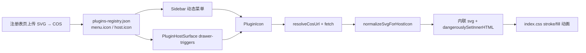

# Host 插件图标：SVG URL 动态加载与内联渲染（实现详解）

> **一句话**：动态插件的 `menu.icon` / `host.icon` 存 **SVG 图片 URL**；Host 适配层用 `PluginIcon` **fetch → 消毒 → 内联 SVG**，使侧栏与 Surface 触发器能跟 `currentColor` / 选中色，并按描边/填充分流动画——**不必再维护 Lucide 白名单**。  
> **入口（用户）**：侧栏动态菜单图标；ebook 等 `PluginHostSurface` 抽屉触发器；注册表页「设置项目图标」上传写回。  
> **入口（代码）**：`apps/frontend/src/federation/host/PluginIcon.tsx` + `pluginIconUrl.ts`；接线在 `Sidebar` / `PluginHostSurface` / `views/plugins/registry.tsx`。  
> **文档目标**：讲清原理、调用链、契约，并给出**与源码一致**的逐行注释实现，便于其他 Host 复刻。  
> **非目标**：不进 kit 内核（图标是产品适配层能力）；不讲静态 `MENUS`/`PLUGINS` 的 Lucide `ICON_MAP`（那条路径未改）。  
> **产品姊妹稿**（偏改动对比）：仓库根 [`docs/app/plugin-host-icons.md`](../../../../docs/app/plugin-host-icons.md)。  
> **接入侧契约**：[`../host-guide/03-registry.md`](../host-guide/03-registry.md) · [`../plugin-guide/06-connect-auto-route.md`](../plugin-guide/06-connect-auto-route.md) · [`../plugin-guide/07-connect-surface-slot.md`](../plugin-guide/07-connect-surface-slot.md)。

**以源码为准**：若本文与 `apps/frontend/src/federation/host/*` 不一致，以工作区源码为准。

---

## 0. 先看这里

### 0.1 30 秒读懂

| 问题 | 答案 |
|------|------|
| 图标存在哪？ | registry 字符串字段 `menu.icon` / `host.icon` |
| 动态插件写什么？ | SVG URL：`https://…`、`/ext-cos/…`、`/remotes/…` |
| 谁渲染？ | `PluginIcon`（内联 `<svg>`，不是 ``） |
| 静态 Host 菜单呢？ | 仍写 Lucide 导出名，走侧栏 `ICON_MAP`；miss 才落 `PluginIcon` |
| 为何不用白名单？ | 新图标只改 registry + 上传，不必发 Host |

### 0.2 功能点总表

| 编号 | 功能点 | 用户可感知 | 关键路径 | 正文 |
|------|--------|------------|----------|------|
| I1 | URL 判定与 registry 写回 | 上传后字段变成 SVG URL | `pluginIconUrl.ts` | §4.1 |
| I2 | SVG 消毒 + kind/theme | 选中色对齐；安全去掉 script | `normalizeSvgForHostIcon` | §4.1 |
| I3 | fetch / 缓存 / 内联渲染 | 图标出现；失败变 Puzzle | `PluginIcon.tsx` | §4.2 |
| I4 | 侧栏动态项接线 | 动态插件菜单有自定义图标 | `Sidebar/index.tsx` | §4.3 |
| I5 | Surface 触发器接线 | 抽屉按钮用 `host.icon` URL | `PluginHostSurface.tsx` | §4.4 |
| I6 | 注册表上传 | 标题栏选插件上传 SVG | `registry.tsx` | §4.5 |
| I7 | CSS 画线 / 主题色 | hover 描边或 clip 显现 | `index.css` | §4.6 |

### 0.3 调用链



### 0.4 关键决策

| 决策 | 原因 |
|------|------|
| 内联 SVG，不用 `` | 选中色要跟侧栏 `text-*` / `currentColor` |
| `kind: stroke \| fill` | Lucide 描边 vs iconfont 填充，动画策略不同 |
| `theme: current \| original` | 近黑灰单色跟主题；品牌多色保留上传色 |
| 亮度+低彩度判定可主题色 | iconfont 常用 `#2c2c2c`，纯黑白名单会漏 |
| `useMemo` 稳定 `{__html}` | React 19 对 `dangerouslySetInnerHTML` 做对象 `===`；新对象会重建 path，stroke 在仍 hover 时重播 |
| 绝对 `http(s)` 走 `getPlatformFetch()` | Tauri WebView 拉 COS 直链会 CORS；对齐侧栏头像展示 URL |
| Upload 挂在 Dropdown 外 + `openRef` | 系统文件框抢焦点关菜单；菜单内 Upload 会被卸载 |
| 去掉 Host Lucide 白名单 | 新图标只改 registry，不必发 Host |

### 0.5 kind / theme / 动画对照

| 来源 | kind | 动画作用点 | CSS |
|------|------|------------|-----|
| 上传 Lucide 风描边 SVG | `stroke` | **path** 上 `stroke-dashoffset`（`pathLength=1`） | `.plugin-host-icon[data-plugin-icon-kind=stroke]` |
| 上传 iconfont 填充 SVG | `fill` | **svg** 上 `clip-path` 显现 | `.plugin-host-icon[data-plugin-icon-kind=fill]` |
| 静态 `ICON_MAP` Lucide | （组件） | path dash；选择器排除 `.plugin-host-icon` | `.lucide-stroke-draw-hover:hover svg:not(.plugin-host-icon)` |

**点击不重播（stroke）根因**：父级重渲染时若每次传入新的 `{ __html }` 对象，React 19 会重写 `innerHTML` → path DOM 重建 → 仍处 `:hover` 则 dash 动画重来。fill 动画挂在 svg 节点上，子节点重建不重播。

---

## 1. 数据契约（registry）

字段类型仍是 **字符串**，语义升级为：

```jsonc
{
  "id": "learningNotes",
  "menu": {
    "order": 10,
    // 动态插件：SVG URL（推荐）
    "icon": "https://cdn.example.com/icons/notes.svg"
    // 历史兼容：也可写 Lucide 名；侧栏若命中 ICON_MAP 则走静态组件，否则 PluginIcon 失败兜底 Puzzle
  },
  "host": {
    "surface": "ebook.read",
    "slot": "drawer",
    // 抽屉触发器：同样推荐 SVG URL
    "icon": "/ext-cos/plugins/icons/tool.svg",
    "order": 1
  }
}
```

**`isPluginIconUrl` 认定的前缀**：

- `http://` / `https://`
- `/ext-cos/`（本仓 COS 同源代理）
- `/remotes/`（本地/静态 remote 资源）

kit 运行时只把 `menu.icon` **原样**写入 `sidebarInjector`；**渲染决策在 Host UI**（Sidebar / Surface），不在 `federation-kit` 内核。

---

## 2. 文件地图

| 路径 | 职责 |
|------|------|
| `apps/frontend/src/federation/host/pluginIconUrl.ts` | URL 判定、写回 registry、SVG 消毒与 kind/theme |
| `apps/frontend/src/federation/host/PluginIcon.tsx` | fetch + 模块缓存 + 内联渲染 |
| `apps/frontend/src/federation/index.ts` | barrel：`PluginIcon` / `applyPluginIconUrl` / … |
| `apps/frontend/src/components/design/Sidebar/index.tsx` | `ICON_MAP[…] ?? <PluginIcon />` |
| `apps/frontend/src/federation/host/PluginHostSurface.tsx` | `host.icon` → `<PluginIcon />`（无白名单） |
| `apps/frontend/src/views/plugins/registry.tsx` | 上传 SVG → COS → `applyPluginIconUrl` → 持久化 |
| `apps/frontend/src/index.css` | stroke/fill 动画与 `plugin-host-icon--theme` |
| `apps/frontend/src/utils/lucideStrokePathLength.ts` | 静态 Lucide 在 hover 时补 `pathLength=1`（与插件 stroke 对齐） |

---

## 3. 问题 → 对策

| 编号 | 现象 / 风险 | 根因 | 对策 | 对应 |
|------|-------------|------|------|------|
| P1 | 新图标要改 Host 发版 | Lucide 名白名单 | registry 存 SVG URL + `PluginIcon` | I1–I5 |
| P2 | `` 选中色对不齐 | 位图不受 `currentColor` | 内联 SVG + theme 改写 | I2–I3 |
| P3 | iconfont `#2c2c2c` 跟不上主题 | 只认纯黑 | `isThemeablePaint` 低彩度+亮度 | I2 |
| P4 | 桌面端图标空白 | WebView CORS | `getPlatformFetch` + `resolveCosUrlForWebDisplay` | I3 |
| P5 | hover 点一下动画重播 | React 19 `===` 新 `__html` 对象 | `useMemo` 稳定引用 | I3 |
| P6 | 选中时 stroke 动画乱跳 | CSS `stroke: currentColor !important` 触发重算 | 主题 fill 才 `!important`；stroke 靠 attribute | I7 |
| P7 | 菜单里上传控件被卸载 | 文件框关 Dropdown | Upload 挂菜单外 + `openRef` | I6 |

---

## 4. 分功能点详解（含完整实现代码）

### 4.1 I1–I2：`pluginIconUrl.ts`

#### （1）功能说明

- 判定字符串是否按 SVG URL 加载。  
- 把上传 URL 写回指定插件的 `menu.icon` / `host.icon`（有则写）。  
- 把原始 SVG 文本解析、消毒、判定 `kind`/`theme`，产出可内联的 `HostSvgParts`。

#### （2）完整源码（逐行上方注释）

来源：`apps/frontend/src/federation/host/pluginIconUrl.ts`（与仓库同步）。

```ts
// 引入 kit 的 registry 类型，保证写回结构与 PluginRegistry 一致
import type { PluginRegistry } from '@dnhyxc-ai/federation-kit';
// 引入 React SVG 属性类型，供规范化后的根属性透传
import type { SVGProps } from 'react';

/** registry `icon` 是否按 SVG URL 拉取并内联 */
export function isPluginIconUrl(value?: string | null): boolean {
	// 去掉首尾空白；空串视为非 URL
	const v = value?.trim();
	// 无值直接 false
	if (!v) return false;
	// 绝对 http(s)、本仓 COS 代理路径、remotes 静态路径视为可拉取
	return (
		/^https?:\/\//i.test(v) ||
		v.startsWith('/ext-cos/') ||
		v.startsWith('/remotes/')
	);
}

/**
 * 把上传得到的 URL 写入指定插件的 menu.icon / host.icon（有则写）。
 * 二者皆无则 wrote: []。
 */
export function applyPluginIconUrl(
	data: PluginRegistry,
	pluginId: string,
	url: string,
): { next: PluginRegistry; wrote: Array<'menu' | 'host'> } {
	// 记录实际写过的字段，供 UI Toast「无目标」判断
	const wrote: Array<'menu' | 'host'> = [];
	// 不可变更新：只改匹配 id 的插件
	const plugins = data.plugins.map((p) => {
		// 非目标插件原样返回
		if (p.id !== pluginId) return p;
		// 从当前插件描述开始累加
		let next = p;
		// 有 menu 块才写 menu.icon（侧栏注入依赖 menu 存在）
		if (p.menu) {
			next = { ...next, menu: { ...p.menu, icon: url } };
			wrote.push('menu');
		}
		// 有 host 块才写 host.icon（Surface 触发器）
		if (p.host) {
			next = { ...next, host: { ...p.host, icon: url } };
			wrote.push('host');
		}
		return next;
	});
	// 返回新 registry 与写入轨迹
	return { next: { ...data, plugins }, wrote };
}

/**
 * stroke：Lucide 描边稿 → pathLength dash
 * fill：iconfont 填充稿 → clip 显现（不加描边）
 */
export type PluginIconKind = 'stroke' | 'fill';

/** current：跟侧栏选中色；original：多色/品牌色保留上传色 */
export type PluginIconTheme = 'current' | 'original';

/** 规范化后的内联 SVG 描述，供 PluginIcon 渲染 */
export type HostSvgParts = {
	viewBox: string;
	kind: PluginIconKind;
	theme: PluginIconTheme;
	rootProps: SVGProps<SVGSVGElement>;
	innerHTML: string;
};

// 需要读/写 fill、stroke 的几何元素选择器
const SHAPE_SEL = 'path,line,circle,polyline,rect,ellipse,polygon';

// 可从根 svg 透传到 React 的展示属性（kebab → camel 在下方转换）
const ROOT_PRESENTATION = [
	'fill',
	'stroke',
	'stroke-width',
	'stroke-linecap',
	'stroke-linejoin',
	'stroke-opacity',
	'fill-opacity',
	'opacity',
] as const;

/** 读元素上的 fill/stroke：先 attribute，再 style 声明 */
function readPaint(el: Element, attr: 'fill' | 'stroke'): string | null {
	const direct = el.getAttribute(attr);
	if (direct) return direct.trim();
	const style = el.getAttribute('style') || '';
	const m = style.match(new RegExp(`${attr}\\s*:\\s*([^;]+)`, 'i'));
	return m?.[1]?.trim() || null;
}

/** 是否存在有效填充色（非 none）——用于判定 fill 稿 */
function hasFillPaint(el: Element): boolean {
	const fill = readPaint(el, 'fill');
	return !!(fill && fill !== 'none');
}

/** 把常见颜色写法解析成 RGB 三元组 */
function parseRgb(value: string): [number, number, number] | null {
	const v = value.trim().toLowerCase();
	if (v === 'black') return [0, 0, 0];
	if (v === 'white') return [255, 255, 255];
	const short = v.match(/^#([0-9a-f]{3})$/i);
	if (short) {
		const [r, g, b] = short[1].split('').map((c) => parseInt(c + c, 16));
		return [r, g, b];
	}
	const hex = v.match(/^#([0-9a-f]{6})([0-9a-f]{2})?$/i);
	if (hex) {
		const n = hex[1];
		return [
			parseInt(n.slice(0, 2), 16),
			parseInt(n.slice(2, 4), 16),
			parseInt(n.slice(4, 6), 16),
		];
	}
	const rgb = v.match(/^rgba?\(\s*([\d.]+)\s*,\s*([\d.]+)\s*,\s*([\d.]+)/i);
	if (rgb) {
		return [Number(rgb[1]), Number(rgb[2]), Number(rgb[3])];
	}
	return null;
}

/** 相对亮度 0–1（sRGB），用于近黑/近白判定 */
function luminance(r: number, g: number, b: number): number {
	const lin = [r, g, b].map((c) => {
		const s = c / 255;
		return s <= 0.03928 ? s / 12.92 : ((s + 0.055) / 1.055) ** 2.4;
	});
	return 0.2126 * lin[0] + 0.7152 * lin[1] + 0.0722 * lin[2];
}

/**
 * iconfont 常用 #2c2c2c / #333 等近黑灰，白名单会漏；
 * 低彩度 +（够暗或够亮）视为可跟侧栏色。
 */
export function isThemeablePaint(value: string): boolean {
	const v = value.trim().toLowerCase();
	if (!v || v === 'none' || v === 'transparent') return false;
	if (v === 'currentcolor' || v === 'inherit') return true;
	if (/^url\(/i.test(v)) return false;
	const rgb = parseRgb(v);
	if (!rgb) return false;
	const [r, g, b] = rgb;
	const chroma = Math.max(r, g, b) - Math.min(r, g, b);
	const L = luminance(r, g, b);
	// 近似灰，且偏黑或偏白（含 #2c2c2c）
	if (chroma <= 24 && (L <= 0.28 || L >= 0.82)) return true;
	return false;
}

/** 可主题色 → currentColor；否则保留原色 */
function toThemePaint(value: string): string {
	return isThemeablePaint(value) ? 'currentColor' : value.trim();
}

/** 收集整图「有效色键」，用于判定单色可主题 vs 多色品牌 */
function collectPaintKeys(svg: Element): string[] {
	const colors = new Set<string>();
	const consider = (raw: string | null) => {
		if (!raw || raw === 'none' || raw === 'transparent') return;
		if (/^url\(/i.test(raw.trim())) {
			colors.add(`url:${raw.trim().toLowerCase()}`);
			return;
		}
		colors.add(toThemePaint(raw).toLowerCase());
	};
	consider(svg.getAttribute('fill'));
	consider(svg.getAttribute('stroke'));
	for (const el of svg.querySelectorAll(`${SHAPE_SEL},g`)) {
		consider(readPaint(el, 'fill'));
		consider(readPaint(el, 'stroke'));
	}
	for (const styleEl of svg.querySelectorAll('style')) {
		const css = styleEl.textContent ?? '';
		for (const m of css.matchAll(
			/(?:^|[;{\s])(?:fill|stroke)\s*:\s*([^;!}]+)/gi,
		)) {
			consider(m[1]);
		}
	}
	return [...colors];
}

/** 改写 style 字符串里某一 paint 属性 */
function rewriteStylePaint(style: string, attr: 'fill' | 'stroke'): string {
	return style.replace(
		new RegExp(`(${attr}\\s*:\\s*)([^;]+)`, 'ig'),
		(_, prefix: string, val: string) => {
			const t = val.trim();
			if (t === 'none' || t === 'transparent' || /^url\(/i.test(t)) {
				return `${prefix}${val}`;
			}
			return `${prefix}${toThemePaint(t)}`;
		},
	);
}

/** 改写 <style> 文本里的 fill/stroke */
function rewriteCssText(css: string): string {
	return css.replace(/(fill|stroke)\s*:\s*([^;!}]+)/gi, (full, prop, val) => {
		const t = String(val).trim();
		if (t === 'none' || t === 'transparent' || /^url\(/i.test(t)) return full;
		if (!isThemeablePaint(t)) return full;
		return `${prop}:currentColor`;
	});
}

/** 去掉 color 锁，避免挡住 currentColor 继承 */
function stripColorLock(el: Element) {
	el.removeAttribute('color');
	const style = el.getAttribute('style');
	if (!style) return;
	const next = style
		.replace(/(?:^|;)\s*color\s*:\s*[^;]+/gi, '')
		.replace(/^;+|;+$/g, '')
		.trim();
	if (next) el.setAttribute('style', next);
	else el.removeAttribute('style');
}

/**
 * 无色 / 仅近黑灰白 → currentColor（跟侧栏选中色）；
 * 多色或品牌色 → original。
 */
function applyThemeCurrentColor(svg: Element): PluginIconTheme {
	const paints = collectPaintKeys(svg);
	// 渐变/图案：保留原色
	if (paints.some((p) => p.startsWith('url:'))) return 'original';
	// 多于一种有效色：品牌多色
	if (paints.length > 1) return 'original';
	// 单色但已不是 currentColor（且不可主题化后仍唯一非 current）：original
	if (paints.length === 1 && paints[0] !== 'currentcolor') return 'original';

	const rewriteEl = (el: Element) => {
		stripColorLock(el);
		for (const attr of ['fill', 'stroke'] as const) {
			const val = el.getAttribute(attr);
			if (
				val &&
				val !== 'none' &&
				val !== 'transparent' &&
				!/^url\(/i.test(val)
			) {
				el.setAttribute(attr, toThemePaint(val));
			}
		}
		const style = el.getAttribute('style');
		if (style) {
			el.setAttribute(
				'style',
				rewriteStylePaint(rewriteStylePaint(style, 'fill'), 'stroke'),
			);
		}
	};

	rewriteEl(svg);
	for (const el of svg.querySelectorAll(`${SHAPE_SEL},g`)) {
		rewriteEl(el);
	}
	for (const styleEl of svg.querySelectorAll('style')) {
		const css = styleEl.textContent ?? '';
		const next = rewriteCssText(css);
		if (next !== css) styleEl.textContent = next;
	}
	return 'current';
}

/** Lucide 根 fill="none"；iconfont 常不写或写深灰 fill → fill */
export function detectPluginIconKind(svg: Element): PluginIconKind {
	for (const el of svg.querySelectorAll(SHAPE_SEL)) {
		if (hasFillPaint(el)) return 'fill';
	}
	const rootFill = svg.getAttribute('fill');
	if (rootFill === 'none') return 'stroke';
	return 'fill';
}

/** 描边稿：统一 pathLength=1，配合 CSS dasharray:1 做单位周长动画 */
function prepareStrokeDraw(svg: Element) {
	for (const el of svg.querySelectorAll(SHAPE_SEL)) {
		el.setAttribute('pathLength', '1');
	}
}

/**
 * 消毒；近黑灰单色 → currentColor（选中跟静态菜单）；
 * 描边稿 pathLength；填充稿不加描边；品牌色保留。
 */
export function normalizeSvgForHostIcon(svgText: string): HostSvgParts | null {
	const raw = svgText.trim();
	if (!raw || !/<svg[\s>]/i.test(raw)) return null;

	const doc = new DOMParser().parseFromString(raw, 'image/svg+xml');
	if (doc.querySelector('parsererror')) return null;

	const svg = doc.documentElement;
	if (!svg || svg.tagName.toLowerCase() !== 'svg') return null;

	// 去掉可执行 / 嵌入外链宿主
	for (const el of [
		...svg.querySelectorAll('script, foreignObject, iframe, object, embed'),
	]) {
		el.remove();
	}

	// 去掉事件属性与 javascript: 链接
	for (const el of [svg, ...svg.querySelectorAll('*')]) {
		for (const attr of [...el.attributes]) {
			const name = attr.name;
			const val = attr.value.trim();
			if (/^on/i.test(name)) {
				el.removeAttribute(name);
				continue;
			}
			if (
				(name === 'href' || name === 'xlink:href') &&
				/^javascript:/i.test(val)
			) {
				el.removeAttribute(name);
			}
		}
	}

	const theme = applyThemeCurrentColor(svg);
	const kind = detectPluginIconKind(svg);
	if (kind === 'stroke') {
		prepareStrokeDraw(svg);
	}

	const viewBox = svg.getAttribute('viewBox') || '0 0 24 24';
	const rootProps: SVGProps<SVGSVGElement> = {};
	for (const name of ROOT_PRESENTATION) {
		const val = svg.getAttribute(name);
		if (!val) continue;
		if (name === 'stroke-width') rootProps.strokeWidth = val;
		else if (name === 'stroke-linecap')
			rootProps.strokeLinecap = val as 'round';
		else if (name === 'stroke-linejoin')
			rootProps.strokeLinejoin = val as 'round';
		else if (name === 'stroke-opacity') rootProps.strokeOpacity = val;
		else if (name === 'fill-opacity') rootProps.fillOpacity = val;
		else if (name === 'fill') rootProps.fill = val;
		else if (name === 'stroke') rootProps.stroke = val;
		else if (name === 'opacity') rootProps.opacity = Number(val) || val;
	}

	// 主题色：根上钉死 currentColor，保证继承链稳定
	if (theme === 'current') {
		if (kind === 'fill') {
			rootProps.fill = 'currentColor';
		} else {
			rootProps.stroke = 'currentColor';
			if (!rootProps.fill) rootProps.fill = 'none';
		}
	}

	const innerHTML = svg.innerHTML.trim();
	if (!innerHTML) return null;

	return { viewBox, kind, theme, rootProps, innerHTML };
}
```

---

### 4.2 I3：`PluginIcon.tsx`

#### （1）功能说明

按 `name`（registry URL）拉取 SVG 文本 → `normalizeSvgForHostIcon` → 模块级缓存 → 内联 `<svg>`；失败或非 URL 显示 `Puzzle`。

#### （2）完整源码（逐行上方注释）

来源：`apps/frontend/src/federation/host/PluginIcon.tsx`。

```tsx
// 失败兜底：与历史白名单默认图标一致
import { Puzzle } from 'lucide-react';
// 状态、副作用、稳定 __html 对象
import { useEffect, useMemo, useState } from 'react';
// className 合并
import { cn } from '@/lib/utils';
// 与侧栏头像同一套：dev/Web 走 /ext-cos/；Tauri 生产可保留 COS 直链
import { resolveCosUrlForWebDisplay } from '@/utils';
// 绝对 http(s) 走 Tauri HTTP 插件，避免 WebView CORS
import { getPlatformFetch } from '@/utils/fetch';
import {
	type HostSvgParts,
	isPluginIconUrl,
	normalizeSvgForHostIcon,
} from './pluginIconUrl';

export type PluginIconProps = {
	/** registry `menu.icon` / `host.icon`：SVG 图片 URL */
	name?: string;
	className?: string;
};

// 规范化算法变更时递增，失效内存缓存
const CACHE_VER = 'kind-v9';
// 模块级缓存：跨实例复用，避免侧栏多项重复 fetch
const svgCache = new Map<string, HostSvgParts>();

function cacheKey(url: string) {
	return `${CACHE_VER}:${url}`;
}

/**
 * 与 registry 拉取一致：绝对 http(s) 走 Tauri HTTP 插件（无 CORS）；
 * `/ext-cos/` 等同源路径仍用窗口 fetch（对齐侧栏头像的 resolveCosUrlForWebDisplay）。
 */
async function fetchIconText(src: string): Promise<string> {
	const doFetch = /^https?:\/\//i.test(src)
		? await getPlatformFetch()
		: globalThis.fetch.bind(globalThis);
	const res = await doFetch(src, { cache: 'no-cache' });
	if (!res.ok) throw new Error(`icon fetch ${res.status}`);
	return res.text();
}

/**
 * 内联 SVG：近黑灰单色跟侧栏 text-* / 选中 text-teal-500；
 * 品牌多色保留上传色；填充/描边分流动画。
 *
 * dangerouslySetInnerHTML 必须用稳定对象引用：React 19 updateProperties 对
 * 该 prop 做 `===`，每次新 `{__html}` 都会 `innerHTML=` 重建子节点；
 * stroke 画线挂在 path 上会在仍 :hover 时重播；fill 画线挂在 svg 上故无感。
 */
export function PluginIcon({ name, className }: PluginIconProps) {
	// 同步读缓存，避免已缓存 URL 首帧闪 Puzzle
	const [parts, setParts] = useState<HostSvgParts | null>(() => {
		const key = name?.trim() ?? '';
		return isPluginIconUrl(key) ? (svgCache.get(cacheKey(key)) ?? null) : null;
	});
	const [failed, setFailed] = useState(() => !isPluginIconUrl(name));

	useEffect(() => {
		const key = name?.trim() ?? '';
		if (!isPluginIconUrl(key)) {
			setParts(null);
			setFailed(true);
			return;
		}
		const cached = svgCache.get(cacheKey(key));
		if (cached) {
			setParts(cached);
			setFailed(false);
			return;
		}

		let cancelled = false;
		setFailed(false);
		setParts(null);

		const src = resolveCosUrlForWebDisplay(key);
		void (async () => {
			try {
				const text = await fetchIconText(src);
				const next = normalizeSvgForHostIcon(text);
				if (!next) throw new Error('invalid svg');
				svgCache.set(cacheKey(key), next);
				if (!cancelled) setParts(next);
			} catch {
				if (!cancelled) {
					setParts(null);
					setFailed(true);
				}
			}
		})();

		return () => {
			cancelled = true;
		};
	}, [name]);

	// 依赖 parts 引用：同一缓存对象 → html 对象引用稳定
	const html = useMemo(
		() => (parts ? { __html: parts.innerHTML } : null),
		[parts],
	);

	if (failed || !parts || !html) {
		return (
			<Puzzle
				className={cn('size-4 shrink-0 overflow-visible', className)}
				aria-hidden
			/>
		);
	}

	return (
		<svg
			xmlns="http://www.w3.org/2000/svg"
			viewBox={parts.viewBox}
			{...parts.rootProps}
			data-plugin-icon-kind={parts.kind}
			data-plugin-icon-theme={parts.theme}
			className={cn(
				'size-4 shrink-0 overflow-visible plugin-host-icon',
				parts.theme === 'current' && 'plugin-host-icon--theme',
				className,
			)}
			aria-hidden
			focusable="false"
			dangerouslySetInnerHTML={html}
		/>
	);
}
```

#### （3）barrel 导出

来源：`apps/frontend/src/federation/index.ts`（节选）。

```ts
// 业务与 Sidebar 统一从 @/federation 取图标组件
export { PluginIcon, type PluginIconProps } from './host/PluginIcon';
// 注册表页写回与工具函数一并导出
export {
	applyPluginIconUrl,
	type HostSvgParts,
	isPluginIconUrl,
	isThemeablePaint,
	normalizeSvgForHostIcon,
	type PluginIconKind,
	type PluginIconTheme,
} from './host/pluginIconUrl';
```

---

### 4.3 I4：侧栏动态项接线

kit 的 `sidebarInjector` 只注入字符串 `icon`。侧栏先查静态 `ICON_MAP`；**未命中**则交给 `PluginIcon`（动态插件 URL 走此分支）。

来源：`apps/frontend/src/components/design/Sidebar/index.tsx`（节选）。

```tsx
import { PluginIcon, sidebarInjector } from '@/federation';
import { ICON_MAP, MENUS, PLUGINS, type SidebarMenuConfig } from './enum';

// …订阅 sidebarInjector.items → pluginMenus …

const processedMenus = visibleMenus.map((menu) => ({
	...menu,
	// 静态 MENUS/PLUGINS：Lucide 名命中 ICON_MAP
	// 动态插件：menu.icon 为 SVG URL → miss → PluginIcon
	icon: ICON_MAP[menu.icon as keyof typeof ICON_MAP] ?? (
		<PluginIcon name={menu.icon} className="size-5.5" />
	),
	onClick: () => onJump(menu.path),
}));
```

父级菜单按钮需带 `lucide-stroke-draw-hover`（与静态项一致），插件 stroke/fill 动画才生效。

---

### 4.4 I5：`PluginHostSurface` 触发器（去掉白名单）

**改动前（已废弃）**：`DEFAULT_PLUGIN_HOST_ICONS` + `resolveIcon(name)` → Lucide 组件。  
**改动后**：直接 `<PluginIcon name={p.host?.icon} />`。

来源：`apps/frontend/src/federation/host/PluginHostSurface.tsx`（`drawer-triggers` 关键）。

```tsx
import { PluginIcon } from './PluginIcon';

// …useHostSurfacePlugins(surface) 分流 drawerPlugins …

if (part === 'drawer-triggers') {
	if (drawerPlugins.length === 0) return null;
	return (
		<div className={cn('contents', className)}>
			{drawerPlugins.map((p) => {
				const label = pickPluginLocaleText(p.title, locale) || p.id;
				const open = openPluginId === p.id;
				return (
					<Tooltip
						key={p.id}
						side="bottom"
						sideOffset={6}
						delayDuration={200}
						shadow
						content={label}
					>
						<Button
							type="button"
							variant="ghost"
							size="icon-sm"
							className={cn(
								// 与侧栏一致：hover 触发描边/填充画线
								'lucide-stroke-draw-hover [&_svg]:overflow-visible',
								open
									? 'bg-theme/15 text-teal-500'
									: 'text-textcolor/80 hover:text-teal-500',
								triggerClassName,
							)}
							aria-pressed={open}
							aria-label={label}
							data-plugin-host-slot="drawer-trigger"
							data-plugin-host-surface={surface}
							data-plugin-id={p.id}
							onClick={() => {
								if (!open) {
									claimPluginPortalTarget(
										p.id,
										styleRealmKey(p.entry, p.remoteName, p.id),
									);
								} else {
									clearPluginPortalClaim(p.id);
								}
								onOpenPluginIdChange?.(open ? null : p.id);
							}}
						>
							{/* host.icon 为 SVG URL 时内联；失败 Puzzle */}
							<PluginIcon name={p.host?.icon} className="size-4" />
						</Button>
					</Tooltip>
				);
			})}
		</div>
	);
}
```

---

### 4.5 I6：注册表页上传写回

流程：选插件 id → `pendingIconPluginIdRef` → `uploadOpenRef` 打开隐藏 `Upload` → COS → `applyPluginIconUrl` → `persistRegistry`。

要点：

1. **Upload 不在 Dropdown 内**（文件对话框会关菜单并卸载子树）。  
2. **只用 ref 记住 pluginId**（不必再维护无读者的 `iconPluginId` state）。  
3. 仅当插件已有 `menu` 和/或 `host` 时才会写入；皆无则 Toast「无目标」。

来源：`apps/frontend/src/views/plugins/registry.tsx`（关键节选）。

```tsx
const uploadOpenRef = useRef<(() => void) | null>(null);
const pendingIconPluginIdRef = useRef('');

const onUploadIcon = useCallback(
	async (pluginId: string, picked: FileWithPreview | FileWithPreview[]) => {
		const item = Array.isArray(picked) ? picked[0] : picked;
		const file = item?.file;
		if (!file || !pluginId || loading || saving || uploadingPluginId) return;

		const latest = getEditorTextRef.current?.() ?? textLiveRef.current;
		let data: PluginRegistry;
		try {
			data = JSON.parse(latest) as PluginRegistry;
		} catch {
			Toast({ type: 'warning', title: t('plugins.registry.invalidJson') });
			return;
		}
		if (!data.plugins.some((p) => p.id === pluginId)) {
			Toast({
				type: 'warning',
				title: t('plugins.registry.pluginNotFound', { id: pluginId }),
			});
			return;
		}

		setUploadingPluginId(pluginId);
		try {
			const res = await uploadCosFile(file);
			const url = res?.data?.url as string | undefined;
			if (!url) {
				Toast({ type: 'error', title: t('plugins.registry.iconUploadFail') });
				return;
			}
			const { next, wrote } = applyPluginIconUrl(data, pluginId, url);
			if (wrote.length === 0) {
				Toast({ type: 'warning', title: t('plugins.registry.iconNoTarget') });
				return;
			}
			await persistRegistry(next, t('plugins.registry.iconUploadOk'));
		} catch (e) {
			Toast({
				type: 'error',
				title: t('plugins.registry.iconUploadFail'),
				message: e instanceof Error ? e.message : t('plugins.registry.iconUploadFail'),
			});
		} finally {
			setUploadingPluginId(null);
		}
	},
	[loading, saving, uploadingPluginId, t, persistRegistry],
);

const onPickPluginIcon = useCallback(
	(id: string) => {
		if (busy || jsonParseError) return;
		pendingIconPluginIdRef.current = id;
		uploadOpenRef.current?.();
	},
	[busy, jsonParseError],
);

// JSX：Upload 挂在菜单外
<Upload
	t={t}
	uploadType="button"
	className="pointer-events-none absolute h-0 w-0 overflow-hidden opacity-0"
	accept=".svg,image/svg+xml"
	validTypes={['image/svg+xml']}
	validExtensions={['.svg']}
	maxCount={1}
	maxSize={2 * 1024 * 1024}
	disabled={busy || jsonParseError}
	loading={!!uploadingPluginId}
	openRef={uploadOpenRef}
	onUpload={(picked) => onUploadIcon(pendingIconPluginIdRef.current, picked)}
/>
```

---

### 4.6 I7：CSS 画线与主题色

来源：`apps/frontend/src/index.css`（节选）。

```css
/* 统一时长；描边一律 pathLength=1 + dash 1 */
.lucide-stroke-draw-hover {
	--icon-draw-duration: 0.5s;
}

@keyframes lucide-stroke-draw {
	from { stroke-dashoffset: 1; }
	to { stroke-dashoffset: 0; }
}

@keyframes plugin-icon-fill-draw {
	from { clip-path: inset(0 100% 0 0); }
	to { clip-path: inset(0 0 0 0); }
}

@media (prefers-reduced-motion: no-preference) {
	/* 静态 Lucide：排除 .plugin-host-icon，避免与插件 stroke 双规则打架 */
	.lucide-stroke-draw-hover:hover svg:not(.plugin-host-icon) path,
	.lucide-stroke-draw-hover:hover svg:not(.plugin-host-icon) line,
	/* … circle / polyline / rect / ellipse 同理 … */
	.lucide-stroke-draw-hover:hover
		svg.plugin-host-icon[data-plugin-icon-kind="stroke"] path,
	/* … 其它几何同理 … */ {
		stroke-linecap: round;
		stroke-linejoin: round;
		stroke-dasharray: 1;
		stroke-dashoffset: 1;
		animation: lucide-stroke-draw var(--icon-draw-duration, 0.5s) linear forwards;
	}

	.lucide-stroke-draw-hover:hover
		svg.plugin-host-icon[data-plugin-icon-kind="fill"] {
		animation: plugin-icon-fill-draw var(--icon-draw-duration, 0.5s) linear forwards;
	}
}

@layer base {
	svg.plugin-host-icon--theme {
		color: inherit;
	}
	/*
		仅 fill 用 !important 压内联 fill。
		不要对 stroke path 写 stroke:currentColor !important——
		选中态改 color 时会重算同元素 stroke-dashoffset（上传 Lucide 点一下重播）。
	*/
	svg.plugin-host-icon--theme[data-plugin-icon-kind="fill"]
	:is(path, circle, rect, ellipse, polygon, polyline) {
		fill: currentColor !important;
	}
}
```

静态 Lucide 在 `main.tsx` 通过 `bindLucideStrokePathLength` 于 hover 时补 `pathLength=1`，与插件 stroke 的单位 dash 对齐（见 `utils/lucideStrokePathLength.ts`）。

---

## 5. 复刻清单（其他 Host）

最小闭环：

1. 复制 `pluginIconUrl.ts` + `PluginIcon.tsx`（或抽到共享包；本仓放在适配层）。  
2. 提供等价的 `resolveCosUrlForWebDisplay` / `getPlatformFetch`（Web 可简化为 `fetch`）。  
3. 侧栏：`ICON_MAP[name] ?? <PluginIcon name={name} />`。  
4. Surface 触发器：`<PluginIcon name={host.icon} />`，去掉 Lucide 白名单。  
5. 拷贝 `index.css` 中 `plugin-host-icon` / `lucide-stroke-draw-hover` 相关规则。  
6. （可选）注册表上传：`applyPluginIconUrl` + 菜单外 `Upload`。

验收：

| 步骤 | 期望 |
|------|------|
| registry `menu.icon` 改为 SVG URL，上架后看侧栏 | 自定义图标；选中变 teal |
| `host.icon` SVG URL，ebook 开抽屉触发器 | 图标正确；hover 有画线 |
| 上传描边 Lucide SVG | `kind=stroke`；hover dash |
| 上传填充 iconfont SVG | `kind=fill`；hover clip |
| 多色品牌 SVG | `theme=original`；颜色不被改成 teal |
| Tauri 桌面拉 COS 直链 | 不因 CORS 变 Puzzle |
| 父组件重渲染且仍 hover | stroke **不**无故重播 |

---

## 6. 影响边界

| 会动到 | 不应误伤 |
|--------|----------|
| 动态插件侧栏图标、Surface 抽屉触发器、注册表编辑体验 | 静态 `MENUS`/`PLUGINS` 的 Lucide `ICON_MAP` |
| Host 适配层 `federation/host/*`、部分 CSS | kit 内核 `createPluginRuntime` / Bridge / 样式隔离 |
| registry JSON 中 icon 字段取值习惯 | 插件 Remote 业务代码（无需改 expose） |

---

## 7. 修订记录

| 日期 | 说明 |
|------|------|
| 2026-08-11 | 初版：SVG URL 动态图标全链路 + 与源码同步的逐行注释实现 |
