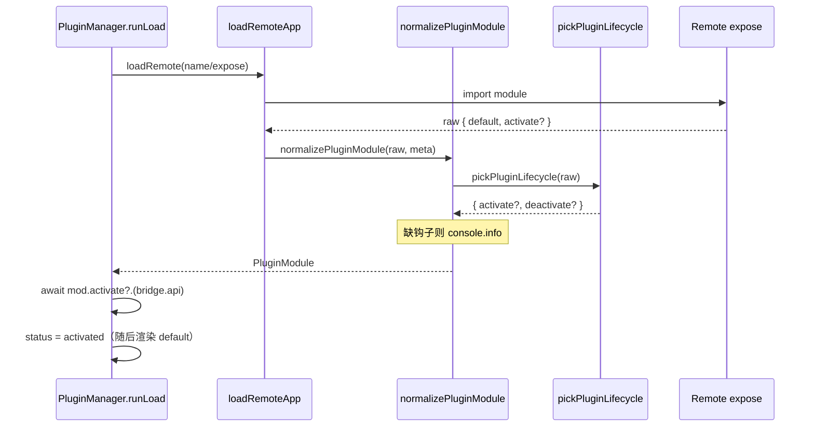

# 08 · 插件生命周期钩子（activate / deactivate）实现详解

> **本章目标**：讲清本次微前端生命周期契约变更的**完整实现**：Host 如何解析钩子、何时调用、缺钩子如何提示；Remote（React / Vue）应如何导出才既生效又不破坏 HMR。  
> **对应源码**：
>
> - `packages/federation-kit/src/types/index.ts`（`PluginModule`）
> - `packages/federation-kit/src/mf/normalizePluginModule.ts`（`pickPluginLifecycle` / `normalizePluginModule`）
> - `packages/federation-kit/src/mf/mf.ts`（`loadRemoteApp`）
> - `packages/federation-kit/src/runtime/createPluginRuntime.ts`（`runLoad` / `unloadPlugin`）
>
> **插件侧写法**另见 [plugin-guide/04](../plugin-guide/暴露契约.md)、[12](../plugin-guide/预览与调试.md)、[06 §5](../plugin-guide/自动路由接入.md)、[09 §5](../plugin-guide/Vue插件开发.md)。

---

## 0. 读本文你将得到什么

- 变更前：只认 expose 模块的 **named export** `activate` / `deactivate`。
- 变更后：再认 **`default` 上的静态属性**（React `App.activate`；Vue `{ mount, activate }`），并在缺失时 **`console.info` 提示**（不阻断加载）。
- 为何这样改：同文件 `export function activate` 会破坏 Vite Fast Refresh；挂在 default 上则模块仍只有一个组件导出。
- 下方给出**与磁盘一致**的实现摘录（每行源码上方中文注释）。

---

## 1. 一句话方案

```text
loadRemote(raw)
  → pickPluginLifecycle(raw)     // named 优先，否则 default.activate / .deactivate
  → 缺钩子 → console.info（不抛错）
  → normalize → PluginModule
  → runLoad: await mod.activate?.(bridge.api)   // 渲染前
  → unload:  await mod.deactivate?.()           // 拆路由前
```



| 符号 | 职责 |
|------|------|
| `pickPluginLifecycle` | 从 raw 解析钩子：named → default 静态属性 |
| `normalizePluginModule` | 产出 `PluginModule`；缺钩子打 info；Vue 包成 React 桥 |
| `runLoad` | `activate` 在渲染前 `await` |
| `unloadPlugin` | `deactivate` 在拆壳前 `await`（异常只打日志） |

---

## 2. 类型契约（`PluginModule`）

```ts
// packages/federation-kit/src/types/index.ts（摘录）

// Host 规范化后认的模块形态：可渲染组件 + 可选生命周期
export interface PluginModule {
	// React 组件；Vue 经 createVueHostBridge 后也是 React 组件
	default: React.ComponentType<HostBridgeProps>;
	// 加载成功、渲染前调用；入参是 bridge.api（不是整个 bridge）
	activate?: (api: HostBridgeProps['api']) => Promise<void> | void;
	// 卸载前调用；无参
	deactivate?: () => Promise<void> | void;
}
```

---

## 3. 解析与规范化（完整源码 + 逐行注释）

> 文件：`packages/federation-kit/src/mf/normalizePluginModule.ts`（与仓库一致）。

```ts
// 只导入类型：运行时擦除
import type { ComponentType } from 'react';
// Vue Remote → React 桥
import {
	createVueHostBridge,
	type VueRemoteExpose,
} from '../bridge/createVueHostBridge';
// Host 契约类型
import type { HostBridgeProps, PluginDescriptor, PluginModule } from '../types';

/** MF loadRemote 拿到的原始模块形状 */
export type RawRemoteModule = {
	// 必须有：React 组件，或 Vue mount / { mount }
	default: unknown;
	// 构建期 framework 标记（可选）
	framework?: string;
	// 旧名兼容
	mfFramework?: string;
	// named export 生命周期（可选）
	activate?: PluginModule['activate'];
	deactivate?: PluginModule['deactivate'];
};

/** 可挂在 default 上的生命周期（函数组件静态属性，或 Vue { mount, activate }） */
type LifecycleCarrier = {
	activate?: PluginModule['activate'];
	deactivate?: PluginModule['deactivate'];
};

/** default 是否形如 { mount }（裸 function 易与 React FC 混淆） */
function looksLikeVueMount(comp: unknown): boolean {
	return (
		!!comp &&
		typeof comp === 'object' &&
		typeof (comp as { mount?: unknown }).mount === 'function'
	);
}

/**
 * 是否按 Vue Remote 处理。
 * 优先级：registry.framework → 模块标记 → { mount } 启发式。
 */
export function isVueRemoteModule(
	raw: RawRemoteModule,
	meta: PluginDescriptor,
): boolean {
	if (meta.framework === 'vue') return true;
	if (meta.framework === 'react') return false;
	const tag = raw.framework ?? raw.mfFramework;
	if (tag === 'vue') return true;
	if (tag === 'react') return false;
	return looksLikeVueMount(raw.default);
}

/**
 * 解析生命周期：
 * 1) 模块 named export（raw.activate）优先；
 * 2) 否则读 default 上的静态属性（App.activate / { activate }）。
 * 这样钩子可与组件同文件，且模块仍只有 export default → Fast Refresh 可热更。
 */
export function pickPluginLifecycle(
	raw: RawRemoteModule,
): Pick<PluginModule, 'activate' | 'deactivate'> {
	// default 为函数（React FC）或对象（Vue { mount }）时才可能挂静态钩子
	const carrier =
		raw.default &&
		(typeof raw.default === 'function' || typeof raw.default === 'object')
			? (raw.default as LifecycleCarrier)
			: undefined;
	return {
		activate:
			typeof raw.activate === 'function'
				? raw.activate
				: typeof carrier?.activate === 'function'
					? carrier.activate
					: undefined,
		deactivate:
			typeof raw.deactivate === 'function'
				? raw.deactivate
				: typeof carrier?.deactivate === 'function'
					? carrier.deactivate
					: undefined,
	};
}

/**
 * 将 loadRemote 原始模块规范为 Host 可用的 PluginModule。
 * - Vue：createVueHostBridge（生命周期在包装前从 raw 解析，桥组件本身不带钩子）
 * - React：default 原样作为组件
 * - 缺钩子：console.info 提示，不抛错、不阻断
 */
export function normalizePluginModule(
	raw: RawRemoteModule,
	meta: PluginDescriptor,
): PluginModule {
	if (!raw?.default) {
		throw new Error(`plugin ${meta.id}: expose missing default export`);
	}

	// 统一解析（named + 静态属性）
	const lifecycle = pickPluginLifecycle(raw);

	// 缺失提示：便于发现「钩子挂在叶子页 / 未导出」；加载仍继续
	if (typeof lifecycle.activate !== 'function') {
		console.info(
			`[federation-kit] plugin "${meta.id}": 未导出 activate 生命周期钩子（named export 或 default.activate）`,
		);
	}
	if (typeof lifecycle.deactivate !== 'function') {
		console.info(
			`[federation-kit] plugin "${meta.id}": 未导出 deactivate 生命周期钩子（named export 或 default.deactivate）`,
		);
	}

	if (isVueRemoteModule(raw, meta)) {
		return {
			// 桥只关心 mount；activate/deactivate 已摊到 PluginModule 顶层
			default: createVueHostBridge(raw.default as VueRemoteExpose, meta.id),
			...lifecycle,
		};
	}

	return {
		default: raw.default as ComponentType<HostBridgeProps>,
		...lifecycle,
	};
}
```

### 解析优先级示意

| 优先级 | 来源 | 示例 |
|--------|------|------|
| 1 | `raw.activate` named export | `export async function activate` / `export { activate }` |
| 2 | `raw.default.activate` | `App.activate = …` 或 `export default { mount, activate }` |
| — | 都没有 | `undefined` + `console.info` |

---

## 4. 加载入口：`loadRemoteApp`

```ts
// packages/federation-kit/src/mf/mf.ts（摘录）

export async function loadRemoteApp(
	d: PluginDescriptor,
): Promise<PluginModule> {
	// 保证 shared react 与 bust 插件已挂上
	ensureShared();
	ensureBustPlugin();
	const name = remoteNameOf(d);
	const expose = exposeBaseOf(d);
	// MF 动态 import：得到 RawRemoteModule（含 default / 可能的 named 钩子）
	const raw = await getMf().loadRemote<RawRemoteModule>(`${name}/${expose}`);
	if (!raw?.default) {
		throw new Error(
			`plugin ${d.id}: expose ./${expose} missing default export`,
		);
	}
	// 在此完成 Vue 桥接 + 生命周期解析 + 缺钩子提示
	return normalizePluginModule(raw, d);
}
```

---

## 5. 调用时序：`runLoad` / `unloadPlugin`

```ts
// packages/federation-kit/src/runtime/createPluginRuntime.ts（摘录）

// —— runLoad 成功路径（trusted MF）——
registerRemote(meta, bust);
const endCapture = beginPluginStyleCapture(
	meta.id,
	meta.entry,
	meta.remoteName,
);
let mod: Awaited<ReturnType<typeof loadRemoteApp>>;
try {
	// 捕获窗内 load：CSS 进插件 realm；内部已 normalize + pickLifecycle
	mod = await loadRemoteApp(meta);
} finally {
	endCapture();
}
// 密封 bridge；activate 拿到的是 api，不是整个 HostBridgeProps
const bridge = createHostBridge(meta, this.config.capabilities, nav);
// 渲染前 await：适合订阅事件 / 预取；钩子抛错会进外层 catch → failed
await mod.activate?.(bridge.api);

this.plugins.set(meta.id, {
	meta,
	bridge,
	mod,
	status: 'activated',
	bust,
});
// 此后 PluginHostView 才渲染 <mod.default {...bridge} />
```

```ts
// —— unloadPlugin ——
async unloadPlugin(id: string) {
	const loaded = this.plugins.get(id);
	if (!loaded) {
		this.routeInjector.remove(id);
		this.sidebarInjector.remove(id);
		return;
	}
	try {
		// 先让插件自清；失败不阻断后续拆壳
		await loaded.mod.deactivate?.();
	} catch (e) {
		console.error(`[PluginManager] deactivate ${id}`, e);
	}
	eventBus.clearPlugin(id);
	this.routeInjector.remove(id);
	this.sidebarInjector.remove(id);
	this.plugins.set(id, {
		...loaded,
		status: 'unloaded',
	});
}
```

> **时序**：`activate` ∈ **加载后、首次渲染前**；`deactivate` ∈ **拆路由/侧栏前**。`untrusted` iframe 路径不走 `loadRemoteApp`，也就**不会**调 Remote 的 activate。

---

## 6. Remote 侧正确导出（实现对照）

### 6.1 React：静态属性 + 入口再导出（推荐）

```tsx
// src/App.tsx —— expose 的 default；钩子挂在此函数上
import type { HostBridgeProps } from '@/types/host';

function App({ api, plugin }: HostBridgeProps) {
	return (
		<div className="plugin-standalone h-full" data-plugin-root>
			{plugin.id}
		</div>
	);
}

// 静态属性：模块仍只有 export default → Fast Refresh 正常
App.activate = async (api: HostBridgeProps['api']) => {
	console.log('[plugin] activate', api.locale);
};

App.deactivate = () => {
	console.log('[plugin] deactivate');
};

export default App;
```

```ts
// src/index.ts —— MF expose 入口
import '@/styles.css';
import App from './App';

export default App;
// named 再导出：兼容只读 raw.activate 的路径；入口无 JSX，不拖垮 App HMR
export const activate = App.activate;
export const deactivate = App.deactivate;
```

### 6.2 React：禁止写法

```tsx
// ✗ 同文件 named export → Fast Refresh 整页刷新
export default function App() { /* ... */ }
export async function activate() {}

// ✗ 钩子挂在叶子页，expose 却是壳 App → pickPluginLifecycle 读不到
InfoPage.activate = async () => {};
export default App; // Host 只看 App
```

### 6.3 Vue：挂在 `{ mount }` 同对象上

```ts
// expose index.ts
import { createApp, reactive } from 'vue';
import App from '@/App.vue';
import type { HostBridgeProps } from '@/types/host';
import '@/styles.css';

export function mount(el: HTMLElement, bridge: HostBridgeProps) {
	const app = createApp(App, { bridge: reactive(bridge) });
	app.mount(el);
	return () => app.unmount();
}

// 参数是 api（Host 传 bridge.api），不要写成整个 HostBridgeProps
async function activate(api: HostBridgeProps['api']) {
	console.log('[vue] activate', api.locale);
}

async function deactivate() {
	console.log('[vue] deactivate');
}

// default 对象同时携带 mount + 钩子 → carrier.activate 生效
export default { mount, activate, deactivate };
```

---

## 7. 自检（smoke）

```bash
pnpm --filter @dnhyxc-ai/federation-kit exec tsx src/mf/normalizePluginModule.smoke.ts
```

覆盖：named 优先于静态属性；静态属性可被 normalize 读出；缺钩子时出现含插件 id 的 `console.info`。

---

## 8. 变更影响与排障

| 场景 | 行为 |
|------|------|
| 旧插件只 named export | 仍生效（优先级 1） |
| 新插件只 `App.activate` | 生效（优先级 2）；需 Host 含 `pickPluginLifecycle` 的 dist |
| 两者都有 | named 胜出 |
| 都没有 | 加载成功；控制台两条 `console.info` |
| 钩子挂在非 expose 的叶子组件 | 等同于没有 → info 提示 / 不执行 |
| `activate` 抛错 | `runLoad` catch → `status: failed` |
| `deactivate` 抛错 | 只 `console.error`，仍拆路由 |

调试：

```js
await pluginManager.ensurePlugin('myPlugin', { force: true });
```

---

## 9. 相关文档

| 文档 | 内容 |
|------|------|
| [plugin-guide/04](../plugin-guide/暴露契约.md) | expose 契约（插件视角） |
| [plugin-guide/12](../plugin-guide/预览与调试.md) | 预览、HMR、调试 |
| [plugin-guide/06 §5](../plugin-guide/自动路由接入.md) | React 多页壳 + 钩子挂壳 |
| [plugin-guide/09 §5](../plugin-guide/Vue插件开发.md) | Vue 多页 + `{ mount, activate }` |
| [API方法参考](./API方法参考.md) | `loadRemoteApp` / `runLoad` / `unloadPlugin` 字典 |
| [运行时与桥接](./运行时与桥接.md) | 运行时总章（normalize 小节以本文为准） |
