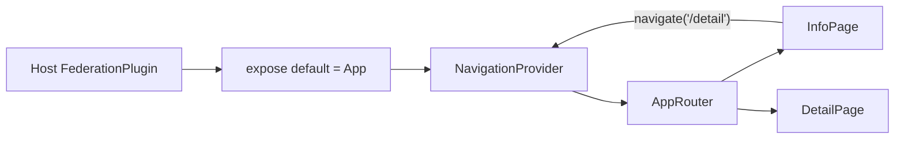

# 06 · 接入方式一：独立路由页（自动注入路由）

> **本章目标**：讲清「你的插件成为一个**独立页面**」的完整过程——registry 写什么、Host 怎么把它变成路由 + 侧栏入口、你的组件怎么写。**这是最常用的一种接入方式**。
>
> Host 侧机制见 host-guide 第 5、6 章；本处以子项目视角倒推「我要准备什么」。

---

## 1. 一句话

你在 registry 里声明 `routePath`，Host 启动时就自动为你在路由表里加一条，并（可选）在侧栏加一个图标入口。用户点进去 → Host 懒加载你的代码 → 你的整页组件被渲染。

**你要做的**：一个「整页」组件（可带自己的内部多页路由，见 §5）。其余全由 Host 完成。

---

## 2. registry 条目（你要和 Host 管理员确认的）

```jsonc
// plugins-registry.json 里你的条目
{
	"id": "learningNotes",
	"title": { "zh-CN": "学习笔记", "en-US": "Learning notes" },
	"description": { "zh-CN": "记录你的学习心得。", "en-US": "Take study notes." },
	"routePath": "/plugins/learning-notes",   // ★ 路由路径（必填，决定 URL）
	"entry": "http://127.0.0.1:9008/mf-manifest.json", // ★ 你的资源清单地址
	"expose": "./App",                        // 可选，默认 ./App
	"version": "1.0.0",
	"hostApiRange": "^1.0.0",                 // ★ 须覆盖 Host 的 VITE_HOST_API_VERSION
	"menu": { "order": 10, "icon": "Puzzle" },// ★ 可选：侧栏图标 + 排序
	"permissions": ["ui:toast", "http:plugin-api"],
	"enabled": true,                          // 全局上架开关
	"trust": "first-party"                    // 信任等级
}
```

| 字段 | 说明 |
|------|------|
| `routePath` | 必填。Host 注入的路由路径；`nav:subtree` 的导航也以它为界 |
| `menu` | 可选。有 `menu` 才出现侧栏图标；`icon` **推荐 SVG 图片 URL**（`https://…` / `/ext-cos/…` / `/remotes/…`），Host 用 `PluginIcon` 内联渲染；也可写 Lucide 名（仅当 Host 侧栏 `ICON_MAP` 命中）。`order` 控制排序。详见 [implements-guide/09](../implements-guide/09-plugin-host-icons.md) |
| `injectRoute` | 可选，默认 `true`。设为 `false` 则**不自动注入路由**（罕见） |

---

## 3. Host 侧到底发生了什么（理解时序）

Host 启动 `mf.start()` → `PluginManager.init()`：

```ts
// packages/federation-kit/src/runtime/createPluginRuntime.ts（关键逻辑）
async init() {
	// ① 拉账号上架偏好
	await this.config.enabledStore.load?.();
	// ② 拉 registry
	const registry = await this.config.fetchRegistry({ force: true });
	// ③ 只处理「已上架」的插件
	const enabled = registry.plugins.filter((p) => isPluginEnabled(p.id));
	for (const meta of enabled) {
		this.mountShell(meta); // 只注入「壳」，不下载你的代码！
	}
}

// mountShell：为每个插件注入路由壳与侧栏项
private mountShell(meta: PluginDescriptor) {
	// 有 routePath 且未关闭自动注入 → 路由表加一条（createRoute 是 Host 的路由工厂）
	if (meta.injectRoute !== false && this.createRoute) {
		this.routeInjector.inject(meta.id, [this.createRoute(meta)]);
	}
	// 有 menu → 侧栏加一项
	if (meta.menu) {
		this.sidebarInjector.add({
			pluginId: meta.id,
			path: meta.routePath,
			nameKey: meta.id,
			icon: meta.menu.icon ?? 'Puzzle',
			order: meta.menu.order,
		});
	}
}
```

> **关键**：`mountShell` **不下载你的代码**——它只是注入路由壳 + 侧栏项，所以启动很快。真正的 `ensurePlugin`（下载 `remoteEntry.js`）发生在**用户点击进入那条路由**时。

用户点击进入 → Host 路由页渲染 `<FederationPlugin name="learningNotes" />` → `ensurePlugin`：

```
ensurePlugin(id)
  ├─ verifyPlugin          安全校验（hostApiRange 不符 → 拒绝）
  ├─ resolvePluginBust     GET 你的 mf-manifest.json（算 version@指纹）
  ├─ registerRemote        注册 remoteEntry.js?v=…
  ├─ loadRemoteApp         MF import 你的 ./App
  └─ 渲染 <Comp {...bridge} />（包在 data-mf-plugin / data-mf-style-realm 里）
```

---

## 4. 你的组件怎么写（整页形态）

```tsx
// src/views/learning-notes/index.ts —— expose 入口（薄壳）
// 必须：Host 不执行 main.tsx，样式挂在这里
import '@/styles.css';
export { default } from './App';
```

```tsx
// src/views/learning-notes/App.tsx —— 整页组件
import { useEffect, useState } from 'react';
import { useHostLocale, useI18n } from '@/hooks';
import type { HostBridgeProps } from '@/types/host';

// 独立路由页：Host 已套统一页壳（PluginPageShell 提供边距/圆角），
// 你**不要**再套整页外层 padding——否则嵌入后边距翻倍
export default function App({ api, plugin }: HostBridgeProps) {
	const { t } = useI18n();
	useHostLocale(api); // 跟随 Host 语言
	const [data, setData] = useState<string | null>(null);

	// 挂载时拉一次数据（需 http:plugin-api 权限，用前判空）
	useEffect(() => {
		if (!api.http) return;
		void api.http
			.get('/api/learning-notes')
			.then((res) => setData(String((res as { data?: string })?.data ?? '')))
			.catch(() => setData(''));
	}, [api.http]);

	return (
		<div className="plugin-standalone h-full" data-plugin-root>
			<h1 className="mb-4 text-xl font-semibold">
				{t('notes.title')} · v{plugin.version}
			</h1>
			{data ? <p>{data}</p> : <p className="text-muted-foreground">{t('common.loading')}</p>}
			<button
				type="button"
				onClick={() =>
					api.ui?.showToast({ message: t('common.saved'), type: 'success' })
				}
			>
				{t('common.save')}
			</button>
		</div>
	);
}
```

> **边距规则**：独立路由页由 Host 套 `PluginPageShell`（见 host-guide 第 6 章），它已经给了外层 `p-5.5` 与圆角内容区。插件**不要**再叠同类外层 padding；`backdrop-filter` 若失效，是 Host 圆角容器带 `overflow-hidden` 的问题，报 Host 排查，不是你的问题。

---

## 5. 带内部子路由的插件（多页壳）

Host **只给你一条** `routePath`（例如 `/plugins/demo`）。列表 → 详情这类「插件内二级页」要由子项目自己解决。推荐三种做法，按复杂度从低到高：

| 方案 | 浏览器 URL 是否变化 | 依赖 | 适用 |
|------|---------------------|------|------|
| **A. 内存路由壳**（`NavigationProvider`） | 否（始终停在 `routePath`） | 无 | 多数插件内切页；参考 `remote-react-shadcn` |
| **B. 独立 `BrowserRouter` + `basename`** | 是（`routePath` 子路径） | `react-router` | 要分享深链、刷新后仍停在子页 |
| **C. Host `api.navigate`** | 是 | 权限 `nav:subtree` | 跳 Host 其它页，或与 B 配合改地址栏 |

> **Vue 子应用**：不要套本章 React Context；用 **vue-router + 嵌入 `createMemoryHistory` / 预览 `createWebHistory`**，完整示例见 [09 §5](./09-vue-plugin.md)（参考 `remote-vue-shadcn`）。

> **铁律**：MF `exposes` 的 `default` 必须是带路由壳的 **`App`**，不能直接 expose 某个叶子页（如 `InfoPage`）。叶子页里的 `useNavigation()` / `<Link>` 在 Host 树下没有 Provider / Router，会变成 no-op 或报错。

### 5.0 目录与数据流（方案 A）

```text
exposes: './App' → src/index.ts → App.tsx（壳）
                      │
                      ├─ NavigationProvider   ← path / navigate 状态
                      └─ AppRouter            ← switch(path) 渲染子页
                            ├─ /home  → HomePage
                            ├─ /info  → InfoPage   ← 点「详情」调用 navigate('/detail')
                            └─ /detail → DetailPage

Host 只渲染 <App {...bridge} />；浏览器地址仍是 registry.routePath
```



| 符号 | 职责 |
|------|------|
| `App` | expose 的 default；挂 `activate`/`deactivate`；包一层 Provider |
| `NavigationProvider` | 维护内部 `path`；提供 `navigate(to)` |
| `AppRouter` | 按 `path` 切换子页面组件 |
| `InfoPage` / `DetailPage` | 纯业务页；只 `useNavigation()`，**不要**再挂生命周期 |

---

### 5.1 方案 A：内存路由壳（推荐起步）

#### ① Vite exposes —— 指向入口薄壳，而不是叶子页

```ts
// vite.config.ts（节选）
federation({
	name: 'remoteReactShadcn',
	filename: 'remoteEntry.js',
	manifest: true,
	// ★ 暴露「壳」入口；registry.expose 须与此键一致（如 "./App"）
	exposes: {
		'./App': './src/index.ts',
	},
	shared: {
		react: { singleton: true, requiredVersion: '^19.1.0' },
		'react-dom': { singleton: true, requiredVersion: '^19.1.0' },
	},
});
```

```jsonc
// Host plugins-registry.json（节选）
{
	"id": "remoteReactShadcn",
	"routePath": "/plugins/remote-react-shadcn",
	"entry": "http://127.0.0.1:9010/mf-manifest.json",
	"expose": "./App",          // ★ 与 vite exposes 键一致；勿写成叶子页名却指向壳，或反过来
	"permissions": ["ui:toast"],
	"enabled": true,
	"trust": "first-party"
}
```

#### ② expose 入口 —— 只导出壳 +（可选）生命周期

```ts
// src/index.ts —— MF expose 入口（无 JSX，改钩子也不会拖垮 App 的 Fast Refresh）
// Host 不跑 main.tsx，样式必须挂在 expose 上（见第 10 章）
import '@/styles.css';
// 引入带 NavigationProvider 的壳组件
import App from './App';

// Host 渲染的就是这个 default
export default App;
// 兼容只读 named export 的 Host：把静态钩子再导出一份
export const activate = App.activate;
export const deactivate = App.deactivate;
```

#### ③ `NavigationContext` —— 内部 path，不碰 Host 路由

```tsx
// src/router/NavigationContext.tsx
import {
	createContext,
	useContext,
	useState,
	useCallback,
	type ReactNode,
} from 'react';

// Context 里同时放「当前内部路径」和「切换函数」
type NavigationContextValue = {
	path: string;
	navigate: (to: string) => void;
};

// 默认值：navigate 为空函数——若忘记包 Provider，点击会「没反应」（便于立刻发现接错 expose）
const NavigationContext = createContext<NavigationContextValue>({
	path: '/home',
	navigate: () => {},
});

export function NavigationProvider({
	children,
	initialPath = '/home',
}: {
	children: ReactNode;
	// 嵌入 Host 时可传 '/info'；独立预览可传 '/home'
	initialPath?: string;
}) {
	// 内部路由状态：只存在 React state，不改 window.location
	const [path, setPath] = useState(initialPath);

	// 子页调用 navigate('/detail') 即切页
	const navigate = useCallback((to: string) => {
		setPath(to);
	}, []);

	return (
		<NavigationContext.Provider value={{ path, navigate }}>
			{children}
		</NavigationContext.Provider>
	);
}

// 业务页统一用这个 hook，不要自己 useState 管路由
export function useNavigation() {
	return useContext(NavigationContext);
}
```

#### ④ `AppRouter` —— 按 path 渲染子页

```tsx
// src/router/AppRouter.tsx
import { useNavigation } from './NavigationContext';
import HomePage from '@/views/home/HomePage';
import InfoPage from '@/views/info';
import DetailPage from '@/views/detail/DetailPage';
import type { HostBridgeProps } from '@/types/host';

type AppRouterProps = {
	// 独立预览可能没有 bridge；嵌入时把 Host 下发的 props 传给需要它的子页
	bridge?: HostBridgeProps;
};

export function AppRouter({ bridge }: AppRouterProps) {
	// 读 Provider 里的当前内部路径
	const { path } = useNavigation();

	switch (path) {
		case '/info':
			// 列表/信息页：需要 toast 等能力时把 bridge 往下传
			return <InfoPage bridge={bridge} />;
		case '/detail':
			return <DetailPage />;
		case '/home':
		default:
			return <HomePage />;
	}
}
```

#### ⑤ `App` —— 壳 + 生命周期（钩子必须挂在这里）

```tsx
// src/App.tsx —— expose 的 default；生命周期只能挂在这个函数上
import { NavigationProvider } from '@/router/NavigationContext';
import { AppRouter } from '@/router/AppRouter';
import type { HostBridgeProps } from '@/types/host';

// 独立预览可不传 props；嵌入时 Host 传完整 { api, plugin }
type AppProps = Partial<Pick<HostBridgeProps, 'api' | 'plugin'>>;

function App(props: AppProps = {}) {
	// 有 bridge → 认为在 Host 内，默认进业务首页；否则进独立预览首页
	const hasBridge = !!(props.api && props.plugin);
	const initialPath = hasBridge ? '/info' : '/home';

	return (
		// ★ 必须在此包 Provider，子页 useNavigation 才有效
		<NavigationProvider initialPath={initialPath}>
			<AppRouter bridge={hasBridge ? (props as HostBridgeProps) : undefined} />
		</NavigationProvider>
	);
}

// Host pickPluginLifecycle：读 default.activate（挂 InfoPage 无效）
App.activate = async (api: HostBridgeProps['api']) => {
	console.log('[plugin] activate', api.locale, api.theme);
};

App.deactivate = () => {
	console.log('[plugin] deactivate');
};

export default App;
```

#### ⑥ 子页里跳转 —— 只用内部 `navigate`

```tsx
// src/views/info/index.tsx（节选）
import { useNavigation } from '@/router/NavigationContext';
import type { HostBridgeProps } from '@/types/host';

function InfoPage({ bridge }: { bridge?: HostBridgeProps }) {
	// 来自 App 外层的 NavigationProvider；expose 错成叶子页时这里是空函数
	const { navigate } = useNavigation();

	function handleOpenDetail() {
		// 只改插件内部 path；浏览器 URL 仍是 Host 的 routePath
		navigate('/detail');
	}

	return (
		<div className="plugin-standalone h-full" data-plugin-root>
			<button type="button" onClick={handleOpenDetail}>
				查看详情
			</button>
			<button
				type="button"
				onClick={() =>
					bridge?.api.ui?.showToast?.({ message: 'hi', type: 'info' })
				}
			>
				Host Toast
			</button>
		</div>
	);
}

// ✗ 不要在叶子页挂 activate——Host 渲染的是 App，读不到
export default InfoPage;
```

```tsx
// src/views/detail/DetailPage.tsx（节选）
import { useNavigation } from '@/router/NavigationContext';

export default function DetailPage() {
	const { navigate } = useNavigation();
	return (
		<div className="plugin-standalone h-full" data-plugin-root>
			<button type="button" onClick={() => navigate('/info')}>
				返回
			</button>
		</div>
	);
}
```

#### ⑦ 独立预览入口 —— 渲染壳，而不是叶子页

```tsx
// src/main.tsx
import { StrictMode } from 'react';
import { createRoot } from 'react-dom/client';
import App from './App';
import './styles.css';

createRoot(document.getElementById('root')!).render(
	<StrictMode>
		{/* 与 Host 嵌入同一套壳；本地点跳转才能验通 */}
		<App />
	</StrictMode>,
);
```

---

### 5.2 方案 B：`BrowserRouter` + `basename`（需要 URL 深链时）

浏览器地址会变成 `routePath + 子路径`，例如 `/plugins/demo/detail`。**必须**用自己的 Router 实例，**不要**复用 Host 的路由上下文。

```tsx
// src/App.tsx —— 带 URL 的内部路由
import { BrowserRouter, Navigate, Route, Routes, useNavigate } from 'react-router';
import type { HostBridgeProps } from '@/types/host';
import InfoPage from '@/views/info';
import DetailPage from '@/views/detail/DetailPage';

function App({ api, plugin }: HostBridgeProps) {
	return (
		// basename 必须等于 registry.routePath，子路径才拼在 Host 路由之下
		<BrowserRouter basename={plugin.routePath}>
			<Routes>
				{/* index → 列表 */}
				<Route index element={<InfoPage bridge={{ api, plugin }} />} />
				{/* 相对 path，最终 URL = routePath + '/detail' */}
				<Route path="detail" element={<DetailPage />} />
				{/* 未知子路径回到列表 */}
				<Route path="*" element={<Navigate to="." replace />} />
			</Routes>
		</BrowserRouter>
	);
}

App.activate = async (api: HostBridgeProps['api']) => {
	console.log('[plugin] activate', api.locale);
};

App.deactivate = () => {};

export default App;
```

```tsx
// 子页跳转：用 react-router，而不是自己拼绝对路径
import { useNavigate, Link } from 'react-router';

function InfoPage({ bridge }: { bridge: HostBridgeProps }) {
	const navigate = useNavigate();
	return (
		<div data-plugin-root>
			{/* 相对路径：实际跳到 basename + '/detail' */}
			<button type="button" onClick={() => navigate('detail')}>
				详情
			</button>
			<Link to="detail">详情 Link</Link>
		</div>
	);
}
```

独立预览时 `main.tsx` 也要用**同一个** `basename`（可写死与 registry 一致的假 path），否则本地链接行为与嵌入不一致：

```tsx
// src/main.tsx（方案 B 预览）
import { BrowserRouter } from 'react-router';
import AppInner from './AppInner'; // 只含 Routes，不含外层 BrowserRouter 时更易测

createRoot(document.getElementById('root')!).render(
	<BrowserRouter basename="/plugins/demo">
		<AppInner />
	</BrowserRouter>,
);
```

> Host 若未给该插件声明匹配的子路由（多数 Host 只挂一条精确 `routePath`），刷新 `/plugins/demo/detail` 可能 404。此时要么 Host 配 `routePath/*`，要么退回方案 A（URL 不变）。**接入前与 Host 管理员确认。**

---

### 5.3 方案 C：Host `api.navigate`（改 Host 地址栏）

需要权限 `nav:subtree`。路径**必须**以自己的 `routePath` 为前缀，否则抛 `NAV_OUT_OF_SCOPE`。

```ts
// registry
"permissions": ["ui:toast", "nav:subtree"]
```

```tsx
// 仅当你确实要驱动 Host 路由时使用（例如跳出插件壳到 Host 其它页）
bridge.api.navigate?.(`${bridge.plugin.routePath}/detail`);

// ✗ 禁止：相对路径或其它插件前缀
bridge.api.navigate?.('/detail');
bridge.api.navigate?.('/plugins/other');
```

方案 A 的内部 `navigate('/detail')` **不会**调用 `api.navigate`，也不需要 `nav:subtree`。

---

### 5.4 反例与排障（必读）

| 错误写法 | 现象 | 正确做法 |
|----------|------|----------|
| `exposes: { './App': './src/views/info' }` 或 `index.ts` 再导出 `InfoPage` | 点「详情」无反应；`navigate` 是 Context 默认空函数 | expose / `default` 必须是带 `NavigationProvider` 的 `App` |
| `InfoPage.activate = …`，expose 却是 `App` | 控制台看不到 activate | 钩子挂在 **expose 的 default（App）** 上；入口可 `export const activate = App.activate` |
| 同文件 `export function activate` + 组件 | Vite Fast Refresh 整页刷，Host `import()` 失败 | 用 `App.activate =` 或独立 `lifecycle.ts`（第 4 / 12 章） |
| 方案 B 用 `navigate('/detail')` 绝对路径 | 跳出 `basename`，进错 Host 路由 | 用相对 `navigate('detail')` / `<Link to="detail">` |
| 方案 C `navigate('/detail')` | `NAV_OUT_OF_SCOPE` | 拼上 `plugin.routePath` 前缀 |
| Host `dist` 过旧、无 `pickPluginLifecycle` | 只有 named `activate` 生效 | 重建 `@dnhyxc-ai/federation-kit`；或入口 named re-export |

调试：

```js
// Host 控制台：强制重载以再次跑 activate
await pluginManager.ensurePlugin('remoteReactShadcn', { force: true });
```

---

### 5.5 多 expose 各成独立 Host 路由

插件很大时，也可拆多个 expose，**各自**在 registry 登记不同 `routePath`（每个入口仍须 `import '@/styles.css'`，见第 10 章）。这与「一个 expose + 内部子路由」是两条线，不要混用同一套 `NavigationProvider` 跨 expose。

---

## 6. 完整接入步骤（核对清单）

1. **Registry**：加条目（含 `routePath` + 可选 `menu` + `entry` + `hostApiRange`）；`expose` 与 vite `exposes` 键一致。
2. **组件**：写整页 / 壳组件，`default` 导出；根元素 `data-plugin-root`；expose 入口 `import '@/styles.css'`。
3. **多页插件**：expose **壳（App）**，不要 expose 叶子页；`activate` 挂在壳上；内部跳转用方案 A/B/C 之一。
4. **联调**：`pnpm dev` 起子应用 → Host 控制台 `pluginManager.list()` → `status: 'activated'`；确认 activate 日志；点列表→详情能切页。
5. **验收**：
   - [ ] 侧栏出现图标（`menu` 存在时）；
   - [ ] 直接访问 Host 上的 `routePath` 能渲染；
   - [ ] 刷新该 URL 不闪 404（Host 的 pluginsReady 占位机制）；
   - [ ] 内部子页跳转正常（方案 A：URL 不变；方案 B：子路径正确）；
   - [ ] `activate` / `deactivate` 在加载 / 卸载时执行；
   - [ ] 样式/浮层与独立预览一致。
