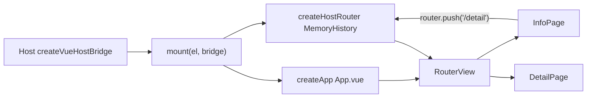

# 09 · Vue 子应用接入

> **本章目标**：讲清 Vue 子应用与 React 子应用在接入上的差异。**核心**：Host 不安装 Vue——Vue Remote 必须导出 `mount(el, bridge)`，由 Host 的 `createVueHostBridge` 包成 React 组件来渲染。
>
> 对应源码：`packages/federation-kit/src/bridge/createVueHostBridge.tsx`、`packages/federation-kit/src/mf/normalizePluginModule.ts`。参考实现：仓外 `remote-vue` / **`remote-vue-shadcn`（带 vue-router 多页）**。

---

## 1. 一句话

Host 是 React 应用且**不安装 Vue**。你的 Vue 子应用自带 Vue runtime，expose 导出 `mount(el, bridge)`；Host 加载后调用 `mount` 把 Vue 应用挂到指定 DOM。

**所以**：不要直接 `export default` 一个 Vue SFC——Host 不会 React-render 它，会报「framework "vue" 须 default 导出 mount」。

---

## 2. Host 侧桥（理解契约）

`normalizePluginModule` 检测到 Vue 后调用 `createVueHostBridge`（`packages/federation-kit/src/bridge/createVueHostBridge.tsx`）：

```tsx
// Host 侧源码（关键片段）
/** Remote 的 mount 类型：挂到 el，可返回 disposer */
export type VueRemoteMount = (
	el: HTMLElement,
	bridge: HostBridgeProps,
) => VueRemoteDisposer | undefined;

// 兼容两种导出：直接函数 / { mount } 对象
export type VueRemoteExpose =
	| VueRemoteMount
	| { mount: VueRemoteMount; unmount?: () => void };

// 把 Vue Remote 的 mount 包成 Host 可用的 React 组件
export function createVueHostBridge(
	expose: VueRemoteExpose,
	pluginId = "unknown",
) {
	const mount = resolveMount(expose, pluginId); // 解析出真正的 mount

	function VueHostBridge(props: HostBridgeProps) {
		const elRef = useRef<HTMLDivElement | null>(null);
		// 可变 bag：Remote 侧 reactive(bridge) 后可收到 api/locale 热更新
		const bridgeRef = useRef<HostBridgeProps>({
			api: props.api,
			plugin: props.plugin,
		});

		useEffect(() => {
			bridgeRef.current.api = props.api; // api/locale 变化时更新 bag
			bridgeRef.current.plugin = props.plugin;
		}, [props.api, props.plugin]);

		// useLayoutEffect：早于 paint、早于子树挂载——保证 Element Plus 在
		// onBeforeMount 建 popper 容器时，Host 的 Portal 桥已就绪
		useLayoutEffect(() => {
			const el = elRef.current;
			if (!el) return;
			const dispose = mount(el, bridgeRef.current);
			const explicitUnmount =
				typeof expose === "object" && "unmount" in expose
					? expose.unmount
					: undefined;
			return () => {
				if (typeof dispose === "function") dispose();
				else explicitUnmount?.();
			};
		}, []); // 空 deps：mount 一次；SFC HMR 由 Remote 自有 Vue runtime 处理

		return createElement("div", {
			ref: elRef,
			className: "h-full w-full min-h-0",
			"data-plugin-root": true,
			"data-mf-framework": "vue",
		});
	}
	return VueHostBridge;
}
```

> **对你（Vue 开发者）的意义**：
>
> 1. 你的 `mount` 会拿到一个**真实 DOM 容器**和一个 **bridge**；
> 2. bridge 是**同一个对象**（可变 bag）——建议 `reactive(bridge)` 后交给 Vue 根组件，Host 语言切换时 `api.locale` 会热更新；
> 3. 你的 `mount` 可以返回卸载函数，Host 会在插件卸载时调用。

---

## 3. registry 配置

```jsonc
// plugins-registry.json 里 Vue 插件的条目（React 不需要 framework 字段）
{
	"id": "vueStyleIsolationLab",
	"title": { "zh-CN": "Vue 样式实验", "en-US": "Vue style lab" },
	"routePath": "/plugins/vue-style-isolation-lab",
	"entry": "http://127.0.0.1:9009/mf-manifest.json",
	"expose": "./StyleIsolationLab", // 对应你 exposes 里的入口
	"framework": "vue", // ★ 必须写！告诉 Host 用 Vue 桥
	"version": "1.0.0",
	"hostApiRange": "^1.0.0",
	"permissions": ["ui:toast"],
	"enabled": true,
	"trust": "first-party",
}
```

> 省略 `framework` 时 Host 会**启发式判断**（default 形如 `{ mount }` → Vue）。**显式写 `"framework": "vue"` 最稳**，避免误判。

---

## 4. expose 入口（Vue）

```ts
// src/views/my-lab/index.ts —— Vue MF expose 入口
// 必须：Host 不执行 main.ts，样式要挂在 expose 上（第 10 章）
import "@/styles.css";
import { createApp, reactive } from "vue";
import App from "./App.vue";
import type { HostBridgeProps } from "@/types/host";

// ① 直接导出函数（推荐）
export function mount(el: HTMLElement, bridge: HostBridgeProps) {
	// reactive(bridge)：Host 语言切换时 api.locale 热更新，Vue 响应式自动触发渲染
	const app = createApp(App, { bridge: reactive(bridge) });
	app.mount(el);
	// 返回卸载函数（可选）
	return () => app.unmount();
}

// ② 或导出 { mount } 对象；生命周期可挂同对象（Host pickPluginLifecycle 会读）
export async function activate(api: HostBridgeProps["api"]) {
	console.log("[vue-remote] activate", api.locale);
}
export async function deactivate() {
	console.log("[vue-remote] deactivate");
}
export default { mount, activate, deactivate };
```

```vue
<!-- src/views/my-lab/App.vue -->
<template>
	<div class="plugin-standalone h-full" data-plugin-root>
		<h1>{{ t("lab.title") }} · {{ bridge.plugin.version }}</h1>
		<p>theme={{ bridge.api.theme }} · locale={{ bridge.api.locale }}</p>
		<el-button type="primary" @click="toast">
			{{ t("lab.toast") }}
		</el-button>
	</div>
</template>

<script setup lang="ts">
import { useI18n } from "@/i18n";

const props = defineProps<{ bridge: HostBridgeProps }>();
const bridge = props.bridge;
const t = useI18n(() => bridge.api.locale);

const toast = () => {
	bridge.api.ui?.showToast({ message: t("lab.toast"), type: "success" });
};
</script>
```

> **生命周期**：`activate` 在 `mount` **之前**由 Host 调用，参数是 `bridge.api`（不是整个 bridge）。Vue 无 React Fast Refresh 约束，named export 与挂在 `default` 上均可。缺钩子时 Host 会 `console.info`（见 [04](./04-expose-contract.md) / [implements-guide/08](../implements-guide/08-lifecycle-hooks.md)）。

---

## 5. 带内部子路由的 Vue 插件（多页）

Host **只注入一条** `routePath`。列表 → 详情这类二级页由子应用自己用 **vue-router** 解决。参考仓外 `remote-vue-shadcn`。

与 React 第 [06 §5](./06-connect-auto-route.md) 对照：

|           | React（06）                   | Vue（本章）                                                                             |
| --------- | ----------------------------- | --------------------------------------------------------------------------------------- |
| 推荐起步  | 自建 `NavigationProvider`     | **`vue-router` + `createMemoryHistory`**                                                |
| 独立预览  | 同一套内存 path 或自测 Router | **`createWebHistory`**（可改浏览器地址）                                                |
| Host 嵌入 | 不改 Host URL                 | **MemoryHistory**，不改写主站 URL                                                       |
| expose    | `default` = 壳 `App`          | `default` = `{ mount, activate?, deactivate? }`；`mount` 里 `createApp` + `use(router)` |

> **铁律**：`mount` 必须挂载带 `<RouterView />` 的根 `App.vue`，并 `app.use(router)`。不要只 mount 某一个叶子页——否则 `useRouter()` / `router.push` 无效。

### 5.0 目录与数据流

```text
exposes: './StyleIsolationLab' → src/views/info/index.ts（mount + 生命周期）
                                      │
                                      ├─ createHostRouter()     ← MemoryHistory
                                      ├─ createApp(App.vue, { bridge: reactive(bridge) })
                                      ├─ app.use(router)
                                      ├─ router.replace({ name: 'info' })  ← 嵌入默认进业务页
                                      └─ app.mount(el)

App.vue：provide(bridge) + <RouterView />
  ├─ /       → HomePage.vue
  ├─ /info   → views/info/App.vue      ← router.push('/detail')
  └─ /detail → views/detail/index.vue  ← router.push('/info')

独立预览 main.ts：createWebHistory + 同一套 routes / App.vue
```



| 符号                       | 职责                                            |
| -------------------------- | ----------------------------------------------- |
| `createAppRouter(history)` | 共用同一份 `routes`；预览 / 嵌入只换 history    |
| `createHostRouter()`       | `createMemoryHistory()`，嵌入 Host 不改主站 URL |
| `router`（预览）           | `createWebHistory()`，本地可刷地址栏            |
| `App.vue`                  | `provide` bridge + `<RouterView />`             |
| `useHostBridge()`          | 子页读 Host bridge（勿层层 props 钻孔）         |
| `useRouter().push`         | 标准 vue-router API，预览与嵌入写法相同         |

---

### 5.1 路由表：预览 WebHistory / 嵌入 MemoryHistory

```ts
// src/router/index.ts
import {
	createMemoryHistory,
	createRouter,
	createWebHistory,
	type Router,
	type RouterHistory,
} from "vue-router";
import HomePage from "@/views/home/HomePage.vue";
import InfoPage from "@/views/info/App.vue";
import DetailPage from "@/views/detail/index.vue";

// 预览与 Host 嵌入共用同一路由表，避免两套 path 不一致
const routes = [
	{ path: "/", name: "home", component: HomePage },
	{ path: "/info", name: "info", component: InfoPage },
	{ path: "/detail", name: "detail", component: DetailPage },
];

// history 可注入：独立预览用 Web，嵌入用 Memory
export function createAppRouter(
	history: RouterHistory = createWebHistory(),
): Router {
	return createRouter({ history, routes });
}

// 独立预览：可改浏览器地址栏（如 /info、/detail）
export const router = createAppRouter(createWebHistory());

// Host 嵌入：MemoryHistory，浏览器仍停在 Host 的 routePath
export function createHostRouter(): Router {
	return createAppRouter(createMemoryHistory());
}
```

> **为何嵌入必须用 Memory**：Host 只有一条精确路由（如 `/plugins/vue-lab`）。若嵌入时用 `createWebHistory` 再 `push('/detail')`，会把主站 URL 改成 `/detail`，跳出插件壳甚至 404。Memory 只在 Vue 应用内部切页，主站 URL 不变——等价于 React 方案 A。

---

### 5.2 根组件：provide bridge + RouterView

```vue
<!-- src/App.vue —— 根壳：与常规 Vue SPA 一致，只多一层 Host bridge -->
<script setup lang="ts">
import { provide, toRef } from "vue";
import { RouterView } from "vue-router";
import { HOST_BRIDGE_KEY } from "@/composables/useHostBridge";
import type { HostBridgeProps } from "@/types/host";

// Host / 预览都通过 props.bridge 注入
const props = defineProps<{ bridge: HostBridgeProps }>();

// toRef：保持对 reactive(bridge) 的响应（locale/theme 热更新）
provide(HOST_BRIDGE_KEY, toRef(props, "bridge"));
</script>

<template>
	<!-- 子路由出口；具体页面不在这里写死 -->
	<RouterView />
</template>
```

```ts
// src/composables/useHostBridge.ts
import { inject, type InjectionKey, type Ref } from "vue";
import type { HostBridgeProps } from "@/types/host";

export const HOST_BRIDGE_KEY: InjectionKey<Ref<HostBridgeProps>> =
	Symbol("hostBridge");

/** 任意子页读取 Host bridge；须在 App.vue 子树内 */
export function useHostBridge(): Ref<HostBridgeProps> {
	const bridge = inject(HOST_BRIDGE_KEY);
	if (!bridge) {
		throw new Error("useHostBridge() 须在 App.vue 子树内使用");
	}
	return bridge;
}
```

---

### 5.3 expose：`mount` 里挂 router（关键）

```ts
// src/views/info/index.ts —— MF expose 入口（vite exposes 指向本文件）
/**
 * Host 不装 Vue：须导出 mount(el, bridge)。
 * 与独立预览相同：createApp(App).use(router).mount(el)；仅 history 换成 Memory。
 */
import { createApp, reactive } from "vue";
import App from "@/App.vue";
import { createHostRouter } from "@/router";
import type { HostBridgeProps } from "@/types/host";
// Host 不跑 main.ts，样式必须挂在 expose 上（第 10 章）
import "@/styles.css";

export function mount(el: HTMLElement, bridge: HostBridgeProps) {
	// ★ 每次 mount 新建 Memory router，避免多实例串路由状态
	const router = createHostRouter();
	// reactive(bridge)：Host 改 locale/theme 时 Vue 自动更新
	const app = createApp(App, {
		bridge: reactive(bridge) as HostBridgeProps,
	});
	app.use(router);
	// 嵌入后默认进业务页（独立预览可从 / 进首页）
	void router.replace({ name: "info" });
	app.mount(el);
	// Host 卸载时调用返回的 disposer
	return () => app.unmount();
}

// Host 在 mount 之前调用；参数是 api，不是整个 bridge
async function activate(api: HostBridgeProps["api"]) {
	console.log("[vue-shadcn] activate", api.locale, api.theme);
}

async function deactivate() {
	console.log("[vue-shadcn] deactivate");
}

// Host pickPluginLifecycle：读 default 上的钩子（也可再 named export）
export default { mount, activate, deactivate };
```

```ts
// vite.config.ts（节选）
federation({
	name: "microVue",
	filename: "remoteEntry.js",
	manifest: true,
	exposes: {
		// registry.expose 须与此键一致
		"./StyleIsolationLab": "./src/views/info/index.ts",
	},
	// Host 不 shared vue；本 Remote 自带 runtime
	shared: {
		vue: { singleton: true, requiredVersion: "^3.5.0" },
	},
	dev: { remoteHmr: true },
});
```

```jsonc
// Host plugins-registry.json（节选）
{
	"id": "vueStyleIsolationLab",
	"routePath": "/plugins/vue-style-isolation-lab",
	"entry": "http://127.0.0.1:9009/mf-manifest.json",
	"expose": "./StyleIsolationLab",
	"framework": "vue",
	"permissions": ["ui:toast"],
	"enabled": true,
	"trust": "first-party",
}
```

---

### 5.4 子页：标准 `router.push` / `RouterLink`

```vue
<!-- src/views/info/App.vue（节选）—— 业务页，不是 expose 入口 -->
<script setup lang="ts">
import { computed } from "vue";
import { useRouter } from "vue-router";
import { useHostBridge } from "@/composables/useHostBridge";
import { Button } from "@/components/ui/button";

const bridge = useHostBridge();
const router = useRouter();
const theme = computed(() => bridge.value?.api?.theme);
const pluginId = computed(() => bridge.value?.plugin?.id);

function goDetail() {
	// 与独立预览写法完全相同；嵌入时走 MemoryHistory
	void router.push("/detail");
}

function hostToast() {
	bridge.value?.api?.ui?.showToast?.({
		message: "Host Toast from vue remote",
		type: "info",
	});
}
</script>

<template>
	<div
		class="plugin-standalone flex h-full min-h-0 flex-col gap-4 p-5.5"
		data-plugin-root
		:class="theme === 'dark' ? 'dark' : ''"
	>
		<p>plugin={{ pluginId }}</p>
		<Button type="button" @click="goDetail">跳转到详情页</Button>
		<Button type="button" variant="outline" @click="hostToast"
			>Host Toast</Button
		>
	</div>
</template>
```

```vue
<!-- src/views/detail/index.vue（节选） -->
<script setup lang="ts">
import { useRouter } from "vue-router";
import { useHostBridge } from "@/composables/useHostBridge";
import { Button } from "@/components/ui/button";

const bridge = useHostBridge();
const router = useRouter();
</script>

<template>
	<div
		class="plugin-standalone flex h-full flex-col gap-4 p-5.5"
		data-plugin-root
	>
		<p>plugin={{ bridge?.plugin?.id }} · v{{ bridge?.plugin?.version }}</p>
		<Button type="button" variant="outline" @click="router.push('/info')">
			返回说明页
		</Button>
	</div>
</template>
```

```vue
<!-- src/views/home/HomePage.vue（节选）—— 独立预览首页 -->
<script setup lang="ts">
import { RouterLink } from "vue-router";
import { Button } from "@/components/ui/button";
</script>

<template>
	<div class="flex flex-col gap-4 p-8">
		<h1>Vue3 MF 子应用</h1>
		<Button as-child>
			<RouterLink to="/info">打开实验室页</RouterLink>
		</Button>
	</div>
</template>
```

---

### 5.5 独立预览入口

```ts
// src/previewBridge.ts —— mock Host bridge，形状与 Host 注入一致
import type { HostBridgeProps } from "@/types/host";

export const previewBridge: HostBridgeProps = {
	api: {
		theme: "light",
		locale: "zh-CN",
		ui: {
			showToast: ({ message }) => console.info("[preview toast]", message),
		},
	},
	plugin: {
		id: "vueStyleIsolationLab",
		version: "1.0.0",
		routePath: "/plugins/vue-style-isolation-lab",
	},
};
```

```ts
// src/main.ts —— 独立预览：WebHistory + 同一套 App
import { createApp } from "vue";
import App from "./App.vue";
import { previewBridge } from "./previewBridge";
import { router } from "./router";
import "./styles.css";

createApp(App, { bridge: previewBridge }).use(router).mount("#app");
```

本地可直接访问 `/info`、`/detail` 验跳转；嵌入 Host 后点同一按钮，因 MemoryHistory，主站地址栏仍停在 `routePath`。

---

### 5.6 可选：嵌入也改 Host URL

若要分享深链（如 `/plugins/vue-lab/detail`），需同时满足：

1. Host 路由支持 `routePath/*`（与管理员确认）；
2. 嵌入时用 `createWebHistory(plugin.routePath)` 作 basename，而不是 Memory；
3. 或走 Host `api.navigate`（权限 `nav:subtree`，路径须带 `routePath` 前缀）。

多数场景用 **MemoryHistory** 即可，与 React 方案 A 同语义。

```ts
// 进阶示例（需 Host 支持子路径）——一般不要默认这么写
import { createWebHistory } from "vue-router";

export function createHostRouterWithBasename(routePath: string) {
	return createAppRouter(createWebHistory(routePath));
}
```

---

### 5.7 反例与排障

| 错误写法                                     | 现象                                | 正确做法                                              |
| -------------------------------------------- | ----------------------------------- | ----------------------------------------------------- |
| `mount` 只挂叶子页 SFC，无 `app.use(router)` | `useRouter()` 报错 / 跳转无效       | mount 根 `App.vue` + `createHostRouter()`             |
| 嵌入仍用 `createWebHistory()`                | 主站 URL 被改成 `/detail`，跳出插件 | 嵌入用 `createMemoryHistory()`                        |
| 预览与嵌入两套不同 `routes`                  | 本地能跳、嵌 Host 404               | 共用 `createAppRouter(history)`                       |
| `activate(bridge)` 当整个 bridge 用          | 实际收到的是 `api`                  | 签名写成 `(api: HostBridgeProps['api'])`              |
| registry 漏 `framework: "vue"`               | 被当成 React 白屏                   | 显式 `"framework": "vue"`                             |
| 未导出 activate/deactivate                   | 控制台 info，仍可加载               | 挂在 `export default { mount, activate, deactivate }` |

调试：

```js
// Host 控制台：强制重载以再次跑 activate
await pluginManager.ensurePlugin("vueStyleIsolationLab", { force: true });
```

---

## 6. 关键差异速查（React vs Vue）

| 事项                 | React 子应用                                                                       | Vue 子应用                                                      |
| -------------------- | ---------------------------------------------------------------------------------- | --------------------------------------------------------------- |
| registry `framework` | 可省略                                                                             | **必须** `"vue"`                                                |
| expose 导出          | `default` React 组件                                                               | `mount(el, bridge)` 或 `{ mount }`                              |
| 根 props             | `props` 直接收 `HostBridgeProps`                                                   | 根组件收 `props.bridge`                                         |
| bridge 热更新        | React 每次重传新 props                                                             | 用 `reactive(bridge)` 同一个对象                                |
| 内部多页             | `NavigationProvider` 或自建 `BrowserRouter`（[06 §5](./06-connect-auto-route.md)） | **vue-router**：预览 WebHistory / 嵌入 MemoryHistory（本章 §5） |
| shared vue           | —                                                                                  | Host **不** shared vue；Remote 自带 vue                         |
| Host 是否装 Vue      | —                                                                                  | 不装                                                            |

---

## 7. Vite 配置（Vue 版差异）

```ts
// vite.config.ts —— Vue 子应用
import { federation } from "@module-federation/vite";
import vue from "@vitejs/plugin-vue"; // 用 Vue 插件替代 react

export default defineConfig(({ mode }) => {
	return {
		base: `${origin}/`, // 同 React：与 registry entry 一致
		plugins: [
			vue(),
			federation({
				name: "microVue",
				filename: "remoteEntry.js",
				manifest: true,
				exposes: { "./StyleIsolationLab": "./src/views/info/index.ts" },
				// Vue 子应用：Host 不装 Vue；本仓可 singleton
				shared: {
					vue: { singleton: true, requiredVersion: "^3.5.0" },
				},
				hostInitInjectLocation: "entry",
				dts: false,
				dev: { remoteHmr: true }, // SFC HMR 走 Remote 自己的 Vite
			}),
		],
		optimizeDeps: {
			exclude: ["vue"],
		},
		server: {
			host,
			port: 9009,
			strictPort: true,
			cors: true,
			headers: { "Access-Control-Allow-Origin": "*" },
		},
		build: { target: "esnext", modulePreload: false, minify: false },
		resolve: { alias: { "@": "/src" }, dedupe: ["vue"] },
	};
});
```

---

## 8. Element Plus / shadcn-vue 与样式

- **每个 expose 入口** `import '@/styles.css'`；若用 Element Plus，还需保证样式随 expose 加载。
- **shadcn-vue / reka-ui**：Teleport 弹层由 Host Portal 收编，**不要**手改 `append-to`。
- **图标**建议包在按钮组件内：裸 SVG 在 Tailwind `svg { display: block }` 下容易撑满容器。
- **Portal**：EP 的 `#el-popper-container-*` 由 Host 自动收编，**不要**自己改 `getContainer` / `appendTo`。

---

## 9. 常见问题

| 症状                               | 原因                                                 | 解决                                             |
| ---------------------------------- | ---------------------------------------------------- | ------------------------------------------------ |
| Vue 嵌 Host 白屏                   | 仍 `export default` SFC                              | 改为 `export default { mount }` 或函数 mount     |
| 报「framework "vue" 须导出 mount」 | registry 没写 `framework: vue` 且 default 不是 mount | 写 `"framework": "vue"`                          |
| 当成 React 渲染（hooks 报错）      | 启发式误判                                           | 显式 `"framework": "vue"`                        |
| 浮层样式缺失                       | CSS 没随 expose 加载                                 | expose 里引入样式入口                            |
| 语言不更新                         | 没 reactive bridge                                   | `createApp(App, { bridge: reactive(bridge) })`   |
| 嵌 Host 点详情跳出 / 404           | 嵌入用了 WebHistory                                  | 改用 `createMemoryHistory`（§5）                 |
| `useRouter` 报错                   | mount 时未 `app.use(router)`                         | 见 §5.3                                          |
| 未跑 activate                      | 钩子未挂到 `default` / named                         | `export default { mount, activate, deactivate }` |
