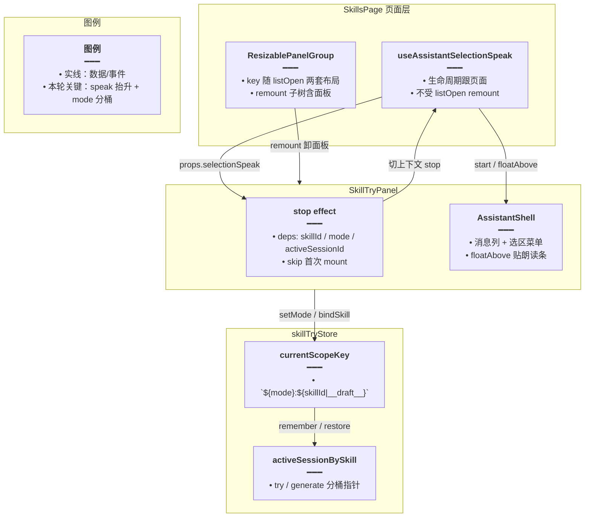
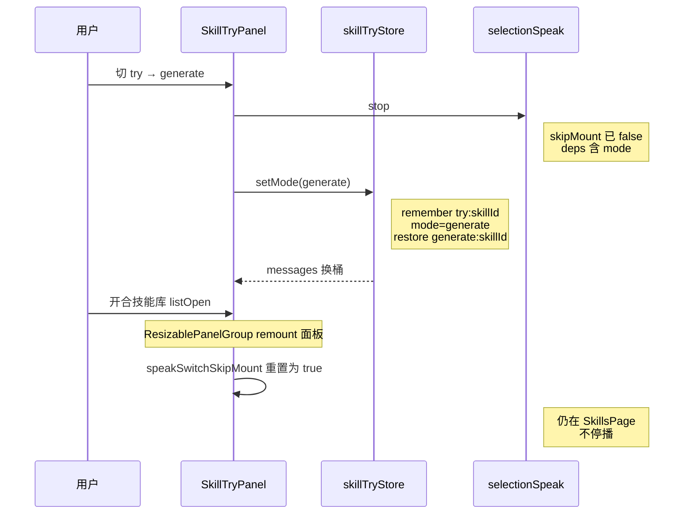

# Skill 侧栏朗读与会话切换

## 一、功能概述

Skill 页（`/skills`）侧栏落地后手测暴露三类问题：开合左侧技能库会打断选区朗读；试跑 / 生成共用会话指针导致消息串台；朗读提到父页后切 Skill / 模式 / 历史会话不再自动停播。本轮修复：页面级持有朗读 hook、`currentScopeKey` 改为 `` `${mode}:${skillId}` ``、切上下文时 skip-mount 后显式 `stop`，侧栏气泡 variant 统一为 `panel`。

## 二、实现方案

### 2.1 架构



### 2.2 时序：切模式 + 开合库



### 2.3 决策要点

1. **抬升 speak，不取消 remount**：`key={listOpen ? …}` 是为两套 `defaultLayout` 重建；抬 hook 比改布局算法更短。
2. **scope 必须带 mode**：`remember` / `restore` 已存在；只改 key 公式即可。
3. **stop 依赖抽 `stopSpeak`**：避免把整个 `selectionSpeak` 对象放进 deps。
4. **skip 首次 mount**：库开合 remount 面板会重置 ref；挂载立即 stop 会复现「开合库断播」。
5. **`activeSessionId` 进 deps**：历史抽屉切会话不改 skillId/mode，也须停播。

## 三、改动点明细

### 1. `apps/frontend/src/store/skillTry.ts` — `currentScopeKey` + `attachDraftToSkill`

#### 改动原因

`activeSessionBySkill` 的 key 原先只有 skillId（或 `__draft__`），`setMode` 先 remember 再改 mode 再 restore 时读写同一槽，试跑与生成消息串台。草稿保存回填也须固定写在 `generate:` 前缀下，避免与试跑指针互盖。

#### 改动前

```ts
	// 当前编辑器对应的分桶 key：仅 skillId / 草稿，不含试跑·生成模式
	private currentScopeKey(): string {
		// 直接用 boundSkillId → scopeKey；try 与 generate 共享同一指针槽
		return scopeKey(this.boundSkillId);
	}

	// 打开 Skill / 新建 / 保存后把编辑器快照写入 lastApplied，供条件 intentPrefix 比对
	syncEditorBaseline(title: string, content: string): void {
		// 取当前 scope；修前 try/generate 会写到同一 key
		const key = this.currentScopeKey();
		// 记录标题与正文基线，避免已同步后仍注入全文
		this.lastAppliedByScope[key] = {
			// 标题去空白，与发送侧 trim 对齐
			title: (title ?? '').trim(),
			// 正文允许空串，表示「已对齐但无内容」
			content: content ?? '',
		};
	}

	// 「应用到编辑器」后与 sync 共用同一写入路径，保证基线一致
	markEditorApplied(title: string, content: string): void {
		// 委托 sync，避免两处复制对象字面量
		this.syncEditorBaseline(title, content);
	}

	/**
	 * 新建草稿首次保存：把草稿桶会话 bind 到新 skillId，并迁移本地指针。
	 * 须在 skillStore 写入 editingId 之前调用，避免 bindSkill(新 id) 把 activeSession 清成空。
	 */
	async attachDraftToSkill(skillId: string): Promise<void> {
		// 规范化新 Skill id，空串直接返回
		const kid = skillId.trim();
		// 未登录或 id 无效则不调 bind API
		if (!kid || !readToken()) return;
		// 修前草稿桶 key 仅为 __draft__，与 mode 无关
		const draftKey = GENERATE_DRAFT_SCOPE;
		// 收集需要 bind 到新 skillId 的会话 id
		const toBind = new Set<string>();
		// 从草稿指针槽取出曾记住的会话
		const draftSid = this.activeSessionBySkill[draftKey];
		// 有草稿会话则加入待 bind 集合
		if (draftSid) toBind.add(draftSid);
		// 当前仍在未绑定 Skill 状态时，把正在展示的会话也纳入
		if (this.activeSessionId && this.boundSkillId == null) {
			// 避免只迁指针不迁「当前窗」会话
			toBind.add(this.activeSessionId);
		}
		// 优先保留「当前窗且未绑定」的会话，否则用草稿指针或当前 id
		const moved =
			this.activeSessionId && this.boundSkillId == null
				? this.activeSessionId
				: (draftSid ?? this.activeSessionId);
		// 逐个调后端 bind；失败忽略（已绑定或非 generate）
		for (const sid of toBind) {
			try {
				// PATCH 会话 skill_id = kid
				await bindSkillTrySession(sid, kid);
			} catch {
				/* 已绑定或非 generate 则忽略 */
			}
		}
		// 本地指针与基线迁到正式 skillId（修前无 generate: 前缀）
		runInAction(() => {
			// 正式 Skill 槽写入迁出的会话 id
			this.activeSessionBySkill[kid] = moved ?? null;
			// 删掉草稿槽，避免双指针
			delete this.activeSessionBySkill[draftKey];
			// 若草稿有 lastApplied，一并迁到正式 id
			const baseline = this.lastAppliedByScope[draftKey];
			if (baseline) {
				// 正式槽写入同一基线对象引用
				this.lastAppliedByScope[kid] = baseline;
				// 清理草稿基线
				delete this.lastAppliedByScope[draftKey];
			}
			// 标记已绑定到新 Skill
			this.boundSkillId = kid;
			// 若有迁出会话，切到该会话并补标题
			if (moved) {
				// 展示会话指向迁出 id
				this.activeSessionId = moved;
				// 确保 runtime 状态桶存在
				this.ensureSessionState(moved);
				// 从列表行取标题（若有）
				const row = this.sessionList.find((s) => s.sessionId === moved);
				// 有标题则更新条目标题
				if (row?.title != null) this.sessionTitle = row.title;
			}
		});
		// 按新 skillId 刷新历史列表
		await this.refreshSessionList(kid);
		// 本地无消息时拉详情，不中止其它流
		this.hydrateActiveIfNeeded();
	}
```

#### 改动后

```ts
	// 当前编辑器 + 面板模式对应的分桶 key
	private currentScopeKey(): string {
		// try / generate 分桶，否则切模式会复用对方会话指针
		return `${this.mode}:${scopeKey(this.boundSkillId)}`;
	}

	// 打开 Skill / 新建 / 保存后把编辑器快照写入 lastApplied，供条件 intentPrefix 比对
	syncEditorBaseline(title: string, content: string): void {
		// 取带 mode 的 scope；generate 时与 sendMessage 的 generate: 前缀一致
		const key = this.currentScopeKey();
		// 记录标题与正文基线，避免已同步后仍注入全文
		this.lastAppliedByScope[key] = {
			// 标题去空白，与发送侧 trim 对齐
			title: (title ?? '').trim(),
			// 正文允许空串，表示「已对齐但无内容」
			content: content ?? '',
		};
	}

	// 「应用到编辑器」后与 sync 共用同一写入路径，保证基线一致
	markEditorApplied(title: string, content: string): void {
		// 委托 sync，避免两处复制对象字面量
		this.syncEditorBaseline(title, content);
	}

	/**
	 * 新建草稿首次保存：把草稿桶会话 bind 到新 skillId，并迁移本地指针。
	 * 须在 skillStore 写入 editingId 之前调用，避免 bindSkill(新 id) 把 activeSession 清成空。
	 */
	async attachDraftToSkill(skillId: string): Promise<void> {
		// 规范化新 Skill id，空串直接返回
		const kid = skillId.trim();
		// 未登录或 id 无效则不调 bind API
		if (!kid || !readToken()) return;
		// 草稿桶固定在 generate 模式（仅生成流程会写草稿会话）
		const draftKey = `generate:${GENERATE_DRAFT_SCOPE}`;
		// 正式 Skill 的 generate 槽
		const skillKey = `generate:${kid}`;
		// 收集需要 bind 到新 skillId 的会话 id
		const toBind = new Set<string>();
		// 从 generate 草稿指针槽取出曾记住的会话
		const draftSid = this.activeSessionBySkill[draftKey];
		// 有草稿会话则加入待 bind 集合
		if (draftSid) toBind.add(draftSid);
		// 当前仍在未绑定 Skill 状态时，把正在展示的会话也纳入
		if (this.activeSessionId && this.boundSkillId == null) {
			// 避免只迁指针不迁「当前窗」会话
			toBind.add(this.activeSessionId);
		}
		// 优先保留「当前窗且未绑定」的会话，否则用草稿指针或当前 id
		const moved =
			this.activeSessionId && this.boundSkillId == null
				? this.activeSessionId
				: (draftSid ?? this.activeSessionId);
		// 逐个调后端 bind；失败忽略（已绑定或非 generate）
		for (const sid of toBind) {
			try {
				// PATCH 会话 skill_id = kid
				await bindSkillTrySession(sid, kid);
			} catch {
				/* 已绑定或非 generate 则忽略 */
			}
		}
		// 本地指针与基线迁到 generate:正式Id
		runInAction(() => {
			// 写入 generate 正式槽，不碰 try: 槽
			this.activeSessionBySkill[skillKey] = moved ?? null;
			// 删掉 generate 草稿槽
			delete this.activeSessionBySkill[draftKey];
			// 若草稿有 lastApplied，迁到 generate:正式Id
			const baseline = this.lastAppliedByScope[draftKey];
			if (baseline) {
				// 正式 generate 槽写入基线
				this.lastAppliedByScope[skillKey] = baseline;
				// 清理草稿基线
				delete this.lastAppliedByScope[draftKey];
			}
			// 标记已绑定到新 Skill
			this.boundSkillId = kid;
			// 若有迁出会话，切到该会话并补标题
			if (moved) {
				// 展示会话指向迁出 id
				this.activeSessionId = moved;
				// 确保 runtime 状态桶存在
				this.ensureSessionState(moved);
				// 从列表行取标题（若有）
				const row = this.sessionList.find((s) => s.sessionId === moved);
				// 有标题则更新条目标题
				if (row?.title != null) this.sessionTitle = row.title;
			}
		});
		// 按新 skillId 刷新历史列表
		await this.refreshSessionList(kid);
		// 本地无消息时拉详情，不中止其它流
		this.hydrateActiveIfNeeded();
	}
```

#### 改动说明

- `currentScopeKey` → `` `${mode}:${scopeKey(...)}` ``，`setMode` / `bindSkill` 的 remember/restore 自动分桶。
- `attachDraftToSkill` 固定读写 `generate:…`；`sendMessage` 查阅 lastApplied 亦为 `` `generate:${scopeKey(skillId)}` ``。

---

### 2. `apps/frontend/src/views/skills/index.tsx` — 朗读 hook 抬到页面

#### 改动原因

`ResizablePanelGroup` 的 `key` 随 `listOpen` 变化会整树 remount，若 `useAssistantSelectionSpeak` 挂在 `SkillTryPanel` 内，开合技能库等于卸载朗读会话。

#### 改动前

```tsx
	// 左侧技能列表：默认隐藏，对齐知识库「库」抽屉默认关
	const [listOpen, setListOpen] = useState(false);
	// Monaco / 剪贴板适配器；与朗读无关
	const clipboardAdapter = useMemo(
		() => ({ copyToClipboard, pasteFromClipboard }),
		[],
	);

	// ... 中间省略：onSave / onNew / 快捷键 / onDelete ...

			{/*
			 * key 随 listOpen 切换，强制按对应 defaultLayout 重建：
			 * - 开列表：28 / 44 / 28（当前三栏）
			 * - 关列表：50 / 50（对齐知识库 Monaco 编辑器+助手）
			 */}
			<ResizablePanelGroup
				key={listOpen ? 'skills-with-list' : 'skills-editor-try'}
				id={listOpen ? 'skills-split-list' : 'skills-split-editor'}
				orientation="horizontal"
				className="min-h-0 min-w-0 flex-1 gap-0 rounded-md"
				defaultLayout={
					listOpen
						? {
								'skills-list': 28,
								'skills-editor': 44,
								'skills-try': 28,
							}
						: {
								'skills-editor': 50,
								'skills-try': 50,
							}
				}
			>
				{/* ... 列表与编辑器面板 ... */}
					{/* 修前把 listOpen 传给面板，仅用于 initialWidth；speak 仍在面板内 */}
					<SkillTryPanel listOpen={listOpen} />
			</ResizablePanelGroup>
```

#### 改动后

```tsx
	// 左侧技能列表：默认隐藏，对齐知识库「库」抽屉默认关
	const [listOpen, setListOpen] = useState(false);
	/** 挂在本页：listOpen 会 remount ResizablePanelGroup，勿放进 SkillTryPanel 以免打断朗读 */
	const selectionSpeak = useAssistantSelectionSpeak({
		// 开列表时朗读条默认更窄，关列表对齐知识库助手宽
		initialWidth: listOpen ? 219 : 344,
	});
	// Monaco / 剪贴板适配器；与朗读无关
	const clipboardAdapter = useMemo(
		() => ({ copyToClipboard, pasteFromClipboard }),
		[],
	);

	// ... 中间省略：onSave / onNew / 快捷键 / onDelete ...

			{/*
			 * key 随 listOpen 切换，强制按对应 defaultLayout 重建：
			 * - 开列表：28 / 44 / 28（当前三栏）
			 * - 关列表：50 / 50（对齐知识库 Monaco 编辑器+助手）
			 */}
			<ResizablePanelGroup
				key={listOpen ? 'skills-with-list' : 'skills-editor-try'}
				id={listOpen ? 'skills-split-list' : 'skills-split-editor'}
				orientation="horizontal"
				className="min-h-0 min-w-0 flex-1 gap-0 rounded-md"
				defaultLayout={
					listOpen
						? {
								'skills-list': 28,
								'skills-editor': 44,
								'skills-try': 28,
							}
						: {
								'skills-editor': 50,
								'skills-try': 50,
							}
				}
			>
				{/* ... 列表与编辑器面板 ... */}
					{/* 页面级 speak 下传；Group remount 不卸载 hook */}
					<SkillTryPanel selectionSpeak={selectionSpeak} />
			</ResizablePanelGroup>
```

#### 改动说明

- `useAssistantSelectionSpeak` 迁到 `SkillsPage`；面板改为接收 `selectionSpeak` prop。
- 保留 `key` remount 策略（两套布局），不因朗读去改布局算法。

---

### 3. `apps/frontend/src/views/skills/SkillTryPanel.tsx` — 接收 speak + skip-mount 停播

#### 改动原因

speak 抬升后，切 Skill / 模式 / 历史会话不再因卸载而停播，需显式 `stop`；同时库开合 remount 面板时不能误 stop。

#### 改动前

```tsx
// 试跑/生成面板：自持朗读 hook（会随 ResizablePanelGroup remount 一起卸掉）
const SkillTryPanel = observer(function SkillTryPanel({
	listOpen = false,
}: {
	/** 左侧技能列表是否展开：开则朗读条默认更窄 */
	listOpen?: boolean;
}) {
	// i18n / 导航 / 全局 store
	const { t } = useI18n();
	const navigate = useNavigate();
	const { userStore, knowledgeStore } = useStore();
	// 输入框与历史抽屉本地态
	const [input, setInput] = useState('');
	const [isHistoryDrawerOpen, setIsHistoryDrawerOpen] = useState(false);
	// 复制按钮态
	const { isCopyedId, onCopy } = useAssistantCopy();
	// 朗读会话挂在本组件：父级 key 变化即丢失
	const selectionSpeak = useAssistantSelectionSpeak({
		// 仅影响条默认宽度，无法抵抗 remount
		initialWidth: listOpen ? 300 : 344,
	});
	// 登录态与当前编辑 Skill / 模式
	const isLoggedIn = Boolean(userStore.userInfo?.id);
	const skillId = skillStore.editingId;
	const mode = skillTryStore.mode;
	const isGenerate = mode === 'generate';
	const aiMessages = skillTryStore.messages;
	const canUseToolbar = isLoggedIn && (isGenerate || Boolean(skillId));

	// 编辑 Skill 变化时绑定 store 指针
	useEffect(() => {
		skillTryStore.bindSkill(skillId);
	}, [skillId]);

	// 修前：无 stop effect；切会话依赖 remount 副作用，抬升后会漏停
```

#### 改动后

```tsx
// 从 hook 返回类型推导 props，避免手写 speak API 表面
type SkillSelectionSpeak = ReturnType<typeof useAssistantSelectionSpeak>;

// 试跑/生成面板：speak 由页面注入，生命周期与布局 remount 解耦
const SkillTryPanel = observer(function SkillTryPanel({
	selectionSpeak,
}: {
	/** 由 SkillsPage 持有，避免技能库开合 remount 本面板时打断朗读 */
	selectionSpeak: SkillSelectionSpeak;
}) {
	// i18n / 导航 / 全局 store
	const { t } = useI18n();
	const navigate = useNavigate();
	const { userStore, knowledgeStore } = useStore();
	// 输入框与历史抽屉本地态
	const [input, setInput] = useState('');
	const [isHistoryDrawerOpen, setIsHistoryDrawerOpen] = useState(false);
	// 复制按钮态
	const { isCopyedId, onCopy } = useAssistantCopy();
	// 登录态与当前编辑 Skill / 模式 / 展示会话
	const isLoggedIn = Boolean(userStore.userInfo?.id);
	const skillId = skillStore.editingId;
	const mode = skillTryStore.mode;
	const isGenerate = mode === 'generate';
	const aiMessages = skillTryStore.messages;
	const activeSessionId = skillTryStore.activeSessionId;
	const canUseToolbar = isLoggedIn && (isGenerate || Boolean(skillId));

	// 编辑 Skill 变化时绑定 store 指针（remember/restore 走 mode: 分桶）
	useEffect(() => {
		skillTryStore.bindSkill(skillId);
	}, [skillId]);

	/** 切 Skill / 模式 / 历史会话时停播；跳过挂载（含技能库开合 remount）避免误关播放条 */
	const speakSwitchSkipMount = useRef(true);
	// 只订阅 stop 函数引用，避免 selectionSpeak 对象身份变化误触发
	const stopSpeak = selectionSpeak.stop;
	useEffect(() => {
		// 首次挂载（含 listOpen remount 后的新实例）跳过 stop
		if (speakSwitchSkipMount.current) {
			// 之后同实例上的 skillId/mode/session 变化才停播
			speakSwitchSkipMount.current = false;
			return;
		}
		// 真正切换对话上下文时关闭朗读条与音频
		stopSpeak();
	}, [skillId, mode, activeSessionId, stopSpeak]);
```

#### 改动说明

- 去掉面板内 `useAssistantSelectionSpeak`。
- skip-mount + deps 含 `activeSessionId`：开合库不断播，切历史必停播。

---

### 4. `apps/frontend/src/components/design/Assistant/utils.ts` — `english` → `panel`

#### 改动原因

`AssistantMessageVariant` 已定义为 `default | panel`，侧栏仍走旧分支名 `english`，与类型注释不一致；顺带微调 Skill/知识库侧栏气泡底色。

#### 改动前

```ts
// 按 variant 拼消息气泡外壳 class（用户靠右 / 助手铺满）
export function messageLabelClass(
	// default | panel；修前侧栏误传 english 字符串
	variant: AssistantMessageVariant,
	// 是否用户消息，决定对齐与底色
	isUser: boolean,
): string {
	// 旧分支名 english：实际被 Skill/知识库侧栏误用为「嵌入助手」样式
	if (variant === 'english') {
		// 侧栏气泡：圆角 padding + 可选中文本
		return cn(
			'message-md-wrap relative mb-5 flex min-w-0 max-w-full select-text rounded-md p-4 text-textcolor',
			isUser
				? 'w-fit max-w-[min(100%,36rem)] border border-teal-500/5 bg-teal-500/8 px-4 pt-2 pb-2.5'
				: 'w-full border border-theme/5 bg-theme-secondary/60 py-3',
		);
	}
	// 主聊 default：用户靠右浅绿底，助手铺满浅主题底
	return cn(
		'message-md-wrap relative flex min-w-0 max-w-full rounded-md p-3 select-text text-textcolor mb-5',
		isUser
			? 'w-fit max-w-full self-end bg-teal-600/5 border border-teal-500/5 text-end pt-2 pb-2.5 px-3'
			: 'flex-1 bg-theme/5 border border-theme/5',
	);
}
```

#### 改动后

```ts
// 按 variant 拼消息气泡外壳 class（用户靠右 / 助手铺满）
export function messageLabelClass(
	// default | panel（与 AssistantMessageVariant 对齐）
	variant: AssistantMessageVariant,
	// 是否用户消息，决定对齐与底色
	isUser: boolean,
): string {
	// panel = 侧栏/嵌入助手（知识库、技能、电子书、英语学习等），与 types 注释对齐
	if (variant === 'panel') {
		// 侧栏气泡：圆角 padding + 可选中文本；底色跟主题 token
		return cn(
			'message-md-wrap relative mb-5 flex min-w-0 max-w-full select-text rounded-md p-4 text-textcolor',
			isUser
				? 'w-fit max-w-[min(100%,36rem)] border border-theme/5 bg-teal-500/10 px-4 pt-2 pb-2.5'
				: 'w-full border border-theme/5 bg-theme/5 py-3',
		);
	}
	// 主聊 default：用户靠右浅绿底，助手铺满浅主题底（本轮未改）
	return cn(
		'message-md-wrap relative flex min-w-0 max-w-full rounded-md p-3 select-text text-textcolor mb-5',
		isUser
			? 'w-fit max-w-full self-end bg-teal-600/5 border border-teal-500/5 text-end pt-2 pb-2.5 px-3'
			: 'flex-1 bg-theme/5 border border-theme/5',
	);
}
```

#### 改动说明

同文件 `messageRowClass` / `messageUserContentClass` / `messageAssistantContentClass` 分支条件一并改为 `panel`。

## 四、功能实现逻辑

### 4.1 会话指针分桶

| 操作 | 行为 |
|------|------|
| `setMode` | remember 旧 `` `${oldMode}:…` `` → 改 mode → restore 新 `` `${newMode}:…` `` |
| `bindSkill` | 同理换 skill 段；try/generate 同一套锚定 |
| `attachDraftToSkill` | 只迁 `generate:__draft__` → `generate:新id` |
| `sendMessage` lastApplied | 固定读 `` `generate:${scopeKey(skillId)}` `` |

### 4.2 朗读生命周期

| 事件 | 朗读 |
|------|------|
| 开合技能库（listOpen） | 不停（hook 在页面；面板 remount 走 skip mount） |
| 切 Skill / 试跑·生成 / 历史会话 | `stopSpeak()` |
| 面板首次挂载 | 跳过 stop |

### 4.3 回归验收

| # | 步骤 | 期望 |
|---|------|------|
| AC1 | 朗读中开合技能库 | 不中断 |
| AC2 | 同一 Skill 试跑两轮→切生成→回试跑 | 试跑消息仍在；生成独立 |
| AC3 | 朗读中切 Skill / 历史 | 停播 |
| AC4 | 仅开合库 | 不因 remount 误 stop |

## 五、注意事项 / 风险点

1. **旧无 mode 前缀的内存指针**：刷新页即清空，可接受；勿在热更新中假设旧 key 仍有效。
2. **`Skill前端.md` 中早期 `generateActiveSessionId` 双槽描述已过时**：以本文 `mode:` 统一 Map 为准。
3. **正式归档姊妹稿**：[docs/knowledge/Skill侧栏朗读与会话切换.md](../docs/knowledge/Skill侧栏朗读与会话切换.md)；生成锚定 M4 见 [docs/ideas/knowledge/Skill生成工件锚定.md](../docs/ideas/knowledge/Skill生成工件锚定.md)。

若与仓库最新源码不一致，以源码为准。
