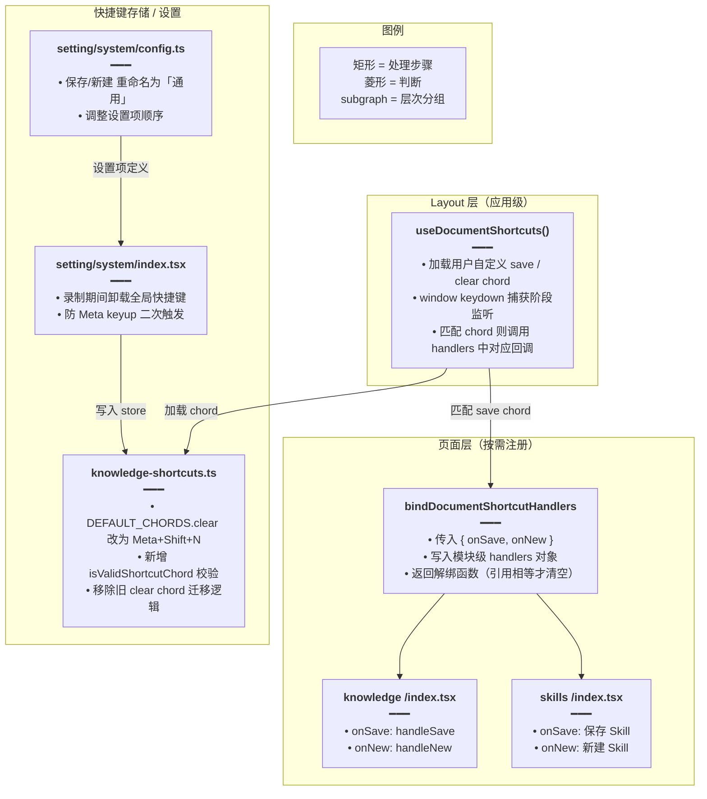
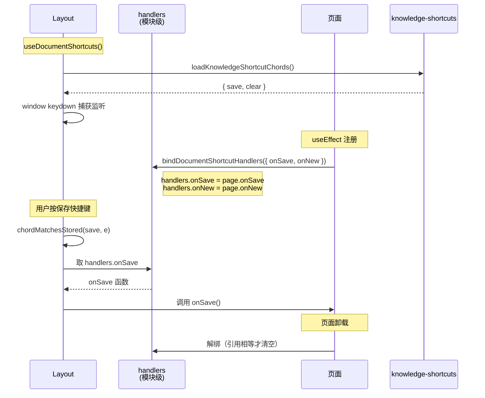
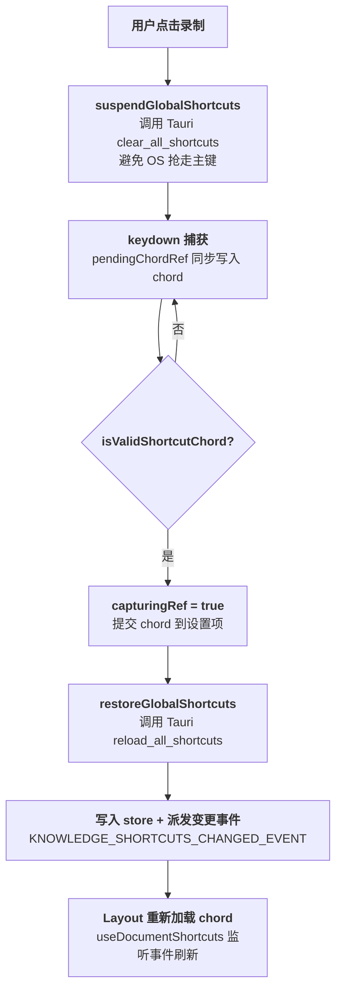

# 文档级快捷键（保存 / 新建）

## 一、功能概述

把「保存」「新建」两个快捷键从知识库页面内监听提升为**应用级统一监听**：Layout 挂载时全局注册 keydown，各页面通过 `bindDocumentShortcutHandlers` 注册自己的保存/新建回调。同时调整快捷键设置项的命名（「知识库：保存」→「通用：保存」、「知识库：清空草稿」→「通用：新建」），并优化快捷键录制体验（录制期间临时卸载全局快捷键，避免 OS 抢走主键）。

## 二、实现方案

核心思路是「**全局监听 + 页面注册回调**」：



## 三、改动点明细

### 1. `apps/frontend/src/hooks/useDocumentShortcuts.ts`（新增）

#### 改动原因
需要一个应用级 hook，在 Layout 统一监听保存/新建快捷键，避免每个页面各自监听导致冲突或遗漏。

#### 改动前
无此文件，保存/新建快捷键由各页面（如知识库）自行监听。

#### 改动后
```ts
// 从 React 导入 useEffect（副作用）、useRef（可变引用）、useState（状态）
import { useEffect, useRef, useState } from 'react';
// 从 knowledge-shortcuts 工具导入：chord 匹配函数、默认 chord、chord 变更事件名、加载 chord 函数
import {
	chordMatchesStored,
	KNOWLEDGE_SHORTCUT_DEFAULT_CHORDS,
	KNOWLEDGE_SHORTCUTS_CHANGED_EVENT,
	loadKnowledgeShortcutChords,
} from '@/utils/knowledge-shortcuts';

// 定义文档级快捷键回调的类型：可选的 onSave（保存）和 onNew（新建）
type DocShortcutHandlers = {
	onSave?: () => void;
	onNew?: () => void;
};

// 模块级变量：当前注册的回调集合
// 放在模块作用域而非组件 state，是因为 Layout 和页面组件各自独立，
// 通过共享模块变量实现「页面注册 → Layout 调用」的解耦
let handlers: DocShortcutHandlers = {};

/** 当前页注册保存/新建；返回解绑（仅当仍是同一函数引用时清空） */
// 导出函数：页面调用此函数注册自己的 onSave / onNew 回调
// 参数 next：新的回调集合，会与现有 handlers 合并
// 返回值：解绑函数，调用时按引用相等性清空对应回调
export function bindDocumentShortcutHandlers(
	next: DocShortcutHandlers,
): () => void {
	// 将新回调合并到模块级 handlers 中（浅合并，同名字段被覆盖）
	handlers = { ...handlers, ...next };
	// 返回解绑函数
	return () => {
		// 仅当当前 onSave 仍是注册时的同一函数引用时才清空，避免误清后续页面注册的回调
		if (next.onSave && handlers.onSave === next.onSave) {
			handlers = { ...handlers, onSave: undefined };
		}
		// 同理，按引用相等性清空 onNew
		if (next.onNew && handlers.onNew === next.onNew) {
			handlers = { ...handlers, onNew: undefined };
		}
	};
}

/** Layout 挂载：应用内统一监听「通用：保存 / 新建」chord */
// 导出 hook：在 Layout 组件中调用，设置全局快捷键监听
// 返回值：当前 save 和 new 的 chord 字符串（可用于 Tooltip 展示）
export function useDocumentShortcuts(): {
	saveChord: string;
	newChord: string;
} {
	// 初始化 chord 状态，默认值取 KNOWLEDGE_SHORTCUT_DEFAULT_CHORDS 的 save 和 clear
	const [chords, setChords] = useState<{ save: string; clear: string }>({
		save: KNOWLEDGE_SHORTCUT_DEFAULT_CHORDS.save,
		clear: KNOWLEDGE_SHORTCUT_DEFAULT_CHORDS.clear,
	});
	// 用 ref 持有最新 chord，供 keydown 回调读取（避免闭包捕获旧值）
	const chordsRef = useRef(chords);
	// 每次渲染同步 ref 为最新 state
	chordsRef.current = chords;

	// 副作用：加载用户自定义 chord 并监听变更事件
	useEffect(() => {
		// 定义异步加载函数：从 store 读取用户保存的 chord
		const reload = async () => {
			const c = await loadKnowledgeShortcutChords();
			// 更新 state，只取 save 和 clear（new 对应 clear 键）
			setChords({ save: c.save, clear: c.clear });
		};
		// 立即执行一次加载
		void reload();
		// 定义 chord 变更事件回调：用户在设置页修改快捷键后重新加载
		const onChanged = () => void reload();
		// 监听自定义事件 KNOWLEDGE_SHORTCUTS_CHANGED_EVENT
		window.addEventListener(KNOWLEDGE_SHORTCUTS_CHANGED_EVENT, onChanged);
		// 清理函数：卸载时移除事件监听
		return () => {
			window.removeEventListener(KNOWLEDGE_SHORTCUTS_CHANGED_EVENT, onChanged);
		};
	}, []);

	// 副作用：注册全局 keydown 监听（捕获阶段）
	useEffect(() => {
		// keydown 处理函数
		const onKeyDown = (e: KeyboardEvent) => {
			// 从 ref 读取最新 chord
			const { save, clear } = chordsRef.current;
			// 判断当前按键是否匹配 save chord
			if (chordMatchesStored(save, e)) {
				// 取出当前注册的 onSave 回调
				const fn = handlers.onSave;
				// 无回调则不处理
				if (!fn) return;
				// 阻止默认行为（如浏览器原生保存）
				e.preventDefault();
				// 执行保存回调
				fn();
				return;
			}
			// 判断是否匹配 clear（新建）chord
			if (chordMatchesStored(clear, e)) {
				// 取出当前注册的 onNew 回调
				const fn = handlers.onNew;
				// 无回调则不处理
				if (!fn) return;
				// 阻止默认行为
				e.preventDefault();
				// 执行新建回调
				fn();
			}
		};
		// 在捕获阶段监听（true），确保在页面其它监听之前处理
		window.addEventListener('keydown', onKeyDown, true);
		// 清理函数：卸载时移除监听
		return () => window.removeEventListener('keydown', onKeyDown, true);
	}, []);

	// 返回当前 save 和 new 的 chord 字符串
	return { saveChord: chords.save, newChord: chords.clear };
}

/** 页面侧只读当前保存/新建 chord（用于 Tooltip） */
// 导出 hook：供页面组件读取当前快捷键，用于在按钮 Tooltip 中展示
// 不注册任何监听，仅加载并订阅 chord 变更
export function useDocumentShortcutHints(): {
	saveChord: string;
	newChord: string;
} {
	// 初始化 chord 状态，同 useDocumentShortcuts
	const [chords, setChords] = useState<{ save: string; clear: string }>({
		save: KNOWLEDGE_SHORTCUT_DEFAULT_CHORDS.save,
		clear: KNOWLEDGE_SHORTCUT_DEFAULT_CHORDS.clear,
	});

	// 副作用：加载 chord 并监听变更
	useEffect(() => {
		const reload = async () => {
			const c = await loadKnowledgeShortcutChords();
			setChords({ save: c.save, clear: c.clear });
		};
		void reload();
		const onChanged = () => void reload();
		window.addEventListener(KNOWLEDGE_SHORTCUTS_CHANGED_EVENT, onChanged);
		return () => {
			window.removeEventListener(KNOWLEDGE_SHORTCUTS_CHANGED_EVENT, onChanged);
		};
	}, []);

	// 返回 chord 字符串
	return { saveChord: chords.save, newChord: chords.clear };
}
```

#### 改动说明
- 模块级 `handlers` 变量是核心：页面写入回调，Layout 读取并执行，实现跨组件通信。
- 解绑时按引用相等性判断，避免 A 页面解绑时误清 B 页面注册的回调（页面切换时前一个解绑函数仍持有旧引用）。
- keydown 用捕获阶段（`true`），确保在页面自身监听之前拦截，防止页面内快捷键冲突。

---

### 2. `apps/frontend/src/utils/knowledge-shortcuts.ts`（修改）

#### 改动原因
1. 「清空草稿」快捷键默认值 `Meta + Shift + D` 在部分系统上冲突，改为 `Meta + Shift + N`（语义上更贴近「新建」）。
2. 旧默认值已不再使用，移除对应的迁移逻辑。
3. 新增 `isValidShortcutChord` 校验函数，供设置页录制时判断输入是否合法。

#### 改动前
```ts
// 旧默认 chord 配置
export const KNOWLEDGE_SHORTCUT_DEFAULT_CHORDS = {
	save: 'Meta + S',
	import: 'Meta + I',
	// 旧默认：Meta + Shift + D
	clear: 'Meta + Shift + D',
	// ...
};

// 旧迁移函数：把历史的 Meta+Control+D 迁移为新默认
function normalizeLegacyClearChord(stored: string | undefined): {
	value: string;
	didMigrate: boolean;
} {
	// ... 迁移逻辑
}
```

#### 改动后
```ts
// 注释更新：保存/新建由 Layout 统一监听，不再是仅知识库页面内生效
// 这些快捷键应用内监听（registerGlobally=false）；保存/新建由 Layout 统一监听

// 默认 chord 配置：clear 默认值从 Meta + Shift + D 改为 Meta + Shift + N
export const KNOWLEDGE_SHORTCUT_DEFAULT_CHORDS = {
	save: 'Meta + S',
	import: 'Meta + I',
	// 新建：改为 Meta + Shift + N，N 语义上代表 New，且避免与 D 类快捷键冲突
	clear: 'Meta + Shift + N',
	// ... 其余不变
};

/** 判断存储串是否为可用快捷键（至少一个修饰键 + 一个主键） */
// 导出函数：校验快捷键字符串是否合法
// 参数 raw：待校验的快捷键存储串
// 返回值：合法返回 true，否则 false
export function isValidShortcutChord(raw: string | undefined | null): boolean {
	// 复用已有的 parseChordString 解析函数，解析成功（非 null）即为合法
	return parseChordString(raw) != null;
}

// 移除了 normalizeLegacyClearChord 函数及其在 loadKnowledgeShortcutChords 中的调用
// 原因：旧默认 Meta+Control+D 已彻底废弃，新默认 Meta+Shift+N 直接生效，无需迁移
```

#### 改动说明
- `clear` 默认值改为 `Meta + Shift + N`：`N` 语义上对应 New（新建），且比 `D` 更少被系统占用。
- 移除 `normalizeLegacyClearChord`：旧默认值已不再需要兼容，简化代码。
- 新增 `isValidShortcutChord`：设置页录制快捷键时用它判断用户输入是否可保存（至少一个修饰键 + 一个主键）。

---

### 3. `apps/frontend/src/layout/index.tsx`（修改）

#### 改动原因
在 Layout 挂载 `useDocumentShortcuts`，使保存/新建快捷键在整个应用内生效。

#### 改动前
```tsx
// Layout 中只调用 useTheme，未统一监听文档级快捷键
useTheme();
```

#### 改动后
```tsx
// 从 hooks 导入 useDocumentShortcuts
import { useDocumentShortcuts, useI18n, useTheme } from '@/hooks';

// Layout 组件内：在 useTheme 之后调用 useDocumentShortcuts，注册全局快捷键监听
useTheme();
useDocumentShortcuts();
```

#### 改动说明
Layout 是所有页面的父容器，在此调用 hook 可确保全局 keydown 监听只注册一次。

---

### 4. `apps/frontend/src/hooks/index.ts`（修改）

#### 改动原因
导出 `useDocumentShortcuts` 模块，供 Layout 和页面通过 `@/hooks` 统一导入。

#### 改动前
```ts
// hooks 桶文件中无 useDocumentShortcuts 导出
export * from './i18n';
export * from './theme';
export * from './useHostAppearanceSync';
```

#### 改动后
```ts
export * from './i18n';
export * from './theme';
// 导出文档级快捷键 hook，供 Layout 和页面使用
export * from './useDocumentShortcuts';
export * from './useHostAppearanceSync';
```

#### 改动说明
桶文件统一导出，调用方 `import { useDocumentShortcuts } from '@/hooks'` 即可。

---

### 5. `apps/frontend/src/views/knowledge/index.tsx`（修改）

#### 改动原因
知识库页面需要将自己的保存/新建逻辑注册为文档级快捷键回调。

#### 改动前
知识库页面自行监听保存/新建快捷键（页面内 keydown）。

#### 改动后
```tsx
// 导入 bindDocumentShortcutHandlers 函数
import { bindDocumentShortcutHandlers } from '@/hooks/useDocumentShortcuts';

// 在组件内 useEffect 中注册回调，依赖数组包含 onSave、resetEditorToNewDraft 等
useEffect(() => {
	// 注册保存和新建回调到模块级 handlers
	// onSave 对应 handleSave（保存当前文档），onNew 对应 handleNew（新建/清空草稿）
	return bindDocumentShortcutHandlers({
		onSave: handleSave,
		onNew: handleNew,
	});
}, [
	onSave,
	resetEditorToNewDraft,
	saveLoading,
	importLoading,
]);
```

#### 改动说明
- 用 `useEffect` 返回解绑函数，页面卸载或依赖变化时自动解绑。
- `handleNew` 对应原「清空草稿」，语义上调整为「新建」。

---

### 6. `apps/frontend/src/views/skills/index.tsx`（新增文件中使用）

#### 改动原因
Skill 编辑页面也需要保存/新建快捷键支持。

#### 改动前
无 Skill 页面，无快捷键注册。

#### 改动后
```tsx
// 导入 bindDocumentShortcutHandlers
import { bindDocumentShortcutHandlers } from '@/hooks/useDocumentShortcuts';

// 在组件内通过 useEffect 注册
useEffect(
	// 注册 onSave（保存 Skill）和 onNew（新建 Skill）回调
	() => bindDocumentShortcutHandlers({ onSave, onNew }),
	// 依赖 onSave 和 onNew，回调变化时重新注册
	[onSave, onNew],
);
```

#### 改动说明
Skill 页面与知识库页面共用同一套文档级快捷键机制，无需各自实现监听。

---

### 7. `apps/frontend/src/views/setting/system/config.ts`（修改）

#### 改动原因
快捷键设置项的命名和顺序调整：保存/新建提升为「通用」级别，从「知识库」专属改为全局通用。

#### 改动前
```ts
// 设置项：知识库范围内的保存和清空草稿
{
	labelKey: 'setting.system.shortcuts.item.knowledge.save',
	label: '知识库：保存',
	// ...
},
{
	labelKey: 'setting.system.shortcuts.item.knowledge.import',
	label: '知识库：导入文件',
	// ...
},
{
	labelKey: 'setting.system.shortcuts.item.knowledge.clearDraft',
	label: '知识库：清空草稿',
	// ...
},
```

#### 改动后
```ts
// 保存：从「知识库：保存」改为「通用：保存」，表明应用全局生效
{
	labelKey: 'setting.system.shortcuts.item.knowledge.save',
	label: '通用：保存',
	// ...
},
// 新建：从「知识库：清空草稿」改为「通用：新建」，并调整到导入之前
{
	labelKey: 'setting.system.shortcuts.item.knowledge.clearDraft',
	label: '通用：新建',
	key: KNOWLEDGE_SHORTCUT_KEY_IDS.clear,
	// ...
	action: 'knowledge_clear',
},
// 导入：保持「知识库：导入文件」，仍为知识库专属
{
	labelKey: 'setting.system.shortcuts.item.knowledge.import',
	label: '知识库：导入文件',
	// ...
},
```

#### 改动说明
- 保存/新建由 Layout 全局监听，因此从「知识库」前缀改为「通用」。
- 导入仍为知识库页面内监听，保留「知识库：」前缀。
- 设置项顺序调整：保存 → 新建 → 导入，符合用户认知顺序。

---

### 8. `apps/frontend/src/views/setting/system/index.tsx`（修改）

#### 改动原因
优化快捷键录制体验：录制期间临时卸载全局快捷键，避免操作系统抢走主键导致页面只收到 Meta 键；同时防止 Meta keyup 二次触发提交。

#### 改动前
```tsx
// 录制时直接监听 keydown/keyup，OS 可能拦截主键
useEffect(() => {
	window.addEventListener('keydown', onKeydown, true);
	window.addEventListener('keyup', onKeyup, true);
	// ...
});
```

#### 改动后
```tsx
// 导入 isValidShortcutChord 校验函数
import {
	chordStringsSemanticallyEqual,
	isValidShortcutChord,
	KNOWLEDGE_SHORTCUTS_CHANGED_EVENT,
} from '@/utils/knowledge-shortcuts';

// 录制中的临时 chord 存储：keydown 同步写入，避免 keyup 读到尚未 commit 的 React state
const pendingChordRef = useRef('');
// 捕获标记：一次完整 chord 只提交一次，防止 Meta keyup 二次触发
const capturingRef = useRef(false);

// 重置录制状态：清空 pendingChord 和 capturing，重置当前项的 shortcut 显示
const resetCapturingItem = useCallback((activeKey: number | null) => {
	pendingChordRef.current = '';
	capturingRef.current = false;
	if (activeKey == null) {
		setCheckShortcut(null);
		return;
	}
	setShortcutInfo((prev) =>
		prev.map((item) =>
			item.key === activeKey ? { ...item, shortcut: '' } : item,
		),
	);
	setCheckShortcut(null);
}, []);

// 录制期间卸载全部全局快捷键，避免 OS 抢走主键（否则页面只收到 Meta，收不到主键）
const suspendGlobalShortcuts = useCallback(async () => {
	if (isTauriRuntime()) {
		await desktopInvoke('clear_all_shortcuts');
	}
}, []);

// 录制结束后恢复全局快捷键
const restoreGlobalShortcuts = useCallback(() => {
	if (isTauriRuntime()) {
		void desktopInvoke('reload_all_shortcuts');
	}
}, []);
```

#### 改动说明
- `suspendGlobalShortcuts` / `restoreGlobalShortcuts`：通过 Tauri 命令在录制时清空并恢复全局快捷键，确保浏览器能收到完整 chord。
- `pendingChordRef` + `capturingRef`：用 ref 而非 state 存储录制中的 chord，避免 React state 异步更新导致 keyup 时读到旧值；`capturingRef` 确保一次按键组合只提交一次。

---

### 9. `apps/frontend/src/i18n/locales/zh-CN.ts` & `en-US.ts`（修改）

#### 改动原因
同步更新快捷键相关文案的中文/英文翻译。

#### 改动前
```ts
// 中文
'setting.system.shortcuts.item.knowledge.save': '知识库：保存',
'setting.system.shortcuts.item.knowledge.clearDraft': '知识库：清空草稿',
'knowledge.toolbar.clear': '清空',
'knowledge.shortcuts.clear': 'Meta + Shift + D',
```

#### 改动后
```ts
// 中文：保存/新建提升为通用
'setting.system.shortcuts.item.knowledge.save': '通用：保存',
'setting.system.shortcuts.item.knowledge.clearDraft': '通用：新建',
// 工具栏「清空」改为「新建」，语义对齐
'knowledge.toolbar.clear': '新建',
// 默认快捷键更新为 Meta + Shift + N
'knowledge.shortcuts.clear': 'Meta + Shift + N',
```

#### 改动说明
所有文案与 config.ts 的 label 调整保持一致，en-US.ts 做对应英文翻译。

## 四、功能实现逻辑

### 文档级快捷键调用链



### 设置页录制流程



## 五、注意事项 / 风险点

1. **模块级 handlers 是共享状态**：页面切换时务必通过 `bindDocumentShortcutHandlers` 返回的解绑函数清理，否则前一个页面的回调可能残留。解绑按引用相等性判断，天然支持页面切换场景。
2. **捕获阶段监听**：`useDocumentShortcuts` 在捕获阶段（`true`）监听 keydown，会先于页面内其它监听执行。页面内若有同 chord 的监听需注意冲突。
3. **录制期间卸载全局快捷键**：`suspendGlobalShortcuts` 仅在 Tauri 运行时生效，浏览器环境下仍可能被 OS 拦截主键（已知限制）。
4. **clear chord 含义变化**：`clear` 字段在 store 中语义从「清空草稿」变为「新建」，但 key id 不变，无需数据迁移。
5. **无回调时不阻止默认行为**：若当前页面未注册 onSave/onNew，匹配 chord 后直接 return，不调用 `preventDefault`，避免影响浏览器原生行为。
